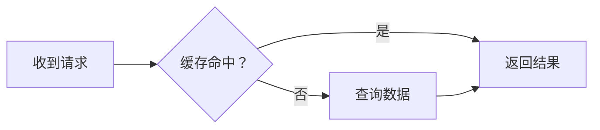

# 博客文章写作指南

本文件指导 AI 为本博客撰写、续写和修改文章，适用于 `_posts/` 中的正文、文章元数据及配套内容。以下文风、标题、分段和强调规则只约束文章写作，不用于限制界面设计、程序代码或开发说明。用户当前明确要求优先；不要为了执行本指南批量改写旧文章。

## 写作流程

1. 先读用户提供的材料、相关旧文和同系列上下文，确认文章要解决的问题、目标读者、已有知识及结论。涉及版本、接口、实验数据等事实时查证原始资料，不把旧文视作永远正确的技术依据。
2. 先给出简洁大纲：说明文章主线、少量短标题、各部分要推进的论点，以及适合放图或实验的位置。大纲不能只是主题词罗列，要能看出前后因果和递进。
3. 按大纲逐段生成，每完成一段就检查它承接了什么、解释了什么、为下一段留下什么。不要一次性倾倒整篇，再靠增加小标题掩盖结构问题。默认可以连续推进，不必逐段请求确认；用户要求先审大纲或逐段确认时再遵循该节奏。
4. 完稿后至少完整通读三轮并实际修改：第一轮核查事实、代码、推导和论证缺口；第二轮检查前后照应、术语一致和段落衔接，合并重复或碎片内容；第三轮检查语言、标点、格式、图文配合和实际页面。不能用一句“已检查”代替这些修订。
5. 交付时说明文章文件、仍待用户手绘的插图和未能验证的事实或演示。区分已验证结果、预计输出和待补材料，不虚构作者经历、实验过程、引用或运行记录。

## 文风与结构

文章应像作者在认真说明自己研究过的问题：从具体疑问、现象或经历进入，给出足够的实例、证据与推导，说明为什么，再落到可用的结论。可以自然使用“我”“我们”，保留适度幽默和判断；不假装用户经历过未经提供的故事，也不把旧文中的口头禅机械复制到每篇文章。

- 标题简短、具体。正文从 `##` 开始，不重复页面已有的文章大标题。只有发生明确论述转折才增加章节；优先少量二级标题，三级标题按需使用，不默认采用四级及更深层级。短文可以没有小标题，不给每个概念、每段话各设一个标题。
- 以连贯自然段为主体。一段围绕一个完整意思展开，可以包含问题、原因、例子和结果；不要一句话一段，也不要连续制造独立的“金句”段。真正的场景切换或强调可以偶尔独立成段，但不能成为全文常态。
- 避免为追求精简省略必要解释，也避免把几个不相关的意思塞入长段。段落之间通过内容衔接，不靠反复写“首先”“其次”“值得注意的是”“总而言之”。
- 不给普通概念、比喻和判断大量加引号。引号主要用于真实引语、对话及确有必要的特殊用法；不堆叠破折号、感叹号、反问句或“不是……而是……”句式制造语气。
- 关键概念用 `***加粗斜体***`，关键语句用 `*斜体*`。文章叙述中不得仅用 `**加粗**` 或 `<strong>` 强调，也不要整段反复强调。代码、忠实引用和插件自动生成的 HTML 不需要为了这一规则篡改。
- 列表用于并列条件、真实步骤和短枚举，表格用于同维度比较或参数对照；适量使用，不能把完整论证拆成要点清单。避免嵌套过深的列表和在手机上难读的大表格。
- 代码标识符、命令、路径和精确配置值使用行内代码。中文与英文、数字之间自然留空格，中文叙述使用中文标点；不要修改代码和 URL 内部的字符。
- 技术文强调复现条件、输入输出及边界。随笔强调具体场景、感受和有根据的判断，不硬套“背景—问题—方案—总结”的技术模板。结尾应完成前文的问题，不机械重复整篇摘要或拔高意义。

旧文提供语气与论证方式的参考，不是逐字模仿模板。本指南参考了以下样本；其中旧文的长标题、纯粗体或密集短段与新要求冲突时，以本指南为准。

| 样本 | 值得参考的部分 |
| --- | --- |
| `_posts/2025-07-12-IO模型.md` | 从并发问题引入接口，再结合源码、流程图和资料分析机制 |
| `_posts/2024-08-01-PDB入门.md` | 短教程直接进入使用情境，不为篇幅少的内容堆标题 |
| `_posts/2024-11-11-Python的import陷阱.md` | 用同一组示例逐步改变条件，让报错推动解释 |
| `_posts/2025-12-16-AI编程实践.md` | 从具体项目经验讨论取舍，用代码、截图与 issue 支撑判断 |
| `_posts/2025-10-22-弹簧摆.md` | 演示、示意图、公式与数值实现相互对应 |
| `_posts/2026-07-03-毕业典礼随想.md` | 从生活细节表达感受；不要模仿其大量独立短段 |
| `_posts/2025-06-13-AI时代的爱情.md` | 场景、人物和贯穿全文的意象；虚构叙事只在用户需要时采用 |

## 文件与元数据

文章采用 Jekyll、Liquid、Kramdown（GFM）与 Rouge。文件放在 `_posts/YYYY-MM-DD-短文件名.md`，正文前写 YAML front matter。已有文章的文件名决定 `/post/:title/` 地址，不能为了修改显示标题随意重命名。

```yaml
---
layout: post
title: "短而具体的标题"
date: 2026-09-27 00:00:00 +0800
categories: 编程
tags: python debugging
summary: "用一两句话说明具体问题和本文能解释什么，不复述目录。"
---
```

日期、分类和标签按实际内容填写，示例日期不能直接当作默认值。保持完整日期与时区，页面会自行仅显示年月。分类采用一个合适的现有分类；标签可以空格分隔，带空格的单个标签用 YAML 数组。YAML 注释使用 `#`，不要照抄 README 示例中的 `//` 说明。

按需添加字段：

| 字段 | 用法 |
| --- | --- |
| `series`、`series_index` | 系列名与数字序号，沿用已有名称，先检查重复或缺号 |
| `draft: true` | 标记未完成稿件；它是本站展示逻辑使用的字段，不是访问控制，不要据此认为内容绝不会被构建或公开 |
| `archived: true` | 归档文章，首页和画廊等会过滤它；不要把归档当成草稿 |
| `comments: false` | 关闭该篇评论区 |
| `copyrights: original` | 原创版权声明；不要将他人内容标为原创 |
| `experiment: true` / `false` | 手动纳入或排除实验识别；`result`（含静态输出）、`code_runner`、`code_runner_empty`、`iframe` 默认自动添加“实验”标签 |

不要手填生成字段 `cover_image`、`has_experiment` 或 `uses_*`。封面由 `_plugins/post_covers.rb` 查找 `assets/post/covers/文章文件名去掉.md.webp`；同系列复用封面，缺失时使用存在的 `default.webp`。不要自行生成、变换或补画封面图片。

## 插图与公式

在大纲阶段主动考虑图示：流程、调用关系、状态变化适合 Mermaid；结构、场景、直观比喻和复杂示意适合用户手绘。每张图都应解决一个文字难以说清的问题，并在相邻段落中解释如何读它，不把插图当作装饰配额。

Mermaid 直接使用带 `mermaid` 语言的代码围栏，按当前站点主题渲染，不额外引入脚本或自行固定背景色：

````markdown

````

普通插图只给用户明确绘制说明，不调用图像生成工具，不生成额外图片文件。说明包括位置、要解释的关系、主体与布局、箭头或标注、建议图注；不要只写“此处放一张示意图”。可在草稿对应位置留下 HTML 注释，并在交付消息中汇总：

```html
<!-- 待手绘：放在解释缓存未命中的段落后。左侧请求，中间缓存，右侧数据库；
用两条路径比较命中与未命中，标注额外一次查询。图注：缓存命中与回源路径。 -->
```

用户提供文件后使用 ``。路径以站点根目录 `/assets/post/images/` 开头，不写本机磁盘路径，不引用尚不存在的图片造成破图。复用原图和透明底色，不擅自添加底板、压缩版本或衍生图。

公式沿用本站已有语法：行内 `$$x^2$$`，独立公式则把 `$$` 放在单独两行，内部使用 LaTeX；多步推导可用 `aligned`。定义符号、单位和假设后再使用，图中标注、代码变量与公式保持对应。Mermaid 和 MathJax 由站点按内容自动加载。

## 插件速查

先选择最简单的合适表达：普通代码围栏和 Markdown 表格已自动增强，不需要编造 `` 或 `` 标签。代码块标明语言，程序输出使用 `plaintext`。可折叠的长代码使用 `<details><summary>短说明</summary><div markdown="1">`，正文前后留空行，并闭合 `</div></details>`。

以下语法以 `_plugins/` 实现为准。完整示例在 `_test/2000-01-02-plugin test.md`，基本排版在 `_test/2000-01-01-style test.md`，代码语言示例在 `_test/2000-01-03-highlight test.md`。测试文档里可能存在过时说明，遇到差异先读源码，不猜测参数。

### 引用与源码

```liquid




这里由写作者放入经过核实的引用或摘要。



这里由写作者放入实际引用内容。

```

示例 URL 和作者只演示语法，写文章时必须换成真实且相关的来源。`github_code_btn` 生成源码链接，不抓取源码；可选 `path="文件路径"` 和 `lines="L1-L20"` 只调整显示，真实跳转行号要写入 URL 的 `#L1-L20`。`github_issue` 支持 issue/PR 地址，但不会自动抓取正文；引用文字必须自行核对。

`cite` 首项必须是 HTTP(S) URL。显式填写 `title` 和 `favicon` 可减少构建时的网络抓取；当前参数解析不支持值中的空格，标题宜用无空格短名称。事实资料通常用普通链接或脚注 `[^1]` 即可，只有需要呈现原文时才使用引用卡片，不把自己写的说明包装成外部引文。

### 图片与目录

```liquid



/assets/post/images/before.webp | 修改前
/assets/post/images/after.webp | 修改后



- project/
  - src/
    - main.py
  - [FOLDER]tests
  - README.md

```

`image_caption` 用 `|` 分隔路径、可选图注和可选样式类，现有类包括 `image-caption--left`、`image-caption--right`、`image-caption--full`。`image_grid` 每行一张现有图片，主要通过 `cols` 控制列数。`file_structure` 每层缩进两个空格；尾部 `/`、子节点或 `[FOLDER]` 表示目录，`[FILE]` 可显式标记文件。

### 演示与输出

`result` 适合并排呈现源码和结果：HTML 模式至少一个 `html` 围栏，另可加 `css`、`javascript`（或 `js`）围栏。最后一个围栏为 `plaintext` 或 `image` 时切换成静态结果模式，前面必须仍有至少一个源码围栏；`image` 围栏每行填写一张已存在的图片 URL。

````liquid

```python
print(sum(range(1, 101)))
```

```plaintext
5050
```



```python
print(sum(range(1, 101)))
```

````

`result` 可选 `split=60`（源码占比）、`layout=vertical`（上下布局）、`hide=code` 或 `hide=preview`（初始隐藏对应面板）；这些都不代表在构建时执行 Python 等源代码。静态输出要实际验证，不能把模型推算结果伪装成运行记录。

`code_runner` 提供可编辑运行示例，空编辑器用 ``，不要使用空的 block。围栏使用 `python`、`javascript`、`cpp` 等站点支持的语言名；C++ 用 `cpp`，避免依赖解析器对 `c++` 的支持。Python/JavaScript 在浏览器运行，其余支持语言依赖外部运行服务；不能要求读者往公开演示中输入密钥或私人数据。

已有的独立演示用 ``，资源放在 `assets/post/iframes/示例目录/`，插件选用该目录下第一个 HTML 文件。可选 `hide_header=true`、`is_embedded=true`，额外 `key=value` 会作为查询参数传入；参数不要带空格。只有简单效果时不必新建一个独立项目。

`website` 是独立网页文章的 front matter 字段，不是 Liquid 标签。例如 `website: standalone-demo` 对应 `assets/post/websites/standalone-demo/`；也支持外部 HTTP(S) 地址。使用前阅读 `_plugins/website.rb` 与 `_test/2000-01-04-website test.md`，构建项目还需遵循其实际配置。即使正文由独立网页呈现，也要为 Markdown 保留有意义的文本，它仍用于 RSS 和搜索。

RSS 无法运行网页交互：本站会保留代码、表格和静态结果，并为交互演示或图表提供原文入口。因此实验附近仍需写清观察方法、核心现象与结论，不能让正文只剩一句“见演示”。

## 完稿验收

修改文章后运行 `bundle exec jekyll build` 检查 Liquid、YAML 和资源生成；涉及图、公式、表格、折叠块或演示时，用 `bundle exec jekyll serve` 实际访问该篇文章。已有可用服务时优先复用，端口占用时选择空闲端口，不随意中止其它服务。

检查桌面与窄屏、亮色与暗色下的图文和长代码，实际点击相关演示和链接，确认公式、Mermaid、脚注与目录定位正常。测试文章 `_test/` 默认不发布，不能把写入 `_test/` 视为已经预览成功。构建通过也不等于交互已验证；不能运行的内容在交付中明确说明。

最终确认标题数量克制、段落连贯、强调符合规范、配图说明可执行、路径无缺失、示例可复现、引用可追溯，且新内容没有替用户编造经历或结论。未获用户要求时，不发布、提交或推送文章。
