本文整理了mermaid的各种常用用法。

<!-- more -->

**目录**

[TOC]

 

# Flowcharts - Basic Syntax


## Graph

This statement declares the direction of the Flowchart.

This declares the graph is oriented from top to bottom (`TD` or `TB`).

```
graph TD
    Start --> Stop
```

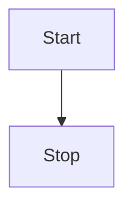

This declares the graph is oriented from left to right (`LR`).

```
graph LR
    Start --> Stop
```

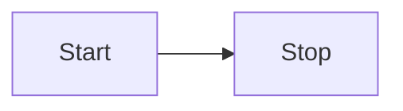

## Flowchart Orientation

Possible FlowChart orientations are:

- TB - top to bottom
- TD - top-down/ same as top to bottom
- BT - bottom to top
- RL - right to left
- LR - left to right

## Flowcharts

This renders a flowchart that allows for features such as: more arrow types, multi directional arrows, and linking to and from subgraphs.

Apart from the graph type, the syntax is the same. This is currently experimental but when the beta period is over, both the graph and flowchart keywords will render in the new way. This means it is ok to start beta testing flowcharts.

An important note on Flowchart nodes, do not type the word "end" as a Flowchart node. Capitalize all or any one the letters to keep the flowchart from breaking, i.e, "End" or "END". Or you can apply this

## Nodes & shapes

### A node (default)

```
graph LR
    id
```

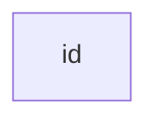

Note that the id is what is displayed in the box.

### A node with text

It is also possible to set text in the box that differs from the id. If this is done several times, it is the last text found for the node that will be used. Also if you define edges for the node later on, you can omit text definitions. The one previously defined will be used when rendering the box.

```
graph LR
    id1[This is the text in the box]
```

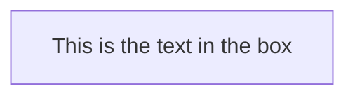

## Node Shapes

### A node with round edges

```
graph LR
    id1(This is the text in the box)
```
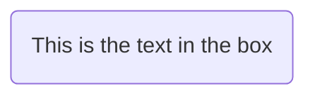


### A node in the form of a circle

```
graph LR
    id1((This is the text in the circle))
```

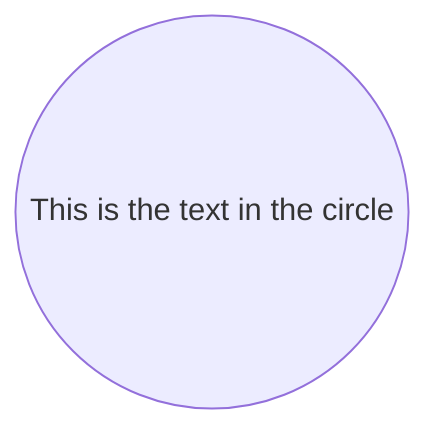

### A node in an asymetric shape

```
graph LR
    id1>This is the text in the box]
```

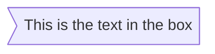

Currently only the shape above is possible and not its mirror. *This might change with future releases.*

### A node (rhombus)

```
graph LR
    id1{This is the text in the box}
```

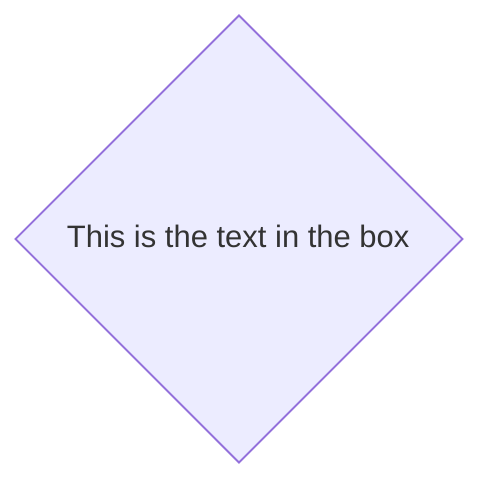

### A hexagon node

```
graph LR
    id1{ {This is the text in the box} }
```

```mermaid
graph LR
    id1{ {This is the text in the box} }
```

### Parallelogram

```
graph TD
    id1[/This is the text in the box/]
```

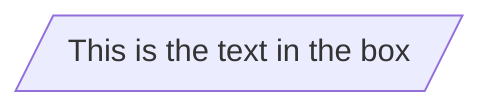

### Parallelogram alt

```
graph TD
    id1[\This is the text in the box\]
```

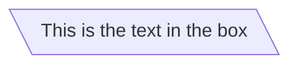

### Trapezoid

```
graph TD
    A[/Christmas\]
```

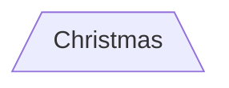

### Trapezoid alt

```
graph TD
    B[\Go shopping/]
```

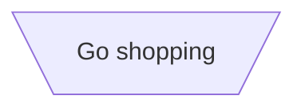

## Links between nodes

Nodes can be connected with links/edges. It is possible to have different types of links or attach a text string to a link.

### A link with arrow head

```
graph LR
    A-->B
```


### An open link

```
graph LR
    A --- B
```

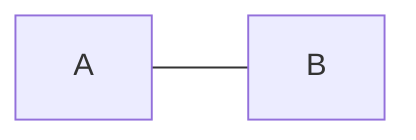

### Text on links

```
graph LR
    A-- This is the text! ---B
```

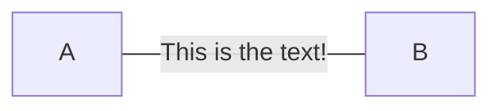

or

```
graph LR
    A---|This is the text|B
```

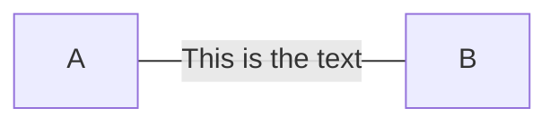

### A link with arrow head and text

```
graph LR
    A-->|text|B
```

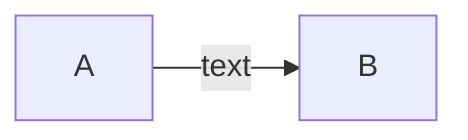

or

```
graph LR
    A-- text -->B
```


### Dotted link

```
graph LR;
   A-.->B;
```

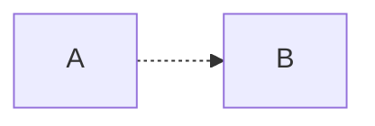

### Dotted link with text

```
graph LR
   A-. text .-> B
```

```mermaid
graph LR
   A-. text .-> B
```

### Thick link

```
graph LR
   A ==> B
```

```mermaid
graph LR
   A ==> B
```

### Thick link with text

```
graph LR
   A == text ==> B
```

```mermaid
graph LR
   A == text ==> B
```

### Chaining of links

It is possible declare many links in the same line as per below:

```
graph LR
   A -- text --> B -- text2 --> C
```

```mermaid
graph LR
   A -- text --> B -- text2 --> C
```


```
graph TB
    A --> C
    A --> D
    B --> C
    B --> D
```
```mermaid
graph TB
    A --> C
    A --> D
    B --> C
    B --> D
```

## Special characters that break syntax

It is possible to put text within quotes in order to render more troublesome characters. As in the example below:

```
graph LR
    id1["This is the (text) in the box"]
```

```mermaid
graph LR
    id1["This is the (text) in the box"]
```

### Entity codes to escape characters

It is possible to escape characters using the syntax examplified here.

```
    graph LR
        A["A double quote:#quot;"] -->B["A dec char:#9829;"]
```

```mermaid
    graph LR
        A["A double quote:#quot;"] -->B["A dec char:#9829;"]
```

## Subgraphs

```
subgraph title
    graph definition
end
```
An example below:

```
graph TB
    c1-->a2
    subgraph one
    a1-->a2
    end
    subgraph two
    b1-->b2
    end
    subgraph three
    c1-->c2
    end
```

```mermaid
graph TB
    c1-->a2
    subgraph one
    a1-->a2
    end
    subgraph two
    b1-->b2
    end
    subgraph three
    c1-->c2
    end
```

You can also set an excplicit id for the subgraph.

```
graph TB
    c1-->a2
    subgraph ide1 [one]
    a1-->a2
    end
```

```mermaid
graph TB
    c1-->a2
    subgraph ide1 [one]
    a1-->a2
    end
```

## Interaction

It is possible to bind a click event to a node, the click can lead to either a javascript callback or to a link which will be opened in a new browser tab. **Note**: This functionality is disabled when using `securityLevel='strict'` and enabled when using `securityLevel='loose'`.

```
click nodeId callback
```

- nodeId is the id of the node
- callback is the name of a javascript function defined on the page displaying the graph, the function will be called with the nodeId as parameter.

Examples of tooltip usage below:

```
<script>
  var callback = function(){
      alert('A callback was triggered');
  }
</script>
graph LR;
    A-->B;
    click A callback "Tooltip for a callback"
    click B "http://www.github.com" "This is a tooltip for a link"
```

<script>
  var callback = function(){
      alert('A callback was triggered');
  }
</script>
```mermaid
graph LR;
    A-->B;
    click A callback "Tooltip for a callback"
    click B "http://www.github.com" "This is a tooltip for a link"
```

The tooltip text is surrounded in double quotes. The styles of the tooltip are set by the class .mermaidTooltip.


> **Success** The tooltip functionality and the ability to link to urls are available from version 0.5.2.

Due to limitations with how Docsify handles JavaScript callback functions, an alternate working demo for the above code can be viewed at [this jsfiddle](https://jsfiddle.net/s37cjoau/3/).

Beginners tip, a full example using interactive links in a html context:

```
<body>
  <div class="mermaid">
    graph LR;
        A-->B;
        click A callback "Tooltip"
        click B "http://www.github.com" "This is a link"
  </div>

  <script>
    var callback = function(){
        alert('A callback was triggered');
    }
    var config = {
        startOnLoad:true,
        flowchart:{
            useMaxWidth:true,
            htmlLabels:true,
            curve:'cardinal',
        },
        securityLevel:'loose',
    };

    mermaid.initialize(config);
  </script>
</body>
```

### Comments

Comments can be entered within a flow diagram, which will be ignored by the parser. Comments need to be on their own line, and must be prefaced with `%%` (double percent signs). Any text after the start of the comment to the next newline will be treated as a comment, including any flow syntax

```
graph LR
%% this is a comment A -- text --> B{node}
   A -- text --> B -- text2 --> C
```

```mermaid
graph LR
%% this is a comment A -- text --> B{node}
   A -- text --> B -- text2 --> C
```

## Styling and classes

### Styling links

It is possible to style links. For instance you might want to style a link that is going backwards in the flow. As links have no ids in the same way as nodes, some other way of deciding what style the links should be attached to is required. Instead of ids, the order number of when the link was defined in the graph is used. In the example below the style defined in the linkStyle statement will belong to the fourth link in the graph:

```
linkStyle 3 stroke:#ff3,stroke-width:4px,color:red;
```


### Styling a node

It is possible to apply specific styles such as a thicker border or a different background color to a node.

```
graph LR
    id1(Start)-->id2(Stop)
    style id1 fill:#f9f,stroke:#333,stroke-width:4px
    style id2 fill:#bbf,stroke:#f66,stroke-width:2px,color:#fff,stroke-dasharray: 5, 5
```

```mermaid
graph LR
    id1(Start)-->id2(Stop)
    style id1 fill:#f9f,stroke:#333,stroke-width:4px
    style id2 fill:#bbf,stroke:#f66,stroke-width:2px,color:#fff,stroke-dasharray: 5, 5
```

#### Classes

More convenient then defining the style every time is to define a class of styles and attach this class to the nodes that should have a different look.

a class definition looks like the example below:

```
    classDef className fill:#f9f,stroke:#333,stroke-width:4px;
```

Attachment of a class to a node is done as per below:

```
    class nodeId1 className;
```

It is also possible to attach a class to a list of nodes in one statement:

```
    class nodeId1,nodeId2 className;
```

A shorter form of adding a class is to attach the classname to the node using the `:::`operator as per below:

```
graph LR
    A:::someclass --> B
    classDef someclass fill:#f96;
```
```mermaid
graph LR
    A:::someclass --> B
    classDef someclass fill:#f96;
```

### Css classes

It is also possible to predefine classes in css styles that can be applied from the graph definition as in the example below:

**Example style**

```html
<style>
    .cssClass > rect{
        fill:#FF0000;
        stroke:#FFFF00;
        stroke-width:4px;
    }
</style>
```

**Example definition**

```
graph LR;
    A-->B[AAA<span>BBB</span>];
    B-->D;
    class A cssClass;
```

```mermaid
graph LR;
    A-->B[AAA<span>BBB</span>];
    B-->D;
    class A cssClass;
```

### Default class

If a class is named default it will be assigned to all classes without specific class definitions.

```
    classDef default fill:#f9f,stroke:#333,stroke-width:4px;
```

## Basic support for fontawesome

It is possible to add icons from fontawesome.

The icons are acessed via the syntax fa:#icon class name#.

```
graph TD
    B["fa:fa-twitter for peace"]
    B-->C[fa:fa-ban forbidden]
    B-->D(fa:fa-spinner);
    B-->E(A fa:fa-camera-retro perhaps?);
```

```mermaid
graph TD
    B["fa:fa-twitter for peace"]
    B-->C[fa:fa-ban forbidden]
    B-->D(fa:fa-spinner);
    B-->E(A fa:fa-camera-retro perhaps?);
```

## Graph declarations with spaces between vertices and link and without semicolon

- In graph declarations, the statements also can now end without a semicolon. After release 0.2.16, ending a graph statement with semicolon is just optional. So the below graph declaration is also valid along with the old declarations of the graph.
- A single space is allowed between vertices and the link. However there should not be any space between a vertex and its text and a link and its text. The old syntax of graph declaration will also work and hence this new feature is optional and is introduce to improve readability.

Below is the new declaration of the graph edges which is also valid along with the old declaration of the graph edges.

```
graph LR
    A[Hard edge] -->|Link text| B(Round edge)
    B --> C{Decision}
    C -->|One| D[Result one]
    C -->|Two| E[Result two]
```

```mermaid
graph LR
    A[Hard edge] -->|Link text| B(Round edge)
    B --> C{Decision}
    C -->|One| D[Result one]
    C -->|Two| E[Result two]
```

## Configuration

Is it possible to adjust the width of the rendered flowchart.

This is done by defining **mermaid.flowchartConfig** or by the CLI to use a json file with the configuration. How to use the CLI is described in the mermaidCLI page. mermaid.flowchartConfig can be set to a JSON string with config parameters or the corresponding object.

```javascript
mermaid.flowchartConfig = {
    width: 100%
}
```

# Sequence diagrams

> A Sequence diagram is an interaction diagram that shows how processes operate with one another and in what order.

Mermaid can render sequence diagrams.

```
sequenceDiagram
    Alice->>John: Hello John, how are you?
    John-->>Alice: Great!
```

```mermaid
sequenceDiagram
    Alice->>John: Hello John, how are you?
    John-->>Alice: Great!
```

A note on nodes, the word "end" could potentially break the diagram, due to the way that the mermaid language is scripted.

If unavoidable, one must use parentheses(), quotation marks "", or brackets {},[\], to enclose the word "end". i.e : (end), [end], {end}.

## Participants

The participants can be defined implicitly as in the first example on this page. The participants or actors are rendered in order of appearance in the diagram source text. Sometimes you might want to show the participants in a different order than how they appear in the first message. It is possible to specify the actor's order of appearance by doing the following:

```
sequenceDiagram
    participant John
    participant Alice
    Alice->>John: Hello John, how are you?
    John-->>Alice: Great!
```

```mermaid
sequenceDiagram
    participant John
    participant Alice
    Alice->>John: Hello John, how are you?
    John-->>Alice: Great!
```

## Aliases

The actor can have a convenient identifier and a descriptive label.

```
sequenceDiagram
    participant A as Alice
    participant J as John
    A->>J: Hello John, how are you?
    J->>A: Great!
```

```mermaid
sequenceDiagram
    participant A as Alice
    participant J as John
    A->>J: Hello John, how are you?
    J->>A: Great!
```

## Messages

Messages can be of two displayed either solid or with a dotted line.

```
[Actor][Arrow][Actor]:Message text
```

There are six types of arrows currently supported:

| Type | Description                                 |
| ---- | ------------------------------------------- |
| ->   | Solid line without arrow                    |
| -->  | Dotted line without arrow                   |
| ->>  | Solid line with arrowhead                   |
| -->> | Dotted line with arrowhead                  |
| -x   | Solid line with a cross at the end (async)  |
| --x  | Dotted line with a cross at the end (async) |

## Activations

It is possible to activate and deactivate an actor. (de)activation can be dedicated declarations:

```
sequenceDiagram
    Alice->>John: Hello John, how are you?
    activate John
    John-->>Alice: Great!
    deactivate John
```

```mermaid
sequenceDiagram
    Alice->>John: Hello John, how are you?
    activate John
    John-->>Alice: Great!
    deactivate John
```

There is also a shortcut notation by appending `+`/`-` suffix to the message arrow:

```
sequenceDiagram
    Alice->>+John: Hello John, how are you?
    John-->>-Alice: Great!
```

```mermaid
sequenceDiagram
    Alice->>+John: Hello John, how are you?
    John-->>-Alice: Great!
```

Activations can be stacked for same actor:

```
sequenceDiagram
    Alice->>+John: Hello John, how are you?
    Alice->>+John: John, can you hear me?
    John-->>-Alice: Hi Alice, I can hear you!
    John-->>-Alice: I feel great!
```

```mermaid
sequenceDiagram
    Alice->>+John: Hello John, how are you?
    Alice->>+John: John, can you hear me?
    John-->>-Alice: Hi Alice, I can hear you!
    John-->>-Alice: I feel great!
```

## Notes

It is possible to add notes to a sequence diagram. This is done by the notation Note [ right of | left of | over ] [Actor]: Text in note content

See the example below:

```
sequenceDiagram
    participant John
    Note right of John: Text in note
```

```mermaid
sequenceDiagram
    participant John
    Note right of John: Text in note
```

It is also possible to create notes spanning two participants:

```
sequenceDiagram
    Alice->John: Hello John, how are you?
    Note over Alice,John: A typical interaction
```

```mermaid
sequenceDiagram
    Alice->John: Hello John, how are you?
    Note over Alice,John: A typical interaction
```

## Loops

It is possible to express loops in a sequence diagram. This is done by the notation

```
loop Loop text
... statements ...
end
```

See the example below:

```
sequenceDiagram
    Alice->John: Hello John, how are you?
    loop Every minute
        John-->Alice: Great!
    end
```

```mermaid
sequenceDiagram
    Alice->John: Hello John, how are you?
    loop Every minute
        John-->Alice: Great!
    end
```

## Alt

It is possible to express alternative paths in a sequence diagram. This is done by the notation

```
alt Describing text
... statements ...
else
... statements ...
end
```

or if there is sequence that is optional (if without else).

```
opt Describing text
... statements ...
end
```

See the example below:

```
sequenceDiagram
    Alice->>Bob: Hello Bob, how are you?
    alt is sick
        Bob->>Alice: Not so good :(
    else is well
        Bob->>Alice: Feeling fresh like a daisy
    end
    opt Extra response
        Bob->>Alice: Thanks for asking
    end
```

```mermaid
sequenceDiagram
    Alice->>Bob: Hello Bob, how are you?
    alt is sick
        Bob->>Alice: Not so good :(
    else is well
        Bob->>Alice: Feeling fresh like a daisy
    end
    opt Extra response
        Bob->>Alice: Thanks for asking
    end
```

## Parallel

It is possible to show actions that are happening in parallel.

This is done by the notation

```
par [Action 1]
... statements ...
and [Action 2]
... statements ...
and [Action N]
... statements ...
end
```


## Background Highlighting

It is possible to highlight flows by providing colored background rects. This is done by the notation

The colors are defined using rgb and rgba syntax.

```
rect rgb(0, 255, 0)
... content ...
end
rect rgba(0, 0, 255, .1)
... content ...
end
```


## Comments

Comments can be entered within a sequence diagram, which will be ignored by the parser. Comments need to be on their own line, and must be prefaced with `%%` (double percent signs). Any text after the start of the comment to the next newline will be treated as a comment, including any diagram syntax

```
sequenceDiagram
    Alice->>John: Hello John, how are you?
    %% this is a comment
    John-->>Alice: Great!
```
```mermaid
sequenceDiagram
    Alice->>John: Hello John, how are you?
    %% this is a comment
    John-->>Alice: Great!
```

## sequenceNumbers

It is possible to get a sequence number attached to each arrow in a sequence diagram. This can be configured when adding mermaid to the website as shown below:

```
    <script>
      mermaid.initialize({
        sequence: { showSequenceNumbers: true },
      });
    </script>
```

It can also be be turned on via the diagram code as in the diagram:

```
sequenceDiagram
    autonumber
    Alice->>John: Hello John, how are you?
    loop Healthcheck
        John->>John: Fight against hypochondria
    end
    Note right of John: Rational thoughts!
    John-->>Alice: Great!
    John->>Bob: How about you?
    Bob-->>John: Jolly good!
```

```mermaid
sequenceDiagram
    autonumber
    Alice->>John: Hello John, how are you?
    loop Healthcheck
        John->>John: Fight against hypochondria
    end
    Note right of John: Rational thoughts!
    John-->>Alice: Great!
    John->>Bob: How about you?
    Bob-->>John: Jolly good!
```

## Styling

Styling of a sequence diagram is done by defining a number of css classes. During rendering these classes are extracted from the file located at src/themes/sequence.scss

### Classes used

| Class        | Description                                                 |
| ------------ | ----------------------------------------------------------- |
| actor        | Style for the actor box at the top of the diagram.          |
| text.actor   | Styles for text in the actor box at the top of the diagram. |
| actor-line   | The vertical line for an actor.                             |
| messageLine0 | Styles for the solid message line.                          |
| messageLine1 | Styles for the dotted message line.                         |
| messageText  | Defines styles for the text on the message arrows.          |
| labelBox     | Defines styles label to left in a loop.                     |
| labelText    | Styles for the text in label for loops.                     |
| loopText     | Styles for the text in the loop box.                        |
| loopLine     | Defines styles for the lines in the loop box.               |
| note         | Styles for the note box.                                    |
| noteText     | Styles for the text on in the note boxes.                   |

### Sample stylesheet

```css
body {
    background: white;
}

.actor {
    stroke: #ccccff;
    fill: #ececff;
}
text.actor {
    fill: black;
    stroke: none;
    font-family: Helvetica;
}

.actor-line {
    stroke: grey;
}

.messageLine0 {
    stroke-width: 1.5;
    stroke-dasharray: '2 2';
    marker-end: 'url(#arrowhead)';
    stroke: black;
}

.messageLine1 {
    stroke-width: 1.5;
    stroke-dasharray: '2 2';
    stroke: black;
}

#arrowhead {
    fill: black;
}

.messageText {
    fill: black;
    stroke: none;
    font-family: 'trebuchet ms', verdana, arial;
    font-size: 14px;
}

.labelBox {
    stroke: #ccccff;
    fill: #ececff;
}

.labelText {
    fill: black;
    stroke: none;
    font-family: 'trebuchet ms', verdana, arial;
}

.loopText {
    fill: black;
    stroke: none;
    font-family: 'trebuchet ms', verdana, arial;
}

.loopLine {
    stroke-width: 2;
    stroke-dasharray: '2 2';
    marker-end: 'url(#arrowhead)';
    stroke: #ccccff;
}

.note {
    stroke: #decc93;
    fill: #fff5ad;
}

.noteText {
    fill: black;
    stroke: none;
    font-family: 'trebuchet ms', verdana, arial;
    font-size: 14px;
}
```

## Configuration

Is it possible to adjust the margins for rendering the sequence diagram.

This is done by defining `mermaid.sequenceConfig` or by the CLI to use a json file with the configuration. How to use the CLI is described in the [mermaidCLI](https://mermaid-js.github.io/mermaid/#/mermaidCLI.html) page. `mermaid.sequenceConfig` can be set to a JSON string with config parameters or the corresponding object.

```javascript
mermaid.sequenceConfig = {
    diagramMarginX: 50,
    diagramMarginY: 10,
    boxTextMargin: 5,
    noteMargin: 10,
    messageMargin: 35,
    mirrorActors: true
};
```

### Possible configuration params

| Param             | Description                                                  | Default value                  |
| ----------------- | ------------------------------------------------------------ | ------------------------------ |
| mirrorActors      | Turns on/off the rendering of actors below the diagram as well as above it | false                          |
| bottomMarginAdj   | Adjusts how far down the graph ended. Wide borders styles with css could generate unwanted clipping which is why this config param exists. | 1                              |
| actorFontSize     | Sets the font size for the actor's description               | 14                             |
| actorFontFamily   | Sets the font family for the actor's description             | "Open-Sans", "sans-serif"      |
| actorFontWeight   | Sets the font weight for the actor's description             | "Open-Sans", "sans-serif"      |
| noteFontSize      | Sets the font size for actor-attached notes                  | 14                             |
| noteFontFamily    | Sets the font family for actor-attached notes                | "trebuchet ms", verdana, arial |
| noteFontWeight    | Sets the font weight for actor-attached notes                | "trebuchet ms", verdana, arial |
| noteAlign         | Sets the text alignment for text in actor-attached notes     | center                         |
| messageFontSize   | Sets the font size for actor<->actor messages                | 16                             |
| messageFontFamily | Sets the font family for actor<->actor messages              | "trebuchet ms", verdana, arial |
| messageFontWeight | Sets the font weight for actor<->actor messages              | "trebuchet ms", verdana, arial |

# Class diagrams

> "In software engineering, a class diagram in the Unified Modeling Language (UML) is a type of static structure diagram that describes the structure of a system by showing the system's classes, their attributes, operations (or methods), and the relationships among objects." Wikipedia

The class diagram is the main building block of object-oriented modeling. It is used for general conceptual modeling of the structure of the application, and for detailed modeling translating the models into programming code. Class diagrams can also be used for data modeling. The classes in a class diagram represent both the main elements, interactions in the application, and the classes to be programmed.

Mermaid can render class diagrams.

```
 classDiagram
      Animal <|-- Duck
      Animal <|-- Fish
      Animal <|-- Zebra
      Animal : +int age
      Animal : +String gender
      Animal: +isMammal()
      Animal: +mate()
      class Duck{
          +String beakColor
          +swim()
          +quack()
      }
      class Fish{
          -int sizeInFeet
          -canEat()
      }
      class Zebra{
          +bool is_wild
          +run()
      }
```

```mermaid
 classDiagram
      Animal <|-- Duck
      Animal <|-- Fish
      Animal <|-- Zebra
      Animal : +int age
      Animal : +String gender
      Animal: +isMammal()
      Animal: +mate()
      class Duck{
          +String beakColor
          +swim()
          +quack()
      }
      class Fish{
          -int sizeInFeet
          -canEat()
      }
      class Zebra{
          +bool is_wild
          +run()
      }
```

## Syntax

### Class

UML provides mechanisms to represent class members, such as attributes and methods, and additional information about them. A single instance of a class in the diagram contains three compartments:

- The top compartment contains the name of the class. It is printed in bold and centered, and the first letter is capitalized. It may also contain optional annotation text describing the nature of the class.
- The middle compartment contains the attributes of the class. They are left-aligned and the first letter is lowercase.
- The bottom compartment contains the operations the class can execute. They are also left-aligned and the first letter is lowercase.

```
classDiagram
    class BankAccount
    BankAccount : +String owner
    BankAccount : +Bigdecimal balance
    BankAccount : +deposit(amount)
    BankAccount : +withdrawl(amount)
```


```mermaid
classDiagram
    class BankAccount
    BankAccount : +String owner
    BankAccount : +Bigdecimal balance
    BankAccount : +deposit(amount)
    BankAccount : +withdrawl(amount)
```

## Define a class

There are two ways to define a class:

- Explicitly defining a class using keyword **class** like `class Animal`. This defines the Animal class
- Define two classes via a **relationship** between them `Vehicle <|-- Car`. This defines two classes Vehicle and Car along with their relationship.

```
classDiagram
    class Animal
    Vehicle <|-- Car
```

```mermaid
classDiagram
    class Animal
    Vehicle <|-- Car
```

Naming convention: a class name should be composed of alphanumeric (unicode allowed) and underscore characters.

## Defining Members of a class

UML provides mechanisms to represent class members, such as attributes and methods, and additional information about them.

Mermaid distinguishes between attributes and functions/methods based on if the **parenthesis** `()` are present or not. The ones with `()` are treated as functions/methods, and others as attributes.

There are two ways to define the members of a class, and regardless of whichever syntax is used to define the members, the output will still be same. The two different ways are :

- Associate a member of a class using **:** (colon) followed by member name, useful to define one member at a time. For example:

  ```
  class BankAccount
  BankAccount : +String owner
  BankAccount : +BigDecimal balance
  BankAccount : +deposit(amount)
  BankAccount : +withdrawal(amount)
  ```

  ```mermaid
  classDiagram
  class BankAccount
  BankAccount : +String owner
  BankAccount : +BigDecimal balance
  BankAccount : +deposit(amount)
  BankAccount : +withdrawal(amount)
  ```

- Associate members of a class using **{}** brackets, where members are grouped within curly brackets. Suitable for defining multiple members at once. For example:

  ```
  class BankAccount{
    +String owner
    +BigDecimal balance
    +deposit(amount) bool
    +withdrawl(amount)
  }
  ```

  ```mermaid
  classDiagram
  class BankAccount{
    +String owner
    +BigDecimal balance
    +deposit(amount) bool
    +withdrawl(amount)
  }
  ```

### Return Type

Optionally you can end the method/function definition with the data type that will be returned (note: there must be a space between the final `)` of the method definition and return type example:

```
class BankAccount{
    +String owner
    +BigDecimal balance
    +deposit(amount) bool
    +withdrawl(amount) int
}
```

```mermaid
classDiagram
class BankAccount{
    +String owner
    +BigDecimal balance
    +deposit(amount) bool
    +withdrawl(amount) int
}
```

### Return Type

Optionally you can end the method/function definition with the data type that will be returned

### Visibility

To specify the visibility of a class member (i.e. any attribute or method), these notations may be placed before the member's name, but it is optional:

- `+` Public
- `-` Private
- `#` Protected
- `~` Package/Internal

> *note* you can also include additional *classifers* to a method definition by adding the following notations to the end of the method, i.e.: after the `()`:
>
> - `*` Abstract e.g.: `someAbstractMethod()*`
> - `$` Static e.g.: `someStaticMethod()$`

## Defining Relationship

A relationship is a general term covering the specific types of logical connections found on class and object diagrams.

```
[classA][Arrow][ClassB]:LabelText
```

There are different types of relations defined for classes under UML which are currently supported:

| Type  | Description   |
| ----- | ------------- |
| <\|-- | Inheritance   |
| *--   | Composition   |
| o--   | Aggregation   |
| -->   | Association   |
| --    | Link (Solid)  |
| ..>   | Dependency    |
| ..\|> | Realization   |
| ..    | Link (Dashed) |

```
classDiagram
classA <|-- classB
classC *-- classD
classE o-- classF
classG <-- classH
classI -- classJ
classK <.. classL
classM <|.. classN
classO .. classP
```

```mermaid
classDiagram
classA <|-- classB
classC *-- classD
classE o-- classF
classG <-- classH
classI -- classJ
classK <.. classL
classM <|.. classN
classO .. classP
```

We can use the labels to describe nature of relation between two classes. Also, arrowheads can be used in opposite directions as well :

```
classDiagram
classA --|> classB : Inheritance
classC --* classD : Composition
classE --o classF : Aggregation
classG --> classH : Association
classI -- classJ : Link(Solid)
classK ..> classL : Dependency
classM ..|> classN : Realization
classO .. classP : Link(Dashed)
```

```mermaid
classDiagram
classA --|> classB : Inheritance
classC --* classD : Composition
classE --o classF : Aggregation
classG --> classH : Association
classI -- classJ : Link(Solid)
classK ..> classL : Dependency
classM ..|> classN : Realization
classO .. classP : Link(Dashed)
```

## Labels on Relations

It is possible to add a label text to a relation:

```
[classA][Arrow][ClassB]:LabelText
classDiagram
classA <|-- classB : implements
classC *-- classD : composition
classE o-- classF : association
```

```mermaid
classDiagram
classA <|-- classB : implements
classC *-- classD : composition
classE o-- classF : association
```

## Cardinality / Multiplicity on relations

Multiplicity or cardinality in class diagrams indicates the number of instances of one class linked to one instance of the other class. For example, one company will have one or more employees, but each employee works for just one company.

Multiplicity notations are placed near the ends of an association.

The different cardinality options are :

- `0..1` Zero or one
- `1` Only 1
- `0..1` Zero or One
- `1..*` One or more
- `*` Many
- `n` n {where n>1}
- `0..n` zero to n {where n>1}
- `1..n` one to n {where n>1}

Cardinality can be easily defined by placing cardinality text within qoutes `"` before(optional) and after(optional) a given arrow.

```
[classA] "cardinality1" [Arrow] "cardinality2" [ClassB]:LabelText
classDiagram
    Customer "1" --> "*" Ticket
    Student "1" --> "1..*" Course
    Galaxy --> "many" Star : Contains
```

```mermaid
classDiagram
    Customer "1" --> "*" Ticket
    Student "1" --> "1..*" Course
    Galaxy --> "many" Star : Contains
```

## Annotations on classes

It is possible to annotate classes with a specific marker text which is like meta-data for the class, giving a clear indication about its nature. Some common annotations examples could be:

- `<<Interface>>` To represent an Interface class
- `<<abstract>>` To represent an abstract class
- `<<Service>>` To represent a service class
- `<<enumeration>>` To represent an enum

Annotations are defined within the opening `<<` and closing `>>`. There are two ways to add an annotation to a class and regardless of the syntax used output will be same. The two ways are :

- In a

   

  *separate line*

   

  after a class is defined. For example:

  ```
  classDiagram
  class Shape
  <<interface>> Shape
  ```

  ```mermaid
  classDiagram
  class Shape
  <<interface>> Shape
  ```

- In a ***nested structure\*** along with class definition. For example:

```
classDiagram
class Shape{
    <<interface>>
    noOfVertices
    draw()
}
class Color{
    <<enumeration>>
    RED
    BLUE
    GREEN
    WHITE
    BLACK
}
```

```mermaid
classDiagram
class Shape{
    <<interface>>
    noOfVertices
    draw()
}
class Color{
    <<enumeration>>
    RED
    BLUE
    GREEN
    WHITE
    BLACK
}
```

## Comments

Comments can be entered within a class diagram, which will be ignored by the parser. Comments need to be on their own line, and must be prefaced with `%%` (double percent signs). Any text after the start of the comment to the next newline will be treated as a comment, including any class diagram syntax

```
classDiagram
%% This whole line is a comment classDiagram class Shape <<interface>>
class Shape{
    <<interface>>
    noOfVertices
    draw()
}
```

```mermaid
classDiagram
class Shape{
    <<interface>>
    noOfVertices
    draw()
}
```

## Interaction

It is possible to bind a click event to a node, the click can lead to either a javascript callback or to a link which will be opened in a new browser tab. **Note**: This functionality is disabled when using `securityLevel='strict'` and enabled when using `securityLevel='loose'`.

You would define these actions on a separate line after all classes have been declared.

```
action className "reference" "tooltip"
```

- *action* is either `link` or `callback`, depending on which type of interaction you want to have called
- *className* is the id of the node that the action will be associated with
- *reference* is either the url link, or the function name for callback. (note: callback function will be called with the nodeId as parameter).
- (*optional*) tooltip is a string to be displayed when hovering over element (note: The styles of the tooltip are set by the class .mermaidTooltip.)

## Styling

Styling of the class diagram is done by defining a number of css classes. During rendering these classes are extracted from the file located at src/themes/class.scss

### Styling Classes used

| Class              | Description                                                  |
| ------------------ | ------------------------------------------------------------ |
| g.classGroup text  | Styles for general class text                                |
| classGroup .title  | Styles for general class title                               |
| g.classGroup rect  | Styles for class diagram rectangle                           |
| g.classGroup line  | Styles for class diagram line                                |
| .classLabel .box   | Styles for class label box                                   |
| .classLabel .label | Styles for class label text                                  |
| composition        | Styles for componsition arrow head and arrow line            |
| aggregation        | Styles for aggregation arrow head and arrow line(dashed or solid) |
| dependency         | Styles for dependency arrow head and arrow line              |

### Sample stylesheet

```css
body {
    background: white;
}

g.classGroup text {
  fill: $nodeBorder;
  stroke: none;
  font-family: 'trebuchet ms', verdana, arial;
  font-family: var(--mermaid-font-family);
  font-size: 10px;

  .title {
    font-weight: bolder;
  }
}

g.classGroup rect {
  fill: $nodeBkg;
  stroke: $nodeBorder;
}

g.classGroup line {
  stroke: $nodeBorder;
  stroke-width: 1;
}

.classLabel .box {
  stroke: none;
  stroke-width: 0;
  fill: $nodeBkg;
  opacity: 0.5;
}

.classLabel .label {
  fill: $nodeBorder;
  font-size: 10px;
}

.relation {
  stroke: $nodeBorder;
  stroke-width: 1;
  fill: none;
}

@mixin composition {
  fill: $nodeBorder;
  stroke: $nodeBorder;
  stroke-width: 1;
}

#compositionStart {
  @include composition;
}

#compositionEnd {
  @include composition;
}

@mixin aggregation {
  fill: $nodeBkg;
  stroke: $nodeBorder;
  stroke-width: 1;
}

#aggregationStart {
  @include aggregation;
}

#aggregationEnd {
  @include aggregation;
}

#dependencyStart {
  @include composition;
}

#dependencyEnd {
  @include composition;
}

#extensionStart {
  @include composition;
}

#extensionEnd {
  @include composition;
}
```

# State diagrams

> "A state diagram is a type of diagram used in computer science and related fields to describe the behavior of systems. State diagrams require that the system described is composed of a finite number of states; sometimes, this is indeed the case, while at other times this is a reasonable abstraction." Wikipedia

Mermaid can render state diagrams. The syntax tries to be compliant with the syntax used in plantUml as this will make it easier for users to share diagrams between mermaid and plantUml.

```markdown
stateDiagram-v2
    [*] --> Still
    Still --> [*]

    Still --> Moving
    Moving --> Still
    Moving --> Crash
    Crash --> [*]
```

```mermaid
stateDiagram-v2
    [*] --> Still
    Still --> [*]

    Still --> Moving
    Moving --> Still
    Moving --> Crash
    Crash --> [*]
```


In state diagrams systems are described in terms of its states and how the systems state can change to another state via a transitions. The example diagram above shows three states **Still**, **Moving** and **Crash**. You start in the state of Still. From Still you can change the state to Moving. In Moving you can change the state either back to Still or to Crash. There is no transition from Still to Crash.

## States

A state can be declared in multiple ways. The simplest way is to define a state id as a description.

```markdown
stateDiagram-v2
    s1
```

```mermaid
stateDiagram-v2
    s1
```

Another way is by using the state keyword with a description as per below:

```markdown
stateDiagram-v2
    state "This is a state description" as s2
```

```mermaid
stateDiagram-v2
    state "This is a state description" as s2
```

Another way to define a state with a description is to define the state id followed by a colon and the description:

```markdown
stateDiagram-v2
    s2 : This is a state description
```

```mermaid
stateDiagram-v2
    s2 : This is a state description
```

## Transitions

Transitions are path/edges when one state passes into another. This is represented using text arrow, "-->".

When you define a transition between two states and the states are not already defined the undefined states are defined with the id from the transition. You can later add descriptions to states defined this way.

```markdown
stateDiagram-v2
    s1 --> s2
```

```mermaid
stateDiagram-v2
    s1 --> s2
```

It is possible to add text to a transition. To describe what it represents.

```markdown
stateDiagram-v2
    s1 --> s2: A transition
```

```mermaid
stateDiagram-v2
    s1 --> s2: A transition
```

## Start and End

There are two special states indicating the start and stop of the diagram. These are written with the [*] syntax and the direction of the transition to it defines it either as a start or a stop state.

```markdown
stateDiagram-v2
    [*] --> s1
    s1 --> [*]
```

```mermaid
stateDiagram-v2
    [*] --> s1
    s1 --> [*]
```

## Composite states

In a real world use of state diagrams you often end up with diagrams that are multi-dimensional as one state can have several internal states. These are called composite states in this terminology.

In order to define a composite state you need to use the state keyword followed by and id and the body of the composite state between {}. See the example below:

```markdown
stateDiagram-v2
    [*] --> First
    state First {
        [*] --> second
        second --> [*]
    }
```

```mermaid
stateDiagram-v2
    [*] --> First
    state First {
        [*] --> second
        second --> [*]
    }
```

You can do this in several layers:

```markdown
stateDiagram-v2
    [*] --> First

    state First {
        [*] --> Second

        state Second {
            [*] --> second
            second --> Third

            state Third {
                [*] --> third
                third --> [*]
            }
        }
    }
```

```mermaid
stateDiagram-v2
    [*] --> First

    state First {
        [*] --> Second

        state Second {
            [*] --> second
            second --> Third

            state Third {
                [*] --> third
                third --> [*]
            }
        }
    }
```

You can also define transitions also between composite states:

```markdown
stateDiagram-v2
    [*] --> First
    First --> Second
    First --> Third

    state First {
        [*] --> fir
        fir --> [*]
    }
    state Second {
        [*] --> sec
        sec --> [*]
    }
    state Third {
        [*] --> thi
        thi --> [*]
    }
```

```mermaid
stateDiagram-v2
    [*] --> First
    First --> Second
    First --> Third

    state First {
        [*] --> fir
        fir --> [*]
    }
    state Second {
        [*] --> sec
        sec --> [*]
    }
    state Third {
        [*] --> thi
        thi --> [*]
    }
```

*You can not define transitions between internal states belonging to different composite states*

## Forks

It is possible to specify a fork in the diagram using <<fork>> <<join>>.

```markdown
   stateDiagram-v2
    state fork_state <<fork>>
      [*] --> fork_state
      fork_state --> State2
      fork_state --> State3

      state join_state <<join>>
      State2 --> join_state
      State3 --> join_state
      join_state --> State4
      State4 --> [*]
```

```mermaid
   stateDiagram-v2
    state fork_state <<fork>>
      [*] --> fork_state
      fork_state --> State2
      fork_state --> State3

      state join_state <<join>>
      State2 --> join_state
      State3 --> join_state
      join_state --> State4
      State4 --> [*]
```

## Notes

Sometimes nothing says it better then a Post-it note. That is also the case in state diagrams.

Here you can choose to put the note to the *right of* or to the *left of* a node.

```markdown
    stateDiagram-v2
        State1: The state with a note
        note right of State1
            Important information! You can write
            notes.
        end note
        State1 --> State2
        note left of State2 : This is the note to the left.
```

The state with a noteImportant information! You can write
```mermaid
    stateDiagram-v2
        State1: The state with a note
        note right of State1
            Important information! You can write
            notes.
        end note
        State1 --> State2
        note left of State2 : This is the note to the left.
```

## Concurrency

As in plantUml you can specify concurrency using the -- symbol.

```markdown
    stateDiagram-v2
        [*] --> Active

        state Active {
            [*] --> NumLockOff
            NumLockOff --> NumLockOn : EvNumLockPressed
            NumLockOn --> NumLockOff : EvNumLockPressed
            --
            [*] --> CapsLockOff
            CapsLockOff --> CapsLockOn : EvCapsLockPressed
            CapsLockOn --> CapsLockOff : EvCapsLockPressed
            --
            [*] --> ScrollLockOff
            ScrollLockOff --> ScrollLockOn : EvCapsLockPressed
            ScrollLockOn --> ScrollLockOff : EvCapsLockPressed
        }
```

```mermaid
    stateDiagram-v2
        [*] --> Active

        state Active {
            [*] --> NumLockOff
            NumLockOff --> NumLockOn : EvNumLockPressed
            NumLockOn --> NumLockOff : EvNumLockPressed
            --
            [*] --> CapsLockOff
            CapsLockOff --> CapsLockOn : EvCapsLockPressed
            CapsLockOn --> CapsLockOff : EvCapsLockPressed
            --
            [*] --> ScrollLockOff
            ScrollLockOff --> ScrollLockOn : EvCapsLockPressed
            ScrollLockOn --> ScrollLockOff : EvCapsLockPressed
        }
```

## Comments

Comments can be entered within a state diagram chart, which will be ignored by the parser. Comments need to be on their own line, and must be prefaced with `%%` (double percent signs). Any text after the start of the comment to the next newline will be treated as a comment, including any diagram syntax

```
stateDiagram-v2
    [*] --> Still
    Still --> [*]
%% this is a comment
    Still --> Moving
    Moving --> Still %% another comment
    Moving --> Crash
    Crash --> [*]
```
```mermaid
stateDiagram-v2
    [*] --> Still
    Still --> [*]
%% this is a comment
    Still --> Moving
    Moving --> Still %% another comment
    Moving --> Crash
    Crash --> [*]
```

## Styling

Styling of the a state diagram is done by defining a number of css classes. During rendering these classes are extracted from the file located at src/themes/state.scss

# Entity Relationship Diagrams

> An entity–relationship model (or ER model) describes interrelated things of interest in a specific domain of knowledge. A basic ER model is composed of entity types (which classify the things of interest) and specifies relationships that can exist between entities (instances of those entity types). Wikipedia.

Note that practitioners of ER modelling almost always refer to *entity types* simply as *entities*. For example the CUSTOMER entity type would be referred to simply as the CUSTOMER entity. This is so common it would be inadvisable to do anything else, but technically an entity is an abstract *instance* of an entity type, and this is what an ER diagram shows - abstract instances, and the relationships between them. This is why entities are always named using singular nouns.

Mermaid can render ER diagrams

```
erDiagram
    CUSTOMER ||--o{ ORDER : places
    ORDER ||--|{ LINE-ITEM : contains
    CUSTOMER }|..|{ DELIVERY-ADDRESS : uses 
```

```mermaid
erDiagram
    CUSTOMER ||--o{ ORDER : places
    ORDER ||--|{ LINE-ITEM : contains
    CUSTOMER }|..|{ DELIVERY-ADDRESS : uses 
```

Entity names are often capitalised, although there is no accepted standard on this, and it is not required in Mermaid.

Relationships between entities are represented by lines with end markers representing cardinality. Mermaid uses the most popular crow's foot notation. The crow's foot intuitively conveys the possibility of many instances of the entity that it connects to.

## Status

ER diagrams are a new feature in Mermaid and are **experimental**. There are likely to be a few bugs and constraints, and enhancements will be made in due course. Currently you can only define entities and relationships, but not attributes.

## Syntax

### Entities and Relationships

Mermaid syntax for ER diagrams is compatible with PlantUML, with an extension to label the relationship. Each statement consists of the following parts, all of which are mandatory:

```
    <first-entity> <relationship> <second-entity> : <relationship-label>
```

Where:

- `first-entity` is the name of an entity. Names must begin with an alphabetic character and may also contain digits and hyphens
- `relationship` describes the way that both entities inter-relate. See below.
- `second-entity` is the name of the other entity
- `relationship-label` describes the relationship from the perspective of the first entity.

For example:

```
    PROPERTY ||--|{ ROOM : contains
```

This statement can be read as *a property contains one or more rooms, and a room is part of one and only one property*. You can see that the label here is from the first entity's perspective: a property contains a room, but a room does not contain a property. When considered from the perspective of the second entity, the equivalent label is usually very easy to infer. (Some ER diagrams label relationships from both perspectives, but this is not supported here, and is usually superfluous).

### Relationship Syntax

The `relationship` part of each statement can be broken down into three sub-components:

- the cardinality of the first entity with respect to the second,
- whether the relationship confers identity on a 'child' entity
- the cardinality of the second entity with respect to the first

Cardinality is a property that describes how many elements of another entity can be related to the entity in question. In the above example a `PROPERTY` can have one or more `ROOM` instances associated to it, whereas a `ROOM` can only be associated with one `PROPERTY`. In each cardinality marker there are two characters. The outermost character represents a maximum value, and the innermost character represents a minimum value. The table below summarises possible cardinalities.

| Value (left) | Value (right) | Meaning                       |
| ------------ | ------------- | ----------------------------- |
| `|o`         | `o|`          | Zero or one                   |
| `||`         | `||`          | Exactly one                   |
| `}o`         | `o{`          | Zero or more (no upper limit) |
| `}|`         | `|{`          | One or more (no upper limit)  |

### Identification

Relationships may be classified as either *identifying* or *non-identifying* and these are rendered with either solid or dashed lines respectively. This is relevant when one of the entities in question can not have independent existence without the other. For example a firm that insures people to drive cars might need to store data on `NAMED-DRIVER`s. In modelling this we might start out by observing that a `CAR` can be driven by many `PERSON` instances, and a `PERSON` can drive many `CAR`s - both entities can exist without the other, so this is a non-identifying relationship that we might specify in Mermaid as: `PERSON }|..|{ CAR : "driver"`. Note the two dots in the middle of the relationship that will result in a dashed line being drawn between the two entities. But when this many-to-many relationship is resolved into two one-to-many relationships, we observe that a `NAMED-DRIVER` cannot exist without both a `PERSON` and a `CAR` - the relationships become identifying and would be specified using hyphens, which translate to a solid line:

```
    CAR ||--o{ NAMED-DRIVER : allows
    PERSON ||--o{ NAMED-DRIVER : is
```

### Other Things

- If you want the relationship label to be more than one word, you must use double quotes around the phrase
- If you don't want a label at all on a relationship, you must use an empty double-quoted string

# User Journey Diagram

> User journeys describe at a high level of detail exactly what steps different users take to complete a specific task within a system, application or website. This technique shows the current (as-is) user workflow, and reveals areas of improvement for the to-be workflow. (Wikipedia)

Mermaid can render user journey diagrams:

```markdown
journey
    title My working day
    section Go to work
      Make tea: 5: Me
      Go upstairs: 3: Me
      Do work: 1: Me, Cat
    section Go home
      Go downstairs: 5: Me
      Sit down: 5: Me
```

```mermaid
journey
    title My working day
    section Go to work
      Make tea: 5: Me
      Go upstairs: 3: Me
      Do work: 1: Me, Cat
    section Go home
      Go downstairs: 5: Me
      Sit down: 5: Me
```

Each user journey is split into sections, these describe the part of the task the user is trying to complete.

Tasks syntax is `Task name: <score>: <comma separated list of actors>`

# Gantt diagrams


> A Gantt chart is a type of bar chart, first developed by Karol Adamiecki in 1896, and independently by Henry Gantt in the 1910s, that illustrates a project schedule and the amount of time it would take for any one project to finish. Gantt charts illustrate number of days between the start and finish dates of the terminal elements and summary elements of a project.

## A note to users

Gantt Charts will record each scheduled task as one continuous bar that extends from the left to the right. The x axis represents time and the y records the different tasks and the order in which they are to be completed.

It is important to remember that when a date, day, or collection of dates specific to a task are "excluded", the Gantt Chart will accomodate those changes by extending an equal number of day, towards the right, not by creating a gap inside the task. As shown here 

However, if the excluded dates are between two tasks that are set to start consecutively, the excluded dates will be skipped graphically and left blank, and the following task will begin after the end of the excluded dates.
As shown here 

A Gantt chart is useful for tracking the amount of time it would take before a project is finished, but it can also be used to graphically represent "non-working days", with a few tweaks.

Mermaid can render Gantt diagrams as SVG, PNG or a MarkDown link that can be pasted into docs.

```
gantt
    title A Gantt Diagram
    dateFormat  YYYY-MM-DD
    section Section
    A task           :a1, 2014-01-01, 30d
    Another task     :after a1  , 20d
    section Another
    Task in sec      :2014-01-12  , 12d
    another task      : 24d
```

```mermaid
gantt
    title A Gantt Diagram
    dateFormat  YYYY-MM-DD
    section Section
    A task           :a1, 2014-01-01, 30d
    Another task     :after a1  , 20d
    section Another
    Task in sec      :2014-01-12  , 12d
    another task      : 24d
```

## Syntax

```
gantt


       dateFormat                :YYYY-MM-DD
       title                     :Adding GANTT diagram functionality to mermaid
       excludes                  :excludes the named dates/days from being included in a charted task.. 
       (Accepts specific dates in YYYY-MM-DD format, days of the week ("sunday") or "weekends", but not the word "weekdays".) 
       section A section
       Completed task            :done,    des1, 2014-01-06,2014-01-08
       Active task               :active,  des2, 2014-01-09, 3d
       Future task               :         des3, after des2, 5d
       Future task2              :         des4, after des3, 5d

       section Critical tasks
       Completed task in the critical line :crit, done, 2014-01-06,24h
       Implement parser and jison          :crit, done, after des1, 2d
       Create tests for parser             :crit, active, 3d
       Future task in critical line        :crit, 5d
       Create tests for renderer           :2d
       Add to mermaid                      :1d

       section Documentation
       Describe gantt syntax               :active, a1, after des1, 3d
       Add gantt diagram to demo page      :after a1  , 20h
       Add another diagram to demo page    :doc1, after a1  , 48h

       section Last section
       Describe gantt syntax               :after doc1, 3d
       Add gantt diagram to demo page      :20h
       Add another diagram to demo page    :48h
```


It is possible to set multiple depenendenies separated by space:

```
    gantt
        apple :a, 2017-07-20, 1w
        banana :crit, b, 2017-07-23, 1d
        cherry :active, c, after b a, 1d
    gantt
        apple :a, 2017-07-20, 1w
        banana :crit, b, 2017-07-23, 1d
        cherry :active, c, after b a, 1d
```

### Title

The `title` is an *optional* string to be displayed at the top of the Gantt chart to describe the chart as a whole.

### Section statements

You can divide the chart into various sections, for example to separate different parts of a project like development and documentation.

To do so, start a line with the `section` keyword and give it a name. (Note that unlike with the [title for the entire chart](https://mermaid-js.github.io/mermaid/#/gantt?id=title), this name is *required*.

## Setting dates

`dateFormat` defines the format of the date **input** of your gantt elements. How these dates are represented in the rendered chart **output** are defined by `axisFormat`.

### Input date format

The default input date format is `YYYY-MM-DD`. You can define your custom `dateFormat`.

```
dateFormat YYYY-MM-DD
```

The following formating options are supported:

```
Input    Example    Description:
YYYY    2014    4 digit year
YY    14    2 digit year
Q    1..4    Quarter of year. Sets month to first month in quarter.
M MM    1..12    Month number
MMM MMMM    January..Dec    Month name in locale set by moment.locale()
D DD    1..31    Day of month
Do    1st..31st    Day of month with ordinal
DDD DDDD    1..365    Day of year
X    1410715640.579    Unix timestamp
x    1410715640579    Unix ms timestamp
H HH    0..23    24 hour time
h hh    1..12    12 hour time used with a A.
a A    am pm    Post or ante meridiem
m mm    0..59    Minutes
s ss    0..59    Seconds
S    0..9    Tenths of a second
SS    0..99    Hundreds of a second
SSS    0..999    Thousandths of a second
Z ZZ    +12:00    Offset from UTC as +-HH:mm, +-HHmm, or Z
```

More info in: http://momentjs.com/docs/#/parsing/string-format/

### Output date format on the axis

The default output date format is YYYY-MM-DD. You can define your custom `axisFormat`, like `2020-Q1` for the first quarter of the year 2020.

```
axisFormat  %Y-%m-%d 
```

The following formating strings are supported:

```
%a - abbreviated weekday name.
%A - full weekday name.
%b - abbreviated month name.
%B - full month name.
%c - date and time, as "%a %b %e %H:%M:%S %Y".
%d - zero-padded day of the month as a decimal number [01,31].
%e - space-padded day of the month as a decimal number [ 1,31]; equivalent to %_d.
%H - hour (24-hour clock) as a decimal number [00,23].
%I - hour (12-hour clock) as a decimal number [01,12].
%j - day of the year as a decimal number [001,366].
%m - month as a decimal number [01,12].
%M - minute as a decimal number [00,59].
%L - milliseconds as a decimal number [000, 999].
%p - either AM or PM.
%S - second as a decimal number [00,61].
%U - week number of the year (Sunday as the first day of the week) as a decimal number [00,53].
%w - weekday as a decimal number [0(Sunday),6].
%W - week number of the year (Monday as the first day of the week) as a decimal number [00,53].
%x - date, as "%m/%d/%Y".
%X - time, as "%H:%M:%S".
%y - year without century as a decimal number [00,99].
%Y - year with century as a decimal number.
%Z - time zone offset, such as "-0700".
%% - a literal "%" character.
```

More info in: https://github.com/mbostock/d3/wiki/Time-Formatting

## Comments

Comments can be entered within a gantt chart, which will be ignored by the parser. Comments need to be on their own line, and must be prefaced with `%%` (double percent signs). Any text after the start of the comment to the next newline will be treated as a comment, including any diagram syntax

```
gantt
    title A Gantt Diagram
    %% this is a comment
    dateFormat  YYYY-MM-DD
    section Section
    A task           :a1, 2014-01-01, 30d
    Another task     :after a1  , 20d
    section Another
    Task in sec      :2014-01-12  , 12d
    another task      : 24d
```
```mermaid
gantt
    title A Gantt Diagram
    %% this is a comment
    dateFormat  YYYY-MM-DD
    section Section
    A task           :a1, 2014-01-01, 30d
    Another task     :after a1  , 20d
    section Another
    Task in sec      :2014-01-12  , 12d
    another task      : 24d
```

## Styling

Styling of the a gantt diagram is done by defining a number of css classes. During rendering these classes are extracted from the

### Classes used

| Class        | Description                                                 |
| ------------ | ----------------------------------------------------------- |
| actor        | Style for the actor box at the top of the diagram.          |
| text.actor   | Styles for text in the actor box at the top of the diagram. |
| actor-line   | The vertical line for an actor.                             |
| messageLine0 | Styles for the solid message line.                          |
| messageLine1 | Styles for the dotted message line.                         |
| messageText  | Defines styles for the text on the message arrows.          |
| labelBox     | Defines styles label to left in a loop.                     |
| labelText    | Styles for the text in label for loops.                     |
| loopText     | Styles for the text in the loop box.                        |
| loopLine     | Defines styles for the lines in the loop box.               |
| note         | Styles for the note box.                                    |
| noteText     | Styles for the text on in the note boxes.                   |

### Sample stylesheet

```css
.grid .tick {
    stroke: lightgrey;
    opacity: 0.3;
    shape-rendering: crispEdges;
}
.grid path {
    stroke-width: 0;
}

#tag {
    color: white;
    background: #FA283D;
    width: 150px;
    position: absolute;
    display: none;
    padding:3px 6px;
    margin-left: -80px;
    font-size: 11px;
}

#tag:before {
    border: solid transparent;
    content: ' ';
    height: 0;
    left: 50%;
    margin-left: -5px;
    position: absolute;
    width: 0;
    border-width: 10px;
    border-bottom-color: #FA283D;
    top: -20px;
}
.taskText {
    fill:white;
    text-anchor:middle;
}
.taskTextOutsideRight {
    fill:black;
    text-anchor:start;
}
.taskTextOutsideLeft {
    fill:black;
    text-anchor:end;
}
```

## Today marker

You can style or hide the marker for the current date. To style it, add a value for the `todayMarker` key.

```
todayMarker stroke-width:5px,stroke:#0f0,opacity:0.5
```

To hide the marker, set `todayMarker` to `off`.

```
todayMarker off
```

## Configuration

Is it possible to adjust the margins for rendering the gantt diagram.

This is done by defining the `ganttConfig` part of the configuration object. How to use the CLI is described in the [mermaidCLI](https://mermaid-js.github.io/mermaid/#/mermaidCLI.html) page.

mermaid.ganttConfig can be set to a JSON string with config parameters or the corresponding object.

```javascript
mermaid.ganttConfig = {
    titleTopMargin:25,
    barHeight:20,
    barGap:4,
    topPadding:75,
    sidePadding:75
}
```

### Possible configration params

| Param           | Descriotion                                                  | Default value |
| --------------- | ------------------------------------------------------------ | ------------- |
| mirrorActor     | Turns on/off the rendering of actors below the diagram as well as above it | false         |
| bottomMarginAdj | Adjusts how far down the graph ended. Wide borders styles with css could generate unwantewd clipping which is why this config param exists. | 1             |

## Interaction

It is possible to bind a click event to a task, the click can lead to either a javascript callback or to a link which will be opened in the current browser tab. **Note**: This functionality is disabled when using `securityLevel='strict'` and enabled when using `securityLevel='loose'`.

```
click taskId call callback(arguments)
click taskId href URL
```

- taskId is the id of the task
- callback is the name of a javascript function defined on the page displaying the graph, the function will be called with the taskId as the parameter if no other arguments are specified..

Beginners tip, a full example using interactive links in an html context:

```html
<body>
  <div class="mermaid">
    gantt
      dateFormat  YYYY-MM-DD

      section Clickable
      Visit mermaidjs           :active, cl1, 2014-01-07, 3d
      Print arguments         :cl2, after cl1, 3d
      Print task              :cl3, after cl2, 3d

      click cl1 href "https://mermaidjs.github.io/"
      click cl2 call printArguments("test1", "test2", test3)
      click cl3 call printTask()
  </div>

  <script>
    var printArguments = function(arg1, arg2, arg3) {
      alert('printArguments called with arguments: ' + arg1 + ', ' + arg2 + ', ' + arg3);
    }
    var printTask = function(taskId) {
      alert('taskId: ' + taskId);
    }
    var config = {
      startOnLoad:true,
      securityLevel:'loose',
    };
    mermaid.initialize(config);
  </script>
</body>
```

# Pie chart diagrams


> A pie chart (or a circle chart) is a circular statistical graphic, which is divided into slices to illustrate numerical proportion. In a pie chart, the arc length of each slice (and consequently its central angle and area), is proportional to the quantity it represents. While it is named for its resemblance to a pie which has been sliced, there are variations on the way it can be presented. The earliest known pie chart is generally credited to William Playfair's Statistical Breviary of 1801 -Wikipedia

Mermaid can render Pie Chart diagrams.

```
pie title Pets adopted by volunteers
    "Dogs" : 386
    "Cats" : 85
    "Rats" : 15 
```

```mermaid
pie title Pets adopted by volunteers
    "Dogs" : 386
    "Cats" : 85
    "Rats" : 15 
```

## Syntax

Drawing a pie chart is really simple in mermaid.

- Start with `pie` keyword to begin the diagram
- Followed by `title` keyword and its value in string to give a title to the pie-chart. This is ***OPTIONAL\***
- Followed by dataSet
  - `label` for a section in the pie diagram within `" "` quotes.
  - Followed by `:` semi-colon as separator
  - Followed by `positive numeric value` (supported upto two decimal places)

[pie] [title] [titlevalue] (OPTIONAL)
"[datakey1]" : [dataValue1]
"[datakey2]" : [dataValue2]
"[datakey3]" : [dataValue3]
.
.

## Example

```
pie
    title Key elements in Product X
    "Calcium" : 42.96
    "Potassium" : 50.05
    "Magnesium" : 10.01
    "Iron" :  5
```
```mermaid
pie
    title Key elements in Product X
    "Calcium" : 42.96
    "Potassium" : 50.05
    "Magnesium" : 10.01
    "Iron" :  5
```

## Directives


With this version, directives are supported. Technically there are two flavors of directive: init/initialize and everything else. The init/initialize directive is parsed early in the flow enough to be able to re-initialize mermaid with a new configuration object. Example:

```
%%{init: { 'logLevel': 'debug', 'theme': 'dark' } }%%
graph >
A-->B
```

will set the `logLevel` to `debug` and the `theme` to `dark` for a flowchart diagram.

Note: init or initialize are both acceptable as init directives. Also note that init directives are coalesced. This means:

```
%%{init: { 'logLevel': 'debug', 'theme': 'forest' } }%%
%%{initialize: { 'logLevel': 'fatal', "theme":'dark', 'startOnLoad': true } }%%
...
```

will result an init object looking like this:

```
{
  logLevel: 'fatal',
  theme: 'dark',
  startOnLoad: true
}
```

to be sent to `mermaid.initialize(...)`

The other flavor of directive is everything else. In this category are any directives that follow the graph type declaration. Essentially, these directives will not be processed early in the flow like the init directive. Each individual graph type will handle these directives. As an example:

```
%%{init: { 'logLevel': 'debug', 'theme': 'dark' } }%%
sequenceDiagram
%%{config: { 'fontFamily': 'Menlo', 'fontSize': 18, 'fontWeight': 400} }%%
Alice->>Bob: Hi Bob
Bob->>Alice: Hi Alice
```

This will set the `logLevel` to `debug` and `theme` to `dark` for a sequence diagram. Then, during processing, the config for the sequence diagram is set by the `config` directive. This directive is handled in the `sequenceDb.js`. In this example, the fontFamily, fontSize, and fontWeight are all set for this sequence diagram.

## Backwards Compatibility

Init directives and any other non-multiline directives should be backwards compatible because they will be treated as comments in prior versions of mermaid-js.

Multiline directives, however, will pose an issue and will render an error. This is unavoidable.

## Wrapping

The `%%{wrap}%%` directive and the inline `wrap:` text hint have also been added for sequence diagrams. This has been explained in my previous comments and has not materially changed.