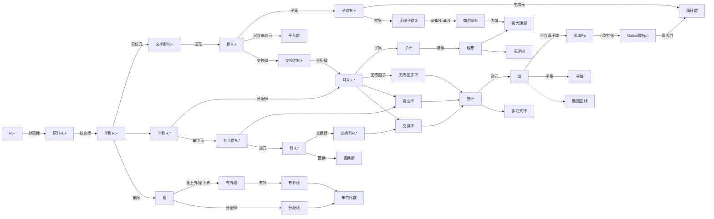

本文为网络空间安全数学基础笔记。

## 整数的可除性

### 素数判断

- ***Eratoshenes筛法***

  对任意给定的正整数 $$N$$ ，要求出所有不超过 $$N$$ 的素数，列出 $$N$$ 个整数，从中删除不大于 $$\sqrt{N}$$ 的所有素数的倍数，将其依次删除，余下的整数就是所要求的不超过 $$N$$ 的素数

- ***整数分解***

  寻求 $$n=(s+t)(s-t)$$

### 最大公约数

> ***广义欧几里得除法***
>
> | $$j$$ | $$r_j$$ | $$r_{j+1}$$ | $$q_{j+1}$$ | $$r_{j+2}$$ |
> |:--:|:--:|:--:|:--:|:--:|
> | $$0$$ | $$a$$ | $$b$$ | $$a/b$$ | $$a\mod b$$ |
> | $$\cdots$$ | $$\cdots$$ | $$\cdots$$ | $$\cdots$$ | $$\cdots$$ |
> | $$n$$ | $$\cdots$$ | $$(a,b)$$ | $$\cdots$$ | $$0$$ |

### 贝祖等式

> ***广义欧几里得除法***
>
> | $$j$$ | $$s_j$$ | $$t_j$$ | $$q_{j+1}$$ | $$r_{j+1}$$ |
> |:--:|:--:|:--:|:--:|:--:|
> | $$-3$$ | | | | $$a$$ |
> | $$-2$$ | $$1$$ | $$0$$ | | $$b$$ |
> | $$-1$$ | $$0$$ | $$1$$ | $$q_0$$ | $$r_0$$ |
> | $$0$$ | $$s_0$$ | $$t_0$$ | $$q_1$$ | $$r_1$$ |
> | $$\cdots$$ | $$\cdots$$ | $$\cdots$$ | $$\cdots$$ | $$\cdots$$ |
> | $$n$$ | $$s_n$$ | $$t_n$$ | $$q_{n+1}$$ | $$r_{n+1}=0$$ |
>
> $$
> \left\{\begin{array}{**lr**}s_j=(-q_j)s_{j-1}+s_{j-2}&\\t_j=(-q_j)t_{j-1}+t_{j-2}&\\q_{j+1}=\left[\frac{r_{j-1}}{r_j}\right]&\\r_{j+1}=(-q_{j+1})r_j+r_{j-1} \end{array}\right.
> $$

### 最大公因数和最小公倍数

- 计算

  $$
  [a,b]=\frac{a\cdot b}{(a,b)}
  $$

- 多个整数

  - 递归法
  - 算术基本定理

### 线性丢番图方程

$$
ax+by=c
$$

> - ***STEP1: 判断有解***
>
>   若 $$(a,b)\mid c$$，则有解
>
> - ***STEP2: 求一个解***
>
>   贝祖等式得到 $$s$$ 和 $$t$$，则
>
>   $$
>   x_0=\frac{c}{(a,b)}s, y_0=\frac{c}{(a,b)}t
>   $$
>
> - ***STEP3: 求所有解***
>
>   计算
>
>   $$
>   x=x_0+\frac{b}{(a,b)}n, y=y_0-\frac{a}{(a,b)}n
>   $$

## 同余

### 同余性质

- $$
  d\cdot a\equiv d\cdot b\left(\mod m\right)\Longrightarrow a\equiv b\left(\mod m\right), \left(d,m\right)=1
  $$​

- $$
  a\equiv b\left(\mod m\right)\Longrightarrow d\cdot a\equiv d\cdot b\left(\mod d\cdot m\right), d>0
  $$​

- $$
  a\equiv b\left(\mod m\right)\Longrightarrow a/d\equiv b/d\left(\mod m/d\right), d\mid \left(a,b,m\right)
  $$​

- $$
  a\equiv b\left(\mod m\right)\Longrightarrow a\equiv b\left(\mod d\right), d\mid m
  $$​

- $$
  a\equiv b\left(\mod m_i\right)\Longrightarrow a\equiv b\left(\mod \left[m_1,m_2,\cdots,m_k\right]\right)
  $$​

### 剩余

- ***概念解释***

| 符号/概念 | 定义 |
|:--|:--|
| $$Z/mZ=\left\{C_0,C_1,\cdots,C_{m-1}\right\}$$ | 模 $$m$$ 的完全剩余系 |
| $$F_p=Z/pZ$$ | $$m=p$$ 为素数 |
| $$C_a$$ | 模 $$m$$ 的 $$a$$ 的剩余类 |
| 剩余 | 一个剩余类中的任一数 |
| $${\left(Z/mZ\right)}^{*}=\left\{C_a\mid 0\leq a\leq m-1\right\},(a,m)=1$$ | 简化剩余类 |
| $$F_{p}^{*}={\left(Z/pZ\right)}^{*}$$ | $$m=p$$ 为素数 |

- ***定理***

  - 设 $$m$$ 是一个正整数，$$a$$ 是满足 $$(a, m)=1$$ 的整数。如果 $$k$$ 遍历模 $$m$$ 的一个简化剩余系，则 $$a\cdot k$$ 也遍历模 $$m$$ 的一个简化剩余系

  - 设 $$m_1,m_2$$ 是互素的两个正整数。如果 $$k_1,k_2$$ 分别遍历模 $$m_1$$ 和模 $$m_2$$ 的简化剩余系，则 $$k_3=m_2\cdot k_1+m_1\cdot k_2$$ 遍历模 $$m_1\cdot m_2=12$$ 的简化剩余系

### 欧拉函数

设 $$m$$ 是一个正整数，则 $$m$$ 个整数 $$1, \cdots,m$$ 中与 $$m$$ 互素的整数的个数，记作 $$\varphi(m)$$

- 对于素数幂 $$m=p^\alpha$$，有

  $$
  \varphi(m)=p^\alpha-p^{\alpha-1}
  $$

- $$
  \lvert{\left(Z/mZ\right)}^{*}\rvert=\varphi(m)
  $$​

- 若 $$(m,n)=1$$，则

  $$
  \varphi(m\cdot n)=\varphi(m)\cdot \varphi(n)
  $$

- 若 $$m=p_{1}^{\alpha_1}p_{2}^{\alpha_2}\cdots p_{s}^{\alpha_s}$$，则

  $$
  \varphi(m)=m\left(1-\frac{1}{p_1}\right)\left(1-\frac{1}{p_2}\right)\cdots\left(1-\frac{1}{p_s}\right)
  $$

- 若 $$p,q$$ 为两个素数，则

  $$
  \varphi(p\cdot q)=p\cdot q-p-q+1
  $$

- $$
  \sum_{d\mid m}{\varphi(d)}=m
  $$​

### 同余定理

- ***欧拉定理***

  若 $$(a,m)=1$$，则
  
  $$
  a^{\varphi(m)}\equiv1 \left(\mod m\right)
  $$

- ***费马小定理***

  若 $$p$$ 为素数，则
  
  $$
  a^{p}\equiv a \left(\mod p\right)
  $$

- ***Wilson定理***

  若 $$p$$ 为素数，则
  
  $$
  \left(p-1\right)!\equiv -1 \left(\mod p\right)
  $$

### 模重复平方计算法

$$
b^n\left(\mod m\right)
$$

> - ***STEP1: 将 $$n$$ 写成二进制***
>
>   $$
>   n=n_0+n_1 2+\cdots+n_{k-1}2^{k-1}
>   $$
>
> - ***STEP2: 计算***
>
>   $$
>   a=1
>   $$​
>
>   $$
>   \left\{
>   \begin{array}{**lr**}
>   a_0\equiv a\cdot b^{n_0}\left(\mod m\right), b_1\equiv b^2\left(\mod m\right)\\
>   a_1\equiv a_0\cdot b_{1}^{n_1}\left(\mod m\right), b_2\equiv b_{1}^{2}\left(\mod m\right)\\
>   \cdots\\
>   a_{k-2}\equiv a_{k-3}\cdot b_{k-2}^{n_{k-2}}\left(\mod m\right), b_{k-1}\equiv b_{k-2}^{2}\left(\mod m\right)\\
>   a_{k-1}\equiv a_{k-2}\cdot b_{k-1}^{n_{k-1}}\left(\mod m\right)
>   \end{array}
>   \right.
>   $$
>
>   $$a_{k-1}$$ 即为 $$b^n\left(\mod m\right)$$

### RSA加密

原理：*利用大整数分解的困难性*

- ***公钥(加密)*** $$\left(e,n\right)$$
- ***私钥(解密)*** $$\left(d,n\right)$$

$$n=p\cdot q$$，$$p$$ 和 $$q$$ 为两个大素数

$$
\left(e,\varphi\left(n\right)\right)=1
$$

$$
e\cdot d\equiv 1\left(\mod \varphi\left(n\right)\right)
$$

> - ***加密***
>
>   $$
>   E\left(P\right)=C\equiv P^e\left(\mod n\right)
>   $$
>
>   - 准备好 $$p,q$$，计算 $$n=p\cdot q,\varphi\left(n\right)$$
>
>   - 假设一个与 $$\varphi\left(n\right)$$ 互质的 $$e$$，求出 $$d$$
>
>   - 使用公钥加密信息 $$m$$：$$m^e\equiv c\left(\mod n\right)$$
>
> - ***解密***
>
>   $$
>   D\left(C\right)=C^d\equiv {\left(P^e\right)}^{d}\equiv P^{e\cdot d}
>   $$
>
>   $$
>   \equiv P^{k\cdot\varphi\left(n\right)+1}\equiv\left(P^{\varphi\left(n\right)}\right)P\equiv P\left(\mod n\right)
>   $$
>
>   - 求解 $$c^d\left(\mod n\right)$$
>

## 同余式

### 一次同余式

- ***一次同余式有解***

  $$
  a\cdot x\equiv b\left(\mod m\right)\text{有解}\Longleftrightarrow\left(a,m\right)\mid b
  $$

  $$
  \begin{aligned}x&\equiv\\
  &\frac{b}{\left(a,m\right)}\cdot\left({\left(\frac{a}{\left(a,m\right)}\right)}^{-1}\left(\mod \frac{m}{\left(a,m\right)}\right)\right)+t\cdot\frac{m}{\left(a,m\right)}\left(\mod m\right)\end{aligned}
  $$

  $$
  t=0,1,\cdots,\left(a,m\right)-1
  $$

- ***一次同余式求解***

  > - ***STEP1: 验证有解***
  >
  > - ***STEP2: 求解 $$\frac{a}{\left(a,m\right)}\cdot x\equiv 1\left(\mod \frac{m}{\left(a,m\right)}\right)$$***
  >
  >    广义欧几里得除法得到特解
  >
  >   $$
  >   x_{0}^{\prime}\equiv c\left(\mod \frac{m}{\left(a,m\right)}\right)
  >   $$
  >
  > - ***STEP3: 求同余式 $$\frac{a}{\left(a,m\right)}\cdot x\equiv \frac{b}{\left(a,m\right)}\left(\mod \frac{m}{\left(a,m\right)}\right)$$***
  >
  >    得到特解
  >
  >   $$
  >   x_0\equiv \frac{b}{\left(a,m\right)}\cdot x_{0}^{\prime}\equiv \frac{b}{\left(a,m\right)}\cdot c\equiv d\left(\mod \frac{m}{\left(a,m\right)}\right)
  >   $$
  >
  > - ***STEP4: 写出全部解***
  >
  >   $$
  >   x\equiv d+t\cdot\frac{m}{\left(a,m\right)}\left(\mod m\right),t=0,1,\cdots,\left(a,m\right)-1
  >   $$

### 同余式组求解

#### 中国剩余定理

$$
\left\{
\begin{array}{**lr**}
x\equiv b_1\left(\mod m_1\right) &\\
\vdots &\\
x\equiv b_k\left(\mod m_k\right)
\end{array}
\right.
$$

> 令
>
> $$
> m=m_1\cdot m_2\cdots m_k=m_i\cdot M_i
> $$
>
> 计算
>
> $$
> M_{i}^{\prime}\cdot M_i\equiv1\left(\mod m_i\right), i=1,\cdots,k
> $$
>
> 再计算
>
> $$
> x\equiv \sum\limits_{i=1}^{k}{b_i\cdot M_{i}^{\prime}\cdot M_i}\left(\mod m\right)
> $$

### 复杂取模运算简化

$$a^n\left(\mod m\right)$$

> - ***STEP1: 分解 $$m$$***
>
>   $$
>   m=m_1\cdots m_k
>   $$
>
> - ***STEP2: 欧拉定理***
>
>   $$
>   \left\{
>   \begin{array}{**lr**}
>   a^{n_1}\equiv 1\left(\mod m_1\right) &\\
>   \vdots &\\
>   a^{n_k}\equiv 1\left(\mod m_k\right)
>   \end{array}
>   \right.  \Longrightarrow \left\{
>   \begin{array}{**lr**}
>   a^{n}\equiv b_1\left(\mod m_1\right) &\\
>   \vdots &\\
>   a^{n}\equiv b_k\left(\mod m_k\right)
>   \end{array}
>   \right.
>   $$
>
> - ***STEP3: 利用[中国剩余定理](#同余式组求解)求解***
>
>   $$
>   a^n\equiv b\left(\mod m\right)
>   $$

***应用：***

- RSA 解密加速
- 残差数字系统

### 高次同余式

- ***高次同余式解数***

  若 $$m=m_1\cdots m_k$$，则同余式 $$f\left(x\right)\equiv0\left(\mod m\right)$$ 与同余式组

  $$
  \left\{
  \begin{array}{**lr**}
  f\left(x\right)\equiv 0\left(\mod m_1\right) &\\
  \vdots &\\
  f\left(x\right)\equiv 0\left(\mod m_k\right)
  \end{array}
  \right.
  $$

  等价。若 $$T_i$$ 为同余式 $$f\left(x\right)\equiv 0\left(\mod m_i\right)$$ 的解数，则同余式解数 $$T=T_1\cdots T_k$$

- ***高次同余式求解***

  $$
  f\left(x\right)\equiv0\left(\mod p^\alpha\right)
  $$

  > - ***STEP1: 验证有解***
  >
  >   $$x=x_1\left(\mod p\right)$$ 为 $$f\left(x\right)\equiv0\left(\mod p\right)$$ 的一个解，$$\left(f^\prime\left(x_1\right),p\right)=1$$
  >
  > - ***STEP2: 递推***
  >
  >   $$
  >   x\equiv x_\alpha\left(\mod p^\alpha\right)
  >   $$​
  >
  >   $$
  >   \left\{
  >   \begin{array}{**lr**}
  >   t_{i-1}\equiv-\frac{f\left(x_{i-1}\right)}{p^{i-1}}\cdot\left({f^\prime\left(x_1\right)}^{-1}\left(\mod p\right)\right)\left(\mod p\right) &\\
  >   x_i\equiv x_{i-1}+t_{i-1}\cdot p^{i-1}\left(\mod p^i\right) &\\
  >   i=2,\cdots,a
  >   \end{array}
  >   \right.
  >   $$

### 素数模的同余式简化

$$
f\left(x\right)=a_nx^n+\cdots+a_1x+a_0\equiv0\left(\mod p\right) ,a_n\not\equiv0\left(\mod p\right)
$$

> $$
> f\left(x\right)=q\left(x\right)\left(x^p-x\right)+r\left(x\right)
> $$
>
> $$
> f\left(x\right)\equiv0\left(\mod p\right)\Longleftrightarrow r\left(x\right)\equiv0\left(\mod p\right)
> $$

## 二次同余式与平方剩余

### 二次同余式化简

- ***一般二次同余式化简***

  $$
  ax^2+bx+c\equiv 0\left(\mod m\right),a\not\equiv0\left(\mod m\right)
  $$

  > $$
  > m=p_{1}^{\alpha_1}\cdots p_{k}^{\alpha_k}
  > $$
  >
  > $$
  > \left\{
  > \begin{array}{**lr**}
  > ax^2+bx+c\equiv 0\left(\mod p_{1}^{\alpha_!}\right) &\\
  > \vdots &\\
  > ax^2+bx+c\equiv 0\left(\mod p_{k}^{\alpha_k}\right)
  > \end{array}
  > \right.
  > $$

- ***素数幂的同余式化简***

  $$
  ax^2+bx+c\equiv 0\left(\mod m\right),a\not\equiv0\left(\mod m\right)
  $$

  $$p$$ 为奇素数，$$\left(2a,p\right)=1$$

  > - ***STEP1***
  >
  >   两端同时乘以 $$4a$$
  >
  > - ***STEP2***
  >
  >   $$
  >   {\left(2ax+b\right)}^2\equiv b^2-4ac\left(\mod p^{\alpha}\right)
  >   $$
  >
  > - ***STEP3***
  >
  >   令 $$y=2ax+b$$，有
  >
  >   $$
  >   y^2\equiv b^2-4ac\left(\mod p^{\alpha}\right)
  >   $$

即简化为 $$x^2\equiv a\left(\mod m\right)$$ 的形式

### 二次剩余

- ***定义***

  $$m$$ 为正整数，若 $$x^2\equiv a\left(\mod m\right),\left(a,m\right)=1$$ 有解，则 $$a$$ 为 $$m$$ 的二次剩余，否则为二次非剩余

- ***欧拉判别条件***

  $$p$$ 为奇素数，$$\left(a,p\right)=1$$

  - $$a$$ 是模 $$p$$ 的平方剩余 $$\Longleftrightarrow a^{\frac{p-1}{2}}\equiv1\left(\mod p\right)$$

  - $$a$$ 是模 $$p$$ 的非平方剩余 $$\Longleftrightarrow a^{\frac{p-1}{2}}\equiv-1\left(\mod p\right)$$

  ***推论***

  - $$p$$ 为奇素数，$$\left(a_1,p\right)=1,\left(a_2,p\right)=1$$，则 $$a_1\cdot a_2$$为模 $$p$$ 的平方非剩余 $$\Longleftrightarrow a_1,a_2$$ 同为模 $$p$$ 的平方剩余或平方非剩余

  - 平方剩余与平方非剩余数量相等

### Legendre符号

- ***定义***

  $$p$$ 为素数

  $$
  \left(\frac{a}{p}\right)=\left\{
  \begin{array}{**lr**}
  1 &a为模p的平方剩余\\
  -1 &a为模p的非平方剩余\\
  0 &p\mid a
  \end{array}
  \right.
  $$

- ***欧拉判别法则***

  $$p$$ 为奇素数，对整数 $$a$$

  $$
  \left(\frac{a}{p}\right)\equiv a^{\frac{p-1}{2}}\left(\mod p\right)
  $$

- ***性质***

  - $$
    \left(\frac{1}{p}\right)=1
    $$​

  - $$
    \left(\frac{-1}{p}\right)={\left(-1\right)}^{\frac{p-1}{2}}
    $$​

  - $$p$$ 为奇素数，则

    - $$
      \left(\frac{a+p}{p}\right)=\left(\frac{a}{p}\right)
      $$​

    - $$
      \left(\frac{a\cdot b}{p}\right)=\left(\frac{a}{p}\right)\left(\frac{b}{p}\right)
      $$​

    - 设 $$\left(a,p\right)=1$$，则

      $$
      \left(\frac{a^2}{p}\right)=1
      $$

- ***高斯引理***

  $$p$$ 为奇素数，$$a$$ 为整数，$$\left(a,p\right)=1$$，整数 $$a\cdot1,a\cdot2,\cdots,a\cdot\frac{p-1}{2}$$ 中模 $$p$$ 的最小正剩余大于$$\frac{p}{2}$$ 的个数是 $$m$$，则
  
  $$
  \left(\frac{a}{p}\right)={\left(-1\right)}^m
  $$

### 模 $$p$$ 平方剩余判断

> - ***METHOD1: 定理***
>
>   设 $$p$$ 为奇素数
>
>   - $$\left(\frac{2}{p}\right)={\left(-1\right)}^{\frac{p^2-1}{8}}$$​
>
>   - 若 $$\left(a,2p\right)=1$$，则
>
>     $$
>     \left(\frac{a}{p}\right)={\left(-1\right)}^{T_{\left(a,p\right)}}
>     $$
>
>     其中
>
>     $$
>     T_{\left(a,p\right)}=\sum_\limits{k=1}^{\frac{p-1}{2}}{\left[\frac{a\cdot k}{p}\right]}
>     $$
>
> - ***METHOD2: 二次互反律***
>
>   若 $$p,q$$ 为互素奇素数，则
>
>   $$
>   \left(\frac{p}{q}\right)={\left(-1\right)}^{\frac{p-1}{2}\cdot\frac{q-1}{2}}\left(\frac{p}{q}\right)
>   $$

### 雅可比符号

- ***定义***
  设 $$m=p_1\cdots p_r$$ 是奇素数 $$p_i$$ 的乘积

  $$
  \left(\frac{a}{m}\right)=\left(\frac{a}{p_1}\right)\cdots\left(\frac{a}{p_r}\right)
  $$

  $$
  \left(\frac{a}{m}\right)=\left\{
  \begin{array}{**lr**}
  -1 &可判断a是模m平方非剩余\\
  1 &不可判断a是模m平方剩余
  \end{array}
  \right.
  $$

- ***性质***

  - 若 $$m=p_1\cdots p_r$$ 是奇数

    - $$\left(\frac{a+m}{m}\right)=\left(\frac{a}{m}\right)$$​

    - $$\left(\frac{a\cdot b}{m}\right)=\left(\frac{a}{m}\right)\left(\frac{b}{m}\right)$$​

    - 设 $$\left(a,m\right)=1$$，则 $$\left(\frac{a^2}{m}\right)=1$$

    - $$\frac{m-1}{2}\equiv \frac{p_1-1}{2}+\cdots\frac{p_r-1}{2}\left(\mod 2\right)$$​

    - $$\frac{m^2-1}{2}\equiv \frac{p_1^2-1}{2}+\cdots\frac{p_r^2-1}{2}\left(\mod 2\right)$$​

    - $$\left(\frac{1}{m}\right)=1$$​

    - $$\left(\frac{-1}{m}\right)={\left(-1\right)}^{\frac{m-1}{2}}$$​

    - $$\left(\frac{2}{m}\right)={\left(-1\right)}^{\frac{m^2-1}{8}}$$​

  - 若 $$m,n$$ 均为奇数

    - $$\left(\frac{n}{m}\right)={\left(-1\right)}^{\frac{m-1}{2}\cdot\frac{n-1}{2}}\left(\frac{m}{n}\right)$$​

### 模平方根

- ***模 $$4k+3$$ 平方根***

  $$p$$ 为形如 $$4k+3$$ 的素数，求同余式 $$x^2\equiv a\left(\mod p\right)$$

  > - ***STEP1: 二次互反律验证有解***
  >
  >   $$
  >   a^{\frac{p-1}{2}}\equiv\left(\frac{a}{p}\right)\equiv 1\left(\mod p\right)
  >   $$
  >
  > - ***STEP2: 定理***
  >
  >   解为
  >
  >   $$
  >   x\equiv \pm a^{\frac{p+1}{4}}\left(\mod p\right)
  >   $$

- ***模 $$4k+1$$ 平方根***

  $$p$$ 为奇素数，$$p-1=2^t\cdot s$$，$$t\geq 1$$，$$s$$ 为奇数，求同余式 $$x^2\equiv a\left(\mod p\right)$$

  > - ***STEP1: 验证有解***
  >
  > - ***STEP2: 求解 $$b$$ 和 $$a^{-1}$$***
  >
  >   $$n$$ 为模 $$p$$ 的平方非剩余，$$b=n^s\left(\mod p\right)$$
  >
  > - ***STEP3: 求解***
  >
  >   $$x_{t-1}\equiv a^{\frac{s+1}{2}}\left(\mod p\right)$$
  >
  >   $$
  >   j_{k-1}=\left\{
  >   \begin{array}{**lr**}
  >   0 &{\left(a^{-1}x_{t-k}^{2}\right)}^{2^{t-k-1}}\equiv1\left(\mod p\right)\\
  >   1 &{\left(a^{-1}x_{t-k}^{2}\right)}^{2^{t-k-1}}\equiv -1\left(\mod p\right)
  >   \end{array}
  >   \right.
  >   $$
  >
  >   $$
  >   x_{t-k-1}=x_{t-k}b^{j_{k-1}2^{k-1}}
  >   $$
  >
  > - $$x_0$$ 为解

- ***模$$m$$平方根***

  $$
  m=2^{\delta}\cdot p_{1}^{\alpha_1}\cdots p_{k}^{\alpha_k}
  $$

  > - ***STEP1: 等价同余式组***
  >
  >   原同余式等价于
  >
  >   $$
  >   \left\{
  >   \begin{array}{**lr**}
  >   x^2\equiv a\left(\mod 2^{\delta}\right)\\
  >   x^2\equiv a\left(\mod p_{1}^{\alpha_1}\right)\\
  >   \cdots\\
  >   x^2\equiv a\left(\mod p_{k}^{\alpha_k}\right)
  >   \end{array}
  >   \right.
  >   $$
  >
  > - ***STEP2: 求 $$x^2\equiv a\left(\mod p^{\alpha}\right)$$***
  >
  >   - 求 $$x^2\equiv a\left(\mod p\right)$$
  >
  >   - 若 $$\alpha>1$$，使用[高次同余式求解方法](#高次同余式)求 $$x^2-a\equiv0\left(\mod p^{\alpha}\right)$$ 有解的条件及个数
  >
  > - ***STEP3: 求 $$x^2\equiv a\left(\mod 2^{\alpha}\right)$$***
  >
  >   - 验证有解
  >
  >     $$
  >     \left\{
  >     \begin{array}{**lr**}
  >     a\equiv 1\left(\mod 4\right) &\alpha=2\\
  >     a\equiv 1\left(\mod 8\right) &\alpha\geq3
  >     \end{array}
  >     \right.
  >     $$
  >
  >   - 求解
  >
  >     - $$\alpha=2$$​
  >
  >       $$x\equiv\pm1\left(\mod 4\right)$$​
  >
  >     - $$\alpha=3$$​
  >
  >       $$x\equiv\pm1,\pm3\left(\mod 8\right)$$​
  >
  >     - $$\alpha\geq4$$​
  >
  >       若同余式 $$x^2\equiv a\left(\mod 2^{\alpha-1}\right)$$ 的解为 $$x=\pm\left(x_{\alpha-1}+t_{\alpha-1}2^{\alpha-2}\right),t_{\alpha-1}=0,\pm1,\cdots$$
  >
  >       $$x^2\equiv a\left(\mod 2^{\alpha}\right)$$ 的解为
  >
  >       $$
  >       \begin{aligned}
  >       x=&\pm\left(x_{\alpha}+t_{\alpha}2^{\alpha-1}\right)\\
  >       =&\pm\left(x_{\alpha-1}+\left(\frac{a-x_{\alpha-1}^{2}}{2^{\alpha-1}}\left(\mod2\right)\right)\cdot2^{\alpha-2}+t_{\alpha}2^{\alpha-1}\right),\\
  >       &t_{\alpha}=0,\pm1,\cdots
  >       \end{aligned}
  >       $$
  >
  >       解为
  >
  >       $$
  >       x_{\alpha},x_{\alpha}+2^{\alpha-1},-x_{\alpha},-\left(x_{\alpha}+2^{\alpha-1}\right)
  >       $$
  >
  > - ***STEP4: 利用[中国剩余定理](#同余式组求解)求解***

### Rabin加密

> - ***STEP1: 生成密钥***
>
>   解密者生成2个大素数 $$p,q$$，计算 $$n=pq$$
>
>   加密者密钥为 $$n$$，解密者密钥为 $$\left(p,q\right)$$
>
> - ***STEP2: 加密信息 $$m$$***
>
>   计算 $$c\equiv m^2\left(\mod n\right)$$
>
> - ***STEP3: 解密信息***
>
>   求解同余式
>
>   $$
>   \left\{
>   \begin{array}{**lr**}
>   m^2\equiv c\left(\mod p\right)\\
>   m^2\equiv c\left(\mod q\right)
>   \end{array}
>   \right.
>   $$

### $$x^2+y^2=p$$

> - ***STEP1: 求 $$m_0$$***
>
>   寻找 $$x=x_0$$，使得 $$x^2\equiv-1\left(\mod p\right)$$，存在 $$y_0=1$$ 使得 $$x_0^2+y_0^2=m_0\cdot p$$
>
> - ***STEP2:求 $$u_i, v_i$$***
>
>   $$
>   u_i\equiv x_i\left(\mod m_i\right)
>   $$
>
>   $$
>   v_i\equiv y_i\left(\mod m_i\right)
>   $$
>
> - ***STEP3: 求 $$x_i, y_i$$***
>
>   $$
>   x_{i+1}=\frac{u_i\cdot x_i+v_i\cdot y_i}{m_i}
>   $$
>
>   $$
>   y_{i+1}=\frac{u_i\cdot y_i-v_i\cdot x_i}{m_i}
>   $$
>
> - ***STEP4: 求 $$m_i$$***
>
>   $$
>   x_i^2+y_i^2=m_i\cdot p
>   $$
>
>   当 $$m_k=1$$ 时，$$x_k,y_k$$ 即为方程的解

## 原根与指标

### 指数

- ***定义***

  - 指数

    设 $$m>1$$ 为整数，$$a$$ 是与 $$m$$ 互素的正整数，则使得 $$a^e\equiv1\left(\mod m\right)$$ 成立的最小正整数 $$e$$ 叫做 $$a$$ 对模 $$m$$ 的指数，记作 $$\mathrm{ord}_{m}{\left(a\right)}$$

  - 原根

    若 $$e=\varphi{\left(m\right)}$$，则 $$a$$ 为模 $$m$$ 的原根

- ***定理***

  - $$a^d\equiv1\left(\mod m\right)\Longleftrightarrow\mathrm{ord}_{m}{\left(a\right)}\mid d$$​

  - 设 $$p$$ 为奇素数，$$\frac{p-1}{2}$$ 为素数，若 $$a\not\equiv0,1,-1\left(\mod p\right)$$，则 $$\mathrm{ord}_{p}{\left(a\right)}=\frac{p-1}{2}$$ 或 $$p-1$$

  - $$b\equiv a\left(\mod m\right)\Longrightarrow \mathrm{ord}_{m}{\left(b\right)}=\mathrm{ord}_{m}{\left(a\right)}$$​

  - $$a^{-1}a\equiv1\left(\mod m\right)\Longrightarrow \mathrm{ord}_{m}{\left(a^{-1}\right)}=\mathrm{ord}_{m}{\left(a\right)}$$​

  - $$1=a^0,a,\cdots,a^{\mathrm{ord}_{m}{\left(a\right)}-1}$$​

  - $$a^d\equiv a^k\left(\mod m\right)\Longleftrightarrow d\equiv k\left(\mod \mathrm{ord}_{m}{\left(a\right)}\right)$$​

  - $$\mathrm{ord}_{m}{\left(a^d\right)}=\frac{\mathrm{ord}_{m}{\left(a\right)}}{\left(d,\mathrm{ord}_{m}{\left(a\right)}\right)}$$​

  - 设 $$g$$ 为模 $$m$$ 的原根，则 $$g^d$$ 为模 $$m$$ 的原根 $$\Longleftrightarrow \left(d,\varphi{\left(m\right)}\right)=1$$

  - 设 $$k\mid \mathrm{ord}_{m}{\left(a\right)}$$，则使得 $$\mathrm{ord}_{m}{\left(a^d\right)}=k,1\leq d\leq \mathrm{ord}_{m}{\left(a\right)}$$ 成立的正整数 $$d$$ 满足 $$\frac{\mathrm{ord}_{m}{\left(a\right)}}{k}\mid d$$，且共有 $$\varphi{\left(k\right)}$$ 个这样的 $$d$$

  - 模 $$m$$ 有原根 $$\Longrightarrow$$ 模 $$m$$ 有 $$\varphi{\left(\varphi{\left(m\right)}\right)}$$ 个不同的原根

  - $$\left(\mathrm{ord}_{m}{\left(a\right)},\mathrm{ord}_{m}{\left(b\right)}\right)=1\Longleftrightarrow \mathrm{ord}_{m}{\left(a\cdot b\right)}=\mathrm{ord}_{m}{\left(a\right)}\cdot \mathrm{ord}_{m}{\left(b\right)}$$​

- ***求指数***

  > 根据 $$a^d\equiv1\left(\mod m\right)\Longleftrightarrow\mathrm{ord}_{m}{\left(a\right)}\mid d$$，求出 $$m$$ 的因数，挨个验证

### 原根

- ***定理***

  - 模 $$p$$ 原根

    - $$p$$ 为奇素数 $$\Longrightarrow$$ 模 $$p$$ 的原根存在，且有 $$\varphi{\left(p-1\right)}$$ 个

    - $$g$$ 是模 $$p$$ 的原根 $$\Longleftrightarrow g^{p-1}\not\equiv1\left(\mod p^2\right)$$ 或 $${\left(g+p\right)}^{p-1}\not\equiv1\left(\mod p^2\right)$$

  - 模 $$p^{\alpha}$$ 原根

    - 若 $$p$$ 为奇素数，则 $$g$$ 为模 $$p$$ 原根 $$,g^{p^{k-2}\left(p-1\right)}=1+u_{k-2}\cdot p^{k-1},\left(u_{k-2},p\right)=1\Longrightarrow g$$ 为模 $$p^k$$ 原根

    - $$g$$ 为模 $$p$$ 原根 $$\Longrightarrow g$$ 或 $$g+p$$ 为模 $$p^2$$ 原根

    - $$g$$ 为模 $$p^2$$ 原根 $$\Longrightarrow g$$ 为模 $$p^{\alpha}$$ 原根

    - $$g$$ 为模 $$p^{\alpha}$$ 原根 $$\Longrightarrow g$$ 与 $$g+p^{\alpha}$$ 中的奇数为模 $$2p^{\alpha}$$ 原根

- 求奇素数 $$p$$ 原根

  > - ***STEP1: 求一个原根 $$g$$***
  >
  >   求出 $$p-1$$ 的所有素因数 $$q_1,\cdots,q_s$$，则 $$g$$ 是模 $$p$$ 的原根 $$\Longleftrightarrow \forall i,g^{\frac{p-1}{q_i}}\not\equiv1\left(\mod p\right)$$
  >
  > - ***STEP2: 求所有原根***
  >
  >   对于 $$\left(d,\varphi\left(m\right)\right)=1$$，$$g^d$$ 为原根

- 求 $$p^{\alpha}$$ 原根

  > - ***STEP1: 求 $$p$$ 的一个原根 $$g$$***
  >
  > - ***STEP2: 求 $$p^{\alpha}$$ 的原根***
  >
  >   - 若 $$g^{p-1}\not\equiv1\left(\mod p^2\right)$$，则 $$g$$ 为原根
  >
  >   - 若 $${\left(g+p\right)}^{p-1}\not\equiv1\left(\mod p^2\right)$$，则 $$g+p$$ 为原根

- 求 $$2p^{\alpha}$$ 原根

  > - ***STEP1: 求 $$p^{\alpha}$$ 的一个原根 $$g$$***
  >
  > - ***STEP2: 求 $$2p^{\alpha}$$ 的原根***
  >
  >   $$g$$ 与 $$g+p^{\alpha}$$ 中的奇数为原根

- 模 $$m$$ 存在原根 $$\Longleftrightarrow m=2,4,p^{\alpha},2p^{\alpha}$$

### 指标

- ***定义***

  设 $$m>1$$ 为整数，$$a$$ 是与 $$m$$ 互素的正整数，$$g$$ 为模 $$m$$ 的一个原根，则存在唯一的 $$1\leq r\leq \varphi{\left(m\right)}$$，使得 $$g^r\equiv a\left(\mod m\right)$$，记作 $$r=\mathrm{ind}_{g}{a}$$

- ***定理***

  - 整数 $$r$$ 满足 $$g^r\equiv a\left(\mod m\right)\Longrightarrow r\equiv \mathrm{ind}_{g}{a}\left(\mod \varphi{\left(m\right)}\right)$$

  - 以 $$g$$ 为底的对模 $$m$$ 有相同指标 $$r$$ 的所有整数全体是模 $$m$$ 的一个简化剩余类

  - $$\mathrm{ind}_{g}{a_1\cdots a_n}\equiv \mathrm{ind}_{g}{a_1}+\cdots +\mathrm{ind}_{g}{a_n}\left(\mod \varphi{\left(m\right)}\right)$$​

  - $$\mathrm{ind}_{g}{a^n}\equiv n\cdot \mathrm{ind}_{g}{a}\left(\mod \varphi{\left(m\right)}\right)$$​

### $$n$$ 次同余式

- 定义

  设 $$m>1$$ 为整数，$$a$$ 是与 $$m$$ 互素的正整数，若 $$x^n\equiv a\left(\mod m\right)$$ 有解，则 $$a$$ 为对模 $$m$$ 的 $$n$$ 次剩余

- 求解 $$x^n\equiv a\left(\mod m\right)$$

  > - ***STEP1: 验证有解***
  >
  >   $$\left(n,\varphi{\left (m\right)}\right)\mid \mathrm{ind}_{g}{a}$$，$$g$$ 为模 $$m$$ 的原根
  >
  >   解数为 $$\left(n,\varphi{\left (m\right)}\right)$$
  >
  > - ***STEP2: 等价同余式***
  >
  >   等价于 $$n{\mathrm{ind}}_{g}{x}\equiv \mathrm{ind}_{g}{a}\left(\mod \varphi{\left (m\right)}\right)$$
  >
  > - ***STEP3: 查指标表解出 $$n{\mathrm{ind}}_{g}{x}$$，解出 $$x\left(\mod m\right)$$***

- 求解 $$n^x\equiv a\left(\mod m\right)$$

  > - ***STEP1: 等价同余式***
  >
  >   等价于 $$x{\mathrm{ind}}_{g}{n}\equiv \mathrm{ind}_{g}{a}\left(\mod \varphi{\left (m\right)}\right)$$
  >
  > - ***STEP2: 查指标表解出 $$x\left(\mod \varphi{\left (m\right)}\right)$$***

### ElGamal加密

*利用离散对数对大素数取模计算的困难性*：

> - ***STEP1: 获取密钥 $$\left(p,r,b\right)$$***
>
>   - $$p$$: 选择一个素数 $$p$$
>
>   - $$r$$: $$p$$ 的原根为 $$r$$
>
>   - $$a$$: 选取整数 $$a$$，$$0\leq a\leq p-1$$
>
>   - $$b$$: $$b\equiv r^a\left(\mod p\right)$$
>
> - ***STEP2: 加密信息 $$M$$***
>
>   - $$k$$: 选取整数 $$k$$，$$1\leq k\leq p-2$$
>
>   - $$\gamma$$: $$\gamma\equiv r^k\left(\mod p\right),0\leq\gamma\leq p-1$$
>
>   - $$\delta$$: $$\delta\equiv M\cdot b^k\left(\mod p\right),0\leq\delta\leq p-1$$
>
> - ***STEP3: 解密信息 $$\left(\gamma,\delta\right)$$***
>
>   $$
>   M\equiv \overline{\gamma^{a}}\delta\left(\mod p\right)
>   $$

## 素性检验

### 伪素数和 Fermat 素性检验

- ***判断素数***

  $$n$$ 为素数 $$\Longleftrightarrow$$ 对任意 $$b,\left(b,n\right)=1$$，$$b^{n-1}\equiv 1\left(\mod n\right)$$ 或 $${\mathrm{ord}}_{n}{\left(b\right)}\mid n-1$$

- ***$$n$$ 对基 $$b$$ 的伪素数***

  $$n$$ 为奇合数，$$\left(b,n\right)=1$$，$$b^{n-1}\equiv 1\left(\mod n\right)$$

  - 存在无穷个对基 $$2$$ 的伪素数

  - 若 $$n$$ 为对基 $$b_1,b_2$$ 的伪素数，则 $$n$$ 为对基 $$b_1\cdot b_2$$ 的伪素数

  - 若 $$n$$ 为对基 $$b$$ 的伪素数，则 $$n$$ 为对基 $$b^{-1}$$ 的伪素数

  - 若存在 $$b$$ 使得 $$b^{n-1}\not\equiv 1\left(\mod n\right)$$，则模 $$n$$ 的简化剩余系中至少有一半的的数满足 $$b^{n-1}\not\equiv 1\left(\mod n\right)$$

- ***Fermat 素性检验***

  > - ***STEP1*** 随机选取整数 $$b$$ 和安全参数 $$t$$
  >
  > - ***STEP2*** 计算 $$r\equiv b^{n-1}\left(\mod n\right)$$
  >
  > - ***STEP3*** 若 $$r\not=1$$，则 $$n$$ 为合数
  >
  > - ***STEP4*** 重复 $$t$$ 次

- ***Carmichael 数***

  合数 $$n$$ 满足对任意 $$b,\left(b,n\right)=1$$，$$b^{n-1}\equiv 1\left(\mod n\right)$$
  存在无穷多个 Carmichael 数

- ***证明 $$n$$ 为 Carmichael 数***

  > - ***STEP1*** $$n=p_1\cdots p_s$$
  >
  > - ***STEP2*** $$b^{p_i-1}\equiv 1\left(\mod p_i\right)$$
  >
  > - ***STEP3*** $$b^{n-1}\equiv 1\left(\mod p_i\right)$$

### Euler 伪素数和 Solovay-Stassen 素性检验

- ***$$n$$ 对基 $$b$$ 的 Euler 伪素数***

  $$n$$ 为奇合数，$$\left(b,n\right)=1$$，$$b^{\frac{n-1}{2}}\equiv \left(\frac{b}{n}\right)\left(\mod n\right)$$

  - 若 $$n$$ 对基 $$b$$ 的 Euler 伪素数，则 $$n$$ 对基 $$b$$ 的伪素数

- ***Solovay-Stassen 素性检验***

  > - ***STEP1*** 随机选取整数 $$b,2\leq b\leq n-2$$ 和安全参数 $$t$$
  >
  > - ***STEP2*** 计算 $$r\equiv b^{\frac{n-1}{2}}\left(\mod n\right)$$
  >
  > - ***STEP3*** 若 $$r\not=1$$ 且 $$r\not= n-1$$，则 $$n$$ 为合数
  >
  > - ***STEP4*** 计算 $$s=\left(\frac{b}{n}\right)$$
  >
  > - ***STEP5*** 若 $$r\not= s$$，则 $$n$$ 为合数
  >
  > - ***STEP6*** 重复 $$t$$ 次

### 强伪素数和 Miller-Rabin Primality 素性检验

- ***$$n$$ 对基 $$b$$ 的强伪素数***

  $$n$$ 为奇合数，$$\left(b,n\right)=1$$，$$n-1=2^s t$$，$$t$$ 为奇数，$$b^t\equiv 1\left(\mod n\right)$$ 或存在 $$0\leq r<s$$ 使得 $$b^{2^r t}\equiv -1\left(\mod n\right)$$

  - 存在无穷个对基 $$2$$ 的强伪素数

  - 若 $$n$$ 对基 $$b\left(1\leq b\leq n-1\right)$$ 的强伪素数可能性至多为 $$25%$$

- ***Miller-Rabin Primality 素性检验***

  > - ***STEP1*** 安全参数 $$k$$，$$n-1=2^s t,t$$ 为奇数
  >
  > - ***STEP2*** 随机选取整数 $$b,2\leq b\leq n-2$$
  >
  > - ***STEP3*** 计算 $$r_0\equiv b^{t}\left(\mod n\right)$$
  >
  >   - 若 $$r_0=1$$ 或 $$r_0=n-1$$，则通过检验，可能为素数。回到第二步
  >
  >   - 否则进入下一步
  >
  > - ***STEP4*** 计算 $$r_1\equiv r_{0}^{2}\left(\mod n\right)$$
  >
  >   - 若 $$r_1=n-1$$，则通过检验，可能为素数。回到第二步
  >
  >   - 否则进入下一步
  >
  > - ***STEP5*** 计算 $$r_2\equiv r_{1}^{2}\left(\mod n\right)$$
  >
  >   $$\vdots$$​
  >
  > - ***STEPs+1*** 计算 $$r_{s-1}\equiv r_{s-2}^{2}\left(\mod n\right)$$
  >
  >   - 若 $$r_{s-1}=n-1$$，则通过检验，可能为素数。回到第二步
  >
  >   - 否则 $$n$$ 为合数
  >
  > $$k$$ 次测试后，$$n$$ 为合数的概率为 $${0.25}^k$$

### 梅森素数和 Lucas-Lehmer Primality 素性检验

- ***梅森素数***

  $$M_m=2^m-1$$ 为梅森数

  若 $$p$$ 为素数且 $$M_p=2^p-1$$ 为素数，则 $$M_p$$ 为梅森素数

- ***LLT***

  > 设 $$p$$ 为素数
  >
  > $$r_k=r_{k-1}^{2}-2\left(\mod M_p\right),0\leq r_k\leq M_p$$，其中 $$r_1=4,k\geq 2$$
  >
  > $$r_{p-1}\equiv0\left(\mod M_p\right)\Longleftrightarrow M_p$$

### 随机数生成

> - ***METHOD1: 线性同余法***
>
>   - 选取种子 $$x_0$$
>
>   - 选取 $$m,a,c$$，使得 $$2\leq a<m,0\leq c<m,0\leq x_0\leq m$$
>
>   - $$x_{n+1}\equiv a\cdot x_n+c\left(\mod m\right)$$​
>
> - ***METHOD2: 纯乘法同余法***
>
>   - 选取素数 $$m$$（通常为梅森素数 $$M_{31}=2^{31}-1$$），$$a$$ 取其原根，最大周期长度为 $$m-1$$
>
>   - $$x_{n+1}\equiv a\cdot x_n\left(\mod m\right)$$​
>
> - ***METHOD3: 平方伪随机***
>
>   - $$x_{n+1}\equiv x_{n}^{2}+1\left(\mod m\right)$$​

## 群

### 群和子群

- ***群的定义***

  > 非空集合 $$G$$ 满足
  >
  > - ***G1: 结合律*** $$\forall a,b,c\in G,\left(ab\right)c=a\left(bc\right)$$
  >
  > - ***G2: 单位元*** $$\exists e\in G,\forall a\in G,ae=ea=a$$
  >
  > - ***G3: 可逆性*** $$\forall a\in G,\exists a^{-1}\in G,aa^{-1}=a^{-1}a=e$$

- ***Abel群/交换群***

  群 $$G$$ 满足

  - ***G4: 交换律*** $$\forall a,b\in G,ab=ba$$

- ***定义和性质***

  - 群 $$G$$ 的元素个数叫做群 $$G$$ 的阶，记作 $$\left\|G\right\|$$

  - 单位元唯一

  - 逆元唯一

  - $${\left(a_1a_2\cdots a_n\right)}^{-1}=a_{n}^{-1}\cdots a_{2}^{-1}a_{1}^{-1}$$​

  - $$a^{m}a^{n}=a^{m+n}$$，$${\left(a^m\right)}^n=a^{mn}$$

  - $$x,y\in G$$，$$G$$ 为Abel群，$${\left(xy\right)}^n=x^ny^n$$

  - $$
    \left\{
    \begin{array}{**lr**}
    ax=b\\
    ya=b
    \end{array}
    \right.
    $$ 在 $$G$$ 中有解，$$G$$ 满足结合律 $$\Longleftrightarrow G$$ 为一个群

- ***子群***

  - 定义

    - 子群：$$H$$ 为 $$G$$ 的一个子集，$$H$$ 为一个群，记作 $$H\leq G$$

    - 平凡子群：$$H=\left\{e\right\}$$ 和 $$H=G$$

    - 真子群：$$H$$ 不是平凡子群

  - 性质

    - $$H\leq G\Longleftrightarrow\left\{
      \begin{array}{**lr**}
      H是满足G下的封闭二元运算\\
      G的单位元在H内\\
      \forall a\in H,a^{-1}\in H
      \end{array}
      \right.$$​

    - $$H\leq G\Longleftrightarrow \forall a,b\in H,ab^{-1}\in H$$​

    - $$H_1,H_2\leq G\Longrightarrow H_1\cap H_2\leq G$$​

  - 生成

    - $$X$$ 为 $$G$$ 子集，设 $${\left\{H_i\right\}}_{i\in I}$$ 为 $$G$$ 的包含 $$X$$ 的所有子群，则 $$\cap_{i\in I}{H_i}$$ 为 $$G$$ 的由 $$X$$ 生成的子群，记作 $$<X>$$

      - $$X$$ 的元素为 $$<X>$$ 生成元

      - 若 $$G=<a_1,\cdots,a_n>$$，则 $$G$$ 为有限生成的

      - 若 $$G=<a>$$，则 $$G$$ 为 $$a$$ 生成的循环群

    - $$G$$ 为交换群，$$X=<a_1,\cdots,a_t>$$，

      $$
      <X>=\left\{
      \begin{array}{**lr**}
      \left\{a_{1}^{n_1}\cdots a_{t}^{n_t}\mid a_i\in X,n_i\in Z,1\leq i\leq t\right\} &G为乘法群\\
      \left\{n_1a_{1}\cdots n_ta_{t}\mid a_i\in X,n_i\in Z,1\leq i\leq t\right\} &G为加法群
      \end{array}
      \right.
      $$

      特别的，

      $$
      \forall a\in G,<a>=\left\{
      \begin{array}{**lr**}
      \left\{a^n\mid n\in Z\right\} &G为乘法群\\
      \left\{na\mid n\in Z\right\} &G为加法群
      \end{array}
      \right.
      $$

$$\left(Z_m,+\right)$$ 的所有子群

> - 对 $$n\neq m$$ 且 $$n\mid m$$，$$<n>$$ 为子群
>
> - $$<0>=\left\{0\right\}$$

乘法群 $$Z_{p}^{*}$$ 的所有子群和生成元

> - ***STEP 1:*** $$p-1=q_1\cdots q_s$$，模 $$p$$ 原根为 $$g$$
>
> - ***STEP 2:***
>
>   - $$<g>$$ 生成 $$p-1$$ 阶子群
>
>   - $$<g^{q_i}>$$ 生成 $$\frac{p-1}{q_i}$$ 阶子群
>
>   - $$<1>=\left\{1\right\}$$​

$$Z/nZ^*$$ 的所有生成元

> - ***STEP 1*** 模 $$n$$ 原根为 $$g$$
>
> - ***STEP 2*** 求所有 $$d$$，$$\left(d,\varphi\left(n\right)\right)=1$$
>
> - ***STEP 3*** 生成元为 $$g^d$$

### 正规子群和商群

- ***陪集***

  - 定义

    设 $$H$$ 为 $$G$$ 的子群，$$a$$ 为 $$G$$ 中的任意元，则 $$aH=\left\{ah\mid h\in H\right\}$$ 为 $$G$$ 中的左陪集，$$Ha=\left\{ha\mid h\in H\right\}$$ 为右陪集

    $$aH$$ 中的元素叫 $$aH$$ 的代表元

    若 $$aH=Ha$$，则 $$aH$$ 为 $$G$$ 中 $$H$$ 的陪集

  - 定理

    - $$\forall a\in G,aH=\left\{c\mid c\in G,a^{-1}c\in H\right\},Ha=\left\{c\mid c\in G,ca^{-1}\in H\right\}$$

    - $$\forall a,b\in G,aH=bH\Longleftrightarrow b^{-1}a\in H$$​

    - $$\forall a,b\in G,aH\cap bH=\varnothing\Longleftrightarrow b^{-1}a\not\in H$$​

    - $$\forall a\in H,aH=H=Ha$$​

> 群 $$\left(Z_{ha},+\right)$$ 子群 $$<a>$$ 的所有陪集
>
> ***STEP 1*** $$<a>$$ 生成子群
>
> $$
> \left\{0,a,2a,\cdots,\left(h-1\right)a\right\}
> $$
>
> ***STEP 2*** 陪集为
>
> $$
> \left\{m+0,m+a,m+2a,\cdots,m+\left(h-1\right)a\right\},m=0,\cdots,a-1
> $$

- ***商集***

  - 定义

    $$
    G/H=\left\{aH\mid a\in G\right\}
    $$

    $$G/H$$ 中左（右）陪集的个数叫做 $$H$$ 在 $$G$$ 中的指标，记作 $$\left[G:H\right]$$

  - 拉格朗日定理

    $$
    H\leq G\Longrightarrow \left|G\right|=\left[G:H\right]\left|H\right|
    $$

    $$
    K,H\leq G,K\leq H\Longrightarrow \left[G:K\right]=\left[G:H\right]\left[H:K\right]
    $$

- ***正规子群***

    $$H\leq G,H$$ 满足

    $$
    \forall a\in G,aH=Ha
    $$

- ***商群***

  $$N$$ 为 $$G$$ 的正规子群，$$\left(aN\right)\left(bN\right)=\left(ab\right)N$$，$$G/N$$ 构成一个商群

> $$m+<a>$$ 在 $$Z_{ka}/<a>$$ 里的阶
>
> - 写出 $$<a>$$
>
> - $${\left(m+<a>\right)}\cdot{\mathrm{ord}\left(m+<a>\right)}=<a>$$​

### 同态和同构

- ***定义***

  - 同态：$$f:G\rightarrow G^\prime,\forall a,b\in G,f\left(ab\right)=f\left(a\right)f\left(b\right)$$

  - 单同态：$$f$$ 为单射

  - 满同态：$$f$$ 为满射

  - 同构：$$f$$ 为双射，记作 $$f:G\cong G^\prime$$

  - 自同态：$$G=G^\prime$$

  - 像：$$f:X\rightarrow Y,A\subseteq X,B\subseteq Y,A$$ 在 $$Y$$ 中的像 $$f\left[A\right]$$ 为 $$\left\{f\left(a\right)\mid a\in A\right\}$$

  - 逆像：$$B$$ 在 $$X$$ 中的逆像 $$f^{-1}{\left[B\right]}$$ 为 $$\left\{x\in X\mid f\left(x\right)\in B\right\}$$

  - 核/核子群：$$\mathrm{ker}{\left(f\right)}=f^{-1}{\left[\left\{e^\prime\right\}\right]}=\left\{x\in G\mid f\left(x\right)=e^\prime\right\}$$

> 同态映射 $$f:Z\rightarrow \left(Z_p,+\right)$$，$$\ker\left(f\right)=<pZ>$$
>

- - 像子群：$$g\left(G\right)$$

    **核子群**即由 $$G$$ 中所有能通过 $$f$$ 映射成为 $$G^\prime$$ 中的单位元的元素所组成的集合

    **像子群**即 $$G$$ 中所有元素通过 $$f$$ 映射后组成的集合

- ***性质***

  - $$f$$ 为 $$G$$ 到 $$G^\prime$$ 的同态（同构），$$g$$ 为 $$G^\prime$$ 到 $$G^{\prime\prime}$$ 的同态（同构）$$\Longrightarrow f\circ g$$ 为 $$G$$ 到 $$G^{\prime\prime}$$ 的同态（同构）

  - $$f$$ 为 $$G$$ 到 $$G^\prime$$ 的同态

    - $$f\left(e\right)=e^\prime$$​

    - $$\forall a\in G,f\left(a^{-1}\right)=f^{-1}{\left(a\right)}$$​

    - $$\mathrm{ker}{\left(f\right)}\leq G$$ 且 $$f$$ 为单同态 $$\Longleftrightarrow \mathrm{ker}{\left(f\right)}=\left\{e\right\}$$

    - $$H^\prime\leq G^\prime\Longrightarrow f^{-1}{\left(H^\prime\right)}\leq G$$​

- ***证明 $$f:G\rightarrow G^\prime$$ 同构***

  > - ***STEP1: $$f$$ 为同态映射***
  >
  >   证明 $$f:G\rightarrow G^\prime,\forall a,b\in G,f\left(ab\right)=f\left(a\right)f\left(b\right)$$
  >
  > - ***STEP2: $$\mathrm{ker}{\left(f\right)}=\left\{e\right\}$$ 或 $$f$$ 为单射***
  >
  >   证明 $$f\left(m\right)=f\left(n\right)\Longrightarrow m=n$$
  >
  > - ***STEP3: $$f$$ 为满射***
  >
  >   证明 $$m=f^{-1}{\left(n\right)},f\left(m\right)=n$$

- ***同态分解定理***

  - 自然同态

    $$f:G\rightarrow G^\prime$$ 同态 $$\Longrightarrow \mathrm{ker}{\left(f\right)}$$ 为 $$G$$ 的正规子群

    $$N$$ 为 $$G$$ 的正规子群 $$S:G\rightarrow G/H(a\rightarrow aN)$$ 是核为 $$N$$ 的同态，$$S$$ 为自然同态

  - 同态基本定理

    $$f:G\rightarrow G^\prime$$ 同态 $$\Longrightarrow \exists$$ 唯一 $$G/\mathrm{ker}{\left(f\right)}\rightarrow f\left(G\right)$$ 同构 $$\bar{f}:a\mathrm{ker}{\left(f\right)}\rightarrow f\left(a\right)f=i\circ \bar{f}\circ s$$，其中 $$s$$ 为 $$G\rightarrow G/\mathrm{ker}{\left(f\right)}$$ 自然同态，$$i:c\rightarrow c$$ 为 $$f\left(G\right)\rightarrow G^\prime$$ 恒等同态

    $$s:G\rightarrow G/N$$ 同态 $$\Longrightarrow \forall a\in G,f\left(a\right)=\bar{f}\circ s\left(a\right)$$

### 循环群

- ***定义***

  若 $$\exists a\in G,G=<a>$$，则 $$G$$ 为循环群，$$a$$ 为 $$G$$的生成元

  使等式 $$a^n=e$$ 成立的最小正整数 $$n$$ 称为 $$a$$ 的阶，记为 $$\mathrm{ord}\left(a\right)$$

  若 $$a$$ 为 $$n$$ 阶元，则 $$n$$ 阶循环群
  
  $$
  G=\left\{a^0=e,a^1,a^2,\cdots,a^{n-1}\right\}
  $$

- ***定理***

  - 加群 $$Z$$ 的每个子群 $$H$$ 都是循环群，且 $$H=<0>$$ 或 $$H=<m>=mZ$$，$$m$$ 为 $$H$$ 中的最小正整数

  - 每一个无限循环群同构于加群 $$Z$$，每一个阶为 $$m$$ 的有限循环群同构于加群 $$Z/mZ$$

  - $$m=\mathrm{ord}\left(a\right)$$​

    - $$a^k=e\Longleftrightarrow m\mid k$$​

    - $$a^r\equiv a^k\Longleftrightarrow r\equiv k\left(\mod m\right)$$​

    - $$\forall 1\leq d\leq m,\mathrm{ord}\left(a^d\right)=\frac{m}{\left(d,m\right)}$$​

  - 循环群的子群是循环群

  - $$G$$ 为循环群，$$G$$ 的生成元为
  
    $$
    \left\{
    \begin{array}{**lr**}
    a和a^{-1} &G\text{是无限的}\\
    a^k,\left(k,m\right)=1 &G\text{是有限的}
    \end{array}
    \right.
    $$

  - 若 $$G$$ 为乘法群 $$\left(Z_m,\cdot\right)$$，则生成元 $$a$$ 为模 $$m$$ 的原根，$$G$$ 中共有 $$m-1$$ 个元素

  - 若 $$G$$ 为有限交换群，则
  
    $$\begin{aligned}&\exists a_1,\cdots,a_n\in G,\mathrm{ord}\left(a_{i+1}\right)\mid \mathrm{ord}\left(a_i\right),1\leq i\leq s-1\\&G=<a_1,\cdots,a_s>\end{aligned}$$

### 置换群

- ***$$n$$ 元置换***

  > 设 $$S=\left\{1,\cdots,n\right\},\sigma:S\rightarrow S,k\rightarrow \sigma{\left(k\right)=i_k}$$，表示为
  >
  > $$
  > \sigma=\left(
  > \begin{array}{ccc}
  > 1&2&\cdots&n-1&n\\
  > i_1&i_2&\cdots&i_{n-1}&i_n
  > \end{array}
  > \right)
  > $$

- - $$\sigma^{-1}=\left(
    \begin{array}{ccc}
    i_1&i_2&\cdots&i_{n-1}&i_n\\
    1&2&\cdots&n-1&n
    \end{array}
    \right)$$​

  - 若 $$S$$ 中部分元素 $$\left\{i_1,\cdots,i_k\right\}$$ 满足 $$\sigma{\left(i_1\right)}=i_2,\sigma{\left(i_2\right)}=i_3,\cdots,\sigma{\left(i_k\right)}=i_1$$，则称为 $$k$$-轮变换，简称轮换，记作 $$\sigma=\left(i_1,\cdots,i_k\right)$$

    - $$k=1$$ 时为恒等置换

    - $$k=2$$ 时为对换

    - $$\sigma=\left(i_1,\cdots,i_k\right),\tau=\left(j_1,\cdots,j_l\right)$$，若 $$k+l$$ 个元素均不相同，则 $$\sigma,\tau$$ 不相交

    - 任意一个置换都可以表示为一些不相交轮换的乘积，且表达式唯一

    - $$k$$-轮换可以表示为 $$2$$-轮换

      $$
      \left(a_1\cdots,a_k\right)=\left(a_1,a_k\right)\left(a_1,a_{k-1}\right)\cdots\left(a_1,a_2\right)
      $$

- ***置换群***

  $$n$$ 元置换全体组成的集合 $$S_n$$ 置换的乘法构成 $$n$$ 元置换群，阶为 $$n!$$

  设 $$G$$ 为 $$n$$ 元群，则 $$G$$ 同构一个 $$n$$ 元置换群

## 环与域

### 环

- ***定义***

  > 若 $$<R,+>$$ 构成交换群，$$<R,\cdot>$$ 构成半群（$$\forall a,b,c\in R,\left(ab\right)c=a\left(bc\right)$$），$$\cdot$$ 关于 $$+$$ 适合分配律（$$\forall a,b,c\in R,\left(a+b\right)c=ac+bc,a\left(b+c\right)=ab+ac$$），则 $$<R,+,\cdot>$$ 为环

- - 交换环：$$\forall a,b\in R,a\cdot b=b\cdot a$$

  - 含幺环：$$\exists e=1_R,\forall a\in R,a\cdot 1_R=1_R\cdot a=a$$

  - 非零元 $$a$$ 为左零因子：$$\exists b\in R,b\neq 0,ab=0$$

    - 零因子：$$a$$ 同时为左零因子和右零因子，$$R$$ 为零因子环

  - $$a$$ 为左逆元：$$\exists b\in R,ab=1_R$$

    - 逆元：$$a$$ 同时为左逆元和右逆元

  - 整环：$$R$$ 为交换环、含幺环、无零因子环

- ***性质***

  - $$\forall a\in R,0a=a0=0$$​

  - $$\forall a,b\in R,\left(-a\right)b=a\left(-b\right)=-ab$$​

  - $$\forall a,b\in R,\left(-a\right)\left(-b\right)=ab$$​

  - $$\forall n\in Z,\forall a,b\in R,\left(nab\right)=a\left(nb\right)=nab$$​

  - $$\forall a_i,b_j\in R,\left(\sum_\limits{i=1}^{n}{a_i}\right)\left(\sum_\limits{j=1}^{n}{b_j}\right)=\sum_\limits{i=1}^{n}{\sum_\limits{j=1}^{n}{a_ib_j}}$$​

### 环与域

- ***域***

  整环 $$R$$ 满足
  
  $$
  \forall a\in R^*=R-\left\{0\right\},a^{-1}\in R
  $$

- ***交换环上的整除***

  设 $$R$$ 为交换环，$$a,b\in R,b\neq 0$$，若 $$c\in R,a=cb$$，则称作 $$b$$ 整除 $$a$$，记作 $$b\mid a$$，$$a$$ 为 $$b$$ 的倍元，$$b$$ 为 $$a$$ 的因子

  - 若 $$b,c$$ 均不为单位元，则 $$b$$ 是 $$a$$ 的真因子

  - $$p\in R$$，若 $$p$$ 不是单位元，且没有真因子，则 $$p$$ 为不可约元/素元

  - $$a,b\in R$$，若 $$\exists u\in R,a-ub$$，则 $$a,b$$ 为相伴的

- ***环的同态与同构***

  $$R,R^\prime$$ 为两个环，$$f:R\rightarrow R^\prime$$

  - 环同态

    - $$\forall a,b\in R,f\left(a+b\right)=f\left(a\right)+f\left(b\right)$$​

    - $$\forall a,b\in R,f\left(ab\right)=f\left(a\right)f\left(b\right)$$​

  - 同构

    $$f$$ 为满射

- ***特征和素域***

  - > $$R$$ 为环，若 $$\exists p_{min}\in \mathbb{Z}^*,\forall a\in R,pa=0$$，则 $$R$$ 的特征为 $$p$$，若不存在，则为 $$0$$
    >
    > $$p$$ 为素数
    >
    > $$
    > \forall a,b\in R,{\left(a+b\right)}^p=a^p+b^p
    > $$​

  - 设 $$p$$ 为素数，
  
    $$
    f\left(x\right)=a_nx^n+\cdots+a_1x+a_0
    $$

    $$
    {f\left(x\right)}^p\equiv f\left(x^p\right)\left(\mod p\right)
    $$

  - 若一个域不含真子域，则其为素域

    - 设 $$F$$ 为域，若 $$F$$ 特征为 $$0$$，则 $$F$$ 有一个与 $$Q$$ 同构的域；若 $$F$$ 特征为 $$p$$，则 $$F$$ 有一个与 $$F_p$$ 同构的域，$$F_p$$ 为在 $$Z_p$$ 运算下的域

- ***理想和商环***

  - $$I$$ 为 $$R$$ 的子环，若 $$\forall r\in R,\forall a\in I,ra\in I$$，则 $$I$$ 为 $$R$$ 的左理想

    若同时为左理想和右理想，则为理想

    - $$\left\{0\right\},R$$ 均为 $$R$$ 的平凡理想

    - $$P$$ 为 $$R$$ 的理想，若 $$P\neq R,\forall A,B,AB\in P\Longrightarrow A\in P\lor B\in P$$，则 $$P$$ 为 $$R$$ 的素理想

    - $$M$$ 为 $$R$$ 的理想，若 $$M\neq R,\forall $$ 理想 $$N,M\subset N\in R\Longrightarrow N=N\lor N=R$$，则 $$M$$ 为 $$R$$ 的极大理想

    - 整环 $$Z$$ 或含幺环 $$R$$ 的每一个素理想都是极大理想

    - $$R$$ 为含幺交换环，$$M$$ 为 $$R$$ 的理想，则 $$M$$ 为极大理想或素理想 $$\Longleftrightarrow R/M$$ 为域

    - 若 $$R$$ 为环，$$I$$ 为 $$R$$ 的理想，则 $$R/I$$ 对加法运算 $$\left(a+I\right)+\left(b+I\right)=\left(a+B\right)+I$$ 和乘法运算 $$\left(a+I\right)\left(b+I\right)=ab+I$$ 构成一个环

      当 $$R$$ 为交换环或含幺环时，$$R/I$$ 也为交换环或幺环

  - 群 $$G$$ 的正规子群 $$H$$ 将 $$G$$ 分为若干陪集，相似的，环 $$R$$ 的理想 $$I$$ 将 $$R$$ 分为不相交的陪集

  - $$f:R\rightarrow R^\prime$$ 为同态 $$\Longrightarrow \ker{\left(f\right)}$$ 为 $$R$$ 的理想

    $$I$$ 为环 $$R$$ 的理想 $$\Longrightarrow S:R\rightarrow R/I,a\rightarrow a+I$$ 为核为 $$I$$ 的同态

  - 同态基本定理：

    $$R$$ 为环，$$f:R\rightarrow R^\prime$$ 为同态 $$\Longrightarrow \exists$$ 唯一 $$R/\ker{\left(f\right)}$$ 到像子环 $$f\left(R\right)$$ 同构 $$\bar{f}:a+\ker{\left(f\right)}\rightarrow f\left(a\right),f=i\circ \bar{f}\circ s$$，其中 $$s$$ 为 $$R$$ 到商环 $$R/\ker{\left(f\right)}$$ 的自然同态，$$i:c\rightarrow c$$ 为 $$f\left(R\right)$$ 到 $$R^\prime$$ 的恒等同态

### 多项式环

- ***定义***

  $$R$$ 为整环，$$x$$ 为变量，$$R$$ 上的多项式记作
  
  $$
  R\left[x\right]=\left\{f\left(x\right)=a_nx^n+\cdots+a_1x+a_0\mid a_i\in R,0\leq i\leq n,n\in R\right\}
  $$

  对于多项式加法和乘法，$$R\left[x\right]$$ 为整环

- ***多项式整除和不可约多项式***

  - $$g\left(x\right)\mid f\left(x\right)$$：$$\exists q\left(x\right),f\left(x\right)\mid q\left(x\right)\cdot g\left(x\right)$$​

  - $$g\left(x\right),h\left(x\right)\neq 0,g\left(x\right)\mid f\left(x\right),h\left(x\right)\mid g\left(x\right)\Longrightarrow h\left(x\right)\mid f\left(x\right)$$​

    - $$\begin{aligned}&g\left(x\right),h\left(x\right)\neq 0,g\left(x\right)\mid f\left(x\right),h\left(x\right)\mid g\left(x\right)\\\Longrightarrow&\forall s\left(x\right),t\left(x\right),h\left(x\right)\mid s\left(x\right)\cdot f\left(x\right)+t\left(x\right)\cdot g\left(x\right)\end{aligned}$$​

    - 不可约多项式：除 $$1$$ 和 $$f\left(x\right)$$ 外，$$f\left(x\right)$$ 没有其他非常数因式，否则 $$f\left(x\right)$$ 为合式

  - 设 $$f\left(x\right)$$ 是域 $$K$$ 上的 $$n$$ 次可约多项式，$$p\left(x\right)$$ 是 $$f\left(x\right)$$ 的次数最小的非常数饮食，则 $$p\left(x\right)$$ 一定是不可约多项式，且 $$\deg{p}\leq \frac{1}{2}\deg{f}$$

  - 设 $$f\left(x\right)$$ 是域 $$K$$ 上的 $$n$$ 次可约多项式，若 $$\forall $$ 不可约多项式 $$p\left(x\right),\deg{p}\leq \frac{1}{2}\deg{f},p\left(x\right)\not\mid f\left(x\right)$$，则 $$f\left(x\right)$$ 为不可约多项式

- ***多项式欧几里得除法***

  - 设整环 $$R$$ 上两个多项式
  
    $$\begin{aligned}&f\left(x\right)\\=&a_nx^n+a_{n-1}x^{n-1}+\cdots+a_1x+a_0,g\left(x\right)\\=&x^m+\cdots+b_1x+b_0\end{aligned}$$

    则存在 $$q\left(x\right),r\left(x\right),f\left(x\right)=q\left(x\right)\cdot g\left(x\right)+r\left(x\right)$$

    $$q\left(x\right)$$ 为不完全商，$$r\left(x\right)$$ 为余式

    - 对于 $$f\left(x\right)$$ 有 $$a\in R$$，存在 $$q\left(x\right)$$ 和常数 $$c=f\left(a\right),f\left(x\right)=q\left(x\right)\left(x-a\right)+f\left(a\right)$$

    - 对于 $$f\left(x\right)$$ 有 $$a\in R$$，$$x-a\mid f\left(x\right)\Longleftrightarrow f\left(a\right)=0$$

    - $$g\left(x\right)\mid f\left(x\right)\Longleftrightarrow r\left(x\right)=0$$​

  - 最大公因式：$$f\left(x\right),g\left(x\right),d\left(x\right)\in R\left[x\right]$$

    - $$d\left(x\right)\mid f\left(x\right),d\left(x\right)\mid g\left(x\right)$$​

    - $$h\left(x\right)\mid f\left(x\right),h\left(x\right)\mid g\left(x\right)\Longrightarrow h\left(x\right)\mid d\left(x\right)$$​

    则 $$d\left(x\right)$$ 为最大公因式，记作 $$\left(f\left(x\right),g\left(x\right)\right)$$

    若 $$\left(f\left(x\right),g\left(x\right)\right)=1$$，则 $$f\left(x\right)$$ 和 $$g\left(x\right)$$ 互质

    > ***求最大公因式（广义欧几里得除法）***
    >
    > 假设 $$\deg f<\deg g$$
    >
    > | $$j$$ | $$r_j$$ | $$r_{j+1}$$ | $$q_{j+1}$$ | $$r_{j+2}$$ |
    > |:--:|:--:|:--:|:--:|:--:|
    > | $$0$$ | $$g\left(x\right)$$ | $$f\left(x\right)$$ | $$g\left(x\right)/f\left(x\right)$$ | $$g\left(x\right)\mod f\left(x\right)$$ |
    > | $$\cdots$$ |$$\cdots$$ | $$\cdots$$ | $$\cdots$$ | $$\cdots$$ |
    > | $$n$$ |$$\cdots$$ | $$(g\left(x\right),f\left(x\right))$$ | $$\cdots$$ | $$0$$ |

- - 设域 $$K$$ 上两个多项式 $$f\left(x\right),g\left(x\right)$$，则存在 $$q\left(x\right),h\left(x\right)\in K\left[x\right],f\left(x\right)=q\left(x\right)\cdot g\left(x\right)+h\left(x\right),\deg{h}<\deg{g}$$

    - $$\left(f\left(x\right),g\left(x\right)\right)=\left(g\left(x\right),h\left(x\right)\right)$$​

  - 设域 $$K$$ 上两个多项式 $$f\left(x\right),g\left(x\right)$$，$$\deg{g}\geq1,\left(f\left(x\right),g\left(x\right)\right)=r_{k}{\left(x\right)},r_{k}{\left(x\right)}$$ 为广义欧几里得除法中最后一个非零余式

    > $$
    > s_k\left(x\right)\cdot f\left(x\right)+t_k\left(x\right)\cdot g\left(x\right)=\left(f\left(x\right),g\left(x\right)\right)
    > $$
    >
    > $$
    > \left\{\begin{array}{**lr**}
    > s_{-2}\left(x\right)=1\\
    > s_{-1}\left(x\right)=0\\
    > t_{-2}\left(x\right)=0\\
    > t_{-1}\left(x\right)=1\\
    > s_j\left(x\right)=\left(-q_j\left(x\right)\right)s_{j-1}\left(x\right)+s_{j-2}\left(x\right)\\
    > t_j\left(x\right)=\left(-q_j\left(x\right)\right)t_{j-1}\left(x\right)+t_{j-2}\left(x\right)\end{array}
    > \right.
    > $$

- ***多项式同余***

  - 给定 $$K\left[x\right]$$ 中一个首一多项式 $$m\left(x\right)$$，若 $$m\left(x\right)\mid f\left(x\right)-g\left(x\right)$$，则 $$f\left(x\right)\equiv g\left(x\right)\left(\mod m\left(x\right)\right)$$

    - $$\forall a\left(x\right),a\left(x\right)\equiv a\left(x\right)\left(\mod m\left(x\right)\right)$$​

    - $$a\left(x\right)\equiv b\left(x\right)\left(\mod m\left(x\right)\right)\Longrightarrow b\left(x\right)\equiv a\left(x\right)\left(\mod m\left(x\right)\right)$$​

    - $$\begin{aligned}&a\left(x\right)\equiv b\left(x\right),b\left(x\right)\equiv c\left(x\right)\left(\mod m\left(x\right)\right)\\\Longrightarrow&a\left(x\right)\equiv c\left(x\right)\left(\mod m\left(x\right)\right)\end{aligned}$$​

    - $$\begin{aligned}&a_1\left(x\right)\equiv b_1\left(x\right),a_2\left(x\right)\equiv b_2\left(x\right)\left(\mod m\left(x\right)\right)\\\Longrightarrow&a_1\left(x\right)+a_2\left(x\right)\equiv b_1\left(x\right)+b_2\left(x\right),a_1\left(x\right)\cdot a_2\left(x\right)\equiv b_1\left(x\right)\cdot b_2\left(x\right)\left(\mod m\left(x\right)\right)\end{aligned}$$​

  - $$a\left(x\right)\equiv b\left(x\right)\left(\mod m\left(x\right)\right)\Longleftrightarrow a\left(x\right)=b\left(x\right)+s\left(x\right)\cdot m\left(x\right)$$​
  
  - $$r\left(x\right)$$ 为 $$f\left(x\right)$$ 模 $$m\left(x\right)$$ 的最小余式

  - 构造有限域：设 $$K$$ 为一个域，$$p\left(x\right)$$ 为 $$K\left[x\right]$$ 中的不可约多项式，则商环 $$K\left[x\right]/p\left(x\right)$$ 对于加法式和乘法式构成一个域

- ***本原多项式***

  - 设 $$p$$ 为素数，$$p\left(x\right)$$ 是 $$F_p\left[x\right]$$ 中的 $$n$$ 次不可约多项式，则 $$F_p\left[x\right]/p\left(x\right)=\left\{a_{n-1}x^{n-1}+\cdots+a_1x+a_0\mid a_i\in F_p\right\}$$ 记作 $$F_{p^n}$$，这个域元素个数为 $$p^n$$

  - 设 $$p$$ 为素数，$$f\left(x\right)$$ 为 $$f_p\left[x\right]$$ 中的 $$n$$ 次多项式，则使得 $$x^e\equiv1\left(\mod f\left(x\right)\right)$$ 成立的最小正整数 $$e$$ 叫做 $$f\left(x\right)$$ 在 $$F_p$$ 上的指数，记作 $$\mathrm{ord}_p\left(f\left(x\right)\right)$$

    - 整数 $$d$$ 使得 $$x^d\equiv1\left(\mod f\left(x\right)\right)$$,则 $$\mathrm{ord}_p\left(f\left(x\right)\right)\mid d$$

    - $$g\left(x\right)\mid f\left(x\right)\Longrightarrow \mathrm{ord}_p\left(f\left(x\right)\right)\mid d$$​

    - $$\begin{aligned}&\left(f\left(x\right),g\left(x\right)\right)=1\\\Longrightarrow&\mathrm{ord}_p\left(f\left(x\right)\cdot g\left(x\right)\right)=\left[\mathrm{ord}_p\left(f\left(x\right)\right),\mathrm{ord}_p\left(g\left(x\right)\right)\right]\end{aligned}$$​

    - $$f\left(x\right)$$ 为 $$F_p\left[x\right]$$ 上的 $$n$$ 次不可约多项式，则 $$\mathrm{ord}_p\left(f\left(x\right)\right)\mid p^n-1$$

  - 若 $$\mathrm{ord}_p\left(f\left(x\right)\right)=p^n-1$$，则称 $$f\left(x\right)$$ 为 $$F_p$$ 上的本原多项式

  - 设 $$p$$ 为素数，$$f\left(x\right)$$ 为 $$F_p\left[x\right]$$ 上的本原多项式，则 $$f\left(x\right)$$ 是 $$F_p\left[x\right]$$ 上的不可约多项式

  > ***判别本原多项式***
  >
  > 设 $$p$$ 为素数，$$n$$ 为正整数，$$f\left(x\right)$$ 是 $$F_p\left[x\right]$$ 中的 $$n$$ 次多项式，若 $$x^{p^n-1}\equiv 1\left(\mod f\left(x\right)\right)$$，对于 $$p^n-1$$ 的所有不同素因数 $$q_1,\cdots,q_s$$，$$x^{\frac{p^n-1}{q_i}}\not \equiv1\left(\mod f\left(x\right)\right),i=1,\cdots,s$$，则 $$f\left(x\right)$$ 是 $$n$$ 次本原多项式

### 有限域

- ***域的扩张***

  - 设 $$F$$ 为一个域，如果 $$K$$ 是 $$F$$ 的子域，则称 $$F$$ 为 $$K$$ 的扩域

  - $$F$$ 为域 $$K$$ 的一个扩张，将 $$F$$ 看成 $$K$$ 上的向量空间，若是有限维的，则称 $$F$$ 为 $$K$$ 的有限维扩张，$$K$$ 上向量空间 $$F$$ 的维数称为扩张次数，记为 $$\left[F:K\right]$$

  - 设 $$R$$ 为一个整环，$$K$$ 是包含 $$R$$ 的一个域，$$F$$ 是 $$K$$ 的扩张

    - $$F$$ 的元素 $$u$$ 称为 $$R$$ 上的代数数，若存在一个非零多项式 $$f\in R\left[x\right]$$ 使得 $$f\left(u\right)=0$$

      - 如果 $$F$$ 的每个元素都是 $$K$$ 上的代数数，$$F$$ 称为 $$K$$ 的代数扩张

    - $$F$$ 的元素 $$u$$ 称为 $$R$$ 上的超越数，若不存在任何非零多项式 $$f\in R\left[x\right]$$ 使得 $$f\left(u\right)=0$$

      - 如果 $$F$$ 中至少有一个元素是 $$K$$ 上的超越数，$$F$$ 称为 $$K$$ 的超越扩张

  - $$E$$ 是域 $$F$$ 上的一个扩张 $$F\left(\alpha\right)$$，$$\alpha$$ 为 $$F$$ 上的代数数，则 $$E=F\left(\alpha\right)$$ 上的元素 $$\beta$$ 可以表示为
  
    $$
    \beta=b_0+b_1\alpha+\cdots+b_{n-1}\alpha^{n-1},b_i\in F
    $$

- ***Galois 域***

  - 由素域 $$F_p$$ 的 $$n$$ 次扩张构成的有限域 $$F_{p^n}$$ 为一种 Galois 域

  - 有限域 $$F_{p^n}$$ 上的生成元 $$g$$ 称为 $$F_{p^n}$$ 的本原元，$$F_{p^n}=\left\{0\right\}\cup <g>$$，$$g$$ 定义的多项式叫本原多项式

    - 有限域 $$F_{p^n}$$ 上的乘法群 $$F_{p^n}^{*}$$ 是一个循环群

- ***有限域的表示***

  - $$f\left(x\right)$$ 表现形式

    $$F_{p^n}=\left\{f\left(x\right)=a_{n-1}x^{n-1}+\cdots +a_1x+a_0\in F_p\left[x\right]\right\}$$

    - 易于加法运算

  - $$g$$ 表现形式

    $$F_{p^n}=\left\{0\right\}\cup <g>=\left\{0,g^0=1,g,g^2,\cdots,g^{p^n-2}\right\}$$

    - 易于乘法运算

- ***有限域的本原元***

  > ***寻找本原元***
  >
  > 给定有限域 $$F_{p^n}$$，其中 $$p$$ 为素数，设 $$p^n-1$$ 的所有不同素因数为 $$q_1,\cdots,q_s$$，则 $$g$$ 是 $$F_{p^n}$$ 中本原元的充要条件为 $$g^{\frac{p^n-1}{q_i}}\not\equiv1,i=1,\cdots,s$$
  >
  > 寻找本原元：Gauss 算法
  >
  > - ***STEP1:***
  >
  >    令 $$i=1$$，取 $$F_q$$ 中任一非零元 $$a_i$$，计算其阶，记为 $$\mathrm{ord}\left(a_i\right)=k_i$$
  >
  > - ***STEP2:***
  >
  >    若 $$k_i=q-1$$，则 $$a_i$$ 为本原元，停止循环；否则转至 STEP3
  >
  > - ***STEP3:***
  >
  >    取 $$F_q$$ 中另一非零元，满足 $$b$$ 不是 $$a_i$$ 的整数次幂，计算其阶，记为 $$\mathrm{ord}\left(b\right)=h$$，若 $$h=q-1$$，则令 $$a_i+1=b$$ 为一本原元，停止循环；否则转至 STEP4
  >
  > - ***STEP4:***
  >    取整数 $$t,s$$，使得 $$t\mid k_i,s\mid h,\left(t,s\right)=1,ts=\left[k_i,h\right]$$，令 $$a_{i+1}=a_i^{\frac{k_i}{t}}b^{\frac{h}{s}}$$，则 $$\mathrm{ord}\left(a_{i+1}\right)=k_{i+1}=ts$$，$$i$$ 增加 $$1$$，转至 STEP2

  > ***$$g$$ 的幂的运算***
  >
  > $$g=a_nx^n+\cdots+a_1x+a_0=\left(\overline{a_n\cdots a_0}\right)$$
  >
  > - 乘除：正常运算
  >
  > - 加法：异或运算

## 椭圆曲线

### 基本概念

- ***Weierstrass 方程***

  域 $$K$$ 上的椭圆曲线 $$E$$ 方程为
  
  $$
  E:y^2+a_1xy+a_3y=x^3+a_2x^2+a_4x+a_6
  $$

  其中 $$a_1,a_2,a_3,a_4\in K,\Delta\neq0$$

  $$
  \Delta=-d_2^2d_8-8d_4^2-27d_6^3+9d_2d_4d_6
  $$

  $$
  d_2=a_1^2+4a_2
  $$

  $$
  d_4=2a_4+a_1a_3
  $$

  $$
  d_6=a_3^2+4a_6
  $$

  $$
  d_8=a_1^2a_6+4a_2a_6-a_1a_3a_4+a_2a_3^2-a_4^2
  $$

  - 无穷远点
  
    $$
    \begin{aligned}
    &\left\{0\left(\infty,\infty\right)\right\}\\
    =&\left\{\left(x,y\right)\in L\times L:E:y^2+a_1xy+a_3y-x^3-a_2x^2-a_4x-a_6=0\right\}
    \end{aligned}
    $$

- ***简化 Weierstrass 方程***

  $$
  \left(x^\prime,y^\prime\right)\rightarrow\left(\frac{x-3a_1^2-12a_2}{36},\frac{y-3a_1x}{216}-\frac{a_1^3+4a_1a_2-12a_3}{24}\right)
  $$

  得到
  
  $$
  E:{y^\prime}^2={x^\prime}^3+a_4x^\prime+a_6
  $$

  $$
  \Delta=-16\left(4a_4^3+27a_6^2\right)\neq0
  $$

- ***椭圆曲线与群***

  - $$K$$ 为 $$\mathbb{R}$$，$$K$$ 的特征不为 $$2,3$$ 时：

    $$
    y^2=x^3+a_4x+a_6
    $$

    $$
    \Delta=-16\left(4a_4^3+27a_6^2\right)\neq0
    $$

  - $$K$$ 为 $$F_p$$，$$p$$ 为大于 $$3$$ 的素数，$$K$$ 的特征不为 $$2,3$$ 时：

    $$
    y^2=x^3+a_4x+a_6\left(\mod p\right)
    $$

    $$
    \Delta=-16\left(4a_4^3+27a_6^2\right)\neq0\left(\mod p\right)
    $$

  - $$K$$ 为 $$F_{2^n}$$，$$K$$ 的特征为 $$2$$ 时：

    $$
    y^2+xy=x^3+a_2x^2+a_6
    $$

    $$
    \Delta=a_6\neq0
    $$

  - 其解为一个二元组 $$<x,y>,x,y\in K$$，将此二元组描画到椭圆曲线上便为一个点，称其为解点

  - 解点构成群

    - 单位元：$$0\left(\infty,\infty\right)$$ 简记为 $$0$$

    - 逆元：解点 $$R\left(x,y\right)=R^{-1}\left(x,-y\right)$$，$$0\left(\infty,\infty\right)=-0\left(\infty,\infty\right)$$

    - 加法：$$kP=P+\cdots+P$$，有时记为 $$P^k$$

> **椭圆曲线加法**
>
> 

### 椭圆曲线在 $$\mathbb{R}$$ 上的加法

$$K$$ 为 $$\mathbb{R}$$，$$K$$ 的特征不为 $$2,3$$ 时：

$$
y^2=x^3+a_4x+a_6
$$

$$
\Delta=-16\left(4a_4^3+27a_6^2\right)\neq0
$$

求逆运算 $$-P=\left(x_1,-y_1\right)$$

> - $$P\left(x_1,y_1\right)\neq Q\left(x_2,y_2\right)$$，$$P,Q$$ 不互逆
>
>   $$
>   \left\{\begin{array}{**lr**}
>   x_3=\lambda^2-x_1-x_2\\
>   y_3=\lambda\left(x_1-x_3\right)-y_1\\
>   \lambda=\left(y_2-y_1\right)/\left(x_2-x_1\right)  \end{array}
>   \right.
>   $$
>
> - $$P\left(x_1,y_1\right)=Q\left(x_2,y_2\right)=2P\left(x_1,y_1\right)$$​
>
>   $$
>   \left\{\begin{array}{**lr**}
>   x_3=\lambda^2-2x_1\\
>   y_3=\lambda\left(x_1-x_3\right)-y_1\\
>   \lambda=\left(3x_1^2+a_4\right)/\left(2y_1\right)  \end{array}
>   \right.
>   $$

### 椭圆曲线在 $$F_p$$ 上的加法

$$K$$ 为 $$F_p$$，$$p$$ 为大于 $$3$$ 的素数，$$K$$ 的特征不为 $$2,3$$ 时：

$$
y^2=x^3+a_4x+a_6\left(\mod p\right)
$$

$$
\Delta=-16\left(4a_4^3+27a_6^2\right)\neq0\left(\mod p\right)
$$

求逆运算 $$-P=\left(x_1,p-y_1\right)$$

> - $$P\left(x_1,y_1\right)\neq Q\left(x_2,y_2\right)$$，$$P,Q$$ 不互逆
>
>   $$
>   \left\{\begin{array}{**lr**}
>   x_3=\lambda^2-x_1-x_2\left(\mod p\right)\\
>   y_3=\lambda\left(x_1-x_3\right)-y_1\left(\mod p\right)\\
>   \lambda=\left(y_2-y_1\right)\cdot{\left(x_2-x_1\right)}^{-1}\left(\mod p\right)\end{array}
>   \right.
>   $$
>
> - $$P\left(x_1,y_1\right)=Q\left(x_2,y_2\right)=2P\left(x_1,y_1\right)$$​
>
>   $$
>   \left\{\begin{array}{**lr**}
>   x_3=\lambda^2-2x_1\left(\mod p\right)\\
>   y_3=\lambda\left(x_1-x_3\right)-y_1\left(\mod p\right)\\
>   \lambda=\left(3x_1^2+a_4\right)\cdot{\left(2y_1\right)}^{-1}\left(\mod p\right)\end{array}
>   \right.
>   $$

- $$F_p$$ 上 $$E$$ 的阶为 $$\#\left(E\left(F_p\right)\right)=p+1+\sum_\limits{x=0}^{p-1}{\left(\frac{x^3+a_4x+a_6}{p}\right)}$$，括号为勒让德符号

- 当循环群 $$E$$ 的阶 $$n$$ 是足够大的素数时，这个循环群中的离散对数问题是困难的

### 椭圆曲线在 $$F_{2^n}$$ 上的加法

$$K$$ 为 $$F_{2^n}$$，$$K$$ 的特征为 $$2$$ 时：

$$
y^2+xy=x^3+a_2x^2+a_6
$$

$$
\Delta=a_6\neq0
$$

求逆运算 $$-P=\left(x_1,x_1+y_1\right)$$

> - $$P\left(x_1,y_1\right)\neq Q\left(x_2,y_2\right)$$，$$P,Q$$ 不互逆
>
>   $$
>   \left\{\begin{array}{**lr**}
>   x_3=\lambda^2+\lambda+x_1+x_2+a_2\\
>   y_3=\lambda\left(x_1+x_3\right)+x_3+y_1\\
>   \lambda=\left(y_2+y_1\right)/\left(x_2+x_1\right)  \end{array}
>   \right.
>   $$
>
> - $$P\left(x_1,y_1\right)=Q\left(x_2,y_2\right)=2P\left(x_1,y_1\right)$$​
>
>   $$
>   \left\{\begin{array}{**lr**}
>   x_3=\lambda^2+\lambda+a_2\\
>   y_3=x_1^2+\left(\lambda+1\right)x_3\\
>   \lambda=\left(x_1^2+y_1\right)/\left(x_1\right)  \end{array}
>   \right.
>   $$

### ElGamal 加密

> - ***STEP1: 密钥准备***
>
>   选取素数 $$p$$，获取 $$p$$ 的一个原根 $$r$$，一个秘密整数 $$0\leq a\leq p-1$$
>
> - ***STEP2: 公钥 $$\left(p,r,b\right)$$***
>
>   $$
>   b\equiv r^a\left(\mod p\right)
>   $$
>
> - ***STEP3: 加密信息 $$P$$***
>
>   选取随机数 $$1\leq k\leq p-2$$
>
>   $$
>   \gamma=r^k\left(\mod p\right)
>   $$
>
>   $$
>   \delta\equiv P\cdot b^k\left(\mod p\right)
>   $$
>
> - ***STEP4: 解密***
>
>   $$
>   D\left(C\right)=\overline{\gamma^a}\delta
>   $$
