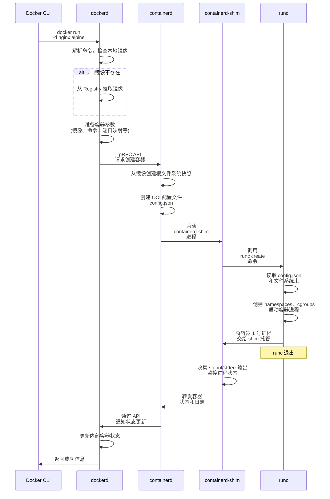
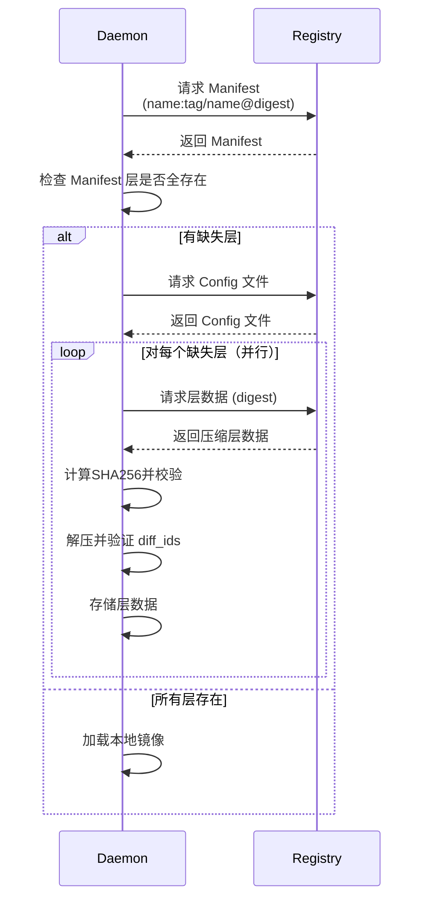

> **“在我机器上是好的！”**
>
> 面对隔壁测试妹子发出的第 N+1 次灵魂拷问，码农小强瞪大血红的眼睛，对着屏幕咆哮。

开发环境风调雨顺，测试环境上吐下泻————这也许不是个例。今天，让我们来帮小强跑通代码，早点下班。

## Docker

> 小强接过测试妹子的电脑，起手就是 `go --version`。
>
> “看！开发和生产环境都用上 `go1.24` 了，测试怎么还在用老掉牙的 `go1.15`！你这样我代码里的 `MapSlice` 泛型怎么跑得起来？还有还有，我有个 `DB_KEY` 环境变量你是不是也没设置？”
>
> 测试妹子一脸无辜：“可是...可是那个陈年老项目必须用 `go1.15` 运行...它也有个名为 `DB_KEY` 的环境变量啊！”
>
> 怎么办？
>
> *(噔噔噔噔出场音效)*
>
> Docker 来了！它大手一挥，生成了一个 `Dockerfile`：
>
> ```dockerfile
> FROM golang:1.15
>
> WORKDIR /app
>
> COPY . .
>
> RUN go build -o main .
>
> CMD ["./main"]
> ```
>
> 这不就解决了！以后运行时只需要 `docker run -e DB_KEY=crazy-friday-V-me-50 myapp` 就行了！

Docker 本质就是个​​超轻量级、标准化的 “集装箱”​​。它把整个应用（代码 & 运行时环境 & 系统工具 & 系统库 & 设置）一起打包塞进一个叫 ***镜像(Image)​​*** 的集装箱里。这个集装箱在哪儿（Mac, WSL, Linux）都能跑，而且跑起来效果一模一样，因为 Docker Engine 提供了一个标准的 “码头” 环境来运行它。

### 使用

集装箱的装箱方式依靠 `Dockerfile` 来定义。`Dockerfile` 是跟命令行类似的脚本文件，里面包含了一系列指令，用于构建镜像。

当然，我们不可能用 `Dockerfile` 从操作系统开始一直写到具体应用。为了简化这个过程，Docker 提供了一些基础镜像（包括操作系统、语言运行时等），我们可以在此基础上进行定制。上文提到的 `golang:1.15` 就是一个基础镜像，它包含了 Go 语言的运行时环境。

`Dockerfile` 的基本语法规则如下：

```shell
指令 [参数...]
```

具体的指令和参数也不多，可以参考 [Dockerfile 官方文档](https://docs.docker.com/engine/reference/builder/)。这里简单列举一下常用的指令：

| 指令 | 说明 | 例子 |
| :--- | :--- | :--- |
| `FROM` | 指定基础镜像 | `FROM archlinux:latest` |
| `WORKDIR` | 设置工作目录 | `WORKDIR /app` |
| `COPY` | 复制文件 | `COPY . .` |
| `RUN` | 执行命令 | `RUN rm -rf /` |
| `CMD` | 设置容器启动命令 | `CMD ["--port", "80"]` |
| `ENTRYPOINT` | 设置容器入口点 | `ENTRYPOINT ["python", "app.py"]` |
| `EXPOSE` | 暴露端口 | `EXPOSE 80` |
| `ENV` | 设置环境变量 | `ENV DB_KEY=crazy-friday-V-me-50` |

编写完 `Dockerfile` 后，便可使用 `docker build -t <image_name> .` 命令构建镜像，得到装好的集装箱。要运行时，使用 `docker run -d <image_name>` 即可，这会生成一个新的 ***容器(container)*** 来运行镜像。

此外，还有一些常用的命令：

- `docker pull <image_name>`：拉取镜像
- `docker exec -it <container_name> /bin/sh`：进入容器内部
- `docker ps`：查看正在运行的容器
- `docker images`：查看本地镜像
- `docker rmi <image_name>`：删除镜像
- `docker rm <container_name>`：删除容器

### 原理

Docker 的核心原理是 **镜像** 和 **容器**：

- ***镜像(Image)*** 是一个轻量级、可执行的独立软件包，包含运行某个软件所需的所有代码、库、依赖项和配置文件。可以将其视为一个只读的模板
- ***容器(Container)*** 是镜像的一个实例，它包含了运行时的所有状态信息（如文件系统、环境变量、网络配置等）。容器是可读写的，可以在其上进行各种操作

但要理解它们的工作机制，我们需要深入了解 Docker 底层的技术实现。

#### 分层文件系统

Docker 镜像采用分层架构，这是 Docker 高效性的关键所在。

##### 镜像分层

例如，我们创建 3 个 `Dockerfile` 文件：

```dockerfile
FROM alpine:latest
```

```dockerfile
FROM alpine:latest
RUN echo "Hello, Docker!" > /docker.txt
```

```dockerfile
FROM alpine:latest
RUN echo "Hello, Docker!" > /docker.txt
RUN echo "Hello, World!" >> /app.txt
```

我们分别构建这 3 个镜像：

```shell
docker build -t myapp:1.0 -f Dockerfile.1 .
docker build -t myapp:1.1 -f Dockerfile.2 .
docker build -t myapp:1.2 -f Dockerfile.3 .
```

现在来看一眼这几个镜像的构建历史：

```shell
$ docker history myapp:1.0
IMAGE          CREATED              CREATED BY                                      SIZE      COMMENT
cea2ff433c61   6 weeks ago          CMD ["/bin/sh"]                                 0B        buildkit.dockerfile.v0
<missing>      6 weeks ago          ADD alpine-minirootfs-3.22.0-x86_64.tar.gz /…   8.31MB    buildkit.dockerfile.v0

$ docker history myapp:1.1
IMAGE          CREATED              CREATED BY                                      SIZE      COMMENT
b25a59ce3006   About a minute ago   RUN /bin/sh -c echo "Hello, Docker!" > /dock…   15B       buildkit.dockerfile.v0
cea2ff433c61   6 weeks ago          CMD ["/bin/sh"]                                 0B        buildkit.dockerfile.v0
<missing>      6 weeks ago          ADD alpine-minirootfs-3.22.0-x86_64.tar.gz /…   8.31MB    buildkit.dockerfile.v0

$ docker history myapp:1.2
IMAGE          CREATED              CREATED BY                                      SIZE      COMMENT
fa5ada0f58a4   About a minute ago   RUN /bin/sh -c echo "Hello, World!" >> /app.…   14B       buildkit.dockerfile.v0
b25a59ce3006   About a minute ago   RUN /bin/sh -c echo "Hello, Docker!" > /dock…   15B       buildkit.dockerfile.v0
cea2ff433c61   6 weeks ago          CMD ["/bin/sh"]                                 0B        buildkit.dockerfile.v0
<missing>      6 weeks ago          ADD alpine-minirootfs-3.22.0-x86_64.tar.gz /…   8.31MB    buildkit.dockerfile.v0
```

可以看到，Docker Engine 从 `Dockerfile` 的第一行开始，逐行解析并执行每个指令，然后在之前的层上创建一个或多个新的堆叠层。当我们构建 `Dockerfile.3` 时，Docker 会重用 `Dockerfile.2` 和 `Dockerfile.1` 中的所有未更改层，从而加快构建速度。


Docker 镜像的每一层都是**只读**的，包含了对文件系统的一组更改。当你运行一个容器时，Docker 会在镜像的所有只读层之上添加一个可写层（容器层）。对于多个使用相同镜像的容器，它们可以共用相同的只读层，而只需要分别在上面添加自己的可写层，就可以做到互不干扰。


这种设计带来的优势显而易见：

- ***节省存储空间***：多个镜像可以共享相同的基础层，拉去也更快
- ***快速启动***：创建容器时，不需要复制整个文件系统，只需要添加一个薄薄的可写层
- ***版本控制***：每一层都有唯一的 SHA256 标识符，便于管理和分发

##### 文件系统结构

Docker 镜像的文件系统结构基于传统 Linux 的 bootfs 和 rootfs 概念：

- ***bootfs***：包含 bootloader 和 kernel。当容器启动后，bootfs 会被卸载以释放内存，因为同一台机器上的所有容器都共享宿主机的 kernel
- ***rootfs***：位于 bootfs 之上，包含典型 Linux 系统中的 `/dev`、`/proc`、`/bin`、`/etc` 等标准目录和文件。我们常说的不同的 Linux 发行版，其实就是在 rootfs 上做了不同的配置和定制，一个精简的 OS (如 Alpine Linux) 的 rootfs 可能只有几 MB

对于 Docker 镜像来说，它会使用宿主机的 bootfs，然后在上面一层层地叠加系统 rootfs 和普通镜像层。当镜像启动时，Docker 会在最上方再添加一层可写层作为容器。


在传统的 Linux 系统中，boot 完成后，rootfs 会从只读模式切换到读写模式。但在 Docker 中，rootfs 永远保持只读状态，Docker 利用 ***联合挂载 (Union Mount)*** 技术在 rootfs 上挂载更多的只读文件系统。

联合挂载目前默认使用 OverlayFS。它可以将多个目录"联合挂载"到同一个挂载点，形成一个统一的文件系统视图。

在 OverlayFS 中，包括了：

- ***lowerdir***：只读的下层目录，即镜像层
- ***upperdir***：可读写的上层目录，即容器层
- ***merged***：这是从用户视角看到的统一文件系统视图，实际上是将 lowerdir 和 upperdir 结合在一起得到的

当容器需要修改文件时，OverlayFS 使用 CoW 策略：

- 如果文件只是读取，直接从对应层读取
- 如果文件需要修改，先将文件从下层复制到容器层，然后在容器层进行修改
- 如果文件需要删除，在容器层创建一个"whiteout"文件来标记删除

OverlayFS 的使用基于 overlay2 驱动，其负责管理镜像层和容器层。除此之外，Docker 还支持其他存储驱动，如：

- ***overlay2***：推荐的存储驱动，基于 OverlayFS，性能优秀，支持 CoW
- ***aufs***：较老的驱动，在某些系统上仍在使用
- ***devicemapper***：基于块设备的存储，使用精简配置和快照
- ***btrfs/zfs***：支持高级功能如快照、压缩、去重，需要专门的文件系统支持，提供了原生的快照和克隆功能

可以使用以下命令查看存储驱动信息：

```shell
docker info | grep "Storage Driver"
docker system df -v
```

#### 内部架构

从全局上看，Docker 采用客户端-服务器架构，整个系统由多个关键组件协同工作：

- ***Docker Client***

  Docker Client 是用户与 Docker 系统交互的主要接口。其为用户提供了 `docker` 命令，以执行各种操作。当用户执行命令时，Docker Client 使用 HTTP/HTTPS 协议与 Docker Daemon 通信。

- ***Docker Daemon***

  Docker Daemon (`dockerd`) 是 Docker 的核心服务，它负责了整个生命周期的管理，包括：

  - API 服务器：监听来自客户端的 REST API 请求
  - 镜像管理：拉取、构建、存储和删除镜像
  - 容器生命周期：创建、启动、停止、删除容器
  - 网络管理：创建和管理虚拟网络
  - 存储管理：管理数据卷和挂载点
  - 安全控制：权限验证、资源隔离

- ***Docker Registry***

  Registry 是存储和分发镜像的服务，其主要包括了官方仓库 [Docker Hub](https://hub.docker.com/)、阿里云等公共仓库、私有仓库等。


以上三者是对用户来说感知较强的部分。除此以外，Docker 还包括了以下组件：

- ***containerd***：负责容器的生命周期管理，包括镜像拉取、容器创建、启动、停止等操作

- ***runc***：负责创建和运行容器，直接与 Linux 内核交互

  它是一个轻量级的、单用途的 CLI，是 OCI (Open Container Initiative) 运行时规范的​​参考实现

- ***Shim 进程***：为每个容器提供一个轻量级的进程，负责容器的监控和信号处理

##### 容器运行

我们以用户执行 `docker run -d nginx:alpine` 为例，来说明容器是如何运行的。

1. Docker CLI (docker命令) 通过 REST API 将请求发送给 `dockerd`
2. `dockerd` 解析命令，检查本地是否有镜像。如果没有，则拉取（下文会详细解释这一步）
3. `dockerd` 准备好创建容器的参数，包括镜像、命令、端口映射、卷挂载、环境变量等。
4. `dockerd` 通过其内部的 `containerd` 客户端调用 `containerd` 的 gRPC API，请求创建并启动一个容器
5. `containerd` 接收到请求：
    - 准备容器运行时所需的数据，从镜像创建根文件系统快照
    - 创建 OCI 规范配置文件 `config.json`
    - 启动一个 `containerd-shim` 进程，将容器束（配置和文件系统）交给它
6. `containerd-shim` 进程接收到任务：
    - 调用 `runc create` 命令，指示 `runc` 创建容器进程环境
    - `runc` 读取 `config.json` 和文件系统束
    - `runc` 调用 Linux 内核创建所需的 namespaces、cgroups，设置安全策略
    - `runc` 在设置好的环境中启动容器内的 `/docker-entrypoint.sh` 进程
7. 容器进程启动
8. `runc` 在成功创建并启动容器进程后退出，将容器的 1 号进程交由 `containerd-shim` 托管
9. `containerd-shim` 开始：
    - 收集容器的 `stdout`/`stderr` 输出
    - 监控容器内 1 号进程的状态
    - 将容器的状态信息和日志转发回 `containerd`
10. `containerd` 记录容器状态，并将更新后的状态通过其 API 通知回 `dockerd`
11. `dockerd` 更新其内部的容器状态，并向用户 CLI 返回成功信息



值得一提的是，`runc` 调用 Linux 内核的步骤中，涉及到了 Docker 最关键的隔离技术，使得多个容器能够在同一宿主机上安全地运行。

容器的隔离通过调用 Linux 内核的 Namespace 和 Cgroups 技术实现：

- Namespace 提供进程级别的隔离：

  - PID namespace：进程隔离，容器内的进程无法看到宿主机或其他容器的进程
  - NET namespace：网络隔离，每个容器有独立的网络栈
  - IPC namespace：进程间通信隔离
  - MNT namespace：文件系统挂载点隔离
  - UTS namespace：hostname 和 domainname 隔离
  - USER namespace：用户和组ID隔离
  - Cgroup namespace：cgroup 视图隔离

- Cgroups 提供资源限制和监控：

  - CPU：限制 CPU 使用率，设置权重和配额
  - Memory：限制内存使用，防止 OOM
  - Disk I/O：限制磁盘读写速度
  - Network I/O：限制网络带宽
  - Device：控制设备访问权限

例如，运行容器时可以设置资源限制：

```bash
# 内存 512MB，CPU 0.5 核
docker run -m 512m --cpus=0.5 nginx
# 查看 cgroup
docker stats <container_name>
# 查看 namespace
docker exec <container_name> ls -la /proc/self/ns/
```

##### 镜像下载

当 Daemon 的任务从 Registry 下载镜像时，会经历以下流程：

1. ***请求 Manifest***

    Daemon 向 Registry 发送完整镜像引用，格式为 `<registry>/<repository>:<tag>` 或 `<registry>/<repository>@<digest>`

    Registry 返回JSON 格式的镜像 Manifest 文件，包含：

    - `config.digest`：镜像配置文件的 digest
    - `layers[]` 数组：每层的压缩包 digest、媒体类型和大小

    例如，我们可以用下面的命令获得 `redis:8.0` 的 Manifest：

    ```shell
    docker manifest inspect redis@sha256:fc933558828a3b14d4ef4a0ce0c5c5b3947573c3257ab9106b1d3379489966a1
    ```

    <details>
    <summary>点击查看响应</summary>
    <div markdown="1">

    ```json
    {
        "schemaVersion": 2,
        "mediaType": "application/vnd.oci.image.manifest.v1+json",
        "config": {
                "mediaType": "application/vnd.oci.image.config.v1+json",
                "digest": "sha256:f2cd22713a18238b9343c3428c8b4edef867c0f2318424cd741939056b75454a",
                "size": 6349
        },
        "layers": [
                {
                        "mediaType": "application/vnd.oci.image.layer.v1.tar+gzip",
                        "digest": "sha256:3da95a905ed546f99c4564407923a681757d89651a388ec3f1f5e9bf5ed0b39d",
                        "size": 28230143
                },
                {
                        "mediaType": "application/vnd.oci.image.layer.v1.tar+gzip",
                        "digest": "sha256:fb940e68fdcf4b35c99606d44c888de6be98fac1920ccfe8a79cf335b629104c",
                        "size": 1101
                },
                {
                        "mediaType": "application/vnd.oci.image.layer.v1.tar+gzip",
                        "digest": "sha256:944aad9f1ff75bd85011b850611885fa4b0e92b5d118bfa27684bab65f2e8881",
                        "size": 875
                },
                {
                        "mediaType": "application/vnd.oci.image.layer.v1.tar+gzip",
                        "digest": "sha256:574052bfcd56b6ae1f87c2d157f6ee1d8901bb3e4b2ec05c10f00025f60d436c",
                        "size": 21273973
                },
                {
                        "mediaType": "application/vnd.oci.image.layer.v1.tar+gzip",
                        "digest": "sha256:bae11d1760990973a66f962751240ccc7a3a400070d36947db13dd7a193df93b",
                        "size": 97
                },
                {
                        "mediaType": "application/vnd.oci.image.layer.v1.tar+gzip",
                        "digest": "sha256:4f4fb700ef54461cfa02571ae0db9a0dc1e0cdb5577484a6d75e68dc38e8acc1",
                        "size": 32
                },
                {
                        "mediaType": "application/vnd.oci.image.layer.v1.tar+gzip",
                        "digest": "sha256:58f72891ca7000d592de5222eac6a3cb14cdb43004e814291f053239ff198a9a",
                        "size": 2113
                }
        ],
        "annotations": {
                "com.docker.official-images.bashbrew.arch": "amd64",
                "org.opencontainers.image.base.digest": "sha256:28c1e76b454bb65a9138a2562708e7fa3a937ae88a36b30fe8a12e3e1d447ce3",
                "org.opencontainers.image.base.name": "debian:bookworm-slim",
                "org.opencontainers.image.created": "2025-07-06T17:00:21Z",
                "org.opencontainers.image.revision": "101262a8cf05b98137d88bc17e77db90c24cc783",
                "org.opencontainers.image.source": "https://github.com/redis/docker-library-redis.git#101262a8cf05b98137d88bc17e77db90c24cc783:debian",
                "org.opencontainers.image.url": "https://hub.docker.com/_/redis",
                "org.opencontainers.image.version": "8.0.3"
        }
    }
    ```
    </div>
    </details>

2. ***检查本地层***

    Daemon 根据 Manifest 中的各层 digest 检查本地存储（`/var/lib/docker/overlay2`）

3. ***下载 Config 文件***

    若本地缺失某些层，Daemon 根据 `config.digest` 下载包含镜像元数据的 Config 文件。

    例如，使用以下命令下载 Config 文件：

    ```shell
    DOCKER_TOKEN=$(curl -s "https://auth.docker.io/token?service=registry.docker.io&scope=repository:library/redis:pull" | jq -r .token)
    curl -L -o config.json -H "Authorization: Bearer $DOCKER_TOKEN" https://registry-1.docker.io/v2/library/redis/blobs/sha256:f2cd22713a18238b9343c3428c8b4edef867c0f2318424cd741939056b75454a
    ```

    <details>
    <summary>点击查看 config.json</summary>
    <div markdown="1">

    ```json
    {
        "architecture": "amd64",
        "config": {
            "ExposedPorts": {
                "6379/tcp": {}
            },
            "Env": [
                "PATH=/usr/local/sbin:/usr/local/bin:/usr/sbin:/usr/bin:/sbin:/bin",
                "REDIS_DOWNLOAD_URL=https://github.com/redis/redis/archive/refs/tags/8.0.3.tar.gz",
                "REDIS_DOWNLOAD_SHA=2467b9608ecbcc2c0d27397c0c2406b499b6f68bc08ac9f6380b1faf2113ae6f"
            ],
            "Entrypoint": [
                "docker-entrypoint.sh"
            ],
            "Cmd": [
                "redis-server"
            ],
            "Volumes": {
                "/data": {}
            },
            "WorkingDir": "/data"
        },
        "created": "2025-07-06T17:00:21Z",
        "history": [
            {
                "created": "2025-06-30T00:00:00Z",
                "created_by": "# debian.sh --arch 'amd64' out/ 'bookworm' '@1751241600'",
                "comment": "debuerreotype 0.15"
            },
            ...
            {
                "created": "2025-07-06T17:00:21Z",
                "created_by": "CMD [\"redis-server\"]",
                "comment": "buildkit.dockerfile.v0",
                "empty_layer": true
            }
        ],
        "os": "linux",
        "rootfs": {
            "type": "layers",
            "diff_ids": [
                "sha256:1bb35e8b4de116e84b2ccf614cce4e309b6043bf2cd35543d8394edeaeb587e3",
                "sha256:89190f8d09cad78d1ab9e4f50db88352907a39f1a7d09d35c12b681beb14d6c8",
                "sha256:7d6d8a829f893ae6c76eeb44392e5d16177e0c382bbed85439a671c63705e9d4",
                "sha256:fb05cf42b77d76237a30b7b7843da82814c481312ace028313327893f7a5050c",
                "sha256:52c0332379b5ec472fd6569600a4d132ed1b839cf7ba2c0bf8d98115961c31e2",
                "sha256:5f70bf18a086007016e948b04aed3b82103a36bea41755b6cddfaf10ace3c6ef",
                "sha256:b0fcde7055ea9c6447c8389153aeed0969010a19b6be8937156bcc690af7fff0"
            ]
        }
    }
    ```

    </div>
    </details>

4. ***分层下载与校验***

    对 Manifest 中的缺失层执行：

    - 从 Registry 下载压缩层数据
    - 立即计算压缩包 SHA256，与 Manifest 的 `layers[].digest` 比对
    - 校验通过后保持压缩状态存储到本地

5. ***解压与最终验证***

    所有层下载完成后：

    - 解压各层数据
    - 按 Config 的 `rootfs.diff_ids` 逐层验证解压内容
    - 构建镜像文件系统



#### 网络模式

Docker 提供了灵活的网络解决方案，支持多种网络模式，包括：

- ***Bridge 网络***（默认）：Docker 在宿主机上创建虚拟网桥 `docker0`，每个容器都有独立的 IP 地址，容器间可以通过 IP 或容器名通信。通过 iptables 规则实现端口映射

  ```mermaid
  graph LR;
    A[容器] -- veth pair --> B[docker0] -- iptables --> C[Host Network] --> D[目标地址]
  ```

- ***Host 网络***：容器直接使用宿主机的网络栈

- ***None 网络***：容器没有网络连接

- ***Overlay 网络***：跨主机的容器通信，在 Docker Swarm 模式下使用，通过 VXLAN 技术实现

可以使用以下命令查看网络列表：

```shell
docker network ls
```

也可以自定义网络并使用：

```shell
docker network create --driver bridge my-network
docker run --network my-network nginx
```

### 实践指北

Docker 的使用中，有几个容易踩的坑和需要注意的地方：

- ***`CMD` 和 `ENTRYPOINT`***

  - `CMD` 指令指定了容器启动时的默认命令，但可以被 `docker run` 命令行参数覆盖。
  - `ENTRYPOINT` 指令则是容器的入口点，无法被覆盖。

  通常情况下，我们会将应用的启动命令放在 `ENTRYPOINT` 中，而将可选的参数放在 `CMD` 中。例如：

  ```dockerfile
  ENTRYPOINT ["python", "app.py"]
  CMD ["--port", "80"]
  ```

- ***`EXPOSE` 指令***

  `EXPOSE` 指令并不会实际发布端口，它只是告诉 Docker 在运行时应该开放哪些端口。要实际发布端口，需要在 `docker run` 命令中使用 `-p` 参数：

  ```shell
  docker run -p 80:80 my-image
  ```

- ***`apt-get` 的使用***

  `apt-get update` 和 `apt-get install` 应当合并为一条指令，防止 `RUN apt-get update` 的缓存层被重用导致找不到软件包。

  通常，还可以在安装后清理包列表来减小镜像体积：

  ```dockerfile
  RUN apt-get update && apt-get install -y <package-name> && apt-get clean && rm -rf /var/lib/apt/lists/*
  ```

- ***删除缓存***

  安装软件或包后，应该尽量避免在 Dockerfile 中留下不必要的文件，以减小镜像体积。尤其是 apt-get、pip、npm 等包管理工具的缓存文件：

  ```dockerfile
  RUN pip install --no-cache-dir -r requirements.txt
  RUN npm install && npm cache clean --force
  ```

- ***`.dockerignore` 文件***

  在构建 Docker 镜像时，可以使用 `.dockerignore` 文件来指定哪些文件和目录应该被排除在外，以减小上下文的大小。这个文件的语法与 `.gitignore` 类似。

  例如，以下 `.dockerignore` 文件将排除 `node_modules` 目录和所有 `.log` 文件：

  ```dockerignore
  node_modules
  *.log
  ```

- ***构建顺序问题***

  由于 `Dockerfile` 中的每一条指令都会创建一个新的镜像层，因此指令的顺序会影响最终镜像的大小和构建速度。一般来说，应将不常变动的指令放在前面，将频繁变动的指令放在后面，以充分利用 Docker 的缓存机制。

  比如，`RUN` 指令通常会尽量合并为一条指令、`COPY` 会尽量靠后放置。

- ***多阶段构建***

  有时候构建镜像需要安装大量依赖，但在实际运行时并不需要它们。如果保留这些依赖，会导致产物体积过大。

  多阶段构建是指在一个 Dockerfile 中使用多个 `FROM` 指令，以便在不同的阶段中构建不同的镜像。这种方式可以有效地减小最终镜像的体积，因为只会将最终阶段所需的文件复制到最终镜像中。

  例如，以下 Dockerfile 使用了多阶段构建：

  ```dockerfile
  # 第一阶段：构建应用
  FROM golang:1.16 AS builder
  WORKDIR /app
  COPY . .
  RUN go build -o myapp

  # 第二阶段：运行应用
  FROM alpine:latest
  COPY --from=builder /app/myapp /usr/local/bin/myapp
  CMD ["myapp"]
  ```

- ***日志处理***

  通常来讲，日志不应当直接写入容器内的文件，这会使得容器所占体积不断增大，且会随着容器生命周期的结束而丢失。

  更好的做法是使用 Docker 的 `docker logs` 命令或日志驱动（如 json-file, fluentd, syslog）来收集管理日志

## docker-compose

> “Docker 确实能让我同时运行不同的环境了，可是...你这又是 Go、又是 Redis、又是 Postgres，还有 ES 也要配置，每次挨个启动然后设置网络连接也太麻烦了！” 测试妹子一顿抱怨，“要不...要不我去找运维小帅帮我写个脚本来一键启动？”
>
> “且慢！” 小强伸手拦住了她，“我还有比脚本更好的办法！”

对于复杂的应用场景，Docker Compose 为多个服务的集中部署提供了一种更为简便的解决方案。通过定义一个 `docker-compose.yml` 文件，可以将多个服务的配置集中管理，并通过一条命令启动所有服务。

```yaml
version: '3'
services:
  web:
    build: .
    ports:
     - "5000:5000"
  redis:
    image: "redis:alpine"
```

使用 Docker Compose，只需在项目根目录下运行 `docker-compose up` 命令，便可以一键启动所有服务，省去了逐个启动和配置的麻烦。

```shell
docker-compose up -d
```

### 使用

yaml 文件中主要包含以下内容：

- ​`Services`:​​ 定义应用程序的各个组件，包括 web 服务器、数据库、缓存、消息队列等。每个服务对应一个或多个容器。包括：
  - `image`: 使用的 Docker 镜像或构建上下文的路径
  - `ports`: 端口映射 `<host_port>:<container_port>`
  - `volumes`: 数据卷挂载 `<host_path>:<container_path>`、命名卷
  - `environment`: 设置环境变量 `<key>:<value>`
  - `networks`: 指定容器连接的网络 `<network_name>`
  - `depends_on`: 定义服务启动顺序依赖
  - `command`: 覆盖容器默认启动命令
  - `restart`: 设置容器退出时的重启策略，包括 `always`、`unless-stopped`、`on-failure` 等
  - `healthcheck`: 定义容器健康检查
  - `deploy`: 定义部署配置，包括副本数、资源限制、更新策略等
  - `profiles`: 标记服务只在激活特定 profile 时运行
- `Networks`:​​ 定义容器之间通信所需的网络。默认会创建一个与应用名同名的桥接网络，所有服务默认连接此网络，并使用服务名作为主机名相互访问。也可以定义自定义网络，实现更复杂的网络拓扑或隔离
- `Volumes`:​​ 定义用于持久化数据的命名卷。底层调用 Docker volume API。配置中可以指定驱动或驱动选项
- `Configs`:​​ 允许将配置文件注入服务容器中
- `Secrets`:​​ 用于安全地向服务容器传递敏感信息

当运行 `docker-compose up` 时，Docker Compose 会依次执行：

1. ​​创建网络：如果定义中指定了网络或使用默认网络，则创建
2. ​创建卷：​​如果定义中指定了卷，则创建
3. ​拉取镜像：​​如果本地不存在镜像或指定了 `--pull`，则从仓库拉取
4. ​构建镜像：​​如果使用 `build:` 选项，则根据上下文构建镜像
5. 创建并启动容器：​​为每个服务创建并启动容器，应用所有配置

### 实践指北

- ***`.env` 文件***

  `.env` 文件用于定义环境变量，可以在 `docker-compose.yml` 中引用。通过将敏感信息（如数据库密码、API 密钥等）放入 `.env` 文件，可以避免将这些信息硬编码到配置文件中。

  例如，以下是一个简单的 `.env` 文件：

  ```env
  DB_HOST=localhost
  DB_PORT=5432
  DB_USER=myuser
  DB_PASSWORD=mypassword
  ```

  在 `docker-compose.yml` 中，可以使用 `${VARIABLE_NAME}` 的方式引用这些环境变量：

  ```yaml
  version: '3'
  services:
    web:
      build: .
      ports:
       - "5000:5000"
      environment:
       - DB_HOST=${DB_HOST}
       - DB_PORT=${DB_PORT}
       - DB_USER=${DB_USER}
       - DB_PASSWORD=${DB_PASSWORD}
    redis:
      image: "redis:alpine"
  ```

  `.env` 文件不需要显示指定，在运行 `docker-compose up` 时，Docker Compose 会自动加载并应用其中的环境变量。

- ***`depends_on` 关键字***

  `depends_on` 关键字用于定义服务之间的启动顺序。例如，如果 `web` 服务依赖于 `redis` 服务，可以在 `docker-compose.yml` 中这样配置：

  ```yaml
  version: '3'
  services:
    web:
      build: .
      ports:
       - "5000:5000"
      depends_on:
       - redis
    redis:
      image: "redis:alpine"
  ```

  这样，在启动 `web` 服务之前，Docker Compose 会先启动 `redis` 服务。

  然而，它只保证启动顺序，并不会等待 `redis` 服务完全就绪后再启动 `web` 服务。这可能导致 `web` 服务在 `redis` 服务尚未准备好时就开始运行，从而出现连接失败等问题。

  为了解决这个问题，可以在 `web` 服务中添加重试逻辑，或者使用 `healthcheck` 关键字来定义服务的健康检查。

- ***`docker-compose down` 行为***

  `docker-compose down` 命令用于停止并删除由 `docker-compose up` 创建的所有容器、网络和卷。它会执行以下操作：

  1. 停止所有运行中的容器
  2. 删除所有容器
  3. 删除所有网络

  需要注意的是，该命令为了保护持久化数据，不会删除已存在的卷。如果希望删除卷，可以使用 `docker-compose down -v` 命令。
