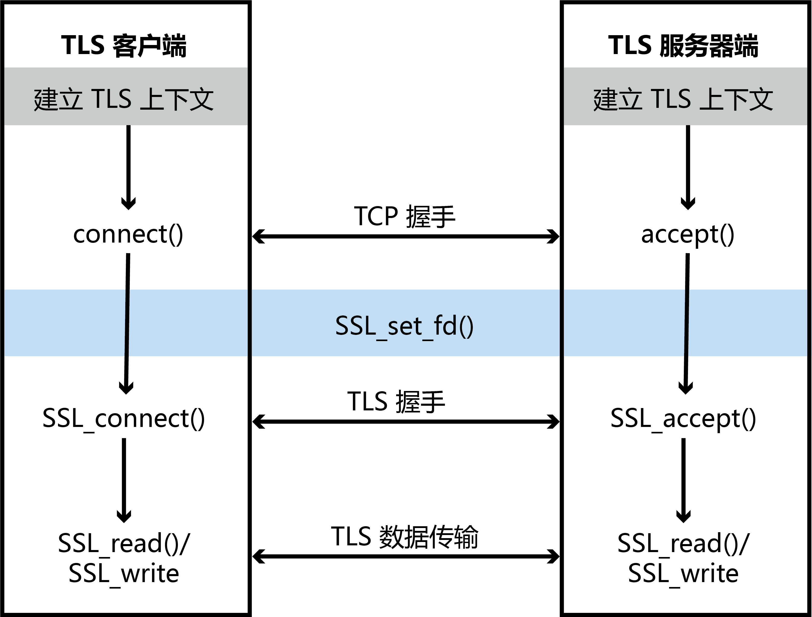

本文讨论了 PKI 和 OpenSSL 的相关内容。别急，这个也还没写完……

# PKI

## 中间人攻击

假设Alice和Bob需要通信，那么他们必然需要交换密钥：

- Alice将自己的公钥发送给Bob
- Bob使用Alice的公钥去加密一个会话密钥 $K$，并将加密后的会话密钥密钥发回给Alice
- 这个加密后的会话密钥只有Alice可以用她的私钥解开

尽管这个过程可以防止攻击者直接窃取到会话密钥，但依然无法防止中间人攻击（MITM Attack），如图所示。假设Mallory是一个大黑阔：


- Alice的公钥发送出去后，被Mallory截获
- Mallory使用扣留了Alice的公钥，并把自己的公钥发给了Bob
- Bob以为发来的公钥是Alice的，于是用这个公钥加密了会话密钥并发回去
- Mallory继续解惑Bob发回的内容，使用自己的私钥解密出了会话密钥
- Mallory使用刚刚得到的Alice的公钥加密会话密钥，并发给Alice
- Alice用自己的私钥解密得到会话密钥

于是，Mallory通过这个过程获得了会话密钥。这个过程也被称为中间人攻击。

数字签名可以防止中间人攻击。比如，公安局是可信的，所以Alice和Bob可以这样交换会话密钥：

- Alice亲自去一趟公安局，公安局使用完善的手段验明来者正是Alice
- 公安局准备一份包括Alice名字、公钥及其它一些信息的文件，并使用公安局的私钥给这份文件签名
- Alice发送自己的公钥给Bob，同时还发了一份公安局签名过的文件
- 改不了公安局签名文件的Mallory，只能眼睁睁看它溜走
- Bob亲自去公安局获取公安局的公钥
- Bob用公安局的公钥解密签名文件，确认对方就是Alice，于是生成会话密钥并发回

在网络上，实现这个过程的方案被称为公钥基础设施（PKI），其包含两个部分：

- 认证机构（CA），也就是上文的公安局。其一半由一些可信的公司充当
- 数字证书，该证书需要由CA签名后才有效

## 公钥证书

通常，公钥证书的形式是由X.509标准制定的。我们使用OpenSSL获取东南大学网站的证书：

```shell
openssl s_client -showcerts -connect www.seu.edu.cn:443 </dev/null
```

上面的命令中，`openssl s_client` 表示开启一个客户端，`-showcerts` 选项则表示打印出所有接收到的证书。运行结果很长，不粘贴了。其中形如

```
-----BEGIN CERTIFICATE-----
MIIG8TCCBVmgAwIBAgIRALh982dHm8KpFIkWi8LAflIwDQYJKoZIhvcNAQEMBQAw
省略
oHZAPXY=
-----END CERTIFICATE-----
```

的内容就是证书的主体了。这一段是BASE64编码过的。我们可以先将其保存到一个文件（`seu.pem`）中，然后解码为二进制数据：

```shell
openssl x509 -in seu.pem -outform der > seu.der
```

解码后的内容依然需要使用查看二进制的工具查看。

我们也可以直接转换为可读的形式：

```shell
openssl x509 -in seu.pem -text -noout
```

得到结果如下：

```
Certificate:
    Data:
        Version: 3 (0x2)
        Serial Number:
            b8:7d:f3:67:47:9b:c2:a9:14:89:16:8b:c2:c0:7e:52
        Signature Algorithm: sha384WithRSAEncryption
        Issuer: C = CN, O = "TrustAsia Technologies, Inc.", CN = TrustAsia RSA OV TLS CA G3
        Validity
            Not Before: Jun 13 00:00:00 2023 GMT
            Not After : Jul 12 23:59:59 2024 GMT
        Subject: C = CN, ST = \E6\B1\9F\E8\8B\8F\E7\9C\81, O = \E4\B8\9C\E5\8D\97\E5\A4\A7\E5\AD\A6, CN = *.seu.edu.cn
        Subject Public Key Info:
            Public Key Algorithm: rsaEncryption
                Public-Key: (2048 bit)
                Modulus:
                    00:bc:9d:8d:e9:59:d7:3c:03:6c:51:ee:ff:c9:8c:
                    省略
                    9d:37
                Exponent: 65537 (0x10001)
        X509v3 extensions:
            省略
    Signature Algorithm: sha384WithRSAEncryption
    Signature Value:
        96:32:81:ab:71:da:fc:de:df:c0:8a:3f:e6:4b:2e:66:0f:b7:
        省略
        c9:a0:76:40:3d:76
```

其中

- `Serial Number` 是证书的序列号。每个证书都有一个独特的序列号
- `Signature Algorithm` 为签名的加密方式，例如东南大学的证书使用了SHA384和RSA
- `Issuer` 表明证书是谁签发的，这里是 TrustAsia Technologies, Inc.
- `Validity` 规定了证书的有效时间
- `Subject` 表明证书拥有者的信息，也就是之前提到“Alice的名字”。这也是证书的主要目的
- `Subject Public Key Info` 为公钥。这里由于为RSA加密，故列出来模和指数
- `X509v3 extensions` 为证书的一些扩展信息

## CA

根据我们前文的讨论，CA主要由两个作用：

- 验证 `Subject`。CA需要检查申请者是否真的是提交的 `Subject`。例如，我想给自己的域名 `ch3nyang.top` 搞个证书，那我会向CA提交相关信息。CA验证提交的信息，如果确认我就是 `ch3nyang.top` 的拥有者，就会给我发证书。

  验证的手段很多，包括whois查询、联系注册机构（RA）、甚至联络政府部门。

- 签发数字证书。一旦验证了身份，就可以下发证书。任何人只要持有CA的公钥，就可以验证证书真伪。

我们使用OpenSSL模拟整个认证的过程：

### 成为CA

- 部署CA

  我们创建一个 `myCA`

  ```shell
  mkdir myCA
  cd myCA
  mkdir certs newcerts conf
  touch serial index.txt
  echo 1000 > serial
  ```

- 为 `myCA` 生成公私钥对和证书

  ```shell 
  openssl req -x509 -newkey rsa:4096 -sha256 -days 3650 -keyout myCA_key.pem -out myCA_cert.pem
  ```

  OpenSSL会要求你输入CA的一些基本信息。

  > 当然，也可以直接使用配置文件。比如，我们创建 `conf/generateCA.cnf`：
  >
  > ```conf
  > [ req ]
  > default_keyfile = myCA_key.pem
  > default_md = md5
  > prompt = no
  > distinguished_name = ca_distinguished_name
  > x509_extensions = ca_extensions
  > 
  > [ ca_distinguished_name ]
  > organizationName = ch3nyang
  > commonName = cyCA
  > emailAddress = ch3nyang@ch3nyang.top
  > 
  > [ ca_extensions ]
  > basicConstraints = CA:true
  > ```
  >
  > 其中，`ca_distinguished_name` 部分可以填入想填写的信息。
  >
  > 然后指定配置文件生成：
  >
  > ```shell
  > openssl req -x509 -newkey rsa:4096 -sha256 -days 3650 -out myCA_cert.pem -config conf/generateCA.cnf
  > ```
  
  很容易看出，`myCA_key.pem` 就是CA的私钥，`myCA_cert.pem` 就是CA的公钥。同样的，可以查看证书的公钥：
  
  ```shell
  openssl x509 -in myCA_cert.pem -text -noout
  ```

### 从CA获取证书

假设一个银行想从我们刚刚创建的CA处获取证书。

- 生成公私钥对

  首先为银行生成公私钥：

  ```shell
  openssl genrsa -aes128 -out certs/bank_key.pem 2048
  ```

  `bank_key.pem` 会由用户设置的密码保护（如果不需要，可以把 `-aes128` 去掉）。用下面的指令查看其内容：

  ```shell
  openssl rsa -noout -text -in certs/bank_key.pem
  ```

  输出为：

  ```
  Private-Key: (2048 bit, 2 primes)
  modulus:
      00:c2:75:f4:01:48:a6:c6:ef:e7:bb:b7:97:00:4b:
      省略
      1b:03
  publicExponent: 65537 (0x10001)
  privateExponent:
      29:08:23:82:eb:d6:09:0f:11:0a:1a:7c:79:bb:02:
      省略
      89
  prime1:
      00:e7:d3:11:7a:66:ab:59:0d:78:a8:e4:3c:c2:af:
      省略
      aa:2e:d3:82:43:f0:69:3e:cb
  prime2:
      00:d6:bd:66:38:47:08:67:a7:93:e7:ed:d8:93:94:
      省略
      65:b1:1d:f1:03:b4:f0:15:a9
  exponent1:
      53:7a:fe:60:45:78:8e:a8:fb:3a:56:76:4a:e5:57:
      省略
      7b:c1:4e:b7:88:6b:5d:e1
  exponent2:
      43:27:81:e3:11:9b:b8:46:b8:c3:6c:27:31:a7:e9:
      省略
      50:4c:6b:c5:db:fc:c4:d9
  coefficient:
      1b:ce:87:95:bf:58:a2:9b:a5:fd:96:97:38:ea:76:
      省略
      62:68:bc:2b:32:50:de:59
  ```

  其中包含了公钥、私钥、模数的两个质因子和一些用于优化计算的参数。

- 生成证书签名请求

  使用下面的命令生成证书请求：

  ```shell
  openssl req -new -key certs/bank_key.pem -out certs/bank.csr -sha256
  ```

  需要注意的是，`Common Name` 处需要填写网址，例如 `ch3nyang.bank/`。

  > **踩坑**
  >
  > Common Name 处需要填写网址，其中可以使用通配符。

  查看 `bank.csr`：

  ```shell
  openssl req -in certs/bank.csr -text -noout
  ```

  输出为

  ```
  Certificate Request:
      Data:
          Version: 1 (0x0)
          Subject: C = CN, O = Ch3nyang Bank, CN = ch3nyang.bank/, emailAddress = bank@ch3nyang.top
          Subject Public Key Info:
              Public Key Algorithm: rsaEncryption
                  Public-Key: (2048 bit)
                  Modulus:
                      00:c2:75:f4:01:48:a6:c6:ef:e7:bb:b7:97:00:4b:
                      省略
                      1b:03
                  Exponent: 65537 (0x10001)
          Attributes:
              (none)
              Requested Extensions:
      Signature Algorithm: sha256WithRSAEncryption
      Signature Value:
          3c:3c:bc:11:30:7d:d5:ad:b2:4b:c6:a7:6a:a3:c7:93:b8:84:
          省略
          e4:33:b8:a8
  ```

  可以看出，该文件也包含了银行自己用自己的私钥进行的签名。这是为了让CA确认这个公钥确实来自银行。

  生成完毕后，银行会将这个文件发给CA。

- CA验证与签名

  CA签名默认使用的配置文件是 `/usr/lib/ssl/openssl.cnf`，该配置会默认寻找 `./demoCA` 文件夹中的内容，因此我们这里需要自定义配置文件：

  ```shell
  code conf/myCA.cnf
  ```

  内容为：

  ```
  [ ca ]
  default_ca      = myCA
  
  [ myCA ]
  dir            	= /myCA
  database       	= $dir/index.txt
  new_certs_dir  	= $dir/newcerts
  
  certificate    	= $dir/myCA_cert.pem
  serial         	= $dir/serial
  private_key    	= $dir/myCA_key.pem
  RANDFILE       	= $dir/.rand
  
  default_days    = 365
  default_crl_days= 30
  default_md      = sha256
  unique_subject  = no
  policy          = policy_any
  
  [ policy_any ]
  countryName             = optional
  stateOrProvinceName     = optional
  localityName            = optional
  organizationName        = optional
  organizationalUnitName  = optional
  commonName              = optional
  emailAddress            = supplied
  ```

  这里指定了相关文件的位置。

  > **踩坑**
  >
  > `dir` 处必须要填写完整路径，而不是项目的相对路径。在 Linux 下甚至不能用 `~` 路径。
  
  CA根据收到的内容验证完毕后，会签发证书：
  
  ```shell
  openssl ca -in certs/bank.csr -out certs/bank_cert.pem -md sha256 -config conf/myCA.cnf
  ```

### 部署证书

- 未添加CA公钥的情形

  首先，将银行的公私钥合并：

  ```shell
  cp certs/bank_key.pem certs/bank_all.pem
  cat certs/bank_cert.pem >> certs/bank_all.pem
  ```

  然后启动服务：

  ```shell
  openssl s_server -cert certs/bank_all.pem -accept 4433 -www
  ```

  为了使用网址访问，我们将 `ch3nyang.bank` 加入到 `/etc/hosts` 中去。

  我们在新的shell中尝试连接：

  ```shell
  openssl s_client -connect ch3nyang.bank:4433
  ```

  得到结果

  ```
  CONNECTED(00000003)
  depth=0 C = CN, O = Ch3nyang Bank, CN = ch3nyang.bank/, emailAddress = bank@ch3nyang.top
  verify error:num=20:unable to get local issuer certificate
  verify return:1
  depth=0 C = CN, O = Ch3nyang Bank, CN = ch3nyang.bank/, emailAddress = bank@ch3nyang.top
  verify error:num=21:unable to verify the first certificate
  省略
  ```

  这是由于我们自己创建的CA并没有被添加进去，因此 `myCA` 签发的证书也不被认可。

  如果使用浏览器访问会得到同样的结果。

- 添加CA公钥的情形

  访问时带上CA：

  ```shell
  openssl s_client -connect ch3nyang.bank:4433 -CAfile myCA_cert.pem
  ```

  得到结果

  ```
  CONNECTED(00000003)
  depth=1 O = ch3nyang, CN = cyCA, emailAddress = ch3nyang@ch3nyang.top
  verify return:1
  depth=0 C = CN, O = Ch3nyang Bank, CN = ch3nyang.bank/, emailAddress = bank@ch3nyang.top
  verify return:1
  省略
  ```

  可以看到成功访问。

  对于浏览器访问，需要手动把 `myCA` 添加到信任证书里。

## 根和中间CA

顾名思义，根CA就是所有CA的老祖宗，它为下游的中间CA签发证书，并一级一级地传递下去。

为了验证根CA，需要获得根CA的公钥。但这个公钥既不能发送给用户（会产生中间人攻击），也不能让其它CA做担保（那它就不是根CA了）。因此，根本没法验证公钥是否真的属于根CA。因此，根CA的公钥通常直接预装在操作系统、浏览器等中，利用这些软件为根CA做担保。

### 信任链

我们依然查看东南大学的证书：

```shell
openssl s_client -showcerts -connect www.seu.edu.cn:443 </dev/null
```

得到结果

```
省略
Certificate chain
 0 s:C = CN, ST = \E6\B1\9F\E8\8B\8F\E7\9C\81, O = \E4\B8\9C\E5\8D\97\E5\A4\A7\E5\AD\A6, CN = *.seu.edu.cn
   i:C = CN, O = "TrustAsia Technologies, Inc.", CN = TrustAsia RSA OV TLS CA G3
   a:PKEY: rsaEncryption, 2048 (bit); sigalg: RSA-SHA384
   v:NotBefore: Jun 13 00:00:00 2023 GMT; NotAfter: Jul 12 23:59:59 2024 GMT
-----BEGIN CERTIFICATE-----
省略
-----END CERTIFICATE-----
 1 s:C = CN, O = "TrustAsia Technologies, Inc.", CN = TrustAsia RSA OV TLS CA G3
   i:C = US, ST = New Jersey, L = Jersey City, O = The USERTRUST Network, CN = USERTrust RSA Certification Authority
   a:PKEY: rsaEncryption, 3072 (bit); sigalg: RSA-SHA384
   v:NotBefore: Apr 20 00:00:00 2022 GMT; NotAfter: Apr 19 23:59:59 2032 GMT
-----BEGIN CERTIFICATE-----
省略
-----END CERTIFICATE-----
 2 s:C = US, ST = New Jersey, L = Jersey City, O = The USERTRUST Network, CN = USERTrust RSA Certification Authority
   i:C = GB, ST = Greater Manchester, L = Salford, O = Comodo CA Limited, CN = AAA Certificate Services
   a:PKEY: rsaEncryption, 4096 (bit); sigalg: RSA-SHA384
   v:NotBefore: Mar 12 00:00:00 2019 GMT; NotAfter: Dec 31 23:59:59 2028 GMT
-----BEGIN CERTIFICATE-----
省略
-----END CERTIFICATE-----
省略
```

可以看到，东南大学的证书由TrustAsia签发，而TrustAsia的证书由USERTrust签发，USERTrust的证书由AAA Certificate Services签发。这当中，签发AAA Certificate Services的证书的CA为根CA，其余均为中间CA。

在访问东南大学网站时，浏览器会首先检查AAA Certificate Services的根CA是否在浏览器信任列表中。如果在，就用它验证USERTrust的证书，再用USERTrust验证TrustAsia的证书，最后用TrustAsia验证东南大学的证书。如此构成一条信任链。

我们从浏览器中获取AAA的根证书保存为 `AAA.pem`，然后将上述几个中间证书分别保存为 `usertrust.pem`、`trustasia.pem`、`seu.pem`，然后将 `usertrust.pem 和 trustasia.pem` 合成 `inter.pem`。验证信任链：

```shell
openssl verify -verbose -partial_chain -CAfile AAA.pem -untrusted inter.pem seu.pem
seu.pem: OK
```

其中，`-CAfile` 提供了自签名的根CA证书。                                  

> **踩坑**
>
> 当有多个中间CA时，需要把它们的证书合成一个文件，且靠近根CA的放在前面。

### 制作中间CA

制作中间CA与之前的签名基本相同，只需要在签名时加上 `-extensions v3_ca` 即可。

# TLS

传输层安全协议（TLS）就是标准化后的SSL。TLS 位于传输层和应用层之间，其本身由两层组成。

- 底层为记录层，每条记录包含一个头部、一个载荷、一个可选的 MAC、一个填充；
- 上层有 5 中消息协议，包括握手协议、警报协议、更改密码规范协议、心跳协议、应用协议。

## TLS 握手

在客户端和服务器进行完 TCP 三次握手后，便可以进行 TLS 握手。TLS 握手主要有以下几步：

- Client Hello：客户端想要连接时，会向服务器发送一串消息。消息表明自己支持哪些密码套件、以及一串客户端随机数（Client Random）；
- Server Hello：服务器收到请求后，会选择一个客户端和服务器均支持的密码套件发送给客户端，同时还会发送一串服务器随机数（Server Random）；
- Certificate：服务器之后会将自己的公钥证书发送给客户端用于验证身份；
- Server Hello Done：服务器发送消息表明已经完成协商；
- Client Key Exchange：客户端生成一个随机的预主密钥（Pre Master Secret），使用服务器公钥加密后发送给服务器；
- 客户端和服务器各自使用前文的预主密钥、客户端随机数、服务器随机数生成会话密钥；
- Change Cipher Spec：客户端向服务器发送更改密码规范消息，服务器也向客户端发送同样的消息；
- Finished：客户端向服务器发送加密完成消息。消息包含一个哈希值和 MAC 值，由服务器验证是否正确。服务器也向客户端发送同样的消息。

在实际过程中，一些消息会合并为一个数据包。最终的消息流应当为：

- Client Hello
- Server Hello, Certificate, Server Hello Done
- Client Key Exchange, Change Cipher Spec, Finished
- New Session Ticket, Change Cipher Spec, Finished

在上面的过程中，服务器发送的公钥被用来加密随机数，证书则被用来防止中间人攻击。

在客户端发送预主密钥后，客户端和服务器均需要生成会话密钥。其流程如下：

- 客户端随机数、服务器随机数、预主密钥三者产生 48 字节的主密钥（Master Key）；
- 客户端随机数、服务器随机数、主密钥三者根据密码算法生成会话密钥；
- 会话密钥被分为 4 份，分别是 client_write_MAC_key, server_write_MAC_key, client_write_key, server_write_key。    

前面多次提到了 MAC，这是发送方为整段消息使用 MAC_key 计算的验证参数，会接在消息后，作为消息一起被加密发送。接收者收到消息后，会验证消息。

## 安装指定版本 OpenSSL

如果只是想简单跑一下程序，那就

```shell
sudo apt-get install libssl-dev
```

但如果需要指定版本或者自定义的 OpenSSL，那就比较麻烦了。

先在官网下载 OpenSSL 的 tgz 包，完了解压进去。

设置安装路径，这个路径可以根据个人喜好：

```shell
sudo ./config  --prefix=/usr/local/openssl
```

直接编译安装

```shell
sudo make
sudo make install
```

这时 `/usr/local/openssl` 目录内部就会有3个重要的目录

`<include>`:头文件位置

`<lib>`:静态库和动态库的位置

`<bin>`:可执行文件的位置

修改一下环境变量：

```shell
sudo nano /etc/profile
```

添加

```bash
# 在PATH中，找到程序可执行文件的路径。
export PATH=$PATH:/usr/local/openssl/bin
# gcc 编译器找到头文件（xx.h）的路径，写C++程序一般都不会用到gcc,所以这个可以忽略不写
export C_INCLUDE_PATH=$C_INCLUDE_PATH:/usr/local/openssl/include  
# g++ 编译器找到头文件（xx.h/hpp）的路径
export CPLUS_INCLUDE_PATH=$CPLUS_INCLUDE_PATH:/usr/local/openssl/include
# 找到静态库（xx.a）的路径
export LIBRARY_PATH=$LIBRARY_PATH:/usr/local/openssl/lib  
# 找到动态链接库（xx.so）的路径
export LD_LIBRARY_PATH=$LD_LIBRARY_PATH:/usr/local/openssl/lib
```

重启即可

```shell
source /etc/profile
```

注意此时在任意路径使用openssl指令运行的是卸载后残留的旧版可执行程序，不过其调用的库文件却是你刚刚安装的的版本；只有在你使用绝对路径指定刚刚安装路径下 `/usr/local/openssl/bin` 的 openssl 可执行程序，才是真正使用你刚刚安装的版本；你可把 `/usr/local/openssl/bin` 下的两个文件，覆盖到 `/bin` 目录下，那么你就可以在任意路径直接使用 openssl 运行你安装的版本，不过有一定风险，系统自带是因为系统需要使用它做一些事情，你直接覆盖由于版本问题可能会有风险。

## SSL 通信程序

按照前文所述，为 server 和 client 分别签发证书。

```shell
mkdir CA
cd CA
mkdir newcerts
touch serial index.txt
echo 1000 > serial
touch generateCA.cnf
code generateCA.cnf
```

内容为

```cnf
[ req ]
default_keyfile = testCA_key.pem
default_md = md5
prompt = no
distinguished_name = ca_distinguished_name
x509_extensions = ca_extensions

[ ca_distinguished_name ]
organizationName = ch3nyang
commonName = cyCA
emailAddress = ca@ch3nyang.top

[ ca_extensions ]
basicConstraints = CA:true
```

然后

```shell
openssl req -x509 -newkey rsa:4096 -sha256 -days 3650 -out testCA_cert.pem -config generateCA.cnf
touch testCA.cnf
code testCA.cnf
```

内容为

```cnf
[ ca ]
default_ca      = testCA
  
[ testCA ]
dir            	= CA # 完整路径
database       	= $dir/index.txt
new_certs_dir  	= $dir/newcerts
  
certificate    	= $dir/testCA_cert.pem
serial         	= $dir/serial
private_key    	= $dir/testCA_key.pem
RANDFILE       	= $dir/.rand
  
default_days    = 365
default_crl_days= 30
default_md      = sha256
unique_subject  = no
policy          = policy_any
  
[ policy_any ]
countryName             = optional
stateOrProvinceName     = optional
localityName            = optional
organizationName        = optional
organizationalUnitName  = optional
commonName              = optional
emailAddress            = optional
```

然后

```shell
openssl genrsa -aes128 -out server_key.pem 2048
openssl req -new -key server_key.pem -out server.csr -sha256
openssl ca -in server.csr -out server_cert.pem -md sha256 -config testCA.cnf
openssl genrsa -aes128 -out client_key.pem 2048
openssl req -new -key client_key.pem -out client.csr -sha256
openssl ca -in client.csr -out client_cert.pem -md sha256 -config testCA.cnf
```

证书密钥生成完毕。

TLS 通信过程如下：



- 首先需要建立 TLS 上下文：加载加密算法、加载私钥、决定 TLS 版本、决定是否验证证书。
  - 如果使用了 1.1.0 前的版本，需要使用 `SSL_library_init()` 执行初始化。如果内存充足，可以加载错误字符串 `SSL_load_error_strings()` 方便排错；
  - 使用 `SSL_CTX_set_verify()` 指定如何验证证书。通常客户端会要求服务器必须有证书，反之则不一定。被需要证书的一方应当在此步使用 `SSL_CTX_use_certificate_file()` 和 `SSL_CTX_use_PrivateKey_file()` 加载证书和私钥。如果是被中间 CA 签名的证书，则应使用 `SSL_CTX_use_certificate_chain_file()` 加载证书信任链；
  - 根据设置好的上下文，使用 `SSL_new()` 创建 SSL 层实例。
- 然后建立 TCP 连接：
  - 使用 `socket()` 创建一个 TCP 的 socket；
  - 将包含目标地址的 server_addr 结构通过 `bind()` 填充进 socket 中；
  - 客户端通过 `connect()` 执行三次握手。服务器端通过 `accept()` 接受 TCP 握手。
- 在进行 TLS 握手：
  - 使用 `SSL_set_fd()` 把刚刚建立的 SSL 层绑定到 TCP 连接上；
  - 客户端调用 `SSL_connect()` 启动 TLS 握手协议。服务器端调用 `SSL_accept()` 接受 TLS 握手。
- 此时，客户端和服务器端之间相当于建立了两个单向管道。发送方通过 `SSL_write()` 将数据写入，接受方通过 `SSL_read()` 读取。如果管道中没有信息，则 `SSL_read()` 会被阻塞。

然后编写相互通信的程序：

ssl_server.c

```c
/*
执行命令：gcc ssl_server.c -o ssl_server -lssl -lcrypto && sudo ./ssl_server 7838 1 CA/server_cert.pem CA/server_key.pem CA/testCA_cert.pem
*/

#include <arpa/inet.h>
#include <errno.h>
#include <netinet/in.h>
#include <openssl/err.h>
#include <openssl/ssl.h>
#include <stdio.h>
#include <stdlib.h>
#include <string.h>
#include <sys/socket.h>
#include <sys/types.h>
#include <sys/wait.h>
#include <unistd.h>
#include <sys/time.h>

#define CHK_SSL(err, s_ok)           \
    if ((err) < 1) {                 \
        ERR_print_errors_fp(stderr); \
        exit(2);                     \
    } else {                         \
        printf(s_ok);                \
    }
#define CHK_ERR(err, s_err, s_ok) \
    if ((err) == -1) {            \
        perror(s_err);            \
        exit(1);                  \
    } else {                      \
        printf(s_ok);             \
    }

/**
 * @brief 设置TLS服务器并返回SSL句柄。
 *
 * 该函数初始化SSL库并加载SSL算法，然后创建一个SSL上下文（Context），
 * 并设置SSL上下文的验证模式和CA证书路径，加载服务器证书和私钥，并验证私钥与证书是否匹配。
 *
 * @param[in] certFileName 服务器证书文件名
 * @param[in] keyFileName 服务器私钥文件名
 * @param[in] CAFileName CA证书文件名
 * @return 成功创建的SSL句柄
 */
SSL* setupTLSServer(const char* certFileName, 
                    const char* keyFileName, 
                    const char* CAFileName) {
    /* 初始化SSL库和加载SSL算法 */
    SSL_library_init();            // SSL 库初始化
    OpenSSL_add_all_algorithms();  // 载入所有 SSL 算法
    SSL_load_error_strings();      // 载入所有 SSL 错误消息

    /* 创建SSL上下文 */
    SSL_METHOD* meth = (SSL_METHOD*)SSLv23_server_method();
    SSL_CTX* ctx = SSL_CTX_new(meth);

    /* 设置SSL上下文验证模式和CA证书路径 */
    SSL_CTX_set_verify(ctx, SSL_VERIFY_PEER | SSL_VERIFY_FAIL_IF_NO_PEER_CERT, NULL);
    SSL_CTX_load_verify_locations(ctx, CAFileName, NULL);

    /* 加载服务器证书和私钥 */
    SSL_CTX_use_certificate_file(ctx, certFileName, SSL_FILETYPE_PEM);
    SSL_CTX_use_PrivateKey_file(ctx, keyFileName, SSL_FILETYPE_PEM);

    /* 验证私钥是否与证书匹配 */
    if (!SSL_CTX_check_private_key(ctx)) {
        ERR_print_errors_fp(stdout);
        exit(1);
    }

    SSL* ssl = SSL_new(ctx);

    return ssl;
}

/**
 * @brief 设置TCP服务器并返回监听socket。
 *
 * 该函数创建一个TCP socket，并绑定到指定的端口上，然后开始监听连接请求。
 *
 * @param[in] server_port 服务器端口号
 * @param[in] conn_num 允许的最大连接数
 * @return 成功创建的监听socket
 */
int setupTCPServer(unsigned int server_port, unsigned int conn_num) {
    struct sockaddr_in server_addr;
    int sock_fd, err, tr = 1;

    /* 创建 socket */
    sock_fd = socket(PF_INET, SOCK_STREAM, 0);
    err = setsockopt(sock_fd, SOL_SOCKET, SO_REUSEADDR, &tr, sizeof(int));
    CHK_ERR(err, "[ERR] setsockopt 失败", "[INFO] 成功建立 socket\n");

    /* 绑定 socket 到指定端口 */
    memset(&server_addr, '\0', sizeof(server_addr));
    server_addr.sin_family = AF_INET;
    server_addr.sin_addr.s_addr = INADDR_ANY;
    server_addr.sin_port = htons(server_port);

    err = bind(sock_fd, (struct sockaddr*)&server_addr, sizeof(server_addr));
    CHK_ERR(err, "[ERR] bind 失败", "[INFO] 成功绑定\n");

    /* 监听 socket，等待客户端连接 */
    err = listen(sock_fd, conn_num);
    CHK_ERR(err, "[ERR] listen 失败", "[INFO] 开始监听，等待客户端连接...\n");
    return sock_fd;
}

/**
 * @brief 处理客户端请求。
 *
 * 该函数接收客户端发送的消息，然后回复客户端，并通过收到的特定指令退出循环。
 *
 * @param[in] ssl SSL句柄
 * @param[in] sock 客户端socket
 */
void processRequest(SSL *ssl, int sock) {
    char recv_buf[1024];
    char send_buf[1024];
    int len;
    while (1) {
        /* SSL_read接收客户端的消息 */
        memset(recv_buf, '\0', sizeof(recv_buf));
        printf("[INFO] 等待客户端发送过来的消息...\n");
        len = SSL_read(ssl, recv_buf, sizeof(recv_buf) - 1);
        printf("[INFO] 接收消息成功：'%s'，共 %d 个字节的数据\n", recv_buf, len);

        /* SSL_write发消息给客户端 */
        memset(send_buf, 0, sizeof(send_buf));
        printf("[INPUT] 请输入要发送给客户端的内容：");
        scanf("%s", send_buf);
        if (!strncmp(send_buf, "+++", 3)) {
            SSL_shutdown(ssl);
            SSL_free(ssl);
            break;
        }
        len = SSL_write(ssl, send_buf, strlen(send_buf));
        printf("[INFO] 发送消息成功：'%s'，共 %d 个字节的数据\n", send_buf, len);
    }
}

/**
 * @brief 打印客户端证书信息。
 *
 * 该函数从SSL句柄中获取客户端证书并打印其信息，验证客户端证书是否通过验证。
 *
 * @param[in] ssl SSL句柄
 */
void printCerts(SSL* ssl) {
    char* str;

    X509* cert = SSL_get_peer_certificate(ssl);  // 获取证书并返回X509操作句柄
    if (SSL_get_verify_result(ssl) == X509_V_OK) {
        printf("[INFO] 收到client X509证书\n");
    } else {
        printf("[ERR] 未收到client X509证书\n");
        return;
    }

    if (cert != NULL) {
        printf(
            "[INFO] 客户端证书信息:\n"
            "       证书: %s\n"
            "       颁发者: %s\n"
            "       客户端证书验证通过\n",
            X509_NAME_oneline(X509_get_subject_name(cert), 0, 0),
            X509_NAME_oneline(X509_get_issuer_name(cert), 0, 0)
        );
        X509_free(cert);
    } else {
        printf("[ERR] 无证书信息，客户端证书验证失败\n");
    }
}

/**
 * @brief 主函数，用于启动TLS服务器。
 *
 * 该函数从命令行参数解析服务器端口号、连接数、客户端证书文件名、客户端私钥文件名和CA证书文件名，
 * 然后调用 setupTLSServer 函数创建并配置TLS服务器，创建TCP socket并开始监听连接请求。
 * 当接收到客户端连接时，创建子进程处理客户端请求，验证客户端证书，接收客户端消息并回复，
 * 直到客户端发送特定指令退出。
 *
 * @param[in] argc 命令行参数个数，包括执行程序名本身
 * @param[in] argv 命令行参数列表，是一个指向指针数组的指针，其中每个指针指向一个字符串，
 *                依次为：执行程序名、服务器端口、连接数、客户端证书文件、客户端私钥文件、CA证书文件
 * @return 返回0表示程序运行成功，其他值表示程序运行出错
 */
int main(int argc, char** argv) {
    if (argc != 6) {
        printf("[ERR] 命令行应为 %s 服务器端口 连接数 客户端证书文件 客户端私钥文件 CA证书文件\n", argv[0]);
        return -1;
    }

    /* 解析命令行参数 */
    unsigned int server_port = atoi(argv[1]);
    unsigned int conn_num = atoi(argv[2]);
    char *certFileName = argv[3];
    char *keyFimeName = argv[4];
    char *CAFileName = argv[5];

    SSL* ssl = setupTLSServer(certFileName, keyFimeName, CAFileName);

    struct sockaddr_in client_addr;
    socklen_t client_len = sizeof(struct sockaddr);

    int sock_fd = setupTCPServer(server_port, conn_num);

    while (1) {
        int sock = accept(sock_fd, (struct sockaddr*)&client_addr, &client_len);
        printf("\n[INFO] 收到来自 %s，端口 %d，socket %d 的连接\n", inet_ntoa(client_addr.sin_addr), ntohs(client_addr.sin_port), sock);

        if (fork() == 0) {
            close(sock_fd);

            SSL_set_fd(ssl, sock);

            // Record the time before the handshake
            clock_t start_time = clock();

            int err = SSL_accept(ssl);

            // Record the time after the handshake
            clock_t end_time = clock();

            // Calculate and print the handshake delay
            double handshake_delay = ((double) (end_time - start_time)) / CLOCKS_PER_SEC;
            printf("Handshake delay: %f seconds\n", handshake_delay);

            CHK_SSL(err, "[INFO] SSL 连接已建立\n");
            printCerts(ssl);

            processRequest(ssl, sock);
            close(sock);
            return 0;
        } else {
            close(sock);
        }
    }
    return 0;
}
```

ssl_client.c

```c
/*
执行命令：gcc ssl_client.c -o ssl_client -lssl -lcrypto && sudo ./ssl_client 127.0.0.1 7838 CA/client_cert.pem CA/client_key.pem CA/testCA_cert.pem
*/

#include <arpa/inet.h>
#include <errno.h>
#include <netinet/in.h>
#include <openssl/err.h>
#include <openssl/ssl.h>
#include <resolv.h>
#include <stdio.h>
#include <stdlib.h>
#include <string.h>
#include <sys/socket.h>
#include <unistd.h>
#include <time.h>

#define CHK_SSL(err, s_ok)           \
    if ((err) < 1) {                 \
        ERR_print_errors_fp(stderr); \
        exit(2);                     \
    } else {                         \
        printf(s_ok);                \
    }
#define CHK_ERR(err, s_err, s_ok) \
    if ((err) == -1) {            \
        perror(s_err);            \
        exit(1);                  \
    } else {                      \
        printf(s_ok);             \
    }

/**
 * @brief 设置TLS服务器并返回SSL句柄。
 *
 * 该函数初始化SSL库并加载SSL算法，然后创建一个SSL上下文（Context），
 * 并设置SSL上下文的验证模式和CA证书路径，加载服务器证书和私钥，并验证私钥与证书是否匹配。
 *
 * @param[in] certFileName 服务器证书文件名
 * @param[in] keyFileName 服务器私钥文件名
 * @param[in] CAFileName CA证书文件名
 * @return 成功创建的SSL句柄
 */
SSL* setupTLSClient(const char* certFileName,
                    const char* keyFileName,
                    const char* CAFileName) {
    /* 初始化SSL库和加载SSL算法 */
    SSL_library_init();            // SSL 库初始化
    OpenSSL_add_all_algorithms();  // 载入所有 SSL 算法
    SSL_load_error_strings();      // 载入所有 SSL 错误消息

    /* 创建SSL上下文 */
    SSL_METHOD* meth = (SSL_METHOD*)SSLv23_client_method();
    SSL_CTX* ctx = SSL_CTX_new(meth);

    /* 设置SSL上下文验证模式和CA证书路径 */
    SSL_CTX_set_verify(ctx, SSL_VERIFY_PEER | SSL_VERIFY_FAIL_IF_NO_PEER_CERT, NULL);
    SSL_CTX_load_verify_locations(ctx, CAFileName, NULL);

    /* 加载用户证书和私钥 */
    SSL_CTX_use_certificate_file(ctx, certFileName, SSL_FILETYPE_PEM);
    SSL_CTX_use_PrivateKey_file(ctx, keyFileName, SSL_FILETYPE_PEM);

    /* 验证私钥是否与证书匹配 */
    if (!SSL_CTX_check_private_key(ctx)) {
        ERR_print_errors_fp(stdout);
        exit(1);
    }

    SSL* ssl = SSL_new(ctx);

    return ssl;
}

/**
 * @brief 设置TCP服务器并返回监听socket。
 *
 * 该函数创建一个TCP socket，并绑定到指定的端口上，然后开始监听连接请求。
 *
 * @param[in] server_port 服务器端口号
 * @param[in] server_ip 服务器 IP 地址
 * @return 成功创建的监听socket
 */
int setupTCPClient(unsigned int server_port, char *server_ip) {
    struct sockaddr_in server_addr;
    int sock_fd, err, tr = 1;

    /* 创建 socket */
    sock_fd = socket(PF_INET, SOCK_STREAM, 0);

    /* 绑定 socket 到指定端口 */
    memset(&server_addr, '\0', sizeof(server_addr));
    server_addr.sin_family = AF_INET;
    server_addr.sin_port = htons(server_port);
    err = inet_aton(server_ip, (struct in_addr*)&server_addr.sin_addr.s_addr);
    CHK_ERR(err, "[ERR] inet_aton 失败", "[INFO] 成功绑定 socket\n");

    err = connect(sock_fd, (struct sockaddr*)&server_addr, sizeof(server_addr));
    CHK_ERR(err, "[ERR] connect 失败", "[INFO] 成功连接到服务器\n");

    return sock_fd;
}

/**
 * @brief 处理服务器请求。
 *
 * 该函数给服务器发送消息，然后接收服务器的回复，并通过收到的特定指令退出循环。
 *
 * @param[in] ssl SSL句柄
 * @param[in] sock 服务器socket
 */
void processRequest(SSL* ssl, int sock) {
    char recv_buf[1024];
    char send_buf[1024];
    int len;
    while (1) {
        /* SSL_write发消息给服务器 */
        memset(send_buf, 0, sizeof(send_buf));
        printf("[INPUT] 请输入要发送给服务器的内容：");
        scanf("%s", send_buf);
        if (!strncmp(send_buf, "+++", 3)) {
            SSL_shutdown(ssl);
            SSL_free(ssl);
            break;
        }
        len = SSL_write(ssl, send_buf, strlen(send_buf));
        printf("[INFO] 发送消息成功：'%s'，共 %d 个字节的数据\n", send_buf, len);

        /* SSL_read接收服务器的消息 */
        memset(recv_buf, '\0', sizeof(recv_buf));
        printf("[INFO] 等待服务器发送过来的消息...\n");
        len = SSL_read(ssl, recv_buf, sizeof(recv_buf) - 1);
        printf("[INFO] 接收消息成功：'%s'，共 %d 个字节的数据\n", recv_buf, len);
    }
}

int main(int argc, char** argv) {
    if (argc != 6) {
        printf("[ERR] 命令行应为 %s 服务器IP 服务器端口 客户端证书文件 客户端私钥文件 CA证书文件\n", argv[0]);
        return -1;
    }

    /* 解析命令行参数 */
    char* server_ip = argv[1];
    unsigned int server_port = atoi(argv[2]);
    char* certFileName = argv[3];
    char* keyFimeName = argv[4];
    char* CAFileName = argv[5];

    SSL* ssl = setupTLSClient(certFileName, keyFimeName, CAFileName);
    // output
    printf("[INFO] 成功创建 SSL 句柄\n");

    int sock_fd = setupTCPClient(server_port, server_ip);
    // output
    printf("[INFO] 成功创建 socket\n");

    SSL_set_fd(ssl, sock_fd);
    // output
    printf("[INFO] 成功将 socket 加入 SSL\n");

    // Record the time before the handshake
    clock_t start_time = clock();

    int err = SSL_connect(ssl);

    // Record the time after the handshake
    clock_t end_time = clock();

    // Calculate and print the handshake delay
    double handshake_delay = ((double) (end_time - start_time)) / CLOCKS_PER_SEC;
    printf("Handshake delay: %f seconds\n", handshake_delay);

    CHK_SSL(err, "[INFO] SSL 连接已建立\n");

    char send_buf[1024];
    char recv_buf[1024];

    processRequest(ssl, sock_fd);

    SSL_shutdown(ssl);  // 关闭 SSL 连接
    SSL_free(ssl);      // 释放 SSL
    close(sock_fd);     // 关闭监听的 socket
    return 0;
}
```

运行即可。

需要注意的是，编译时要加上 `-lssl` 和 `-lcrypto` 来调用 OpenSSL 的 SSL 和 Crypto 库。

# Misc

## Stunnel

Stunnel 是一个基于 SSL 加密封装器，它能够将明文在传输过程中进行加密。Stunnel 最常见的用途之一就是对 POP 或 IMAP 邮件服务器与电子邮件客户端之间的通信进行加密。这两种协议要求用户使用用户名和密码进行身份验证。在大多数情况下，这些用户名密码与用户在本地或通过 SSH 远程登录时使用的相同。如果不使用 Stunnel 来加密这些数据，容易被中间人窃取。

Stunnel 通常作为预编译软件包随同发行版一起提供。如果没有，可以在[网站](ftp://stunnel.mirt.net/stunnel/)上下载，然后执行以下命令安装：

```shell
tar xzf stunnel-4.XX.tar.gz
cd stunnel-4.XX
./configure
make
make install
```

使用 Stunnel 前，我们首先需要一个证书。如果从源代码编译，那么会自动创建 `stunnel.pem`。一些预编译的二进制软件包可能会在安装过程中生成，也可能要求用户自行生成。生成证书最简单的方法是使用 Stunnel 源代码中提供的脚本。如果是从压缩包编译的，只需多执行命令：

```shell
cd tools
make stunnel.pem
```

### 存在支持 SSL 的客户端的情况

例如大多数电子邮件客户端都支持 POP3、IMAP 和 SMTP 的 SSL 加密，大多数互联网客户端（如 Web 浏览器）也支持 HTTPS 加密等。

安装 Stunnel 并且生成了证书后，需要一个配置文件。下面是一个示例，可以用于加密 POP3 和 IMAP 通信：

```conf
# 适用于加密 POP3/IMAP 的 stunnel 示例配置文件

# 证书的完整路径
cert = /usr/local/etc/stunnel/stunnel.pem

# 将进程锁定到 chroot 监狱
chroot = /usr/local/var/run/stunnel/
# 在监狱中创建 PID 文件
pid = /stunnel.pid

# 修改进程 UID 和 GID 以保证安全
setuid = nobody
setgid = nobody

# 设置 POP3/IMAP 服务

[pop3s]
accept  = 995
connect = 110

[imaps]
accept  = 993
connect = 143
```

使用该配置，任何进入 995 端口（POP3s）的加密连接都会被解密并转发到本地 110 端口的服务（POP3）。当本地 POP3 服务做出响应时，Stunnel 会再次对其进行加密，并通过 995 端口传输回去。对于 993 端口的 IMAPs 同样适用相同的处理方式。

> **踩坑**
>
> 使用 chroot 时，对应的文件夹需要自己提前建立好。

Stunnel 默认作为一个守护进程服务运行。因此，要按照这个配置启动它，我们可以执行命令：

```shell
stunnel stunnel-secure-email.conf
```

其中，`stunnel-secure-email.conf` 是上述的配置文件。

我们可以设置 Stunnel 在系统启动时自动启动，方法是将相应的命令添加到 `rc.local` 文件中，该文件通常位于 `/etc/rc.d/` 目录下。这个文件是系统启动时执行的最后一个文件，并且通常被系统管理员用于自己的初始化设置。在将命令放入该脚本时，需要使用完整的路径，如：

```
/path/to/stunnel /path/to/the/configuration-file
```

### 服务器和客户端均不支持 SSL 的情况

例如 CVS、MySQL 等。

在上面的 POP3 和 IMAP 示例中，我们只为服务器提供 SSL 加密，因为客户端已经内置了此功能。然而，标准的 MySQL 服务器和客户端都没有 SSL 功能，但我们仍然可以使用 Stunnel 来提供这一功能。

这涉及在服务器和客户端机器上都使用 Stunnel 守护进程。服务器端的配置与我们上面用于 POP3/IMAP 的配置类似。默认的 MySQL 端口是 3306，由于没有保留端口用于安全的 MySQL 连接，我们将使用 3307：

```conf
# 适用于加密 MySQL 的 stunnel 示例配置文件（服务器）

# 证书的完整路径
cert = /usr/local/etc/stunnel/stunnel.pem

# 将进程锁定到 chroot 监狱
chroot = /usr/local/var/run/stunnel/
# 在监狱中创建 PID 文件
pid = /stunnel.pid

# 修改进程 UID 和 GID 以保证安全
setuid = nobody
setgid = nobody

# 设置 MySQL 服务
[mysqls]
accept = 3307
connect = 3306
```
然后在服务器上启动 Stunnel 守护进程：

```shell
stunnel stunnel-mysql-server.conf
```


我们还需要在客户端机器上设置一个 Stunnel 守护进程，并使用以下配置：

```conf
# 适用于加密 MySQL 的 stunnel 示例配置文件（客户端）

# 证书的完整路径
cert = /usr/local/etc/stunnel/stunnel.pem

# 将进程锁定到 chroot 监狱
chroot = /usr/local/var/run/stunnel/
# 在监狱中创建 PID 文件
pid = /stunnel.pid

# 修改进程 UID 和 GID 以保证安全
setuid = nobody
setgid = nobody

# 启用客户端模式
client = yes

# 配置我们的安全MySQL客户端

# 设置 MySQL 服务
accept = 3306
connect = 1.2.3.4:3307
```

`client = yes` 启用了“客户端模式”，让 Stunnel 知道远程服务使用 SSL。现在本地 Stunnel 守护进程将监听本地 MySQL 端口（3306），对连接进行加密，并将其转发到 MySQL 服务器机器（比如 1.2.3.4）上的另一个监听在 3307 端口上的 Stunnel。远程 Stunnel 将解密传输并转发到同一机器上监听在 3306 端口的 MySQL 服务器。所有响应将通过同一加密通道发送回。

在客户端上使用以下命令启动 Stunnel：

```shell
stunnel stunnel-mysql-client.conf
```

然后，通过连接到本地 Stunnel 守护进程（监听 MySQL 的 3306 端口）来通过加密通道连接到远程 MySQL 服务器：

```shell
mysql -h 127.0.0.1 -u username -p
```

Stunnel 在权限方面可能有些不好处理，特别是在使用 chroot 监狱并将 UID 和 GID 降为 nobody 时（某些系统可能需要 nogroup 来 setgid）。请确保 chroot 的目录对 nobody 和 nogroup 可写。

Stunnel 默认在后台运行，并且不显示任何错误消息。可以通过搜索 ps 命令的输出来检查该进程是否正在运行：

```shell
ps -ef | grep stunnel nobody 21769 1 0 09:12 ? 00:00:00 /usr/local/sbin/stunnel ./stunnel-mysql-server.conf
```

也可以通过在配置文件中添加以下命令（在服务配置之前）来指示 Stunnel 在前台运行：

```conf
foreground = yes
```

可以通过在配置文件中添加以下命令来启用 Stunnel 的日志记录功能：

```shell
debug = 7
output = /tmp/stunnel.log
```

如果在前台运行进行测试，则可能更喜欢将日志消息发送到标准输出：

```shell
debug = 7
output = /dev/stdout
```

### 和 socket 编程互动

首先还是使用前文的 `ssl_server.c` 及生成的客户端、服务器端证书密钥。

stunnel 配置文件如下：

```cnf
pid = /home/ch3nyang/Work/firefox-stunnel/tmp/stunnel.pid # 完整路径
output = /home/ch3nyang/Work/firefox-stunnel/tmp/stunnel.log # 完整路径

[my_proxy]
client = yes
# 本地代理监听地址
accept = 127.0.0.1:8888
# 您的服务器IP和端口
connect = 0.0.0.0:4433
# 客户端证书路径
cert = /home/ch3nyang/Work/firefox-stunnel/CA/client_cert.pem # 完整路径
# 客户端证书私钥路径
key = /home/ch3nyang/Work/firefox-stunnel/CA/client_key.pem # 完整路径
```

下面配置浏览器。首先将自己生成的 CA 证书添加到浏览器里去，然后设置代理，使得去往 `127.0.0.1:4433` 的流量全部发到 `127.0.0.1:8888`。

启动服务器，使其监听 4433 端口：

```shell
gcc ssl_server.c -o ssl_server -lssl -lcrypto && sudo ./ssl_server 4433 1 CA/server_cert.pem CA/server_key.pem CA/testCA_cert.pem
```

如果此时关闭浏览器代理并访问 `127.0.0.1:4433`，服务器报错：

```
[INFO] 成功建立 socket
[INFO] 成功绑定
[INFO] 开始监听，等待客户端连接...

[INFO] 收到来自 127.0.0.1，端口 57588，socket 4 的连接
140667032327552:error:1408F09C:SSL routines:ssl3_get_record:http request:../ssl/record/ssl3_record.c:321:
```

然后我们开启代理，并启动stunnel：

```shell
stunnel /home/ch3nyang/Work/firefox-stunnel/stunnel.cnf
```

再次访问 `127.0.0.1:4433`，得到

```
[INFO] 成功建立 socket
[INFO] 成功绑定
[INFO] 开始监听，等待客户端连接...

[INFO] 收到来自 127.0.0.1，端口 57688，socket 4 的连接
[INFO] SSL 连接已建立
[INFO] 收到client X509证书
[INFO] 客户端证书信息:
       证书: /C=CN/O=ch3nyang client/CN=*/emailAddress=client@ch3nyang.top
       颁发者: /O=ch3nyang/CN=cyCA/emailAddress=ca@ch3nyang.top
       客户端证书验证通过
[INFO] 等待客户端发送过来的消息...
[INFO] 接收消息成功：'GET http://127.0.0.1:4433/ HTTP/1.1
Host: 127.0.0.1:4433
User-Agent: Mozilla/5.0 (X11; Ubuntu; Linux x86_64; rv:109.0) Gecko/20100101 Firefox/115.0
Accept: text/html,application/xhtml+xml,application/xml;q=0.9,image/avif,image/webp,*/*;q=0.8
Accept-Language: zh-CN,zh;q=0.8,zh-TW;q=0.7,zh-HK;q=0.5,en-US;q=0.3,en;q=0.2
Accept-Encoding: gzip, deflate, br
Connection: keep-alive
Upgrade-Insecure-Requests: 1
Sec-Fetch-Dest: document
Sec-Fetch-Mode: navigate
Sec-Fetch-Site: none
Sec-Fetch-User: ?1

'，共 510 个字节的数据
[INPUT] 请输入要发送给客户端的内容：
```

表明链接建立成功，并且流量均经过 stunnel 转发。

> **如果要使用指定的 OpenSSL 版本呢？**
>
> 对于服务器端程序，加上 `-I/path/to/openssl/include -L/path/to/openssl/lib` 指定头文件搜索路径即可。但是——stunnel 要想指定 OpenSSL 版本，需要从源码开始 make。因此，为了方便起见，我们直接替换系统的 OpenSSL 版本。
>
> - 首先备份并替换链接库：
>
>   ```shell
>   sudo cp -r /usr/lib/x86_64-linux-gnu/libssl.so* ~/Backup/openssl
>   sudo cp -r /usr/lib/x86_64-linux-gnu/libcrypto.so* ~/Backup/openssl
>   sudo cp /usr/local/openssl/lib/libssl.so* /usr/lib/x86_64-linux-gnu
>   sudo cp /usr/local/openssl/lib/libcrypto.so* /usr/lib/x86_64-linux-gnu
>   ```
>
> - 然后照常编译运行程序即可。

# 参考资料

- 《Computer Security: A Hands-on Approach》Chapter 18 & 19
- https://stackoverflow.com/questions/16235526/openssl-verify-error-20-at-0-depth-lookupunable-to-get-local-issuer-certifica
- https://blog.csdn.net/wu10188/article/details/124970453?spm=1001.2014.3001.5506
- https://www.cnblogs.com/lsdb/p/9391979.html
- https://linuxgazette.net/107/odonovan.html
