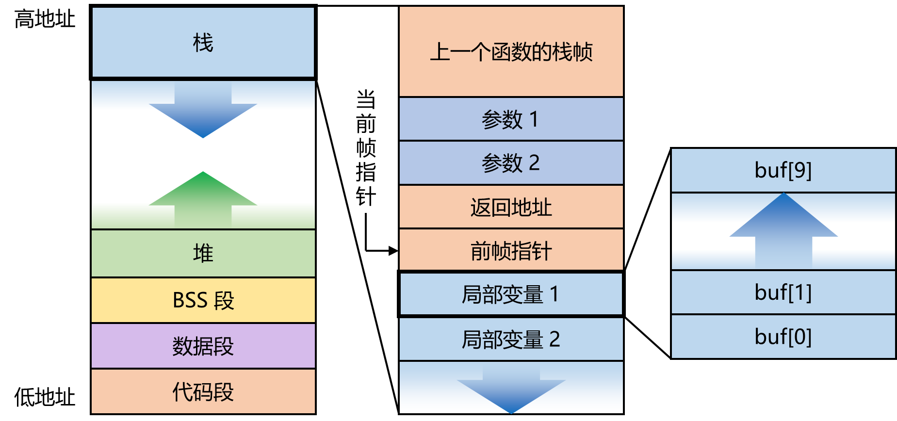

# 内存模型

对于一个典型的 C 语言程序，其内存布局如下图所示：



- 代码段存储可执行代码
- 数据段存储由程序员初始化过的全局变量和静态变量
- BBS 段存储未初始化的全局变量和静态变量
- 堆用于动态内存分配
- 栈用于存储局部变量和函数调用相关数据

当一个函数被调用时，系统会在栈顶（也就是地址更低的地方）为它分配一块空间，被称为栈帧（Stack Frame）。

- 参数区域用于保存传递给函数的参数
- 调用函数前，计算机将下一条指令的地址存储在返回地址区域
- 前帧指针区域存储着上一个帧的指针
- 局部变量区域存储着该函数的局部变量

很显然的是，函数中局部变量的地址无法在编译时就确定下来，访问局部变量必须依靠相对地址偏移来查找。相对地址的基址就存储在 CPU 的帧指针寄存器（ebp）中。

然而，CPU 只有一个帧指针寄存器。当函数返回时，上一个函数存储在寄存器中的帧指针已经被覆盖了。因此，栈中还存储了前帧指针，用来在函数返回时设置帧指针寄存器。

栈是由高地址向低地址生长的，但局部变量（缓冲区）中的数据则是由低地址向高地址生长。如果局部变量中的数据内容超出了原先分配的大小，则会继续向高地址生长，覆盖前帧指针、返回地址……

# 调用规范

## x86

在 x86 下，函数参数会从右至左依次被存入寄存器中。

系统调用与普通调用不同，其使用 `int 80h`  实现。程序首先应用 libc，然后将调用号存入 `eax`，参数依次存储在 `ebx`、`ecx`、`edx`、`esi`、`edi`、`ebp`。

例如，我们有下面的函数：

```c
open(path, flags, mode);
```

其会被编译为：

```assembly
mov		eax, 5
mov		ebx, path
mov		ecx, flags
mov		edx, mode
int		80h
```

对大部分函数，其返回值存储在 `eax` 中（`SYS_fork` 存储在 `edx` 中）。

最常用的 `execve` 调用号为 `0x3b`，其余详见 https://blog.rchapman.org/posts/Linux_System_Call_Table_for_x86_64/。

## x86-64

> 文档见 https://learn.microsoft.com/en-us/cpp/build/x64-calling-convention?view=msvc-170

在 x64 下，调用函数时，参数会被依次存储在 `rdi`、`rsi`、`rdx`、`rcx`、`r8`、`r9` 寄存器中，如果有更多的参数，则和 32 位程序一样直接压入栈中。程序的返回值则会存储在 `rax` 寄存器中。

例如，我们有下面的函数调用：

```c
foo(0x100, 0x200, 0x300, 0x400, 0x500, 0x600, 0x700, 0x800);
```

程序会编译为

```assembly
push	0x800
push	0x700
mov		r9d, 0x600
mov		r8d, 0x500
mov		ecx, 0x400
mov		edx, 0x300
mov		esi, 0x200
mov		edi, 0x100
call	foo
```

系统调用略有不同，其调用号存储在 `rax` 中，而参数会被存储在 `rdi`、`rsi`、`rdx`、`r10`、`r8`、`r9` 寄存器中。

# 函数序言

