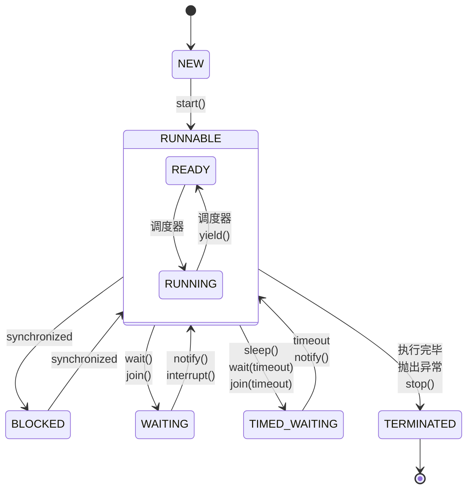

Java 在启动时，会创建一个进程，进程中包含一个主线程。主线程会执行 `main` 方法，我们可以在 `main` 方法中创建多个线程。

## 简介

### 进程与线程

进程是操作系统分配资源的基本单位，而线程是 CPU 调度的基本单位。一个进程可以包含多个线程，线程之间共享进程的资源。

- **进程**

  程序由指令和数据组成，是用来加载指令、管理内存、管理 IO 的。当一个程序被运行，它会从磁盘加载这个程序的代码至内存，这时就开启了一个进程。进程就可以视为程序的一个实例。

- **线程**

  一个进程之内可以分为一到多个线程。一个线程就是一个指令流，将指令流中的一条条指令以一定的顺序交给 CPU 执行Java 中，线程作为最小调度单位，进程作为资源分配的最小单位。

- **协程**

  协程是用户态的轻量级线程。它们在同一线程中运行，使用同一堆栈。协程之间的切换不需要上下文切换，因此比线程更轻量级。
  协程的切换是由用户控制的，它会保存和恢复寄存器状态；而线程的切换是由操作系统控制的，它会保存和恢复 CPU 上下文。

### 并行和并发

- **并行**

  并行是指同时执行多个任务。它需要多核 CPU 的支持。

- **并发**

  并发是指在同一时间段内执行多个任务。它不需要多核 CPU 的支持。

  在单核 CPU 上，操作系统会使用时间片轮转的方式来实现并发。每个线程会被分配一个时间片，在时间片内执行任务。当时间片用完后，操作系统会将 CPU 分配给下一个线程。这样，多个线程就可以在同一时间段内执行任务。

## Java 线程

### 线程的创建

创建线程有以下几种方式：

- 继承 `Thread` 类。

  ```java
  public class MyThread extends Thread {
      @Override
      public void run() {
          System.out.println("New Thread");
          Thread.sleep(1000);
      }
  }

  Thread thread = new MyThread();
  thread.start();
  ```

  或者写为

  ```java
  Thread thread = new Thread() {
      @Override
      public void run() {
          System.out.println("New Thread");
          Thread.sleep(1000);
      }
  };
  thread.start();
  ```

- 实现 `Runnable` 接口。

  ```java
  public class MyRunnable implements Runnable {
      @Override
      public void run() {
          System.out.println("New Thread");
          Thread.sleep(1000);
      }
  }

  Thread thread = new Thread(new MyRunnable());
  thread.start();
  ```

  当然，你也可以使用 `Lambda` 表达式来简化代码。

  ```java
  Thread thread = new Thread(() -> {
      System.out.println("New Thread");
      Thread.sleep(1000);
  });
  thread.start();
  ```

- 使用 `FutureTask` 类。

  ```java
  FutureTask<String> futureTask = new FutureTask<>(() -> {
      System.out.println("New Thread");
      Thread.sleep(1000);
      return "Hello!";
  });

  Thread thread = new Thread(futureTask);
  thread.start();
  ```

### 线程状态

线程有以下几种状态：

- `NEW`：新建状态，线程已经创建。
- `RUNNABLE`：运行状态，包含了等待调度、运行和 BIO 的阻塞。
- `BLOCKED`：阻塞状态，线程被阻塞，等待锁。
- `WAITING`：等待状态，线程等待其他线程的通知。
- `TIMED_WAITING`：超时等待状态，线程等待一段时间。例如正在执行 `sleep`。
- `TERMINATED`：终止状态，线程执行完毕。

<div hidden>



</div>


### 常用方法

线程对象有以下常用方法：

- `start()`：启动线程

  `run()`：如果构造 `Thread` 对象时传入了 `Runnable` 对象，则调用其 `run()` 方法

  注意，如果不先调用 `start()`，而是直接调用 `run()` 方法，则不会启动新线程，而是会在当前线程中执行 `run()` 方法。

- `join()`：阻塞并等待线程执行完毕

  `join(long millis)`：等待线程执行完毕，最多等待 `millis` 毫秒

- `interrupt()`：中断线程。如果中断正在运行的线程或者 `park` 线程，会设置中断标志，线程并不会立即停止。如果线程正在执行 `sleep()`、`wait()`、`join()` 等方法，会抛出 `InterruptedException` 异常

  `isInterrupted()` / `interrupted()`：判断线程是否被中断。其中 `interrupted()` 会清除中断标志

  `stop()`：强制终止线程。这个方法会直接杀死线程，如果线程锁住了资源，这个锁也不会被释放
  
  `System.exit(int status)`：强制终止整个 JVM

  要想安全地停止线程，最好使用两阶段停止法：

  ```java
  Thread thread = new Thread(() -> {
      while (true) {
          Thread current = Thread.currentThread();

          if (current.isInterrupted()) {
              // 如果发现自己被中断，料理后事，然后退出
              System.out.println("料理后事");
              break;
          }

          try {
              // 实际业务逻辑
              System.out.println("Hello!");
              Thread.sleep(1000);
          } catch (InterruptedException e) {
              // 如果出错了，中断自己
              current.interrupt();
          }
      }
  }, "两阶段停止法模拟线程");
  ```

- `isAlive()`：判断线程是否存活，即是否已经启动并且没有执行完毕

- `sleep(long millis)`：让当前线程睡眠 `millis` 毫秒。线程会从 `RUNNING` 变为 `TIMED_WAITING` 阻塞

  `yield()`：提示调度器，让当前线程让出 CPU 时间片。线程会从 `RUNNING` 变为 `RUNNABLE`

- `currentThread()`：获取当前线程对象

  - `getName()`：获取线程名
  - `setName(String name)`：设置线程名
  - `getId()`：获取线程唯一 ID
  - `getPriority()`：获取线程优先级
  - `setPriority(int priority)`：设置线程优先级
  - `getState()`：获取线程状态

- `setDaemon(boolean on)`：设置线程为守护线程

  JVM 在运行时，会创建一个主线程。当主线程执行完毕后，JVM 会退出。如果主线程创建了一些子线程，那么要等待所有子线程执行完毕后，JVM 才会退出。

  但是，有时候我们希望主线程执行完毕后，JVM 就退出，而留下一个或多个子线程继续执行。这时，我们可以将子线程设置为守护线程。

  ```java
  Thread thread = new Thread(() -> {
      while (true) {
          System.out.println("Daemon Thread");
      }
  });

  thread.setDaemon(true);
  thread.start();
  ```

  需要注意的是，守护线程不能持有任何需要关闭的资源，因为它会在 JVM 退出时立即终止。

### 状态转移

对于线程 A：

- 主线程运行 `A.start()`：`NEW` $$\rightarrow$$ `RUNNABLE`
- 线程 A 运行 `wait()`：`RUNNABLE` $$\rightarrow$$ `WAITING`
- 线程 A 运行 `wait(timeout)`：`RUNNABLE` $$\rightarrow$$ `TIMED_WAITING`
- 线程 B 运行 `notify()`
  - 如果线程 A 获取锁成功：`WAITING` $$\rightarrow$$ `RUNNABLE`
  - 如果线程 A 获取锁失败：`WAITING` $$\rightarrow$$ `BLOCKED`
- 线程 A 运行 `Thread.sleep()`：`RUNNABLE` $$\rightarrow$$ `WAITING`
- 线程 A 运行 `Thread.sleep(timeout)`：`RUNNABLE` $$\rightarrow$$ `TIMED_WAITING`
- 线程 A 运行 `B.join()`：`RUNNABLE` $$\rightarrow$$ `WAITING`
- 线程 A 运行 `B.join(timeout)`：`RUNNABLE` $$\rightarrow$$ `TIMED_WAITING`
- 主线程运行 `A.interrupt()`：一段时间后 `RUNNABLE` $$\rightarrow$$ `TERMINATED`
- 主线程运行 `A.stop()`：`RUNNABLE` $$\rightarrow$$ `TERMINATED`
- 主线程运行 `A.yield()`：`RUNNABLE` $$\rightarrow$$ `RUNNABLE`
- 线程 A 运行结束：`RUNNABLE` $$\rightarrow$$ `TERMINATED`

## 有锁并发

### 悲观锁

有锁并发通常使用悲观锁来实现。悲观锁是指在访问共享资源之前，先加锁，访问完毕后再解锁。

悲观锁总是假设最坏的情况，认为数据很可能会被其他线程修改，因此在操作数据之前，会先加锁。也就是说，共享资源始终只能被一个线程访问。

例如 `synchronized` 关键字就是一种悲观锁。

```java
public class Counter {
    private int count = 0;

    public synchronized void add() {
        count++;
    }
}
```

这里，当一个线程执行 `add` 方法时，会锁住整个对象，其他线程无法执行 `add` 方法。只有当前线程执行完毕后，其他线程才能执行。

悲观锁的缺点是效率低下。因为只有一个线程能够访问共享资源，其他线程只能等待。当有大量线程需要访问共享资源时，会因为阻塞造成上下文切换，降低性能。

此外，悲观锁还有可能造成死锁。

### 死锁

死锁是指两个或多个线程在执行过程中，因为争夺资源而造成的一种互相等待的现象。此时，线程无法继续执行。

例如线程 A 锁住了资源 1，等待资源 2；线程 B 锁住了资源 2，等待资源 1。这时，线程 A 和线程 B 会一直等待下去。

产生死锁的必要条件有：

- **互斥条件**：一个资源只能被一个线程占用
- **请求与保持条件**：一个线程已经占有了资源，但又请求新的资源
- **不剥夺条件**：一个线程已经占有了资源，但不能剥夺它
- **循环等待条件**：多个线程之间形成了一个环形的等待关系

在 Java 中，可以使用 `jstack` 命令来查看死锁的线程：

```shell
jstack -l <pid>
```

### 对象内存布局

Java 对象的内存布局分为三部分：

- **对象头**

  根据对象状态不同，对象头的布局也不同。例如对于 64 位的情况，对象头包含了以下两部分：

  - `mark word` 存储自身运行时的数据。它分为以下几种状态：

    - 无锁

      <div hidden>

      ```mermaid
      packet-beta
      0-24: "/"
      25-55: "hashcode"
      56: "/"
      57-60: "age"
      61: "0"
      62-63: "01"
      ```

      </div>

      

      其中，`hashcode` 是对象的哈希码，`age` 是对象的 GC 分代年龄

    - 偏向锁

      <div hidden>

      ```mermaid
      packet-beta
      0-53: "thread"
      54-55: "epoch"
      56: "/"
      57-60: "age"
      61: "1"
      62-63: "01"
      ```

      </div>

      

      其中， `thread` 是偏向线程 ID，`epoch` 是偏向时间戳

    - 轻量级锁

      <div hidden>

      ```mermaid
      packet-beta
      0-61: "ptr_to_lock_record"
      62-63: "00"
      ```

      </div>

      

      其中，`ptr_to_lock_record` 是指向锁记录的指针

    - 重量级锁

      <div hidden>

      ```mermaid
      packet-beta
      0-61: "ptr_to_heavyweight_monitor"
      62-63: "10"
      ```

      </div>

      

      其中，`ptr_to_heavyweight_monitor` 是指向重量级锁的指针

    - GC 标记

      <div hidden>

      ```mermaid
      packet-beta
      0-61: "/"
      62-63: "11"
      ```

      </div>

      

  - `class pointer` 存储指向类的指针

    指针指向对象的类元数据，可以确定对象的类型。

- **实例数据**是对象真正存储的数据，包括成员变量。

- **对齐填充**是为了保证对象的起始地址是 8 字节的整数倍，提高访问效率。

### Monitor

Monitor 是一种同步原语，它是一个对象的锁。每个对象都有一个 Monitor，当对象被 `synchronized` 关键字加上重量级锁后，对象头会存储指向 Monitor 对象的指针。

Monitor 对象包含了以下几个部分：

- `Owner`：指向持有锁的线程
- `WaitSet`：等待队列，存储等待锁的线程
- `EntryList`：锁记录链表，存储轻量级锁的锁记录

其运行过程如下：

- 开始时，Monitor 的 `Owner` 为 `null`，`EntryList` 为空，`WaitSet` 存储着之前获得过锁，但还没进入 `WAITING` 状态的线程
- 当线程 A 执行 `synchronized` 方法时，`Owner` 变为线程 A
- 在线程 A 上锁的情况下，如果线程 B、C 也来执行 `synchronized` 方法，就会被依次加入 `EntryList` 链表中
- 当线程 A 执行完毕，唤醒 `EntryList` 中的线程 B、C 来竞争锁

### `synchronized`

对于线程间的互斥访问，可以使用 `synchronized` 关键字。该关键字可以修饰方法，也可以修饰代码块。它相当于为方法或代码块加了一个锁，只有获取到锁的线程才能执行。

```java
class Counter {
    public static final Object lock = new Object();
    private int count = 0;
}

public class MyRunnable implements Runnable {
    @Override
    public void run() {
        synchronized (Counter.lock) {
            for (int i = 0; i < 1000000; i++) {
                Counter.count++;
            }
        }
    }
}

Thread thread1 = new Thread(new MyRunnable());
Thread thread2 = new Thread(new MyRunnable());
thread1.start();
thread2.start();
```

当一个线程执行 `synchronized` 方法时，会执行以下流程：

- 尝试使用偏向锁的方式获取锁，如果获取到了，就表示获取锁成功
- 如果获取不到偏向锁，将锁升级为轻量级锁，然后使用自适应自旋的方式获取锁
- 如果获取不到轻量级锁，将锁升级为重量级锁，线程进入阻塞状态，等待锁释放

#### 偏向锁

偏向锁会偏向于第一个获得它的线程。如果在接下来的执行过程中，该锁没有被其他线程获取，则持有偏向锁的线程将永远不需要再进行同步。这样就节省了大量有关锁申请的操作，从而提高了程序性能。

偏向锁的执行过程如下：

- 当对象的锁第一次被线程 A 获取时，对象会被设置为偏向锁的 mark word，其中的 `thread` 和 `epoch` 分别设置为线程 A 的 ID 和当前时间戳
- 此后，线程 A 再次获取锁时，会检查对象的 mark word 中的 `thread` 是否指向了自己

  - 如果是，表示是重入，直接获取锁
  - 如果不是，表示有其他线程 B 获取了锁，则会进行锁撤销，并将锁升级为轻量级锁

偏向锁可以提高带有同步但无竞争的程序性能，但是，如果有竞争，偏向锁会降低性能。

偏向锁被撤销有以下几种情况：

- 调用对象的 `hashCode` 方法

  因为该记录只有无锁状态下的 mark word 中才有，所以会导致偏向锁被撤销

- 其它线程获取了锁

  由于偏向锁是偏向于第一个获得它的线程，所以如果有其他线程获取了锁，偏向锁会被撤销

- 其它线程调用了 `wait()` 方法

  `wait()` 方法会导致锁被升级为重量级锁

#### 轻量级锁

如果一个锁一直没有竞争，那么可以使用轻量级锁。轻量级锁是一种乐观锁，它认为锁一直没有竞争，不需要加锁。它的执行过程如下：

- 当线程 A 获取一个对象的轻量级锁时，JVM 在线程 A 的栈帧中分配一块锁记录（lock record）空间，其中包含了

  - 对象引用
  - 轻量级锁对应的 mark word

  

- 将对象引用指向对象地址，并使用 CAS 指令将对象原来的 mark word 和锁记录中存储的 mark word 进行交换

  - 如果 CAS 操作成功，该对象的对象头中就存储了线程 A 的锁记录的地址，表示线程 A 获得了轻量级锁

    

  - 如果 CAS 操作失败

    - 如果是其它线程已经持有了该对象的轻量级锁，则将进入锁膨胀过程

    - 如果是自己执行了 `synchronized` 锁重入，则再添加一条锁记录到栈帧中，作为重入计数。其中，这条锁记录的 mark word 部分为 `null`

      

- 当退出 `synchronized` 块时

  - 如果有取值为 `null` 的锁记录，表明有重入，从栈帧中删除一条

  - 如果没有，则使用 CAS 指令将对象头中的锁记录地址替换为原来的 mark word

    - 如果 CAS 操作成功，释放成功
    - 如果 CAS 操作失败，表明锁已经膨胀，进入重量级锁的释放过程

其中，如果线程 B 发现无法获取轻量级锁，会进行锁膨胀。锁膨胀的过程如下：

- 膨胀时，线程 B 先为对象分配一个 Monitor 对象

  - 对象头中的 mark word 替换为指向 Monitor 对象的指针
  - Monitor 对象的 `Owner` 指向线程 A
  - Monitor 对象的 `EntrySet` 中添加线程 B

  

- 线程 A 退出解锁时，按照轻量级锁解锁失败，于是

  - 按照对象头中的指针，找到 Monitor 对象
  - 将 Monitor 对象的 `Owner` 设置为 `null`
  - 将 Monitor 对象的 `EntrySet` 中的线程全部唤醒

#### 重量级锁

当使用重量级锁时，线程会进入阻塞状态，等待锁释放。重量级锁的执行过程如下：

- JVM 会将对象头中的 mark word 替换为指向 Monitor 对象的指针

- Monitor 的 `Owner` 指向线程 A

  

- 线程 A 执行完毕，唤醒 `EntryList` 中的线程 B、C 来竞争锁

重量级锁竞争时，可以使用自旋来优化，这样就避免了线程频繁进行上下文切换。当有多个线程竞争锁时，没抢到的线程可以执行忙循环，不断尝试获取锁。

但是，如果一直没抢到锁，线程的自旋会消耗大量的 CPU 时间。因此，Java 使用了自适应的自旋。

线程会自旋一段时间后停止自旋并挂起。这个时间由前一次在同一个锁上的自旋时间及锁的拥有者状态决定

- 如果某个被锁的对象刚刚就有线程获得了锁，JVM 会认为获得锁的概率较大，让它多自旋一会儿
- 相反，如果锁被长时间占用，一个线程也没抢到，JVM 会认为获得锁的概率较小，让它少自旋一会儿。

程序运行时间越长，对锁的情况越了解，自旋锁的效率就越高。

> 这里的自旋和自旋锁是两个概念。
>
> - 自旋锁是一种轻量级锁，线程自旋获取锁时，会不断尝试使用 CAS 指令获取锁
> - 重量级锁的自旋是指，线程自旋获取锁时，会不断尝试获取互斥锁

### `wait()` 和 `notify()`

`wait()` 方法被用于已经获取到了锁的线程，它会释放锁并进入等待状态。其它线程可以趁此机会获取锁，执行完操作后，使用 `notify()` 方法被用于唤醒等待的线程。

`notifyAll()` 方法会唤醒所有等待的线程。

#### 保护性暂停

如果有结果需要从一个线程传递给另一个线程，可以使用一个保护性对象。

- 等待结果的线程会不断循环，检查保护性对象里的结果是否已经准备好，如果没有，就调用 `wait()` 方法进入等待状态
- 生产结果的线程会在结果准备好后，调用 `notifyAll()` 方法唤醒等待的线程

下面的程序可以用来传递一个整数：

```java
class GuardedSuspensionTest {
    private int result;
    private final Object lock = new Object();

    public Object get() throws InterruptedException {
        synchronized (lock) {
            while (result == 0) {
                lock.wait();
            }
        }
        return result;
    }

    public void set(int result) {
        synchronized (lock) {
            this.result = result;
            lock.notifyAll();
        }
    }

    public static void main(String[] args) {
        GuardedSuspensionTest test = new GuardedSuspensionTest();

        Thread producer = new Thread(() -> {
            try {
                Thread.sleep(3000);
                test.set(42);
            } catch (InterruptedException e) {
                Thread.currentThread().interrupt();
                e.printStackTrace();
            }
        });

        Thread consumer = new Thread(() -> {
            try {
                System.out.println(test.get());
            } catch (InterruptedException e) {
                Thread.currentThread().interrupt();
                e.printStackTrace();
            }
        });

        consumer.start();
        producer.start();
    }
}
```

这样的方式也是 `join()`、`FutureTask` 等方法的实现原理。

#### 生产者消费者模式

生产者消费者则不同，它的结果和等待结果的线程没有直接关系。生产者和消费者之间有一个缓冲区，生产者将结果放入缓冲区，消费者从缓冲区取出结果。

它们之间可以互相调用 `wait()` 和 `notify()` 方法，这样可以确保既不会一下子生产太多，也不会没东西可消费。

例如，一个生产者和消费者的例子：

```java
import java.util.LinkedList;
import java.util.Queue;

class TaskQueue {
    private volatile Queue<String> queue = new LinkedList<>();

    public synchronized void add(String task) {
        while (queue.size() >= 10) {
            try {
                wait();
            } catch (InterruptedException e) {
                Thread.currentThread().interrupt();
            }
        }
        queue.add(task);
        System.out.println("Add: " + task);
        notifyAll();
    }

    public synchronized String get() throws InterruptedException {
        while (queue.isEmpty()) {
            wait();
        }
        String result = queue.remove();
        notifyAll();
        return result;
    }

    public static void main(String[] args) {
        TaskQueue taskQueue = new TaskQueue();

        Thread producer = new Thread(() -> {
            for (int i = 0; i < 100; i++) {
                taskQueue.add("Task " + i);
            }
        });

        Thread consumer = new Thread(() -> {
            for (int i = 0; i < 100; i++) {
                try {
                    System.out.println("Get: " + taskQueue.get());
                } catch (InterruptedException e) {
                    Thread.currentThread().interrupt();
                }
            }
        });

        producer.start();
        consumer.start();
    }
}
```

需要注意的是，`wait` 被写在了 `while` 循环中。这是因为，当多个线程同时被唤醒后，依然只有一个线程能够获取到锁，其他线程需要再次检查条件。

### `Lock` 和 `Condition`

对于非 `synchronized` 的代码，我们可以使用 `Lock` 和 `Condition` 接口。

```java
class TaskQueue {
    private Queue<String> queue = new LinkedList<>();
    private Lock lock = new ReentrantLock();
    private Condition condition = lock.newCondition();

    public void add(String task) {
        lock.lock();
        try {
            queue.add(task);
            condition.signalAll();
        } finally {
            lock.unlock();
        }
    }

    public String get() throws InterruptedException {
        lock.lock();
        try {
            while (queue.isEmpty()) {
                condition.await();
            }
            return queue.remove();
        } finally {
            lock.unlock();
        }
    }
}
```

可以看到，`signal` 方法对应 `notify` 方法，`await` 方法对应 `wait` 方法。

`condition.await` 同样可以尝试获取锁：

```java
if (condition.await(1, TimeUnit.SECONDS)) {
    return queue.remove();
} else {
    // do something
}
```

### `ReentrantLock`

`ReentrantLock` 是 `java.util.concurrent.locks` 包下的一个类，它实现了 `Lock` 接口。它是一个可重入的互斥锁，和 `synchronized` 关键字类似，但是比 `synchronized` 更灵活。

```java
public class Counter {
    private int count = 0;
    private final ReentrantLock lock = new ReentrantLock();

    public void add() {
        lock.lock();
        try {
            count++;
        } finally {
            lock.unlock();
        }
    }
}
```

#### 可重入锁

可重入锁是锁的一种，它是指，同一个线程可以多次获取同一把锁，而不会造成死锁。

相反，不可重入锁是指，如果一个线程已经获得了一把锁，它在加锁的情况下再次请求这把锁，就会造成死锁。

```java
public class Counter {
    private int count = 0;
    private final ReentrantLock lock = new ReentrantLock();

    public void add1() {
        lock.lock();
        try {
            add2();
        } finally {
            lock.unlock();
        }
    }

    public void add2() {
        lock.lock();
        try {
            count++;
        } finally {
            lock.unlock();
        }
    }
}
```

#### 可打断和可超时

`ReentrantLock` 提供了可打断和可超时的功能。

- 可打断

  `ReentrantLock` 提供了 `lockInterruptibly()` 方法，可以在等待锁的过程中被中断。

- 可超时

  `ReentrantLock` 提供了 `tryLock(long timeout, TimeUnit unit)` 方法，可以在等待锁的过程中设置超时时间。

  如果没有设置超时时间，`tryLock()` 方法只会尝试获取锁一次，如果获取不到锁，就返回 `false`。

#### 公平锁

公平锁是指，多个线程竞争锁时，按照请求锁的顺序来分配锁。也就是说，先请求锁的线程先获得锁。

可以使用 `ReentrantLock(true)` 来创建公平锁。但默认情况下，`ReentrantLock` 是非公平锁。

### 应用

我们可以使用以上内容实现一个打印数字的程序，要求按顺序打印 1、2、3：

```java
public class PrintInOrder {
    private static final Object lock = new Object();
    private static int count = 0;

    public static void main(String[] args) {
        Thread thread1 = new Thread(() -> print(1, 2));
        Thread thread2 = new Thread(() -> print(2, 3));
        Thread thread3 = new Thread(() -> print(3, 1));

        thread1.start();
        thread2.start();
        thread3.start();
    }

    private static void print(int current, int next) {
        while (count < 10) {
            synchronized (lock) {
                while (count % 3 != current - 1) {
                    try {
                        lock.wait();
                    } catch (InterruptedException e) {
                        Thread.currentThread().interrupt();
                    }
                }
                System.out.println(current);
                count++;
                lock.notifyAll();
            }
        }
    }
}
```

## JMM

### 内存模型

CPU 由于内存访问速度跟不上 CPU 的运行速度，所以会有多级缓存。而每个 CPU 内核都有自己的缓存，这就会导致多个 CPU 内核之间的数据可能不一致。在多核 CPU 同时操作共享数据时，就会出现数据不一致的问题。

CPU 使用了一些技术来解决这个问题，例如 MESI 协议。这里的 MESI 是四个状态的缩写：

- `M`（Modified）：数据被修改，只存在于当前 CPU 缓存中。
- `E`（Exclusive）：数据只存在于当前 CPU 缓存中，没有被修改。
- `S`（Shared）：数据存在于多个 CPU 缓存中，没有被修改。
- `I`（Invalid）：数据无效。

当一个 CPU 写入数据时，会将数据状态设置为 `M`，并通知其他 CPU 缓存中的数据无效。当一个 CPU 读取数据时，会先检查数据状态，如果是 `M` 或 `E`，说明数据是最新的，可以直接读取；如果是 `S` 或者 `I`，说明数据无效，需要从内存中读取。

操作系统堆底层硬件进行了抽象和封装，然而，这个抽象出来的 CPU 和内存之间也存在数据不一致的问题。我们把在特定的操作协议下，对特定内存或高速缓存进行读写访问的过程进行抽象，得到的就是内存模型了。

对于编程语言来讲，它可以直接使用操作系统的内存模型，例如 C 语言。但是，对于 Java 来讲，它是跨平台的，不同的操作系统有不同的内存模型。为了保证 Java 的跨平台性，Java 定义了自己的内存模型供程序员使用。我们可以说，Java 的内存模型是抽象上的抽象————抽象到家了。

Java 内存模型规定所有的变量都存储在主内存中，每条线程都有自己的工作内存。线程的工作内存中保存了*被该线程使用到的变量的主内存副本拷贝*，线程对变量的所有操作（读取、赋值等）都必须在工作内存中进行，而不能直接读写主内存中的变量。不同线程之间也无法直接访问对方工作内存中的变量，线程间变量值的传递都需要通过主内存来完成。

这里你就发现了，Java 只能操作自己的工作内存，需要一定的机制来保证各线程的工作内存及主内存的数据一致性。

JMM 定义了 8 种原子操作，来完成这一任务。包括：

- `lock`：作用于主内存的变量，把一个变量标识为一条线程独占的状态
- `unlock`：作用于主内存的变量，把一个变量标识为可被其他线程独占的状态
- `read`：作用于主内存的变量，把一个变量的值从主内存传输到线程的工作内存中
- `load`：作用于工作内存的变量，把 `read` 操作从主内存传输到工作内存中的变量放入工作内存的变量副本中
- `use`：作用于工作内存的变量，把工作内存中的变量传输到 JVM 的执行引擎中
- `assign`：作用于工作内存的变量，把一个从 JVM 执行引擎中接收到的值赋给工作内存中的变量
- `store`：作用于工作内存的变量，把工作内存中的变量的值传输到主内存中
- `write`：作用于主内存的变量，把 `store` 操作从工作内存传输到主内存中的变量中

然而，为了程序运行的效率，编译器可能对指令进行了重排。因此，JMM 还定义了一些规则，来保证指令重排不会影响程序的正确性：

- `read` 和 `load`、`store` 和 `write` 是成对出现的，不允许单独出现，但中间可能插入其他操作
- 不允许丢弃 `assign` 操作，工作内存中的变量改变后必须同步到主内存中
- 不允许在没有 `assign` 的情况下进行 `store` 操作
- 新变量只能在主内存中诞生，不允许在工作内存中直接使用一个未被初始化的变量。也就是说，对一个变量进行 `use`、`store` 操作之前，必须执行过 `assign` 和 `load` 操作
- 一个变量同一时间只能被一个线程 `lock`，但一个线程可以执行多次 `lock` 操作，多次 `lock` 操作后，必顨执行相同次数的 `unlock` 操作才能解锁
- 如果一个变量被 `lock` 操作锁定，那么会清空工作内存中此变量的值。此后，在使用前必须重新执行 `load` 或 `assign` 操作初始化变量的值
- 如果一个变量没有被 `lock`，或是被其它线程 `lock`，那么不允许对此变量执行 `unlock` 操作
- 对一个变量执行 `unlock` 操作之前，必须先把此变量同步到主内存中（执行 `store` 和 `write` 操作）

### Happens-Before

这些操作和规则实在太麻烦了，但好在，JMM 还定义了一个更简单的等价规则：Happens-Before。

Happens-Before 规则是 Java 内存模型中定义的两个操作之间的偏序关系。如果操作 A Happens-Before 操作 B，那么 A 的执行结果对 B 是可见的。

Happens-Before 规则包括以下几种情况：

- **程序顺序规则**：一个线程内，按照程序顺序，前面的操作 Happens-Before 后面的操作
- **锁定规则**：一个 `unlock` 操作 Happens-Before 后面对同一个锁的 lock 操作
- **`volatile` 变量规则**：对一个 `volatile` 变量的写操作 Happens-Before 后面对这个变量的读操作
- **线程启动规则**：`Thread` 对象的 `start` 方法 Happens-Before 线程的 `run` 方法
- **线程终止规则**：线程的所有操作 Happens-Before 线程的终止
- **线程中断规则**：对线程的 `interrupt` 方法的调用 Happens-Before 被中断线程的检测到中断
- **对象终结规则**：一个对象的初始化完成（构造函数执行结束） Happens-Before 它的 `finalize` 方法的开始
- **传递性**：如果 A Happens-Before B，B Happens-Before C，那么 A Happens-Before C

我们来看一个例子就明白了：

<details>
<summary>点击举个栗子</summary>
<div markdown="1">

```java
private int value = 0;

public void setValue(int value){
    this.value = value;
}

public int getValue(){
    return value;
}
```

如果线程 A 在时间上先调用了 `setValue(1)`，然后线程 B 在时间上后调用了 `getValue`，那么：

- 程序顺序规则：两个操作在不同线程中，不适用
- 锁定规则：两个操作没有锁，不适用
- `volatile` 变量规则：`value` 是普通变量，不适用
- 线程启动规则：两个操作在不同线程中，不适用
- 线程终止规则：两个操作在不同线程中，不适用
- 线程中断规则：两个操作在不同线程中，不适用
- 对象终结规则：`value` 是普通变量，不适用
- 传递性：两个操作之间没有其他操作，不适用

因此，两个操作之间没有 Happens-Before 关系，线程 B 可能读取到 0，也可能读取到 1！

修复有两种方法，一是使用 `synchronized` 关键字：

```java
private int value = 0;

public synchronized void setValue(int value){
    this.value = value;
}

public synchronized int getValue(){
    return value;
}
```

此时，由于 `synchronized` 关键字为对象加锁，根据锁定规则，`setValue` 和 `getValue` 之间有 Happens-Before 关系，线程 B 读取到的值一定是 1。

另一种方法是使用 `volatile` 关键字：

```java
private volatile int value = 0;

public void setValue(int value){
    this.value = value;
}

public int getValue(){
    return value;
}
```

此时，根据 `volatile` 变量规则，`setValue` 和 `getValue` 之间有 Happens-Before 关系，线程 B 读取到的值一定是 1。

</div>
</details>

由此，我们发现，<mark markdown="1">时间上的先后顺序并不代表操作之间的先后关系</mark>。只有在满足 Happens-Before 规则的情况下，操作之间才有确定的先后关系。

## 无锁并发

### 乐观锁

无锁并发并不是真的没有锁，而是使用了乐观锁。

乐观锁认为数据很可能不会被修改，因此在操作数据之前，不会加锁。当在操作后，会使用算法查看操作期间数据是否被其它线程修改过，如果是，就会进行回滚操作。

例如，`java.util.concurrent.atomic` 包下的类就是一种乐观锁。

```java
public class Counter {
    private AtomicInteger count = new AtomicInteger(0);

    public void add() {
        count.incrementAndGet();
    }
}
```

这里，`incrementAndGet` 方法是原子性的，不需要加锁。它使用了 `CAS` 指令，当线程执行 `incrementAndGet` 方法时，会比较内存中的值和期望值，如果相等，就会将新值写入内存。如果不相等，就会重新读取内存中的值，再次比较。

CAS（Compare And Swap）指令是一种乐观锁的实现。它是*一种原子性的操作*，可以保证线程安全。

CAS 指令有三个操作数：内存位置、期望值和新值。当内存位置的值等于期望值时，将新值写入内存位置。否则，不做任何操作。

CAS 存在三个问题：

- **ABA 问题**

  ABA 问题是指，线程 1 读取了内存位置的值 A，然后线程 2 将 A 改为 B，再改回 A。这时，线程 1 会认为内存位置的值没有变化，但实际上已经变化了。

  为了解决 ABA 问题，可以使用版本号。每次修改内存位置的值时，都会增加版本号。

- **循环时间长开销大**

  CAS 指令是一个自旋操作，它会不断尝试修改内存位置的值。如果一直有冲突，会造成 CPU 的浪费。

- **只能保证一个共享变量的原子操作**

  CAS 指令只能保证一个共享变量的原子操作。如果有多个共享变量，就需要加锁。

  JDK 1.5 提供了 `AtomicReference` 类，可以保证引用类型的原子操作。这部分解决了第三个问题。

乐观锁的优点是效率高,因为不需要加锁。然而，这一切的前提是数据很可能不会被修改。如果数据经常被修改，那么会有大量的回滚重试操作，降低性能。

总的来说，悲观锁适合写操作多的场景，乐观锁适合读操作多的场景。

### `volatile`

对于线程键共享的变量，应当使用 `volatile` 关键字修饰，以保证线程之间的可见性。这是因为，线程之间的数据是存储在各自的工作内存中的，而不是存储在主内存中。`volatile` 关键字可以保证线程全部从主内存中读取数据。

```java
public class MyRunnable implements Runnable {
    private volatile boolean flag = true;

    @Override
    public void run() {
        while (flag) {
            System.out.println("New Thread");
        }
    }

    public void stop() {
        flag = false;
    }
}
```

`volatile` 关键字可以保证变量的可见性，并且禁止指令重排。但是，`volatile` 关键字并不能保证原子性。

例如下面的代码：

```java
public class RaceTestVolatile {
    private static volatile int race = 0;

    public static void main(String[] args) throws InterruptedException {
        Thread[] threads = new Thread[20];

        for (int i = 0; i < 20; i++) {
            threads[i] = new Thread(() -> {
                for (int j = 0; j < 10000; j++) {
                    race++;
                }
            });
            threads[i].start();
        }

        for (int i = 0; i < 20; i++) {
            threads[i].join();
        }

        System.out.println("最终 race 的值: " + race);
    }
}
```

这段代码的目的是让 20 个线程分别对 `race` 变量进行 10000 次自增操作。由于 `race` 变量是 `volatile` 的，因此可以保证可见性，所有线程都能看到最新的值。但是，由于 `race++` 操作并不是原子性的，因此最终的结果并不是 200000，比如我这里的结果是 64299。

这是因为，`race++` 操作实际上是三个操作：读取 `race` 的值、自增、写回 `race` 的值。如果两个线程同时读取了 `race` 的值，然后同时自增，最后写回，那么就会出现问题。

要想让 `volatile` 变量不发生这种情况，需要满足两个条件：

- 变量的写操作不依赖于当前值，例如 `race = i` 就没有这个问题
- 变量不需要与其他变量共同参与不变约束，也就是说不能 `if (a && b)` 这样

`volatile` 能做的事情有两点：

- 禁止指令重排
  
  也就是说，`volatile` 变量的写操作必须在读操作之后，不能重排。这用到了内存屏障指令。

- 保证可见性

  也就是说，一个线程对 `volatile` 变量的修改，对其他线程是可见的。放到 JMM 里讲，就是每次使用变量的时候，都会从主内存中读取，而不是从线程的工作内存中读取。

### 原子操作

Java 中有些操作是原子性的，具体包括：

- 基本数据类型赋值（除 `long` 和 `double` 外，不过 JVM 通常会让它们也是原子性的）。
- 引用类型赋值。

对于不可变对象，对它们的操作也不需要加锁。

Java 中提供了 `java.util.concurrent.atomic` 包，用来实现更多的原子操作。它主要包括：

- `AtomicBoolean`：原子性的布尔类型。
- `AtomicInteger`：原子性的整型。
- `AtomicLong`：原子性的长整型。
- `AtomicReference`：原子性的引用类型。

例如，对于 `AtomicInteger` 类型，他有一些原子性的方法：

- `int get()`：获取值。
- `int incrementAndGet()`：自增并获取值。
- `int addAndGet(int delta)`：增加并获取值。
- `int compareAndSet(int expect, int update)`：比较并设置值。

它的实现没有使用锁，而是使用了 `CAS` 指令。

## 线程安全

### 变量线程安全

变量线程安全是指，多个线程同时访问一个变量时，不会出现数据不一致的情况。

对于成员变量和静态变量：

- 如果没有共享，线程安全
- 如果有共享
  - 但只有读操作，线程安全
  - 有写操作，线程不安全

对于局部变量：

- 局部变量是线程安全的，因为每个线程都有自己的栈，局部变量存储在栈中
- 如果局部变量是引用类型，引用指向的对象可能会被多个线程共享，那么就不线程安全了

### 线程安全类

线程安全类是指，多个线程同时访问一个类的实例时，不会出现数据不一致的情况。

线程安全类主要包括：

- `java.lang.String`：是不可变类，线程安全
- `java.lang.StringBuffer`：可变 `String` 的线程安全实现。而 `StringBuilder` 是线程不安全的
- `java.lang.Integer`：是不可变类，线程安全
- `java.lang.Random`：线程安全，因为它的 `next` 方法是原子性的
- `java.util.Vector`：线程安全，因为它的方法都是同步的
- `java.util.Hashtable`：线程安全，因为它的方法都是同步的
- `java.util.concurrent` 包下的类：线程安全

### 不可变

不可变类及其所有属性全部使用 `final` 修饰，并且没有提供任何修改属性的方法。不可变类的实例在创建后就不能被修改，因此是线程安全的。

同时，他在字节码中还通过写屏障来防止其它线程读到它未赋初始值时的情况。

对于 `Integer` 等，它会使用享元模式来减少内存的使用。也就是说，在一定范围内，`Integer` 的实例是共享的。

对于 `String`，它提供了 `substring` 方法来获取子串，但实际上是返回了一个新的 `String` 对象，而不是原来的对象。这样可以避免修改原来的对象，保证线程安全。

### 无状态

对于没有成员变量的类，我们称其为无状态类。无状态类是线程安全的，因为它没有共享数据。

例如，Servlet 就是无状态类。这使得它可以被多个线程共享。

## 并发工具

### ThreadLocal

线程调用时，可以向其中传入参数。如果有大量线程要传入相同的参数，可以使用 `ThreadLocal` 类。该类会为每个线程创建一个独立的变量副本，互不干扰。

```java
ThreadLocal<String> threadLocal = ThreadLocal<>();

try {
    threadLocal.set("Hello!");

    Thread thread = new Thread(() -> {
        System.out.println(threadLocal.get());
    });

    thread.start();
} finally {
    threadLocal.remove();
}
```

需要注意的是，`ThreadLocal` 实例一定要在 `finally` 代码块中调用 `remove` 方法，以避免内存泄漏。我们可以封装 `AutoCloseable` 接口来简化代码。

```java
public class ThreadLocalVariable<T> implements AutoCloseable {
    private ThreadLocal<T> threadLocal = new ThreadLocal<>();

    public void set(T value) {
        threadLocal.set(value);
    }

    public T get() {
        return threadLocal.get();
    }

    @Override
    public void close() {
        threadLocal.remove();
    }
}

try (ThreadLocalVariable<String> threadLocal = new ThreadLocalVariable<>()) {
    threadLocal.set("Hello!");

    Thread thread = new Thread(() -> {
        System.out.println(threadLocal.get());
    });

    thread.start();
}
```

### 读写锁

`syncronized` 关键字是重量级锁，同时在获取时会阻塞线程持续等待。`java.util.concurrent` 包下的 `Lock` 接口提供了更多的锁实现，比如 `ReentrantLock`、`ReadWriteLock`、`StampedLock` 等。

- `ReentrantLock`：

  例如，我们有一个计数器：

  ```java
  class Counter {
    private int count = 0;
    
    public synchronized void add() {
        count++;
    }
  }
  ```

  使用 `ReentrantLock` 可以这样实现：

  ```java
  class Counter {
    private int count = 0;
    private Lock lock = new ReentrantLock();
    
    public void add() {
        lock.lock();
        try {
            count++;
        } finally {
            lock.unlock();
        }
    }
  }
  ```

  它可以尝试获取锁：

  ```java
  if (lock.tryLock(1, TimeUnit.SECONDS)) {
      try {
          count++;
      } finally {
          lock.unlock();
      }
  } else {
      // do something
  }
  ```

  当等待了一秒钟后，还没有获取到锁，就会返回 `false`。这时程序可以做一些其它事情，而不是一直等待。

- `ReadWriteLock`：

  读写锁允许多个线程同时读取数据，但只允许一个线程写入数据。这样可以提高读取数据的效率。

  ```java
  class Counter {
    private int count = 0;
    private ReadWriteLock lock = new ReentrantReadWriteLock();
    private Lock readLock = lock.readLock();
    private Lock writeLock = lock.writeLock();
    
    public int get() {
        readLock.lock();
        try {
            return count;
        } finally {
            readLock.unlock();
        }
    }
    
    public void add() {
        writeLock.lock();
        try {
            count++;
        } finally {
            writeLock.unlock();
        }
    }
  }
  ```

- `StampedLock`：

  读写锁的一个问题是，当有线程正在读取数据时，另一个线程不能写入数据。`StampedLock` 提供了乐观读锁，允许多个线程同时读取数据，但只有一个线程可以写入数据，读写可以同时进行。

  ```java
  class Counter {
    private int count = 0;
    private StampedLock lock = new StampedLock();
    
    public int get() {
        long stamp = lock.tryOptimisticRead();
        int c = count;
        if (!lock.validate(stamp)) {
            stamp = lock.readLock();
            try {
                c = count;
            } finally {
                lock.unlockRead(stamp);
            }
        }
        return c;
    }

    public void add() {
        long stamp = lock.writeLock();
        try {
            count++;
        } finally {
            lock.unlockWrite(stamp);
        }
    }
  }
  ```

  `tryOptimisticRead` 方法会尝试获取一个乐观读锁，返回一个标记。如果在读取数据时，数据没有被修改，那么可以直接返回。如果数据被修改，那么需要获取一个读锁。`validate` 方法用来验证标记，如果返回 `true`，则数据没有被修改，可以直接返回。如果返回 `false`，则需要获取一个读锁。

  需要注意的是，乐观锁的使用条件是在读取过程中大概率不会发生数据修改。如果数据经常被修改，那么乐观锁的效率会很低。

  同时，`StampedLock` 是一种不可重入锁，也就是说，一个线程在获取过写锁后，不能再次获取写锁。否则会造成死锁。

### 信号量

信号量是一种更高级的同步工具，它可以控制同时访问某个资源的线程数量。

```java
class AccessControl {
    private Semaphore semaphore = new Semaphore(10);

    public void access() throws InterruptedException {
        semaphore.acquire();
        try {
            // do something
        } finally {
            semaphore.release();
        }
    }
}
```

`acquire` 方法会尝试获取一个许可，如果没有许可，线程会阻塞。`release` 方法会释放一个许可。

`Semaphore` 还有一个 `tryAcquire` 方法：

```java
if (semaphore.tryAcquire(1, TimeUnit.SECONDS)) {
    try {
        // do something
    } finally {
        semaphore.release();
    }
} else {
    // do something
}
```

### 线程同步

例如我们有一个任务队列，多个线程可以向队列中添加任务，也可以从队列中取出任务。这时，我们需要保证线程之间的同步。

Java 中提供了一个 `BlockingQueue` 接口，它提供了线程安全的队列操作。

```java
BlockingQueue<String> queue = new ArrayBlockingQueue<>(10);

Thread thread1 = new Thread(() -> {
    try {
        queue.take();
    } catch (InterruptedException e) {
        e.printStackTrace();
    }
});

Thread thread2 = new Thread(() -> {
    try {
        queue.put("Task");
    } catch (InterruptedException e) {
        e.printStackTrace();
    }
});

thread1.start();
thread2.start();
```

在这段代码中，`take` 方法会阻塞线程，直到队列中有任务。

类似的，Java 中的集合类基本都有线程安全的实现：

| 接口 | 非线程安全 | 线程安全 | 行为 |
| --- | --- | --- | --- |
| `List` | `ArrayList` | `CopyOnWriteArrayList` | 写入时复制；当写入时，会复制一个新的数组，写入完成后，再将新数组赋值给旧数组；读取时，读取旧数组 |
| `Set` | `HashSet` | `CopyOnWriteArraySet` | 写入时复制；当写入时，会复制一个新的集合，写入完成后，再将新集合赋值给旧集合；读取时，读取旧集合 |
| `Map` | `HashMap` | `ConcurrentHashMap` | 分段锁；当写入时，只锁住一个段；读取时，不需要锁 |
| `Queue` | `LinkedList` | `ArrayBlockingQueue` | 阻塞队列；当队列为空时，`take` 方法会阻塞；当队列满时，`put` 方法会阻塞 |
| `Deque` | `LinkedList` | `LinkedBlockingDeque` | 阻塞双端队列；当队列为空时，`takeFirst` 和 `takeLast` 方法会阻塞；当队列满时，`putFirst` 和 `putLast` 方法会阻塞 |

### 线程池

线程池是一种线程复用的机制，它可以减少线程的创建和销毁次数，提高性能。

Java 标准库中提供了 `java.util.concurrent` 包，其中的 `ExecutorService` 接口可以用来创建线程池。

```java
ExecutorService executor = Executors.newFixedThreadPool(10);

for (int i = 0; i < 1000000; i++) {
    executor.submit(() -> {
        System.out.println("New Thread");
        Thread.sleep(1000);
    });
}
```

`Executors` 类提供了一些静态方法，可以创建不同类型的线程池：

- `newFixedThreadPool`：固定大小的线程池。

  线程池中的线程数量是固定的，当线程池中的线程都在执行任务时，新的任务会被放入队列中。只有之前的任务执行完毕后，线程池出现空闲线程时，才会执行队列中的任务。

- `newCachedThreadPool`：缓存线程池，线程数量不固定。

  线程池会根据任务的数量动态调整线程的数量。如果线程池中的线程空闲时间超过 60 秒，就会被回收。

- `newScheduledThreadPool`：定时任务的线程池。

  线程池可以执行定时任务和周期性任务。例如让线程池在提交任务后延迟 3 秒执行，然后每隔 1 秒执行一次。

  ```java
  ScheduledExecutorService executor = Executors.newScheduledThreadPool(10);
  executor.scheduleAtFixedRate(() -> {
      System.out.println("Execute");
  }, 3, 1, TimeUnit.SECONDS);
  ```

对于有些任务，它本身非常大，但可以自动拆解成多个小任务，然后再合并结果。这时，我们可以使用 `ForkJoinPool`。例如，我们有一个任务，需要计算 1 到 100 的和。

```java
class MyTask extends RecursiveTask<Long> {
    private int start;
    private int end;

    public MyTask(int start, int end) {
        this.start = start;
        this.end = end;
    }

    @Override
    protected Long compute() {
        if (end - start < 10) {
            int sum = 0;
            for (int i = start; i <= end; i++) {
                sum += i;
            }
            return sum;
        } else {
            int mid = (start + end) / 2;
            MyTask task1 = new MyTask(start, mid);
            MyTask task2 = new MyTask(mid + 1, end);
            task1.fork();
            task2.fork();
            return task1.join() + task2.join();
        }
    }
}

ForkJoinPool pool = new ForkJoinPool();
MyTask task = new MyTask(1, 100);
Long res = pool.invoke(task);
```

### `Future`

`Future` 接口可以用来获取异步任务的结果。

```java
ExecutorService executor = Executors.newFixedThreadPool(10);
Future<String> future = executor.submit(() -> {
    Thread.sleep(1000);
    return "Hello";
});

String res = future.get();
```

需要注意的是，`get` 方法是阻塞的，如果异步任务没有执行完毕，它会一直等待。

为了解决这个问题，`Future` 接口提供了 `isDone` 方法，可以判断异步任务是否执行完毕。

```java
if (future.isDone()) {
    String res = future.get();
}
```

`Future` 接口还提供了 `cancel` 方法，可以取消异步任务。

```java
future.cancel(true);
```

但这依然不够好。`CompletableFuture` 可以传入回调函数，当异步任务执行完毕后，会自动调用回调函数。

```java
CompletableFuture<String> future = CompletableFuture.supplyAsync(() -> {
    Thread.sleep(1000);
    return "Hello";
});

future.thenAccept(res -> { // 执行成功
    System.out.println(res);
});

future.exceptionally(e -> { // 执行失败
    e.printStackTrace();
    return null;
});
```

如果没有返回值，可以使用 `thenRun` 方法。

```java
CompletableFuture<Void> future = CompletableFuture.runAsync(() -> {
    System.out.println("Hello");
    Thread.sleep(1000);
});

future.thenRun(() -> {
    System.out.println("World");
});
```

`CompletableFuture` 还提供了一些方法，可以将多个异步任务组合在一起。

```java
CompletableFuture<String> future = CompletableFuture
  .supplyAsync(() -> {
      Thread.sleep(1000);
      return "Hello";
  })
  .thenCompose(res -> CompletableFuture.supplyAsync(() -> {
      return res + " World";
  }));

System.out.println(future.get());
```

`thenCompose` 方法可以将两个异步任务组合在一起，第一个任务的结果作为第二个任务的输入。

`CompletableFuture` 还提供了 `thenCombine` 方法，可以将两个异步任务的结果组合在一起。

```java
CompletableFuture<String> future = CompletableFuture
  .supplyAsync(() -> {
      Thread.sleep(1000);
      return "Hello";
  })
  .thenCombine(CompletableFuture.supplyAsync(() -> {
      Thread.sleep(1000);
      return "World";
  }), (res1, res2) -> {
      return res1 + " " + res2;
  });

System.out.println(future.get());
```

到这里，已经非常像 JavaScript 中的 `Promise` 了。

### 虚拟线程

Java21 引入了虚拟线程，它是一种轻量级的线程，可以更好地利用系统资源。

在 IO 密集型的应用中，通常会创建大量的线程，这会导致线程的上下文切换，降低性能。虚拟线程可以更好地利用系统资源，减少线程的创建和销毁。

```java
Thread vt = Thread.startVirtualThread(() -> {
    System.out.println("Hello");
    Thread.sleep(1000);
});
```
