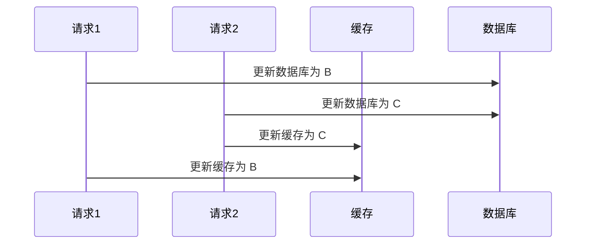
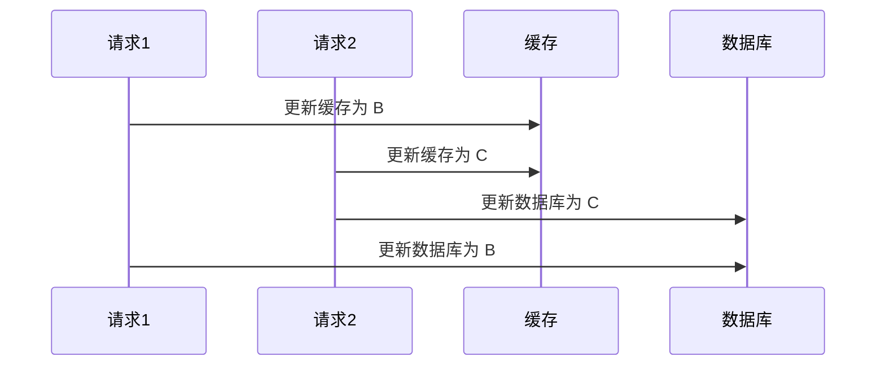
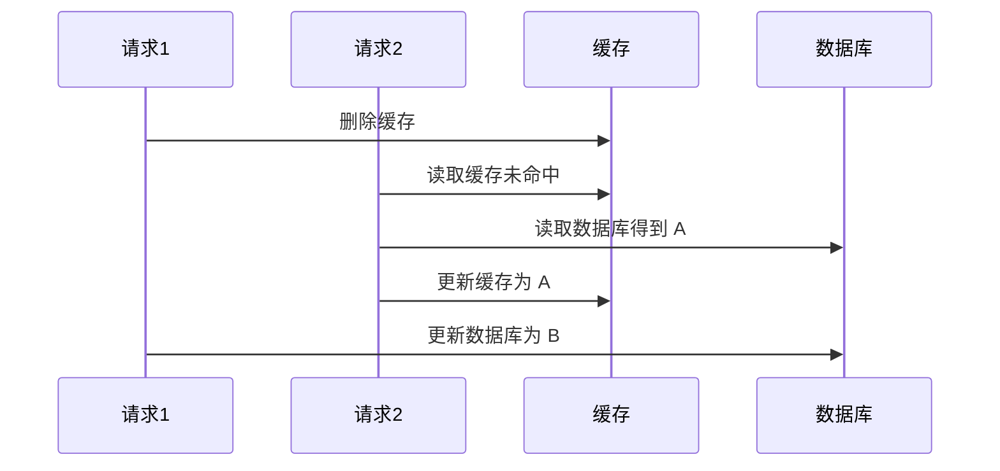
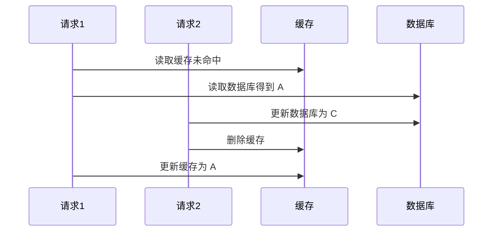

本文将会从源码层面解读 Redis 的各项机制。我们会从最基础的内容开始，尽量只看 Redis 最核心的部分，而剥离掉一些不太重要的内容，所有的源码都给出了 GitHub 的链接。

写作本文时，Redis CE 还在 7.4 版本；Redis 8.0 仍然在 Pre-Release。因此，本文主要基于 Redis 7.4，其余版本可能有所不同。本文使用的环境为 Debian 12。

本章为深入 Redis 源码源码系列最后一篇，主要来谈谈 Redis 的运维，基本不再涉及到 Redis 的源码了。

## 缓存

Redis 通常和诸如 MySQL 之类的数据库一起使用，用来缓存一些热点数据。这样可以减少数据库的压力，提高访问速度。

对于高并发的系统，如果没有缓存，每次请求都要去数据库中查询，会导致数据库压力过大，甚至宕机。因此，如果缓存出现了故障，会对整个系统造成很大的影响。

### 缓存穿透

缓存穿透是指用户请求的数据在缓存中未命中、在数据库中也不存在，导致用户每次请求该数据都要去数据库中查询一遍，然后返回空。

这种场景常见于恶意攻击，攻击者故意请求不存在的数据，导致数据库压力过大。

缓存穿透的解决方案有：

- **布隆过滤器**

  布隆过滤器是一种数据结构，可以用来判断一个元素是否存在于一个集合中。
  
  > 布隆过滤器是一个 $$m$$ 位的二进制向量和 $$k$$ 个随机映射函数（哈希函数）。
  >
  > 当插入一个元素时，将元素通过 $$k$$ 个哈希函数映射到二进制向量中的 $$k$$ 个位置，将这些位置由 0 改为 1。
  >
  > 当查询一个元素时，同样将元素通过 $$k$$ 个哈希函数映射到二进制向量中的 $$k$$ 个位置。如果这些位置全部为 1，则说明元素*可能*存在于集合中；否则，元素*一定不*存在于集合中。

  我们可以将布隆过滤器挡在缓存之前。写入数据时，同时将数据放入布隆过滤器；查询数据时，如果请求的数据在布隆过滤器中不存在，直接返回空，而不用去数据库中查询。

  布隆过滤器的好处是：
  
  - 节省空间，只需存储 $$m$$ 个二进制位
  - 时间复杂度低，只需 $$O(k)$$ 次哈希运算
  
  缺点是：
  
  - 有一定的误判率
  - 无法删除元素，使得假阳性概率增加

- **缓存空对象**

  当数据库中不存在某个数据时，我们依然可以将这个数据写入缓存，但是设置为空值。这样，下次请求这个数据时，缓存中就会命中，而不用去数据库中查询。

  缓存空对象会存在两个问题：

  - 如果有大量缓存穿透的键，把它们都写入缓存，会导致占用大量内存
  - 缓存空对象会导致缓存和持久层的数据不一致

- **限制请求频率**

  限制请求频率可以有效防止缓存穿透。我们可以设置一个时间窗口，比如 1 分钟内只允许请求 100 次空值，超过这个次数的请求直接拒绝。

  这个方法可能存在误判的问题，误伤到正常用户。

### 缓存击穿

缓存击穿是指一个热点数据在缓存中过期的瞬间，大量请求直接打到数据库上，导致数据库压力过大。

缓存击穿的解决方案有：

- **设置热点数据永不过期**

  一方面，我们不对热点数据设置过期时间；另一方面，也可以将它的过期时间记录下来，如果发现快要过期了，提前更新缓存。

- **使用互斥锁**

  在缓存数据过期时，使用互斥锁，只允许一个线程去读取数据库并更新缓存数据，其他线程等待。

### 缓存雪崩

缓存雪崩通常有两种原因：

- Redis 服务器宕机
- 大量缓存数据同时过期

和缓存击穿不同的是，缓存击穿指并发查同一条数据，缓存雪崩是不同数据都过期了，很多数据都查不到从而查数据库。

发生缓存雪崩后，大量请求直接打到数据库上，会造成数据库压力过大，甚至宕机。

针对缓存雪崩，我们可以采取以下措施：

- **为缓存数据设置不同的过期时间，避免同时过期**

  在设置缓存过期时间时，加上一个随机值，使得缓存数据的过期时间分散开。或者也可以统一规划有效期，使其均匀分布。

- **使用互斥锁**

  在缓存数据过期时，使用互斥锁，只允许一个线程去读取数据库并更新缓存数据，其他线程等待。

- **永不过期**

  可以设置数据永不过期，让 Redis 内的内存淘汰机制来处理。

  同时，使用后台定时任务来更新缓存数据。如果发现有缓存失效，可以使用消息队列通知后台线程更新缓存。

- **双层缓存**

  双层缓存是指使用主备两个缓存，正常请求由主缓存处理。备份缓存可以设置较长的过期时间，在主缓存失效后，备缓存可以继续提供服务。

  在主缓存更新时，备份缓存也同步更新。

- **限流/熔断降级**

  当缓存雪崩发生时，可以通过限流降级来减少数据库的压力。

  限流降级是指当请求达到一定的阈值时，直接拒绝请求，或者返回一个友好的提示页面。

- **搭建集群**

  搭建 Redis 集群，使得缓存数据分布在不同的节点上，即使某个节点宕机，也不会影响整个系统。

### 缓存预热

缓存预热是指系统上线后，将相关的缓存数据直接加载到缓存系统。这样可以避免在系统启动初期，用户请求全部要先查询数据库，然后再将数据写入缓存的问题。

- 当数据量不大时，可以在系统启动时，将所有数据加载到缓存中
- 当数据量较大时，可以使用定时任务，定时进行缓存刷新
- 当数据量巨大时，可以先将热点数据加载到缓存中，其他数据在请求时再加载

### 缓存降级

缓存降级是指将一些热点数据放入服务器的内存中。当缓存服务器宕机时，可以直接从内存中读取数据，而不用去数据库中查询。

## 一致性

缓存和数据库之间的数据一致性是一个很大的问题。当缓存中的数据和数据库中的数据不一致时，会导致系统出现各种问题。

例如，我们有两个请求，一个想把数据 A 更新为 B，一个想把数据 A 更新为 C。你会发现，无论是先更新缓存还是先更新数据库，都会导致数据不一致：





### 旁路缓存

旁路缓存是指只更新数据库，但不更新缓存，而是直接删除缓存。这样，下次请求数据时，缓存未命中，直接去数据库中查询。

这里存在一个先删除缓存还是先更新数据库的问题。

如果先删除缓存，再更新数据库，可能会出现下面的情况：



这依然会导致数据不一致。

当然，这种情况不是没有解决办法。我们可以使用延迟双删的方法：

- 先删除缓存
- 再更新数据库
- 等一小会儿后，再删除缓存

这种方法智能说勉强保证了一致性，但确实不是个什么好办法。

而如果先更新数据库，再删除缓存，可能会出现下面的情况：



数据还是不一致的。

你会看到，不管怎样，数据永远都不一直。然而，缓存的写入要比数据库的写入快得多。先更新数据库再删除缓存出现的这种不一致不太容易发生，也就是说，很少发生请求 2 都已经更新完数据库了，请求 1 还没更新完缓存的情况。

因此，通常来讲，我们会使用**先更新数据库再删除缓存**的方式。

为了进一步减少不一致情况造成的影响，我们还可以

- 还可以为缓存的数据加上过期时间。即使数据不一致，也不会影响太久
- 在更新缓存前加上分布式锁，保证只有一个线程能够更新缓存

### 失败重试

虽然解决了谁先谁后的问题，但是还有一个问题是，如果数据库更新成功了，而缓存更新失败了，怎么办？

- 一种是**使用消息队列**

  当数据库更新成功后，发送一个消息到消息队列，让消费者去更新缓存。如果缓存更新失败，可以进行重试。

  然而，这一方案需要修改原来的代码逻辑，并且需要处理多次重试都失败的情况。

- 另一种是**使用 MySQL binlog**

  MySQL binlog 是 MySQL 的二进制日志，记录了数据库的所有操作。我们可以使用一个额外的组件监听 binlog，将 binlog 中的数据放入消息队列中，然后执行缓存更新。

  这样做的好处是，不用修改原来的代码逻辑，也不用担心重试失败的问题。

## 内存碎片

Redis 是一个基于内存的数据库，内存碎片是一个很大的问题。当 Redis 的内存碎片过多时，会导致 Redis 无法分配连续的内存，从而导致 Redis 宕机。

内存碎片往往是因为 Redis 分配了很多小块内存，但是这些小块内存无法合并成大块内存。其主要来源于两个方面：

- Redis 申请了比实际使用的内存更多的内存
- 频繁修改数据，导致内存碎片

我们可以使用以下命令来查看 Redis 的内存信息：

```shell
INFO memory
```

这会列出 Redis 的内存信息，包括 `mem_fragmentation_ratio`，表示内存碎片率。

当内存碎片率过高（比如 $$>1.5$$）时，我们设置 `activedefrag` 参数为 `yes`，Redis 会在后台进行内存碎片整理。我们可以使用 `active-defrag-ignore-bytes`、`active-defrag-threshold-lower` 等参数来调整内存碎片整理的策略：

```conf
active-defrag-ignore-bytes 500mb # 内存碎片达到 500MB 时才进行内存碎片整理
active-defrag-threshold-lower 50 # 内存碎片率高于 50% 时才进行内存碎片整理
active-defrag-cycle-min 20 # 内存碎片整理占用 CPU 时间不低于 20%
active-defrag-cycle-max 50 # 内存碎片整理占用 CPU 时间不高于 50%
```

当然，重启节点也可以完成内存碎片整理。

## 阻塞

Redis 是单线程的，当有大量请求时，可能会导致 Redis 阻塞。这种情况通常是因为 Redis 在执行某些耗时操作，比如持久化、大量计算等。

### $$O(N)$$ 操作

Redis 的一些操作是 $$O(N)$$ 甚至更高的，比如

- `KEYS *`：列出所有的键
- `SMEMBERS`：列出集合中的所有元素
- `HGETALL`：列出哈希表中的所有键值对
- `LRANGE`：列出列表中的所有元素
- `SINTER` / `SUNION` / `SDIFF`：集合的交、并、差
- `ZRANGE`：有序集合的范围查询
- `ZREMRANGEBYRANK`：有序集合的范围删除

解决这个问题的方法主要是分批处理，即将大量数据分批处理，比如每次只列出 1000 个键。例如，可以使用 `SCAN` 命令。它是一个游标式的迭代器，可以用来遍历所有的键。

### 快照

对于 RDB 和 AOF，通常都是开启新的后台线程来执行持久化操作。这样，Redis 主线程就不会被阻塞。

然而，对于 AOF，其内容会先写入缓冲区。然后，根据 `appendfsync` 参数，在某个时候将缓冲区中的内容 `fsync` 到磁盘。`fsync` 是一个阻塞操作，如果要写入的内容过多，可能会导致 Redis 阻塞。

此外，无论是 RDB 还是 AOF，Redis 都需要 `fork` 出一个子进程来执行持久化操作。`fork` 是一个昂贵的操作，它涉及到页表的复制，这也会导致 Redis 阻塞。当 Redis 在持久化时，如果修改了某个大 KEY，会触发 CoW，它需要将这个键值拷贝一份出来，这也会导致 Redis 阻塞。

### 大 KEY

我们前面已经介绍了大 KEY 在快照时的影响。但问题不止于此。

我们为了更好地处理大 KEY，可以在启动 Redis 时，添加 `--bigkeys` 参数，这样 Redis 会在日志中记录大 KEY 的信息。

大 KEY 会导致 Redis 在执行一些操作时，比如删除、修改、查询等，需要花费更多的时间。这会导致 Redis 阻塞。同时，网络传输也会因为大 KEY 而变慢。

删除大 KEY 时，可以使用 `UNLINK` 命令，它是一个异步的删除操作。`UNLINK` 命令会将大 KEY 标记为删除，然后在后台线程中删除。而如果使用 `DEL` 命令，会导致 Redis 阻塞。

### 系统、硬件和网络

Redis 利用内存实现高速读写，然而如果内存不足，Redis 会使用 SWAP，这会导致 Redis 非常慢。

此外，Redis 是 CPU 密集型的，如果 CPU 不足，也会导致 Redis 阻塞。
