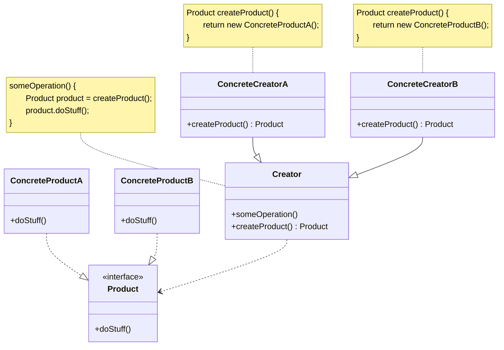
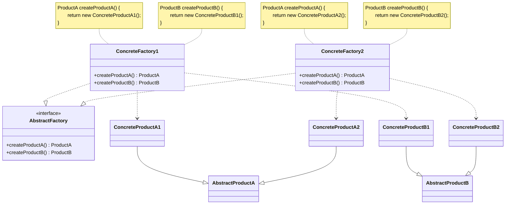
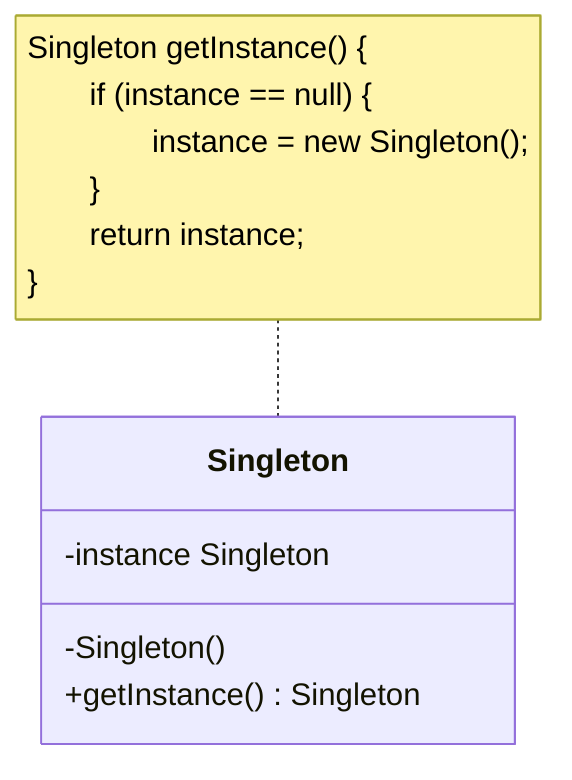
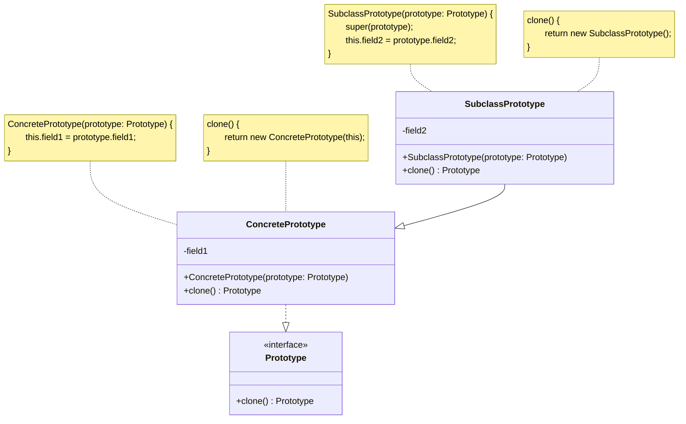
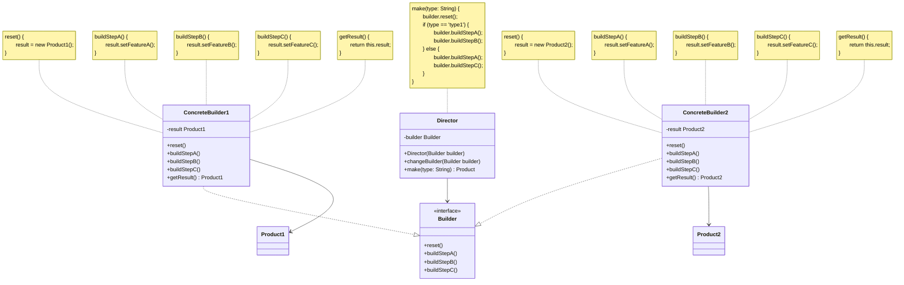

设计模式是软件设计中常用的解决方案，旨在提高代码的可维护性、可扩展性和可重用性。它们提供了一种通用的语言，使开发人员能够更好地沟通和协作。

设计模式通常分为三大类：

- **创建型模式**：关注对象的创建过程，提供了创建对象的灵活性和可扩展性。
- **结构型模式**：关注对象之间的关系，帮助我们更好地组织和管理代码。
- **行为型模式**：关注对象之间的交互和职责分配，帮助我们更好地管理对象之间的协作。

## 创建型模式

创建型模式主要关注对象的创建过程，提供了创建对象的灵活性和可扩展性。常见的创建型模式包括：

### 工厂方法

工厂方法（Factory Method）在父类中提供一个创建对象的方法，允许子类决定实例化对象的类型。

工厂方法主要包含以下几个角色：

- 产品（Product）：定义产品的接口。
- 具体产品（ConcreteProduct）：实现产品接口的具体类。
- 创建者（Creator）：定义一个工厂方法，用于创建产品对象。
- 具体创建者（ConcreteCreator）：实现工厂方法以返回具体产品的实例。



例如：

- 产品：按钮
- 具体产品：Windows 按钮、Linux 按钮
- 创建者：会话框
- 具体创建者：Windows 会话框、Linux 会话框

```java
// 产品

public interface Product {
    void doStuff();
}

public class ConcreteProductA implements Product {
    @Override
    public void doStuff() {
        // 实现 A 的操作
    }
}

public class ConcreteProductB implements Product {
    @Override
    public void doStuff() {
        // 实现 B 的操作
    }
}

// 工厂

public abstract class Factory {
    public abstract Product createProduct();
    public void someOperation() {
        Product product = createProduct();
        product.doStuff();
    }
}

public class ConcreteFactoryA extends Factory {
    @Override
    public Product createProduct() {
        return new ConcreteProductA();
    }
}
public class ConcreteFactoryB extends Factory {
    @Override
    public Product createProduct() {
        return new ConcreteProductB();
    }
}

// 测试

public class Test {
    public static void main(String[] args) {
        Factory factoryA = new ConcreteFactoryA();
        factoryA.someOperation();

        Factory factoryB = new ConcreteFactoryB();
        factoryB.someOperation();
    }
}
```

### 抽象工厂

抽象工厂（Abstract Factory）提供一个接口，用于创建一系列相关或相互依赖的对象，而无需指定它们的具体类。

抽象工厂主要包含以下几个角色：

- 抽象产品（AbstractProduct）：构成系列产品的一组不同但相关的产品声明接口。
- 具体产品（ConcreteProduct）：实现抽象产品接口的具体类。
- 抽象工厂（AbstractFactory）：声明创建抽象产品的接口。
- 具体工厂（ConcreteFactory）：实现抽象工厂的接口以创建具体产品。



例如：

- 产品：按钮、文本框
- 具体产品：Windows 按钮、Linux 按钮、Windows 文本框、Linux 文本框
- 抽象工厂：GUI 工厂
- 具体工厂：Windows 工厂、Linux 工厂

```java
// 产品

public interface ProductA {
    void someOperationA();
}

public interface ProductB {
    void someOperationB();
}

public class ConcreteProductA1 implements ProductA {
    @Override
    public void someOperationA() {
        // 实现 A1 的操作
    }
}

public class ConcreteProductA2 implements ProductA {
    @Override
    public void someOperationA() {
        // 实现 A2 的操作
    }
}

public class ConcreteProductB1 implements ProductB {
    @Override
    public void someOperationB() {
        // 实现 B1 的操作
    }
}

public class ConcreteProductB2 implements ProductB {
    @Override
    public void someOperationB() {
        // 实现 B2 的操作
    }
}

// 工厂

public interface AbstractFactory {
    ProductA createProductA();
    ProductB createProductB();
}

public class ConcreteFactory1 implements AbstractFactory {
    @Override
    public ProductA createProductA() {
        return new ConcreteProductA1();
    }
    @Override
    public ProductB createProductB() {
        return new ConcreteProductB1();
    }
}

public class ConcreteFactory2 implements AbstractFactory {
    @Override
    public ProductA createProductA() {
        return new ConcreteProductA2();
    }
    @Override
    public ProductB createProductB() {
        return new ConcreteProductB2();
    }
}

// 测试

public class Test {
    public static void main(String[] args) {
        AbstractFactory factory1 = new ConcreteFactory1();
        ProductA productA1 = factory1.createProductA();
        ProductB productB1 = factory1.createProductB();

        AbstractFactory factory2 = new ConcreteFactory2();
        ProductA productA2 = factory2.createProductA();
        ProductB productB2 = factory2.createProductB();
    }
}
```

### 单例模式

单例模式（Singleton Pattern）确保一个类只有一个实例，并提供一个全局访问点。



例如：

与数据库连接池相关的类通常使用单例模式。

```java
// 单例

public class Singleton {
    private static Singleton instance;

    private Singleton() {}

    public static Singleton getInstance() {
        if (instance == null) {
            instance = new Singleton();
        }
        return instance;
    }
}

// 测试

public class Test {
    public static void main(String[] args) {
        Singleton singleton = Singleton.getInstance();
    }
}
```

### 原型模式

原型模式（Prototype Pattern）通过复制现有对象来创建新对象，而不是通过实例化类。

原型模式主要包含以下几个角色：

- 原型（Prototype）：声明一个克隆自身的接口。
- 具体原型（ConcretePrototype）：实现克隆操作。



例如：

- 原型：图形
- 具体原型：圆形、矩形
- 子类原型：椭圆形、正方形

```java
// 原型

public interface Prototype {
    Prototype clone();
}

// 具体原型

public class ConcretePrototype implements Prototype {
    private String field1;

    public ConcretePrototype(ConcretePrototype prototype) {
        this.field1 = prototype.field1;
    }

    @Override
    public Prototype clone() {
        return new ConcretePrototype(this);
    }
}

public class SubclassPrototype extends ConcretePrototype {
    private String field2;

    public SubclassPrototype(SubclassPrototype prototype) {
        super(prototype);
        this.field2 = prototype.field2;
    }

    @Override
    public Prototype clone() {
        return new SubclassPrototype(this);
    }
}

// 测试

public class Test {
    public static void main(String[] args) {
        ConcretePrototype prototype = new ConcretePrototype();
        ConcretePrototype clone = (ConcretePrototype) prototype.clone();
    }
}
```

### 生成器模式

生成器模式（Builder Pattern）将一个复杂对象的构建与其表示分离，使得同样的构建过程可以创建不同的表示。

生成器模式主要包含以下几个角色：

- 生成器（Builder）：定义创建一个产品对象的抽象接口。
- 具体生成器（ConcreteBuilder）：实现 Builder 接口以构建和装配该产品的各个部件。
- 产品（Product）：表示被构建的复杂对象。
- 主管（Director）：构建一个使用 Builder 接口的对象。


