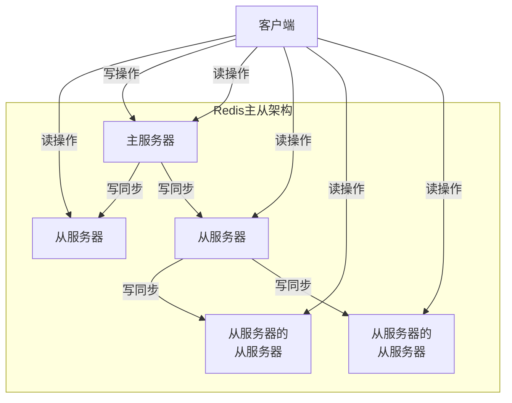
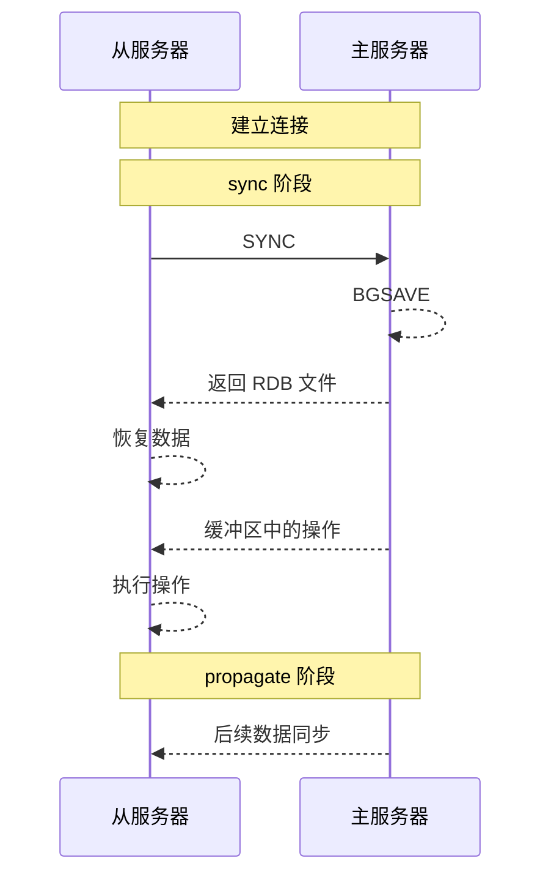
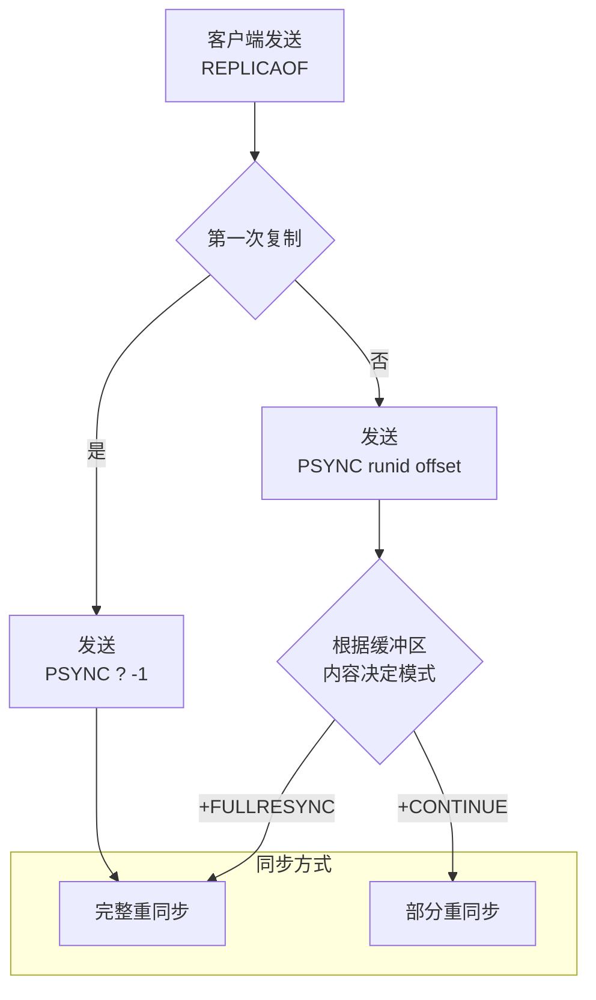

本文将会从源码层面解读 Redis 的各项机制。我们会从最基础的内容开始，尽量只看 Redis 最核心的部分，而剥离掉一些不太重要的内容，所有的源码都给出了 GitHub 的链接。

写作本文时，Redis CE 还在 7.4 版本；Redis 8.0 仍然在 Pre-Release。因此，本文主要基于 Redis 7.4，其余版本可能有所不同。本文使用的环境为 Debian 12。

## 高可用

### 主从复制

RDB 和 AOF 解决了服务器宕机后数据的恢复问题。然而，如果硬盘损坏，那么数据就无法恢复了。同时，在服务器宕机期间，Redis 也无法提供服务。

因此，Redis 提供了主从复制机制。主从复制是指将相同的数据复制到多个服务器上，其中一个服务器为主服务器，其他服务器为从服务器。主服务器负责处理客户端请求，从服务器负责复制主服务器的数据。

主从复制的实现非常简单，只需要在从服务器上执行 `REPLICAOF` 命令，指定主服务器的地址和端口即可。主服务器会将自己的数据发送给从服务器，从服务器接收到数据后，会将数据写入到自己的数据库中：

```shell
$ REPLICAOF 127.0.0.1 6799
OK
```

如果要取消主从复制，可以运行以下命令：

```shell
$ REPLICAOF NO ONE
OK
```

主服务器可以读写，从服务器只能读。当主服务器上的数据发生变化时，主服务器会将数据发送给从服务器，从服务器接收到数据后，会将数据写入到自己的数据库中。此时，既能从主服务器读取数据，也能从从服务器读取数据。

从服务器下可以再次进行主从复制，这样就可以构建一个多级主从复制的架构。这样，可以分担主服务器操作传播的压力，提高系统的可用性。

<div hidden>

</div>


#### 同步机制

在 Redis 2.8 之前，主从复制分为了 `sync` 和 `propagate` 两个阶段：

- `sync` 阶段：
  - 从服务器连接到主服务器，发送 `SYNC` 命令；
  - 主服务器执行 `BGSAVE` 命令，将数据保存到 RDB 文件中。在此期间，主服务器会将写操作缓存到该从服务器对应的 `repl_buffer` 缓冲区中；
  - 主服务器将 RDB 文件发送给从服务器。从服务器接收到 RDB 文件后，将数据恢复并写入到自己的数据库中；
  - 主服务器将缓冲区中的写操作发送给从服务器，从服务器执行这些写操作。从服务器执行这些操作。
- `propagate` 阶段：
  - 主服务器将写操作发送给从服务器，从服务器执行这些写操作。

<div hidden>

</div>


这样的操作能够保证从服务器的数据和主服务器的数据一致，但存在一个问题。如果主从服务器之间的连接因为网络问题断开，那么在重新连接后，从服务器会重新执行 `sync` 阶段，主服务器不得不耗费大量的时间和资源来重新执行 `BGSAVE` 命令，并让从服务器更新数据。

然而，从服务器的数据库中已经有了断线之前的所有数据，事实上只需要将断线期间的数据同步过来即可。现在这样的操作同时浪费了主服务器和从服务器的资源。

因此，Redis 2.8 之后，主从复制采用了 `PSYNC` 命令来解决这个问题。`PSYNC` 包含两种模式：

- 完整重同步（full resynchronization）：当从服务器第一次连接到主服务器时，会执行完整重同步：
  - 从服务器连接到主服务器，发送 `PSYNC` 命令；
  - 其余步骤和 `sync` 一样。
- 部分重同步（partial resynchronization）：当从服务器断线重连时，会执行部分重同步：
  - 从服务器连接到主服务器，发送 `PSYNC` 命令，带上上次同步的复制偏移量；
  - 主服务器返回 `+CONTINUE` 或 `+FULLRESYNC` 命令；
    - 如果返回的是 `+CONTINUE`，主服务器会将断线期间的数据发送给从服务器，从服务器接收到数据后，会将数据写入到自己的数据库中，即增量同步；
    - 如果返回的是 `+FULLRESYNC`，从服务器会执行完整重同步，即全量同步。

对于部分重同步，主服务器和从服务器会分别维护一个复制偏移量，分别记录自己发送/接收的数据量。通过对比这两个偏移量，可以很容易地知道主从服务器是否一致。

主服务器在命令传播时，会同时再将命令传播一份给**复制积压缓冲区** `repl_backlog_buffer`。`repl_backlog_buffer` 是一个环形缓冲区，新来的数据会覆盖旧的数据。当断线重连后

- 如果发现偏移量之后的数据都在缓冲区中，那么就可以直接将对应的数据发送给从服务器
- 然而，如果幻想缓冲区中的数据已经被覆盖，那么就只能执行完整重同步。

其大小最好设置为 $$\text{每秒产生的写命令大小} \times \text{重连所需的时间} \times 2$$。可以在配置文件中设置 `repl-backlog-size` 来设置，默认为 1M。如果设置为 0，那么就不会有积压缓冲区：

```conf
repl-backlog-size 1mb
```

主服务器对从服务器的识别通过服务器的 ID 来实现。

<div hidden>

</div>


在 Redis 中，从服务器分为两类：

- 无盘从服务器：从服务器不会保存数据到硬盘，主服务器通过 socket 直接发送数据给从服务器
- 有盘从服务器：从服务器会保存数据到硬盘，主服务器会将数据保存到 RDB 文件中，从服务器通过 RDB 文件恢复数据

#### 连接与同步

当一个从节点需要连接主节点时，它需要了解主节点的地址和端口。它会完成以下工作以和主节点建立网络连接：

- 清空当前主节点的信息
- 断开所有阻塞的客户端
- 设置主节点的地址和端口
- 取消当前的复制握手
- 如果之前是主节点，丢弃缓存的主节点
- 使用自己的参数创建缓存的主节点，以便之后与新的主节点进行 PSYNC

<details>
<summary>点击查看源码</summary>
<div markdown="1">

主从节点建立连接的[实现](https://github.com/redis/redis/blob/7.4/src/replication.c#L2997)如下：

```c
void replicationSetMaster(char *ip, int port) {
    int was_master = server.masterhost == NULL;

    // 清空主节点信息
    sdsfree(server.masterhost);
    server.masterhost = NULL;
    if (server.master) {
        freeClient(server.master);
    }
    // 断开所有阻塞的客户端
    disconnectAllBlockedClients();

    // 设置主节点信息
    server.masterhost = sdsnew(ip);
    server.masterport = port;

    // 更新 OOM 内存不足的分数
    setOOMScoreAdj(-1);
    
    // 取消当前的复制握手
    cancelReplicationHandshake(0);
    if (was_master) {
        // 如果之前是主节点，丢弃缓存的主节点
        replicationDiscardCachedMaster();
        // 使用自己的参数创建缓存的主节点，以便之后与新的主节点进行 PSYNC
        replicationCacheMasterUsingMyself();
    }

    // 通知模块角色已经改变
    moduleFireServerEvent(REDISMODULE_EVENT_REPLICATION_ROLE_CHANGED,
                          REDISMODULE_EVENT_REPLROLECHANGED_NOW_REPLICA,
                          NULL);

    // 通知模块主节点已经改变
    if (server.repl_state == REPL_STATE_CONNECTED)
        moduleFireServerEvent(REDISMODULE_EVENT_MASTER_LINK_CHANGE,
                              REDISMODULE_SUBEVENT_MASTER_LINK_DOWN,
                              NULL);

    // 更新状态
    server.repl_state = REPL_STATE_CONNECT;
    /* ... */
    // 连接主节点
    connectWithMaster();
}
```

这个函数在从服务器中设置了主服务器的地址和端口。然后，它调用了 [`connectWithMaster` 函数](https://github.com/redis/redis/blob/7.4/src/replication.c#L2921)来连接主服务器：

```c
int connectWithMaster(void) {
    // 创建一个用于复制的连接对象
    server.repl_transfer_s = connCreate(connTypeOfReplication());
    // 尝试连接到主节点
    if (connConnect(server.repl_transfer_s, server.masterhost, server.masterport,
                server.bind_source_addr, syncWithMaster) == C_ERR) {
        /* ... */
        connClose(server.repl_transfer_s);
        server.repl_transfer_s = NULL;
        return C_ERR;
    }

    // 更新最后一次 I/O 操作的时间戳
    server.repl_transfer_lastio = server.unixtime;
    // 更新复制状态为正在连接
    server.repl_state = REPL_STATE_CONNECTING;
    /* ... */
    return C_OK;
}
```

至此，主从节点已经建立了网络连接。

</div>
</details>

在连接时，带上了 [`syncWithMaster` 回调函数](https://github.com/redis/redis/blob/7.4/src/replication.c#L2608)。在成功建立主服务器和从服务器之间的网络连接后，就会调用该函数，与主服务器进行同步。

该函数主要完成了以下工作：

- 从服务器发送 `PING` 命令给主服务器，检查主服务器是否在线
  
  主服务器返回 `PONG`

- 如果设置了 `masterauth` 或者 `masteruser`，从服务器发送 `AUTH masteruser的值 masterauth的值` 命令给主服务器，进行单向或者双向身份验证

  主服务器会返回 `+OK` 或者 `-NOAUTH`

- 从服务器发送 `REPLCONF listening-port 自己的端口` 命令给主服务器，告诉主服务器自己的端口

  主服务器返回 `+OK` 或者 `-ERR`

- 如果设置了 `slave-announce-ip`，从服务器发送 `REPLCONF ip-address 自己的 IP` 命令给主服务器，告诉主服务器自己的 IP

  主服务器返回 `+OK` 或者 `-ERR`

- 从服务器发送 `REPLCONF capa eof capa psync2` 命令给主服务器，告诉主服务器自己的能力

  - `eof`：从服务器支持 `EOF`，用于无盘复制
  - `psync2`：从服务器支持 `PSYNC2`，用于部分重同步

  主服务器返回 `+OK` 或者 `-ERR`

- 从服务器发送 `PSYNC runid offset` 命令给主服务器，请求同步数据

  主服务器返回 `+FULLRESYNC` 或 `+CONTINUE`

  - 如果返回 `+CONTINUE`，说明可以进行部分重同步

  - 如果返回 `+FULLRESYNC`，说明无法部分重同步，使用 `SYNC` 进行完整重同步

- 同步数据

  - 如果是部分重同步，主服务器会将断线期间的数据发送给从服务器，从服务器接收到数据后，会将数据写入到自己的数据库中
  
  - 如果不支持部分重同步，主服务器会执行完整重同步。

<details>
<summary>点击查看源码</summary>
<div markdown="1">

这个函数非常长，我们拆解为多个步骤：

- 发送 `PING` 命令：

  ```c
  // 发送 PING 命令
  if (server.repl_state == REPL_STATE_CONNECTING) {
      /* ... */
      connSetReadHandler(conn, syncWithMaster);
      connSetWriteHandler(conn, NULL);
      // 状态设置为等待 PING 回复
      server.repl_state = REPL_STATE_RECEIVE_PING_REPLY;
      // 发送 PING 命令
      err = sendCommand(conn,"PING",NULL);
      if (err) goto write_error;
      return;
  }

  // 接收 PING 命令的回复 PONG
  if (server.repl_state == REPL_STATE_RECEIVE_PING_REPLY) {
      err = receiveSynchronousResponse(conn);

      // 如果没有回复，报错
      if (err == NULL) goto no_response_error;

      // 回复必须是 +PONG
      if (err[0] != '+' &&
          strncmp(err,"-NOAUTH",7) != 0 &&
          strncmp(err,"-NOPERM",7) != 0 &&
          strncmp(err,"-ERR operation not permitted",28) != 0)
      {
          /* ... */
          sdsfree(err);
          goto error;
      } else {
          /* ... */
      }
      sdsfree(err);
      err = NULL;
      // 状态设置为发送握手
      server.repl_state = REPL_STATE_SEND_HANDSHAKE;
  }
  ```

- 如果设置了 `masterauth`，需要进行身份验证。从节点发送 `AUTH masterauth的值` 命令给主节点：

  ```c
  // 如果设置了身份验证，验证主节点身份
  if (server.masterauth) {
      char *args[3] = {"AUTH",NULL,NULL};
      size_t lens[3] = {4,0,0};
      int argc = 1;
      if (server.masteruser) {
          args[argc] = server.masteruser;
          lens[argc] = strlen(server.masteruser);
          argc++;
      }
      args[argc] = server.masterauth;
      lens[argc] = sdslen(server.masterauth);
      argc++;
      err = sendCommandArgv(conn, argc, args, lens);
      if (err) goto write_error;
  }

  // 如果没有设置身份验证，直接跳过到下一步
  if (server.repl_state == REPL_STATE_RECEIVE_AUTH_REPLY && !server.masterauth)
      server.repl_state = REPL_STATE_RECEIVE_PORT_REPLY;

  // 接收主节点身份认证回复
  if (server.repl_state == REPL_STATE_RECEIVE_AUTH_REPLY) {
      err = receiveSynchronousResponse(conn);
      if (err == NULL) goto no_response_error;
      // 如果认证失败，报错
      if (err[0] == '-') {
          /* ... */
          sdsfree(err);
          goto error;
      }
      sdsfree(err);
      err = NULL;
      // 状态设置为等待端口回复
      server.repl_state = REPL_STATE_RECEIVE_PORT_REPLY;
      return;
  }
  ```

- 发送端口信息。从节点发送 `REPLCONF listening-port 自己的端口` 命令给主节点：

  ```c
  // 设置从节点端口
  {
      int port;
      if (server.slave_announce_port)
          port = server.slave_announce_port;
      else if (server.tls_replication && server.tls_port)
          port = server.tls_port;
      else
          port = server.port;
      sds portstr = sdsfromlonglong(port);
      err = sendCommand(conn,"REPLCONF",
              "listening-port",portstr, NULL);
      sdsfree(portstr);
      if (err) goto write_error;
  }

  // 接收端口回复
  if (server.repl_state == REPL_STATE_RECEIVE_PORT_REPLY) {
      err = receiveSynchronousResponse(conn);
      if (err == NULL) goto no_response_error;
      // 如果回复不是 +OK，报错
      if (err[0] == '-') {
          /* ... */
      }
      sdsfree(err);
      // 状态设置为等待 IP 回复
      server.repl_state = REPL_STATE_RECEIVE_IP_REPLY;
      return;
  }
  ```

- 发送 IP 信息。从节点发送 `REPLCONF ip-address 自己的IP` 命令给主节点：

  ```c
  // 设置从节点 IP
  if (server.slave_announce_ip) {
      err = sendCommand(conn,"REPLCONF",
              "ip-address",server.slave_announce_ip, NULL);
      if (err) goto write_error;
  }

  // 如果没有设置从节点 IP，直接跳过到下一步
  if (server.repl_state == REPL_STATE_RECEIVE_IP_REPLY && !server.slave_announce_ip)
      server.repl_state = REPL_STATE_RECEIVE_CAPA_REPLY;

  // 接收 IP 回复
  if (server.repl_state == REPL_STATE_RECEIVE_IP_REPLY) {
      err = receiveSynchronousResponse(conn);
      if (err == NULL) goto no_response_error;
      // 如果回复不是 +OK，报错
      if (err[0] == '-') {
          /* ... */
      }
      sdsfree(err);、
      // 状态设置为等待能力回复
      server.repl_state = REPL_STATE_RECEIVE_CAPA_REPLY;
      return;
  }
  ```

- 发送能力信息。从节点发送 `REPLCONF capa eof capa psync2` 命令给主节点。这个命令告诉主节点从节点的能力：

  - `eof`：从节点支持 `EOF`，用于无盘复制；
  - `psync2`：从节点支持 `PSYNC2`，用于部分重同步。

  ```c
  // 通知主节点从节点的能力（EOF 和 PSYNC2 等）
  err = sendCommand(conn,"REPLCONF",
          "capa","eof","capa","psync2",NULL);
  if (err) goto write_error;

  // 接收能力回复
  if (server.repl_state == REPL_STATE_RECEIVE_CAPA_REPLY) {
      err = receiveSynchronousResponse(conn);
      if (err == NULL) goto no_response_error;
      // 如果回复不是 +OK，报错
      if (err[0] == '-') {
          /* ... */
      }
      sdsfree(err);
      err = NULL;
      // 状态设置为发送 PSYNC
      server.repl_state = REPL_STATE_SEND_PSYNC;
  }
  ```

- 发送 `PSYNC` 命令。从节点发送 `PSYNC runid offset` 命令给主节点：

  ```c
  // 发送 PSYNC 命令
  if (server.repl_state == REPL_STATE_SEND_PSYNC) {
      // 发送 PSYNC 命令
      if (slaveTryPartialResynchronization(conn,0) == PSYNC_WRITE_ERROR) {
          /* ... */
          goto write_error;
      }
      // 状态设置为等待 PSYNC 回复
      server.repl_state = REPL_STATE_RECEIVE_PSYNC_REPLY;
      return;
  }
  
  // 接收 PSYNC 回复
  psync_result = slaveTryPartialResynchronization(conn,1);
  
  // 如果要求稍后再试，那就再等等
  if (psync_result == PSYNC_WAIT_REPLY) return;
  // 如果主服务器暂时无法 PSYNC，报错
  if (psync_result == PSYNC_TRY_LATER) goto error;
  
  // 如果是 PSYNC_CONTINUE，说明可以进行部分重同步
  if (psync_result == PSYNC_CONTINUE) {
      /* ... */
      if (server.supervised_mode == SUPERVISED_SYSTEMD) {
          /* ... */
      }
      return;
  }
  
  // 如果是 PSYNC_NOT_SUPPORTED，说明不支持部分重同步，使用 SYNC 进行完整重同步
  if (psync_result == PSYNC_NOT_SUPPORTED) {
      /* ... */
      if (connSyncWrite(conn,"SYNC\r\n",6,server.repl_syncio_timeout*1000) == -1) {
          /* ... */
          goto error;
      }
  }
  
  // 如果不支持无盘加载，为批量传输准备临时文件，文件名为 temp-<unixtime>.<pid>.rdb
  if (!useDisklessLoad()) {
      while(maxtries--) {
          snprintf(tmpfile,256,
              "temp-%d.%ld.rdb",(int)server.unixtime,(long int)getpid());
          dfd = open(tmpfile,O_CREAT|O_WRONLY|O_EXCL,0644);
          if (dfd != -1) break;
          sleep(1);
      }
      if (dfd == -1) {
          /* ... */
          goto error;
      }
      server.repl_transfer_tmpfile = zstrdup(tmpfile);
      server.repl_transfer_fd = dfd;
  }
  
  // 设置批量文件的非阻塞下载
  if (connSetReadHandler(conn, readSyncBulkPayload) == C_ERR)
  {
      char conninfo[CONN_INFO_LEN];
      /* ... */
      goto error;
  }
  
  server.repl_state = REPL_STATE_TRANSFER;
  server.repl_transfer_size = -1;
  server.repl_transfer_read = 0;
  server.repl_transfer_last_fsync_off = 0;
  server.repl_transfer_lastio = server.unixtime;
  return;
  ```

此后，主服务器会将数据发送给从服务器，从服务器接收到数据后，会将数据写入到自己的数据库中。

</div>
</details>

<div hidden>

</div>


#### 命令传播

命令的传播需要保证主从服务器连接完好。它们使用一个每秒运行一次的定时任务来进行心跳检测和数据同步：

- 从节点定期向支持 PSYNC 的主节点发送心跳检测，内容为 `REPLCONF ACK <offset>`
- 主节点每隔 `repl-ping-slave-period`，向所有从节点发送 `PING` 命令（正在手动恢复的除外）
- 从节点收到 `PING` 命令后，会回复一个换行符。不回复 `PONG` 是为了防止干扰偏移量
- 主节点断开超时的无盘从服务器
- 如果主服务器没有从服务器，释放复制积压缓冲区
- *开始复制流程*
- 如果禁用了持久化，删除用于同步副本的 RDB 文件
- 检查复制缓冲区块的引用计数，以确保其完整性

<details>
<summary>点击查看源码</summary>
<div markdown="1">

这通过每秒运行一次的 [`replicationCron` 函数](https://github.com/redis/redis/blob/7.4/src/replication.c#L3704) 来实现：

```c
void replicationCron(void) {
    static long long replication_cron_loops = 0;
    
    updateFailoverStatus();

    // 检查各种超时
    if (server.masterhost &&
        (server.repl_state == REPL_STATE_CONNECTING ||
         slaveIsInHandshakeState()) &&
         (time(NULL)-server.repl_transfer_lastio) > server.repl_timeout)
    {
        /* ... */
        cancelReplicationHandshake(1);
    }
    if (server.masterhost && server.repl_state == REPL_STATE_TRANSFER &&
        (time(NULL)-server.repl_transfer_lastio) > server.repl_timeout)
    {
        /* ... */
        cancelReplicationHandshake(1);
    }
    if (server.masterhost && server.repl_state == REPL_STATE_CONNECTED &&
        (time(NULL)-server.master->lastinteraction) > server.repl_timeout)
    {
        /* ... */
        freeClient(server.master);
    }

    // 检查是否需要连接到主服务器
    if (server.repl_state == REPL_STATE_CONNECT) {
        /* ... */
        connectWithMaster();
    }

    // 定期向支持 PSYNC 的主节点发送心跳检测，内容为 REPLCONF ACK <offset>
    if (server.masterhost && server.master &&
        !(server.master->flags & CLIENT_PRE_PSYNC))
        replicationSendAck();

    
    listIter li;
    listNode *ln;
    robj *ping_argv[1];

    // 每隔 server.repl_ping_slave_period，向所有从节点发送 PING 命令
    if ((replication_cron_loops % server.repl_ping_slave_period) == 0 &&
        listLength(server.slaves))
    {
        int manual_failover_in_progress =
            ((server.cluster_enabled &&
              clusterManualFailoverTimeLimit()) ||
            server.failover_end_time) &&
            isPausedActionsWithUpdate(PAUSE_ACTION_REPLICA);

        // 如果正在进行手动故障转移，则不发送 PING 命令，防止改变复制偏移量
        if (!manual_failover_in_progress) {
            ping_argv[0] = shared.ping;
            replicationFeedSlaves(server.slaves, -1,
                ping_argv, 1);
        }
    }

    // 从服务器向从服务器的从服务器发送保活心跳，因为从服务器的从服务器只从主服务器接收数据，需要告诉它们直接上司还活着
    listRewind(server.slaves,&li);
    while((ln = listNext(&li))) {
        client *slave = ln->value;

        int is_presync =
            (slave->replstate == SLAVE_STATE_WAIT_BGSAVE_START ||
            (slave->replstate == SLAVE_STATE_WAIT_BGSAVE_END &&
             server.rdb_child_type != RDB_CHILD_TYPE_SOCKET));

        if (is_presync) {
            // 发送换行符而不是 PING 命令，防止干扰偏移量
            connWrite(slave->conn, "\n", 1);
        }
    }

    // 断开超时的从服务器
    if (listLength(server.slaves)) {
        listIter li;
        listNode *ln;

        listRewind(server.slaves,&li);
        while((ln = listNext(&li))) {
            client *slave = ln->value;

            if (slave->replstate == SLAVE_STATE_ONLINE) {
                if (slave->flags & CLIENT_PRE_PSYNC)
                    continue;
                if ((server.unixtime - slave->repl_ack_time) > server.repl_timeout) {
                    /* ... */
                    freeClient(slave);
                    continue;
                }
            }
            // 只断开无盘从服务器，因为有盘从服务器不是由 fork 子进程提供数据，因此如果有盘从服务器卡住不会阻止 fork 子进程终止
            if (slave->replstate == SLAVE_STATE_WAIT_BGSAVE_END && server.rdb_child_type == RDB_CHILD_TYPE_SOCKET) {
                if (slave->repl_last_partial_write != 0 &&
                    (server.unixtime - slave->repl_last_partial_write) > server.repl_timeout)
                {
                    /* ... */
                    freeClient(slave);
                    continue;
                }
            }
        }
    }

    // 如果这是一个没有从服务器的主服务器，并且有复制积压缓冲区，释放它以回收内存
    // 从服务器不能释放，这样方便被提升为主服务器
    if (listLength(server.slaves) == 0 && server.repl_backlog_time_limit &&
        server.repl_backlog && server.masterhost == NULL)
    {
        time_t idle = server.unixtime - server.repl_no_slaves_since;

        if (idle > server.repl_backlog_time_limit) {
            // 使用新的 id
            // 这样，当我们的从服务器被提升为主服务器，我们转变为从服务器时不会出错
            changeReplicationId();
            clearReplicationId2();
            freeReplicationBacklog();
            /* ... */
        }
    }

    // 如果需要，开始 BGSAVE
    replicationStartPendingFork();

    // 如果禁用了持久化，删除用于同步副本的 RDB 文件
    removeRDBUsedToSyncReplicas();

    // 检查复制缓冲区块的引用计数，以确保其完整性
    if (listLength(server.repl_buffer_blocks) > 0) {
        replBufBlock *o = listNodeValue(listFirst(server.repl_buffer_blocks));
        serverAssert(o->refcount > 0 &&
            o->refcount <= (int)listLength(server.slaves)+1);
    }

    // 刷新延迟较低的从服务器的数量
    refreshGoodSlavesCount();
    // 记录循环次数
    replication_cron_loops++;
}
```

这个函数同时实现了主服务器和从服务器的心跳检测、断线检测等功能。

</div>
</details>

接下来我们来看具体的复制流程。

- 如果不支持无盘复制，那么就将数据通过 `BGSAVE` 保存到 RDB 文件中，然后执行全量同步
- 如果支持无盘复制，则将数据通过 TLS 管道发送给从服务器。

<details>
<summary>点击查看源码</summary>
<div markdown="1">

主服务器的同步操作在 [`replicationStartPendingFork` 函数](https://github.com/redis/redis/blob/7.4/src/replication.c#L3953)中：

```c
void replicationStartPendingFork(void) {
    int mincapa = -1;
    int req = -1;

    if (shouldStartChildReplication(&mincapa, &req)) {
        startBgsaveForReplication(mincapa, req);
    }
}
```

它调用了 [`startBgsaveForReplication` 函数](https://github.com/redis/redis/blob/7.4/src/replication.c#L834)来开始一个后台保存操作：

```c
int startBgsaveForReplication(int mincapa, int req) {
    int retval;
    int socket_target = 0;
    listIter li;
    listNode *ln;

    // 如果支持 EOF 和无盘复制，直接使用 socket 作为目标
    socket_target = (server.repl_diskless_sync || req & SLAVE_REQ_RDB_MASK) && (mincapa & SLAVE_CAPA_EOF);
    serverAssert(socket_target || !(req & SLAVE_REQ_RDB_MASK));

    /* ... */

    rdbSaveInfo rsi, *rsiptr;
    rsiptr = rdbPopulateSaveInfo(&rsi);
    if (rsiptr) {
        if (socket_target)
            // 使用 socket 作为目标
            retval = rdbSaveToSlavesSockets(req,rsiptr);
        else {
            // 使用磁盘作为目标，保存到 RDB 文件中
            retval = rdbSaveBackground(req, server.rdb_filename, rsiptr, RDBFLAGS_REPLICATION | RDBFLAGS_KEEP_CACHE);
        }
    } else {
        /* ... */
        retval = C_ERR;
    }

    // 如果成功选择了磁盘作为目标，并且开启了删除同步文件，设置 RDBGeneratedByReplication 为 1
    if (retval == C_OK && !socket_target && server.rdb_del_sync_files)
        RDBGeneratedByReplication = 1;

    // 如果 BGSAVE 失败，关闭并删除所有等待的从服务器并报错
    if (retval == C_ERR) {
        /* ... */
        // 遍历所有从服务器
        listRewind(server.slaves,&li);
        while((ln = listNext(&li))) {
            client *slave = ln->value;

            if (slave->replstate == SLAVE_STATE_WAIT_BGSAVE_START) {
                slave->replstate = REPL_STATE_NONE;
                slave->flags &= ~CLIENT_SLAVE;
                listDelNode(server.slaves,ln);
                /* ... */
                slave->flags |= CLIENT_CLOSE_AFTER_REPLY;
            }
        }
        return retval;
    }

    // 如果选择了磁盘作为目标
    if (!socket_target) {
        // 遍历所有从服务器
        listRewind(server.slaves,&li);
        while((ln = listNext(&li))) {
            client *slave = ln->value;

            if (slave->replstate == SLAVE_STATE_WAIT_BGSAVE_START) {
                if (slave->slave_req != req)
                    continue;
                // 全量同步
                replicationSetupSlaveForFullResync(slave, getPsyncInitialOffset());
            }
        }
    }

    return retval;
}
```

它区分了两种情况：

- 如果不支持无盘复制，那么就将数据通过 `BGSAVE` 保存到 RDB 文件中，这个 `rdbSaveBackground` 函数我们之前已经看过；
- 如果支持无盘复制，则调用了 [`rdbSaveToSlavesSockets` 函数](https://github.com/redis/redis/blob/7.4/src/rdb.c#L3851)来将数据通过 TLS 管道发送给从服务器。

`rdbSaveToSlavesSockets` 函数的实现如下：

```c
int rdbSaveToSlavesSockets(int req, rdbSaveInfo *rsi) {
    listNode *ln;
    listIter li;
    pid_t childpid;
    int pipefds[2], rdb_pipe_write, safe_to_exit_pipe;

    // 清空现有的子进程和管道
    if (hasActiveChildProcess()) return C_ERR;
    if (server.rdb_pipe_conns) return C_ERR;

    // 创建管道使得传输使用 TLS
    if (anetPipe(pipefds, O_NONBLOCK, 0) == -1) return C_ERR;
    server.rdb_pipe_read = pipefds[0];
    rdb_pipe_write = pipefds[1];

    // 再创建一个管道，用于通知子进程可以退出
    if (anetPipe(pipefds, 0, 0) == -1) {
        close(rdb_pipe_write);
        close(server.rdb_pipe_read);
        return C_ERR;
    }
    safe_to_exit_pipe = pipefds[0];
    server.rdb_child_exit_pipe = pipefds[1];

    server.rdb_pipe_conns = zmalloc(sizeof(connection *)*listLength(server.slaves));
    server.rdb_pipe_numconns = 0;
    server.rdb_pipe_numconns_writing = 0;
    // 遍历所有从服务器
    listRewind(server.slaves,&li);
    while((ln = listNext(&li))) {
        client *slave = ln->value;
        if (slave->replstate == SLAVE_STATE_WAIT_BGSAVE_START) {
            if (slave->slave_req != req)
                continue;
            server.rdb_pipe_conns[server.rdb_pipe_numconns++] = slave->conn;
            // 设置状态为等待全量同步
            replicationSetupSlaveForFullResync(slave,getPsyncInitialOffset());
        }
    }

    // 创建子进程
    if ((childpid = redisFork(CHILD_TYPE_RDB)) == 0) {
        // 子进程
        int retval, dummy;
        rio rdb;

        rioInitWithFd(&rdb,rdb_pipe_write);

        close(server.rdb_pipe_read);

        redisSetProcTitle("redis-rdb-to-slaves");
        redisSetCpuAffinity(server.bgsave_cpulist);

        retval = rdbSaveRioWithEOFMark(req,&rdb,NULL,rsi);
        if (retval == C_OK && rioFlush(&rdb) == 0)
            retval = C_ERR;

        if (retval == C_OK) {
            sendChildCowInfo(CHILD_INFO_TYPE_RDB_COW_SIZE, "RDB");
        }

        rioFreeFd(&rdb);
        close(rdb_pipe_write);
        close(server.rdb_child_exit_pipe);
        dummy = read(safe_to_exit_pipe, pipefds, 1);
        UNUSED(dummy);
        exitFromChild((retval == C_OK) ? 0 : 1);
    } else {
        // 父进程
        if (childpid == -1) {
            /* ... */

            // 通知所有从服务器，已经开始同步
            listRewind(server.slaves,&li);
            while((ln = listNext(&li))) {
                client *slave = ln->value;
                if (slave->replstate == SLAVE_STATE_WAIT_BGSAVE_END) {
                    slave->replstate = SLAVE_STATE_WAIT_BGSAVE_START;
                }
            }
            close(rdb_pipe_write);
            close(server.rdb_pipe_read);
            close(server.rdb_child_exit_pipe);
            zfree(server.rdb_pipe_conns);
            server.rdb_pipe_conns = NULL;
            server.rdb_pipe_numconns = 0;
            server.rdb_pipe_numconns_writing = 0;
        } else {
            /* ... */
            server.rdb_save_time_start = time(NULL);
            server.rdb_child_type = RDB_CHILD_TYPE_SOCKET;
            close(rdb_pipe_write);
            if (aeCreateFileEvent(server.el, server.rdb_pipe_read, AE_READABLE, rdbPipeReadHandler,NULL) == AE_ERR) {
                /* ... */
            }
        }
        close(safe_to_exit_pipe);
        return (childpid == -1) ? C_ERR : C_OK;
    }
    return C_OK;
}
```

</div>
</details>

### 哨兵机制

在主从复制中我们提到，客户端可以从任意从服务器读数据，而只会向主服务器写数据。如果主服务器宕机，那么再多的从服务器也无法提供服务。为了解决这个问题，我们可以使用 Redis Sentinel。

Redis Sentinel 是一个分布式系统，用于监控 Redis 主从集群的健康状态。它可以执行以下操作：

- 监控 Redis 服务器的健康状态
- 在主服务器下线时，自动将从服务器提升为主服务器
- 当选出新的主服务器后，通知所有从服务器切换主服务器
