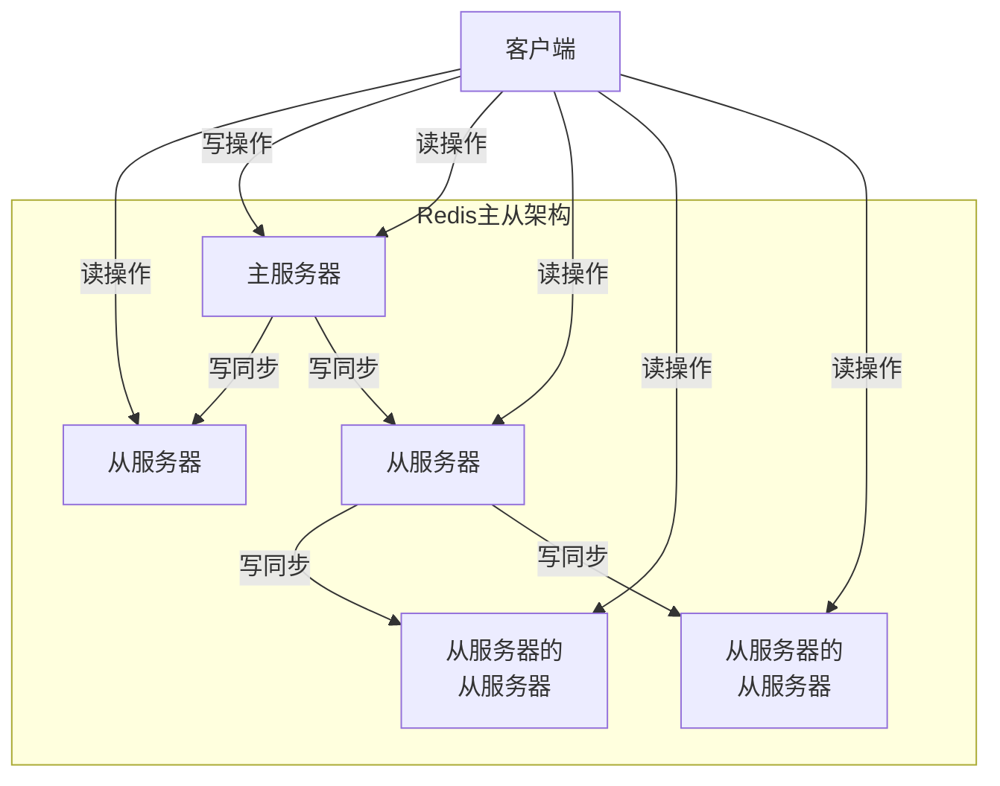
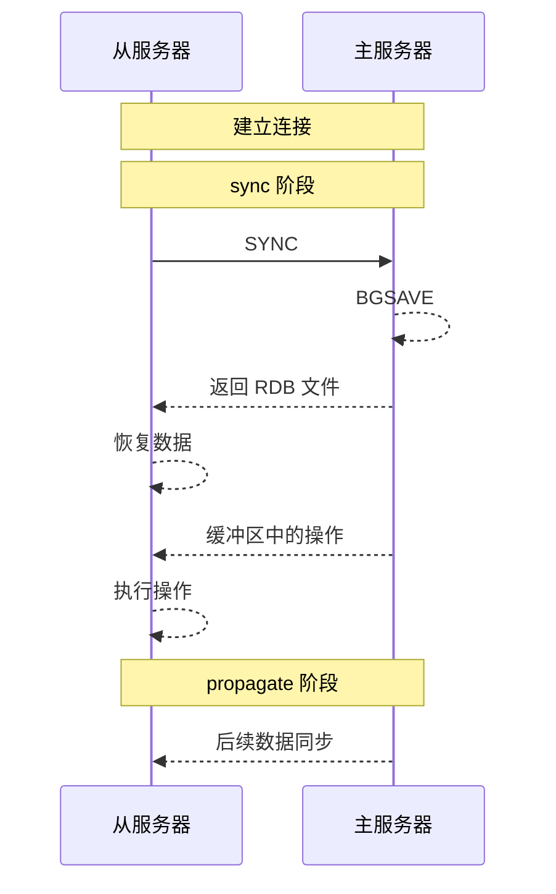
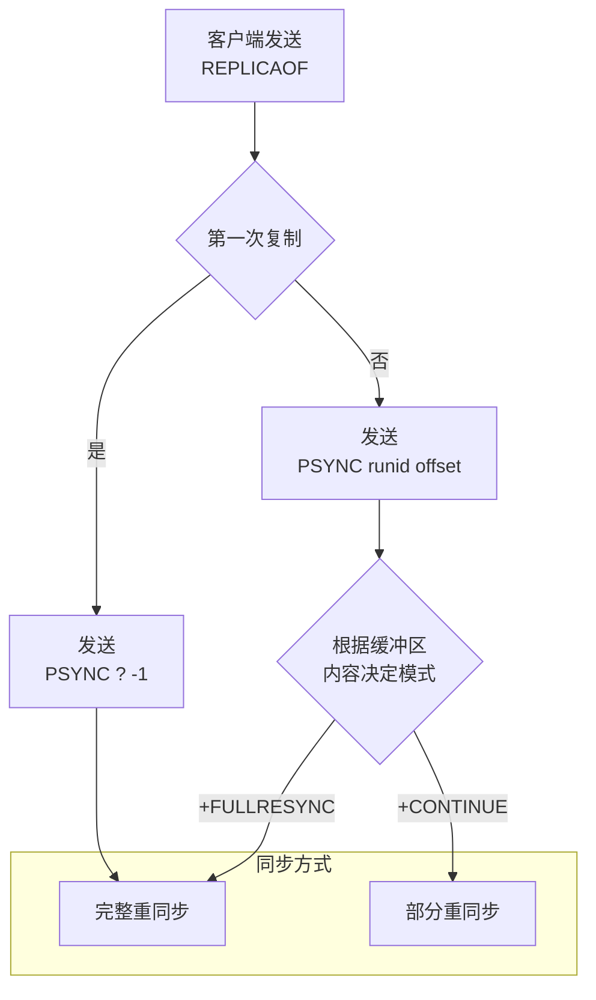
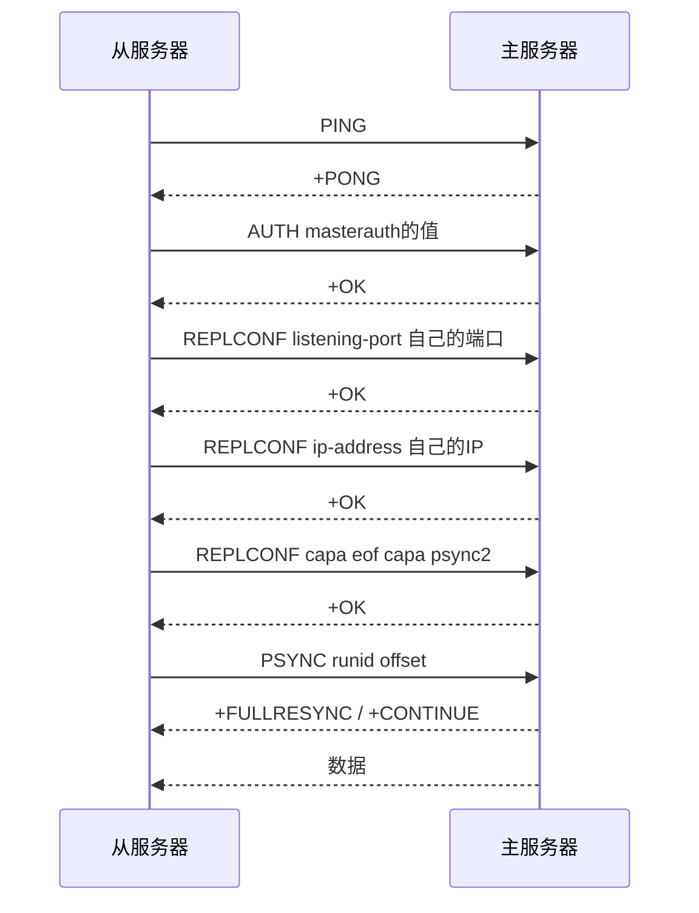

本文将会从源码层面解读 Redis 的各项机制。我们会从最基础的内容开始，尽量只看 Redis 最核心的部分，而剥离掉一些不太重要的内容，所有的源码都给出了 GitHub 的链接。

写作本文时，Redis CE 还在 7.4 版本；Redis 8.0 仍然在 Pre-Release。因此，本文主要基于 Redis 7.4，其余版本可能有所不同。本文使用的环境为 Debian 12。

## 集群

当数据量越来越大，处于服务器性能考虑和数据安全考虑，我们需要将数据分布到多个服务器上。Redis 提供了集群机制，可以将数据分布到多个服务器上，提高系统的可用性和性能。

Redis 的集群包括了三种模式：

- Replication
- Sentinel
- Cluster

### 主从复制模式

RDB 和 AOF 解决了服务器宕机后数据的恢复问题。然而，如果硬盘损坏，那么数据就无法恢复了。同时，在服务器宕机期间，Redis 也无法提供服务。

因此，Redis 提供了主从复制机制。主从复制是指将相同的数据复制到多个服务器上，其中一个服务器为主服务器，其他服务器为从服务器。主服务器负责处理客户端请求，从服务器负责复制主服务器的数据。

主从复制的实现非常简单，只需要在从服务器上执行 `REPLICAOF` 命令，指定主服务器的地址和端口即可。主服务器会将自己的数据发送给从服务器，从服务器接收到数据后，会将数据写入到自己的数据库中：

```shell
$ REPLICAOF 127.0.0.1 6799
OK
```

如果要取消主从复制，可以运行以下命令：

```shell
$ REPLICAOF NO ONE
OK
```

主服务器可以读写，从服务器只能读。当主服务器上的数据发生变化时，主服务器会将数据发送给从服务器，从服务器接收到数据后，会将数据写入到自己的数据库中。此时，既能从主服务器读取数据，也能从从服务器读取数据。

从服务器下可以再次进行主从复制，这样就可以构建一个多级主从复制的架构。这样，可以分担主服务器操作传播的压力，提高系统的可用性。

<div hidden>

</div>


#### 同步机制

在 Redis 2.8 之前，主从复制分为了 `sync` 和 `propagate` 两个阶段：

- `sync` 阶段：
  - 从服务器连接到主服务器，发送 `SYNC` 命令；
  - 主服务器执行 `BGSAVE` 命令，将数据保存到 RDB 文件中。在此期间，主服务器会将写操作缓存到该从服务器对应的 `repl_buffer` 缓冲区中；
  - 主服务器将 RDB 文件发送给从服务器。从服务器接收到 RDB 文件后，将数据恢复并写入到自己的数据库中；
  - 主服务器将缓冲区中的写操作发送给从服务器，从服务器执行这些写操作。从服务器执行这些操作。
- `propagate` 阶段：
  - 主服务器将写操作发送给从服务器，从服务器执行这些写操作。

<div hidden>

</div>


这样的操作能够保证从服务器的数据和主服务器的数据一致，但存在一个问题。如果主从服务器之间的连接因为网络问题断开，那么在重新连接后，从服务器会重新执行 `sync` 阶段，主服务器不得不耗费大量的时间和资源来重新执行 `BGSAVE` 命令，并让从服务器更新数据。

然而，从服务器的数据库中已经有了断线之前的所有数据，事实上只需要将断线期间的数据同步过来即可。现在这样的操作同时浪费了主服务器和从服务器的资源。

因此，Redis 2.8 之后，主从复制采用了 `PSYNC` 命令来解决这个问题。`PSYNC` 包含两种模式：

- 完整重同步（full resynchronization）：当从服务器第一次连接到主服务器时，会执行完整重同步：
  - 从服务器连接到主服务器，发送 `PSYNC` 命令；
  - 其余步骤和 `sync` 一样。
- 部分重同步（partial resynchronization）：当从服务器断线重连时，会执行部分重同步：
  - 从服务器连接到主服务器，发送 `PSYNC` 命令，带上上次同步的复制偏移量；
  - 主服务器返回 `+CONTINUE` 或 `+FULLRESYNC` 命令；
    - 如果返回的是 `+CONTINUE`，主服务器会将断线期间的数据发送给从服务器，从服务器接收到数据后，会将数据写入到自己的数据库中，即增量同步；
    - 如果返回的是 `+FULLRESYNC`，从服务器会执行完整重同步，即全量同步。

对于部分重同步，主服务器和从服务器会分别维护一个复制偏移量，分别记录自己发送/接收的数据量。通过对比这两个偏移量，可以很容易地知道主从服务器是否一致。

主服务器在命令传播时，会同时再将命令传播一份给**复制积压缓冲区** `repl_backlog_buffer`。`repl_backlog_buffer` 是一个环形缓冲区，新来的数据会覆盖旧的数据。当断线重连后

- 如果发现偏移量之后的数据都在缓冲区中，那么就可以直接将对应的数据发送给从服务器
- 然而，如果幻想缓冲区中的数据已经被覆盖，那么就只能执行完整重同步。

其大小最好设置为 $$\text{每秒产生的写命令大小} \times \text{重连所需的时间} \times 2$$。可以在配置文件中设置 `repl-backlog-size` 来设置，默认为 1M。如果设置为 0，那么就不会有积压缓冲区：

```conf
repl-backlog-size 1mb
```

主服务器对从服务器的识别通过服务器的 ID 来实现。

<div hidden>

</div>


在 Redis 中，从服务器分为两类：

- 无盘从服务器：从服务器不会保存数据到硬盘，主服务器通过 socket 直接发送数据给从服务器
- 有盘从服务器：从服务器会保存数据到硬盘，主服务器会将数据保存到 RDB 文件中，从服务器通过 RDB 文件恢复数据

#### 连接与同步

当一个从节点需要连接主节点时，它需要了解主节点的地址和端口。它会完成以下工作以和主节点建立网络连接：

- 清空当前主节点的信息
- 断开所有阻塞的客户端
- 设置主节点的地址和端口
- 取消当前的复制握手
- 如果之前是主节点，丢弃缓存的主节点
- 使用自己的参数创建缓存的主节点，以便之后与新的主节点进行 PSYNC

<details>
<summary>点击查看源码</summary>
<div markdown="1">

主从节点建立连接的[实现](https://github.com/redis/redis/blob/7.4/src/replication.c#L2997)如下：

```c
void replicationSetMaster(char *ip, int port) {
    int was_master = server.masterhost == NULL;

    // 清空主节点信息
    sdsfree(server.masterhost);
    server.masterhost = NULL;
    if (server.master) {
        freeClient(server.master);
    }
    // 断开所有阻塞的客户端
    disconnectAllBlockedClients();

    // 设置主节点信息
    server.masterhost = sdsnew(ip);
    server.masterport = port;

    // 更新 OOM 内存不足的分数
    setOOMScoreAdj(-1);
    
    // 取消当前的复制握手
    cancelReplicationHandshake(0);
    if (was_master) {
        // 如果之前是主节点，丢弃缓存的主节点
        replicationDiscardCachedMaster();
        // 使用自己的参数创建缓存的主节点，以便之后与新的主节点进行 PSYNC
        replicationCacheMasterUsingMyself();
    }

    // 通知模块角色已经改变
    moduleFireServerEvent(REDISMODULE_EVENT_REPLICATION_ROLE_CHANGED,
                          REDISMODULE_EVENT_REPLROLECHANGED_NOW_REPLICA,
                          NULL);

    // 通知模块主节点已经改变
    if (server.repl_state == REPL_STATE_CONNECTED)
        moduleFireServerEvent(REDISMODULE_EVENT_MASTER_LINK_CHANGE,
                              REDISMODULE_SUBEVENT_MASTER_LINK_DOWN,
                              NULL);

    // 更新状态
    server.repl_state = REPL_STATE_CONNECT;
    /* ... */
    // 连接主节点
    connectWithMaster();
}
```

这个函数在从服务器中设置了主服务器的地址和端口。然后，它调用了 [`connectWithMaster` 函数](https://github.com/redis/redis/blob/7.4/src/replication.c#L2921)来连接主服务器：

```c
int connectWithMaster(void) {
    // 创建一个用于复制的连接对象
    server.repl_transfer_s = connCreate(connTypeOfReplication());
    // 尝试连接到主节点
    if (connConnect(server.repl_transfer_s, server.masterhost, server.masterport,
                server.bind_source_addr, syncWithMaster) == C_ERR) {
        /* ... */
        connClose(server.repl_transfer_s);
        server.repl_transfer_s = NULL;
        return C_ERR;
    }

    // 更新最后一次 I/O 操作的时间戳
    server.repl_transfer_lastio = server.unixtime;
    // 更新复制状态为正在连接
    server.repl_state = REPL_STATE_CONNECTING;
    /* ... */
    return C_OK;
}
```

至此，主从节点已经建立了网络连接。

</div>
</details>

在连接时，带上了 [`syncWithMaster` 回调函数](https://github.com/redis/redis/blob/7.4/src/replication.c#L2608)。在成功建立主服务器和从服务器之间的网络连接后，就会调用该函数，与主服务器进行同步。

该函数主要完成了以下工作：

- 从服务器发送 `PING` 命令给主服务器，检查主服务器是否在线
  
  主服务器返回 `PONG`

- 如果设置了 `masterauth` 或者 `masteruser`，从服务器发送 `AUTH masteruser的值 masterauth的值` 命令给主服务器，进行单向或者双向身份验证

  主服务器会返回 `+OK` 或者 `-NOAUTH`

- 从服务器发送 `REPLCONF listening-port 自己的端口` 命令给主服务器，告诉主服务器自己的端口

  主服务器返回 `+OK` 或者 `-ERR`

- 如果设置了 `slave-announce-ip`，从服务器发送 `REPLCONF ip-address 自己的 IP` 命令给主服务器，告诉主服务器自己的 IP

  主服务器返回 `+OK` 或者 `-ERR`

- 从服务器发送 `REPLCONF capa eof capa psync2` 命令给主服务器，告诉主服务器自己的能力

  - `eof`：从服务器支持 `EOF`，用于无盘复制
  - `psync2`：从服务器支持 `PSYNC2`，用于部分重同步

  主服务器返回 `+OK` 或者 `-ERR`

- 从服务器发送 `PSYNC runid offset` 命令给主服务器，请求同步数据

  主服务器返回 `+FULLRESYNC` 或 `+CONTINUE`

  - 如果返回 `+CONTINUE`，说明可以进行部分重同步

  - 如果返回 `+FULLRESYNC`，说明无法部分重同步，使用 `SYNC` 进行完整重同步

- 同步数据

  - 如果是部分重同步，主服务器会将断线期间的数据发送给从服务器，从服务器接收到数据后，会将数据写入到自己的数据库中
  
  - 如果不支持部分重同步，主服务器会执行完整重同步。

<details>
<summary>点击查看源码</summary>
<div markdown="1">

这个函数非常长，我们拆解为多个步骤：

- 发送 `PING` 命令：

  ```c
  // 发送 PING 命令
  if (server.repl_state == REPL_STATE_CONNECTING) {
      /* ... */
      connSetReadHandler(conn, syncWithMaster);
      connSetWriteHandler(conn, NULL);
      // 状态设置为等待 PING 回复
      server.repl_state = REPL_STATE_RECEIVE_PING_REPLY;
      // 发送 PING 命令
      err = sendCommand(conn,"PING",NULL);
      if (err) goto write_error;
      return;
  }

  // 接收 PING 命令的回复 PONG
  if (server.repl_state == REPL_STATE_RECEIVE_PING_REPLY) {
      err = receiveSynchronousResponse(conn);

      // 如果没有回复，报错
      if (err == NULL) goto no_response_error;

      // 回复必须是 +PONG
      if (err[0] != '+' &&
          strncmp(err,"-NOAUTH",7) != 0 &&
          strncmp(err,"-NOPERM",7) != 0 &&
          strncmp(err,"-ERR operation not permitted",28) != 0)
      {
          /* ... */
          sdsfree(err);
          goto error;
      } else {
          /* ... */
      }
      sdsfree(err);
      err = NULL;
      // 状态设置为发送握手
      server.repl_state = REPL_STATE_SEND_HANDSHAKE;
  }
  ```

- 如果设置了 `masterauth`，需要进行身份验证。从节点发送 `AUTH masterauth的值` 命令给主节点：

  ```c
  // 如果设置了身份验证，验证主节点身份
  if (server.masterauth) {
      char *args[3] = {"AUTH",NULL,NULL};
      size_t lens[3] = {4,0,0};
      int argc = 1;
      if (server.masteruser) {
          args[argc] = server.masteruser;
          lens[argc] = strlen(server.masteruser);
          argc++;
      }
      args[argc] = server.masterauth;
      lens[argc] = sdslen(server.masterauth);
      argc++;
      err = sendCommandArgv(conn, argc, args, lens);
      if (err) goto write_error;
  }

  // 如果没有设置身份验证，直接跳过到下一步
  if (server.repl_state == REPL_STATE_RECEIVE_AUTH_REPLY && !server.masterauth)
      server.repl_state = REPL_STATE_RECEIVE_PORT_REPLY;

  // 接收主节点身份认证回复
  if (server.repl_state == REPL_STATE_RECEIVE_AUTH_REPLY) {
      err = receiveSynchronousResponse(conn);
      if (err == NULL) goto no_response_error;
      // 如果认证失败，报错
      if (err[0] == '-') {
          /* ... */
          sdsfree(err);
          goto error;
      }
      sdsfree(err);
      err = NULL;
      // 状态设置为等待端口回复
      server.repl_state = REPL_STATE_RECEIVE_PORT_REPLY;
      return;
  }
  ```

- 发送端口信息。从节点发送 `REPLCONF listening-port 自己的端口` 命令给主节点：

  ```c
  // 设置从节点端口
  {
      int port;
      if (server.slave_announce_port)
          port = server.slave_announce_port;
      else if (server.tls_replication && server.tls_port)
          port = server.tls_port;
      else
          port = server.port;
      sds portstr = sdsfromlonglong(port);
      err = sendCommand(conn,"REPLCONF",
              "listening-port",portstr, NULL);
      sdsfree(portstr);
      if (err) goto write_error;
  }

  // 接收端口回复
  if (server.repl_state == REPL_STATE_RECEIVE_PORT_REPLY) {
      err = receiveSynchronousResponse(conn);
      if (err == NULL) goto no_response_error;
      // 如果回复不是 +OK，报错
      if (err[0] == '-') {
          /* ... */
      }
      sdsfree(err);
      // 状态设置为等待 IP 回复
      server.repl_state = REPL_STATE_RECEIVE_IP_REPLY;
      return;
  }
  ```

- 发送 IP 信息。从节点发送 `REPLCONF ip-address 自己的IP` 命令给主节点：

  ```c
  // 设置从节点 IP
  if (server.slave_announce_ip) {
      err = sendCommand(conn,"REPLCONF",
              "ip-address",server.slave_announce_ip, NULL);
      if (err) goto write_error;
  }

  // 如果没有设置从节点 IP，直接跳过到下一步
  if (server.repl_state == REPL_STATE_RECEIVE_IP_REPLY && !server.slave_announce_ip)
      server.repl_state = REPL_STATE_RECEIVE_CAPA_REPLY;

  // 接收 IP 回复
  if (server.repl_state == REPL_STATE_RECEIVE_IP_REPLY) {
      err = receiveSynchronousResponse(conn);
      if (err == NULL) goto no_response_error;
      // 如果回复不是 +OK，报错
      if (err[0] == '-') {
          /* ... */
      }
      sdsfree(err);、
      // 状态设置为等待能力回复
      server.repl_state = REPL_STATE_RECEIVE_CAPA_REPLY;
      return;
  }
  ```

- 发送能力信息。从节点发送 `REPLCONF capa eof capa psync2` 命令给主节点。这个命令告诉主节点从节点的能力：

  - `eof`：从节点支持 `EOF`，用于无盘复制；
  - `psync2`：从节点支持 `PSYNC2`，用于部分重同步。

  ```c
  // 通知主节点从节点的能力（EOF 和 PSYNC2 等）
  err = sendCommand(conn,"REPLCONF",
          "capa","eof","capa","psync2",NULL);
  if (err) goto write_error;

  // 接收能力回复
  if (server.repl_state == REPL_STATE_RECEIVE_CAPA_REPLY) {
      err = receiveSynchronousResponse(conn);
      if (err == NULL) goto no_response_error;
      // 如果回复不是 +OK，报错
      if (err[0] == '-') {
          /* ... */
      }
      sdsfree(err);
      err = NULL;
      // 状态设置为发送 PSYNC
      server.repl_state = REPL_STATE_SEND_PSYNC;
  }
  ```

- 发送 `PSYNC` 命令。从节点发送 `PSYNC runid offset` 命令给主节点：

  ```c
  // 发送 PSYNC 命令
  if (server.repl_state == REPL_STATE_SEND_PSYNC) {
      // 发送 PSYNC 命令
      if (slaveTryPartialResynchronization(conn,0) == PSYNC_WRITE_ERROR) {
          /* ... */
          goto write_error;
      }
      // 状态设置为等待 PSYNC 回复
      server.repl_state = REPL_STATE_RECEIVE_PSYNC_REPLY;
      return;
  }
  
  // 接收 PSYNC 回复
  psync_result = slaveTryPartialResynchronization(conn,1);
  
  // 如果要求稍后再试，那就再等等
  if (psync_result == PSYNC_WAIT_REPLY) return;
  // 如果主服务器暂时无法 PSYNC，报错
  if (psync_result == PSYNC_TRY_LATER) goto error;
  
  // 如果是 PSYNC_CONTINUE，说明可以进行部分重同步
  if (psync_result == PSYNC_CONTINUE) {
      /* ... */
      if (server.supervised_mode == SUPERVISED_SYSTEMD) {
          /* ... */
      }
      return;
  }
  
  // 如果是 PSYNC_NOT_SUPPORTED，说明不支持部分重同步，使用 SYNC 进行完整重同步
  if (psync_result == PSYNC_NOT_SUPPORTED) {
      /* ... */
      if (connSyncWrite(conn,"SYNC\r\n",6,server.repl_syncio_timeout*1000) == -1) {
          /* ... */
          goto error;
      }
  }
  
  // 如果不支持无盘加载，为批量传输准备临时文件，文件名为 temp-<unixtime>.<pid>.rdb
  if (!useDisklessLoad()) {
      while(maxtries--) {
          snprintf(tmpfile,256,
              "temp-%d.%ld.rdb",(int)server.unixtime,(long int)getpid());
          dfd = open(tmpfile,O_CREAT|O_WRONLY|O_EXCL,0644);
          if (dfd != -1) break;
          sleep(1);
      }
      if (dfd == -1) {
          /* ... */
          goto error;
      }
      server.repl_transfer_tmpfile = zstrdup(tmpfile);
      server.repl_transfer_fd = dfd;
  }
  
  // 设置批量文件的非阻塞下载
  if (connSetReadHandler(conn, readSyncBulkPayload) == C_ERR)
  {
      char conninfo[CONN_INFO_LEN];
      /* ... */
      goto error;
  }
  
  server.repl_state = REPL_STATE_TRANSFER;
  server.repl_transfer_size = -1;
  server.repl_transfer_read = 0;
  server.repl_transfer_last_fsync_off = 0;
  server.repl_transfer_lastio = server.unixtime;
  return;
  ```

此后，主服务器会将数据发送给从服务器，从服务器接收到数据后，会将数据写入到自己的数据库中。

</div>
</details>

<div hidden>

</div>


#### 命令传播

命令的传播需要保证主从服务器连接完好。它们使用一个每秒运行一次的定时任务来进行心跳检测和数据同步：

- 从节点定期向支持 PSYNC 的主节点发送心跳检测，内容为 `REPLCONF ACK <offset>`
- 主节点每隔 `repl-ping-slave-period`，向所有从节点发送 `PING` 命令（正在手动恢复的除外）
- 从节点收到 `PING` 命令后，会回复一个换行符。不回复 `PONG` 是为了防止干扰偏移量
- 主节点断开超时的无盘从服务器
- 如果主服务器没有从服务器，释放复制积压缓冲区
- *开始复制流程*
- 如果禁用了持久化，删除用于同步副本的 RDB 文件
- 检查复制缓冲区块的引用计数，以确保其完整性

<details>
<summary>点击查看源码</summary>
<div markdown="1">

这通过每秒运行一次的 [`replicationCron` 函数](https://github.com/redis/redis/blob/7.4/src/replication.c#L3704) 来实现：

```c
void replicationCron(void) {
    static long long replication_cron_loops = 0;
    
    updateFailoverStatus();

    // 检查各种超时
    if (server.masterhost &&
        (server.repl_state == REPL_STATE_CONNECTING ||
         slaveIsInHandshakeState()) &&
         (time(NULL)-server.repl_transfer_lastio) > server.repl_timeout)
    {
        /* ... */
        cancelReplicationHandshake(1);
    }
    if (server.masterhost && server.repl_state == REPL_STATE_TRANSFER &&
        (time(NULL)-server.repl_transfer_lastio) > server.repl_timeout)
    {
        /* ... */
        cancelReplicationHandshake(1);
    }
    if (server.masterhost && server.repl_state == REPL_STATE_CONNECTED &&
        (time(NULL)-server.master->lastinteraction) > server.repl_timeout)
    {
        /* ... */
        freeClient(server.master);
    }

    // 检查是否需要连接到主服务器
    if (server.repl_state == REPL_STATE_CONNECT) {
        /* ... */
        connectWithMaster();
    }

    // 定期向支持 PSYNC 的主节点发送心跳检测，内容为 REPLCONF ACK <offset>
    if (server.masterhost && server.master &&
        !(server.master->flags & CLIENT_PRE_PSYNC))
        replicationSendAck();

    
    listIter li;
    listNode *ln;
    robj *ping_argv[1];

    // 每隔 server.repl_ping_slave_period，向所有从节点发送 PING 命令
    if ((replication_cron_loops % server.repl_ping_slave_period) == 0 &&
        listLength(server.slaves))
    {
        int manual_failover_in_progress =
            ((server.cluster_enabled &&
              clusterManualFailoverTimeLimit()) ||
            server.failover_end_time) &&
            isPausedActionsWithUpdate(PAUSE_ACTION_REPLICA);

        // 如果正在进行手动故障转移，则不发送 PING 命令，防止改变复制偏移量
        if (!manual_failover_in_progress) {
            ping_argv[0] = shared.ping;
            replicationFeedSlaves(server.slaves, -1,
                ping_argv, 1);
        }
    }

    // 从服务器向从服务器的从服务器发送保活心跳，因为从服务器的从服务器只从主服务器接收数据，需要告诉它们直接上司还活着
    listRewind(server.slaves,&li);
    while((ln = listNext(&li))) {
        client *slave = ln->value;

        int is_presync =
            (slave->replstate == SLAVE_STATE_WAIT_BGSAVE_START ||
            (slave->replstate == SLAVE_STATE_WAIT_BGSAVE_END &&
             server.rdb_child_type != RDB_CHILD_TYPE_SOCKET));

        if (is_presync) {
            // 发送换行符而不是 PING 命令，防止干扰偏移量
            connWrite(slave->conn, "\n", 1);
        }
    }

    // 断开超时的从服务器
    if (listLength(server.slaves)) {
        listIter li;
        listNode *ln;

        listRewind(server.slaves,&li);
        while((ln = listNext(&li))) {
            client *slave = ln->value;

            if (slave->replstate == SLAVE_STATE_ONLINE) {
                if (slave->flags & CLIENT_PRE_PSYNC)
                    continue;
                if ((server.unixtime - slave->repl_ack_time) > server.repl_timeout) {
                    /* ... */
                    freeClient(slave);
                    continue;
                }
            }
            // 只断开无盘从服务器，因为有盘从服务器不是由 fork 子进程提供数据，因此如果有盘从服务器卡住不会阻止 fork 子进程终止
            if (slave->replstate == SLAVE_STATE_WAIT_BGSAVE_END && server.rdb_child_type == RDB_CHILD_TYPE_SOCKET) {
                if (slave->repl_last_partial_write != 0 &&
                    (server.unixtime - slave->repl_last_partial_write) > server.repl_timeout)
                {
                    /* ... */
                    freeClient(slave);
                    continue;
                }
            }
        }
    }

    // 如果这是一个没有从服务器的主服务器，并且有复制积压缓冲区，释放它以回收内存
    // 从服务器不能释放，这样方便被提升为主服务器
    if (listLength(server.slaves) == 0 && server.repl_backlog_time_limit &&
        server.repl_backlog && server.masterhost == NULL)
    {
        time_t idle = server.unixtime - server.repl_no_slaves_since;

        if (idle > server.repl_backlog_time_limit) {
            // 使用新的 id
            // 这样，当我们的从服务器被提升为主服务器，我们转变为从服务器时不会出错
            changeReplicationId();
            clearReplicationId2();
            freeReplicationBacklog();
            /* ... */
        }
    }

    // 如果需要，开始 BGSAVE
    replicationStartPendingFork();

    // 如果禁用了持久化，删除用于同步副本的 RDB 文件
    removeRDBUsedToSyncReplicas();

    // 检查复制缓冲区块的引用计数，以确保其完整性
    if (listLength(server.repl_buffer_blocks) > 0) {
        replBufBlock *o = listNodeValue(listFirst(server.repl_buffer_blocks));
        serverAssert(o->refcount > 0 &&
            o->refcount <= (int)listLength(server.slaves)+1);
    }

    // 刷新延迟较低的从服务器的数量
    refreshGoodSlavesCount();
    // 记录循环次数
    replication_cron_loops++;
}
```

这个函数同时实现了主服务器和从服务器的心跳检测、断线检测等功能。

</div>
</details>

接下来我们来看具体的复制流程。

- 如果不支持无盘复制，那么就将数据通过 `BGSAVE` 保存到 RDB 文件中，然后执行全量同步
- 如果支持无盘复制，则将数据通过 TLS 管道发送给从服务器。

<details>
<summary>点击查看源码</summary>
<div markdown="1">

主服务器的同步操作在 [`replicationStartPendingFork` 函数](https://github.com/redis/redis/blob/7.4/src/replication.c#L3953)中：

```c
void replicationStartPendingFork(void) {
    int mincapa = -1;
    int req = -1;

    if (shouldStartChildReplication(&mincapa, &req)) {
        startBgsaveForReplication(mincapa, req);
    }
}
```

它调用了 [`startBgsaveForReplication` 函数](https://github.com/redis/redis/blob/7.4/src/replication.c#L834)来开始一个后台保存操作：

```c
int startBgsaveForReplication(int mincapa, int req) {
    int retval;
    int socket_target = 0;
    listIter li;
    listNode *ln;

    // 如果支持 EOF 和无盘复制，直接使用 socket 作为目标
    socket_target = (server.repl_diskless_sync || req & SLAVE_REQ_RDB_MASK) && (mincapa & SLAVE_CAPA_EOF);
    serverAssert(socket_target || !(req & SLAVE_REQ_RDB_MASK));

    /* ... */

    rdbSaveInfo rsi, *rsiptr;
    rsiptr = rdbPopulateSaveInfo(&rsi);
    if (rsiptr) {
        if (socket_target)
            // 使用 socket 作为目标
            retval = rdbSaveToSlavesSockets(req,rsiptr);
        else {
            // 使用磁盘作为目标，保存到 RDB 文件中
            retval = rdbSaveBackground(req, server.rdb_filename, rsiptr, RDBFLAGS_REPLICATION | RDBFLAGS_KEEP_CACHE);
        }
    } else {
        /* ... */
        retval = C_ERR;
    }

    // 如果成功选择了磁盘作为目标，并且开启了删除同步文件，设置 RDBGeneratedByReplication 为 1
    if (retval == C_OK && !socket_target && server.rdb_del_sync_files)
        RDBGeneratedByReplication = 1;

    // 如果 BGSAVE 失败，关闭并删除所有等待的从服务器并报错
    if (retval == C_ERR) {
        /* ... */
        // 遍历所有从服务器
        listRewind(server.slaves,&li);
        while((ln = listNext(&li))) {
            client *slave = ln->value;

            if (slave->replstate == SLAVE_STATE_WAIT_BGSAVE_START) {
                slave->replstate = REPL_STATE_NONE;
                slave->flags &= ~CLIENT_SLAVE;
                listDelNode(server.slaves,ln);
                /* ... */
                slave->flags |= CLIENT_CLOSE_AFTER_REPLY;
            }
        }
        return retval;
    }

    // 如果选择了磁盘作为目标
    if (!socket_target) {
        // 遍历所有从服务器
        listRewind(server.slaves,&li);
        while((ln = listNext(&li))) {
            client *slave = ln->value;

            if (slave->replstate == SLAVE_STATE_WAIT_BGSAVE_START) {
                if (slave->slave_req != req)
                    continue;
                // 全量同步
                replicationSetupSlaveForFullResync(slave, getPsyncInitialOffset());
            }
        }
    }

    return retval;
}
```

它区分了两种情况：

- 如果不支持无盘复制，那么就将数据通过 `BGSAVE` 保存到 RDB 文件中，这个 `rdbSaveBackground` 函数我们之前已经看过；
- 如果支持无盘复制，则调用了 [`rdbSaveToSlavesSockets` 函数](https://github.com/redis/redis/blob/7.4/src/rdb.c#L3851)来将数据通过 TLS 管道发送给从服务器。

`rdbSaveToSlavesSockets` 函数的实现如下：

```c
int rdbSaveToSlavesSockets(int req, rdbSaveInfo *rsi) {
    listNode *ln;
    listIter li;
    pid_t childpid;
    int pipefds[2], rdb_pipe_write, safe_to_exit_pipe;

    // 清空现有的子进程和管道
    if (hasActiveChildProcess()) return C_ERR;
    if (server.rdb_pipe_conns) return C_ERR;

    // 创建管道使得传输使用 TLS
    if (anetPipe(pipefds, O_NONBLOCK, 0) == -1) return C_ERR;
    server.rdb_pipe_read = pipefds[0];
    rdb_pipe_write = pipefds[1];

    // 再创建一个管道，用于通知子进程可以退出
    if (anetPipe(pipefds, 0, 0) == -1) {
        close(rdb_pipe_write);
        close(server.rdb_pipe_read);
        return C_ERR;
    }
    safe_to_exit_pipe = pipefds[0];
    server.rdb_child_exit_pipe = pipefds[1];

    server.rdb_pipe_conns = zmalloc(sizeof(connection *)*listLength(server.slaves));
    server.rdb_pipe_numconns = 0;
    server.rdb_pipe_numconns_writing = 0;
    // 遍历所有从服务器
    listRewind(server.slaves,&li);
    while((ln = listNext(&li))) {
        client *slave = ln->value;
        if (slave->replstate == SLAVE_STATE_WAIT_BGSAVE_START) {
            if (slave->slave_req != req)
                continue;
            server.rdb_pipe_conns[server.rdb_pipe_numconns++] = slave->conn;
            // 设置状态为等待全量同步
            replicationSetupSlaveForFullResync(slave,getPsyncInitialOffset());
        }
    }

    // 创建子进程
    if ((childpid = redisFork(CHILD_TYPE_RDB)) == 0) {
        // 子进程
        int retval, dummy;
        rio rdb;

        rioInitWithFd(&rdb,rdb_pipe_write);

        close(server.rdb_pipe_read);

        redisSetProcTitle("redis-rdb-to-slaves");
        redisSetCpuAffinity(server.bgsave_cpulist);

        retval = rdbSaveRioWithEOFMark(req,&rdb,NULL,rsi);
        if (retval == C_OK && rioFlush(&rdb) == 0)
            retval = C_ERR;

        if (retval == C_OK) {
            sendChildCowInfo(CHILD_INFO_TYPE_RDB_COW_SIZE, "RDB");
        }

        rioFreeFd(&rdb);
        close(rdb_pipe_write);
        close(server.rdb_child_exit_pipe);
        dummy = read(safe_to_exit_pipe, pipefds, 1);
        UNUSED(dummy);
        exitFromChild((retval == C_OK) ? 0 : 1);
    } else {
        // 父进程
        if (childpid == -1) {
            /* ... */

            // 通知所有从服务器，已经开始同步
            listRewind(server.slaves,&li);
            while((ln = listNext(&li))) {
                client *slave = ln->value;
                if (slave->replstate == SLAVE_STATE_WAIT_BGSAVE_END) {
                    slave->replstate = SLAVE_STATE_WAIT_BGSAVE_START;
                }
            }
            close(rdb_pipe_write);
            close(server.rdb_pipe_read);
            close(server.rdb_child_exit_pipe);
            zfree(server.rdb_pipe_conns);
            server.rdb_pipe_conns = NULL;
            server.rdb_pipe_numconns = 0;
            server.rdb_pipe_numconns_writing = 0;
        } else {
            /* ... */
            server.rdb_save_time_start = time(NULL);
            server.rdb_child_type = RDB_CHILD_TYPE_SOCKET;
            close(rdb_pipe_write);
            if (aeCreateFileEvent(server.el, server.rdb_pipe_read, AE_READABLE, rdbPipeReadHandler,NULL) == AE_ERR) {
                /* ... */
            }
        }
        close(safe_to_exit_pipe);
        return (childpid == -1) ? C_ERR : C_OK;
    }
    return C_OK;
}
```

</div>
</details>

### 哨兵模式

在主从复制中我们提到，客户端可以从任意从服务器读数据，而只会向主服务器写数据。如果主服务器宕机，那么再多的从服务器也无法提供服务。为了解决这个问题，我们可以使用 Redis Sentinel。

Redis Sentinel 是一个分布式系统，用于监控 Redis 主从集群的健康状态。它可以执行以下操作：

- 监控 Redis 服务器的健康状态
- 在主服务器下线时，自动将从服务器提升为主服务器
- 当选出新的主服务器后，通知所有从服务器切换主服务器

我们把整个过程看成宫斗剧，主服务器就是皇上，从服务器就是太子，哨兵就是一群太监。

#### 哨兵初始化

> 当一个新太监进宫后，会先认识一下其它太监、皇上、太子、以及太子的孩子们，然后开始工作。

当一个哨兵节点启动后，会先连接到主服务器和从服务器，并且会递归地连接到从服务器的从服务器。它还会连接到其它哨兵节点。

哨兵通过下面的命令来连接到主服务器：

```shell
SENTINEL monitor <master-name> <ip> <port> <quorum>
```

其中，`quorum` 是一个阈值，我们后面会讲到它。

哨兵是以集群的形式存在的，至少需要有 3 个哨兵才能正常工作。

- 哨兵间的通信通过发布-订阅机制实现，他们直接有多个频道用来传递不同的信息。

  主服务器有一个 `__sentinel__:hello` 频道，新的哨兵来了之后，会向这个频道发送自己的信息，然后其它哨兵会收到这个信息。这样，哨兵之间就可以互相认识了。

- 哨兵认识主从服务器是通过主服务器，然后递归地认识从服务器的从服务器。

<details>
<summary>点击查看源码</summary>
<div markdown="1">

初始化哨兵节点的[函数](https://github.com/redis/redis/blob/7.4/src/sentinel.c#L469)如下：

```c
void initSentinel(void) {
    sentinel.current_epoch = 0;
    // 创建字典，用于保存与哨兵直连的服务器实例
    sentinel.masters = dictCreate(&instancesDictType);
    sentinel.tilt = 0;
    sentinel.tilt_start_time = 0;
    sentinel.previous_time = mstime();
    sentinel.running_scripts = 0;
    sentinel.scripts_queue = listCreate();
    sentinel.announce_ip = NULL;
    sentinel.announce_port = 0;
    sentinel.simfailure_flags = SENTINEL_SIMFAILURE_NONE;
    sentinel.deny_scripts_reconfig = SENTINEL_DEFAULT_DENY_SCRIPTS_RECONFIG;
    sentinel.sentinel_auth_pass = NULL;
    sentinel.sentinel_auth_user = NULL;
    sentinel.resolve_hostnames = SENTINEL_DEFAULT_RESOLVE_HOSTNAMES;
    sentinel.announce_hostnames = SENTINEL_DEFAULT_ANNOUNCE_HOSTNAMES;
    memset(sentinel.myid,0,sizeof(sentinel.myid));
    server.sentinel_config = NULL;
}
```

哨兵节点的主要功能在 [`sentinelTimer` 函数](https://github.com/redis/redis/blob/7.4/src/sentinel.c#L5449)，该函数每个事件循环执行一次：

```c
void sentinelTimer(void) {
    sentinelCheckTiltCondition();
    sentinelHandleDictOfRedisInstances(sentinel.masters);
    sentinelRunPendingScripts();
    sentinelCollectTerminatedScripts();
    sentinelKillTimedoutScripts();
    server.hz = CONFIG_DEFAULT_HZ + rand() % CONFIG_DEFAULT_HZ;
}
```

处理 Redis 实例的[函数](https://github.com/redis/redis/blob/7.4/src/sentinel.c#L5449)如下，它会处理字典里的主服务器，还会递归处理从服务器的字典：

```c
void sentinelHandleDictOfRedisInstances(dict *instances) {
    dictIterator *di;
    dictEntry *de;
    sentinelRedisInstance *switch_to_promoted = NULL;

    // 遍历所有直连的服务器实例
    di = dictGetIterator(instances);
    while((de = dictNext(di)) != NULL) {
        sentinelRedisInstance *ri = dictGetVal(de);

        // 处理这个服务器实例
        sentinelHandleRedisInstance(ri);
        if (ri->flags & SRI_MASTER) {
            // 处理该服务器下的从服务器
            sentinelHandleDictOfRedisInstances(ri->slaves);
            // 处理该服务器下的哨兵
            sentinelHandleDictOfRedisInstances(ri->sentinels);
            if (ri->failover_state == SENTINEL_FAILOVER_STATE_UPDATE_CONFIG) {
                switch_to_promoted = ri;
            }
        }
    }
    if (switch_to_promoted)
        sentinelFailoverSwitchToPromotedSlave(switch_to_promoted);
    dictReleaseIterator(di);
}
```

</div>
</details>

#### 保活

> 这群太监闲着无聊，隔段时间就会问一下皇上：你还活着没？

哨兵会定期发送保活心跳给其它服务器。

- 哨兵之间、哨兵和服务器间发送 `PING`
  - 如果之前收到了 `PONG`，则每 1 秒发送一次
  - 如果之前没有收到 `PONG`，则每 0.5 秒发送一次
- 哨兵之间、哨兵和服务器间发送 `HELLO`
  - 每 2 秒发送一次
- 哨兵和服务器间发送 `INFO`
  - 每 10 秒发送一次

<details>
<summary>点击查看源码</summary>
<div markdown="1">

我们主要来看处理 Redis 实例的[函数](https://github.com/redis/redis/blob/7.4/src/sentinel.c#L5358)：

```c
void sentinelHandleRedisInstance(sentinelRedisInstance *ri) {
    // 哨兵和实例建立连接
    sentinelReconnectInstance(ri);
    // 哨兵向其它节点发送周期性命令
    sentinelSendPeriodicCommands(ri);

    if (sentinel.tilt) {
        if (mstime()-sentinel.tilt_start_time < sentinel_tilt_period) return;
        sentinel.tilt = 0;
        sentinelEvent(LL_WARNING,"-tilt",NULL,"#tilt mode exited");
    }

    // 哨兵检查实例是否主观下线
    sentinelCheckSubjectivelyDown(ri);

    if (ri->flags & (SRI_MASTER|SRI_SLAVE)) {
        /* Nothing so far. */
    }

    // 如果是主服务器
    if (ri->flags & SRI_MASTER) {
        // 检测主服务器是否客观下线
        sentinelCheckObjectivelyDown(ri);
        // 判断是否需要执行故障转移，并配置故障转移状态
        if (sentinelStartFailoverIfNeeded(ri))
            // 询问其它哨兵主节点的状态
            sentinelAskMasterStateToOtherSentinels(ri,SENTINEL_ASK_FORCED);
        // 故障转移状态机
        sentinelFailoverStateMachine(ri);
        // 询问其它哨兵主节点的状态
        sentinelAskMasterStateToOtherSentinels(ri,SENTINEL_NO_FLAGS);
    }
}
```

- 与节点连接的[函数](https://github.com/redis/redis/blob/7.4/src/sentinel.c#L2377)如下：

  ```c
  void sentinelReconnectInstance(sentinelRedisInstance *ri) {

      if (ri->link->disconnected == 0) return;
      if (ri->addr->port == 0) return;
      instanceLink *link = ri->link;
      mstime_t now = mstime();

      // 最少每 1000 毫秒才能 PING 一次
      if (now - ri->link->last_reconn_time < sentinel_ping_period) return;
      ri->link->last_reconn_time = now;

      // 如果服务器 CC 连接断了，尝试重新连接
      // cc 是 Command Connection，是一个用于发送命令的连接
      if (link->cc == NULL) {
          // 实例断开连接可能有两种情况:
          // 1. 在最初分配实例时(比如在故障转移期间)无法连接到实例，因此我们没能解析它的IP地址
          // 2. 实例重启后使用了新的IP地址，我们需要根据其主机名重新解析它的新IP地址
          if (sentinel.resolve_hostnames) {
              sentinelAddr *tryResolveAddr = createSentinelAddr(ri->addr->hostname, ri->addr->port, 0);
              if (tryResolveAddr != NULL) {
                  releaseSentinelAddr(ri->addr);
                  ri->addr = tryResolveAddr;
              }
          }

          link->cc = redisAsyncConnectBind(ri->addr->ip,ri->addr->port,server.bind_source_addr);

          if (link->cc && !link->cc->err) anetCloexec(link->cc->c.fd);
          if (!link->cc) {
              sentinelEvent(LL_DEBUG,"-cmd-link-reconnection",ri,"%@ #Failed to establish connection");
          } else if (!link->cc->err && server.tls_replication &&
                  (instanceLinkNegotiateTLS(link->cc) == C_ERR)) {
              sentinelEvent(LL_DEBUG,"-cmd-link-reconnection",ri,"%@ #Failed to initialize TLS");
              instanceLinkCloseConnection(link,link->cc);
          } else if (link->cc->err) {
              sentinelEvent(LL_DEBUG,"-cmd-link-reconnection",ri,"%@ #%s",
                  link->cc->errstr);
              instanceLinkCloseConnection(link,link->cc);
          } else {
              link->pending_commands = 0;
              link->cc_conn_time = mstime();
              link->cc->data = link;
              redisAeAttach(server.el,link->cc);
              redisAsyncSetConnectCallback(link->cc,
                      sentinelLinkEstablishedCallback);
              redisAsyncSetDisconnectCallback(link->cc,
                      sentinelDisconnectCallback);
              sentinelSendAuthIfNeeded(ri,link->cc);
              sentinelSetClientName(ri,link->cc,"cmd");

              // 完成连接后，发送 PING 命令
              sentinelSendPing(ri);
          }
      }
      
      // 如果是主服务器或从服务器，且 Pub/Sub 连接断开了，尝试重新连接
      // pc 是 Pub/Sub Connection，是一个用于发布-订阅的频道，包括 __sentinel__:hello 频道
      if ((ri->flags & (SRI_MASTER|SRI_SLAVE)) && link->pc == NULL) {
          link->pc = redisAsyncConnectBind(ri->addr->ip,ri->addr->port,server.bind_source_addr);
          if (link->pc && !link->pc->err) anetCloexec(link->pc->c.fd);
          if (!link->pc) {
              sentinelEvent(LL_DEBUG,"-pubsub-link-reconnection",ri,"%@ #Failed to establish connection");
          } else if (!link->pc->err && server.tls_replication &&
                  (instanceLinkNegotiateTLS(link->pc) == C_ERR)) {
              sentinelEvent(LL_DEBUG,"-pubsub-link-reconnection",ri,"%@ #Failed to initialize TLS");
          } else if (link->pc->err) {
              sentinelEvent(LL_DEBUG,"-pubsub-link-reconnection",ri,"%@ #%s",
                  link->pc->errstr);
              instanceLinkCloseConnection(link,link->pc);
          } else {
              int retval;
              link->pc_conn_time = mstime();
              link->pc->data = link;
              redisAeAttach(server.el,link->pc);
              redisAsyncSetConnectCallback(link->pc,
                      sentinelLinkEstablishedCallback);
              redisAsyncSetDisconnectCallback(link->pc,
                      sentinelDisconnectCallback);
              sentinelSendAuthIfNeeded(ri,link->pc);
              sentinelSetClientName(ri,link->pc,"pubsub");
              // 订阅 Hello 频道
              retval = redisAsyncCommand(link->pc,
                  sentinelReceiveHelloMessages, // 回调函数，接收 Hello 回信
                  ri, "%s %s",
                  sentinelInstanceMapCommand(ri,"SUBSCRIBE"),
                  SENTINEL_HELLO_CHANNEL);
              if (retval != C_OK) {
                  // 没连上就关了
                  instanceLinkCloseConnection(link,link->pc);
                  return;
              }
          }
      }
      
      
      if (link->cc && (ri->flags & SRI_SENTINEL || link->pc))
          link->disconnected = 0;
  }
  ```

- 发送周期性命令的[函数](https://github.com/redis/redis/blob/7.4/src/sentinel.c#L3095)：

  ```c
  void sentinelSendPeriodicCommands(sentinelRedisInstance *ri) {
      mstime_t now = mstime();
      mstime_t info_period, ping_period;
      int retval;

      // 如果连接断开了，就不发送
      if (ri->link->disconnected) return;

      // 对于 INFO, PING, PUBLISH 等不关键的命令，我们限制发送的频率
      // pending 的命令数量不超过 100 倍连接的实例数量
      if (ri->link->pending_commands >=
          SENTINEL_MAX_PENDING_COMMANDS * ri->link->refcount) return;
      
      // 设置发送 INFO 命令的频率
      if ((ri->flags & SRI_SLAVE) &&
          ((ri->master->flags & (SRI_O_DOWN|SRI_FAILOVER_IN_PROGRESS)) ||
          (ri->master_link_down_time != 0)))
      { // 如果是客观下线状态的从服务器，每秒发送一次 INFO
          info_period = 1000;
      } else { // 否则每 10000 毫秒发送一次 INFO
          info_period = sentinel_info_period;
      }

      // 设置发送 PING 命令的频率
      // 每 30000 毫秒发送一次 PING
      // 如果是主节点，可能特殊设置过
      ping_period = ri->down_after_period;
      // 如果是哨兵，每 1000 毫秒发送一次 PING
      if (ping_period > sentinel_ping_period) ping_period = sentinel_ping_period;

      // 向主从节点发送 INFO 命令
      if ((ri->flags & SRI_SENTINEL) == 0 &&
          (ri->info_refresh == 0 ||
          (now - ri->info_refresh) > info_period))
      {
          retval = redisAsyncCommand(ri->link->cc,
              sentinelInfoReplyCallback, ri, "%s",
              sentinelInstanceMapCommand(ri,"INFO"));
          if (retval == C_OK) ri->link->pending_commands++;
      }

      // 每 500 毫秒向主从节点和其它哨兵节点发送 PING 命令，如果之前收到过 PONG 回信就隔 1000 毫秒
      if ((now - ri->link->last_pong_time) > ping_period &&
                (now - ri->link->last_ping_time) > ping_period/2) {
          sentinelSendPing(ri);
      }

      // 每 2000 毫秒向主从节点和其它哨兵节点发布 Hello 消息
      if ((now - ri->last_pub_time) > sentinel_publish_period) {
          sentinelSendHello(ri);
      }
  }
  ```

</div>
</details>

#### 主观下线

> 某一天，一个太监发现皇上不回话了————好像死了，他便认定皇上处于“主观死了”状态。于是他赶紧问别的太监：皇上噶了没？

某个哨兵发现连接不上主服务器，便认为主服务器处于“主观下线”状态。于是它便发消息问别的哨兵能不能连接上主服务器。

判断主观下线前会先尝试重连：

- 重连命令连接，如果满足以下所有条件则放弃重连：
  - 连接时间超过 15 秒
  - 有一个 pending ping 超过了 15 秒
- 重连发布-订阅连接，如果满足以下所有条件则放弃重连：
  - 连接时间超过 15 秒
  - 上一次活动时间超过 6 秒

接下来判读是否主观下线。主观下线需要*满足以下任意一个*：

- 上一次能联系上的时间超过了 30 秒
- 该主服务器报告自己是从服务器，并且距离报告的时间超过了 10 秒
- 该主服务器重启过

<details>
<summary>点击查看源码</summary>
<div markdown="1">

- 检测主观下线的[函数](https://github.com/redis/redis/blob/7.4/src/sentinel.c#L4516)：

  ```c
  void sentinelCheckSubjectivelyDown(sentinelRedisInstance *ri) {
      // 上一次能联系上的时间
      mstime_t elapsed = 0;
      if (ri->link->act_ping_time)
          // 距离上一次 PING 的时间
          elapsed = mstime() - ri->link->act_ping_time;
      else if (ri->link->disconnected)
          // 如果连接断开了，则为上一次活跃的时间
          elapsed = mstime() - ri->link->last_avail_time;

      // 检测是否应当进行重连

      // 情况一：如果
      // 1. 命令连接看起来连接正常
      // 且 2. 连接时间超过了 15000 毫秒
      // 且 3. 有一个 pending ping 超过了 down_after_period/2（通常是 15000 毫秒）
      if (ri->link->cc &&
          (mstime() - ri->link->cc_conn_time) >
          sentinel_min_link_reconnect_period &&
          ri->link->act_ping_time != 0 &&
          (mstime() - ri->link->act_ping_time) > (ri->down_after_period/2) &&
          (mstime() - ri->link->last_pong_time) > (ri->down_after_period/2))
      {
          instanceLinkCloseConnection(ri->link,ri->link->cc);
      }

      // 情况二：如果
      // 1. 发布-订阅连接看起来连接正常
      // 且 2. 连接时间超过了 15000 毫秒
      // 且3. 上一次活动时间超过了 3 倍的发布周期（6000 毫秒）
      if (ri->link->pc &&
          (mstime() - ri->link->pc_conn_time) >
          sentinel_min_link_reconnect_period &&
          (mstime() - ri->link->pc_last_activity) > (sentinel_publish_period*3))
      {
          instanceLinkCloseConnection(ri->link,ri->link->pc);
      }

      // 检测是否应当主观下线

      if (elapsed > ri->down_after_period ||
          (ri->flags & SRI_MASTER &&
          ri->role_reported == SRI_SLAVE &&
          mstime() - ri->role_reported_time >
            (ri->down_after_period+sentinel_info_period*2)) ||
            (ri->flags & SRI_MASTER_REBOOT && 
            mstime()-ri->master_reboot_since_time > ri->master_reboot_down_after_period))
      {
          // 如果
          // 1. 上一次能联系上的时间超过了 down_after_period（通常是 30000 毫秒） 
          // 或 2. 该实例是主服务器，但是报告自己是从服务器，并且距离报告的时间超过了 down_after_period+10000*2 = 10000 毫秒
          // 或 3. 该实例是主服务器重启，且距离重启时间超过了 0 毫秒

          // 则标记为主观下线
          if ((ri->flags & SRI_S_DOWN) == 0) {
              sentinelEvent(LL_WARNING,"+sdown",ri,"%@");
              ri->s_down_since_time = mstime();
              ri->flags |= SRI_S_DOWN;
          }
      } else {
          // 否则取消主观下线
          if (ri->flags & SRI_S_DOWN) {
              sentinelEvent(LL_WARNING,"-sdown",ri,"%@");
              ri->flags &= ~(SRI_S_DOWN|SRI_SCRIPT_KILL_SENT);
          }
      }
  }
  ```

</div>
</details>

#### 客观下线

> 别的太监如果不少人都发现皇上活得好好的，那么这个太监就会认为自己眼花了，不用管；如果超过一定数量的太监都发现皇上寄了，他们便会认为皇上已经“客观死了”————真的死翘翘了！

别的哨兵根据自己的连接情况给出回复，如果有足够多的哨兵认为主服务器下线，那么大家就会认为主服务器已经“客观下线”。

在此过程中，该哨兵会收集别的哨兵与主服务器的连接状态。如果超过 `quorum` 个哨兵认为主服务器主观下线，那么就认为主服务器客观下线。

此后，哨兵着手准备故障转移。

<details>
<summary>点击查看源码</summary>
<div markdown="1">

- 检测客观下线的[函数](https://github.com/redis/redis/blob/7.4/src/sentinel.c#L5358)：

  ```c
  void sentinelCheckObjectivelyDown(sentinelRedisInstance *master) {
      dictIterator*di;
      dictEntry *de;
      unsigned int quorum = 0, odown = 0;

      // 如果自己判定主服务器主观下线了，需要看一下是否客观下线
      if (master->flags & SRI_S_DOWN) {
          // 统计其它哨兵的的判断情况，如果大于 master 的 quorum，则标记为客观下线
          quorum = 1;
          di = dictGetIterator(master->sentinels);
          while((de = dictNext(di)) != NULL) {
              sentinelRedisInstance *ri = dictGetVal(de);

              if (ri->flags & SRI_MASTER_DOWN) quorum++;
          }
          dictReleaseIterator(di);
          if (quorum >= master->quorum) odown = 1;
      }

      if (odown) {
          // 如果客观下线，发布客观下线事件
          if ((master->flags & SRI_O_DOWN) == 0) {
              sentinelEvent(LL_WARNING,"+odown",master,"%@ #quorum %d/%d",
                  quorum, master->quorum);
              master->flags |= SRI_O_DOWN;
              master->o_down_since_time = mstime();
          }
      } else {
          // 如果没有客观下线，取消客观下线
          if (master->flags & SRI_O_DOWN) {
              sentinelEvent(LL_WARNING,"-odown",master,"%@");
              master->flags &= ~SRI_O_DOWN;
          }
      }
  }
  ```

- 判断是否需要执行故障转移的[函数](https://github.com/redis/redis/blob/7.4/src/sentinel.c#L4951)：

  ```c
  int sentinelStartFailoverIfNeeded(sentinelRedisInstance *master) {
      // 只有客观下线的才能故障转移
      if (!(master->flags & SRI_O_DOWN)) return 0;
      // 已经在故障转移中的不需要转移
      if (master->flags & SRI_FAILOVER_IN_PROGRESS) return 0;

      // 距离上一次尝试故障转移的时间小于 2 倍 failover_timeout，则不执行
      if (mstime() - master->failover_start_time <
          master->failover_timeout*2)
      {
          if (master->failover_delay_logged != master->failover_start_time) {
              time_t clock = (master->failover_start_time +
                              master->failover_timeout*2) / 1000;
              char ctimebuf[26];

              ctime_r(&clock,ctimebuf);
              ctimebuf[24] = '\0'; /* Remove newline. */
              master->failover_delay_logged = master->failover_start_time;
              serverLog(LL_NOTICE,
                  "Next failover delay: I will not start a failover before %s",
                  ctimebuf);
          }
          return 0;
      }

      // 配置故障转移状态
      sentinelStartFailover(master);
      return 1;
  }
  ```

  配置故障转移状态的[代码](https://github.com/redis/redis/blob/7.4/src/sentinel.c#L4927)：

  ```c
  void sentinelStartFailover(sentinelRedisInstance *master) {
      // 只有主服务器才能故障转移
      serverAssert(master->flags & SRI_MASTER);

      // 配置故障转移状态，为故障转移状态机做准备
      master->failover_state = SENTINEL_FAILOVER_STATE_WAIT_START;
      master->flags |= SRI_FAILOVER_IN_PROGRESS;
      master->failover_epoch = ++sentinel.current_epoch;
      sentinelEvent(LL_WARNING,"+new-epoch",master,"%llu",
          (unsigned long long) sentinel.current_epoch);
      sentinelEvent(LL_WARNING,"+try-failover",master,"%@");
      master->failover_start_time = mstime()+rand()%SENTINEL_MAX_DESYNC;
      master->failover_state_change_time = mstime();
  }
  ```

- 询问其它哨兵主节点的状态的[函数](https://github.com/redis/redis/blob/7.4/src/sentinel.c#L4670)：

  ```c
  void sentinelAskMasterStateToOtherSentinels(sentinelRedisInstance *master, int flags) {
      dictIterator *di;
      dictEntry *de;

      // 遍历所有哨兵
      di = dictGetIterator(master->sentinels);
      while((de = dictNext(di)) != NULL) {
          sentinelRedisInstance *ri = dictGetVal(de);
          // 距离上一次收到主服务器下线回复的时间
          mstime_t elapsed = mstime() - ri->last_master_down_reply_time;
          char port[32];
          int retval;

          // 如果收到其它哨兵的回复早于 5000 毫秒，就忽视掉
          if (elapsed > sentinel_ask_period*5) {
              ri->flags &= ~SRI_MASTER_DOWN;
              sdsfree(ri->leader);
              ri->leader = NULL;
          }

          // 只有在以下情况下才询问其它哨兵主节点的状态：
          // 1. 我们认为它已经下线，或者正在进行故障转移
          // 2. 哨兵连接正常
          // 3. 我们在 1000 毫秒内没有收到信息
          if ((master->flags & SRI_S_DOWN) == 0) continue;
          if (ri->link->disconnected) continue;
          if (!(flags & SENTINEL_ASK_FORCED) &&
              mstime() - ri->last_master_down_reply_time < sentinel_ask_period)
              continue;

          // 向其它哨兵询问主节点的状态
          ll2string(port,sizeof(port),master->addr->port);
          retval = redisAsyncCommand(ri->link->cc,
                      sentinelReceiveIsMasterDownReply, ri,
                      "%s is-master-down-by-addr %s %s %llu %s",
                      sentinelInstanceMapCommand(ri,"SENTINEL"),
                      announceSentinelAddr(master->addr), port,
                      sentinel.current_epoch,
                      (master->failover_state > SENTINEL_FAILOVER_STATE_NONE) ?
                      sentinel.myid : "*");
          if (retval == C_OK) ri->link->pending_commands++;
      }
      dictReleaseIterator(di);
  }
  ```

</div>
</details>

#### 选择领导

> 这时，他们需要选出一个太子，让他当皇上。
>
> 太监们七嘴八舌吵个不停，都想来决定谁是新的皇上。于是第一个发现皇上失踪的太监就会说：由我来考察各个太子的能力，选出最适合的那个，然后你们投票决定是否同意吧！
>
> 这还解决了一个问题：如果有两个太监同时发现皇上死了，他们可以各自对太子进行考察并选出一个最好的，但其它太监只能投票同意其中一个。

此时，哨兵需要选出一个从服务器，让它来当主服务器。第一个发现主服务器下线的哨兵会发起一次故障转移，由它作为领导者。

如果有多个哨兵同时发起了故障转移也不要紧，因为每个哨兵只能支持一个人。

选举过程会持续不超过 10 秒。

<details>
<summary>点击查看源码</summary>
<div markdown="1">

- 正式执行故障转移的[函数](https://github.com/redis/redis/blob/7.4/src/sentinel.c#L5358)：

  ```c
  void sentinelFailoverStateMachine(sentinelRedisInstance *ri) {
      // 只有主服务器才能故障转移
      serverAssert(ri->flags & SRI_MASTER);

      // 确保在故障转移状态中
      if (!(ri->flags & SRI_FAILOVER_IN_PROGRESS)) return;

      // 状态转移
      switch(ri->failover_state) {
          case SENTINEL_FAILOVER_STATE_WAIT_START:
              // 等待开始
              sentinelFailoverWaitStart(ri);
              break;
          case SENTINEL_FAILOVER_STATE_SELECT_SLAVE:
              // 选择从服务器
              sentinelFailoverSelectSlave(ri);
              break;
          case SENTINEL_FAILOVER_STATE_SEND_SLAVEOF_NOONE:
              // 发送 SLAVEOF NO ONE
              sentinelFailoverSendSlaveOfNoOne(ri);
              break;
          case SENTINEL_FAILOVER_STATE_WAIT_PROMOTION:
              // 等待提升
              sentinelFailoverWaitPromotion(ri);
              break;
          case SENTINEL_FAILOVER_STATE_RECONF_SLAVES:
              // 重配置从服务器
              sentinelFailoverReconfNextSlave(ri);
              break;
      }
  }
  ```

  - 等待开始的[函数](https://github.com/redis/redis/blob/7.4/src/sentinel.c#L5087)：

    ```c
    void sentinelFailoverWaitStart(sentinelRedisInstance *ri) {
        char *leader;
        int isleader;

        // 检查是否是此次故障转移的领导者
        leader = sentinelGetLeader(ri, ri->failover_epoch);
        isleader = leader && strcasecmp(leader,sentinel.myid) == 0;
        sdsfree(leader);

        // 如果不是领导者，且没有强制执行故障转移，则等待选举完成
        if (!isleader && !(ri->flags & SRI_FORCE_FAILOVER)) {
            mstime_t election_timeout = sentinel_election_timeout;

            if (election_timeout > ri->failover_timeout)
                election_timeout = ri->failover_timeout;
            
            // 如果 10000 毫秒后还没选举出来，终止故障转移
            if (mstime() - ri->failover_start_time > election_timeout) {
                sentinelEvent(LL_WARNING,"-failover-abort-not-elected",ri,"%@");
                sentinelAbortFailover(ri);
            }
            return;
        }

        // 成为领导者了！
        sentinelEvent(LL_WARNING,"+elected-leader",ri,"%@");
        if (sentinel.simfailure_flags & SENTINEL_SIMFAILURE_CRASH_AFTER_ELECTION)
            sentinelSimFailureCrash();
        
        // 状态转移，让大家开始选择从服务器
        ri->failover_state = SENTINEL_FAILOVER_STATE_SELECT_SLAVE;
        ri->failover_state_change_time = mstime();
        sentinelEvent(LL_WARNING,"+failover-state-select-slave",ri,"%@");
    }
    ```

</div>
</details>

#### 选择新主服务器

> 每个想领导的太监都会根据规则选择自己认为最优秀的太子，然后通知所有太监：我选好了，你们看看行不行？每个太监可以给一个候选人投票，得票最多的获胜。

哨兵会根据一定的规则选择一个从服务器，其它哨兵根据自己的连接状态进行投票。

能成为主服务器的服务器应当满足以下所有条件：

- 没有客观下线或者主观下线
- 没有断开连接
- 距离上次可用的时间没有超过 5 秒
- 设置的优先级不为 0

如果有多个可用的从服务器，那么会根据以下规则选择：

- 选择优先级高的
- 优先级相等的，选择处理主服务器同步消息处理得更多的
- 全部相同，选择运行 ID 更小的

<details>
<summary>点击查看源码</summary>
<div markdown="1">

  - 选择从服务器的[函数](https://github.com/redis/redis/blob/7.4/src/sentinel.c#L5120)：

    ```c
    void sentinelFailoverSelectSlave(sentinelRedisInstance *ri) {
        // 选出一个从服务器
        sentinelRedisInstance *slave = sentinelSelectSlave(ri);

        if (slave == NULL) {
            sentinelEvent(LL_WARNING,"-failover-abort-no-good-slave",ri,"%@");
            sentinelAbortFailover(ri);
        } else {
            // 如果选出来了，继续下一个状态
            sentinelEvent(LL_WARNING,"+selected-slave",slave,"%@");
            slave->flags |= SRI_PROMOTED;
            ri->promoted_slave = slave;
            ri->failover_state = SENTINEL_FAILOVER_STATE_SEND_SLAVEOF_NOONE;
            ri->failover_state_change_time = mstime();
            sentinelEvent(LL_NOTICE,"+failover-state-send-slaveof-noone",
                slave, "%@");
        }
    }
    ```

    具体的选择从服务器的[代码](https://github.com/redis/redis/blob/7.4/src/sentinel.c#L5041)：

    ```c
    sentinelRedisInstance *sentinelSelectSlave(sentinelRedisInstance *master) {
        sentinelRedisInstance **instance =
            zmalloc(sizeof(instance[0])*dictSize(master->slaves));
        sentinelRedisInstance *selected = NULL;
        int instances = 0;
        dictIterator *di;
        dictEntry *de;
        mstime_t max_master_down_time = 0;

        if (master->flags & SRI_S_DOWN)
            max_master_down_time += mstime() - master->s_down_since_time;
        max_master_down_time += master->down_after_period * 10;

        di = dictGetIterator(master->slaves);

        // 遍历所有从服务器
        while((de = dictNext(di)) != NULL) {
            sentinelRedisInstance *slave = dictGetVal(de);
            mstime_t info_validity_time;

            // 从节点需要满足：
            // 1. 没有客观下线或者主观下线
            // 2. 没有断开连接
            // 3. 距离上次可用的时间没有超过 5000 毫秒
            // 4. 从节点的优先级不为 0
            if (slave->flags & (SRI_S_DOWN|SRI_O_DOWN)) continue;
            if (slave->link->disconnected) continue;
            if (mstime() - slave->link->last_avail_time > sentinel_ping_period*5) continue;
            if (slave->slave_priority == 0) continue;

            if (master->flags & SRI_S_DOWN)
                // 如果主服务器客观下线，那么从服务器的 INFO 有效时间是 5 倍的 PING 周期
                info_validity_time = sentinel_ping_period*5;
            else
                // 否则是 3 倍的 PING 周期
                info_validity_time = sentinel_info_period*3;

            if (mstime() - slave->info_refresh > info_validity_time) continue;
            if (slave->master_link_down_time > max_master_down_time) continue;

            // 满足条件的从服务器
            instance[instances++] = slave;
        }
        dictReleaseIterator(di);

        if (instances) {
            // 根据规则对所有可能的从服务器进行排序
            qsort(instance,instances,sizeof(sentinelRedisInstance*),
                compareSlavesForPromotion);
            // 选出最好的那个
            selected = instance[0];
        }

        zfree(instance);
        return selected;
    }
    ```

    比较从服务器的[函数](https://github.com/redis/redis/blob/7.4/src/sentinel.c#L5013)：

    ```c
    int compareSlavesForPromotion(const void *a, const void *b) {
        sentinelRedisInstance **sa = (sentinelRedisInstance **)a,
                              **sb = (sentinelRedisInstance **)b;
        char *sa_runid, *sb_runid;

        // 1. 优先级高的
        if ((*sa)->slave_priority != (*sb)->slave_priority)
            return (*sa)->slave_priority - (*sb)->slave_priority;

        // 2. 处理主服务器消息处理得更多的
        if ((*sa)->slave_repl_offset > (*sb)->slave_repl_offset) {
            return -1;
        } else if ((*sa)->slave_repl_offset < (*sb)->slave_repl_offset) {
            return 1;
        }

        // 3. 处理运行 ID 更小的
        sa_runid = (*sa)->runid;
        sb_runid = (*sb)->runid;
        if (sa_runid == NULL && sb_runid == NULL) return 0;
        else if (sa_runid == NULL) return 1;
        else if (sb_runid == NULL) return -1;
        return strcasecmp(sa_runid, sb_runid);
    }
    ```

</div>
</details>

#### 新的主服务器上任

> 选出新的皇上后，太监会先通知这个太子：别惦记你爹了！该你当皇上了！

选出新的主服务器后，哨兵会通知这个服务器，取消其对原主服务器的复制，让它成为新的主服务器。

哨兵会向选出的新主服务器发送 `SLAVEOF NO ONE` 命令，让它成为新的主服务器。

<details>
<summary>点击查看源码</summary>
<div markdown="1">

  - 发送 SLAVEOF NO ONE 的[函数](https://github.com/redis/redis/blob/7.4/src/sentinel.c#L5139)：

    ```c
    void sentinelFailoverSendSlaveOfNoOne(sentinelRedisInstance *ri) {
        int retval;

        // 如果连不上选出来的从服务器，重连，不行的话终止故障转移
        if (ri->promoted_slave->link->disconnected) {
            if (mstime() - ri->failover_state_change_time > ri->failover_timeout) {
                sentinelEvent(LL_WARNING,"-failover-abort-slave-timeout",ri,"%@");
                sentinelAbortFailover(ri);
            }
            return;
        }

        // 发送 SLAVEOF NO ONE
        retval = sentinelSendSlaveOf(ri->promoted_slave,NULL);
        if (retval != C_OK) return;
        sentinelEvent(LL_NOTICE, "+failover-state-wait-promotion",
            ri->promoted_slave,"%@");
        ri->failover_state = SENTINEL_FAILOVER_STATE_WAIT_PROMOTION;
        ri->failover_state_change_time = mstime();
    }
    ```

  - 等待提升的[函数](https://github.com/redis/redis/blob/7.4/src/sentinel.c#L5167)：

    ```c
    void sentinelFailoverWaitPromotion(sentinelRedisInstance *ri) {
        // 监控提升过程是否超时
        if (mstime() - ri->failover_state_change_time > ri->failover_timeout) {
            sentinelEvent(LL_WARNING,"-failover-abort-slave-timeout",ri,"%@");
            sentinelAbortFailover(ri);
        }
    }
    ```

</div>
</details>

#### 重配置从服务器

> 事实既定，太监们终于可以通知所有太子：皇上死了，你们的新皇上是他！

哨兵会通知所有从服务器，向它们发送 `SLAVEOF <new_master>` 命令，让它们成为新的主服务器的从服务器。

<details>
<summary>点击查看源码</summary>
<div markdown="1">

  - 重配置从服务器的[函数](https://github.com/redis/redis/blob/7.4/src/sentinel.c#L5239)：

    ```c
    void sentinelFailoverReconfNextSlave(sentinelRedisInstance *master) {
        dictIterator *di;
        dictEntry *de;
        int in_progress = 0;

        di = dictGetIterator(master->slaves);
        while((de = dictNext(di)) != NULL) {
            sentinelRedisInstance *slave = dictGetVal(de);

            if (slave->flags & (SRI_RECONF_SENT|SRI_RECONF_INPROG))
                in_progress++;
        }
        dictReleaseIterator(di);

        // 遍历所有从服务器
        di = dictGetIterator(master->slaves);
        while(in_progress < master->parallel_syncs &&
              (de = dictNext(di)) != NULL)
        {
            sentinelRedisInstance *slave = dictGetVal(de);
            int retval;

            // 跳过新的主服务器
            if (slave->flags & (SRI_PROMOTED|SRI_RECONF_DONE)) continue;

            // 如果 SLAVEOF NO ONE 命令发送超时，终止故障转移
            if ((slave->flags & SRI_RECONF_SENT) &&
                (mstime() - slave->slave_reconf_sent_time) >
                sentinel_slave_reconf_timeout)
            {
                sentinelEvent(LL_NOTICE,"-slave-reconf-sent-timeout",slave,"%@");
                slave->flags &= ~SRI_RECONF_SENT;
                slave->flags |= SRI_RECONF_DONE;
            }

            // 忽略连不上或者比较忙的从服务器
            if (slave->flags & (SRI_RECONF_SENT|SRI_RECONF_INPROG)) continue;
            if (slave->link->disconnected) continue;

            // 向其它从服务器发送 SLAVEOF 命令，设置新的主服务器
            retval = sentinelSendSlaveOf(slave,master->promoted_slave->addr);
            if (retval == C_OK) {
                slave->flags |= SRI_RECONF_SENT;
                slave->slave_reconf_sent_time = mstime();
                sentinelEvent(LL_NOTICE,"+slave-reconf-sent",slave,"%@");
                in_progress++;
            }
        }
        dictReleaseIterator(di);

        // 确认是否所有从服务器都完成了重配置
        sentinelFailoverDetectEnd(master);
    }
    ```

</div>
</details>

至此，故障转移完成。

### Cluster 模式

当数据量逐渐增大，单个服务器的性能已经无法满足需求，单次主从复制会吃掉大量资源。此时我们考虑进行横向扩展，部署多个服务器，每个服务器负责一部分数据。这便是 Redis 集群模式中的 Cluster 模式。

Cluster 模式是一个分布式的 Redis 部署，它提供了自动分片和复制。

类似哨兵，Cluster 模式下的主节点至少要有 3 个，它们通过下面的命令进行连接：

```shell
CLUSTER MEET <ip> <port>
```

一个服务器想要加入集群，只需要和一个集群中的服务器建立连接即可。集群中的服务器会将这个新的服务器加入集群。

#### 数据分配方式

一条数据如何决定它被存进哪个服务器呢？通常，在分布式环境下，有这几种方式：

- **顺序分配**：按照数据的顺序，依次存入每个服务器。存满一个后才会存入下一个。

  这种方法常见于关系型数据库。

- **哈希取余**：将数据的键进行哈希，然后对节点数量取余，得到一个值，将数据存入这个值对应的服务器。

  这种方法实现简单，但节点数目增加或者减少的时候，会导致大量数据迁移。通常，我们会使用翻倍扩容的方法来减少数据迁移，这一方法可以在 JDK 的 HashMap 中见到。

- **一致性哈希**：将数据的键进行哈希，然后将哈希值映射到一个环上。每个服务器对应环上的一个点。数据存入距离哈希值最近的服务器。

  这种方法适用于节点较多的情况，当增加或者删除节点的时候，只会影响相邻的节点。但如果节点都集中在一侧，会导致部分节点压力巨多，而部分节点无事可做，对负载均衡提出了一定要求。

- **虚拟槽**：将数据的键进行哈希，然后让其对槽的数量取余，得到一个值，将数据存入这个值对应的服务器。这样，我们可以分出海量的槽，只需要决定每个服务器管理哪些槽即可。

  当服务器扩容或者缩容的时候，只需要调整槽的分配即可，不需要大量数据迁移。而且还能让数据分布均匀。

Redis Cluster 使用的就是虚拟槽这种方式。它一共分了 16384 个槽，每个服务器管理一部分槽。

槽除了可以自动用 crc16 哈希计算出来，也可以显示地指定。这通过在键的前面加上 `{tag}` 来实现。例如，`{tag}key`，这样就可以保证这些键会被分配到同一个服务器上。

我们可以使用下面的命令查询某个键应该在哪个槽：

```shell
CLUSTER KEYSLOT <key>
```

<details>
<summary>点击查看源码</summary>
<div markdown="1">

判断键属于哪个槽的[函数](https://github.com/redis/redis/blob/7.4/src/cluster.h#L43)：

```c
static inline unsigned int keyHashSlot(char *key, int keylen) {
    int s, e; // 大括号开始和结束的位置

    for (s = 0; s < keylen; s++)
        if (key[s] == '{') break;

    if (likely(s == keylen)) return crc16(key,keylen) & 0x3FFF;

    for (e = s+1; e < keylen; e++)
        if (key[e] == '}') break;

    if (e == keylen || e == s+1) return crc16(key,keylen) & 0x3FFF;

    return crc16(key+s+1,e-s-1) & 0x3FFF;
}
```

</div>
</details>

谁去做分配槽的工作呢？集群同样会有主节点和从节点只分。主节点负责给所有从节点分配槽，从节点只负责接收槽的分配。

为了保证高可用，每个服务器往往还会有 1 个从服务器。

#### 数据查询

当客户端向某个服务器查询数据时：

- 在正常情况下
  - 服务器会首先计算数据应该在哪个槽中
  - 判断该槽是否在在当前服务器
    - 如果在，则返回结果
    - 如果不在
      - 服务器返回 `MOVED <slot> <ip> <port>`，告诉客户端数据在哪个槽，应该向哪个服务器查询数据
      - 客户端向新的服务器查询数据
- 如果此刻在进行扩容或者缩容且客户端访问了本来正确的服务器
  - 服务器返回 `ASK <slot> <ip> <port>`，告诉客户端数据在哪个槽，应该向哪个服务器查询数据
  - 客户端向新的服务器查询数据

当节点很多时，需要重定向的概率会变高，导致查询效率降低。智能客户端可以提升查询效率。它会保存每个槽对应的服务器：

- 当查询数据时，首先查询本地缓存，如果有则直接查询
- 如果没有，或者连接失败，会向随机的服务器查询数据
- 根据返回的 `MOVED` 或者 `ASK` 命令，更新本地缓存
- 再次向正确的服务器查询数据
- 如果超过 5 次都没能成功，抛出异常

#### 多节点命令

如果我们有个命令需要访问多个服务器，例如查询所有的键，有以下几种方法：

- **串行 mget**：拆分成一个个单独的命令，然后依次执行。

  加入有 $$n$$ 个查询，客户端就要等待 $$n$$ 次查询时间。这种方式效率低下。

- **串行 IO**：在客户端将同一个服务器的查询给合并成一个查询，然后依次执行对每个服务器的查询。

  这种方式效率稍高，只需要等待服务器数量的查询时间。但面对大量服务器时，效率仍然不高。

- **并行 IO**：在串行 IO 的基础上，将不同服务器的查询并行执行。

  这种方式效率最高，只需要等待最长的查询时间。但实现复杂，且难以定位问题。

- **Hash Tag**：将 `KEY` 变为 `{tag}KEY`，这样相同的 `{tag}` 会被分配到同一个槽中，这样就可以保证这些键会被分配到同一个服务器上。查询时，只需要向这个服务器查询即可。

  这种方式效率最高，然而变更和处理 tag 需要额外的工作。

#### 故障

Redis Cluster 不需要使用哨兵，服务器之间自己会发送 `PING`/`PONG` 命令，检测对方是否存活。

这些保活消息可能占用大量的带宽，因此通常不应当设置超过 1000 个节点。

这里同样存在主观下线和客观下线的概念，不再赘述。当判定主节点客观下线后，会进行故障转移，选举出新的主节点。这和哨兵模式基本一模一样。
