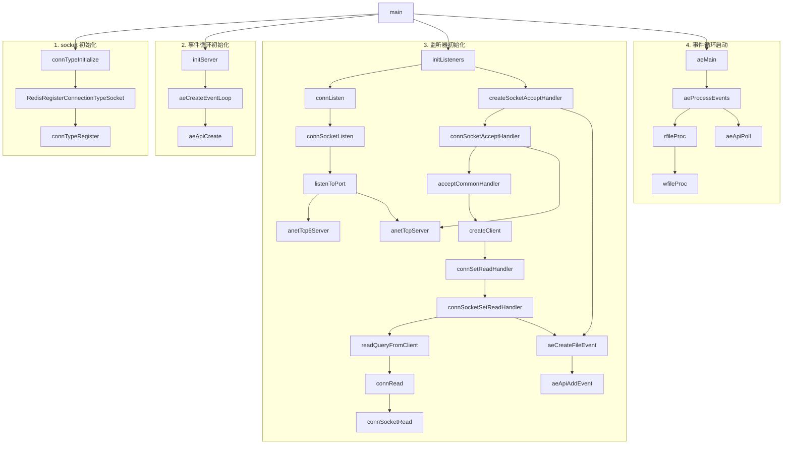

简单来讲，Redis 是一个内存优先的 KV NoSQL。它有这么几个优点：

1. **速度快**：Redis 是基于内存的，所以速度非常快。
2. **支持多种数据结构**：Redis 支持多种数据结构，包括字符串、列表、集合、有序集合、哈希表等。
3. **原子化操作**：Redis 支持原子化操作，可以保证多个操作的原子性。

我们会从最基础的内容开始，尽量只看 Redis 最核心的部分，而剥离掉一些不太重要的内容。

> 本文基于 Redis 8.0。其余版本可能有所不同。

## 安装与启动

安装 Redis 很简单，直接用包管理器安装即可[^1]。例如，在 Debian 上：

```bash
sudo apt install redis-server
```

安装完成后，可以使用 `redis-cli` 进行连接：

```shell
redis-cli
```

并且可以看一下是否正常：

```shell
$ ping
PONG
```

如果出问题了，可以看一下 Redis 是否启动了：

```shell
sudo service redis-server status
sudo service redis-server start
```

## 数据类型

数据在 Redis 内的存储方式多种多样，分为[以下几种](https://github.com/redis/redis/blob/8.0/src/object.c#L940)：

```c
char *strEncoding(int encoding) {
    switch(encoding) {
    case OBJ_ENCODING_RAW: return "raw";
    case OBJ_ENCODING_INT: return "int";
    case OBJ_ENCODING_HT: return "hashtable";
    case OBJ_ENCODING_QUICKLIST: return "quicklist";
    case OBJ_ENCODING_LISTPACK: return "listpack";
    case OBJ_ENCODING_LISTPACK_EX: return "listpackex";
    case OBJ_ENCODING_INTSET: return "intset";
    case OBJ_ENCODING_SKIPLIST: return "skiplist";
    case OBJ_ENCODING_EMBSTR: return "embstr";
    case OBJ_ENCODING_STREAM: return "stream";
    default: return "unknown";
    }
}
```

但是，Redis 对外暴露了 6 种数据结构[^2]：

| 数据结构 | 存储内容 | 结构读写能力 | 内部实现 |
| --- | --- | :-- | --- |
| `STRING` | 字符串、整数、浮点数 | 对整个字符串或其部分进行操作<br>自增/减整数和浮点数 | `int`<br>`embstr`<br>`sds` |
| `LIST` | 链表 | 从两端压入/弹出键值对<br>根据偏移量修剪<br>读取一个或多个键值对<br>按值查找或删除键值对 | `quicklist` |
| `SET` | 集合 | 增加/删除/查询键值对<br>检查元素是否存在<br>计算交集/并集/差集<br>随机获取元素 | `intset`<br>`listpack`<br>`hashtable` |
| `HASH` | 哈希表 | 增加/删除/查询键值对<br>获取所有键值对 | `listpack` |
| `ZSET` | 有序的字符串-浮点数对集合 | 增加/删除/查询键值对<br>获取所有键值对<br>按分数范围查找键值对 | `ziplist`<br>`skiplist` |
| `STREAM` | 消息流 | 增加/删除/查询消息<br>消费者组 | `stream` |

### `STRING`

最基本的命令就是 `SET` 和 `GET`，其用法为 `SET key value` 和 `GET key`：

```shell
$ SET name ch3nyang
OK

$ GET name
"ch3nyang"
```

当 `value` 为字符串时，最大长度为 512MB。

可以使用 `DEL` 删除键值对：

```shell
$ DEL name
(integer) 1

$ GET name
(nil)
```

这里，返回的 `(integer) 1` 表示操作的键中的元素个数。

在 Redis 中，`STRING` 也可以存储整数和浮点数。对于整数，可以使用 `INCR` 和 `DECR` 自增和自减：

```shell
$ SET count 1
OK

$ INCR count
(integer) 2

$ DECR count
(integer) 1
```

对于浮点数，可以使用 `INCRBYFLOAT` 自增浮点数：

```shell
$ SET price 10.5
OK

$ INCRBYFLOAT price 1.5
"12"
```

在 Redis 内部，根据值的不同，`STRING` 有四种编码方式：

- `int`：用于存储 long 范围内的整数
  ```shell
  $ SET count 1
  OK

  $ OBJECT ENCODING count
  "int"
  ```

- `embstr`：用于存储长度小于 44 的字符串
  ```shell
  $ SET name ch3nyang
  OK

  $ OBJECT ENCODING name
  "embstr"
  ```

- `sds`：用于存储长度大于 44 的字符串
  ```shell
  $ SET name ch3nyangch3nyangch3nyangch3nyangch3nyangch3nyangch3nyang
  OK

  $ OBJECT ENCODING name
  "raw"
  ```

有一点值得一提的是，编码方式是会跟着值的变化而变化的。比如，当一个整数超过了 long 范围，Redis 会将其转换为字符串。

编码方式的[判断代码](https://github.com/redis/redis/blob/8.0/src/object.c#L128)：

```c
robj *createStringObjectFromLongLongWithOptions(long long value, int flag) {
    robj *o;

    if (value >= 0 && value < OBJ_SHARED_INTEGERS && flag == LL2STROBJ_AUTO) {
        // 如果在 0-10000 之间，使用共享整数
        o = shared.integers[value];
    } else {
        if ((value >= LONG_MIN && value <= LONG_MAX) && flag != LL2STROBJ_NO_INT_ENC) {
            // 如果在 long 范围内，使用 int 编码
            o = createObject(OBJ_STRING, NULL);
            o->encoding = OBJ_ENCODING_INT;
            o->ptr = (void*)((long)value);
        } else {
            // 否则使用字符串编码
            char buf[LONG_STR_SIZE];
            int len = ll2string(buf, sizeof(buf), value);
            o = createStringObject(buf, len);
        }
    }
    return o;
}
```

以及[这段代码](https://github.com/redis/redis/blob/8.0/src/object.c#L102)：

```c
robj *createStringObject(const char *ptr, size_t len) {
    if (len <= OBJ_ENCODING_EMBSTR_SIZE_LIMIT)
        // 如果长度小于 44，使用 embstr 编码
        return createEmbeddedStringObject(ptr,len);
    else
        // 否则使用 sds 编码
        return createRawStringObject(ptr,len);
}
```

### `HASH`

对于哈希表，使用 `HSET` 和 `HGET`，其用法为 `HSET key field value [field value ...]` 和 `HGET key field`。如果要获取所有键值对，可以使用 `HGETALL`。注意，这里不能使用 `GET`：

```shell
$ HSET user name ch3nyang passwd 123456 socialcredit 10086
(integer) 3

$ HGETALL user
1) "name"
2) "ch3nyang"
3) "passwd"
4) "123456"
5) "socialcredit"
6) "10086"

$ HGET user name
"ch3nyang"
```

哈希表同样可以使用 `DEL` 整体删除。但如果只要删除一个键值对，可以使用 `HDEL`：

```shell
$ HDEL user passwd
(integer) 1

$ HGETALL user
1) "name"
2) "ch3nyang"
3) "socialcredit"
4) "10086"

$ DEL user
(integer) 1

$ HGETALL user
(empty array)
```

对于哈希表，Redis 在 7.0 之前采用 `ziplist` 和 `hashtable` 两种方式存储。而目前则全部使用 `listpack`：

```shell
$ HSET user name ch3nyang passwd 123456 socialcredit 10086
(integer) 3

$ OBJECT ENCODING user
"listpack"
```

[判断代码](https://github.com/redis/redis/blob/unstable/src/t_hash.c#L1574)：

```c
static robj *hashTypeLookupWriteOrCreate(client *c, robj *key) {
    robj *o = lookupKeyWrite(c->db,key);
    if (checkType(c,o,OBJ_HASH)) return NULL;

    if (o == NULL) {
        o = createHashObject();
        dbAdd(c->db,key,o);
    }
    return o;
}
```

### `LIST`

对于列表，使用 `LPUSH` 和 `RPUSH` 分别从左和右压入元素，使用 `LPOP` 和 `RPOP` 分别从左和右弹出元素。使用 `LRANGE` 获取范围内的元素：

```shell
$ RPUSH user ch3nyang A B C
(integer) 4

$ LPUSH user D E
(integer) 6

$ LRANGE user 0 -1
1) "E"
2) "D"
3) "ch3nyang"
4) "A"
5) "B"
6) "C"

$ LRANGE user 0 2
1) "E"
2) "D"
3) "ch3nyang"

$ LINDEX user 2
"ch3nyang"

$ LINDEX user 8
(nil)

$ LPOP user
"E"

$ LRANGE user 0 -1
1) "D"
2) "ch3nyang"
3) "A"
4) "B"
5) "C"
```

这里有几个要注意的地方。一是，不管是 `LPUSH` 还是 `RPUSH`，都是从左到右挨个压入的。二是，`LRANGE` 的索引是从 0 开始的，且包含两个端点。三是，如果索引超出范围，会返回 `nil`。

目前的 `LIST` 在 Redis 内部全部使用 `quicklist` 来存储。`quicklist` 是一个双向链表，每个节点包含一个 `ziplist`，`ziplist` 是一个紧凑的列表，用于存储键值对

```shell
$ RPUSH user ch3nyang A B C
(integer) 3

$ OBJECT ENCODING user
"quicklist"
```

而在 Redis 3.2 之前，`LIST` 则采用了 `ziplist` 和 `linkedlist` 两种方式。

### `SET`

对于集合，使用 `SADD` 添加元素，使用 `SREM` 删除元素，使用 `SMEMBERS` 获取所有元素，使用 `SISMEMBER` 检查元素是否存在：

```shell
$ SADD user ch3nyang A B C D D E
(integer) 6

$ SMEMBERS user
1) "A"
2) "ch3nyang"
3) "B"
4) "D"
5) "E"
6) "C"

$ SISMEMBER user A
(integer) 1

$ SREM user A B C
(integer) 3

$ SISMEMBER user A
(integer) 0

$ SMEMBERS user
1) "ch3nyang"
2) "D"
3) "E"
```

`SET` 作为集合，不允许重复元素。如果添加了重复元素，只会添加一次。同时，我们注意到，它*有时*是无序的。

在 Redis 内部，`SET` 有三种编码方式：

- `intset`：元素都是整数且元素个数小于 512
  ```shell
  $ SADD user 1 2 3 4 5
  (integer) 5

  $ OBJECT ENCODING user
  "intset"
  ```

- `listpack`：元素个数小于 512
  ```shell
  $ SADD user ch3nyang A B C D E
  (integer) 5

  $ OBJECT ENCODING user
  "listpack"
  ```

- `hashtable`：其他情况
  ```shell
  $ SADD user ch3nyang A B C D E ...
  (integer) 1000

  $ OBJECT ENCODING user
  "hashtable"
  ```

它的[判断代码](https://github.com/redis/redis/blob/unstable/src/t_set.c#L30)：

```c
robj *setTypeCreate(sds value, size_t size_hint) {
    if (isSdsRepresentableAsLongLong(value,NULL) == C_OK && size_hint <= server.set_max_intset_entries)
        // 如果元素都是整数且元素个数小于 512，使用 intset 编码
        return createIntsetObject();
    if (size_hint <= server.set_max_listpack_entries)
        // 如果元素个数小于 512，使用 listpack 编码
        return createSetListpackObject();

    // 否则使用 hashtable 编码
    robj *o = createSetObject();
    dictExpand(o->ptr, size_hint);
    return o;
}
```

### `ZSET`

对于有序集合，使用 `ZADD` 添加元素，使用 `ZREM` 删除元素，使用 `ZRANGE` 获取范围内的元素，使用 `ZSCORE` 获取元素的分数，使用 `ZRANGEBYSCORE` 获取分数范围内的元素：

```shell
$ ZADD user 10086 ch3nyang 20 A 30 B 10 C
(integer) 4

$ ZRANGE user 0 -1
1) "C"
2) "A"
3) "B"
4) "ch3nyang"

$ ZRANGE user 0 -1 WITHSCORES
1) "C"
2) "10"
3) "A"
4) "20"
5) "B"
6) "30"
7) "ch3nyang"
8) "10086"

$ ZRANGEBYSCORE user 0 30
1) "C"
2) "A"
3) "B"

$ ZSCORE user ch3nyang
"10086"

$ ZREM user ch3nyang
(integer) 1

$ ZSCORE user ch3nyang
(nil)
```

有序集合是按照分数从小到大排序的。如果需要逆序输出，可以使用 `ZREVRANGE`。

在 Redis 内部，`ZSET` 有两种编码方式：

- `ziplist`：元素个数小于 128 且元素长度小于 64 字节
  ```shell
  $ ZADD user 1 A 2 B 3 C 4 D
  (integer) 4

  $ OBJECT ENCODING user
  "ziplist"
  ```

- `skiplist`：其他情况
  ```shell
  $ ZADD user 1 ch3nyangch3nyangch3nyangch3nyangch3nyangch3nyangch3nyangch3nyangch3nyang 2 A 3 B 4 C
  (integer) 10

  $ OBJECT ENCODING user
  "skiplist"
  ```

### `STREAM`

名为消息流，实际上是一个有序的消息队列。这个数据结构从 Redis 5.0 开始支持。我不觉得真有多少人会用 Redis 来做消息队列，所以这里就不展开了。

## 数据结构

以上我们介绍了 Redis 的几种数据类型，它们的实现包括了 `int`、`embstr`、`sds`、`ziplist`、`hashtable`、`quicklist`、`intset` 和 `skiplist`。我们接下来将会逐个介绍这些数据结构。

### `int`

我们[在前文中看到](https://github.com/redis/redis/blob/8.0/src/object.c#L128)：

```c
robj *createStringObjectFromLongLongWithOptions(long long value, int flag) {
    robj *o;

    /* ... */

    o = createObject(OBJ_STRING, NULL);
    o->encoding = OBJ_ENCODING_INT;
    o->ptr = (void*)((long)value);

    /* ... */

    return o;
}
```

这里的 `robj` 是一个[结构体](https://github.com/redis/redis/blob/8.0/src/server.h#L967)。这个结构体包含了编码方式和一个指针，对于整数，指针的值（不是指向的值）就是整数的值：

```c
struct redisObject {
    // 类型
    unsigned type:4;
    // 编码
    unsigned encoding:4;
    unsigned lru:LRU_BITS;
    int refcount;
    // 指向实际数据的指针
    void *ptr;
};
```

### `embstr`

`embstr` 也是[创建了一个 `robj` 结构体](https://github.com/redis/redis/blob/8.0/src/object.c#L71)，只不过它的 `ptr` 指向的是一个 `sdshdr8` 结构体，这个结构体我们会在后文介绍：

```c
robj *createEmbeddedStringObject(const char *ptr, size_t len) {
    // 为 embstr 分配空间
    robj *o = zmalloc(sizeof(robj)+sizeof(struct sdshdr8)+len+1);
    struct sdshdr8 *sh = (void*)(o+1);

    // 设置类型、编码、指针、引用计数和 LRU
    o->type = OBJ_STRING;
    o->encoding = OBJ_ENCODING_EMBSTR;
    o->ptr = sh+1;
    o->refcount = 1;
    o->lru = 0;

    sh->len = len;
    sh->alloc = len;
    sh->flags = SDS_TYPE_8;
    // 拷贝字符串内容并添加 '\0'
    if (ptr == SDS_NOINIT)
        sh->buf[len] = '\0';
    else if (ptr) {
        memcpy(sh->buf,ptr,len);
        sh->buf[len] = '\0';
    } else {
        memset(sh->buf,0,len+1);
    }
    return o;
}
```

这么看来，`embstr` 和 `sds` 区别不大。

### `sds`

[`sds` 结构体](https://github.com/redis/redis/blob/8.0/src/object.c#L64)可以动态调整字符串的大小以节省空间：

```c
robj *createRawStringObject(const char *ptr, size_t len) {
    return createObject(OBJ_STRING, sdsnewlen(ptr,len));
}
```

按照大小不同，[共定义了 4 种](https://github.com/redis/redis/blob/8.0/src/sds.h#L24)（`sdshdr5` 不会被使用到）：

```c
struct __attribute__ ((__packed__)) sdshdr8 {
    uint8_t len;
    uint8_t alloc;
    unsigned char flags;
    char buf[];
};
struct __attribute__ ((__packed__)) sdshdr16 {
    uint16_t len;
    uint16_t alloc;
    unsigned char flags;
    char buf[];
};
struct __attribute__ ((__packed__)) sdshdr32 {
    uint32_t len;
    uint32_t alloc;
    unsigned char flags;
    char buf[];
};
struct __attribute__ ((__packed__)) sdshdr64 {
    uint64_t len;
    uint64_t alloc;
    unsigned char flags;
    char buf[];
};
```

这 4 种结构体分别用于存储长度为 1 字节、2 字节、4 字节和 8 字节的字符串。这里的 `len` 表示字符串的长度，`alloc` 表示分配的空间大小（不包含 `\0`），`flags` 表示类型，`buf` 表示字符串的内容。

在[初始化字符串](https://github.com/redis/redis/blob/8.0/src/sds.c#L81)时，Redis 会首先调用 [`sdsReqType` 函数](https://github.com/redis/redis/blob/8.0/src/sds.c#L38)，根据字符串长度决定字符串类型：

```c
static inline char sdsReqType(size_t string_size) {
    if (string_size < 1<<5)
        return SDS_TYPE_5;
    if (string_size < 1<<8)
        return SDS_TYPE_8;
    if (string_size < 1<<16)
        return SDS_TYPE_16;
#if (LONG_MAX == LLONG_MAX)
    if (string_size < 1ll<<32)
        return SDS_TYPE_32;
    return SDS_TYPE_64;
#else
    return SDS_TYPE_32;
#endif
}
```

然后分配空间并初始化字符串。

由于是 `sds`，Redis 会根据字符串长度调整空间大小。这个过程在 [`_sdsMakeRoomFor` 函数](https://github.com/redis/redis/blob/8.0/src/sds.c#L222)中实现：

```c
sds _sdsMakeRoomFor(sds s, size_t addlen, int greedy) {
    void *sh, *newsh;
    size_t avail = sdsavail(s);
    size_t len, newlen, reqlen;
    char type, oldtype = s[-1] & SDS_TYPE_MASK;
    int hdrlen;
    size_t usable;

    // 如果剩余空间足够，直接返回
    if (avail >= addlen) return s;

    // 获取字符串长度
    len = sdslen(s);
    // 获取字符串头指针
    sh = (char*)s-sdsHdrSize(oldtype);
    // 计算新字符串长度
    reqlen = newlen = (len+addlen);
    assert(newlen > len);
    // 根据 greedy 参数调整空间大小
    if (greedy == 1) {
        if (newlen < SDS_MAX_PREALLOC)
            newlen *= 2;
        else
            newlen += SDS_MAX_PREALLOC;
    }

    // 计算新字符串类型
    type = sdsReqType(newlen);

    if (type == SDS_TYPE_5) type = SDS_TYPE_8;

    // 计算头部长度
    hdrlen = sdsHdrSize(type);
    assert(hdrlen + newlen + 1 > reqlen);
    // 如果类型相同，直接调整空间大小
    if (oldtype==type) {
        // 重新分配空间大小为：头部长度+新字符串长度+1
        newsh = s_realloc_usable(sh, hdrlen+newlen+1, &usable);
        if (newsh == NULL) return NULL;
        s = (char*)newsh+hdrlen;
    } else {
        // 类型不同的情况下，头部长度会发生变化，需要重新分配空间
        newsh = s_malloc_usable(hdrlen+newlen+1, &usable);
        if (newsh == NULL) return NULL;
        // 将原字符串内容拷贝到新空间中
        memcpy((char*)newsh+hdrlen, s, len+1);
        s_free(sh);
        // 更新头部指针、类型和长度
        s = (char*)newsh+hdrlen;
        s[-1] = type;
        sdssetlen(s, len);
    }
    // 计算剩余空间
    usable = usable-hdrlen-1;
    if (usable > sdsTypeMaxSize(type))
        usable = sdsTypeMaxSize(type);
    sdssetalloc(s, usable);
    return s;
}
```

空间分配的策略取决于 `greddy` 参数。如果 `greddy` 为 0，Redis 会根据字符串长度调整空间大小为刚刚号；如果 `greddy` 为 1，Redis 会让空间大小增加一倍，除非增加的大小大于 1024*1024。

Redis 还设置了 [cron job](https://github.com/redis/redis/blob/8.0/src/server.c#L765) 来释放未使用的空间。当字符串浪费掉的空间大于 1024*4 时，就会调用 [`sdsResize` 函数](https://github.com/redis/redis/blob/8.0/src/sds.c#L305)来缩减大小。此过程和上面扩容类似，也是计算字符串长度，然后重新分配空间。

Redis 还实现了很多常见的字符串操作，如拼接、复制、比较等。这些操作都是基于 `sds` 实现的。众所周知，每个 C 语言项目都会实现一个自己的字符串库，经常写 C 的大伙肯定不但看腻了，也写腻了。Redis 的实现也没什么很特别的，这里就不再赘述了。

### `quicklist`

`quicklist` 是 Redis 用来实现 `LIST` 的数据结构。它是一个双向链表，每个节点包含一个 `ziplist`，`ziplist` 是一个紧凑的列表，用于存储键值对。

双向链表的[定义](https://github.com/redis/redis/blob/8.0/src/adlist.h#L15)为：

```c
typedef struct listNode {
    struct listNode *prev;
    struct listNode *next;
    void *value;
} listNode;

typedef struct list {
    listNode *head;
    listNode *tail;
    void *(*dup)(void *ptr);
    void (*free)(void *ptr);
    int (*match)(void *ptr, void *key);
    unsigned long len;
} list;
```

链表结构体包含了头指针、尾指针、复制函数、释放函数、匹配函数和长度。链表节点结构体包含了前指针、后指针和值。

总体看下来就是最常规的链表实现，没有什么特别的地方。

### `hashtable`

Redis 使用存储了 `hashtable` 的字典结构实现了 `HASH`、`SET` 和本身的键值对数据库。`SET` 和 `HASH` 本质上是一样的，只是 `SET` 的值为空。

字典类型被定义在 [`dict.h`](https://github.com/redis/redis/blob/8.0/src/dict.h#L100) 中：

```c
struct dict {
    // 字典的一些基本属性
    dictType *type;

    // 两个哈希表，一个用于存储数据，一个用于扩容
    dictEntry **ht_table[2];
    // 两个哈希表的大小
    unsigned long ht_used[2];

    // 扩容用的索引
    long rehashidx;

    // 一些标志位
    unsigned pauserehash : 15;
    unsigned useStoredKeyApi : 1;
    signed char ht_size_exp[2];
    int16_t pauseAutoResize;
    void *metadata[];
};
```

其中的 `dictEntry` 结构体定义在 [`dict.c`](https://github.com/redis/redis/blob/8.0/src/dict.c#L45) 中：

```c
struct dictEntry {
    // 键
    void *key;
    // 值
    union {
        void *val;
        uint64_t u64;
        int64_t s64;
        double d;
    } v;
    // 下一个条目的指针
    struct dictEntry *next;
};
```

Redis 使用的是链地址法来解决冲突。从上面的代码可以看出，每个元素都会有一个指针，指向下一个元素。这样，当出现哈希冲突时，即将冲突的元素放在同一个桶中，通过链表连接。

Redis 的 `hashtable` [初始大小](https://github.com/redis/redis/blob/8.0/deps/hiredis/dict.h#L76)为 4：

```c
#define DICT_HT_INITIAL_SIZE 4
```

在运行过程中，Redis 为了避免挤爆 `hashtable`，会判断[是否需要扩容](https://github.com/redis/redis/blob/8.0/src/dict.c#L1533)：

```c
int dictExpandIfNeeded(dict *d) {
    // 如果正在扩容，则别重复扩容了
    if (dictIsRehashing(d)) return DICT_OK;

    // 如果哈希表为空，则扩容到初始大小（4）
    if (DICTHT_SIZE(d->ht_size_exp[0]) == 0) {
        dictExpand(d, DICT_HT_INITIAL_SIZE);
        return DICT_OK;
    }
    
    // 如果满足扩容条件，则扩容
    if ((dict_can_resize == DICT_RESIZE_ENABLE &&
         d->ht_used[0] >= DICTHT_SIZE(d->ht_size_exp[0])) ||
        (dict_can_resize != DICT_RESIZE_FORBID &&
         d->ht_used[0] >= dict_force_resize_ratio * DICTHT_SIZE(d->ht_size_exp[0])))
    {
        // 由于有时候扩容需要分配大量内存，所以需要检查是否允许扩容
        if (dictTypeResizeAllowed(d, d->ht_used[0] + 1))
            // 扩容
            dictExpand(d, d->ht_used[0] + 1);
        return DICT_OK;
    }
    return DICT_ERR;
}
```

在上面的代码中，`hashtable` 扩容的条件有三种：

1. 如果 `hashtable` 为空，扩容到初始大小。
2. 如果 `hashtable` 的负载因子超过了 1:1（即平均每个桶中有超过一个元素），且允许扩容，则进行扩容。
3. 如果 `hashtable` 的负载因子超过了 `dict_force_resize_ratio`（默认为 4），不管是否允许扩容，都进行扩容。

扩容后大小的[计算方式](https://github.com/redis/redis/blob/8.0/src/dict.c#L1616)为：

```c
static signed char _dictNextExp(unsigned long size)
{
    if (size <= DICT_HT_INITIAL_SIZE) return DICT_HT_INITIAL_EXP;
    if (size >= LONG_MAX) return (8*sizeof(long)-1);

    // __builtin_clzl 返回二进制中从最高位开始连续的 0 的个数
    // 8*sizeof(long) 返回 long 类型的二进制位数
    // 因此这个表达式返回的是 size-1 的有效位数
    return 8*sizeof(long) - __builtin_clzl(size-1);
}
```

可以看到，如果大小不超过 `long` 类型的最大值，那么 `hashtable` 的大小会以 2 的幂次方增长。

如果满足了扩容条件，Redis 会最终调用到 `dictRehash` 函数来扩容 `hashtable`。这个函数的[实现](https://github.com/redis/redis/blob/8.0/src/dict.c#L392)如下：

```c
int dictRehash(dict *d, int n) {
    /* n 为每次迁移的桶数 */
    // 空桶访问次数限制
    int empty_visits = n*10;
    // 两张哈希表的大小
    unsigned long s0 = DICTHT_SIZE(d->ht_size_exp[0]);
    unsigned long s1 = DICTHT_SIZE(d->ht_size_exp[1]);

    /* ... */

    // 执行迁移，直至迁移 n 个桶或者没东西可迁移了
    while(n-- && d->ht_used[0] != 0) {
        assert(DICTHT_SIZE(d->ht_size_exp[0]) > (unsigned long)d->rehashidx);

        // 跳过空桶
        while(d->ht_table[0][d->rehashidx] == NULL) {
            d->rehashidx++;
            if (--empty_visits == 0) return 1;
        }
        
        // 迁移桶中的数据
        rehashEntriesInBucketAtIndex(d, d->rehashidx);
        // 迁移完成后，将 rehashidx 加一，指向下一个桶
        d->rehashidx++;
    }

    // 检查是否迁移完成
    return !dictCheckRehashingCompleted(d);
}
```

由于一次性移动所有数据可能会消耗大量计算资源，Redis 采用了渐进式扩容[^5]。具体来说，它使用 `rehashidx` 来记录当前迁移的位置，每当对字典进行一次增加/删除/修改/查询等操作后，就同时做一次迁移。完成一个桶的迁移后，`rehashidx` 会自增。

当全部数据迁移完成后，Redis 会[将扩容后的 `hashtable` 转正](https://github.com/redis/redis/blob/8.0/src/dict.c#L369)：

```c
static int dictCheckRehashingCompleted(dict *d) {
    // 如果字典里还有元素，说明迁移还没完成
    if (d->ht_used[0] != 0) return 0;
    
    // 释放旧哈希表
    if (d->type->rehashingCompleted) d->type->rehashingCompleted(d);
    zfree(d->ht_table[0]);
    
    // 将扩容后的哈希表转正
    d->ht_table[0] = d->ht_table[1];
    d->ht_used[0] = d->ht_used[1];
    d->ht_size_exp[0] = d->ht_size_exp[1];
    // 重置新的用来扩容的哈希表
    _dictReset(d, 1);
    // 重置 rehashidx，-1 表示没有在迁移
    d->rehashidx = -1;
    return 1;
}
```

最后再提一嘴无关紧要的，Redis 的哈希函数使用的是 [`siphash`](https://github.com/redis/redis/blob/8.0/src/siphash.c)，这是一种安全的哈希函数。

### `intset`

如果 `SET` 中的元素都是整数，Redis 会使用**有序且不重复**的 [`intset`](https://github.com/redis/redis/blob/8.0/src/intset.h#L35) 来存储：

```c
typedef struct intset {
    // 编码类型
    uint32_t encoding;
    // 长度，即 contents 中元素的个数
    uint32_t length;
    // 内容，这里的 int8_t 不会产生任何实际效果
    int8_t contents[];
} intset;
```

Redis 会根据元素值的大小选择合适的编码。`intset` 的[编码](https://github.com/redis/redis/blob/8.0/src/intset.c#L41)有三种：`INTSET_ENC_INT16`、`INTSET_ENC_INT32` 和 `INTSET_ENC_INT64`，分别对应 16 位、32 位和 64 位整数：

```c
#define INTSET_ENC_INT16 (sizeof(int16_t))
#define INTSET_ENC_INT32 (sizeof(int32_t))
#define INTSET_ENC_INT64 (sizeof(int64_t))
```

当需要添加新元素时，Redis 先在 `intset` 中搜索该元素。如果找到了，就不再添加；如果没有找到，就将元素添加到 `intset` 中。添加的过程是通过将大于要添加的值的元素后移一个位置，然后将新元素插入到空出的位置。这个过程在 [`intsetAdd` 函数](https://github.com/redis/redis/blob/8.0/src/intset.c#L206)中实现：

```c
intset *intsetAdd(intset *is, int64_t value, uint8_t *success) {
    // 获取要添加的值的编码类型
    uint8_t valenc = _intsetValueEncoding(value);

    uint32_t pos;
    if (success) *success = 1;

    // 如果要添加的值的编码类型大于当前集合的编码类型
    if (valenc > intrev32ifbe(is->encoding)) {
        // 升级集合的编码类型并添加值
        return intsetUpgradeAndAdd(is,value);
    } else {
        // 在集合中搜索该值，如果找到则原样返回并通知不成功
        if (intsetSearch(is,value,&pos)) {
            if (success) *success = 0;
            return is;
        }

        // 调整集合长度为：原长度+1
        is = intsetResize(is,intrev32ifbe(is->length)+1);
        // 如果新值不是最大的那个，则移动尾部元素给它腾位置
        if (pos < intrev32ifbe(is->length)) intsetMoveTail(is,pos,pos+1);
    }

    // 在腾出的位置放入新值
    _intsetSet(is,pos,value);
    // 更新集合长度为：原长度+1
    is->length = intrev32ifbe(intrev32ifbe(is->length)+1);
    return is;
}
```

在上面的函数中，我们发现，如果元素的大小超过了当前编码的范围，Redis 会将 `intset` 的编码升级为更大的编码。`intset` 的编码升级是通过 [`intsetUpgradeAndAdd` 函数](https://github.com/redis/redis/blob/8.0/src/intset.c#L159)实现的。

```c
static intset *intsetUpgradeAndAdd(intset *is, int64_t value) {
    // 获取当前集合的编码类型
    uint8_t curenc = intrev32ifbe(is->encoding);
    // 获取要添加的值的编码类型
    uint8_t newenc = _intsetValueEncoding(value);
    // 获取当前集合的长度
    int length = intrev32ifbe(is->length);
    // 获取要添加的值的位置（如果元素<0，则在头部添加；否则在尾部添加）
    int prepend = value < 0 ? 1 : 0;

    // 设置新的编码类型
    is->encoding = intrev32ifbe(newenc);
    // 重新调整集合大小为：(原长度+1)*新编码类型的大小
    is = intsetResize(is,intrev32ifbe(is->length)+1);

    // 将现有元素重新编码并复制到新集合
    while(length--)
        // 三个参数分别为集合、位置和值
        _intsetSet(is,length+prepend,_intsetGetEncoded(is,length,curenc));

    // 设置新值
    if (prepend)
        _intsetSet(is,0,value);
    else
        _intsetSet(is,intrev32ifbe(is->length),value);
    // 更新集合长度
    is->length = intrev32ifbe(intrev32ifbe(is->length)+1);
    return is;
}
```

这个函数首先计算了新旧编码，然后调整 `intset` 的大小，最后将元素从旧编码转换为新编码。

由以上内容可以发现，`intset` 维护有序的方法实际上就是最简单的插入排序。插入的时间复杂度是 $$O(n)$$，而查找的时间复杂度是 $$O(\log{n})$$。为了节省空间，数组大小始终处于刚刚能放下所有元素的状态。然而，`intset` 只会升级编码，不会降级编码，如果删除了元素，`intset` 的编码只会保持不变。

### `skiplist`

我们先讲 `skiplist`。`skiplist` 是一种有序数据结构，它通过多级索引来加速查找。


具体来讲，`skiplist` 由多个层级组成，每个层级都是一个有序链表。每个节点都包含了一个指向下一个节点的指针，以及一个指向下一层的指针。这样，我们可以通过上层的指针快速定位到下层的节点。

`skiplist` 的最底层是一个普通的有序链表。每个较高层都充当下面列表的快速通道。插入时，层 $$i$$ 中的元素以某个固定概率 $$p$$ 出现在层 $$i+1$$ 中（ $$p$$ 的两个常用值是 $$\frac{1}{2}$$ 或 $$\frac{1}{4}$$）。平均而言，每个元素出现在 $$\frac{1}{1-p}$$ 个列表中，并且最高元素（通常是跳跃列表前面的特殊头元素）出现在所有列表中。跳跃列表包含 $$\log_{1/p}{n}$$ 个列表。

`skiplist` 的搜索从最高层列表的第一个元素开始，横向前进，直到当前元素大于或等于目标值：

- 如果当前元素等于目标值，则已找到
- 如果当前元素大于目标值，或者搜索到达链接列表的末尾，则返回前一个元素并垂直下降到下一层列表后重复该过程

每个链接列表中的预期步数最多为 $$\frac{1}{p}$$，因此，搜索的总预期成本为 $$\frac{1}{p}\log_{1/p}{n}$$，即 $$O\left(\log{n}\right)$$，其中 $$p$$ 为常数。通过选择不同的 $$p$$ 值，可以实现搜索成本与存储成本的平衡。

Redis 使用 `skiplist` 来实现 `ZSET`。其被定义在 [`server.h`](https://github.com/redis/redis/blob/8.0/src/server.h#L1442) 中：

```c
typedef struct zskiplistNode {
    // 成员对象
    sds ele;
    // 分值
    double score;
    // 后退指针
    struct zskiplistNode *backward;
    // 层级数组
    struct zskiplistLevel {
        // 前进指针
        struct zskiplistNode *forward;
        // 跨度
        unsigned long span;
    } level[];
} zskiplistNode;

typedef struct zskiplist {
    // 头尾指针
    struct zskiplistNode *header, *tail;
    // 节点数量
    unsigned long length;
    // 最大层数
    int level;
} zskiplist;

typedef struct zset {
    // 字典用于存储元素和分数的映射
    dict *dict;
    // 跳跃表用于排序
    zskiplist *zsl;
} zset;
```

后退指针用于快速定位到前一个节点，这在我们之前讲到的遍历的过程中很有用。在层级数组中，每个元素包含了前进指针以从后向前逐个访问节点，以及这两个节点之间的跨度。跨度被用于计算某个节点的排名，这样只需要像正常遍历一样即可得到。

### `ziplist`

`ziplist` 是 Redis 用来存储 `LIST` 和 `HASH` 的数据结构。它是一种紧凑的数据结构，可以存储字符串、整数和字典。与之前提到的字典不同，压缩列表是一种线性结构，不支持快速查找。

## 事件循环

尽管 Redis 十分高效，但它是**单线程**的。这是因为多个线程争夺 CPU 缓存数据会导致无法命中缓存，从而降低性能。同时，对于 Redis 的使用场景来讲，网络带宽和内存带宽才是真正的瓶颈，而 CPU 相比之下性能完全足够。

Redis 在运行时，会与各个客户端建立 TCP 链接。然而，如果 Redis 使用 `read` 系统调用来读取客户端的请求，就会阻塞在这里。

解决这个问题有两种方法。一是使用轮询。我们预先将 socket 设置上 `O_NONBLOCK` 标志，然后不断查询所有 socket，来检查是否有数据可读。但这种方法效率低下，会无端地消耗大量 CPU 时间。

因此，Redis 使用了**I/O 多路复用**[^3][^4]，即使用 `epoll` 等调用，来监听多个 socket 的事件。当有事件发生时，`epoll` 调用会返回，Redis 就可以立即处理这个事件。通过这种方式，Redis 实现了异步非阻塞的网络 IO，而不会受制于单线程的阻塞问题。

为了后续的讨论，我们这里不得不来插叙一下 `epoll` 的相关内容。`epoll` 是 Linux 下的一种 I/O 多路复用机制。它的使用方法如下：

1. 使用 [`epoll_create`](https://man7.org/linux/man-pages/man2/epoll_create.2.html) 创建一个 `epoll` 实例。
  ```c
  int epoll_create(int size);
  ```
  > `epoll_create` 的返回值是一个文件描述符，用于后续的操作。
  >
  > [`epoll_create1`](https://www.ibm.com/docs/en/zos/3.1.0?topic=lf-epoll-create-epoll-create1-open-epoll-file-descriptor) 是 `epoll_create` 的一个变种，可以传入一个 `flags` 参数。假如 `flags` 为 `EPOLL_CLOEXEC`，则在 `exec` 时关闭文件描述符。

2. 使用 [`epoll_ctl`](https://man7.org/linux/man-pages/man2/epoll_ctl.2.html) 添加/删除/修改监听的文件描述符。
  ```c
  int epoll_ctl(int epfd, int op, int fd, struct epoll_event *event);
  ```

3. 使用 [`epoll_wait`](https://man7.org/linux/man-pages/man2/epoll_wait.2.html) 等待事件发生。
  ```c
  int epoll_wait(int epfd, struct epoll_event *events, int maxevents, int timeout);
  ```

当然，`epoll` 不是我们这里的重点，我们只是简单介绍一下必要的内容。关于 `epoll` 的详细介绍，可以参考 [The method to epoll’s madness](https://copyconstruct.medium.com/the-method-to-epolls-madness-d9d2d6378642)。

和 Node.js 类似，Redis 也是事件驱动的。Redis 通过事件循环来处理客户端的请求。我们接下来看看 Redis 的事件循环是如何实现 I/O 多路复用的。

> 坐稳了，接下来我们要加速了，如果你在阅读过程中没能跟上逻辑，可以跳转到[事件循环总结](#事件循环总结)部分看看流程图。

### socket 初始化

socket 初始化在 `server.c` 的 [`main` 函数](https://github.com/redis/redis/blob/8.0/src/server.c#L7094)中，调用了 [`connTypeInitialize()`](https://github.com/redis/redis/blob/8.0/src/server.c#L7174) 来初始化连接类型。

我们跟踪这个函数，进入了 [`connection.c`](https://github.com/redis/redis/blob/8.0/src/connection.c#L60)，看到：

```c
int connTypeInitialize(void) {
    /* currently socket connection type is necessary  */
    serverAssert(RedisRegisterConnectionTypeSocket() == C_OK);

    /* currently unix socket connection type is necessary  */
    serverAssert(RedisRegisterConnectionTypeUnix() == C_OK);

    /* may fail if without BUILD_TLS=yes */
    RedisRegisterConnectionTypeTLS();

    return C_OK;
}
```

这里，我们看到 Redis 支持了三种连接类型：`socket`、`unix` 和 `TLS`。其中，`socket` 和 `unix` 是必须的，而 `TLS` 是可选的。

我们暂时只看 `socket` 类型。我们一步步跟踪 `RedisRegisterConnectionTypeSocket` 函数，最终到达了 `connection.c` 的 [`connTypeRegister` 函数](https://github.com/redis/redis/blob/8.0/src/connection.c#L32)：

```c
int connTypeRegister(ConnectionType *ct) {
    const char *typename = ct->get_type(NULL);
    ConnectionType *tmpct;
    int type;

    /* find an empty slot to store the new connection type */
    for (type = 0; type < CONN_TYPE_MAX; type++) {
        tmpct = connTypes[type];
        if (!tmpct)
            break;

        /* ignore case, we really don't care "tls"/"TLS" */
        if (!strcasecmp(typename, tmpct->get_type(NULL))) {
            serverLog(LL_WARNING, "Connection types %s already registered", typename);
            return C_ERR;
        }
    }

    serverLog(LL_VERBOSE, "Connection type %s registered", typename);
    connTypes[type] = ct;

    if (ct->init) {
        ct->init();
    }

    return C_OK;
}
```

这里，我们看到 Redis 通过 `connTypes` 数组来存储连接类型。传入的参数 `ct` 为 `ConnectionType` 结构体，对于 `socket` 类型，`ct` 的值定义在 [`socket.c`](https://github.com/redis/redis/blob/8.0/src/socket.c#L464) 中：

```c
static ConnectionType CT_Socket = {
    /* connection type */
    .get_type = connSocketGetType,

    /* connection type initialize & finalize & configure */
    .init = NULL,
    .cleanup = NULL,
    .configure = NULL,

    /* ae & accept & listen & error & address handler */
    .ae_handler = connSocketEventHandler,
    .accept_handler = connSocketAcceptHandler,
    .addr = connSocketAddr,
    .is_local = connSocketIsLocal,
    .listen = connSocketListen,

    /* create/shutdown/close connection */
    .conn_create = connCreateSocket,
    .conn_create_accepted = connCreateAcceptedSocket,
    .shutdown = connSocketShutdown,
    .close = connSocketClose,

    /* connect & accept */
    .connect = connSocketConnect,
    .blocking_connect = connSocketBlockingConnect,
    .accept = connSocketAccept,

    /* event loop */
    .unbind_event_loop = NULL,
    .rebind_event_loop = connSocketRebindEventLoop,

    /* IO */
    .write = connSocketWrite,
    .writev = connSocketWritev,
    .read = connSocketRead,
    .set_write_handler = connSocketSetWriteHandler,
    .set_read_handler = connSocketSetReadHandler,
    .get_last_error = connSocketGetLastError,
    .sync_write = connSocketSyncWrite,
    .sync_read = connSocketSyncRead,
    .sync_readline = connSocketSyncReadLine,

    /* pending data */
    .has_pending_data = NULL,
    .process_pending_data = NULL,
};
```

这里，我们看到 `ConnectionType` 结构体定义了一系列函数指针，用于处理连接的初始化、清理、配置、事件处理、IO 等。这些函数指针会在其它函数中被调用，我们暂时无需太关心这些函数的具体实现。

### 事件循环初始化

在 `server.c` 的 `main` 函数中，初始化完 socket 后，又调用了 [`initServer()` 函数](https://github.com/redis/redis/blob/8.0/src/server.c#L7366) 来初始化服务器。

这个函数被定义在了 [`server.c`](https://github.com/redis/redis/blob/8.0/src/server.c#L2664) 中。我们很机智地注意到了里面[有一行](https://github.com/redis/redis/blob/8.0/src/server.c#L2732)：

```c
void initServer(void) {
    /* ... */
    server.el = aeCreateEventLoop(server.maxclients+CONFIG_FDSET_INCR);
    /* ... */
}
```

跟踪进去发现，[`aeCreateEventLoop` 函数](https://github.com/redis/redis/blob/8.0/src/ae.c#L46)定义返回了一个 `aeEventLoop` 结构体：

```c
aeEventLoop *aeCreateEventLoop(int setsize) {
    aeEventLoop *eventLoop;
    int i;

    monotonicInit();    /* just in case the calling app didn't initialize */

    if ((eventLoop = zmalloc(sizeof(*eventLoop))) == NULL) goto err;
    eventLoop->nevents = setsize < INITIAL_EVENT ? setsize : INITIAL_EVENT;
    eventLoop->events = zmalloc(sizeof(aeFileEvent)*eventLoop->nevents);
    eventLoop->fired = zmalloc(sizeof(aeFiredEvent)*eventLoop->nevents);
    if (eventLoop->events == NULL || eventLoop->fired == NULL) goto err;
    eventLoop->setsize = setsize;
    eventLoop->timeEventHead = NULL;
    eventLoop->timeEventNextId = 0;
    eventLoop->stop = 0;
    eventLoop->maxfd = -1;
    eventLoop->beforesleep = NULL;
    eventLoop->aftersleep = NULL;
    eventLoop->flags = 0;
    memset(eventLoop->privdata, 0, sizeof(eventLoop->privdata));
    if (aeApiCreate(eventLoop) == -1) goto err;
    /* Events with mask == AE_NONE are not set. So let's initialize the
     * vector with it. */
    for (i = 0; i < eventLoop->nevents; i++)
        eventLoop->events[i].mask = AE_NONE;
    return eventLoop;

err:
    if (eventLoop) {
        zfree(eventLoop->events);
        zfree(eventLoop->fired);
        zfree(eventLoop);
    }
    return NULL;
}
```

这个函数创建了一个 `aeEventLoop` 结构体，并初始化了一些参数。这里，最关键的是调用了 `aeApiCreate` 函数，它定义在 [`ae_epoll.c`](https://github.com/redis/redis/blob/8.0/src/ae_epoll.c#L18) 中：

```c
typedef struct aeApiState {
    int epfd;
    struct epoll_event *events;
} aeApiState;

static int aeApiCreate(aeEventLoop *eventLoop) {
    aeApiState *state = zmalloc(sizeof(aeApiState));

    if (!state) return -1;
    state->events = zmalloc(sizeof(struct epoll_event)*eventLoop->setsize);
    if (!state->events) {
        zfree(state);
        return -1;
    }
    state->epfd = epoll_create(1024); /* 1024 is just a hint for the kernel */
    if (state->epfd == -1) {
        zfree(state->events);
        zfree(state);
        return -1;
    }
    anetCloexec(state->epfd);
    eventLoop->apidata = state;
    return 0;
}
```

这个函数创建了一个 `epoll` 实例，并将其存储在 `eventLoop->apidata` 中。这样，Redis 就可以使用 `epoll` 来监听事件了。其中，`epoll` 的 `epfd` 是一个文件描述符，`events` 是一个 `epoll_event` 数组，用于存储事件。我们上文已经介绍过 `epoll` 的相关内容，这里基本是对其流程进行的实现。

需要注意的是，这个函数仅仅是创建了一个 `epoll` 实例，并没有注册事件。

### 监听器初始化

我们回到 `server.c` 的 [`main` 函数](https://github.com/redis/redis/blob/8.0/src/server.c#L7379)中。初始化完事件循环后，`main` 函数又调用了 [`initListeners` 函数](https://github.com/redis/redis/blob/8.0/src/server.c#L2879)来初始化监听器:

```c
void initListeners(void) {
    /* Setup listeners from server config for TCP/TLS/Unix */
    int conn_index;
    connListener *listener;
    if (server.port != 0) {
        conn_index = connectionIndexByType(CONN_TYPE_SOCKET);
        if (conn_index < 0)
            serverPanic("Failed finding connection listener of %s", CONN_TYPE_SOCKET);
        listener = &server.listeners[conn_index];
        listener->bindaddr = server.bindaddr;
        listener->bindaddr_count = server.bindaddr_count;
        listener->port = server.port;
        listener->ct = connectionByType(CONN_TYPE_SOCKET);
    }

    /* ... */

    /* create all the configured listener, and add handler to start to accept */
    int listen_fds = 0;
    for (int j = 0; j < CONN_TYPE_MAX; j++) {
        listener = &server.listeners[j];
        if (listener->ct == NULL)
            continue;

        if (connListen(listener) == C_ERR) {
            serverLog(LL_WARNING, "Failed listening on port %u (%s), aborting.", listener->port, listener->ct->get_type(NULL));
            exit(1);
        }

        if (createSocketAcceptHandler(listener, connAcceptHandler(listener->ct)) != C_OK)
            serverPanic("Unrecoverable error creating %s listener accept handler.", listener->ct->get_type(NULL));

       listen_fds += listener->count;
    }

    if (listen_fds == 0) {
        serverLog(LL_WARNING, "Configured to not listen anywhere, exiting.");
        exit(1);
    }
}
```

这个函数首先初始化了监听器，然后调用了 [`connListen` 函数](https://github.com/redis/redis/blob/8.0/src/connection.h#L436)来监听端口：

```c
static inline int connListen(connListener *listener) {
    return listener->ct->listen(listener);
}
```

我们前文提到，这里的 `listen` 函数指针在 [`socket.c`](https://github.com/redis/redis/blob/8.0/src/socket.c#L464) 中被赋值为 [`connSocketListen` 函数](https://github.com/redis/redis/blob/8.0/src/socket.c#L337)，而后者调用了 [`listenToPort` 函数](https://github.com/redis/redis/blob/8.0/src/server.c#L2548)：

```c
int listenToPort(connListener *sfd) {
    int j;
    int port = sfd->port;
    char **bindaddr = sfd->bindaddr;

    /* If we have no bind address, we don't listen on a TCP socket */
    if (sfd->bindaddr_count == 0) return C_OK;

    for (j = 0; j < sfd->bindaddr_count; j++) {
        char* addr = bindaddr[j];
        int optional = *addr == '-';
        if (optional) addr++;
        if (strchr(addr,':')) {
            /* Bind IPv6 address. */
            sfd->fd[sfd->count] = anetTcp6Server(server.neterr,port,addr,server.tcp_backlog);
        } else {
            /* Bind IPv4 address. */
            sfd->fd[sfd->count] = anetTcpServer(server.neterr,port,addr,server.tcp_backlog);
        }
        if (sfd->fd[sfd->count] == ANET_ERR) {
            int net_errno = errno;
            serverLog(LL_WARNING,
                "Warning: Could not create server TCP listening socket %s:%d: %s",
                addr, port, server.neterr);
            if (net_errno == EADDRNOTAVAIL && optional)
                continue;
            if (net_errno == ENOPROTOOPT     || net_errno == EPROTONOSUPPORT ||
                net_errno == ESOCKTNOSUPPORT || net_errno == EPFNOSUPPORT ||
                net_errno == EAFNOSUPPORT)
                continue;

            /* Rollback successful listens before exiting */
            closeListener(sfd);
            return C_ERR;
        }
        if (server.socket_mark_id > 0) anetSetSockMarkId(NULL, sfd->fd[sfd->count], server.socket_mark_id);
        anetNonBlock(NULL,sfd->fd[sfd->count]);
        anetCloexec(sfd->fd[sfd->count]);
        sfd->count++;
    }
    return C_OK;
}
```

这个函数首先判断了是否有绑定地址，然后根据地址类型调用了 `anetTcpServer` 或 `anetTcp6Server` 函数来创建 TCP 服务器。

至此，监听器完成了初始化，可以监听客户端的请求了。

如果你还没有对程序的调用逻辑混乱，接下来我们回到 [`initListeners` 函数](https://github.com/redis/redis/blob/8.0/src/server.c#L2879)。在刚刚的 `connListen` 函数调用后，`initListeners` 函数又调用了 [`createSocketAcceptHandler` 函数](https://github.com/redis/redis/blob/8.0/src/server.c#L2516)来创建一个接受处理器：

```c
int createSocketAcceptHandler(connListener *sfd, aeFileProc *accept_handler) {
    int j;

    for (j = 0; j < sfd->count; j++) {
        if (aeCreateFileEvent(server.el, sfd->fd[j], AE_READABLE, accept_handler,sfd) == AE_ERR) {
            /* Rollback */
            for (j = j-1; j >= 0; j--) aeDeleteFileEvent(server.el, sfd->fd[j], AE_READABLE);
            return C_ERR;
        }
    }
    return C_OK;
}
```

这个函数调用了 `aeCreateFileEvent` 函数来创建一个文件事件。这个文件事件的类型为 `AE_READABLE`，表示可以读取数据。我们来看 [`aeCreateFileEvent` 函数](https://github.com/redis/redis/blob/8.0/src/ae.c#L144)：

```c
int aeCreateFileEvent(aeEventLoop *eventLoop, int fd, int mask,
        aeFileProc *proc, void *clientData)
{
    if (fd >= eventLoop->setsize) {
        errno = ERANGE;
        return AE_ERR;
    }

    /* Resize the events and fired arrays if the file
     * descriptor exceeds the current number of events. */
    if (unlikely(fd >= eventLoop->nevents)) {
        int newnevents = eventLoop->nevents;
        newnevents = (newnevents * 2 > fd + 1) ? newnevents * 2 : fd + 1;
        newnevents = (newnevents > eventLoop->setsize) ? eventLoop->setsize : newnevents;
        eventLoop->events = zrealloc(eventLoop->events, sizeof(aeFileEvent) * newnevents);
        eventLoop->fired = zrealloc(eventLoop->fired, sizeof(aeFiredEvent) * newnevents);

        /* Initialize new slots with an AE_NONE mask */
        for (int i = eventLoop->nevents; i < newnevents; i++)
            eventLoop->events[i].mask = AE_NONE;
        eventLoop->nevents = newnevents;
    }

    aeFileEvent *fe = &eventLoop->events[fd];

    if (aeApiAddEvent(eventLoop, fd, mask) == -1)
        return AE_ERR;
    fe->mask |= mask;
    if (mask & AE_READABLE) fe->rfileProc = proc;
    if (mask & AE_WRITABLE) fe->wfileProc = proc;
    fe->clientData = clientData;
    if (fd > eventLoop->maxfd)
        eventLoop->maxfd = fd;
    return AE_OK;
}
```

这个函数首先检查了文件描述符是否超出了 `eventLoop->setsize`，然后调整了 `eventLoop->events` 和 `eventLoop->fired` 数组的大小。接着，调用了 `aeApiAddEvent` 函数来添加事件。最后，将事件添加到 `eventLoop->events` 中。

添加事件的具体实现在 `ae_epoll.c` 的 [`aeApiAddEvent` 函数](https://github.com/redis/redis/blob/8.0/src/ae_epoll.c#L53)中：

```c
static int aeApiAddEvent(aeEventLoop *eventLoop, int fd, int mask) {
    aeApiState *state = eventLoop->apidata;
    struct epoll_event ee = {0}; /* avoid valgrind warning */
    /* If the fd was already monitored for some event, we need a MOD
     * operation. Otherwise we need an ADD operation. */
    int op = eventLoop->events[fd].mask == AE_NONE ?
            EPOLL_CTL_ADD : EPOLL_CTL_MOD;

    ee.events = 0;
    mask |= eventLoop->events[fd].mask; /* Merge old events */
    if (mask & AE_READABLE) ee.events |= EPOLLIN;
    if (mask & AE_WRITABLE) ee.events |= EPOLLOUT;
    ee.data.fd = fd;
    if (epoll_ctl(state->epfd,op,fd,&ee) == -1) return -1;
    return 0;
}
```

这个函数首先判断了事件类型，然后调用了 `epoll_ctl` 函数来添加事件。这里，`op` 为 `EPOLL_CTL_ADD` 或 `EPOLL_CTL_MOD`，分别表示添加事件和修改事件。`ee.events` 为 `EPOLLIN` 或 `EPOLLOUT`，分别表示可读和可写。

再回到 [`createSocketAcceptHandler` 函数](https://github.com/redis/redis/blob/8.0/src/server.c#L2516)，这里面有一个 `accept_handler` 函数指针作为参数，它的值为 `listener->ct->accept_handler`。这个函数指针在 [`socket.c`](https://github.com/redis/redis/blob/8.0/src/socket.c#L464) 中被赋值为 [`connSocketAcceptHandler` 函数](https://github.com/redis/redis/blob/8.0/src/socket.c#L300)：

```c
static void connSocketAcceptHandler(aeEventLoop *el, int fd, void *privdata, int mask) {
    int cport, cfd;
    int max = server.max_new_conns_per_cycle;
    char cip[NET_IP_STR_LEN];
    UNUSED(mask);
    UNUSED(privdata);

    while(max--) {
        cfd = anetTcpAccept(server.neterr, fd, cip, sizeof(cip), &cport);
        if (cfd == ANET_ERR) {
            if (errno != EWOULDBLOCK)
                serverLog(LL_WARNING,
                    "Accepting client connection: %s", server.neterr);
            return;
        }
        serverLog(LL_VERBOSE,"Accepted %s:%d", cip, cport);
        acceptCommonHandler(connCreateAcceptedSocket(el,cfd,NULL), 0, cip);
    }
}
```

这个函数调用了 `anetTcpAccept` 函数来接受客户端的连接。然后调用了 `acceptCommonHandler` 函数来处理接受的连接。

[`acceptCommonHandler` 函数](https://github.com/redis/redis/blob/8.0/src/networking.c#L1387)定义在 `networking.c` 中：

```c
void acceptCommonHandler(connection *conn, int flags, char *ip) {
    client *c;
    UNUSED(ip);

    /* ... */

    /* Create connection and client */
    if ((c = createClient(conn)) == NULL) {
        char addr[NET_ADDR_STR_LEN] = {0};
        char laddr[NET_ADDR_STR_LEN] = {0};
        connFormatAddr(conn, addr, sizeof(addr), 1);
        connFormatAddr(conn, laddr, sizeof(addr), 0);
        serverLog(LL_WARNING,
                  "Error registering fd event for the new client connection: %s (addr=%s laddr=%s)",
                  connGetLastError(conn), addr, laddr);
        connClose(conn); /* May be already closed, just ignore errors */
        return;
    }

    /* Last chance to keep flags */
    c->flags |= flags;

    /* Initiate accept.
     *
     * Note that connAccept() is free to do two things here:
     * 1. Call clientAcceptHandler() immediately;
     * 2. Schedule a future call to clientAcceptHandler().
     *
     * Because of that, we must do nothing else afterwards.
     */
    if (connAccept(conn, clientAcceptHandler) == C_ERR) {
        if (connGetState(conn) == CONN_STATE_ERROR)
            serverLog(LL_WARNING,
                      "Error accepting a client connection: %s (addr=%s laddr=%s)",
                      connGetLastError(conn), getClientPeerId(c), getClientSockname(c));
        freeClient(connGetPrivateData(conn));
        return;
    }
}
```

这个函数通过 `createClient` 函数创建了一个客户端，并调用了 `connAccept` 函数来接受客户端的连接。

我们跟踪进入 [`createClient` 函数](https://github.com/redis/redis/blob/8.0/src/networking.c#L119)：

```c
client *createClient(connection *conn) {
    client *c = zmalloc(sizeof(client));

    if (conn) {
        connEnableTcpNoDelay(conn);
        if (server.tcpkeepalive)
            connKeepAlive(conn,server.tcpkeepalive);
        connSetReadHandler(conn, readQueryFromClient);
        connSetPrivateData(conn, c);
    }
    
    /* ... */
}
```

这个函数创建了一个客户端，并设置了一些参数。我们重点关注了 `connSetReadHandler` 函数，它定义在 [`connection.h`](https://github.com/redis/redis/blob/8.0/src/connection.h#L216) 中：

```c
static inline int connSetReadHandler(connection *conn, ConnectionCallbackFunc func) {
    return conn->type->set_read_handler(conn, func);
}
```

`set_read_handler` 同样在 [`socket.c`](https://github.com/redis/redis/blob/8.0/src/socket.c#L382) 中被定义为了 [`connSocketSetReadHandler` 函数](https://github.com/redis/redis/blob/8.0/src/socket.c#L230)：

```c
static int connSocketSetReadHandler(connection *conn, ConnectionCallbackFunc func) {
    if (func == conn->read_handler) return C_OK;

    conn->read_handler = func;
    if (!conn->read_handler)
        aeDeleteFileEvent(conn->el,conn->fd,AE_READABLE);
    else
        if (aeCreateFileEvent(conn->el,conn->fd,
                    AE_READABLE,conn->type->ae_handler,conn) == AE_ERR) return C_ERR;
    return C_OK;
}
```

这个函数设置了读取处理器，并调用了 `aeCreateFileEvent` 函数来创建一个文件事件。这个文件事件的类型为 `AE_READABLE`，表示可以读取数据。我们前文已经介绍过 `aeCreateFileEvent` 函数，这里不再赘述。

这个函数的参数 `func` 如果往上翻一翻就能看到是 [`readQueryFromClient` 函数](https://github.com/redis/redis/blob/8.0/src/networking.c#L2878)：

```c
void readQueryFromClient(connection *conn) {
    client *c = connGetPrivateData(conn);
    int nread, big_arg = 0;
    size_t qblen, readlen;
    
    /* ... */

    nread = connRead(c->conn, c->querybuf+qblen, readlen);
    
    /* ... */
}
```

这个函数调用了 `connRead` 函数来读取客户端的请求。其一路网上追溯，可以找到 [`connSocketRead` 函数](https://github.com/redis/redis/blob/8.0/src/socket.c#L164)：

```c
static int connSocketRead(connection *conn, void *buf, size_t buf_len) {
    int ret = read(conn->fd, buf, buf_len);
    if (!ret) {
        conn->state = CONN_STATE_CLOSED;
    } else if (ret < 0 && errno != EAGAIN) {
        conn->last_errno = errno;

        /* Don't overwrite the state of a connection that is not already
         * connected, not to mess with handler callbacks.
         */
        if (errno != EINTR && conn->state == CONN_STATE_CONNECTED)
            conn->state = CONN_STATE_ERROR;
    }

    return ret;
}
```

至此，我们已经理清了读取句柄注册的流程。写入句柄注册的流程与此类似，这里不再赘述。

### 事件循环启动

继续回到 [`main` 函数](https://github.com/redis/redis/blob/8.0/src/server.c#L7433)。初始化完监听器后，`main` 函数又调用了 [`aeMain` 函数](https://github.com/redis/redis/blob/8.0/src/ae.c#L491)来启动事件循环：

```c
void aeMain(aeEventLoop *eventLoop) {
    eventLoop->stop = 0;
    while (!eventLoop->stop) {
        aeProcessEvents(eventLoop, AE_ALL_EVENTS|
                                   AE_CALL_BEFORE_SLEEP|
                                   AE_CALL_AFTER_SLEEP);
    }
}
```

进一步跟踪 [`aeProcessEvents` 函数](https://github.com/redis/redis/blob/8.0/src/ae.c#L359)：

```c
int aeProcessEvents(aeEventLoop *eventLoop, int flags)
{
    int processed = 0, numevents;

    /* ... */

    numevents = aeApiPoll(eventLoop, tvp);

    /* ... */

    for (j = 0; j < numevents; j++) {
        int fd = eventLoop->fired[j].fd;
        aeFileEvent *fe = &eventLoop->events[fd];
        int mask = eventLoop->fired[j].mask;
        int fired = 0; /* Number of events fired for current fd. */
        
        int invert = fe->mask & AE_BARRIER;

        if (!invert && fe->mask & mask & AE_READABLE) {
            fe->rfileProc(eventLoop,fd,fe->clientData,mask);
            fired++;
            fe = &eventLoop->events[fd]; /* Refresh in case of resize. */
        }

        /* Fire the writable event. */
        if (fe->mask & mask & AE_WRITABLE) {
            if (!fired || fe->wfileProc != fe->rfileProc) {
                fe->wfileProc(eventLoop,fd,fe->clientData,mask);
                fired++;
            }
        }

        /* ... */

        processed++;
    }

    /* Check time events */
    if (flags & AE_TIME_EVENTS)
        processed += processTimeEvents(eventLoop);

    return processed; /* return the number of processed file/time events */
}
```

这个函数首先调用了 `aeApiPoll` 函数来获取事件数量，然后遍历事件，调用了 `rfileProc` 和 `wfileProc` 函数来处理读取和写入事件，其中 `rfileProc` 函数就是我们前文介绍的 [`aeCreateFileEvent` 函数](https://github.com/redis/redis/blob/8.0/src/ae.c#L144)中设置的函数指针。。最后，调用了 `processTimeEvents` 函数来处理时间事件。

可以简单看一下 [`aeApiPoll` 函数](https://github.com/redis/redis/blob/8.0/src/ae_epoll.c#L88)的实现：

```c
static int aeApiPoll(aeEventLoop *eventLoop, struct timeval *tvp) {
    aeApiState *state = eventLoop->apidata;
    int retval, numevents = 0;

    retval = epoll_wait(state->epfd,state->events,eventLoop->setsize,
            tvp ? (tvp->tv_sec*1000 + (tvp->tv_usec + 999)/1000) : -1);
    if (retval > 0) {
        int j;

        numevents = retval;
        for (j = 0; j < numevents; j++) {
            int mask = 0;
            struct epoll_event *e = state->events+j;

            if (e->events & EPOLLIN) mask |= AE_READABLE;
            if (e->events & EPOLLOUT) mask |= AE_WRITABLE;
            if (e->events & EPOLLERR) mask |= AE_WRITABLE|AE_READABLE;
            if (e->events & EPOLLHUP) mask |= AE_WRITABLE|AE_READABLE;
            eventLoop->fired[j].fd = e->data.fd;
            eventLoop->fired[j].mask = mask;
        }
    } else if (retval == -1 && errno != EINTR) {
        panic("aeApiPoll: epoll_wait, %s", strerror(errno));
    }

    return numevents;
}
```

这个函数调用了 `epoll_wait` 函数来等待事件发生，然后将事件添加到 `eventLoop->fired` 中。

至此，我们已经理清了 Redis 的事件循环流程。

### 事件循环总结

综上，Redis 的事件循环函数调用图如下：

<div hidden>

</div>


## 参考资料

[^1]: [How to Install and Use Redis on Windows 11](https://redis.io/blog/install-redis-windows-11/)
[^2]: [Redis data structures](https://redis.io/glossary/redis-data-structures/)
[^3]: [What is Redis and how does it work Internally](https://medium.com/@ayushsaxena823/what-is-redis-and-how-does-it-work-cfe2853eb9a9)
[^4]: [An In-Depth Look Into the Internal Workings of Redis](https://betterprogramming.pub/internals-workings-of-redis-718f5871be84)
[^5]: [A little internal on Redis hash table implementation](https://kousiknath.medium.com/a-little-internal-on-redis-key-value-storage-implementation-fdf96bac7453)
[^6]: [Redis 数据结构底层实现](https://segmentfault.com/a/1190000040206818#item-8)
[^7]: [Redis 详解](https://blog.csdn.net/weixin_41915314/article/details/117157854)
