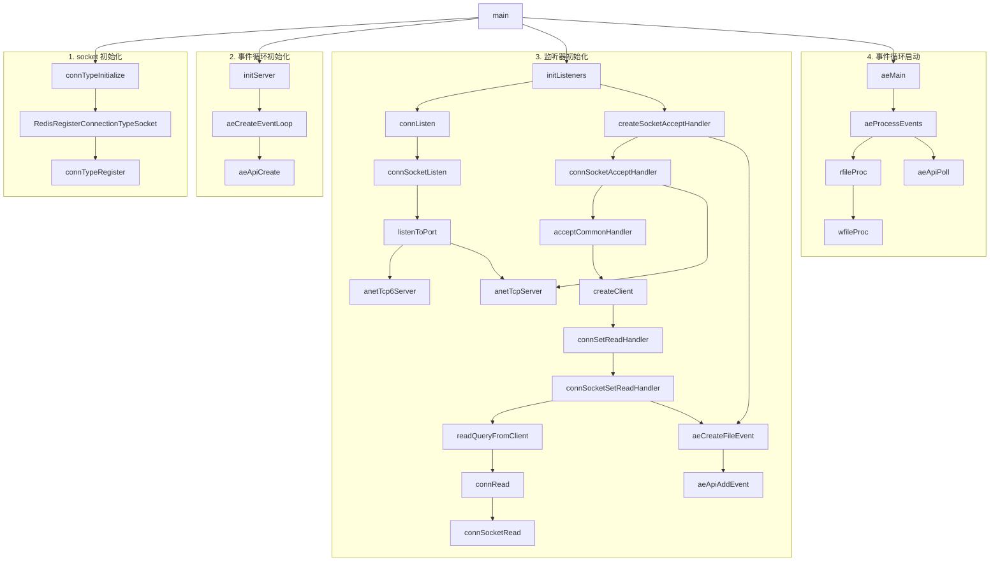

简单来讲，Redis 是一个内存优先的 KV NoSQL。它有这么几个优点：

1. **速度快**：Redis 是基于内存的，所以速度非常快。
2. **支持多种数据结构**：Redis 支持多种数据结构，包括字符串、列表、集合、有序集合、哈希表等。
3. **原子化操作**：Redis 支持原子化操作，可以保证多个操作的原子性。

我们还是从最基础的内容开始。

> 本文基于 Redis 8.0。其余版本可能有所不同。

## 安装与启动

安装 Redis 很简单，直接用包管理器安装即可[^1]。例如，在 Debian 上：

```bash
sudo apt install redis-server
```

安装完成后，可以使用 `redis-cli` 进行连接：

```shell
redis-cli
```

并且可以看一下是否正常：

```shell
$ ping
PONG
```

如果出问题了，可以看一下 Redis 是否启动了：

```shell
sudo service redis-server status
sudo service redis-server start
```

## 数据类型

Redis 分为 5 种数据结构[^2]：

| 数据结构 | 存储内容 | 结构读写能力 |
| --- | --- | :-- |
| `STRING` | 字符串、整数、浮点数 | 对整个字符串或其部分进行操作<br>自增/减整数和浮点数 |
| `LIST` | 字符串链表 | 从两端压入/弹出键值对<br>根据偏移量修剪<br>读取一个或多个键值对<br>按值查找或删除键值对 |
| `SET` | 无序不重复的字符串集合 | 增加/删除/查询键值对<br>检查元素是否存在<br>计算交集/并集/差集<br>随机获取元素 |
| `HASH` | 无序哈希表 | 增加/删除/查询键值对<br>获取所有键值对 |
| `ZSET` | 有序的字符串-浮点数对集合 | 增加/删除/查询键值对<br>获取所有键值对<br>按分数范围查找键值对 |

### `STRING`

最基本的命令就是 `SET` 和 `GET`，其用法为 `SET key value` 和 `GET key`：

```shell
$ SET name ch3nyang
OK

$ GET name
"ch3nyang"
```

当 `value` 为字符串时，最大长度为 512MB。

可以使用 `DEL` 删除键值对：

```shell
$ DEL name
(integer) 1

$ GET name
(nil)
```

这里，返回的 `(integer) 1` 表示操作的键中的元素个数。

### `HASH`

对于哈希表，使用 `HSET` 和 `HGET`，其用法为 `HSET key field value [field value ...]` 和 `HGET key field`。如果要获取所有键值对，可以使用 `HGETALL`。注意，这里不能使用 `GET`：

```shell
$ HSET user name ch3nyang passwd 123456 socialcredit 10086
(integer) 3

$ HGETALL user
1) "name"
2) "ch3nyang"
3) "passwd"
4) "123456"
5) "socialcredit"
6) "10086"

$ HGET user name
"ch3nyang"
```

哈希表同样可以使用 `DEL` 整体删除。但如果只要删除一个键值对，可以使用 `HDEL`：

```shell
$ HDEL user passwd
(integer) 1

$ HGETALL user
1) "name"
2) "ch3nyang"
3) "socialcredit"
4) "10086"

$ DEL user
(integer) 1

$ HGETALL user
(empty array)
```

### `LIST`

对于列表，使用 `LPUSH` 和 `RPUSH` 分别从左和右压入元素，使用 `LPOP` 和 `RPOP` 分别从左和右弹出元素。使用 `LRANGE` 获取范围内的元素：

```shell
$ RPUSH user ch3nyang A B C
(integer) 4

$ LPUSH user D E
(integer) 6

$ LRANGE user 0 -1
1) "E"
2) "D"
3) "ch3nyang"
4) "A"
5) "B"
6) "C"

$ LRANGE user 0 2
1) "E"
2) "D"
3) "ch3nyang"

$ LINDEX user 2
"ch3nyang"

$ LINDEX user 8
(nil)

$ LPOP user
"E"

$ LRANGE user 0 -1
1) "D"
2) "ch3nyang"
3) "A"
4) "B"
5) "C"
```

这里有几个要注意的地方。一是，不管是 `LPUSH` 还是 `RPUSH`，都是从左到右挨个压入的。二是，`LRANGE` 的索引是从 0 开始的，且包含两个端点。三是，如果索引超出范围，会返回 `nil`。

### `SET`

对于集合，使用 `SADD` 添加元素，使用 `SREM` 删除元素，使用 `SMEMBERS` 获取所有元素，使用 `SISMEMBER` 检查元素是否存在：

```shell
$ SADD user ch3nyang A B C D D E
(integer) 6

$ SMEMBERS user
1) "A"
2) "ch3nyang"
3) "B"
4) "D"
5) "E"
6) "C"

$ SISMEMBER user A
(integer) 1

$ SREM user A B C
(integer) 3

$ SISMEMBER user A
(integer) 0

$ SMEMBERS user
1) "ch3nyang"
2) "D"
3) "E"
```

`SET` 作为集合，不允许重复元素。如果添加了重复元素，只会添加一次。同时，我们注意到，它是无序的。

### `ZSET`

对于有序集合，使用 `ZADD` 添加元素，使用 `ZREM` 删除元素，使用 `ZRANGE` 获取范围内的元素，使用 `ZSCORE` 获取元素的分数，使用 `ZRANGEBYSCORE` 获取分数范围内的元素：

```shell
$ ZADD user 10086 ch3nyang 20 A 30 B 10 C
(integer) 4

$ ZRANGE user 0 -1
1) "C"
2) "A"
3) "B"
4) "ch3nyang"

$ ZRANGE user 0 -1 WITHSCORES
1) "C"
2) "10"
3) "A"
4) "20"
5) "B"
6) "30"
7) "ch3nyang"
8) "10086"

$ ZRANGEBYSCORE user 0 30
1) "C"
2) "A"
3) "B"

$ ZSCORE user ch3nyang
"10086"

$ ZREM user ch3nyang
(integer) 1

$ ZSCORE user ch3nyang
(nil)
```

有序集合是按照分数从小到大排序的。如果需要逆序输出，可以使用 `ZREVRANGE`。

## 事件

尽管 Redis 十分高效，但它是**单线程**的。这是因为多个线程争夺 CPU 缓存数据会导致无法命中缓存，从而降低性能。同时，对于 Redis 的使用场景来讲，网络带宽和内存带宽才是真正的瓶颈，而 CPU 相比之下性能完全足够。

Redis 在运行时，会与各个客户端建立 TCP 链接。然而，如果 Redis 使用 `read` 系统调用来读取客户端的请求，就会阻塞在这里。

解决这个问题有两种方法。一是使用轮询。我们预先将 socket 设置上 `O_NONBLOCK` 标志，然后不断查询所有 socket，来检查是否有数据可读。但这种方法效率低下，会无端地消耗大量 CPU 时间。

因此，Redis 使用了**I/O 多路复用**[^3][^4]，即使用 `epoll` 等调用，来监听多个 socket 的事件。当有事件发生时，`epoll` 调用会返回，Redis 就可以立即处理这个事件。通过这种方式，Redis 实现了异步非阻塞的网络 IO，而不会受制于单线程的阻塞问题。

为了后续的讨论，我们这里不得不来插叙一下 `epoll` 的相关内容。`epoll` 是 Linux 下的一种 I/O 多路复用机制。它的使用方法如下：

1. 使用 [`epoll_create`](https://man7.org/linux/man-pages/man2/epoll_create.2.html) 创建一个 `epoll` 实例。
  ```c
  int epoll_create(int size);
  ```
  > `epoll_create` 的返回值是一个文件描述符，用于后续的操作。
  >
  > [`epoll_create1`](https://www.ibm.com/docs/en/zos/3.1.0?topic=lf-epoll-create-epoll-create1-open-epoll-file-descriptor) 是 `epoll_create` 的一个变种，可以传入一个 `flags` 参数。假如 `flags` 为 `EPOLL_CLOEXEC`，则在 `exec` 时关闭文件描述符。

2. 使用 [`epoll_ctl`](https://man7.org/linux/man-pages/man2/epoll_ctl.2.html) 添加/删除/修改监听的文件描述符。
  ```c
  int epoll_ctl(int epfd, int op, int fd, struct epoll_event *event);
  ```

3. 使用 [`epoll_wait`](https://man7.org/linux/man-pages/man2/epoll_wait.2.html) 等待事件发生。
  ```c
  int epoll_wait(int epfd, struct epoll_event *events, int maxevents, int timeout);
  ```

当然，`epoll` 不是我们这里的重点，我们只是简单介绍一下必要的内容。关于 `epoll` 的详细介绍，可以参考 [The method to epoll’s madness](https://copyconstruct.medium.com/the-method-to-epolls-madness-d9d2d6378642)。

和 Node.js 类似，Redis 也是事件驱动的。Redis 通过事件循环来处理客户端的请求。我们接下来看看 Redis 的事件循环是如何实现 I/O 多路复用的。

> 坐稳了，接下来我们要加速了，如果你在阅读过程中没能跟上逻辑，可以跳转到[事件循环总结](#事件循环总结)部分看看流程图。

### socket 初始化

socket 初始化在 `server.c` 的 [`main` 函数](https://github.com/redis/redis/blob/8.0/src/server.c#L7094)中，调用了 [`connTypeInitialize()`](https://github.com/redis/redis/blob/8.0/src/server.c#L7174) 来初始化连接类型。

我们跟踪这个函数，进入了 [`connection.c`](https://github.com/redis/redis/blob/8.0/src/connection.c#L60)，看到：

```c
int connTypeInitialize(void) {
    /* currently socket connection type is necessary  */
    serverAssert(RedisRegisterConnectionTypeSocket() == C_OK);

    /* currently unix socket connection type is necessary  */
    serverAssert(RedisRegisterConnectionTypeUnix() == C_OK);

    /* may fail if without BUILD_TLS=yes */
    RedisRegisterConnectionTypeTLS();

    return C_OK;
}
```

这里，我们看到 Redis 支持了三种连接类型：`socket`、`unix` 和 `TLS`。其中，`socket` 和 `unix` 是必须的，而 `TLS` 是可选的。

我们暂时只看 `socket` 类型。我们一步步跟踪 `RedisRegisterConnectionTypeSocket` 函数，最终到达了 `connection.c` 的 [`connTypeRegister` 函数](https://github.com/redis/redis/blob/8.0/src/connection.c#L32)：

```c
int connTypeRegister(ConnectionType *ct) {
    const char *typename = ct->get_type(NULL);
    ConnectionType *tmpct;
    int type;

    /* find an empty slot to store the new connection type */
    for (type = 0; type < CONN_TYPE_MAX; type++) {
        tmpct = connTypes[type];
        if (!tmpct)
            break;

        /* ignore case, we really don't care "tls"/"TLS" */
        if (!strcasecmp(typename, tmpct->get_type(NULL))) {
            serverLog(LL_WARNING, "Connection types %s already registered", typename);
            return C_ERR;
        }
    }

    serverLog(LL_VERBOSE, "Connection type %s registered", typename);
    connTypes[type] = ct;

    if (ct->init) {
        ct->init();
    }

    return C_OK;
}
```

这里，我们看到 Redis 通过 `connTypes` 数组来存储连接类型。传入的参数 `ct` 为 `ConnectionType` 结构体，对于 `socket` 类型，`ct` 的值定义在 [`socket.c`](https://github.com/redis/redis/blob/8.0/src/socket.c#L464) 中：

```c
static ConnectionType CT_Socket = {
    /* connection type */
    .get_type = connSocketGetType,

    /* connection type initialize & finalize & configure */
    .init = NULL,
    .cleanup = NULL,
    .configure = NULL,

    /* ae & accept & listen & error & address handler */
    .ae_handler = connSocketEventHandler,
    .accept_handler = connSocketAcceptHandler,
    .addr = connSocketAddr,
    .is_local = connSocketIsLocal,
    .listen = connSocketListen,

    /* create/shutdown/close connection */
    .conn_create = connCreateSocket,
    .conn_create_accepted = connCreateAcceptedSocket,
    .shutdown = connSocketShutdown,
    .close = connSocketClose,

    /* connect & accept */
    .connect = connSocketConnect,
    .blocking_connect = connSocketBlockingConnect,
    .accept = connSocketAccept,

    /* event loop */
    .unbind_event_loop = NULL,
    .rebind_event_loop = connSocketRebindEventLoop,

    /* IO */
    .write = connSocketWrite,
    .writev = connSocketWritev,
    .read = connSocketRead,
    .set_write_handler = connSocketSetWriteHandler,
    .set_read_handler = connSocketSetReadHandler,
    .get_last_error = connSocketGetLastError,
    .sync_write = connSocketSyncWrite,
    .sync_read = connSocketSyncRead,
    .sync_readline = connSocketSyncReadLine,

    /* pending data */
    .has_pending_data = NULL,
    .process_pending_data = NULL,
};
```

这里，我们看到 `ConnectionType` 结构体定义了一系列函数指针，用于处理连接的初始化、清理、配置、事件处理、IO 等。这些函数指针会在其它函数中被调用，我们暂时无需太关心这些函数的具体实现。

### 事件循环初始化

在 `server.c` 的 `main` 函数中，初始化完 socket 后，又调用了 [`initServer()` 函数](https://github.com/redis/redis/blob/8.0/src/server.c#L7366) 来初始化服务器。

这个函数被定义在了 [`server.c`](https://github.com/redis/redis/blob/8.0/src/server.c#L2664) 中。我们很机智地注意到了里面[有一行](https://github.com/redis/redis/blob/8.0/src/server.c#L2732)：

```c
void initServer(void) {
    /* ... */
    server.el = aeCreateEventLoop(server.maxclients+CONFIG_FDSET_INCR);
    /* ... */
}
```

跟踪进去发现，[`aeCreateEventLoop` 函数](https://github.com/redis/redis/blob/8.0/src/ae.c#L46)定义返回了一个 `aeEventLoop` 结构体：

```c
aeEventLoop *aeCreateEventLoop(int setsize) {
    aeEventLoop *eventLoop;
    int i;

    monotonicInit();    /* just in case the calling app didn't initialize */

    if ((eventLoop = zmalloc(sizeof(*eventLoop))) == NULL) goto err;
    eventLoop->nevents = setsize < INITIAL_EVENT ? setsize : INITIAL_EVENT;
    eventLoop->events = zmalloc(sizeof(aeFileEvent)*eventLoop->nevents);
    eventLoop->fired = zmalloc(sizeof(aeFiredEvent)*eventLoop->nevents);
    if (eventLoop->events == NULL || eventLoop->fired == NULL) goto err;
    eventLoop->setsize = setsize;
    eventLoop->timeEventHead = NULL;
    eventLoop->timeEventNextId = 0;
    eventLoop->stop = 0;
    eventLoop->maxfd = -1;
    eventLoop->beforesleep = NULL;
    eventLoop->aftersleep = NULL;
    eventLoop->flags = 0;
    memset(eventLoop->privdata, 0, sizeof(eventLoop->privdata));
    if (aeApiCreate(eventLoop) == -1) goto err;
    /* Events with mask == AE_NONE are not set. So let's initialize the
     * vector with it. */
    for (i = 0; i < eventLoop->nevents; i++)
        eventLoop->events[i].mask = AE_NONE;
    return eventLoop;

err:
    if (eventLoop) {
        zfree(eventLoop->events);
        zfree(eventLoop->fired);
        zfree(eventLoop);
    }
    return NULL;
}
```

这个函数创建了一个 `aeEventLoop` 结构体，并初始化了一些参数。这里，最关键的是调用了 `aeApiCreate` 函数，它定义在 [`ae_epoll.c`](https://github.com/redis/redis/blob/8.0/src/ae_epoll.c#L18) 中：

```c
typedef struct aeApiState {
    int epfd;
    struct epoll_event *events;
} aeApiState;

static int aeApiCreate(aeEventLoop *eventLoop) {
    aeApiState *state = zmalloc(sizeof(aeApiState));

    if (!state) return -1;
    state->events = zmalloc(sizeof(struct epoll_event)*eventLoop->setsize);
    if (!state->events) {
        zfree(state);
        return -1;
    }
    state->epfd = epoll_create(1024); /* 1024 is just a hint for the kernel */
    if (state->epfd == -1) {
        zfree(state->events);
        zfree(state);
        return -1;
    }
    anetCloexec(state->epfd);
    eventLoop->apidata = state;
    return 0;
}
```

这个函数创建了一个 `epoll` 实例，并将其存储在 `eventLoop->apidata` 中。这样，Redis 就可以使用 `epoll` 来监听事件了。其中，`epoll` 的 `epfd` 是一个文件描述符，`events` 是一个 `epoll_event` 数组，用于存储事件。我们上文已经介绍过 `epoll` 的相关内容，这里基本是对其流程进行的实现。

需要注意的是，这个函数仅仅是创建了一个 `epoll` 实例，并没有注册事件。

### 监听器初始化

我们回到 `server.c` 的 [`main` 函数](https://github.com/redis/redis/blob/8.0/src/server.c#L7379)中。初始化完事件循环后，`main` 函数又调用了 [`initListeners` 函数](https://github.com/redis/redis/blob/8.0/src/server.c#L2879)来初始化监听器:

```c
void initListeners(void) {
    /* Setup listeners from server config for TCP/TLS/Unix */
    int conn_index;
    connListener *listener;
    if (server.port != 0) {
        conn_index = connectionIndexByType(CONN_TYPE_SOCKET);
        if (conn_index < 0)
            serverPanic("Failed finding connection listener of %s", CONN_TYPE_SOCKET);
        listener = &server.listeners[conn_index];
        listener->bindaddr = server.bindaddr;
        listener->bindaddr_count = server.bindaddr_count;
        listener->port = server.port;
        listener->ct = connectionByType(CONN_TYPE_SOCKET);
    }

    /* ... */

    /* create all the configured listener, and add handler to start to accept */
    int listen_fds = 0;
    for (int j = 0; j < CONN_TYPE_MAX; j++) {
        listener = &server.listeners[j];
        if (listener->ct == NULL)
            continue;

        if (connListen(listener) == C_ERR) {
            serverLog(LL_WARNING, "Failed listening on port %u (%s), aborting.", listener->port, listener->ct->get_type(NULL));
            exit(1);
        }

        if (createSocketAcceptHandler(listener, connAcceptHandler(listener->ct)) != C_OK)
            serverPanic("Unrecoverable error creating %s listener accept handler.", listener->ct->get_type(NULL));

       listen_fds += listener->count;
    }

    if (listen_fds == 0) {
        serverLog(LL_WARNING, "Configured to not listen anywhere, exiting.");
        exit(1);
    }
}
```

这个函数首先初始化了监听器，然后调用了 [`connListen` 函数](https://github.com/redis/redis/blob/8.0/src/connection.h#L436)来监听端口：

```c
static inline int connListen(connListener *listener) {
    return listener->ct->listen(listener);
}
```

我们前文提到，这里的 `listen` 函数指针在 [`socket.c`](https://github.com/redis/redis/blob/8.0/src/socket.c#L464) 中被赋值为 [`connSocketListen` 函数](https://github.com/redis/redis/blob/8.0/src/socket.c#L337)，而后者调用了 [`listenToPort` 函数](https://github.com/redis/redis/blob/8.0/src/server.c#L2548)：

```c
int listenToPort(connListener *sfd) {
    int j;
    int port = sfd->port;
    char **bindaddr = sfd->bindaddr;

    /* If we have no bind address, we don't listen on a TCP socket */
    if (sfd->bindaddr_count == 0) return C_OK;

    for (j = 0; j < sfd->bindaddr_count; j++) {
        char* addr = bindaddr[j];
        int optional = *addr == '-';
        if (optional) addr++;
        if (strchr(addr,':')) {
            /* Bind IPv6 address. */
            sfd->fd[sfd->count] = anetTcp6Server(server.neterr,port,addr,server.tcp_backlog);
        } else {
            /* Bind IPv4 address. */
            sfd->fd[sfd->count] = anetTcpServer(server.neterr,port,addr,server.tcp_backlog);
        }
        if (sfd->fd[sfd->count] == ANET_ERR) {
            int net_errno = errno;
            serverLog(LL_WARNING,
                "Warning: Could not create server TCP listening socket %s:%d: %s",
                addr, port, server.neterr);
            if (net_errno == EADDRNOTAVAIL && optional)
                continue;
            if (net_errno == ENOPROTOOPT     || net_errno == EPROTONOSUPPORT ||
                net_errno == ESOCKTNOSUPPORT || net_errno == EPFNOSUPPORT ||
                net_errno == EAFNOSUPPORT)
                continue;

            /* Rollback successful listens before exiting */
            closeListener(sfd);
            return C_ERR;
        }
        if (server.socket_mark_id > 0) anetSetSockMarkId(NULL, sfd->fd[sfd->count], server.socket_mark_id);
        anetNonBlock(NULL,sfd->fd[sfd->count]);
        anetCloexec(sfd->fd[sfd->count]);
        sfd->count++;
    }
    return C_OK;
}
```

这个函数首先判断了是否有绑定地址，然后根据地址类型调用了 `anetTcpServer` 或 `anetTcp6Server` 函数来创建 TCP 服务器。

至此，监听器完成了初始化，可以监听客户端的请求了。

如果你还没有对程序的调用逻辑混乱，接下来我们回到 [`initListeners` 函数](https://github.com/redis/redis/blob/8.0/src/server.c#L2879)。在刚刚的 `connListen` 函数调用后，`initListeners` 函数又调用了 [`createSocketAcceptHandler` 函数](https://github.com/redis/redis/blob/8.0/src/server.c#L2516)来创建一个接受处理器：

```c
int createSocketAcceptHandler(connListener *sfd, aeFileProc *accept_handler) {
    int j;

    for (j = 0; j < sfd->count; j++) {
        if (aeCreateFileEvent(server.el, sfd->fd[j], AE_READABLE, accept_handler,sfd) == AE_ERR) {
            /* Rollback */
            for (j = j-1; j >= 0; j--) aeDeleteFileEvent(server.el, sfd->fd[j], AE_READABLE);
            return C_ERR;
        }
    }
    return C_OK;
}
```

这个函数调用了 `aeCreateFileEvent` 函数来创建一个文件事件。这个文件事件的类型为 `AE_READABLE`，表示可以读取数据。我们来看 [`aeCreateFileEvent` 函数](https://github.com/redis/redis/blob/8.0/src/ae.c#L144)：

```c
int aeCreateFileEvent(aeEventLoop *eventLoop, int fd, int mask,
        aeFileProc *proc, void *clientData)
{
    if (fd >= eventLoop->setsize) {
        errno = ERANGE;
        return AE_ERR;
    }

    /* Resize the events and fired arrays if the file
     * descriptor exceeds the current number of events. */
    if (unlikely(fd >= eventLoop->nevents)) {
        int newnevents = eventLoop->nevents;
        newnevents = (newnevents * 2 > fd + 1) ? newnevents * 2 : fd + 1;
        newnevents = (newnevents > eventLoop->setsize) ? eventLoop->setsize : newnevents;
        eventLoop->events = zrealloc(eventLoop->events, sizeof(aeFileEvent) * newnevents);
        eventLoop->fired = zrealloc(eventLoop->fired, sizeof(aeFiredEvent) * newnevents);

        /* Initialize new slots with an AE_NONE mask */
        for (int i = eventLoop->nevents; i < newnevents; i++)
            eventLoop->events[i].mask = AE_NONE;
        eventLoop->nevents = newnevents;
    }

    aeFileEvent *fe = &eventLoop->events[fd];

    if (aeApiAddEvent(eventLoop, fd, mask) == -1)
        return AE_ERR;
    fe->mask |= mask;
    if (mask & AE_READABLE) fe->rfileProc = proc;
    if (mask & AE_WRITABLE) fe->wfileProc = proc;
    fe->clientData = clientData;
    if (fd > eventLoop->maxfd)
        eventLoop->maxfd = fd;
    return AE_OK;
}
```

这个函数首先检查了文件描述符是否超出了 `eventLoop->setsize`，然后调整了 `eventLoop->events` 和 `eventLoop->fired` 数组的大小。接着，调用了 `aeApiAddEvent` 函数来添加事件。最后，将事件添加到 `eventLoop->events` 中。

添加事件的具体实现在 `ae_epoll.c` 的 [`aeApiAddEvent` 函数](https://github.com/redis/redis/blob/8.0/src/ae_epoll.c#L53)中：

```c
static int aeApiAddEvent(aeEventLoop *eventLoop, int fd, int mask) {
    aeApiState *state = eventLoop->apidata;
    struct epoll_event ee = {0}; /* avoid valgrind warning */
    /* If the fd was already monitored for some event, we need a MOD
     * operation. Otherwise we need an ADD operation. */
    int op = eventLoop->events[fd].mask == AE_NONE ?
            EPOLL_CTL_ADD : EPOLL_CTL_MOD;

    ee.events = 0;
    mask |= eventLoop->events[fd].mask; /* Merge old events */
    if (mask & AE_READABLE) ee.events |= EPOLLIN;
    if (mask & AE_WRITABLE) ee.events |= EPOLLOUT;
    ee.data.fd = fd;
    if (epoll_ctl(state->epfd,op,fd,&ee) == -1) return -1;
    return 0;
}
```

这个函数首先判断了事件类型，然后调用了 `epoll_ctl` 函数来添加事件。这里，`op` 为 `EPOLL_CTL_ADD` 或 `EPOLL_CTL_MOD`，分别表示添加事件和修改事件。`ee.events` 为 `EPOLLIN` 或 `EPOLLOUT`，分别表示可读和可写。

再回到 [`createSocketAcceptHandler` 函数](https://github.com/redis/redis/blob/8.0/src/server.c#L2516)，这里面有一个 `accept_handler` 函数指针作为参数，它的值为 `listener->ct->accept_handler`。这个函数指针在 [`socket.c`](https://github.com/redis/redis/blob/8.0/src/socket.c#L464) 中被赋值为 [`connSocketAcceptHandler` 函数](https://github.com/redis/redis/blob/8.0/src/socket.c#L300)：

```c
static void connSocketAcceptHandler(aeEventLoop *el, int fd, void *privdata, int mask) {
    int cport, cfd;
    int max = server.max_new_conns_per_cycle;
    char cip[NET_IP_STR_LEN];
    UNUSED(mask);
    UNUSED(privdata);

    while(max--) {
        cfd = anetTcpAccept(server.neterr, fd, cip, sizeof(cip), &cport);
        if (cfd == ANET_ERR) {
            if (errno != EWOULDBLOCK)
                serverLog(LL_WARNING,
                    "Accepting client connection: %s", server.neterr);
            return;
        }
        serverLog(LL_VERBOSE,"Accepted %s:%d", cip, cport);
        acceptCommonHandler(connCreateAcceptedSocket(el,cfd,NULL), 0, cip);
    }
}
```

这个函数调用了 `anetTcpAccept` 函数来接受客户端的连接。然后调用了 `acceptCommonHandler` 函数来处理接受的连接。

[`acceptCommonHandler` 函数](https://github.com/redis/redis/blob/8.0/src/networking.c#L1387)定义在 `networking.c` 中：

```c
void acceptCommonHandler(connection *conn, int flags, char *ip) {
    client *c;
    UNUSED(ip);

    /* ... */

    /* Create connection and client */
    if ((c = createClient(conn)) == NULL) {
        char addr[NET_ADDR_STR_LEN] = {0};
        char laddr[NET_ADDR_STR_LEN] = {0};
        connFormatAddr(conn, addr, sizeof(addr), 1);
        connFormatAddr(conn, laddr, sizeof(addr), 0);
        serverLog(LL_WARNING,
                  "Error registering fd event for the new client connection: %s (addr=%s laddr=%s)",
                  connGetLastError(conn), addr, laddr);
        connClose(conn); /* May be already closed, just ignore errors */
        return;
    }

    /* Last chance to keep flags */
    c->flags |= flags;

    /* Initiate accept.
     *
     * Note that connAccept() is free to do two things here:
     * 1. Call clientAcceptHandler() immediately;
     * 2. Schedule a future call to clientAcceptHandler().
     *
     * Because of that, we must do nothing else afterwards.
     */
    if (connAccept(conn, clientAcceptHandler) == C_ERR) {
        if (connGetState(conn) == CONN_STATE_ERROR)
            serverLog(LL_WARNING,
                      "Error accepting a client connection: %s (addr=%s laddr=%s)",
                      connGetLastError(conn), getClientPeerId(c), getClientSockname(c));
        freeClient(connGetPrivateData(conn));
        return;
    }
}
```

这个函数通过 `createClient` 函数创建了一个客户端，并调用了 `connAccept` 函数来接受客户端的连接。

我们跟踪进入 [`createClient` 函数](https://github.com/redis/redis/blob/8.0/src/networking.c#L119)：

```c
client *createClient(connection *conn) {
    client *c = zmalloc(sizeof(client));

    if (conn) {
        connEnableTcpNoDelay(conn);
        if (server.tcpkeepalive)
            connKeepAlive(conn,server.tcpkeepalive);
        connSetReadHandler(conn, readQueryFromClient);
        connSetPrivateData(conn, c);
    }
    
    /* ... */
}
```

这个函数创建了一个客户端，并设置了一些参数。我们重点关注了 `connSetReadHandler` 函数，它定义在 [`connection.h`](https://github.com/redis/redis/blob/8.0/src/connection.h#L216) 中：

```c
static inline int connSetReadHandler(connection *conn, ConnectionCallbackFunc func) {
    return conn->type->set_read_handler(conn, func);
}
```

`set_read_handler` 同样在 [`socket.c`](https://github.com/redis/redis/blob/8.0/src/socket.c#L382) 中被定义为了 [`connSocketSetReadHandler` 函数](https://github.com/redis/redis/blob/8.0/src/socket.c#L230)：

```c
static int connSocketSetReadHandler(connection *conn, ConnectionCallbackFunc func) {
    if (func == conn->read_handler) return C_OK;

    conn->read_handler = func;
    if (!conn->read_handler)
        aeDeleteFileEvent(conn->el,conn->fd,AE_READABLE);
    else
        if (aeCreateFileEvent(conn->el,conn->fd,
                    AE_READABLE,conn->type->ae_handler,conn) == AE_ERR) return C_ERR;
    return C_OK;
}
```

这个函数设置了读取处理器，并调用了 `aeCreateFileEvent` 函数来创建一个文件事件。这个文件事件的类型为 `AE_READABLE`，表示可以读取数据。我们前文已经介绍过 `aeCreateFileEvent` 函数，这里不再赘述。

这个函数的参数 `func` 如果往上翻一翻就能看到是 [`readQueryFromClient` 函数](https://github.com/redis/redis/blob/8.0/src/networking.c#L2878)：

```c
void readQueryFromClient(connection *conn) {
    client *c = connGetPrivateData(conn);
    int nread, big_arg = 0;
    size_t qblen, readlen;
    
    /* ... */

    nread = connRead(c->conn, c->querybuf+qblen, readlen);
    
    /* ... */
}
```

这个函数调用了 `connRead` 函数来读取客户端的请求。其一路网上追溯，可以找到 [`connSocketRead` 函数](https://github.com/redis/redis/blob/8.0/src/socket.c#L164)：

```c
static int connSocketRead(connection *conn, void *buf, size_t buf_len) {
    int ret = read(conn->fd, buf, buf_len);
    if (!ret) {
        conn->state = CONN_STATE_CLOSED;
    } else if (ret < 0 && errno != EAGAIN) {
        conn->last_errno = errno;

        /* Don't overwrite the state of a connection that is not already
         * connected, not to mess with handler callbacks.
         */
        if (errno != EINTR && conn->state == CONN_STATE_CONNECTED)
            conn->state = CONN_STATE_ERROR;
    }

    return ret;
}
```

至此，我们已经理清了读取句柄注册的流程。写入句柄注册的流程与此类似，这里不再赘述。

### 事件循环启动

继续回到 [`main` 函数](https://github.com/redis/redis/blob/8.0/src/server.c#L7433)。初始化完监听器后，`main` 函数又调用了 [`aeMain` 函数](https://github.com/redis/redis/blob/8.0/src/ae.c#L491)来启动事件循环：

```c
void aeMain(aeEventLoop *eventLoop) {
    eventLoop->stop = 0;
    while (!eventLoop->stop) {
        aeProcessEvents(eventLoop, AE_ALL_EVENTS|
                                   AE_CALL_BEFORE_SLEEP|
                                   AE_CALL_AFTER_SLEEP);
    }
}
```

进一步跟踪 [`aeProcessEvents` 函数](https://github.com/redis/redis/blob/8.0/src/ae.c#L359)：

```c
int aeProcessEvents(aeEventLoop *eventLoop, int flags)
{
    int processed = 0, numevents;

    /* ... */

    numevents = aeApiPoll(eventLoop, tvp);

    /* ... */

    for (j = 0; j < numevents; j++) {
        int fd = eventLoop->fired[j].fd;
        aeFileEvent *fe = &eventLoop->events[fd];
        int mask = eventLoop->fired[j].mask;
        int fired = 0; /* Number of events fired for current fd. */
        
        int invert = fe->mask & AE_BARRIER;

        if (!invert && fe->mask & mask & AE_READABLE) {
            fe->rfileProc(eventLoop,fd,fe->clientData,mask);
            fired++;
            fe = &eventLoop->events[fd]; /* Refresh in case of resize. */
        }

        /* Fire the writable event. */
        if (fe->mask & mask & AE_WRITABLE) {
            if (!fired || fe->wfileProc != fe->rfileProc) {
                fe->wfileProc(eventLoop,fd,fe->clientData,mask);
                fired++;
            }
        }

        /* ... */

        processed++;
    }

    /* Check time events */
    if (flags & AE_TIME_EVENTS)
        processed += processTimeEvents(eventLoop);

    return processed; /* return the number of processed file/time events */
}
```

这个函数首先调用了 `aeApiPoll` 函数来获取事件数量，然后遍历事件，调用了 `rfileProc` 和 `wfileProc` 函数来处理读取和写入事件，其中 `rfileProc` 函数就是我们前文介绍的 [`aeCreateFileEvent` 函数](https://github.com/redis/redis/blob/8.0/src/ae.c#L144)中设置的函数指针。。最后，调用了 `processTimeEvents` 函数来处理时间事件。

可以简单看一下 [`aeApiPoll` 函数](https://github.com/redis/redis/blob/8.0/src/ae_epoll.c#L88)的实现：

```c
static int aeApiPoll(aeEventLoop *eventLoop, struct timeval *tvp) {
    aeApiState *state = eventLoop->apidata;
    int retval, numevents = 0;

    retval = epoll_wait(state->epfd,state->events,eventLoop->setsize,
            tvp ? (tvp->tv_sec*1000 + (tvp->tv_usec + 999)/1000) : -1);
    if (retval > 0) {
        int j;

        numevents = retval;
        for (j = 0; j < numevents; j++) {
            int mask = 0;
            struct epoll_event *e = state->events+j;

            if (e->events & EPOLLIN) mask |= AE_READABLE;
            if (e->events & EPOLLOUT) mask |= AE_WRITABLE;
            if (e->events & EPOLLERR) mask |= AE_WRITABLE|AE_READABLE;
            if (e->events & EPOLLHUP) mask |= AE_WRITABLE|AE_READABLE;
            eventLoop->fired[j].fd = e->data.fd;
            eventLoop->fired[j].mask = mask;
        }
    } else if (retval == -1 && errno != EINTR) {
        panic("aeApiPoll: epoll_wait, %s", strerror(errno));
    }

    return numevents;
}
```

这个函数调用了 `epoll_wait` 函数来等待事件发生，然后将事件添加到 `eventLoop->fired` 中。

至此，我们已经理清了 Redis 的事件循环流程。

### 事件循环总结

综上，Redis 的事件循环函数调用图如下：

<div hidden>

</div>


## 数据结构

你已经看完了最麻烦的部分，接下来的内容就要轻松多了。我们来看看 Redis 中一些数据结构的实现。

### 哈希表

哈希表使用的字典类型被定义在 [`dict.h`](https://github.com/redis/redis/blob/8.0/src/dict.h#L100) 中：

```c
struct dict {
    dictType *type;

    dictEntry **ht_table[2];
    unsigned long ht_used[2];

    long rehashidx;

    unsigned pauserehash : 15;

    unsigned useStoredKeyApi : 1;
    signed char ht_size_exp[2];
    int16_t pauseAutoResize;
    void *metadata[];
};
```

这个结构体定义了一个字典，其中包含了两个哈希表，一个用于存储数据，一个用于扩容。

其中的 `dictEntry` 结构体定义在 [`dict.c`](https://github.com/redis/redis/blob/8.0/src/dict.c#L45) 中：

```c
struct dictEntry {
    void *key;
    union {
        void *val;
        uint64_t u64;
        int64_t s64;
        double d;
    } v;
    struct dictEntry *next;     /* Next entry in the same hash bucket. */
};
```

这个结构体定义了一个字典条目，其中包含了键、值、下一个条目的指针。

根据 [`dict.h`](https://github.com/redis/redis/blob/8.0/deps/hiredis/dict.h#L76)，Redis 的哈希表初始大小为 4。在运行过程中，Redis 会判断是否需要扩容，[代码](https://github.com/redis/redis/blob/8.0/src/dict.c#L1533)如下：

```c
int dictExpandIfNeeded(dict *d) {
    /* Incremental rehashing already in progress. Return. */
    if (dictIsRehashing(d)) return DICT_OK;

    /* If the hash table is empty expand it to the initial size. */
    if (DICTHT_SIZE(d->ht_size_exp[0]) == 0) {
        dictExpand(d, DICT_HT_INITIAL_SIZE);
        return DICT_OK;
    }

    /* If we reached the 1:1 ratio, and we are allowed to resize the hash
     * table (global setting) or we should avoid it but the ratio between
     * elements/buckets is over the "safe" threshold, we resize doubling
     * the number of buckets. */
    if ((dict_can_resize == DICT_RESIZE_ENABLE &&
         d->ht_used[0] >= DICTHT_SIZE(d->ht_size_exp[0])) ||
        (dict_can_resize != DICT_RESIZE_FORBID &&
         d->ht_used[0] >= dict_force_resize_ratio * DICTHT_SIZE(d->ht_size_exp[0])))
    {
        if (dictTypeResizeAllowed(d, d->ht_used[0] + 1))
            dictExpand(d, d->ht_used[0] + 1);
        return DICT_OK;
    }
    return DICT_ERR;
}
```

可见，哈希表扩容的条件有三种：

1. 如果哈希表为空，扩容到初始大小。
2. 如果哈希表的负载因子超过了 1:1（即平均每个桶中有超过一个元素），且允许扩容，则进行扩容。
3. 如果哈希表的负载因子超过了 `dict_force_resize_ratio`（默认为 4），不管是否允许扩容，都进行扩容。

扩容后大小的[计算方式](https://github.com/redis/redis/blob/8.0/src/dict.c#L1616)为：

```c
static signed char _dictNextExp(unsigned long size)
{
    if (size <= DICT_HT_INITIAL_SIZE) return DICT_HT_INITIAL_EXP;
    if (size >= LONG_MAX) return (8*sizeof(long)-1);

    return 8*sizeof(long) - __builtin_clzl(size-1);
}
```

可以看到，如果大小不超过 long 类型的最大值，那么哈希表的大小会以 2 的幂次方增长。

如果满足了扩容条件，Redis 会最终调用到 `dictRehash` 函数来扩容哈希表。这个函数的[实现](https://github.com/redis/redis/blob/8.0/src/dict.c#L392)如下：

```c
int dictRehash(dict *d, int n) {
    int empty_visits = n*10; /* Max number of empty buckets to visit. */
    unsigned long s0 = DICTHT_SIZE(d->ht_size_exp[0]);
    unsigned long s1 = DICTHT_SIZE(d->ht_size_exp[1]);
    if (dict_can_resize == DICT_RESIZE_FORBID || !dictIsRehashing(d)) return 0;
    /* If dict_can_resize is DICT_RESIZE_AVOID, we want to avoid rehashing. 
     * - If expanding, the threshold is dict_force_resize_ratio which is 4.
     * - If shrinking, the threshold is 1 / (HASHTABLE_MIN_FILL * dict_force_resize_ratio) which is 1/32. */
    if (dict_can_resize == DICT_RESIZE_AVOID && 
        ((s1 > s0 && s1 < dict_force_resize_ratio * s0) ||
         (s1 < s0 && s0 < HASHTABLE_MIN_FILL * dict_force_resize_ratio * s1)))
    {
        return 0;
    }

    while(n-- && d->ht_used[0] != 0) {
        /* Note that rehashidx can't overflow as we are sure there are more
         * elements because ht[0].used != 0 */
        assert(DICTHT_SIZE(d->ht_size_exp[0]) > (unsigned long)d->rehashidx);
        while(d->ht_table[0][d->rehashidx] == NULL) {
            d->rehashidx++;
            if (--empty_visits == 0) return 1;
        }
        /* Move all the keys in this bucket from the old to the new hash HT */
        rehashEntriesInBucketAtIndex(d, d->rehashidx);
        d->rehashidx++;
    }

    return !dictCheckRehashingCompleted(d);
}
```

这个函数首先判断了是否可以扩容，然后遍历哈希表，将数据从旧哈希表移动到新哈希表。

由于一次性移动所有数据可能会消耗大量计算资源，Redis 采用了渐进式扩容[^5]。具体来说，它使用 `rehashidx` 来记录当前迁移的位置，每次只迁移一个桶中的数据。迁移完成后，`rehashidx` 会自增。

当全部数据迁移完成后，Redis 会将新哈希表的指针赋值给旧哈希表，并释放旧哈希表的内存。换句话说，交换了新旧哈希表的指针。

最后再提一嘴无关紧要的，Redis 的[哈希函数](https://github.com/redis/redis/blob/8.0/deps/hiredis/dict.c#L54)如下：

```c
static unsigned int dictGenHashFunction(const unsigned char *buf, int len) {
    unsigned int hash = 5381;

    while (len--)
        hash = ((hash << 5) + hash) + (*buf++); /* hash * 33 + c */
    return hash;
}
```

这个哈希函数是一个简单的 DJB 算法，它将每个字符乘以 33 并加到哈希值中。

### 跳跃表

## 参考资料

[^1]: [How to Install and Use Redis on Windows 11](https://redis.io/blog/install-redis-windows-11/)
[^2]: [Redis data structures](https://redis.io/glossary/redis-data-structures/)
[^3]: [What is Redis and how does it work Internally](https://medium.com/@ayushsaxena823/what-is-redis-and-how-does-it-work-cfe2853eb9a9)
[^4]: [An In-Depth Look Into the Internal Workings of Redis](https://betterprogramming.pub/internals-workings-of-redis-718f5871be84)
[^5]: [A little internal on Redis hash table implementation](https://kousiknath.medium.com/a-little-internal-on-redis-key-value-storage-implementation-fdf96bac7453)
