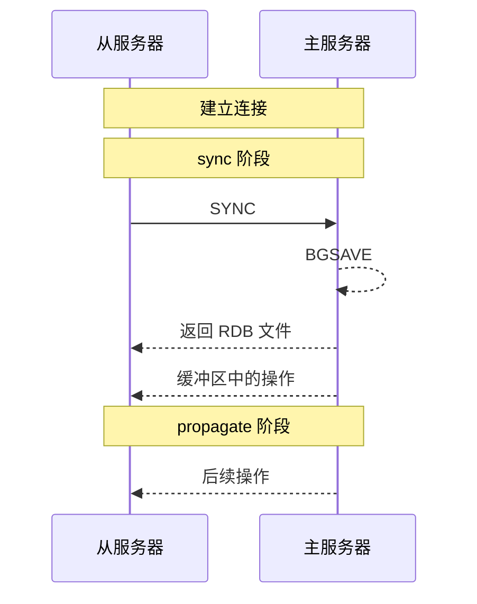
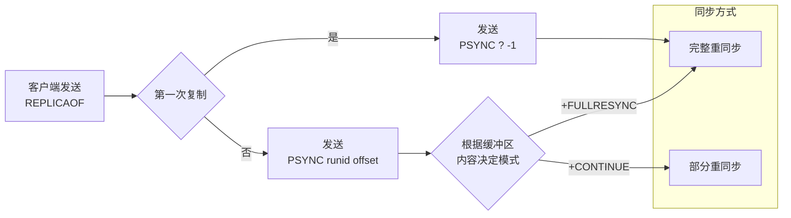
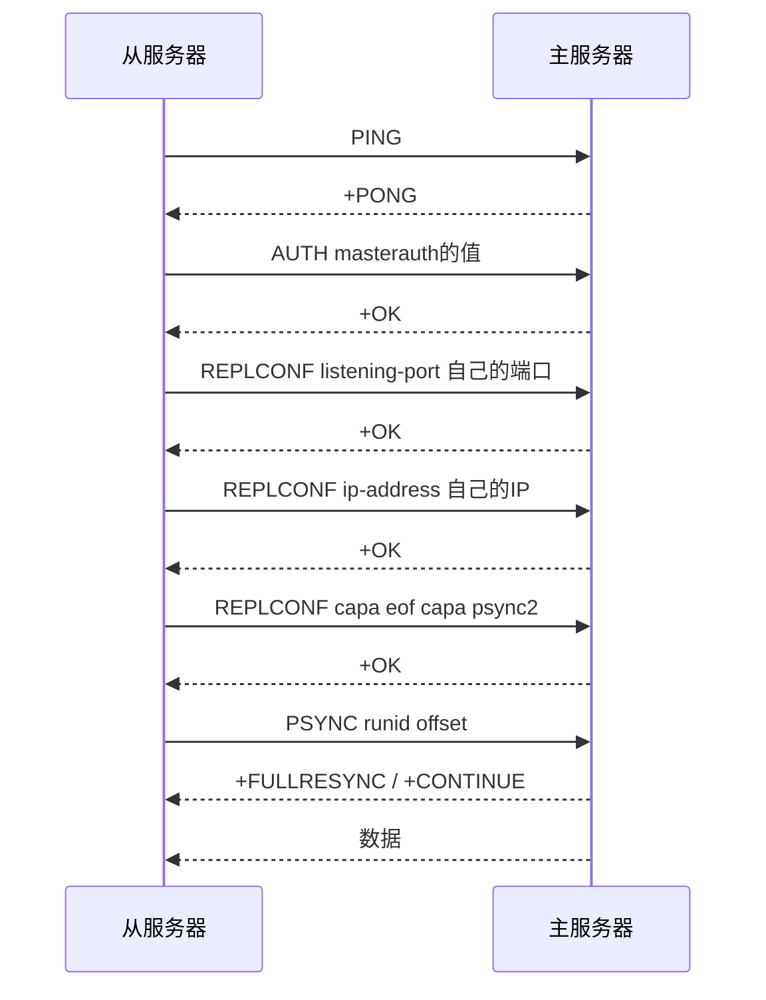

本文将会从源码层面解读 Redis 的各项机制。我们会从最基础的内容开始，尽量只看 Redis 最核心的部分，而剥离掉一些不太重要的内容，所有的源码都给出了 GitHub 的链接。

写作本文时，Redis CE 还在 7.4 版本；Redis 8.0 仍然 Pre-Release 版本。因此，本文主要基于 Redis 7.4，其余版本可能有所不同。本文使用的环境为 Debian 12。

简单来讲，Redis 是一个内存优先的 KV NoSQL。它有这么几个优点：

1. **速度快**：Redis 是基于内存的，所以速度非常快。
2. **支持多种 Redis 对象**：Redis 支持多种 Redis 对象，包括字符串、列表、集合、有序集合、哈希表等。
3. **原子化操作**：Redis 支持原子化操作，可以保证多个操作的原子性。

## 安装与启动

安装 Redis 很简单，直接用包管理器安装即可。例如，在 Debian 上：

```bash
sudo apt install redis-server
```

安装完成后，可以使用 `redis-cli` 进行连接：

```shell
redis-cli
```

并且可以看一下是否正常：

```shell
$ ping
PONG
```

如果出问题了，可以看一下 Redis 是否启动了：

```shell
sudo service redis-server status
sudo service redis-server start
```

Redis 支持的所有命令及文档可以在[这里](https://redis.io/commands)查看。

## Redis 对象

数据在 Redis 内的存储方式多种多样，分为[以下几种](https://github.com/redis/redis/blob/7.4/src/object.c#L928)：

```c
char *strEncoding(int encoding) {
    switch(encoding) {
    case OBJ_ENCODING_RAW: return "raw";
    case OBJ_ENCODING_INT: return "int";
    case OBJ_ENCODING_HT: return "hashtable";
    case OBJ_ENCODING_QUICKLIST: return "quicklist";
    case OBJ_ENCODING_LISTPACK: return "listpack";
    case OBJ_ENCODING_LISTPACK_EX: return "listpackex";
    case OBJ_ENCODING_INTSET: return "intset";
    case OBJ_ENCODING_SKIPLIST: return "skiplist";
    case OBJ_ENCODING_EMBSTR: return "embstr";
    case OBJ_ENCODING_STREAM: return "stream";
    default: return "unknown";
    }
}
```

但是，根据存储内容和操作的不同，Redis 对外暴露了几种 Redis 对象：

| Redis 对象 | 存储内容 | 结构读写能力 | 内部实现 |
| --- | --- | :-- | --- |
| `STRING` | 字符串、整数、浮点数 | 对整个字符串或其部分进行操作<br>自增/减整数和浮点数 | `int`<br>`embstr`<br>`sds` |
| `LIST` | 链表 | 从两端压入/弹出键值对<br>根据偏移量修剪<br>读取一个或多个键值对<br>按值查找或删除键值对 | `quicklist`<br>`listpack` |
| `HASH` | 哈希表 | 增加/删除/查询键值对<br>获取所有键值对 | `listpack` |
| `SET` | 集合 | 增加/删除/查询键值对<br>检查元素是否存在<br>计算交集/并集/差集<br>随机获取元素 | `intset`<br>`listpack`<br>`hashtable` |
| `ZSET` | 有序的字符串-浮点数对集合 | 增加/删除/查询键值对<br>获取所有键值对<br>按分数范围查找键值对 | `listpack`<br>`skiplist` |

此外，还有一些不那么常用的 Redis 对象：

| Redis 对象 | 应用场景 | 加入版本 |
| --- | --- | --- |
| `BITMAP` | 位图 | 2.2 |
| `HYPERLOGLOG` | 基数统计 | 2.8 |
| `GEO` | 地理位置 | 3.2 |
| `STREAM` | 消息队列 | 5.0 |

当然，在未发布的 Redis 8.0 中，增加了 `JSON`、`TIME_SERIES` 等对象。等到正式发布后，我们再来介绍。

### `STRING`

#### 基本操作

最基本的命令就是 `SET` 和 `GET`，其用法为 `SET key value` 和 `GET key`：

```shell
$ SET name ch3nyang
OK

$ GET name
"ch3nyang"
```

当 `value` 为字符串时，最大长度为 512MB。

可以使用 `DEL` 删除键值对：

```shell
$ DEL name
(integer) 1

$ GET name
(nil)
```

这里，返回的 `(integer) 1` 表示操作的键中的元素个数。

对于大 KEY，还可以使用 `unlink` 来异步删除，使其不会阻塞主线程。

在 Redis 中，`STRING` 也可以存储整数和浮点数。对于整数，可以使用 `INCR` 和 `DECR` 自增和自减：

```shell
$ SET count 1
OK

$ INCR count
(integer) 2

$ DECR count
(integer) 1

$ INCRBY count 5
(integer) 6
```

对于浮点数，可以使用 `INCRBYFLOAT` 自增浮点数：

```shell
$ SET price 10.5
OK

$ INCRBYFLOAT price 1.5
"12"
```

#### 内部实现

在 Redis 内部，根据值的不同，`STRING` 有三种编码方式：

- `int`：用于存储 long 范围内的整数
  ```shell
  $ SET count 1
  OK

  $ OBJECT ENCODING count
  "int"
  ```

- `embstr`：用于存储长度小于 44 的字符串
  ```shell
  $ SET name ch3nyang
  OK

  $ OBJECT ENCODING name
  "embstr"
  ```

- `sds`：用于存储长度大于 44 的字符串
  ```shell
  $ SET name ch3nyangch3nyangch3nyangch3nyangch3nyangch3nyangch3nyang
  OK

  $ OBJECT ENCODING name
  "raw"
  ```

有一点值得一提的是，编码方式是会跟着值的变化而变化的。比如，当一个整数超过了 long 范围，Redis 会将其转换为字符串。

编码方式的[判断代码](https://github.com/redis/redis/blob/7.4/src/object.c#L128)：

```c
robj *createStringObjectFromLongLongWithOptions(long long value, int flag) {
    robj *o;

    if (value >= 0 && value < OBJ_SHARED_INTEGERS && flag == LL2STROBJ_AUTO) {
        // 如果在 0-10000 之间，使用共享整数
        o = shared.integers[value];
    } else {
        if ((value >= LONG_MIN && value <= LONG_MAX) && flag != LL2STROBJ_NO_INT_ENC) {
            // 如果在 long 范围内，使用 int 编码
            o = createObject(OBJ_STRING, NULL);
            o->encoding = OBJ_ENCODING_INT;
            o->ptr = (void*)((long)value);
        } else {
            // 否则使用字符串编码
            char buf[LONG_STR_SIZE];
            int len = ll2string(buf, sizeof(buf), value);
            o = createStringObject(buf, len);
        }
    }
    return o;
}
```

以及[这段代码](https://github.com/redis/redis/blob/7.4/src/object.c#L102)：

```c
robj *createStringObject(const char *ptr, size_t len) {
    if (len <= OBJ_ENCODING_EMBSTR_SIZE_LIMIT)
        // 如果长度小于 44，使用 embstr 编码
        return createEmbeddedStringObject(ptr,len);
    else
        // 否则使用 sds 编码
        return createRawStringObject(ptr,len);
}
```

其中，我们注意到了有个 `shared` 的变量，这是 Redis 为了节省内存而共享的一些内容，包括：

- 0-10000 的整数
- 各种命令返回值的字符串

#### 应用

- 缓存对象

  `STRING` 可以用来缓存对象。比如，我们可以将一个对象序列化为字符串，然后存储在 Redis 中。

  当然，对于 JSON 之类的数据，也可以使用 `MGET` 和 `MSET` 来批量操作：

  ```shell
  $ MSET user:1:name ch3nyang user:1:passwd 123456
  OK

  $ MGET user:1:name user:1:passwd
  1) "ch3nyang"
  2) "123456
  ```

- 计数器

  `STRING` 可以用来实现计数器，记录点赞数、浏览数等。例如：

  ```shell
  $ SET post:readcount:1 0
  OK

  $ INCR post:readcount:1
  (integer) 1
  ```

- 分布式锁

  `STRING` 可以用来实现分布式锁。这里需要使用 `SETNX` 来实现，它会在键不存在时才设置键值对，否则会返回 0。我们话可以同时为它加上一个过期时间，这样即使锁没有被释放，也不会一直占用内存：

  ```shell
  $ SETNX lock 378236 NX PX 10000
  (integer) 1

  $ SETNX lock 242343 NX PX 10000
  (integer) 0
  ```

  解锁则比较麻烦，需要先获取值，然后判断是否相等，最后删除。这里需要使用 Lua 脚本来保证原子性：

  ```shell
  EVAL "if redis.call('GET', KEYS[1]) == ARGV[1] then return redis.call('DEL', KEYS[1]) else return 0 end" 1 lock 378236
  ```

- 存储 Session

  `STRING` 可以用来存储 Session。这里需要使用 `SETEX` 来设置过期时间：

  ```shell
  $ SETEX session:378236 3600 "ch3nyang"
  OK
  ```

### `LIST`

#### 基本操作

对于列表，使用 `LPUSH` 和 `RPUSH` 分别从左和右压入元素，使用 `LPOP` 和 `RPOP` 分别从左和右弹出元素。使用 `LRANGE` 获取范围内的元素：

```shell
$ RPUSH user ch3nyang A B C
(integer) 4

$ LPUSH user D E
(integer) 6

$ LRANGE user 0 -1
1) "E"
2) "D"
3) "ch3nyang"
4) "A"
5) "B"
6) "C"

$ LRANGE user 0 2
1) "E"
2) "D"
3) "ch3nyang"

$ LINDEX user 2
"ch3nyang"

$ LINDEX user 8
(nil)

$ LPOP user
"E"

$ LRANGE user 0 -1
1) "D"
2) "ch3nyang"
3) "A"
4) "B"
5) "C"
```

这里有几个要注意的地方。一是，不管是 `LPUSH` 还是 `RPUSH`，都是从左到右挨个压入的。二是，`LRANGE` 的索引是从 0 开始的，且包含两个端点。三是，如果索引超出范围，会返回 `nil`。

#### 内部实现

目前的 `LIST` 在 Redis 主要使用 `quicklist` 和 `listpack` 来存储

```shell
$ RPUSH user ch3nyang A B C
(integer) 3

$ OBJECT ENCODING user
"quicklist"
```

证据在[`PUSH` 的代码](https://github.com/redis/redis/blob/7.4/src/t_list.c#L464)：

```c
void pushGenericCommand(client *c, int where, int xx) {
    unsigned long llen;
    int j;

    robj *lobj = lookupKeyWrite(c->db, c->argv[1]);
    if (checkType(c,lobj,OBJ_LIST)) return;
    if (!lobj) {
        if (xx) {
            addReply(c, shared.czero);
            return;
        }

        // 直接创建了 listpack 对象
        lobj = createListListpackObject();
        dbAdd(c->db,c->argv[1],lobj);
    }

    // 决定是否要转换为 quicklist
    listTypeTryConversionAppend(lobj,c->argv,2,c->argc-1,NULL,NULL);

    /* ... */
}
```

源码中的转换条件为塞满 `quicklist` 就会转换为 `listpack`，但这个条件较难触发，我就不演示了。

而在 Redis 3.2 之前，`LIST` 则采用了 `ziplist` 和 `linkedlist` 两种方式。

#### 应用

- 消息队列

  `LIST` 可以用来实现消息队列。比如，我们可以使用 `LPUSH` 和 `RPOP` 来实现一个简单的消息队列：

  ```shell
  $ LPUSH message ch3nyang
  (integer) 1

  $ LPUSH message A
  (integer) 2

  $ RPOP message
  "ch3nyang"

  $ RPOP message
  "A"
  ```

  不过，这样做的话，消费者需要不停地轮询。如果要实现一个更好的消息队列，可以使用 `BRPOP` 和 `BLPOP`，这两个命令会阻塞直到有元素被压入：

  ```shell
  $ BRPOP message 0

  $ LPUSH message ch3nyang
  (integer) 1

  $ LPUSH message A
  (integer) 2

  1) "message"
  2) "ch3nyang"
  ```

  为了防止重复的消息，可以手动为每个消息添加一个 ID，然后使用 `SET` 来记录已经消费的消息。

  为了保证消息的可靠性，可以使用 `RPOPLPUSH` 来将消息额外存储在一个备份队列中，然后在消费者消费成功后再删除。

  `LIST` 作为消息队列的缺点很明显，它并不能支持多个消费者消费同一个消息。好在，现在的 Redis 已经支持了 `STREAM`。

### `HASH`

#### 基本操作

对于哈希表，使用 `HSET` 和 `HGET`，其用法为 `HSET key field value [field value ...]` 和 `HGET key field`。如果要获取所有键值对，可以使用 `HGETALL`。注意，这里不能使用 `GET`：

```shell
$ HSET user name ch3nyang passwd 123456 socialcredit 10086
(integer) 3

$ HGETALL user
1) "name"
2) "ch3nyang"
3) "passwd"
4) "123456"
5) "socialcredit"
6) "10086"

$ HGET user name
"ch3nyang"
```

哈希表同样可以使用 `DEL` 整体删除。但如果只要删除一个键值对，可以使用 `HDEL`：

```shell
$ HDEL user passwd
(integer) 1

$ HGETALL user
1) "name"
2) "ch3nyang"
3) "socialcredit"
4) "10086"

$ DEL user
(integer) 1

$ HGETALL user
(empty array)
```

#### 内部实现

对于哈希表，Redis 在 7.0 之前采用 `ziplist` 和 `hashtable` 两种方式存储。而目前则全部使用 `listpack`：

```shell
$ HSET user name ch3nyang passwd 123456 socialcredit 10086
(integer) 3

$ OBJECT ENCODING user
"listpack"
```

[判断代码](https://github.com/redis/redis/blob/7.4/src/t_hash.c#L1553)：

```c
static robj *hashTypeLookupWriteOrCreate(client *c, robj *key) {
    robj *o = lookupKeyWrite(c->db,key);
    if (checkType(c,o,OBJ_HASH)) return NULL;

    if (o == NULL) {
        o = createHashObject();
        dbAdd(c->db,key,o);
    }
    return o;
}
```

#### 应用

- 缓存对象

  这其实类似之前用 `STRING` 缓存对象的方法。不过，`HASH` 可以更好地组织对象，适合属性会频繁变化的对象。

### `SET`

#### 基本操作

对于集合，使用 `SADD` 添加元素，使用 `SREM` 删除元素，使用 `SMEMBERS` 获取所有元素，使用 `SISMEMBER` 检查元素是否存在：

```shell
$ SADD user ch3nyang A B C D D E
(integer) 6

$ SMEMBERS user
1) "A"
2) "ch3nyang"
3) "B"
4) "D"
5) "E"
6) "C"

$ SISMEMBER user A
(integer) 1

$ SREM user A B C
(integer) 3

$ SISMEMBER user A
(integer) 0

$ SMEMBERS user
1) "ch3nyang"
2) "D"
3) "E"
```

`SET` 作为集合，不允许重复元素。如果添加了重复元素，只会添加一次。同时，我们注意到，它*有时*是无序的。

#### 内部实现

在 Redis 内部，`SET` 有三种编码方式：

- `intset`：元素都是整数且元素个数小于 512
  ```shell
  $ SADD user 1 2 3 4 5
  (integer) 5

  $ OBJECT ENCODING user
  "intset"
  ```

- `listpack`：元素个数小于 512
  ```shell
  $ SADD user ch3nyang A B C D E
  (integer) 5

  $ OBJECT ENCODING user
  "listpack"
  ```

- `hashtable`：其他情况
  ```shell
  $ SADD user ch3nyang A B C D E ...
  (integer) 1000

  $ OBJECT ENCODING user
  "hashtable"
  ```

它的[判断代码](https://github.com/redis/redis/blob/7.4/src/t_set.c#L25)：

```c
robj *setTypeCreate(sds value, size_t size_hint) {
    if (isSdsRepresentableAsLongLong(value,NULL) == C_OK && size_hint <= server.set_max_intset_entries)
        // 如果元素都是整数且元素个数小于 512，使用 intset 编码
        return createIntsetObject();
    if (size_hint <= server.set_max_listpack_entries)
        // 如果元素个数小于 512，使用 listpack 编码
        return createSetListpackObject();

    // 否则使用 hashtable 编码
    robj *o = createSetObject();
    dictExpand(o->ptr, size_hint);
    return o;
}
```

#### 应用

- 点赞统计

  `SET` 可以用来保证每个用户只能点赞一次。比如，我们可以使用 `SADD` 来添加点赞用户，使用 `SCARD` 来统计点赞数：

  ```shell
  $ SADD post:1:like ch3nyang A B C D E
  (integer) 5

  $ SREM post:1:like B

  $ SCARD post:1:like
  (integer) 4
  ```

- 好友关系

  可以利用 `SET` 的交集、并集和差集等来求共同好友、共同关注等：

  ```shell
  $ SADD user:1:follow ch3nyang A B C D E
  (integer) 5

  $ SADD user:2:follow ch3nyang A B C D E F
  (integer) 6

  $ SINTER user:1:follow user:2:follow
  1) "ch3nyang"
  2) "A"
  3) "B"
  4) "C"
  5) "D"
  6) "E"
  ```

### `ZSET`

#### 基本操作

对于有序集合，使用 `ZADD` 添加元素，使用 `ZREM` 删除元素，使用 `ZRANGE` 获取范围内的元素，使用 `ZSCORE` 获取元素的分数，使用 `ZRANGEBYSCORE` 获取分数范围内的元素：

```shell
$ ZADD user 10086 ch3nyang 20 A 30 B 10 C
(integer) 4

$ ZRANGE user 0 -1
1) "C"
2) "A"
3) "B"
4) "ch3nyang"

$ ZRANGE user 0 -1 WITHSCORES
1) "C"
2) "10"
3) "A"
4) "20"
5) "B"
6) "30"
7) "ch3nyang"
8) "10086"

$ ZRANGEBYSCORE user 0 30
1) "C"
2) "A"
3) "B"

$ ZSCORE user ch3nyang
"10086"

$ ZREM user ch3nyang
(integer) 1

$ ZSCORE user ch3nyang
(nil)
```

有序集合是按照分数从小到大排序的。如果需要逆序输出，可以使用 `ZREVRANGE`。

#### 内部实现

在 Redis 内部，`ZSET` 有两种编码方式：

- `listpack`：元素个数小于 128 且元素长度小于 64 字节
  ```shell
  $ ZADD user 1 A 2 B 3 C 4 D
  (integer) 4

  $ OBJECT ENCODING user
  "listpack"
  ```

- `skiplist`：其他情况
  ```shell
  $ ZADD user 1 ch3nyangch3nyangch3nyangch3nyangch3nyangch3nyangch3nyangch3nyangch3nyang 2 A 3 B 4 C
  (integer) 10

  $ OBJECT ENCODING user
  "skiplist"
  ```

它的判断[代码](https://github.com/redis/redis/blob/7.4/src/t_zset.c#L84)：

```c
zskiplist *zslCreate(void) {
    int j;
    zskiplist *zsl;

    zsl = zmalloc(sizeof(*zsl));
    zsl->level = 1;
    zsl->length = 0;
    zsl->header = zslCreateNode(ZSKIPLIST_MAXLEVEL,0,NULL);
    for (j = 0; j < ZSKIPLIST_MAXLEVEL; j++) {
        zsl->header->level[j].forward = NULL;
        zsl->header->level[j].span = 0;
    }
    zsl->header->backward = NULL;
    zsl->tail = NULL;
    return zsl;
}
```

#### 应用

- 排行榜

  `ZSET` 可以用来实现排行榜。比如，我们可以使用 `ZADD` 来添加分数，使用 `ZREVRANGE` 来获取排行榜：

  ```shell
  $ ZADD post:like 10086 ch3nyang 20 A 30 B 10 C
  (integer) 4

  $ ZREVRANGE post:like 0 -1
  1) "ch3nyang"
  2) "B"
  3) "A"
  4) "C"
  ```

### `BITMAP`

#### 基本操作

`BITMAP` 就是一串二进制位，每一位都可以单独设置。使用 `SETBIT` 设置某一位，使用 `GETBIT` 获取某一位，使用 `BITCOUNT` 统计某一段的位数：

```shell
$ SETBIT user:1:like 0 1
(integer) 0

$ SETBIT user:1:like 1 0
(integer) 0

$ SETBIT user:1:like 2 1
(integer) 0

$ GETBIT user:1:like 0
(integer) 1

$ BITCOUNT user:1:like
(integer) 2
```

`BITMAP` 还支持一些位运算，比如 `AND`、`OR`、`XOR` 和 `NOT`。

在 Redis 内部，`BITMAP` 使用字符串来存储，然后单独操作每一位。

#### 应用

- 签到

  `BITMAP` 可以用来实现签到功能。比如，我们可以使用 `SETBIT` 来设置某一天是否签到：

  ```shell
  $ SETBIT user:1:signin 20250101 1
  (integer) 0

  $ SETBIT user:1:signin 20250102 1
  (integer) 0

  $ GETBIT user:1:signin 20250101
  (integer) 1

  $ BITCOUNT user:1:signin
  (integer) 2
  ```

### `HYPERLOGLOG`

#### 基本操作

`HYPERLOGLOG` 可以用来统计基数，即不重复元素的个数。要注意的是，它并不是精确的，而有 0.81% 的误差率。相比于其它精确统计的方法，`HYPERLOGLOG` 的优势在于它的空间复杂度是固定的，每个键只需要 12KB 的空间就可以统计 $$2^64$$ 个元素。

使用 `PFADD` 添加元素，使用 `PFCOUNT` 统计元素个数，使用 `PFMERGE` 合并多个统计：

```shell
$ PFADD post:1:comment ch3nyang A B C D E A C C
(integer) 1

$ PFCOUNT post:1:comment
(integer) 6

$ PFADD post:2:comment ch3nyang A B C D E F G
(integer) 1

$ PFCOUNT post:2:comment
(integer) 8

$ PFMERGE post:comment post:1:comment post:2:comment
"OK"

$ PFCOUNT post:comment
(integer) 8
```

#### 应用

- 网页 UV 统计

  `HYPERLOGLOG` 可以用来统计网页的 UV。比如，我们可以使用 `PFADD` 来统计用户访问网页的 IP：

  ```shell
  PFADD page:1:uv 192.168.0.1
  PFADD page:1:uv 192.168.0.2
  PFADD page:1:uv 192.168.0.3
  PFADD page:1:uv 192.168.0.1
  ```

  然后，使用 `PFCOUNT` 来统计 UV：

  ```shell
  PFCOUNT page:1:uv
  ```

### `GEO`

#### 基本操作

`GEO` 可以用来存储地理位置信息。使用 `GEOADD` 添加地理位置，使用 `GEODIST` 计算两个地理位置之间的距离，使用 `GEORADIUS` 获取某一地理位置范围内的元素：

```shell
$ GEOADD user 116.404 39.915 ch3nyang 106.404 29.915 A 96.404 19.915 B

$ GEODIST user ch3nyang A
"1436341.5183"

$ GEORADIUS user 116.404 39.915 2000 km
1) "A"
2) "ch3nyang"
```

在 Redis 内部，它直接被视为 `ZSET`，作为有序集合存在。

#### 应用

- 附近的人

  `GEO` 可以用来查找附近的人。比如，我们可以使用 `GEOADD` 来添加用户的地理位置，使用 `GEORADIUS` 来查找附近的人：

  ```shell
  $ GEOADD user 116.404 39.915 ch3nyang 106.404 29.915 A 96.404 19.915 B

  $ GEORADIUS user 116.404 39.915 2000 km
  1) "A"
  2) "ch3nyang"
  ```

### `STREAM`

#### 基本操作

Redis 的 `STREAM` 完美支持了消息队列的功能。使用 `XADD` 添加消息，使用 `XLEN` 获取消息数量，使用 `XRANGE` 获取范围内的消息：

```shell
$ XADD message * name ch3nyang
"1631770000000-0"

$ XADD message * name A
"1631770000001-0"
```

// TODO: STREAM 的操作

## 数据结构

以上我们介绍了 Redis 的几种 Redis 对象，用来实现它们的数据结构包括了 `int`、`embstr`、`sds`、`ziplist`、`hashtable`、`quicklist`、`intset` 和 `skiplist`。我们接下来将会逐个介绍这些数据结构。

### `int`

#### 存储结构

我们[在前文中看到](https://github.com/redis/redis/blob/7.4/src/object.c#L128)：

```c
robj *createStringObjectFromLongLongWithOptions(long long value, int flag) {
    robj *o;

    /* ... */

    o = createObject(OBJ_STRING, NULL);
    o->encoding = OBJ_ENCODING_INT;
    o->ptr = (void*)((long)value);

    /* ... */

    return o;
}
```

可见，`int` 类型的数据结构是一个 `robj` 结构体，`ptr` 指向一个 `long` 类型的数据。这个数据结构是一个整数，可以存储在 `long` 范围内的整数。

### `embstr`

#### 存储结构

`embstr` 也是[创建了一个 `robj` 结构体](https://github.com/redis/redis/blob/7.4/src/object.c#L71)，只不过它的 `ptr` 指向的是一个 `sdshdr8` 结构体，这个结构体我们会在后文介绍：

```c
robj *createEmbeddedStringObject(const char *ptr, size_t len) {
    // 为 embstr 分配空间
    robj *o = zmalloc(sizeof(robj)+sizeof(struct sdshdr8)+len+1);
    struct sdshdr8 *sh = (void*)(o+1);

    // 设置类型、编码、指针、引用计数和 LRU
    o->type = OBJ_STRING;
    o->encoding = OBJ_ENCODING_EMBSTR;
    o->ptr = sh+1;
    o->refcount = 1;
    o->lru = 0;

    sh->len = len;
    sh->alloc = len;
    sh->flags = SDS_TYPE_8;
    // 拷贝字符串内容并添加 '\0'
    if (ptr == SDS_NOINIT)
        sh->buf[len] = '\0';
    else if (ptr) {
        memcpy(sh->buf,ptr,len);
        sh->buf[len] = '\0';
    } else {
        memset(sh->buf,0,len+1);
    }
    return o;
}
```

这使得 `embstr` 成为了一个只读的字符串，不支持修改。这样做的好处是可以节省一些内存，因为 `sds` 会多分配一些空间。

如果要修改 `embstr`，Redis 会将其转换为 `sds`。

### `sds`

#### 存储结构

[`sds` 结构体](https://github.com/redis/redis/blob/7.4/src/object.c#L64)可以动态调整字符串的大小以节省空间：

```c
robj *createRawStringObject(const char *ptr, size_t len) {
    return createObject(OBJ_STRING, sdsnewlen(ptr,len));
}
```

按照大小不同，[共定义了 4 种](https://github.com/redis/redis/blob/7.4/src/sds.h#L24)（`sdshdr5` 不会被使用到）：

```c
struct __attribute__ ((__packed__)) sdshdr8 {
    uint8_t len;
    uint8_t alloc;
    unsigned char flags;
    char buf[];
};
struct __attribute__ ((__packed__)) sdshdr16 {
    uint16_t len;
    uint16_t alloc;
    unsigned char flags;
    char buf[];
};
struct __attribute__ ((__packed__)) sdshdr32 {
    uint32_t len;
    uint32_t alloc;
    unsigned char flags;
    char buf[];
};
struct __attribute__ ((__packed__)) sdshdr64 {
    uint64_t len;
    uint64_t alloc;
    unsigned char flags;
    char buf[];
};
```

这 4 种结构体分别用于存储长度为 1 字节、2 字节、4 字节和 8 字节的字符串。这里的 `len` 表示字符串的实际长度，`alloc` 表示分配的空间大小，`flags` 表示类型，`buf` 表示字符串的内容。

> 这里的 `__attribute__ ((__packed__))` 是告诉编译器不要对结构体进行字节对齐，而是按照实际的状态。

在[初始化字符串](https://github.com/redis/redis/blob/7.4/src/sds.c#L81)时，Redis 会首先调用 [`sdsReqType` 函数](https://github.com/redis/redis/blob/7.4/src/sds.c#L38)，根据字符串长度决定字符串类型：

```c
static inline char sdsReqType(size_t string_size) {
    if (string_size < 1<<5)
        return SDS_TYPE_5;
    if (string_size < 1<<8)
        return SDS_TYPE_8;
    if (string_size < 1<<16)
        return SDS_TYPE_16;
#if (LONG_MAX == LLONG_MAX)
    if (string_size < 1ll<<32)
        return SDS_TYPE_32;
    return SDS_TYPE_64;
#else
    return SDS_TYPE_32;
#endif
}
```

然后分配空间并初始化字符串。

#### 扩容机制

由于是 `sds`，Redis 会根据字符串长度调整空间大小。这个过程在 [`_sdsMakeRoomFor` 函数](https://github.com/redis/redis/blob/7.4/src/sds.c#L217)中实现：

```c
sds _sdsMakeRoomFor(sds s, size_t addlen, int greedy) {
    void *sh, *newsh;
    size_t avail = sdsavail(s);
    size_t len, newlen, reqlen;
    char type, oldtype = s[-1] & SDS_TYPE_MASK;
    int hdrlen;
    size_t usable;

    // 如果剩余空间足够，直接返回
    if (avail >= addlen) return s;

    // 获取字符串长度
    len = sdslen(s);
    // 获取字符串头指针
    sh = (char*)s-sdsHdrSize(oldtype);
    // 计算新字符串长度
    reqlen = newlen = (len+addlen);
    assert(newlen > len);
    // 根据 greedy 参数调整空间大小
    if (greedy == 1) {
        if (newlen < SDS_MAX_PREALLOC)
            newlen *= 2;
        else
            newlen += SDS_MAX_PREALLOC;
    }

    // 计算新字符串类型
    type = sdsReqType(newlen);

    if (type == SDS_TYPE_5) type = SDS_TYPE_8;

    // 计算头部长度
    hdrlen = sdsHdrSize(type);
    assert(hdrlen + newlen + 1 > reqlen);
    // 如果类型相同，直接调整空间大小
    if (oldtype==type) {
        // 重新分配空间大小为：头部长度+新字符串长度+1
        newsh = s_realloc_usable(sh, hdrlen+newlen+1, &usable);
        if (newsh == NULL) return NULL;
        s = (char*)newsh+hdrlen;
    } else {
        // 类型不同的情况下，头部长度会发生变化，需要重新分配空间
        newsh = s_malloc_usable(hdrlen+newlen+1, &usable);
        if (newsh == NULL) return NULL;
        // 将原字符串内容拷贝到新空间中
        memcpy((char*)newsh+hdrlen, s, len+1);
        s_free(sh);
        // 更新头部指针、类型和长度
        s = (char*)newsh+hdrlen;
        s[-1] = type;
        sdssetlen(s, len);
    }
    // 计算剩余空间
    usable = usable-hdrlen-1;
    if (usable > sdsTypeMaxSize(type))
        usable = sdsTypeMaxSize(type);
    sdssetalloc(s, usable);
    return s;
}
```

空间分配的策略取决于 `greddy` 参数：

- 如果 `greddy` 为 0，Redis 会根据字符串长度调整空间大小为刚刚号
- 如果 `greddy` 为 1
  - 如果原大小小于 1024 * 1024，Redis 会让空间大小增加一倍
  - 否则增加 1024*1024。

Redis 还设置了 [cron job](https://github.com/redis/redis/blob/7.4/src/server.c#L736) 来释放未使用的空间。当字符串浪费掉的空间大于 1024*4 时，就会调用 [`sdsResize` 函数](https://github.com/redis/redis/blob/7.4/src/sds.c#L300)来缩减大小。此过程和上面扩容类似，也是计算字符串长度，然后重新分配空间。

#### 总结

Redis 还实现了很多常见的字符串操作，如拼接、复制、比较等。这些操作都是基于 `sds` 实现的。众所周知，每个 C 语言项目都会实现一个自己的字符串库，经常写 C 的大伙肯定不但看腻了，也写腻了。Redis 的实现也没什么很特别的，这里就不再赘述了。

`sds` 这种设计带来了几个好处：

1. $$O(1)$$ 时间复杂度的字符串长度计算；
2. 操作全部在字节级别，可以存储任意数据，二进制安全；
3. 可以动态调整空间大小，节省内存。
4. 通过记录已分配大小和实际大小，可以避免缓冲区溢出。
5. 通过比需要的空间多分配一些，可以有效减少内存分配次数。

### `hashtable`

#### 存储结构

Redis 使用存储了 `hashtable` 的字典结构实现了 `HASH`、`SET` 和本身的键值对数据库。`SET` 和 `HASH` 本质上是一样的，只是 `SET` 的值为空。

字典类型被定义在 [`dict.h`](https://github.com/redis/redis/blob/7.4/src/dict.h#L96) 中：

```c
struct dict {
    // 字典的一些基本属性
    dictType *type;

    // 两个哈希表，一个用于存储数据，一个用于扩容
    dictEntry **ht_table[2];
    // 两个哈希表的大小
    unsigned long ht_used[2];

    // 扩容用的索引
    long rehashidx;

    // 一些标志位
    unsigned pauserehash : 15;
    unsigned useStoredKeyApi : 1;
    signed char ht_size_exp[2];
    int16_t pauseAutoResize;
    void *metadata[];
};
```

其中的 `dictEntry` 结构体定义在 [`dict.c`](https://github.com/redis/redis/blob/7.4/src/dict.c#L45) 中：

```c
struct dictEntry {
    // 键
    void *key;
    // 值
    union {
        void *val;
        uint64_t u64;
        int64_t s64;
        double d;
    } v;
    // 下一个条目的指针
    struct dictEntry *next;
};
```

Redis 使用的是链地址法来解决冲突。从上面的代码可以看出，每个元素都会有一个指针，指向下一个元素。这样，当出现哈希冲突时，即将冲突的元素放在同一个桶中，通过链表连接。

#### 扩容机制

Redis 的 `hashtable` [初始大小](https://github.com/redis/redis/blob/7.4/deps/hiredis/dict.h#L76)为 4：

```c
#define DICT_HT_INITIAL_SIZE 4
```

在运行过程中，Redis 为了避免挤爆 `hashtable`，会判断[是否需要扩容](https://github.com/redis/redis/blob/7.4/src/dict.c#L1529)：

```c
int dictExpandIfNeeded(dict *d) {
    // 如果正在扩容，则别重复扩容了
    if (dictIsRehashing(d)) return DICT_OK;

    // 如果哈希表为空，则扩容到初始大小（4）
    if (DICTHT_SIZE(d->ht_size_exp[0]) == 0) {
        dictExpand(d, DICT_HT_INITIAL_SIZE);
        return DICT_OK;
    }
    
    // 如果满足扩容条件，则扩容
    if ((dict_can_resize == DICT_RESIZE_ENABLE &&
         d->ht_used[0] >= DICTHT_SIZE(d->ht_size_exp[0])) ||
        (dict_can_resize != DICT_RESIZE_FORBID &&
         d->ht_used[0] >= dict_force_resize_ratio * DICTHT_SIZE(d->ht_size_exp[0])))
    {
        // 由于有时候扩容需要分配大量内存，所以需要检查是否允许扩容
        if (dictTypeResizeAllowed(d, d->ht_used[0] + 1))
            // 扩容
            dictExpand(d, d->ht_used[0] + 1);
        return DICT_OK;
    }
    return DICT_ERR;
}
```

在上面的代码中，`hashtable` 扩容的条件有三种：

1. 如果 `hashtable` 为空，扩容到初始大小。
2. 如果 `hashtable` 的负载因子超过了 1:1（即平均每个桶中有超过一个元素），且允许扩容，则进行扩容。
3. 如果 `hashtable` 的负载因子超过了 `dict_force_resize_ratio`（默认为 4），不管是否允许扩容，都进行扩容。

扩容后大小的[计算方式](https://github.com/redis/redis/blob/7.4/src/dict.c#L1560)为：

```c
static signed char _dictNextExp(unsigned long size)
{
    if (size <= DICT_HT_INITIAL_SIZE) return DICT_HT_INITIAL_EXP;
    if (size >= LONG_MAX) return (8*sizeof(long)-1);

    // __builtin_clzl 返回二进制中从最高位开始连续的 0 的个数
    // 8*sizeof(long) 返回 long 类型的二进制位数
    // 因此这个表达式返回的是 size-1 的有效位数
    return 8*sizeof(long) - __builtin_clzl(size-1);
}
```

可以看到，如果大小不超过 `long` 类型的最大值，那么 `hashtable` 的大小会以 2 的幂次方增长。

如果满足了扩容条件，Redis 会最终调用到 `dictRehash` 函数来扩容 `hashtable`。这个函数的[实现](https://github.com/redis/redis/blob/7.4/src/dict.c#L385)如下：

```c
int dictRehash(dict *d, int n) {
    /* n 为每次迁移的桶数 */
    // 空桶访问次数限制
    int empty_visits = n*10;
    // 两张哈希表的大小
    unsigned long s0 = DICTHT_SIZE(d->ht_size_exp[0]);
    unsigned long s1 = DICTHT_SIZE(d->ht_size_exp[1]);

    /* ... */

    // 执行迁移，直至迁移 n 个桶或者没东西可迁移了
    while(n-- && d->ht_used[0] != 0) {
        assert(DICTHT_SIZE(d->ht_size_exp[0]) > (unsigned long)d->rehashidx);

        // 跳过空桶
        while(d->ht_table[0][d->rehashidx] == NULL) {
            d->rehashidx++;
            if (--empty_visits == 0) return 1;
        }
        
        // 迁移桶中的数据
        rehashEntriesInBucketAtIndex(d, d->rehashidx);
        // 迁移完成后，将 rehashidx 加一，指向下一个桶
        d->rehashidx++;
    }

    // 检查是否迁移完成
    return !dictCheckRehashingCompleted(d);
}
```

由于一次性移动所有数据可能会消耗大量计算资源，Redis 采用了渐进式扩容。具体来说，它使用 `rehashidx` 来记录当前迁移的位置，每当对字典进行一次增加/删除/修改/查询等操作后，就同时做一次迁移。完成一个桶的迁移后，`rehashidx` 会自增。

当全部数据迁移完成后，Redis 会[将扩容后的 `hashtable` 转正](https://github.com/redis/redis/blob/7.4/src/dict.c#L362)：

```c
static int dictCheckRehashingCompleted(dict *d) {
    // 如果字典里还有元素，说明迁移还没完成
    if (d->ht_used[0] != 0) return 0;
    
    // 释放旧哈希表
    if (d->type->rehashingCompleted) d->type->rehashingCompleted(d);
    zfree(d->ht_table[0]);
    
    // 将扩容后的哈希表转正
    d->ht_table[0] = d->ht_table[1];
    d->ht_used[0] = d->ht_used[1];
    d->ht_size_exp[0] = d->ht_size_exp[1];
    // 重置新的用来扩容的哈希表
    _dictReset(d, 1);
    // 重置 rehashidx，-1 表示没有在迁移
    d->rehashidx = -1;
    return 1;
}
```

#### 总结

最后再提一嘴无关紧要的，Redis 的哈希函数使用的是 [`siphash`](https://github.com/redis/redis/blob/7.4/src/siphash.c)，这是一种安全的哈希函数。

总体来讲，Redis 中 `dict` 的亮点在于：

1. 使用链地址法解决冲突，避免了哈希冲突；
2. 使用渐进式扩容，避免了一次性分配大量内存。

### `intset`

#### 存储结构

如果 `SET` 中的元素都是整数，Redis 会使用**有序且不重复**的 [`intset`](https://github.com/redis/redis/blob/7.4/src/intset.h#L35) 来存储：

```c
typedef struct intset {
    // 编码类型
    uint32_t encoding;
    // 长度，即 contents 中元素的个数
    uint32_t length;
    // 内容，这里的 int8_t 不会产生任何实际效果
    int8_t contents[];
} intset;
```

Redis 会根据元素值的大小选择合适的编码。`intset` 的[编码](https://github.com/redis/redis/blob/7.4/src/intset.c#L41)有三种：`INTSET_ENC_INT16`、`INTSET_ENC_INT32` 和 `INTSET_ENC_INT64`，分别对应 16 位、32 位和 64 位整数：

```c
#define INTSET_ENC_INT16 (sizeof(int16_t))
#define INTSET_ENC_INT32 (sizeof(int32_t))
#define INTSET_ENC_INT64 (sizeof(int64_t))
```

#### 插入和升级

当需要添加新元素时，Redis 先在 `intset` 中搜索该元素。如果找到了，就不再添加；如果没有找到，就将元素添加到 `intset` 中。添加的过程是通过将大于要添加的值的元素后移一个位置，然后将新元素插入到空出的位置。这个过程在 [`intsetAdd` 函数](https://github.com/redis/redis/blob/7.4/src/intset.c#L206)中实现：

```c
intset *intsetAdd(intset *is, int64_t value, uint8_t *success) {
    // 获取要添加的值的编码类型
    uint8_t valenc = _intsetValueEncoding(value);

    uint32_t pos;
    if (success) *success = 1;

    // 如果要添加的值的编码类型大于当前集合的编码类型
    if (valenc > intrev32ifbe(is->encoding)) {
        // 升级集合的编码类型并添加值
        return intsetUpgradeAndAdd(is,value);
    } else {
        // 在集合中搜索该值，如果找到则原样返回并通知不成功
        if (intsetSearch(is,value,&pos)) {
            if (success) *success = 0;
            return is;
        }

        // 调整集合长度为：原长度+1
        is = intsetResize(is,intrev32ifbe(is->length)+1);
        // 如果新值不是最大的那个，则移动尾部元素给它腾位置
        if (pos < intrev32ifbe(is->length)) intsetMoveTail(is,pos,pos+1);
    }

    // 在腾出的位置放入新值
    _intsetSet(is,pos,value);
    // 更新集合长度为：原长度+1
    is->length = intrev32ifbe(intrev32ifbe(is->length)+1);
    return is;
}
```

> `intrev32ifbe` 被用来将内容转换为小端存储。

在上面的函数中，我们发现，如果元素的大小超过了当前编码的范围，Redis 会将 `intset` 的编码升级为更大的编码。`intset` 的编码升级是通过 [`intsetUpgradeAndAdd` 函数](https://github.com/redis/redis/blob/7.4/src/intset.c#L159)实现的。

```c
static intset *intsetUpgradeAndAdd(intset *is, int64_t value) {
    // 获取当前集合的编码类型
    uint8_t curenc = intrev32ifbe(is->encoding);
    // 获取要添加的值的编码类型
    uint8_t newenc = _intsetValueEncoding(value);
    // 获取当前集合的长度
    int length = intrev32ifbe(is->length);
    // 获取要添加的值的位置（如果元素<0，则在头部添加；否则在尾部添加）
    int prepend = value < 0 ? 1 : 0;

    // 设置新的编码类型
    is->encoding = intrev32ifbe(newenc);
    // 重新调整集合大小为：(原长度+1)*新编码类型的大小
    is = intsetResize(is,intrev32ifbe(is->length)+1);

    // 将现有元素重新编码并复制到新集合
    while(length--)
        // 三个参数分别为集合、位置和值
        _intsetSet(is,length+prepend,_intsetGetEncoded(is,length,curenc));

    // 设置新值
    if (prepend)
        _intsetSet(is,0,value);
    else
        _intsetSet(is,intrev32ifbe(is->length),value);
    // 更新集合长度
    is->length = intrev32ifbe(intrev32ifbe(is->length)+1);
    return is;
}
```

这个函数首先计算了新旧编码，然后调整 `intset` 的大小，最后将元素从旧编码转换为新编码。

由以上内容可以发现，`intset` 维护有序的方法实际上就是最简单的插入排序。插入的时间复杂度是 $$O(n)$$，而查找的时间复杂度是 $$O(\log{n})$$。为了节省空间，数组大小始终处于刚刚能放下所有元素的状态。然而，`intset` 只会升级编码，不会降级编码，如果删除了元素，`intset` 的编码只会保持不变。

#### 总结

`intset` 的特点主要有以下几点：

1. 以最小的空间存储整数集合；
2. 插入时的时间复杂度较高。

### `skiplist`

#### 存储结构

我们先讲 `skiplist`。`skiplist` 是一种有序数据结构，它通过多级索引来加速查找。


具体来讲，`skiplist` 由多个层级组成，每个层级都是一个有序链表。每个节点都包含了一个指向下一个节点的指针，以及一个指向下一层的指针。这样，我们可以通过上层的指针快速定位到下层的节点。

`skiplist` 的最底层是一个普通的有序链表。每个较高层都充当下面列表的快速通道。插入时，层 $$i$$ 中的元素以某个固定概率 $$p$$ 出现在层 $$i+1$$ 中（ $$p$$ 的两个常用值是 $$\frac{1}{2}$$ 或 $$\frac{1}{4}$$）。平均而言，每个元素出现在 $$\frac{1}{1-p}$$ 个列表中，并且最高元素（通常是跳跃列表前面的特殊头元素）出现在所有列表中。跳跃列表包含 $$\log_{1/p}{n}$$ 个列表。

`skiplist` 的搜索从最高层列表的第一个元素开始，横向前进，直到当前元素大于或等于目标值：

- 如果当前元素等于目标值，则已找到
- 如果当前元素大于目标值，或者搜索到达链接列表的末尾，则返回前一个元素并垂直下降到下一层列表后重复该过程

每个链接列表中的预期步数最多为 $$\frac{1}{p}$$，因此，搜索的总预期成本为 $$\frac{1}{p}\log_{1/p}{n}$$，即 $$O\left(\log{n}\right)$$，其中 $$p$$ 为常数。通过选择不同的 $$p$$ 值，可以实现搜索成本与存储成本的平衡。

在 Redis 中，`skiplist` 最多有 32 层，可以存储约 $$2^{32}$$ 个节点。同时，它取了 $$p = \frac{1}{4}$$，这是一个经验值。

`skiplist` 被定义在 [`server.h`](https://github.com/redis/redis/blob/7.4/src/server.h#L1341) 中：

```c
typedef struct zskiplistNode {
    // 成员对象
    sds ele;
    // 分值
    double score;
    // 后退指针
    struct zskiplistNode *backward;
    // 层级数组
    struct zskiplistLevel {
        // 前进指针
        struct zskiplistNode *forward;
        // 跨度
        unsigned long span;
    } level[];
} zskiplistNode;

typedef struct zskiplist {
    // 头尾指针
    struct zskiplistNode *header, *tail;
    // 节点数量
    unsigned long length;
    // 最大层数
    int level;
} zskiplist;

typedef struct zset {
    // 字典用于存储元素和分数的映射
    dict *dict;
    // 跳跃表用于排序
    zskiplist *zsl;
} zset;
```

后退指针用于快速定位到前一个节点，这在我们之前讲到的遍历的过程中很有用。在层级数组中，每个元素包含了前进指针以从后向前逐个访问节点，以及这两个节点之间的跨度。跨度被用于计算某个节点的排名，这样只需要像正常遍历一样即可得到。

#### 插入

`skiplist` 的插入操作通过 [`zslInsert`](https://github.com/redis/redis/blob/7.4/src/t_zset.c#L137) 函数实现：

```c
zskiplistNode *zslInsert(zskiplist *zsl, double score, sds ele) {
    // update 数组用于存储每一层需要更新的节点
    zskiplistNode *update[ZSKIPLIST_MAXLEVEL], *x;
    // rank 数组用于存储每一层跨越的节点数
    unsigned long rank[ZSKIPLIST_MAXLEVEL];
    int i, level;

    serverAssert(!isnan(score));
    x = zsl->header;

    for (i = zsl->level-1; i >= 0; i--) {
        // 新到第 i 层，当前跨度为上一层的跨度
        rank[i] = i == (zsl->level-1) ? 0 : rank[i+1];
        while (x->level[i].forward &&
                (x->level[i].forward->score < score ||
                    (x->level[i].forward->score == score &&
                    sdscmp(x->level[i].forward->ele,ele) < 0)))
        {
            // 如果还没找到要向下走的节点，就更新跨度并继续向前走
            rank[i] += x->level[i].span;
            x = x->level[i].forward;
        }
        // 走到要向下时，存储当前节点，后面需要更新它的跨度
        update[i] = x;
    }
    
    // 获取一个随机层数
    level = zslRandomLevel();

    if (level > zsl->level) {
        // 如果随机层数大于当前总层数，需要更新整张表
        for (i = zsl->level; i < level; i++) {
            rank[i] = 0;
            update[i] = zsl->header;
            update[i]->level[i].span = zsl->length;
        }
        zsl->level = level;
    }

    x = zslCreateNode(level,score,ele);
    for (i = 0; i < level; i++) {
        // 插入节点
        x->level[i].forward = update[i]->level[i].forward;
        update[i]->level[i].forward = x;

        // 更新跨度
        x->level[i].span = update[i]->level[i].span - (rank[0] - rank[i]);
        update[i]->level[i].span = (rank[0] - rank[i]) + 1;
    }

    // 有些层没有访问到，页需要更新跨度
    for (i = level; i < zsl->level; i++) {
        update[i]->level[i].span++;
    }

    // 设置后退指针
    x->backward = (update[0] == zsl->header) ? NULL : update[0];
    if (x->level[0].forward)
        x->level[0].forward->backward = x;
    else
        zsl->tail = x;
    // 节点数加一
    zsl->length++;
    return x;
}
```

在上面的代码中，我们首先找到了每一层需要更新的节点，然后计算了每一层的跨度。接着，我们随机生成了一个层数，如果这个层数大于当前的层数，我们就需要更新整个表。最后，我们插入节点，并更新了每一层的跨度。

#### 总结

显然，`skiplist` 的功能平衡树也能完成。相比之下，`skiplist` 的特点主要有以下几点：

1. 指针比平衡树少，节省内存；
2. 算法实现难度低，便于维护；
3. 但是 `skiplist` 的缓存命中率不如平衡树高。

我个人看下来，对于 Redis 这种对速度和内存要求都很高的工具来讲，`skiplist` 应该是不如平衡树的，但是 Redis 选择了 `skiplist`，我觉得最大的可能性还是社区的惯性。

### `ziplist`

#### 存储结构

`ziplist` 是一种紧凑的数据结构，可以存储字符串和整数。在普通链表的实现下，每个节点都会有一个向前的指针和一个向后的指针，这样会浪费大量的空间。`ziplist` 通过则省去了这些指针，通过记录前一个节点的长度和当前节点的长度来实现链表上的移动。

其单个条目的[定义](https://github.com/redis/redis/blob/7.4/src/ziplist.h#L38)如下：

```c
typedef struct {
    // 当存储的是字符串时，sval 指向字符串
    unsigned char *sval;
    // slen 为上一个条目的长度
    unsigned int slen;
    // 当存储的是整数时，lval 为整数值，sval 为 NULL
    long long lval;
} ziplistEntry;
```

`ziplist` 的[定义](https://github.com/redis/redis/blob/7.4/src/ziplist.c#L283)如下：

```c
typedef struct zlentry {
    // 编码前一个条目长度所使用的字节数
    unsigned int prevrawlensize;
    // 前一个条目的长度
    unsigned int prevrawlen;
    // 编码当前条目长度所使用的字节数
    unsigned int lensize;
    // 当前条目的长度
    unsigned int len;
    // prevrawlensize + lensize
    unsigned int headersize;
    // 条目的编码方式，ZIP_STR_* 或 ZIP_INT_*
    unsigned char encoding;
    // 指向条目的指针
    unsigned char *p;
} zlentry;
```

在内存中，条目按照[以下方式](https://github.com/redis/redis/blob/7.4/src/ziplist.c#L615)存储：

```c
static inline void zipEntry(unsigned char *p, zlentry *e) {
    ZIP_DECODE_PREVLEN(p, e->prevrawlensize, e->prevrawlen);
    ZIP_ENTRY_ENCODING(p + e->prevrawlensize, e->encoding);
    ZIP_DECODE_LENGTH(p + e->prevrawlensize, e->encoding, e->lensize, e->len);
    assert(e->lensize != 0); /* check that encoding was valid. */
    e->headersize = e->prevrawlensize + e->lensize;
    e->p = p;
}
```

其中，`prevlen` 的[计算方法](https://github.com/redis/redis/blob/7.4/src/ziplist.c#L443)如下：

```c
unsigned int zipStorePrevEntryLength(unsigned char *p, unsigned int len) {
    if (p == NULL) {
        // 如果 p 为 NULL，只返回存储长度所需的字节数（1 或 5）
        return (len < ZIP_BIG_PREVLEN) ? 1 : sizeof(uint32_t) + 1;
    } else {
        // 如果 p 不为 NULL，返回存储长度所需的字节数，并将长度存储到 p 中
        if (len < ZIP_BIG_PREVLEN) {
            // 如果长度小于 254，直接存储
            p[0] = len;
            return 1;
        } else {
            // 否则调用 zipStorePrevEntryLengthLarge
            return zipStorePrevEntryLengthLarge(p,len);
        }
    }
}

int zipStorePrevEntryLengthLarge(unsigned char *p, unsigned int len) {
    uint32_t u32;
    if (p != NULL) {
        // 第一个字节设置为 254
        p[0] = ZIP_BIG_PREVLEN;
        // 剩余 4 个字节存储长度
        u32 = len;
        memcpy(p+1,&u32,sizeof(u32));
        memrev32ifbe(p+1);
    }
    // 存储长度所需的字节数为 5
    return 1 + sizeof(uint32_t);
}
```

`encoding` 和 `len` 两部分确定了 `content` 实际占据的长度。其[计算方法](https://github.com/redis/redis/blob/7.4/src/ziplist.c#L368)如下：

```c
unsigned int zipStoreEntryEncoding(unsigned char *p, unsigned char encoding, unsigned int rawlen) {
    unsigned char len = 1, buf[5];

    if (ZIP_IS_STR(encoding)) {
        // 如果是字符串
        if (rawlen <= 0x3f) {
            // 如果长度 <= 63，存储长度需要 6 位，前面再加上 00
            if (!p) return len;
            buf[0] = ZIP_STR_06B | rawlen;
        } else if (rawlen <= 0x3fff) {
            // 如果长度 <= 16383，存储长度需要 14 位，前面再加上 01
            len += 1;
            if (!p) return len;
            buf[0] = ZIP_STR_14B | ((rawlen >> 8) & 0x3f);
            buf[1] = rawlen & 0xff;
        } else {
            // 否则存储长度需要 40 位，其中前 8 位为 10000000
            len += 4;
            if (!p) return len;
            buf[0] = ZIP_STR_32B;
            buf[1] = (rawlen >> 24) & 0xff;
            buf[2] = (rawlen >> 16) & 0xff;
            buf[3] = (rawlen >> 8) & 0xff;
            buf[4] = rawlen & 0xff;
        }
    } else {
        // 如果是整数
        if (!p) return len;
        // 预先定义好的 8 位不同类型的编码，其中前 2 位为 11
        buf[0] = encoding;
    }

    memcpy(p,buf,len);
    return len;
}
```

为了将上述的 `zipEntry` 合并到一起，`ziplist` 整体在内存中按照[以下方式](https://github.com/redis/redis/blob/7.4/src/ziplist.c#L711)存储：

```c
unsigned char *ziplistNew(void) {
    // 分配所需的初始字节数，包括头部和结尾标志的大小
    unsigned int bytes = ZIPLIST_HEADER_SIZE+ZIPLIST_END_SIZE;
    unsigned char *zl = zmalloc(bytes);
    // 设置总字节数
    ZIPLIST_BYTES(zl) = intrev32ifbe(bytes);
    // 设置表尾偏移量，初始值为 32*2+16
    ZIPLIST_TAIL_OFFSET(zl) = intrev32ifbe(ZIPLIST_HEADER_SIZE);
    // 设置长度为 0
    ZIPLIST_LENGTH(zl) = 0;
    // 设置结束标志，固定为 255
    zl[bytes-1] = ZIP_END;
    return zl;
}
```

综上，一个 `ziplist` 在内存中的结构如下：

`ziplist`：

| bytes   | tail offset | len     | entry | entry | entry | end    |
|---------|-------------|---------|-------|-------|-------|--------|
| 32 bits | 32 bits     | 16 bits |       |       |       | 8 bits |

`entry`：

| prevlen   | encode & len | content |
|-----------|--------------|---------|
| 8/40 bits | 8/16/40 bits |         |

下文如无特殊说明，我们说的“当前条目长度”指的是 `encode` 和 `len` 这个整体。

#### 索引

`ziplist` 记录上一个条目的长度好处是正向反向遍历都很方便。正向遍历时，只需要根据当前条目长度向后移动即可。反向遍历时，只需要根据上一个条目的长度向前移动即可。

利用这个特性，我们可以看看[索引的实现](https://github.com/redis/redis/blob/7.4/src/ziplist.c#L1151)：

```c
unsigned char *ziplistIndex(unsigned char *zl, int index) {
    unsigned char *p;
    unsigned int prevlensize, prevlen = 0;
    // 总字节数
    size_t zlbytes = intrev32ifbe(ZIPLIST_BYTES(zl));
    if (index < 0) {
        // 如果索引为负数，从表尾开始向前遍历
        // 由于 -1 是最后一个条目，因此需要向前移动 -index-1 个条目
        index = (-index)-1;
        // 获取表尾条目的地址
        p = ZIPLIST_ENTRY_TAIL(zl);
        if (p[0] != ZIP_END) {
            // 解码前一个条目的长度字节数
            ZIP_DECODE_PREVLENSIZE(p, prevlensize);
            // 确保前一个条目的长度字节数在范围内
            assert(p + prevlensize < zl + zlbytes - ZIPLIST_END_SIZE);
            // 解码前一个条目的长度
            ZIP_DECODE_PREVLEN(p, prevlensize, prevlen);
            while (prevlen > 0 && index--) {
                // 移动到前一个条目
                p -= prevlen;
                assert(p >= zl + ZIPLIST_HEADER_SIZE && p < zl + zlbytes - ZIPLIST_END_SIZE);
                // 解码前一个条目的长度
                ZIP_DECODE_PREVLEN(p, prevlensize, prevlen);
            }
        }
    } else {
        // 如果索引为正数，从表头开始向后遍历
        p = ZIPLIST_ENTRY_HEAD(zl);
        while (index--) {
            // 移动到下一个条目
            p += zipRawEntryLengthSafe(zl, zlbytes, p);
            if (p[0] == ZIP_END)
                break;
        }
    }
    if (p[0] == ZIP_END || index > 0)
        return NULL;
    zipAssertValidEntry(zl, zlbytes, p);
    return p;
}
```

可以看到，通过记录上一个条目的长度，`ziplist` 在实现了双向遍历的功能。

#### 插入和连锁更新

我们来看插入操作的[实现](https://github.com/redis/redis/blob/7.4/src/ziplist.c#L925)。

插入操作需要根据插入位置，将后续的条目向后移动。然而，由于下一个条目的 `prevlen` 此时要记录当前条目的长度，其所占据的字节数可能会发生变化。因此，插入操作的流程是这样的：

1. 计算上一个条目的长度
2. 得到当前条目的 `prevlen` 及其所占据的字节数
3. 据此计算当前条目的长度
4. 得到下一个条目的 `prevlen` 及其所占据的字节数
5. 将后续条目向后移动
6. 更新下一个条目的 `prevlen`
7. 更新 `tail offset`
8. 插入当前条目

```c
unsigned char *__ziplistInsert(unsigned char *zl, unsigned char *p, unsigned char *s, unsigned int slen) {
    /* 在 zl 中的 p 位置插入一个新的条目，内容为 s，长度为 slen */
    // curlen 为当前 zl 的总字节数
    size_t curlen = intrev32ifbe(ZIPLIST_BYTES(zl)), reqlen, newlen;
    unsigned int prevlensize, prevlen = 0;
    size_t offset;
    int nextdiff = 0;
    unsigned char encoding = 0;
    long long value = 123456789;
    zlentry tail;

    if (p[0] != ZIP_END) {
        // 如果插入位置不是表尾，获取前一个条目的长度
        ZIP_DECODE_PREVLEN(p, prevlensize, prevlen);
    } else {
        // 如果插入位置是表尾，获取尾部元素的实际地址
        unsigned char *ptail = ZIPLIST_ENTRY_TAIL(zl);
        if (ptail[0] != ZIP_END) {
            // 获取尾部元素的长度
            prevlen = zipRawEntryLengthSafe(zl, curlen, ptail);
        }
    }

    if (zipTryEncoding(s,slen,&value,&encoding)) {
        // 如果是整数，转换为整数编码
        reqlen = zipIntSize(encoding);
    } else {
        // 如果是整数，计算所需的字节数
        reqlen = slen;
    }

    // 计算当前条目开头所需的总字节数
    // 计算存储前一个条目长度所需的字节数
    reqlen += zipStorePrevEntryLength(NULL,prevlen);
    // 计算存储当前条目长度所需的字节数
    reqlen += zipStoreEntryEncoding(NULL,encoding,slen);

    int forcelarge = 0;
    // 如果插入位置不是表尾，计算当前条目长度 - 下一个条目 prevlen 占据空间，可能的值为 -4、0、4
    nextdiff = (p[0] != ZIP_END) ? zipPrevLenByteDiff(p,reqlen) : 0;
    if (nextdiff == -4 && reqlen < 4) {
        // 如果下一个条目的 prevlen 占据了 5 字节，但当前条目长度为 1 字节，需要强制使用 5 字节
        nextdiff = 0;
        forcelarge = 1;
    }
    // 所以，就是要么不变，要么加 4

    // 存储偏移量，因为 realloc 可能会改变 zl 的地址
    offset = p-zl;
    // 计算新的总字节数
    newlen = curlen+reqlen+nextdiff;
    // 重新分配空间
    zl = ziplistResize(zl,newlen);
    // 重新获取插入位置
    p = zl+offset;

    if (p[0] != ZIP_END) {
        // 如果插入位置不是表尾，需要移动后续条目
        // 移动的源地址为插入位置 - nextdiff
        // 移动的目标地址为插入位置 + 当前条目所需的总字节数
        // 移动的内容长度为当前 zl 的总字节数 - 插入位置的偏移量 - 1 + nextdiff
        memmove(p+reqlen,p-nextdiff,curlen-offset-1+nextdiff);

        if (forcelarge)
            // 如果下一个条目记录的 prevlen 所需的字节数从 1 变为了 5，需要重新计算并存储
            zipStorePrevEntryLengthLarge(p+reqlen,reqlen);
        else
            // 否则按照正常流程计算并存储
            zipStorePrevEntryLength(p+reqlen,reqlen);

        // 更新 tail offset 为原来的值 + 当前条目所需的总字节数
        ZIPLIST_TAIL_OFFSET(zl) =
            intrev32ifbe(intrev32ifbe(ZIPLIST_TAIL_OFFSET(zl))+reqlen);

        assert(zipEntrySafe(zl, newlen, p+reqlen, &tail, 1));
        if (p[reqlen+tail.headersize+tail.len] != ZIP_END) {
            // 如果当前表尾位置不是 ZIP_END（即 forcelarge 了），需要再加上 nextdiff
            ZIPLIST_TAIL_OFFSET(zl) =
                intrev32ifbe(intrev32ifbe(ZIPLIST_TAIL_OFFSET(zl))+nextdiff);
        }
    } else {
        // 如果插入位置是表尾，只需要更新 tail offset 为新的位置
        ZIPLIST_TAIL_OFFSET(zl) = intrev32ifbe(p-zl);
    }

    // 如果 nextdiff 不为 0，需要进行连锁更新
    if (nextdiff != 0) {
        offset = p-zl;
        zl = __ziplistCascadeUpdate(zl,p+reqlen);
        p = zl+offset;
    }

    // 插入新条目
    p += zipStorePrevEntryLength(p,prevlen);
    p += zipStoreEntryEncoding(p,encoding,slen);
    if (ZIP_IS_STR(encoding)) {
        memcpy(p,s,slen);
    } else {
        zipSaveInteger(p,value,encoding);
    }
    ZIPLIST_INCR_LENGTH(zl,1);
    return zl;
}
```

现在考虑这样一种情况：本来条目 A 的总长度为 253，现在在它前面插入了一个长度为 10086 的条目，导致其 `prevlen` 占据的空间由 1 变为 5，占据的总空间由 253 变为了 257。这导致 A 的下个条目的 `prevlen` 占据的空间也要从 1 变为 5，连锁更新就发生了。在最坏情况下，这种更新会一直传递下去，直到表尾，导致插入操作的时间复杂度会变为 $$O(n)$$。

连锁更新[代码](https://github.com/redis/redis/blob/7.4/src/ziplist.c#L750)：

```c
unsigned char *__ziplistCascadeUpdate(unsigned char *zl, unsigned char *p) {
    zlentry cur;
    size_t prevlen, prevlensize, prevoffset;
    size_t firstentrylen;
    size_t rawlen, curlen = intrev32ifbe(ZIPLIST_BYTES(zl));
    size_t extra = 0, cnt = 0, offset;
    size_t delta = 4;
    unsigned char *tail = zl + intrev32ifbe(ZIPLIST_TAIL_OFFSET(zl));

    // 空表直接返回
    if (p[0] == ZIP_END) return zl;

    // 获取当前条目信息
    zipEntry(p, &cur);
    firstentrylen = prevlen = cur.headersize + cur.len;
    prevlensize = zipStorePrevEntryLength(NULL, prevlen);
    prevoffset = p - zl;
    p += prevlen;

    // 遍历后续条目，检查是否需要连锁更新
    while (p[0] != ZIP_END) {
        assert(zipEntrySafe(zl, curlen, p, &cur, 0));

        // 如果当前条目的 prevlen 已经正确，则无需更新
        if (cur.prevrawlen == prevlen) break;

        // 如果当前条目的 prevlen 大小足够存储新的 prevlen
        if (cur.prevrawlensize >= prevlensize) {
            if (cur.prevrawlensize == prevlensize) {
                zipStorePrevEntryLength(p, prevlen);
            } else {
                zipStorePrevEntryLengthLarge(p, prevlen);
            }
            break;
        }

        // 确保 prevlen 的一致性
        assert(cur.prevrawlen == 0 || cur.prevrawlen + delta == prevlen);

        // 更新 prevlen 和 prevlensize
        rawlen = cur.headersize + cur.len;
        prevlen = rawlen + delta; 
        prevlensize = zipStorePrevEntryLength(NULL, prevlen);
        prevoffset = p - zl;
        p += rawlen;
        extra += delta;
        cnt++;
    }

    // 如果没有额外空间需求，直接返回
    if (extra == 0) return zl;

    // 更新表尾偏移量
    if (tail == zl + prevoffset) {
        if (extra - delta != 0) {
            ZIPLIST_TAIL_OFFSET(zl) =
                intrev32ifbe(intrev32ifbe(ZIPLIST_TAIL_OFFSET(zl))+extra-delta);
        }
    } else {
        ZIPLIST_TAIL_OFFSET(zl) =
            intrev32ifbe(intrev32ifbe(ZIPLIST_TAIL_OFFSET(zl))+extra);
    }

    // 调整 ziplist 大小
    offset = p - zl;
    zl = ziplistResize(zl, curlen + extra);
    p = zl + offset;
    memmove(p + extra, p, curlen - offset - 1);
    p += extra;

    // 处理连锁更新
    while (cnt) {
        zipEntry(zl + prevoffset, &cur);
        rawlen = cur.headersize + cur.len;
        memmove(p - (rawlen - cur.prevrawlensize), 
                zl + prevoffset + cur.prevrawlensize, 
                rawlen - cur.prevrawlensize);
        p -= (rawlen + delta);
        if (cur.prevrawlen == 0) {
            zipStorePrevEntryLength(p, firstentrylen);
        } else {
            zipStorePrevEntryLength(p, cur.prevrawlen+delta);
        }
        prevoffset -= cur.prevrawlen;
        cnt--;
    }
    return zl;
}
```

尽管连锁更新发生的概率很小，但是一旦发生，就会导致大量的数据移动，从而影响性能。

#### 总结

其它的操作，如删除、查找等，都是类似的。这里不再赘述。

`ziplist` 的优缺点也很明显：

- 优点：紧凑的存储结构，节省空间；
- 缺点：插入、删除操作可能会导致连锁更新，影响性能。

### `listpack`

#### 存储结构

我们反思一下 `ziplist` 的问题。`ziplist` 的连锁更新问题是由于每个节点都包含了前一个节点的长度，而前一个节点的长度可能会发生变化。要想彻底解决这个问题，就不能记录前一个节点的长度————于是 `listpack` 诞生了。

`listapck` 单个条目的[定义](https://github.com/redis/redis/blob/7.4/src/listpack.h#L28)和 `ziplist` 略有区别：

```c
typedef struct {
    // 当存储的是字符串时，sval 指向字符串
    unsigned char *sval;
    // slen 为当前字符串长度
    uint32_t slen;
    // 当存储的是整数时，lval 为整数值，sval 为 NULL
    long long lval;
} listpackEntry;
```

> 尽管 Redis 代码中定义了 `listpackEntry`，但是实际上并没有使用。

我们直接来看 `listpack` 的[初始化](https://github.com/redis/redis/blob/7.4/src/listpack.c#L220)：

```c
unsigned char *lpNew(size_t capacity) {
    // 预先分配至少 6+1 个字节的空间
    unsigned char *lp = lp_malloc(capacity > LP_HDR_SIZE+1 ? capacity : LP_HDR_SIZE+1);
    if (lp == NULL) return NULL;
    // 将 32 位整数 6+1 存储到 lp 中，表示当前的总字节数
    lpSetTotalBytes(lp,LP_HDR_SIZE+1);
    // 将 16 位整数 0 接着存储到后面，表示当前的条目数
    lpSetNumElements(lp,0);
    // 后面再填充 8 位的 0xFF
    lp[LP_HDR_SIZE] = LP_EOF;
    return lp;
}
```

综上，一个 `listpack` 在内存中的结构如下：

`listpack`：

| bytes   | len     | entry | entry | entry | end    |
|---------|---------|-------|-------|-------|--------|
| 32 bits | 16 bits |       |       |       | 8 bits |

`entry`：

| encode & len | content |
|--------------|---------|
| 8/16/40 bits |         |

#### 索引

对于正向遍历，`listpack` 和 `ziplist` 没有太大区别。但是对于反向遍历，`listpack` 由于不记录前一个节点的长度，因此存在一定困难。[解决](https://github.com/redis/redis/blob/7.4/src/listpack.c#L473)这个事情也不难：

```c
unsigned char *lpPrev(unsigned char *lp, unsigned char *p) {
    assert(p);
    if (p-lp == LP_HDR_SIZE) return NULL;
    // 将 p 指向前一个条目的最后一个字节
    p--;
    // 计算前一个条目的长度
    uint64_t prevlen = lpDecodeBacklen(p);
    prevlen += lpEncodeBacklenBytes(prevlen);
    // 移动到前一个条目的第一个字节
    p -= prevlen-1;
    lpAssertValidEntry(lp, lpBytes(lp), p);
    return p;
}
```

这里的关键在于计算前一个条目长度的函数 [`lpDecodeBacklen`](https://github.com/redis/redis/blob/7.4/src/listpack.c#L374)：

```c
static inline uint64_t lpDecodeBacklen(unsigned char *p) {
    uint64_t val = 0;
    uint64_t shift = 0;
    do {
        val |= (uint64_t)(p[0] & 127) << shift;
        if (!(p[0] & 128)) break;
        shift += 7;
        p--;
        if (shift > 28) return UINT64_MAX;
    } while(1);
    return val;
}
```

#### 插入、删除和替换

`listpack` 的插入、删除和替换操作都写在了同一个[函数](https://github.com/redis/redis/blob/7.4/src/listpack.c#L821)中：

```c
unsigned char *lpInsert(unsigned char *lp, unsigned char *elestr, unsigned char *eleint,
                        uint32_t size, unsigned char *p, int where, unsigned char **newp)
{
    /* elestr/eleint 为要插入或替换的内容，size 为编码后的长度
     * where 指示要新元素的位置，包括 LP_BEFORE / LP_AFTER / LP_REPLACE
     * newp 返回操作后元素的位置 */

    // 用于存储编码后的整数
    unsigned char intenc[LP_MAX_INT_ENCODING_LEN];
     // 用于存储前一个元素的长度
    unsigned char backlen[LP_MAX_BACKLEN_SIZE];

    // 编码所需的字节数
    uint64_t enclen;
    // 判断是否为删除操作
    int delete = (elestr == NULL && eleint == NULL);

    // 如果是删除操作，强制将 where 设置为 LP_REPLACE
    if (delete) where = LP_REPLACE;

    // 如果需要在当前元素之后插入，跳到下一个元素并将位置参数设置为在之前插入
    if (where == LP_AFTER) {
        p = lpSkip(p);
        where = LP_BEFORE;
        ASSERT_INTEGRITY(lp, p);
    }

    // 计算插入位置的偏移量，方便在重新分配空间后定位
    unsigned long poff = p-lp;

    int enctype;
    if (elestr) {
        // 如果要插入的是字符串，计算编码方式，并将 enclen 设置为字符串长度 + 编码长度
        enctype = lpEncodeGetType(elestr,size,intenc,&enclen);
        // 发现有大聪明把整数传给了 elestr
        if (enctype == LP_ENCODING_INT) eleint = intenc;
    } else if (eleint) {
        // 如果要插入的是整数，直接设置编码方式
        enctype = LP_ENCODING_INT;
        enclen = size;
    } else {
        // 如果什么也不是，说明是删除操作
        enctype = -1;
        enclen = 0;
    }

    // 将 enclen 存入 backlen，并返回后退步数的编码所需字节数
    unsigned long backlen_size = (!delete) ? lpEncodeBacklen(backlen,enclen) : 0;
    // 计算总字节数
    uint64_t old_listpack_bytes = lpGetTotalBytes(lp);
    uint32_t replaced_len  = 0;
    if (where == LP_REPLACE) {
        // 需要替换的长度 + 该长度的编码所需字节数
        replaced_len = lpCurrentEncodedSizeUnsafe(p);
        replaced_len += lpEncodeBacklenBytes(replaced_len);
        ASSERT_INTEGRITY_LEN(lp, p, replaced_len);
    }

    // 计算新的总字节数：原总字节数 + 新值长度 + 编码长度 + 后退步数的编码长度 - 被替换元素长度
    uint64_t new_listpack_bytes = old_listpack_bytes + enclen + backlen_size
                                  - replaced_len;
    if (new_listpack_bytes > UINT32_MAX) return NULL;

    unsigned char *dst = lp + poff;

    if (new_listpack_bytes > old_listpack_bytes &&
        new_listpack_bytes > lp_malloc_size(lp)) {
        // 如果需要扩容，重新分配空间
        if ((lp = lp_realloc(lp,new_listpack_bytes)) == NULL) return NULL;
        dst = lp + poff;
    }

    if (where == LP_BEFORE) {
        // 如果是在当前元素之前插入，需要将后续元素向后移动
        // 移动的源地址为当前元素的地址
        // 移动的目标地址为当前元素的地址 + 新值长度 + 编码长度 + 后退步数的编码长度
        // 移动的内容长度为原总字节数 - 插入位置的偏移量
        memmove(dst+enclen+backlen_size,dst,old_listpack_bytes-poff);
    } else {
        // 如果是替换操作
        // 移动的源地址为当前元素的地址 + 需要替换的长度 + 该长度的编码所需字节数
        // 移动的目标地址为当前元素的地址 + 新值长度 + 编码长度 + 后退步数的编码长度
        // 移动的内容长度为原总字节数 - 插入位置的偏移量 - 需要替换的长度 - 该长度的编码所需字节数
        memmove(dst+enclen+backlen_size,
                dst+replaced_len,
                old_listpack_bytes-poff-replaced_len);
    }

    // 如果新的总字节数小于原总字节数，需要释放多余的空间
    if (new_listpack_bytes < old_listpack_bytes) {
        if ((lp = lp_realloc(lp,new_listpack_bytes)) == NULL) return NULL;
        dst = lp + poff;
    }

    // 更新 newp，如果是删除操作，将 newp 设置为 NULL
    if (newp) {
        *newp = dst;
        if (delete && dst[0] == LP_EOF) *newp = NULL;
    }
    if (!delete) {
        // 如果不是删除操作，插入新值
        if (enctype == LP_ENCODING_INT) {
            memcpy(dst,eleint,enclen);
        } else if (elestr) {
            lpEncodeString(dst,elestr,size);
        } else {
            redis_unreachable();
        }
        dst += enclen;
        memcpy(dst,backlen,backlen_size);
        dst += backlen_size;
    }

    // 更新头部信息
    if (where != LP_REPLACE || delete) {
        uint32_t num_elements = lpGetNumElements(lp);
        if (num_elements != LP_HDR_NUMELE_UNKNOWN) {
            if (!delete)
                lpSetNumElements(lp,num_elements+1);
            else
                lpSetNumElements(lp,num_elements-1);
        }
    }
    lpSetTotalBytes(lp,new_listpack_bytes);

    return lp;
}
```

可以看到，`listpack` 的插入、删除和替换操作都是 $$O(n)$$ 的，但是由于不需要记录前一个节点的长度，不会发生连锁更新，因此性能会更好。

#### 总结

`listpack` 这样把插入、删除和替换写进同一个函数的做法还是挺有意思的，不过 Redis 在 `ziplist` 实现时并没有这样做，导致还得重读代码才能理解。

`listpack` 的特点如下：

- 插入、删除和替换操作不会发生连锁更新，性能更好；
- 由于不记录前一个节点的长度，反向遍历没有那么直接，需要额外的计算；
- 去掉了一个字段，这也节省了空间。

### `quicklist`

#### 存储结构

为了缓解 `ziplist` 连锁更新的问题，Redis 引入了 `quicklist`。`quicklist` 是一个双向链表，每个节点都包含了一个 `ziplist`。这样一来，单个 `ziplist` 发生连锁更新时，影响范围将会大大减小。

不过，从 Redis 7.0 开始，`quicklist` 变成了一个 `listpack` 的双向链表。这样一来，`quicklist` 的优点就更加明显了。

我们先来看双向链表。双向链表的[定义](https://github.com/redis/redis/blob/7.4/src/adlist.h#L15)为：

```c
typedef struct listNode {
    // 前指针
    struct listNode *prev;
    // 后指针
    struct listNode *next;
    // 值
    void *value;
} listNode;

typedef struct list {
    // 头指针
    listNode *head;
    // 尾指针
    listNode *tail;
    // 操作函数
    void *(*dup)(void *ptr);
    void (*free)(void *ptr);
    int (*match)(void *ptr, void *key);
    // 长度
    unsigned long len;
} list;
```

总体看下来就是最常规的链表实现，没有什么特别的地方。我们就不详细讨论了。

接下来来看 `quicklist`。`quicklist` 的[定义](https://github.com/redis/redis/blob/7.4/src/quicklist.h#L107)为：

```c
typedef struct quicklist {
    // 指向第一个 quicklistNode 节点的指针
    quicklistNode *head;
    // 指向最后一个 quicklistNode 节点的指针
    quicklistNode *tail;
    // 所有 listpack 中的条目总数
    unsigned long count;
    // quicklist 节点总数
    unsigned long len;
    
    // 填充因子，用于控制每个 quicklistNode 中 listpack 的大小
    signed int fill : QL_FILL_BITS;
    // 压缩深度，表示从两端开始有多少个 quicklistNode 节点不压缩
    unsigned int compress : QL_COMP_BITS;
    // 书签数量，用于快速定位 quicklistNode 节点
    unsigned int bookmark_count: QL_BM_BITS;
    // 书签数组，用于存储书签信息
    quicklistBookmark bookmarks[];
} quicklist;
```

`quicklist` 由多个 `quicklistNode` 组成，其[定义](https://github.com/redis/redis/blob/7.4/src/quicklist.h#L47)为：

```c
typedef struct quicklistNode {
    // 指向前一个 quicklistNode 节点
    struct quicklistNode *prev;
    // 指向后一个 quicklistNode 节点
    struct quicklistNode *next;
    // 指向 listpack 的指针
    unsigned char *entry;
    // listpack 的总字节数
    size_t sz;
    // listpack 中的条目数
    unsigned int count : 16;
    // 是否压缩：0 为不压缩，1 为压缩
    unsigned int encoding : 2;
    // 容器类型：1 表示普通节点，2 表示压缩节点
    unsigned int container : 2;
    // 是否重新压缩：1 表示该节点之前被压缩过
    unsigned int recompress : 1;
    // 是否尝试压缩：1 表示该节点无法压缩，因为数据太小
    unsigned int attempted_compress : 1;
    // 是否禁止压缩：1 表示防止压缩将来会使用的条目
    unsigned int dont_compress : 1;
    // 额外的 9 位，用于将来扩展使用
    unsigned int extra : 9;
} quicklistNode;
```

我们注意到 `quicklist` 中有一个 `fill` 字段，这个字段用于控制每个 `quicklistNode` 中 `listpack` 的大小。每当插入一个新元素时，都会检查对应位置 `quicklistNode` 的 `listpack` 是否已经满了，如果满了就新建一个 `quicklistNode`。这样一来，既不至于 `listpack` 过大，也不至于 `quicklistNode` 过多。

#### 插入

`quicklist` 的[插入代码](https://github.com/redis/redis/blob/7.4/src/quicklist.c#L1009)支持了在指定 listpack 节点的前面或者后面插入元素。但是这代码又臭又长，这里就不粘进来写注释了。它大概做了这些事情：

- 如果没有可供插入的 listpack 节点，新建一个，并将新元素插入其中
- 然后判断了几个条件：
  - 当前 listpack 节点是否已满
  - 如果在后方插入，判断一下下一个 listpack 节点是否已满
  - 如果在前方插入，判断一下上一个 listpack 节点是否已满
  - 如果元素太大：
    - 如果当前节点的 `container` 使用了 `QUICKLIST_NODE_CONTAINER_PLAIN`，直接插入为新节点
    - 否则，调用拆分函数，将当前节点拆分为两个节点，然后插入新节点
- 接下来就是真正的插入操作了
  - 如果当前节点没满且在尾部插入，则在当前节点的当前位置之后插入
  - 如果当前节点没满且在头部插入，则在当前节点的当前位置之前插入
  - 如果当前节点满了且在尾部插入且下一个节点没满，则在下一个节点的头部插入
  - 如果当前节点满了且在头部插入且上一个节点没满，则在上一个节点的尾部插入
  - 如果当前节点满了且相邻节点都满了，则新建一个节点，然后插入
  - 如果当前节点已满且需要拆分节点，则拆分当前节点并插入新的节点

我觉得这个函数从逻辑上来讲是很顺畅的，但是代码量太大了，不太适合粘贴在这里。

#### 总结

`quicklist` 的优点如下：

- 通过双向链表的方式，解决了 `ziplist` 连锁更新的问题；
- 通过 `listpack` 的方式，进一步减少了空间的浪费；
- 这种结构减小了遍历时的时间复杂度。

## KV 数据库

以上讲了很多种内部的数据结构，那么 Redis 是如何将这些数据结构和对外暴露的对象接口联系起来的呢？

### 数据库结构

整个 Redis 服务器最顶层的数据结构是 [`redisServer`](https://github.com/redis/redis/blob/7.4/src/server.h#L1547)，其中包含了大量的成员变量，包括服务器配置信息、数据库信息、客户端信息等等。其中，最重要的莫过于 `redisDb *db` 了。

一个 Redis 服务器可以有多个数据库，每个数据库都是一个 `redisDb` 结构体。`redisDb` 的[定义](https://github.com/redis/redis/blob/7.4/src/server.h#L968)为：

```c
typedef struct redisDb {
    // 数据库中的所有键及其对应的值
    kvstore *keys;
    // 设置了超时时间的键及其对应的超时时间
    kvstore *expires;
    // 哈希表中每个哈希的单个TTL（下一个要过期的字段）
    ebuckets hexpires;
    // 有客户端在阻塞等待数据的键（用于BLPOP命令）
    dict *blocking_keys;
    // 有客户端在等待数据且如果键被删除则应解除阻塞的键（用于XREADEDGROUP命令）
    dict *blocking_keys_unblock_on_nokey;
    // 已经收到PUSH命令的阻塞键，即将通知客户端
    dict *ready_keys;
    // 在 MULTI/EXEC 事务中被 WATCH 命令监视的键。
    dict *watched_keys;
    // 用于区分不同的数据库实例
    int id;
    // 平均 TTL，仅用于统计
    long long avg_ttl;
    // 活动过期周期的游标，用于遍历和处理过期键，以实现过期键的定期清理机制
    unsigned long expires_cursor;
    // 需要逐个尝试碎片整理的键名列表
    list *defrag_later;
} redisDb;
```

#### `id`

`id` 是数据库的编号。[默认情况]下，Redis 有 16 个数据库，编号从 0 到 15。可以通过 `SELECT` 命令来[切换数据库](https://github.com/redis/redis/blob/7.4/src/db.c#L594)：

```shell
$ SELECT 0
OK
```

```c
int selectDb(client *c, int id) {
    if (id < 0 || id >= server.dbnum)
        return C_ERR;
    c->db = &server.db[id];
    return C_OK;
}
```

#### `keys`

其中，键值对数据库使用了一个自定义的数据结构 [`kvstore`](https://github.com/redis/redis/blob/7.4/src/kvstore.c#L30)。其中使用了几个 `dict` 来存储数据：

```c
struct _kvstore {
    int flags;
    dictType dtype;
    // 字典数组，每个字典都是一个哈希表
    dict **dicts;
    // 字典数组的数量
    long long num_dicts;
    // 字典数组的数量的二进制位数
    long long num_dicts_bits;
    // 正在进行 rehash 的字典列表
    list *rehashing;
    // 用于逐步调整字典大小的游标（仅在num_dicts > 1时使用）
    int resize_cursor;
    // 已分配的字典数量
    int allocated_dicts;
    // 非空字典的数量
    int non_empty_dicts;
    // kvstore 中总的键数量
    unsigned long long key_count;
    // kvstore 中所有字典的总桶数量
    unsigned long long bucket_count;
    // 描述了累积键频率的二进制索引树
    unsigned long long *dict_size_index;
    // 所有字典的查找表的开销
    size_t overhead_hashtable_lut;
    // 正在 rehash 的字典的开销
    size_t overhead_hashtable_rehashing;
    void *metadata[];
};
```

Redis 的这个 KV 数据库设计还是很有意思的，和内部的 `hashtable` 共用了同一个数据结构，当然也共享了渐进式扩容的功能。

#### `robj`

这个哈希表的键依然是字符串，值是一个 `robj` 结构体。`robj` 是一个[结构体](https://github.com/redis/redis/blob/7.4/src/server.h#L903)。这个结构体包含了编码方式和一个指针，指针指向实际的 Redis 对象。这样一来，Redis 就可以存储不同类型的数据了。

```c
struct redisObject {
    // 类型
    unsigned type:4;
    // 编码
    unsigned encoding:4;
    // LRU/LFU 时间戳和计数
    unsigned lru:LRU_BITS; // 24
    // 引用计数
    int refcount;
    // 指向实际数据的指针
    void *ptr;
};
```

这个 `robj` 结构体使用的引用计数，这样可以有效地避免内存泄漏。当引用计数为 0 时，`robj` 就会被释放。引用计数主要针对的是前文提到的 `shared` 对象。

有很多命令可以从全局观察 Redis 数据库的状态，比如：

- `INFO [section]`：查看服务器的信息；
- `KEYS pattern`：阻塞地匹配键名。例如 `KEYS *` 可以列出所有的键名；
- `SCAN cursor [MATCH pattern] [COUNT count] [TYPE type]`：异步地迭代数据库中的键。例如 `SCAN 0` 可以列出所有的键名；
- `FLUSHDB [ASYNC]`：清空当前数据库中的所有键；
- `RANDOMKEY`：随机返回一个键名；
- `DBSIZE`：返回当前数据库中的键数量；
- `EXISTS key [key ...]`：判断键是否存在；
- `RENAME key newkey`：重命名键。

我们以 [`kvstoreDictFind`](https://github.com/redis/redis/blob/7.4/src/kvstore.c#L808) 为例来看看 `keys` 的使用：

```c
dictEntry *kvstoreDictFind(kvstore *kvs, int didx, void *key) {
    // 根据字典编号找到对应字典
    dict *d = kvstoreGetDict(kvs, didx);
    if (!d)
        return NULL;
    // 在字典中查找键
    return dictFind(d, key);
}
```

其中，[`dictFind` 函数](https://github.com/redis/redis/blob/7.4/src/kvstore.c#L808)为：

```c
static dictEntry *dictFind(dict *ht, const void *key) {
    dictEntry *he;
    unsigned int h;

    if (ht->size == 0) return NULL;
    // 根据哈希找到对应的哈希表
    h = dictHashKey(ht, key) & ht->sizemask;
    he = ht->table[h];
    while(he) {
        // 遍历哈希表，找到对应的键
        if (dictCompareHashKeys(ht, key, he->key))
            return he;
        he = he->next;
    }
    return NULL;
}
```

### LRU 和 LFU

Redis 在内存中运行，而内存毕竟不像硬盘那样大。当 Redis 的内存占用过高时，就需要释放一些内存。Redis 采用了 LRU（Least Recently Used）和 LFU（Least Frequently Used）两种算法来释放内存。

在配置文件中，可以通过 `maxmemory` 来设置 Redis 的最大内存占用，通过 `maxmemory-policy` 来设置内存占用超过最大内存时的策略。`maxmemory-policy` 的[值](https://github.com/redis/redis/blob/7.4/src/server.h#L562)可以是：

- `noeviction`：不清理内存，但是会拒绝写入（默认）；
- `volatile-lru`：清理设置了过期时间的键，使用 LRU 算法；
- `volatile-lfu`：清理设置了过期时间的键，使用 LFU 算法；
- `volatile-random`：清理设置了过期时间的键，随机清理；
- `volatile-ttl`：清理设置了过期时间的键，根据 TTL 清理；
- `allkeys-lru`：清理所有键，使用 LRU 算法；
- `allkeys-lfu`：清理所有键，使用 LFU 算法；
- `allkeys-random`：清理所有键，随机清理。

```c
#define MAXMEMORY_VOLATILE_LRU ((0<<8)|MAXMEMORY_FLAG_LRU)
#define MAXMEMORY_VOLATILE_LFU ((1<<8)|MAXMEMORY_FLAG_LFU)
#define MAXMEMORY_VOLATILE_TTL (2<<8)
#define MAXMEMORY_VOLATILE_RANDOM (3<<8)
#define MAXMEMORY_ALLKEYS_LRU ((4<<8)|MAXMEMORY_FLAG_LRU|MAXMEMORY_FLAG_ALLKEYS)
#define MAXMEMORY_ALLKEYS_LFU ((5<<8)|MAXMEMORY_FLAG_LFU|MAXMEMORY_FLAG_ALLKEYS)
#define MAXMEMORY_ALLKEYS_RANDOM ((6<<8)|MAXMEMORY_FLAG_ALLKEYS)
#define MAXMEMORY_NO_EVICTION (7<<8)
```

要查看当前使用的策略，可以使用 `CONFIG GET maxmemory-policy` 命令：

```shell
$ CONFIG GET maxmemory-policy
1) "maxmemory-policy"
2) "noeviction"
```

#### LRU

LRU 算法是一种最近最少使用算法。Redis 使用 LRU 算法来释放内存。Redis 会记录每个键的最后一次访问时间，当内存占用过高时，Redis 会释放最近最少使用的键。

// TODO: LRU & LFU

### 过期删除

Redis 作为一个内存数据库，肯定不可能像很多 SQL 数据库那样无限制地扩张。当 Redis 中存储的数据量变多后，一是会导致内存占用过高，二是会导致 Redis 的性能下降。为了解决这个问题，Redis 提供了过期删除机制。

可以使用 `SETEX`、`EXPIRE`、`EXPIREAT` 等命令为键设置过期时间。当键过期后，Redis 会将其删除：

```shell
$ SETEX name 5 ch3nyang
OK

$ TTL name
(integer) 3

$ EXPIRE name 10
(integer) 1

$ TTL name
(integer) 8

// 等待 10 秒后

$ TTL name
(integer) -2

$ GET name
(nil)
```

`NX`、`XX`、`GT`、`LT` 等参数可以用于控制过期时间的设置：

- `NX`：只在键不存在时设置过期时间；
- `XX`：只在键存在时设置过期时间；
- `GT`：只在键的过期时间大于给定时间时设置过期时间；
- `LT`：只在键的过期时间小于给定时间时设置过期时间。

#### 过期键的保存

Redis 为了实现过期删除机制，需要保存过期键的信息。这个信息保存在上文所述 `redisDb` 的 `expires` 字典中。`expires` 字典的键是过期键的键名，值是过期时间戳。

注意，这里是具体的时间戳，而不是剩余时间。这样一来，Redis 就可以通过比较时间戳来判断键是否过期了。

设置过期时间的[代码](https://github.com/redis/redis/blob/7.4/src/expire.c#L635)如下：

```c
void expireGenericCommand(client *c, long long basetime, int unit) {
    /* unit 参数用于指定时间单位，可以是 UNIT_SECONDS 或 UNIT_MILLISECONDS */

    robj *key = c->argv[1], *param = c->argv[2];
    long long when; /* unix time in milliseconds when the key will expire. */
    long long current_expire = -1;
    int flag = 0;

    // 解析参数
    if (parseExtendedExpireArgumentsOrReply(c, &flag) != C_OK) {
        return;
    }
    if (getLongLongFromObjectOrReply(c, param, &when, NULL) != C_OK)
        return;

    // 防止时间溢出
    if (unit == UNIT_SECONDS) {
        if (when > LLONG_MAX / 1000 || when < LLONG_MIN / 1000) {
            addReplyErrorExpireTime(c);
            return;
        }
        when *= 1000;
    }
    if (when > LLONG_MAX - basetime) {
        addReplyErrorExpireTime(c);
        return;
    }
    // 计算过期时间
    when += basetime;

    // 如果找不到键，直接返回
    if (lookupKeyWrite(c->db,key) == NULL) {
        addReply(c,shared.czero);
        return;
    }

    // 处理参数
    if (flag) {
        // 获取当前过期时间
        current_expire = getExpire(c->db, key);

        // 如果 NX 选项被设置，需要已经过期
        if (flag & EXPIRE_NX) {
            if (current_expire != -1) {
                addReply(c,shared.czero);
                return;
            }
        }

        // 如果 XX 选项被设置，需要未过期
        if (flag & EXPIRE_XX) {
            if (current_expire == -1) {
                addReply(c,shared.czero);
                return;
            }
        }

        // 如果 GT 选项被设置，需要大于当前过期时间
        if (flag & EXPIRE_GT) {
            if (when <= current_expire || current_expire == -1) {
                addReply(c,shared.czero);
                return;
            }
        }

        // 如果 LT 选项被设置，需要小于当前过期时间
        if (flag & EXPIRE_LT) {
            if (current_expire != -1 && when >= current_expire) {
                addReply(c,shared.czero);
                return;
            }
        }
    }

    if (checkAlreadyExpired(when)) {
        // 如果过期时间已经过期，直接删除键
        robj *aux;

        int deleted = dbGenericDelete(c->db,key,server.lazyfree_lazy_expire,DB_FLAG_KEY_EXPIRED);
        serverAssertWithInfo(c,key,deleted);
        server.dirty++;

        aux = server.lazyfree_lazy_expire ? shared.unlink : shared.del;
        rewriteClientCommandVector(c,2,aux,key);
        signalModifiedKey(c,c->db,key);
        notifyKeyspaceEvent(NOTIFY_GENERIC,"del",key,c->db->id);
        addReply(c, shared.cone);
        return;
    } else {
        // 设置新的过期时间
        setExpire(c,c->db,key,when);
        addReply(c,shared.cone);
        if (c->cmd->proc != pexpireatCommand) {
            rewriteClientCommandArgument(c,0,shared.pexpireat);
        }

        if (basetime != 0 || unit == UNIT_SECONDS) {
            robj *when_obj = createStringObjectFromLongLong(when);
            rewriteClientCommandArgument(c,2,when_obj);
            decrRefCount(when_obj);
        }

        signalModifiedKey(c,c->db,key);
        notifyKeyspaceEvent(NOTIFY_GENERIC,"expire",key,c->db->id);
        server.dirty++;
        return;
    }
}
```

其中，最关键的是 [`setExpire` 函数](https://github.com/redis/redis/blob/7.4/src/db.c#L1846)：

```c
void setExpire(client *c, redisDb *db, robj *key, long long when) {
    dictEntry *kde, *de, *existing;

    // 获取键的槽位
    int slot = getKeySlot(key->ptr);
    // 在数据库的 keys 字典中查找键对应的条目
    kde = kvstoreDictFind(db->keys, slot, key->ptr);
    // 确保找到的键不为空
    serverAssertWithInfo(NULL,key,kde != NULL);
    // 在数据库的 expires 字典中添加键
    de = kvstoreDictAddRaw(db->expires, slot, dictGetKey(kde), &existing);
    if (existing) {
        // 如果键存在，更新过期时间
        dictSetSignedIntegerVal(existing, when);
    } else {
        // 如果键不存在，设置过期时间
        dictSetSignedIntegerVal(de, when);
    }

    // 主从节点相关
    int writable_slave = server.masterhost && server.repl_slave_ro == 0;
    if (c && writable_slave && !(c->flags & CLIENT_MASTER))
        rememberSlaveKeyWithExpire(db,key);
}
```

#### 过期删除策略

现在我们知道了 `expires` 字典中保存了过期键的信息，那么 Redis 是如何删除过期键的呢？常见的过期删除策略有三种：

- **定时删除**：在设置过期时间时，创建一个定时器，到时间后触发删除操作。

  这一方法在 Redis 上表现尤其的烂，因为 Redis 对时间事件使用链表实现，遍历的时间复杂度很高；同时，CPU 忙着处理高消耗任务时，插进来一个无关紧要的删除过期键任务，会导致 Redis 的性能下降。

- **惰性删除**：在获取键时，检查键是否过期，如果过期就删除。

  这一方法在占用的系统资源是最少的。然而，把一堆过期的键留在内存中，会导致内存占用过高。

- **定期删除**：每隔一段时间，随机检查一批键是否过期，如果过期就删除。

  这一方法属于是定时删除和惰性删除的折中，兼顾了性能和资源占用。然而，如何确定定期删除的频率是一个问题。

对于 Redis 来说，它采用的是惰性删除+定期删除的策略。

#### 惰性删除

惰性删除是在获取键时，检查键是否过期，如果过期就删除。这一策略在 [`lookupKey`](https://github.com/redis/redis/blob/7.4/src/db.c#L75)、[`dbRandomKey`](https://github.com/redis/redis/blob/7.4/src/db.c#L336)、[`delGenericCommand`](https://github.com/redis/redis/blob/7.4/src/db.c#L796)、[`scanGenericCommand`](https://github.com/redis/redis/blob/7.4/src/db.c#L1049) 这四个函数中被使用，几乎覆盖了 Redis 的读写键的操作。

这一策略的[代码](https://github.com/redis/redis/blob/7.4/src/db.c#L1974)如下：

```c
keyStatus expireIfNeeded(redisDb *db, robj *key, int flags) {
    // 如果 lazy_expire 被禁用，直接返回  KEY_VALID
    if (server.lazy_expire_disabled) return KEY_VALID;
    // 如果键未过期，直接返回 KEY_VALID
    if (!keyIsExpired(db,key)) return KEY_VALID;

    if (server.masterhost != NULL) {
        // 如果是从节点，如果当前客户端是主节点，返回 KEY_VALID
        if (server.current_client && (server.current_client->flags & CLIENT_MASTER)) return KEY_VALID;
        // 如果没有 EXPIRE_FORCE_DELETE_EXPIRED 标志，返回 KEY_EXPIRED
        if (!(flags & EXPIRE_FORCE_DELETE_EXPIRED)) return KEY_EXPIRED;
    }

    // 如果有 EXPIRE_AVOID_DELETE_EXPIRED 标志，返回 KEY_EXPIRED
    if (flags & EXPIRE_AVOID_DELETE_EXPIRED)
        return KEY_EXPIRED;

    // 如果有暂停的更新操作，返回 KEY_EXPIRED
    if (isPausedActionsWithUpdate(PAUSE_ACTION_EXPIRE)) return KEY_EXPIRED;

    int static_key = key->refcount == OBJ_STATIC_REFCOUNT;
    if (static_key) {
        // 如果是静态键，新建一个字符串对象以便删除
        key = createStringObject(key->ptr, sdslen(key->ptr));
    }

    // 删除键并传播
    deleteExpiredKeyAndPropagate(db,key);
    if (static_key) {
        // 如果是静态键，减少引用计数
        decrRefCount(key);
    }
    return KEY_DELETED;
}
```

#### 定期删除

定期删除是每隔一段时间，随机检查一批键是否过期，如果过期就删除。这一行为需要权衡删除的频率，Redis 提供了 `active_expire_effort` 参数来调整这一频率，它可以设置为 1 到 10 之间的整数。

这一策略在 [`activeExpireCycle`](https://github.com/redis/redis/blob/7.4/src/expire.c#L187) 函数中被使用：

```c
void activeExpireCycle(int type) {
    unsigned long
    effort = server.active_expire_effort-1, // 0-9
    // 每次循环处理的键数量 = 20 + 5 * effort
    config_keys_per_loop = ACTIVE_EXPIRE_CYCLE_KEYS_PER_LOOP +
                           ACTIVE_EXPIRE_CYCLE_KEYS_PER_LOOP/4*effort,
    // 快速周期的持续时间 = 1000 + 250 * effort
    config_cycle_fast_duration = ACTIVE_EXPIRE_CYCLE_FAST_DURATION +
                                 ACTIVE_EXPIRE_CYCLE_FAST_DURATION/4*effort,
    // 慢速周期的比例 = 25 + 2 * effort
    config_cycle_slow_time_perc = ACTIVE_EXPIRE_CYCLE_SLOW_TIME_PERC +
                                  2*effort,
    // 可接受的过期键数量 = 10 - effort
    config_cycle_acceptable_stale = ACTIVE_EXPIRE_CYCLE_ACCEPTABLE_STALE-
                                    effort;

    // 几个静态的全局变量
    static unsigned int current_db = 0;
    static int timelimit_exit = 0;
    static long long last_fast_cycle = 0;

    int j, iteration = 0;
    int dbs_per_call = CRON_DBS_PER_CALL; // 16
    int dbs_performed = 0;
    long long start = ustime(), timelimit, elapsed;

    // 如果有暂停的更新操作，直接返回
    if (isPausedActionsWithUpdate(PAUSE_ACTION_EXPIRE)) return;

    // 如果类型是快速周期
    if (type == ACTIVE_EXPIRE_CYCLE_FAST) {
        // 如果上一个快速周期没有因为时间限制而退出，且过期键数量不多，就不开始新的快速周期
        if (!timelimit_exit &&
            server.stat_expired_stale_perc < config_cycle_acceptable_stale)
            return;

        // 如果上一个快速周期距离现在不到 快速周期的持续时间 * 2，就不开始新的快速周期
        if (start < last_fast_cycle + (long long)config_cycle_fast_duration*2)
            return;

        // 设置新的快速周期的开始时间
        last_fast_cycle = start;
    }

    // 防止 db 数量不足 16
    // 如果上一次触发了时间限制，这次就处理所有的 db
    if (dbs_per_call > server.dbnum || timelimit_exit)
        dbs_per_call = server.dbnum;

    // 每个 CPU 周期的时间限制（微秒）
    timelimit = config_cycle_slow_time_perc*1000000/server.hz/100;
    timelimit_exit = 0;
    if (timelimit <= 0) timelimit = 1;

    if (type == ACTIVE_EXPIRE_CYCLE_FAST)
        // 快速周期有自己的时间限制方案
        timelimit = config_cycle_fast_duration;

    long total_sampled = 0;
    long total_expired = 0;

    serverAssert(server.also_propagate.numops == 0);

    // 当时间限制没到，且还有 db 没处理完时，循环
    for (j = 0; dbs_performed < dbs_per_call && timelimit_exit == 0 && j < server.dbnum; j++) {
        expireScanData data;
        data.ttl_sum = 0;
        data.ttl_samples = 0;

        // 获取当前 db
        redisDb *db = server.db+(current_db % server.dbnum);
        data.db = db;

        int db_done = 0;
        int update_avg_ttl_times = 0, repeat = 0;

        // 指示下次定期删除时的起始 db
        current_db++;

        // 将哈希字段过期与密钥过期交错
        activeExpireHashFieldCycle(type);

        if (kvstoreSize(db->expires))
            // 如果有过期键，处理过的 db 数量加 1
            dbs_performed++;

        // 由 repeat 控制是否继续循环
        do {
            // 最大需要检查的键数量
            unsigned long num;
            iteration++;

            // 如果没有待检查的过期键，直接跳出循环
            if ((num = kvstoreSize(db->expires)) == 0) {
                db->avg_ttl = 0;
                break;
            }
            data.now = mstime();

            // 已经检查的键数量
            data.sampled = 0;
            data.expired = 0;

            // 如果可以检查的键数量大于规定每次检查的键数量，就设置为每次检查的键数量
            if (num > config_keys_per_loop)
                num = config_keys_per_loop;

            // 最多扫描的桶数量 = 最大需要检查的键数量 * 20
            long max_buckets = num*20;
            long checked_buckets = 0;

            int origin_ttl_samples = data.ttl_samples;

            // 如果已经检查的键数量大于最大需要检查的键数量，或者已经检查的桶数量大于最多扫描的桶数量，就跳出循环
            while (data.sampled < num && checked_buckets < max_buckets) {
                // 扫描过期键
                db->expires_cursor = kvstoreScan(db->expires, db->expires_cursor, -1, expireScanCallback, isExpiryDictValidForSamplingCb, &data);
                if (db->expires_cursor == 0) {
                    db_done = 1;
                    break;
                }
                checked_buckets++;
            }
            total_expired += data.expired;
            total_sampled += data.sampled;

            // 更新平均 TTL
            if (data.ttl_samples - origin_ttl_samples > 0) update_avg_ttl_times++;

            // 如果数据库扫描完成或有足够多需要处理的过期键，则不重复当前数据库的周期
            repeat = db_done ? 0 : (data.sampled == 0 || (data.expired * 100 / data.sampled) > config_cycle_acceptable_stale);

            // 为了防止阻塞，每 16 次迭代检查一次时间限制
            if ((iteration & 0xf) == 0 || !repeat) {
                // 更新平均 TTL，该操作较为耗时
                if (data.ttl_samples) {
                    long long avg_ttl = data.ttl_sum / data.ttl_samples;

                    // 当前的估值占 2% 的权重，之前的估值占 98% 的权重
                    if (db->avg_ttl == 0) {
                        db->avg_ttl = avg_ttl;
                    } else {
                        // 使用常量表加速计算
                        db->avg_ttl = avg_ttl + (db->avg_ttl - avg_ttl) * avg_ttl_factor[update_avg_ttl_times - 1] ;
                    }
                    update_avg_ttl_times = 0;
                    data.ttl_sum = 0;
                    data.ttl_samples = 0;
                }
                // 每 16 次迭代检查一次时间限制
                if ((iteration & 0xf) == 0) {
                    elapsed = ustime()-start;
                    if (elapsed > timelimit) {
                        timelimit_exit = 1;
                        server.stat_expired_time_cap_reached_count++;
                        break;
                    }
                }
            }
        } while (repeat);
    }

    elapsed = ustime()-start;
    server.stat_expire_cycle_time_used += elapsed;
    latencyAddSampleIfNeeded("expire-cycle",elapsed/1000);

    // 更新未过期键的统计信息，当前的占比为 5%，之前的占比为 95%
    double current_perc;
    if (total_sampled) {
        current_perc = (double)total_expired/total_sampled;
    } else
        current_perc = 0;
    server.stat_expired_stale_perc = (current_perc*0.05)+
                                     (server.stat_expired_stale_perc*0.95);
}
```

可以看到，为了均衡性能和资源占用，Redis 可谓是处心积虑，设计了大量的参数和策略。

## 持久化

Redis 的持久化有两种方式：RDB（Redis DataBase）和 AOF（Append Only File）。RDB 是快照的方式，AOF 是日志的方式。

### RDB

RDB 是通过快照的方式来持久化数据的。Redis 会将内存中的数据保存到磁盘上，以便在重启时可以快速加载数据。

RDB 提供了两种保存方式：`save` 和 `bgsave`。`save` 是阻塞的，`bgsave` 则会 fork 一个子进程来异步地进行持久化操作。

`save` 做的是全量快照，因此不可能每做一次修改都进行一次快照。

`save` 命令也可以通过配置文件来实现每隔一段时间自动保存快照。例如：

```conf
save 900 1
save 300 10
save 60 10000
```

这个配置表示，如果 900 秒内有至少 1 个 key 被修改，就会保存快照；如果 300 秒内有至少 10 个 key 被修改，就会保存快照；如果 60 秒内有至少 10000 个 key 被修改，就会保存快照。

#### `save`

我们先来看较简单的 [`save` 代码](https://github.com/redis/redis/blob/7.4/src/rdb.c#L1593)：

```c
int rdbSave(int req, char *filename, rdbSaveInfo *rsi, int rdbflags) {
    /* ... */

    startSaving(rdbflags);
    // 生成临时文件名为 temp-进程号.rdb
    snprintf(tmpfile,256,"temp-%d.rdb", (int) getpid());

    // 保存数据到临时文件
    if (rdbSaveInternal(req,tmpfile,rsi,rdbflags) != C_OK) {
        /* ... */
    }
    
    // 将临时文件重命名为正式文件
    if (rename(tmpfile,filename) == -1) {
        /* ... */
    }
    // 同步目录，确保文件已经写入磁盘
    if (fsyncFileDir(filename) != 0) {
        /* ... */
    }

    /* ... */
    // 重置脏数据
    server.dirty = 0;
    // 更新最后保存时间
    server.lastsave = time(NULL);
    // 更新最后保存状态
    server.lastbgsave_status = C_OK;
    stopSaving(1);
    return C_OK;
}
```

可以看到，RDB 的保存操作为了防止数据损坏，是先保存到一个临时文件中，然后再重命名为正式文件。这样一来，即使保存过程中出现了问题，也不会影响到原有的备份文件。

具体的保存操作在 [`rdbSaveInternal`](https://github.com/redis/redis/blob/7.4/src/rdb.c#L1522) 中：

```c
static int rdbSaveInternal(int req, const char *filename, rdbSaveInfo *rsi, int rdbflags) {
    /* ... */

    // 打开文件进行写操作
    FILE *fp = fopen(filename,"w");
    
    /* ... */

    // 初始化 rio 结构体
    rioInitWithFile(&rdb,fp);

    // 如果使用了增量同步，设置自动同步和回收缓存
    if (server.rdb_save_incremental_fsync) {
        rioSetAutoSync(&rdb,REDIS_AUTOSYNC_BYTES);
        if (!(rdbflags & RDBFLAGS_KEEP_CACHE)) rioSetReclaimCache(&rdb,1);
    }

    // 保存数据到 rio 结构体
    if (rdbSaveRio(req,&rdb,&error,rdbflags,rsi) == C_ERR) {
        errno = error;
        err_op = "rdbSaveRio";
        goto werr;
    }

    // 刷新文件缓冲区
    if (fflush(fp)) { err_op = "fflush"; goto werr; }
    // 同步文件到磁盘
    if (fsync(fileno(fp))) { err_op = "fsync"; goto werr; }
    // 如果没有设置保留缓存，回收缓存
    if (!(rdbflags & RDBFLAGS_KEEP_CACHE) && reclaimFilePageCache(fileno(fp), 0, 0) == -1) {
        /* ... */
    }
    // 关闭文件
    if (fclose(fp)) { fp = NULL; err_op = "fclose"; goto werr; }

    return C_OK;
    
    /* ... */
}
```

我们看到，RDB 的保存操作是先将数据保存到 `rio` 结构体中，然后再将 `rio` 结构体写入文件。这里的 `rio` 相当于做了一个序列化的工作。

那具体都写了些什么呢？[`rdbSaveRio`](https://github.com/redis/redis/blob/7.4/src/rdb.c#L1452) 将其分为了几个部分：

```c
int rdbSaveRio(int req, rio *rdb, int *error, int rdbflags, rdbSaveInfo *rsi) {
    char magic[10];
    uint64_t cksum;
    long key_counter = 0;
    int j;

    // 如果启用了校验和，设置校验和函数
    if (server.rdb_checksum)
        rdb->update_cksum = rioGenericUpdateChecksum;
    
    // 写入 RDB 版本号
    snprintf(magic,sizeof(magic),"REDIS%04d",RDB_VERSION);
    if (rdbWriteRaw(rdb,magic,9) == -1) goto werr;

    // 写入辅助信息
    if (rdbSaveInfoAuxFields(rdb,rdbflags,rsi) == -1) goto werr;
    // 写入模块辅助信息1
    if (!(req & SLAVE_REQ_RDB_EXCLUDE_DATA) && rdbSaveModulesAux(rdb, REDISMODULE_AUX_BEFORE_RDB) == -1) goto werr;
    // 写入函数信息
    if (!(req & SLAVE_REQ_RDB_EXCLUDE_FUNCTIONS) && rdbSaveFunctions(rdb) == -1) goto werr;
    // 写入具体数据
    if (!(req & SLAVE_REQ_RDB_EXCLUDE_DATA)) {
        for (j = 0; j < server.dbnum; j++) {
            if (rdbSaveDb(rdb, j, rdbflags, &key_counter) == -1) goto werr;
        }
    }
    // 写入模块辅助信息2
    if (!(req & SLAVE_REQ_RDB_EXCLUDE_DATA) && rdbSaveModulesAux(rdb, REDISMODULE_AUX_AFTER_RDB) == -1) goto werr;
    // 写入结束符
    if (rdbSaveType(rdb,RDB_OPCODE_EOF) == -1) goto werr;
    // 写入校验和
    cksum = rdb->cksum;
    memrev64ifbe(&cksum);
    if (rioWrite(rdb,&cksum,8) == 0) goto werr;
    return C_OK;

werr:
    if (error) *error = errno;
    return C_ERR;
}
```

可以看到，写入的内容主要分为：

- RDB 版本号
- 辅助信息
- 模块辅助信息（前半部分）
- 函数信息
- 数据
- 模块辅助信息（后半部分）
- 结束符
- 校验和

接下来，我们来重点关注[写入具体数据的部分](https://github.com/redis/redis/blob/7.4/src/rdb.c#L1365)：

```c
ssize_t rdbSaveDb(rio *rdb, int dbid, int rdbflags, long *key_counter) {
    dictEntry *de;
    ssize_t written = 0;
    ssize_t res;
    kvstoreIterator *kvs_it = NULL;
    static long long info_updated_time = 0;
    // pname 用于记录当前是 RDB 还是 AOF
    char *pname = (rdbflags & RDBFLAGS_AOF_PREAMBLE) ? "AOF rewrite" :  "RDB";

    // 获取指定数据库
    redisDb *db = server.db + dbid;
    unsigned long long int db_size = kvstoreSize(db->keys);
    if (db_size == 0) return 0;

    // 写入选择数据库操作码和数据库 ID
    if ((res = rdbSaveType(rdb,RDB_OPCODE_SELECTDB)) < 0) goto werr;
    written += res;
    if ((res = rdbSaveLen(rdb, dbid)) < 0) goto werr;
    written += res;

    // 写入数据库大小和过期键大小
    unsigned long long expires_size = kvstoreSize(db->expires);
    if ((res = rdbSaveType(rdb,RDB_OPCODE_RESIZEDB)) < 0) goto werr;
    written += res;
    if ((res = rdbSaveLen(rdb,db_size)) < 0) goto werr;
    written += res;
    if ((res = rdbSaveLen(rdb,expires_size)) < 0) goto werr;
    written += res;

    // 迭代访问数据库字典中的所有键值对
    kvs_it = kvstoreIteratorInit(db->keys);
    int last_slot = -1;
    while ((de = kvstoreIteratorNext(kvs_it)) != NULL) {
        int curr_slot = kvstoreIteratorGetCurrentDictIndex(kvs_it);
        if (server.cluster_enabled && curr_slot != last_slot) {
            // 写入槽信息
            if ((res = rdbSaveType(rdb, RDB_OPCODE_SLOT_INFO)) < 0) goto werr;
            written += res;
            if ((res = rdbSaveLen(rdb, curr_slot)) < 0) goto werr;
            written += res;
            if ((res = rdbSaveLen(rdb, kvstoreDictSize(db->keys, curr_slot))) < 0) goto werr;
            written += res;
            if ((res = rdbSaveLen(rdb, kvstoreDictSize(db->expires, curr_slot))) < 0) goto werr;
            written += res;
            last_slot = curr_slot;
        }
        // 获取键和值
        sds keystr = dictGetKey(de);
        robj key, *o = dictGetVal(de);
        long long expire;
        size_t rdb_bytes_before_key = rdb->processed_bytes;

        initStaticStringObject(key,keystr);
        expire = getExpire(db,&key);
        // 写入键值对
        if ((res = rdbSaveKeyValuePair(rdb, &key, o, expire, dbid)) < 0) goto werr;
        written += res;

        // 计算总字节数
        size_t dump_size = rdb->processed_bytes - rdb_bytes_before_key;
        // 如果是在子进程中，释放对象
        if (server.in_fork_child) dismissObject(o, dump_size);

        // 更新子进程信息
        if (((*key_counter)++ & 1023) == 0) {
            long long now = mstime();
            if (now - info_updated_time >= 1000) {
                sendChildInfo(CHILD_INFO_TYPE_CURRENT_INFO, *key_counter, pname);
                info_updated_time = now;
            }
        }
    }
    kvstoreIteratorRelease(kvs_it);
    return written;

werr:
    if (kvs_it) kvstoreIteratorRelease(kvs_it);
    return -1;
}
```

可以看到，这部分不但写入了数据，还写入了和数据库及字典相关的信息，以确保能够正确重建。

我们进一步看 [`rdbSaveKeyValuePair`](https://github.com/redis/redis/blob/7.4/src/rdb.c#L1190)：

```c
int rdbSaveKeyValuePair(rio *rdb, robj *key, robj *val, long long expiretime, int dbid) {
    int savelru = server.maxmemory_policy & MAXMEMORY_FLAG_LRU;
    int savelfu = server.maxmemory_policy & MAXMEMORY_FLAG_LFU;

    // 写入过期时间
    if (expiretime != -1) {
        if (rdbSaveType(rdb,RDB_OPCODE_EXPIRETIME_MS) == -1) return -1;
        if (rdbSaveMillisecondTime(rdb,expiretime) == -1) return -1;
    }

    // 写入 LRU 信息
    if (savelru) {
        uint64_t idletime = estimateObjectIdleTime(val);
        idletime /= 1000;
        if (rdbSaveType(rdb,RDB_OPCODE_IDLE) == -1) return -1;
        if (rdbSaveLen(rdb,idletime) == -1) return -1;
    }

    // 写入 LFU 信息
    if (savelfu) {
        uint8_t buf[1];
        buf[0] = LFUDecrAndReturn(val);
        if (rdbSaveType(rdb,RDB_OPCODE_FREQ) == -1) return -1;
        if (rdbWriteRaw(rdb,buf,1) == -1) return -1;
    }

    // 写入对象类型
    if (rdbSaveObjectType(rdb,val) == -1) return -1;
    // 写入键
    if (rdbSaveStringObject(rdb,key) == -1) return -1;
    // 写入值
    if (rdbSaveObject(rdb,val,key,dbid) == -1) return -1;

    // 如果设置了保存延迟，进行延迟
    if (server.rdb_key_save_delay)
        debugDelay(server.rdb_key_save_delay);

    return 1;
}
```

上面的代码有两个需要解释的地方。第一个是 `LRU` 和 `LFU`：

- `LRU` 是最近最少使用算法，用于淘汰最近最少使用的数据；
- `LFU` 是最少使用频率算法，用于淘汰使用频率最少的数据。

这两个算法都是 Redis 用于淘汰数据的算法，用于保证内存不会无限增长。Redis 使用这两种算法将冷数据淘汰出内存，存储在磁盘上。

第二个是 `rdb_key_save_delay`。这个参数是用于测试的，可以设置一个延迟，用于模拟保存数据时的延迟。

我们继续关注最主要的问题：如何写入具体数据。上面的代码中，无论是 `rdbSaveObjectType`、`rdbSaveStringObject` 还是 `rdbSaveObject`，它们无非就是对结构化数据做了序列化，使其变为字符串。考虑到 Redis 目前支持的数据结构非常多，这些代码写得非常长，但逻辑很简单，就不再仔细讲解了。

它们最终都是调用了 `rdbWriteRaw` 函数。这个函数封装了 [`rioWrite` 的函数](https://github.com/redis/redis/blob/7.4/src/rio.h#L109)，用于写入数据：

```c
static inline size_t rioWrite(rio *r, const void *buf, size_t len) {
    if (r->flags & (RIO_FLAG_WRITE_ERROR | RIO_FLAG_ABORT)) return 0;

    // 循环写入数据，直到 len 为 0
    while (len) {
        // 计算本次写入的字节数
        size_t bytes_to_write = (r->max_processing_chunk && r->max_processing_chunk < len) ? r->max_processing_chunk : len;
        // 如果设置了校验和更新函数，更新校验和
        if (r->update_cksum) r->update_cksum(r,buf,bytes_to_write);
        // 调用 rio 结构体的写入函数写入数据
        if (r->write(r,buf,bytes_to_write) == 0) {
            // 如果写入失败，设置写入错误标志并返回 0
            r->flags |= RIO_FLAG_WRITE_ERROR;
            return 0;
        }
        // 更新缓冲区指针和剩余字节数
        buf = (char*)buf + bytes_to_write;
        len -= bytes_to_write;
        // 更新已处理的字节数
        r->processed_bytes += bytes_to_write;
    }
    return 1;
}
```

这里的 `r->write` 是一个函数指针，指向了 [`rioFileWrite` 函数](https://github.com/redis/redis/blob/7.4/src/rio.c#L111)。这个函数归根结底就是使用 `fwrite` 函数写入数据，不过加入了一些错误处理的逻辑。

到这里，我们就搞明白了 `save` 背后的运行逻辑。可以看到，它就是给整个 Redis 数据库做了一个序列化的操作，将内存中的数据保存到磁盘文件中。说实话，这个过程边边角角的处理挺多，不过逻辑还是很清晰的。

#### `bgsave`

其实刚刚在看 `save` 的时候，我们已经看到了很多跟 `bgsave` 相关的代码。`bgsave` 其实就是 Fork 一个子进程，然后在子进程中原封不动地调用我们最先看到的 `rdbSave` 函数。其[代码](https://github.com/redis/redis/blob/7.4/src/rdb.c#L1636)如下：

```c
int rdbSaveBackground(int req, char *filename, rdbSaveInfo *rsi, int rdbflags) {
    pid_t childpid;
    
    // 如果已经有一个活跃的子进程在运行，返回错误
    if (hasActiveChildProcess()) return C_ERR;

    // 统计 RDB 保存次数
    server.stat_rdb_saves++;
    // 记录脏数据
    server.dirty_before_bgsave = server.dirty;
    // 记录最后一次尝试保存时间
    server.lastbgsave_try = time(NULL);

    // fork 一个子进程
    if ((childpid = redisFork(CHILD_TYPE_RDB)) == 0) {
        int retval;

        // 设置子进程的名字
        redisSetProcTitle("redis-rdb-bgsave");
        // 设置 CPU 亲和性
        redisSetCpuAffinity(server.bgsave_cpulist);

        // 调用 rdbSave 函数保存数据
        retval = rdbSave(req, filename,rsi,rdbflags);

        if (retval == C_OK) {
            // 如果保存成功，发送子进程信息
            sendChildCowInfo(CHILD_INFO_TYPE_RDB_COW_SIZE, "RDB");
        }

        // 退出子进程
        exitFromChild((retval == C_OK) ? 0 : 1);
    } else {
        // 如果 fork 失败，返回错误
        if (childpid == -1) {
            server.lastbgsave_status = C_ERR;
            /* ... */
            return C_ERR;
        }
        /* ... */
        server.rdb_save_time_start = time(NULL);
        server.rdb_child_type = RDB_CHILD_TYPE_DISK;
        return C_OK;
    }
    return C_OK;
}
```

实际上，你会发现这就是个简简单单的 Fork 操作。

不过这里存在一个问题：在 `bgsave` 时，如果原先的数据被修改了该怎么办？答案是 Copy On Write（COW）。当父进程对共享内存修改时，会将物理内存复制一份，并在这个副本上进行操作。

COW 是操作系统提供的功能，Redis 在这里很好地用上了。

#### 自动保存

当然，RDB 不可能要求运维没事就去手动保存一下。它在事件循环中会[自动保存](https://github.com/redis/redis/blob/7.4/src/server.c#L1416)：

```c
if (server.dirty >= sp->changes &&
    server.unixtime-server.lastsave > sp->seconds &&
    (server.unixtime-server.lastbgsave_try >
      CONFIG_BGSAVE_RETRY_DELAY ||
      server.lastbgsave_status == C_OK))
{
    /* ... */
    rdbSaveInfo rsi, *rsiptr;
    rsiptr = rdbPopulateSaveInfo(&rsi);
    rdbSaveBackground(SLAVE_REQ_NONE,server.rdb_filename,rsiptr,RDBFLAGS_NONE);
    break;
}
```

可以看到，RDB 自动保存需要满足以下所有条件：

- 上次保存以来的更改次数大于等于 `sp->changes`；
- 触发保存的时间间隔大于 `sp->seconds`；
- 如果上次保存失败，重试保存的时间间隔大于 `CONFIG_BGSAVE_RETRY_DELAY`（默认为 5）

这里的 `sp->changes` 和 `sp->seconds` 就是我们之前在配置文件中设置的内容。

如果满足了条件，就会调用 `rdbSaveBackground` 在后台偷偷保存。

### AOF

AOF 是通过日志的方式来持久化数据的。Redis 会将每次的写操作都记录到日志文件中，以便在重启时可以重新执行这些操作。

默认情况下，AOF 是关闭的。你可以通过配置文件（`/etc/redis/redis.conf`）来开启 AOF：

```conf
appendonly     yes
appendfilename "appendonly.aof"
```

AOF 文件的内容遵循一定的规则。例如，在执行 `SET name ch3nyang` 时，AOF 文件会记录：

```shell
*3
$3
SET
$4
name
$8
ch3nyang
```

- `*3` 表示后面有 3 个参数；
- `$3` 表示后面的参数长度为 3；
- `SET` 表示第一个参数；
- `$4` 表示第二个参数长度为 4；
- `name` 表示第二个参数；
- `$8` 表示第三个参数长度为 8；
- `ch3nyang` 表示第三个参数。

它通过 [`feedAppendOnlyFile` 函数](https://github.com/redis/redis/blob/7.4/src/aof.c#L1308)来实现：

```c
void feedAppendOnlyFile(int dictid, robj **argv, int argc) {
    sds buf = sdsempty();

    serverAssert(dictid == -1 || (dictid >= 0 && dictid < server.dbnum));

    if (server.aof_timestamp_enabled) {
        // 生成AOF时间戳注释
        sds ts = genAofTimestampAnnotationIfNeeded(0);
        if (ts != NULL) {
            buf = sdscatsds(buf, ts);
            sdsfree(ts);
        }
    }

    if (dictid != -1 && dictid != server.aof_selected_db) {
        // 如果当前数据库ID与选择的数据库ID不同，生成SELECT命令
        char seldb[64];

        snprintf(seldb,sizeof(seldb),"%d",dictid);
        buf = sdscatprintf(buf,"*2\r\n$6\r\nSELECT\r\n$%lu\r\n%s\r\n",
            (unsigned long)strlen(seldb),seldb);
        server.aof_selected_db = dictid;
    }

    // 将命令写入 sds 字符串
    buf = catAppendOnlyGenericCommand(buf,argc,argv);

    if (server.aof_state == AOF_ON ||
        (server.aof_state == AOF_WAIT_REWRITE && server.child_type == CHILD_TYPE_AOF))
    {
        // 如果 AOF 处于打开状态，或者正在等待重写，将命令写入 AOF buffer
        server.aof_buf = sdscatlen(server.aof_buf, buf, sdslen(buf));
    }

    sdsfree(buf);
}
```

其中最核心功能的[代码实现](https://github.com/redis/redis/blob/7.4/src/aof.c#L1256)非常简单：

```c
sds catAppendOnlyGenericCommand(sds dst, int argc, robj **argv) {
    char buf[32];
    int len, j;
    robj *o;

    // 参数数量
    buf[0] = '*';
    len = 1+ll2string(buf+1,sizeof(buf)-1,argc);
    buf[len++] = '\r';
    buf[len++] = '\n';
    dst = sdscatlen(dst,buf,len);

    // 遍历所有参数
    for (j = 0; j < argc; j++) {
        o = getDecodedObject(argv[j]);
        // 参数长度
        buf[0] = '$';
        len = 1+ll2string(buf+1,sizeof(buf)-1,sdslen(o->ptr));
        buf[len++] = '\r';
        buf[len++] = '\n';
        dst = sdscatlen(dst,buf,len);
        // 参数值
        dst = sdscatlen(dst,o->ptr,sdslen(o->ptr));
        dst = sdscatlen(dst,"\r\n",2);
        decrRefCount(o);
    }
    return dst;
}
```

在 AOF 过程中，Redis 会首先执行命令，然后将命令写入 AOF 文件，最后将命令执行的结果返回给客户端。这两件事情同步执行，且不是原子操作。这导致了两个问题：

- 如果命令执行成功，但写入 AOF 文件失败，那么重启后数据会丢失；
- 如果磁盘 I/O 繁忙，写入较慢，那么整个 Redis 会被阻塞。

#### 写回策略

为了解决这个问题，Redis 提供了三种[写回策略](https://github.com/redis/redis/blob/7.4/src/server.h#L519)：

```c
#define AOF_FSYNC_NO 0
#define AOF_FSYNC_ALWAYS 1
#define AOF_FSYNC_EVERYSEC 2
```

- `always`：每次写操作都会同步写入 AOF 文件，这样可以保证数据不会丢失，但会降低性能；
- `everysec`：每秒写入一次 AOF 文件，这样可以保证数据不会丢失，且性能较好；
- `no`：不写入 AOF 文件，这样性能最好，但数据容易丢失。

这三种策略的配置如下：

```conf
appendfsync always
appendfsync everysec # 默认配置
appendfsync no
```

写回策略对于 AOF 的控制体现在 [`flushAppendOnlyFile` 函数](https://github.com/redis/redis/blob/7.4/src/aof.c#L1045)中：

```c
void flushAppendOnlyFile(int force) {
    /* ... */

    // 在内存中修改 AOF 文件，使其内容为 AOF buffer 的内容
    nwritten = aofWrite(server.aof_fd,server.aof_buf,sdslen(server.aof_buf));

    /* ... */

    // 只有在满足一定条件时才会同步进物理磁盘
try_fsync:
    // 如果设置了 no-appendfsync-on-rewrite 且有子进程在后台进行 I/O 操作，则不进行 fsync
    if (server.aof_no_fsync_on_rewrite && hasActiveChildProcess())
        return;

    if (server.aof_fsync == AOF_FSYNC_ALWAYS) {
        // 如果设置了 always，每次都进行 fsync
        
        latencyStartMonitor(latency);
        // 尝试 fsync
        if (redis_fsync(server.aof_fd) == -1) {
            /* ... */
            exit(1);
        }
        latencyEndMonitor(latency);
        latencyAddSampleIfNeeded("aof-fsync-always",latency);
        server.aof_last_incr_fsync_offset = server.aof_last_incr_size;
        server.aof_last_fsync = server.mstime;
        atomicSet(server.fsynced_reploff_pending, server.master_repl_offset);
    } else if (server.aof_fsync == AOF_FSYNC_EVERYSEC &&
               server.mstime - server.aof_last_fsync >= 1000) {
        // 如果设置了 everysec，且距离上次 fsync 已经超过 1 秒

        if (!sync_in_progress) {
            // 如果没有正在进行的 sync，进行 fsync
            aof_background_fsync(server.aof_fd);
            server.aof_last_incr_fsync_offset = server.aof_last_incr_size;
        }
        server.aof_last_fsync = server.mstime;
    }
}
```

这个函数每次会在内存中修改 AOF 文件的内容，但只有满足一定条件时才会同步进物理磁盘。

这里的 [`redis_fsync` 函数](https://github.com/redis/redis/blob/7.4/src/config.h#L97)在不同平台上使用了不同的系统调用：

```c
#if defined(__linux__)
#define redis_fsync(fd) fdatasync(fd)
#elif defined(__APPLE__)
#define redis_fsync(fd) fcntl(fd, F_FULLFSYNC)
#else
#define redis_fsync(fd) fsync(fd)
#endif
```

以上三种写回策略并没有彻底解决前文提到的两个问题：

- 程序依然是要先执行命令、再写入 AOF 文件、最后返回结果，并没有实现原子化；
- 依然可能产生阻塞，只是在设置为 `everysec` 时，不会不停阻塞。

所以，这些机制充其量只是在性能和数据一致性之间给了用户选择的权力，用户还是需要根据实际需求来选择。

#### 重写机制

如果我们对同一个键值对反复修改，那么 AOF 文件会像 git 一样，记录下每次的修改历史。这样一来，AOF 文件会记录太多我们不需要的东西，导致文件过大。为了解决这个问题，Redis 提供了重写机制。

当满足一定条件时，Redis 会读取数据库中所有的键值对，然后将这些键值对只按照最终状态写入到新的 AOF 文件中。这样一来，新的 AOF 文件就不会包含多余的历史记录了。

AOF 重写有两种触发方式：

- 可以通过 [`BGREWRITEAOF` 命令](https://github.com/redis/redis/blob/7.4/src/aof.c#L2507)来手动触发：

  ```c
  void bgrewriteaofCommand(client *c) {
      if (server.child_type == CHILD_TYPE_AOF) {
          /* ... */
      } else if (hasActiveChildProcess() || server.in_exec) {
          server.aof_rewrite_scheduled = 1;
          server.stat_aofrw_consecutive_failures = 0;
          /* ... */
      } else if (rewriteAppendOnlyFileBackground() == C_OK) {
          /* ... */
      } else {
          /* ... */
      }
  }
  ```

- 也可以在[事件循环中自动触发](https://github.com/redis/redis/blob/7.4/src/server.c#L1432)：

  ```c
  if (server.aof_state == AOF_ON &&
      !hasActiveChildProcess() &&
      server.aof_rewrite_perc &&
      server.aof_current_size > server.aof_rewrite_min_size)
  {
      long long base = server.aof_rewrite_base_size ?
          server.aof_rewrite_base_size : 1;
      long long growth = (server.aof_current_size*100/base) - 100;
      if (growth >= server.aof_rewrite_perc && !aofRewriteLimited()) {
          /* ... */
          rewriteAppendOnlyFileBackground();
      }
  }
  ```

  这种方式需要同时满足以下条件：

  - AOF 处于打开状态；
  - 没有活跃的子进程；
  - AOF 文件大小超过了 `aof_rewrite_min_size`（默认 64M）；
  - AOF 文件大小增长超过了 `aof_rewrite_perc`（默认 100%），即 AOF 文件大小翻倍；
  - 没有限制 AOF 重写的条件（如果上次重写失败，会依次限制 1min、2min、4min 直到 1h）。

这两种方式都调用了 [`rewriteAppendOnlyFileBackground` 函数](https://github.com/redis/redis/blob/7.4/src/aof.c#L2437)来在进行重写。

AOF 重写需要消耗一定的时间和资源，因此 Redis 会在后台异步地进行重写操作。和 RDB 一样，AOF 重写会 fork 一个子进程，然后在子进程中进行重写操作。如果在此期间有新的写操作，Redis 会利用 COW 机制来保证数据的一致性。当然，这些新写入的数据肯定也要放入 AOF 文件中，因此此时 Redis 会暂时将它们写入 AOF buffer 中。

```c
int rewriteAppendOnlyFileBackground(void) {
    pid_t childpid;

    // 如果有活跃的子进程在运行，返回错误
    if (hasActiveChildProcess()) return C_ERR;
    
    // 创建或打开 AOF 文件目录
    if (dirCreateIfMissing(server.aof_dirname) == -1) {
        /* ... */
        server.aof_lastbgrewrite_status = C_ERR;
        return C_ERR;
    }

    // 重置选中的数据库
    server.aof_selected_db = -1;
    // 将 buffer 写入磁盘
    flushAppendOnlyFile(1);
    // 打开新的增量 AOF 文件进行追加
    if (openNewIncrAofForAppend() != C_OK) {
        server.aof_lastbgrewrite_status = C_ERR;
        return C_ERR;
    }

    if (server.aof_state == AOF_WAIT_REWRITE) {
        // 如果 AOF 状态为等待重写，排空 AOF 的后台任务并设置同步的复制偏移量
        bioDrainWorker(BIO_AOF_FSYNC);
        atomicSet(server.fsynced_reploff_pending, server.master_repl_offset);
        server.fsynced_reploff = 0;
    }

    // 统计重写次数
    server.stat_aof_rewrites++;

    // fork 一个子进程
    if ((childpid = redisFork(CHILD_TYPE_AOF)) == 0) {
        char tmpfile[256];

        // 设置子进程名字
        redisSetProcTitle("redis-aof-rewrite");
        // 设置 CPU 亲和性
        redisSetCpuAffinity(server.aof_rewrite_cpulist);
        // 生成临时文件名
        snprintf(tmpfile,256,"temp-rewriteaof-bg-%d.aof", (int) getpid());
        // 重写 AOF 文件
        if (rewriteAppendOnlyFile(tmpfile) == C_OK) {
            /* ... */
            sendChildCowInfo(CHILD_INFO_TYPE_AOF_COW_SIZE, "AOF rewrite");
            exitFromChild(0);
        } else {
            exitFromChild(1);
        }
    } else {
        // 如果 fork 失败，返回错误
        if (childpid == -1) {
            server.aof_lastbgrewrite_status = C_ERR;
            /* ... */
            return C_ERR;
        }
        /* ... */
        server.aof_rewrite_scheduled = 0;
        server.aof_rewrite_time_start = time(NULL);
        return C_OK;
    }
    return C_OK;
}
```

这个函数首先将 AOF buffer 中的内容全部写入到当前的 AOF 文件中，然后创建了一个子进程，在子进程中调用了 [`rewriteAppendOnlyFile` 函数](https://github.com/redis/redis/blob/7.4/src/aof.c#L2357)：

```c
int rewriteAppendOnlyFile(char *filename) {
    rio aof;
    FILE *fp = NULL;
    char tmpfile[256];
    
    // 生成临时文件名
    snprintf(tmpfile,256,"temp-rewriteaof-%d.aof", (int) getpid());
    // 打开临时文件
    fp = fopen(tmpfile,"w");
    if (!fp) {
        /* ... */
        return C_ERR;
    }
    
    // 初始化 rio 结构体
    rioInitWithFile(&aof,fp);

    // 如果设置了增量 fsync，设置自动同步和回收缓存
    if (server.aof_rewrite_incremental_fsync) {
        rioSetAutoSync(&aof,REDIS_AUTOSYNC_BYTES);
        rioSetReclaimCache(&aof,1);
    }

    // 开始保存
    startSaving(RDBFLAGS_AOF_PREAMBLE);

    if (server.aof_use_rdb_preamble) {
        // 如果使用 RDB 头部，保存 RDB 头部
        int error;
        if (rdbSaveRio(SLAVE_REQ_NONE,&aof,&error,RDBFLAGS_AOF_PREAMBLE,NULL) == C_ERR) {
            errno = error;
            goto werr;
        }
    } else {
        // 否则，重写 AOF 文件
        if (rewriteAppendOnlyFileRio(&aof) == C_ERR) goto werr;
    }

    // 刷新缓冲区、同步文件和回收缓存
    if (fflush(fp)) goto werr;
    if (fsync(fileno(fp))) goto werr;
    if (reclaimFilePageCache(fileno(fp), 0, 0) == -1) {
        /* ... */
    }
    if (fclose(fp)) { fp = NULL; goto werr; }
    fp = NULL;

    // 重命名临时文件
    if (rename(tmpfile,filename) == -1) {
        /* ... */
        unlink(tmpfile);
        stopSaving(0);
        return C_ERR;
    }
    stopSaving(1);

    return C_OK;

werr:
    /* ... */
    if (fp) fclose(fp);
    unlink(tmpfile);
    stopSaving(0);
    return C_ERR;
}
```

和之前的 RDB 一样，为了防止写入过程中出现错误，Redis 会先写入到一个临时文件中，然后再重命名为正式的 AOF 文件。

更具体的重写操作在 [`rewriteAppendOnlyFileRio` 函数](https://github.com/redis/redis/blob/7.4/src/aof.c#L2249)中：

```c
int rewriteAppendOnlyFileRio(rio *aof) {
    dictEntry *de;
    int j;
    long key_count = 0;
    long long updated_time = 0;
    kvstoreIterator *kvs_it = NULL;

    // 记录时间戳
    if (server.aof_timestamp_enabled) {
        sds ts = genAofTimestampAnnotationIfNeeded(1);
        if (rioWrite(aof,ts,sdslen(ts)) == 0) { sdsfree(ts); goto werr; }
        sdsfree(ts);
    }

    // 重写函数
    if (rewriteFunctions(aof) == 0) goto werr;
    
    // 遍历所有数据库
    for (j = 0; j < server.dbnum; j++) {
        char selectcmd[] = "*2\r\n$6\r\nSELECT\r\n";
        redisDb *db = server.db + j;
        if (kvstoreSize(db->keys) == 0) continue;

        // 选择数据库
        if (rioWrite(aof,selectcmd,sizeof(selectcmd)-1) == 0) goto werr;
        if (rioWriteBulkLongLong(aof,j) == 0) goto werr;

        kvs_it = kvstoreIteratorInit(db->keys);
        // 遍历所有键值对
        while((de = kvstoreIteratorNext(kvs_it)) != NULL) {
            sds keystr;
            robj key, *o;
            long long expiretime;
            size_t aof_bytes_before_key = aof->processed_bytes;

            keystr = dictGetKey(de);
            o = dictGetVal(de);
            initStaticStringObject(key,keystr);

            expiretime = getExpire(db,&key);

            // 保存键值对
            if (o->type == OBJ_STRING) {
                char cmd[]="*3\r\n$3\r\nSET\r\n";
                if (rioWrite(aof,cmd,sizeof(cmd)-1) == 0) goto werr;
                if (rioWriteBulkObject(aof,&key) == 0) goto werr;
                if (rioWriteBulkObject(aof,o) == 0) goto werr;
            } else if (o->type == OBJ_LIST) {
                if (rewriteListObject(aof,&key,o) == 0) goto werr;
            } else if (o->type == OBJ_SET) {
                if (rewriteSetObject(aof,&key,o) == 0) goto werr;
            } else if (o->type == OBJ_ZSET) {
                if (rewriteSortedSetObject(aof,&key,o) == 0) goto werr;
            } else if (o->type == OBJ_HASH) {
                if (rewriteHashObject(aof,&key,o) == 0) goto werr;
            } else if (o->type == OBJ_STREAM) {
                if (rewriteStreamObject(aof,&key,o) == 0) goto werr;
            } else if (o->type == OBJ_MODULE) {
                if (rewriteModuleObject(aof,&key,o,j) == 0) goto werr;
            } else {
                serverPanic("Unknown object type");
            }

            // 写完后将对象释放，减少 COW
            size_t dump_size = aof->processed_bytes - aof_bytes_before_key;
            if (server.in_fork_child) dismissObject(o, dump_size);

            // 保存过期时间
            if (expiretime != -1) {
                char cmd[]="*3\r\n$9\r\nPEXPIREAT\r\n";
                if (rioWrite(aof,cmd,sizeof(cmd)-1) == 0) goto werr;
                if (rioWriteBulkObject(aof,&key) == 0) goto werr;
                if (rioWriteBulkLongLong(aof,expiretime) == 0) goto werr;
            }

            // 每写入 1024 个键值对，更新子进程信息
            if ((key_count++ & 1023) == 0) {
                long long now = mstime();
                if (now - updated_time >= 1000) {
                    sendChildInfo(CHILD_INFO_TYPE_CURRENT_INFO, key_count, "AOF rewrite");
                    updated_time = now;
                }
            }

            // 测试用的延迟
            if (server.rdb_key_save_delay)
                debugDelay(server.rdb_key_save_delay);
        }
        kvstoreIteratorRelease(kvs_it);
    }
    return C_OK;

werr:
    if (kvs_it) kvstoreIteratorRelease(kvs_it);
    return C_ERR;
}
```

这个函数逻辑上很好理解，就是遍历所有数据库中的所有键值对，然后按照类型调用对应的函数，将它们写入到 AOF 文件中。

值得注意的是，为了减少 COW，Redis 每写入一个键值对后，都会立即释放对象。

## 高可用

### 主从复制

RDB 和 AOF 解决了服务器宕机后数据的恢复问题。然而，如果硬盘损坏，那么数据就无法恢复了。同时，在服务器宕机期间，Redis 也无法提供服务。

因此，Redis 提供了主从复制机制。主从复制是指将相同的数据复制到多个服务器上，其中一个服务器为主服务器，其他服务器为从服务器。主服务器负责处理客户端请求，从服务器负责复制主服务器的数据。

主从复制的实现非常简单，只需要在从服务器上执行 `REPLICAOF` 命令，指定主服务器的地址和端口即可。主服务器会将自己的数据发送给从服务器，从服务器接收到数据后，会将数据写入到自己的数据库中：

```shell
$ REPLICAOF 127.0.0.1 6799
OK
```

如果要取消主从复制，可以运行以下命令：

```shell
$ REPLICAOF NO ONE
OK
```

主服务器可以读写，从服务器只能读。当主服务器上的数据发生变化时，主服务器会将数据发送给从服务器，从服务器接收到数据后，会将数据写入到自己的数据库中。此时，既能从主服务器读取数据，也能从从服务器读取数据。

从服务器下可以再次进行主从复制，这样就可以构建一个多级主从复制的架构。这样，可以分担主服务器操作传播的压力，提高系统的可用性。

#### 同步机制

在 Redis 2.8 之前，主从复制分为了 `sync` 和 `propagate` 两个阶段：

- `sync` 阶段：
  - 从服务器连接到主服务器，发送 `SYNC` 命令；
  - 主服务器执行 `BGSAVE` 命令，将数据保存到 RDB 文件中。在此期间，主服务器会将写操作缓存到该从服务器对应的 `repl_buffer` 缓冲区中；
  - 主服务器将 RDB 文件发送给从服务器。从服务器接收到 RDB 文件后，将数据恢复并写入到自己的数据库中；
  - 主服务器将缓冲区中的写操作发送给从服务器，从服务器执行这些写操作。从服务器执行这些操作。
- `propagate` 阶段：
  - 主服务器将写操作发送给从服务器，从服务器执行这些写操作。

<div hidden>

</div>


这样的操作能够保证从服务器的数据和主服务器的数据一致，但存在一个问题。如果主从服务器之间的连接因为网络问题断开，那么在重新连接后，从服务器会重新执行 `sync` 阶段，主服务器不得不耗费大量的时间和资源来重新执行 `BGSAVE` 命令，并让从服务器更新数据。

然而，从服务器的数据库中已经有了断线之前的所有数据，事实上只需要将断线期间的数据同步过来即可。现在这样的操作同时浪费了主服务器和从服务器的资源。

因此，Redis 2.8 之后，主从复制采用了 `PSYNC` 命令来解决这个问题。`PSYNC` 包含两种模式：

- 完整重同步（full resynchronization）：当从服务器第一次连接到主服务器时，会执行完整重同步：
  - 从服务器连接到主服务器，发送 `PSYNC` 命令；
  - 其余步骤和 `sync` 一样。
- 部分重同步（partial resynchronization）：当从服务器断线重连时，会执行部分重同步：
  - 从服务器连接到主服务器，发送 `PSYNC` 命令，带上上次同步的复制偏移量；
  - 主服务器返回 `+CONTINUE` 或 `+FULLRESYNC` 命令；
    - 如果返回的是 `+CONTINUE`，主服务器会将断线期间的数据发送给从服务器，从服务器接收到数据后，会将数据写入到自己的数据库中，即增量同步；
    - 如果返回的是 `+FULLRESYNC`，从服务器会执行完整重同步，即全量同步。

对于部分重同步，主服务器和从服务器会分别维护一个复制偏移量，分别记录自己发送/接收的数据量。通过对比这两个偏移量，可以很容易地知道主从服务器是否一致。

主服务器在命令传播时，会同时再将命令传播一份给复制积压缓冲区 `repl_backlog_buffer`。`repl_backlog_buffer` 是一个环形缓冲区，新来的数据会覆盖旧的数据。当断线重连后，如果发现偏移量之后的数据都在缓冲区中，那么就可以直接将对应的数据发送给从服务器。然而，如果缓冲区中的数据已经被清理，那么就只能执行完整重同步。

其大小最好设置为 `每秒产生的写命令大小 * 重连所需的时间 * 2`。可以在配置文件中设置 `repl-backlog-size` 来设置，默认为 1M。如果设置为 0，那么就不会有积压缓冲区：

```conf
repl-backlog-size 1mb
```

主服务器对从服务器的识别通过服务器的 ID 来实现。

<div hidden>

</div>


#### 连接与同步

主从节点建立连接的[实现](https://github.com/redis/redis/blob/7.4/src/replication.c#L2997)如下：

```c
void replicationSetMaster(char *ip, int port) {
    int was_master = server.masterhost == NULL;

    // 清空主节点信息
    sdsfree(server.masterhost);
    server.masterhost = NULL;
    if (server.master) {
        freeClient(server.master);
    }
    // 断开所有阻塞的客户端
    disconnectAllBlockedClients();

    // 设置主节点信息
    server.masterhost = sdsnew(ip);
    server.masterport = port;

    // 更新 OOM 内存不足的分数
    setOOMScoreAdj(-1);
    
    // 取消当前的复制握手
    cancelReplicationHandshake(0);
    if (was_master) {
        // 如果之前是主节点，丢弃缓存的主节点
        replicationDiscardCachedMaster();
        // 使用自己的参数创建缓存的主节点，以便之后与新的主节点进行 PSYNC
        replicationCacheMasterUsingMyself();
    }

    // 通知模块角色已经改变
    moduleFireServerEvent(REDISMODULE_EVENT_REPLICATION_ROLE_CHANGED,
                          REDISMODULE_EVENT_REPLROLECHANGED_NOW_REPLICA,
                          NULL);

    // 通知模块主节点已经改变
    if (server.repl_state == REPL_STATE_CONNECTED)
        moduleFireServerEvent(REDISMODULE_EVENT_MASTER_LINK_CHANGE,
                              REDISMODULE_SUBEVENT_MASTER_LINK_DOWN,
                              NULL);

    // 更新状态
    server.repl_state = REPL_STATE_CONNECT;
    /* ... */
    // 连接主节点
    connectWithMaster();
}
```

这个函数在从服务器中设置了主服务器的地址和端口。然后，它调用了 [`connectWithMaster` 函数](https://github.com/redis/redis/blob/7.4/src/replication.c#L2921)来连接主服务器：

```c
int connectWithMaster(void) {
    // 创建一个用于复制的连接对象
    server.repl_transfer_s = connCreate(connTypeOfReplication());
    // 尝试连接到主节点
    if (connConnect(server.repl_transfer_s, server.masterhost, server.masterport,
                server.bind_source_addr, syncWithMaster) == C_ERR) {
        /* ... */
        connClose(server.repl_transfer_s);
        server.repl_transfer_s = NULL;
        return C_ERR;
    }

    // 更新最后一次 I/O 操作的时间戳
    server.repl_transfer_lastio = server.unixtime;
    // 更新复制状态为正在连接
    server.repl_state = REPL_STATE_CONNECTING;
    /* ... */
    return C_OK;
}
```

至此，主从节点已经建立了网络连接。

在连接时，带上了 [`syncWithMaster` 函数](https://github.com/redis/redis/blob/7.4/src/replication.c#L2608)。在成功建立主服务器和从服务器之间的网络连接后，就会调用该函数，与主服务器进行同步。这个函数非常长，我们拆解为多个步骤：

- 发送 `PING` 命令：

  ```c
  // 发送 PING 命令
  if (server.repl_state == REPL_STATE_CONNECTING) {
      /* ... */
      connSetReadHandler(conn, syncWithMaster);
      connSetWriteHandler(conn, NULL);
      // 状态设置为等待 PING 回复
      server.repl_state = REPL_STATE_RECEIVE_PING_REPLY;
      // 发送 PING 命令
      err = sendCommand(conn,"PING",NULL);
      if (err) goto write_error;
      return;
  }

  // 接收 PING 命令的回复 PONG
  if (server.repl_state == REPL_STATE_RECEIVE_PING_REPLY) {
      err = receiveSynchronousResponse(conn);

      // 如果没有回复，报错
      if (err == NULL) goto no_response_error;

      // 回复必须是 +PONG
      if (err[0] != '+' &&
          strncmp(err,"-NOAUTH",7) != 0 &&
          strncmp(err,"-NOPERM",7) != 0 &&
          strncmp(err,"-ERR operation not permitted",28) != 0)
      {
          /* ... */
          sdsfree(err);
          goto error;
      } else {
          /* ... */
      }
      sdsfree(err);
      err = NULL;
      // 状态设置为发送握手
      server.repl_state = REPL_STATE_SEND_HANDSHAKE;
  }
  ```

- 如果设置了 `masterauth`，需要进行身份验证。从节点发送 `AUTH masterauth的值` 命令给主节点：

  ```c
  // 如果设置了身份验证，验证主节点身份
  if (server.masterauth) {
      char *args[3] = {"AUTH",NULL,NULL};
      size_t lens[3] = {4,0,0};
      int argc = 1;
      if (server.masteruser) {
          args[argc] = server.masteruser;
          lens[argc] = strlen(server.masteruser);
          argc++;
      }
      args[argc] = server.masterauth;
      lens[argc] = sdslen(server.masterauth);
      argc++;
      err = sendCommandArgv(conn, argc, args, lens);
      if (err) goto write_error;
  }

  // 如果没有设置身份验证，直接跳过到下一步
  if (server.repl_state == REPL_STATE_RECEIVE_AUTH_REPLY && !server.masterauth)
      server.repl_state = REPL_STATE_RECEIVE_PORT_REPLY;

  // 接收主节点身份认证回复
  if (server.repl_state == REPL_STATE_RECEIVE_AUTH_REPLY) {
      err = receiveSynchronousResponse(conn);
      if (err == NULL) goto no_response_error;
      // 如果认证失败，报错
      if (err[0] == '-') {
          /* ... */
          sdsfree(err);
          goto error;
      }
      sdsfree(err);
      err = NULL;
      // 状态设置为等待端口回复
      server.repl_state = REPL_STATE_RECEIVE_PORT_REPLY;
      return;
  }
  ```

- 发送端口信息。从节点发送 `REPLCONF listening-port 自己的端口` 命令给主节点：

  ```c
  // 设置从节点端口
  {
      int port;
      if (server.slave_announce_port)
          port = server.slave_announce_port;
      else if (server.tls_replication && server.tls_port)
          port = server.tls_port;
      else
          port = server.port;
      sds portstr = sdsfromlonglong(port);
      err = sendCommand(conn,"REPLCONF",
              "listening-port",portstr, NULL);
      sdsfree(portstr);
      if (err) goto write_error;
  }

  // 接收端口回复
  if (server.repl_state == REPL_STATE_RECEIVE_PORT_REPLY) {
      err = receiveSynchronousResponse(conn);
      if (err == NULL) goto no_response_error;
      // 如果回复不是 +OK，报错
      if (err[0] == '-') {
          /* ... */
      }
      sdsfree(err);
      // 状态设置为等待 IP 回复
      server.repl_state = REPL_STATE_RECEIVE_IP_REPLY;
      return;
  }
  ```

- 发送 IP 信息。从节点发送 `REPLCONF ip-address 自己的IP` 命令给主节点：

  ```c
  // 设置从节点 IP
  if (server.slave_announce_ip) {
      err = sendCommand(conn,"REPLCONF",
              "ip-address",server.slave_announce_ip, NULL);
      if (err) goto write_error;
  }

  // 如果没有设置从节点 IP，直接跳过到下一步
  if (server.repl_state == REPL_STATE_RECEIVE_IP_REPLY && !server.slave_announce_ip)
      server.repl_state = REPL_STATE_RECEIVE_CAPA_REPLY;

  // 接收 IP 回复
  if (server.repl_state == REPL_STATE_RECEIVE_IP_REPLY) {
      err = receiveSynchronousResponse(conn);
      if (err == NULL) goto no_response_error;
      // 如果回复不是 +OK，报错
      if (err[0] == '-') {
          /* ... */
      }
      sdsfree(err);、
      // 状态设置为等待能力回复
      server.repl_state = REPL_STATE_RECEIVE_CAPA_REPLY;
      return;
  }
  ```

- 发送能力信息。从节点发送 `REPLCONF capa eof capa psync2` 命令给主节点。这个命令告诉主节点从节点的能力：

  - `eof`：从节点支持 `EOF`，用于无盘复制；
  - `psync2`：从节点支持 `PSYNC2`，用于部分重同步。

  ```c
  // 通知主节点从节点的能力（EOF 和 PSYNC2 等）
  err = sendCommand(conn,"REPLCONF",
          "capa","eof","capa","psync2",NULL);
  if (err) goto write_error;

  // 接收能力回复
  if (server.repl_state == REPL_STATE_RECEIVE_CAPA_REPLY) {
      err = receiveSynchronousResponse(conn);
      if (err == NULL) goto no_response_error;
      // 如果回复不是 +OK，报错
      if (err[0] == '-') {
          /* ... */
      }
      sdsfree(err);
      err = NULL;
      // 状态设置为发送 PSYNC
      server.repl_state = REPL_STATE_SEND_PSYNC;
  }
  ```

- 发送 `PSYNC` 命令。从节点发送 `PSYNC runid offset` 命令给主节点：

  ```c
  // 发送 PSYNC 命令
  if (server.repl_state == REPL_STATE_SEND_PSYNC) {
      // 发送 PSYNC 命令
      if (slaveTryPartialResynchronization(conn,0) == PSYNC_WRITE_ERROR) {
          /* ... */
          goto write_error;
      }
      // 状态设置为等待 PSYNC 回复
      server.repl_state = REPL_STATE_RECEIVE_PSYNC_REPLY;
      return;
  }

  // 接收 PSYNC 回复
  psync_result = slaveTryPartialResynchronization(conn,1);

  // 如果要求稍后再试，那就再等等
  if (psync_result == PSYNC_WAIT_REPLY) return;
  // 如果主服务器暂时无法 PSYNC，报错
  if (psync_result == PSYNC_TRY_LATER) goto error;

  // 如果是 PSYNC_CONTINUE，说明可以进行部分重同步
  if (psync_result == PSYNC_CONTINUE) {
      /* ... */
      if (server.supervised_mode == SUPERVISED_SYSTEMD) {
          /* ... */
      }
      return;
  }

  // 如果是 PSYNC_NOT_SUPPORTED，说明不支持部分重同步，使用 SYNC 进行完整重同步
  if (psync_result == PSYNC_NOT_SUPPORTED) {
      /* ... */
      if (connSyncWrite(conn,"SYNC\r\n",6,server.repl_syncio_timeout*1000) == -1) {
          /* ... */
          goto error;
      }
  }

  // 如果不支持无盘加载，为批量传输准备临时文件，文件名为 temp-<unixtime>.<pid>.rdb
  if (!useDisklessLoad()) {
      while(maxtries--) {
          snprintf(tmpfile,256,
              "temp-%d.%ld.rdb",(int)server.unixtime,(long int)getpid());
          dfd = open(tmpfile,O_CREAT|O_WRONLY|O_EXCL,0644);
          if (dfd != -1) break;
          sleep(1);
      }
      if (dfd == -1) {
          /* ... */
          goto error;
      }
      server.repl_transfer_tmpfile = zstrdup(tmpfile);
      server.repl_transfer_fd = dfd;
  }

  // 设置批量文件的非阻塞下载
  if (connSetReadHandler(conn, readSyncBulkPayload) == C_ERR)
  {
      char conninfo[CONN_INFO_LEN];
      /* ... */
      goto error;
  }

  server.repl_state = REPL_STATE_TRANSFER;
  server.repl_transfer_size = -1;
  server.repl_transfer_read = 0;
  server.repl_transfer_last_fsync_off = 0;
  server.repl_transfer_lastio = server.unixtime;
  return;
  ```

此后，主服务器会将数据发送给从服务器，从服务器接收到数据后，会将数据写入到自己的数据库中。

<div hidden>

</div>


#### 命令传播

命令的传播需要保证主从服务器连接完好。这通过每秒运行一次的 [`replicationCron` 函数](https://github.com/redis/redis/blob/7.4/src/replication.c#L3704) 来实现：

```c
void replicationCron(void) {
    static long long replication_cron_loops = 0;
    
    updateFailoverStatus();

    // 检查各种超时
    if (server.masterhost &&
        (server.repl_state == REPL_STATE_CONNECTING ||
         slaveIsInHandshakeState()) &&
         (time(NULL)-server.repl_transfer_lastio) > server.repl_timeout)
    {
        /* ... */
        cancelReplicationHandshake(1);
    }
    if (server.masterhost && server.repl_state == REPL_STATE_TRANSFER &&
        (time(NULL)-server.repl_transfer_lastio) > server.repl_timeout)
    {
        /* ... */
        cancelReplicationHandshake(1);
    }
    if (server.masterhost && server.repl_state == REPL_STATE_CONNECTED &&
        (time(NULL)-server.master->lastinteraction) > server.repl_timeout)
    {
        /* ... */
        freeClient(server.master);
    }

    // 检查是否需要连接到主服务器
    if (server.repl_state == REPL_STATE_CONNECT) {
        /* ... */
        connectWithMaster();
    }

    // 定期向支持 PSYNC 的主节点发送心跳检测，内容为 REPLCONF ACK <offset>
    if (server.masterhost && server.master &&
        !(server.master->flags & CLIENT_PRE_PSYNC))
        replicationSendAck();

    
    listIter li;
    listNode *ln;
    robj *ping_argv[1];

    // 每隔 server.repl_ping_slave_period，向所有从节点发送 PING 命令
    if ((replication_cron_loops % server.repl_ping_slave_period) == 0 &&
        listLength(server.slaves))
    {
        int manual_failover_in_progress =
            ((server.cluster_enabled &&
              clusterManualFailoverTimeLimit()) ||
            server.failover_end_time) &&
            isPausedActionsWithUpdate(PAUSE_ACTION_REPLICA);

        // 如果正在进行手动故障转移，则不发送 PING 命令，防止改变复制偏移量
        if (!manual_failover_in_progress) {
            ping_argv[0] = shared.ping;
            replicationFeedSlaves(server.slaves, -1,
                ping_argv, 1);
        }
    }

    // 从服务器向从服务器的从服务器发送保活心跳，因为从服务器的从服务器只从主服务器接收数据，需要告诉它们直接上司还活着
    listRewind(server.slaves,&li);
    while((ln = listNext(&li))) {
        client *slave = ln->value;

        int is_presync =
            (slave->replstate == SLAVE_STATE_WAIT_BGSAVE_START ||
            (slave->replstate == SLAVE_STATE_WAIT_BGSAVE_END &&
             server.rdb_child_type != RDB_CHILD_TYPE_SOCKET));

        if (is_presync) {
            // 发送换行符而不是 PING 命令，防止干扰偏移量
            connWrite(slave->conn, "\n", 1);
        }
    }

    // 断开超时的从服务器
    if (listLength(server.slaves)) {
        listIter li;
        listNode *ln;

        listRewind(server.slaves,&li);
        while((ln = listNext(&li))) {
            client *slave = ln->value;

            if (slave->replstate == SLAVE_STATE_ONLINE) {
                if (slave->flags & CLIENT_PRE_PSYNC)
                    continue;
                if ((server.unixtime - slave->repl_ack_time) > server.repl_timeout) {
                    /* ... */
                    freeClient(slave);
                    continue;
                }
            }
            // 只断开无盘从服务器，因为有盘从服务器不是由 fork 子进程提供数据，因此如果有盘从服务器卡住不会阻止 fork 子进程终止
            if (slave->replstate == SLAVE_STATE_WAIT_BGSAVE_END && server.rdb_child_type == RDB_CHILD_TYPE_SOCKET) {
                if (slave->repl_last_partial_write != 0 &&
                    (server.unixtime - slave->repl_last_partial_write) > server.repl_timeout)
                {
                    /* ... */
                    freeClient(slave);
                    continue;
                }
            }
        }
    }

    // 如果这是一个没有从服务器的主服务器，并且有复制积压缓冲区，释放它以回收内存
    // 从服务器不能释放，这样方便被提升为主服务器
    if (listLength(server.slaves) == 0 && server.repl_backlog_time_limit &&
        server.repl_backlog && server.masterhost == NULL)
    {
        time_t idle = server.unixtime - server.repl_no_slaves_since;

        if (idle > server.repl_backlog_time_limit) {
            // 使用新的 id
            // 这样，当我们的从服务器被提升为主服务器，我们转变为从服务器时不会出错
            changeReplicationId();
            clearReplicationId2();
            freeReplicationBacklog();
            /* ... */
        }
    }

    // 如果需要，开始 BGSAVE
    replicationStartPendingFork();

    // 如果禁用了持久化，删除用于同步副本的 RDB 文件
    removeRDBUsedToSyncReplicas();

    // 检查复制缓冲区块的引用计数，以确保其完整性
    if (listLength(server.repl_buffer_blocks) > 0) {
        replBufBlock *o = listNodeValue(listFirst(server.repl_buffer_blocks));
        serverAssert(o->refcount > 0 &&
            o->refcount <= (int)listLength(server.slaves)+1);
    }

    // 刷新延迟较低的从服务器的数量
    refreshGoodSlavesCount();
    // 记录循环次数
    replication_cron_loops++;
}
```

这个函数同时实现了主服务器和从服务器的心跳检测、断线检测等功能。

主服务器的同步操作在 [`replicationStartPendingFork` 函数](https://github.com/redis/redis/blob/7.4/src/replication.c#L3953)中：

```c
void replicationStartPendingFork(void) {
    int mincapa = -1;
    int req = -1;

    if (shouldStartChildReplication(&mincapa, &req)) {
        startBgsaveForReplication(mincapa, req);
    }
}
```

它调用了 [`startBgsaveForReplication` 函数](https://github.com/redis/redis/blob/7.4/src/replication.c#L834)来开始一个后台保存操作：

```c
int startBgsaveForReplication(int mincapa, int req) {
    int retval;
    int socket_target = 0;
    listIter li;
    listNode *ln;

    // 如果支持 EOF 和无盘复制，直接使用 socket 作为目标
    socket_target = (server.repl_diskless_sync || req & SLAVE_REQ_RDB_MASK) && (mincapa & SLAVE_CAPA_EOF);
    serverAssert(socket_target || !(req & SLAVE_REQ_RDB_MASK));

    /* ... */

    rdbSaveInfo rsi, *rsiptr;
    rsiptr = rdbPopulateSaveInfo(&rsi);
    if (rsiptr) {
        if (socket_target)
            // 使用 socket 作为目标
            retval = rdbSaveToSlavesSockets(req,rsiptr);
        else {
            // 使用磁盘作为目标，保存到 RDB 文件中
            retval = rdbSaveBackground(req, server.rdb_filename, rsiptr, RDBFLAGS_REPLICATION | RDBFLAGS_KEEP_CACHE);
        }
    } else {
        /* ... */
        retval = C_ERR;
    }

    // 如果成功选择了磁盘作为目标，并且开启了删除同步文件，设置 RDBGeneratedByReplication 为 1
    if (retval == C_OK && !socket_target && server.rdb_del_sync_files)
        RDBGeneratedByReplication = 1;

    // 如果 BGSAVE 失败，关闭并删除所有等待的从服务器并报错
    if (retval == C_ERR) {
        /* ... */
        // 遍历所有从服务器
        listRewind(server.slaves,&li);
        while((ln = listNext(&li))) {
            client *slave = ln->value;

            if (slave->replstate == SLAVE_STATE_WAIT_BGSAVE_START) {
                slave->replstate = REPL_STATE_NONE;
                slave->flags &= ~CLIENT_SLAVE;
                listDelNode(server.slaves,ln);
                /* ... */
                slave->flags |= CLIENT_CLOSE_AFTER_REPLY;
            }
        }
        return retval;
    }

    // 如果选择了磁盘作为目标
    if (!socket_target) {
        // 遍历所有从服务器
        listRewind(server.slaves,&li);
        while((ln = listNext(&li))) {
            client *slave = ln->value;

            if (slave->replstate == SLAVE_STATE_WAIT_BGSAVE_START) {
                if (slave->slave_req != req)
                    continue;
                // 全量同步
                replicationSetupSlaveForFullResync(slave, getPsyncInitialOffset());
            }
        }
    }

    return retval;
}
```

它区分了两种情况：

- 如果不支持无盘复制，那么就将数据通过 `BGSAVE` 保存到 RDB 文件中，这个 `rdbSaveBackground` 函数我们之前已经看过；
- 如果支持无盘复制，则调用了 [`rdbSaveToSlavesSockets` 函数](https://github.com/redis/redis/blob/7.4/src/rdb.c#L3851)来将数据通过 TLS 管道发送给从服务器。

`rdbSaveToSlavesSockets` 函数的实现如下：

```c
int rdbSaveToSlavesSockets(int req, rdbSaveInfo *rsi) {
    listNode *ln;
    listIter li;
    pid_t childpid;
    int pipefds[2], rdb_pipe_write, safe_to_exit_pipe;

    // 清空现有的子进程和管道
    if (hasActiveChildProcess()) return C_ERR;
    if (server.rdb_pipe_conns) return C_ERR;

    // 创建管道使得传输使用 TLS
    if (anetPipe(pipefds, O_NONBLOCK, 0) == -1) return C_ERR;
    server.rdb_pipe_read = pipefds[0];
    rdb_pipe_write = pipefds[1];

    // 再创建一个管道，用于通知子进程可以退出
    if (anetPipe(pipefds, 0, 0) == -1) {
        close(rdb_pipe_write);
        close(server.rdb_pipe_read);
        return C_ERR;
    }
    safe_to_exit_pipe = pipefds[0];
    server.rdb_child_exit_pipe = pipefds[1];

    server.rdb_pipe_conns = zmalloc(sizeof(connection *)*listLength(server.slaves));
    server.rdb_pipe_numconns = 0;
    server.rdb_pipe_numconns_writing = 0;
    // 遍历所有从服务器
    listRewind(server.slaves,&li);
    while((ln = listNext(&li))) {
        client *slave = ln->value;
        if (slave->replstate == SLAVE_STATE_WAIT_BGSAVE_START) {
            if (slave->slave_req != req)
                continue;
            server.rdb_pipe_conns[server.rdb_pipe_numconns++] = slave->conn;
            // 设置状态为等待全量同步
            replicationSetupSlaveForFullResync(slave,getPsyncInitialOffset());
        }
    }

    // 创建子进程
    if ((childpid = redisFork(CHILD_TYPE_RDB)) == 0) {
        // 子进程
        int retval, dummy;
        rio rdb;

        rioInitWithFd(&rdb,rdb_pipe_write);

        close(server.rdb_pipe_read);

        redisSetProcTitle("redis-rdb-to-slaves");
        redisSetCpuAffinity(server.bgsave_cpulist);

        retval = rdbSaveRioWithEOFMark(req,&rdb,NULL,rsi);
        if (retval == C_OK && rioFlush(&rdb) == 0)
            retval = C_ERR;

        if (retval == C_OK) {
            sendChildCowInfo(CHILD_INFO_TYPE_RDB_COW_SIZE, "RDB");
        }

        rioFreeFd(&rdb);
        close(rdb_pipe_write);
        close(server.rdb_child_exit_pipe);
        dummy = read(safe_to_exit_pipe, pipefds, 1);
        UNUSED(dummy);
        exitFromChild((retval == C_OK) ? 0 : 1);
    } else {
        // 父进程
        if (childpid == -1) {
            /* ... */

            // 通知所有从服务器，已经开始同步
            listRewind(server.slaves,&li);
            while((ln = listNext(&li))) {
                client *slave = ln->value;
                if (slave->replstate == SLAVE_STATE_WAIT_BGSAVE_END) {
                    slave->replstate = SLAVE_STATE_WAIT_BGSAVE_START;
                }
            }
            close(rdb_pipe_write);
            close(server.rdb_pipe_read);
            close(server.rdb_child_exit_pipe);
            zfree(server.rdb_pipe_conns);
            server.rdb_pipe_conns = NULL;
            server.rdb_pipe_numconns = 0;
            server.rdb_pipe_numconns_writing = 0;
        } else {
            /* ... */
            server.rdb_save_time_start = time(NULL);
            server.rdb_child_type = RDB_CHILD_TYPE_SOCKET;
            close(rdb_pipe_write);
            if (aeCreateFileEvent(server.el, server.rdb_pipe_read, AE_READABLE, rdbPipeReadHandler,NULL) == AE_ERR) {
                /* ... */
            }
        }
        close(safe_to_exit_pipe);
        return (childpid == -1) ? C_ERR : C_OK;
    }
    return C_OK;
}
```

// TODO: 高可用

## 事件循环

与 Node.js 类似，Redis 是事件驱动的。

从事件处理角度来说，Redis 是单线程的，它使用了一个事件循环来处理事件。事件循环是一个无限循环，不断地从事件队列中取出事件，然后执行事件对应的回调函数。

Redis 事件主要包含两类：

- 文件事件：Redis 通过 socket 与客户端通信，通过文件事件来处理客户端的请求；
- 时间事件：Redis 通过时间事件来执行定时任务。

事件循环通过 [`aeMain`](https://github.com/redis/redis/blob/7.4/src/ae.c#L474) 作为入口启动：

```c
void aeMain(aeEventLoop *eventLoop) {
    eventLoop->stop = 0;
    while (!eventLoop->stop) {
        aeProcessEvents(eventLoop, AE_ALL_EVENTS|
                                   AE_CALL_BEFORE_SLEEP|
                                   AE_CALL_AFTER_SLEEP);
    }
}
```

它调用了 [`aeProcessEvents`](https://github.com/redis/redis/blob/7.4/src/ae.c#L342) 函数：

```c
int aeProcessEvents(aeEventLoop *eventLoop, int flags)
{
    /* flags 包含了处理哪些、如何处理事件 */
    // processed 为已经处理的事件数
    // numevents 为需要处理的事件数
    int processed = 0, numevents;

    // 事件事件和文件事件都为空，则直接返回
    if (!(flags & AE_TIME_EVENTS) && !(flags & AE_FILE_EVENTS)) return 0;

    // 有文件事件或者时间时间
    if (eventLoop->maxfd != -1 ||
        ((flags & AE_TIME_EVENTS) &&
        !(flags & AE_DONT_WAIT))) {
        int j;
        struct timeval tv, *tvp = NULL;
        int64_t usUntilTimer;

        if (eventLoop->beforesleep != NULL && (flags & AE_CALL_BEFORE_SLEEP))
            eventLoop->beforesleep(eventLoop);

        // beforesleep 可能会修改 flags，再次检查
        if ((flags & AE_DONT_WAIT) || (eventLoop->flags & AE_DONT_WAIT)) {
            tv.tv_sec = tv.tv_usec = 0;
            tvp = &tv;
        } else if (flags & AE_TIME_EVENTS) {
            usUntilTimer = usUntilEarliestTimer(eventLoop);
            if (usUntilTimer >= 0) {
                tv.tv_sec = usUntilTimer / 1000000;
                tv.tv_usec = usUntilTimer % 1000000;
                tvp = &tv;
            }
        }
        
        // 多路复用处理 socket
        numevents = aeApiPoll(eventLoop, tvp);

        // 如果不需要处理文件事件，则不处理文件事件
        if (!(flags & AE_FILE_EVENTS)) {
            numevents = 0;
        }

        if (eventLoop->aftersleep != NULL && flags & AE_CALL_AFTER_SLEEP)
            eventLoop->aftersleep(eventLoop);

        for (j = 0; j < numevents; j++) {
            int fd = eventLoop->fired[j].fd;
            aeFileEvent *fe = &eventLoop->events[fd];
            int mask = eventLoop->fired[j].mask;
            int fired = 0;

            // 先处理读事件，再处理写事件；如果设置了 AE_BARRIER 则反转顺序
            int invert = fe->mask & AE_BARRIER;

            // 读事件
            if (!invert && fe->mask & mask & AE_READABLE) {
                fe->rfileProc(eventLoop,fd,fe->clientData,mask);
                fired++;
                fe = &eventLoop->events[fd];
            }
            // 写事件
            if (fe->mask & mask & AE_WRITABLE) {
                if (!fired || fe->wfileProc != fe->rfileProc) {
                    fe->wfileProc(eventLoop,fd,fe->clientData,mask);
                    fired++;
                }
            }

            // 反转顺序的情况
            if (invert) {
                fe = &eventLoop->events[fd]; /* Refresh in case of resize. */
                if ((fe->mask & mask & AE_READABLE) &&
                    (!fired || fe->wfileProc != fe->rfileProc))
                {
                    fe->rfileProc(eventLoop,fd,fe->clientData,mask);
                    fired++;
                }
            }

            processed++;
        }
    }
    // 检查时间事件
    if (flags & AE_TIME_EVENTS)
        processed += processTimeEvents(eventLoop);

    return processed;
}
```

### 文件事件

#### I/O 多路复用

对于 Redis 的使用场景来讲，网络带宽和内存带宽才是真正的瓶颈。如果使用 `read` 和 `write` 系统调用，那么可能会导致阻塞，从而浪费 CPU 时间。因此，Redis 使用了非阻塞的 I/O 多路复用技术，如 `epoll`、`select` 等，来监听多个文件描述符的可读、可写和异常事件。

> `epoll` 是 Linux 下的一种 I/O 多路复用机制。它的使用方法如下：
>
> - 使用 `epoll_create` 创建一个 epoll 实例：
>
>   ```c
>   int epoll_create(int size);
>   ```
>
>   `epoll_create` 的返回值是一个文件描述符，用于后续的操作。
>
>   `epoll_create1` 是 `epoll_create` 的一个变种，可以传入一个 `flags` 参数。假如 `flags` 为 `EPOLL_CLOEXEC`，则在 `exec` 时关闭文件描述符。
>
> - 使用 `epoll_ctl` 添加/删除/修改监听的文件描述符：
>
>   ```c
>   int epoll_ctl(int epfd, int op, int fd, struct epoll_event *event);
>   ```
>
> - 使用 `epoll_wait` 等待事件发生：
>
>   ```c
>   int epoll_wait(int epfd, struct epoll_event*events, int maxevents, int timeout);
>   ```

Redis 支持多种 I/O 多路复用程序，其实现在 `ae_epoll.c`、`ae_evport.c`、`ae_kqueue.c`、`ae_select.c` 中。Redis 为它们包装了统一的接口，并会[自动选择](https://github.com/redis/redis/blob/7.4/src/ae.c#L31)性能最好的使用：

```c
#ifdef HAVE_EVPORT
#include "ae_evport.c"
#else
    #ifdef HAVE_EPOLL
    #include "ae_epoll.c"
    #else
        #ifdef HAVE_KQUEUE
        #include "ae_kqueue.c"
        #else
        #include "ae_select.c"
        #endif
    #endif
#endif
```

我们以 [`ae_epoll`](https://github.com/redis/redis/blob/7.4/src/ae_epoll.c) 为例，来看其实现：

```c
typedef struct aeApiState {
    int epfd;
    struct epoll_event *events;
} aeApiState;

static int aeApiCreate(aeEventLoop *eventLoop) {
    /* ... */
    // 分配 epoll_event
    state->events = zmalloc(sizeof(struct epoll_event)*eventLoop->setsize);
    /* ... */
    // 创建 epoll 文件描述符
    state->epfd = epoll_create(1024);
    /* ... */
}

static int aeApiResize(aeEventLoop *eventLoop, int setsize) {
    /* ... */
    // 重新分配 epoll_event
    state->events = zrealloc(state->events, sizeof(struct epoll_event)*setsize);
    /* ... */
}

static void aeApiFree(aeEventLoop *eventLoop) {
    /* ... */
    // 关闭 epoll 文件描述符
    close(state->epfd);
    /* ... */
}

static int aeApiAddEvent(aeEventLoop *eventLoop, int fd, int mask) {
    /* ... */
    // 根据文件描述符是否已经被监控，确定是 EPOLL_CTL_ADD 还是 EPOLL_CTL_MOD
    int op = eventLoop->events[fd].mask == AE_NONE ?
            EPOLL_CTL_ADD : EPOLL_CTL_MOD;
    /* ... */
    // 添加监听的文件描述符
    if (epoll_ctl(state->epfd,op,fd,&ee) == -1) return -1;
    /* ... */
}

static void aeApiDelEvent(aeEventLoop *eventLoop, int fd, int delmask) {
    /* ... */
    // 删除监听的文件描述符
    epoll_ctl(state->epfd,EPOLL_CTL_MOD,fd,&ee);
    /* ... */
}

static int aeApiPoll(aeEventLoop *eventLoop, struct timeval *tvp) {
    /* ... */
    // 等待事件发生
    retval = epoll_wait(state->epfd,state->events,eventLoop->setsize,
            tvp ? (tvp->tv_sec*1000 + (tvp->tv_usec + 999)/1000) : -1);
    if (retval > 0) {
        int j;
        numevents = retval;
        // 遍历返回的事件
        for (j = 0; j < numevents; j++) {
            /* ... */
        }
    }
    /* ... */
}

/* ... */
```

可以看到，它将开启、关闭、增加、删除、处理这五个事件进行了封装处理。

#### 

// TODO: 事件循环
