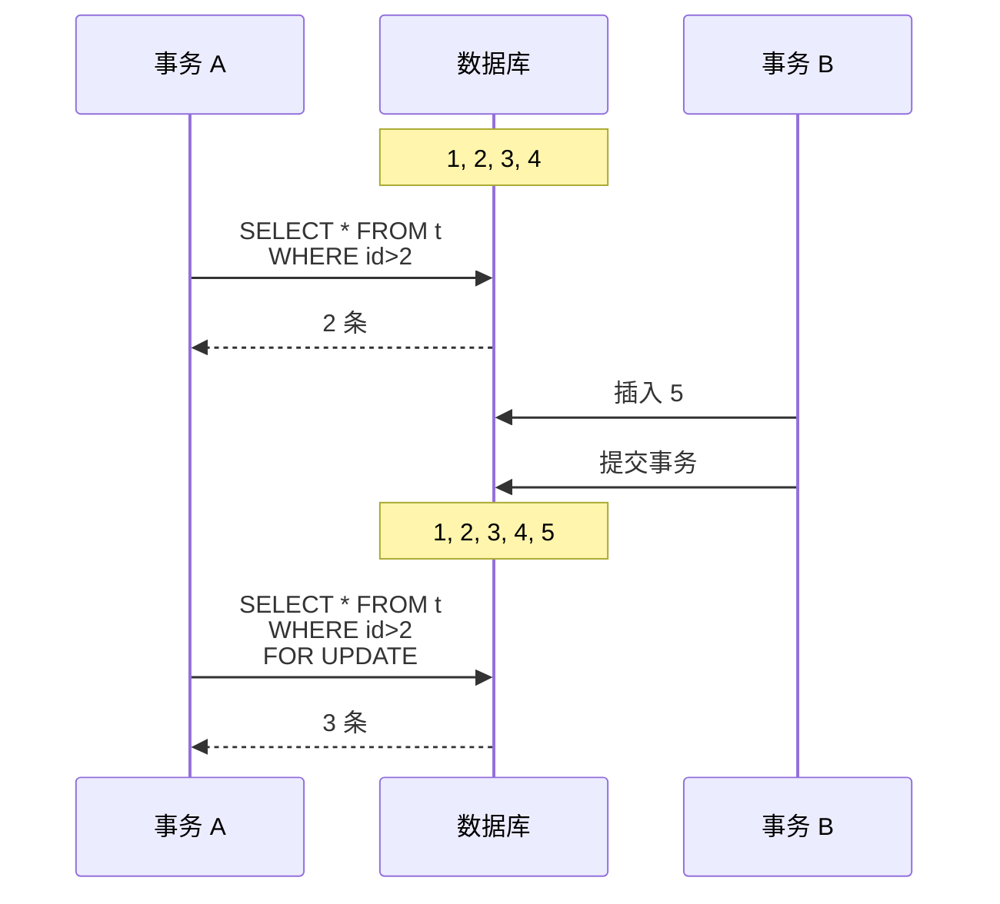

MySQL 是一个 SQL 数据库。

## MySQL 使用基础

### 数据库管理

#### 选择数据库

首先需要登录 MySQL 服务器：

```shell
$ mysql -u root -p
Enter password: ********
```

使用以下命令查看可选数据库：

```sql
SHOW DATABASES;
```

使用以下命令选择并进入数据库：

```sql
USE database_name;
```

进入后，可以使用下面的命令查看当前数据库：

```sql
SELECT DATABASE();
```

当然，也可以在登录时直接选择数据库：

```shell
mysql -u root -D database_name -p 
```

#### 创建数据库

使用以下命令创建数据库：

```sql
CREATE DATABASE database_name;
```

这里有一些可选参数：

```sql
CREATE DATABASE [IF NOT EXISTS] database_name
[CHARACTER SET charset_name]
[COLLATE collation_name];
```

`IF NOT EXISTS` 表示如果数据库已经存在，就不创建。`CHARACTER SET` 和 `COLLATE` 分别表示数据库的字符集和排序规则。

#### 删除数据库

使用以下命令删除数据库：

```sql
DROP DATABASE [IF EXISTS] database_name;
```

在 MySQL 中，`DATABASE` 和 `SCHEMA` 是同义词，可以互换使用。

### 表管理

#### 创建表

使用以下命令创建表：

```sql
CREATE TABLE [IF NOT EXISTS] table_name (
    column1 datatype [constraints],
    column2 datatype [constraints],
    ...
) [table_constraints];
```

这里有几个可选项：

- `table_constraints` 是对表的约束，比如：

  - `ENGINE`：存储引擎

    可以使用下面的命令查看 MySQL 支持的存储引擎：

    ```sql
    SHOW ENGINES;
    ```

    默认情况下，MySQL 使用 `InnoDB` 存储引擎。

  - `CHARSET`：字符集

    可以使用下面的命令查看 MySQL 支持的字符集：

    ```sql
    SHOW CHARACTER SET;
    ```

    常用的包括 `utf8`、`utf8mb4` 等。

  - `COLLATE`：排序规则

    可以使用下面的命令查看 MySQL 支持的排序规则：

    ```sql
    SHOW COLLATION;
    ```

    常用的包括 `utf8_general_ci`、`utf8mb4_general_ci` 等。

- `constraints` 是对列的约束，比如：

  - `NOT NULL`：列不允许为空

  - `UNIQUE`：列的值必须唯一

  - `PRIMARY KEY`：列是主键

    主键需要唯一且非空。如果没有指定主键，`InnoDB` 存储引擎会自动创建一个隐藏的主键。如果需要多个列作为主键，可以使用下面的语法：

    ```sql
    PRIMARY KEY (column1, column2, ...);
    ```

  - `FOREIGN KEY`：列是外键

    外键用于关联两个表。如果一张表中有一个非主键的字段指向另外一张表的主键，那么将该字段称之为外键。外键约束可以保证两个表之间的数据一致性。外键约束可以指定 `ON DELETE` 和 `ON UPDATE` 触发器，比如：

    ```sql
    FOREIGN KEY (column)
        REFERENCES other_table(column)
        ON DELETE CASCADE
        ON UPDATE RESTRICT;
    ```

    `ON DELETE` 和 `ON UPDATE` 可以有以下选项：

    - `RESTRICT`：拒绝删除或者更新父表中的行
    - `CASCADE`：删除或者更新父表中的行，同时删除或者更新子表中的行
    - `SET NULL`：删除或者更新父表中的行，同时将子表中的外键列设为 `NULL`

  - `CHECK`：检查约束

    `CHECK` 约束用于检查列的值是否满足一定的条件。比如：

    ```sql
    CHECK (column > 0);
    ```

  - `DEFAULT`：默认值

  - `AUTO_INCREMENT`：自增

    `AUTO_INCREMENT` 用于自动递增列的值。如果没有指定初始值和步长，那么默认初始值是 1，步长是 1。

`datatype` 是列的数据类型，主要包括：

- 字符串类型：

  | 数据类型                         | 描述                | 最大长度（byte）    |
  | :------------------------------ | :----------------- | :---------------- |
  | `CHAR`                    | 定长字符串           | 255              |
  | `VARCHAR`                 | 变长字符串           | 65535            |
  | `BINARY`                  | 定长二进制字符串      | 255              |
  | `VARBINARY`               | 变长二进制字符串      | 65535            |
  | `TINYBLOB`                      | 非常小的二进制大对象   | 255              |
  | `BLOB`                          | 二进制大对象         | 65535             |
  | `MEDIUMBLOB`                    | 中等大小的二进制大对象 | 16777215         |
  | `LONGBLOB`                      | 大型二进制大对象      | 4294967295       |
  | `TINYTEXT`                      | 非常小的文本字符串    | 255              |
  | `TEXT`                          | 文本字符串           | 65535            |
  | `MEDIUMTEXT`                    | 中等大小的文本字符串   | 16777215         |
  | `LONGTEXT`                      | 大型文本字符串        | 4294967295       |
  | `ENUM('value1', 'value2', ...)` | 枚举类型             | 65535            |
  | `SET('value1', 'value2', ...)`  | 集合类型             | 64               |

- 数值类型：

  | 数据类型     | 描述 | 占据空间（byte） |
  | :---------- | :-- | :------------ |
  | `TINYINT`   | 微整型 | 1             |
  | `SMALLINT`  | 小整型 | 2             |
  | `MEDIUMINT` | 中整型 | 3             |
  | `INT` / `INTEGER`       | 整型   | 4             |
  | `BIGINT`    | 大整型 | 8 |
  | `FLOAT`     | 浮点型 | 4 |
  | `DOUBLE`    | 双精度浮点型 | 8 |
  | `DECIMAL` / `DEC`   | 定点数 | 依赖于精度和小数位数 |
  | `BIT`       | 位类型 | 依赖于位数 |
  | `BOOL` / `BOOLEAN` | 布尔类型 | 1 |

- 日期和时间类型：

  | 数据类型     | 描述 | 格式 |
  | :---------- | :-- | :-- |
  | `DATE`      | 日期 | `YYYY-MM-DD` |
  | `TIME`      | 时间 | `HH:MM:SS` |
  | `DATETIME`  | 日期和时间 | `YYYY-MM-DD HH:MM:SS` |
  | `TIMESTAMP` | 时间戳 | `1970-01-01 00:00:00 UTC` 以来的秒数 |
  | `YEAR`      | 年份 | `YYYY` |

一个完整的例子如下：

```sql
CREATE TABLE IF NOT EXISTS table_name (
    id INT AUTO_INCREMENT,
    name VARCHAR(255) NOT NULL,
    age INT,
    is_student BOOLEAN DEFAULT TRUE,
    PRIMARY KEY (name, age),
    FOREIGN KEY (id)
        REFERENCES other_table(id)
        ON UPDATE RESTRICT
        ON DELETE CASCADE
) ENGINE=InnoDB CHARSET=utf8 COLLATE=utf8_general_ci;
```

### 查询

#### `SELECT FROM`

`SELECT` 语句用于查询数据。`SELECT` 语句的基本语法如下：

```sql
SELECT
    column1,
    column2,
    ...
FROM
    table_name;
```

`SELECT` 语句可以查询表中的所有列，也可以查询表中的指定列。如果要查询表中的所有列，可以使用 `*` 通配符：

```sql
SELECT
    *
FROM
    table_name;
```

#### `SELECT`

`SELECT` 并不一定要查询表中的数据，也可以查询表达式的值。比如，我们可以查询表达式、时间、字符串等。

```sql
SELECT
    1 + 1;

SELECT
    NOW();

SELECT
    CONCAT('Hello', ' ', 'World');
```

`SELECT` 还可以用于给列名或者表达式取别名：

```sql
SELECT
    column1
AS
    alias1;

SELECT
    CONCAT('Hello', ' ', 'World')
AS
    'greeting message';
```

### 排序

#### `ORDER BY`

`ORDER BY` 语句用于对查询结果进行排序。`ORDER BY` 语句的基本语法如下：

```sql
SELECT
    column1,
    column2,
    ...
FROM
    table_name
ORDER BY
    column1 [ASC|DESC],
    column2 [ASC|DESC], ...;
```

`ORDER BY` 语句默认是升序排序，可以省略 `ASC`。如果要降序排序，则需要使用 `DESC`。

在排序中，`NULL` 被认为是最小的值。如果要将 `NULL` 作为最大的，可以使用 `IS NULL` 和 `IS NOT NULL`：

```sql
SELECT
    column1
FROM
    table_name
ORDER BY
    column1 IS NULL,
    column1;
```

#### `FIELD`

`FIELD` 函数用于查找某个字段的值在一个列表中的位置。`FIELD` 函数的基本语法如下：

```sql
SELECT
    FIELD(value, value1, value2, ...);
```

例如：

```sql
SELECT
    FIELD('apple', 'banana', 'apple', 'orange');
+---------------------------------------------+
| FIELD('apple', 'banana', 'apple', 'orange') |
+---------------------------------------------+
|                                           2 |
+---------------------------------------------+
```

这表明 `'apple'` 在列表中的第 2 个位置。

`FIELD` 可被用于排序：

```sql
SELECT
    *
FROM
    table_name
ORDER BY
    FIELD(column1, value1, value2, ...);
```

这会让 `column1` 的值按照 `value1`、`value2` 等的顺序排序。

### 过滤

#### `WHERE`

`WHERE` 语句用于过滤数据。`WHERE` 语句的基本语法如下：

```sql
SELECT
    column1,
    column2,
    ...
FROM
    table_name
WHERE
    condition;
```

`search_condition` 可以是一个表达式，也可以是一个逻辑表达式。逻辑表达式可以使用 `AND`、`OR`、`NOT` 来连接。

`WHERE` 语句可以使用比较运算符、逻辑运算符、`IN`、`BETWEEN`、`LIKE` 等。

`IN` 用于判断某个字段的值是否在一个列表中。`IN` 语句的基本语法如下：

```sql
SELECT
    column1,
    column2,
    ...
FROM
    table_name
WHERE
    column1 IN (value1, value2, ...);
```

`BETWEEN` 用于判断某个字段的值是否在一个范围内。`BETWEEN` 语句的基本语法如下：

```sql
SELECT
    column1,
    column2,
    ...
FROM
    table_name
WHERE
    column1 BETWEEN value1 AND value2;
```

`LIKE` 用于判断某个字段的值是否匹配一个模式。`LIKE` 语句的基本语法如下：

```sql
SELECT
    column1,
    column2,
    ...
FROM
    table_name
WHERE
    column1 LIKE pattern;
```

`pattern` 可以使用 `%` 通配符来匹配任意字符，`_` 通配符来匹配一个字符。

`LIMIT` 用于限制查询结果的数量。`LIMIT` 语句的基本语法如下：

```sql
SELECT
    column1,
    column2,
    ...
FROM
    table_name
LIMIT
    [offset,] row_count;
```

`LIMIT` 语句可以有一个或者两个参数。如果有一个参数，那么这个参数表示返回的行数；如果有两个参数，那么第一个参数表示偏移量，第二个参数表示返回的行数。

例如，如果 `LIMIT 5`，那么返回的行数是 5；如果 `LIMIT 5, 10`，那么返回的行数是 10，从第 6 行开始。

#### `SELECT DISTINCT`

`SELECT DISTINCT` 用于返回唯一不同的值。`SELECT DISTINCT` 语句的基本语法如下：

```sql
SELECT DISTINCT
    column1,
    column2,
    ...
FROM
    table_name;
```

它的作用相当于给查询结果去重。

### 连接

#### `JOIN`

`JOIN` 用于连接两个或者多个表。`JOIN` 语句的基本语法如下：

```sql
SELECT
    column1,
    column2,
    ...
FROM
    table1
JOIN table2 ON
    join_condition;
```

这里的 `join_condition` 是连接条件，通常会类似 `table1.column = table2.column`。

如果使用了相同的列名，那么可以简写为：

```sql
SELECT
    column1,
    column2,
    ...
FROM
    table1
JOIN table2 USING (column);
```

`JOIN` 有多种类型：

- `INNER JOIN`：返回两个表中的交集，即两个表中都有的数据。

  默认情况下，`JOIN` 就是 `INNER JOIN`。

- `LEFT JOIN`：返回左表中的所有数据，以及右表中的交集，即左表中的数据都会返回，右表中的数据只有左表中有的才会返回，否则返回 `NULL`。

  我们可以使用 `IS NULL` 来判断右表中的数据是否存在，这样求出在左表中有而在右表中没有的数据：

  ```sql
  SELECT
      column1,
      column2,
      ...
  FROM
      table1
  LEFT JOIN table2 ON
      table1.column = table2.column
  WHERE
      table2.column IS NULL;
  ```

- `RIGHT JOIN`：返回右表中的所有数据，以及左表中的交集，即右表中的数据都会返回，左表中的数据只有右表中有的才会返回，否则返回 `NULL`。

  我们同样可以使用 `IS NULL` 来判断左表中的数据是否存在，求出在右表中有而在左表中没有的数据。

- `CROSS JOIN`：返回两个表的笛卡尔积。

  这种情况下，两个表中的每一行都会和另一个表中的每一行组合，返回的结果是两个表的行数的乘积。它没有 `ON` 子句。

- SELF JOIN：自连接。
  
  自连接没有专门的关键字，需要使用上述的 `LEFT JOIN`、`RIGHT JOIN`、`INNER JOIN` 等。自连接时，需要给表取别名以区分。

### 聚合

#### `GROUP BY`

`GROUP BY` 用于对查询结果进行分组。`GROUP BY` 语句的基本语法如下：

```sql
SELECT
    column1,
    column2,
    aggregate_function(column3),
    ...
FROM
    table_name
GROUP BY
    column1,
    column2,
    ...;
```

`GROUP BY` 可以实现类似 `SELECT DISTINCT` 的功能：

```sql
SELECT
    column1
FROM
    table_name
GROUP BY
    column1;
```

`GROUP BY` 也可以和聚合函数 `COUNT`、`SUM`、`AVG`、`MAX`、`MIN` 等一起使用。

```sql
SELECT
    column1,
    COUNT(*)
FROM
    table_name
GROUP BY
    column1;
```

这会返回 `column1` 的值以及每个值出现的次数。

我们可以使用 `HAVING` 子句来过滤分组后的结果：

```sql
SELECT
    column1,
    COUNT(*)
FROM
    table_name
GROUP BY
    column1
HAVING
    COUNT(*) > 5;
```

需要注意，`HAVING` 会在 `SELECT` 之前执行，因此不能使用 `SELECT` 中的别名。

值得注意的是，从 MySQL 8.0 开始，`GROUP BY` 不再默认排序。

#### `ROLLUP`

`ROLLUP` 是 `GROUP BY` 的扩展，用于生成多维的汇总数据。给定需要汇总的列，`ROLLUP` 会生成这些列中所有可能的子列的汇总数据。`ROLLUP` 语句的基本语法如下：

```sql
SELECT
    column1,
    column2,
    COUNT(*)
FROM
    table_name
GROUP BY
    column1,
    column2
WITH ROLLUP;
```

### 集合

#### `UNION`

`UNION` 用于合并两个或者多个查询的结果集。`UNION` 语句的基本语法如下：

```sql
SELECT
    column1,
    column2,
    ...
FROM
    table1
UNION [DISTINCT | ALL]
SELECT
    column1,
    column2,
    ...
FROM
    table2;
```

`UNION` 默认会去重，如果不想去重，可以使用 `ALL`。

和 `JOIN` 相比，`UNION` 会将内容纵向合并，而 `JOIN` 会将内容横向合并。

需要注意的是，`UNION` 合并的两个查询的列数和列类型必须一致。

#### `EXCEPT`

`EXCEPT` 在 MySQL 8.0 中正式被支持。`EXCEPT` 用于返回在第一个查询中有而在第二个查询中没有的数据。`EXCEPT` 语句的基本语法如下：

```sql
SELECT
    column1,
    column2,
    ...
FROM
    table1
EXCEPT [ALL | DISTINCT]
SELECT
    column1,
    column2,
    ...
FROM
    table2;
```

`EXCEPT` 默认会去重，如果不想去重，可以使用 `ALL`。

#### `INTERSECT`

`INTERSECT` 在 MySQL 8.0 中正式被支持。`INTERSECT` 用于返回在两个查询中都有的数据。`INTERSECT` 语句的基本语法如下：

```sql
SELECT
    column1,
    column2,
    ...
FROM
    table1
INTERSECT [ALL | DISTINCT]
SELECT
    column1,
    column2,
    ...
FROM
    table2;
```

`INTERSECT` 默认会去重，如果不想去重，可以使用 `ALL`。

## 存储格式

MySQL 有多种存储引擎，每种存储引擎都有自己的存储格式。存储引擎是 MySQL 的一个组件，负责存储数据。MySQL 5.5 之前，MySQL 默认的存储引擎是 `MyISAM`，而 MySQL 5.5 之后，MySQL 默认的存储引擎是 `InnoDB`。下文将以 `InnoDB` 为例。

我们可以查看 MySQL 的数据库文件存储位置：

```sql
mysql> SELECT @@global.datadir;
+--------------------------+
| @@global.datadir         |
+--------------------------+
| ...path_to_storage/Data/ |
+--------------------------+
```

我们创建的每一个数据库都会在 `datadir` 目录下创建一个文件夹，文件夹的名字就是数据库的名字：

```shell
$ cd world
$ ls
Mode   Length Name
----   ------ ----
-a---  835584 city.ibd
-a---  196608 country.ibd
-a---  245760 countrylanguage.ibd
```

在 MySQL 8.0 之前，每一个表都会有一个 `.frm` 文件和一个 `.ibd` 文件。`.frm` 文件存储了表的元数据，比如表的结构、字段类型等。`.ibd` 文件存储了表的数据。此外，还有一个 `db.opt` 文件，存储了数据库的元数据，比如数据库的字符集、排序规则等。

然而，MySQL 8.0 之后，`.frm` 文件被移除了，表的元数据被作为 `SDI`（System Data Interface）存储在 `.ibd` 文件中。我们可以使用 `ibd2sdi` 工具来查看 `SDI` 文件：

```shell
ibd2sdi city.ibd > city.json
```

你会看到 `city.json` 文件中存储了表的元数据。

现在，我们抛开 `SDI` 不谈，只来看看表的数据是如何存储的。

### 行格式

`InnoDB` 存储引擎最基本的单元是行，也就是一条记录。`InnoDB` 存储引擎有四种行格式：

- `Redundant`：这是最早的行格式，不支持行压缩。用于 MySQL 5.0 之前。
- `Compact`：这是默认的行格式，支持行压缩。用于 MySQL 5.7 之前。
- `Dynamic`：这是支持动态行格式，支持行压缩。MySQL 5.7 之后默认使用这个行格式。
- `Compressed`：这是支持压缩行格式，支持行压缩。

我们可以查看表的行格式：

```sql
mysql> SHOW TABLE STATUS LIKE 'city';
+----+------+-------+----------+---+
|Name|Engine|Version|Row_format|...|
+----+------+-------+----------+---+
|city|InnoDB|     10|Dynamic   |...|
+----+------+-------+----------+---+
```

#### `Compact`

`Compact` 行格式的数据存储结构如下：

| 名称                | 大小     |
| :----------------- | :------- |
| Variable Field Lengths | 每个变长字段 1-2 bytes |
| Nullable Field Bitmap | 每个 `NULL` 字段 1 bit |
| Info Flags         | 4 bits   |
| `n_owned` | 4 bits   |
| `heap_no`              | 13 bits  |
| `record_type`        | 3 bits   |
| `next_record` | 2 bits   |
| Row ID             | 6 bytes  |
| Transaction ID     | 6 bytes  |
| Roll Pointer       | 7 bytes  |
| Data               |          |

##### Variable Field Lengths

Variable Field Lengths 存储了每个变长字段（`VARCHAR`、`TEXT` 等）的长度。每个变长字段的长度占用 1-2 个字节。

在该列表中，各个变长字段的长度是按照**逆序存储**，即最后一个变长字段的长度放在最前面，第一个变长字段的长度放在最后面。这样做的好处是使得位置靠前的记录的真实数据和数据对应的字段长度信息可以同时在一个 CPU Cache Line 中，提高了命中率。

值得注意的是

- 如果某个字段是变长的，但记录中的该字段为 `NULL`，那么它并不会保存在 Variable Field Lengths 中
- 如果一个变长字段也没有，那么 Variable Field Lengths 也不会存在。

##### Nullable Field Bitmap

Nullable Field Bitmap 存储了哪些字段的值为 `NULL`。该列表使用二进制位来表示字段是否为 `NULL`，每个字段占用一个二进制位。如果某个字段的值为 `NULL`，则对应的二进制位为 `1`，否则为 `0`。

同样的，各个字段的 `NULL` 值信息是按照逆序存储的，即最后一个字段的 `NULL` 值信息放在最前面，第一个字段的 `NULL` 值信息放在最后面。

最后，Nullable Field Bitmap 还会在高位补 `0` 填充到一个字节的整数倍。如果表中所有字段都不为 `NULL`，那么 Nullable Field Bitmap 也不会存在。

##### Fixed Field Data

Fixed Field Data 存储了记录的一些元数据，比如记录的长度、记录的格式等。其占据了 5 个字节。

- Info Flags：占据 4 个 bit，用于存储记录的格式信息。目前有两位被使用，分别是：

  - `min_rec_mask (1)`：表示此记录是 B+Tree 非叶级中的最小记录
  - `deleted_mask (2)`：表示此记录已标记为删除

- `n_owned`：占据 4 个 bit，用于存储一个分组中记录的个数

- `heap_no`：占据 13 个 bit，表示记录在页中的位置。堆中的最小记录始终为 0，最大记录为 1，用户插入的记录从 2 开始递增

- `record_type`：占据 3 个 bit，用于存储记录的类型。一共有 4 种类型：

  - `conventional (0)`：表示普通记录
  - `node pointer (1)`：表示 B+ 树非叶子节点的记录
  - `infimum (2)`：表示 B+ 树叶子节点的最小记录
  - `supremum (3)`：表示 B+ 树叶子节点的最大记录

- `next_record`：占据 2 个 bit，按键升序排列时，用于存储当前记录到页面内下一记录原点的相对偏移量

##### Row ID

Row ID 是一个 6 字节的字段，用于存储记录的 ID。Row ID 是一个递增的数字，每次插入一条记录，Row ID 会递增 1。

如果在建表时指定了主键或者唯一索引，那么 Row ID 就不存在。

##### Transaction ID

Transaction ID 是一个 6 字节的字段，用于存储事务的 ID，表明记录是由哪个事务插入的。这个字段在 `InnoDB` 中用于 MVCC（多版本并发控制），我们[后文](#read-view)会具体讲到。

##### Roll Pointer

Roll Pointer 是一个 7 字节的字段，用于存储回滚指针。回滚指针是一个指向回滚段的指针，用于回滚记录。

#### `Dynamic` 和 `Compressed`

这两者和 `Compact` 的最主要的区别在于对于溢出字段的处理。

一个页的默认大小是 16KB，如果一条记录的长度超过了 16KB，是无法被成功插入的。但是，对于 `TEXT`、`BLOB` 等字段，其长度很大可能会超过 16KB。对于这种字段，`Compact` 格式会存储部分数据在行中，然后接上一个指针指向溢出页。

相比之下，`Dynamic` 和 `Compressed` 格式会将整个字段存储在溢出页中，这一方法减小了行的长度，提高了查询效率，适合存储大字段，但是也会增加 I/O 次数。

`Dynamic` 和 `Compressed` 的区别在于压缩。`Compressed` 行格式会使用压缩算法对数据进行压缩，以减小存储空间。这一方法能够减小存储空间，但是会增加 CPU 的计算开销，影响性能。

### 表结构

上文我们已经介绍了表的行格式，现在我们来看看如何将这些行聚合在一起。

#### 页

为了减少 I/O 次数，`InnoDB` 的读写均以页为单位。每个页的默认大小是 16KB，可以通过 `innodb_page_size` 参数来设置：

```sql
mysql> SELECT @@global.innodb_page_size;
+---------------------------+
| @@global.innodb_page_size |
+---------------------------+
|                     16384 |
+---------------------------+
```

一个数据页的结构如下：

| 名称                | 大小     | 描述                  |
| :----------------- | :------- | :------------------- |
| File Header        | 38 bytes | 文件头                |
| Page Header        | 56 bytes | 页头                  |
| Infimum + Supremum | 26 bytes | 页中的最小记录和最大记录 |
| User Records       |          | 行记录                |
| Free Space         |          | 空闲空间              |
| Page Directory     |          | 记录索引              |
| File Trailer       | 8 bytes  | 校验和                |

- File Header：文件头。其中包含了两个指针，分别指向页的上一个页和下一个页，使得多个页构成了一个**双向链表**
- Page Header：其存储了页的状态信息，比如页的类型、页的大小、页的 ID 等
- Infimum + Supremum：其存储了页中的最小记录和最大记录。Infimum 记录的主键值是最小的，Supremum 记录的主键值是最大的
- User Records：其存储了页中的行记录
- Free Space：其存储了页中的还未使用的空间
- Page Directory：其存储了页中的记录索引
- File Trailer：其存储了页的校验和

在行记录部分，数据按照主键顺序存储，其访问类似于单向链表。每条行记录的 `next_record` 字段指向下一条记录的实际数据开始位置。

为了加速遍历，`InnoDB` 使用了页目录。页目录将页内数据分为多组。每个分组在页目录内有一个槽，该槽使用指针指向每组的**最后一个记录**。这样，当要查找某个主键时，可以通过二分法先快速找到主键所在的组的前一个组的最后一条记录，然后再线性查找主键。

- 第一个分组中只有一个记录，称为 `infimum`
- 最后一个分组有 1-8 个记录，其中最后一个记录称为 `supremum`
- 其余分组中有 4-8 个记录


其插入方法如下：

- 初始情况下，数据页有两个分组，第一个分组中是 `infimum`，第二个分组中是 `supremum`
- 当插入记录所，会找到主键值比当前记录大的第一个分组，然后将其最后一条记录的 `n_owned` 加 1，最后将其插入到该分组中
- 如果一个分组已经有了 8 条记录，那么在插入时会将其分裂为两个分组，一个分组中有 4 条记录，另一个分组中有 5 条记录。页目录会新增一个槽指向新分组的最后一条记录

#### 区

上面讲到，不同的页通过双向链表连接在一起。然而，双向链表的各项在物理上并不是连续的，在遍历时会产生大量的随机 I/O。为了解决这个问题，`InnoDB` 引入了区的概念以快速定位页。

区是页的集合，每个区的大小为 1MB，包含 64 个页。

区的结构为一个 [B+ 树](https://blog.ch3nyang.top/post/搜索树/#b-树-1)。这棵树的每个节点都是页：

- 叶子节点中的所有记录都是数据
- 非叶子节点中的所有记录都是索引，每条记录指向一个页

所有叶子节点构成了一个双向链表，这样可以很方便地完成范围查询。


但是，如果一棵 B+ 树里的页过多，已经超出了 64 个，就会对其进行切割存储。按照每 64 个逻辑上连续的页为一个区，使得链表上相邻的页在物理上页连续。

区使用的 B+ 树根据索引类型的不同可分为两种（这在索引一章会更具体地讲到）：

- 聚簇索引：叶子节点存放了数据
- 二级索引：叶子节点存放了主键值

> `MyISAM` 存储引擎没有聚簇索引，也就是说，它的叶子节点只会存放索引值。

表一定有一个聚簇索引。如果该表有主键，则主键就是聚簇索引的索引键。如果没有主键，则 `InnoDB` 会选择一个唯一非空列作为聚簇索引的索引键。如果表没有唯一非空列，`InnoDB` 会生成一个隐藏的自增 ID 作为聚簇索引的索引键。

二级索引也是 B+ 树，其叶子节点存放了主键值，而索引键则是二级索引。这样，当我们使用二级索引查询时，`InnoDB` 会先根据二级索引在二级索引中找到主键值，然后再根据主键值在聚簇索引中找到数据。这一过程被称为**回表**。当然，如果需要的查询结果正是主键的值，那么就不需要回表，这种查询被称为**覆盖索引**。

#### 段

以上所述的多个区构成了一个段。

- B+ 树叶子节点页的区构成的段被称为数据段
- B+ 树非叶子节点页的区构成的段被称为索引段
- 回滚段：用于存储事务的回滚信息，我们[后文](#undo-log)会讲到
- 此外还有临时段等

## 执行流程

当我们向 MySQL 发送 SQL 语句时，MySQL 的执行流程如下图所示：


### 客户端发送语句

用户要想使用 MySQL，首先要连接到 MySQL 服务器。

```shell
$ mysql -u root -p
Enter password: ********
```

这个连接是通过 TCP/IP 协议来实现的。MySQL 服务器监听一个端口，通常是 **`3306`**。当用户连接到 MySQL 服务器时，MySQL 服务器会为用户创建一个线程。这个线程会处理用户发送的 SQL 语句。

MySQL 的不同用户可以有不同的权限。MySQL 会在执行 SQL 语句之前，根据用户的权限来决定用户是否有权执行。这一权限在连接时就会被确定，即便之后管理员修改了用户的权限，也不会对当前的连接产生影响。

用户的连接情况可以使用 `SHOW PROCESSLIST` 来查看。如果用户在连接后发送了 SQL 语句，那么这个连接会被标记为 `Query` 状态。相反，如果一个用户连接后从没发送过 SQL 语句，那么这个连接会被标记为 `Sleep` 状态。

```sql
mysql> SHOW PROCESSLIST;
+----+----------+---------+------+-------+------------------+
| Id | User     | Command | Time | State | Info             |
+----+----------+---------+------+-------+------------------+
| 15 | root     | Query   |    0 | init  | SHOW PROCESSLIST |
| 16 | ch3nyang | Sleep   |   60 |       | NULL             |
+----+----------+---------+------+-------+------------------+
```

可以看到，`root` 用户正在执行 `SHOW PROCESSLIST` 语句，而 `ch3nyang` 用户正在 `Sleep` 状态，已经有 60 秒了。

MySQL 定义了最大的 `Sleep` 时常，由 `wait_timeout` 参数控制。如果一个连接在 `wait_timeout` 时间内没有发送 SQL 语句，那么这个连接会被 MySQL 服务器断开。`wait_timeout` 默认是 28800 秒，即 8 小时。

```sql
mysql> SELECT @@global.wait_timeout;
+-----------------------+
| @@global.wait_timeout |
+-----------------------+
|                 28800 |
+-----------------------+
```

我们可以手动设置 `wait_timeout` 参数：

```sql
mysql> SET GLOBAL wait_timeout=28800;
```

对于长时间不使用的连接，我们也可以使用 `KILL` 命令来手动断开：

```sql
mysql> KILL 16;
```

MySQL 对最大连接数也有限制，由 `max_connections` 参数控制。如果 MySQL 服务器的连接数达到了 `max_connections`，那么新的连接会被拒绝。

```sql
mysql> SELECT @@global.max_connections;
+--------------------------+
| @@global.max_connections |
+--------------------------+
|                      151 |
+--------------------------+
```

客户端和服务器之间的 TCP/IP 连接分为长连接和短连接。MySQL 默认使用长连接，其可以减少连接的建立和断开的开销，但是会占用服务器的资源。为了单个长连接避免占用内存过多，可以使用 `mysql_reset_connection()` 来重置连接。如果你是在命令行中，只需断开再重新连接即可。

### 查询缓存

这一步在 MySQL 8.0 版本中已经被移除。

在这之前，MySQL 会检查查询缓存，看看是否有相同的 `SELECT` 语句已经被执行过。如果有，MySQL 会直接返回查询缓存中的结果，而不会再执行一次查询。

然而，只要一个表发生了变化，这个表上的所有查询缓存都会被清空。因此，当更新较为频繁时，查询缓存大概率不会命中。这使得查询缓存只对读多写少的场景有用，对于高并发场景，查询缓存会导致性能下降，这也是为什么 MySQL 8.0 移除了查询缓存。

### 解析器

这一步 MySQL 会对 SQL 语句进行解析，检查 SQL 语句是否符合 MySQL 的语法规范。如果 SQL 语句不符合规范，MySQL 会返回一个错误。

其基本就是编译原理里的一些东西，比如词法分析、语法分析等。此处不再赘述。

### 执行查询

#### 预处理器

预处理器会对 SQL 语句进行一些处理，比如检查表名和列名是否存在，检查用户是否有权限等，同时还会对 SQL 语句进行一些处理，比如将 `SELECT *` 扩展为 `SELECT column1, column2, ...`。

#### 优化器

紧接着，MySQL 会调用优化器来生成一个执行计划。优化器会生成多个执行计划，然后选择成本最低的执行计划。例如，如果一个查询有多个索引可以使用，那么优化器会选择成本最低的索引。

为了查看 MySQL 生成的执行计划，我们可以在 SQL 语句前加上 `EXPLAIN` 关键字：

```sql
mysql> EXPLAIN SELECT * FROM city WHERE id = 1899;
+--+---+-----+-------------+-------+---+
|id|...|type |possible_keys|key    |...|
+--+---+-----+-------------+-------+---+
| 1|...|const|PRIMARY      |PRIMARY|...|
+--+---+-----+-------------+-------+---+
```

可以看到，MySQL 会返回一个表格，其中包含了查询的执行计划。这个表格的列的含义如下：

- `id`：查询中的每个查询块都有一个唯一的标识符。
- `select_type`：查询块的类型，比如 `SIMPLE`、`PRIMARY`、`SUBQUERY` 等。
- `table`：查询块中的表名。
- `type`：MySQL 在表中查找行的方式，比如 `const`、`eq_ref`、`ref`、`range`、`index`、`ALL` 等。
- `possible_keys`：可能使用的索引。
- `key`：实际使用的索引。
- `key_len`：索引的长度。
- `ref`：比较的列。
- `rows`：MySQL 估计要检查的行数。
- `Extra`：额外的信息。

如果查询需要全表扫描，那么 `type` 会是 `ALL`，`key` 会是 `NULL`：

```sql
mysql> EXPLAIN SELECT * FROM city WHERE name Like '%nanjing%';
+--+-----------+---+-----+-------------+---+---+
|id|select_type|...|type |possible_keys|key|...|
+--+-----------+---+-----+-------------+---+---+
| 1|SIMPLE     |...|ALL  |NULL         |NULL|...|
+--+-----------+---+-----+-------------+---+---+
```

我们可以再建立一个二级索引，然后再查看执行计划：

```sql
mysql> CREATE INDEX idx_population ON city(population);
mysql> EXPLAIN SELECT * FROM city WHERE id > 1 AND population > 10000000;
+--+---+-----+----------------------+--------------+---+
|id|...|type |possible_keys         |key           |...|
+--+---+-----+----------------------+--------------+---+
| 1|...|range|PRIMARY,idx_population|idx_population|...|
+--+---+-----+----------------------+--------------+---+
```

这里，我们看到有 `PRIMARY` 和 `idx_population` 两个索引可以使用，MySQL 选择了 `idx_population` 索引，且 `type` 是 `range`。

#### 执行器

接下来，执行计划会被交由执行器执行。执行器会调用存储引擎的接口来执行查询。存储引擎会返回查询的结果给执行器，然后执行器会将结果返回给客户端。在这个过程中需要注意的是，每当存储引擎匹配到一个键值后就会立即发给执行器，执行器也会根据过滤条件过滤后立即发回客户端，然后再向存储引擎发送指令让其继续搜索，直到全部搜索完。

这个过程包含了三种情况：

- 如果 `key` 是 `PRIMARY`，那么存储引擎会直接通过聚簇索引来查找数据。存储引擎根据主键找到数据并返回给执行器，执行器根据条件过滤数据后发回给客户端。

- 如果 `key` 是 `NULL`，那么存储引擎会通过全表扫描来查找数据。存储引擎会遍历整个表，逐一判断每一行是否符合条件。每当找到一行符合条件，就会立即将这一行发回给执行器。当搜索到表的末尾，或者找到了 `limit` 条记录，就会结束查询。

- 如果 `key` 是二级索引，那么存储引擎会执行回表操作。存储引擎首先根据二级索引找到主键，然后再根据主键找到数据。

对于联合索引的情况，从 MySQL 5.6 开始，引入了索引下推优化。在没有索引下推优化时，对于查询联合索引中的键但联合索引失效的情况，存储引擎会把失效键的过滤工作交给执行器去完成。而当使用了索引下推优化后，则成了存储引擎的工作，这有效减少了回表的次数，优化了性能。我们[后文](#索引)会详细解释这一点。

## 事务

事务是数据库操作的基本单元。事务具有四个特性，即 `ACID`：

- **Atomicity（原子性）**：事务是一个不可分割的工作单位，要么全部执行，要么全部不执行。

  比如，银行转账，从一个账户扣钱，然后给另一个账户加钱。这两个操作要么同时成功，要么同时失败。

- **Consistency（一致性）**：事务执行前后，数据库的完整性约束没有被破坏。

  比如，转账前后，两个账户的总金额应该是不变的。

- **Isolation（隔离性）**：事务之间是相互隔离的，一个事务的执行不会影响其他事务。

  比如，两个人向同一个账户转账，这两个人的转账操作应该是相互独立的，不会相互影响。

- **Durability（持久性）**：事务一旦提交，其结果就是永久性的。

  比如，一旦转账成功，那么这笔转账就是永久性的。即便数据库发生了故障，这笔转账也不会丢失。

### 事务隔离

事务并行时，可能存在三个问题：

- **脏读**：一个事务读取到了另一个事务未提交的数据。

  <div hidden>

  ```mermaid
  sequenceDiagram
    participant A as 事务 A
    participant D as 数据库
    participant B as 事务 B
    Note over D: x=100
    A->>D: 读取
    D-->>A: 100
    A->>D: 设置为 200
    Note over D: x=200
    B->>D: 读取
    D-->>B: 200
    A->>D: 回滚
    Note over D: x=100
  ```

  </div>

  

  这里，事务 B 读取到了事务 A 未提交的数据。假如事务 A 回滚，那么事务 B 读取到的数据就是脏数据。

- **不可重复读**：一个事务读取到了另一个事务修改过的数据，导致两次读取的数据不一致。

  <div hidden>

  ```mermaid
  sequenceDiagram
    participant A as 事务 A
    participant D as 数据库
    participant B as 事务 B
    Note over D: x=100
    A->>D: 读取
    D-->>A: 100
    B->>D: 设置为 200
    B->>D: 提交事务
    Note over D: x=200
    A->>D: 读取
    D-->>A: 200
  ```

  </div>

  

  这里，事务 A 两次读取到的数据不一致。第一次读取到 100，第二次读取到事务 B 修改后的 200。

- **幻读**：一个事务读取到了另一个事务插入的数据，导致两次读取的数据数量不一致。

  <div hidden>

  ```mermaid
  sequenceDiagram
    participant A as 事务 A
    participant D as 数据库
    participant B as 事务 B
    Note over D: 1, 2, 3, 4
    A->>D: > 2 的数据
    D-->>A: 2 条
    B->>D: 插入 5
    B->>D: 提交事务
    Note over D: 1, 2, 3, 4, 5
    A->>D: > 2 的数据
    D-->>A: 3 条
  ```

  </div>

  

  这里，事务 A 两次读取到的数据数量不一致。第一次读取到 2 条数据，第二次读取到 3 条数据。

这三个问题是由事务并行执行导致的。其中，脏读是最严重的问题，不可重复读次之，幻读最轻。

为了解决这三个问题的重要性，SQL 标准定义了四种事务隔离级别：

- **Read Uncommitted（读未提交）**：最低的隔离级别。事务可以读取到其他事务未提交的数据。这种隔离级别会导致脏读、不可重复读、幻读
- **Read Committed（读已提交）**：事务只能读取到其他事务已提交的数据。这种隔离级别会导致不可重复读、幻读
- **Repeatable Read（可重复读）**：事务在执行期间，可以多次读取同一行数据，这些数据是一致的。这种隔离级别会导致幻读
- **Serializable（串行化）**：最高的隔离级别。事务串行执行，不会出现任何问题

不同的数据库引擎对这四种隔离级别的支持不同。例如 `InnoDB` 支持前三种隔离级别，对于第四种，`InnoDB` 的可重复读能很大程度上解决幻读问题。

对于 `InnoDB`，这四种隔离级别的实现方式分别为：

- 读未提交：直接修改即可，无需额外操作
- 读已提交：在每个语句执行前重新生成 Read View
- 可重复读：在每个事务启动时（即开启事务并执行语句时）生成 Read View
- 串行化：加读写锁

### Read View

Read View 就是快照。其包含了四个部分：

- `creator_trx_id`：创建这个 Read View 的事务 ID
- `m_ids`：一个列表，包含了在创建 Read View 时，活跃事务（启动了但还没提交的事务）的 ID
- `min_trx_id`：在创建 Read View 时，活跃事务的最小 ID
- `max_trx_id`：在创建 Read View 时，应该给下一个事务分配的 ID 值

我们[之前](#行格式)讲到，在记录中有两个列：

- `trx_id` 表示最后改动这条记录的事务 ID
- `roll_pointer`：指向 undo log。undo log 会在[后文](#undo-log)中讲到

在事务访问记录时，满足：

- 如果该记录的 `trx_id` $$<$$ `min_trx_id`，即该记录在 Read View 创建前已经提交，则对当前事务可见
- 如果 `min_trx_id` $$\leq$$ `trx_id` $$<$$ `max_trx_id`，则需要判断 `trx_id` 是否在 `m_ids` 列表中
  - 如果在 `m_ids` 列表中，表示该记录在 Read View 创建时还未提交，则对当前事务不可见
  - 如果不在 `m_ids` 列表中，表示该记录在 Read View 创建时已经提交，则对当前事务可见
- 如果该记录的 `trx_id` $$\geq$$ `max_trx_id`，即该记录在 Read View 创建后才改动，则对当前事务不可见

总之，就是利用事务 ID 来判断记录是否是在当前 Read View 创建前就已经提交。

对于可重复读，在每个事务启动时生成 Read View，这样事务就只能读到自己启动前就提交了的内容；对于读已提交，在每个语句执行前重新生成 Read View，这样语句就只能读到自己执行前就提交了的内容。

如果发现一条记录应当对当前事务不可见，那么就应该通过 `roll_pointer` 查找 undo log 中记录的该记录的上一个版本；如果上一个版本依然不可见，就继续通过 `roll_pointer` 查找再上一个版本，以此类推。


### 幻读

InnoDB 在不串行的情况下，能够很大程度上避免幻读。

- 对于快照读，即普通 `SELECT` 语句，通过 MVCC 的方式避免幻读。

  它会在事务开始后就创建一个 Read View，这样，即便其它事务插入了记录，也会对当前事务不可见。

- 对于当前读，即 `SELECT FOR UPDATE` 等语句，通过记录所和间隙锁的方式避免幻读。

  它会把要读或写的区间给锁住，让其它事务无法对其写入。这个锁我们会在[后面的章节](#行级锁)讲到。

但这也只是“很大程度”避免，幻读还是会存在的。例如：

<div hidden>


</div>


这表明，MVCC 并不能避免快照读中的幻读。

还有一种情况是：

<div hidden>



</div>


这表明，间隙锁也不能完全避免当前读中的幻读。在开启事务后，应当尽早执行当前读语句，以添加[间隙锁](#间隙锁)。

## 索引

### 索引分类

#### 按物理存储分类

按物理存储分类，常见的索引有聚簇索引、二级索引等。

- **聚簇索引**的 B+ 树的叶子节点存储的是整行数据。聚簇索引的叶子节点是数据页，而非叶子节点是索引页。

- **二级索引**的 B+ 树的叶子节点存储的是主键值。二级索引的叶子节点和非叶子节点也是索引页。

  - 如果使用二级索引查询，但查询的值是二级索引或主键，那就直接返回，这被称为**覆盖索引**
  - 否则，那么就会发生**回表**操作，即根据二级索引找到主键，然后再根据主键找到数据

#### 按数据结构分类

按数据结构分类，常见的索引有 B+ 树索引、哈希索引、全文索引等。

| 索引类型 | InnoDB | MyISAM | Memory |
| ------ | ---- | ---- | ----- |
| B+ 树索引 | 支持 | 支持 | 支持 |
| 哈希索引 | 不支持 | 不支持 | 支持 |
| 全文索引 | 支持 | 支持 | 不支持 |

- **全文索引**会对文本内容进行分词，分词后会建立一个倒排索引。详见[Elastic Stack](https://blog.ch3nyang.top/post/elastic/)一文
- **哈希索引**会对键值进行哈希计算，哈希计算后会建立一个哈希表。哈希索引的查询效率很高，但是不支持范围查询
- **B+ 树索引**支持范围查询，且支持模糊查询

默认情况下，会使用 InnoDB 的 B+ 树索引。

建表时：

- 如果有主键，使用主键作为聚簇索引的索引键
- 如果没有主键，使用第一个唯一非空列作为聚簇索引的索引键
- 如果都没有，使用隐藏的自增 ID 作为聚簇索引的索引键

#### 按字段特性分类

按字段特性分类，常见的索引有主键索引、唯一索引、普通索引、前缀索引等。

- **主键索引**：主键索引是一种唯一索引，不允许有重复的值或者空值。主键索引的叶子节点存储的是整行数据。

  使用如下语句创建主键索引：

  ```sql
  CREATE TABLE city (
      id INT UNIQUE NOT NULL,
      name VARCHAR(50),
      PRIMARY KEY (id)
  );
  ```

- **唯一索引**：唯一索引是一种唯一索引，不允许有重复的值，但允许有空值。唯一索引的叶子节点存储的是整行数据。

  使用如下语句创建唯一索引：

  ```sql
  CREATE TABLE city (
      id INT,
      name VARCHAR(50) UNIQUE,
      UNIQUE KEY (name)
  );
  ```

- **普通索引**：普通索引是一种最普通的索引，允许有重复的值和空值。普通索引的叶子节点存储的是主键值。

  使用如下语句创建普通索引：

  ```sql
  CREATE TABLE city (
      id INT,
      name VARCHAR(50),
      INDEX (name)
  );
  ```

- **前缀索引**：前缀索引是一种普通索引，只索引列的前缀。前缀索引可以减少索引的存储空间，提高查询效率。

  使用如下语句创建前缀索引：

  ```sql
  CREATE TABLE city (
      id INT,
      name VARCHAR(50),
      INDEX (name(10))
  );
  ```

  这会创建一个只索引 `name` 的前 10 个字符的索引。

#### 按字段个数分类

按字段个数分类，常见的索引有单列索引、联合索引等。

- **单列索引**：单列索引是一种索引，只索引一列。

  使用如下语句创建单列索引：

  ```sql
  CREATE TABLE city (
      id INT,
      name VARCHAR(50),
      INDEX (name)
  );
  ```

- **联合索引**：联合索引是一种索引，索引多列。

  使用如下语句创建联合索引：

  ```sql
  CREATE TABLE city (
      id INT,
      name VARCHAR(50),
      INDEX (id, name)
  );
  ```

  联合索引存在着很多坑：

### 联合索引

#### 最左匹配原则

联合索引的顺序很重要。比如上面的例子中，B+ 树会使用 `id` 和 `name` 两个字段一起作为索引。但是，它是按照 `id` 排序，`id` 相同的再按 `name` 排序。

联合索引查询时，存在**最左匹配原则**。例如，有联合索引 `(a,b,c)`：

- `WHERE a=1`、`WHERE a=1 AND c=3`、`WHERE b=2 AND a=1 AND c=3` 都可以成功匹配上联合索引。这里，`a` 的位置不重要；
- `WHERE b=2`、`WHERE b=2 AND c=3` 的情况下联合索引都会失效。

即便联合索引生效，也不是对每个字段都生效。例如有联合索引 `(a,b)`：

- `SELECT * FROM t WHERE a=1 AND b=2`：`a` 和 `b` 都生效
- `SELECT * FROM t WHERE a>1 AND b=2`：`a` 生效，`b` 不生效
- `SELECT * FROM t WHERE a BETWEEN 0 AND 2 AND b=2`：`a` 和 `b` 都生效
- `SELECT * FROM t WHERE a LIKE '1%' AND b=2`：`a` 和 `b` 都生效

换句话说，根据最左匹配，一旦遇到条件为 `>` 或者 `<` 时，后面的就失效了。

#### 索引下推

在 MySQL 5.6 之前，如果我们根据联合索引 `(a, b)` 执行 `SELECT * FROM table WHERE name="admin" AND MONTH(birthdate)=3`，那么

- MySQL 会先根据 `name` 找到所有符合条件的记录
- 然后全部记录的主键返回给执行器
- 执行器根据主键分别查询所有记录
- 根据查到的内容对 `birthdate` 进行过滤

这会导致性能的下降。

在 MySQL 5.6 之后，MySQL 引入了**索引下推**优化。索引下推优化会把 `birthdate` 的过滤工作交给存储引擎来完成，大幅减少回表的次数。

#### 索引区分度

索引的区分度是指索引中不重复值的个数与索引中总值的个数之比。区分度越高，索引的效率越高。

通常，会将区分度更高的放在联合索引的前面。

如果某个值在字段中占比 30% 以上，那么优化器就会认为这个值的区分度不高，索引失效，直接进行全表扫描。

#### 联合索引排序

对于下面的语句：

```sql
SELECT * FROM table WHERE a=1 ORDER BY c ASC;
```

通常会给 `a` 和 `c` 建立联合索引 `(a, c)`。这样，MySQL 会先根据 `a` 找到所有符合条件的记录，然后根据 `c` 排序。

如果不这么做，可能触发文件排序，性能会下降。

### 索引优化

索引并不是万能的，其有着一些缺点：

- 索引会占用额外的存储空间
- 索引会增加写操作的时间
- 索引会增加维护的复杂度
- 索引会增加锁的粒度
- 索引会增加数据的碎片

因此，我们通常只会对下面的情况建立索引：

- 字段的值唯一且不经常变更
- 经常使用 `WHERE` 查询的字段
- 经常使用 `ORDER BY` 排序的字段
- 经常使用 `GROUP BY` 分组的字段
- 经常使用 `JOIN` 连接的字段

有几种常见的索引优化方法：

- **前缀索引优化**：前缀索引只索引列的前缀，可以减少索引的存储空间，提高查询效率。

  不过，`ORDER BY` 无法使用前缀索引优化。

- **覆盖索引优化**：覆盖索引是指查询的字段都在同一个联合索引中，可以避免回表操作。

- **主键索引自增优化**：主键索引自增是指主键索引的值是自增的，这样当插入数据时，使用的是自增操作，不会产生大量的随机 IO 和内存碎片。

- **索引非空优化**：索引非空是指索引的字段不允许有空值，这样方便优化器进行优化。

- **防止索引失效优化**：索引失效是指索引无法被使用，这样会导致全表扫描。常见的原因有：

  - 联合索引非最左匹配
  - 使用了函数查询：例如 `WHERE LENGTH(name)=3` 或者 `WHERE id + 1 = 2`
  - 使用了左模糊匹配：例如 `LIKE '%abc'`
  - 使用了类型转换：例如 `WHERE phone=1234567890`，而 `phone` 的类型是 `VARCHAR`
  - 使用了 `OR` 查询：例如 `WHERE name='abc' OR id=1`，而 `name` 没有索引
  - 使用了 `NULL` 值查询

## 锁

MySQL 种，锁分为全局锁、表级锁、行级锁。

### 全局锁

全局锁是最粗粒度的锁，对整个数据库实例加锁。

```sql
FLUSH TABLES WITH READ LOCK;
```

加锁后，数据库处于只读状态，其他用户无法对数据库进行写操作。备份完成后，需要解锁：

```sql
UNLOCK TABLES;
```

全局锁的典型使用场景是做全库备份。不过，对于全库备份，加上全局锁会影响业务很长一段数据，可以使用可重复读的隔离级别来取代全局锁。可以使用如下命令：

```shell
mysqldump --single-transaction -u root -p data > backup.sql
```

`--single-transaction` 参数会在备份前启动一个事务线程，这样备份过程中的数据是一致的。

### 表级锁

表级锁是针对表的锁。MySQL 主要有四种表级锁：表锁、MDL 锁、意向锁、自增锁。

#### 表锁

表锁用于锁定整个表。表锁分为读锁和写锁。

读锁是共享锁，读锁和读锁之间不互斥，多个线程可以同时对同一张表加读锁；当有线程给表加了读锁，其他线程依然可以读取表中的数据，但是写操作会被阻塞。

写锁是排他锁，写锁和写锁之间互斥，多个线程不能同时对同一张表加写锁；当有线程给表加了写锁，其他线程不能读取表中的数据，也不能写入数据。

```sql
LOCK TABLES city WRITE;
LOCK TABLES city READ;

UNLOCK TABLES;
```

值得注意的是，如果一个线程对表加了读锁，那么它自己也无法对表进行写操作；同时，它也无法读写其它表。

#### MDL 锁

元数据锁（Metadata Lock，MDL）是用于保护表结构的一种锁。

- 当对表进行正常的 CRUD 操作时，会加上 MDL 读锁。
- 当对表进行结构变更时，会加上 MDL 写锁。

类似的，MDL 读锁是共享锁，MDL 写锁是排他锁。

MDL 锁不需要显示调用，只要开启了事务并执行语句后，MySQL 就会自动加上 MDL 读锁。如果事务不提交，那么 MDL 读锁会一直存在，其它线程就无法申请到 MDL 写锁，也就无法对表进行结构变更。

当有对 MDL 写锁的申请被阻塞时，后续的对 MDL 读锁的申请也会被阻塞。这是因为 MDL 写锁的优先级更高。

#### 意向锁

意向锁方便快速判断表中是否加了行级锁或表级锁。

- 当一个事务要对记录加共享锁时，会先给表加意向共享锁。
- 当一个事务要对记录加排他锁时，会先给表加意向排他锁。

意向锁不会和行级锁互斥，意向锁间也不会互斥。意向锁只会和表级锁互斥。

意向锁是为表锁服务的。当有线程想要添加独占表锁时，不需要遍历所有记录查看是否有行级锁，只需要查看意向锁即可。

意向锁会在添加行级锁或表级锁时自动添加，不需要显示调用。

#### 自增锁

自增锁是为了保证自增字段的并发安全。

当一个事务向表中插入数据时，会给表加自增锁。这样，其它事务就无法插入数据，直到当前事务插入完成。

需要注意的是，自增所并不像其它锁一样会持续整个事务，而是从插入前获取锁，到插入完成释放锁。

大量的插入对应着大量的自增锁获取，这会严重影响性能。MySQL 提供了轻量级的自增锁实现，它会为自增字段加锁，当该字段设置好值后就会立即释放，而无需等待整个插入语句执行完毕。

我们可以使用 `innodb_autoinc_lock_mode` 参数来调整自增锁的模式：

- `0`：传统模式，会在插入前获取自增锁，插入后释放自增锁
- `1`：
  - 普通 `INSERT` 使用轻量级自增锁
  - `INSERT ... SELECT` 等批量插入语句使用传统自增锁
- `2`：只使用轻量级自增锁

通常来讲我们会使用 `1`。使用 `2` 当然性能很高，但在主从复制下，批量插入会发生数据不一致的问题。

> 假如事务 A 执行上面的插入语句，事务 B 执行下面的插入语句：
>
> ```sql
> INSERT INTO t VALUES (null, 1), (null, 2), (null, 3);
> INSERT INTO t VALUES (null, 4);
> ```
>
> 但其执行过程为：
>
> <div hidden>
>
> ```mermaid
> sequenceDiagram
>   participant A as 事务A
>   participant D as 数据库
>   participant B as 事务B
>   A->>D: 插入 (null, 1)
>   A->>D: 插入 (null, 2)
>   Note over D: (1, 1), (2, 2)
>   B->>D: 插入 (null, 4)
>   Note over D: (1, 1), (2, 2), (3, 4)
>   A->>D: 插入 (null, 3)
>   Note over D: (1, 1), (2, 2), (3, 4), (4, 3)
> ```
>
> </div>
>
> 
>
> 在主从复制时，从库只会照着主库的 binlog 顺序执行，最终得到的是 `(1, 1), (2, 2), (3, 3), (4, 4)`。可以看到，和主库的数据不一致。
>
> 如果偏要全部用轻量级锁，就必须将 `binlog_format` 设置为 `ROW`，这样从库就会按照行的方式记录与复制，从而保证数据一致性。

### 行级锁

行级锁是最细粒度的锁，对表中的一行数据加锁。只有 `InnoDB` 支持行级锁，而 `MyISAM` 不支持行级锁。

行级锁包括了记录锁、间隙锁、Next-Key 锁、插入意向锁。

#### 记录锁

记录锁是对一行数据加锁。其包括 S 锁（共享锁）和 X 锁（排他锁），相当于读锁和写锁。这个锁会持续到事务结束。

例如，如果数据库中存在 `id` 为 1 的记录，我们就可以使用如下语句对这行数据加 X 型记录锁：

```sql
BEGIN;
SELECT * FROM city WHERE id = 1 FOR UPDATE;
```

此时，其它事务无法对这一行数据进行读写操作。

#### 间隙锁

间隙锁被用来锁定一个范围（不包括头尾），而不是单独的一行。当锁定之后，别的线程就不能在这个范围插入新的数据，从而不会有幻读的问题。

例如，$$(3,5)$$ 表示锁定了 3 和 5 之间的间隙，但不包括 3 和 5。这时，就无法插入 `id` 为 4 的数据。

间隙锁互相兼容，即同一个区间可以有多个间隙锁。

#### Next-Key 锁

Next-Key 锁（临键锁）是记录锁和间隙锁的结合。它是行级锁的基本形态。

例如，$$(3,5]$$ 表示其它事务既不能插入 `id` 为 4 的数据，也不能修改 `id` 为 5 的数据。

由于它包含了记录锁，所以无法获取两个范围相同的 Next-Key 锁。

Next-Key 锁可能会退化：

- 当查询的记录存在时，在索引树上定位到记录后，会退化为记录锁

- 当查询的记录不存在时，在索引树上找到第一条大于查询值的记录作为右边界，右边界的上一条记录为左边界，然后退化为间隙锁。

  例如，已经有了 `id` 为 1、5、6 的记录，查询 `id` 为 2 的记录时，会锁定 $$(1,5)$$。

值得注意的是，以上讨论都是在 `WHERE` 的查询条件使用了索引的情况下。如果没有使用索引，会全表扫描并对所有记录都加上 Next-Key 锁。为了避免这种情况，我们可以设置 `sql_safe_updates` 参数为 `1`，这样就不允许 `WHERE` 中没有索引、也没有 `LIMIT` 的语句。

#### 插入意向锁

插入意向锁是一种特殊的间隙锁，它只锁住一个点。当一个事务想要插入一行数据时，会先给要插入的位置加上插入意向锁。当一个位置有插入意向锁时，别的事务的间隙锁不能覆盖这个点。

插入意向锁的好处是，它覆盖的范围比 Next-Key 锁更精确。

## 日志

日志主要有三种：

- **undo log**：用于事务回滚和 MVCC
- **redo log**：用于崩溃恢复
- **binlog**：用于主从复制和数据备份

### undo log

undo log 使得数据库有了原子性。即便一个事务执行失败，InnoDB 也可以通过 undo log 恢复到事务开始前的状态。

undo log 可以用于事务进行中崩溃时回滚。

- 插入时，记录主键值；回滚时可以直接删除这个主键的内容
- 删除时，记录整条记录的内容；回滚时原样插入
- 更新时，记录更新的列的旧值；回滚时更新为旧值

值得注意的是，`DELETE` 做的是将要删除的对象打上 delete flag，然后由 purge 线程删除；更新时，如果更新的是主键，会先删除再创建。这两者相应的会有不同的 undo log。

除了回滚外，undo log 也可用于 MVCC，实现 Read View。这一点我们前文已经讲过，不再赘述。

undo log 是存储在 Buffer Pool 中的，Buffer Pool 是内存中的一片缓冲区。换句话说，如果机器断电，undo log 就会丢失。

> 这里，我们也可以总结一下 **MVCC**。
>
> MVCC（Multi-Version Concurrency Control）是多版本并发控制的缩写。
>
> 它是通过
>
> - 在每一行数据中添加两个隐藏列 `DB_TRX_ID` 和 `DB_ROLL_PTR`
> - 在每个事务或语句开始时创建一个 Read View
> - 使用 undo log 记录不同事务的编辑日志
>
> 来实现的。
>
> 为了防止数据库中的版本无限增长，MVCC 会定期进行版本的回收。回收机制会删除已经不再需要的旧版本数据，从而释放空间。

### redo log

redo log 使得数据库拥有了持久性。即便机器断电，InnoDB 也可以通过 redo log 恢复到崩溃前的状态。

当数据更新时，InnoDB 会先更新内存中的数据页，而这个数据脏页需要一段时间后才会写入磁盘。为了防止内存中的数据丢失，InnoDB 使用了 WAL（Write Ahead Log）机制。

WAL 机制的核心思想是：先写日志，再写数据。也就是说，InnoDB 会先把更新操作写入磁盘上的 redo log，然后再适时将数据脏页写入磁盘。

redo log 记录的是物理空间上的变化，对应着表空间-数据页-偏移量。它记录了某个物理位置修改后的状态。在崩溃恢复时，InnoDB 会根据 redo log 中的记录，将数据页恢复到修改后的状态。

redo log 也会记录 undo log 的变化，所以，在写入 undo log 后，InnoDB 又会将 undo log 的变化写入 redo log。

同样是写入磁盘，redo log 是顺序写入的，写入速度要快得多，可以及时写入；而数据脏页是随机写入的，速度要慢得多，所以不会立刻写入磁盘。

然而，redo log 要是没事不停地往磁盘里写，即便它是顺序写入，也会影响性能。因此，redo log 会首先写入内存中的 redo log buffer，等到满足下列条件之一了，才会将内容写入磁盘：

- MySQL 关闭

- redo log buffer 的写入量超过了 `innodb_log_buffer_size` 的一半

- 每隔 1 秒

- `innodb_flush_log_at_trx_commit` 控制：

  - `0`：事务提交不会触发落盘。它可能会丢失 1 秒内的事务。
  - `1`：每次事务提交时都会落盘。这是最安全的方案，但性能会受到影响
  - `2`：每次事务提交时都会将 redo log buffer 写入系统 page cache，但不落盘。这是一个折中方案，只要操作系统不宕机都是安全的

redo log 在磁盘中有两个文件，InnoDB 以循环的方式轮流写这两个文件。如果两个文件都写满了，InnoDB 会从第一个文件开始覆盖。而当数据页落盘后，会相应地擦除 redo log 中的记录。

如果数据库操作过快，还没擦除呢就写满了，InnoDB 会直接阻塞，直到擦除出空间继续写入。因此，对于并发量大的场景，`innodb_log_file_size` 的大小要设置得大一些。

### binlog

undo log 和 redo log 都是 InnoDB 的日志，而 binlog 是 MySQL 的日志。

当 MySQL 执行了增删改（不包括查）操作后，会将操作执行的命令写入 binlog。

binlog 有三种格式：

- `STATEMENT`：记录 SQL 语句
- `ROW`：记录行的变化
- `MIXED`：混合模式

与 redo log 不同，binlog 在一个文件写满后，只会创建新的文件追加写入，而不会覆盖旧的文件。

binlog 可以被用于主从复制：

- 主库在提交事务前会写入 binlog
- 主库的 log dump 线程会将 binlog 发送给从库
- 从库的 IO 线程会将 binlog 写入本地的 relay log，并告诉主库写入成功
- 然后，从库的 SQL 线程会读取 relay log，并回放其中的 SQL 语句

默认情况下，主库采取异步复制的方式。也就是说，主库在写入 binlog 后就会提交事务，而不需要等待从库写入 relay log。如果主库在写入 binlog 后，发生了故障，那么从库很可能会丢失这部分数据。

同步复制则是主库在写入 binlog 后，会等待从库写入 relay log 后才会提交事务。这样，主库和从库的数据是一致的。还有一种半同步复制，它是主库在写入 binlog 后，会等待至少一部分从库写入 relay log 后才会提交事务，这样，即便主库发生故障，仍然有从库拥有这部分数据。

与 redo log 类似，binlog 也会先写入 binlog cache，在事务提交时落盘。这倒不完全是为了性能考虑，主要原因是，一个事务可能有多条 SQL 语句，如果执行一条就写入一条，可能在并发情况下造成乱序。

binlog 同样会经过 page cache 才会落盘。它 `fsync` 的频率由 `sync_binlog` 控制：

- `0`：只写入，由操作系统自己决定何时 `fsync`，这也是默认值
- `1`：每次事务提交时都会 `fsync`
- `N`：每 N 次事务提交时都会 `fsync`，一般情况下，会设置为 100-1000

### 两阶段提交

我们以 `UPDATE t SET a=1 WHERE id=2` 为例，来看看整个过程：

- 执行器调用 InnoDB 接口，通过主键索引找到 `id=2` 的记录
  - 如果该记录在 buffer pool 中，直接返回
  - 如果不在，读盘并放入 buffer pool
- 执行器检查是否需要修改
  - 如果不需要，直接返回
  - 如果需要，将更新前后的数据传给 InnoDB
- InnoDB 开启事务
- 将更新前的旧数据写入 undo log，此时写入的是 Buffer Pool 中的 undo 页
- 在 redo log 中记录 undo 页写入的内容，当然，写入的是 redo log buffer
- 将更新后的新数据写入数据页，并将其标记为脏页
- MySQL 记录下 binlog，此时其在 binlog cache 中
- 提交事务
- 两阶段提交

两阶段提交的目的是将 redo log buffer 和 binlog cache 中的内容写入磁盘。然而，这存在一个问题：

- 如果 redo log 落盘后 MySQL 宕机，此时 binlog 还没落盘，那么主从架构中的从库就会缺少这部分数据
- 如果 binlog 落盘后 MySQL 宕机，此时 redo log 还没落盘，那么主库就会缺少这部分数据

为了解决这个问题，MySQL 使用了两阶段提交：

- **prepare 阶段**

  - 将 MySQL 内部事务的 XID 写入 redo log
  - 将 redo log 的事务状态设置为 prepare
  - 将 redo log 持久化

- **commit 阶段**：

  - 将 XID 写入 binlog
  - 将 binlog 持久化
  - 将 redo log 的事务状态设置为 commit

这样，MySQL 就可以保证 redo log 和 binlog 的一致性了：

- 如果在 prepare 前宕机，那么 redo log 和 binlog 都没有
- 如果在 prepare 后宕机，发现 redo log 有的 XID 在 binlog 中没有，那么就会回滚
- 如果在 binlog 持久化后宕机，那么两者的 XID 都是一致的，说明已经同步了

两阶段提交也存在着问题：

- IO 次数高：每次都会触发两个日志的落盘
- 锁竞争：为了保持和事务提交的顺序一致，必须对两阶段提交这个过程加锁。一次只能有一个线程在执行两阶段提交

因此，MySQL 引入了组提交。它可以在有多个事务时将 binlog 合并在一起提交：

- **flush**：每几次事务后将 redo log 落盘，然后将对应的 binlog cache 写入 page cache
- **sync**：不断的 flush，但等待 `binlog_group_commit_sync_delay` 微秒或者事务数量达到`binlog_group_commit_sync_no_delay_count` 后，就会将所有 page cache 一起写入磁盘
- **commit**：按顺序进行 commit 阶段

由上述讨论可以发现，MySQL 磁盘 IO 高可以这样解决：

- 增大 `binlog_group_commit_sync_delay` 和 `binlog_group_commit_sync_no_delay_count` 的值，延迟 binlog 刷盘
- 将 `sync_binlog` 设置为大于 1 的值，减少 redo log 刷盘
- 将 `innodb_flush_log_at_trx_commit` 设置为 2，减少 redo log 刷盘，每次事务提交时只写入 page cache

这三种方法都可以防止 MySQL 宕机，但无法防止操作系统宕机。

## 数据库优化

### 读写分离

读写分离使用的是主从复制。主库负责写，从库负责读。我们在之前已经讲了如何使用 binlog 来实现主从复制，这里就不再赘述。

读写分离通常由两种方式实现：

- **代理模式**：服务器只对接代理层，由代理曾处理读写分离。代理层会将读请求转发到从库，写请求转发到主库。代理层通常使用 `MySQL Proxy` 或者 `MaxScale`。
- **组件模式**：例如 `shardingsphere`，它会在应用层进行读写分离。我们可以直接将 `sharding-jdbc` 依赖引入到项目中，然后在配置文件中配置主从库的地址。这样，`sharding-jdbc` 就会自动处理读写分离。

### 分库分表

一张表数据量过大后，就需要进行分库分表。

#### 分库

分库是将数据分散到不同的数据库中。分库的方式有两种：

- **水平分库**：将数据按行分散到不同的数据库中。例如一个库存储 0-10000 的数据，另一个库存储 10001-20000 的数据。

  这包括了几种方式：

  - **哈希分片**：将数据按哈希值分散到不同的数据库中。它适合随机读写的场景，有利于分布均匀，但难以动态伸缩
  - **范围分片**：将数据按范围分散到不同的数据库中。它适合范围查询的场景
  - **映射表分片**：将数据按映射表分散到不同的数据库中。它需要一个额外的表来存储映射关系，这样做的灵活性很高，但增加了查询开销
  - **一致性哈希分片**：分布式的文章讲过了

- **垂直分库**：将数据按列分散到不同的数据库中。例如一个库存储用户的基本信息，另一个库存储用户的订单信息。

  分片键最好满足：

  - **共性**：类似含义的字段放在一起
  - **离散性**：尽量均匀分散到不同的数据库中，避免热点和倾斜

#### 分表

分表是将数据分散到不同的表中。分表的方式有两种：

- **水平分表**：将数据按行分散到不同的表中。例如一个表存储 0-10000 的数据，另一个表存储 10001-20000 的数据。
- **垂直分表**：将数据按列分散到不同的表中。例如一个表存储用户的基本信息，另一个表存储用户的订单信息。

#### 方案

分库分表不是万能的，它会带来一些问题：

- **`JOIN`**：分库分表后，很可能带来多张表的 `JOIN` 语句
- **事务**：分库分表后，跨库的事务会变得复杂
- **查询**：分库分表后，查询会变得复杂，特别是 `GROUP BY` 和 `ORDER BY` 语句
- **分布式 ID**：分库分表后，主键 ID 可能会冲突

分库分表后的迁移分两类：

- **停机迁移**：停机后，直接将数据迁移到新的分库分表中
- **双写迁移**：不停机，但一边迁移，一边将新的数据同时写入新老两个分库分表中

### 冷热分离

冷热分离是将热数据和冷数据分开存储。热数据是指经常访问的数据，冷数据是指不经常访问的数据。
