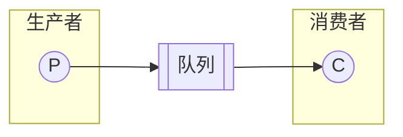
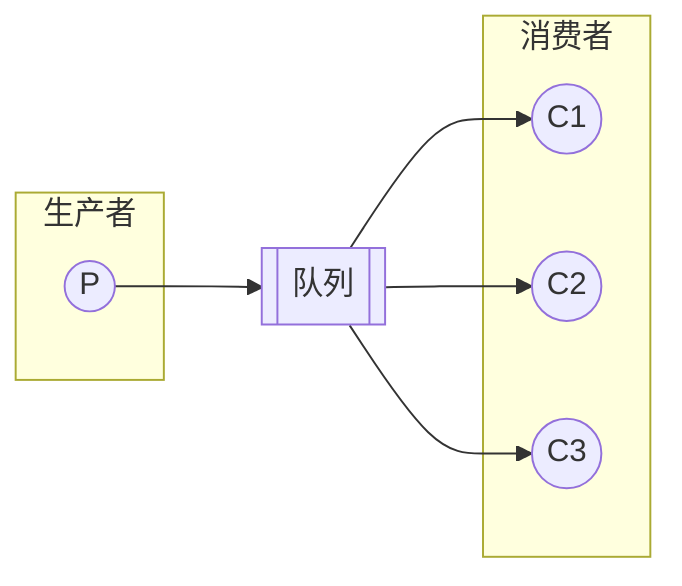
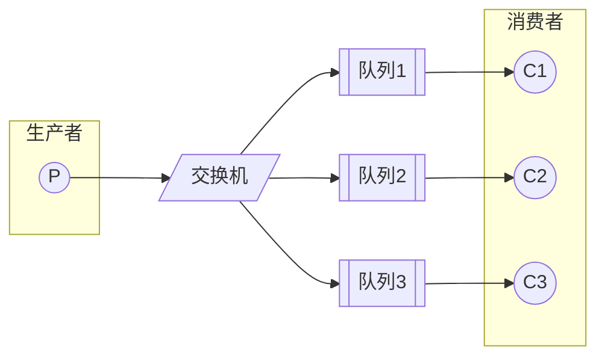
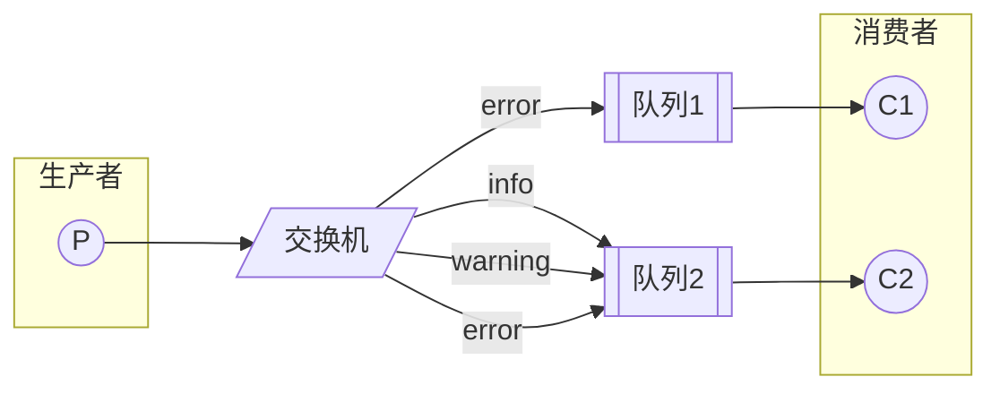
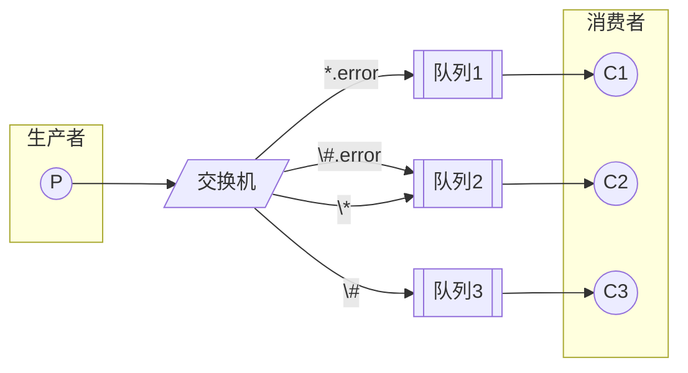
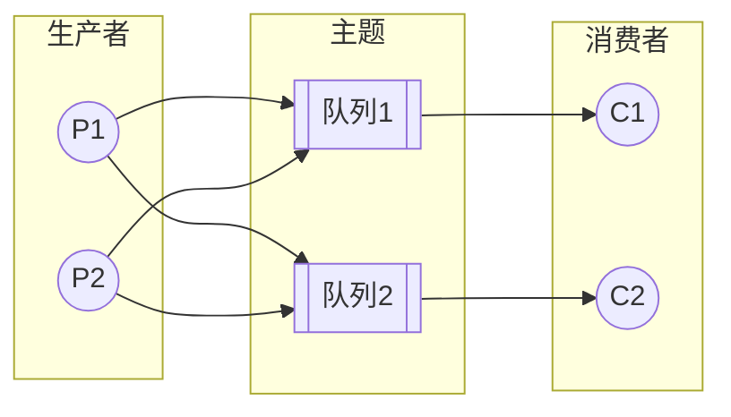
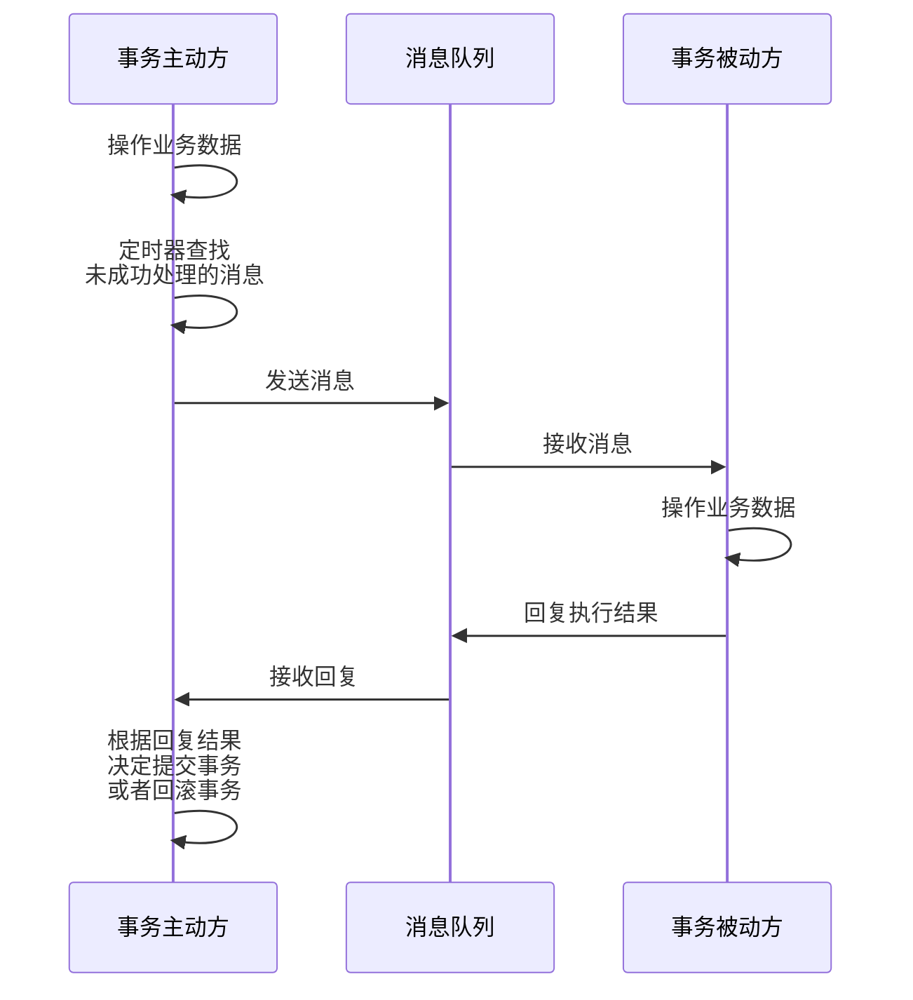

消息队列是一种先进先出的数据结构，用于存储并在应用程序之间传递消息。他有这样几个重要功能：

1. **异步处理**：生产者和消费者可以异步进行处理，不会相互阻塞，提高了系统的并发性能
2. **削峰填谷**：消息队列可以缓冲突发的消息，使得系统在高峰期不会因为消息量过大而崩溃
3. **解耦**：消息队列可以将生产者和消费者解耦，使得系统更容易扩展和维护
4. **可靠性**：消息队列可以保证消息的可靠传递，即使消费者宕机，消息也不会丢失
5. **延时处理**：消息队列可以实现延时处理，比如定时任务
6. **消息分发**：消息队列可以实现消息的广播和单播

## 消息模型

### P2P 模型

点对点模型是一种一对一的消息模型，生产者将消息发送到队列中，消费者从队列中获取消息。消息被消费后会从队列中删除。

消费者也可能是多个，但是每个消息只能被一个消费者消费。一个消费者消费掉一个消息后，其他消费者就无法再消费这个消息。

### 发布订阅模型

发布订阅模型是一种一对多的消息模型，生产者将消息发送到主题中，消费者订阅主题，当有消息发送到主题时，所有订阅了这个主题的消费者都会收到这个消息。

如果只有一个消费者订阅了这个主题，那么这个模型就退化成了点对点模型。

### RabbitMQ 模型

RabbitMQ 也使用了以上两种消息模型。点对点在 RabbitMQ 中叫做**基本消息模型**；发布订阅在 RabbitMQ 中叫做**工作队列模型**。

不过他还有一种额外的**订阅模型**。RabbitMQ 中的生产者将消息发送到交换机中，交换机将消息发送到各个消息队列中，消费者分别从各自的队列中获取消息。

这种模型又分为三种：

#### Fanout

Fanout 使用的就是上面的流程。当交换机接收到一条消息时，会以广播的方式将消息发送到所有队列中。

#### Direct

Direct 模型是一种点对点模型。在生产者生成消息时，需要指定一个 `routing key`，交换机会根据这个 routing key 将消息发送到对应的队列中。

#### Topic

Topic 模型是一种发布订阅模型。在生产者生成消息时，同样需要指定一个 `routing key`，不过这个 `routing key` 是一个通配符。

它一般由多个单词构成，单词间以 `.` 分隔。`*` 表示匹配一个单词，`#` 表示匹配一个或多个单词。例如：

- `*.error` 匹配 `net.error`，不匹配 `db.error`，但不匹配 `net.connect.error`
- `#.error` 匹配 `net.error`，`db.error`，`net.connect.error`
- `#` 匹配所有消息

当然，RabbitMQ 还支持 RPC 模型，不过这不属于消息队列的范畴。

### RocketMQ 模型

RocketMQ 使用了发布订阅模型。不过，它将队列换成了主题，主题中存在多个队列。

一个队列对应一个消费者，通常来讲队列和消费者数量相同。当然，一个队列只能被一个消费者消费，但是一个消费者可以消费多个队列。

消费者会在队列上维护一个偏移量，用于记录自己消费到了哪里。当消费者成功消费完一个消息后，会更新偏移量。

使用多个队列的主要目的是为了提高并发性能。

### Kafka 模型

Kafka 和 RocketMQ 几乎一模一样，只是将队列换成了分区。

## 分布式事务

消息队列可被用于分布式事务。具体来讲，它可以用于解决分布式事务的两个问题：

- **数据一致性**：消息队列可以保证消息的可靠传递，即使消费者宕机，消息也不会丢失
- **服务调用**：消息队列可以实现服务之间的异步调用，提高了系统的并发性能

基于消息队列的分布式事务的最终目标是达成最终一致性。具体来讲，它可以分为以下几个步骤：

这里有两个要点:

- **消息幂等性**：服务器发出的一条消息，只能被处理一次
- **失败重试**：使用定时器将之前未成功处理的消息重新发送

### RocketMQ 事务消息

RocketMQ 提供了事务消息的机制。它有两点特点：

- 确保本地事务和消息发送要么同时成功，要么同时失败
- 增加事务反查机制，提高事务执行的成功率

### Kafka 事务消息

Kafka 也提供了事务消息的机制。
