消息队列是一种先进先出的数据结构，用于存储并在应用程序之间传递消息。

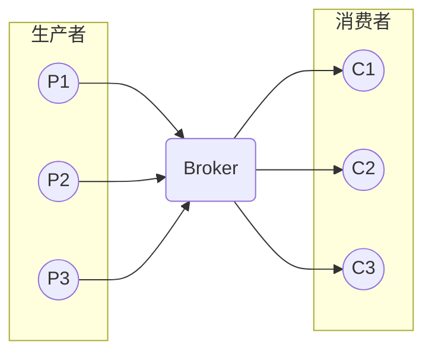

他有这样几个重要功能：

1. **异步处理**：生产者和消费者可以异步进行处理，不会相互阻塞，提高了系统的并发性能
2. **削峰填谷**：消息队列可以缓冲突发的消息，使得系统在高峰期不会因为消息量过大而崩溃
3. **解耦**：消息队列可以将生产者和消费者解耦，使得系统更容易扩展和维护
4. **可靠性**：消息队列可以保证消息的可靠传递，即使消费者宕机，消息也不会丢失
5. **延时处理**：消息队列可以实现延时处理，比如定时任务
6. **消息分发**：消息队列可以实现消息的广播和单播

先了解其中的几个概念：

- **生产者**：生产者是消息的发送方，将消息发送到消息队列中
- **消费者**：消费者是消息的接收方，从消息队列中获取消息
- **队列**：队列是消息的存储地点，生产者将消息发送到队列中，消费者从队列中获取消息，队列是一种先进先出的数据结构
- **主题/分区**：主题是一种发布订阅模型，生产者将消息发送到主题中，消费者订阅主题，当有消息发送到主题时，所有订阅了这个主题的消费者都会收到这个消息。分区是 Kafka 中的概念，主题中存在多个分区，一个分区对应一个消费者，通常来讲分区和消费者数量相同
- **Broker**：消息队列的服务端，负责接收生产者的消息，将消息发送给消费者。一个消息队列系统可能存在多个 Broker，每个 Broker 维护着不同的队列。需要注意的时，Broker 和主题/分区是交错的，每个 Broker 都可以包含所有的主题/分区，每个主题/分区也都可以存在于所有 Broker 中

## 消息模型

### P2P 模型

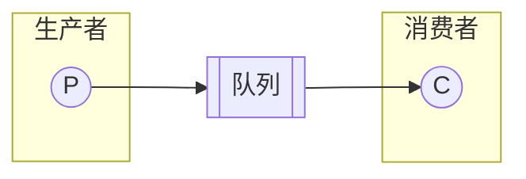

点对点模型是一种一对一的消息模型，生产者将消息发送到队列中，消费者从队列中获取消息。消息被消费后会从队列中删除。

消费者也可能是多个，但是每个消息只能被一个消费者消费。一个消费者消费掉一个消息后，其他消费者就无法再消费这个消息。

### 发布订阅模型

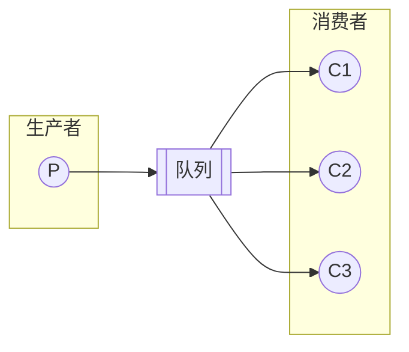

发布订阅模型是一种一对多的消息模型，生产者将消息发送到主题中，消费者订阅主题，当有消息发送到主题时，所有订阅了这个主题的消费者都会收到这个消息。

如果只有一个消费者订阅了这个主题，那么这个模型就退化成了点对点模型。

### RabbitMQ 模型

RabbitMQ 也使用了以上两种消息模型。点对点在 RabbitMQ 中叫做**基本消息模型**；发布订阅在 RabbitMQ 中叫做**工作队列模型**。

不过他还有一种额外的**订阅模型**。RabbitMQ 中的生产者将消息发送到交换机中，交换机将消息发送到各个消息队列中，消费者分别从各自的队列中获取消息。

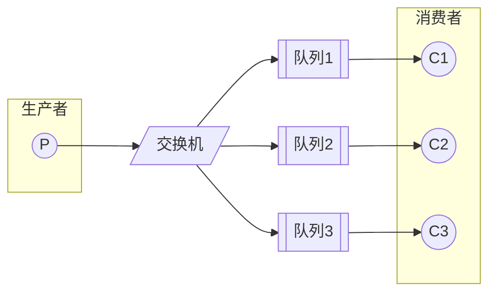

这种模型又分为三种：

#### Fanout

Fanout 使用的就是上面的流程。当交换机接收到一条消息时，会以广播的方式将消息发送到所有队列中。

#### Direct

Direct 模型是一种点对点模型。在生产者生成消息时，需要指定一个 `routing key`，交换机会根据这个 routing key 将消息发送到对应的队列中。

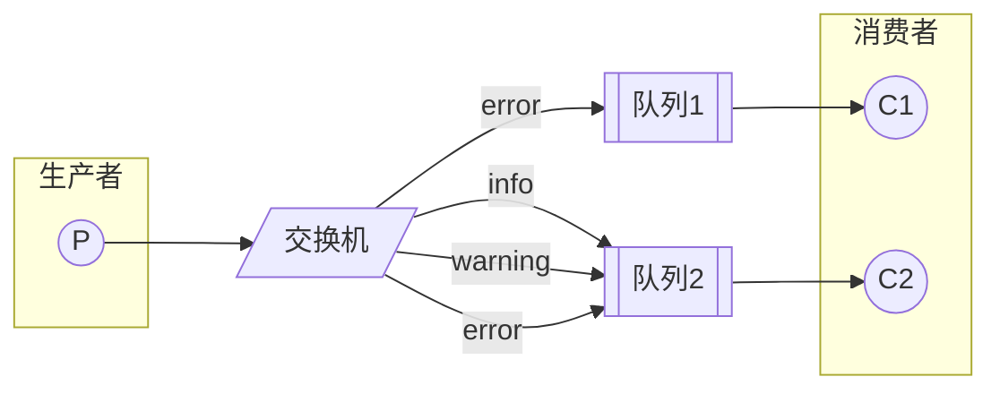

#### Topic

Topic 模型是一种发布订阅模型。在生产者生成消息时，同样需要指定一个 `routing key`，不过这个 `routing key` 是一个通配符。

它一般由多个单词构成，单词间以 `.` 分隔。`*` 表示匹配一个单词，`#` 表示匹配一个或多个单词。例如：

- `*.error` 匹配 `net.error`，不匹配 `db.error`，但不匹配 `net.connect.error`
- `#.error` 匹配 `net.error`，`db.error`，`net.connect.error`
- `#` 匹配所有消息

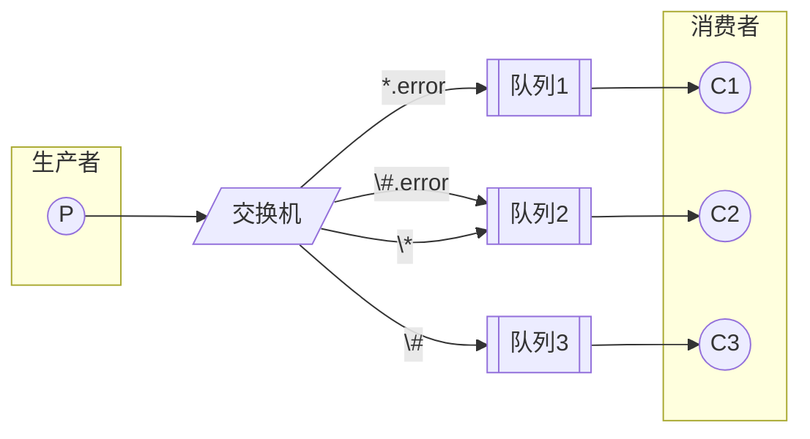

当然，RabbitMQ 还支持 RPC 模型，不过这不属于消息队列的范畴。

### RocketMQ 模型

RocketMQ 使用了发布订阅模型。不过，它将队列换成了主题，主题中存在多个队列。

一个队列对应一个消费者，通常来讲队列和消费者数量相同。当然，一个队列只能被一个消费者消费，但是一个消费者可以消费多个队列。

消费者会在队列上维护一个偏移量，用于记录自己消费到了哪里。当消费者成功消费完一个消息后，会更新偏移量。这个偏移量存在的目的是为了支持多个消费者组。

使用多个队列的主要目的是为了提高并发性能。

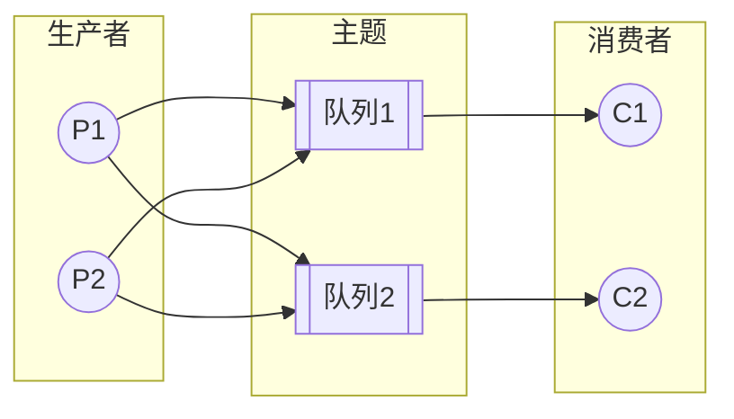

### Kafka 模型

Kafka 和 RocketMQ 几乎一模一样，只是将队列换成了分区。


## Spring Boot 使用

### RabbitMQ

<details>
<summary>点击展开</summary>
<div markdown="1">

RabbitMQ 的 Spring Boot 使用非常简单，只需要在 `pom.xml` 中添加以下依赖：

```xml
<dependency>
    <groupId>org.springframework.boot</groupId>
    <artifactId>spring-boot-starter-amqp</artifactId>
</dependency>
<dependency>
    <groupId>org.springframework.amqp</groupId>
    <artifactId>spring-rabbit-test</artifactId>
    <scope>test</scope>
</dependency>
```

使用 Docker-Compose 启动 RabbitMQ：

```yaml
version: '3'
services:
  rabbitmq:
    image: rabbitmq:3-management
    ports:
      - "5672:5672"
      - "15672:15672"
```

执行以下命令启动：

```bash
docker-compose up -d
```

然后在 `application.yml` 中配置 RabbitMQ 的连接信息：

```yaml
spring:
  rabbitmq:
    host: localhost
    port: 5672
    username: guest
    password: guest
```

使用时，首先需要声明队列和交换机：

```java
@Configuration
public class RabbitMQConfig {

    // 直连交换机示例
    public static final String DIRECT_EXCHANGE = "my.direct.exchange";
    public static final String QUEUE_NAME = "my.queue";
    public static final String ROUTING_KEY = "my.routing.key";

    @Bean
    Queue queue() {
        return new Queue(QUEUE_NAME, true);
    }

    @Bean
    DirectExchange directExchange() {
        return new DirectExchange(DIRECT_EXCHANGE);
    }

    @Bean
    Binding binding(Queue queue, DirectExchange exchange) {
        return BindingBuilder.bind(queue).to(exchange).with(ROUTING_KEY);
    }
}
```

生产者：

```java
@Service
public class RabbitMQProducerService {
    private static final Logger logger = LoggerFactory.getLogger(RabbitMQProducerService.class);

    @Autowired
    private RabbitTemplate rabbitTemplate;

    public void sendMessage(String message) {
        rabbitTemplate.convertAndSend(
          RabbitMQConfig.DIRECT_EXCHANGE,
          RabbitMQConfig.ROUTING_KEY,
          message);
        logger.info("Sent {}", message);
    }
}
```

消费者：

```java
@Service
public class RabbitMQConsumerService {
    private static final Logger logger = LoggerFactory.getLogger(RabbitMQConsumerService.class);

    private List<String> receivedMessages = new ArrayList<>();

    public List<String> getReceivedMessages() {
        return receivedMessages;
    }

    @RabbitListener(queues = RabbitMQConfig.QUEUE_NAME)
    public void listen(String message) {
        logger.info("Received {}", message);
        receivedMessages.add(message);
    }
}
```

测试程序：

```java
@SpringBootTest
class RabbitMQApplicationTests {
    @Autowired
    private RabbitMQProducerService producer;
    
    @Autowired
    private RabbitMQConsumerService consumer;

    @Test
    void testSendAndReceive() {
        producer.sendMessage("Hello, RabbitMQ!");
        
        try {
            Thread.sleep(1000);
        } catch (InterruptedException e) {
            e.printStackTrace();
        }

        assertThat(consumer.getReceivedMessages()).contains("Hello, RabbitMQ!");
    }
}
```

</div>
</details>

### RocketMQ

<details>
<summary>点击展开</summary>
<div markdown="1">

RocketMQ 的 Spring Boot 使用非常简单，只需要在 `pom.xml` 中添加以下依赖：

```xml
<dependency>
    <groupId>org.apache.rocketmq</groupId>
    <artifactId>rocketmq-spring-boot-starter</artifactId>
</dependency>
<dependency>
    <groupId>org.apache.rocketmq</groupId>
    <artifactId>rocketmq-spring-boot-starter-test</artifactId>
    <scope>test</scope>
</dependency>
```

使用 Docker-Compose 启动 RocketMQ：

```yaml
version: '3'
services:
  namesrv:
    image: apache/rocketmq:latest
    ports:
      - "9876:9876"
    environment:
      - "JAVA_OPTS=-Duser.home=/opt"
    command: sh mqnamesrv
  broker:
    image: apache/rocketmq:latest
    ports:
      - "10911:10911"
      - "10909:10909"
    environment:
      - "JAVA_OPTS=-Duser.home=/opt"
    command: sh mqbroker -n namesrv:9876
```

执行以下命令启动：

```bash
docker-compose up -d
```

然后在 `application.yml` 中配置 RocketMQ 的连接信息：

```yaml
rocketmq:
  name-server: localhost:9876
  producer:
    group: my-group
    send-message-timeout: 3000
    retryTimesWhenSendFailed: 2
    retryTimesWhenSendAsyncFailed: 2
    maxMessageSize: 4096
    compressMessageBodyThreshold: 4096
    retryNextServer: false
  consumer:
    group: my-group
```

生产者：

```java
@Service
public class RocketMQProducerService {
    private static final Logger logger = LoggerFactory.getLogger(RocketMQProducerService.class);

    @Autowired
    private RocketMQTemplate rocketMQTemplate;

    public void sendMessage(String topic, String message) {
        rocketMQTemplate.convertAndSend(topic, message);
        logger.info("Sent {}", message);
    }
}
```

消费者：

```java
@Service
public class RocketMQConsumerService {
    private static final Logger logger = LoggerFactory.getLogger(RocketMQConsumerService.class);

    private List<String> receivedMessages = new ArrayList<>();

    public List<String> getReceivedMessages() {
        return receivedMessages;
    }

    @RocketMQMessageListener(topic = "my-topic", consumerGroup = "my-group")
    public void onMessage(String message) {
        logger.info("Received {}", message);
        receivedMessages.add(message);
    }
}
```

测试程序：

```java
@SpringBootTest
class RocketMQApplicationTests {
    @Autowired
    private RocketMQProducerService producer;
    
    @Autowired
    private RocketMQConsumerService consumer;

    @Test
    void testSendAndReceive() {
        producer.sendMessage("my-topic", "Hello, RocketMQ!");
        
        try {
            Thread.sleep(1000);
        } catch (InterruptedException e) {
            e.printStackTrace();
        }

        assertThat(consumer.getReceivedMessages()).contains("Hello, RocketMQ!");
    }
}
```

</div>
</details>

### Kafka

<details>
<summary>点击展开</summary>
<div markdown="1">

Kafka 的 Spring Boot 使用非常简单，只需要在 `pom.xml` 中添加以下依赖：

```xml
<dependency>
    <groupId>org.springframework.kafka</groupId>
    <artifactId>spring-kafka</artifactId>
</dependency>
```

使用 Docker-Compose 启动 Kafka：

```yaml
version: '3'
services:
  zookeeper:
    image: confluentinc/cp-zookeeper:latest
    ports:
      - "2181:2181"
    environment:
      ZOOKEEPER_CLIENT_PORT: 2181
  kafka:
    image: confluentinc/cp-kafka:latest
    ports:
      - "9092:9092"
    environment:
      KAFKA_BROKER_ID: 1
      KAFKA_ZOOKEEPER_CONNECT: zookeeper:2181
      KAFKA_LISTENER_SECURITY_PROTOCOL_MAP: PLAINTEXT:PLAINTEXT,PLAINTEXT_HOST:PLAINTEXT
      KAFKA_ADVERTISED_LISTENERS: PLAINTEXT://kafka:29092,PLAINTEXT_HOST://localhost:9092
      KAFKA_AUTO_CREATE_TOPICS_ENABLE: "false"
    depends_on: [zookeeper]
```

执行以下命令启动：

```bash
docker-compose up -d
```

然后在 `application.yml` 中配置 Kafka 的连接信息：

```yaml
spring:
  kafka:
    bootstrap-servers: localhost:9092
    producer:
      key-serializer: org.apache.kafka.common.serialization.StringSerializer
      value-serializer: org.apache.kafka.common.serialization.StringSerializer
      acks: all
      retries: 3
    consumer:
      key-deserializer: org.apache.kafka.common.serialization.StringDeserializer
      value-deserializer: org.apache.kafka.common.serialization.StringDeserializer
      group-id: my-group
      auto-offset-reset: earliest
      enable-auto-commit: false
```

生产者：

```java
@Service
public class KafkaProducerService {
    private static final Logger logger = LoggerFactory.getLogger(KafkaProducerService.class);

    @Autowired
    private KafkaTemplate<String, String> kafkaTemplate;

    public void sendMessage(String topic, String message) {
        kafkaTemplate.send(topic, message)
            .addCallback(result -> {
                if (result != null) {
                    logger.info(
                        "Sent {} to {}@{}",
                        result.getProducerRecord().value(),
                        result.getRecordMetadata().topic(),
                        result.getRecordMetadata().offset());
                }
            },
            ex -> {
                logger.error("Failed to send: {}", ex.getMessage());
            });
    }
}
```

消费者：

```java
@Service
public class KafkaConsumerService {
    private static final Logger logger = LoggerFactory.getLogger(KafkaConsumerService.class);

    private List<String> receivedMessages = new ArrayList<>();

    public List<String> getReceivedMessages() {
        return receivedMessages;
    }

    @KafkaListener(topics = "my-topic", groupId = "my-group")
    public void listen(@Payload String message) {
        logger.info("Received {}", message);
        receivedMessages.add(message);
    }
}
```

测试程序：

```java
@SpringBootTest
@EmbeddedKafka(partitions = 1)
class KafkaApplicationTests {
    @Autowired
    private KafkaProducerService producer;
    
    @Autowired
    private KafkaConsumerService consumer;

    @Test
    void testSendAndReceive() {
        producer.sendMessage("my-topic", "Hello, Kafka!");
        
        try {
            Thread.sleep(1000);
        } catch (InterruptedException e) {
            e.printStackTrace();
        }

        assertThat(consumer.getReceivedMessages()).contains("Hello, Kafka!");
    }
}
```

</div>
</details>

## 底层数据结构

### 磁盘读写

#### 页缓存

磁盘使用页缓存来减少磁盘 IO：

- 写入的时候会先写入页缓存，然后将该页标记为脏页
- 读取的时候会先查找页缓存，如果没有则从磁盘中将数据读入页缓存，然后返回数据

如果要将页缓存持久化到磁盘，那么需要使用 `fsync` 系统调用。`fsync` 会将所有的脏页写入磁盘。

不过，如果是顺序写入磁盘，要比随机读写快得多。因此，通过文件追加的方式，可以提高磁盘 IO 的性能。

#### 内存映射文件

mmap 是一种内存映射文件的方式。它将文件映射到内存中，然后通过内存来读写文件。

页缓存是在内核空间中的，而用户空间无法直接访问页缓存。mmap 可以将页缓存映射到用户空间，这样就可以直接访问页缓存了。

用户此时可以使用指针来直接读写页缓存，而不需要调用 `read` 和 `write` 系统调用来读写文件。


#### 零拷贝

如果用户需要将磁盘上的一块数据通过网络发送出去，那么就需要将数据从磁盘读入页缓存，然后从页缓存拷贝到用户空间的缓冲区，再从缓冲区拷贝到内核空间的 socket 缓冲区，最后写入网卡发送出去。

这样做不但拷贝了多次数据，还执行了多次上下文切换，性能很差。

一种想法是利用前文的 mmap，将页缓存映射到用户空间，然后直接将数据从页缓存拷贝到 socket 缓冲区，这样就避免了一次拷贝。


但这样依然会从页缓存拷贝到 socket 缓冲区，还是会有一次拷贝。

更好的方式是使用 `sendfile` 系统调用。`sendfile` 通过 DMA 控制器将数据从磁盘读入页缓存，socket 缓冲区只会保存文件描述符和偏移量，不会保存数据。网卡根据 socket 缓冲区中的文件描述符和偏移量直接从页缓存中读取数据发送出去。

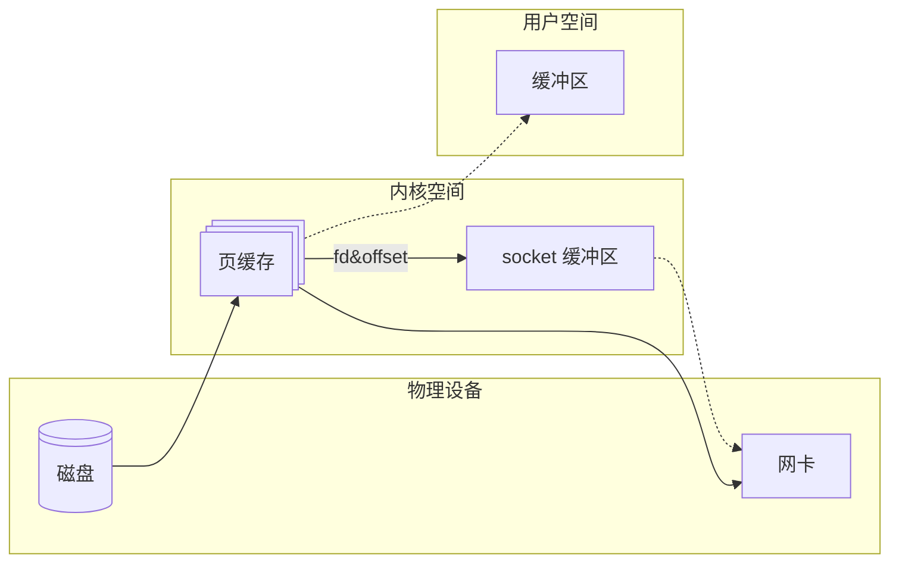

### RabbitMQ

RabbitMQ 使用了顺序追加的方式。

它的每个队列对应 `msg_store_persistent` 和 `msg_store_transient` 两个文件，分别用于持久化和非持久化消息。消息按照顺序追加到文件中，然后通过索引文件进行查找。

它还会维护一个仲裁日志，用于记录消息的状态。当消息被消费后，会将消息的状态从 `unacked` 改为 `acked`。

由于 RebbitMQ 中的消息会在被处理完后进行确认，因此会产生大量的随机读写。为了提高性能，RabbitMQ 使用了 B+ 树索引，查找消息。

### RocketMQ

RocketMQ 使用了主题混合追加模式。

它拥有多个队列，但只有一个 CommitLog：

- 消费者订阅的队列只是一个消息的索引文件 ConsumerQueue，队列中的每一个元素包含了消息的物理偏移量、消息大小、Tag 等信息
- 生产者发送消息时，消息会先顺序追加到 CommitLog 中，然后将其索引写入 ConsumerQueue 中
- 消费者从 ConsumerQueue 中获取真实消息的物理地址，然后从 CommitLog 中读取消息

在消费者读取 CommitLog 时，理论上是随机的。但由于消息是顺序追加的，所以从整体上来看，还是大体有序的。

RocketMQ 中的 CommitLog 和 ConsumerQueue 都使用了 mmap，不过没有使用零拷贝。

针对页缓存合适刷盘的问题，RocketMQ 使用了文件预分配和文件预热的方式：

- 文件预分配：CommitLog 的默认大小为 1G，当文件大小超过 1G 时，会再次分配 1G 的空间。RocketMQ 使用了一个后台线程，提前分配好文件空间，避免了切换文件时产生抖动
- 文件预热：RocketMQ 一方面会将部分地址空间锁定在内存中，防止 SWAP；另一方面会将可能要读取的文件提前载入页缓存

RocketMQ 的优势在于：

- 读写分离：CommitLog 处理写入，ConsumerQueue 处理读取，提高了并发性能
- 逻辑队列轻量化：队列中只存储了消息的索引，减少了内存占用

### Kafka

Kafka 使用了分区追加模式。

它的每个分区对应一个物理目录，目录格式为 `<topic>-<partition>`。每个分区中有多个顺序追加写入的日志文件，日志文件的格式为 `<segment base offset>.log`。

日志文件中包含了偏移量、时间戳、键值和负载数据。

Kafka 为了加速查找，使用了索引文件。索引文件包含两个：

- `.index` 是稀疏索引，记录偏移量到物理位置的映射。

  在查找时，Kafka 会二分查找这个索引，定位目标偏移量所在的大致位置，然后结合 mmap 找到物理位置

- `.timeindex` 是时间索引，用于时间范围查找

Kafka 的日志文件没有使用 mmap，但分区文件使用了。同时，Kafka 在发消息时使用了零拷贝。

它的优势在于

- 高性能：Kafka 使用了零拷贝，提高了性能
- 分区扩展性：Kafka 的分区可以水平扩展，提高了并发性能

然而，这也造成了 Kafka 的缺点：

- **仅分区有序**，而不是全局有序

如果要保证整个主题的有序，可以：

- 一个主题中只有一个分区
- 发送消息时指定分区 ID

## 推拉模式

消息队列的消费者有两种模式：推模式和拉模式。

### 推模式

推模式是指 Broker 主动将消息推送给消费者，消费者只需要注册一个监听器，当有消息到达时，Broker 会主动通知消费者。

它的优点是：

- 实时性高：消息到达后，消费者可以立即处理
- 使用方便：消费者只需要注册一个监听器，等着就完事了

不过，推模式也有一些缺点，最主要的便是无法控制消费速度：消费者可能处理消息的速度比生产者发送消息的速度慢，这样就会导致消息堆积。

### 拉模式

拉模式是指消费者主动向 Broker 请求消息。

它的优点是：

- 控制消费速度：消费者可以根据自己的处理能力来控制消费速度
- Broker 实现简单：Broker 只需要存储消息并响应请求即可
- 可以批量发送：消费者可以一次性请求多条消息

不过，拉模式也有一些缺点：

- 消息延迟：消费者需要定时请求消息，可能会导致消息延迟
- 消息忙请求：消息隔了很久才被生产者发送的情况下，消费者可能会频繁请求消息

RocketMQ 和 Kafka 都使用的拉模式；只有 RabbitMQ 使用的是推模式。

### RabbitMQ

RabbitMQ 使用的是推模式。

它的推模式基于 AMQP 协议：

- 首先在 Broker 和消费者之间建立 TCP 长连接
- 消费者首先使用 `basic.consume` 命令订阅一个队列，注册为队列的消费者
- 生产者发送消息到 Broker 后，Broker 立即将消息发送到对应的队列中
- 消费者收到消息后，会立即处理消息
- 消费者处理完消息后，发送 `basic.ack` 命令告诉 Broker 消息已经处理完毕
- Broker 收到 `basic.ack` 命令后，将消息从队列中删除

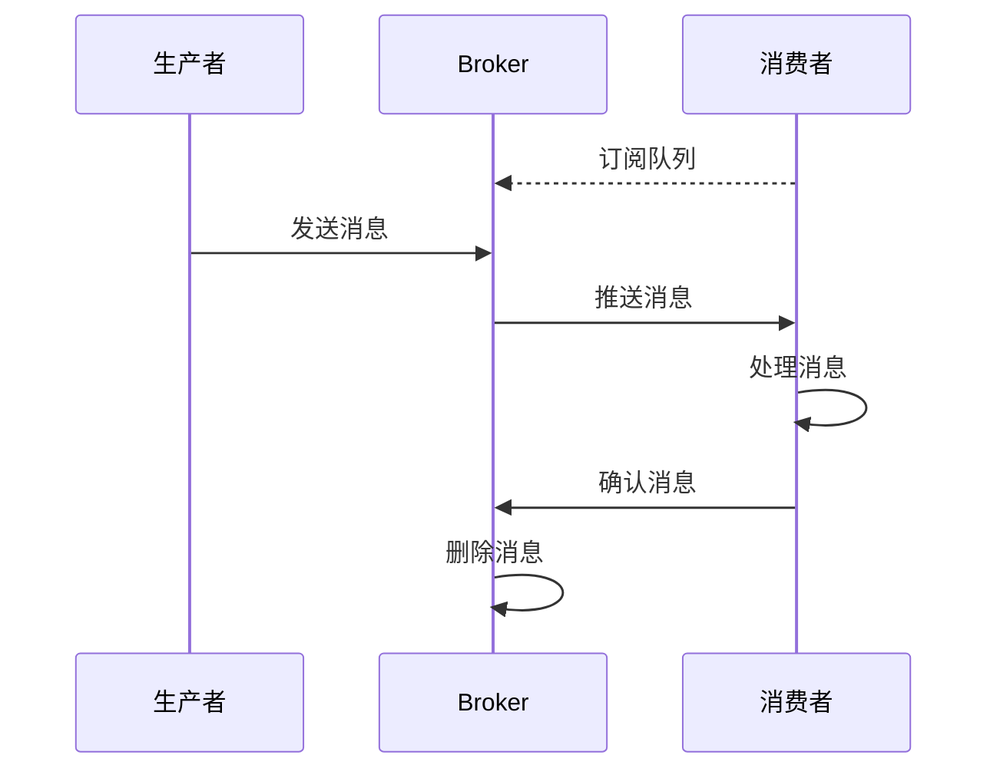

RabbitMQ 也不是完全不能拉模式。消费者可以使用 `basic.get` 命令主动拉取消息。不过，这种方式性能不高，不推荐使用。

### RocketMQ

RocketMQ 使用的是拉模式，但其长轮询可以模拟推模式。

RocketMQ 的拉模式基于长轮询：

- 消费者拉取请求未命中时，Broker 会将请求挂起 15 秒。如果期间有消息到达，那么 Broker 会立即返回消息
- 使用基于 Netty 的 TCP 长连接
- 消费者维护一个偏移量，用于记录自己消费到了哪里，定期向 Broker 发送心跳包，更新偏移量

其具体流程是这样的：

- 生产者将消息发送到 Broker 上的主题中
- Broker 将消息写入 CommitLog 中，然后分发到对应的队列中
- 消费者向 Broker 发送拉取消息的请求，携带主题、队列 ID 和偏移量
- Broker 收到请求后
  - 如果有消息立即返回，并带有最新的偏移量
  - 如果没有消息则挂起
- 消费者处理完成后，异步提交偏移量

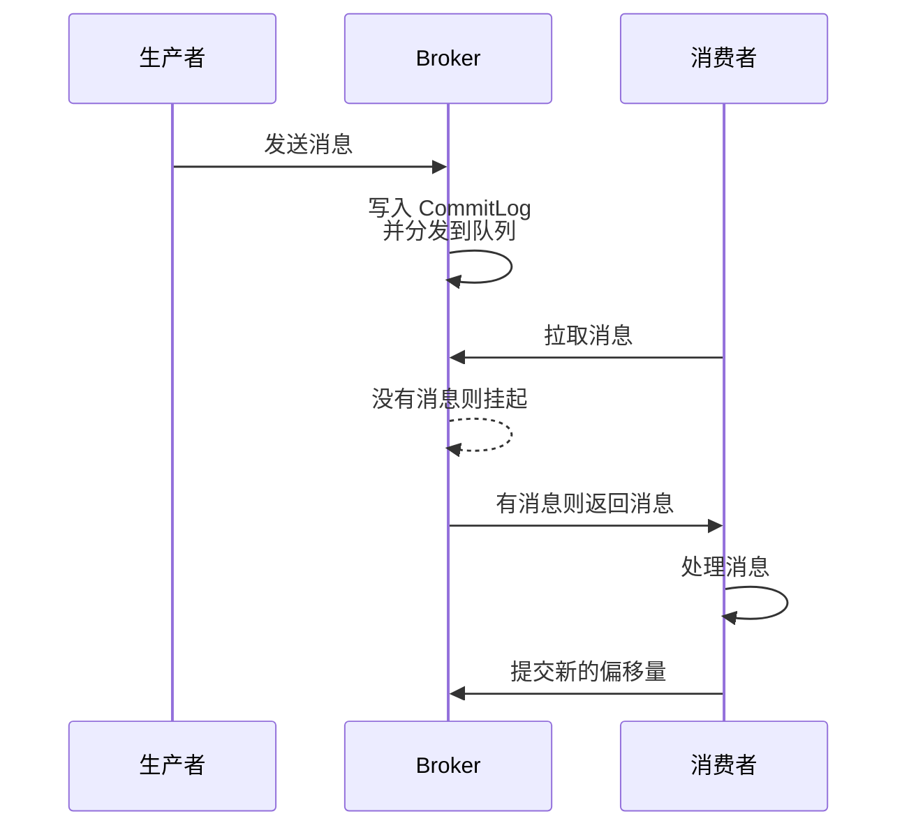

你会看到，RocketMQ 的长轮询通过挂起请求来模拟推模式，提高了消息的实时性。

### Kafka

Kafka 使用的是拉模式。

Kafka 的拉模式同样基于长轮询：

- 消费者拉取请求未命中时，Broker 会将请求挂起 5 分钟。如果期间有消息到达，那么 Broker 会立即返回消息
- 使用 TCP 长连接
- 消费者自己维护一个偏移量，用于记录自己消费到了哪里

其具体流程是这样的：

- 生产者将消息发送到 Broker 上的某个主题
- Broker 将消息写入日志文件中，然后分发到对应的分区中
- 消费者向 Broker 发送拉取消息的请求，携带主题、分区 ID 和偏移量
- Broker 收到请求后
  - 如果有消息立即返回对应分区的消息批次
  - 如果没有消息则挂起
- 消费者处理完成后，异步提交偏移量

可以看到，Kafka 的拉模式和 RocketMQ 的拉模式非常相似。较大的区别在于，Kafka 的消费者可以自己维护偏移量。

## 消息丢失

消息丢失是指消息在传输过程中丢失，导致消费者无法收到消息。

### 生产者消息丢失

生产者消息丢失是指生产者发送消息后，Broker 没有收到消息，导致消费者无法收到消息。

#### RabbitMQ

RabbitMQ 有两种方式解决生产者消息丢失：

- **事务**：生产者发送消息后，会阻塞并等待 Broker 的确认消息。如果没有收到确认消息，则会重发消息

- **确认**：生产者发送消息后，会立即返回，并不会等待 Broker 的确认消息。生产者会在后台线程中等待 Broker 的确认消息，如果没有收到确认消息，则会重发消息

  ```java
  // 启用Publisher Confirms
  channel.confirmSelect();

  // 异步确认回调
  channel.addConfirmListener((sequenceNumber, multiple) -> {
      // 消息成功到达Broker
  }, (sequenceNumber, multiple) -> {
      // 消息发送失败（需重试或记录日志）
  });

  // 发送消息（需持久化）
  AMQP.BasicProperties props = new AMQP.BasicProperties.Builder()
      .deliveryMode(2) // 持久化消息
      .build();
  channel.basicPublish("exchange", "routingKey", props, message.getBytes());
  ```

#### RocketMQ

RocketMQ 使用同步发送消息的方式来解决生产者消息丢失，并且内置了重试机制，默认重试 2 次。

```java
DefaultMQProducer producer = new DefaultMQProducer("group_name");
producer.setRetryTimesWhenSendFailed(3); // 同步发送重试次数
producer.send(msg, new SendCallback() {
    @Override
    public void onSuccess(SendResult sendResult) {
        // 发送成功
    }
    @Override
    public void onException(Throwable e) {
        // 发送失败（需人工干预）
    }
});
```

#### Kafka

- 生产者发送消息时，可以设置 `acks` 参数来控制消息的可靠性：

  - `acks=0`：生产者发送消息后，不需要等待 Broker 的确认。这样做的好处是性能高，但消息可能会丢失
  - `acks=1`：生产者发送消息后，等待 Leader 写入后确认。但如果 Leader 写入后宕机且副本没有同步，那么消息会丢失
  - `acks=all`：生产者发送消息后，等待所有副本写入后确认。这样做的好处是性能低，但消息不会丢失

  `acks=1` 和 `acks=all` 的区别在于，`acks=1` 只需要 Leader 写入后确认，而 `acks=all` 需要所有副本写入后确认

  同时，设置 `retries` 参数来控制消息的重试次数。可以设置为 3

  同时，配合 `delivery.timeout.ms` 来控制消息的超时时间。默认值为 120000，即 2 分钟

  ```java
  Properties props = new Properties();
  props.put("acks", "all"); // 最强确认机制
  props.put("retries", 3); // 重试次数
  props.put("max.in.flight.requests.per.connection", 1); // 防止乱序

  ProducerRecord<String, String> record =
      new ProducerRecord<>("topic", key, value);
  producer.send(record, (metadata, exception) -> {
      if (exception != null) {
          // 记录失败消息（需人工处理）
      }
  });
  ```

- 同步发送：

  ```java
  ProducerRecord<String, String> record = new ProducerRecord<>("topic", "key", "value");
  try {
      RecordMetadata metadata = producer.send(record).get();
  } catch (ExecutionException e) {
      e.printStackTrace();
  }
  ```

  这样，使用 `get()` 方法来获取发送结果，它会阻塞直到收到 Broker 的确认

### Broker 消息丢失

Broker 消息丢失是指 Broker 收到消息后宕机，导致消费者无法收到消息。

#### RabbitMQ

RabbitMQ 使用了持久化的方式来解决 Broker 消息丢失：

```java
// 持久化队列
boolean durable = true;
channel.queueDeclare("queue_name", durable, false, false, null);
```

他还可以设置镜像队列。镜像队列是指将队列的所有消息都复制到其他节点上，这样即使一个节点宕机，其他节点也可以继续提供服务。

#### RocketMQ

RocketMQ 支持主从复制：

- 主节点负责写入消息，从节点负责读取消息
- 主节点将消息写入 CommitLog 中，然后异步复制到从节点
- 从节点收到消息后，将消息写入 ConsumerQueue 中
- 主节点宕机后，从节点会自动选举出新的主节点，继续提供服务

面对主节点宕机后数据丢失的问题，RocketMQ 提供了以下几个参数来进行配置：

- 同步刷盘

  - `flushDiskType`：设置刷盘方式。可以设置为 `ASYNC_FLUSH`（异步刷盘）和 `SYNC_FLUSH`（同步刷盘）。默认值为 `ASYNC_FLUSH`
  - `syncFlushTimeout`：设置同步刷盘的超时时间。默认值为 5000，即 5 秒

- 主从复制

  - `brokerRole`：设置 Broker 进行主从复制的方式。可以设置为 `SYNC_FLUSH`（主从同步刷盘）和 `ASYNC_FLUSH`（主从异步刷盘）。默认值为 `ASYNC_FLUSH`

### 消费者消息丢失

消费者消息丢失是指消费者收到消息后，未能处理成功，导致消息丢失。

#### RabbitMQ

RabbitMQ 使用了消息确认的方式来解决消费者消息丢失：

- 消费者收到消息后，会立即处理消息
- 消费者处理完消息后，发送 `basic.ack` 命令告诉 Broker 消息已经处理完毕
- Broker 收到 `basic.ack` 命令后，将消息从队列中删除
- 如果消费者处理消息失败，则发送 `basic.nack` 命令告诉 Broker 消息未处理成功
- Broker 收到 `basic.nack` 命令后，将消息重新放入队列中
- 如果消费者在处理消息时宕机，则 Broker 会在 `x-message-ttl` 设置的时间后，将消息重新放入队列中

#### RocketMQ

RocketMQ 使用了消费状态返回的方式来解决消费者消息丢失：

- 消费者收到消息后，会立即处理消息
- 消费者处理完消息后，返回 `ConsumeConcurrentlyStatus.CONSUME_SUCCESS` 告诉 Broker 消息已经处理完毕
- 如果消费者处理消息失败，则返回 `ConsumeConcurrentlyStatus.RECONSUME_LATER`

他还支持自动重试：

- `maxReconsumeTimes`：设置最大重试次数。默认值为 16
- `retryInterval`：设置重试间隔。默认值为 1000，即 1 秒

当重试次数超过最大重试次数后，消息会被放入死信队列中

#### Kafka

Kafka 使用了提交偏移量的方式来解决消费者消息丢失：

- 消费者收到消息后，会立即处理消息
- 消费者处理完消息后，提交偏移量
- 如果消费者处理消息失败，则不提交偏移量
- 如果消费者在处理消息时宕机，则 Broker 会在 `auto.offset.reset` 设置的时间后，将消息重新放入队列中

这需要我们将 `enable.auto.commit` 设置为 `false`，然后手动提交偏移量。

#### Kafka

在 Kafka 2.8 之前，Kafka 的分布式是通过 Zookeeper 来实现的。Zookeeper 主要完成了以下工作：

- **Broker 注册**：Zookeeper 上有一个节点专门用来记录 Broker 列表，每个 Broker 启动时都会在这个节点下注册自己
- **Topic 创建**：Kafka 中，每个主题都会被分成多个分区，而每个分区可能分布在不同的 Broker 上。Zookeeper 会记录主题包含的分区、以及分区和 Broker 的映射关系
- **负载均衡**：Zookeeper 可以根据分区数量和消费者的情况来对分区进行负载均衡，将分区均衡分配给 Broker

当然，目前 Kafka 以及使用上了 KRaft 协议，不再依赖 Zookeeper。

面对 Leader 宕机后数据丢失的问题，Kafka 提供了以下几个参数来进行配置：

- 多副本

  - `unclean.leader.election.enable`：如果为 `false`，那么当 Leader 宕机时，只会选择出同步达到标准的副本作为 Leader
  - `replication.factor`：设置副本的数量。通常设置为 $$\geq 3$$ 来形成冗余
  - `min.insync.replicas`：设置最小同步副本数。例如，如果设置为 $$\geq 2$$，则 Leader 写入后，至少有两个副本写入后才会确认

  通常来讲，推荐设置为 `replication.factor = min.insync.replicas + 1`

- 持久化

  - `log.flush.interval.ms`：日志刷盘的时间间隔，默认值为 30000，即 30 秒
  - `log.flush.interval.messages`：日志刷盘的消息数量。如果调整为 1，则每写入一条消息就会刷盘。这样做的好处是消息不会丢失，但性能低

## 重复消费

重复消费是指消费者处理消息成功，但由于网络原因，Broker 没有收到确认消息，导致消费者重复收到消息。

### RabbitMQ

RabbitMQ 使用了 `message-id` 和本地去重的方式来解决重复消费。它的每条消息可以设置一个 `message-id`。

- 发送时，生产者可以设置一个 `message-id`，用于标识消息的唯一性
- 消费时，消费者可以使用 `message-id` 来判断消息是否已经处理过

### RocketMQ

RocketMQ 同样使用了 `message-id` 和本地去重的方式来解决重复消费。

### Kafka

Kafka 一方面启用生产者幂等：

```java
Properties props = new Properties();
props.put("enable.idempotence", "true");
```

另一方面，消费者先提交偏移量，再处理消息。不过，这样可能导致消息丢失。

## 分布式事务

### 分布式事务概述

分布式事务是指事务的参与者分布在不同的节点上，这些节点之间通过网络进行通信。分布式事务的目标是保证事务的 ACID 特性。

- **原子性**：事务要么全部成功，要么全部失败
- **一致性**：事务执行前后，数据的一致性不变
- **隔离性**：事务之间互不干扰
- **持久性**：事务一旦提交，数据就会持久化

对于分布式系统来讲，最终往往只会达到**最终一致性**。最终一致性是指，系统的所有节点在一段时间内达到一致状态。

分布式事务的实现主要有三种方式：

- **2PC**

  两阶段提交是一种同步的分布式事务协议。它分为两个阶段：

  - 准备阶段：协调者询问各个参与者是否可以提交事务
  - 提交阶段：协调者根据参与者的回复决定是否提交事务

  2PC 存在几个问题：

  - **阻塞**：在准备阶段，协调者和所有参与者都会阻塞等待
  - **单点故障**：协调者是一个单点，一旦宕机，整个事务就会失败

- **TCC**

  TCC 是一种异步的分布式事务协议。它分为三个阶段：

  - Try 阶段：尝试执行业务逻辑
  - Confirm 阶段：如果 Try 阶段都能成功，执行实际的业务逻辑
  - Cancel 阶段：如果 Try 阶段有一个失败，执行回滚操作

  TCC 适用于高并发场景，但是需要业务代码支持。同时，Confirm 和 Cancel 阶段需要保证幂等性，否则会导致数据不一致。

- **事务消息**

  事务消息是一种异步的分布式事务协议。它主要做的是让两个事务要么同时成功，要么同时失败。

具体来讲，消息队列可以用于解决分布式事务的两个问题：

- **数据一致性**：消息队列可以保证消息的可靠传递，即使消费者宕机，消息也不会丢失
- **服务调用**：消息队列可以实现服务之间的异步调用，提高了系统的并发性能

### RabbitMQ 事务消息

RebbitMQ 的事务使用基于传统 AMQP 事务，原生并不支持事务消息。不过，可以通过 `confirm` 和 `return` 机制来勉强实现事务消息。

- `confirm` 机制是指生产者发送消息后，消息队列会返回一个确认消息。如果生产者没有收到确认消息，那么就会重发消息。
- `return` 机制是指生产者发送消息后，如果消息队列没有收到消息，那么消息队列会将消息返回给生产者。

它的流程是这样的：

- 生产者发送消息后，消息队列会返回一个确认消息。确认消息包含是否收到以及收到了几条。如果生产者没有收到确认消息，那么就会重发消息
- 消费者消费后，该消息被标记为已消费，但并不会立即删除
- 消费者处理完事务后，发送确认消息给 Broker
- Broker 收到确认消息后，将消息删除

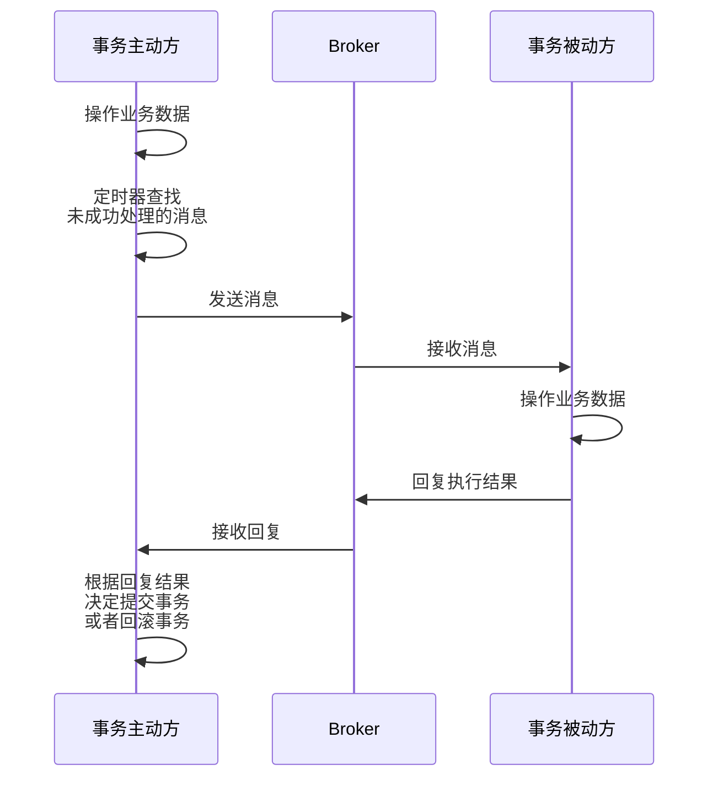

这里有两个要点:

- **消息幂等性**：服务器发出的一条消息，只能被处理一次
- **失败重试**：使用定时器将之前未成功处理的消息重新发送

这一机制依赖业务代码实现其中的一些功能，例如消息重发等，效率不高，适合低吞吐事务场景。

### RocketMQ 事务消息

RocketMQ 提供了原生的事务消息的机制。它从底层上来讲还是使用了两阶段提交的方式，确保消息的可靠传递，保障了较高的一致性，适用于电商、金融等场景。

它的主要流程是这样的：

- 生产者将消息内容、主题、队列 ID 等组装起来作为 Half 消息到 Broker 中，Broker 取出其中的主题、队列 ID 等作为消息属性，然后将其放入 `RMQ_SYS_TRANS_HALF_TOPIC` 主题的 `0` 号队列中。这个队列是一个特殊的队列，对于消费者来讲是不可见的
- 生产者在成功发送完消息后，执行本地事务。根据本地事务的执行结果，生产者向 Broker 发送 Commit 或者 Rollback 消息。该消息为单向消息，不会等待 Broker 的回复
- Broker 收到消息后
  - 如果收到 Commit，那么就将 Half 消息重新组装，放入正确的主题和队列投递出去；然后将 Half 消息放入 `RMQ_SYS_TRANS_OP_HALF_TOPIC` 主题中，表明这个消息以及处理过
  - 如果收到 Rollback，只会将 Half 消息放入 `RMQ_SYS_TRANS_OP_HALF_TOPIC` 主题中
- Broker 有一个定时服务，遍历 `RMQ_SYS_TRANS_OP_HALF_TOPIC` 中的内容，对 `RMQ_SYS_TRANS_HALF_TOPIC` 去重找到还没处理过的消息。然后对找出来的消息进行反查，这个反查请求是单向的。
- 如果多次反查都没有收到回复，那么就按照 Rollback 处理

这里会发现，RocketMQ 不会立刻删除 Half 消息，而是先保存已经处理过的消息，然后通过定时任务去重。这是因为 RocketMQ 使用的是顺序追加写入，短时间内不会更改已经写入的消息。每次反查时会将 Half 消息再入盘一次，这样一来，可以记录下反查的次数。

RocketMQ 事务消息有两点特点：

- 确保本地事务和消息发送要么同时成功，要么同时失败
- 增加事务反查机制，提高事务执行的成功率

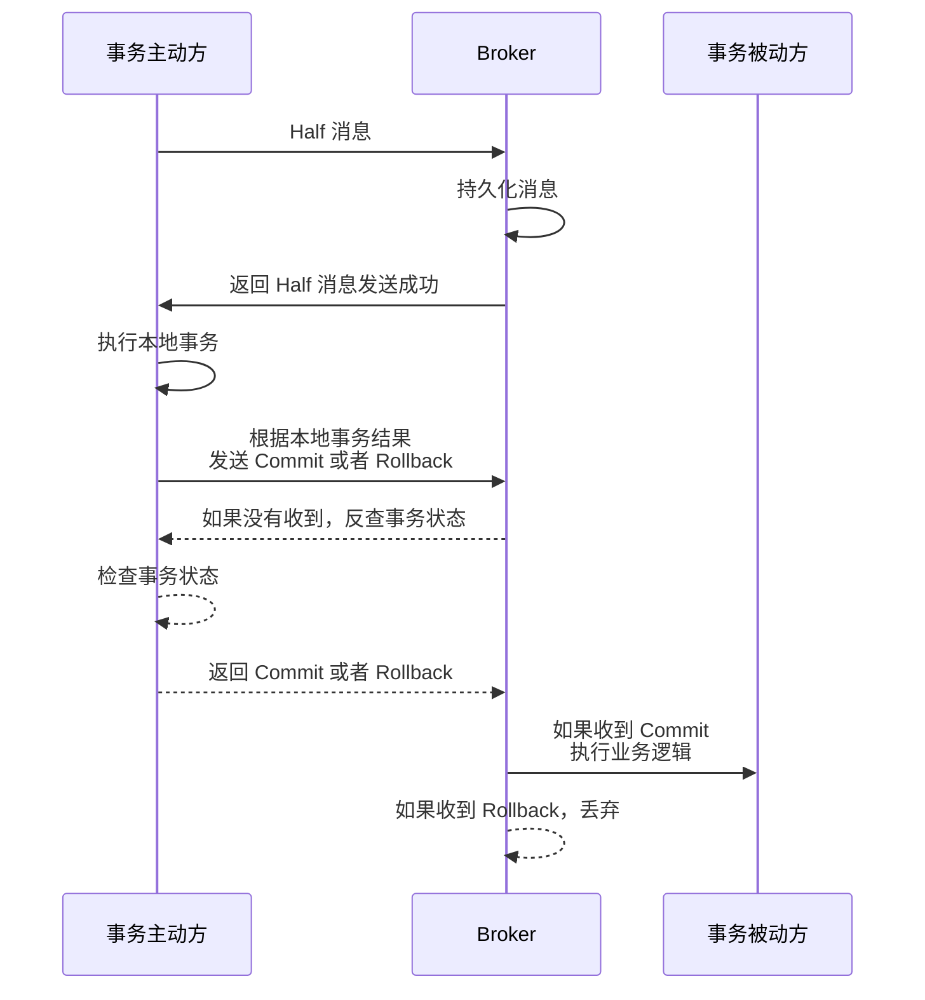

### Kafka 事务消息

RocketMQ 解决了本地事务执行和消息发送之间的约束，而 Kafka 则解决了一次性发送多个消息时多个消息之间的约束。对于 Kafka 来讲，多个消息要么同时成功，要么同时失败。这有点像我们之前讲的 TCC 模型。

不过它的事务消息并不是那种原生的，而是依靠幂等机制来实现 Exactly Once 语义。

> 消息可靠性分为三种：
>
> - At Most Once：消息可能会丢失，但不会重复
> - At Least Once：消息不会丢失，但可能会重复
> - Exactly Once：消息不会丢失，也不会重复
>
> 事务消息的目标是实现 Exactly Once 语义

Kafka 的 Exactly Once 就是纯骗，它并不是说从生产者到消费者的整个过程都既不会丢失也不会重复，而是说从 Kafka 的一个主题到另一个主题满足 Exactly Once 语义。

这一特性是通过事务 ID 来实现的。Kafka 会为每个事务生成一个事务 ID，然后将这个事务 ID 附加到消息中。消费者在消费消息时，会根据事务 ID 来判断消息是否重复。

它的具体流程是这样的：

- 事务开始时，生产者像协调者发送一个事务开始请求，协调者将它记录到事务日志中，标记为 `ongoing`
- 然后生产者开始边执行事务，边发送一堆真正的事务消息。这些事务消息就记录在普通的消息队列中。如果消费者愿意的话，现在就消费也不是不行
- 事务结束时，生产者向协调者发送一个提交或者回滚请求
- 如果是提交请求
  - 协调者会首先执行预提交操作，即将事务状态从 `ongoing` 改为 `prepare`，并写入事务日志
  - 然后向事务分区发送事务结束的消息，并向事务日志写入 `committed` 状态
  - 消费者收到事务结束的消息后，放心大胆地消费刚刚普通消息队列里传来的消息
- 如果是回滚请求
  - 协调者会首先执行预回滚操作，即将事务状态从 `ongoing` 改为 `abort`，并写入事务日志
  - 然后向事务分区发送事务结束的消息，并向事务日志写入 `aborted` 状态
  - 消费者收到事务结束的消息后，将普通消息队列中的消息丢弃

Kafka 的事务消息有两点特点：

- 确保一次性发送多个消息要么同时成功，要么同时失败
- 是否消费事务的逻辑由消费者的业务代码实现

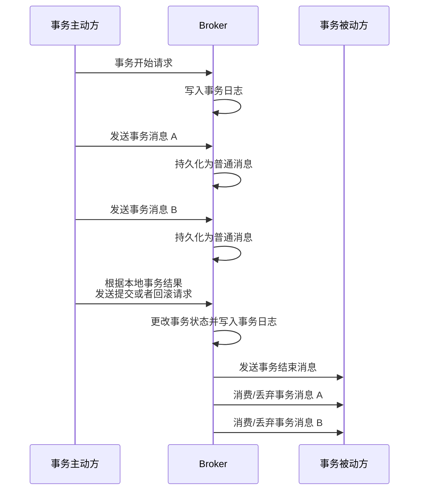

## 特殊队列

### 死信队列

当消息无法被消费时，会将消息发送到一个特殊的队列中，这个队列就是死信队列。

#### RabbitMQ

RabbitMQ 消息加入死信队列的原因主要有以下几种：

- 消息被拒绝（即 Nack）
- 消息过期（即 TTL）
- 队列满了

为了处理死信队列中的消息，RabbitMQ 提供了一个特殊的交换机，叫做死信交换机（DLX）。绑定了死信交换机的队列就是死信队列（DLQ）

```java
// 死信交换器和队列
channel.exchangeDeclare("dlx", "direct");
channel.queueDeclare("dlq", true, false, false, null);
channel.queueBind("dlq", "dlx", "dlx-routing-key");

// 主队列绑定死信交换器
Map<String, Object> args = new HashMap<>();
args.put("x-dead-letter-exchange", "dlx");
args.put("x-dead-letter-routing-key", "dlx-routing-key");
channel.queueDeclare("main_queue", true, false, false, args);

// 消费者拒绝消息成为死信
DeliverCallback deliverCallback = (consumerTag, delivery) -> {
    channel.basicNack(delivery.getEnvelope().getDeliveryTag(), false, false);
};
```

#### RocketMQ

RocketMQ 的消息重试消费失败超过最大重试次数（默认为 16）后，会将消息发送到死信队列中。死信队列的主题为 `%DLQ%<consumer_group>`

```java
// 消费者设置最大重试次数
DefaultMQPushConsumer consumer = new DefaultMQPushConsumer("group_name");
consumer.setMaxReconsumeTimes(3); // 最大重试次数

// 消息监听器返回消费失败状态
consumer.registerMessageListener((MessageListenerConcurrently) (msgs, context) -> {
    return ConsumeConcurrentlyStatus.RECONSUME_LATER;
});
```

#### Kafka

Kafka 并不支持死信队列。只能让消费者自己在处理失败时，将其发送到死信主题中。

### 延迟队列

延迟队列是指，当消息发送到队列中时，会设置一个延迟时间，只有在延迟时间到达后，消息才会被消费。

#### RabbitMQ

RabbitMQ 基于 AMQP 协议，本身并不支持延迟队列，但可以有插件 `rabbitmq_delayed_message_exchange` 来实现。

```java
// 启用延迟插件类型
Map<String, Object> args = new HashMap<>();
args.put("x-delayed-type", "direct");
channel.exchangeDeclare("delayed_exchange", "x-delayed-message", true, false, args);

// 发送延迟消息（30秒）
AMQP.BasicProperties.Builder props = new AMQP.BasicProperties.Builder();
props.headers(new HashMap<>()).header("x-delay", 30000);
channel.basicPublish("delayed_exchange", "routing_key", props.build(), message.getBytes());
```

#### RocketMQ

RocketMQ 的延迟队列是通过主题的延迟级别来实现的。每个主题都有 18 个延迟级别，分别对应 1s、5s、10s、30s、1m 等。

```java
Message msg = new Message("TopicTest", "TagA", "Hello RocketMQ".getBytes());
msg.setDelayTimeLevel(3); // 对应10秒延迟
SendResult sendResult = producer.send(msg);
```

#### Kafka

Kafka 本身并不支持延迟队列。只能让生产者设置一个延迟时间戳，消费者在消费时判断当前时间是否超过延迟时间。

### 优先级队列

优先级队列是指，当消息发送到队列中时，会设置一个优先级，优先级高的消息会优先被消费。

#### RabbitMQ

RabbitMQ 的优先级队列是通过在队列中设置一个参数 `x-max-priority` 来实现的。这个参数表示队列的最大优先级，范围是 0 到 255。

```java
// 创建支持优先级的队列
Map<String, Object> args = new HashMap<>();
args.put("x-max-priority", 10); // 最大优先级为10
channel.queueDeclare("priority_queue", true, false, false, args);

// 发送优先级消息
AMQP.BasicProperties props = new AMQP.BasicProperties.Builder().priority(5).build();
channel.basicPublish("", "priority_queue", props, "High priority message".getBytes());
```
