消息队列是一种先进先出的数据结构，用于存储并在应用程序之间传递消息。

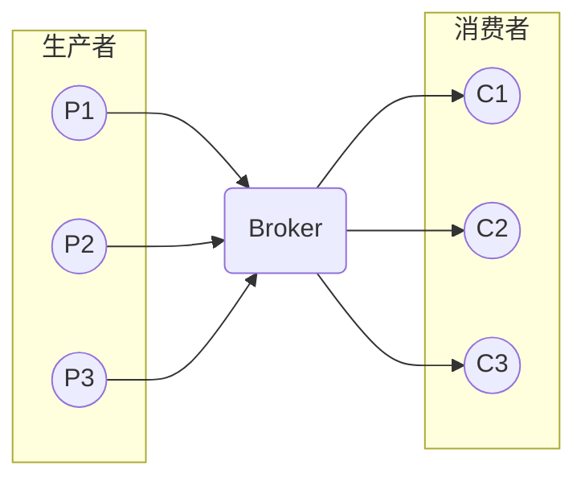

他有这样几个重要功能：

1. **异步处理**：生产者和消费者可以异步进行处理，不会相互阻塞，提高了系统的并发性能
2. **削峰填谷**：消息队列可以缓冲突发的消息，使得系统在高峰期不会因为消息量过大而崩溃
3. **解耦**：消息队列可以将生产者和消费者解耦，使得系统更容易扩展和维护
4. **可靠性**：消息队列可以保证消息的可靠传递，即使消费者宕机，消息也不会丢失
5. **延时处理**：消息队列可以实现延时处理，比如定时任务
6. **消息分发**：消息队列可以实现消息的广播和单播

先了解其中的几个概念：

- **生产者**：生产者是消息的发送方，将消息发送到消息队列中
- **消费者**：消费者是消息的接收方，从消息队列中获取消息
- **队列**：队列是消息的存储地点，生产者将消息发送到队列中，消费者从队列中获取消息，队列是一种先进先出的数据结构
- **主题/分区**：主题是一种发布订阅模型，生产者将消息发送到主题中，消费者订阅主题，当有消息发送到主题时，所有订阅了这个主题的消费者都会收到这个消息。分区是 Kafka 中的概念，主题中存在多个分区，一个分区对应一个消费者，通常来讲分区和消费者数量相同
- **Broker**：消息队列的服务端，负责接收生产者的消息，将消息发送给消费者。一个消息队列系统可能存在多个 Broker，每个 Broker 维护着不同的队列。需要注意的时，Broker 和主题/分区是交错的，每个 Broker 都可以包含所有的主题/分区，每个主题/分区也都可以存在于所有 Broker 中

## 消息模型

### P2P 模型

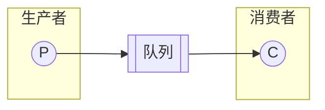

点对点模型是一种一对一的消息模型，生产者将消息发送到队列中，消费者从队列中获取消息。消息被消费后会从队列中删除。

消费者也可能是多个，但是每个消息只能被一个消费者消费。一个消费者消费掉一个消息后，其他消费者就无法再消费这个消息。

### 发布订阅模型

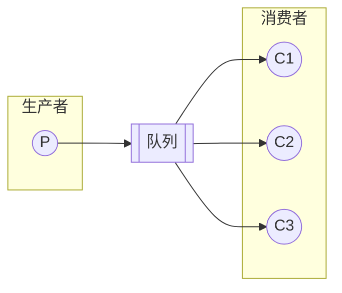

发布订阅模型是一种一对多的消息模型，生产者将消息发送到主题中，消费者订阅主题，当有消息发送到主题时，所有订阅了这个主题的消费者都会收到这个消息。

如果只有一个消费者订阅了这个主题，那么这个模型就退化成了点对点模型。

### RabbitMQ 模型

RabbitMQ 也使用了以上两种消息模型。点对点在 RabbitMQ 中叫做**基本消息模型**；发布订阅在 RabbitMQ 中叫做**工作队列模型**。

不过他还有一种额外的**订阅模型**。RabbitMQ 中的生产者将消息发送到交换机中，交换机将消息发送到各个消息队列中，消费者分别从各自的队列中获取消息。

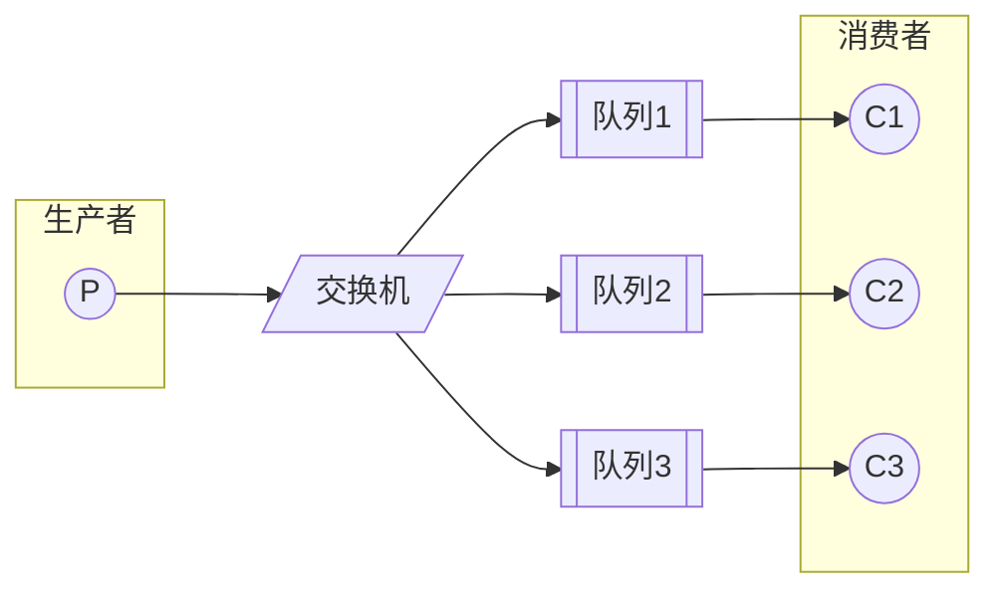

这种模型又分为三种：

#### Fanout

Fanout 使用的就是上面的流程。当交换机接收到一条消息时，会以广播的方式将消息发送到所有队列中。

#### Direct

Direct 模型是一种点对点模型。在生产者生成消息时，需要指定一个 `routing key`，交换机会根据这个 routing key 将消息发送到对应的队列中。

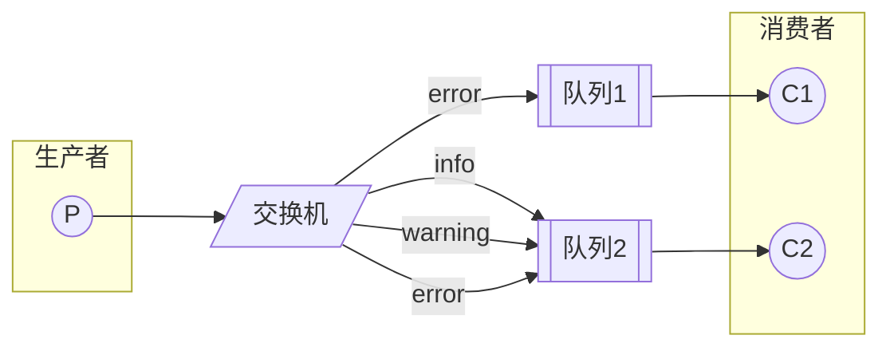

#### Topic

Topic 模型是一种发布订阅模型。在生产者生成消息时，同样需要指定一个 `routing key`，不过这个 `routing key` 是一个通配符。

它一般由多个单词构成，单词间以 `.` 分隔。`*` 表示匹配一个单词，`#` 表示匹配一个或多个单词。例如：

- `*.error` 匹配 `net.error`，不匹配 `db.error`，但不匹配 `net.connect.error`
- `#.error` 匹配 `net.error`，`db.error`，`net.connect.error`
- `#` 匹配所有消息

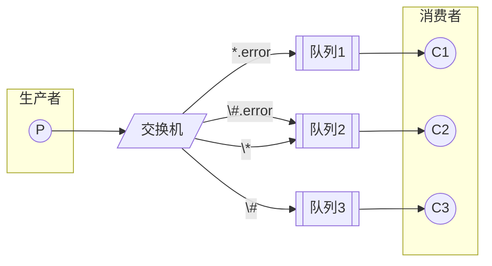

当然，RabbitMQ 还支持 RPC 模型，不过这不属于消息队列的范畴。

### RocketMQ 模型

RocketMQ 使用了发布订阅模型。不过，它将队列换成了主题，主题中存在多个队列。

一个队列对应一个消费者，通常来讲队列和消费者数量相同。当然，一个队列只能被一个消费者消费，但是一个消费者可以消费多个队列。

消费者会在队列上维护一个偏移量，用于记录自己消费到了哪里。当消费者成功消费完一个消息后，会更新偏移量。这个偏移量存在的目的是为了支持多个消费者组。

使用多个队列的主要目的是为了提高并发性能。

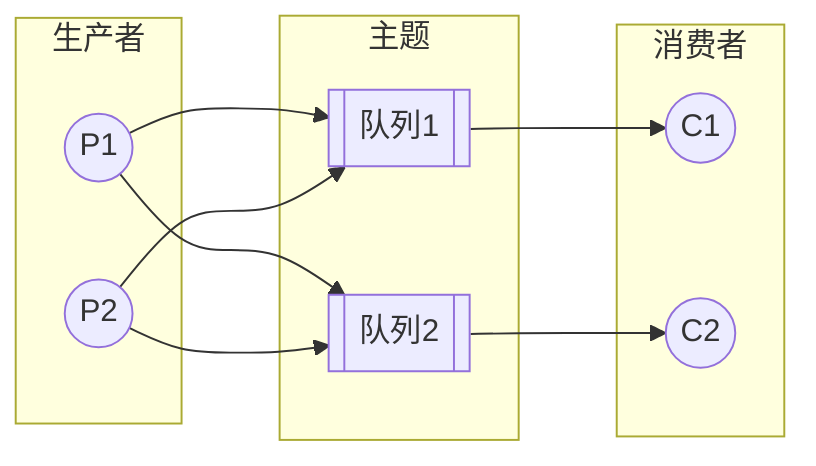

### Kafka 模型

Kafka 和 RocketMQ 几乎一模一样，只是将队列换成了分区。

## 底层数据结构

### 磁盘读写

#### 页缓存

磁盘使用页缓存来减少磁盘 IO：

- 写入的时候会先写入页缓存，然后将该页标记为脏页
- 读取的时候会先查找页缓存，如果没有则从磁盘中将数据读入页缓存，然后返回数据

如果要将页缓存持久化到磁盘，那么需要使用 `fsync` 系统调用。`fsync` 会将所有的脏页写入磁盘。

不过，如果是顺序写入磁盘，要比随机读写快得多。因此，通过文件追加的方式，可以提高磁盘 IO 的性能。

#### 内存映射文件

mmap 是一种内存映射文件的方式。它将文件映射到内存中，然后通过内存来读写文件。

页缓存是在内核空间中的，而用户空间无法直接访问页缓存。mmap 可以将页缓存映射到用户空间，这样就可以直接访问页缓存了。

用户此时可以使用指针来直接读写页缓存，而不需要调用 `read` 和 `write` 系统调用来读写文件。

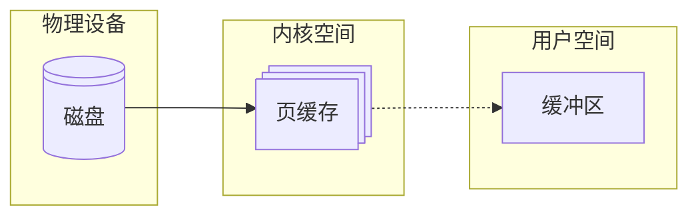

#### 零拷贝

如果用户需要将磁盘上的一块数据通过网络发送出去，那么就需要将数据从磁盘读入页缓存，然后从页缓存拷贝到用户空间的缓冲区，再从缓冲区拷贝到内核空间的 socket 缓冲区，最后写入网卡发送出去。

这样做不但拷贝了多次数据，还执行了多次上下文切换，性能很差。

一种想法是利用前文的 mmap，将页缓存映射到用户空间，然后直接将数据从页缓存拷贝到 socket 缓冲区，这样就避免了一次拷贝。

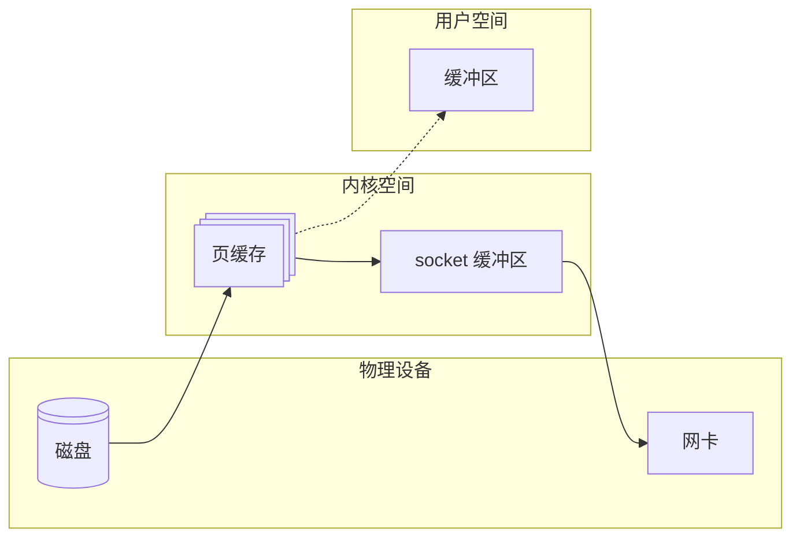

但这样依然会从页缓存拷贝到 socket 缓冲区，还是会有一次拷贝。

更好的方式是使用 `sendfile` 系统调用。`sendfile` 通过 DMA 控制器将数据从磁盘读入页缓存，socket 缓冲区只会保存文件描述符和偏移量，不会保存数据。网卡根据 socket 缓冲区中的文件描述符和偏移量直接从页缓存中读取数据发送出去。

### RabbitMQ

RabbitMQ 使用了顺序追加的方式。

它的每个队列对应 `msg_store_persistent` 和 `msg_store_transient` 两个文件，分别用于持久化和非持久化消息。消息按照顺序追加到文件中，然后通过索引文件进行查找。

它还会维护一个仲裁日志，用于记录消息的状态。当消息被消费后，会将消息的状态从 `unacked` 改为 `acked`。

由于 RebbitMQ 中的消息会在被处理完后进行确认，因此会产生大量的随机读写。为了提高性能，RabbitMQ 使用了 B+ 树索引，查找消息。

### RocketMQ

RocketMQ 使用了主题混合追加模式。

它拥有多个队列，但只有一个 CommitLog：

- 消费者订阅的队列只是一个消息的索引文件 ConsumerQueue，队列中的每一个元素包含了消息的物理偏移量、消息大小、Tag 等信息
- 生产者发送消息时，消息会先顺序追加到 CommitLog 中，然后将其索引写入 ConsumerQueue 中
- 消费者从 ConsumerQueue 中获取真实消息的物理地址，然后从 CommitLog 中读取消息

在消费者读取 CommitLog 时，理论上是随机的。但由于消息是顺序追加的，所以从整体上来看，还是大体有序的。

RocketMQ 中的 CommitLog 和 ConsumerQueue 都使用了 mmap，不过没有使用零拷贝。

针对页缓存合适刷盘的问题，RocketMQ 使用了文件预分配和文件预热的方式：

- 文件预分配：CommitLog 的默认大小为 1G，当文件大小超过 1G 时，会再次分配 1G 的空间。RocketMQ 使用了一个后台线程，提前分配好文件空间，避免了切换文件时产生抖动
- 文件预热：RocketMQ 一方面会将部分地址空间锁定在内存中，防止 SWAP；另一方面会将可能要读取的文件提前载入页缓存

RocketMQ 的优势在于：

- 读写分离：CommitLog 处理写入，ConsumerQueue 处理读取，提高了并发性能
- 逻辑队列轻量化：队列中只存储了消息的索引，减少了内存占用

### Kafka

Kafka 使用了分区追加模式。

它的每个分区对应一个物理目录，目录格式为 `<topic>-<partition>`。每个分区中有多个顺序追加写入的日志文件，日志文件的格式为 `<segment base offset>.log`。

日志文件中包含了便宜了、时间戳、键值和负载数据。

Kafka 为了加速查找，使用了索引文件。索引文件包含两个：

- `.index` 是稀疏索引，记录偏移量到物理位置的映射。

  在查找时，Kafka 会二分查找这个索引，定位目标偏移量所在的大致位置，然后结合 mmap 找到物理位置

- `.timeindex` 是时间索引，用于时间范围查找

Kafka 的日志文件没有使用 mmap，但分区文件使用了。同时，Kafka 在发消息时使用了零拷贝。

它的优势在于

- 高性能：Kafka 使用了零拷贝，提高了性能
- 分区扩展性：Kafka 的分区可以水平扩展，提高了并发性能

然而，这也造成了 Kafka 的缺点：

- **仅分区有序**，而不是全局有序

## 推拉模式

消息队列的消费者有两种模式：推模式和拉模式。

### 推模式

推模式是指 Broker 主动将消息推送给消费者，消费者只需要注册一个监听器，当有消息到达时，Broker 会主动通知消费者。

它的优点是：

- 实时性高：消息到达后，消费者可以立即处理
- 使用方便：消费者只需要注册一个监听器，等着就完事了

不过，推模式也有一些缺点，最主要的便是无法控制消费速度：消费者可能处理消息的速度比生产者发送消息的速度慢，这样就会导致消息堆积。

### 拉模式

拉模式是指消费者主动向 Broker 请求消息。

它的优点是：

- 控制消费速度：消费者可以根据自己的处理能力来控制消费速度
- Broker 实现简单：Broker 只需要存储消息并响应请求即可
- 可以批量发送：消费者可以一次性请求多条消息

不过，拉模式也有一些缺点：

- 消息延迟：消费者需要定时请求消息，可能会导致消息延迟
- 消息忙请求：消息隔了很久才被生产者发送的情况下，消费者可能会频繁请求消息

RocketMQ 和 Kafka 都使用的拉模式；只有 RabbitMQ 使用的是推模式。

### RabbitMQ

RabbitMQ 使用的是推模式。

它的推模式基于 AMQP 协议：

- 首先在 Broker 和消费者之间建立 TCP 长连接
- 消费者首先使用 `basic.consume` 命令订阅一个队列，注册为队列的消费者
- 生产者发送消息到 Broker 后，Broker 立即将消息发送到对应的队列中
- 消费者收到消息后，会立即处理消息
- 消费者处理完消息后，发送 `basic.ack` 命令告诉 Broker 消息已经处理完毕
- Broker 收到 `basic.ack` 命令后，将消息从队列中删除

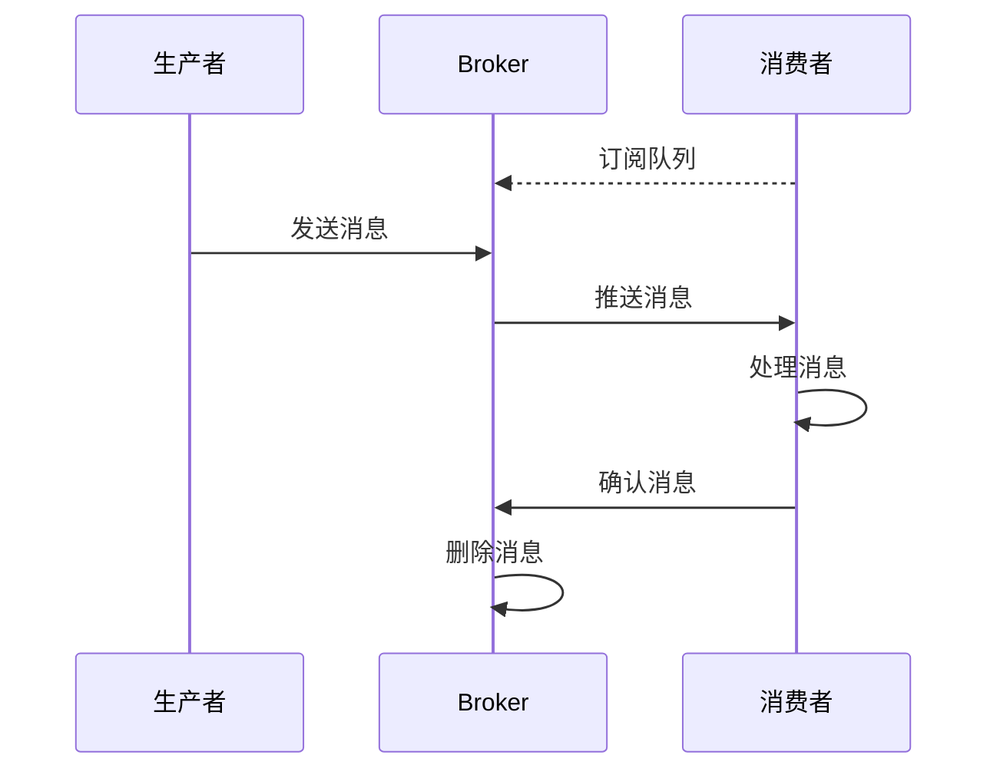

RabbitMQ 也不是完全不能拉模式。消费者可以使用 `basic.get` 命令主动拉取消息。不过，这种方式性能不高，不推荐使用。

### RocketMQ

RocketMQ 使用的是拉模式，但其长轮询可以模拟推模式。

RocketMQ 的拉模式基于长轮询：

- 消费者拉取请求未命中时，Broker 会将请求挂起 15 秒。如果期间有消息到达，那么 Broker 会立即返回消息
- 使用基于 Netty 的 TCP 长连接
- 消费者维护一个偏移量，用于记录自己消费到了哪里，定期向 Broker 发送心跳包，更新偏移量

其具体流程是这样的：

- 生产者将消息发送到 Broker 上的主题中
- Broker 将消息写入 CommitLog 中，然后分发到对应的队列中
- 消费者向 Broker 发送拉取消息的请求，携带主题、队列 ID 和偏移量
- Broker 收到请求后
  - 如果有消息立即返回，并带有最新的偏移量
  - 如果没有消息则挂起
- 消费者处理完成后，异步提交偏移量

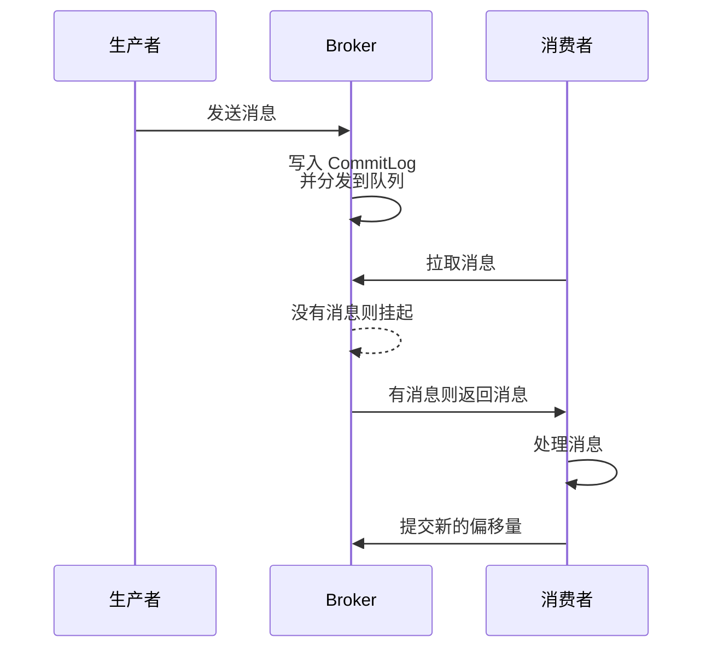

你会看到，RocketMQ 的长轮询通过挂起请求来模拟推模式，提高了消息的实时性。

### Kafka

Kafka 使用的是拉模式。

Kafka 的拉模式同样基于长轮询：

- 消费者拉取请求未命中时，Broker 会将请求挂起 5 分钟。如果期间有消息到达，那么 Broker 会立即返回消息
- 使用 TCP 长连接
- 消费者自己维护一个偏移量，用于记录自己消费到了哪里

其具体流程是这样的：

- 生产者将消息发送到 Broker 上的某个主题
- Broker 将消息写入日志文件中，然后分发到对应的分区中
- 消费者向 Broker 发送拉取消息的请求，携带主题、分区 ID 和偏移量
- Broker 收到请求后
  - 如果有消息立即返回对应分区的消息批次
  - 如果没有消息则挂起
- 消费者处理完成后，异步提交偏移量

可以看到，Kafka 的拉模式和 RocketMQ 的拉模式非常相似。较大的区别在于，Kafka 的消费者可以自己维护偏移量。

## 分布式事务

### 分布式事务概述

分布式事务是指事务的参与者分布在不同的节点上，这些节点之间通过网络进行通信。分布式事务的目标是保证事务的 ACID 特性。

- **原子性**：事务要么全部成功，要么全部失败
- **一致性**：事务执行前后，数据的一致性不变
- **隔离性**：事务之间互不干扰
- **持久性**：事务一旦提交，数据就会持久化

对于分布式系统来讲，最终往往只会达到**最终一致性**。最终一致性是指，系统的所有节点在一段时间内达到一致状态。

分布式事务的实现主要有三种方式：

- **2PC**

  两阶段提交是一种同步的分布式事务协议。它分为两个阶段：

  - 准备阶段：协调者询问各个参与者是否可以提交事务
  - 提交阶段：协调者根据参与者的回复决定是否提交事务

  2PC 存在几个问题：

  - **阻塞**：在准备阶段，协调者和所有参与者都会阻塞等待
  - **单点故障**：协调者是一个单点，一旦宕机，整个事务就会失败

- **TCC**

  TCC 是一种异步的分布式事务协议。它分为三个阶段：

  - Try 阶段：尝试执行业务逻辑
  - Confirm 阶段：如果 Try 阶段都能成功，执行实际的业务逻辑
  - Cancel 阶段：如果 Try 阶段有一个失败，执行回滚操作

  TCC 适用于高并发场景，但是需要业务代码支持。同时，Confirm 和 Cancel 阶段需要保证幂等性，否则会导致数据不一致。

- **事务消息**

  事务消息是一种异步的分布式事务协议。它主要做的是让两个事务要么同时成功，要么同时失败。

具体来讲，消息队列可以用于解决分布式事务的两个问题：

- **数据一致性**：消息队列可以保证消息的可靠传递，即使消费者宕机，消息也不会丢失
- **服务调用**：消息队列可以实现服务之间的异步调用，提高了系统的并发性能

### RabbitMQ 事务消息

RebbitMQ 的事务使用基于传统 AMQP 事务，原生并不支持事务消息。不过，可以通过 `confirm` 和 `return` 机制来勉强实现事务消息。

- `confirm` 机制是指生产者发送消息后，消息队列会返回一个确认消息。如果生产者没有收到确认消息，那么就会重发消息。
- `return` 机制是指生产者发送消息后，如果消息队列没有收到消息，那么消息队列会将消息返回给生产者。

它的流程是这样的：

- 生产者发送消息后，消息队列会返回一个确认消息。确认消息包含是否收到以及收到了几条。如果生产者没有收到确认消息，那么就会重发消息
- 消费者消费后，该消息被标记为已消费，但并不会立即删除
- 消费者处理完事务后，发送确认消息给 Broker
- Broker 收到确认消息后，将消息删除

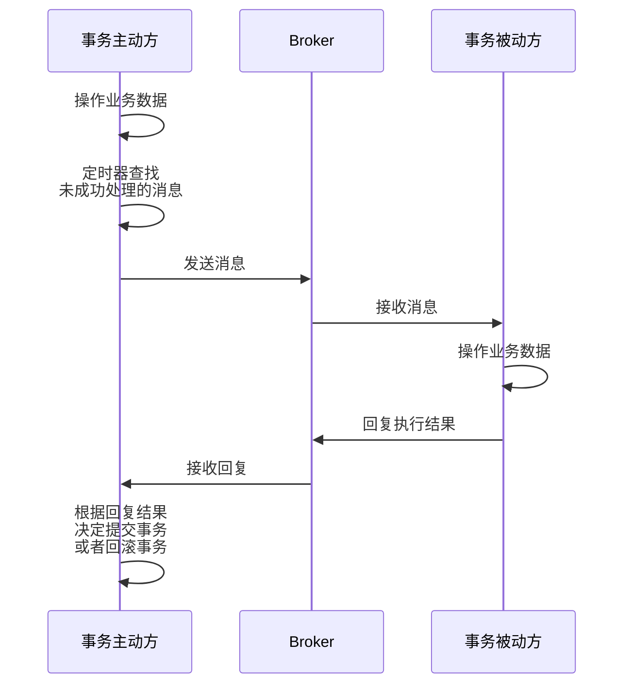

这里有两个要点:

- **消息幂等性**：服务器发出的一条消息，只能被处理一次
- **失败重试**：使用定时器将之前未成功处理的消息重新发送

这一机制依赖业务代码实现其中的一些功能，例如消息重发等，效率不高，适合低吞吐事务场景。

### RocketMQ 事务消息

RocketMQ 提供了原生的事务消息的机制。它从底层上来讲还是使用了两阶段提交的方式，确保消息的可靠传递，保障了较高的一致性，适用于电商、金融等场景。

它的主要流程是这样的：

- 生产者将消息内容、主题、队列 ID 等组装起来作为 Half 消息到 Broker 中，Broker 取出其中的主题、队列 ID 等作为消息属性，然后将其放入 `RMQ_SYS_TRANS_HALF_TOPIC` 主题的 `0` 号队列中。这个队列是一个特殊的队列，对于消费者来讲是不可见的
- 生产者在成功发送完消息后，执行本地事务。根据本地事务的执行结果，生产者向 Broker 发送 Commit 或者 Rollback 消息。该消息为单向消息，不会等待 Broker 的回复
- Broker 收到消息后
  - 如果收到 Commit，那么就将 Half 消息重新组装，放入正确的主题和队列投递出去；然后将 Half 消息放入 `RMQ_SYS_TRANS_OP_HALF_TOPIC` 主题中，表明这个消息以及处理过
  - 如果收到 Rollback，只会将 Half 消息放入 `RMQ_SYS_TRANS_OP_HALF_TOPIC` 主题中
- Broker 有一个定时服务，遍历 `RMQ_SYS_TRANS_OP_HALF_TOPIC` 中的内容，对 `RMQ_SYS_TRANS_HALF_TOPIC` 去重找到还没处理过的消息。然后对找出来的消息进行反查，这个反查请求是单向的。
- 如果多次反查都没有收到回复，那么就按照 Rollback 处理

这里会发现，RocketMQ 不会立刻删除 Half 消息，而是先保存已经处理过的消息，然后通过定时任务去重。这是因为 RocketMQ 使用的是顺序追加写入，短时间内不会更改已经写入的消息。每次反查时会将 Half 消息再入盘一次，这样一来，可以记录下反查的次数。

RocketMQ 事务消息有两点特点：

- 确保本地事务和消息发送要么同时成功，要么同时失败
- 增加事务反查机制，提高事务执行的成功率

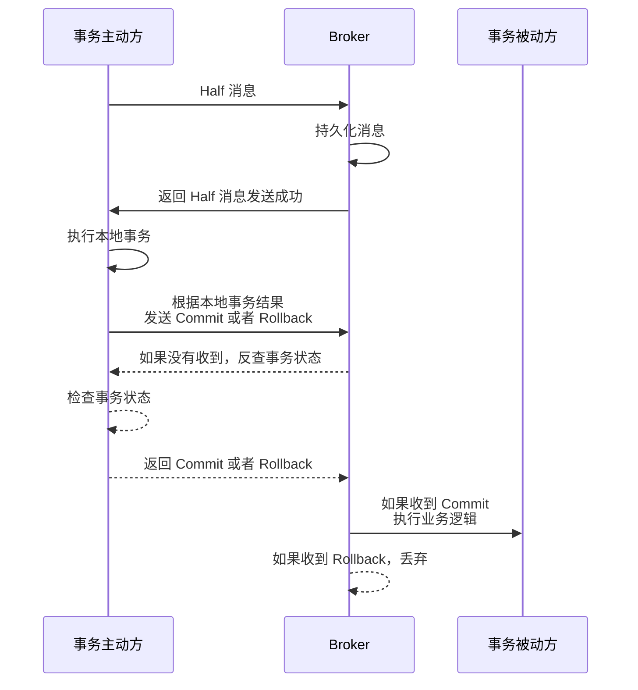

### Kafka 事务消息

RocketMQ 解决了本地事务执行和消息发送之间的约束，而 Kafka 则解决了一次性发送多个消息时多个消息之间的约束。对于 Kafka 来讲，多个消息要么同时成功，要么同时失败。这有点像我们之前讲的 TCC 模型。

不过它的事务消息并不是那种原生的，而是依靠幂等机制来实现 Exactly Once 语义。

> 消息可靠性分为三种：
>
> - At Most Once：消息可能会丢失，但不会重复
> - At Least Once：消息不会丢失，但可能会重复
> - Exactly Once：消息不会丢失，也不会重复
>
> 事务消息的目标是实现 Exactly Once 语义

Kafka 的 Exactly Once 就是纯骗，它并不是说从生产者到消费者的整个过程都既不会丢失也不会重复，而是说从 Kafka 的一个主题到另一个主题满足 Exactly Once 语义。

这一特性是通过事务 ID 来实现的。Kafka 会为每个事务生成一个事务 ID，然后将这个事务 ID 附加到消息中。消费者在消费消息时，会根据事务 ID 来判断消息是否重复。

它的具体流程是这样的：

- 事务开始时，生产者像协调者发送一个事务开始请求，协调者将它记录到事务日志中，标记为 `ongoing`
- 然后生产者开始边执行事务，边发送一堆真正的事务消息。这些事务消息就记录在普通的消息队列中。如果消费者愿意的话，现在就消费也不是不行
- 事务结束时，生产者向协调者发送一个提交或者回滚请求
- 如果是提交请求
  - 协调者会首先执行预提交操作，即将事务状态从 `ongoing` 改为 `prepare`，并写入事务日志
  - 然后向事务分区发送事务结束的消息，并向事务日志写入 `committed` 状态
  - 消费者收到事务结束的消息后，放心大胆地消费刚刚普通消息队列里传来的消息
- 如果是回滚请求
  - 协调者会首先执行预回滚操作，即将事务状态从 `ongoing` 改为 `abort`，并写入事务日志
  - 然后向事务分区发送事务结束的消息，并向事务日志写入 `aborted` 状态
  - 消费者收到事务结束的消息后，将普通消息队列中的消息丢弃

Kafka 的事务消息有两点特点：

- 确保一次性发送多个消息要么同时成功，要么同时失败
- 是否消费事务的逻辑由消费者的业务代码实现

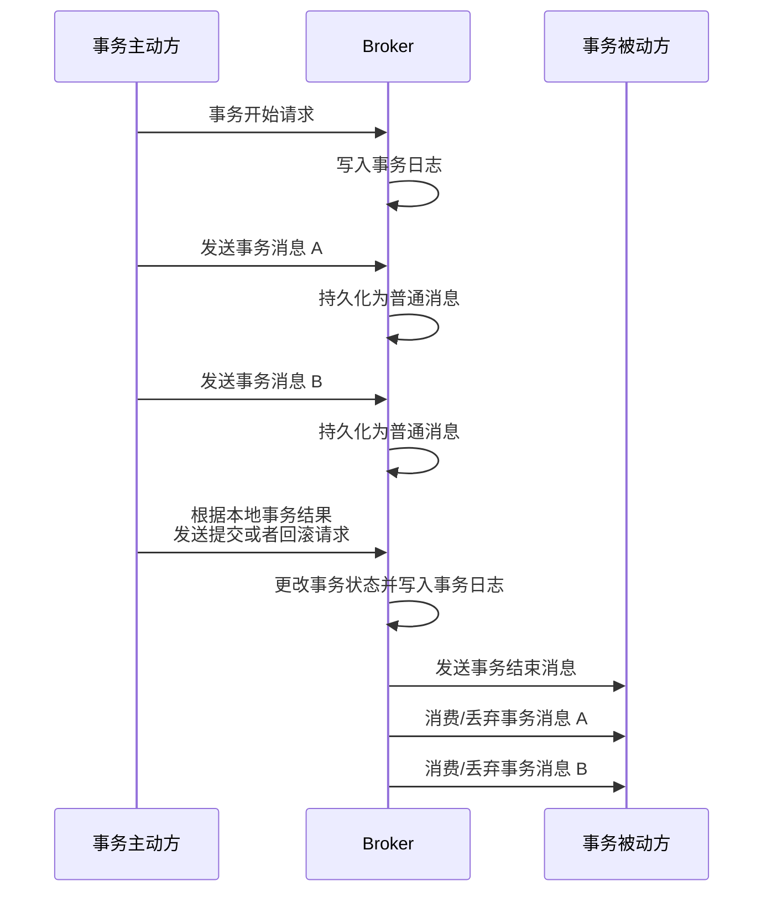

## Kafka

现在，我们来看看 Kafka 独有的一些特性。

### 多副本

前文讲到，Kafka 的每个分区都有一个文件。事实上，这个文件会有多个副本，其中选出一个作为 Leader，其他的作为 Follower。写入的操作会写入到 Leader，然后 Leader 会将消息同步到 Follower。读取时，可以从 Leader 或者 Follower 中读取。

这个部分本来内容挺多的。然而，这和 Redis 的主从复制几乎一模一样，我[之前已经写过](https://blog.ch3nyang.top/post/Redis%E9%9B%86%E7%BE%A4/)，所以这里就不再赘述了。

### 分布式

在 Kafka 2.8 之前，Kafka 的分布式是通过 Zookeeper 来实现的。Zookeeper 主要完成了以下工作：

- **Broker 注册**：Zookeeper 上有一个节点专门用来记录 Broker 列表，每个 Broker 启动时都会在这个节点下注册自己
- **Topic 创建**：Kafka 中，每个主题都会被分成多个分区，而每个分区可能分布在不同的 Broker 上。Zookeeper 会记录主题包含的分区、以及分区和 Broker 的映射关系
- **负载均衡**：Zookeeper 可以根据分区数量和消费者的情况来对分区进行负载均衡，将分区均衡分配给 Broker

当然，目前 Kafka 以及使用上了 KRaft 协议，不再依赖 Zookeeper。
