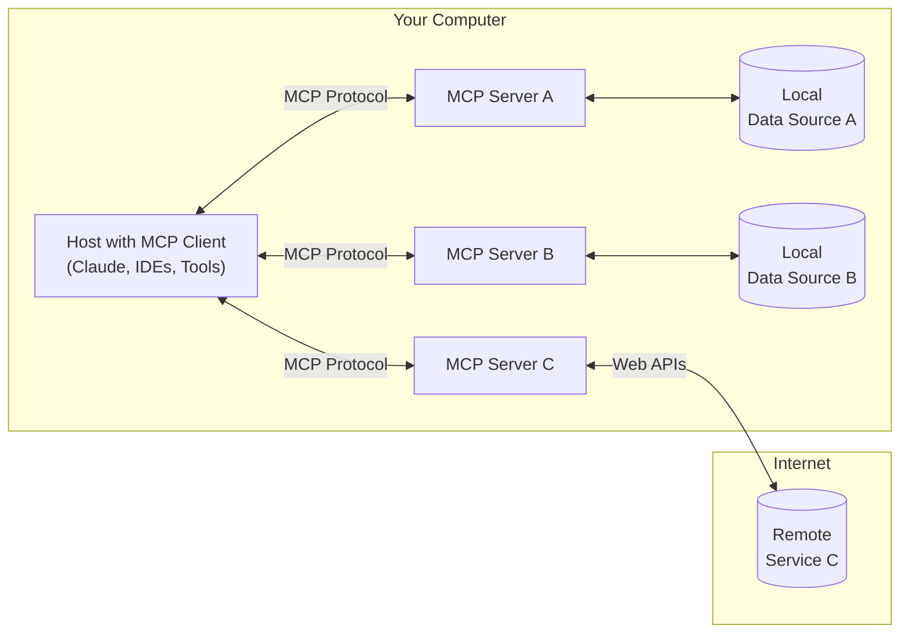
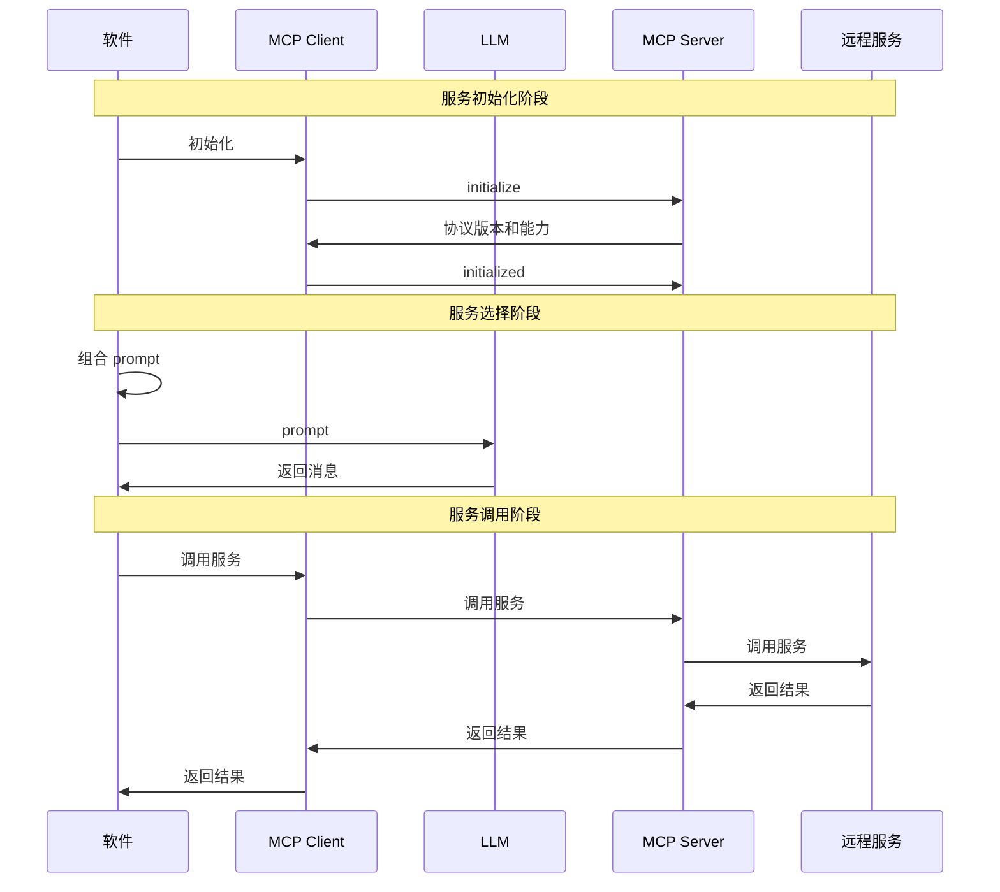

MCP 已经推出一段时间了，今天我们来聊聊它的原理和我的看法。

## 什么是 MCP？

MCP 作为一个协议，其参与方包括：

- **LLM**：大语言模型，例如 GPT、Claude 等
- **MCP Hosts**：本地软件，负责处理用户的请求
- **Local Data Sources**：本地数据源，例如文件、数据库等
- **Remote Services**：远程调用的服务，例如地图、翻译工具等
- **MCP Client**：每个软件可以有多个 MCP Client，每个 MCP Client 对应一个本地或远程服务
- **MCP Server**：负责处理 MCP Client 的请求，每种服务只有一个 MCP Server

这里借用一张 MCP 官网上的图：

MCP 在使用时按照如下步骤进行：

1. **服务初始化阶段**：软件向其所有 MCP Client 发送初始化指令
    1. MCP Client 发送 `initialize` 指令，请求开始初始化
    2. MCP Server 返回协议版本和能力（可用的服务调用列表）
    3. MCP Client 发送 `initialized` 指令，表示初始化完成
2. **服务选择阶段**：软件确定要调用的服务及其参数
    1. 软件结合第一步得到的能力列表，组合为 prompt
    2. 软件向大模型发送 prompt
    3. 大模型返回消息，其中包含了要调用的服务和参数
3. **服务调用阶段**：软件根据大模型的返回值，调用相应的服务

值得注意的是，在 MCP 协议中，正常通信使用的都是 HTTP / SSE 协议，只有 MCP Client 向 MCP Server 调用具体服务时使用了 JSON-RPC 协议。

## MCP 好用吗？

目前来看，MCP 最大的作用就是一统天下，给新概念层出不穷的 LLM 服务调用方案提供了一个统一的接口。基于 Anthropic 的影响力，应该会有越来越多的服务提供商跟进，形成良好的社区生态，从而进一步形成壁垒。

然而，就我个人来看，MCP 目前的实现还是有些问题的：

1. **脱裤子放屁**

    MCP 主要做了两件事情：获取可用服务、选择并调用服务。熟悉微服务架构的朋友们一看就会发现，这不就是 RPC 嘛！你要再看仔细一点，MCP 最终调用服务的时候使用的还是 JSON-RPC 协议，这下子基本可以认为它是 RPC 套壳了。

2. **LLM 上下文长度限制**

    MCP 需要收集远程服务的接口，而在接口数量较多的情况下（比如 GPTs 有数百万个），LLM 很难处理这么长的上下文。

3. **过于依赖 LLM 的能力**

    MCP 软件最终调用的服务还是通过 LLM 给出。显然，不同的 LLM 可能会给出不同的服务调用，这根本无法保证服务调用的正确性。比如说，LLM 可能会给出一个不存在的服务，或者给出错误的参数，这些都需要软件自己去处理。

4. **服务必须实现 MCP Server**

    就这一点来讲，MCP 协议真的是烂中烂。在传统 RPC 下，服务只需要实现一个 API 接口，软件使用时可以直接调用这个接口。然而，在 MCP 协议下，服务必须实现一个 MCP Server，这就导致了服务的实现变得更加复杂。并且，MCP Server 还需要处理 SSE 和 JSON-RPC 两种协议，这无疑增加了开发和维护的成本。

5. **无视安全问题**

    我深度怀疑 MCP 协议的设计者对网络安全一无所知。MCP 协议的设计完全无视了网络安全问题，尤其是数据隐私和身份验证。MCP 协议没有提供任何身份验证机制，这就意味着任何人都可以伪造 MCP Client 向 MCP Server 发送请求，从而获取敏感数据。此外，MCP 协议也没有提供任何加密机制，这就意味着数据在传输过程中可能会被窃取或篡改。

6. **token 成本**

    由于 MCP 协议的设计，LLM 在处理请求时需要考虑到所有可用的服务和参数，这无疑增加了 token 的消耗。对于一些 token 成本较高的 LLM 来说，这无疑是一个巨大的负担。当然，MCP 协议的设计者可能会认为这是一个合理的 trade-off，但我个人认为这并不是一个好的设计。

7. **协议缺乏规范化**

    这一点没什么可解释的。当今所有互联网协议都是有 RFC 的，对比这些 RFC 和 MCP 协议的描述，你会发现 MCP 似乎从来没有考虑过协议的规范化问题。MCP 协议的设计者似乎认为，协议的实现是由 MCP Server 来完成的，而不是由协议本身来完成的。这就导致了 MCP 协议的实现非常不规范，甚至可以说是随意。

当然，Anthropic 自己也注意到了相关的问题，在它们的 Roadmap 中，注册、验证、治理等功能的实现都被提上了日程。尽管可以相信 MCP 未来一定会逐步完善，但搞出这么个半成品协议就发布出来，属于是拉了一大坨，还有一堆媒体跟风上去舔！

## A2A 呢？

Google 最近也发布了一个 A2A 协议，自称是 MCP 的补充。

相比于 MCP，A2A 协议的设计做了以下补充：

- **多 Agent**

    相比于 MCP 协议处理了 Agent 和服务的关系，A2A 协议处理了 Agent 和 Agent 之间的关系。也就是说，A2A 协议允许多个 Agent 之间进行通信，可以使它们协同工作。

- **代理发现**

    A2A 协议允许 Agent 之间进行发现和注册，这样它们就可以相互调用。熟悉微服务架构的朋友们又要说了，这不就是注册中心嘛！

- **默认安全性**

    A2A 协议的设计者考虑到了安全性问题，协议中包含了一些安全机制。

- **规范化**

    A2A 协议的设计者考虑到了协议的规范化问题，相比于 MCP 协议，A2A 协议更像一个真正的“协议”了。

当然，目前来看，A2A 对 MCP 的改进还是比较有限的。只不过，在当下 LLM 飞速发展的情形下，类似的协议一定会出现 —— Anthropic 和 Google 不做的话，其他公司也会做。希望这样的协议能尽快达到可用的程度，给 LLM 的发展带来更多的可能性。
