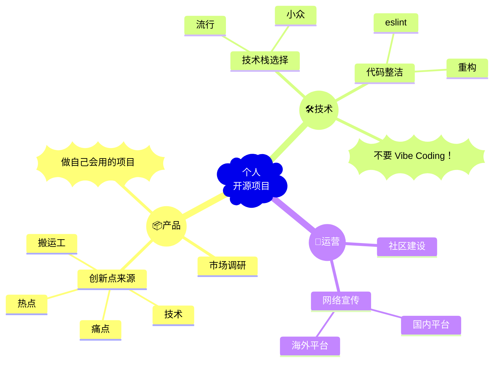

在过去的大半年里（好严谨点讲是一年），我在 GitHub 种下了三个 “瓜”。没想到，这几个瓜蛋子还挺争气，个个都骗到...啊不，斩获了超过 100 个 stars！

乡亲们，先来看看我种的瓜：

| 项目 | 截图 |
| --- | --- |
|  基于 WebRTC 的端到端文件传输工具 *2024-06-19 启动 / 2024-12-02 发布* *单日最多 172 stars* |  |
|  GitHub 年终个人总结 *2024-12-14 启动 / 2024-12-15 发布* *单日最多 26 stars* |  |
|  一键部署的端口状态监控工具 *2025-07-20 启动 / 2025-07-24 发布* *单日最多 53 stars* |  |

就在第三个项目发布前夜，我沐浴焚香，掐指一算，嘿，您猜怎么着？这波 100+ stars 肯定稳了！

这不是我飘了，而是经过无数个掉头发的夜晚，我好像...摸索出了一套让个人开源项目一不小心就火起来的独门秘籍。

今天我就不藏私了，把这套 “骗 Star 大法” 总结为三板斧：产品、技术、运营。

## 第一板斧：产品

### 做个让用户 “哇哦” 的项目

想让路过的英雄好汉给你点亮一颗 star，无非是挠到了他们的某个 “痒处”。总结下来有四种 “仙丹”：

- **解决痛点**：这世上有一种痛，叫 “求而不得”。你解决用户的某个实际问题，而这个问题从来没有人解决过。
  
  例如我自己的项目  就是唯一一个同时支持了局域网和广域网的端到端文件传输工具。

- **蹭热点**：紧跟潮流，利用热门话题或者技术吸引用户关注。你要做的，就是在风口上当那只最靓的猪。

  例如我朋友的  在去年的诺贝尔奖颁布时发布，正好抓住了热点。

- **顶尖技术**：拥有削铁如泥的屠龙刀，强到有公司愿意使用它。

  这就太多了，较为经典的比如  等等，用的人确实非常多。

- **awesome**：做知识的搬运工，搞一些为 `awesome-xxx` 的项目或是一些教程。

  例如我同学做的  就是一个教程，star 数目非常恐怖。

从这四颗 “神丹” 里炼一颗，你的项目就有了个不错的 “药引子”。

### 不走寻常路

我的每个项目，都逃不过用户的灵魂拷问：

- *这个项目和 xxx 项目有啥区别？*
- *能不能加入类似 xxx 项目的功能？*

所以，在撸起袖子开干前，先花五分钟看看别人家的孩子：

1. 市面上有哪些同类的开源 / 商业项目？
2. 这些项目的优缺点是什么？
3. 我的想法能否弥补它们的不足？

最后，对着镜子，扪心自问：**我特喵真的有必要重复造轮子吗？**

说句扎心的，绝大多数开源项目无人关注的根本原因就是重复造轮子。毕竟，用户凭啥要抛弃用顺手的旧爱，投入你这个没啥亮点的备胎的怀抱？

同时，我想提醒一句，我们的创新点最好是从第一步得到，而不是通过这样的市场调研。靠调研憋出来的 “创新”，大概率是脱裤子放屁。读过研究生的应该明白这个道理。

### 做自己经常用的项目

搞开源，本质上是一场用爱发电的苦修。没有 KPI，没有奖金，只有数不尽的 Issue 和 PR，还有几个难缠的傻宝用户。

很多项目作者，脑子一热，“我觉得这个 idea 别人会喜欢”，然后就开搞了。结果一个月后，GitHub 仓库长草，上次更新还停留在 `init commit`。

我个人的经验是，做一个*自用型项目*，可以大大提高开源的积极性。而且在使用过程中，你会不断发现 “哎呀这里有个 bug”、“咦那里还能再优化”，从而推动自己不断完成项目的迭代更新，通过长期的维护吸引用户使用。

## 第二板斧：技术

技术，可以说是*绝大多数*开源项目中最不重要的一部分。我们甚至能看到，一些项目的代码写得和一坨 💩 没有任何区别，照样几千个 star。

### 技术栈的选择

话虽如此，在开始写项目前，技术选型还是很重要的。通常，无外乎两种情况：

- 我们可以选择一些流行的技术栈来构建项目，这样开发速度更快，社区支持也更好，遇到问题随便一搜就有一堆 “老中医”。比方说，

  - 前端选用 、 等框架，再用  之类的构建工具
  - 后端选用 Python、Java、Golang、Cpp 等主流语言，搭配上 、、 等框架

  我还观察到，目前一众 “独立开发者” 偏爱 ，这应该是被 Vercel 传销了。

  不过，选用流行技术的坏处是，想要登上 GitHub Trending 比抢到春运火车票还难，而且需要在功能上做出足够的创新。

- 当然，我们也可以选择一些小众的技术栈来构建项目，这样本身就会收获对这项技术感兴趣的用户。

  要是放到几年前，这基本就是在点名重写一切的 Rust——
  
  ***语言神，启动！***
  
  而现在，也依然有数不清的小众技术栈可供选择。比如，我最近就在试着用  来写一个项目（好像也不是那么小众了）。

  当然，选用小众技术的坏处是，你很有可能遇到一些技术栈本身存在的问题，不得不等待社区修复，或者自己动手。这就不得不提到，我之前使用某项目时遇到一个 bug，动手帮着修复并提交了 PR，结果作者过了半年才想起来上线合并！

### 不要定时炸弹

在公司，我们可以~~写出无人能够维护的代码，防止自己被裁~~。而对于开源项目，干净整洁的代码既方便自己迭代，也能吸引别的开发者来添砖加瓦。然而，自己的项目往往没有人帮着 CR，初期架构设计也很难做到完美。

我的经验是主要有两条：

- 在项目初期，就引入对应的 eslint，并且将其加入到 CI 流程（即 GitHub Actions）中。这样可以尽早发现代码中的问题，不至于自己都看不懂自己的代码

- 项目每经过一段时间，就评估是否需要重构。通常来说，重构的时机有：

  - 在优化迭代过程中，代码中添加了越来越多的功能，最好分离成多个模块
  - 某些复杂功能的逻辑越来越繁琐，最好抽离成独立的函数或类
  - 项目初期直接定义了一些全局变量、工具函数，后期希望能有更好的封装

记住，漂亮的代码能提升食欲，而屎山代码...能让你当场戒掉夜宵。

### 求你了，不要 Vibe Coding！

**不要 Vibe Coding！不要 Vibe Coding！不要 Vibe Coding！**

AI 辅助编程是少不了的，但 Vibe Coding 出来的代码真的是一坨。你要对最终产出的代码负责！

## 第三板斧：运营

### 社区建设

就跟你刷约会软件会在主页放上 PS 过的照片，并写上酒吧舞毕业 / xx 大厂程序员一样，README 就是开源项目的门面，好的 README 能够一下子抓住用户。相反，对于那类 README 只有一行字的项目，我通常会直接关闭页面，内心毫无波澜。

当然，不止是 README，开源项目的社区建设还包括了很多容易被忽视的方面。我自己常做的包括：

- **`LICENSE`**：提供清晰的开源协议，确保用户可以合法使用和贡献代码，这个最好在第一次提交代码时就添加上
- **`CONTRIBUTING`**：提供贡献指南，帮助用户了解如何参与项目
- **`Issue Template`**：提供清晰的 Issue 模板，帮助用户更好地描述问题或功能请求
- **`PR Template`**：提供 PR 模板，帮助贡献者更好地提交代码
- **`Code of Conduct`**：提供行为准则，确保社区的友好和包容
- **`SECURITY`**：提供安全报告渠道，确保用户可以安全地使用项目

此外，如果项目有前端或者 CLI，建议贴一张截图，或者提供一个在线 Demo。一张图胜过千言万语，一个 Demo 能直接俘获人心。

### 吆喝叫卖

酒香也怕巷子深，再好的开源项目也需要宣传。我记得  说过他当初的  项目就是靠登上 Hacker News 榜首才一炮而红。

个人开发者想登上 Hacker News 的首页实在很难，但我们可以多渠道宣传自己的项目。我们分为国内和国外来谈。（*下面是真干货*）

#### 国内

国内的开源宣传平台倒是不少，不过基本都没啥人关注。比较有用的主要包括：

- [科技爱好者周刊](https://www.ruanyifeng.com/blog/weekly/)：每周发布一次，主要关注技术和开源项目，可以通过邮件 / RSS 订阅。这个周刊的读者数量是真的恐怖，我的几个开源项目都是靠登上周刊获得了一大波关注
- [小众软件](https://meta.appinn.net/)：这里主要是一些比较好玩的应用，商业项目也可以发这里。我觉得这个平台最大的好处是，用户真的很热情，会给你很多有价值的反馈
- [ahhhhfs](https://www.ahhhhfs.com/)：一个博主，人称 A 姐。她的关注量也比较大，不过需要她觉得有意思的项目才会发
- [少数派](https://sspai.com/)：这个平台不用多说了，但我感觉更适合商业项目的宣传
- [1Link.Fun](https://1link.fun/)：每周总共 10 条项目或者文章，贵精不贵多，订阅数很高，而且作者会很用心地帮你写介绍
- [即刻](https://web.okjike.com/)：活跃用户很多，独立开发项目会更适合这个平台
- [V2EX](https://www.v2ex.com/)：知名社区，不过现在社区氛围逐渐变得一言难尽，而且需要邀请码注册

#### 海外

海外我其实没怎么关注，不过有几个平台还是比较有名的：

- [Hacker News](https://news.ycombinator.com/)：发 `Show HN` 的帖子，通常会获得一些关注。不过，Hacker News 的用户比较挑剔，项目质量一定要过关
- [Reddit](https://www.reddit.com/)：有很多技术相关的 subreddit，像是 `r/IMadeThis`、`r/programming` 等等。不过，很多 subreddit 有 karma 门槛，冒然发帖容易被当成广告删掉。
- [Product Hunt](https://www.producthunt.com/)：每天会有很多新产品发布，还有投票功能。然而，这个平台对中国的用户并不友好，甚至可以说是歧视，感兴趣的可以看看  和它的恩怨故事。

## 总结以及一些疑问

为了方便大家参考，我把这三板斧总结成了一张 mindmap：

虽然我已经能熟练地 “炮制” 一个 100+ star 的项目，但还有两个终极问题困扰着我：

1. **如何持续增长，而不是出道即巅峰？** 项目通常在高强度宣传的那段时间涨 star 很快，但没多久，一天就涨不到 1 个 star 了。如何获得源源不断的关注？
2. **如何吸引更多的贡献者，而不是单打独斗？** 我偶尔会收到一些 PR，但大多数时候都是我自己在维护项目。如何让~~忽悠~~吸引更多人参与进来？

这些问题我还在思考中，也欢迎大家分享自己的经验和看法。
