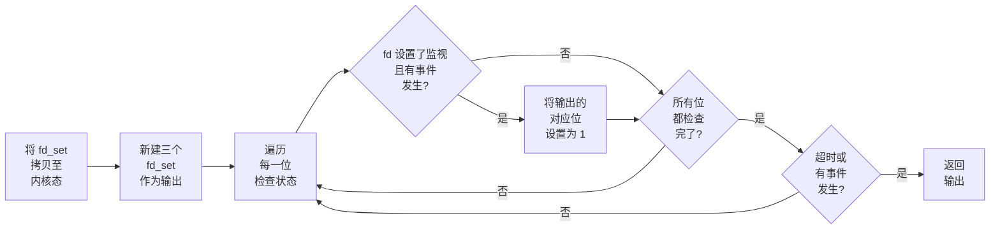

***如何让一台服务器接受尽可能多的连接？***


The **C10k problem** is the problem of optimizing network sockets to handle a large number of clients at the same time. The name C10k is a numeronym for concurrently handling ten thousand connections. Handling many concurrent connections is a different problem from handling many requests per second: the latter requires high throughput (processing them quickly), while the former does not have to be fast, but requires efficient scheduling of connections.


早在 1999 年，Dan Kegel 就提出了 `C10K` 问题[^1]，旨在解决如何让一台服务器同时处理 10,000 个连接的问题；到了 2010 年前后，这个问题变为了 `C10M`——即如何用 1U 服务器处理 10,000,000 个连接；而如今，随着服务器性能和网络技术的发展，这个数字还在不断攀升。

[^1]: Kegel, Dan. "The C10K Problem." 1999. [Link](https://www.kegel.com/c10k.html)

在最基本的 socket 编程模型中，服务器通常采用阻塞 I/O 模型，即每个连接都对应一个线程或进程。当面临成千上万个连接时，我们就不得不开启成千上万个线程或进程，这会消耗大量的系统资源，并导致频繁的上下文切换，严重影响性能。

为了解决这个问题，操作系统提供了多种 I/O 模型，使得单个线程或进程能够同时处理多个连接，从而大幅提升服务器的并发处理能力。今天我们就来聊聊，是什么技术，使得这一切成为可能。

## `select`

### 基本使用

`select` 是 Unix/Linux 系统中最传统的 ​​I/O 多路复用机制之一，它允许程序同时监视多个 fd（如 socket、管道等），并在其中任何一个 fd 就绪（read / write / except）时通知应用程序进行处理。

`select` 的函数原型在 `sys/select.h` 中：

```c
int select (int nfds,
            fd_set *readfds,
            fd_set *writefds,
            fd_set *exceptfds,
            struct timeval *timeout);
```

其中，

- `nfds` 是需要监视的 fd 的数量；
- `readfds` 是一个 fd 集合，用于监视可读事件；
- `writefds` 是一个 fd 集合，用于监视可写事件；
- `exceptfds` 是一个 fd 集合，用于监视异常事件；
- `timeout` 是一个指向 `struct timeval` 的指针，用于设置超时时间。设置为 `NULL` 表示无限等待，设置为 `{0, 0}` 表示立即返回。

`select` 函数会阻塞当前线程，直到其中有至少一个 fd 就绪，或者长时间没有 fd 就绪而导致超时。它的返回值：

- 正常情况下，返回就绪的 fd 数量；
- 如果超时，返回 `0`；
- 如果出错，返回 `-1`。

> `fd_set` 是一个特殊的结构体，用于表示 fd 集合。它被定义为：
>
> ```c
> #define __FD_SETSIZE 1024
> 
> typedef long int __fd_mask;
> #define __NFDBITS (sizeof(__fd_mask) * 8)
> 
> typedef struct {
>     __fd_mask fds_bits[__FD_SETSIZE / __NFDBITS];
> } fd_set;
> ```
>
> `fd_set` 是一个 bitmap，每个 fd 对应一个比特位，比特位为 `1` 表示 fd 已就绪。它总共有 `__FD_SETSIZE` 即 1024 位，因此 `select` 最多只能监视 1024 个 fd 。
>
> `fd_set` 主要依靠四个宏来操作：
>
> - `FD_ZERO(fdsetp)`：将 `fdsetp` 中的所有比特位置 `0`
> - `FD_SET(fd, fdsetp)`：将 `fdsetp` 中对应 `fd` 的比特位置 `1`
> - `FD_CLR(fd, fdsetp)`：将 `fdsetp` 中对应 `fd` 的比特位置 `0`
> - `FD_ISSET(fd, fdsetp)`：检查 `fdsetp` 中对应 `fd` 的比特位是否为 `1`
>
> 这些宏的实现在 `select.h` 中。
>
> <details>
> <summary>点击查看源码</summary>
> <div markdown="1">
>
> ```c
> #define __FDS_BITS(set) ((set)->fds_bits)
>
> #define __FD_ZERO(s)                                                 \
>     do {                                                             \
>         unsigned int __i;                                            \
>         fd_set *__arr = (s);                                         \
>         for (__i = 0; __i < sizeof(fd_set)/sizeof(__fd_mask); ++__i) \
>             __FDS_BITS[__arr](__i) = 0;                              \
>     } while (0)
> #define __FD_SET(d, s)                                               \
>     ((void)(__FDS_BITS[s](__FD_ELT(d)) |= __FD_MASK(d)))
> #define __FD_CLR(d, s)                                               \
>     ((void)(__FDS_BITS[s](__FD_ELT(d)) &= ~__FD_MASK(d)))
> #define __FD_ISSET(d, s)                                             \
>     ((__FDS_BITS[s](__FD_ELT(d))&__FD_MASK(d)) != 0)
>
> #define FD_SET(fd, fdsetp)   __FD_SET (fd, fdsetp)
> #define FD_CLR(fd, fdsetp)   __FD_CLR (fd, fdsetp)
> #define FD_ISSET(fd, fdsetp) __FD_ISSET (fd, fdsetp)
> #define FD_ZERO(fdsetp)      __FD_ZERO (fdsetp)
> ```
>
> </div>
> </details>

在使用 `select` 时，需要依次：

1. 使用 `FD_ZERO` 清空 `fd_set`
2. 使用 `FD_SET` 将需要监视的 fd 添加到 `fd_set` 中
3. 调用 `select` 函数进行监视
4. 对返回的 `fd_set` 进行处理，使用 `FD_ISSET` 检查哪些 fd 就绪

下面是一个典型的 `select` 使用示例[^3]。

[^3]: [select(2) - Linux Manual Page](https://man7.org/linux/man-pages/man2/select.2.html)

<details>
<summary>点击查看代码</summary>
<div markdown="1">

```c
#include <stdio.h>
#include <stdlib.h>
#include <sys/select.h>
#include <sys/time.h>

int
main(void)
{
    int             retval;
    fd_set          rfds;
    struct timeval  tv;

    // 监控 stdin (fd 0) 是否有输入
    FD_ZERO(&rfds);
    FD_SET(0, &rfds);

    // 超时时间设置为 5 秒
    tv.tv_sec = 5;
    tv.tv_usec = 0;

    retval = select(1, &rfds, NULL, NULL, &tv);
    // 此时，tv 可能已经被修改

    if (retval == -1)
        perror("select()");
    else if (retval)
        printf("Data is available now.\n");
        // FD_ISSET(0, &rfds) 为真
    else
        printf("No data within five seconds.\n");

    exit(EXIT_SUCCESS);
}
```

</div>
</details>

### 源码解读

`select` 内部执行时经过了以下步骤：

1. 将传入的 `fd_set` 拷贝至内核态
2. 再新建三个 `fd_set` 作为输出（in / out / except）
3. 遍历每一位，如果设置了监视且有事件发生，则将输出的对应位设置为 `1`
4. 如果没有事件发生，则阻塞等待
5. 如果有事件发生或超时，则返回输出



为了合理调度资源，`select` 还引入了许多优化机制：

- **栈空间优先**

  当 `select` 需要处理的 fd 数量较少（少于 256）时，内核会优先使用栈空间来存储 `fd_set`，这样可以减少内存分配的开销。而当数量较多时，才会使用堆空间分配。

- **忙等待**

  忙等待主要被用于网络驱动中。对于高频小包网络应用，可以减少上下文切换和中断处理的开销，从而提高性能。

  忙等待的触发需要同时满足以下条件：

  - 网络子系统启用忙等待
  - 当前没有更高优先级的任务需要调度
  - 至少有一个socket设置了 `SO_BUSY_POLL` 选项
  - 没有检测到任何就绪事件

  在每次主循环检查时，会计算当前时间与上次忙等待开始的时间差，如果超过了忙等待的超时时间（通常设置为 2 个 CPU 周期），则会执行一次正常的检查流程。

- **延迟唤醒**

  在初始化时，`wait->_qproc` 会指向 `__pollwait()` 函数。这个函数相当于一个回调函数，当有事件发生时，内核会调用这个函数来唤醒等待的进程。

  当文件描述符就绪时，会将 `_qproc` 置为 `NULL`，这样后续检查时，可以避免重复唤醒。

以目前最新的 Linux 6.16 为例，`select` 的实现在 `fs/select.c` 中[^2]。

[^2]: [Linux Kernel Source - fs/select.c](https://elixir.bootlin.com/linux/v6.16/source/fs/select.c#L483-L726)

<details>
<summary>点击查看源码解析</summary>
<div markdown="1">

系统调用的入口：

```c
SYSCALL_DEFINE5(select, int, n, fd_set __user *, inp, fd_set __user *, outp,
                fd_set __user *, exp, struct __kernel_old_timeval __user *, tvp)
{
    return kern_select(n, inp, outp, exp, tvp);
}
```

核心处理函数：

```c
static int kern_select(int n, fd_set __user *inp, fd_set __user *outp,
                       fd_set __user *exp, struct __kernel_old_timeval __user *tvp)
{
    struct timespec64 end_time, *to = NULL;
    struct __kernel_old_timeval tv;
    int ret;

    // 如果设置了超时时间，则拷贝进内核态并转换为 timespec64
    if (tvp) {
        if (copy_from_user(&tv, tvp, sizeof(tv)))
            return -EFAULT;

        to = &end_time;
        if (poll_select_set_timeout(to,
                                    tv.tv_sec + (tv.tv_usec / USEC_PER_SEC),
                                     (tv.tv_usec % USEC_PER_SEC) * NSEC_PER_USEC))
            return -EINVAL;
    }

    // 处理核心逻辑（见下文）
    ret = core_sys_select(n, inp, outp, exp, to);
    // 处理结果
    return poll_select_finish(&end_time, tvp, PT_TIMEVAL, ret);
}
```

核心处理逻辑：

```c
int core_sys_select(int n, fd_set __user *inp, fd_set __user *outp,
                    fd_set __user *exp, struct timespec64 *end_time)
{
    fd_set_bits fds;
    void *bits;
    int ret, max_fds;
    size_t size, alloc_size;
    struct fdtable *fdt;
    long stack_fds[SELECT_STACK_ALLOC/sizeof(long)];

    ret = -EINVAL;
    if (unlikely(n < 0))
        goto out_nofds;

    rcu_read_lock();
    fdt = files_fdtable(current->files);
    max_fds = fdt->max_fds;
    rcu_read_unlock();
    if (n > max_fds)
        n = max_fds;

    // 总共需要 6 个 bitmap，分别存储 in/out/ex 的输入和输出
    size = FDS_BYTES(n);
    // 如果数量较少，则使用栈分配
    bits = stack_fds;
    if (size > sizeof(stack_fds) / 6) {
        ret = -ENOMEM;
        if (size > (SIZE_MAX / 6))
            goto out_nofds;
        alloc_size = 6 * size;
        // 如果数量较多，则使用堆分配
        bits = kvmalloc(alloc_size, GFP_KERNEL);
        if (!bits)
            goto out_nofds;
    }
    fds.in      = bits;
    fds.out     = bits +   size;
    fds.ex      = bits + 2*size;
    fds.res_in  = bits + 3*size;
    fds.res_out = bits + 4*size;
    fds.res_ex  = bits + 5*size;

    // 将用户态的 fd_set 拷贝至内核态
    if ((ret = get_fd_set(n, inp, fds.in)) ||
        (ret = get_fd_set(n, outp, fds.out)) ||
        (ret = get_fd_set(n, exp, fds.ex)))
        goto out;
    // 清空输出
    zero_fd_set(n, fds.res_in);
    zero_fd_set(n, fds.res_out);
    zero_fd_set(n, fds.res_ex);

    // 调用 do_select 进行实际监控（见下文）
    ret = do_select(n, &fds, end_time);

    if (ret < 0)
        goto out;
    if (!ret) {
        ret = -ERESTARTNOHAND;
        if (signal_pending(current))
            goto out;
        ret = 0;
    }

    // 将结果拷贝回用户态
    if (set_fd_set(n, inp, fds.res_in) ||
        set_fd_set(n, outp, fds.res_out) ||
        set_fd_set(n, exp, fds.res_ex))
        ret = -EFAULT;

 out:
     if (bits != stack_fds)
         kvfree(bits);
 out_nofds:
       return ret;
}
```

关键监控逻辑：

```c
// 可读事件包括：普通数据可读、优先级带数据可读、数据可读、挂起、错误、无效
#define POLLIN_SET  (EPOLLRDNORM | EPOLLRDBAND | EPOLLIN | EPOLLHUP | EPOLLERR | \
                     EPOLLNVAL)
// 可写事件包括：普通数据可写、优先级带数据可写、数据可写、错误、无效
#define POLLOUT_SET (EPOLLWRBAND | EPOLLWRNORM | EPOLLOUT | EPOLLERR |           \
                     EPOLLNVAL)
// 异常事件包括：高优先级数据可读、无效
#define POLLEX_SET  (EPOLLPRI | EPOLLNVAL)

static noinline_for_stack int do_select(int n, fd_set_bits *fds, struct timespec64*end_time)
{
    ktime_t expire, *to = NULL;
    struct poll_wqueues table;
    poll_table*wait;
    int retval, i, timed_out = 0;
    u64 slack = 0;
    __poll_t busy_flag = net_busy_loop_on() ? POLL_BUSY_LOOP : 0;
    unsigned long busy_start = 0;

    // 获取最大的有效 fd
    rcu_read_lock();
    retval = max_select_fd(n, fds);
    rcu_read_unlock();
    if (retval < 0)
        return retval;
    n = retval;

    // 初始化等待队列
    poll_initwait(&table);
    wait = &table.pt;

    // 处理已经超时的情况
    if (end_time && !end_time->tv_sec && !end_time->tv_nsec) {
        wait->_qproc = NULL;
        timed_out = 1;
    }
    if (end_time && !timed_out)
        slack = select_estimate_accuracy(end_time);
    retval = 0;

    // 循环检查文件描述符状态
    for (;;) {
        unsigned long *rinp, *routp, *rexp, *inp, *outp, *exp;
        bool can_busy_loop = false;

        inp = fds->in; outp = fds->out; exp = fds->ex;
        rinp = fds->res_in; routp = fds->res_out; rexp = fds->res_ex;

        // 遍历所有文件描述符
        for (i = 0; i < n; ++rinp, ++routp, ++rexp) {
            unsigned long in, out, ex, all_bits, bit = 1, j;
            unsigned long res_in = 0, res_out = 0, res_ex = 0;
            __poll_t mask;

            // 每次处理 BITS_PER_LONG 位 fd
            in = *inp++; out = *outp++; ex = *exp++;
            all_bits = in | out | ex;
            // 如果这一段 fd 没有设置任何监控，则跳过
            if (all_bits == 0) {
                i += BITS_PER_LONG;
                continue;
            }

            // 检查这一段 fd 的每个 bit 位
            for (j = 0; j < BITS_PER_LONG; ++j, ++i, bit <<= 1) {
                if (i >= n)
                    break;
                // 如果该 bit 位没有设置监控，则跳过
                if (!(bit & all_bits))
                    continue;
                // 如果该 bit 位设置了监控，则调用 select_poll_one 检查状态（见下文）
                mask = select_poll_one(i, wait, in, out, bit, busy_flag);
                // 检测到可读事件
                if ((mask & POLLIN_SET) && (in & bit)) {
                    res_in |= bit;
                    retval++;
                    wait->_qproc = NULL;
                }
                // 检测到可写事件
                if ((mask & POLLOUT_SET) && (out & bit)) {
                    res_out |= bit;
                    retval++;
                    wait->_qproc = NULL;
                }
                // 检测到异常事件
                if ((mask & POLLEX_SET) && (ex & bit)) {
                    res_ex |= bit;
                    retval++;
                    wait->_qproc = NULL;
                }
                if (retval) {
                    // 如果检测到事件，则结束忙等待
                    can_busy_loop = false;
                    busy_flag = 0;
                } else if (busy_flag & mask)
                    can_busy_loop = true;
            }
            // 保存结果
            if (res_in)
                *rinp = res_in;
            if (res_out)
                *routp = res_out;
            if (res_ex)
                *rexp = res_ex;
            // 重新调度
            cond_resched();
        }
        // 清空等待队列
        wait->_qproc = NULL;
        // 检查是否有就绪的文件描述符或超时
        if (retval || timed_out || signal_pending(current))
            break;
        if (table.error) {
            retval = table.error;
            break;
        }

        // 检查是否可以进入忙等待
        if (can_busy_loop && !need_resched()) {
            if (!busy_start) {
                busy_start = busy_loop_current_time();
                continue;
            }
            if (!busy_loop_timeout(busy_start))
                continue;
        }
        busy_flag = 0;

        if (end_time && !to) {
            expire = timespec64_to_ktime(*end_time);
            to = &expire;
        }

        // 进入等待
        if (!poll_schedule_timeout(&table, TASK_INTERRUPTIBLE,
                       to, slack))
            timed_out = 1;
    }

    poll_freewait(&table);

    return retval;
}
```

具体检查某一个 fd 的实现：

```c
static inline __poll_t select_poll_one(int fd, poll_table *wait, unsigned long in,
                                       unsigned long out, unsigned long bit,
                                       __poll_t ll_flag)
{
    CLASS(fd, f)(fd);

    if (fd_empty(f))
        return EPOLLNVAL;
    
    // 异常或者低延迟总是会进行检测
    wait->_key = POLLEX_SET | ll_flag;
    // 设置可读和可写的监控位
    if (in & bit)
        wait->_key |= POLLIN_SET;
    if (out & bit)
        wait->_key |= POLLOUT_SET;
    
    // 读取 fd 的状态
    return vfs_poll(fd_file(f), wait);
}
```

</div>
</details>

根据这段源码，除了前文所述的几个优化点，还可以发现，尽管在运行时区分了输入的 `fd_set` 和输出的 `fd_set`，但返回结果时，输出会覆盖掉原来的输入。因此，***`select` 在每次使用后，都必须重新设置所有传入的参数***。

### 讨论

综合以上讨论，我们得出结论，`select` 存在如下问题：

- 最多只能监视 1024 个 fd
- 每次调用 `select` 都需要将用户传入的集合拷贝进出内核，开销较大
- 每次返回结果后，都需要重新设置参数
- 运行时需要遍历集合的每一位，效率较低

那么，有没有更好的改进方案呢？

## `poll`

### 基本使用

`poll` 是对 `select` 的改进，它解决了 `select` 的一些限制，比如 fd 数量的限制和集合拷贝的问题。

`poll` 的函数原型在 `poll.h` 中：

```c
int poll (struct pollfd *fds,
          nfds_t nfds,
          int timeout)
```

类似的，其中：

- `fds` 是一个指向 `pollfd` 结构体数组的指针，每个结构体表示一个 fd 及其感兴趣的事件

  > `pollfd` 结构体定义在 `sys/poll.h` 中：
  >
  > ```c
  > struct pollfd {
  >     int fd;            // 要监视的文件描述符
  >     short int events;  // 感兴趣的事件类型
  >     short int revents; // 就绪的事件类型
  > };
  > ```
  >
  > `events` 和 `revents` 字段均为 bitmap，用于表示事件类型。不同的系统可能支持不同的类型，例如对于 GNU/Linux 系统，支持的事件类型定义在 `bits/poll.h` 中：
  >
  > ```c
  > // 所有系统共有
  > #define POLLIN     0x001  // 可读事件
  > #define POLLPRI    0x002  // 紧急数据事件
  > #define POLLOUT    0x004  // 可写事件
  > #define POLLERR    0x008  // 错误事件
  > #define POLLHUP    0x010  // 挂起事件
  > #define POLLNVAL   0x020  // 无效请求
  > // GNU 特有
  > #define POLLMSG    0x400  // 消息事件
  > #define POLLREMOVE 0x1000 // 移除事件
  > #define POLLRDHUP  0x2000 // 读挂起事件
  > ```

- `nfds` 是数组中元素的数量；
- `timeout` 是等待事件发生的最长时间（毫秒），可以设置为 `-1` 表示无限等待。

下面是一个典型的 `poll` 使用示例[^4]。

[^4]: [poll(2) - Linux Manual Page](https://man7.org/linux/man-pages/man2/poll.2.html)

<details>
<summary>点击查看代码</summary>
<div markdown="1">

```c
#include <fcntl.h>
#include <poll.h>
#include <stdio.h>
#include <stdlib.h>
#include <sys/types.h>
#include <unistd.h>

#define errExit(msg) do { perror(msg); exit(EXIT_FAILURE); \
                        } while (0)

int
main(int argc, char *argv[])
{
    int            ready;
    char           buf[10];
    nfds_t         num_open_fds, nfds;
    ssize_t        s;
    struct pollfd  *pfds;

    if (argc < 2) {
      fprintf(stderr, "Usage: %s file...\n", argv[0]);
      exit(EXIT_FAILURE);
    }

    num_open_fds = nfds = argc - 1;
    pfds = calloc(nfds, sizeof(struct pollfd));
    if (pfds == NULL)
        errExit("malloc");

    /* Open each file on command line, and add it to 'pfds' array. */

    for (nfds_t j = 0; j < nfds; j++) {
        pfds[j].fd = open(argv[j + 1], O_RDONLY);
        if (pfds[j].fd == -1)
            errExit("open");

        printf("Opened \"%s\" on fd %d\n", argv[j + 1], pfds[j].fd);

        pfds[j].events = POLLIN;
    }

    /* Keep calling poll() as long as at least one file descriptor is
      open. */

    while (num_open_fds > 0) {
        printf("About to poll()\n");
        ready = poll(pfds, nfds, -1);
        if (ready == -1)
            errExit("poll");

        printf("Ready: %d\n", ready);

        /* Deal with array returned by poll(). */

        for (nfds_t j = 0; j < nfds; j++) {
            if (pfds[j].revents != 0) {
                printf("  fd=%d; events: %s%s%s\n", pfds[j].fd,
                       (pfds[j].revents & POLLIN)  ? "POLLIN "  : "",
                       (pfds[j].revents & POLLHUP) ? "POLLHUP " : "",
                       (pfds[j].revents & POLLERR) ? "POLLERR " : "");

                if (pfds[j].revents & POLLIN) {
                    s = read(pfds[j].fd, buf, sizeof(buf));
                    if (s == -1)
                        errExit("read");
                    printf("    read %zd bytes: %.*s\n",
                          s, (int) s, buf);
                } else {                /* POLLERR | POLLHUP */
                    printf("    closing fd %d\n", pfds[j].fd);
                    if (close(pfds[j].fd) == -1)
                        errExit("close");
                    num_open_fds--;
                }
            }
        }
    }

    printf("All file descriptors closed; bye\n");
    exit(EXIT_SUCCESS);
}
```

</div>
</details>

### 源码解读

`poll` 的工作原理与 `select` 类似，都是通过阻塞等待 fd 的状态变化来实现 I/O 多路复用。不同之处在于，`poll` 不再使用位图来表示 fd，而是使用数组，这样就可以支持更多的 fd。

更确切地讲，用户设置的 `pollfd` 数组进入内核态处理后会被转换为 `poll_list` 节点组成的链表，每个节点包含多个 `pollfd` 结构体。fd 的处理以 `poll_list` 节点为单位，这样可以减少内存拷贝的开销。

`poll_list` 节点如下所示：

```c
struct poll_list {
    struct poll_list *next;
    unsigned int len;
    struct pollfd entries[] __counted_by(len);
};
```

以目前最新的 Linux 6.16 为例，`poll` 的实现同样也在 `fs/select.c` 中[^2]。

<details>
<summary>点击查看源码解析</summary>
<div markdown="1">

系统调用的入口：

```c
SYSCALL_DEFINE3(poll, struct pollfd __user *, ufds, unsigned int, nfds,
                int, timeout_msecs)
{
    struct timespec64 end_time, *to = NULL;
    int ret;

    // 设置超时时间
    if (timeout_msecs >= 0) {
        to = &end_time;
        poll_select_set_timeout(to, timeout_msecs / MSEC_PER_SEC,
                                NSEC_PER_MSEC * (timeout_msecs % MSEC_PER_SEC));
    }

    // 调用核心处理函数（见下文）
    ret = do_sys_poll(ufds, nfds, to);

    // 如果被信号中断，设置重启块
    if (ret == -ERESTARTNOHAND) {
        struct restart_block *restart_block;

        restart_block = &current->restart_block;
        restart_block->poll.ufds = ufds;
        restart_block->poll.nfds = nfds;

        if (timeout_msecs >= 0) {
            restart_block->poll.tv_sec = end_time.tv_sec;
            restart_block->poll.tv_nsec = end_time.tv_nsec;
            restart_block->poll.has_timeout = 1;
        } else
            restart_block->poll.has_timeout = 0;

        ret = set_restart_fn(restart_block, do_restart_poll);
    }
    return ret;
}
```

核心处理函数：

```c
static int do_sys_poll(struct pollfd __user *ufds, unsigned int nfds,
                       struct timespec64 *end_time)
{
    struct poll_wqueues table;
    int err = -EFAULT, fdcount;
    // 使用栈空间存储最开始的一段 poll_list，以减少内存分配
    long stack_pps[POLL_STACK_ALLOC/sizeof(long)];
    struct poll_list *const head = (struct poll_list *)stack_pps;
    struct poll_list *walk = head;
    unsigned int todo = nfds;
    unsigned int len;

    // 检查文件描述符数量限制
    if (nfds > rlimit(RLIMIT_NOFILE))
        return -EINVAL;

    // 根据栈空间大小，计算首次能够处理的 pollfd 最大数量
    len = min_t(unsigned int, nfds, N_STACK_PPS);
    // 将用户传入的 pollfd 数组构建为 poll_list 链表
    for (;;) {
        walk->next = NULL;
        walk->len = len;
        if (!len)
            break;

        // 从用户态拷贝数据到内核态
        if (copy_from_user(walk->entries, ufds + nfds-todo,
                           sizeof(struct pollfd) * walk->len))
            goto out_fds;

        if (walk->len >= todo)
            break;
        todo -= walk->len;

        // 如果栈空间不足，则动态分配内存
        len = min(todo, POLLFD_PER_PAGE);
        walk = walk->next = kmalloc(struct_size(walk, entries, len),
                                    GFP_KERNEL);
        if (!walk) {
            err = -ENOMEM;
            goto out_fds;
        }
    }

    // 初始化等待队列
    poll_initwait(&table);
    // 核心处理逻辑（见下文）
    fdcount = do_poll(head, &table, end_time);
    poll_freewait(&table);

    if (!user_write_access_begin(ufds, nfds * sizeof(*ufds)))
        goto out_fds;

    for (walk = head; walk; walk = walk->next) {
        struct pollfd *fds = walk->entries;
        unsigned int j;

        // 将内核态的结果拷贝回用户态
        for (j = walk->len; j; fds++, ufds++, j--)
            unsafe_put_user(fds->revents, &ufds->revents, Efault);
      }
    user_write_access_end();

    err = fdcount;
out_fds:
    walk = head->next;
    while (walk) {
        struct poll_list *pos = walk;
        walk = walk->next;
        kfree(pos);
    }
    return err;

Efault:
    user_write_access_end();
    err = -EFAULT;
    goto out_fds;
}
```

核心处理逻辑：

```c
static int do_poll(struct poll_list *list, struct poll_wqueues *wait,
                   struct timespec64 *end_time)
{
    poll_table* pt = &wait->pt;
    ktime_t expire, *to = NULL;
    int timed_out = 0, count = 0;
    u64 slack = 0;
    __poll_t busy_flag = net_busy_loop_on() ? POLL_BUSY_LOOP : 0;
    unsigned long busy_start = 0;

    // 处理已经超时的情况
    if (end_time && !end_time->tv_sec && !end_time->tv_nsec) {
        pt->_qproc = NULL;
        timed_out = 1;
    }

    if (end_time && !timed_out)
        slack = select_estimate_accuracy(end_time);

    // 主循环
    for (;;) {
        struct poll_list *walk;
        bool can_busy_loop = false;

        // 遍历所有的 poll_list 节点
        for (walk = list; walk != NULL; walk = walk->next) {
            struct pollfd * pfd, * pfd_end;

            pfd = walk->entries;
            pfd_end = pfd + walk->len;
            // 遍历 poll_list 节点中的每个 pollfd
            for (; pfd != pfd_end; pfd++) {
                __poll_t mask;
                // 关键监控逻辑（见下文）
                mask = do_pollfd(pfd, pt, &can_busy_loop, busy_flag);
                // 处理就绪的事件
                pfd->revents = mangle_poll(mask);
                if (mask) {
                    count++;
                    pt->_qproc = NULL;
                    busy_flag = 0;
                    can_busy_loop = false;
                }
            }
        }

        pt->_qproc = NULL;
        if (!count) {
            count = wait->error;
            if (signal_pending(current))
                count = -ERESTARTNOHAND;
        }

        // 检查是否超时
        if (count || timed_out)
            break;

        // 检查是否需要进入忙等待
        if (can_busy_loop && !need_resched()) {
            if (!busy_start) {
                busy_start = busy_loop_current_time();
                continue;
            }
            if (!busy_loop_timeout(busy_start))
                continue;
        }
        busy_flag = 0;

        if (end_time && !to) {
            expire = timespec64_to_ktime(*end_time);
            to = &expire;
        }

        // 进入等待
        if (!poll_schedule_timeout(wait, TASK_INTERRUPTIBLE, to, slack))
            timed_out = 1;
    }
    return count;
}
```

关键监控逻辑：

```c
static inline __poll_t do_pollfd(struct pollfd *pollfd, poll_table *pwait,
                                 bool *can_busy_poll,
                                 __poll_t busy_flag)
{
    int fd = pollfd->fd;
    __poll_t mask, filter;

    if (unlikely(fd < 0))
        return 0;

    CLASS(fd, f)(fd);
    if (fd_empty(f))
        return EPOLLNVAL;

    filter = demangle_poll(pollfd->events) | EPOLLERR | EPOLLHUP;
    pwait->_key = filter | busy_flag;
    mask = vfs_poll(fd_file(f), pwait);
    if (mask & busy_flag)
        *can_busy_poll = true;
    return mask & filter;
}
```

</div>
</details>

### 讨论

可以看到，`poll` 的使用方式与 `select` 类似，但它相比之下做了很多优化：

- fd 的数量不再有限制，仅需控制在最大内存范围内；
- 不需要每次设置集合；
- 支持更多的事件类型。

然而，它仍然存在一些不足之处：

- 仍然需要遍历整个数组来检查就绪的 fd，效率较低；
- 水平触发模式（即只要 fd 就绪但没有处理，`poll` 就会一直返回它）可能导致应用程序频繁被唤醒，浪费 CPU 资源。

Linux 2.5.44 内核中首次引入的 `epoll`，改进了上述问题。

## `epoll`

### 基本使用

`epoll` 是 Linux 特有的 I/O 多路复用机制，它在 `sys/epoll.h` 中总共有 3 个系统调用：

```c
// 创建 epoll 实例
int epoll_create(int size);   // 旧版本
int epoll_create1(int flags); // 新版本

// 控制 epoll 实例
int epoll_ctl(int epfd, int op, int fd, struct epoll_event *event);

// 等待事件
int epoll_wait(int epfd, struct epoll_event *events, int maxevents, int timeout);
```

其中，

- `epoll_create`
  - `size`：指定要监视的 fd 的数量，通常设置为 `1`。
- `epoll_create1`
  - `flags`：当设置为 `0` 时，表现和 `epoll_create` 相同；如果设置为 `EPOLL_CLOEXEC`，则在执行 `exec` 时自动关闭该 fd ，防止 fd 泄漏。
- `epoll_ctl`
  - `epfd`：`epoll` 实例的 fd ；
  - `op`：操作类型（ADD / DEL / MOD）；
  - `fd`：要监视的 fd ；
  - `event`：感兴趣的事件类型。
- `epoll_wait`
  - `epfd`：`epoll` 实例的 fd ；
  - `events`：就绪事件的数组；
  - `maxevents`：数组的最大容量；
  - `timeout`：超时时间（毫秒）。

> **`epoll_create` v.s. `epoll_create1`**
>
> `epoll_create` 是较早的版本，参数 `size` 在现代 Linux 系统中已经被忽略，可以随意设置；而 `epoll_create1` 是较新的版本，增加了 `flags` 参数，允许设置 fd 的关闭行为，更加灵活和安全。

`epoll` 的工作原理与 `select` 和 `poll` 类似，但它使用了事件驱动的方式，避免了遍历所有 fd 的开销。

`epoll` 为了解决 `poll` 的水平触发问题，提供了两种触发模式：

- **水平触发（Level-Triggered）**：当 fd 就绪时，`epoll_wait` 会一直返回它，直到应用程序处理完毕。
- **边缘触发（Edge-Triggered）**：当 fd 状态发生变化时，`epoll_wait` 只会在状态变化的瞬间返回一次，之后需要再次注册才能继续接收事件。
