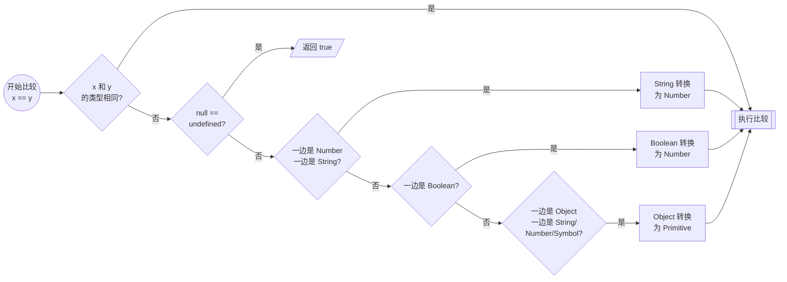

话不多说，先贴几个 meme 在这里。


## 相等的陷阱

在 JavaScript 中，`==`​​ 的怪异源于其​*​偏爱数字比较​​*的设计哲学，试图在任何情况下都找到一个 "合理" 的比较方式。

`==` 的比较遵循以下流程：



这当中，涉及到了对象转换为 Number 或者 Primitive 的过程。

当一个​​对象​​（如数组、普通对象、函数）被用在需要​​原始值​​的上下文（如 `==` 比较、`+` 运算）中时，JavaScript 会调用内部 `ToPrimitive` 函数：

1. 先调用对象的 `valueOf()` 方法。如果它返回一个原始值，就用这个值
2. 如果 `valueOf()`返回的不是原始值，则调用 `toString()`方法。如果它返回一个原始值，就用这个值。
3. 如果 `toString()`也返回对象，则抛出错误。

在这当中，对于数组而言，`valueOf()` 返回数组对象本身，`toString()` 会返回数组元素连接成的字符串。例如：

```javascript
> [1, 2, 3].valueOf()
[1, 2, 3]

> [1, 2, 3].toString()
'1,2,3'
```

而对于普通对象，`valueOf()` 返回对象本身，`toString()` 会返回 `[object Object]`。例如：

```javascript
> ({ a: 1, b: 2 }).valueOf()
{ a: 1, b: 2 }

> ({ a: 1, b: 2 }).toString()
'[object Object]'
```

`ToNumber` 满足以下规则：

| 输入类型 | 转换结果 |
| ----------- | :------- |
| `undefined` | `NaN` |
| `null` | `+0` |
| `true` | `1` |
| `false` | `0` |
| `String` | 尝试解析字符串为数字<br>空字符串或全空格字符串转为 `0`<br>无法解析则转为 `NaN` |
| `Object` | 先调用 `ToPrimitive`<br>然后将得到的原始值再按上述规则转为数字 |

```javascript
> [1, 2, 3] == '1,2,3'
true

> [1, 2, 3] == 123
true

> [1, 2, 3] == true
false

> [1, 2, 3] == null
false

> [1, 2, 3] == undefined
false

> [1, 2, 3] == NaN
false

> [] == ''
true
```

除了以上规则外，`null` 和 `undefined` 也有特殊的相等性：

- `null == undefined`
- `null` 或 `undefined` 与其他任何值都不相等

```javascript
> null == undefined
true
```

`==` 总是会尝试将不同类型的值转换为相同类型，然后再进行比较；而 `===` 则不会进行类型转换，只有在类型和值都相同的情况下才返回 `true`。

## 数学的陷阱

`NaN` 其实是个数字，但它不等于任何值，包括它自己：

```javascript
> NaN == NaN
false

> NaN === NaN
false
```

要想判断 `NaN`，只能使用 `isNaN()` 函数：

```javascript
> isNaN(NaN)
true

> isNaN(123)
false

> isNaN('abc')
true
```

JavaScript 中区分 `0`、`+0` 和 `-0`，对于大多数操作来说，它们是严格相等的。只有在使用 `Object.is()` 时，它们才会被认为是不相等的。

```javascript
> 0 === +0
true

> +0 === -0
true

> Object.is(+0, -0)
false
```

在 JavaScript 中使用加号 `+` 时，字符串拼接比数学运算更加优先：

```javascript
> 1 + 2 + '3'
'33'

> 1 + '2' + 3
'123'

> '1' + 2 + 3
'123'
```

而对于其它符号 `-`、`*`、`/`、`++`、`--`，则会将字符串转换为数字再进行数学运算：

```javascript
> 1 - 2
-1

> 1 - '2'
-1

> '1' - 2
-1
```

浮点数运算在 JavaScript 中也有其特殊性，尤其是在精度方面。由于浮点数的表示方式，某些看似简单的运算可能会出现意想不到的结果：

```javascript
> 0.1 + 0.2
0.30000000000000004

> (0.1 + 0.2) === 0.3
false
```

为了避免浮点数运算带来的问题，可以使用 `Number.toFixed()` 方法将结果四舍五入到指定的小数位数。

JavaScript 还提供了最大 / 最小整数以及无穷符号，它们有这样的关系：

```javascript
> Number.MAX_SAFE_INTEGER
9007199254740991

> Number.MIN_SAFE_INTEGER
-9007199254740991

> Number.MAX_SAFE_INTEGER + 1
9007199254740992

> Number.MAX_SAFE_INTEGER + 2
9007199254740992

> Infinity > Number.MAX_SAFE_INTEGER
true

> -Infinity < Number.MIN_SAFE_INTEGER
true
```

## `this` 的陷阱

JavaScript 中的 `this` 指针设计拉了一坨大的，主要体现在以下几个方面：

- **上下文依赖**：`this` 的值取决于函数调用的上下文，而不是函数定义的位置。
- **事件处理**：在事件处理函数中，`this` 通常指向触发事件的 DOM 元素。
- **构造函数**：在构造函数中，`this` 指向新创建的实例对象。
- **严格模式**：在严格模式下，未绑定的 `this` 会是 `undefined`，而不是指向全局对象。

这些特性使得 `this` 的使用变得复杂，容易导致错误。

例如，对于如下代码：

```javascript
let obj = {
  name: "My Obj",
  logName: function() {
    console.log(this.name)
  }
}
```

如果直接调用 `obj.logName()`，`this` 指向 `obj`，输出 `"My Object"`：

```javascript
> obj.logName()
My Obj
```

但是，如果将 `logName` 方法赋值给一个变量再调用，`this` 就不再指向 `obj`，而是指向全局对象（在浏览器中是 `window`，因此会打印出 `window.name`）：

```javascript
> let extractedFunction = obj.logName
> extractedFunction()
undefined
```

在严格模式下，`this` 会是 `undefined`，导致报错。

解决这些问题的方法有：

- 使用箭头函数。箭头函数不会创建自己的 `this`，而是捕获外部作用域的 `this`
- 使用 `.bind()`、`.call()` 或 `.apply()`**：可以手动设置函数内部的 `this` 值

## 其它陷阱

JavaScript 中，`in` 操作符检查的是​​属性名​​，而不是属性值。它会检查对象及其原型链。例如：

```javascript
> let arr = [1, 2, 42]
> 0 in arr
true // 有索引 0
> 42 in arr
false
> 'length' in arr
true // 数组有 length 属性
> 'toString' in arr
true // 原型链上有 toString 方法
```

对于 `if` 语句的判断条件，JavaScript 有一些特殊的真假值：

| 真 | 假 |
| -- | -- |
| `[]` | `false` |
| `{}` | `null` |
|| `undefined` |
|| `0` |
|| `-0` |
|| `NaN` |
|| `""` |
|| `document.all` |

JavaScript 的 `typeof` 操作符可以用来检测变量的类型，但它也有一些特殊的行为：

```javascript
> typeof null
"object"

> typeof []
"object"

> typeof NaN
"number"

> typeof function() {}
"function"
```

总的来讲，JavaScript 以上种种陷阱是其​​历史包袱​​、设计哲学和​​明确规范​​共同作用的结果。

## 一点好玩的

最后再讲一点好玩的 [JSFuck](https://jsfuck.com/)：如何只用 `[]`、`()`、`!`、`+` 来构造出任意字符串？

我们首先有以下基础部件：

```javascript
[] // []
+[] // 0
+!+[] // 1
!![] // "true"
![] // "false"
[][[]] // "undefined"
+[![]] // NaN
```

那么，`Hello, world!` 可以这样构造：

```javascript
[][(![]+[])[+!+[]]+(!![]+[])[+[]]][([][(![]+[])[+!+[]]+(!![]+[])[+[]]]+[])[!+[]+!+[]+!+[]]+(!![]+[][(![]+[])[+!+[]]+(!![]+[])[+[]]])[+!+[]+[+[]]]+([][[]]+[])[+!+[]]+(![]+[])[!+[]+!+[]+!+[]]+(!![]+[])[+[]]+(!![]+[])[+!+[]]+([][[]]+[])[+[]]+([][(![]+[])[+!+[]]+(!![]+[])[+[]]]+[])[!+[]+!+[]+!+[]]+(!![]+[])[+[]]+(!![]+[][(![]+[])[+!+[]]+(!![]+[])[+[]]])[+!+[]+[+[]]]+(!![]+[])[+!+[]]]((!![]+[])[+!+[]]+(!![]+[])[!+[]+!+[]+!+[]]+(!![]+[])[+[]]+([][[]]+[])[+[]]+(!![]+[])[+!+[]]+([][[]]+[])[+!+[]]+([]+[])[(![]+[])[+[]]+(!![]+[][(![]+[])[+!+[]]+(!![]+[])[+[]]])[+!+[]+[+[]]]+([][[]]+[])[+!+[]]+(!![]+[])[+[]]+([][(![]+[])[+!+[]]+(!![]+[])[+[]]]+[])[!+[]+!+[]+!+[]]+(!![]+[][(![]+[])[+!+[]]+(!![]+[])[+[]]])[+!+[]+[+[]]]+(![]+[])[!+[]+!+[]]+(!![]+[][(![]+[])[+!+[]]+(!![]+[])[+[]]])[+!+[]+[+[]]]+(!![]+[])[+!+[]]]()[+!+[]+[!+[]+!+[]]]+((!![]+[])[+[]]+[+!+[]]+[+!+[]]+[+[]]+(!![]+[])[!+[]+!+[]+!+[]]+(![]+[])[!+[]+!+[]]+(![]+[])[!+[]+!+[]]+(!![]+[])[+[]]+[+!+[]]+[!+[]+!+[]+!+[]+!+[]+!+[]]+[!+[]+!+[]+!+[]+!+[]+!+[]+!+[]+!+[]]+(!![]+[])[+[]]+[!+[]+!+[]+!+[]+!+[]+!+[]]+[!+[]+!+[]+!+[]+!+[]]+(!![]+[])[+[]]+[!+[]+!+[]+!+[]+!+[]]+[+[]]+(!![]+[])[+[]]+[+!+[]]+[!+[]+!+[]+!+[]+!+[]+!+[]+!+[]]+[!+[]+!+[]+!+[]+!+[]+!+[]+!+[]+!+[]]+(!![]+[])[+[]]+[+!+[]]+[!+[]+!+[]+!+[]+!+[]+!+[]]+[!+[]+!+[]+!+[]+!+[]+!+[]+!+[]+!+[]]+(!![]+[])[+!+[]]+(![]+[])[!+[]+!+[]]+([][[]]+[])[!+[]+!+[]]+(!![]+[])[+[]]+[!+[]+!+[]+!+[]+!+[]]+[+!+[]])[(![]+[])[!+[]+!+[]+!+[]]+(+(!+[]+!+[]+[+!+[]]+[+!+[]]))[(!![]+[])[+[]]+(!![]+[][(![]+[])[+!+[]]+(!![]+[])[+[]]])[+!+[]+[+[]]]+([]+[])[([][(![]+[])[+!+[]]+(!![]+[])[+[]]]+[])[!+[]+!+[]+!+[]]+(!![]+[][(![]+[])[+!+[]]+(!![]+[])[+[]]])[+!+[]+[+[]]]+([][[]]+[])[+!+[]]+(![]+[])[!+[]+!+[]+!+[]]+(!![]+[])[+[]]+(!![]+[])[+!+[]]+([][[]]+[])[+[]]+([][(![]+[])[+!+[]]+(!![]+[])[+[]]]+[])[!+[]+!+[]+!+[]]+(!![]+[])[+[]]+(!![]+[][(![]+[])[+!+[]]+(!![]+[])[+[]]])[+!+[]+[+[]]]+(!![]+[])[+!+[]]][([][[]]+[])[+!+[]]+(![]+[])[+!+[]]+((+[])[([][(![]+[])[+!+[]]+(!![]+[])[+[]]]+[])[!+[]+!+[]+!+[]]+(!![]+[][(![]+[])[+!+[]]+(!![]+[])[+[]]])[+!+[]+[+[]]]+([][[]]+[])[+!+[]]+(![]+[])[!+[]+!+[]+!+[]]+(!![]+[])[+[]]+(!![]+[])[+!+[]]+([][[]]+[])[+[]]+([][(![]+[])[+!+[]]+(!![]+[])[+[]]]+[])[!+[]+!+[]+!+[]]+(!![]+[])[+[]]+(!![]+[][(![]+[])[+!+[]]+(!![]+[])[+[]]])[+!+[]+[+[]]]+(!![]+[])[+!+[]]]+[])[+!+[]+[+!+[]]]+(!![]+[])[!+[]+!+[]+!+[]]]](!+[]+!+[]+!+[]+[+!+[]])[+!+[]]+(![]+[])[!+[]+!+[]]+([![]]+[][[]])[+!+[]+[+[]]]+(!![]+[])[+[]]]((!![]+[])[+[]])[([][(!![]+[])[!+[]+!+[]+!+[]]+([][[]]+[])[+!+[]]+(!![]+[])[+[]]+(!![]+[])[+!+[]]+([![]]+[][[]])[+!+[]+[+[]]]+(!![]+[])[!+[]+!+[]+!+[]]+(![]+[])[!+[]+!+[]+!+[]]]()+[])[!+[]+!+[]+!+[]]+(!![]+[][(![]+[])[+!+[]]+(!![]+[])[+[]]])[+!+[]+[+[]]]+([![]]+[][[]])[+!+[]+[+[]]]+([][[]]+[])[+!+[]]](([][(![]+[])[+!+[]]+(!![]+[])[+[]]][([][(![]+[])[+!+[]]+(!![]+[])[+[]]]+[])[!+[]+!+[]+!+[]]+(!![]+[][(![]+[])[+!+[]]+(!![]+[])[+[]]])[+!+[]+[+[]]]+([][[]]+[])[+!+[]]+(![]+[])[!+[]+!+[]+!+[]]+(!![]+[])[+[]]+(!![]+[])[+!+[]]+([][[]]+[])[+[]]+([][(![]+[])[+!+[]]+(!![]+[])[+[]]]+[])[!+[]+!+[]+!+[]]+(!![]+[])[+[]]+(!![]+[][(![]+[])[+!+[]]+(!![]+[])[+[]]])[+!+[]+[+[]]]+(!![]+[])[+!+[]]]((!![]+[])[+!+[]]+(!![]+[])[!+[]+!+[]+!+[]]+(!![]+[])[+[]]+([][[]]+[])[+[]]+(!![]+[])[+!+[]]+([][[]]+[])[+!+[]]+(![]+[+[]])[([![]]+[][[]])[+!+[]+[+[]]]+(!![]+[])[+[]]+(![]+[])[+!+[]]+(![]+[])[!+[]+!+[]]+([![]]+[][[]])[+!+[]+[+[]]]+([][(![]+[])[+!+[]]+(!![]+[])[+[]]]+[])[!+[]+!+[]+!+[]]+(![]+[])[!+[]+!+[]+!+[]]]()[+!+[]+[+[]]]+![]+(![]+[+[]])[([![]]+[][[]])[+!+[]+[+[]]]+(!![]+[])[+[]]+(![]+[])[+!+[]]+(![]+[])[!+[]+!+[]]+([![]]+[][[]])[+!+[]+[+[]]]+([][(![]+[])[+!+[]]+(!![]+[])[+[]]]+[])[!+[]+!+[]+!+[]]+(![]+[])[!+[]+!+[]+!+[]]]()[+!+[]+[+[]]])()[([][(![]+[])[+!+[]]+(!![]+[])[+[]]]+[])[!+[]+!+[]+!+[]]+(!![]+[][(![]+[])[+!+[]]+(!![]+[])[+[]]])[+!+[]+[+[]]]+([][[]]+[])[+!+[]]+(![]+[])[!+[]+!+[]+!+[]]+(!![]+[])[+[]]+(!![]+[])[+!+[]]+([][[]]+[])[+[]]+([][(![]+[])[+!+[]]+(!![]+[])[+[]]]+[])[!+[]+!+[]+!+[]]+(!![]+[])[+[]]+(!![]+[][(![]+[])[+!+[]]+(!![]+[])[+[]]])[+!+[]+[+[]]]+(!![]+[])[+!+[]]]((![]+[+[]])[([![]]+[][[]])[+!+[]+[+[]]]+(!![]+[])[+[]]+(![]+[])[+!+[]]+(![]+[])[!+[]+!+[]]+([![]]+[][[]])[+!+[]+[+[]]]+([][(![]+[])[+!+[]]+(!![]+[])[+[]]]+[])[!+[]+!+[]+!+[]]+(![]+[])[!+[]+!+[]+!+[]]]()[+!+[]+[+[]]])+[])[+!+[]])+([]+[])[(![]+[])[+[]]+(!![]+[][(![]+[])[+!+[]]+(!![]+[])[+[]]])[+!+[]+[+[]]]+([][[]]+[])[+!+[]]+(!![]+[])[+[]]+([][(![]+[])[+!+[]]+(!![]+[])[+[]]]+[])[!+[]+!+[]+!+[]]+(!![]+[][(![]+[])[+!+[]]+(!![]+[])[+[]]])[+!+[]+[+[]]]+(![]+[])[!+[]+!+[]]+(!![]+[][(![]+[])[+!+[]]+(!![]+[])[+[]]])[+!+[]+[+[]]]+(!![]+[])[+!+[]]]()[+!+[]+[!+[]+!+[]]])()
```
