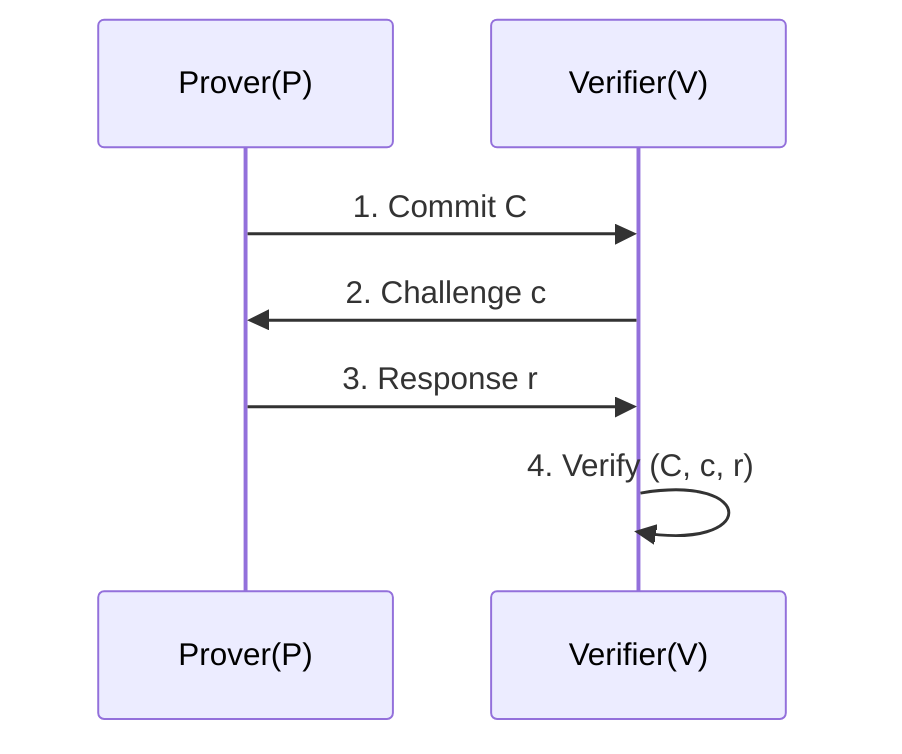
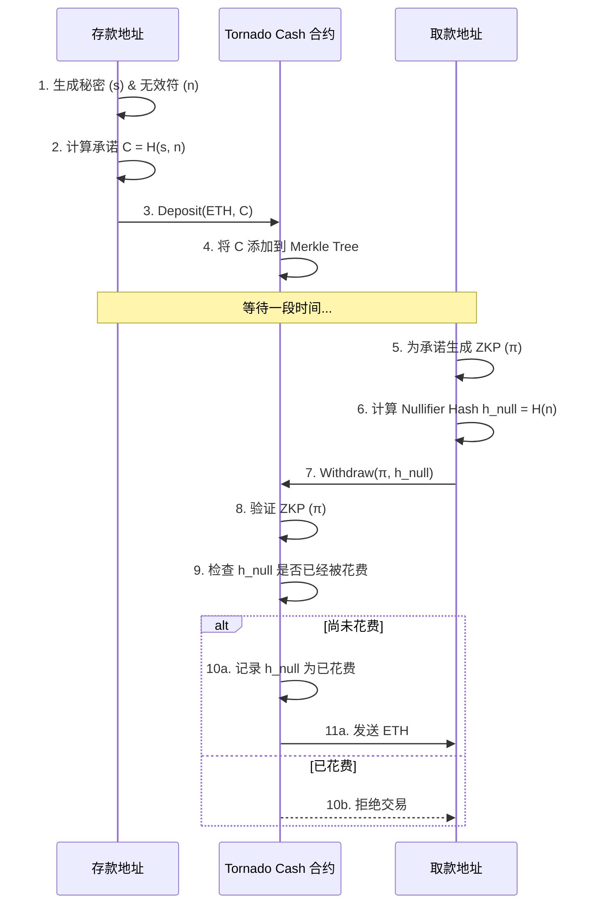
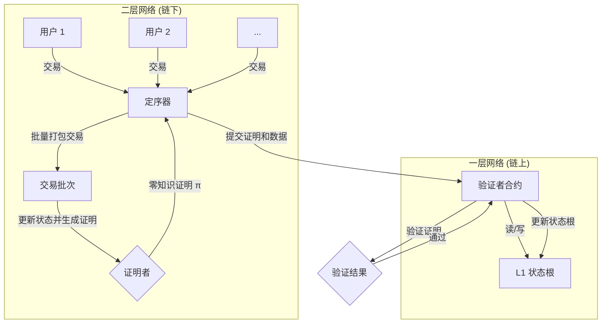

如何在不让对方知道我内裤颜色的情况下，向对方证明我穿了内裤？你也许需要了解零知识证明。

为了理解本文，你可能需要具备密码学的基础知识，了解哈希函数、公钥密码学等概念。你也需要了解 NP 完全性、图论等计算复杂性理论的基础知识。可以参考[之前的文章](https://blog.ch3nyang.top/post/%E5%AF%86%E7%A0%81%E5%AD%A6%E7%AC%94%E8%AE%B0/)。

## Intro

假设我们有一个 5x5 的数字网格，里面随机填充了数字 1 到 25。我们想向别人证明 25 这个数字在网格中存在，但不想透露它的位置。

为了实现这一点，我们可以用一块不透明的遮罩覆盖整个网格，只在 25 所在的位置挖一个洞。这样，观察者能看到洞里露出的数字 25，知道它确实存在于网格中，但无法确定它在表格中的相对位置，因为其他数字都被遮住了。

下面是一个可以互动的演示，展示了这个概念：



另一个更加经典的例子是*阿里巴巴洞穴 (Ali Baba cave)* 问题：

1. 洞穴有一个需要口令才能打开的魔法门，里面是环形道路
2. Alice 向 Bob 声称她知道开门口令，但不想直接把口令告诉 Bob
3. 他们设计一个交互协议，Bob 在洞口等，Alice 随机选一条路进入，Bob 再随机喊她从某一条路出来
    - 如果 Alice 真知道口令，她总能从要求的那条路出来（可以走中间开门穿过去）
    - 如果不知道，只有 50% 概率猜对 Bob 的要求
4. 如果 Bob 看到 Alice 从正确的路出来，Bob 会认为 Alice *可能*知道口令，对其信任度更加了一分

值得注意的是，如果 Alice 是作弊者，则她必须在进入洞穴前就 “赌” Bob 会让她从哪边出来。如果赌 A 出口，她就从 A 进去；如果 Bob 恰好喊 A，她就成功了。如果 Bob 喊 B，她就失败了。

重复多次后，Bob 便有极高的把握相信 Alice 知道口令——但 Bob 没有看到口令本身，也不知道口令是什么。

以上两个例子都展示了零知识证明的核心思想：**在不透露任何额外信息的情况下，向对方证明某个陈述为真**。

## 零知识证明的定义

1985 年，Shafi Goldwasser、Silvio Micali 和 Charles Rackoff 率先在《互动证明系统的知识复杂性》一文中提出了零知识证明的概念。他们定义了零知识证明为一种协议，使得**一方（证明者）可以向另一方（验证者）证明某个陈述为真，而不揭示任何信息，除了这个特定陈述为真**。

零知识证明必须满足三个性质：

- ***完备性 (completeness)***：若所要证之事为真，则诚实的证明者能说服诚实验证者
- ***可靠性 (soundness)***：若命题为假，则作弊证明者仅得极小机会能说服诚实验证者该事为真
- ***零知识性 (zero-knowledge)***：若命题为真，则验证者除此之外，过程中没有得悉任何其他信息

需要注意的是，零知识证明允许有很少的概率，让作弊证明者能向验证者 “证明” 假命题。这个概率称为***可靠性误差 (soundness error)***。换句话说，零知识证明是证明命题为真的概率极大，但并不是一定为真。

当然，上面的定义太过模糊了，为了在数学和计算机科学中精确地描述和证明其安全性，下面给出一个更形式化的定义。

在给出定义前，我们先介绍一些必要的概念：

1. *交互证明系统 (interactive proof system)* 是指一对图灵机 $$\left( P, V \right)$$ 交换信息。其中 $$P$$ 是证明者；$$V$$ 是验证者，其为概率多项式时间 (PPT) 机器。

    - 如果陈述为真，$$V$$ 以极高的概率接受该陈述
    - 如果陈述为假，任何计算能力有限的恶意 $$P^*$$ 只能以可忽略的概率说服 $$V$$ 接受该陈述

2. *零知识性 (zero-knowledge)* 是指对于任何（可能恶意的）PPT 验证者 $$V^*$$，存在一个 PPT 模拟器 $$S$$，能在不知道证据 $$w$$ 的情况下，生成一个与真实交互记录（即 $$V^*$$ 与诚实证明者 $$P$$ 交互时的视图）计算上不可区分的输出。

3. *计算模型和语言*

    设 $$L$$ 是一个 NP 的语言（例如 $$L=\left\{所有可满足的布尔公式\right\}$$）。对于 $$x \in L$$，存在一个证据 $$w$$ 使得 $$R_L: (x, w) \in R$$，其中 $$R$$ 是一个多项式时间可验证的关系。

4. *视图 (view)*

    在真实交互中，验证者 $$V^*$$ 看到的视图包括：

    - 公共输入 $$x$$ 和自己的随机带 $$r$$（所有可能的随机选择）
    - 从证明者 $$P$$ 收到的消息
    - 对于非黑盒模拟情况下，$$V^*$$ 的内部状态

    $$\text{View}_{V^*}^{P}(x) = \left\{ \left( r, m_1, m_2, \cdots, m_t \right) \right\}$$ 表示 $$V^*$$ 在与 $$P$$ 交互时的视图。其中，$$m_i$$ 是第 $$i$$ 轮交互中 $$P$$ 发送给 $$V^*$$ 的消息。

5. *模拟器 (simulator)*

    模拟器 $$S$$ 是一个 PPT 算法，给定陈述 $$x$$ 和对 $$V^*$$ 的描述，可以访问 $$V^*$$ 作为子程序，并尝试输出一个分布上与 $$\text{View}_{V^*}^{P}(x)$$ 计算上不可区分的视图。

    - 对于黑盒模拟，$$S$$ 把 $$V^*$$ 作为一个黑盒子，不能访问其内部状态，只能通过输入输出交互
    - 对于非黑盒模拟，$$S$$ 可以访问 $$V^*$$ 的代码或内部状态，并可以据此构造模拟

6. *计算不可区分性 (computational indistinguishability)*

    两个分布族 $$\left\{ X_n \right\}$$ 和 $$\left\{ Y_n \right\}$$ 计算上不可区分，若对于任意 PPT 区分器 $$D$$，有：

    $$
    \left| \Pr\left[ D\left( X_n \right) = 1 \right] - \Pr\left[ D\left( Y_n \right) = 1 \right] \right| < \text{negl}(n)
    $$

    其中 $$\text{negl}(n)$$ 是一个忽略函数。该式表示随着 $$n$$ 增大，差值趋近于零。

零知识证明分为三类：

- ***完美零知识 (perfect zero-knowledge, PZK)***：模拟器生成的视图与真实交互的视图在统计上完全相同，即

  $$
  \text{View}_{V^*}^{P}(x) \equiv S^{V^*}(x)
  $$

- ***统计零知识 (statistical zero-knowledge, SZK)***：模拟器生成的视图与真实交互的视图在统计距离上可以忽略，即

  $$
  \text{View}_{V^*}^{P}(x) \approx S^{V^*}(x)
  $$

- ***计算零知识 (computational zero-knowledge, CZK)***：模拟器生成的视图与真实交互的视图在计算上不可区分。即对于任意 PPT 区分器 $$D$$，有

  $$
  \left| \Pr\left[ D\left( \text{View}_{V^*}^{P}(x) \right) = 1 \right] - \Pr\left[ D\left( S^{V^*}(x) \right) = 1 \right] \right| < \text{negl}(n)
  $$

现在，我们终于可以给出 CZK 的形式化定义：

一个交互证明系统 $$\left( P, V \right)$$ 对语言 $$L$$ 是计算零知识的，若对于任意 PPT 验证者 $$V^*$$，存在一个 PPT 模拟器 $$S$$，使得对于所有 $$x \in L$$ 及给 $$V^*$$ 的先验信息 $$z$$，有：

$$
\left\{ \text{View}_{V^*(z)}^{P}(x) \right\} \approx_c \left\{ S^{V^*(z)}(x, z) \right\}
$$

其中：

- $$\text{View}_{V^*(z)}^{P}(x)$$ 是 $$V^*$$ 在输入 $$x$$ 和先验信息 $$z$$ 下与 $$P$$ 交互后的视图
- $$\approx_c$$ 表示计算上不可区分
- $$S^{V^*(z)}(x, z)$$ 是模拟器 $$S$$ 在不知道证据情况下的输出

## 交互式零知识证明协议

根据以上内容，我们可以设计出一些零知识证明协议。其通常包含了以下几个步骤：

1. *承诺 (commitment)*：证明者 $$P$$ 生成一个承诺值 $$C$$，并将其发送给验证者 $$V$$。这个承诺值是对某个秘密信息 $$w$$ 的加密表示，确保 $$P$$ 不能在后续步骤中更改 $$w$$

2. *挑战 (challenge)*：验证者 $$V$$ 随机选择一个挑战 $$c$$，并将其发送给 $$P$$。这个挑战通常是从一个预定义的集合中随机选择的

3. *响应 (response)*：证明者 $$P$$ 根据挑战 $$c$$ 和秘密信息 $$w$$ 计算一个响应 $$r$$，并将其发送给 $$V$$

4. *验证 (verification)*：验证者 $$V$$ 使用承诺值 $$C$$、挑战 $$c$$ 和响应 $$r$$ 来验证证明者 $$P$$ 是否知道秘密信息 $$w$$。如果验证通过，$$V$$ 接受该证明；否则拒绝

这种协议被称为 ***Sigma 协议***，因其三步结构（Commit-Challenge-Response）形似希腊字母 $$\Sigma$$ 而得名。下面我们通过经典的 Schnorr 协议来具体分析。

### Schnorr 协议

最经典的交互式零知识证明之一是 **Schnorr 协议**，用于证明离散对数的知识。在这个问题中，给定一个循环群 $$\mathbb{G}$$，其生成元为 $$g$$，阶为 $$q$$。公开信息为 $$y \in \mathbb{G}$$，证明者 Alice 声称她知道一个秘密 $$x \in \mathbb{Z}_q$$，使得 $$y = g^x$$。她想向验证者 Bob 证明这一点，而不透露 $$x$$ 的值。

#### 协议步骤

1. ***承诺***：Alice 选择一个随机数 $$r \in \mathbb{Z}_q$$（称为 nonce），计算承诺 $$C = g^r$$，并将 $$C$$ 发送给 Bob
2. ***挑战***：Bob 选择一个随机挑战 $$c \in \mathbb{Z}_q$$，并将其发送给 Alice
3. ***响应***：Alice 计算响应 $$s = r + cx \pmod q$$，并将 $$s$$ 发送给 Bob
4. ***验证***：Bob 收到 $$s$$ 后，验证等式 $$g^s = C \cdot y^c$$ 是否成立

#### 协议分析

- ***完备性 (Completeness)***：如果 Alice 是诚实的，她知道 $$x$$ 并且遵循协议。Bob 的验证会通过，因为：

    $$
    g^s = g^{r+cx} = g^r \cdot g^{cx} = g^r \cdot (g^x)^c = C \cdot y^c
    $$

    因此，诚实的证明者总能说服诚实的验证者

- ***可靠性 (Soundness)***：如果 Alice 是一个不知道 $$x$$ 的作弊者，她能否欺骗 Bob？为了通过验证，她必须在收到挑战 $$c$$ 后，提供一个能使 $$g^s = C \cdot y^c$$ 成立的 $$s$$

    假设作弊者 Alice 发送了某个承诺 $$C$$。当她收到挑战 $$c$$ 时，她需要找到一个 $$s$$。由于她不知道 $$x$$，她无法通过 $$s = r + cx$$ 计算出正确的 $$s$$。她成功的唯一机会是在发送 $$C$$ 之前就猜对 Bob 将要发送的挑战 $$c^\prime$$

    - 她可以选择一个随机的 $$s^\prime$$，然后计算 $$C = g^{s^\prime} \cdot y^{-c^\prime}$$
    - 她将这个 $$C$$ 发送给 Bob。如果 Bob 恰好返回挑战 $$c = c^\prime$$，她就可以用 $$s^\prime$$ 作为响应，验证将会通过
    - 然而，由于 $$c$$ 是从 $$\mathbb{Z}_q$$ 中随机选择的，她猜对的概率只有 $$1/q$$，这是一个可以忽略的极小概率。因此，该协议是可靠的

- ***零知识性 (Zero-Knowledge)***：为了证明零知识性，我们需要构建一个模拟器 $$S$$，它可以在不知道秘密 $$x$$ 的情况下，生成一个与真实交互记录 $$(C, c, s)$$ 在计算上不可区分的输出

    模拟器 $$S$$ 的工作方式如下：

    1. 选择随机的 $$s^\prime \in \mathbb{Z}_q$$ 和 $$c^\prime \in \mathbb{Z}_q$$
    2. 计算伪承诺 $$C^\prime = g^{s^\prime} \cdot y^{-c^\prime}$$
    3. 输出三元组 $$(C^\prime, c^\prime, s^\prime)$$ 作为模拟的交互记录

    这个模拟出的三元组 $$(C^\prime, c^\prime, s^\prime)$$ 与真实交互中生成的三元组 $$(C, c, s)$$ 具有完全相同的分布。在真实协议中，$$r$$ 是随机的，$$c$$ 是随机的，这导致 $$s=r+cx$$ 也是随机的；在模拟中，$$s^\prime$$ 和 $$c^\prime$$ 是随机的，这导致 $$C^\prime$$ 也是随机的。由于 $$C, c, s$$ 都是 $$\mathbb{Z}_q$$ 上的均匀随机元素，任何人都无法区分 $$(C, c, s)$$ 是来自真实交互还是模拟器。因此，验证者没有获得关于 $$x$$ 的任何信息

### 大图的哈密顿环问题

另一个经典的交互式证明例子是图的哈密顿环问题。这是一个著名的 NP 完全问题。假设 Alice (证明者) 想向 Bob (验证者) 证明她知道一个大图 $$G$$ 的哈密顿环（即一条经过每个顶点恰好一次的闭合路径），但不想透露具体的环。

#### 协议步骤

1. ***承诺 (Commitment)***：Alice 知道图 $$G=(V, E)$$ 和一个哈密顿环 $$C$$。她生成一个随机的顶点置换（permutation）$$\pi$$，并用它来构造一个新图 $$H = \pi(G)$$。这个新图 $$H$$ 与 $$G$$ 是同构的。然后，Alice 对图 $$H$$ 的邻接矩阵进行承诺，并将承诺值 $$comm(H)$$ 发送给 Bob

    > 一个常用的承诺方案是，对邻接矩阵的每个元素进行哈希，然后将这些哈希值构建成一棵默克尔树 (Merkle Tree)，并将树根作为承诺 $$comm(H)$$

2. ***挑战 (Challenge)***：Bob 收到承诺后，随机选择一个比特 $$b \in \{0, 1\}$$ 作为挑战发送给 Alice

3. ***响应 (Response)***：

    - 如果 $$b=0$$，Alice 公开置换 $$\pi$$
    - 如果 $$b=1$$，Alice 公开 $$H$$ 中的哈密顿环 $$C^\prime = \pi(C)$$，并为构成该环的所有边提供默克尔证明，以证明它们确实是 $$H$$ 的一部分

4. ***验证 (Verification)***：

    - 如果 Bob 的挑战是 $$b=0$$，他会验证 $$H = \pi(G)$$ 是否成立
    - 如果 Bob 的挑战是 $$b=1$$，他会验证 $$C^\prime$$ 确实是 $$H$$ 的一个哈密顿环

#### 协议分析

- ***完备性***：如果 Alice 知道哈密顿环，她总能正确响应 Bob 的任何挑战
- ***可靠性***：如果 Alice 不知道哈密顿环，她只能猜测 Bob 的挑战。她可以准备一个同构图 $$H$$（对应 $$b=0$$ 的情况），或者准备一个包含哈密顿环但与 $$G$$ 无关的图 $$H$$（对应 $$b=1$$ 的情况）。无论哪种情况，她成功欺骗 Bob 的概率都只有 $$50%$$
- ***零知识性***：在单次交互中，如果 Bob 挑战 $$b=0$$，他只看到了一个随机的图同构，没有获得关于哈密顿环的信息。如果他挑战 $$b=1$$，他只看到了一个随机图中的哈密顿环，无法将其映射回原图 $$G$$。因此，Bob 没有获得任何关于 $$G$$ 中哈密顿环的知识

## 非交互式零知识证明

以上零知识证明协议都需要证明者和验证者之间进行多轮交互。然而，在某些场景下，例如区块链交易或数字签名，证明需要被广播给多个验证者，或者在不同时间进行验证，此时多轮交互变得不切实际。

***非交互式零知识证明 (non-interactive zero-knowledge proof, NIZK)*** 解决了这个问题。在 NIZK 中，证明者可以生成一个单独的证明字符串 $$\pi$$，任何拥有公开信息的验证者都可以独立地、在任何时间验证该证明，而无需与证明者进行任何交互。

NIZK 的实现通常依赖于一个共同的、可信的参考信息，这被称为**公共参考字符串 (Common Reference String, CRS)** 模型。CRS 在所有协议参与方之间共享，并被认为是可信的。

### Fiat-Shamir 变换

将交互式证明转换为非交互式证明的关键思想是消除由验证者提供的随机挑战。***Fiat-Shamir 变换***是一种实现此目的的著名技术，它在**随机预言机模型 (Random Oracle Model, ROM)** 下是安全的。

在 ROM 中，我们假设存在一个理想的密码学哈希函数 $$H$$，其行为如同一个随机预言机：对于任何新的输入，它都会返回一个真正随机的、均匀分布的输出。

Fiat-Shamir 变换的核心思想是：证明者使用哈希函数 $$H$$ 自行生成挑战，而不是从验证者那里接收。具体步骤如下：

1. 证明者执行交互式协议的**承诺**步骤，生成承诺值 $$C$$

2. 证明者将所有公开信息（如问题陈述 $$x$$）和本轮的承诺 $$C$$ 作为输入，通过哈希函数 $$H$$ 计算挑战：

    $$
    c = H(x, C)
    $$

3. 证明者使用这个自生成的挑战 $$c$$ 来计算**响应** $$s$$

4. 最终的非交互式证明 $$\pi$$ 由承诺和响应组成，即 $$\pi = (C, s)$$

验证者收到证明 $$\pi = (C, s)$$ 后，可以独立地执行以下操作：

1. 使用与证明者相同的公开信息 $$x$$ 和证明中的承诺 $$C$$，计算出挑战：$$c^\prime = H(x, C)$$
2. 使用计算出的挑战 $$c^\prime$$ 和证明中的响应 $$s$$，执行原始交互式协议的**验证**步骤

由于密码学哈希函数的输出是确定性的（相同的输入总产生相同的输出）且不可预测的（在计算出哈希值之前无法知道它），这个哈希值有效地替代了真实验证者提供的随机挑战。证明者因为无法预测哈希函数的输出，所以不能像在交互式协议中那样通过预先设计承诺来作弊。

我们可以将 Fiat-Shamir 变换应用于前述的 Schnorr 协议，得到一个非交互式的签名方案（Schnorr 签名）：

1. ***证明生成 (签名)***：

    - Alice (证明者) 拥有秘密 $$x$$ 和公钥 $$y=g^x$$
    - 她选择一个随机数 $$r \in \mathbb{Z}_q$$，计算承诺 $$C = g^r$$
    - 她使用哈希函数 $$H$$ 计算挑战 $$c = H(y, C)$$
    - 她计算响应 $$s = r + cx \pmod q$$
    - 非交互式证明（即签名）为 $$\pi = (C, s)$$

2. ***证明验证 (验证签名)***：

    - Bob (验证者) 拥有 Alice 的公钥 $$y$$ 和签名 $$\pi = (C, s)$$
    - 他计算挑战 $$c^\prime = H(y, C)$$
    - 他验证等式 $$g^s = C \cdot y^{c^\prime}$$ 是否成立

这个过程无需任何交互，Alice 只需发布她的签名 $$\pi$$，任何人都可以验证它。

### zk-SNARKs vs zk-STARKs

在 NIZK 领域，**zk-SNARKs** 和 **zk-STARKs** 是目前最重要和最广泛使用的两种技术。它们都是为了生成高效、非交互式的零知识证明，但在实现和特性上存在显著差异。

- ***zk-SNARK (Zero-Knowledge Succinct Non-Interactive Argument of Knowledge)***
    - ***优点***：
        - ***简洁性 (Succinct)***：证明尺寸非常小，通常只有几百个字节，这使得它们非常适合在区块链等存储空间有限的环境中使用
        - ***验证快***：验证过程非常高效，计算开销很小
    - ***缺点***：
        - ***需要可信设置 (Trusted Setup)***：大多数 zk-SNARKs 方案需要一个复杂的初始设置阶段来生成公共参数。这个过程会产生一些“有毒废料”（toxic waste），如果这些秘密数据没有被安全销毁，攻击者就可以用它来伪造证明。这个可信设置仪式需要参与者高度诚实
        - ***非抗量子性***：许多基于椭圆曲线的 zk-SNARKs 方案无法抵抗量子计算机的攻击

- ***zk-STARK (Zero-Knowledge Scalable Transparent Argument of Knowledge)***
    - ***优点***：
        - ***透明性 (Transparent)***：无需可信设置。其公共参数是使用公开、可验证的随机性生成的，消除了对可信设置仪式的依赖，更加安全
        - ***可扩展性 (Scalable)***：当需要证明的计算规模增大时，其证明生成和验证时间的增长速度优于 zk-SNARKs
        - ***抗量子性 (Quantum-Resistant)***：它基于更简单的密码学假设（抗碰撞的哈希函数），因此被认为是抗量子的
    - ***缺点***：
        - ***证明尺寸大***：其证明尺寸比 zk-SNARKs 大得多（通常是几十到几百 KB），这会增加链上存储成本和网络传输开销

| 特性 | zk-SNARK | zk-STARK |
| :--- | :--- | :--- |
| ***证明大小*** | 非常小 (Succinct) | 较大 |
| ***可信设置*** | 通常需要 | 不需要 (Transparent) |
| ***抗量子性***| 通常不是 | 是 |
| ***密码学假设*** | 椭圆曲线、配对 | 抗碰撞哈希函数 |

总而言之，NIZK 技术，特别是 zk-SNARKs 和 zk-STARKs，是推动零知识证明从理论走向大规模实际应用的关键。它们使得在保护隐私的同时进行复杂验证成为可能，为区块链扩容、去中心化身份等领域打开了新的大门。

## 应用

零知识证明的应用场景极其广泛，尤其是在需要隐私保护和可验证计算的领域。

### 隐私交易与混币器

***混币器 (Coin Mixer)*** 旨在打破加密货币交易图谱的可追溯性。Tornado Cash 是一个经典的基于 ZKP 的实现。

其核心思想是：用户将资金存入一个智能合约的“池子”中，之后可以从一个全新的地址将相同金额的资金取出。由于池中混合了大量来自不同用户的资金，外部观察者无法将存款与取款关联起来。

其协议流程如下：

1. ***存款 (Deposit)***：

    - 用户 Alice 想要存入一定数量的代币（例如 1 ETH）。她首先生成两个大的随机数：一个作为秘密 (secret) $$s$$，另一个作为无效符 (nullifier) $$n$$

    - 她计算一个承诺 $$C$$，通常是这两个随机数的哈希值：$$C = H(s, n)$$

    - Alice 将 1 ETH 和这个承诺 $$C$$ 一起发送到 Tornado Cash 智能合约。合约将 $$C$$ 添加到一个存款列表（通常是一棵默克尔树）中

2. ***取款 (Withdrawal)***：

    - 在等待一段时间后，Alice 想要从一个全新的、与存款地址无任何关联的地址 B 取款

    - 她需要向智能合约证明她知道某个有效承诺 $$C$$ 对应的秘密 $$s$$ 和无效符 $$n$$。这是一个典型的“知识证明”问题

    - 她构造一个 zk-SNARK 证明 $$\pi$$，该证明陈述了以下内容：

        *我知道一对 $$(s, n)$$，使得：*

        1. *其承诺 $$C = H(s, n)$$ 存在于合约的存款默克尔树中（通过提供默克尔路径来证明）*
        2. *我能正确计算出无效符哈希 $$h_{null} = H(n)$$*

    - Alice 向合约提交证明 $$\pi$$ 和无效符哈希 $$h_{null}$$

    - 验证与防双花：

        - 合约的验证器会检查证明 $$\pi$$ 是否有效。这个验证过程不会暴露 $$s$$、$$n$$ 或原始的承诺 $$C$$

        - 合约会检查 $$h_{null}$$ 是否已经被记录在“已花费”列表中。如果未被记录，合约就将 $$h_{null}$$ 记录下来，并向地址 B 发送 1 ETH。如果已被记录，则拒绝交易，以防止同一笔存款被多次取出（双花攻击）

通过这个过程，Alice 成功地在不暴露任何关联信息的情况下转移了资金，实现了隐私保护。

### 区块链扩容

ZK-Rollups 是一种 Layer 2 扩容方案，它将大量的交易计算和状态存储移至链下，但将每笔交易的压缩数据和有效性证明保留在链上，从而继承了主链的安全性。

其工作原理如下：

1. ***链下交易处理***：

    - 一个或多个被称为定序器 (Sequencer) 或运营者 (Operator) 的节点负责收集用户的链下交易

    - 运营者处理这些交易（例如，数千笔转账），并更新链下的状态树（一棵巨大的默克尔树，记录了所有账户的余额和状态）。这个过程会从旧的状态根 $$S_{old}$$ 变为新的状态根 $$S_{new}$$

2. ***生成证明***：

    - 对于这一批次的所有交易，运营者需要生成一个零知识证明 $$\pi$$（通常是 zk-SNARK 或 zk-STARK）

    - 该证明 $$\pi$$ 证实了以下陈述：

        *存在一批交易 $$T$$，当它们被依次应用于状态根为 $$S_{old}$$ 的状态时，会合法地产生一个新的状态根 $$S_{new}$$。*

    - “合法地”意味着每笔交易都经过了有效签名，发送方有足够余额，且所有状态转换都遵循协议规则

3. ***链上验证***：

    - 运营者将这个简洁的证明 $$\pi$$、旧状态根 $$S_{old}$$、新状态根 $$S_{new}$$ 以及一些高度压缩的交易数据（用于确保数据可用性）提交到主链上的智能合约

    - 主链上的验证器合约执行验证算法 `Verify(π, S_old, S_new, data)`。这个验证过程非常快速且成本低廉，远低于在主链上执行数千笔交易的成本

    - 如果验证通过，合约就将链上存储的状态根更新为 $$S_{new}$$

通过这种方式，主链节点无需执行每一笔交易，只需验证一个证明，从而将吞吐量提升了几个数量级。zkSync 和 StarkNet 就是基于此技术的著名项目。

### 去中心化身份与可验证凭证

零知识证明允许用户有选择性地披露其身份信息，而不是全盘托出。

假设你需要向一个在线服务证明你已年满 18 岁，但不想透露你的姓名、确切出生日期或其他任何信息。传统方式是上传你的身份证照片。这会暴露你的姓名、住址、确切出生日期等所有信息，存在严重的隐私泄露风险。

使用零知识证明，你可以通过以下方式实现：

1. ***发行凭证***：政府或可信机构（Issuer）为你颁发一个经过数字签名的可验证凭证 (Verifiable Credential)，其中包含了你的各项属性，如 `{"name": "Alice", "birthDate": "2005-05-20"}`

2. ***生成证明***：当你需要证明年龄时，你的钱包应用会生成一个 ZKP，证明如下陈述：

    *我持有一个由可信机构公钥签名的有效凭证，且凭证中的 `birthDate` 字段所代表的年龄大于或等于 18 岁。*

3. ***验证***：你将这个证明提交给在线服务。服务方只需验证该证明的有效性，就能确信你已成年，而完全不知道你的姓名、具体生日或任何其他个人信息

### 保护机器学习模型的隐私

在某些场景下，模型的所有者希望向用户证明其模型的预测结果是正确的，但不想泄露模型本身（因为模型是宝贵的知识产权）。

例如，一家金融科技公司开发了一个专有的信用评分模型 $$M$$。用户输入自己的财务数据 $$x$$，公司返回一个信用评分 $$y = M(x)$$。用户如何相信这个评分 $$y$$ 是由那个声称的高级模型 $$M$$ 诚实计算出来的，而不是公司为了自身利益随便给出的一个数字？

零知识证明可以帮助解决这个问题。具体流程如下：

1. 公司首先对模型 $$M$$ 的结构和权重进行承诺，并公开承诺值 $$comm(M)$$

2. 当用户提交数据 $$x$$ 后，公司计算 $$y = M(x)$$

3. 公司同时生成一个 ZKP $$\pi$$，证明：

    *对于公开的输入 $$x$$ 和输出 $$y$$，我知道一个模型 $$M$$，使得 $$y=M(x)$$ 成立，并且这个模型 $$M$$ 的承诺与公开的 $$comm(M)$$ 一致。*

4. 用户收到评分 $$y$$ 和证明 $$\pi$$。通过验证 $$\pi$$，用户可以确信评分是由声称的模型诚实计算得出的，而公司则没有泄露其模型的任何内部细节
