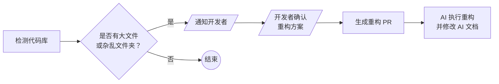

> 从两年前开始，我就一直想做一个自带翻译功能的 RSS 阅读器。结果，在我基础功能写完后， 横空出世，把我想做的功能全都实现了，于是我不再开发自己的这个项目，转而去给 Folo 做贡献。
>
> 不过，随着 Folo 本身盈利压力的增大，它的开发重心全部转移到了没有卵用的 AI 功能上，然后阉割了很多基础功能，要求用户每月付费 6.67 刀才能使用。
>
> 不是哥们儿!？我只是想要一个翻译功能，这值得这么多钱吗？
>
> 于是乎，我捡起了之前搁置的项目，决定重新开发一个属于自己的 RSS 阅读器。

开发一个 RSS 阅读器听起来很简单，比如在 Go 语言下拿  处理下 RSS 源，然后糊个前端界面就完事了。不过，一旦你想加点花哨的功能，比如**自动翻译**、**AI 摘要**、**智能发现订阅源**，复杂度就一下子上去了。

这次，我还想搞点花活儿：从需求分析、架构设计、代码生成，到测试和发布，全程让 AI 去做，我只负责把关和调试。我选择了 GitHub Copilot (Claude Opus 4.5 + Claude Sonnet 4.5 + Gemini 3 Pro + Grok Code Fast) 作为主要的 AI 助手，偶尔用其它模型补充一些工作。

一个月下来，AI 总共帮我提交了接近 100 个 PR，400 多次 commit，其中超过 95% 的代码全部为 AI 生成，项目也基本走向成熟。

| GitHub 仓库 | 下载地址 | Landing Page |
| ---------- | ------- | ------------ |
|  | [MrRSS Releases](https://github.com/WCY-dt/MrRSS/releases) | [MrRSS 官网](https://mrrss.ch3nyang.top/) |


~~然而，这个软件要比「小猫补光灯」复杂得多~~。一个众所周知的事情是：***用 AI 做需求是很容易的，但要做很多需求，并且这些需求全是 AI 写的，就纯折磨了***。在开发过程中，我不出意外地遇到了不少问题，这里来和大家分享一下我的经验教训。

## CI/CD for AI

一个极为棘手的问题是，很多功能是在多个模块之间协同完成的，存在一定的耦合关系。尽管 AI agent 会去阅读项目代码，但它并不清楚整体架构和模块边界。在代码文件数过百后，AI 就经常迷失方向，改了这块没改那块。

我当然可以每次都把项目的相关信息塞进 prompt 里，但这样一来，prompt 会变得非常庞大，导致生成质量下降，甚至超出模型的上下文窗口。不过，我偶然在别人的项目里发现了 AI 支持自动读取特定文档的功能，于是我也给 MrRSS 写了一些「说明书」。主要是 ***`AGENTS.md` 和 `.github/copilot-instructions.md`***：

```markdown
# AI Agent Guidelines for MrRSS

## Project Overview

**MrRSS** is a modern, privacy-focused, cross-platform desktop RSS reader.

### Tech Stack

- **Backend**: Go 1.24+ with Wails v2.11+ framework, SQLite with `modernc.org/sqlite`
- **Frontend**: Vue 3.5+ Composition API, Pinia, Tailwind CSS 3.3+, Vite 5+, TypeScript
- **Communication**: HTTP REST API (not Wails bindings)
- **Icons**: Phosphor Icons | **I18n**: vue-i18n (English/Chinese)

...
```

其中，`.github/copilot-instructions.md` 是 GitHub Copilot 专用的说明文件，`AGENTS.md` 则是 Codex、Claude Code 等其他 AI agent 通用的说明文件。每次让 AI 写代码前，无需我说明，它都会自动先去读这些文档。

这些文档主要包含了：

- 项目概览
- 项目模块与文件结构
- 关键技术与规范
- 开发流程指南
  - 总体流程
  - 辅助脚本
  - 代码组织
  - 代码质量管理
- 代码风格指南
  - 前端 / 后端
  - 安全性实践

不过，随着项目变得越来越复杂，这些文档达到了接近 3000 行！为了防止一次性占用过多上下文，我对文档进行了拆分：


- .github/
  - copilot-instructions.md
- docs/
  - ARCHITECTURE.md
  - CODE_PATTERNS.md
  - TESTING.md
  - VERSION_MANAGEMENT.md
- AGENTS.md


只需要 ***在 `copilot-instructions.md` 和 `AGENTS.md` 的开头给出 `docs/` 目录的索引***，AI 就能自动去读取相关内容。

```markdown
> **Quick Links**: [Architecture](docs/ARCHITECTURE.md) | [Code Patterns](docs/CODE_PATTERNS.md) | [Testing](docs/TESTING.md) | [Version Management](docs/VERSION_MANAGEMENT.md)
```

之后，如果有任何新功能需要跨模块协作，我只需修改相关文档，AI 就可以很好地遵循这些规则去写代码了。

## 统一的开发命令

每次做完修改后，AI 都要跑一边 `lint`、`test`、`format` 等常用操作。由于 AI 每次跑完一条命令都需要读取结果并思考下一步该做什么，这就导致光是这些固定流程就占用了大量的上下文窗口，而且跑完一次要耗时接近 20 分钟！

为了进一步方便 AGENT 执行，我 ***为常用操作写了一套 `Makefile`***：

<details>

<summary>点击展开 Makefile 代码</summary>

<div markdown="1">

```makefile
# Makefile for MrRSS (Cross-platform)
.PHONY: help build build-frontend build-backend test test-frontend test-backend lint lint-frontend format format-frontend clean dev setup install-deps update-deps check pre-commit release-check

# Detect OS
ifeq ($(OS),Windows_NT)
    DETECTED_OS := Windows
    SHELL := pwsh.exe
    .SHELLFLAGS := -Command
else
    DETECTED_OS := $(shell uname -s)
    SHELL := /bin/bash
endif

# Default target
help: ## Show this help message
	@echo "MrRSS Development Makefile ($(DETECTED_OS))"
	@echo ""
	@echo "Available targets:"
	@grep -E '^[a-zA-Z_-]+:.*?## .*$$' $(MAKEFILE_LIST) | sort | awk 'BEGIN {FS = ":.*?## "}; {printf "  %-20s %s\n", $$1, $$2}'

# Development
dev: ## Start development server
	wails dev

# Building
build: build-frontend build-backend ## Build both frontend and backend
	wails build -skipbindings

build-frontend: ## Build frontend only
	cd frontend && npm run build

build-backend: ## Build backend only (verify compilation)
	go build -v ./...

# Testing
test: test-frontend test-backend ## Run all tests

test-frontend: ## Run frontend tests
	cd frontend && npm test

test-backend: ## Run backend tests
	go test -v -timeout=5m -cover ./internal/...

test-coverage: ## Run backend tests with coverage
	go test -v -timeout=5m -coverprofile=coverage.out -covermode=atomic ./internal/...
	go tool cover -html=coverage.out -o coverage.html
	@echo "Coverage report generated: coverage.html"

# Code Quality
lint: lint-frontend lint-backend ## Run all linters

lint-frontend: ## Run frontend linter
	cd frontend && npm run lint

lint-backend: ## Run backend linter
	go vet ./...
ifeq ($(DETECTED_OS),Windows)
	powershell -Command '$$result = gofmt -d . ; if ($$result) { Write-Host $$result -ForegroundColor Red; exit 1 }'
	powershell -Command '$$importsResult = goimports -d . ; if ($$importsResult) { Write-Host $$importsResult -ForegroundColor Red; exit 1 }'
else
	gofmt -d . | tee /dev/stderr | test -z "$$(cat)"
	goimports -d . | tee /dev/stderr | test -z "$$(cat)"
endif

format: format-frontend format-backend ## Format all code

format-frontend: ## Format frontend code
	cd frontend && npm run format

format-backend: ## Format backend code
	gofmt -w .
	goimports -w .

# Dependencies
install-deps: install-frontend-deps install-backend-deps ## Install all dependencies

install-frontend-deps: ## Install frontend dependencies
	cd frontend && npm install

install-backend-deps: ## Install backend dependencies
	go mod download

update-deps: update-frontend-deps update-backend-deps ## Update all dependencies

update-frontend-deps: ## Update frontend dependencies
	cd frontend && npm update

update-backend-deps: ## Update backend dependencies
	go get -u ./...
	go mod tidy

# Setup
setup: install-deps ## Initial project setup
	pre-commit install

# Cleanup
clean: ## Clean build artifacts
ifeq ($(DETECTED_OS),Windows)
	powershell -Command "Remove-Item -Path 'build\bin\*' -Recurse -Force -ErrorAction SilentlyContinue"
	powershell -Command "Remove-Item -Path 'frontend\dist' -Recurse -Force -ErrorAction SilentlyContinue"
	powershell -Command "Remove-Item -Path 'frontend\node_modules\.vite' -Recurse -Force -ErrorAction SilentlyContinue"
	powershell -Command "Remove-Item -Path 'coverage.out', 'coverage.html' -ErrorAction SilentlyContinue"
else
	rm -rf build/bin/*
	rm -rf frontend/dist
	rm -rf frontend/node_modules/.vite
	rm -f coverage.out coverage.html
endif

# Development helpers
check: lint test build ## Run full check (lint, test, build)
ifeq ($(DETECTED_OS),Windows)
	powershell -File scripts/check.ps1
else
	./scripts/check.sh
endif

pre-commit: ## Run pre-commit hooks on all files
	pre-commit run --all-files

release-check: check ## Run all checks before release
ifeq ($(DETECTED_OS),Windows)
	powershell -File scripts/pre-release.ps1
else
	./scripts/pre-release.sh
endif
```

</div>

</details>

可以看到，这里面使用了大量的现有工具（`go vet`、`gofmt`、`goimports`、`pre-commit`、`npm lint`、`npm test` 等），把它们统一封装在一个简单的命令行界面下。AI 每次需要运行测试或检查代码时，只需执行 `make test` 和 `make lint`，或是提交前直接由 `pre-commit` 触发，而不需要逐个执行一大堆复杂的命令。

## 测试的陷阱

后端部分是很好测试的，只要稍微提高一下测试覆盖率，AI 就能很容易地判断代码正确与否。

然而，对于 AI 来说，前端和运维的测试就麻烦多了：

### 前端部分

前端部分可以使用 Playwright 做 E2E 测试，但 Playwright 完全依靠 HTML 文本作为给 AI 的上下文，AI 实际上并不是真正「看」到了界面。因此，一些前端的 bug 很难让 AI 发现并修复。

例如，软件的 [v1.2.16](https://github.com/WCY-dt/MrRSS/releases/tag/v1.2.16) 和 [v1.2.18](https://github.com/WCY-dt/MrRSS/releases/tag/v1.2.18) 版本在发布后，均有用户反馈称设置项无法正常修改和保存：



***[BUG]设置无法保存*** 配置完成不生效，未自动保存。




尽管我多次要求 AI 修复这个问题，但它每次都是凭感觉改改，却根本无法复现这个 bug ——因为在 Playwright 的测试结果里，所有的设置项看起来都被正确修改了。问题出在界面没有正确响应用户操作上：虽然输入框里的值变了，但实际上并没有触发 `change` 事件，导致后端根本没收到更新请求。而 AI 却无法看到这个结果。

为了解决这个问题，我不得不 ***亲自调试前端代码，找出问题所在，然后让 AI 根据我的分析去修复代码。修复完成后，再手动检查一遍，确保没有遗漏***。

### 运维部分

运维部分更是难上加难。比如说，AI 可能会帮我写 GitHub Actions 的工作流，但它并不清楚这个工作流能不能成功运行，只能凭经验猜测。结果就是，很多次 AI 写完工作流，我跑了一遍发现构建失败，然后又让 AI 去修复，反复折腾了好几次。

比如，我用于版本发布的 [`release` 工作流](https://github.com/WCY-dt/MrRSS/blob/main/.github/workflows/release.yml)，总是在 darwin 的 runner 上运行失败。AI 每次修改后，会在我本地机器上模拟运行一遍，但我的机器是 Windows！！！其实 AI 已经发现了问题在于  包和 wails 在 CGO 下的 `AppDelegate` 符号冲突，但它尝试改过后无法验证，便信誓旦旦地告诉我已经修好了。

为此，我跟 AI 来回折腾了十多个 commit 依然没有解决，最终还是靠搜索到  解决过类似的问题，向他询问后才终于搞定：



> I noticed that in [commit 7bdadc6](https://github.com/jmylchreest/keylightd/commit/7bdadc6019750fd8af3424401d73e22b4305f925) you disable macOS build due to AppDelegate symbol conflict.
>
> I also encountered this problem in my own project. Have you found any solutions now?

Actually yes, I bumped to using the git version of fyne.io/systray which looks to unblocks this but i've not re-enabled the macos build to test it. In theory, keylightd-tray should work on macos now.

`replace fyne.io/systray => github.com/fyne-io/systray v1.11.1-0.20250812065214-4856ac3adc3c`



难以测试，再加上 AI 声称代码没有问题，导致很多 bug 总是修复不好。

怎么办呢？我也没有办法。现在，***运维的 bug 我最多让 AI 帮我改一次，改不好就自己动手了***。

## 屎山是怎样炼成的

AI 有个特点：你让它加功能，它就加功能。至于代码组织、可维护性？不存在的！

项目初期，AI 把所有的 HTTP 处理函数都放在一个 `handlers.go` 文件里。第一天，200 行，挺清爽的。第二天，500 行，还行。一周后……3000 多行，文章、订阅源、设置、发现、翻译，全挤在一个文件里。

我实在看不下去了，让 AI 重构一下后端代码。

结果它把 3000 行代码拆成了十几个文件——但拆分方式完全随机。`handleGetArticle` 在 `article.go` 里，`handleMarkAsRead` 却跑到了 `utils.go` 里。我找一个函数要在 5 个文件之间跳转，比之前更难维护了。

这时候我才意识到：**AI 没有代码洁癖**。它不会主动考虑这样写*未来好不好改*，只关心*现在能不能跑*。

我试图通过前文所述的代码风格指南来规范它的行为，但效果并不理想，它依然会到处拉屎，拉完还不擦。怎么办呢？我设计了一个微型工作流：



该工作流会去 ***检测是否有文件过大 ($$> 400$$ 行) 或者文件夹过杂 ($$> 10$$ 个文件)；最终重构的方案也是由我来定***，而不是让 AI 天马行空自由发挥。

当然，***每次 AI 写完代码后，我也会 review 一遍***，发现哪里设计不合理就让它改。虽然麻烦，但总比等到屎山彻底成型后再重构要好。

## 所以，AI 能取代程序员吗？

写到这里，我想我可以给出一个答案了。

**不能，至少现在不能。**

但这并不意味着 AI 没用。恰恰相反，若是没有 AI 的帮助，我可能需要至少三个月才能完成 MrRSS 的开发工作，而现在只用了一个月。

AI 学东西很快，代码写得利索，CRUD 这种活儿闭着眼都能干。但你不能把需求丢给它就不管了——它可能理解错需求，可能埋下隐蔽的 bug，可能写出难以维护的代码。你得给它明确的规范，得 review 它的产出，得在关键决策上把关。

***你需要知道什么是好的代码，才能判断 AI 给的代码好不好；***<br>***你需要懂系统设计，才能把模块边界划清楚；***<br>***你需要有调试经验，才能在 AI 说没问题的时候自己找到问题。***

某种意义上，AI 的出现不是降低了对程序员的要求，而是提高了。以前你可以是一个只会写代码的*码农*，现在你得是一个懂产品、懂设计、懂质量的*工程师*。

AI 是工具，不是魔法。它能帮你更快地实现想法，但无法替你思考。
