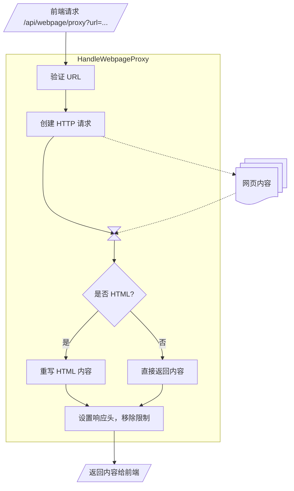
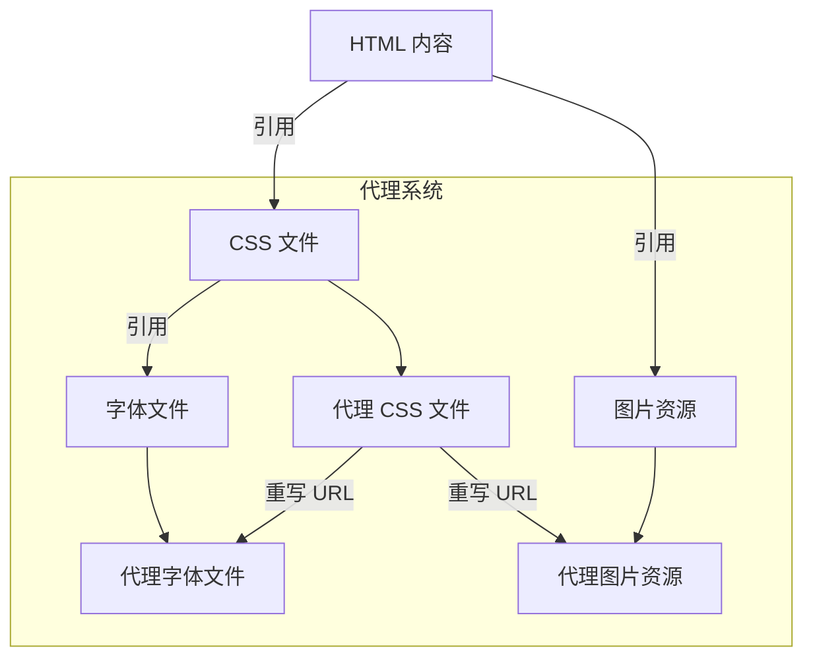

作为一个 RSS 阅读器， 需要提供两种内容查看模式：

1. **渲染模式**：显示 RSS 订阅源中提取的文章内容
2. **原文模式**：直接展示文章的原始网页

第一种模式很简单——解析 RSS 中的 `content` 字段，渲染 HTML 即可。但第二种模式呢？我最初以为，只需要一个简单的 `iframe`：

```html
<iframe :src="article.url"></iframe>
```

然而，当我发现控制台报错满天乱飞时，才意识到事情远没有这么简单。

## 同源策略与 CORS

当你尝试在 iframe 中加载一个外部网页时，首先会遇到的就是 ***同源策略（Same-Origin Policy）***。这是浏览器最基础的安全机制：一个源的文档或脚本不能随意访问另一个源的资源。

对于 MrRSS 来说，应用运行在 `localhost:5343`，而文章原文可能来自任何域名，比如 `https://example.com`。这种跨域加载会遇到两个主要问题：

- ***`X-Frame-Options` 响应头***：很多网站会设置 `X-Frame-Options: DENY` 或 `X-Frame-Options: SAMEORIGIN`，明确禁止被嵌入到其他网站的 iframe 中
- ***Content-Security-Policy（CSP）***：更现代的方式，通过 `frame-ancestors` 指令控制谁可以嵌入页面

而 `iframe` 方案面对这两大问题，第一个问题解决不了，另一个问题也解决不了。

这里，我们需要一个反向代理。其核心思想是：让所有请求都经过后端去代理处理。

例如，对于网页中的一个请求 `https://example.com/article`，具体来说：前端不再直接请求该地址，而是请求 `/api/webpage/proxy?url=https://example.com/article`。后端从目标服务器获取内容，然后返回给前端。由于响应来自同一个源（`localhost:5343`），所以不存在跨域问题。

在前端，iframe 的使用方式变成了：

```vue
<iframe
  :src="`/api/webpage/proxy?url=${encodeURIComponent(article.url)}`"
  sandbox="allow-scripts allow-same-origin allow-popups"
></iframe>
```

后端的 `HandleWebpageProxy` 函数负责代理网页内容。它的基本流程如下：



<details>

<summary>点击展开核心代码</summary>

<div markdown="1">

```go
func HandleWebpageProxy(h *core.Handler, w http.ResponseWriter, r *http.Request) {
    // 1. 从查询参数获取目标 URL
    webpageURL := r.URL.Query().Get("url")
    
    // 2. 验证 URL 的合法性
    if err := validateMediaURL(webpageURL); err != nil {
        http.Error(w, "Invalid url parameter", http.StatusBadRequest)
        return
    }
    
    // 3. 创建 HTTP 客户端
    client := &http.Client{Timeout: 30 * time.Second}
    
    // 4. 构造请求，模拟真实浏览器
    req, _ := http.NewRequest("GET", webpageURL, nil)
    req.Header.Set("User-Agent", "Mozilla/5.0 (Windows NT 10.0; Win64; x64) ...")
    
    // 5. 执行请求
    resp, _ := client.Do(req)
    defer resp.Body.Close()
    
    // 6. 读取响应内容
    bodyBytes, _ := io.ReadAll(resp.Body)
    
    // 7. 重写 HTML 内容
    if strings.Contains(contentType, "text/html") {
        bodyBytes = rewriteHTMLContent(bodyBytes, webpageURL)
    }
    
    // 8. 设置响应头，移除限制
    w.Header().Set("Content-Type", contentType)
    w.Header().Set("X-Frame-Options", "SAMEORIGIN")
    w.Header().Set("Content-Security-Policy", "")
    w.Header().Set("Access-Control-Allow-Origin", "*")
    
    // 9. 返回处理后的内容
    w.Write(bodyBytes)
}
```

</div>

</details>

注意第 8 步：我们覆盖了原始响应中可能存在的 `X-Frame-Options` 和 `Content-Security-Policy` 头。通过设置 `X-Frame-Options: SAMEORIGIN`，我们允许自己的应用嵌入这个页面；通过清空 `Content-Security-Policy`，我们移除了对资源加载的各种限制。

但是，仅仅代理 HTML 是不够的。

## 页面资源加载

一个网页不仅仅是 HTML——它还包含 CSS 样式表、JavaScript 脚本、图片、字体等大量外部资源。当浏览器解析我们代理的 HTML 时，它会遇到类似这样的代码：

```html
<link rel="stylesheet" href="/static/style.css">
<script src="https://cdn.example.com/app.js"></script>

```

问题来了：`/static/style.css` 是相对于原网站的路径，但现在页面是从 `localhost:5343` 加载的，这种相对路径的资源根本找不到正确的服务器。此外，绝对 URL 的资源也可能因为 CORS 而无法加载。

这意味着我们需要重写所有资源 URL，将它们也通过我们的代理加载。

`rewriteHTMLContent` 函数是整个系统中最复杂的部分。它需要处理 HTML 中所有可能包含 URL 的地方。让我们看看需要处理哪些内容：

### 静态资源重写

首先是最直观的部分——各种标签的资源属性：

```go
// 重写 <script src="...">
content = rewriteAttribute(content, "script", "src", baseURL)

// 重写 <link href="...">（样式表等）
content = rewriteLinkHref(content, baseURL)

// 重写 
content = rewriteAttribute(content, "img", "src", baseURL)

// 重写 <iframe src="...">
content = rewriteAttribute(content, "iframe", "src", baseURL)

// 重写 <video src="..."> 和 <video poster="...">
content = rewriteAttribute(content, "video", "src", baseURL)
content = rewriteAttribute(content, "video", "poster", baseURL)

// 重写 <audio src="...">
content = rewriteAttribute(content, "audio", "src", baseURL)

// 重写 <source src="...">
content = rewriteAttribute(content, "source", "src", baseURL)

// ... 还有 embed, object, form 等等
```

`rewriteAttribute` 函数的核心逻辑是找到原始 URL，将其转换为代理 URL：

```go
func rewriteAttribute(content, tag, attr, baseURL string) string {
    // 使用正则匹配标签
    tagRe := regexp.MustCompile(fmt.Sprintf(`<%s[^>]*>`, tag))
    
    return tagRe.ReplaceAllStringFunc(content, func(match string) string {
        // 提取属性值（处理双引号、单引号、无引号三种情况）
        urlValue := extractAttributeValue(match, attr)
        
        // 跳过特殊 URL
        if strings.HasPrefix(urlValue, "data:") ||
           strings.HasPrefix(urlValue, "blob:") ||
           strings.HasPrefix(urlValue, "/api/") {
            return match
        }
        
        // 将相对 URL 解析为绝对 URL
        resolvedURL := resolveURL(urlValue, baseURL)
        
        // 使用 base64 编码避免 URL 特殊字符问题
        proxiedURL := fmt.Sprintf("/api/webpage/resource?url_b64=%s&referer_b64=%s",
            base64.StdEncoding.EncodeToString([]byte(resolvedURL)),
            base64.StdEncoding.EncodeToString([]byte(baseURL)))
        
        // 替换原始 URL
        return replaceAttributeValue(match, attr, proxiedURL)
    })
}
```

这里有一个重要的细节：***使用 base64 编码***。

为什么要用 base64？因为 URL 中可能包含各种特殊字符（`&`, `?`, `=`, `#` 等），如果直接拼接到查询参数中，会导致解析混乱。Base64 编码确保了 URL 的安全传输。

### CSS 中的 URL 重写

CSS 文件中也可能包含资源引用：

```css
@font-face {
    font-family: 'MyFont';
    src: url('/fonts/myfont.woff2') format('woff2');
}

.hero {
    background-image: url('../images/hero.jpg');
}

@import url('components/buttons.css');
```

我们需要处理：

- `url()` 函数引用的资源
- `@import` 导入的样式表
- `@font-face` 中的字体文件

```go
func rewriteCSSURLs(css, baseURL string) string {
    // 处理 @import url("...")
    importRe := regexp.MustCompile(`@import\s+url\(['"]([^'"]+)['"]\)`)
    css = importRe.ReplaceAllStringFunc(css, func(match string) string {
        // ... 重写 URL
    })
    
    // 处理 url(...) 模式
    urlRe := regexp.MustCompile(`url\((['"]?)([^'")]+)\1\)`)
    return urlRe.ReplaceAllStringFunc(css, func(match string) string {
        urlValue := extractURLValue(match)
        
        // 跳过 data: URL
        if strings.HasPrefix(urlValue, "data:") {
            return match
        }
        
        resolvedURL := resolveURL(urlValue, baseURL)
        proxiedURL := fmt.Sprintf("/api/webpage/resource?url_b64=%s&referer_b64=%s",
            base64.StdEncoding.EncodeToString([]byte(resolvedURL)),
            base64.StdEncoding.EncodeToString([]byte(baseURL)))
        
        return fmt.Sprintf(`url(%s)`, proxiedURL)
    })
}
```

### 内联样式处理

别忘了 HTML 中的内联样式：

```html
<div style="background-image: url('/images/bg.png')">...</div>
```

以及 `<style>` 标签中的样式：

```go
func rewriteStyleTags(content, baseURL string) string {
    re := regexp.MustCompile(`(?is)<style[^>]*>(.*?)</style>`)
    return re.ReplaceAllStringFunc(content, func(match string) string {
        cssContent := extractStyleContent(match)
        rewrittenCSS := rewriteCSSURLs(cssContent, baseURL)
        return strings.Replace(match, cssContent, rewrittenCSS, 1)
    })
}

func rewriteInlineStyles(content, baseURL string) string {
    re := regexp.MustCompile(`style\s*=\s*(["'])(.*?)\1`)
    return re.ReplaceAllStringFunc(content, func(match string) string {
        styleValue := extractStyleValue(match)
        rewrittenStyle := rewriteCSSURLs(styleValue, baseURL)
        return replaceStyleValue(match, rewrittenStyle)
    })
}
```

## 动态请求拦截

现在，优化进入深水区。

到目前为止，我们处理的都是 HTML 中的静态资源引用。但现代网页大量使用 JavaScript 进行动态资源加载：

```javascript
// Fetch API
fetch('/api/data').then(response => response.json())

// XMLHttpRequest
const xhr = new XMLHttpRequest();
xhr.open('GET', '/api/data');
xhr.send();

// 动态创建元素
const img = new Image();
img.src = '/images/dynamic.jpg';
```

这些请求发生在运行时，我们在后端重写 HTML 时根本看不到它们！

解决方案是在返回的 HTML 中注入一段 JavaScript 脚本，在页面加载时拦截所有动态请求。

我们在 HTML 的 `<head>` 标签开头注入拦截脚本：

```javascript
(function() {
    'use strict';
    const ORIGINAL_BASE_URL = '` + baseURL + `';
    const PROXY_ORIGIN = window.location.origin;

    // 解析相对 URL
    function resolveRelativeURL(url) {
        if (url.indexOf('http://') === 0 || url.indexOf('https://') === 0) {
            return url;
        }
        if (url.indexOf('//') === 0) {
            return 'https:' + url;
        }
        // 相对 URL - 基于原始页面 URL 解析
        const base = new URL(ORIGINAL_BASE_URL);
        return new URL(url, base).href;
    }

    // 拦截 fetch()
    const originalFetch = window.fetch;
    window.fetch = function(input, ...args) {
        let url = typeof input === 'object' ? input.url : input;
        
        if (typeof url === 'string') {
            const absoluteUrl = resolveRelativeURL(url);
            
            // 跳过已经是代理 URL 的请求
            if (absoluteUrl.indexOf(PROXY_ORIGIN) !== 0) {
                // 构造代理 URL
                const proxyUrl = PROXY_ORIGIN + '/api/webpage/resource?url_b64=' 
                    + btoa(absoluteUrl) + '&referer_b64=' + btoa(ORIGINAL_BASE_URL);
                
                if (typeof input === 'object') {
                    input = new Request(proxyUrl, input);
                } else {
                    input = proxyUrl;
                }
            }
        }
        
        return originalFetch.call(this, input, ...args);
    };

    // 拦截 XMLHttpRequest
    const originalXHROpen = XMLHttpRequest.prototype.open;
    XMLHttpRequest.prototype.open = function(method, url, ...args) {
        if (typeof url === 'string') {
            const absoluteUrl = resolveRelativeURL(url);
            
            if (absoluteUrl.indexOf(PROXY_ORIGIN) !== 0) {
                url = PROXY_ORIGIN + '/api/webpage/resource?url_b64=' 
                    + btoa(absoluteUrl) + '&referer_b64=' + btoa(ORIGINAL_BASE_URL);
            }
        }
        
        return originalXHROpen.call(this, method, url, ...args);
    };
})();
```

这段脚本在页面所有其他脚本之前执行，重写了 `fetch` 和 `XMLHttpRequest.prototype.open`。任何 JavaScript 发起的 HTTP 请求都会被拦截，URL 会被改写为通过我们的代理。

并非所有请求都需要代理。分析类、广告类、追踪类的请求不仅没必要代理，还可能导致问题。我们维护一个跳过名单：

```javascript
const SKIP_PROXY_DOMAINS = [
    'google-analytics.com',
    'googletagmanager.com',
    'doubleclick.net',
    'facebook.com/tr',
    'analytics.twitter.com',
    'clarity.ms',
    // ... 更多域名
];

function shouldSkipProxy(url) {
    const urlObj = new URL(url);
    const hostname = urlObj.hostname.toLowerCase();
    return SKIP_PROXY_DOMAINS.some(domain =>
        hostname === domain || hostname.endsWith('.' + domain)
    );
}
```

对于这些域名的请求，我们直接放行，让它们自然失败，不会影响页面的核心功能。

## 资源代理端点

我们还需要一个专门的端点来代理各种资源文件：

```go
func HandleWebpageResource(h *core.Handler, w http.ResponseWriter, r *http.Request) {
    // 支持普通 URL 和 base64 编码的 URL
    resourceURL := r.URL.Query().Get("url")
    if urlBase64 := r.URL.Query().Get("url_b64"); urlBase64 != "" {
        decoded, _ := base64.StdEncoding.DecodeString(urlBase64)
        resourceURL = string(decoded)
    }
    
    referer := r.URL.Query().Get("referer")
    if refBase64 := r.URL.Query().Get("referer_b64"); refBase64 != "" {
        decoded, _ := base64.StdEncoding.DecodeString(refBase64)
        referer = string(decoded)
    }
    
    // 创建请求
    req, _ := http.NewRequest("GET", resourceURL, nil)
    req.Header.Set("User-Agent", "Mozilla/5.0 ...")
    req.Header.Set("Referer", referer)  // 使用原始页面作为 Referer
    
    // 执行请求
    resp, _ := client.Do(req)
    defer resp.Body.Close()
    
    // 获取正确的 Content-Type
    contentType := resp.Header.Get("Content-Type")
    if contentType == "" || contentType == "application/octet-stream" {
        contentType = getContentTypeFromPath(resourceURL)
    }
    
    // 移除安全相关头部
    w.Header().Set("Access-Control-Allow-Origin", "*")
    w.Header().Set("X-Frame-Options", "SAMEORIGIN")
    w.Header().Set("Content-Type", contentType)
    
    // 特殊处理 CSS 文件 - 递归重写其中的 URL
    if strings.Contains(contentType, "text/css") {
        bodyBytes, _ := io.ReadAll(resp.Body)
        cssContent := rewriteCSSURLs(string(bodyBytes), referer)
        w.Write([]byte(cssContent))
        return
    }
    
    // 其他资源直接流式传输
    io.Copy(w, resp.Body)
}
```

注意这里的一个关键点：***CSS 文件需要递归处理***。因为 CSS 中可能引用其他资源（字体、图片、其他 CSS），这些 URL 也需要被重写。这就形成了一个递归的代理链：



很多服务器返回错误的 `Content-Type`（比如把 CSS 文件返回为 `text/plain`）。浏览器会因为 MIME 类型不匹配而拒绝加载资源。我们需要根据文件扩展名推断正确的类型：

```go
func getContentTypeFromPath(path string) string {
    ext := strings.ToLower(filepath.Ext(path))
    switch ext {
    case ".css":
        return "text/css; charset=utf-8"
    case ".js", ".mjs":
        return "application/javascript; charset=utf-8"
    case ".woff":
        return "font/woff"
    case ".woff2":
        return "font/woff2"
    case ".ttf":
        return "font/ttf"
    case ".svg":
        return "image/svg+xml"
    case ".json":
        return "application/json; charset=utf-8"
    // ... 更多类型
    default:
        return "application/octet-stream"
    }
}
```

## X链接处理与外部跳转

用户在阅读网页时可能会点击链接。我们不希望这些点击在 iframe 内导航（那会破坏阅读体验），而是希望在系统默认浏览器中打开。

### 链接重写策略

我们采用了一种巧妙的方案：

1. 在后端重写所有 `<a>` 标签的 `href` 属性
2. 使用特殊的协议前缀标记需要在外部打开的链接
3. 在前端通过事件委托拦截点击事件

```go
func rewriteAnchorHref(content, baseURL string) string {
    re := regexp.MustCompile(`<a\s+[^>]*href[^>]*>`)
    
    return re.ReplaceAllStringFunc(content, func(match string) string {
        urlValue := extractHref(match)
        
        // 跳过特殊协议
        if strings.HasPrefix(urlValue, "mailto:") ||
           strings.HasPrefix(urlValue, "tel:") ||
           strings.HasPrefix(urlValue, "javascript:") {
            return match
        }
        
        // 解析绝对 URL
        resolvedURL := resolveURL(urlValue, baseURL)
        
        // 使用特殊标记
        proxiedURL := fmt.Sprintf("BROWSER-OPEN:%s", resolvedURL)
        
        // 添加数据属性供 JavaScript 识别
        newMatch := strings.Replace(match, 
            fmt.Sprintf(`href="%s"`, urlValue), 
            fmt.Sprintf(`href="%s" data-proxy-link="true"`, proxiedURL), 1)
        
        return newMatch
    })
}
```

### 客户端点击拦截

在注入的 JavaScript 中，我们监听文档级别的点击事件：

```javascript
document.addEventListener('click', function(e) {
    // 检查点击的元素或其父元素是否是我们标记的链接
    let target = e.target;
    while (target && target !== document) {
        if (target.tagName === 'A' && target.hasAttribute('data-proxy-link')) {
            const href = target.getAttribute('href');
            if (href && href.startsWith('BROWSER-OPEN:')) {
                e.preventDefault();
                e.stopPropagation();
                
                const urlToOpen = href.substring('BROWSER-OPEN:'.length);
                
                // 调用后端 API 在系统浏览器中打开
                fetch(PROXY_ORIGIN + '/api/browser/open?url=' + encodeURIComponent(urlToOpen));
                
                return false;
            }
        }
        target = target.parentElement;
    }
}, true);  // 使用捕获阶段，确保我们先处理
```

后端的 `/api/browser/open` 端点负责调用系统命令打开默认浏览器：

```go
func HandleBrowserOpen(h *core.Handler, w http.ResponseWriter, r *http.Request) {
    url := r.URL.Query().Get("url")
    
    // 使用 Wails 提供的 API 打开浏览器
    runtime.BrowserOpenURL(h.Context, url)
    
    w.WriteHeader(http.StatusOK)
}
```

## XHistory API 拦截

有些网页使用 History API 进行客户端路由，这会导致 iframe 内的 URL 变化，可能破坏页面状态或触发错误。我们需要拦截这些调用：

```javascript
// 拦截 History.pushState
const originalPushState = History.prototype.pushState;
History.prototype.pushState = function(state, title, url) {
    // 阻止绝对 URL 的导航
    if (url && typeof url === 'string' && 
        (url.indexOf('http://') === 0 || url.indexOf('https://') === 0)) {
        return undefined;  // 静默阻止
    }
    return originalPushState.call(this, state, title, url);
};

// 拦截 History.replaceState
const originalReplaceState = History.prototype.replaceState;
History.prototype.replaceState = function(state, title, url) {
    if (url && typeof url === 'string' && 
        (url.indexOf('http://') === 0 || url.indexOf('https://') === 0)) {
        return undefined;
    }
    return originalReplaceState.call(this, state, title, url);
};
```

这样可以防止 SPA（单页应用）类型的网站在 iframe 中进行路由导航。

## 特殊情况处理

### 懒加载图片

很多网站使用懒加载来优化性能，图片的真实 URL 放在 `data-src` 或 `data-original` 属性中：

```html

```

我们在重写时需要特殊处理这类图片：

```go
func convertLazyImages(content string) string {
    re := regexp.MustCompile(`]*>`)
    
    return re.ReplaceAllStringFunc(content, func(match string) string {
        // 查找 data-original 或 data-src 属性
        lazySrc := extractLazyAttribute(match)
        if lazySrc == "" {
            return match
        }
        
        // 构建新的 img 标签，用 data-src 的值替换 src
        // 同时移除 lazy 相关的 class
        attrs := parseHTMLAttributes(match)
        var newTag strings.Builder
        newTag.WriteString("`, lazySrc))
        
        return newTag.String()
    })
}
```

### HTML 实体解码

URL 中可能包含 HTML 实体编码：

```html

```

在处理前需要解码：

```go
// 解码 HTML 实体
srcURL = html.UnescapeString(srcURL)
// image.jpg?a=1&amp;b=2 → image.jpg?a=1&b=2
```

## Electron 是怎么做的？

尽管我们已经做了如此多的努力——HTML 重写、CSS URL 处理、JavaScript 拦截、History API 阻断……但坦白说，这套方案仍然无法完美解决所有问题。

在实际使用中，我们发现了一些几乎不可能通过反向代理解决的问题：

- WebSocket 连接

  很多现代网站使用 WebSocket 进行实时通信。WebSocket 的握手过程和持久连接机制，使得简单的 HTTP 代理难以处理：

  ```javascript
  // 网站可能这样建立 WebSocket 连接
  const ws = new WebSocket('wss://example.com/socket');
  ```

  我们的代理需要支持 WebSocket 协议升级，并且维护长连接——这大大增加了实现的复杂度。

- Service Worker

  Service Worker 是一种在浏览器后台运行的脚本，可以拦截网络请求、管理缓存。当目标网站使用 Service Worker 时：

  ```javascript
  // Service Worker 可以完全接管网络请求
  self.addEventListener('fetch', event => {
      event.respondWith(caches.match(event.request));
  });
  ```

  Service Worker 的注册和作用域管理与同源策略紧密相关，我们的代理方案很难正确处理。

- 复杂的身份验证

  有些网站使用基于 Cookie 的复杂身份验证流程，包括 CSRF Token、SameSite Cookie 属性等。由于我们的代理不转发 Cookie，用户无法在 iframe 中登录或保持登录状态。

- iframe 嵌套检测

  一些网站会使用 JavaScript 检测自己是否运行在 iframe 中：

  ```javascript
  // 常见的 iframe 检测代码
  if (window.self !== window.top) {
      // 在 iframe 中，可能会拒绝显示或跳转
      window.top.location = window.self.location;
  }
  ```

  虽然我们尝试通过 `sandbox` 属性阻止跳转，但有些检测逻辑会直接隐藏内容或显示警告。

- 某些 JavaScript 框架的兼容性

  现代前端框架（React、Vue、Angular）在构建时可能会硬编码一些绝对路径或域名。这些代码嵌入在压缩混淆后的 JavaScript 中，很难通过静态重写来修改。

归根结底，反向代理方案是在应用层面模拟浏览器的行为。我们试图欺骗网页，让它以为自己运行在正常的浏览器环境中。但浏览器的安全模型是经过精心设计的，想要完美地绕过它，需要付出极大的努力——而且永远存在边界情况。

有没有一种方案，能够从根本上解决这个问题呢？

Electron 提供了一个特殊的 `<webview>` 标签，专门用于在应用中嵌入外部网页：

```html
<webview id="foo" src="https://www.github.com/" style="width:640px; height:480px"></webview>
```

与普通的 `<iframe>` 不同，`<webview>` 有几个关键特性：

- ***独立进程***

  > Unlike an `iframe`, the `webview` runs in a separate process than your app. It doesn't have the same permissions as your web page and all interactions between your app and embedded content will be asynchronous. This keeps your app safe from the embedded content.

  `<webview>` 运行在独立的渲染进程中，与主应用完全隔离。这意味着：
  - 嵌入的网页无法访问主应用的 DOM
  - 崩溃不会影响主应用
  - 安全边界清晰

- ***可禁用 Web 安全***

  ```html
  <webview src="https://www.github.com/" disablewebsecurity></webview>
  ```

  通过 `disablewebsecurity` 属性，可以禁用嵌入页面的 Web 安全策略。这意味着 CORS 不再是问题——网页可以自由请求任何资源，不受同源策略限制。

- ***完整的 API 支持***

  Electron 的 webview 提供了丰富的 API：

  ```javascript
  const webview = document.querySelector('webview');

  // 导航控制
  webview.loadURL('https://example.com');
  webview.reload();
  webview.goBack();
  webview.goForward();

  // 注入脚本
  webview.executeJavaScript('document.body.innerHTML');

  // 注入 CSS
  webview.insertCSS('body { background: red; }');

  // 缩放控制
  webview.setZoomFactor(1.5);

  // 页面截图
  const image = await webview.capturePage();

  // 打印
  webview.print();
  ```

- ***丰富的事件系统***

  ```javascript
  webview.addEventListener('did-start-loading', () => {
      console.log('开始加载');
  });

  webview.addEventListener('did-finish-load', () => {
      console.log('加载完成');
  });

  webview.addEventListener('did-fail-load', (event) => {
      console.log('加载失败', event.errorCode, event.errorDescription);
  });

  webview.addEventListener('console-message', (event) => {
      console.log('Guest 页面日志:', event.message);
  });
  ```

Electron 官方文档揭示了 webview 的实现原理：

> Under the hood `webview` is implemented with Out-of-Process iframes (OOPIFs). The `webview` tag is essentially a custom element using shadow DOM to wrap an `iframe` element inside it.

`<webview>` 底层使用了 Chromium 的 ***OOPIF（Out-of-Process iframe）*** 技术。它本质上是一个使用 Shadow DOM 封装 iframe 的自定义元素，但这个 iframe 运行在独立的渲染进程中，拥有更高的权限和更低的安全限制。

然而，Electron 官方已经不推荐使用 `<webview>` 标签：

> ⚠️ Warning: Electron's `webview` tag is based on Chromium's webview, which is undergoing dramatic architectural changes. This impacts the stability of `webviews`, including rendering, navigation, and event routing. We currently recommend to not use the `webview` tag and to consider alternatives, like `iframe`, a `WebContentsView`, or an architecture that avoids embedded content altogether.

官方推荐使用 `WebContentsView`（类似于之前的 `BrowserView`）作为替代方案。`WebContentsView` 是一个独立的窗口组件，可以覆盖在主窗口之上，实现类似的效果。

尽管如此，Electron 的解决思路给了我们重要的启示：要从根本上解决 iframe 的限制，需要在框架层面提供原生的 webview 支持。

## 从根源解决：为 Wails 贡献 `WebviewPanel`

MrRSS 使用的是 Wails 框架——一个轻量级的 Go + Web 技术栈桌面应用框架。相比 Electron 动辄 100MB+ 的体积，Wails 应用通常只有 10-20MB，因为它使用系统自带的 WebView 而不是打包 Chromium。

Wails 在不同平台使用不同的 WebView 引擎：

| 平台 | WebView 引擎 |
| :----- | :------------ |
| Windows | WebView2 (基于 Edge/Chromium) |
| macOS | WKWebView (WebKit) |
| Linux | WebKitGTK |

这种设计使得 Wails 应用体积小巧、启动迅速。但也带来了一个问题：Wails v3 之前没有提供嵌入独立 webview 的能力。

既然现有方案都不能完美解决问题，那就只能从框架层面入手了。我向 Wails 项目提交了一个 PR：[feat(v3): Add WebviewPanel for embedding multiple webviews in a window #4880](https://github.com/wailsapp/wails/pull/4880)。

这个 PR 的目标是实现一个类似 iframe 的效果，但可以绕过 CORS 等问题。具体来说，WebviewPanel 需要支持：

1. 在主窗口中嵌入多个独立的 WebView
2. 每个 WebView 拥有独立的浏览器上下文
3. 可以自由控制位置、大小、层级
4. 提供完整的导航和交互 API

WebviewPanel 的核心是利用各平台原生的 WebView 组件，在每个平台上的实现略有不同：

- ***Windows (WebView2)***

  ```cpp
  // 创建独立的 WebView2 控制器
  CreateCoreWebView2Controller(hwnd, callback);

  // 设置边界
  webviewController->put_Bounds(bounds);

  // 导航到 URL
  webview->Navigate(url);
  ```

- ***macOS (WKWebView)***

  ```swift
  // 创建 WKWebView
  let webView = WKWebView(frame: bounds, configuration: config)

  // 添加到窗口
  window.contentView?.addSubview(webView)

  // 加载 URL
  webView.load(URLRequest(url: url))
  ```

- ***Linux (WebKitGTK)***

  ```c
  // 创建 WebKit WebView
  GtkWidget *webview = webkit_web_view_new();

  // 设置位置和大小
  gtk_fixed_put(GTK_FIXED(container), webview, x, y);
  gtk_widget_set_size_request(webview, width, height);

  // 加载 URL
  webkit_web_view_load_uri(WEBKIT_WEB_VIEW(webview), url);
  ```

WebviewPanel 对外暴露了简洁而强大的 TypeScript API：

- 创建与基本操作

  ```typescript
  import { WebviewPanel } from '@wailsio/runtime';

  // 创建一个新的 WebviewPanel
  const panel = WebviewPanel.New();

  // 导航到 URL（这就是我们需要的！无 CORS 限制！）
  panel.SetURL('https://example.com/article');

  // 获取当前 URL
  const url = panel.GetURL();

  // 设置 HTML 内容
  panel.SetHTML('<h1>Hello World</h1>');
  ```

- 位置与大小控制

  ```typescript
  // 设置绝对位置和大小
  panel.SetBounds(100, 100, 800, 600);  // x, y, width, height

  // 获取当前边界
  const bounds = panel.GetBounds();
  console.log(bounds.x, bounds.y, bounds.width, bounds.height);
  ```

- 可见性与层级

  ```typescript
  // 显示/隐藏
  panel.SetVisible(true);
  const isVisible = panel.IsVisible();

  // 设置 Z 轴顺序（多个 panel 时的层级关系）
  panel.SetZOrder(1);  // 数字越大越靠前

  // 聚焦
  panel.Focus();
  ```

- 高级功能

  ```typescript
  // 缩放
  panel.SetZoom(1.5);  // 150%
  const zoom = panel.GetZoom();

  // 打开开发者工具（调试用）
  panel.OpenDevTools();

  // 销毁
  panel.Destroy();
  ```

有了 WebviewPanel，在 Vue 中使用变得非常简单：

```vue
<script setup lang="ts">
import { ref, onMounted, onUnmounted, watch } from 'vue';
import { WebviewPanel } from '@wailsio/runtime';

const props = defineProps<{
  url: string;
  visible: boolean;
}>();

const panelRef = ref<HTMLDivElement>();
let panel: WebviewPanel | null = null;

onMounted(() => {
  // 创建 WebviewPanel
  panel = WebviewPanel.New();
  
  // 根据容器位置设置 panel 边界
  updateBounds();
  
  // 加载 URL
  panel.SetURL(props.url);
  panel.SetVisible(props.visible);
});

function updateBounds() {
  if (!panel || !panelRef.value) return;
  
  const rect = panelRef.value.getBoundingClientRect();
  panel.SetBounds(rect.left, rect.top, rect.width, rect.height);
}

watch(() => props.url, (newUrl) => {
  panel?.SetURL(newUrl);
});

watch(() => props.visible, (visible) => {
  panel?.SetVisible(visible);
});

onUnmounted(() => {
  panel?.Destroy();
});
</script>

<template>
  <div ref="panelRef" class="webview-container"></div>
</template>

<style scoped>
.webview-container {
  width: 100%;
  height: 600px;
  background: #f0f0f0;
}
</style>
```

## 总结

让我们对比一下三种嵌入外部网页的方案：

| 特性 | 反向代理 + iframe | Electron webview | Wails WebviewPanel |
| ------ | ------------------- | ------------------ | ------------------- |
| CORS 绕过 | ✅ 通过代理绕过 | ✅ 可禁用安全策略 | ✅ 独立 WebView 无限制 |
| X-Frame-Options | ✅ 代理移除 | ✅ 不受限制 | ✅ 不受限制 |
| CSP 限制 | ✅ 代理移除 | ✅ 不受限制 | ✅ 不受限制 |
| 动态 JS 请求 | ⚠️ 需要拦截脚本 | ✅ 自动处理 | ✅ 自动处理 |
| WebSocket | ❌ 难以处理 | ✅ 原生支持 | ✅ 原生支持 |
| Service Worker | ❌ 难以处理 | ✅ 原生支持 | ✅ 原生支持 |
| Cookie/登录 | ❌ 不支持 | ✅ 独立会话 | ✅ 独立会话 |
| 进程隔离 | ❌ 同一进程 | ✅ 独立进程 | ✅ 独立进程 |
| 实现复杂度 | 🔴 高（需大量代码） | 🟢 低（框架内置） | 🟢 低（框架内置） |
| 应用体积 | 🟢 无影响 | 🔴 +100MB+ | 🟢 无影响 |
| 兼容性 | ⚠️ 部分网站不兼容 | 🟢 几乎全兼容 | 🟢 几乎全兼容 |

---

**相关链接：**

- [MrRSS 项目](https://github.com/WCY-dt/MrRSS) - 本文所述的 RSS 阅读器
- [Wails WebviewPanel PR #4880](https://github.com/wailsapp/wails/pull/4880) - 为 Wails 贡献的 WebviewPanel 功能
- [Electron webview 文档](https://www.electronjs.org/docs/latest/api/webview-tag) - Electron 官方 webview 标签文档
- [Wails 官网](https://wails.io/) - 轻量级 Go + Web 桌面应用框架
