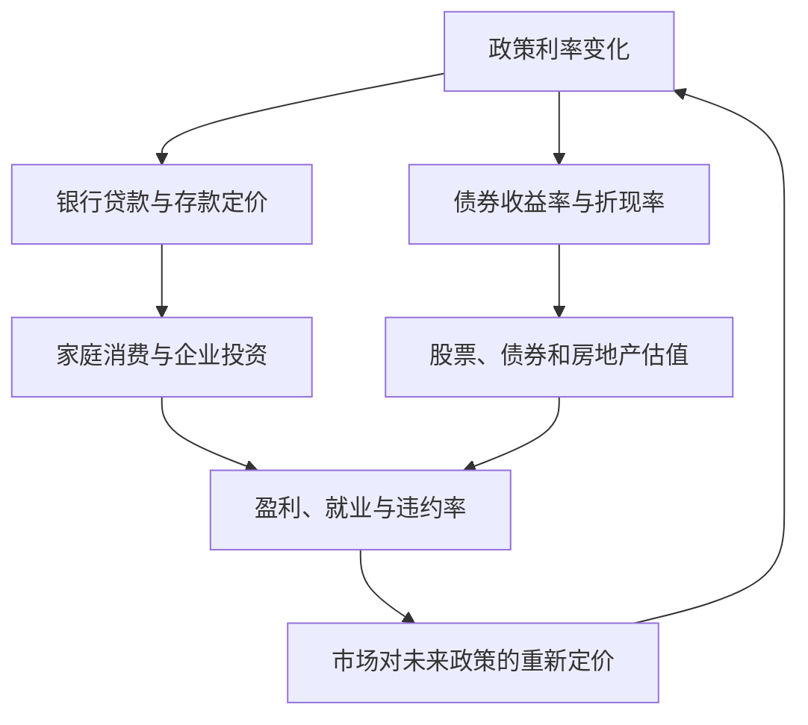
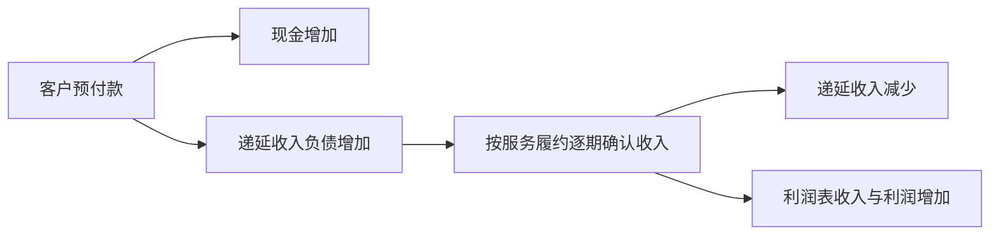
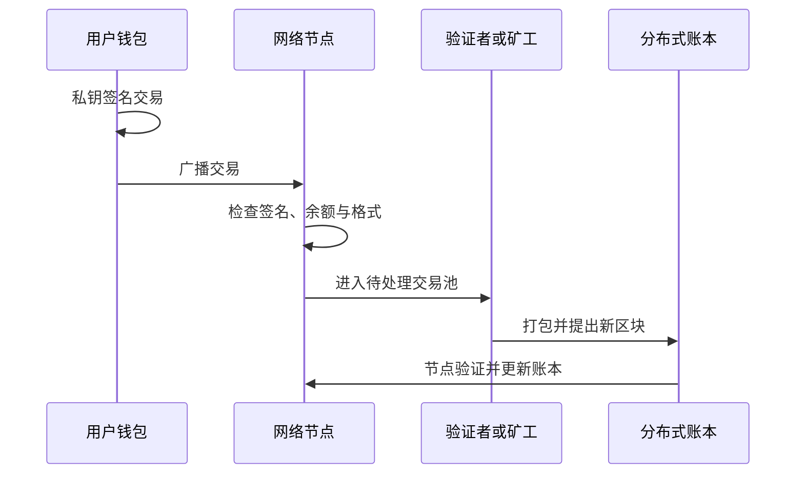
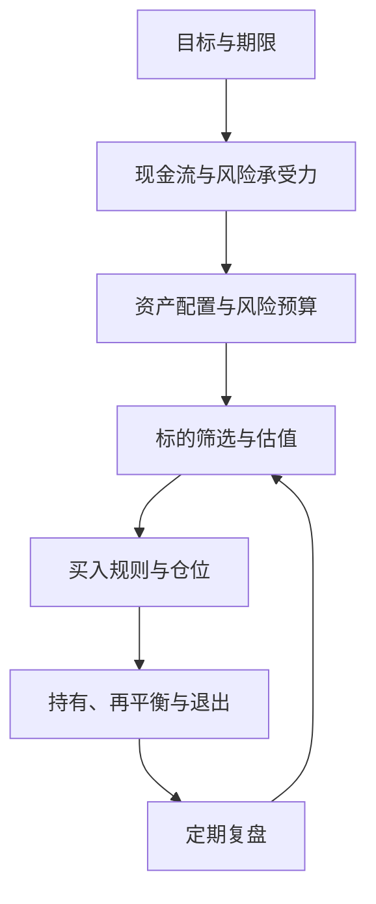

> ***免责声明*** 本文是教育性材料，不构成个性化投资建议。不同国家和地区的交易规则、税务、投资者保护和产品可得性不同；实际操作前，应以当地监管机构、交易所、基金合同和券商文件为准。

## 前言：先建立地图

先建立地图，再谈标的。本文把个人目标、现金流和风险约束放在投资选择之前。

如果你在互联网行业做开发，可能已经熟悉 `需求—实现—测试—上线—监控` 的工作流，却不一定熟悉 `现金流—资产—风险—回报` 的投资工作流。投资不是把图表解释得越来越复杂，也不是预测下一根 K 线。它是把今天暂时不用的钱，配置到能够在未来产生现金流、提供风险补偿或保护购买力的资产中。

换句话说，投资首先是关于时间、约束和概率的决策————选择标的只是其中一个环节。

这件事表面上是在选择股票、基金或债券，实质上更像设计一个长期运行的系统。先定义目标，再识别约束；先安排现金流，再决定风险预算；先理解产品如何赚钱，再判断当前价格是否值得接受。一个产品过去涨得很多，只能说明过去发生过什么，不能证明它适合你的目标。

程序员还面临一个容易被忽略的问题：人力资本和金融资本可能暴露在同一个风险因子上。工资、年终奖、限制性股票、期权、所在行业和职业机会，可能都与互联网景气度、广告预算、云计算支出或某一家公司的发展有关。如果金融资产也集中在同一行业，看起来持有了很多标的，实际上可能只是把同一个风险复制了许多遍。

本文的主线是：


目标不是找到一份“必胜标的”清单，而是建立一套可解释、可执行、能承受错误的系统：

1. 明白自己为什么投资、何时需要用钱。
2. 理解每一种资产靠什么产生收益。
3. 用数据和商业逻辑判断价格是否合理。
4. 用组合和仓位管理控制单点失败。
5. 用规则降低情绪对决策的影响。

开始学习前，先把自己的财务系统分成三个层次。它们不一定对应三个银行账户，但最好在记录和心理上分开：

| 层次 | 解决的问题 | 对流动性和波动的要求 | 常见误区 |
| --- | --- | --- | --- |
| 生存层 | 房租、吃饭、医疗、应急和短期账单 | 随时可用，本金波动尽量小 | 把应急金拿去追求收益 |
| 目标层 | 买房、换车、教育、退休等明确目标 | 与目标期限匹配，不能只看平均收益 | 把短期目标按长期资金配置 |
| 增长层 | 十年以上的财富积累 | 可以承受阶段性波动 | 把高波动等同于高质量 |

还可以单独标出一笔学习资金。它的意义不是给亏损找借口，而是把试错成本限定在一个不会破坏生活和长期计划的范围内。没有清晰边界时，所谓学习往往会变成不断加仓，最后让一个小实验变成一场无法承受的押注。

### 如何学习：从名词走向模型

不要试图一次记住所有名词。投资学习的重点不是把术语背成词典，而是逐渐形成可以用于判断的模型。每学完一个概念，都用三个问题检查自己：

1. ***它描述的对象是什么？*** 是现金流、价格、制度，还是一种统计方法？
2. ***它靠什么产生收益或风险？*** 能否画出最简单的因果链？
3. ***什么证据会推翻我的判断？*** 如果没有答案，说明你可能只是在讲故事。

可以把阅读过程当成一次小型代码评审：定义是接口，公式是业务逻辑，案例是单元测试，压力情景是故障演练。一个投资观点如果只剩下“这个行业很有前景”，就像只有函数名，没有输入、输出和异常处理；它还不能执行。

学习金融时，最容易出现的错觉是看懂了很多定义，却无法解释价格为什么变化。把知识分成四层：

1. **对象层**：钱、贷款、股票、债券、基金、期权分别是什么法律和经济关系；
2. **收益层**：收益来自利息、分红、租金、企业再投资、价格变化，还是别人愿意支付更高价格；
3. **风险层**：哪些因素会导致短期波动，哪些因素会造成永久损失，哪些因素会让你被迫卖出；
4. **执行层**：通过什么账户、什么产品、什么费用和什么规则把判断落地。

例如，看到一家公司的股票上涨，不能只记录价格涨了。至少可以拆成：利润预期提高、估值倍数提高、股息或回购增加、市场风险偏好改善、汇率变化，或者只是流动性和情绪推动。拆分之后，你才知道哪些变量值得继续验证。

每一次研究都可以先写出一个可证伪的假设，而不是先收集支持自己的材料。例如：

```text
假设：这家公司的利润增长能够持续三年。
需要验证：客户数量、客单价、毛利率、销售费用、留存率和竞争反应。
可能推翻：增长主要来自一次性补贴；客户集中度过高；现金流长期低于利润；
          新竞争者让价格持续下降；管理层需要频繁融资才能维持经营。
```

这样做能减少确认偏误。研究的目标不是证明自己最初的想法正确，而是尽快找到最可能让它失效的证据。

假设小林是一名后端工程师，每月到手收入 $$25,000$$ 元，固定生活支出 $$12,000$$ 元，没有高利率债务，已经积累了 $$120,000$$ 元现金。他希望 $$3$$ 年后换一辆车，$$15$$ 年后积累一笔长期资金，同时担心自己收入和互联网行业景气度高度相关。这个案例不代表标准答案，只用来展示如何把抽象概念落到现金流、期限和风险上。

小林不能把 $$120,000$$ 元全部买入科技股：$$3$$ 年后的买车目标期限太短，股票可能恰好处于下跌期；也不能把所有钱放在现金里，因为 $$15$$ 年目标会受到通胀侵蚀。合理的第一步不是挑股票，而是把目标分桶：

| 目标 | 期限 | 首要约束 | 初步思路 |
| --- | ---: | --- | --- |
| 应急金 | 随时 | 流动性和本金稳定 | 现金或低波动工具 |
| 换车 | $$3$$ 年 | 不能承受大幅回撤 | 短期债券、现金类工具为主 |
| 长期财富 | $$15$$ 年 | 需要跑赢通胀 | 分散股票为增长核心 |
| 学习试错 | 不确定 | 亏损不能影响生活 | 设定很小的探索额度 |

这个例子只用来说明一件事：投资不是寻找“最好的资产”，而是让每笔钱承担与期限相匹配的风险。

进一步看，小林每月有约 $$13,000$$ 元结余，但这并不代表这笔钱全部都能长期投资。他还要考虑保险、家庭支持、职业空窗、搬家、继续教育和可能发生的大额维修。可投资现金流应当是一个经过现实预算验证的数字，而不是把理想状态下的月度结余全部写进计划。

把目标写成金额、日期和最低可接受结果，会比尽量赚得多更有用：

| 目标 | 需要回答的问题 |
| --- | --- |
| 金额 | 到目标日期，名义上需要多少钱？是否应把通胀加入预算？ |
| 日期 | 这是硬期限，还是可以推迟一到三年的软期限？ |
| 现金流 | 目标需要一次性支付，还是可以持续投入？ |
| 容错 | 如果市场下跌，能否推迟消费或增加储蓄？ |
| 币种 | 将来支出和当前收入是否使用同一种货币？ |

如果目标日期是硬期限，最重要的指标不是长期平均收益率，而是目标日期附近缺钱的概率。这个区别会直接影响资产配置。

### 投资之前：先回答六个问题

1. ***投资不是储蓄，也不是赌博***

储蓄的核心是本金安全和流动性；投资是在承担不确定性的前提下争取长期回报；赌博则主要依赖随机性和短期输赢。三者在现实中可能混在一起：高波动的股票仓位可能被当成赌博，期限过长的债券基金也可能不再像现金。每笔钱投入前，都要先说清楚它属于哪一类，以及自己承担的究竟是哪一种风险。

2. ***回报与风险通常成套出现***

    长期高回报通常意味着至少承担一种风险：价格波动、企业经营失败、利率变化、信用违约、汇率变化、流动性不足或监管变化。看到“高收益、低风险、随时提现”时，先追问它把风险藏在哪里。

3. ***先处理个人财务，再研究市场***

    在买股票、基金或加密资产之前，至少完成三件事：

    - 预留能覆盖数月基本生活费的应急现金；
    - 清理高利率消费债务，尤其是无法通过投资回报稳定覆盖的债务；
    - 为每笔投资写下金额、期限、最大可接受亏损和退出条件。

    对程序员而言，限制风险的不只是账户余额，还有职业收入与投资暴露的相关性：如果你的工资、股票期权和职业前景都与互联网广告或某一家科技公司高度相关，就不应再把全部可投资资产押在同一行业上。

4. ***先定义损失，再讨论收益***

    同样是亏损 $$20,000$$ 元，对不同人的含义完全不同。对有稳定收入、没有近期支出的人，它可能是一次可承受的波动；对三个月后要支付房租和医疗费用的人，它可能意味着借款、违约或被迫出售。风险承受能力不只是心理测试的分数，还包括收入稳定性、负债、家庭责任、资产期限和可获得的外部支持。

5. ***把投资风险拆成几种不同的风险***

    - **市场风险**：价格因利率、情绪或整体估值变化而波动；
    - **经营风险**：企业收入下降、成本失控、竞争失败或管理层失误；
    - **信用风险**：借款人无法按时支付利息或偿还本金；
    - **流动性风险**：想卖出时没有足够买家，或只能以很差的价格成交；
    - **期限风险**：资产的可用时间与资金需求不匹配；
    - **操作风险**：账户、托管、转账、密码、合同或税务处理出错；
    - **行为风险**：在恐慌和贪婪中偏离原本计划。

    不同产品可能同时包含多种风险。比如一只高收益债券基金既有利率风险，也有信用风险和流动性风险；一套按揭购买的房产既有价格风险，也有利率、空置和集中度风险。

6. ***费用是确定的，收益通常不是***

    管理费、托管费、申赎费、交易佣金、买卖价差、税费、汇兑成本和融资利息，都是需要从收益中扣除的真实成本。收益率可以为正也可以为负，费用却会在每个持有周期中发生。研究产品时，应尽量把费用换算成年化比例，并估算在自己的持有期限内会减少多少终值。

    如果投资前无法说清楚总费用、赎回限制和最差情景，通常还不适合投入大额资金。复杂不是专业的同义词；对新手来说，难以解释的结构往往意味着难以控制的风险。

在第一次买入前，可以逐项回答：

```text
[ ] 这笔钱在什么时候可能要用？
[ ] 如果价格下跌 30%，我是否仍能完成生活和近期目标？
[ ] 我是否有足够的应急金和必要保障？
[ ] 我买到的是资产本身，还是某种杠杆、衍生品或债权凭证？
[ ] 收益的主要来源是什么？谁在为它支付？
[ ] 最坏情况下会亏多少，是否可能超过本金？
[ ] 能否随时卖出？卖出成本和结算时间是多少？
[ ] 费用、税务、托管和监管规则是否已经查清？
[ ] 什么证据会让我承认最初的判断错了？
```

如果有几项只能用应该、大概或平台说来回答，就先把它们列为待核实事项，不要用更大的仓位来弥补认知上的空白。

个人财务还需要做一张简单的资产负债表。资产可以按流动性分为现金、短期金融资产、长期投资和不动产；负债则列出信用卡、消费贷、房贷、车贷以及可能的担保责任。净资产只是资产减负债的结果，不能替代现金流分析：一个人可能账面净资产很高，却因为收入中断和短期债务到期而陷入流动性危机。

定期重算三个数字：可立即使用的现金、未来十二个月的确定支出、在不借钱的情况下可以持续投入的金额。只有第三个数字适合用来制定长期投资计划。奖金、股票期权和未实现的浮盈不应被当成稳定现金流，除非你已经考虑归属、税费、价格波动和变现限制。

保险也属于投资前的基础设施。医疗、意外、失能和家庭责任风险可能远大于账户中的一次价格波动。如果一个人没有足够的风险保障，却把大部分现金投入高波动资产，任何一次意外都可能迫使他在最差的价格卖出。保险解决的是低概率、高损失事件，投资解决的是长期购买力和财富增长，两者不能互相替代。

## Part I：金融世界的基础

### 1.1 钱是什么

钱至少有三个功能：交换媒介、计价单位和价值储藏工具。纸币本身通常没有与面值相等的商品价值，它之所以能被接受，是因为法律、税收、金融系统和社会信任共同支撑了它。对投资者来说，重要的不只是账户里有多少数字，还要问这些数字由谁发行、能否兑换成商品和服务、在什么条件下可以转移，以及未来购买力是否稳定。

把钱看成一种社会账本会更容易理解。你为别人提供劳动、商品或服务，账本记录你拥有一项可以交换未来商品和服务的权利；你消费时，则把这项权利转移给别人。银行账户里的数字不是一堆放在某个抽屉里的现金，而是银行对你的负债。不同货币和账户背后有不同的发行者、清算体系和法律保障，不能只把它们视为屏幕上的数字。

钱的三个功能有时会发生冲突：

| 功能 | 关注点 | 可能的失效方式 |
| --- | --- | --- |
| 交换媒介 | 能否方便、广泛地支付 | 网络故障、账户限制、流动性不足 |
| 计价单位 | 能否稳定比较商品和资产的价格 | 通货膨胀或货币贬值 |
| 价值储藏 | 能否把购买力带到未来 | 物价上涨、发行者信用下降、资产价格波动 |

因此，现金的风险并不等于零。现金的名义金额通常稳定，但它可能承担通胀风险、银行或支付机构风险，以及未来利率下降导致的机会成本。

现代经济主要使用法定货币（fiat money）。它不要求发行者把每一单位货币兑换成固定重量的黄金，而是由国家法律、央行政策、银行体系和经济活动共同维持。信用货币的关键不是凭空变出财富，而是未来偿还承诺在今天被广泛接受。这个体系的稳定依赖支付制度、财政能力、银行资本、货币政策和公众信任，任何一个环节出现严重问题，都可能影响货币的价值和流通。

黄金货币时代提供了一个对比：货币供应量受黄金储量和兑换制度约束，调整弹性较小；现代信用货币能够更快响应经济需要，但也更依赖制度、银行资本和公众信任。货币增加并不等于财富增加：如果新增货币追逐有限的商品和服务，价格可能上涨。

还要区分货币和财富。货币是用于结算的金融资产，财富则包括土地、住房、机器、软件、专利、教育、企业组织能力和自然资源等能够提供未来服务的东西。央行或银行可以改变金融资产的数量和价格，但不能只靠记账就让社会拥有更多工程师、住房、能源和有效技术。货币扩张如果没有对应的生产能力增加，可能更多地表现为商品、服务或资产价格上升。

不同国家统计口径并不完全相同，不能机械地把某个国家的 $$M1$$ 和另一个国家的 $$M1$$ 直接比较。粗略理解可以是：

- **$$M0$$**：流通中的现金或基础货币的某一统计口径；
- **$$M1$$**：更偏向可立即用于支付的货币，如现金加活期存款；
- **$$M2$$**：在 $$M1$$ 基础上加入期限更长、流动性稍低的存款或类似工具。

真正需要记住的是：货币供应量、信用扩张、利率和经济活动彼此相连，但任何单一货币指标都不是资产价格的“万能开关”。

一个指标的统计口径比它的名字更重要。阅读货币数据时，至少检查：

- 它是存量还是流量；
- 它按月、按季还是按年统计；
- 是否经过季节调整；
- 是本币金额、实际金额，还是同比增速；
- 是否包含银行体系中的某类存款或金融机构。

把货币增速直接等同于股票涨跌，通常会跳过中间环节。货币如何进入经济、谁拿到资金、资金用于消费还是投资、银行是否收紧信贷、企业能否把资金转化为利润，都会影响最终结果。

通货膨胀是一般价格水平持续上涨。若一年通胀率为 $$3\%$$，$$100$$ 元能买到的东西，名义价格不变时，实际购买力大致相当于上一年的 $$97$$ 元。近似计算为：

$$
\text{实际回报率} \approx \text{名义回报率} - \text{通胀率}
$$

更精确的写法是：

$$
\text{实际回报率}=\frac{1+\text{名义回报率}}{1+\text{通胀率}}-1
$$

因此，投资的目标不应只看账户数字变大，还要看它是否跑赢了未来的生活成本。

通胀也不是每个人面对的同一个数字。官方价格指数是一篮子商品和服务的平均变化，而个人消费结构可能不同：租房者对住房成本更敏感，养车者对能源和维修更敏感，有子女的家庭对教育和医疗更敏感。规划长期目标时，可以同时使用宏观通胀指标和自己的个人支出表，避免只依赖一个平均数字。

如果本金为 $$P$$，年化回报率为 $$r$$，持有 $$n$$ 年，忽略税费时：

$$
\text{终值}=P\times(1+r)^n
$$

$$10,000$$ 元以年化 $$6\%$$ 增长 $$10$$ 年约为 $$17,908$$ 元，增长 $$20$$ 年约为 $$32,071$$ 元。后 $$10$$ 年增加的金额大于前 $$10$$ 年，原因不是第二个十年投入了更多本金，而是此前积累的收益也开始产生收益。

但复利同样会放大费用和亏损。若一个产品每年额外收取 $$2\%$$，看起来只是少几个百分点，长期却会明显降低终值。比较产品时，要看“扣除费用、税费和通胀后的复合回报”，而不是只看宣传材料中的单年收益率。

对于刚开始工作的程序员，最重要的“本金”往往来自未来多年持续储蓄，而不是第一次买入时的择时。把每月结余 $$C$$ 看成持续投入：

$$
\text{定期投入的终值}\approx C\times\frac{(1+r)^n-1}{r}
$$

这个公式忽略了投入日期、税费和回报波动，但能说明一个重要事实：提高储蓄率、延长投资期限和降低费用，往往比寻找一个神奇的高收益标的更可靠。

定期投入也不等于可以忽略价格。它解决的是一次性择时压力，把新资金分散到多个时点；它不能消除资产本身的经营风险，也不能保证最终盈利。对于长期、分散、低成本的资产，持续投入通常比较容易执行；对于单一股票或高度投机的资产，机械定投可能只是持续增加错误判断的损失。

一个有用的拆分是：

$$
\text{最终财富}=\text{投入本金}+\text{市场回报}-\text{费用和税费}-\text{通胀损失}
$$

这个式子不是精确的会计恒等式，但能提醒你，最终结果同时取决于收入、储蓄、持有时间、投资回报、成本和购买力。只研究最后一个变量，通常会高估选股的作用。

复利还有一个容易被忽略的条件：收益必须能够被保留并继续投入。如果投资者每次上涨都取出收益、下跌时又停止投入，实际复利速度会低于公式；如果收益被高费用、税费或频繁交易消耗，长期差异会进一步扩大。对于波动资产，平均年化收益率也不能完整描述体验，因为收益路径不同会影响最终结果。

例如，两条投资路径都从 $$100,000$$ 元开始，第一年上涨 $$30\%$$、第二年下跌 $$20\%$$，最终约为 $$104,000$$ 元；另一条路径第一年下跌 $$20\%$$、第二年上涨 $$30\%$$，结果也相同，但投资者的心理感受和追加资金行为可能完全不同。长期计划要关注几何复合回报，而不是把每年的算术平均简单相加。

购买力还与未来支出的结构有关。退休后需要支付的是一系列真实商品和服务，而不是一个抽象的通胀率；医疗、住房、教育和能源的价格变化可能与总体指数不同。因此，长期规划可以把支出分为刚性支出和可调整支出，分别设置安全资产和增长资产，并在接近目标日期时逐步降低对高波动资产的依赖。

货币的国际比较也不能只看汇率。汇率是两种货币之间的价格，购买力平价是对不同国家商品价格的长期比较，资本流动、利率差、贸易、财政和市场情绪都会让汇率偏离某个理论水平。持有外币资产可能帮助分散本国风险，也可能因为汇率变化抵消资产本身的收益。判断外币暴露时，先问未来支出用什么货币，再问是否需要对冲。

央行政策也不能简单理解为开关。政策利率影响短期融资成本，公开市场操作和资产负债表政策影响金融机构的流动性，前瞻指引影响市场预期；但政策能否传到家庭和企业，还取决于银行是否愿意放贷、借款人是否愿意借款以及资产负债表是否健康。宽松政策可能推高资产价格，却不一定马上带来工资和产出的同步增长。

通胀预期本身也会影响行为。企业预期成本上涨，可能提前提价；员工预期生活成本上涨，可能要求更高工资；消费者预期未来更贵，可能提前购买；如果这些行为互相强化，通胀就可能更持久。要区分一次性的价格跳升与持续的工资、租金和服务价格压力，因为它们对企业利润和利率路径的影响不同。

### 1.2 银行如何创造货币

商业银行的资产通常包括贷款和证券，负债包括客户存款。银行批准一笔贷款时，通常会同时在借款人的账户上记入存款；借款人偿还本金时，对应的存款和贷款余额都会减少。这是现代银行体系中存款货币的重要来源，但不是无限制的印钞，也不意味着社会的真实资源同步增加。英国央行对这一过程有一篇很好的说明：[Money creation in the modern economy](https://www.bankofengland.co.uk/quarterly-bulletin/2014/q1/money-creation-in-the-modern-economy)。

这里的关键是资产负债表同时扩张，而不是银行把已有存款从一个抽屉搬到另一个抽屉。银行拿到的是对借款人的债权，借款人拿到的是对银行的存款请求权。双方都增加了金融资产和金融负债，整个社会的真实财富只有在贷款被用于建设住房、购买设备、开发产品并产生有价值的服务时才可能增加。

银行体系还承担支付和清算功能。某家银行发放的贷款如果被用于支付给另一家银行的客户，前者需要把准备金或其他结算资产转给后者。单家银行可以在账面上增加存款，但不能无视银行间结算、流动性和资本约束。

假设银行在放贷前的资产负债表如下，暂时忽略资本和其他项目：

| 银行资产 | 金额 | 银行负债与权益 | 金额 |
| --- | ---: | --- | ---: |
| 现金和准备金 | $$100$$ | 客户存款 | $$100$$ |
| **合计** | **$$100$$** | **合计** | **$$100$$** |

银行批准一笔 $$50$$ 元贷款时，账面可能变成：

| 银行资产 | 金额 | 银行负债与权益 | 金额 |
| --- | ---: | --- | ---: |
| 现金和准备金 | $$100$$ | 原有客户存款 | $$100$$ |
| 新增贷款 | $$50$$ | 借款人新增存款 | $$50$$ |
| **合计** | **$$150$$** | **合计** | **$$150$$** |

银行的资产增加了贷款，负债增加了存款，账面仍然平衡。借款人有了可支付的存款，同时也承担了未来还本付息的债务。银行创造的是支付能力和债权债务关系，不是凭空创造了房屋、服务器、工程师或粮食。

需要特别区分三件事：

1. **银行创造存款**：贷款发放时，借款人账户出现新的存款；
2. **央行提供基础货币**：现金和银行准备金属于更底层的结算资产；
3. **经济创造真实产出**：劳动、资本、技术和组织把资源转化为商品和服务。

三者相互影响，但不是同一回事。把银行存款、央行准备金和社会财富混为一谈，会导致对通胀、资产价格和金融危机的错误判断。


这不表示银行可以无限创造货币。银行受到资本约束、流动性约束、监管要求、融资成本、信用风险和借款人需求的限制。央行的政策利率会影响银行融资与贷款定价，进而影响企业和家庭愿意借多少钱。

银行至少受到五类约束：

1. **资本约束**：贷款发生损失时，需要有权益资本吸收损失；
2. **流动性约束**：客户把钱转到其他银行时，银行需要完成结算；
3. **信用约束**：借款人可能失业、经营失败或拒绝偿还；
4. **监管约束**：资本、流动性、集中度和大额风险暴露受到监管；
5. **需求约束**：即使银行愿意放贷，企业也可能因前景差而不愿借钱。

因此，“存款准备金率下降，货币就按固定倍数上涨”的机械解释是不完整的。现实中的信贷扩张取决于银行愿意借、客户愿意借、监管允许借，以及整个经济是否有足够的投资回报。

银行的资本也值得单独解释。资本不是银行可以随时取出的另一种存款，而是股东承担损失的缓冲垫。假设银行有 $$100$$ 元资产、$$90$$ 元存款和 $$10$$ 元权益资本，若贷款减值 $$5$$ 元，资产降到 $$95$$ 元，存款仍需偿还 $$90$$ 元，权益就只剩 $$5$$ 元。若减值继续扩大，资本可能被耗尽，银行的偿付能力就会受到威胁。

这也是为什么研究金融机构不能只看收入和利润。金融机构的资产通常由大量债权组成，资产质量、抵押品价值、期限结构、资本缓冲和融资稳定性，决定了利润在压力环境下是否可靠。

银行的贷款通常期限较长，而存款可以随时提取。只要大多数客户相信银行可靠，这种期限转换可以正常运行；但如果很多人同时提款，银行可能来不及把长期贷款变现。即使银行的长期资产理论上有价值，也可能因为急售而产生损失。

这对投资者的启发是：看到一家金融机构“资产很多”还不够，还要看资产能否在压力下变现、负债何时到期、资本能承受多大损失。研究银行股时，贷款质量、资本充足、存款稳定性和资产负债期限，比单看 PE 更重要。

利率较低、资产价格上涨、违约率较低时，银行和借款人往往更愿意扩张信用；当利率上升、资产价格下跌或失业增加时，贷款审批可能变严，企业减少投资，家庭减少消费，经济活动又会反过来走弱。这种“借钱更容易—支出扩张—杠杆上升—风险暴露—信用收缩”的循环，就是信贷周期的直观版本。

银行的利润通常来自贷款和投资资产的收益，减去存款及其他融资成本、运营成本和信用损失。银行不是一个天然安全的“现金盒子”，而是一家使用期限和信用转换经营的企业。

对普通投资者而言，存款、银行理财、银行债券和银行股票是四种不同的法律关系：

| 工具 | 你通常扮演的角色 | 主要风险 |
| --- | --- | --- |
| 存款 | 银行债权人 | 银行信用、保障上限、通胀和再投资风险 |
| 银行理财 | 产品投资者 | 底层资产、净值波动、流动性和产品条款 |
| 银行债券 | 债券持有人 | 信用、利率、期限和次级偿付顺序 |
| 银行股票 | 股东 | 银行经营、资本、监管和估值风险 |

同一家银行发行的不同产品，风险并不会因为品牌相同而自动相同。购买前要看合同中的发行主体、是否保本、资产归属、赎回安排和损失承担顺序。

银行分析还要关注资产负债表之外的承诺，例如表外理财、担保、承诺授信、衍生品和关联机构风险。银行可能在正常时期通过这些业务获得手续费，但压力时期需要承担流动性或信用责任。对存款人而言，保障制度的覆盖范围、额度、币种和触发条件也应当以当地规则为准，不能把所有金融产品都笼统地理解为受保护的存款。

信贷对经济有两面性。它可以把未来收入提前用于建设工厂、购买住房和开发技术，也可以把资产价格推到现金流无法支撑的水平。观察信贷扩张时，既要看总量，也要看用途：生产性投资可能增加未来供给，纯粹用于追逐资产价格的杠杆则更容易在利率上升时反转。房地产、银行和高收益债券尤其需要放在同一条信用链里分析。

信用分析中常见一个时间错位：借款人在收入最稳定、抵押品价格最高时最容易获得贷款，真正的还款压力却可能出现在经济放缓、资产下跌和融资收紧之后。于是，过去的低违约率不一定代表未来安全，低利率环境下形成的偿债能力也不一定能在高利率环境中维持。研究银行或企业债时，应当把利率上升、收入下降和抵押品缩水同时放入压力测试。

银行的资产负债表还会受到期限转换影响。短期存款支持长期贷款，可以提高资金使用效率，但也会产生滚动融资和挤兑风险。流动性覆盖不等于偿付能力，能够借到钱也不等于资产最终有价值。对金融机构来说，最重要的风险往往在平时利润最好的时期积累。

商业银行的净息差也会随周期变化。贷款利率可能先上升，存款成本随后上升；如果存款人要求更高利息或转向其他产品，银行融资成本会压缩利润。资产质量恶化时，银行还要增加拨备，利润下滑可能早于实际违约。研究银行时，把净息差、贷款增长、存款结构、拨备覆盖和不良贷款放在同一张时间序列表中。

对普通人而言，银行体系的重要启发是不要把所有风险都归结为价格涨跌。账户冻结、支付中断、赎回延迟、托管失败和身份验证问题，都可能让一个理论上有价值的资产暂时无法使用。合理的现金分散、备用支付方式和重要账户的访问计划，也是个人投资系统的一部分。

### 1.3 利率、债券收益率和资产价格

无风险利率是理论上的基准概念，现实中通常用高信用等级政府债券收益率近似。它不是说政府永远不会有任何风险，而是说在某个市场、币种和期限下，它被当作比较其他投资的基准。美国财政部提供[每日国债收益率曲线数据](https://home.treasury.gov/resource-center/data-chart-center/interest-rates/TextView?page=1&type=daily_treasury_yield_curve)。

- 名义利率：合同或市场报价中的利率；
- 实际利率：扣除通胀影响后的利率；
- 利率曲线：不同期限利率组成的曲线，常用来观察市场对增长、通胀和政策的预期。

利率曲线倒挂并不是“衰退必然发生”的定律，而是一个需要结合就业、通胀、信用和企业盈利观察的信号。

利率曲线还可以帮助你区分短期政策和长期定价。短端利率更容易受央行政策和流动性影响，长端利率则会同时反映未来短期利率、通胀、财政融资和期限溢价。曲线的每一种形状都有多种解释，不能只用一条新闻或一个历史经验下结论。

债券市场中还常见两个容易混淆的概念：

- **票面利率**是债券合同约定的利息与面值的比例；
- **到期收益率**是按照当前价格买入并持有到期、假定按时支付时的内部回报率。

当债券价格偏离面值时，票面利率不会改变，但到期收益率会变化。投资者真正付出的价格、收到的现金流、持有期限和再投资利率共同决定实际结果。

假设一年期存款名义利率是 $$4\%$$，你预期未来一年物价上涨 $$3\%$$，则近似实际利率为 $$1\%$$。如果名义利率仍为 $$4\%$$，但通胀突然升到 $$6\%$$，实际购买力回报就约为 $$-2\%$$。储户看到的是账户多了 $$4\%$$，但能买到的商品反而减少。

这也解释了为什么同一个名义利率环境，对不同人影响不同：有固定工资、固定房贷的人，通胀可能侵蚀工资购买力，却降低债务的实际负担；持有长期固定票息债券的人，可能遭受实际回报下降；拥有能够涨价的企业，收入和利润则可能部分跟随价格上涨。

通胀的影响还要通过相对价格传导。企业可能提高售价，但如果工资、能源和原材料成本涨得更快，利润率仍会下降；借款人可能因名义收入提高而更容易还固定利率债务，但如果利率是浮动的，利息支出也可能上升。分析通胀时，不能只问价格是否上涨，还要问谁拥有定价权、合同如何调整、成本能否转嫁，以及需求是否会因价格上升而下降。

降息可能同时产生几条通道：现金和短期债券的回报下降，股票的未来现金流折现率下降，企业融资成本下降，投资者为了寻找回报而提高风险资产配置。对科技股尤其重要的是，很多价值来自多年后的利润，折现率变化会显著影响今天的估值。但降息的原因同样重要：如果它反映的是通胀受控下的经济修复，影响可能偏向资产估值；如果它反映的是盈利和金融稳定快速恶化，信用风险与利润下滑可能压过估值改善。

把未来现金流换算成今天的价值，本质是一个机会成本问题：今天的 $$100$$ 元如果可以获得无风险或低风险回报，那么一年后收到的 $$100$$ 元就不如今天收到的 $$100$$ 元。若折现率为 $$10\%$$，一年后的 $$100$$ 元现值约为：

$$
\frac{100}{1.1}=90.91
$$

两年后的 $$100$$ 元现值约为：

$$
\frac{100}{1.1^2}=82.64
$$

假设两家公司都预计 $$10$$ 年后每年产生 $$1$$ 亿元现金流：成熟公司现在已经赚钱，成长公司前几年仍在投入、现金流集中在远期。当折现率上升时，远期现金流的现值下降得更快，所以高估值成长股通常对利率和利率预期更敏感。这是一个估值机制，不是“科技股一定会跌”的交易口诀。

但“$$\text{降息}=\text{股票必涨}$$”并不成立。如果降息是因为经济和盈利急速恶化，盈利下滑可能超过估值改善；如果市场早已提前定价降息，政策落地反而可能成为卖出时点。

对于企业估值，可以把影响先简化为两个方向：

$$
\text{股票价格}\approx\text{未来现金流的现值}
$$

未来现金流增加，会支持价值上升；折现率上升，会压低价值；风险溢价扩大，也会压低价值。现实中这几个变量往往同时变化，因此宏观事件不会自动对应某一个资产的单向结果。

还要区分政策利率和投资者实际使用的折现率。小企业、高杠杆企业和盈利不稳定的成长企业，通常要在基准利率上再加上信用和经营风险溢价。即使央行降息，如果市场认为企业违约风险上升，企业债收益率和股权折现率仍可能上升。

一张固定票息的债券，若市场新发行债券的收益率上升，旧债券的票息就相对不吸引人，价格需要下跌才能让新买家获得相近收益；利率下降则相反。这里说的是市场价格的关系，不是发行人合同中的票息自动改变。持有者在账面上看到的净值波动，和最终是否收到本金，还要分别判断发行人的信用以及自己的持有期限。

期限越长、票息越低的债券，通常对利率变化越敏感，这种敏感程度可用久期近似理解。债券基金也会受到这一影响：它没有固定到期日，净值会随持仓债券价格变化。

假设一张面值 $$1,000$$ 元、还有 $$2$$ 年到期、每年票息 $$50$$ 元的债券。若市场要求的收益率也是 $$5\%$$，价格接近 $$1,000$$ 元；若市场收益率升到 $$8\%$$，未来的 $$50$$ 元票息相对吸引力下降，价格就要低于 $$1,000$$ 元；若市场收益率降到 $$3\%$$，这张债券的票息相对更高，价格就会高于 $$1,000$$ 元。

其定价可以写成：

$$
\text{价格}=\sum\frac{\text{每期票息}}{(1+\text{到期收益率})^{\text{期数}}}
+\frac{\text{到期偿还本金}}{(1+\text{到期收益率})^{\text{期数}}}
$$

不要把“债券低风险”理解为“债券价格不会跌”。短期高信用债券的价格波动可能较小，但长期债券、低评级企业债、外币债券和高杠杆债券都可能有明显回撤。持有单只债券到期且发行人正常偿付，与持有每天按市价波动的债券基金，体验也不同。

债券风险至少可以拆成三部分：

1. **利率风险**：市场收益率变化导致现值变化；
2. **信用利差风险**：市场要求对企业或低信用发行人收取更高的风险补偿；
3. **再投资风险**：债券收到的票息或到期本金只能以更低利率重新投资。

久期可以粗略理解为债券现金流的加权平均回收时间。现金流越晚，久期通常越长，对收益率变化越敏感。小幅变化时，价格变动可近似表示为：

$$
\frac{\Delta P}{P}\approx-\text{修正久期}\times\Delta y
$$

例如，修正久期约为 $$5$$ 年的债券，市场收益率上升 $$1$$ 个百分点，价格变化可能约为下跌 $$5\%$$，实际结果还会受到凸性、信用利差和现金流结构影响。这个近似不是保证，却能帮助你在买债券基金前建立量级感。

利率不是只影响债券价格。它通常会沿着多条路径传导：



这条链条存在时滞，也存在反馈。降息可能在一开始抬高资产价格，但如果市场把降息解读为经济严重恶化，信用利差和违约预期可能同时上升。分析利率时，最好先问它是因为通胀回落、经济疲软、金融压力，还是政策预期变化而发生。

1. 变化的是哪一种利率：政策利率、存贷款利率、国债收益率还是企业信用利差？
2. 变化是已经发生，还是市场对未来路径的预期发生变化？
3. 这会影响资产的现金流，还是主要影响估值？
4. 你的持仓期限、久期和融资结构是否让这种影响被放大？

回答完这四个问题，再决定是否需要调整组合，通常比看到降息或加息两个字就交易更稳健。

利率还影响企业的资本预算。一个项目只有在预期回报高于融资成本和风险补偿时，才值得继续投资；当利率上升，原本勉强可行的项目可能被取消，企业减少招聘、研发或扩产，未来盈利预期也会受到影响。高杠杆企业不仅要支付更多利息，还可能失去继续借款的能力，因此利率上升对它的影响通常不止是估值倍数下降。

对个人投资者而言，利率变化也会改变机会成本。现金利率高时，等待和观察的代价降低；长期债券利率高时，锁定收益的吸引力上升；浮动利率房贷则会挤压每月可投资现金流。资产配置不应只看账户收益，还要把负债端的利率和再融资日期一起放进模型。

债券收益率还包含期限溢价、信用利差、流动性溢价和通胀补偿。看到企业债比国债多出几个百分点时，不能把全部差额都当成无风险的额外收益；其中一部分是在补偿违约、难以交易、期限较长和经济周期风险。信用利差收窄时，债券价格可能上涨；但如果利差收窄是因为投资者过度追逐收益，未来反转也会很快。

对股票估值而言，折现率不是一个可以随意调到满意结果的参数。它应当反映无风险利率、企业经营风险、资本结构、现金流币种和投资者要求的风险补偿。成熟企业的折现率和早期创业公司的折现率不可能相同；同一家企业在负债比例、业务稳定性或监管环境改变后，折现率也需要重新评估。

债券和股票也存在久期差异。固定票息债券的现金流较明确，价格对收益率变化的敏感度可以用久期估算；成长股票的现金流更远、更不确定，实际久期可能随估值和盈利预期变化。于是，远期利润占比高、估值高、尚未盈利的股票，往往在实际利率上行和风险溢价扩大时同时受到估值与融资压力。

利率分析最后要落到决策，而不是停留在观点。若你持有短期目标资金，重点是避免久期过长；若持有长期股票，重点是确认企业能否在融资收紧时继续产生现金；若持有高杠杆资产，重点是检查利息覆盖和追加保证金；若持有外币资产，重点是明确汇率是否承担了对冲作用。相同的利率新闻，对不同组合的行动可能完全不同。

## Part II：资产类别与收益来源

### 2.1 六类资产：先看收益来源

先问“我赚的是什么钱”，再问“价格会不会涨”。价格上涨是结果，不是收益来源本身。若找不到可验证的现金流、资产价值或风险补偿，价格上涨就可能主要依赖情绪和流动性。

| 资产 | 主要收益来源 | 典型风险 | 在组合中的用途 |
| --- | --- | --- | --- |
| 股票 | 企业盈利增长、分红、估值变化 | 经营失败、估值过高、波动 | 长期增长 |
| 债券 | 票息、价格变化 | 利率、信用、通胀、流动性 | 收入与稳定性 |
| 基金/ETF | 持仓资产的回报减去费用 | 持仓风险、跟踪误差、流动性 | 低成本分散 |
| 黄金等贵金属 | 价格变化、危机中的避险需求 | 不产生现金流、价格波动、保管 | 分散与购买力保护 |
| 房地产/REITs | 租金、资产升值、杠杆 | 空置、利率、周期、集中度 | 使用权或不动产暴露 |
| 加密资产 | 网络使用、稀缺叙事、风险偏好与流动性 | 极高波动、技术、托管、监管、归零 | 高风险、非核心配置 |

这张表不是收益排名，也不是配置模板。资产的作用取决于你的期限、现金流、税务、币种和风险承受能力。同一种资产在不同价格和持有方式下，可能承担完全不同的风险。因此，选择资产类别和选择具体工具，最好分成两步。

研究任何资产，都可以从四个问题开始：

1. **它产生什么现金流？** 是企业利润、债券票息和租金，还是根本没有现金流，只能依赖转售价格？
2. **谁在为这笔现金流付钱？** 是消费者、企业客户、政府、租户、借款人，还是下一个买家？
3. **现金流何时到账？** 是现在、未来一年，还是十年以后？现金流越远，估值越依赖利率和预期。
4. **什么会让它中断？** 违约、竞争、监管、技术替代、空置、流动性枯竭，还是托管失误？

资产回报还可以拆成一个更实用的框架：

$$
\text{总回报}=\text{持有期现金收入}+\text{价格变化}+\text{汇率变化}-\text{全部成本}
$$

对于外币资产，还要考虑投资者的本币汇率；对于基金，还要扣除管理费、交易成本和跟踪误差；对于使用杠杆的资产，还要进一步扣除融资利息和可能的强制平仓损失。比较两个产品时，必须把它们放到同一币种、同一持有期限和同一风险口径下。

同一种资产在不同结构下可能有完全不同的风险。短期国债、长期国债和国债期货都与政府信用有关，但期限和杠杆不同；自住房、出租房和 REITs 都与房地产有关，但现金流、流动性和融资结构不同。判断风险时，应从底层现金流和持有方式出发，而不是从产品标签出发。

可以按下面的顺序判断：


“我买的是股票”“我买的是黄金”仍然不够具体。你还要说明买入的工具、持有期限和承担的额外风险。例如：

| 说法 | 实际可能买到的东西 | 额外需要检查的风险 |
| --- | --- | --- |
| 买黄金 | 实物金条、黄金 ETF、黄金期货、矿业股 | 买卖价差、基金结构、杠杆、企业经营 |
| 买债券 | 单只国债、企业债、债券基金 | 发行人、久期、净值波动、信用利差 |
| 买科技 | 宽基指数、科技行业 ETF、单一成长股 | 行业集中、估值、公司治理和汇率 |
| 买房地产 | 自住房、出租房、REITs、地产股 | 杠杆、空置、物业类型、证券市场波动 |

这就是“资产暴露”和“投资工具”的区别。两个人都说自己持有债券，一个持有 $$6$$ 个月后到期的高信用短债，另一个持有 $$20$$ 年久期的低评级债券基金，他们面对的风险并不相同。

一个产品显示的收益率，可能是过去的价格变化、年化后的短期数字、票面利率或预期收益，并不一定是你最终拿到手的回报。至少要区分：

| 概念 | 含义 | 注意事项 |
| --- | --- | --- |
| 名义收益 | 账户金额或价格的变化 | 未扣通胀、税费和汇率影响 |
| 实际收益 | 扣除购买力变化后的收益 | 使用的通胀口径应与个人支出相关 |
| 现金收益 | 期间收到的利息、股息或租金 | 现金可能来自借款、卖资产或资本返还 |
| 总回报 | 现金收益加价格变化再扣成本 | 最适合比较长期投资结果 |

现金分红也不是凭空增加财富。公司把 $$1$$ 元现金分给股东，除权后股票价值通常会相应减少；分红的意义在于把企业产生的现金交给股东，而不是创造额外价值。真正重要的是企业能够产生多少可持续现金，以及管理层把现金留在公司还是分配出去的效率。

资产类别之间还存在替代关系。股票可能在经济增长时提供更高的上行空间，但需要承受盈利和估值波动；债券提供合同现金流，却可能受到利率和违约影响；黄金没有现金流，但在某些货币和金融压力环境下可能提供不同的收益来源。组合的目标不是让每一种资产都同时上涨，而是让一部分资产在另一部分资产受损时仍能承担稳定、流动性或对冲作用。

比较资产时也要统一评价周期。股票的长期回报通常需要多年才能体现，短期价格可能完全由估值和情绪驱动；短期债券的回报更接近合同收益，但长期持有时会面临再投资；房地产收益需要把租金、空置、维护、税费和融资都算进去。用一年收益率比较所有资产，会把期限和现金流差异隐藏起来。

### 2.2 股票：企业价值如何变成股东回报

股票代表对公司的剩余权益。公司出问题时，股东通常排在债权人、员工和其他合同方之后承担损失；公司成功时，股东则分享剩余价值。长期回报通常来自三部分：

1. 企业未来每股盈利或自由现金流增长；
2. 企业把部分利润以股息或回购方式返还股东；
3. 市场愿意为同样的盈利支付更高或更低的估值。

对程序员而言，股票更像一套“可持续运行的商业系统”的所有权，而不是一段会闪烁的价格。云服务公司的收入可能来自订阅、续费和扩容；广告平台的收入可能来自用户时长、广告库存和转化效率。研究的关键不是这些指标是否增长，而是增长能否转化为足以覆盖资本投入和竞争压力的现金流。

可以用一个简化关系理解股价变化：

$$
\text{股票总回报}\approx\text{盈利增长贡献}+\text{股息/回购贡献}+\text{估值变化贡献}
$$

假设一家公司的每股盈利从 $$2$$ 元增长到 $$3$$ 元，市盈率从 $$20$$ 倍升到 $$25$$ 倍，那么股价从约 $$40$$ 元变为 $$75$$ 元，涨幅约 $$87.5\%$$。其中，盈利增长贡献约为 $$50\%$$，估值扩张又在此基础上放大了结果。如果盈利没有增长，只是 PE 从 $$20$$ 倍升到 $$25$$ 倍，股价也会上涨，但这种收益更依赖市场情绪，持续性通常更难判断。

反过来，企业盈利增长 $$20\%$$，如果市场给的估值从 $$30$$ 倍压缩到 $$20$$ 倍，股价仍可能下跌。这个例子提醒我们：买股票既是在买企业，也是在以某个价格买企业。

**案例 A：订阅型 SaaS。** 公司向企业客户收取每月订阅费。收入可预测性取决于客户续费和扩容，毛利率可能较高，但早期销售费用和研发投入很大。分析重点是客户获取成本（CAC）、客户生命周期价值（LTV）、净收入留存和现金回收，而不是只看用户数。

**案例 B：广告平台。** 公司提供免费服务，靠广告主为曝光、点击或转化付费。关键变量可能是活跃用户、用户时长、广告填充率、每千次展示收入和广告转化率。用户增长如果来自低质量流量，可能提高活跃数却降低广告主回报；隐私政策或平台分发规则变化，也可能改变商业模式。

**案例 C：电商平台。** 平台成交额很大，但成交额不是收入，更不是利润。平台可能只确认佣金，也可能把自营商品销售额计入收入；需要区分 GMV、平台收入、履约成本、退货率、补贴和商家留存。

这三个案例都可以有“增长”，但增长的质量、现金流和竞争壁垒不同。研究时应先画收入结构和成本结构，再选择合适指标。

股票研究还需要区分公司层面的价值和股东层面的价值。公司可能增长很快，但为了增长不断发行新股；可能产生大量现金，却把现金投入低回报并购；可能利润看起来很高，却需要大量资本开支才能维持收入。最终属于每股股东的价值，取决于总企业价值、净债务、少数股东权益、期权稀释和资本配置，而不是只看收入规模。

对程序员尤其有用的一个问题是产品指标如何映射到财务指标。接口调用、活跃用户、云资源使用量、留存、并发和开发者数量都可以很有意义，但必须说明它们如何影响收入、毛利、现金流或竞争优势。若一个指标无法通过合理的中间变量连接到每股现金流，就不应直接把它当成估值依据。

股票持有者还要理解公司行为。分红会把现金从企业转给股东，回购会减少股数但效果取决于回购价格，配股和增发会改变持股比例，拆股主要改变每股面值和交易单位，合并与收购则可能改变业务、债务和股本。看到股价因除权、拆股或配股调整时，应使用总回报和调整后价格，避免把机械的价格变化误读成投资收益。

市场价格还会受供给结构影响。创始人减持、员工解禁、指数纳入、基金被动买入、空头回补和再融资，都可能造成短期需求和供给变化。短期价格行为并不总是反映企业长期价值，但它会影响融资成本、员工激励和股东退出。长期投资者不必预测每次供需变化，却需要知道自己的买入是否恰好处于流通供给大幅变化的阶段。

企业可以通过降价、延长账期或大额营销补贴换取收入增长，也可以通过收购把别人的收入并进报表。这些增长未必能转化为更高的每股价值。分析时要继续追问：

- 增长是否带来正的边际贡献？
- 新客户的获取成本是否越来越高？
- 应收账款和合同负债如何变化？
- 为了支撑增长需要多少研发、服务器、门店和营运资本？
- 增发股票或发放期权后，原股东的每股份额是否被稀释？

企业增长质量可粗略分成三种：

| 类型 | 表现 | 需要警惕的地方 |
| --- | --- | --- |
| 高质量增长 | 收入增加，毛利和现金流同步改善 | 估值可能已经提前反映预期 |
| 投入型增长 | 收入增加，短期现金流承压，但单位经济模型改善 | 需要验证回收周期和融资能力 |
| 低质量增长 | 收入增加但利润、现金流和客户质量恶化 | 可能靠补贴、并购或会计处理维持 |

同一家公司的利润，可能同时受到行业需求、市场份额和自身效率影响。收入可以写成：

$$
\text{收入}=\text{行业总需求}\times\text{市场份额}\times\text{单位价格}
$$

行业扩张时，竞争力一般的公司也可能增长；行业收缩时，优秀公司可能通过提高份额减少损失。因此研究公司时，既要看绝对增长，也要看相对同行的客户留存、价格、利润率和资本回报。

对互联网企业，还要特别留意平台依赖。企业可能拥有不错的产品，却依赖某个操作系统、应用商店、搜索入口、云服务商或支付渠道。一旦分发规则、抽成比例或接口权限变化，商业模式的关键变量可能在一夜之间改变。

市场按地区和制度可分为 A 股、港股、美股等。A 股包含上海、深圳、北京等交易场所及不同板块；港股有 H 股、红筹等常见概念；美股主要涉及 NYSE、NASDAQ、ETF 和 ADR。板块名称、上市条件、交易机制与监管规则会调整，学习时应直接阅读交易所和监管机构的最新文件，不要把多年以前的经验当成当前规则。

企业第一次发行股票、增发或发行债券，属于一级市场融资；投资者在交易所或场外市场互相买卖，属于二级市场。二级市场的成交价格不会直接把钱交给公司，但它决定股东能否退出、企业未来融资成本和管理层的激励。

| 参与者 | 在市场中的作用 |
| --- | --- |
| 企业 | 发行权益或债务，获得资金并承担披露义务 |
| 普通股东 | 承担经营波动，分享剩余收益和表决权 |
| 债权人 | 按合同获得利息和本金，通常优先于股东受偿 |
| 交易所 | 提供挂牌、撮合、信息披露和交易规则 |
| 券商/经纪商 | 提供账户、下单、融资、研究和托管等服务 |
| 做市商或流动性提供者 | 在特定市场持续报出买卖价，帮助交易完成 |

市价单追求立即成交，但成交价可能滑动；限价单规定最高买入价或最低卖出价，但可能无法成交。止损单、条件单和融资功能的具体触发方式由市场规则和券商系统决定。新手应先理解“我为什么买”，再选择“如何下单”；订单类型只能改善执行，不能把错误的企业判断变正确。

跨境投资还要额外考虑汇率、托管链条、税务、交易时区、信息披露语言和法律救济。持有 ADR 或跨境 ETF 时，底层资产、存托凭证和基金结构可能产生不同的费用与风险，不能只按股票代码判断。

买卖报价通常包含买价、卖价和中间价。两者之间的差额是买卖价差，流动性越差、波动越大或交易时间越特殊，价差可能越宽。大额订单还可能产生市场冲击：你的订单本身推动了价格变化。

交易成本不只是佣金：

$$
\text{总交易成本}=\text{佣金}+\text{税费}+\text{买卖价差}+\text{滑点}+\text{汇兑成本}+\text{融资成本}
$$

市价单适合强调成交确定性的场景，但不能保证价格；限价单适合控制价格，但不能保证成交。止损单也不是保险，快速跳空或流动性枯竭时，实际成交价可能明显差于触发价。新手应先用小金额熟悉订单规则、结算时间和撤单方式，再考虑复杂订单。

跨境交易还要看投资者保护链条：券商账户由谁托管，证券登记在谁名下，发生券商破产时资产如何隔离，分红和公司行动由谁通知，争议适用哪一地法律。汇率风险也分成资产本身的经营货币、基金的计价货币和投资者的生活货币三层。一个以美元计价的基金不一定只持有美元资产，也不一定对本币投资者形成完整的美元对冲。

### 2.3 债券：把钱借给发行人

债券是一份借贷合同：你把钱交给政府、企业或其他发行人，换取约定的利息和本金。合同写明了现金流，却不保证现金流一定实现。国债主要暴露于利率和通胀；企业债还承担发行人违约的风险；可转债又叠加了转股选择权，结构不能只用票面利率解释。

读一只债券，先回答四件事：

- 借款人是谁，偿债来源是什么；
- 到期多久，利率变化会怎样影响价格；
- 票息与到期收益率是否匹配风险；
- 是否容易买卖，交易成本和估值是否透明。

研究企业债时，先把偿债来源画成一条链：

```text
客户付款 → 企业经营现金流 → 支付利息 → 偿还本金
                  ↓
          必要资本开支和营运资金
```

如果企业必须持续借新债才能支付旧债利息，或者账面利润很高但经营现金流长期为负，债券投资者应提高警惕。信用评级是有用的起点，但不是替代分析；评级可能滞后，且不同机构的等级不能简单横向等同。

可转债需要额外看转股价格、强赎条款、回售条款、剩余期限和正股波动。它不是“有债底所以稳赚”的产品：当正股下跌、信用变差或流动性不足时，价格仍会显著波动。

企业出现财务困难时，不同债权人的受偿顺序可能不同。一般而言，抵押债权、优先债权、次级债权和股东权益承担损失的顺序并不相同，具体还要看发行文件、担保安排和当地法律。高票息通常是对更高信用、期限或流动性风险的补偿，不是发行人主动赠送的额外收益。

研究一只企业债时，可以从以下问题开始：

| 方面 | 检查问题 |
| --- | --- |
| 现金流 | 主营业务每年能产生多少现金？是否足以覆盖利息？ |
| 杠杆 | 债务与 EBITDA、资产或现金流的关系是否在恶化？ |
| 到期墙 | 未来一到三年是否有集中到期债务？ |
| 再融资 | 到期时能否借到新钱，还是必须依靠出售资产？ |
| 担保与顺序 | 你持有的债券在清算时排在什么位置？ |
| 条款 | 是否有提前赎回、交叉违约、财务约束或回售安排？ |

债券投资者往往先关心不亏本金，再关心收益率。若票息提高是因为市场已经担心违约，名义收益率越高，未必代表风险调整后的回报越好。

债券还存在通胀、流动性和契约风险。固定票息在物价快速上涨时可能失去购买力；小规模或复杂债券在压力时期可能没有可靠报价；发行文件中的财务约束若过于宽松，发行人可能继续增加债务、转移优质资产或降低原债券的受偿地位。读债券说明书时，收益率只是入口，条款和偿债来源才决定安全边际。

单只债券有明确到期日，若发行人正常偿付，持有者可以围绕到期现金流规划；债券基金通常持续买入和卖出，没有一个保证的本金到期日，净值会根据市场利率、信用利差和组合调整变化。债券基金的分散性更好、交易更方便，但不能把它当成一只会自动回到面值的单只债券。

两者都可能适合不同目标：短期目标通常更看重久期和流动性；长期目标可以承受一定净值波动，但仍需控制信用质量、费用和集中度。关键是让产品的结构与资金使用方式相匹配。

债券组合也可以做期限梯子：把到期日分散在不同年份，让一部分本金定期回收，同时减少在某一个利率水平上一次性再投资的风险。对个人投资者而言，期限梯子、短期债券基金和现金管理工具各有优劣，选择时要比较流动性、信用质量、费用、税务和是否能够持有到目标日期。

债券基金的收益通常可以拆成票息收入、利率变化带来的资本利得或损失、信用利差变化和再投资收益。短期内，净值变化可能压过票息；长期看，较高的到期收益率通常会提高预期回报，但不能保证没有回撤。若基金频繁换仓、持有大量低流动性债券或使用衍生品，基金净值与投资者直觉中的收到票息会有更大差异。

信用评级要作为筛选工具，而不是安全证明。评级机构可能滞后于企业经营变化，评级等级也不完全代表相同的违约概率。投资者可以用财务指标、债务到期、现金流覆盖、担保条款和市场信用利差交叉验证。对收益率特别高的债券，先问市场为什么要求这么高的回报，比先计算能赚多少钱更重要。

债券的到期收益率也不等于投资者必然获得的年化回报。它假设发行人按时支付、票息能够按同样利率再投资，并且投资者持有到期；现实中可能提前出售、发生违约、再投资利率下降或交易成本较高。债券基金则没有固定到期日，净值会随市场变化。读到一个收益率数字时，应把假设条件一起写出来。

债券组合可以用信用和期限做二维分层。安全层优先选择短期限和较高信用质量，收益增强层才考虑信用利差和较长久期，探索层不应影响近期目标。若所有债券都来自同一行业、同一地区或同一融资链，名义上的多只债券并不能消除集中风险。

### 2.4 基金和 ETF：把分散化封装进一个工具

基金是一个持有和管理资产的容器。许多投资者把钱放进来，由基金经理或一套规则配置股票、债券、商品或其他资产。它解决的是集合投资、分散持仓和执行便利，不会消除底层资产的亏损。开放式基金通常按净值申购赎回；ETF 则在交易所像股票一样买卖。美国 SEC 的[基金与 ETF 投资者资料](https://www.investor.gov/introduction-investing/investing-basics/investment-products/mutual-funds-and-exchange-traded-funds-etfs/mutual-funds)介绍了基金的组合、费用、流动性和风险。

买入基金以后，你仍然承担股票、债券、商品、房地产或衍生品的底层风险，只是把选择、托管、估值和交易的一部分交给基金体系。基金的优势是分散、专业管理和操作便利；代价是费用、规则约束，以及你无法完全控制单个持仓。

基金资料中常见的几个角色也值得区分：基金管理人负责投资管理，托管人负责保管和结算，基金份额持有人承担投资结果，销售机构负责分销和服务。不同法域的具体安排不同，阅读产品文件时应确认资产由谁持有、净值如何计算、发生异常时谁负责处理。

常见类型包括主动股票基金、指数基金、行业 ETF、债券基金、货币基金、黄金基金、跨境基金和 REITs。基金并不自动等于安全：一个只持有少数热门科技股的行业 ETF，可能比广泛分散的全球股票基金更集中。

主动基金试图通过选股、择时、行业配置或风险控制获得相对基准的超额回报；指数基金按照预先定义的规则持有一组资产，目标通常是低成本跟踪基准。主动基金不一定更差，指数基金也不一定更适合所有人，但比较时应把策略目标、基准、费用、税务和风险暴露放在一起。

一个主动基金如果长期跑赢了某个指数，仍要检查比较是否公平：是否包含分红，是否扣除费用，是否使用了不同的币种、杠杆和风险水平，是否经历过基金经理更换。过去的排名不能单独说明未来的能力。

开放式基金通常按基金计算出的净值申购或赎回；ETF 在交易所由买卖双方形成市场价格。ETF 市价可能暂时高于净值，称为溢价；也可能低于净值，称为折价。做市商和申赎机制通常会推动两者靠拢，但在市场剧烈波动、底层资产难以交易或跨境市场休市时，折溢价可能扩大。

例如，一只持有海外股票的 ETF 在本地交易所开盘时，海外市场尚未开盘，ETF 价格会吸收投资者对未来海外价格的预期。价格与昨日净值的差异不一定代表基金经理“赚了”或“亏了”，可能只是估值时间不同。

ETF 还可能出现流动性错觉：基金本身每天都有成交，不代表底层资产在压力时也容易交易。若 ETF 持有小盘股、高收益债或海外资产，市场价格可能先于底层资产反映风险，折溢价和价差也可能扩大。买入前应观察正常交易时段的成交量、盘口深度、历史折溢价和基金公告。

假设两只产品都获得税费前 $$7\%$$ 年化回报，本金 $$100,000$$ 元，持有 $$20$$ 年：年费 $$0.2\%$$ 的产品终值约为 $$374,000$$ 元；年费 $$1.5\%$$ 的产品按约 $$5.5\%$$ 净回报计算，终值约为 $$292,000$$ 元。差异来自长期复利，不是某一年突然多收了很多钱。

费用不是越低越好到不看其他因素：主动管理可能提供不同的策略暴露，复杂产品可能有合理的交易成本，但任何额外费用都应有清晰的价值解释。若你无法说明费用换来了什么，默认它会降低你的长期优势。

除了明确列出的管理费，还要留意隐性成本：指数调整时的换仓冲击、基金买卖价差、证券借贷安排、期货展期损耗、现金拖累、跨境预扣税和汇率转换。不同产品的费用结构可能让同一指数产生不同的实际跟踪结果。

基金的规模也需要双向理解。规模太小可能有清盘、合并或交易成本较高的风险；规模很大则可能因为持仓拥挤、指数集中或管理容量问题影响执行。基金清盘不一定意味着底层资产消失，但会带来时间、税务、交易和再投资安排。对于长期定投，稳定的产品结构和清晰的规则通常比短期排名更重要。

读基金资料时，至少看：

- 跟踪的指数或投资目标；
- 前十大持仓和行业、国家、币种分布；
- 管理费、托管费、申赎费和交易成本；
- 规模、流动性、跟踪误差和复制方式；
- 基金经理任期、换手率、历史最大回撤；
- 是否存在汇率、杠杆、期货展期或流动性风险。

### 2.5 黄金、房地产与 REITs：不同的风险暴露

黄金不支付利息，也不产生企业现金流，所以不能用股票盈利或债券票息直接估值。它的价格更多由稀缺性、货币属性、避险需求、央行和投资者配置，以及相对于其他资产的机会成本共同决定。实际利率下降通常会降低持有无息黄金的机会成本，但美元、通胀预期、地缘政治和资金流也会改变结果。世界黄金协会的[黄金驱动因素研究](https://www.gold.org/goldhub/research/what-drives-gold)可作为进一步阅读。

获得黄金暴露的方式包括实物黄金、黄金 ETF、黄金基金、期货和黄金矿业股票。它们并不等价：实物有保管和买卖价差，期货有杠杆和展期风险，矿业股票还叠加了企业经营风险。

不要只问“黄金会不会涨”，先把实际利率和风险事件放进一个二维情景表：

| 情景 | 实际利率 | 风险事件 | 黄金可能面对的力量 |
| --- | --- | --- | --- |
| 经济强劲、利率上行 | 上升 | 较低 | 持有机会成本上升，偏压制 |
| 增长放缓、政策转松 | 下降 | 中等 | 机会成本下降，偏支持 |
| 通胀失控但利率跟不上 | 负或很低 | 中等 | 购买力保护需求增加 |
| 流动性危机初期 | 不确定 | 很高 | 可能先被卖出换现金，随后重新定价 |

这张表不是预测器，它的作用是提醒你：同一个新闻可能同时改变多个变量。比如地缘冲突既可能提高避险需求，也可能推高能源价格和通胀预期，进而改变利率路径。黄金配置通常应当是组合中的一部分，而不是把所有宏观判断压在一个价格上。

| 工具 | 优点 | 缺点 | 适合谁 |
| --- | --- | --- | --- |
| 实物黄金 | 没有发行人信用风险，持有直观 | 保管、真伪、价差和变现问题 | 有实物需求的人 |
| 黄金 ETF/基金 | 交易方便、跟踪较直接 | 管理费、结构和市场价格偏离 | 想获得价格暴露的人 |
| 黄金期货 | 资本效率高、可做套期保值 | 杠杆、保证金和展期风险 | 有经验且能管理风险的人 |
| 黄金矿业股 | 可能获得企业经营杠杆和分红 | 成本、矿山、政治和管理风险 | 能分析公司的人 |

“黄金矿业股上涨”不等于“黄金价格上涨”：如果能源成本、人工成本和矿山品位恶化，矿企利润可能下降；反之，管理效率改善也可能让矿企表现好于黄金本身。

房地产同时具有消费属性和投资属性。自住房首先提供居住服务，不能只用租金回报率评价；出租房是一项需要管理租户、维护物业和安排融资的业务；REITs 则是证券化的物业现金流。房产交易不频繁，账面价格看起来平稳，但这不等于风险小：当贷款到期或你必须出售时，流动性和交易成本才会显现。

房地产的回报来自租金、资产价格变化和杠杆放大。杠杆同时放大收益和损失，还会带来利率、现金流、空置和集中度风险。REITs 是把一组不动产证券化，投资者买的是证券而不是某一套房；它通常更流动，但仍会受到利率、租金、物业类型和资本市场情绪影响。

假设一套房总价 $$200$$ 万元，首付 $$80$$ 万元，贷款 $$120$$ 万元。每年租金收入 $$72,000$$ 元，物业、维护、空置和税费合计 $$22,000$$ 元，贷款利息和还本现金支出合计 $$45,000$$ 元，则税前现金流只有 $$5,000$$ 元。即使房价上涨，投资者仍可能因为维修、空置或利率上升而需要持续补贴现金。

如果房价下跌 $$10\%$$，资产减少 $$20$$ 万元，相对于 $$80$$ 万元首付，权益账面损失是 $$25\%$$。这就是杠杆的双刃剑：房价上涨时，权益回报被放大；下跌时，损失也被放大。判断房地产时，不能只看“租金回报率”，还要把融资成本、空置、维护、交易税费和流动性纳入。

REITs 则把许多物业的权益放进证券中。它能降低单一物业集中度、提高交易便利性，但价格仍每天波动，而且可能使用债务、依赖租户和物业管理能力。办公楼、仓储、数据中心、住宅和医疗物业的租约期限、资本开支和周期敏感性各不相同，不能把所有 REITs 当成同一种资产。

分析 REITs 时，可以同时看物业净营业收入、出租率、租约到期结构、租户集中度、维护性资本开支、债务到期和利率锁定比例。高分红率不一定代表高质量，若分红依赖借债、资产出售或减少维护投入，未来现金流可能下降。房地产的现金流是经营结果，不是一个自动存在的百分比。

### 2.6 加密资产：网络、代币与托管

加密资产不是一个单一品类。比特币、以太坊、稳定币、应用代币和平台币的机制、现金流和风险各不相同。它们通常共享三种暴露：对流动性和风险偏好敏感，交易与托管依赖技术基础设施，规则和监管仍可能变化。使用密码学或区块链，不足以证明一个资产适合长期持有；先判断它究竟是支付工具、网络权益、投机凭证，还是某种债权替代物。

不要因为某个代币使用了区块链，就推断它具有长期价值。你需要分开问：网络是否有人使用？使用是否产生真实需求？代币是否捕获了网络价值？供应和解锁规则是否公平？持有者是否承担智能合约、桥、交易所或私钥风险？

可以把风险拆成三层，避免只盯着价格波动：

| 层次 | 典型问题 | 例子 |
| --- | --- | --- |
| 协议层 | 规则、共识、代码是否安全 | 双花、共识攻击、合约漏洞 |
| 市场层 | 是否有足够流动性和真实需求 | 深度不足、清算瀑布、价格操纵 |
| 个人操作层 | 你是否能安全持有和交易 | 私钥丢失、钓鱼、错误转账 |

技术上优秀的协议，仍可能因为代币分配不公平而让普通持有者长期被稀释；价格看似稳定的资产，也可能因为储备、赎回和托管问题剧烈波动。技术质量、市场质量和投资回报是三个维度，不能互相替代。

稳定币尤其需要单独分析。所谓稳定，通常是相对于某种法币的价格目标，而不是本金、储备或收益永远稳定。需要查清发行人、储备资产、审计和披露、赎回机制、抵押品波动、链上合约权限以及在极端市场中谁承担损失。把稳定币当作现金替代物之前，必须理解它与银行存款、货币基金和短期国债之间的法律与信用差异。

## Part III：股票投资体系

### 3.1 先看企业，再看股票

分析一家互联网企业，可以沿着下面这条链走：

1. 客户是谁，为什么愿意付费？
2. 产品解决了什么高频或高价值问题？
3. 收入是一次性、订阅、广告、交易抽成还是硬件销售？
4. 每增加一个客户，收入和成本如何变化？
5. 客户是否会留下来，竞争者能否轻易复制？
6. 企业需要持续投入多少研发、销售和资本开支才能成长？

把企业画成一条从资源到现金的链：公司先投入什么资源，向谁提供什么产品，客户为什么愿意支付，收入经过哪些成本后留下多少现金，管理层又如何分配这些现金。链条中只要有一个环节过度依赖补贴、单一客户、关键员工或外部融资，商业模式就会变得脆弱。

对互联网公司还要补充三个视角。第一是供给侧：服务器、带宽、芯片、内容和研发人员是否容易获得；第二是分发侧：客户通过搜索、应用商店、社交平台、销售团队还是线下渠道接触产品；第三是规则侧：数据、隐私、支付、版权和行业许可是否构成经营约束。产品本身很优秀，不代表公司能够低成本地触达客户并长期留住现金流。

“用户增长很快”不是商业模式本身。一个内容平台可能拥有大量用户，却因获客成本、内容成本和监管成本高而没有可持续利润；一个 $$B2B$$ SaaS 公司增长较慢，但续费率高、毛利率高、现金回收稳定，也可能有更好的经济模型。

“品牌好”不是护城河的完整解释。护城河可能来自网络效应、规模成本优势、切换成本、独特数据、牌照与渠道、品牌信任或长期技术积累。每一种优势都可能被新技术、价格战、平台政策或用户习惯变化削弱，所以研究时要同时写出两件事：它为什么存在，以及什么会破坏它。

更实用的写法是把护城河拆成证据和机制。网络效应要看新增用户是否真的提高其他用户的使用价值；规模优势要看单位成本是否随着规模下降，而不是只看收入变大；切换成本要看客户迁移需要付出多少时间、数据转换和业务风险；品牌要看公司能否因此获得更高价格、更低获客成本或更稳定的复购。只要说不清这种机制，护城河就可能只是宣传材料中的形容词。

护城河还需要经过压力测试。假设最大的竞争者把价格降到成本附近、平台提高抽成、核心数据无法继续使用、最重要的客户自建系统，企业还能保留哪些优势？真正有价值的竞争优势，不仅在顺风时期提高利润，还能在竞争加剧时保护现金流。

互联网公司的增长可以拆成客户数量、每个客户收入和每个客户贡献利润。常用的近似指标有：

$$
\text{客户生命周期价值 }LTV\approx\text{每期贡献毛利}\times\text{预期留存期}
$$

$$
\text{获客回收期}\approx\frac{\text{获客成本 }CAC}{\text{每期贡献毛利}}
$$

$$
\text{收入留存}\approx\frac{\text{期末仍保留或扩大的期初客户收入}}{\text{期初客户收入}}
$$

假设一个 SaaS 客户每月付 $$1,000$$ 元，毛利率 $$80\%$$，月流失率 $$2\%$$，则每月贡献毛利约 $$800$$ 元，简单估计的平均留存期约为 $$50$$ 个月，LTV 约为 $$40,000$$ 元。如果销售和实施带来的 CAC 是 $$30,000$$ 元，理论上仍有空间；但这个估算忽略了折现、客户集中、服务成本上升和流失率变化，因此只能作为起点。

更危险的情况是：公司用大额销售补贴把 CAC 暂时压低，或者把客户一次性预付款全部当成当期利润，却没有观察续费。检查指标随时间的变化，而不是只看某一季度的漂亮数字。

单位经济模型也不能脱离会计口径。不同公司可能把销售人员工资、实施服务、云资源和客户支持放在不同费用项目中，导致 CAC、毛利率和 LTV 不可直接比较。LTV 的计算还依赖留存假设，若客户流失率随着时间上升，使用当前留存率外推几十个月就会夸大价值。实践中应同时使用保守、中性和乐观情景，并把回收期与公司的现金余额、融资能力和债务到期日放在一起看。

如果企业的获客回收期是 $$18$$ 个月，而客户平均在 $$12$$ 个月时就流失，增长越快，现金缺口可能越大；如果客户预付款能够覆盖获客成本，企业可能拥有较好的现金转换，但也承担交付义务。增长质量最终要回到每一元新增收入需要占用多少资本，以及它能否在合理期限内释放现金。

一家云服务公司可能先花钱购买服务器、建设机房、支付研发和销售人员工资，再按月向客户收款。收入增长很快时，应收账款和资本开支也可能快速增长；如果客户付款慢、服务器利用率不足，利润表上的毛利率并不能说明现金流已经健康。

可以按下面的顺序追问：

1. 收入增长来自新客户、老客户扩容还是价格上涨？
2. 客户是否在使用后续产品，续费率有没有下降？
3. 毛利率提高是规模效应，还是把成本暂时放到资本化项目？
4. 经营现金流是否随着利润增长，还是被应收账款吞掉？
5. 为维持增长需要的资本开支是否越来越高？

这比“云计算是大趋势”更接近可验证的投资论证。

完成商业模式分析后，还应写出一份反方判断。比如，客户可能因为降本而增加云服务，也可能因为降本而削减云预算；自建基础设施可能提高长期毛利，也可能让客户减少外包；人工智能等新技术可能扩大需求，也可能降低单位计算价格。好的研究不会只罗列趋势，而会说明在什么条件下趋势转化为企业的收入、利润和自由现金流。

接下来要把公司放入竞争地图。列出直接竞争者、替代方案、供应商和潜在进入者，比较价格、产品能力、渠道、客户关系和资本投入。竞争格局不是静态排名：一个小公司可能先在细分市场建立优势，大公司也可能利用分发渠道迅速复制功能。真正需要观察的是企业在竞争加剧时能否维持回报率，而不是某一季度的市场份额。

研究结论最好分成三个层次。事实是已经发生并且可以核对的数据，例如收入、客户数、现金和债务；判断是根据事实做出的解释，例如续费率改善说明产品粘性增强；预测是对未来的假设，例如三年后利润率会提高。三者混在一起，文章会听起来很有把握，却难以复盘。把它们分开写，才能知道自己究竟错在数据、逻辑还是预测。

可以用一张商业模式画布整理公司：客户分为谁，价值主张是什么，渠道如何触达，客户关系如何维持，收入从哪里来，关键资源和活动是什么，主要合作伙伴是谁，成本结构如何变化。对程序员而言，这相当于先画系统边界和依赖关系，再看某个接口的性能。如果企业依赖单一云平台、单一应用商店或少数大客户，这些依赖就应当作为核心风险，而不是备注。

研究行业时，还要区分市场规模和可服务市场。一个全球市场很大，不代表公司能够触达其中所有客户；监管、语言、渠道、支付和本地竞争可能使可服务市场小得多。公司给出的 TAM 往往是理论总额，更应该估算实际可获得的客户数量、每客户收入、销售周期和资本需求。市场大只是必要条件之一，不是利润的证明。

### 3.2 公司治理与股权结构

公司治理要回答的不是“有没有董事会”，而是谁能作出重大决策、谁能使用公司的现金，以及管理层是否与普通股东共享结果。阅读年报或招股书时，先看：

- 实际控制人和控股股东是谁；
- 董事会是否独立，关联交易是否透明；
- 管理层薪酬是否与长期价值挂钩；
- 现金是用于研发、分红、回购还是并购；
- 是否存在双重股权、表决权差异或复杂的离岸结构。

治理不是公司出问题后才需要查看的附录。它决定谁能使用现金、谁能批准关联交易、管理层按什么指标获得奖励，以及小股东是否拥有真实的表达和退出渠道。创始人控制有时能支持长期决策，也可能削弱制衡。关键不在于控制权本身是好是坏，而在于它是否伴随透明披露、合理激励和可追责机制。

股权稀释发生在增发、员工期权、可转债转换或并购换股等情形。公司总利润增长，不代表每股利润一定增长；分析时要看流通股数和稀释后每股指标。

假设公司原来有 $$100$$ 万股，净利润 $$1,000$$ 万元，每股收益为 $$10$$ 元。公司为了融资增发 $$25$$ 万股，新增资金暂时还没有产生利润，则总股数变为 $$125$$ 万股，每股收益降为 $$8$$ 元，原股东的持股比例和每股收益都被稀释。

如果新增资金后来带来 $$300$$ 万元利润，总利润变成 $$1,300$$ 万元，每股收益为 $$10.4$$ 元，稀释才可能被增长抵消。评估增发时，要问资金用途的预期回报是否高于股东资本成本，而不是看到“融资用于扩张”就默认利好。

员工期权也需要进入完全稀释后的股本。期权尚未行权时，报表上的当前股数可能没有完全反映未来潜在股份。互联网公司常用股权激励吸引人才，这是合理的经营工具，但投资者要把授予规模、行权价格、归属期和股权激励费用纳入每股价值判断。

每股分析至少要使用三个口径：基本股数、稀释后股数和实际流通股数。基本股数适合描述当前已发行股份，稀释后股数更接近所有期权、可转债和限制性股票兑现后的潜在情况，流通股数则影响市场短期供求。公司回购股票也不能只看数量，还要问回购价格是否合理、是否抵消了股权激励稀释，以及回购是否挤压了研发和偿债能力。

管理层的资本配置记录可以作为治理能力的长期证据：过去几年赚到的现金去了哪里？收购是否提高了每股现金流？低价回购是否真的增加了每股价值？分红和回购是否与企业阶段匹配？这些问题比管理层在路演中对未来的形容更能说明股东利益是否被认真对待。

治理还涉及少数股东的退出权和信息对称。控股股东可以通过关联交易、资产注入、担保、表决权安排或复杂的子公司结构改变风险分配。即使这些安排在法律上允许，也可能让外部股东难以判断现金流属于谁、债务由谁承担。研究公司时应画出控制链和主要关联方，确认合并报表是否覆盖了真正重要的业务。

下列现象不必然说明公司有问题，但值得进一步查证：关联交易复杂且解释不清、频繁更换审计机构、创始人同时控制多数投票权、管理层大量减持却持续宣传回购、现金很多但长期投向不明、利润增长而应收账款异常快增。治理风险通常不会在最乐观的材料里主动出现，需要交叉阅读公告、年报、审计意见和董事会文件。

还要关注信息披露的可读性和一致性。如果公司在不同材料中使用不同的用户、收入或调整后利润口径，却没有解释变化；如果频繁强调非财务指标，却回避现金流、债务和稀释；如果重大风险只用模板化语言一笔带过，都应当降低对管理层叙事的信任权重。治理研究的结论不一定是立刻卖出，也可能是降低仓位、提高安全边际，或把公司从核心持仓降为观察对象。

董事会和审计师的质量也可以从实际行为观察：重大交易是否经过独立审议，风险事件后是否及时披露，审计意见是否出现保留或强调事项，管理层是否解释预测落差，薪酬考核是否只奖励收入而忽略现金回报。没有任何单一红旗能够直接证明欺诈，但多个弱信号同时出现时，应当把治理风险纳入估值折价和仓位限制。

### 3.3 IPO 与上市机制

上市只是企业融资和股东退出的一种安排。典型流程是：准备上市 → 中介尽调与辅导 → 递交申请 → 审核或注册 → 发行定价 → 上市交易。IPO、直接上市、SPAC 和借壳上市，在融资、披露和退出机制上并不相同。

上市前的企业通常由少数创始人、机构投资者和员工持有，信息披露频率和估值方式也与上市公司不同。上市以后，企业获得更广泛的融资渠道和流动性，同时要承担持续披露、审计、监管问询、股东关系和季度业绩压力。上市不是商业模式的终点，而是企业进入更公开、更容易被比较的阶段。

把招股书当作一份待核验的风险清单，而不是广告。收入确认、客户集中度、关联交易、股权激励、现金消耗、诉讼、监管依赖和上市前后股份变化，往往比增长叙事更重要。新股上市不代表估值合理，也不代表企业已经证明了长期盈利能力。

阅读招股书时，可以先看风险因素和财务数据，再看公司对行业前景的叙述。风险因素往往写得冗长，但其中的客户流失、供应商依赖、许可到期、诉讼、数据合规、现金消耗和控制权安排，可能比增长故事更接近决定投资结果的变量。对于调整后利润，还要把排除项目逐项还原，确认它们是一次性费用，还是每年都会发生的真实经营成本。

IPO 前后有几件事同时发生：企业获得新资金，早期股东可能解禁退出，承销商需要完成发行，市场也会把公开信息重新定价。上市首日上涨不代表发行价便宜，也可能只是流通股份少、交易情绪高或承销机制造成的短期供需失衡。

分析 IPO 可以分成四个问题：

| 问题 | 需要看的材料 | 常见误区 |
| --- | --- | --- |
| 公司是否真的赚钱 | 收入确认、毛利、现金流 | 把 GMV、订单额当利润 |
| 增长能否持续 | 留存、竞争、客户集中度 | 把过去增速外推十年 |
| 新钱用在哪里 | 募集资金用途、资本开支计划 | 只看“扩张”两个字 |
| 价格是否合理 | 同业估值、稀释后股本、情景估值 | 把热门程度当价值 |

SPAC、借壳和直接上市的法律与经济结构不同，也可能带来赞助方、合并谈判、锁定期和披露质量方面的额外风险。这里不需要先背流程名称，先看最终买到的权益是什么、负债是什么、未来会新增多少股份。

IPO 的估值还要注意流通盘和锁定期。上市初期可交易股份较少时，价格可能对少量订单非常敏感；随着早期股东、员工和可转债持有人逐步解禁，供给增加会改变价格。解禁不一定意味着内部人看空，继续持有也不一定证明公司优秀，但这些时间点会影响短期供需和波动，应提前纳入计划。

IPO 定价还可能受到承销商、基石投资者、配售规则和市场情绪影响。发行价是一次交易达成的价格，不是对企业内在价值的认证；上市后的价格则同时受业绩、流通盘、研究覆盖和投资者结构影响。对新股最重要的纪律，往往是允许自己等待更多季度的公开数据，而不是因为首日涨跌就急于证明判断。

上市公司还会面临季度业绩管理的诱因。管理层可能为了达到市场预期推迟投入、提前促销、出售资产或使用调整后指标。把短期业绩与长期能力分开，关注客户留存、资本回报和现金转换是否改善，而不是只看每股收益是否刚好超过分析师预期。对高增长 IPO，未来解禁、再融资和股权激励常常比首日走势更影响长期每股价值。

### 3.4 三张财务报表：利润不是现金

美国 SEC 的[财务报表入门指南](https://www.sec.gov/about/reports-publications/beginners-guide-financial-statements)对资产负债表、利润表和现金流量表有清晰介绍。读财报时，先把三张表放在一起，再看单个数字。

读财报先建立时间顺序：资产负债表告诉你报告期末有什么、欠什么；利润表告诉你一段时间内确认了多少收入和费用；现金流量表告诉你现金实际怎样流入流出。三张表不是三个独立故事，差异本身往往就是最值得研究的地方。

基本关系是：

$$
\text{资产}=\text{负债}+\text{股东权益}
$$

关注现金、应收账款、存货、商誉、短期债务、长期债务和股东权益。互联网企业常见的误区是只看现金很多，却忽略了递延收入、应收账款质量、并购商誉、员工期权和持续资本投入。

资产负债表还需要关注资产的可变现程度和负债的到期时间。现金可以直接用于支付，商誉只有在收购业务继续成功时才有经济意义；短期债务需要很快偿还，长期债务则可能在利率上升或再融资困难时突然变得危险。把所有资产相加看起来很大，并不代表企业能够在压力下安全偿债。

从收入到毛利润、营业利润、净利润，层层扣除成本和费用。要区分一次性收益、非现金费用、股权激励、汇兑影响和核心业务利润。收入增长若依靠大幅降价或高额补贴，未必能转化为长期价值。

利润表的每一层都对应一种问题：毛利率反映产品和直接交付的经济性，营业利润反映销售、研发和管理投入后的经营效率，净利润还会受到利息、税费、投资收益和少数股东权益影响。企业可以在收入增长时同时扩大亏损，也可以收入停滞却通过提高效率改善利润；因此不能只看净利润的绝对变化。

经营现金流反映日常业务，投资现金流反映设备、研发资本化、并购和投资，融资现金流反映借钱、发股、回购和分红。利润可以受到会计估计影响，而现金流能帮助你检查利润是否最终变成了可支配现金；但现金流也不是天然不可操纵，仍要结合应收、应付、资本化政策和审计意见。

现金流量表中的正负号也不能脱离背景解读。经营现金流为正通常是好事，但可能来自客户预付款增加；投资现金流为负可能代表建设能力，也可能代表高价并购；融资现金流为正可能是扩张融资，也可能是企业无法靠经营维持而不断发股借债。更稳妥的做法是把现金流方向与业务阶段、资产负债表变化和管理层的资金用途结合起来。

假设一家软件公司向客户签订 $$12,000$$ 元的年度合同，客户先付款，公司每月提供服务。收款当天，资产负债表的现金增加 $$12,000$$ 元，同时增加一项递延收入负债；公司不能在第一天把 $$12,000$$ 元全部确认成收入。每完成一个月服务，利润表确认 $$1,000$$ 元收入，递延收入减少 $$1,000$$ 元。

这个例子解释了为什么利润、现金和负债的变化可能不在同一个时期出现：



如果投资者只看现金流，可能误以为当期收入已经全部实现；如果只看利润表，又可能忽略现金提前收取带来的融资效果。阅读报表的目标是把这些时间差拼起来。

假设“云矩阵”公司一年收入从 $$1$$ 亿元增长到 $$1.5$$ 亿元，净利润从 $$1,000$$ 万元增长到 $$2,000$$ 万元，但应收账款从 $$2,000$$ 万元增加到 $$7,000$$ 万元，经营现金流只有 $$300$$ 万元。可能的解释包括客户账期变长、销售确认过快、客户质量下降或公司正用宽松信用换取增长。

这不自动证明财务造假，但至少意味着“利润质量”需要进一步审查：应收账款周转天数是否恶化？逾期比例多少？主要客户是否集中？现金流是否在下一年回收？如果收入增长必须不断给客户更长账期，商业模式的真实经济回报可能低于利润表展示。

财报分析还要注意比较口径。同比增长可能受到并购、汇率、会计政策变化和基期异常影响；调整后指标可能排除股权激励、重组费用或持续发生的技术投入。阅读时应把公司披露的非标准指标还原到报表口径，再决定它是否真的改善了每股价值。

阅读财报可以建立一个勾稽清单：净利润与经营现金流的差额来自哪里；应收账款和收入是否同步；存货是否增长过快；资本化研发与折旧是否匹配；债务是否在未来两年集中到期；商誉是否依赖过高的增长假设；股权激励是否被回购抵消。清单不是为了寻找会计错误，而是为了发现利润、现金和资产负债表之间的时间差与潜在压力。

还要看管理层给出的指标是否有稳定定义。例如活跃用户可以是登录用户、付费用户或满足某个使用阈值的用户；毛利可能不包含云资源、支付手续费或内容成本；自由现金流也可能有不同调整口径。比较同一家公司多年数据时先确认定义没有改变，比较不同公司时则不要把同名指标当作完全可比。

财报中的会计估计也需要敏感性分析。应收账款坏账准备、存货跌价、商誉减值、折旧年限、研发资本化和合同收入确认都会影响利润，但不一定立即影响现金。投资者不需要成为审计师，却应当问：如果关键估计更保守，利润和净资产会变化多少？公司是否频繁调整估计？审计师是否指出重大判断？这些问题能帮助识别报表对假设的依赖程度。

阅读三张表还可以做趋势和比例分析。把连续五到十年的收入、毛利、销售费用、研发费用、资本开支、经营现金流、债务和股数放在同一张表中，观察增长是否同步、利润率是否稳定、现金转换是否改善、股数是否持续增加。单个季度的异常可能只是季节性或一次性事项，连续多个时期的方向变化才更值得进入估值模型。

财务分析也要考虑周期位置。银行、地产、资源和制造企业在景气高点的利润往往被放大，在低点又可能被压缩；使用高点利润计算 PE 会让估值看起来过低，使用低点利润则会让价值看起来过高。对周期企业，应估算正常化收入、正常化利润率和完整周期中的资本回报，再比较当前价格。

### 3.5 关键指标：把数字放回业务

- $$\text{毛利率}=\frac{\text{毛利润}}{\text{营收}}$$：产品或服务扣除直接成本后的空间；
- $$\text{净利率}=\frac{\text{净利润}}{\text{营收}}$$：最终利润占收入的比例；
- $$\text{ROA}=\frac{\text{净利润}}{\text{平均总资产}}$$：资产使用效率；
- $$\text{ROE}=\frac{\text{净利润}}{\text{平均股东权益}}$$：股东资本回报率。

ROE 高不一定好，可能是利润真的高，也可能是权益很少、负债很高或一次性收益造成。应拆解收入增长、利润率、资产周转率和杠杆。

指标的用途是提出问题，不是直接给出买卖结论。毛利率高可能代表定价权，也可能只是大量成本被放在销售或研发费用中；现金多可能是安全垫，也可能被限制在海外子公司或用于履约；利润率改善可能来自规模效应，也可能来自削减必要投入。先看变化，再回到业务解释原因。

一个常见的拆解是：

$$
ROE=\text{净利率}\times\text{资产周转率}\times\text{权益乘数}
$$

两家公司都可能有 $$20\%$$ 的 ROE：公司 A 靠 $$10\%$$ 净利率、$$1.5$$ 次资产周转和 $$1.33$$ 倍权益乘数取得；公司 B 靠 $$5\%$$ 净利率、$$1$$ 次周转和 $$4$$ 倍权益乘数取得。公司 B 的 ROE 更依赖杠杆，经济下行时可能更脆弱。指标只有拆开看，才知道它背后的发动机。

看收入增长、利润增长、用户增长时，要结合留存率、获客成本、每用户收入、订单贡献利润和现金回收周期。对于订阅业务，ARR、续费率、净收入留存等指标可以帮助理解增长质量，但不同公司定义可能不同，必须读口径说明。

| 收入增长 | 现金流 | 可能的解释 | 需要追问 |
| --- | --- | --- | --- |
| 高 | 高 | 需求强、回款好、规模效应出现 | 竞争是否会压低未来利润？ |
| 高 | 低 | 扩张投入大，或应收和存货增加 | 增长何时能转成现金？ |
| 低 | 高 | 成熟业务、资本开支下降或收缩 | 现金是可持续还是一次性？ |
| 低 | 低 | 业务恶化或资金链承压 | 是否需要融资、重组或稀释？ |

没有哪一格天然最好。高速成长公司暂时现金流为负可能合理，但必须有明确的单位经济模型和资金 runway；成熟公司收入不增长也可能通过回购和分红创造价值，但如果靠削减维护性投资维持现金，未来竞争力会下降。

还可以把增长拆成价格、数量、并购和汇率四个来源。收入增长来自提价时，要观察销量是否下降；来自新增客户时，要观察获客成本和留存；来自并购时，要观察商誉、整合成本和每股稀释；来自汇率时，则不能把换算后的增长误认为本地业务改善。只有知道增长来自哪里，才能判断它能否持续。

资产负债率、流动比率、利息保障倍数可以帮助判断安全边际。更重要的是看债务到期分布、利率类型、现金是否被限制使用，以及经营现金流能否覆盖利息和必要资本开支。

- $$\text{PE}=\frac{\text{市值}}{\text{净利润}}$$，适合盈利较稳定的企业；
- $$\text{PB}=\frac{\text{市值}}{\text{账面净资产}}$$，适合资产较重或金融类企业，但无形资产丰富的科技公司解释力有限；
- $$\text{PS}=\frac{\text{市值}}{\text{营收}}$$，适合尚未盈利但收入可比较的成长公司，不过会忽略成本质量；
- $$\text{PEG}=\frac{\text{PE}}{\text{预期利润增速}}$$，是粗略比较估值与增长的工具，不是估值定律；
- **DCF**：把未来自由现金流折算到今天。

DCF 的简化结构是：

$$
\text{企业价值}=\sum\frac{\text{未来自由现金流}}{(1+\text{折现率})^{\text{年份}}}+\text{终值的现值}
$$

DCF 的结果对增长率、利润率、折现率和终值假设非常敏感。它更适合做情景分析，而不是用一个精确到小数点的目标价制造确定感。至少做悲观、基准、乐观三种情景，并问自己：哪一个假设一旦不成立，结论就会改变？

假设一家成熟软件公司的未来 $$3$$ 年自由现金流分别为 $$100$$、$$120$$、$$140$$（单位：百万元），折现率为 $$10\%$$，第 $$3$$ 年后进入稳定增长，终值用下面的公式估算：

$$
\text{终值}=\frac{\text{第 }4\text{ 年现金流}}{\text{折现率}-\text{永续增长率}}
$$

若永续增长率为 $$3\%$$，第 $$4$$ 年现金流为 $$144$$，则终值为 $$2,057$$；再把三年现金流和终值折算到今天，得到企业价值的粗略区间。

如果把折现率从 $$10\%$$ 改为 $$12\%$$，或把永续增长率从 $$3\%$$ 改为 $$2\%$$，终值的现值会明显下降。实际分析应做敏感性表：横轴是折现率，纵轴是永续增长率，观察结论在多大范围内仍成立。若只有在“高增长、低折现率、低资本开支”三项同时成立时才值得买，安全边际可能不足。

估值的核心不是得到一个精确目标价，而是判断当前价格隐含了什么假设。若市场价格已经隐含未来十年保持极高增长，你需要验证的是这些假设是否比市场共识更可靠；若价格低于悲观情景，也要确认悲观情景没有漏掉债务、稀释、监管或竞争方面的永久损失。估值结果应与仓位和安全边际联动：不确定性越高，要求的折价越大，仓位越小。

不同估值方法适合不同企业。稳定分红的成熟企业可以使用股息折现或自由现金流方法；资产负债表重要的金融、资源和地产企业需要结合净资产和周期；尚未盈利的成长公司可以先看收入质量、单位经济和现金消耗，再用情景而不是简单 PE；周期企业则要使用正常化利润，避免在景气高点用高利润估出过高价值。估值倍数本身没有意义，只有与增长、利润率、资本强度和风险一起看才有意义。

相对估值也要防止类比错误。两家公司都可能是软件公司，但一个是高续费订阅业务，另一个是低毛利项目制集成；两家公司都可能有相同 PE，但一家处于利润高峰，另一家仍在扩张投入；两家公司都可能有相同 PS，但毛利率和销售费用结构完全不同。可比公司分析的第一步不是找倍数，而是确认商业模式、会计口径、增长阶段和资本强度确实可比。

估值练习可以从反推开始，而不是先猜目标价。假设一家公司当前市值为 $$100$$ 亿元，未来五年要达到年化 $$10\%$$ 的股东回报，期末需要创造怎样的企业价值？如果在合理的终端倍数下，这要求收入、利润率和现金流增长远高于行业历史，当前价格可能已经包含过多乐观假设。反推法能把估值问题变成经营问题：价格要求公司做到什么，做到这些需要哪些可观察证据。

安全边际也应拆成几层。第一层是数据安全边际，确认利润和现金流没有严重口径问题；第二层是业务安全边际，确认竞争和客户需求没有被高估；第三层是估值安全边际，确认价格低于保守情景；第四层是仓位安全边际，即使判断错了，损失也不影响总体目标。只有最后一层真正保护生活，前面三层才有机会转化为长期回报。

### 3.6 技术分析：读价格和交易行为

技术分析把价格、成交量和波动率压缩成一组可观察的信号。它可以描述市场状态、帮助规划执行纪律，但不能证明企业价值，也不能保证历史形态会再次出现。

基本面分析问的是企业未来能产生多少现金、当前价格是否合理；技术分析问的是市场如何定价、趋势是否改变、交易如何执行。两者可以互补，但一张图不能替代对企业和产品的理解。

第一，价格形态是对过去交易的压缩描述，不是未来因果。第二，指标越多不等于证据越多，因为很多指标都由同一组价格计算。第三，策略必须考虑交易成本、滑点、税费、停牌和流动性，纸面上的买入价不一定是实际成交价。

如果你想测试一个“均线金叉有效”的想法，至少要避免三类错误：

- **未来函数**：使用了当时尚未知道的数据；
- **幸存者偏差**：只测试今天还存在的公司，忽略退市和破产标的；
- **过度拟合**：为了历史数据调出很多参数，换一段时间就失效。

程序员尤其容易把回测结果误认为生产系统。回测只是测试环境，真实市场还会发生成交延迟、数据修订、策略拥挤和制度变化。

如果要做回测，应预先写明数据来源、交易时点、手续费、滑点、持仓上限、现金处理和停止规则，并把样本外时期留出来。更重要的是先问策略有没有经济解释：趋势策略可能利用行为惯性和资金流，价值策略可能利用预期修复，套利策略可能补偿流动性或执行风险。没有经济机制支撑的漂亮回测，往往只是偶然拟合。

一根 K 线包含开盘、收盘、最高和最低价。实体表示开盘与收盘的差，上下影线表示期间的极值。十字星、锤头线、吞没等形态应放在趋势、成交量和时间周期中解释，不要单独作为买卖理由。

上升趋势可粗略描述为更高的高点和更高的低点；下降趋势相反；横盘意味着多空力量暂时平衡。趋势线、支撑位和压力位是观察工具，不是客观存在的墙。

$$MA5$$、$$MA20$$、$$MA60$$、$$MA250$$ 等均线只是不同窗口的平均价格；MACD、RSI、KDJ、布林带是由价格计算出来的二次指标。它们彼此高度相关，都可能滞后，不能把“多个指标同时发出信号”误认为独立证据。

成交量、换手率和价格的组合有助于识别参与度，但放量上涨可能是趋势确认，也可能是高位分歧；缩量调整可能是健康休息，也可能是流动性枯竭。最重要的是预先写明：信号失效时如何退出，以及单笔交易最多损失多少。

假设某股票突破过去 $$60$$ 个交易日高点，同时成交量达到过去 $$20$$ 日平均的 $$1.5$$ 倍。你可以把它定义为“趋势确认”，但还必须写出：买入后跌破什么位置退出、单笔最多损失账户的多少、连续亏损几次后是否暂停、财报发布前是否降低仓位。这样技术指标只是触发器，风险管理才是策略主体。

若企业随后发布盈利下滑、客户流失或融资困难的公告，价格可能直接跳空跌破止损价。任何技术规则都无法保证按理想价格退出，所以仓位必须足够小，才能承受执行偏差。

因此，技术策略的评估应当看完整分布，而不只是胜率：平均盈利与平均亏损、最大连续亏损、最大回撤、交易成本占比、不同市场环境下的表现，以及策略失效时账户是否还能继续运行。一个胜率很高但偶尔亏损极大的策略，可能比胜率较低但损失受控的策略更难执行。

技术分析还容易受到主观回看影响。图表在结果出现后会显得模式清晰，但交易者在当时只能看到右侧空白。记录信号出现时的截图、价格、成交量、新闻状态和实际订单，可以减少事后挑选形态的偏差。若策略无法在没有解释性修改的情况下重复执行，就很难判断它是方法还是故事。

技术策略还要面对容量问题。策略在小资金时可以买卖流动性较差的标的，资金变大后订单冲击、成交延迟和持仓集中会削弱收益；多人使用同一信号时，拥挤交易会让买入更贵、卖出更急。历史收益不能脱离可执行规模和市场环境外推。对个人投资者而言，简单规则、低换手和明确的风险上限往往比复杂指标更容易长期执行。

技术分析的另一个用途是观察市场参与者的行为。价格在重要公告前后如何变化，成交量是否集中在上涨或下跌日，波动率是否突然扩大，能帮助投资者识别流动性和预期变化。但行为观察仍然只是辅助证据。若企业现金流、债务和竞争格局已经恶化，图表形态再好看也不能弥补永久损失风险；若长期价值明确，短期形态也不必成为改变核心仓位的唯一理由。

完整的股票研究流程可以从一页纸开始。第一行写结论和当前价格，第二行写公司如何赚钱，第三行写三项最重要的证据，第四行写三项最强的反方理由，第五行写悲观、基准和乐观情景，第六行写最大仓位、检查日期和错误条件。只有当这些内容互相一致时，才进入更详细的模型。若一页纸已经暴露出客户集中、现金流恶化或估值依赖极端假设，就没有必要用更复杂的表格掩盖问题。

研究模型还应设置“停止研究”的条件。若无法获得关键数据、公司口径持续变化、业务无法理解、治理风险无法验证，或者当前价格没有安全边际，可以把标的放入观察列表。观察不是失败，它保留了未来重新研究的可能，也避免把时间和资本投入到自己无法形成优势的地方。

投资者可以建立一个简单的研究优先级矩阵：横轴是可能影响价值的程度，纵轴是自己对该变量的了解程度。高影响、低了解的变量最值得先研究；低影响、高了解的细节不应占用大量时间；高影响且无法验证的变量则应直接转化为更低仓位或放弃。这个矩阵能防止研究被容易获得但不重要的资料带偏。

最后要把公司研究和组合研究结合起来。单只股票看起来便宜，不代表加入组合后风险更低；如果组合已经有同一行业、同一客户群或同一宏观暴露，新股票的边际分散效果可能很小。买入前至少回答：它增加了什么新的收益来源，增加了什么新的风险，是否值得替代现有仓位，以及在最坏情景下会不会让整个组合同时受损。

## Part IV：基金与 ETF 投资

### 4.1 基金：参与者、净值与费用

基金公司负责设立和运作产品，基金经理或指数规则负责投资，托管机构负责保管和结算，投资者承担最终结果。单位净值是每份基金的资产净值；累计净值可能把分红再投资也算进去。两者回答的是不同问题，不能直接用来排名基金。

买基金前先分清三个对象：基金份额是你对基金资产的权益，基金净值是底层资产按规则估值后的每份价格，市场价格则可能受交易供求影响。开放式基金通常按交易日和未知价原则申购赎回，ETF 在交易所连续撮合。成交时间、份额确认和资金到账时间不同，意味着你实际承担市场风险的时点也不同。

费用包括管理费、托管费、申购费、赎回费、交易成本和可能的销售服务费。费用每年看似不大，长期会通过复利产生明显差异。基金评价不应只看最近一年收益，还要比较同类基准、最大回撤、波动率、夏普比率、换手率和投资风格是否漂移。

基金评价从目标开始。如果资金三年后要用于确定支出，短期债券基金的久期、净值波动和赎回时间可能比过去收益更重要；如果资金用于二十年的财富增长，宽基股票基金的费用、分散程度和长期回撤可能比某一年的排名更重要。先确定资金用途，再决定比较哪些指标。

基金的净值估值还可能包含模型估值。底层资产不活跃、跨境市场休市或债券没有实时成交价时，管理人需要按照规则估算公允价值。估值方法本身不一定有问题，但在压力时期，净值可能出现滞后、跳变或与实际可成交价格不同。投资者应了解基金是否持有难以定价的资产，以及极端情况下是否有暂停申赎、摆动定价或流动性管理安排。

夏普比率可以粗略表示单位总波动所获得的超额回报：

$$
\text{夏普比率}\approx\frac{\text{组合年化回报}-\text{无风险利率}}{\text{年化波动率}}
$$

它依赖时间区间、基准和计算方法，不能独立决定投资。最大回撤表示从历史高点到随后低点的最大跌幅，是检验你能否拿得住的重要指标。

主动基金试图通过选股、择时、行业配置或风险控制跑赢基准，投资者支付的费用通常更高，也承担基金经理更换、风格漂移和判断失误的风险。被动基金按指数规则持仓，目标通常是低成本获得某个市场或风格的回报，但它仍会受到指数集中度、编制规则和市场整体下跌的影响。

比较主动基金时，不要只看基金曾经跑赢基准。还要问：跑赢来自持续能力，还是来自某一行业偶然上行？扣费后是否仍然跑赢？经理是否换过？组合是否已经变成了另一个风格？比较被动基金时，则重点看费用、跟踪误差、流动性、复制方式和指数本身是否适合你的目标。

主动基金的超额回报必须扣除所有费用，并与承担的额外风险相匹配。基金经理可能通过集中持仓、行业偏离、低流动性或杠杆取得更高的阶段性收益，这些风险在顺风期不明显，却会在市场压力时体现。被动基金也不是机械地买入市场：指数的成分、权重、调仓和纳入排除规则会决定它实际承担的行业与风格风险。

两只基金年化回报都为 $$8\%$$，一只最大回撤 $$15\%$$，另一只最大回撤 $$45\%$$，对投资者的心理和现金流要求完全不同。后者需要在下跌期间继续持有并拒绝在低点卖出，很多人并不能做到。历史最大回撤也不是未来上限，产品结构、市场制度和持仓都可能变化。

持有体验还受到回撤持续时间和恢复速度影响。账户下跌 $$20\%$$ 后回到高点，可能需要数月，也可能需要多年；如果期间正好要用钱，投资者就会把账面损失变成实际损失。选择基金时，除了看最大回撤，还要看回撤发生的原因、持续时间、组合是否换过风格，以及自己的现金流能否覆盖这段等待期。

夏普比率也有局限。它把上行和下行波动都当成风险，无法区分短期正常波动与真正的永久损失；收益分布有厚尾、非正态或策略带有杠杆时，单一比率会掩盖尾部风险。可以同时看索提诺比率、下行波动、最大回撤、回撤恢复期和压力情景，但任何统计指标都应回到投资目标和底层持仓解释。

### 4.2 选择指数基金与 ETF

指数不是“市场本身”，而是一套编制规则。沪深 $$300$$、中证 $$500$$、标普 $$500$$ 和纳斯达克 $$100$$ 在成分筛选、权重、调仓和行业暴露上都不同。市值加权能反映市场规模，也会让大公司和热门行业占据更大权重。

选择指数，实际上是在选择一组暴露：国家和币种、行业、公司规模、盈利风格、股息特征和估值水平。市值加权会让上涨的公司权重变大，等权指数更强调小公司，行业指数则放大单一驱动因子。没有“最好”的指数，只有是否与目标、期限和风险预算匹配的指数。

选择 ETF 时，可按下面顺序检查：

1. 先看指数规则和投资范围，确认它到底持有什么；
2. 看基金规模、流动性、买卖价差和跟踪误差；
3. 比较总费用、分红处理、复制方式和税务影响；
4. 看前十大持仓，确认是否与其他基金重复；
5. 了解跨境、汇率、期货、杠杆、折溢价和停牌风险。

还要确认 ETF 的交易单位和实际跟踪方式。实物复制基金直接持有成分资产，抽样复制基金只持有部分样本，合成复制基金可能通过互换等衍生品获得指数回报。不同结构会带来交易效率、对手方、税务和跟踪误差差异。基金规模大、成交量高也不意味着在极端市场中一定没有折价，底层资产的流动性才是关键。

指数基金的风险来源可以按三层检查：指数层面的国家、行业和风格暴露；基金层面的费用、跟踪误差、复制方式和现金拖累；交易层面的价差、折溢价、汇率和结算。三层风险都能解释为什么同一个指数在不同产品中的实际回报不同。投资者无需每天跟踪全部细节，但在买入前应把主要差异写清楚。

定投是现金流安排，不是盈利保证。它把一次性择时拆成持续执行；在市场长期上涨时，一次性投入可能有更高的期望回报，但对无法承受短期下跌的人，分批投入可能更容易坚持。SEC 关于[资产配置与分散化](https://www.investor.gov/introduction-investing/getting-started/asset-allocation)的说明也提醒：只有持仓足够分散，基金或 ETF 才真正提供分散化。

定投还需要明确停止和调整条件。收入变化、目标临近、基金更换指数、费用上升、跟踪误差扩大或组合暴露超出上限时，都可能需要重新检查。定投不是下跌自动加仓的理由，也不是对高估值、单一主题或结构复杂产品的免责条款。

定投的心理优势在于把决策拆成许多较小的动作，但它也可能掩盖总仓位不断增加。每月自动买入前，应查看组合总风险、目标权重和现金储备；当收入下降或市场暴露已经过高时，暂停定投并不等于失败，而是让计划重新适应现实。自动化应该服从资产配置，而不是反过来让扣款日决定投资行为。

基金组合可以按功能而不是产品名称组织。例如，安全层使用短期限、低信用风险和高流动性的工具；增长层使用广泛分散的股票基金；对冲层使用与核心股票收益来源不同的资产；探索层只允许承担明确上限的损失。一个基金同时出现在多个层次时，要按底层持仓和风险因子计算，不能因为它被不同账户持有就假装已经分散。

基金的分红、份额拆分和净值调整也会影响阅读体验。分红后净值下降并不代表基金创造了负收益，累计净值和现金分红需要放在一起看；份额拆分只改变每份价格，不改变投资者总权益；基金合并或清盘则会引起份额转换、现金结算和税务记录变化。长期持有者最好保存每次申购、分红、拆分和转换的记录。

一个简单的基金比较表可以这样设计：

| 维度 | 需要记录的内容 | 得出的判断 |
| --- | --- | --- |
| 底层资产 | 国家、行业、公司规模、债券信用和久期 | 是否符合目标暴露 |
| 规则 | 指数编制、调仓、分红、复制和估值 | 是否容易发生风格漂移 |
| 成本 | 管理费、托管费、交易成本、价差和税费 | 长期成本是否可接受 |
| 风险 | 最大回撤、恢复时间、流动性和杠杆 | 是否拿得住、卖得出 |
| 执行 | 申赎时间、到账、限额、折溢价 | 是否适合现金流安排 |

把这些内容写下来后，基金选择会从比较过去排名变成比较未来使用场景。产品说明书中的风险条款不是形式文本，它们决定了基金在极端市场中可能如何处理估值、赎回和流动性。

基金名称中的地域、主题和收益描述也需要拆解。全球基金可能对某些国家设有上限，科技基金可能包含通信、半导体或软件，红利基金可能集中在成熟行业，增强指数基金可能使用股指期货和主动偏离。名称是索引，不是完整说明。打开基金定期报告，确认实际持仓和风险指标，才能知道自己买到的是什么。

基金的历史回报还会受到成立时间和起始点影响。新产品可能恰好在热门行情中成立，短期排名很好；老产品经历过多种周期，回报看起来平淡，却提供了更多压力样本。比较时应尽量使用足够长的共同区间，并把分红、费用和基准口径统一。若只有短期数据，结论应保持低置信度。

对债券基金，收益率曲线和久期比过去一年收益更有解释力；对股票基金，行业集中和估值比近三个月排名更重要；对商品基金，期货曲线和展期成本比现货涨跌更重要。产品评价应围绕底层资产的关键风险建立，而不是所有基金都使用同一套排行榜指标。

基金的规模和流动性还会相互影响。交易量大的基金不一定底层资产容易卖出，底层资产容易交易的基金也不一定盘口价差窄。市场压力时，基金可能通过现金、信用额度、出售流动性较好的资产或限制申赎来管理流动性，不同产品的规则不同。了解这些安排，有助于判断极端情况下净值和市场价格可能如何变化。

ETF 选择还要注意分红和指数收益口径。有的指数是价格指数，只记录价格变化；有的指数包含股息再投资。比较基金历史表现时，如果拿含分红的基金去对比不含分红的指数，结论会被高估；如果基金以现金分红，而投资者没有再投入，个人实际回报也会不同。跨境产品还可能受到预扣税、基金注册地和底层市场假期影响。

指数的规则变化同样重要。成分股被纳入或剔除、权重上限调整、行业分类变化和自由流通股本变化，都可能改变基金的实际暴露。一个名称多年不变的 ETF，持仓结构也可能逐渐变化。长期持有前应保存产品说明书和定期报告，定期检查它是否仍然解决原来的问题。

选择基金还应比较持仓重叠。两只看起来属于不同主题的 ETF，可能共同持有同一批大型科技公司；一只全球基金和一只本国宽基基金，也可能在某些行业重复。可以把前十大持仓、行业权重和国家权重合并计算，再判断组合到底暴露于多少个独立的收益来源。基金数量增加不等于风险下降。

申购和赎回规则会影响执行。开放式基金可能有最低持有期、赎回费或到账延迟，ETF 则需要承担盘口价差和折溢价。跨境基金可能面临估值日与交易日错位，商品基金可能使用期货而产生展期损耗。任何长期定投计划都应把暂停交易、额度限制、基金清盘和产品合并等异常情况写进备用流程。

举一个组合重叠的例子：投资者持有一只本国宽基 ETF、一只全球科技 ETF 和一只人工智能主题 ETF，表面上是三种产品，实际可能有相当比例共同持有几家大型芯片、云服务和平台公司。如果这些公司的估值同时受长期利率影响，组合在利率上升时的回撤会明显高于投资者直觉。检查重叠时，可以把所有基金的持仓按公司名称合并，计算最终的公司权重，而不是只看基金数量。

同理，分红型产品也要看分红来自哪里。企业经营产生的股息、基金卖出资产后的资本利得分配、返还投资者本金和借款支付的分配，在现金流性质上不同。高分配率可能来自底层资产真实收入，也可能来自资产价格上涨后的出售，甚至可能让净值不断下降。查看分配政策、累计净值、现金流和资产规模变化，而不是把分配率直接当成年化收益率。

对于个人投资者，最简单的基金筛选流程可以是：先排除与目标期限不匹配的产品，再排除无法解释底层资产和费用的产品，接着比较分散度、跟踪质量、流动性和税务，最后才比较历史回报。这个顺序能减少被近期表现吸引，也能把选择范围缩小到真正适合自己的少数产品。

资产配置还会受到税务账户和交易地点影响。同一底层资产在不同账户中的税后回报可能不同，分红、利息、资本利得和跨境预扣税的处理也可能不同；有些账户适合长期低换手资产，有些账户更适合需要流动性和频繁调整的资产。税务规则会变化，不能用别人的经验替代当地官方规则和专业意见，但可以把税后回报作为产品比较的一部分。

不要忽略交易和持有记录。记录买入日期、数量、成本、分红、拆分、转换和卖出原因，才能在多年后准确计算实际收益，也能处理税务和公司行动。对于基金，记录基金代码、份额类别、是否分红再投资和产品变更；对于债券，记录票息、到期日、信用等级和购买价格；对于黄金和加密资产，记录保管、转账和交易费用。

## Part V：黄金与加密资产进阶

### 5.1 黄金的投资框架

把黄金当作组合工具，而不是“永远上涨的股票”。可按四层分析：

- **宏观层**：实际利率、美元、通胀预期、经济增长和地缘政治；
- **资金层**：ETF 流入流出、期货持仓、央行购买和投资者仓位；
- **供需层**：珠宝、工业、投资需求以及矿产供应和回收；
- **工具层**：实物、ETF、基金、期货和矿业公司各自的费用与风险。

一个常见错误是只用“通胀上升，所以黄金上涨”解释一切。黄金也会受到实际利率和美元走强的压制；在危机初期，投资者可能为了补充现金而卖出黄金。因此，单一因果关系只能作为假设，不能作为交易规则。

黄金更适合回答组合层面的问题：当股票和债券同时承压时，是否需要一种收益来源不同的资产？当未来支出使用本币，而资产和收入高度集中在本国经济时，是否需要少量全球定价的储值资产？这些问题比给黄金设定一个永远上涨的故事更稳健。黄金没有经营现金流，长期回报依赖价格变化，因此配置比例、持有成本和退出规则尤其重要。

黄金的机会成本也要动态理解。持有实物黄金可能没有显性利息，但会有保管、价差和保险成本；黄金 ETF 会收取管理费；期货需要保证金和展期；矿业股则把金价暴露与企业经营混在一起。比较工具时，应先确定要的是金价暴露、危机保险、实物使用权，还是矿业公司的经营杠杆。

黄金在组合中更像一种保险，而不是发动机。保险的价值通常在平时看起来不高，却在特定风险发生时减少组合整体损失；如果把全部资金放在黄金上，就会放弃企业生产和创新带来的长期现金流。配置黄金前应先写出它要对冲的具体风险、可以接受的长期机会成本以及何时需要降低配置，而不是因为短期上涨就不断提高比例。

黄金供需数据也要注意边际变化和价格传导。矿产供应调整通常需要多年，短期价格更多受投资资金、实际利率和风险偏好影响；珠宝需求对收入和价格敏感，工业需求受经济周期影响，央行和 ETF 配置则可能在某段时期改变边际买盘。供需表能够帮助理解背景，却不能单独给出短期价格目标。

矿业公司还需要看矿山寿命、品位、能源成本、资本开支、所在国税费和管理层资本配置。金价上涨并不一定转化为自由现金流，若公司同时扩大低回报产能或面临设备事故，股东仍可能亏损。若目标只是分散组合，直接的金价工具通常比矿业股更容易解释；若目标是研究企业经营，才需要承担额外的矿山和治理风险。

黄金的持仓记录也应包含取得成本、保管成本、买卖价差和实际用途。实物黄金不能只按屏幕上的国际报价估算可变现价值，基金不能只看跟踪金价的表面差异，期货则要记录保证金、合约到期和展期结果。只有把工具的总成本纳入，才能知道它在组合中究竟提供了多少净收益或保险价值。

### 5.2 区块链基础

区块链是一套由多个节点共同维护的交易记录。哈希函数把数据压缩成固定长度的摘要，数字签名证明交易由私钥持有者授权，共识机制则让网络对哪些交易有效达成一致。

区块链解决的是：没有单一记账者时，多个参与者如何对系统状态达成一致。它不自动解决身份真实性、现实资产归属、代码错误或治理冲突。链上记录难以篡改，但如果输入本身是假的，区块链只会可靠地保存错误。实际价值还取决于吞吐量、手续费、确认时间、隐私、可升级性，以及用户是否愿意承担操作复杂度。

去中心化不是“没有规则”，而是把一部分信任从单一机构转移给公开协议、节点、密码学和经济激励。代价可能是速度、成本、用户体验和治理复杂度。判断项目时，先问它是否真的需要区块链，而不是先被概念吸引。

以普通转账为例，用户先用私钥生成数字签名，节点验证签名、余额和交易格式，再把交易传播给网络。共识机制决定哪些交易进入区块，节点下载并验证区块后更新自己的账本。这个过程不等于“把一枚硬币从一个文件夹搬到另一个文件夹”，而是网络共同确认某个地址拥有一组可花费的记录。



因此，链上资产的安全性既取决于密码学，也取决于网络活跃度、节点分布、共识激励和用户操作。速度、手续费和最终确认时间也会随网络拥堵而变化。

还要区分账户模型和资产托管。自托管钱包中，私钥丢失通常意味着失去控制权；中心化交易平台则把私钥和交易执行交给机构，便利性提高，但新增了机构信用、冻结、挪用和平台运营风险。所谓去中心化并不意味着不需要信任，而是把信任分散到代码、节点、验证者、桥和前端界面等多个部分。

普通投资者还要理解网络费用和确认的实际含义。手续费不是给某个钱包软件的服务费，而是向网络中的区块生产者或验证者支付的资源价格；拥堵时，用户可能需要提高费用才能更快确认。跨链转移不是简单复制资产，而是通过锁定、铸造、销毁或消息传递在不同网络之间改变状态，桥的合约和验证机制会成为新的攻击面。

智能合约还存在升级权限和治理攻击风险。代码是否开源、审计是否覆盖当前版本、管理员能否暂停提款或改变参数、升级是否需要多签和时间锁，都会影响用户的实际控制权。用户界面显示的 APY 可能来自代币补贴，而不是协议真实收入；流动性池的高收益也可能来自承担无常损失、清算和智能合约风险。研究收益时，先区分真实支付和项目自发代币。

链上数据也需要基本的数据质量检查。地址数量可能重复计算，交易量可能包含内部转账，锁仓量可能来自短期激励，协议收入可能没有扣除返佣和补贴。查看指标时要确认统计窗口、去重方法、是否包含机器人、数据来源和历史修订。一个图表看起来增长很快，不代表真实用户、真实收入和代币持有者价值同步增长。

### 5.3 比特币与以太坊

比特币的核心设计可以从 [Bitcoin 白皮书](https://bitcoin.org/en/bitcoin-paper.html) 开始。它通过工作量证明、区块奖励和交易费维护网络，发行规则预先写入协议，并设定了供应上限。它的价值论证通常围绕抗审查、稀缺性、全球可转移性和无需单一中介的结算网络展开；这些属性不等于价格不会下跌，也不等于所有国家都承认其法律地位。

以太坊则把重点放在可编程的区块链上。智能合约是部署在链上的程序；Gas 是执行操作所需的计费单位；DeFi、NFT 和 Layer 2 是围绕其生态形成的应用与扩展方向。可从 [ethereum.org 的 Ethereum 介绍](https://ethereum.org/en/what-is-ethereum/) 和 [开发者文档](https://ethereum.org/en/developers/docs/) 继续学习。

比特币常被讨论为稀缺的数字商品、支付网络或非主权资产，研究重点是发行规则、网络安全、持有者结构、交易结算和市场流动性。以太坊更像一个可执行程序的平台，还要观察应用活动、手续费、验证者、协议升级、Layer 2 结算和代币供应变化。

两者都可能被流动性和风险偏好影响，但“市值大”“链上交易多”都不能直接推出未来回报。对没有技术背景的投资者，至少要能解释：谁支付手续费、手续费流向谁、代币为何必须存在、网络拥堵时用户会怎样，以及持有资产时谁控制私钥。

研究 BTC 和 ETH 时，还要避免把网络指标直接当作企业财务指标。链上交易量可能包含套利、机器人和重复转账，活跃地址可能因空投激励而短期膨胀，协议收入也可能通过补贴换来。一个更完整的框架是同时观察安全预算、开发者与节点生态、用户留存、手续费来源、代币供应变化、治理权分配以及在没有补贴时是否仍有人使用。

### 5.4 加密资产项目分析与安全

研究一个项目时，可以先建立五栏表格：技术是否可验证，团队和治理是否透明，应用是否有真实需求，代币经济是否合理，资产和权限是否安全。

重点检查代币总量与流通量、未来解锁、团队和投资人持仓、协议收入、代币是否捕获价值、智能合约审计范围、管理员权限、跨链桥和主要托管平台。白皮书是项目方的陈述，不是审计报告；链上活跃地址也可能被机器人或空投激励扭曲。

风险包括极端波动、交易所或托管机构倒闭、私钥丢失、钓鱼和诈骗、智能合约漏洞、预言机与跨链桥攻击、流动性枯竭、项目方跑路、监管变化和税务不确定性。看到“保本高收益”的加密资产产品时，先把它当作高风险负债，而不是存款。

项目分析还要把时间表纳入估值。未来解锁、团队持仓出售、治理升级、代币增发、激励结束和借贷清算，都可能改变流通供给。若项目收入增长，却有更快的代币增发，持有者未必获得相应价值；若协议被少数地址或管理员权限控制，技术风险会转化为治理风险。白皮书、审计报告、链上数据和实际用户反馈应当相互验证，任何单一材料都不足以证明安全。

可以把项目研究写成一张最小可行清单：用户为什么必须使用这个网络，使用时谁支付费用，费用是否足以覆盖安全和开发支出，代币是否拥有不可替代的功能，未来供给如何变化，团队和早期投资人何时能够出售，协议出现漏洞时谁可以暂停或升级，以及退出时是否有真实流动性。任何一项无法回答，都意味着估值区间应该更宽、仓位应该更小。

加密资产的托管还需要做操作分层。日常小额交易可以放在流动性较高的平台，长期大额资产可以考虑独立托管和离线备份；不同钱包不要共享不必要的权限，恢复词不能只保存一份，也不应以截图、云同步或聊天记录的形式保存。安全方案越复杂，恢复错误的可能性也越高，因此要在安全性和可操作性之间做实际演练。

如果不了解某个网络的交易确认、地址格式、链上授权和费用机制，不应因为别人展示收益就投入大额资金。学习可以从小额、可丢失的金额开始，先练习转账、授权检查和恢复流程，再研究复杂协议。技术能力能够降低操作错误，却不能消除价格、治理、流动性和监管风险。

对于加密资产，常见的收益叙事可以逐一拆解。质押收益可能来自新发行代币，流动性挖矿收益可能来自补贴和承担无常损失，借贷利率可能来自短期杠杆需求，稳定币收益可能来自储备资产或发行人信用。看到 APY 时，应先问收益的支付者、收入的币种、是否可持续、是否有锁定期，以及收益下降或价格下跌时本金会发生什么。

托管平台也需要像研究银行一样看资产负债表和负债结构。平台持有的客户资产是否隔离，是否允许挪用客户资金，贷款和抵押品如何管理，平台收入来自交易费还是自营风险，发生挤兑时是否有足够流动性，都是重要问题。用户余额是平台数据库中的一条记录，还是能够独立验证和提取的链上资产，法律和操作含义并不相同。

区块链项目的治理权也会影响投资者。代币持有者是否真的能投票，投票权是否集中在团队和基金，提案是否需要时间锁，用户能否在升级前退出，发生攻击后谁有权回滚或暂停，都决定了协议风险。去中心化程度不是一个口号，而是可以通过节点数量、客户端多样性、验证者集中度、管理员权限和升级流程逐项观察的结构特征。

如果把项目风险画成路径，可以看到一次技术故障如何变成投资损失：


这个链条说明，价格波动只是最后一环。即使项目最后没有归零，冻结提款、桥暂停、交易所限制和法律争议，也可能让投资者无法按计划退出。因此，加密资产配置的核心不是相信某个故事，而是把不可逆操作和尾部风险限制在可承受范围内。

- 不把助记词、私钥或验证码发给任何人；
- 不从陌生链接连接钱包，不在不明网站签署无限授权；
- 大额资产使用硬件钱包或其他独立托管方案，并保留恢复演练；
- 转账前核对网络、地址和小数位，先做小额测试；
- 把交易所余额、链上余额和借贷仓位分开记录；
- 不把“审计过”理解为“永远安全”，审计有范围和时间边界；
- 记录交易成本、税务事项和每个地址的用途。

技术细节不会消除投资风险，但良好的操作习惯可以避免许多与市场判断无关的永久损失。

安全操作最好遵循最小权限原则：只授予必要的合约权限，定期撤销不用的授权，使用独立设备和书签访问重要服务，给不同用途的钱包分组，并为恢复流程做离线演练。遇到要求立即转账、补交保证金、泄露助记词或安装远程控制软件的请求，应先停止操作，通过官方渠道核验。任何收益机会都不值得用无法恢复的私钥和身份信息去交换。

## Part VI：宏观框架与资产配置

### 6.1 经济周期不是四格预测器

可以把增长和通胀当作两个坐标，先建立一个简化地图：

| 阶段 | 常见特征 | 可能受益的方向 | 主要风险 |
| --- | --- | --- | --- |
| 复苏 | 增长改善、通胀温和 | 股票、周期行业 | 盈利修复不及预期 |
| 繁荣 | 需求旺盛、通胀上行 | 股票、商品、部分房地产 | 加息与成本上升 |
| 滞胀 | 增长放缓、通胀偏高 | 黄金、资源等部分资产 | 股债同时承压 |
| 衰退 | 增长和盈利走弱 | 高质量债券、现金 | 信用违约与失业 |

现实中的经济可能处在过渡状态，不同国家、行业和企业也会错位。比如云计算公司可能在传统经济衰退时仍受益于数字化，但若客户削减 IT 预算，它的增长也会下降。

周期表的用途是建立压力情景，不是预测经济下一步必然落入哪个格子。金融条件和新订单可能较早变化，就业和利润随后变化，失业率和坏账往往更晚确认。市场还会提前交易预期，所以一项看似利好的数据，也可能因为低于预期而引发下跌。

宏观变量之间还存在相互反馈。增长放缓可能降低通胀，通胀下降又给政策留下空间；但如果财政支出、能源价格或供给瓶颈改变，通胀和利率可能重新上行。企业和家庭会根据预期提前改变行为，导致统计数据最终反过来验证或打破预期。对个人投资者而言，承认宏观预测的不确定性，通常比建立一个看似精确的周期日历更重要。

宏观数据同时属于三个时间：它覆盖过去，在今天公布，却影响市场对未来的定价。一个月的通胀数据描述的是过去，资产价格交易的却是未来政策路径；首次公布的数据还可能被修订。看到一项数据时，先问四个问题：

1. 数据实际测量什么，口径和基期是什么？
2. 它比市场预期高还是低，而不只是比上月高还是低？
3. 它会改变央行、企业和消费者的行为吗？
4. 这种变化对你持有的资产是现金流影响，还是估值影响？

例如通胀从 $$4\%$$ 降到 $$3\%$$，若市场原本预期降到 $$2\%$$，债券和股票仍可能下跌；若市场预期是 $$5\%$$，同样的数据可能被视为利好。市场关注的是“相对于预期的惊喜”，不是新闻标题本身。

数据还要放回传导链里。通胀下降可能来自需求变弱，也可能来自供给恢复；同样的结果，对企业收入、利润率、就业和政策的含义不同。GDP 增长提高可能来自库存积累、政府支出或真实需求，不能只看一个总量数字。宏观分析应当围绕你的持仓暴露展开：它依赖销量、价格、融资、汇率，还是依赖投资者愿意支付的估值倍数？

### 6.2 资产轮动的正确用法

“利率下降利好股票”“流动性宽松利好加密资产”“风险事件利好黄金”都只是有条件的经验。先检查市场是否已经定价、企业盈利是否同步变化、资产估值是否过高、政策是否可能反转，以及该资产与其他持仓的相关性。

宏观数据更适合用来建立情景和风险预算，而不是让你每天根据一条 CPI 新闻买卖。记录三种情景：增长超预期、基准情景、增长恶化；为每种情景写下受益资产、受损资产和对应动作。

情景分析最好同时写出概率、触发条件和行动阈值。比如，若实际利率快速上升且企业盈利预期下调，先减少高杠杆和远期现金流资产；若增长改善但估值已极高，维持目标权重而不是追涨；若市场因短期新闻下跌但现金流和债务结构没有改变，可以按原计划再平衡。这样，宏观观点服务于组合管理，而不是制造每天交易的理由。

情景不必追求互斥和完美。可以为每个情景写三项内容：最先观察的指标、组合中最脆弱的暴露、如果触发阈值要执行的动作。例如，硬着陆情景下，观察订单和信用利差，检查低评级债和周期股，必要时降低杠杆；再通胀情景下，观察工资、能源和长期收益率，检查长久期资产。预先写好动作，可以减少在新闻冲击下临时改变所有配置的冲动。

宏观指标还存在修订和基准效应。同比增速受到去年同期高低基数影响，季节调整可能改变月度走势，首次发布的数据可能在后续修订。市场参与者往往关注的是未来政策和盈利，而不是单个指标的绝对值。普通投资者不必追踪所有数据，可以选择少数与自己组合最相关的指标，记录公布日期、预期、实际值和之后的资产反应，逐步建立自己的解释框架。

宏观分析还需要避免把国家、行业和公司放在同一层级。一个国家增长放缓，不代表所有出口企业都下跌；一个行业受政策支持，也不代表每家公司都能获得利润；一个国家利率下降，外币资产的本币回报还要经过汇率转换。把宏观变量连接到具体现金流时，应明确传导路径和时间滞后，并写出至少一个反例。

| 情景 | 企业盈利 | 利率方向 | 可能较有韧性的资产 | 需要防范 |
| --- | --- | --- | --- | --- |
| 软着陆 | 稳定或改善 | 逐步正常化 | 分散股票、信用质量较好的债券 | 估值已经很高 |
| 再通胀 | 改善但成本上升 | 上行 | 资源、定价能力强的企业、部分黄金 | 长久期债券、远期成长股 |
| 硬着陆 | 下降 | 下行但信用利差扩大 | 现金、高质量短债、部分长债 | 低评级债、周期股、杠杆资产 |
| 滞胀 | 承压 | 政策两难 | 现金流稳定资产、部分黄金和实物资产 | 股债相关性上升 |

所谓“可能较有韧性”不是保证上涨。它只是帮助你预先识别组合在不同天气下的薄弱点。

### 6.3 从目标出发构建组合

资产配置先于标的选择。先回答：这笔钱什么时候用？能承受多大回撤？收入是否稳定？未来支出使用什么币种？是否有税务和合规限制？

经典 $$60/40$$ 组合把 $$60\%$$ 配置给股票、$$40\%$$ 配置给债券，优点是简单，缺点是它不是适用于所有国家、年龄和目标的固定答案。全天候思路加入股票、债券、黄金和商品，试图让组合在不同增长与通胀环境中更有韧性；实际结果仍取决于工具、权重、期限和再平衡规则。

一个更可执行的分层框架是：

| 层 | 作用 | 可能使用的工具 |
| --- | --- | --- |
| 安全层 | 应急、近期支出、避免被迫卖出 | 现金、存款、短期低风险工具 |
| 稳定层 | 降低组合波动、提供流动性 | 高质量短中期债券、债券基金 |
| 增长层 | 获得长期经济增长 | 分散股票基金、指数 ETF、精选股票 |
| 对冲层 | 应对通胀、货币或极端风险 | 黄金、部分实物资产 |
| 探索层 | 学习新资产、承担可控试错 | 小比例加密资产、主题资产 |

探索层即使全部亏损，也不能影响房租、医疗、家庭和职业选择。对大多数新手而言，复杂度本身就是风险；先建立低成本、分散且能坚持的核心组合，再用小仓位学习。

资产配置还要考虑人力资本和负债。收入稳定、职业技能稀缺的人，可能更能承受金融资产波动；收入与某一行业高度相关、或背负浮动利率债务的人，则已经在资产负债表之外承担了较大的周期风险。组合不应只在账户内部看起来平衡，而要把工资、房贷、期权、保险和未来支出一起纳入。

组合设计要区分战略配置和战术调整。战略配置是围绕目标期限和风险承受力建立的长期骨架，调整频率较低；战术调整只是基于估值或情景对某些权重做有限偏离，必须有上限、期限和回归条件。没有战略骨架，战术调整很容易变成追逐近期表现；没有回归规则，临时判断会取代原本的计划。

组合还要考虑资金的不同时间桶。未来一年可能用到的钱放在安全层，未来一到五年的目标使用稳定层，十年以上的资金才适合承受增长资产的较大波动。随着目标日期接近，应逐步把风险资产转换为与支出币种相匹配的现金或短期工具。这个过程叫做风险滑坡，重点不是预测市场，而是降低目标日期附近的资金缺口概率。

时间桶还可以按目标的可延期程度分层。硬期限目标，例如税款、学费和已经签订合同的付款，需要高流动性和低波动；软期限目标，例如升级车辆或改善住房，可以在市场不利时延后；没有明确日期的长期财富目标，才适合把更高比例放在增长资产。把所有目标混成一个账户，容易在短期支出和长期复利之间互相干扰。

组合的风险承受力也会随市场上涨而被高估。账户连续几年上涨时，投资者可能以为自己能接受更大的回撤；真正下跌时，收入、新闻和家庭压力会同时出现，心理承受力往往低于测评结果。可以用历史压力情景和实际现金流来校准，而不是根据最近一年的盈利经验提高风险。

可以用目标缺口而不是收益率来评价组合。假设目标是十年后达到某个金额，组合在悲观情景下是否仍有机会通过增加储蓄、延迟消费或降低支出来补足？如果只有乐观收益才能达到目标，计划太脆弱；如果安全资产已经足以覆盖目标，再增加高风险资产可能只是增加不必要的波动。组合选择应当服务于成功概率，而不只是追求最高期望回报。

用小林的案例说明，假设他每月可结余 $$13,000$$ 元，先把九个月基本开支约 $$108,000$$ 元作为应急金，再把三年购车资金单独放在低波动工具中，剩余资金才进入长期组合。长期组合的目标不是让每月都赚钱，而是在不影响购车和职业选择的前提下，提高十五年后购买力。若他把工资、期权和金融资产都看成科技暴露，就应当把核心组合向更广泛的行业、国家和资产类型分散。

这个例子也说明了资产配置会随人生阶段改变。单身、收入快速增长、没有负债时，可以承受更多增长资产；结婚、购房、照顾父母或准备教育支出后，现金流刚性增加，组合需要更大的安全层；接近退休时，顺序风险变得重要，即退休初期的下跌可能比退休多年后的下跌更伤害可持续提款。配置没有永恒答案，只有与当前负债和目标相匹配的答案。

可以把目标资金分成三类来做检查。第一类是必须按时支付的金额，例如税款、房租、医疗和已经确定的学费，重点是本金和流动性；第二类是有弹性的目标，例如旅行、换车和装修，可以根据市场和收入调整时间；第三类是长期财富，重点是购买力和增长。三类资金使用同一个高风险组合时，投资者其实是在让最刚性的目标承担最不应该承担的波动。

组合的预期回报也要与储蓄率一起看。若每月新增投入远大于资产本身的波动影响，早期阶段最有效的改进可能是提高收入、减少固定支出和降低费用；当本金积累到一定规模后，配置和风险管理的影响才会逐渐放大。年轻投资者不必因为本金小就追逐极端高收益，也不应因为短期收益不明显而放弃建立习惯。

一个组合是否适合，还要看它能否在压力下被执行。假设目标配置包含高比例股票，提前写下回撤期间要保留多少现金、是否继续定投、哪些指标代表基本面已经改变，以及如何处理家人对亏损的担忧。若答案只是“届时保持冷静”，方案就缺少操作层设计；把安全层、再平衡和检查日期写下来，才能把希望变成流程。

假设小林 $$3$$ 年后需要 $$180,000$$ 元购车，目前已有 $$120,000$$ 元。若这笔钱必须达到目标，就不应把它按 $$15$$ 年长期资金的风险配置。假设未来 $$3$$ 年的安全工具年化回报为 $$2.5\%$$，$$120,000$$ 元约变成 $$129,200$$ 元，之后每月投入约 $$1,350$$ 元，才更接近目标；若把这笔钱全部投入高波动股票，虽然有机会提前达到目标，也有可能在第三年刚好遇到 $$30\%$$ 回撤。

反过来，$$15$$ 年后才使用的资金可以承受更长的波动期。关键不是预测哪一年上涨，而是让近期目标不依赖长期资产在某一天的市场价格。时间是风险管理工具：期限越短，越需要稳定性和流动性；期限越长，才有资格承担更多增长资产波动。

如果两项资产总是在同一时间上涨和下跌，持有它们并不能显著降低组合波动。分散化关注的是收益来源和在压力情景下的表现，而不是资产名称数量。科技股、科技主题 ETF、云计算 REITs 和持有科技客户的高收益债券，可能都暴露于同一条“企业 IT 预算”风险。

可以画一张暴露地图：

```text
互联网行业景气
├── 工资与奖金
├── 公司股票或期权
├── 科技股与行业 ETF
├── 客户为科技公司的企业债
└── 以科技资产作抵押的杠杆产品
```

这张图能发现组合里隐藏的重复风险。真正的分散可能需要加入不同国家、行业、现金流类型和驱动因素，而不是继续增加同一主题的标的。

相关性也会在危机中变化。平时走势不同的资产，在流动性紧张时可能一起下跌；名义上分散的基金，可能共同持有同一批大型公司；外币资产在本币大幅波动时，可能提供缓冲，也可能放大损失。因此，分散化不能只看历史相关系数，还要问在最需要它的时候，它是否仍然有不同的收益来源。

### 6.4 再平衡

假设目标组合是股票 $$60\%$$、债券 $$30\%$$、黄金 $$10\%$$。股票上涨后占到 $$70\%$$，可以用新增资金补足低配资产，也可以部分卖出超配资产，或把两种方式结合起来。再平衡不是预测涨跌，而是把风险暴露拉回计划范围。

提前规定阈值和频率，例如权重偏离目标若干个百分点时调整，或每半年检查一次。不要被每天的噪声牵着走，也不要因为某项资产连续上涨就无限提高它的权重。

再平衡有三种常见方式：用新增储蓄买入低配资产；用分红和利息进行补配；必要时卖出超配资产。第一种方式通常税务和心理成本较低。再平衡频率越高，交易成本和税务影响越大；频率越低，组合可能长期偏离目标。规则应服务于风险目标，而不是制造交易动作。

再平衡前要检查税费、买卖价差和目标是否发生改变。若只是因为某项资产上涨而超配，新增资金补足低配资产通常已经足够；若超配来自目标变化、收入下降或临近用钱日期，则可能需要整体降低风险，而不只是把权重调回原数字。再平衡是对风险暴露的维护，不是对市场方向的预测。

一个实用的再平衡记录可以包含：调整前后各资产权重、偏离原因、使用的新资金、交易成本、税务影响、调整后的组合回撤估计，以及下一次检查日期。长期下来，这些记录能告诉你自己是在按规则维护风险，还是在用再平衡包装市场择时。

再平衡规则也应处理现金流方向。收入和奖金进入时，优先补充低配资产；分红、利息和到期本金可以先放入安全层，再按目标配置；大额支出临近时，先提高现金权重，而不是等到需要用钱时被动卖出。对于税务复杂或交易成本较高的账户，宁可使用较宽的偏离区间，也不要为了几十分之一的权重差异频繁交易。

再平衡不要求每次都精确回到目标比例。可以设置一个区间，例如股票目标为 $$60\%$$，在 $$50\%$$ 到 $$70\%$$ 之间波动，越过区间才采取行动。区间宽窄取决于波动、税费、组合规模和执行能力。规则太紧会制造交易，规则太松则会让风险长期偏离；关键是在上涨时愿意降低超配，在下跌时仍有现金执行计划。

再平衡还可以与目标日期联动。离买车、买房或退休越近，安全层的最低比例越高；离目标还很远时，可以允许增长层更大幅度波动。若组合只按固定百分比再平衡，却没有随着目标期限缩短而降低风险，投资者可能在临近用钱时仍然暴露于过高的顺序风险。固定规则和目标规则需要同时存在。

不要把资产配置表做得比自己的生活预算更精细。将股票分成十几个主题、债券分成许多期限和信用等级，可能让表格看起来专业，却让实际风险更难理解。对多数个人投资者，明确的核心资产、少量有边界的探索资产、足够现金和定期复盘，往往比复杂的全天候模型更容易长期坚持。

## Part VII：风险管理与投资心理

### 7.1 波动率、回撤与可承受损失

波动率描述收益的起伏，不等于永久损失；企业破产、债券违约或基金清盘则可能让本金永久减少。最大回撤更接近投资体验：账户从高点跌到低点，你需要承受多大的损失。

亏损后的回本难度并不对称：

| 亏损 | 回到原点所需涨幅 |
| ---: | ---: |
| $$10\%$$ | $$11.1\%$$ |
| $$30\%$$ | $$42.9\%$$ |
| $$50\%$$ | $$100\%$$ |
| $$70\%$$ | $$233.3\%$$ |

所以“跌了很多，风险已经释放”并不一定成立。若资产的基本面恶化，价格还可能继续下跌。

波动率像速度表，最大回撤像事故后的距离，永久损失则意味着道路无法恢复。宽基指数短期下跌不必然破坏长期目标，但单一企业破产、债券违约、期权归零或杠杆强平，可能让本金永久减少。风险管理的重点不是消灭所有波动，而是避免一次错误让你失去继续投资的能力。

一只宽基股票基金一天跌 $$3\%$$，可能只是正常波动；一家高杠杆公司失去主要客户、无法再融资，则可能造成永久损失。前者可以通过时间和分散化承受，后者需要判断企业是否还有偿债和恢复能力。

投资者还要区分“价格风险”和“目标风险”。如果你 $$20$$ 年后才使用资金，短期价格风险不一定破坏目标；如果你 $$6$$ 个月后必须支付首付，短期价格风险就是目标风险。风险的大小不能脱离负债、期限和现金流讨论。

还要区分事前风险和事后波动。买入前不知道未来会发生什么，因此要用情景和仓位控制可能的损失；买入后看到的历史波动，只是已经实现的路径。低波动资产可能在极端事件中突然跳跌，高波动资产也可能因为现金流强劲而逐步恢复。不能因为过去看起来平稳，就把仓位放得过大。

风险管理可以分三层。第一层，避免无法承受的错误：不拿应急金使用杠杆，不把全部财富集中在一个发行人，不购买无法解释的产品。第二层，限制单次损失：设置仓位上限、行业上限和流动性缓冲。第三层，为坏情景准备现金、保险和备用计划。分散化不是让每个标的都安全，而是让任何一个标的出错都不会摧毁整个系统。

还可以做一次相关性压力测试：如果科技行业下跌、利率上升、本币贬值、信用利差扩大或平台暂停交易，你的工资、股票、基金、债务和应急金分别会怎样变化？把这些结果放在一张表里，往往能发现比账户分组更真实的集中风险。风险因子比产品名称更重要，多个不同产品可能共同暴露于同一个因子。

可以把结果分成三类：可接受的波动、需要临时调整的压力、会破坏生活目标的灾难。第一类不需要交易，第二类需要检查现金和仓位，第三类说明配置在事前就不合格。压力测试的价值不在于预测准确，而在于帮助你在市场平静时确定什么不能发生，以及为不能承受的情景准备备用方案。

### 7.2 分散化与仓位

分散化要同时考虑资产、国家、行业、公司、币种、期限和风险来源。持有五只 AI 芯片股票，不等于真正分散；持有三只高度重叠的 ETF，也可能只是重复买了同一批公司。

一个简单的仓位规则是：单一高风险标的的潜在损失不能影响生活目标；不使用自己无法理解的杠杆；低流动性资产使用更小权重；加密资产不使用应急金和借款。仓位大小由“错了会损失多少”决定，而不是由“我多看好”决定。

组合仓位还应有上限和联动规则。单一股票、单一行业、单一国家、单一币种、单一发行人和所有高相关资产，都可以设置独立上限；当某一暴露超过上限时，停止新增资金，必要时减仓。对职业收入与投资资产高度相关的人，公司的股票和期权应与同类行业基金合并计算，而不是分别看待。

分散化也有成本。持有太多小仓位会增加记录、交易和税务复杂度，可能让投资者失去对真正风险的关注；在高度重叠的基金之间反复切换，反而会增加成本。适度分散的原则是让主要风险来源足够不同，同时保持自己能够解释每个重要仓位的作用。看不懂的复杂结构不应因为组合已经分散就被忽略。

仓位上限也可以按损失预算倒推。若某资产在压力情景下可能下跌 $$60\%$$，而你只允许它最多影响总资产 $$3\%$$，理论上它的权重不应超过 $$5\%$$，还要考虑跳空、流动性和与其他资产的相关性。这个方法不需要精确预测跌幅，却能把很看好转成错了会影响多少。

假设账户总额 $$200,000$$ 元，你规定单笔交易最多亏损 $$1\%$$，即 $$2,000$$ 元。计划买入价 $$50$$ 元，预设风险退出价 $$45$$ 元，每股风险 $$5$$ 元，则最多买入：

$$
\text{最大股数}=\frac{\text{允许损失金额}}{\text{每股风险}}
=\frac{2000}{5}=400\text{ 股}
$$

这只是交易仓位模型，不能替代长期组合配置。若股票跳空低开、流动性差或暂停交易，实际损失可能超过预设值；因此还要设置单一行业上限、总杠杆上限和连续亏损后的降仓规则。

如果不使用明确止损，也可以用基本面和组合权重来控制风险：预先定义公司价值判断失效的条件、最大持仓比例和重新评估日期。长期投资不一定需要按某个价格机械卖出，但一定需要知道什么变化会让原来的理由不再成立。没有退出条件的长期持有，很容易变成对亏损的被动坚持。

用 $$100,000$$ 元本金借 $$100,000$$ 元买入 $$200,000$$ 元资产，资产上涨 $$10\%$$ 时毛收益为 $$20,000$$ 元，扣除融资成本后，本金回报看起来接近 $$20\%$$；但资产下跌 $$10\%$$ 时，本金同样减少 $$20,000$$ 元，回报变成约 $$-20\%$$。如果继续下跌，保证金要求可能迫使你在最差时点卖出。

杠杆不只存在于融资融券和期货，也存在于高波动期权、房地产按揭、加密借贷和某些结构化产品。读产品说明时，寻找“何时会被强制平仓”“损失是否可能超过本金”“利率是否浮动”。

杠杆还会改变投资者的行为。借款利息和保证金要求会压缩等待时间，使你不能耐心等待基本面恢复；当资产下跌时，追加保证金会把市场风险变成现金流风险。能否长期持有一项资产，不只取决于你认为它最终会涨，还取决于在等待期间是否会被迫卖出。

期权还会加入时间价值、隐含波动率和到期日风险。买方最大损失可能是权利金，但需要正确判断方向、幅度和时间；卖方看似收取稳定权利金，却可能承担尾部损失和保证金压力。结构化产品可能把多个风险打包，让收益曲线看起来平滑，却在特定情景下产生大额损失。阅读任何杠杆产品，都应先画出不同价格、时间和波动率下的盈亏图。

尾部风险尤其容易被平均收益掩盖。一个策略可能连续多年小幅盈利，却在极端事件中损失大部分本金；一个保险型资产可能长期拖累收益，却在危机中减少组合回撤。评价策略时，应问它是否在卖出某种保险、是否依赖持续融资、是否在平稳时期低估风险。收益曲线越平滑，越要查清楚它把风险放到了哪里。

对衍生品和结构化产品，还应画出非线性盈亏。价格下跌一点时看起来损失有限，跌到某个阈值后可能快速扩大；时间流逝、波动率变化和相关性变化也会改变结果。若产品说明书只给出年化收益而没有给出极端情景，投资者应自行补充盈亏表，或者放弃无法解释的产品。

### 7.3 常见行为偏差

- **损失厌恶**：亏 $$10\%$$ 的痛苦通常大于赚 $$10\%$$ 的快乐，于是人可能死扛亏损，或过早卖出盈利资产；
- **追涨杀跌**：上涨时用过去的涨幅证明未来，下跌时把短期价格当成永久价值；
- **FOMO**：担心错过机会，在没有研究和计划时冲入热门资产；
- **过度交易**：把活动量误认为生产力，手续费和税费不断侵蚀回报；
- **羊群效应**：因为别人都买而忽略价格和风险；
- **锚定效应**：把买入价、历史高点或某个目标价当成资产的真实价值。

对抗心理偏差，靠的不是提醒自己“保持理性”，而是把流程写进系统：保留投资日志，设置冷静期，分批执行，限制看盘频率，使用自动定投，为每个决策加入反方论证，并把“预测正确”与“执行纪律”分开记录。

规则应当在情绪平稳时写下，在情绪最强烈时执行。比如设置大额交易冷静期、规定单日最大亏损、禁止用借款追涨、把交易权限与长期账户分开，或让每次加仓都必须填写反方理由。自动化的价值不是让系统代替判断，而是减少临场改变规则的机会。

还可以用决策日志记录当时的情绪和环境：是否刚经历连续亏损，是否因为同事和社交媒体讨论而产生紧迫感，是否因为持有该资产而把所有新闻解释成利好。记录这些信息不是为了自责，而是为了发现个人最容易犯错的场景。有人在上涨时过度加仓，有人在亏损时拒绝止损，也有人在无聊时频繁交易；不同问题需要不同的规则。

行为偏差还会影响信息搜索。确认偏误会让人只保存支持材料，沉没成本会让人不断为旧判断寻找新理由，近因偏差会让最近几周的涨跌压过多年数据。可以固定建立反方文件：最强的看空理由是什么，哪些事实支持它，自己愿意在什么条件下改变仓位。让反方观点进入流程，比提醒自己保持理性更有效。

另一个常见偏差是把复杂性当作能力。会使用更多指标、更多账户和更多产品，不代表决策质量更高；如果复杂性让费用、风险和执行条件无法被追踪，它会降低而不是提高预期回报。对个人投资者而言，能够解释、能够执行、能够在压力下坚持的简单规则，通常比纸面上更精巧的策略更有价值。

### 7.4 市场周期心理

市场情绪常经历“怀疑 → 希望 → 乐观 → 疯狂 → 恐惧 → 绝望”的循环。这不是精确的择时钟，却能提醒你：最容易买贵的时候，往往是所有人都觉得故事不会结束；最难坚持的时候，往往是长期逻辑仍在、短期价格却很难看。

不要把“别人恐惧时贪婪”当成无条件的口号。别人恐惧时，可能是价格便宜，也可能是企业已经失去偿债能力。逆向操作前，先验证基本面、现金流和资产负债表。

市场周期中最容易犯的错误，是把自己的时间范围和市场的时间范围混在一起。长期目标可以接受短期波动，但不代表每个标的都值得长期持有；短期交易也可以有规则，但不代表频繁交易就拥有优势。每次决定持有或加仓，都要说明自己是在押注现金流、估值修复、趋势延续，还是仅仅不愿承认判断错误。

情绪极端时，先减少信息输入和交易频率，重新阅读最初的投资理由、资产负债表和风险上限。若理由仍然成立，但价格波动超出心理承受力，说明仓位可能过大；若理由已经失效，继续持有只是把沉没成本当作判断依据。真正的纪律不是永远不改变，而是只因为事实和目标改变而改变。

家庭成员之间也应提前沟通风险。共同目标的期限、应急金的位置、账户权限、保险和大额投资规则，如果只有一个人知道，意外情况下容易出现错误操作。投资系统不仅是个人的交易计划，也是家庭资产、负债和决策责任的安排。

可以把风险预算写成一张表：生活目标允许的最大缺口、单一标的允许的最大损失、单一行业允许的影响、整个组合可以承受的最大回撤、流动性最低余额和可使用杠杆上限。数字不必精确，但应当在市场平静时制定。发生异常时，先检查是否触碰预算，再决定是否行动；没有预算时，投资者往往只能依据恐惧或贪婪做决定。

风险预算还可以分成资金风险和注意力风险。一个复杂组合需要持续研究、跟踪公告、管理税务和处理公司行动，如果个人没有足够时间，实际风险会高于模型中的价格波动。程序员可能擅长分析单个技术公司，却不一定有时间同时管理十只股票、多个基金、期权和跨境账户。降低复杂度本身就是风险管理，可以把研究精力集中在少数真正重要的决策上。

压力测试可以使用几个简单情景：股票整体下跌 $$30\%$$，长期利率上升 $$2$$ 个百分点，本币贬值 $$15\%$$，高收益债信用利差扩大，所在行业裁员导致收入中断六个月，或者主要交易平台暂停提款。把这些情景叠加到资产和负债上，观察需要多少现金、哪些仓位可能被迫出售、家庭目标是否仍能完成。压力测试不是预测，而是提前暴露脆弱点。

如果压力测试发现目标无法完成，调整顺序通常是先增加安全现金和保险，再降低杠杆和集中度，然后延长目标期限或提高储蓄，最后才考虑增加风险资产。很多人面对目标缺口的第一反应是追求更高收益，实际上这会把缺口概率和永久损失同时放大。风险预算的价值就是把改进顺序固定下来。

风险管理还包括防止被迫卖出。保留应急金、避免短期目标使用长久期资产、分散托管机构、提前安排税费和家庭支出，都能提高等待时间。对长期投资者而言，时间是最重要的风险缓冲；对短期目标而言，流动性就是回报的一部分。

## Part VIII：信息、执行与复盘

### 8.1 信息：先找事实，再做判断

信息源可以按“离事实有多近”排序：

1. 公司年报、季报、公告、招股书和监管披露；
2. 基金合同、招募说明书、定期报告和指数编制文件；
3. 央行、统计机构、交易所、财政部门的原始数据；
4. 行业报告、专家分析和研究机构观点；
5. 新闻、社交媒体和 KOL 内容。

越靠后的来源越适合发现线索和观点，越不适合直接当作事实。读一篇分析时，把句子分成事实、推断和预测三类：事实要能找到来源，推断要说明逻辑，预测要写出可能错在哪里。

优先读原始文件，不等于拒绝二手信息。新闻和社交媒体适合发现线索，研究报告适合提供背景，原始披露适合确认事实。更可靠的顺序是：先用二手信息找到问题，再回到一手文件核实，最后把证据、推断和不确定性写进记录。数字发生冲突时，先查定义、时间、币种和调整方式，不要挑一个最符合自己观点的数字。

判断来源可靠性时，可以看激励结构。卖方研究可能希望促成交易，企业公告需要展示公司，产品销售材料强调收益和便利，社交媒体作者可能依赖流量和持仓。存在激励并不意味着信息一定错误，但需要增加核验。相反，原始披露也可能存在选择性表达，因此事实、定义和数据之间仍然需要交叉检查。

股票研究清单：商业模式、竞争格局、财报、管理层、估值、风险和催化剂。基金研究清单：基准、持仓、费用、跟踪误差、回撤、规模和重叠度。宏观研究清单：增长、通胀、就业、利率、信用和财政。加密资产研究清单：代码、链上数据、代币解锁、权限、安全和托管。

一份可复核的研究报告不必很长，但要让另一个人能沿着你的路径重新得到结论。可以使用下面的结构：

```text
1. 结论：当前价格下，值得研究、观望还是回避？
2. 业务：企业如何获取客户、收入和现金？
3. 证据：哪些数据支持判断，数据口径是什么？
4. 反方：最强的反对理由是什么？
5. 估值：悲观、基准、乐观三种情景如何变化？
6. 风险：什么事件会导致永久损失或被迫卖出？
7. 行动：买入区间、仓位、检查日期和退出规则。
```

以一家广告技术公司为例，报告不能只写“数字广告市场还在增长”。它应该进一步写：收入由哪些广告形式组成，主要客户是否集中，隐私政策变化如何影响定向能力，销售费用是否随收入同步增长，现金流是否被应收账款占用，以及当前价格已经包含了多少增长预期。

一份好的报告还应该明确证据强弱。审计财报中的现金余额和债务通常是较硬的证据，管理层对未来产品的描述是较弱的证据，社交媒体上的目标价更多只是观点。把证据分级后，结论就不应比最关键的证据更确定；如果最重要的假设只有单一来源支持，仓位和信心都应相应降低。

研究报告还要说明没有研究什么。公司可能有许多业务，但投资结论只依赖其中两三个关键变量；没有必要为了显得全面而收集所有指标。明确未覆盖的风险、缺失的数据和无法验证的假设，能防止读者把一份有限研究误解为完整尽调。对于个人投资者，研究的边界本身就是风险控制的一部分。

研究过程可以分成发现、验证和决策三个阶段。发现阶段阅读新闻、论坛和观点，只为寻找线索；验证阶段保留可追溯的原始数据和逻辑链；决策阶段才考虑价格、仓位、交易成本和组合影响。在发现阶段就买入，会把未经验证的叙事直接变成风险；在验证阶段无限收集资料，则会让研究失去出口。给每个阶段设一个结束条件，比单纯增加阅读量更有效。

每个阶段都可以设置最小交付物：发现阶段写出一句可验证的问题，验证阶段列出至少两份独立证据和一个反方理由，决策阶段写出仓位、买入方式、退出条件和检查日期。若无法完成某一项，就把结论停留在观察，而不是用更大的信心填补空白。这种流程适合股票、基金、宏观观点和加密项目，因为它约束的是决策结构，而不是某一种资产。

研究报告可以进一步写成可重复的模板：

```text
研究对象：名称、代码、资产类别、研究日期
目标用途：它在我的组合中解决什么问题
收益来源：现金流、增长、利差、租金、稀缺性或价格交易
关键数据：指标、口径、时间范围、来源和更新时间
主要假设：未来三年最重要的三项变化
反方论证：最强的看空理由和可能的永久损失
情景估值：悲观、基准、乐观的收入、利润、价格和概率
组合影响：与已有持仓的重叠、相关性和最大权重
执行方案：买入方式、交易成本、检查日期和退出条件
结论等级：核心、观察、试错或放弃，以及下次复核原因
```

模板的目的不是让每项研究都很长，而是让不同资产使用同一种思考顺序。对于指数基金，收益来源可以写成市场增长和分红；对于债券，写成票息和信用偿付；对于黄金，写成价格暴露和组合保险；对于加密项目，写成网络使用、代币需求和流动性。若某资产无法填写收益来源和失败条件，说明它仍然停留在故事阶段。

信息的数量也需要管理。每天追踪几十个指标会让人把噪声当成信号，最好为每个持仓指定少数关键指标、更新频率和触发阈值。例如订阅业务重点看客户留存、净收入留存、毛利和现金转换，债券重点看利息覆盖、到期墙和信用利差，组合重点看目标权重、回撤和流动性。不是所有变化都需要交易，只有达到预设的影响程度才进入决策流程。

同一个数字至少要确认三件事：单位和币种、时间范围、是否经过调整。公司说“用户增长 $$50\%$$”时，可能指注册用户而非月活；基金说“跑赢指数”时，可能选择了不含分红的比较口径；新闻说“利润翻倍”时，可能包含一次性出售资产收益。

建立一个简单的证据表：

| 说法 | 来源 | 类型 | 是否可复核 | 对结论的影响 |
| --- | --- | --- | --- | --- |
| 客户留存提高 | 年报经营数据 | 事实 | 是 | 支持增长质量 |
| 新产品会成为第二曲线 | 管理层访谈 | 推断 | 部分 | 需要验证 |
| 估值会翻倍 | 社交媒体 | 预测 | 否 | 不作为核心证据 |

交叉验证还要关注样本选择。用户数、交易量、回报率和成功案例都可能只展示有利的一面；应尽量查找分母、流失用户、失败项目、退市公司和未实现的预测。对基金和策略尤其如此：只看幸存产品的排名，会高估长期能力。

信息处理还要设置截止时间。研究可以无限延长，但决策必须在某个时间点使用当时可得的信息作出。可以把资料分为已知、待核实和未来观察三类，明确哪些数据会在下一个财报或政策会议后更新。这样既能避免因为新闻噪声不断改变判断，也能避免把未来可能发生的事情提前当成事实。

对于自动化工具和脚本，也要保持数据审计意识。价格数据可能有复权、停牌、时区和缺失值问题；财务数据可能有会计年度、币种和单位差异；API 返回的指标可能在版本更新后改变定义。任何用于投资决策的程序都应记录数据来源、更新时间、处理步骤和异常情况，不能因为结果以数字形式输出就认为它天然可靠。

新闻速度也会制造虚假的紧迫感。信息越快，不代表信息越重要；一条未经证实的消息可能在几个小时内影响价格，却在几天后被澄清。对于长期资产，可以把消息分为改变现金流、改变折现率、改变监管资格、改变流动性和只改变情绪五类。前四类值得重新研究，最后一类通常不值得改变长期仓位。

信息还要区分静态事实和动态判断。公司已经拥有多少现金是静态事实，未来现金消耗速度是动态判断；当前利率是事实，未来利率路径是预期；已经发生的用户流失是事实，流失是否会加速是判断。把动态判断写成区间和触发条件，比用一个确定数字更适合不确定环境。

研究笔记最好保留原始链接、发布日期、截图或文件版本。网页内容会更新，新闻可能被删除，数据供应商也可能修订历史值。保留证据不是为了把文章写成档案，而是为了在几个月后回看时知道当时真正看到的是什么，避免用今天的结果重写过去的判断。

如果使用表格或代码处理数据，应把单位和公式写在旁边。例如收入是千元还是百万元，股数是基本股还是稀释股，增长率是同比还是环比，回报是否含分红，价格是否复权。很多投资错误不是复杂模型导致的，而是把不同口径的数字放进同一个公式。每个关键数字都应能追溯到原始文件和计算步骤。

### 8.2 把规则写成一页纸

把个人投资系统写成一页纸的“投资政策声明”：



至少写下：

| 项目 | 示例问题 |
| --- | --- |
| 目标 | 为买房、退休、教育还是长期财富增长？ |
| 期限 | $$1$$ 年、$$5$$ 年还是 $$20$$ 年后使用？ |
| 现金流 | 每月可投入多少，是否稳定？ |
| 配置 | 股票、债券、现金、黄金和高风险资产各占多少？ |
| 买入 | 一次性、定投还是估值触发？ |
| 加仓 | 基本面改善、价格下跌还是固定时间？ |
| 卖出 | 目标达成、逻辑破坏、估值过高还是需要用钱？ |
| 复盘 | 多久检查一次，记录什么指标？ |

投资政策声明的作用，是把偏好变成边界。它不需要预测市场，也不需要像机构报告一样复杂，但必须具体到市场下跌、收入变化或热门资产暴涨时，你仍知道下一步做什么。目标、期限和最大回撤是核心；标的清单可以变化，风险边界不应随情绪频繁变化。

小林可以把自己的规则写成下面这样：

```text
目标：15 年长期财富，不用来支付三年内的生活和购车支出。
现金：先保留 9 个月基本开支，不把应急金投入高波动资产。
配置：增长资产 60%，稳定资产 30%，黄金 7%，探索资产 3%。
限制：单一股票不超过组合 5%，单一行业不超过 20%，不借钱买入探索资产。
买入：长期资金按月投入；单一股票先建立观察仓，财报后再评估。
卖出：投资逻辑破坏、组合超出上限、目标需要用钱或估值与情景不匹配。
复盘：每季度检查现金流和配置，每年检查目标与风险承受力。
```

这里的百分比不是通用答案，只是把模糊偏好变成可执行规则。规则应随着收入、家庭责任、目标期限和监管税务变化而更新，但不能因为一周的涨跌就随意修改。

“下跌就加仓”不是完整规则。加仓前要确认：下跌原因是市场波动还是商业逻辑损坏？资产在组合中的权重是否已过高？你的现金流和最大回撤是否允许？

政策声明还应包括例外处理：失业或收入下降时先暂停新增风险，家庭成员需要资金时优先满足目标，平台或托管机构出现异常时如何转移资产，产品规则变化时如何重新评估。把异常情况提前写下来，相当于给个人财务系统做故障演练。

一页政策声明还可以加入权限管理。长期账户不使用融资权限，探索账户限制最大金额，交易软件关闭不必要的推送，重要文件保存产品合同和税务记录，账户设置多因素认证并保留紧急联系人。程序员熟悉最小权限、备份和故障切换，这些原则同样适用于个人投资系统。

执行系统还要考虑交易日历、结算时间和资金可用性。卖出资产不一定立即变成可取现金，分红和赎回也可能有确认日期；跨境交易涉及时区和假期，产品调整可能发生在你无法下单的时间。建立现金缓冲和清晰的结算记录，可以避免因为以为钱已经到账而提前承担新的负债。

执行规则还包括账户和设备的安全。长期账户与高风险探索账户分开，交易密码与邮箱密码不重复，开启多因素认证，定期检查收款账户和授权，重要合同和交易记录离线备份。账户安全不是投资收益，却决定了收益是否能够真正归投资者所有；操作风险一旦发生，通常不能靠市场上涨弥补。

### 8.3 投资记录：让决策可复盘

每次研究一个标的，都可以留下一份类似代码评审的记录：

```text
标的与日期：
我买的到底是什么：
收益来源：
三个支持论点：
三个反对论点：
最重要的假设：
关键指标与数据来源：
合理估值区间及情景：
最大可接受仓位：
什么情况说明我错了：
下一次检查日期：
```

复盘不要只记录盈亏。把结果拆成资产配置、标的选择、买卖时机、费用税费和汇率几部分。赚钱的决策可能只是运气，亏钱的决策也可能在当时信息下合理；复盘的目标是改进过程，不是事后编故事。

复盘最好同时记录当时已知的信息和后来才出现的信息，防止结果导向。可以问自己：当时的假设是否清楚？证据是否足够？仓位是否与不确定性匹配？有没有违反自己的规则？如果再做一次，哪些步骤会改变？只有把决策质量与结果分开，才能避免因为一次幸运盈利而放大风险，也避免因为一次正常亏损而彻底否定有效流程。

假设账户每年换手 $$6$$ 次，每次买卖往返成本（价差、佣金、税费和滑点合计）为 $$0.5\%$$，表面上只是 $$3\%$$ 的年成本；若策略本身只产生 $$5\%$$ 的毛超额回报，成本后优势可能只剩 $$2\%$$，还没有计入税务和错误执行。高频策略必须有足够大的统计优势，才能覆盖成本。

投资者可以在复盘表里加入“理论成交价、实际成交价、交易成本、持有天数和退出原因”。如果收益主要来自少数幸运交易，或者成本随交易次数快速增长，就不应把短期结果外推成稳定能力。

复盘周期也应分层：每月检查现金流和目标资金，每季度检查资产配置和主要持仓，每年重新评估收入、家庭责任、保险、税务和风险承受力。每天的价格波动通常不值得改变长期政策；真正值得触发调整的是目标期限、现金流、产品结构、基本面或监管环境发生了变化。

复盘结果可以用一个简单的评分表记录：目标是否仍然清楚，配置是否仍然匹配期限，重要假设是否获得新证据，风险是否在上限内，执行是否偏离规则，费用和税费是否可接受。评分不是为了给自己制造形式主义，而是为了让长期改进有可观察的轨迹。随着记录积累，你会逐渐知道自己在哪类资产、哪种市场环境和哪种情绪下最容易犯错。

评分表最好允许写下不确定性和未解决问题。投资不需要把所有问题都解决后才行动，但要知道哪些问题仍然没有答案，以及仓位是否已经为此打折。把未知事项单独列出，也能避免在复盘时把猜测误写成当时已经知道的事实。

最终要形成一个闭环：信息产生假设，假设决定仓位，仓位影响结果，结果进入复盘，复盘更新规则。这个闭环比一次准确预测更有价值，因为它能在预测错误时限制损失，也能在判断正确时防止过度自信。

复盘还应关注机会成本。没有买入某项资产、错过一次上涨，并不自动说明决策错误；如果当时信息不足、风险超出预算或目标期限不匹配，放弃交易可能正是正确的风险管理。相反，盈利的交易也可能因为过度集中、使用杠杆或违反规则而质量很差。把没有发生的结果也纳入复盘，能减少事后只羡慕赢家的偏差。

可以给每次决策附上一个概率区间，而不是只写看涨或看跌。例如悲观情景、基准情景和乐观情景分别对应收入、利润率、估值和价格区间，并记录自己对每种情景的主观概率。未来结果出现后，检查当时概率是否合理、哪些证据被低估、是否出现了计划之外的风险。概率不必伪装成精确统计，它的价值在于迫使投资者承认不确定性。

个人投资记录还应区分账户回报和资产回报。频繁投入、提款、分红再投资和汇率变化会让简单的期初期末收益率失真；可以分别记录时间加权回报、资金加权回报、基准回报和实际现金流。对新手来说，最重要的不是计算出复杂指标，而是知道赚钱来自市场整体、资产配置、选股、择时还是偶然的汇率变化。

记录表还应保存交易的理由，而不只是成交价格。买入时写下预期持有期限、核心假设、预期收益来源和可接受亏损；持有期间记录哪些证据支持或削弱假设；卖出时写明是目标达成、逻辑破坏、估值过高、组合超限还是现金需求。这样可以区分主动决策和被动反应，也能避免多年后只记得价格而忘记当时的理由。

当记录积累到一定程度，还可以做一次失败模式分析：把亏损按原因分为估值过高、基本面判断错误、仓位过大、执行滑点、信息误读、情绪交易和外部事件，统计哪一类最常见。改进应优先处理频率高、损失大的失败模式，而不是继续研究最热门的新资产。

如果复盘发现自己经常在价格下跌后修改原有理由，说明需要把基本面触发条件写得更具体；如果经常在上涨后追高，说明买入规则缺少估值和仓位限制；如果经常因为交易成本超出预期，说明订单规模和产品流动性不匹配；如果总是无法按计划持有，说明组合波动超过了个人承受力。每种失败模式都可以对应一个工程化修复：增加校验、降低权限、设置阈值、减少复杂度或引入冷静期。

投资日志也能帮助判断是否真的拥有优势。若长期回报主要来自宽基市场上涨，主动选股没有带来稳定贡献，就应考虑把更多资金交给低成本核心组合；若少数交易贡献了大部分收益，应谨慎判断这是不是可重复能力；若交易次数增加但税费和滑点吞噬优势，减少动作可能比改进信号更有效。个人投资的目标不是证明自己聪明，而是让净资产以可承受的风险持续增长。

## 结语

投资能力可以浓缩为五个动作：

**$$\text{理解资产}\to\text{判断价值}\to\text{配置组合}\to\text{控制风险}\to\text{长期复利}$$**

你不需要知道市场下周涨还是跌，才能成为合格的长期投资者；但你必须知道自己持有什么、它靠什么赚钱、什么会让它失败、亏多少会影响生活，以及在不确定时如何按规则行动。对程序员来说，最有价值的优势不是预测能力，而是把假设写下来、把数据结构化、把过程自动化，并在系统失效时及时承认错误。

真正可持续的投资系统通常并不热闹：有足够的现金缓冲，有与期限匹配的资产，有低成本且能理解的核心组合，有明确的仓位和再平衡规则，也有在判断失效时承认错误的机制。它不承诺每年都赚钱，却努力避免一次错误摧毁多年积累；不追求解释每一条新闻，却要求每项重大决策都能被复核。

如果把全文压缩成一份行动顺序，可以从这里开始：先盘点收入、支出、债务和应急金；再列出每个目标的金额与期限；然后选择简单、分散、透明的核心工具；最后才用小仓位研究单个企业、主题资产或新技术。随着经验增加，复杂度可以逐步提高，但每一步都应当带来更清楚的收益来源和更可控的风险，而不是只带来更多名词和交易动作。
