9 月的第一天，刚卸任苹果 CEO 的库克出门旅行，却忘了带 iPhone 充电头。路过一家沃尔玛，他拿起一个 Anker 充电头，犹豫片刻，还是掏出了 Visa 信用卡。毕竟，iPhone 快没电了。

收银台“滴”了一声，屏幕显示 `Approved`。库克收起卡，拿走充电头。这笔买卖看起来已经结束了。

但如果此时去查沃尔玛的银行账户，未必能找到刚刚进来的 29.99 美元。屏幕上的批准，说明银行同意了这次消费；货款何时进入商户账户，还需要后续处理。既然尚未到账，沃尔玛为什么敢先交货？交货以后，各方又怎样把这次批准变成实际付款？

这笔看似简单的消费，藏着银行卡交易中一个有意思的时间差：顾客只等了几秒钟，后台的收付款却还在继续。我们就跟着这笔消费，看看：

1. 刷卡终端读到了什么，银行据此作出了什么决定？
2. 商户交货之后，交易怎样变成银行账上的记录和实际到账的款项？
3. 如果后来退货，或者持卡人不承认这笔消费，已经完成的交易会怎样处理？
4. 谁提供了这些服务，又从交易中收取了哪些费用？

## 四方模型

如果库克付的是现金，沃尔玛验过钞票，就可以把它放进钱箱。银行卡却不同：库克的银行卡背后是他的账户，这个账户由另一家机构管理。沃尔玛的收银员既看不到账户余额，也无权决定能否使用那笔信用额度。

要接受这张卡，沃尔玛需要把付款请求交给管理库克账户的机构，并有人替自己接收结果、办理收款。买卖双方加上分别服务两侧的机构，就构成银行卡交易常见的 ***四方模型（Four-party Model）***：

- ***持卡人（Cardholder）***：库克，使用银行卡支付货款。
- ***商户（Merchant）***：沃尔玛，提供商品并接受银行卡付款。
- ***发卡机构（Issuer）***：向库克发行信用卡，管理他的账户和信用额度，决定是否批准这笔消费。
- ***收单机构（Acquirer）***：为沃尔玛提供银行卡受理服务，把交易提交出去，并按约定向商户支付货款。它可以与沃尔玛日常存款账户所在的银行不同。

这还留下一个问题：全球有那么多发卡机构，沃尔玛的收单机构难道要逐家谈合作、逐家接系统吗？

***卡组织（Card Network / Card Scheme）*** 让它们不必逐家连接。Visa、Mastercard、银联、JCB 等卡组织建立网络，约定交易数据怎样传递、机构之间怎样付款、出了纠纷怎样处理。发卡和收单机构接入同一套网络、遵守同一套规则，就能据此合作。本例中，连接收单侧和发卡侧的便是 Visa。

可以做一个简单的假设：有 100 家发卡机构、20 家收单机构，如果每一对都单独建立合作关系，就有 2,000 组关系需要维护。共同网络让各机构按统一标准接入，减少逐对约定接口和规则的工作。新加入一家发卡机构，收单侧便可以沿已有网络向它提交交易，不必让每家商户另建一条连接。实际合作安排更复杂，但共同接入解决的正是这种重复建设问题。

连得上，还得事先说清楚收到请求后怎么办：

- 收单侧提交一笔已获授权的消费，发卡侧应在什么条件下付款？
- 如果商户把相同记录提交了两次，怎样识别？
- 如果顾客否认消费，双方依据什么材料处理？

如果每笔交易都要临时商量付款条件或纠纷责任，数据即便传到了，商户也无法据此决定是否交货。卡组织的规则把这些条件预先约定下来，使参与机构知道哪些记录应被接受、接到记录后该做什么，以及没有做好时要承担什么责任。

把上述分工放回图中：持卡人和商户做买卖，发卡机构和收单机构分别服务其中一侧。“四方模型”把这四类角色列为四方，卡组织则单独画作连接它们的网络，提供共同规则。

卡面上的 Visa 标志与发卡银行名称，分别对应图中的网络和发卡角色：一个说明这张卡接入哪套网络，另一个说明谁管理持卡人的账户。库克的额度够不够，要由发卡侧判断；沃尔玛出了收款问题，通常先找收单侧。

按照这套分工，一次正常的付款请求从收银台出发，经收单侧和 Visa 到达发卡侧，批准或拒绝的回答再沿原路返回。商户先得到银行的回答，后面再办理收款。

下面的图列出了四方模型中一些常见参与者。现实中的一家公司可能兼有多种业务，图中按角色归类，是为了方便辨认它在某笔交易中的位置。

要让这条链路运转起来，终端首先得取得可供网络和银行识别的数据：请求该送往哪家发卡机构，又有什么证据说明这张卡可以被使用？这些信息从卡片与终端的交互开始。

## 校验

库克把卡贴近收银台的 ***POS 终端（Point-of-Sale Terminal）***。终端与卡片交换的数据，要帮助银行检查三件事：

1. 这是哪个账户
2. 卡片提供的凭证能否验证
3. 眼前的人有没有权用卡

只找到真实账户还不够，因为卡号可能被复制；拿到真卡也还不够，因为卡可能被偷走了。

银行卡上那串熟悉的数字，正式名称是 ***主账号（Primary Account Number，PAN）***。它是支付账户的标识。PAN 开头的 6 位或 8 位称为 ***发卡机构识别号（IIN）***，行业里也常用 ***银行识别号（BIN）*** 这个名称。网络结合这些号码及更细的号段信息，查找对应的发卡侧，把请求送到正确的地方。这个选择转发路径的过程，称为 ***路由（Routing）***。[^bin]

卡面上还可能有持卡人姓名、有效期，以及通常印在背面的 ***卡面安全码（CVV2/CVC2）***。下图展示的是这些信息的位置，卡面数据仅作示意。

这些信息有一个共同特点：*在一段时间内会保持不变*。因此，虽然卡号能帮助银行找到账户，但仅凭别人也能抄下来的数字，很难判断终端面前究竟是一张真卡，还是一份复制品。

回到我们的例子。库克在店里使用实体卡，属于 ***卡在场（Card Present，CP）*** 交易，为了真正验证卡片的合法性，终端还可以从芯片取得卡面上抄不到的数据。插卡和非接触式拍卡通常依照 ***EMV 芯片支付规范（EMV Chip Specifications）*** 处理，这套规范约定卡片和终端如何交互，让不同厂商的设备也能读懂同一张卡。

终端与卡片先选择双方支持的支付应用，其由 ***应用标识（AID）*** 区分。一张卡可能支持多个应用。在确定下 AID，知道按哪套应用规则交互后，PAN 及其号段便可以帮助网络查找到账户和发卡侧。选对应用、找到账户，便可以尝试去确认卡片是否可信了。

确认是否可信是 POS 终端主动发起的流程，其会向发卡侧申请批准本次消费，这被称为 ***授权（Authorization）***。需要联网申请授权时，EMV 卡片会用自己保存的密钥，把金额、终端提供的不可预测数、卡内交易计数等数据一起计算，得到一段 ***授权请求密码文（Authorization Request Cryptogram，ARQC）***。其中，不可预测数用于提供难以预先猜中的交易数据，计数器则记录卡片交易的次数。POS 终端把计算结果和相关数据一起交给发卡侧验证。[^emv]

银行可以核验这段密码文是否与本次数据相符。在利用了密码学的设计下，别人即使抄下卡号，或截获上一笔密码文，也不能直接据此生成下一笔有效结果。因此，发卡侧能够通过检查密码文，确认终端面前的确是一张真卡，而不是复制品。

假设库克稍后又买了一个同价的充电头。两次都是 29.99 美元，但终端提供的数据和卡内交易计数已经变化，卡片需要重新计算密码文。发卡侧再结合计算结果、交易计数和已有记录，检查这笔请求是否有效、是否重复。这便是动态凭证的用途，即 *每次付款都提供与这次交易有关的证据*。

除了每笔新生成的密码文，银行还会检查数据来自哪种读取方式：

- 传统磁条数据里有 ***磁条校验值（CVV1/CVC1）***
- Visa 芯片数据里则有 ***芯片卡校验值（iCVV）***

芯片与磁条使用不同校验值，发卡侧就有办法识别把芯片数据冒充成磁条数据提交的情况。[^card-verification]

不过，真卡也可能被偷走，所以还需要考虑 ***持卡人验证方式（Cardholder Verification Method，CVM）***。常见方式便是要求持卡人输入 ***个人识别码（Personal Identification Number，PIN）***，用人话讲就是银行卡密码。某些场景也可能要求签名，或者允许无需持卡人验证。具体采用哪一种，要看卡片、终端、金额及适用规则。

PIN 有两种验证路径：

- ***联机 PIN*** 交给发卡侧校验
- ***脱机 PIN*** 由卡片芯片本地校验。注意，“脱机”在这里仅说明密码在本地核验，校验完的结果依然会联网发送
- 当交易符合卡片、终端和网络规则时，还有一种由卡片与终端在无联机授权时作出决定的 ***脱机批准***，它与脱机 PIN 是不同的流程。[^offline]

中国内地常把刷磁条、插芯片和挥卡都笼统叫作 *刷卡*。在内地的交易语境下，银联卡面的 ***闪付（QuickPass）*** 表示可以在相应终端进行非接触式支付。符合条件的小额免密免签交易，则允许不输入 PIN、也不签名。[^cn-quickpass]

库克拍卡后没有输入密码，也应沿 *怎么读卡* 和 *怎么验证身份* 这两样工作分别看：卡片可能已经生成动态凭证，本次交易同时可能允许无需额外的持卡人验证。终端会记录实际采用的方式，把卡片证据和验证结果一并交给发卡侧。

现在，请求已经能够说明 *哪个账户、怎样读的卡、做过哪些验证*。剩下的问题是：即使凭证可信，这个账户眼下还有没有足够额度，银行愿不愿意批准这笔消费？这些问题，就要交给发卡侧来判断了。

## 授权

上一节准备好了卡片凭证，但发卡侧还不知道库克要付多少钱、付给谁。终端需要把这些消费信息一并送去，银行才能结合账户状况作出授权决定。

终端把刚才取得的卡片数据，与 29.99 美元的金额、币种、商户名称、终端信息等合在一起，形成授权请求。这个请求中，有几个值得说明的信息：

- ***商户类别码（MCC）*** 用来表示商户所属的业务类别，例如餐饮、住宿或零售。银行根据 MCC 了解消费场景，而不会、也没有兴趣逐件检查购物篮里的商品。银行了解 MCC 是为了判断风险并向商家收取不通的费用，这个我们后文再讲。
- ***商户标识（MID）*** 用来标识收单关系下的具体商户。银行需要知道究竟是哪家商户在收款，才能判断这笔交易是否符合规则，MID 便可以帮助找到对应的商户。
- ***卡片输入方式（POS Entry Mode）*** 区分插卡、拍卡、手工输入等情形。发卡侧据此知道应当核验哪些数据，若一笔交易声称使用了芯片，却没有带上相应数据，银行就需要进一步检查这种不一致。

授权请求组装完成后，便可以从沃尔玛出发了。它会经收单侧和 Visa，到达发卡侧，再从发卡侧返回结果。下图按正常收到批准的情况，展开了这条链路的主要步骤：

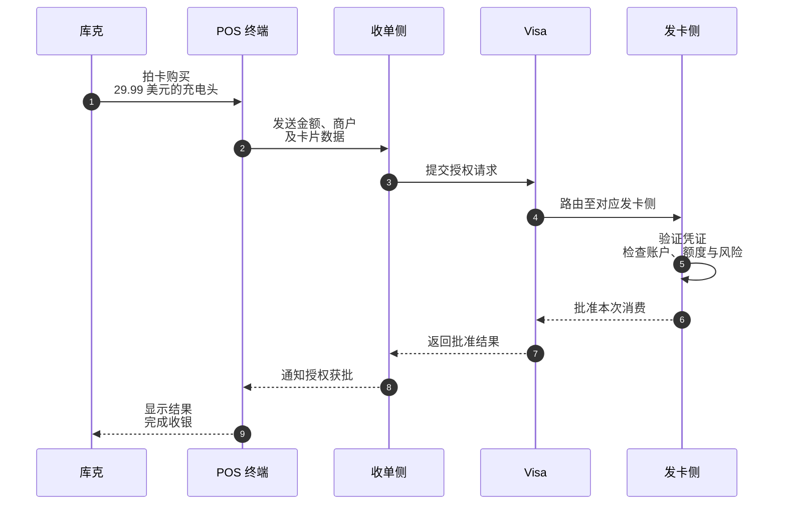
```mermaid
sequenceDiagram
    autonumber
    participant CH as 库克
    participant PO as POS 终端
    participant AC as 收单侧
    participant NW as Visa
    participant IS as 发卡侧

    CH->>PO: 拍卡购买<br>29.99 美元的充电头
    PO->>AC: 发送金额、商户<br>及卡片数据
    AC->>NW: 提交授权请求
    NW->>IS: 路由至对应发卡侧
    IS->>IS: 验证凭证<br>检查账户、额度与风险
    IS-->>NW: 批准本次消费
    NW-->>AC: 返回批准结果
    AC-->>PO: 通知授权获批
    PO-->>CH: 显示结果<br>完成收银
```

发卡侧的检查大致分为三组:

- **凭证**：ARQC 能否通过验证，当前场景要求的持卡人验证是否完成
- **账户**：卡片是否挂失，账户是否受限，可用额度是否足够
- **风险**：消费地点、金额和频率，是否与这个账户平时的使用情况相符

同样一张真卡，刚刚挂失后再使用，仍然会被拒绝；密码输入正确，也不能让一张额度已用完的卡继续消费。卡片验证提供的是其中一部分证据，授权还要检查账户和风险，才能决定是否接受本次消费。

结果通常用 ***响应码（Response Code）*** 表达。常见的 `00` 表示批准，`51` 表示余额或额度不足，`05` 则是较笼统的拒绝。响应码的具体含义及处理要求，要以相应网络和收单接口为准。

不过，批准也并不只是返回一句 `OK`。发卡机构通常还会设置 ***授权占用（Authorization Hold）***，相当于冻结了和这笔交易相关的一部分资金，同时还会返回一个用于后续关联的 ***授权码（Authorization Code）***。冻结指的是，假设库克原本还有 1,000 美元可用额度，这次授权占用 29.99 美元后，尽管还没有划拨给商家，可用额度依然会降至 970.01 美元。

此时，银行应用里可能出现一笔 *待入账* 交易。它表示这部分额度已经留给了本次消费。之后如果商户取消交易，占用可以解除；如果商户确认收款，银行再按后续记录正式入账。对于借记卡，类似的占用作用在账户可用资金上。

为什么要先授权占用？因为它需要解决这段等待时间里的一个实际问题。假设某张卡只剩 30 美元可用额度，两家商户先后各发来一笔 29.99 美元的请求。第一笔获批后，如果银行没有记下这项占用，第二笔检查时仍可能看到还有 30 美元。两家商户都得到了批准，合计金额却已超过可用额度。因此，银行通过设置授权占用，把已批准的金额及时从可用额度中扣除，后面的请求才能看到更新后的状态。

占用额度是为了不把同一份额度重复花出去；而沃尔玛敢交货，还因为规则约定了交易获批后银行应当怎样付款。商户按要求受理，并在规定期限内提交最终金额和能够对应原授权的记录，发卡侧就需要按规则付款。商户可以据此先交货，但仍要对交付、退款和争议负责。[^auth]

理解这项付款义务时，要分别看银行保留占用多久、授权批准有效多久、财务记录最迟何时提交。这三个时限不必相同：占用自然释放，只能说明银行不再为它保留这部分额度，不能说明商户已经取消销售。稍后收到的清算记录仍可能形成正式消费；迟交或无有效授权，则可能引发额外费用及争议责任。

把批准与正式财务记录分开，有很实际的用途。网店接单时可以先确认顾客能否付款，等商品出库再确认收款；去足浴店洗脚，也不必在刚进店时就给出最终账单。银行卡系统把这两件事分成两个步骤的行为，被称为 ***双信息模式（Dual-message Model）***。当然，也存在 ***单信息模式（Single-message Model）***，即在一条交易消息中同时承载授权和财务处理，比如部分借记卡和 ATM 交易。当然，即使是单信息交易，机构间资金划拨也未必在那一秒全部完成。

回到之前的例子，充电头卖 29.99 美元，银行也足额批准了 29.99 美元。但其他场景下，商户可能只想先验证一张新卡，还没准备收钱；酒店可能不知道最终房费；一张预付卡也可能只够付部分货款。这几种不同需求，分别有相应的处理办法：

| 情形 | 怎样处理 | 解决什么问题 |
| :--- | :--- | :--- |
| ***账户验证 Account Verification*** | 用零金额请求等方式检查账户和凭证状态 | 例如保存一张新卡时先确认它能否使用，不形成正式消费 |
| ***预授权 Preauthorization*** | 酒店入住、租车等场景先申请一个合理的估算金额 | 服务尚未结束，最终账单还不知道 |
| ***增量授权 Incremental Authorization*** | 例如客人续住，酒店关联原授权，申请增加可用的授权金额 | 原先估算的金额已不足以覆盖预计消费 |
| ***部分授权 Partial Authorization*** | 例如一张预付卡只剩 20 美元，发卡侧仅批准这 20 美元 | 在商户和卡片支持时，顾客可用另一种方式补足余款 |

部分授权情形里，充电头仍然卖 29.99 美元，顾客还需要补付 9.99 美元。它与你去饭店吃饭用大众点评的优惠券是两回事：部分授权改变的是这张卡能够承担多少付款，优惠券改变的则是顾客应付多少。当然，这一能力是否可用，取决于卡产品、商户类别及网络规则。[^special-auth]

再看预授权和增量授权。酒店预计房费 300 美元，便先取得 300 美元预授权。客人续住后预计共花 400 美元，就在原授权上追加 100 美元。退房时实际消费 360 美元，酒店便确认收取 360 美元，并及时撤销多余的 40 美元占用。追加金额不会延长原授权有效期，也就是说，住宿超过适用期限时，还需按收单侧要求撤销并重新授权。[^special-auth]

前面的例子中，我们都假定请求能得到明确回答。如果发卡系统挂掉了，卡组织有时可以按事先约定的金额、频率和风险限制替它作决定，这叫 ***代授权（Stand-in Processing，STIP）***。这样，一部分交易仍可继续，但能批准哪些交易，仍受发卡方预先设置的条件限制。[^stip]

我们再来考虑信息在商家终端和发卡侧之间的传输。有时候，终端可能一直转圈，最后提示超时。此时请求可能根本没有送到发卡侧，也可能已经获批，只是回答丢在了返回途中。商户面对的问题是拿不到结果，不能仅凭超时判断后台在哪一步停了下来。

比如，同一次请求可能留下这样两种观察结果：

| 所在位置 | 系统实际经历了什么 | 它知道的结果 |
| :--- | :--- | :--- |
| 发卡侧 | 收到请求，批准消费并设置占用 | 已批准 |
| 商户侧 | 发出请求，始终没有收到有效响应 | 结果未知 |

这两份记录并不矛盾：发卡侧记录处理结果，商户侧记录自己有没有收到回答。既然 *没收到回答* 可以和 *已经批准* 同时发生，系统就必须保留 *结果未知* 这种待核实状态，不能直接归入 *已拒绝*。

当结果未知时，如果收银系统立刻生成一笔全新的请求，发卡侧可能再次批准，于是顾客看到两笔额度占用。实际只买了一个充电头，银行却暂时为两个充电头留了额度。

因此，遇到处理超时的时候，商户应先拿原来那次付款的编号查询结果：

- 如果决定取消这次交易，应当按收单侧的要求发起撤销，并确认是否处理完成
- 如果决定重新发送同一次请求时，应沿用原编号，让接收方认出这件事已经办过，避免重复占用或收款。这种重复提交也只执行一次的保证，叫 ***幂等性（Idempotency）***。

当然，如果银行已明确拒绝，顾客换卡重新支付，那就是另一次付款尝试，需要另记编号。这种情况下，两次付款可以属于同一张订单，却不能混成一条请求。需要注意的是，系统还要把检查重复、执行操作和记录结果一起处理，防止两个同时到达的请求都以为还没办过，各扣一次钱。

银行批准与收银最终完成也可能存在间隔。在上面的流程中，卡片移开、用户取消或连接中断，都可能使已获批的交易未完成后续确认，形成了银行有占用、收银台却失败的场景。因此，排查还要核对终端完成记录。[^terminal-completion]

查询、重试和撤销都依赖同一个前提：各系统能认出原来的那次付款。授权码能说明曾经获得批准，却不是整笔业务在所有系统中的唯一编号。而库克的小票、沃尔玛的订单、收单侧的记录和发卡侧的记录，可能各有一套号码。因此，需要建立对应关系，才能沿一份记录查到另一份。

交易网络提供了这样的能力。在授权记录中，***系统跟踪号（STAN）*** 用于跟踪请求与响应，***检索参考号（RRN）*** 帮助查找和关联交易。需要注意的是，这些号码只在网络规定的范围内区分记录，过了一定周期还可能重复，所以不能拿一个授权码或 STAN，当作永远不会重号的交易编号。

实际排查时，可以从沃尔玛的订单号找到内部支付记录，再取得收单侧的参考号，最后关联到网络记录。一张订单如果经历过重试，可能对应多条消息；一笔授权如果后来取消了部分金额，也会多出关联记录。订单号回答顾客买了什么，消息编号回答系统这一次传了什么，把两者分开保存，才不会在异常处理中丢掉来龙去脉。

报文中的编号怎样帮助关联请求与响应？

***ISO 8583*** 是银行卡金融交易消息标准；网络会采用特定版本及自己的报文规范。消息类型标识（MTI）说明这条消息是请求、响应还是其他动作，数据元素（DE）则承载金额、标识和结果等字段。[^iso8583]

以下把请求与响应简化成逻辑字段，说明它们怎样关联；字段位置、编码及必填要求依实际网络规范，这不是可直接发送的 Visa 报文：

| 字段 | 授权请求示意 | 批准响应示意 |
| :--- | :--- | :--- |
| 交易金额 | 29.99 美元 | 29.99 美元 |
| 消息跟踪号 | 123456 | 123456 |
| 授权码 | 尚无批准结果 | ABC123 |
| 响应码 | 尚无处理结果 | 00 |

响应中的跟踪信息帮助找到请求，授权码和响应码说明处理结果。仅有相同金额或 STAN 仍不足以认定是同一笔交易，还要结合收单机构、日期及其他关联标识；清算、撤销与退款也有各自的消息和关联要求。

回到正常获批的这次消费，沃尔玛已经取得批准结果及关联记录。这些记录将成为后续收款的依据：商户要沿原交易提交最终金额，让银行知道刚才批准的那笔消费，现在需要正式收取多少钱。

## 请款、清算与结算

库克走出超市后，后台还要继续办三件事：商户确认最后收多少钱，各方据此记账、算清彼此欠多少，银行之间再实际付款。请款、清算和结算，分别负责这几步。我们接下来依次来看。

银行虽然批准了消费，却看不到商户后来是否缺货、取消订单或完成交付。沃尔玛需要明确告诉收单侧：“商品已交付，这笔交易最终收取 29.99 美元。”这个确认收款金额并提交后续财务处理的动作，叫 ***请款（Capture）***。[^capture]

请款时间取决于业务怎样完成。线下收银可以紧接授权自动请款，网店则可能等商品发出后再请款。商户不一定要另点一次按钮，但系统仍需记录这次收款决定。收单系统收到请款后，也可能先记录下来，等约定的 ***批次截止时间（Cut-off Time）***，再统一提交当批交易。

请款报告的是商户最终决定收取的金额，不一定要照抄第一次授权。比如一张网购订单分批发货，可以按适用规则分次请款；酒店估算的金额高于实际房费，就按最终账单请款，再释放多余占用。每笔请款都要注明对应哪次授权，金额和时间也要符合要求，银行才能核对这笔钱当初是否获准收取。

商户确认金额后，收单侧就可以提交正式记录，让各方据此记账和计算彼此该付多少钱。这一步叫 ***清算（Clearing）***。记录包括最终金额、币种、商户信息、授权码和交易参考号等。卡组织及相关系统检查数据、计算费用，再把记录送到发卡侧。发卡机构据此把消费记入持卡人账户，各机构也据此确认应收、应付的款项。[^clearing]

清算记录并不只是简单的金额记录。发卡侧需要知道它对应哪次批准、最终金额是否符合要求、是否已经处理过相同记录。正确的关联数据让系统能够把商户的最终收款要求，接到先前的授权占用上。少了这层联系，金额相同的两笔消费也可能被认错，或者原占用未解除，正式账单却已经记了进去。

库克在银行应用中看到的变化，通常就是那笔 *待入账* 变成 *已入账*。若金额仍为 29.99 美元，且期间没有其他交易，原先的占用会与正式记账衔接，可用额度仍应是 970.01 美元。

在不考虑手续费的情况下，这笔消费会同时出现在几方的账上：

- 库克欠发卡机构 29.99 美元
- 发卡机构需要向收单侧付 29.99 美元
- 收单侧再向沃尔玛付这笔货款

此时先记清谁欠谁多少钱，实际资金可以按约定时间再划拨。

账上记着的应付款，实际付清时叫 ***结算（Settlement）***。付款可以按全额进行，也可以先抵销相互欠的部分。例如，在卡组织网络中，常见后一种安排：把同一周期、同一币种下各机构的应收与应付合在一起，抵销后只支付差额。这个抵销过程叫 ***轧差（Netting）***，算出的净应收或净应付金额叫 ***净头寸（Net Position）***，再通过约定的结算账户划款。

为了理解这一点，我们可以把网络暂时缩小到两家银行，并假设两家都同时提供发卡与收单服务。在同一结算周期内，A 银行的持卡人向 B 银行服务的商户共计消费了 120,000 美元，其中就包括库克的 29.99 美元；反方向的消费则合计 100,000 美元。理想情况下便有：

| 交易形成的付款方向 | 金额 |
| :--- | ---: |
| A 银行应向 B 银行支付 | 120,000 美元 |
| B 银行应向 A 银行支付 | 100,000 美元 |
| 轧差后，A 银行净付给 B 银行 | 20,000 美元 |

两边合计发生了 220,000 美元消费，银行之间却只需由 A 向 B 付 20,000 美元，就能结清这两笔相反方向的欠款。每笔消费仍照原金额保留，库克的账单还是 29.99 美元。抵销的是银行之间需要划拨的钱，不是顾客的消费记录。当然，实际网络中，参与机构更多，计算更复杂，但总体逻辑是相同的。

这笔机构间付款不必等待库克偿还信用卡账单。发卡机构先按网络安排结算，再按信用卡约定向持卡人收款，因而通常由发卡侧承担持卡人不还款的信用风险。如果出问题的是参与机构本身，无法履行结算义务，则属于结算风险。以 Visa 为例，网络按规则提供结算保障，并以信用评估、抵押品等安排管理这类风险。上述安排保障的是相应付款义务的履行，商户因未交货而产生的争议责任仍需另行处理。[^settlement-risk]

到这里，还要理清楚一件事情：收单机构收到了网络结算资金，和沃尔玛的银行账户收到了货款，是两码事。收单侧按合同向商户付款，属于 ***商户付款（Merchant Funding / Payout）***。付款频率、扣费方式以及需要暂留的款项，都可能影响实际到账时间和金额。

把这几步接起来，可以看到信息与资金在不同阶段各自承担的任务。下图画出一种先完成机构间结算、再向商户付款的常见安排：

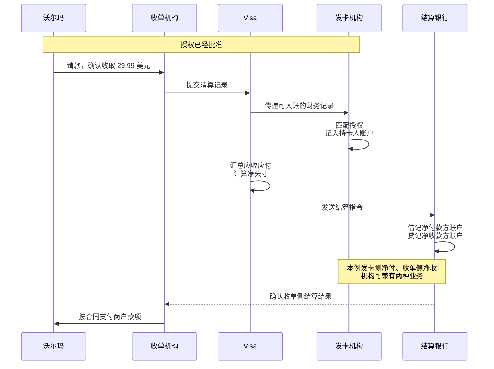
```mermaid
sequenceDiagram
    participant ME as 沃尔玛
    participant AC as 收单机构
    participant NW as Visa
    participant IS as 发卡机构
    participant SB as 结算银行

    Note over ME,IS: 授权已经批准
    ME->>AC: 请款，确认收取 29.99 美元
    AC->>NW: 提交清算记录
    NW->>IS: 传递可入账的财务记录
    IS->>IS: 匹配授权<br>记入持卡人账户
    NW->>NW: 汇总应收应付<br>计算净头寸
    NW->>SB: 发送结算指令
    SB->>SB: 借记净付款方账户<br>贷记净收款方账户
    Note over IS,SB: 本例发卡侧净付、收单侧净收<br>机构可兼有两种业务
    SB-->>AC: 确认收单侧结算结果
    AC->>ME: 按合同支付商户款项
```

实际付款顺序也可能不同。有些服务商先垫付，有些等网络资金收到后再付款；服务商已发出商户款项，也不等于商户银行账户已经完成入账。因此，对商户承诺的当天到账也不能证明底层网络也在当天结算。[^payout]

在这一流程中，处理也可能失败。例如，收单侧已经收到请款请求，清算时却发现数据有误，或者应收资金迟迟未到。商户需要继续查后面返回的结果和报表，找到卡在哪一步，再决定修正数据还是重新提交。只看到没到账就新建一笔消费，可能造成重复扣款；服务商如果已先垫付，后续失败还可能从商户余额中作相应调整。[^payout]

现在再看这些容易混淆的词，就可以分别问一个具体问题：

| 阶段 | 回答的问题 | 这时还不能据此认定什么 |
| :--- | :--- | :--- |
| 授权 | 发卡侧是否同意这次消费？ | 商户已经提交最终金额 |
| 请款 | 商户最终要收取多少钱？ | 财务记录已经被清算系统接收 |
| 清算 | 凭哪些记录入账，谁该向谁付多少？ | 机构之间已完成资金划拨 |
| 结算 | 机构之间该付的钱是否已经付清？ | 商户银行账户一定同时到账 |
| 商户付款 | 收单侧按合同支付多少、何时出款？ | 商户银行账户已经到账，或日后无需返还款项 |

前面的每一步都有自己的处理记录。

要确认一笔销售是否已经收齐，商户需要把这些记录对应起来。首先要处理的差异，便是它们记载的时间。周五晚上完成的消费，可能进入下一批请款；批次跨过了午夜，或者遇到不同的时区，清算报表上的日期又可能变化。各阶段可以在同一天完成，也可能跨日，不能用收银小票上的日期代替所有后台日期。

报表中的 ***业务日（Business Date）***，表示系统把这笔交易算进哪一天的业务。它按处理日历、时区和批次截止时间确定，不一定在当地午夜切换。所以，同一笔消费在两份报表上日期不同，可能只是归入批次的办法不同，需要先按交易编号核对。

| 时间 | 记录的事件 |
| :--- | :--- |
| 交易时间 | 商户记录顾客完成消费的时间 |
| 授权时间 | 发卡侧处理授权的时间 |
| 请款时间 | 商户确认最终收款金额的时间 |
| 清算日期 | 清算系统处理财务记录的业务日期 |
| 结算日期 | 机构间履行相应资金义务的日期 |
| 商户付款日期 | 收单侧按合同向商户支付款项的日期 |

除了时间，还要对应金额和记录数量。沃尔玛不会只收到充电头这一笔货款，因为收单侧可能把许多笔销售合在一起，扣去手续费、退款和其他调整，再支付一个净额。财务人员需要把订单、请款记录、清算明细和银行到账逐层核对，确认每次合并或扣减都有依据。这项工作就是 ***对账（Reconciliation）***。[^reconciliation]

比如，一家店当天卖出 10 个同价充电头，销售记录应合计 299.90 美元，收单报表的对应批次却只有 9 笔，共 269.91 美元。后面的清算和付款都准确地处理了这 9 笔，只拿收单报表与银行到账比较，可能看不出异常；把销售记录也放进来，才会发现还差一笔 29.99 美元。它可能漏提交了，也可能仍在另一个批次中，需要沿订单和支付记录继续追查。

即使 10 笔都已收齐，到账也不必是 299.90 美元。例如每笔扣费 0.69 美元，当批另扣一笔 29.99 美元退款、暂留准备金 10 美元，则净出款为 *299.90 − 6.90 − 29.99 − 10.00 = 253.01 美元*。逐笔记录核对有没有遗漏，批次汇总核对各项增减，最后再与银行到账对应；准备金还需在以后释放时继续核对。

至此，一笔正常消费从收银台走到了商户账户。可库克买回去后，如果发现充电头不合用，这条已经走完的路又该怎样处理？

## 撤销、退款与争议

先把库克放回三个不同的时刻：

1. 刚拍完卡，他发现拿错了型号
2. 第二天，他拿着小票来退货
3. 一个月后，他翻到银行账单，表示自己从未买过这个充电头

以上三种情况都可能要求把钱退回来，处理方法却取决于两件事：

- 原消费走到了哪一步
- 买卖双方是否已经同意返款

第一种情况，如果交易尚未进入后续财务处理，商户可以发起 ***授权撤销（Authorization Reversal）***，通知发卡侧取消全部或部分授权占用。此时最主要的变化，是先前被占用的额度重新变得可用。顾客不一定会看到一笔单独的返款记录，也可能只是原来的待入账记录消失了。

这同样也是授权超时后可能需要做的事：销售没有继续，就应尽快通知发卡侧解除相应占用，而不是一味等它自然过期。有些收单接口把取消操作称为 ***撤单（Void）***，它可能取消尚未处理的请款，也可能触发授权撤销。具体效果要看取消的是哪一阶段的记录。

对于第二种情况，即第二天再来退货时，原消费可能已经请款或入账，无法仅靠解除授权占用把钱还给顾客。这时通常要另发起一笔 ***退款（Refund）***，把款项返还到持卡人账户。原消费仍然保留，退款有自己的金额、处理记录和状态，并与原消费建立关联。

从持卡人账务看，退款是一笔 ***贷记交易（Credit Transaction）***：对于信用卡，它可以冲减应还金额；对于借记卡，则可以增加账户余额。这里的贷记指的是记账方向，钱从银行流向持卡人。[^refund]

当然，贷记不全是退款。企业通过支持 Visa ***原始贷记交易（Original Credit Transaction，OCT）*** 的服务，也可以把报酬付进符合条件的卡账户。退款要对应原消费，独立付款则需要自己的付款依据，并遵守相应接入条件和规则。持卡人都可能看到一笔贷记，银行仍要分清钱为什么进来。[^oct]

回到充电头这笔退款。消费和全额退款都正常入账后，库克的净支出可以回到零。但系统仍保留两条记录，分别说明当初为什么收款、后来为什么返还。在本文的 Visa 路径中，退款还需要先申请 ***退款授权***，也可能被发卡侧拒绝。因此，收到退款请求、批准退款和顾客实际入账，并不一定是一一对应的，仍要分别确认。[^refund-auth]

退款也不必一次退完。对于 29.99 美元的充电头消费，已退 10 美元后，剩余可退金额为 19.99 美元。计算时，还要扣除正在处理中的退款：虽然顾客尚未收到，这部分金额已经在返还途中。检查和预留可退金额必须作为一个整体处理，避免两个客服同时按同一份余额操作，合计退多了钱。

返款去向也要沿原交易核实。换卡后原账户仍可能承接退款，若原账户失效或退款授权被拒绝，应联系收单侧，按允许的替代退款流程处理，不能自行任意换一个收款账户。[^refund-auth]

接下来看第三种情况，也就是库克发现他不买原装充电头的事情被媒体曝光后，恼羞成怒，向发卡机构表示这笔消费不是我做的，尽管商户未必认同他的说法。这属于 ***争议（Dispute）***，本文用它泛指对交易事实或履约情况提出异议的过程。疑问经过核查，符合网络条件时，发卡侧可以发起 ***拒付（Chargeback）***，向收单侧追索相应款项。当然，这些请求还需要经过核查，拒付后的责任也可能由各方继续举证，因此，提出异议并不直接等同于商户承担最终损失。

争议也不只限于盗刷。没有收到商品、重复扣款、金额错误、承诺的退款未到账，都可能构成不同的争议理由。网络用 ***原因码（Reason Code）*** 区分这些情况，并规定各自需要什么材料、应在多久之内响应。

有些疑问在查清交易后就能消除。例如，银行账单上用来描述收款方的 ***商户描述（Merchant Descriptor）*** 如果写着陌生公司名，库克就可能认不出自己在沃尔玛的正常消费。清楚的名称、订单通知和联系方式，能帮助他先找到这笔买卖，减少因误认而提出的争议。

重复扣款也需要先查清记录。顾客看到两行相同金额，可能是两笔授权占用，也可能是一笔占用加上一笔正式消费，还可能确实是两笔已入账的销售。前两种情况先查占用是否该释放、是否与正式消费对应；最后一种才是同一次购买被正式收了两次钱。

如果核查后发卡侧发起拒付，商户可以接受，也可以经收单侧提交证据，提出 ***抗辩（Representment）***。双方仍有分歧时，符合条件的一方可发起 ***预仲裁（Pre-arbitration）***，让另一方回应。进一步提交 ***仲裁（Arbitration）*** 后，再由卡组织依规则裁决。具体经过哪些阶段，要看网络和争议类型，下图只展示一条可能路径。[^dispute]顺带一说，目前各个卡组织的仲裁收费还是很贵的，商户在决定是否继续争议前，通常会先评估证据和潜在损失。

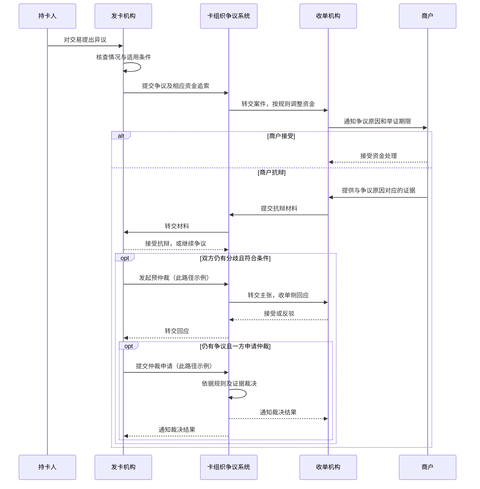
```mermaid
sequenceDiagram
    participant CH as 持卡人
    participant IS as 发卡机构
    participant NW as 卡组织争议系统
    participant AC as 收单机构
    participant ME as 商户

    CH->>IS: 对交易提出异议
    IS->>IS: 核查情况与适用条件
    IS->>NW: 提交争议及相应资金追索
    NW->>AC: 转交案件，按规则调整资金
    AC->>ME: 通知争议原因和举证期限

    alt 商户接受
        ME-->>AC: 接受资金处理
    else 商户抗辩
        ME->>AC: 提供与争议原因对应的证据
        AC->>NW: 提交抗辩材料
        NW->>IS: 转交材料
        IS-->>NW: 接受抗辩，或继续争议
        opt 双方仍有分歧且符合条件
            IS->>NW: 发起预仲裁（此路径示例）
            NW->>AC: 转交主张，收单侧回应
            AC-->>NW: 接受或反驳
            NW-->>IS: 转交回应
            opt 仍有争议且一方申请仲裁
                IS->>NW: 提交仲裁申请（此路径示例）
                NW->>NW: 依据规则及证据裁决
                NW-->>AC: 通知裁决结果
                NW-->>IS: 通知裁决结果
            end
        end
    end
```

资金往往不等最后一步才发生变化。拒付发起后，相关款项就可能先从收单侧扣回，收单侧再按合同调整商户余额。商户抗辩成功后，款项又可能返还。因此，看到钱被扣回，只能说明发生了资金调整，不能单凭这一条记录判断最终责任。同样，银行先给持卡人的临时返款，也可能在调查后被调整。

抗辩能否成立，要看证据是否回答了争议理由：

- *没买过* 要核对卡片验证、终端和消费记录
- *没收到* 要看交付或签收
- *退款没到* 则查返款记录

前文记录的读取方式和验证结果，除了帮助当时作出授权决定，也会用于这里的事后核查。

例如，实体卡场景存在 ***EMV 欺诈责任转移***。是否具备芯片受理能力、实际使用何种读取方式、是否发生回退，会影响特定伪卡欺诈损失的承担。但这些证据回答的是卡片如何被受理，无法证明商品已经交付，因此不能把所有争议都转给发卡侧。[^emv-liability]

回应退款未到账，应提供原订单、退款时间、金额、处理结果及可追踪参考号。卡交易可向收单侧取得 ***收单参考号（Acquirer Reference Number，ARN）***，供持卡人交给发卡侧查询。由于商户内部退款 ID 未必能被银行识别，一张内部退款成功截图，也不能代替对账户入账的核实。[^refund-tracking]

还可以设想，沃尔玛第二天已发起退款，库克第三天没看到入账，又向银行提出争议。这种情况下，商户和银行未必立刻知道对方的进度：如果原退款照常入账，拒付又另返了一笔钱，同一次消费就可能被返还两次。因此，处理时要先找齐原消费、已发退款和争议案件的记录，核对各自进度，再决定还需不需要返款。

在这个例子中，消费已完成、退款处理中、争议调查中，三个事实同时成立。一个是否已退款的字段无法容纳这些进度，客服也就无法据此判断还需不需要返款。系统需要分别保存消费、退款和争议状态，再通过原交易把它们关联起来。

| 动作 | 典型情形 | 主要变化 |
| :--- | :--- | :--- |
| 授权撤销或撤单 | 销售取消，相关授权或请款仍可取消 | 解除占用，或阻止尚未处理的请款继续执行 |
| 退款 | 商户确认应返还已请款或入账的款项 | 新增一笔与原消费关联的返款记录 |
| 拒付 | 发卡侧按争议规则向收单侧追索 | 调整资金，并依据后续证据确定责任 |

至此，从取消销售到事后追索，处理办法都能回到原交易的阶段和证据上。尤其当持卡人否认消费时，当时留下了什么验证记录，会直接影响后续判断。实体卡有芯片提供证据；但如果是在线支付，银行又该如何判断付款人是否有权使用这张卡？

## 卡不在场交易

我们回到最开始的步骤：验证。

如果库克坐在酒店里，用浏览器输入卡号下单，商户就读不到那张实体卡的芯片。这类支付属于 ***卡不在场（Card Not Present，CNP）*** 交易。四方之间的授权、清算和结算仍然继续，只是银行用来判断付款人的证据发生了变化。

首先能取得的，是 PAN、有效期和卡面安全码等信息。Visa 常把卡面安全码称为 CVV2，Mastercard 常称为 CVC2。它们与芯片每次计算出的 ARQC 有不同用途：

- CVV2/CVC2 可以说明付款人掌握了某些卡片资料
- ARQC 用于验证本次芯片交易的数据

卡面资料如果被一起抄走，安全码也可能随之泄露。

因此，线上支付通常还会结合登录账户、设备、网络地址、历史订单和收货信息判断风险。部分市场（主要是美国和加拿大）提供 ***地址验证服务（Address Verification Service，AVS）***，由发卡侧拿到输入的账单地址或邮编，与持卡人登记的信息进行比较，并返回匹配结果。它可以增加一条判断依据。[^avs]

但地址匹配本身不能证明正在下单的就是库克，银行还需要进一步验证付款人的身份。在支持 ***3DS（EMV 3-D Secure）*** 的电商支付中，商户把交易和设备信息按共同协议交给发卡侧，由发卡侧进行身份认证，再根据认证结果和适用规则决定能否继续申请授权。[^3ds]

商户与银行在这里各有一部分信息。网店知道顾客买了什么、寄到哪里、是否经常在本站购物；发卡机构则掌握卡片和账户的历史，也有自己与持卡人联系、验证身份的渠道。3DS 使双方能够在付款前交换所需数据，让银行利用这些信息判断，而不必要求每一家网店自行核实所有银行卡用户的身份。

认证请求也要先送到正确的银行。商户侧的 3DS 服务器把请求交给 ***目录服务器（DS）***，由它找到发卡侧的 ***访问控制服务器（ACS）***。ACS 专门处理认证，决定现有信息够不够、是否需要顾客再做验证，然后返回结果。商户按共同协议提交，便能找到不同银行的认证系统。

有些认证在后台就能完成，称为 ***无感认证（Frictionless Flow）***。例如，发卡侧认为已有数据足以判断，顾客便不需要额外操作。需要补充验证时，则进入 ***挑战认证（Challenge Flow）***，要求顾客在银行页面或应用中输入一次性验证码、进行生物识别，或者完成其他指定操作。

无感与挑战描述的是交互路径，不是成功与失败。即便能够无感认证，也可能认证失败。结果可能是通过、拒绝、无法完成或已进行尝试处理。其中，后两类不能当成认证成功，例如 `R` 表示发卡侧拒绝认证并要求不再尝试授权。[^3ds-result]

即便认证通过，付款也还是需要进入下一步：授权。线上交易的认证和线下拍卡交易没什么不同，主要回答 *是否有理由相信付款人有权使用这张卡*，后续还需要授权这个步骤来检查 *这个账户此刻是否允许支付这笔金额*。身份可信的持卡人也可能额度不足，所以这两个决定需要分别作出。

下面省略 3DS 内部的服务节点，只看顾客、商户与发卡侧之间发生了什么：

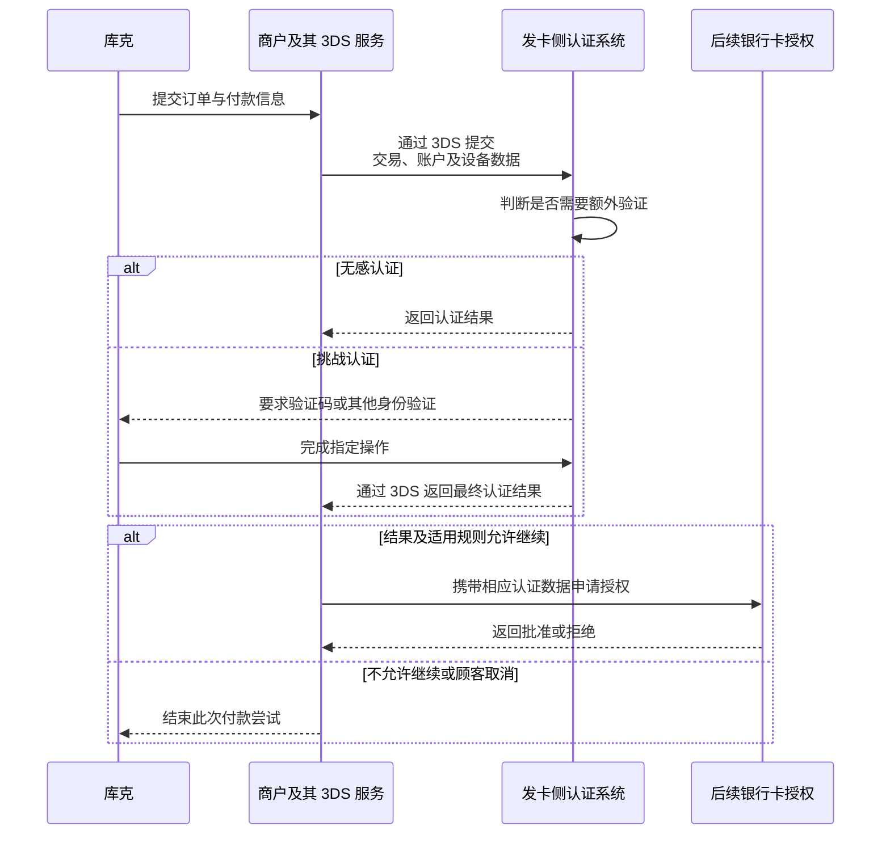
```mermaid
sequenceDiagram
    participant CH as 库克
    participant ME as 商户及其 3DS 服务
    participant IA as 发卡侧认证系统
    participant AU as 后续银行卡授权

    CH->>ME: 提交订单与付款信息
    ME->>IA: 通过 3DS 提交<br>交易、账户及设备数据
    IA->>IA: 判断是否需要额外验证
    alt 无感认证
        IA-->>ME: 返回认证结果
    else 挑战认证
        IA-->>CH: 要求验证码或其他身份验证
        CH->>IA: 完成指定操作
        IA-->>ME: 通过 3DS 返回最终认证结果
    end
    alt 结果及适用规则允许继续
        ME->>AU: 携带相应认证数据申请授权
        AU-->>ME: 返回批准或拒绝
    else 不允许继续或顾客取消
        ME-->>CH: 结束此次付款尝试
    end
```

传入授权的数据中，可能包括说明电商认证情况的 ***电商交易标识（ECI）***，以及供发卡侧校验的认证值，例如 Visa 的 ***持卡人认证验证值 CAVV***。这些结果帮助发卡侧判断请求，也可以成为后续争议处理的依据。

Mastercard 有相应用途的 ***账户持有人认证值 AAV***。它与 CAVV 的用途相近，都是把认证结果交给后续授权流程核验。[^aav]这些数据把前面的认证与后面的授权联系起来。

3DS 还可能影响某些欺诈争议的责任分配。满足相应条件时，商户可获得 ***欺诈责任转移（Fraud Liability Shift）***，由发卡侧承担原本可能落在商户侧的特定欺诈损失。适用范围取决于网络、地区、交易类型和认证数据。即便库克确实亲自通过了认证，商户没有发货，仍然需要面对未交付商品的争议。[^liability]

3DS 是一种共同认证协议，线上支付也有其他验证安排。中国内地普通网购常见 *银行卡快捷支付*，或者在支付宝、微信支付、云闪付等应用中选择已绑定的卡。首次绑卡或签约时通常要完成银行要求的身份和账户验证，后续付款再按约定，结合支付密码、短信动态码、生物识别、设备和风险控制完成验证。用户不一定跳转到银行网页，也不一定经过上述 3DS 流程。[^cn-online]

上述办法帮助判断正在付款的人，却不能单独解决资料泄露的问题：只要真实卡号和安全码被反复传递和保存，就会多出被窃取的机会。***支付令牌化（Payment Tokenisation）*** 从凭证本身入手，让支付参与方可以使用受限制的替代值，而不必处处暴露真实卡号。

以 ***网络令牌（Network Token）*** 为例，令牌服务用一个替代值代表 PAN，并可以把它限制在特定设备、商户或支付场景内使用。网络与发卡侧按约定识别它及其对应账户，交易仍能沿银行卡体系处理。由于使用范围受到限制，即使令牌被窃取，也不容易像完整卡号那样被拿到其他场景复用。[^token]

钱包或商户可以作为 ***令牌申请方（Token Requestor）***，向 ***令牌服务提供方（TSP）*** 申请令牌。发放前先按发卡侧要求核实用户有没有权绑定这张卡，通过后再记录令牌对应哪个 PAN、允许怎样使用。以后每次付款，相关系统还要检查它是否用在允许的设备、商户或场景中，并核验所需的动态数据。把号码换掉只是第一步，持续检查这些限制，才使被偷走的令牌难以到处使用。[^token-provisioning]

手机钱包就采用了类似方式。同一张实体卡加入两台设备后，可以分别配置设备相关的支付凭证。若其中一台丢失，就能针对那台设备停用凭证，另一台设备和实体卡不必一起失效。至于付款时手机会把哪些数据交给终端，我们在后面的钱包一章再看。

使用替代凭证可以减少真实信息暴露，但商户仍需明确哪些数据允许保存。***支付卡行业数据安全标准（Payment Card Industry Data Security Standard，PCI DSS）*** 对卡片数据的处理提出了要求。对商户及其受理服务商而言，卡面安全码在授权后不得保存，即使加密保存也不行。顾客同意记住这张卡，也不会取消这项限制。[^pci]

那订阅服务下个月怎样自动扣款？它可以使用事先保存的卡片凭证，这类安排常称为 ***卡片凭证留存（Card-on-file，COF）***，同时还要有顾客同意的后续扣款约定。保存的可以是受适当保护的卡号或替代凭证，而不需要把安全码一并留存。

还要区分 ***持卡人发起交易（CIT）*** 与 ***商户发起交易（MIT）***：库克主动点击付款，即使使用保存的卡片，仍是 CIT；服务商根据先前同意的订阅安排，在他未当场参与时发起续费，才可能按 MIT 处理。后续扣款应正确标记，并保留与首次交易及约定的关联。*COF 说明保存了凭证，CIT／MIT 说明谁发起本次交易*，仅保存卡号不构成任意扣款的许可。[^stored-credential]

芯片提供卡片证据，3DS 帮助验证付款人，令牌化减少真实卡号暴露并限制凭证用途。商户既要用好这些保护手段，又要把授权、收款和售后接进自己的订单系统。这一流程非常复杂，许多商户会请专业服务商完成这些工作，接下来就看它们在四方之间具体做什么。

## 四方模型以外的参与者

前文中，为了看清交易，我们把商户与收单侧之间的许多工作合并画成了一条线。真要开一家网店，这条线却不能凭空出现：网页要安全地接收付款信息，订单要能关联交易结果，不同银行和支付方式的数据格式也要有人处理。

网店最先要解决的，是付款信息怎样从网页安全地进入支付后端。这通常由 ***支付网关（Payment Gateway）*** 提供接入能力。顾客填写付款信息，商户提交订单金额，网关把相应请求交给后面的处理系统，再把结果带回商户。

进入后台后，还要把消息转换成对方能够接收的格式，按要求发送、接收响应并记录状态。这些交易处理工作由 ***支付处理器（Payment Processor）*** 承担。处理器既可能服务收单侧，也可能服务发卡侧。它描述的是处理能力，并不自动意味着这家公司同时经营持卡人的账户或负责商户收款。

商户如果希望一次接入就能用上这些服务，可以选择 ***支付服务商（Payment Service Provider，PSP）***。PSP 通常把接入、处理、风控、报表和多种支付方式组合起来，由它协调其中若干环节。对一家刚开业的卖充电头的网店来说，差别体现在要签哪些合同、对接多少接口、出了问题找谁；在底层，银行卡交易仍需要找到发卡侧作决定，并由收单侧承担相应的商户受理责任。

从这几项工作可以看出，网关和处理器各描述一类能力，PSP 则描述把若干能力组合提供的服务范围。一家公司可以兼做其中几项，也可以外包一部分，所以它既自称 PSP、又提供网关，并不矛盾。

服务范围还不能直接说明法律上的机构身份。放到中国内地，PSP 是方便理解的功能性总称，并不对应一张名为 PSP 的统一许可证。实际签约时仍要分清银行、依法取得支付业务许可的非银行支付机构，以及只提供系统接入或聚合收银台的技术服务商。[^cn-service]

分清这些工作，对排查问题也有帮助：

- 付款页面连不上，需要先看接入环节
- 请求已经送到发卡侧且被明确拒绝，就要继续看授权结果
- 交易已经请款，商户却没收到款项，则需要查清算、付款批次及合同安排

商户可以统一向 PSP 求助，但 PSP 仍要沿不同环节追查。

为了让商户少接触卡片数据，服务商还可能只返回一个卡片编号。商户以后提交这个编号，服务商就能找到自己保存的付款凭证，继续处理交易。这个编号不一定是前文的网络令牌，也未必能被另一家服务商或卡网络识别。因此，换服务商时还要确认凭证能否迁移，只复制编号可能无法继续付款。

如果一家平台要帮许多小商户开通收款，可以采用 ***支付便利商（Payment Facilitator，PayFac）*** 模式。PayFac 在收单机构支持和卡组织规则下，审核这些 ***子商户（Submerchant / Sponsored Merchant）***、替它们开通交易服务，并持续检查风险，有时也参与分配货款。收单机构负责按网络规则注册和管理这项合作，继续承担相应的收单责任。[^payfac]

PayFac 把许多小店共用的接入和运营工作集中办理，小店便能更方便地开通收款。平台接下这些工作，也需要逐家查清商户卖什么、有没有异常交易、货款应该付给谁，不能把所有小店当成同一家商户处理。

假设某个子商户收款后停业，顾客后来因为没收到货要求返款。如果符合拒付条件，发卡侧仍可向收单侧追索，再由收单机构、PayFac 和子商户按合同处理责任、追款。商户消失了，返款要求并不会跟着消失。所以 PayFac 开通收款之后，还要继续了解商户的经营和交付情况，防止钱已付出、该退时却收不回来。

帮商户接好收款服务，还不等于替商户卖商品。交易中的 ***正式销售方（Merchant of Record，MoR）***，回答的是另一件事：消费者是在向谁购买，谁按销售合同对他负责。MoR 通常负责收款、销售相关税务、退款和拒付处理，具体责任按合同及适用规则确定。[^mor]

例如，软件开发者可以通过一家 MoR 向海外消费者销售应用。消费者付款时，交易中的销售方可能是这家 MoR，开发者再按双方约定取得收入。若开发者只是采购一家 PSP 的支付接口，销售方身份通常仍在自己这里。支付服务与销售责任是两个可以分别安排的问题。

判断销售方身份，应看消费者条款、销售合同及责任安排，而非支付页面上的标志。开发者可以继续提供软件服务，MoR 承担相应销售责任，两者也不必是同一主体。

| 名称 | 主要回答什么问题 | 常见工作 |
| :--- | :--- | :--- |
| 网关 | 商户前端如何接入支付后端？ | 支付信息采集、安全接入、请求转发 |
| 处理器 | 机构之间的交易消息如何处理？ | 格式转换、路由、状态与结果处理 |
| PSP | 商户如何取得一整套支付能力？ | 整合支付方式、接入、风控和运营服务 |
| PayFac | 多个子商户如何通过一套受支持的安排接入收单？ | 子商户准入、监控、交易及相关资金服务 |
| MoR | 这笔买卖中，谁是面向消费者的销售方？ | 收款、销售相关税务、退款和拒付处理 |

销售方和受理关系的安排，还可能影响账单显示谁的名称：商户自己、MoR，或者 PayFac 与子商户的名称组合。前文提到消费者认不出账单，其中一个原因就是付款页面展示了商品品牌，账单却展示了另一位参与方。订单邮件和付款说明需要把这层关系写清楚，消费者才能认出它们对应同一笔买卖。比如，王者荣耀玩家购买游戏皮肤，可能看到的付款页面是腾讯游戏，账单上显示的却是 Midas。

讲到这里，经手交易的公司已经不止四家，因为原先画在一个角色里的工作可以分给多家公司。也可以反过来合并：同一体系同时做发卡、收单和网络运营，就形成经典的 ***三方模型（Three-party Model）***——持卡人、商户，以及兼做这些工作的运营方。

美国运通（American Express，Amex）常被用来说明这种模式。与多家发卡、收单机构共同接入的 ***开环网络（Open-loop Network）*** 相比，这种 ***闭环网络（Closed-loop Network）*** 把两侧关系更多地集中在同一体系内。不过，现实中的 Amex 也会与其他机构合作发卡或受理，三方图表达的是经典结构。[^amex]

无论角色是分开承担，还是集中在一家公司，受理、处理、风险管理和资金服务都需要有人完成。商户支付的费用，也正是沿着这些分工形成的。

## 手续费

当然，一笔交易涉及到如此多的参与者，肯定要留下不少买路钱。

沿着前面的分工，我们现在可以尝试着算一算：库克支付 29.99 美元，沃尔玛最后能留下多少？

商户通常按合同向收单机构或 PSP 支付受理费用。以比例表示的商户收费，常称为 ***商户折扣费率（Merchant Discount Rate，MDR）***。这个名称里的 *折扣* 指 *商户收到的款项相对交易金额有所扣减*。实际报价还可能包含每笔固定费用、月费或其他项目。

收单侧向商户收费后，还需向发卡侧和卡组织支付相应费用，剩下的部分用于提供自己的服务。沿着这层分配关系，可以把受理费用拆成三部分：

| 组成 | 主要流向 | 对应的分工 |
| :--- | :--- | :--- |
| ***交换费 Interchange Fee*** | 消费交易中通常由收单侧付给发卡侧 | 在发卡与收单两侧之间分配交易收入 |
| ***卡组织费用 Scheme / Network Fees*** | 卡组织 | 网络接入，以及授权、清算、结算等相关服务 |
| ***收单及处理服务加价 Acquirer / Processor Markup*** | 收单机构及相关服务商 | 商户接入、交易处理、风控、运营服务等 |

其中，交换费尤其容易被误解为 Visa 自己收走的钱。它通常是收单机构与发卡机构之间的费用。交换费会影响商户的受理成本，但商户一般不是直接逐笔向发卡机构交费。[^interchange]

继续用充电头举例，假设这一笔的商户受理费用共 0.69 美元，约占交易金额的 2.30%。其中交换费 0.50 美元，卡组织相关费用 0.05 美元，收单及处理服务费用 0.14 美元，沃尔玛净得 29.30 美元。

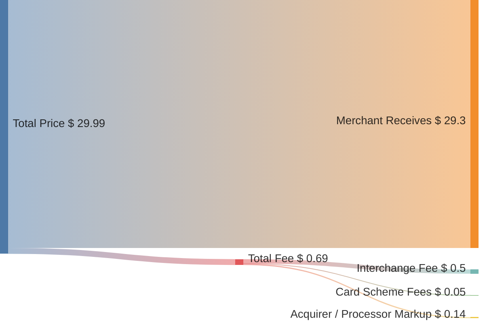
```mermaid
sankey

"Total Price $","Merchant Receives $",29.30
"Total Price $","Total Fee $",0.69
"Total Fee $","Interchange Fee $",0.50
"Total Fee $","Card Scheme Fees $",0.05
"Total Fee $","Acquirer / Processor Markup $",0.14
```

把这笔费用放回前面的付款过程，金额就能对上。假设交换费在结算中抵扣，发卡侧付出 *29.99 − 0.50 = 29.49 美元*；收单侧再付网络费用 0.05 美元，留下服务费 0.14 美元，给商户的就是 29.30 美元。图里画的是这 0.69 美元分给谁，各家还要从收入中支付自己的成本。实际结算也会合并其他交易，部分费用另出账单，不会每卖一个充电头就分别汇出这几笔钱。

退款时，这笔费用还会带来一个容易忽略的差额。假设合同约定，上面这 0.69 美元受理费用在退款后全部不退，商户先前净收到 29.30 美元，却需要向顾客退还完整的 29.99 美元，差额就是商户仍然承担的支付成本。实际哪些费用会退、哪些保留，要看网络与服务合同。顾客的净支出回到零，与商户的处理成本回到零，并不是一回事。

上面的 0.69 美元只是演算假设，实际费用要按交易条件计算。以交换费为例，信用卡还是借记卡、消费卡还是商务卡、商户的 MCC、CP 还是 CNP、境内还是跨境，以及交易数据和提交时效，都可能影响费率。同样买一个 29.99 美元的充电头，换一张卡或改到网站付款，就可能改变收单侧承担的成本。[^pricing]

有些费率还要求商户按时、完整地提交特定数据。交易没有满足相应条件，就可能发生 ***费率降级（Downgrade）***，转入成本更高的档位。于是，授权成功、商品交付都没有问题的一笔交易，也可能因为后续记录不合要求而变贵。这就是前文强调请款与清算数据质量的另一个原因。

卡组织费用同样可能按金额、按笔数或按特定服务计收。收单侧则还要考虑商户的规模、平均客单价、退款与争议情况、服务范围和付款周期。把这些费用打包报价，还是逐项列出，会形成不同的定价方式：

| 定价方式 | 商户看到的报价 | 需要理解的取舍 |
| :--- | :--- | :--- |
| ***成本加价 Interchange++，IC++*** | 交换费、卡组织费用与服务商加价分别列示 | 便于追踪成本来源，但每期费用会随交易构成变化 |
| ***混合定价 Blended Pricing*** | 将多项成本合并成约定价格 | 容易理解和预测，但底层成本变化不一定能从账单看出来 |
| ***分档定价 Tiered Pricing*** | 按交易所属档位收取不同价格 | 除了看最低档报价，还要看交易进入各档的条件 |

常见的 *统一比例加每笔固定金额*，也称 ***统一费率定价（Flat-rate Pricing）***，通常可以视为混合定价的一种。不同服务商对这些名称的用法也可能不同，比较时仍要把实际收费项目放在一起看。

以 IC++ 和混合定价作比较，便能看出底层成本怎样传到商户账单上。假设一部分交易成本较低，另一部分较高：

- IC++ 会反映这种差异，再加服务费
- 混合定价则可能对两者采用相同报价，由服务商在整个交易组合中平衡成本

商户最终付出多少，取决于自己受理了多少笔、分别是什么交易，需要按整个组合计算。

尤其要留意每笔固定费。假设报价为 *2% + 每笔 0.10 美元*，孙哥买一个 5 美元指甲刀的费用是 0.20 美元，有效费率为 4%；而孙哥在苏富比买一根香蕉，按约 6,200,000 美元计算，费用为 *124,000.10 美元*，有效费率约 2%。固定费对小额交易的影响更大。[^banana]

定价还受地区规则影响，前述美国情境下假设的 2.30% 不能直接推广。对境内发卡、在境内银行卡受理终端发起的适用消费，中国大陆定价机制规定：

- 发卡行服务费借记卡最高 0.35% 且每笔不超过 13 元，贷记卡最高 0.45%
- 网络服务费合计最高 0.065% 且每笔不超过 6.5 元，由发卡、收单两侧各承担一半，即各最高 0.0325%、3.25 元
- 符合条件的非营利医疗、教育、社会福利、养老及慈善机构适用这两项费用全额减免

收单服务费由商户与收单侧协商，条码支付不能直接套用这组费率。[^cn-pricing]

算清费用以后，商户还不能把 *交易额减去手续费* 直接当作当期到账金额。收单侧可能按约定比例逐批留存部分资金，经过约定期限再释放，这种安排称为 ***滚动准备金（Rolling Reserve）***，用于覆盖后续退款、拒付等风险。暂留资金仍有后续释放安排，应与已经收取的手续费分别核算，它影响的是当期可用现金。[^reserve]

金额差异还可能来自换汇。若库克改在欧洲购买，货架上标的是欧元，而信用卡仍用美元记账，就不能直接比较标价和账单数字：

- 商户提交消费所用的是 ***交易币种（Transaction Currency）***
- 信用卡上记账所用的是 ***账单币种（Billing Currency）***
- 机构间划拨和商户收款，还分别有约定的 ***结算币种（Settlement Currency）*** 和 ***商户收款币种（Payout Currency）***

这些币种可以相同，也可以不同。

这里还要分清 *跨境* 和 *换了币种*。跨境按网络对商户、发卡或收单等所在地的规则判断，所以同样用美元支付，也可能跨境。如果商品按欧元卖、信用卡按美元记账，就需要网络或发卡侧换算。如果商户要求收另一种货币，收单侧还可能再换一次。采用哪天的汇率、收哪些费用、怎样四舍五入，都会影响最终数字。信用卡也可能按约定另收境外交易费。

举一组纯粹用于计算的汇率：商品应付 29.99 欧元，若按 1 欧元兑换 1.10 美元记账，且暂不计额外费用，库克账单上的金额约为 32.99 美元。商户仍然是收取 29.99 欧元的那笔销售。

如果后来退回 29.99 欧元，而发卡侧按退款时的汇率重新换算，美元返款又可能与原来的 32.99 美元不同。商户是否全额退款，需要先在原交易币种下核对，持卡人账单上的差额则要继续检查换汇及收费安排。跨币种交易中，*金额一致* 必须先说清是在比较哪一种币种、哪一阶段的金额。

有时终端会提前询问：“要不要直接用美元付款？”这就是 ***动态货币转换（Dynamic Currency Conversion，DCC）***。选择后，商户侧的 DCC 服务方在付款时给出换算后的金额和汇率。若选择当地货币，则按银行卡原有安排进行后续换算。DCC 应向持卡人展示币种、金额、汇率及相关费用，并让持卡人作出选择。用美元付款，也不意味着发卡侧一定免收境外交易费。[^dcc]

前面拆的是商户费用及到账差额。如果转到发卡机构的账上，交换费又成为收入的一部分，还会与年费、利息和其他服务收入一起，覆盖奖励、资金成本、欺诈与信用损失，以及运营和获客支出。信用卡积分和返现由这整套业务收支支持，无法把充电头这笔消费的 0.50 美元交换费逐笔对应成库克拿到的奖励。

对沃尔玛而言，受理成本会影响商品毛利，也可能进入整体定价。是否向持卡人另行收取 ***刷卡附加费（Surcharge）***，还要看当地法规与网络规则。顾客没有看到支付手续费，并不代表提供这次支付服务没有成本。

算到这里，29.99 美元背后的收入、费用和到账差额都有了来由。不过，收银台上除了 Visa，还有手机钱包、银行转账等选项。换一个支付按钮，是否就会绕开刚才的全部过程？

## APM

假设库克来的这家沃尔玛支持 Apple Pay，他用 iPhone 中绑定的 Visa 卡买充电头。手机换掉了他手里的塑料卡，后面的银行卡交易是否也随之消失了？

先看凭证。卡片加入 Apple Pay 后，设备取得 ***设备账号（Device Account Number）*** 及相关密钥，保存在 ***安全元件（SE）*** 中。普通店内付款时，库克先用人脸、指纹或设备密码确认，再让手机通过 NFC 与终端交互。支付应用按方案使用交易计数、密钥及适用的终端数据，生成本次动态密码文。[^apple]

这类设备侧持卡人验证称为 ***CDCVM***。它与生成交易密码文是不同动作：CDCVM 确认用户有权启用凭证，交易密码文则为交易提供可核验数据。终端会提供支付应用所需的数据，并取得设备账号及动态凭证。部分方案的计算包含终端不可预测数，不能理解为手机在靠近终端前已独自生成全部交易数据。

终端接到这些数据后，仍会发起银行卡授权，经过收单侧、卡组织和发卡侧处理。商户后面的请款、清算、结算也仍然存在。变化主要发生在凭证和持卡人验证这一段：商户接触到的是设备支付凭证，通常不需要取得实体卡的完整 PAN。

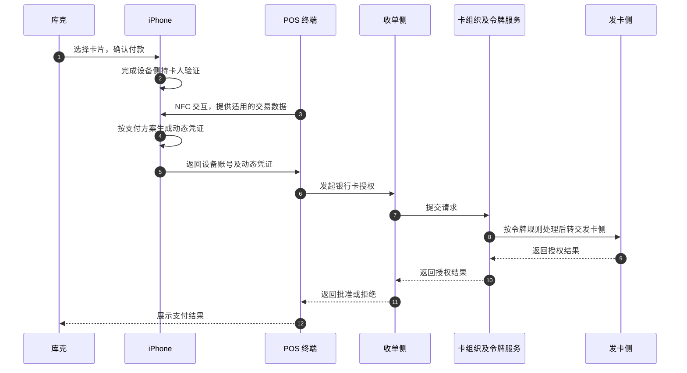
```mermaid
sequenceDiagram
    autonumber
    participant CH as 库克
    participant IP as iPhone
    participant PO as POS 终端
    participant AC as 收单侧
    participant NW as 卡组织及令牌服务
    participant IS as 发卡侧

    CH->>IP: 选择卡片，确认付款
    IP->>IP: 完成设备侧持卡人验证
    PO->>IP: NFC 交互，提供适用的交易数据
    IP->>IP: 按支付方案生成动态凭证
    IP->>PO: 返回设备账号及动态凭证
    PO->>AC: 发起银行卡授权
    AC->>NW: 提交请求
    NW->>IS: 按令牌规则处理后转交发卡侧
    IS-->>NW: 返回授权结果
    NW-->>AC: 返回授权结果
    AC-->>PO: 返回批准或拒绝
    PO-->>CH: 展示支付结果
```

在中国内地，银联手机闪付也是相近的例子：它可以通过 Apple Pay 等设备钱包呈现，使用 NFC 和支付令牌完成线下非接触式付款。可同一部手机如果改用支付宝或微信支付的二维码，前台动作虽然同样只是拿手机付钱，后台却未必走这条令牌化银行卡路径。[^cn-mobile]

Apple Pay 绑卡付款沿用了银行卡账户。要判断其他钱包是否也走这条路，需要先找到资金来源。允许用户先充值、再用钱包账本里的余额消费的，属于 ***储值钱包（Stored-value Wallet）***；还有些钱包在付款时从绑定银行卡或银行账户取得资金。同一个钱包可以提供多种来源，选用哪一种，才决定本次需要处理哪些账户。

以一个允许充值的储值钱包为例，假设用户和商户的原余额都是零，暂不计费用。用户先充入 100，再给同一家商户付 20 和 10，自己的余额降至 70，商户余额增加到 30。如果这两次消费完全在钱包内部记账，用户的银行账户只记最初充值，不会每消费一次再扣一次。下图借用熟悉的零钱界面说明这份账，不代表某个产品的全部充值或结算规则。

若退回第一笔 20，用户钱包余额回到 90，商户余额从 30 降到 10；商户随后提现这 10，才形成钱包向商户银行账户的另一笔划款。消费退款留在钱包余额，与把余额退回银行账户不同，充值、消费、退款、提现应各有记录。

扫码付款同样需要追到资金来源。二维码可以承载商户、订单或收款信息，把顾客带到对应付款页面。页面里仍可能选择钱包余额、银行卡或银行账户。*扫了一个码只说明顾客怎样进入付款流程，所选账户和处理安排才说明资金怎样转移。*

中国内地的业务规范还把条码交互分成两种：

- ***付款扫码*** 是顾客扫描商户展示的收款码
- ***收款扫码*** 是商户扫描顾客手机上的付款码

两种方式改变了谁展示、谁读取凭证，却仍没有单独回答资金来自支付账户余额还是银行账户。涉及跨行交易时，还要进入相应的清算安排。[^cn-barcode]

商户除了接入传统银行卡受理，还可以接受当地钱包、银行账户支付或现金凭证等方式。行业常把这组选择统称为 ***替代支付方式（Alternative Payment Methods，APM）***，意思是 *银行卡以外还可以怎么付*。它们没有共用一套技术标准，而是各有账户、网络和规则，其中一些在当地比银行卡更常用。

例如：

- 顾客可以直接从银行账户向收款账户付款，这类安排称为 ***账户到账户支付（Account-to-account Payment，A2A）***
- 由付款人发出指令、把钱转给对方，属于 ***贷记转账（Credit Transfer）***
- 若收款人根据付款人事先授予的扣款许可发起收款，则属于 ***直接借记（Direct Debit）***

贷记转账和直接借记都使用账户，却在谁发起指令、付款人如何同意、款项可以怎样退回等方面有所不同。

用缴电费来比较就很直观。第一种做法是每月看到账单后，打开银行应用，确认金额并向电力公司转账；第二种做法是事先约定扣款，电力公司在账单到期时发起收款。后一种省去了每月手动付款，却更依赖对扣款许可、金额和日期的管理。收款方提交了扣款请求，仍需等待相应系统处理。如果遇到余额不足、扣款许可失效等情况，也可能收不到钱。不同直接借记方案还规定了各自的退回与退款权利。[^direct-debit]

部分账户支付通过 ***即时支付（Instant Payments）*** 网络处理，让收款人很快就能使用资金。但更快到账还不足以描述全部差异：机构之间何时完成结算，消费者遇到欺诈或未交付商品时有何救济，仍需看具体制度。银行卡的拒付规则，不能直接套到每一种账户支付上。

机构还需要知道，这次付款到什么时候才算确定完成、可以从待办款项中划掉。这涉及 ***结算最终性（Settlement Finality）***：一项转移何时在法律和系统规则下成为不可撤销、无条件的结果。确定这个时点，各机构才能据此记清哪些款项已经付清，并继续安排资金。[^finality]

结算具有最终性，与顾客后来能否获得退款，回答的是两个问题。例如，原付款已经最终结算，商户仍可通过另一笔付款退回货款。适用制度也可能要求有关机构处理欺诈返款，但这不会把原来那次结算变成从未发生。判断一种支付方式是否适合某项业务，既要看付款多久完成，也要看出错以后依据什么规则、由谁发起返款。

付款页面上的选项还可能改变信用安排。例如 ***先买后付（Buy Now, Pay Later，BNPL）*** 让顾客先取得商品、之后再按约定还款，实际付款仍可能使用银行卡或银行账户。因此，比较按钮时要分别问：顾客用什么入口操作，款项来自哪个账户、经过哪套网络，以及是否有人提供信用。扫码、银行卡、转账和 BNPL 各自回答其中一部分问题，不能仅按页面上并排的位置，把它们当作互斥的类别。

> 沿账户和网络继续了解各地系统，可以查阅[附录A](#附录a各国家和地区的体系)
>
> 想把 Apple Pay、PayPal 等具体产品放回这些关系中，可以查阅[附录B](#附录b主流电子钱包与支付平台)

最后再回到那只充电头。库克听见“滴”的时候，银行批准了消费。沃尔玛据此交货，再提交最终收款金额。各方核对记录、算清费用，银行之间按约定付款，货款再进入商户账户。后来退货或发生争议，也能沿原记录查到收了多少、验证过什么、商品是否交付。

这回答了开头的问题：沃尔玛不必等钱到账才交货，因为银行的批准带着按规则付款的责任；银行也不用猜商户最后该收多少，因为商户会提交对应记录。收银台先拿到当场需要的答案，后面的账和款再接着办完。

库克回到酒店，插上充电头。手机亮了。对他来说，这笔交易终于只剩下小票上那一行：29.99 美元。

## 附录A：各国家和地区的体系

前文中，我们把一次支付拆成了用户操作、机构处理和资金结算。下面沿这三层关系看各地系统：先找用户通过哪类机构付款，再看请求进入哪个系统，最后追到资金在哪类账户上、何时结算。

尤其要看清钱怎么结算。***实时全额结算（RTGS）*** 按每笔付款的全额实时结清；延迟净额结算先算出各机构最终该收或该付的差额，再到约定时间划款。即使用后一种办法，银行也可以先让客户用钱，但需要有安排保证机构到时付得出应付的钱。图中的央行账户、商业银行存款和钱包余额，也要分别看是谁在记账、谁负责付款。英国和印度还把 RTGS 用作特定结算服务的名称，其中可以处理其他系统提交的净额，不能只看名字就认定所有客户付款都逐笔在这里结算。

图中实线表示主要接入、处理或结算关系，*不全部代表资金流向*；虚线表示规则、查询或流动性支持等辅助联系，具体含义以连线文字为准。双向箭头表示双方交换或系统互联。

> 以下所有内容仅为概览，实际业务处理、清算和结算安排可能更复杂，且随时间、地区和机构而变化。请以各地监管、网络和服务合同为准。

### 美国

在美国，用户通过银行、信用合作社或支付服务商发起收付款后，请求会按业务进入不同网络。批量付款、即时付款、大额汇款和刷卡消费各有处理安排，既有美联储运营的服务，也有私营系统。阅读下图时，可以先沿用途找到系统，再追踪它与联储账户的关系。

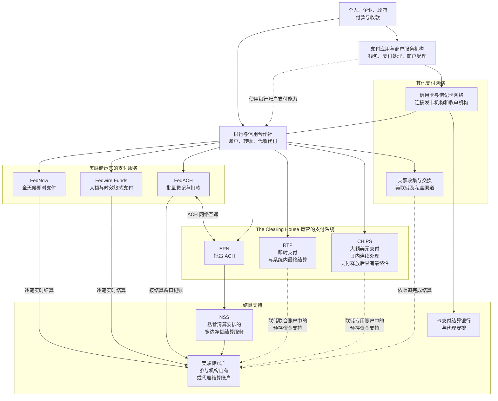
```mermaid
flowchart TD
    U["个人、企业、政府<br/>付款与收款"]
    B["银行与信用合作社<br/>账户、转账、代收代付"]
    P["支付应用与商户服务机构<br/>钱包、支付处理、商户受理"]

    U --> B
    U --> P
    P -. "使用银行账户支付能力" .-> B

    subgraph PUBLIC["美联储运营的支付服务"]
        FN["FedNow<br/>全天候即时支付"]
        FW["Fedwire Funds<br/>大额与时效敏感支付"]
        FA["FedACH<br/>批量贷记与扣款"]
    end

    subgraph PRIVATE["The Clearing House 运营的支付系统"]
        EPN["EPN<br/>批量 ACH"]
        RTP["RTP<br/>即时支付<br>与系统内最终结算"]
        CHIPS["CHIPS<br/>大额美元支付<br>日内连续处理<br/>支付释放后具有最终性"]
    end

    subgraph OTHER["其他支付网络"]
        CARD["信用卡与借记卡网络<br/>连接发卡机构和收单机构"]
        CHECK["支票收集与交换<br/>美联储及私营渠道"]
    end

    B --> FN & FW & FA
    B --> EPN & RTP & CHIPS
    B --> CHECK
    P --> CARD
    CARD --- B

    subgraph SUPPORT["结算支持"]
        ACCOUNT["美联储账户<br/>参与机构自有<br>或代理结算账户"]
        NSS["NSS<br/>私营清算安排的<br>多边净额结算服务"]
        AGENT["卡支付结算银行<br>与代理安排"]
    end

    FA -->|"按结算窗口记账"| ACCOUNT
    FA <-->|"ACH 网络互通"| EPN
    FN -->|"逐笔实时结算"| ACCOUNT
    FW -->|"逐笔实时结算"| ACCOUNT
    EPN --> NSS --> ACCOUNT
    RTP -. "联储联合账户中的<br>预存资金支持" .-> ACCOUNT
    CHIPS -. "联储专用账户中的<br>预存资金支持" .-> ACCOUNT
    CARD --> AGENT
    CHECK -. "依渠道完成结算" .-> ACCOUNT
```

工资、定期账单和批量代收付主要使用 ACH。FedACH 与 EPN 是两家 ACH 运营网络，能够互通。ACH 可以有当日结算窗口，但不等于全天候逐笔即时支付。[^app-a-us-1]

FedNow 和 RTP 都提供即时支付基础设施。FedNow 直接在参与机构自有或代理机构的联储账户上结算；RTP 在自身账簿内实时结算，由联储联合账户中的预存资金支持。图中两者连接联储账户的线，含义不同。[^app-a-us-2][^app-a-us-3]

大额美元支付还可以使用 Fedwire 或 CHIPS。Fedwire 采用央行货币实时全额结算；CHIPS 在系统内通过支付匹配与抵销节约流动性，支付满足条件并释放后具有最终性。两者的用途可以有交集，资金处理方式却不同。CHIPS 既用于美国国内，也用于跨境美元资金支付。[^app-a-us-4][^app-a-us-5]

银行卡和支票各有自己的业务处理、清算和结算安排。

这些系统虽然都可能连接联储结算基础，连接的用途却有区别：FedNow、Fedwire 逐笔在相应账户结算，RTP、CHIPS 则由预存资金支持各自的系统内处理。因此，看到联储账户节点，不能把每笔客户支付都理解为又经过一次 Fedwire。实际能选哪条付款路径，还取决于双方机构接入了什么系统、提供什么服务。

### 中国大陆

在中国大陆，同样是付款，从银行账户转账、在商店刷卡或扫码、向境外汇款，走的系统可能不同。下面先看境内银行转账，再看消费付款和跨境业务。图中的人民银行支付系统、清算机构和 CIPS 等系统各自处理相应业务，彼此之间还会有结算或资金调拨联系。

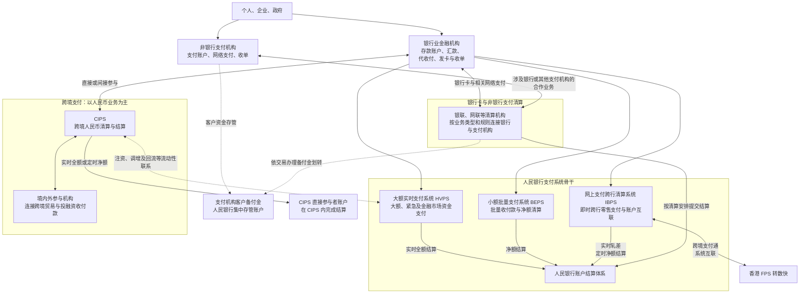
```mermaid
flowchart TB
    U["个人、企业、政府"]

    BANK["银行业金融机构<br/>存款账户、汇款、<br>代收付、发卡与收单"]
    PAY["非银行支付机构<br/>支付账户、网络支付、收单"]

    U --> BANK
    U --> PAY

    subgraph MARKET["银行卡与非银行支付清算"]
        CLEAR["银联、网联等清算机构<br/>按业务类型和规则连接银行与支付机构"]
    end

    BANK <-->|"银行卡与相关网络支付"| CLEAR
    PAY <-->|"涉及银行或其他支付机构的合作业务"| CLEAR

    subgraph CORE["人民银行支付系统骨干"]
        HVPS["大额实时支付系统 HVPS<br/>大额、紧急及金融市场资金支付"]
        BEPS["小额批量支付系统 BEPS<br/>批量收付款与净额清算"]
        IBPS["网上支付跨行清算系统 IBPS<br/>即时跨行零售支付与账户互联"]
        SETTLE["人民银行账户结算体系"]
    end

    BANK --> HVPS
    BANK --> BEPS
    BANK --> IBPS
    HVPS -->|"实时全额结算"| SETTLE
    BEPS -->|"净额结算"| SETTLE
    IBPS -->|"实时轧差<br>定时净额结算"| SETTLE
    CLEAR -->|"按清算安排提交结算"| SETTLE

    RESERVE["支付机构客户备付金<br/>人民银行集中存管账户"]
    PAY -. "客户资金存管" .-> RESERVE
    CLEAR -. "依交易办理备付金划转" .-> RESERVE

    subgraph CROSS["跨境支付：以人民币业务为主"]
        CIPS["CIPS<br/>跨境人民币清算与结算"]
        OVERSEA["境内外参与机构<br/>连接跨境贸易与投融资收付款"]
    end

    BANK <-->|"直接或间接参与"| CIPS
    CIPS <--> OVERSEA
    CIPS_ACCOUNT["CIPS 直接参与者账户<br/>在 CIPS 内完成结算"]
    CIPS -->|"实时全额或定时净额"| CIPS_ACCOUNT
    CIPS <-. "注资、调增及回流等流动性联系" .-> HVPS

    HKFPS["香港 FPS 转数快"]
    IBPS <-->|"跨境支付通<br>系统互联"| HKFPS
```

- HVPS 主要处理大额、紧急及金融市场资金支付，采用实时全额结算
- BEPS 处理适用的小额批量收付款，采用净额结算
- IBPS 支持银行线上即时跨行零售支付和账户互联

IBPS 的“实时处理、实时轧差、定时结算”能够与用户侧即时到账并存。[^app-a-cn-1][^app-a-cn-2]

个人通过手机银行向另一家银行的账户即时转账，可能使用 IBPS；批量代收付和紧急大额汇款则可能选择其他系统。前台都叫转账，后台路径由业务类型和银行安排决定。

消费付款还要先完成相应的受理与清算。实体银联卡消费通常由收单侧经银联连接发卡侧；支付机构发起、涉及银行账户的网络支付，则经网联或其他具备相应资格的清算安排处理。银联与网联提供的是按业务选择的清算路径，不是每笔付款依次经过的两个步骤。完全在同一钱包内部记账的余额消费，又不同于上述银行账户扣款：支付机构维护用户余额，客户备付金按规定集中存管，每位用户并不因此取得一个人民银行存款账户。[^app-a-cn-3][^cn-clearing]

跨境人民币付款还会用到 CIPS 清算结算系统。直接参与者在 CIPS 开户并办理结算，间接参与者请直接参与者代办。汇款可以按实时全额或定时净额两种方式结算。图中 CIPS 与 HVPS 的连线，主要表示向 CIPS 调入、调出人民币资金，用来满足付款需要；并不是每笔 CIPS 付款最后都再送到 HVPS 办一次。此图聚焦其人民币业务。[^app-a-cn-4][^app-a-cn-5]

跨境收付款也不只使用 CIPS。大陆与香港的“跨境支付通”于 2025 年 6 月 22 日上线，连接大陆 IBPS 和香港 FPS，支持符合条件的即时小额跨境汇款。它让两地既有零售系统互联，提供了另一类跨境路径。[^app-a-cn-6]

### 中国香港

在香港，找到处理系统后，还要继续看用什么货币、由谁提供结算账户。FPS 办理港币和人民币即时支付，CHATS 则按币种分成不同系统。同一币种的两套系统可以在同一家机构结算，换一个币种又可能换一家结算机构。下图把这些对应关系展开。

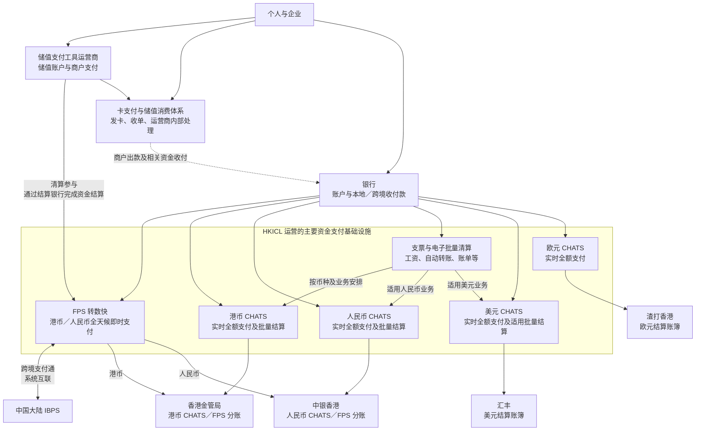
```mermaid
flowchart TD
    U["个人与企业"]
    SVF["储值支付工具运营商<br/>储值账户与商户支付"]
    RETAIL["卡支付与储值消费体系<br/>发卡、收单、运营商内部处理"]
    BANK["银行<br/>账户与本地／跨境收付款"]
    
    U --> SVF
    U --> RETAIL
    U --> BANK
    SVF -->|"清算参与<br>通过结算银行完成资金结算"| FPS
    SVF --> RETAIL
    RETAIL -. "商户出款及相关资金收付" .-> BANK

    subgraph HKICL["HKICL 运营的主要资金支付基础设施"]
        FPS["FPS 转数快<br/>港币／人民币全天候即时支付"]
        HKD["港币 CHATS<br/>实时全额支付及批量结算"]
        RMB["人民币 CHATS<br/>实时全额支付及批量结算"]
        USD["美元 CHATS<br/>实时全额支付及适用批量结算"]
        EUR["欧元 CHATS<br/>实时全额支付"]
        BULK["支票与电子批量清算<br/>工资、自动转账、账单等"]
    end

    MAINLAND["中国大陆 IBPS"]
    H["香港金管局<br/>港币 CHATS／FPS 分账"]
    R["中银香港<br/>人民币 CHATS／FPS 分账"]
    D["汇丰<br/>美元结算账簿"]
    E["渣打香港<br/>欧元结算账簿"]

    BANK --> FPS
    FPS <-->|"跨境支付通<br>系统互联"| MAINLAND
    FPS -->|"港币"| H
    FPS -->|"人民币"| R

    BANK --> HKD & RMB
    BANK --> BULK
    BULK -->|"按币种及业务安排"| HKD
    BULK -->|"适用人民币业务"| RMB
    BULK -->|"适用美元业务"| USD
    BANK --> USD & EUR
    
    HKD --> H
    RMB --> R
    USD --> D
    EUR --> E
```

FPS 转数快连接银行和参与的储值支付工具，支持港币和人民币支付。用户可以利用绑定的手机号码等标识收款。SVF 是“储值支付工具”，可包括符合相应牌照范围的电子钱包。[^app-a-cn-6]

CHATS 按港币、人民币、美元和欧元分别运行，承担实时全额支付，并按币种及业务安排结算支票和电子批量清算结果。HKICL 是系统运营机构，不应与提供结算账户的机构混为一谈。[^app-a-hk-1]

港币结算机构是香港金管局；人民币清算行为中银香港；美元和欧元结算机构分别是汇丰及渣打香港。因此，不能把香港所有币种的结算都称为直接在央行账簿上结算。[^app-a-hk-2]

即使由同一家机构结算，FPS 和 CHATS 也仍分别处理。港币结算账户设有 CHATS、FPS 分账，所以图中连到同一个金管局节点，不表示两套系统只记同一份账。钱包等储值支付工具还可以作为 FPS 清算参与者，由结算参与银行代办资金结算；钱包能用 FPS，并不要求它自己直接持有金管局结算账户。[^app-a-hk-3]

沿这个区分看跨境支付通，就能确定它连接的是 FPS 与大陆 IBPS 两套零售系统，并不是把香港各币种的 CHATS 统一接到大陆。具体能支付什么币种、通过哪家机构办理，仍由参与机构按适用规则提供服务。

### 日本

日本的几套系统可以沿一笔账户转账串起来理解：用户通过银行或 Cotra 等服务发起付款，相关机构通过全银系统处理国内跨行转账和清算，再依相应机制在日本银行当座账户上结算。BOJ-NET 提供央行账户资金转账能力，Cotra 则侧重小额个人转账的使用场景，两者处在这条链路的不同位置。

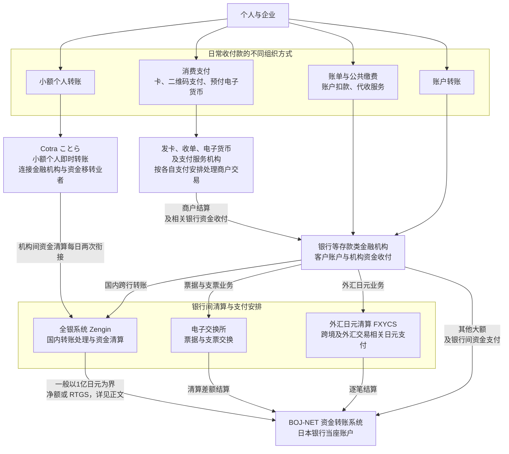
```mermaid
flowchart TB
    U["个人与企业"]

    subgraph RETAIL["日常收付款的不同组织方式"]
        MERCHANT["消费支付<br/>卡、二维码支付、预付电子货币"]
        COLLECTION["账单与公共缴费<br/>账户扣款、代收服务"]
        TRANSFER["账户转账"]
        SMALL["小额个人转账"]
    end

    U --> MERCHANT & COLLECTION & TRANSFER & SMALL

    OP["发卡、收单、电子货币<br>及支付服务机构<br/>按各自支付安排处理商户交易"]
    BANK["银行等存款类金融机构<br/>客户账户与机构资金收付"]
    COTRA["Cotra ことら<br/>小额个人即时转账<br/>连接金融机构与资金移转业者"]

    MERCHANT --> OP
    OP -->|"商户结算<br>及相关银行资金收付"| BANK
    COLLECTION --> BANK
    TRANSFER --> BANK
    SMALL --> COTRA

    subgraph CLEAR["银行间清算与支付安排"]
        ZENGIN["全银系统 Zengin<br/>国内转账处理与资金清算"]
        BILL["电子交换所<br/>票据与支票交换"]
        FX["外汇日元清算 FXYCS<br/>跨境及外汇交易相关日元支付"]
    end

    COTRA -->|"机构间资金清算每日两次衔接"| ZENGIN
    BANK -->|"国内跨行转账"| ZENGIN
    BANK -->|"票据与支票业务"| BILL
    BANK -->|"外汇日元业务"| FX

    BOJ["BOJ-NET 资金转账系统<br/>日本银行当座账户"]
    ZENGIN -->|"一般以1亿日元为界<br>净额或 RTGS，详见正文"| BOJ
    BILL -->|"清算差额结算"| BOJ
    FX -->|"逐笔结算"| BOJ
    BANK -->|"其他大额<br>及银行间资金支付"| BOJ
```

银行卡、二维码支付和预付电子货币由各服务商组织处理，相关商户收款和机构资金收付再与银行体系衔接。它们不是全银系统本身。

进入全银系统的转账，还会按金额等条件采用不同结算方式。一般而言，低于 1 亿日元的转账汇总轧差后，通过日本银行当座账户结算；1 亿日元及以上的转账通常交由 BOJ-NET 实时全额结算，工资、奖金等存在例外。这里的金额边界决定后台怎样结算，用户产品允许转多少则是另一项限制。[^app-a-jp-1][^app-a-jp-2]

Cotra 为其中一类小额个人转账提供入口，支持每笔 10 万日元及以下，可借助手机号码等信息收款。用户侧即时处理，机构间资金清算每日两次衔接全银系统。它是参与机构可提供的一种服务，其他小额转账也可以沿原有银行服务处理。[^app-a-jp-3]

电子交换所处理票据、支票交换；FXYCS 处理跨境及外汇交易相关的日元支付；BOJ-NET 提供央行账户资金结算基础。这里的 FXYCS 处理的是日元资金支付，不是一个外汇买卖交易所。[^app-a-jp-4]

沿一笔 Cotra 转账回看这几层关系：朋友先在客户账户上看到到账，参与机构随后按周期衔接全银系统清算，再完成相应资金结算。用户感受到的即时服务，依靠的是这几项工作配合，而不要求它们都在同一时刻完成。

### 欧洲欧元支付体系

欧洲欧元支付需要先区分业务规则与执行系统。两家服务商可以遵守同一套 SEPA 规则，却接入不同的处理基础设施。因此，先确定支付适用的规则，再追踪负责处理和结算的系统，才能读懂下面这张图。

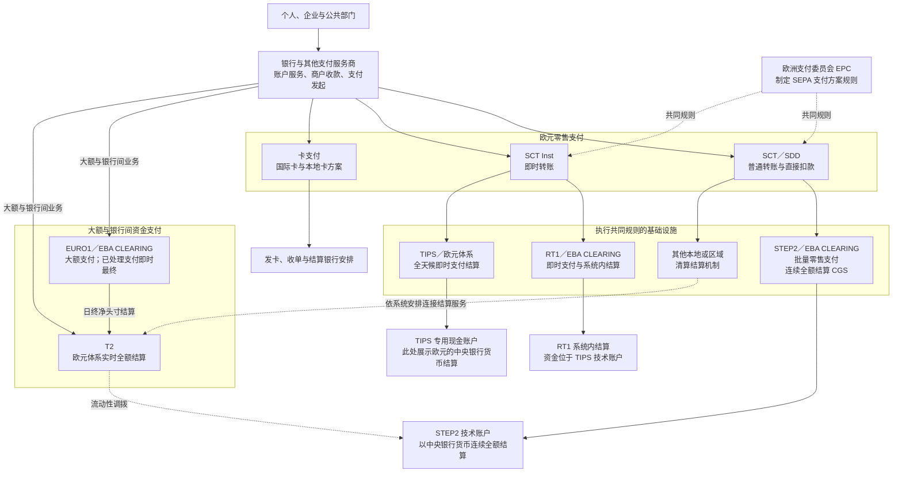
```mermaid
flowchart TB
    U["个人、企业与公共部门"]
    PSP["银行与其他支付服务商<br/>账户服务、商户收款、支付发起"]
    U --> PSP

    EPC["欧洲支付委员会 EPC<br/>制定 SEPA 支付方案规则"]

    subgraph RETAIL["欧元零售支付"]
        SCT["SCT／SDD<br/>普通转账与直接扣款"]
        INST["SCT Inst<br/>即时转账"]
        CARD["卡支付<br/>国际卡与本地卡方案"]
    end

    PSP --> SCT & INST & CARD
    EPC -. "共同规则" .-> SCT
    EPC -. "共同规则" .-> INST

    subgraph EXECUTE["执行共同规则的基础设施"]
        STEP["STEP2／EBA CLEARING<br/>批量零售支付<br/>连续全额结算 CGS"]
        LOCAL["其他本地或区域<br/>清算结算机制"]
        RT1["RT1／EBA CLEARING<br/>即时支付与系统内结算"]
        TIPS["TIPS／欧元体系<br/>全天候即时支付结算"]
    end

    SCT --> STEP & LOCAL
    INST --> RT1 & TIPS

    subgraph WHOLESALE["大额与银行间资金支付"]
        EURO1["EURO1／EBA CLEARING<br/>大额支付；已处理支付即时最终"]
        T2["T2<br/>欧元体系实时全额结算"]
    end

    PSP -->|"大额与银行间业务"| EURO1
    PSP -->|"大额与银行间业务"| T2
    EURO1 -->|"日终净头寸结算"| T2
    STEPSET["STEP2 技术账户<br/>以中央银行货币连续全额结算"]
    STEP --> STEPSET
    T2 -. "流动性调拨" .-> STEPSET
    LOCAL -. "依系统安排连接结算服务" .-> T2

    CARDSET["发卡、收单与结算银行安排"]
    RTSET["RT1 系统内结算<br/>资金位于 TIPS 技术账户"]
    TIPSET["TIPS 专用现金账户<br/>此处展示欧元的中央银行货币结算"]

    RT1 --> RTSET
    TIPS --> TIPSET
    CARD --> CARDSET
```

EPC 制定 SEPA 支付方案。SCT 是普通贷记转账，SDD 是直接扣款，SCT Inst 是即时贷记转账；这些是共同业务规则，不是三家清算机构。STEP2、RT1、TIPS 等基础设施负责实际处理和结算。SEPA 范围包括欧元区以外的一些国家，所以“欧元区”“SEPA”“欧洲”不能互换。[^app-a-eu-1][^app-a-eu-2]

以执行普通转账和直接扣款规则的 STEP2 为例，它接收批量业务，采用连续全额结算（CGS）：把批量业务形成的双边支付指令在资金充足时连续结算，相关资金位于央行技术账户，并可从 T2 调拨。这里“批量”描述业务怎样归集，“连续全额”描述资金怎样结算；前者并不必然推出延迟净额结算，后者也不把 STEP2 变成全天候即时支付服务。[^app-a-eu-3]

RT1 由 EBA CLEARING 运营，在系统内结算，其技术账户位于 TIPS；TIPS 由欧元体系提供，在专用现金账户之间以中央银行货币全天候结算。RT1 与 TIPS 是不同基础设施，不能把“RT1 的资金账户位于 TIPS”理解为每笔 RT1 交易都转成一笔 TIPS 客户支付。TIPS 具有多币种能力，本图仅展示欧元路径。[^app-a-eu-4][^app-a-eu-5]

大额支付中，T2 提供实时全额结算，私营系统 EURO1 则有另一套安排：每笔支付在 EURO1 处理后立即具有最终性，当日各参与者最后该收或该付的净额，再于日终提交 T2 结算。前一个时点确认系统内这笔支付已经确定，后一个时点结清参与者之间的日终净额。[^app-a-eu-6]

同一套 SEPA 业务规则由多套基础设施执行，而这些设施各有接入条件和结算机制。判断一笔欧元付款时，规则名称确定了应遵守的业务要求，系统名称才进一步说明怎样执行。本节聚焦欧元；英国英镑体系另见下文，瑞士法郎等其他本币体系不在此展开。

### 巴西

巴西的 Pix 可以按一次付款所需的工作来理解：用户通过银行或支付机构发出指令，使用 Pix 标识时先找到对应收款账户，再进入适用的账户处理和结算路径。DICT 提供标识目录，SPI 提供主要的跨机构即时结算基础设施。下图把这些工作分开，并列出 Pix 以外的转账、付款单和银行卡路径。

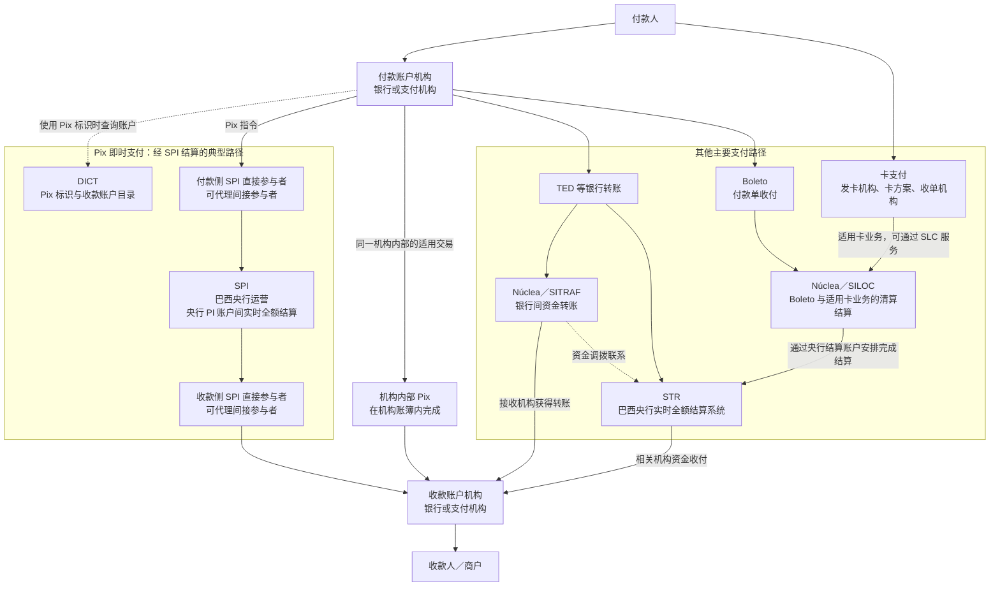
```mermaid
flowchart TD
    P["付款人"]
    R["收款人／商户"]
    A["付款账户机构<br/>银行或支付机构"]
    B["收款账户机构<br/>银行或支付机构"]

    P --> A
    B --> R

    subgraph PIX["Pix 即时支付：经 SPI 结算的典型路径"]
        DICT["DICT<br/>Pix 标识与收款账户目录"]
        DA["付款侧 SPI 直接参与者<br/>可代理间接参与者"]
        SPI["SPI<br/>巴西央行运营<br/>央行 PI 账户间实时全额结算"]
        DB["收款侧 SPI 直接参与者<br/>可代理间接参与者"]
    end

    A -. "使用 Pix 标识时查询账户" .-> DICT
    A -->|"Pix 指令"| DA
    DA --> SPI --> DB
    DB --> B

    ONUS["机构内部 Pix<br/>在机构账簿内完成"]
    A -->|"同一机构内部的适用交易"| ONUS
    ONUS --> B

    subgraph OTHER["其他主要支付路径"]
        TED["TED 等银行转账"]
        BOLETO["Boleto<br/>付款单收付"]
        CARD["卡支付<br/>发卡机构、卡方案、收单机构"]
        SILOC["Núclea／SILOC<br/>Boleto 与适用卡业务的清算结算"]
        SITRAF["Núclea／SITRAF<br/>银行间资金转账"]
        STR["STR<br/>巴西央行实时全额结算系统"]
    end

    P --> CARD
    A --> TED
    A --> BOLETO
    CARD -->|"适用卡业务，可通过 SLC 服务"| SILOC
    BOLETO --> SILOC
    SILOC -->|"通过央行结算账户安排完成结算"| STR
    TED --> SITRAF
    TED --> STR
    SITRAF -->|"接收机构获得转账"| B
    SITRAF -. "资金调拨联系" .-> STR
    STR -->|"相关机构资金收付"| B
```

Pix 是一套即时支付安排，用户在银行或支付机构的应用中使用它付款或收款。它不是某一家银行的钱包，也不等同于底层的 SPI 结算系统。

DICT 是 Pix 标识与收款账户的目录。当付款人使用 Pix 标识时，目录帮助确认对应的收款账户。图中的查询线传递的是信息，不是资金；不使用 Pix 标识的适用付款方式不必按同一路径查询。

找到收款账户后，再看钱怎样付过去。经 SPI 结算的交易，在直接参与者开立于巴西央行的 PI 账户之间，逐笔实时按全额结算；间接参与者请直接参与者代办。SPI 全天候运行，付款参与者需要有足够的可用账户资金，才能完成付款。[^app-a-br-1]

如果付款账户与收款账户属于同一家机构，适用交易可以在机构内部账簿上完成。上图因此分出机构内部处理与经 SPI 结算两条路径：标作付款侧和收款侧的两个角色，并不总是两家公司。[^app-a-br-2]

Pix 之外，TED 银行转账可按适用安排经央行 STR 或 Núclea 的 SITRAF 处理。STR 还承担更广泛的银行间实时全额资金结算，所以图中既有面向 Pix 的 SPI，也有服务其他资金支付的 STR。[^app-a-br-3]

Boleto 是带付款信息的缴款单，常用于账单收付。Núclea 的 SILOC 处理 Boleto 与适用银行卡业务的清算结算，卡业务还可通过 SLC 服务组织处理；刷卡授权、商户出款则各有流程。[^app-a-br-4][^app-a-br-5]

### 印度

在印度，从用户熟悉的 UPI 应用向后追踪，会看到应用通过合作银行接入 NPCI 的 UPI 网络，再联系两边的开户银行扣款、入账。银行之间该付的钱，则按相应安排在 RBI（印度储备银行，即印度央行）账户体系结算。NPCI 还提供其他零售支付系统，RBI 则直接运营 NEFT 和 RTGS；下图按这两类提供方展开。

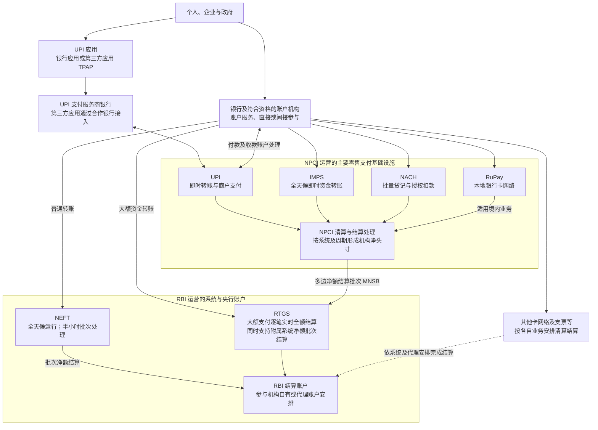
```mermaid
flowchart TB
    U["个人、企业与政府"]
    BANK["银行及符合资格的账户机构<br/>账户服务、直接或间接参与"]
    APP["UPI 应用<br/>银行应用或第三方应用 TPAP"]
    PSP["UPI 支付服务商银行<br/>第三方应用通过合作银行接入"]

    U --> BANK
    U --> APP
    APP --> PSP

    subgraph NPCI["NPCI 运营的主要零售支付基础设施"]
        UPI["UPI<br/>即时转账与商户支付"]
        IMPS["IMPS<br/>全天候即时资金转账"]
        NACH["NACH<br/>批量贷记与授权扣款"]
        RUPAY["RuPay<br/>本地银行卡网络"]
        NET["NPCI 清算与结算处理<br/>按系统及周期形成机构净头寸"]
    end

    PSP <--> UPI
    BANK <-->|"付款及收款账户处理"| UPI
    BANK --> IMPS & NACH & RUPAY
    UPI --> NET
    IMPS --> NET
    NACH --> NET
    RUPAY -->|"适用境内业务"| NET

    subgraph RBI["RBI 运营的系统与央行账户"]
        NEFT["NEFT<br/>全天候运行；半小时批次处理"]
        RTGS["RTGS<br/>大额支付逐笔实时全额结算<br/>同时支持附属系统净额批次结算"]
        ACCOUNT["RBI 结算账户<br/>参与机构自有或代理账户安排"]
    end

    BANK -->|"普通转账"| NEFT
    BANK -->|"大额资金转账"| RTGS
    NEFT -->|"批次净额结算"| ACCOUNT
    NET -->|"多边净额结算批次 MNSB"| RTGS
    RTGS --> ACCOUNT

    OTHER["其他卡网络及支票等<br/>按各自业务安排清算结算"]
    BANK --> OTHER
    OTHER -. "依系统及代理安排完成结算" .-> ACCOUNT
```

UPI 由 NPCI 提供，连接不同应用和账户机构。用户使用的是银行应用或第三方应用，第三方应用通过合作的支付服务商银行接入 UPI。应用提供操作界面，UPI 提供互联支付能力，账户机构负责相应账户处理，三者不是同一个角色。本图主要展示常见银行账户支付路径；UPI 的其他资金来源及特殊产品不逐项展开。[^app-a-in-1][^app-a-in-2]

IMPS 同样由 NPCI 提供，支持银行等参与机构提供全天候即时资金转账。UPI 在 IMPS 基础设施之上发展，但图中将两类服务分别列出，避免把用户的 UPI 支付理解成必须先在应用里发起一笔 IMPS 转账。[^app-a-in-3]

RBI 自身运营的 NEFT 和 RTGS 都可全天候运行，处理节奏却不同：NEFT 每半小时处理一批，RTGS 对客户大额转账逐笔实时全额结算。所以“全天候运行”说明随时可用，不能据此判断钱是每笔马上结清，还是攒成一批再结。RTGS 也接收 NPCI 等系统提交的多边净额结算批次，付清一批交易合算后各机构该收、该付的差额。[^app-a-in-4][^app-a-in-5]

NACH 适用于重复、定期和大批量的收付款，如工资、养老金、补贴发放，以及水电费、贷款和保险费扣款。它与 UPI 即时付款的业务组织方式不同。[^app-a-in-6]

RuPay 是 NPCI 提供的本地银行卡网络，连接发卡和收单等参与者；它不是 UPI 的别名。其他国际卡网络也有各自的支付与结算安排。[^app-a-in-7]

把这些角色接回一次扫码付款：第三方 UPI 应用经合作银行和 UPI 网络发起请求，两侧账户机构处理顾客扣款和商户入账。普通银行账户直接收款时，款项可很快进入商户账户；若采用聚合收款等安排，还需区分聚合方收款与向商户出款。用户侧到账之后，NPCI 按适用周期计算机构净头寸，再在 RBI 账户体系结算。这样就能同时解释顾客看到的即时结果，以及图中后来提交的净额结算批次。[^app-a-in-8][^app-a-in-2]

### 英国

英国英镑付款可以先按用途选择处理路径：快速账户转账常用 Faster Payments，批量付款和直接扣款常用 Bacs，大额或时效敏感支付可使用 CHAPS。Pay.UK 运营主要银行间零售系统，英格兰银行运营 CHAPS 和 RTGS；前面的零售系统也会把机构净头寸交到央行结算，所以多条路径最终会连到图中的 RTGS 服务。

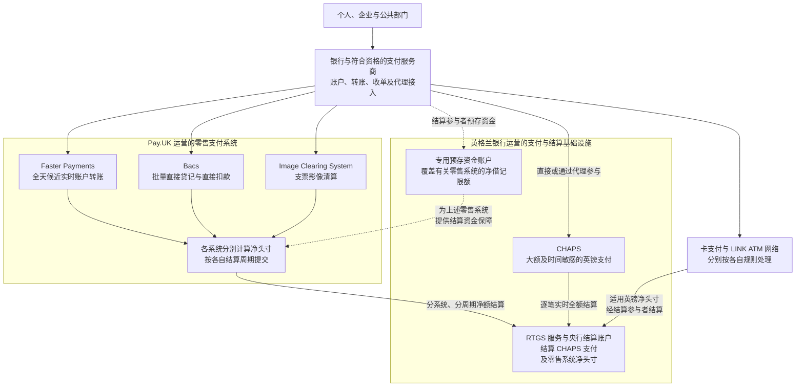
```mermaid
flowchart TB
    U["个人、企业与公共部门"]
    PSP["银行与符合资格的支付服务商<br/>账户、转账、收单及代理接入"]
    U --> PSP

    subgraph PAYUK["Pay.UK 运营的零售支付系统"]
        FPS["Faster Payments<br/>全天候近实时账户转账"]
        BACS["Bacs<br/>批量直接贷记与直接扣款"]
        ICS["Image Clearing System<br/>支票影像清算"]
        NET["各系统分别计算净头寸<br/>按各自结算周期提交"]
    end

    PSP --> FPS & BACS & ICS
    FPS --> NET
    BACS --> NET
    ICS --> NET

    subgraph BOE["英格兰银行运营的支付与结算基础设施"]
        CHAPS["CHAPS<br/>大额及时间敏感的英镑支付"]
        RTGS["RTGS 服务与央行结算账户<br/>结算 CHAPS 支付<br>及零售系统净头寸"]
        PREFUND["专用预存资金账户<br/>覆盖有关零售系统的净借记限额"]
    end

    PSP -. "结算参与者预存资金" .-> PREFUND
    PSP -->|"直接或通过代理参与"| CHAPS
    CHAPS -->|"逐笔实时全额结算"| RTGS
    NET -->|"分系统、分周期净额结算"| RTGS
    PREFUND -. "为上述零售系统<br>提供结算资金保障" .-> NET

    OTHER["卡支付与 LINK ATM 网络<br/>分别按各自规则处理"]
    PSP --> OTHER
    OTHER -->|"适用英镑净头寸<br>经结算参与者结算"| RTGS
```

Faster Payments 支持全天候近实时付款，常用于网上银行转账、账单支付和定期转账。用户可能在几秒内看到到账，但机构间净头寸按结算周期提交英格兰银行；目前通常每个营业日结算三次，周末和公众假期的相关周期在下一营业日结算。本节的 Faster Payments 与香港 FPS 转数快是不同地区的独立系统。[^app-a-uk-1]

Bacs 包括 Direct Credit（直接贷记，如工资发放）和 Direct Debit（直接扣款，如获授权的水电费扣款），通常采用三个工作日的处理周期。这类业务可以事先按发薪日或账单日期编排批次，与要求尽快到账的临时转账有不同的时间安排。Pay.UK 还运营支票影像清算系统 ICS，处理另一类零售支付记录。[^app-a-uk-2][^app-a-uk-3]

CHAPS 在英格兰银行 RTGS 服务中逐笔结算，常用于金融机构资金支付，也用于购房款等需要确定结算时点的付款。CHAPS 是支付系统，RTGS 是支持其结算的央行账户基础设施；英国零售系统的净头寸也使用 RTGS 服务，所以不能把“英国 RTGS 服务”理解为只处理 CHAPS。[^app-a-uk-4]

客户付款先办、机构之间后结账，系统就需要确保到时该付钱的一方拿得出钱。Bacs、Faster Payments 和 ICS 要求直接结算参与者预存资金，覆盖它最多可能欠出的净额，也就是最大净借记头寸。钱预先备好，后续仍按净额结算，无须为每笔客户付款单独做一次央行结算。[^app-a-uk-5]

银行卡网络和 LINK 自动取款机网络分别组织相应业务，适用的英镑净头寸也可在英格兰银行 RTGS 账户中结算；图中将它们合并展示，不代表它们是同一系统。[^app-a-uk-1]

同一家银行可以用 Faster Payments 帮个人快速转账，用 Bacs 帮企业按发薪计划批量付款，再用 CHAPS 处理一笔需要当日确定结算的大额购房款。前台都属于“银行付款”，采用的后台系统和结算节奏却不同。

本节聚焦英镑。英国仍在 SEPA 支付方案的适用范围内，英国机构办理符合条件的欧元支付时可使用相应 SEPA 安排；英国本地的英镑支付则使用本节介绍的系统。[^app-a-eu-2]

## 附录B：主流电子钱包与支付平台

同一家网店的付款页面，可能同时摆着 Apple Pay、微信支付、PayPal 和银行卡几个按钮。顾客选完其中一个，页面底部又出现了 Stripe 或 Adyen 的名字。这些名字分别负责什么？换一个按钮，是换了保存卡片的地方，还是连付款账户与支付网络也一起换了？

辨认一种支付产品，可以先问：顾客的钱从哪里来，谁负责扣款，商户向谁查到账。把这三件事找出来，比先给它贴上“钱包”或“平台”的标签更容易看清一笔付款。

以一笔 Apple Pay 绑卡消费为例，Apple Pay 提供设备上的付款凭证与确认界面，发卡侧仍需批准银行卡交易。换成 PayPal，顾客还可能使用 PayPal 余额或绑定的银行账户。再换到商户这一边，Adyen 可以帮助网店受理银行卡和多种钱包，顾客却不需要为了这笔购买先开一个 Adyen 消费者钱包。[^app-b-roles]

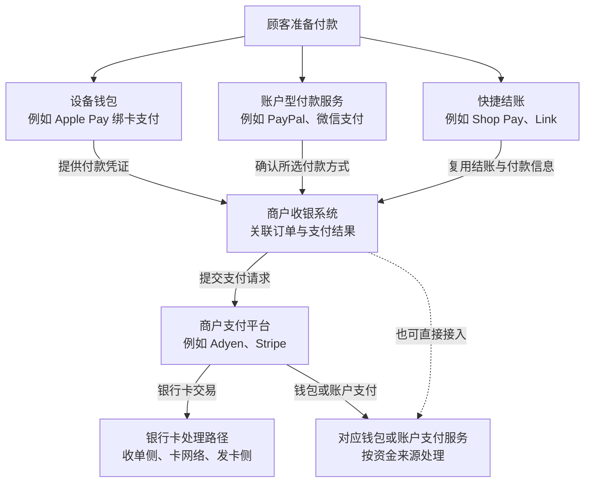
```mermaid
flowchart TB
    BUYER["顾客准备付款"]
    DEVICE["设备钱包<br/>例如 Apple Pay 绑卡支付"]
    ACCOUNT["账户型付款服务<br/>例如 PayPal、微信支付"]
    EXPRESS["快捷结账<br/>例如 Shop Pay、Link"]
    SHOP["商户收银系统<br/>关联订单与支付结果"]
    PSP["商户支付平台<br/>例如 Adyen、Stripe"]
    CARD["银行卡处理路径<br/>收单侧、卡网络、发卡侧"]
    WALLET["对应钱包或账户支付服务<br/>按资金来源处理"]

    BUYER --> DEVICE & ACCOUNT & EXPRESS
    DEVICE -->|"提供付款凭证"| SHOP
    ACCOUNT -->|"确认所选付款方式"| SHOP
    EXPRESS -->|"复用结账与付款信息"| SHOP
    SHOP -->|"提交支付请求"| PSP
    PSP -->|"银行卡交易"| CARD
    PSP -->|"钱包或账户支付"| WALLET
    SHOP -. "也可直接接入" .-> WALLET
```

这张图展示接入关系，箭头不代表资金逐站经过这些公司。分析实际交易时，还需要找出各家公司提供服务的主体，以及它们之间的账户与结算关系。

一家公司也可能同时提供几类服务：既让顾客保存卡片，也帮商户收款。下面会围绕具体用法来讲，例如 *用 Apple Pay 中的银行卡付款* 或 *商户通过 Mercado Pago 收款*。这样才能看清这家公司在这一笔交易里具体做了什么。

后面的图分别标注支付请求、账本变化和实际划款。看到账户里出现余额时，还要继续分辨：那是用户的可用资金、商户尚待结算的货款，还是已经进入商户银行账户的存款。

### 中国常见支付

用微信付钱时，我们操作的是微信里的页面，实际提供支付服务的公司则是 ***财付通支付科技有限公司（Tenpay）***。这个名字写在《微信支付用户服务协议》中，说明谁负责提供约定的支付服务。另一个常见名称 ***腾讯金融科技（FiT）***，指腾讯组织移动支付及相关金融服务的业务平台，范围比微信支付更广。[^app-b-fit]

这几个名称可以按用途来认：微信告诉我们从哪里操作，财付通告诉我们由谁提供支付服务，FiT 则用来介绍腾讯有哪些金融科技业务。腾讯把财付通介绍为微信支付、QQ 钱包等产品背后的支付能力基础，也就是说，用户在不同应用里点付款，背后可以由同一家支付机构处理。

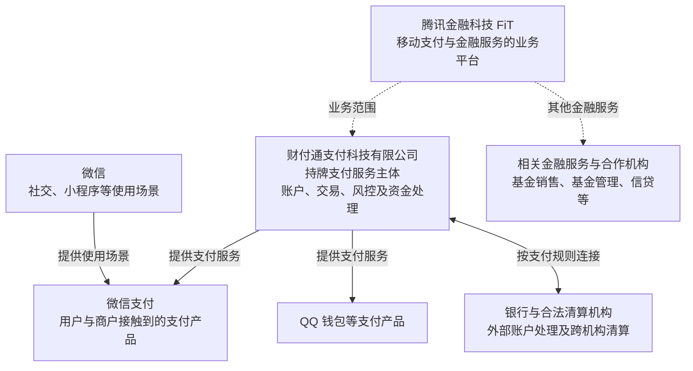
```mermaid
flowchart TB
    FIT["腾讯金融科技 FiT<br/>移动支付与金融服务的业务平台"]
    WX["微信<br/>社交、小程序等使用场景"]
    WP["微信支付<br/>用户与商户接触到的支付产品"]
    QQ["QQ 钱包等支付产品"]
    TP["财付通支付科技有限公司<br/>持牌支付服务主体<br/>账户、交易、风控及资金处理"]
    EXT["银行与合法清算机构<br/>外部账户处理及跨机构清算"]
    FIN["相关金融服务与合作机构<br/>基金销售、基金管理、信贷等"]

    FIT -. "业务范围" .-> TP
    FIT -. "其他金融服务" .-> FIN
    WX -->|"提供使用场景"| WP
    TP -->|"提供支付服务"| WP
    TP -->|"提供支付服务"| QQ
    TP <-->|"按支付规则连接"| EXT
```

这张图表示业务与服务关系，不是股权结构图，也不是资金流图。FiT 不作为一个额外的资金中转站；基金或贷款出现在微信的页面里，也不意味着它们都由财付通这家支付机构发行。

具体到一笔付款，财付通要核实谁在操作、他有没有权付款、钱该记给哪家商户，还要记账、查异常、处理退款和投诉。如果用户选择银行卡，银行负责检查并处理自己的账户，财付通需要经网联、银联等具备相应资格的清算机构与银行协作。财付通服务买卖双方，清算机构连接不同机构，这两项工作分开进行。[^app-b-cn-institutions]

以微信零钱为例，用户有 100 元，表示财付通在他的支付账户里记着 100 元可按规则使用的余额。这笔钱还属于客户资金，不能当成腾讯赚到的收入。支付机构为执行客户付款指令而预先收到、尚待支付的资金，称为 ***客户备付金***，需要按规定集中存管和使用，不能拿去随意放贷或投资。财付通负责记录每个人有多少余额；央行存管备付金，并不是给每位微信零钱用户各开一个账户。[^app-b-cn-reserve]

有了这个区分，再看顾客付款和商户收钱，就能追踪每一步改了哪份账、是否需要银行划款：

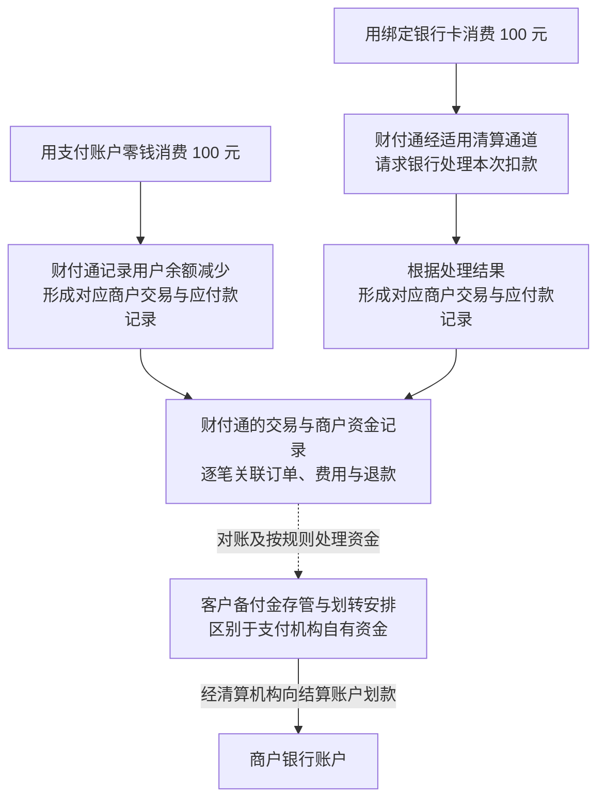
```mermaid
flowchart TB
    A["用支付账户零钱消费 100 元"] --> A1["财付通记录用户余额减少<br/>形成对应商户交易与应付款记录"]
    B["用绑定银行卡消费 100 元"] --> B1["财付通经适用清算通道<br/>请求银行处理本次扣款"]
    B1 --> B2["根据处理结果<br/>形成对应商户交易与应付款记录"]
    A1 --> M["财付通的交易与商户资金记录<br/>逐笔关联订单、费用与退款"]
    B2 --> M
    M -. "对账及按规则处理资金" .-> R["客户备付金存管与划转安排<br/>区别于支付机构自有资金"]
    R -->|"经清算机构向结算账户划款"| BANK["商户银行账户"]
```

第一条路径中，顾客已经有支付账户余额，本次消费不需要再从他的绑定银行卡扣一次钱。第二条路径使用银行卡作为当次资金来源，也不等于先给零钱充值。最后，商户银行到账还涉及货款结算、手续费与付款安排。这三类记录需要对得上，但没有必要都发生在顾客扫码的那一秒。图中不展开特殊账户升级、跨境及金融产品支付路径。

付款列表里的 ***零钱通***，背后则涉及货币基金。用户可以通过腾安基金销售服务购买相应基金，持有的是基金份额，资产由基金管理、托管等机构处理。要拿它付款，还需要相应的赎回、转出或垫支服务。微信零钱可以直接按支付账户余额处理，零钱通需要处理基金相关资金，银行卡则由银行处理账户；三个选项放在一起，省的是用户切换页面的操作，后台仍要分别办理。[^app-b-lqt]

商户用了谁提供的收银系统，也不一定由谁给商户付钱。普通商户可以直接对接微信支付；在普通服务商模式下，外部服务商帮助特约商户接入和管理订单，微信支付则按约定向特约商户的结算账户付款，技术服务商不经手货款。服务商号标识谁在提供接入服务，特约商户号标识钱该记给谁，都不同于顾客的微信账号。银行、持牌支付机构参与的从业机构模式另有分工，需要按对应模式理解。[^app-b-wechat-partner]

为了使用这些收款、记账和风险管理服务，商户按协议支付服务费。财付通收取费用后，还要支付银行通道、清算、系统运营和服务商协作等成本。这样就能分清三笔数：顾客的 100 元是货款，服务费是支付服务的收入，扣除相关成本后才谈得上利润。费率、结算周期与优惠由具体商户协议确定。[^app-b-wechat-settlement][^app-b-tencent-cost]

***支付宝*** 也可以这样理解：支付宝 App 是用户操作的入口，***支付宝（中国）网络技术有限公司*** 是相关支付服务协议中的签约公司，蚂蚁集团的业务范围则更广。花呗涉及信用服务，余额宝涉及基金服务，不能都当成支付账户余额。判断一次付款时，仍要看用户选的是余额、银行卡，还是某项金融产品，再找到实际负责扣款或提供资金的机构。[^app-b-alipay-entity]

支付宝从担保交易发展而来，也使不少人把它理解成“替买家保管货款，确认收货后再给卖家”。这项安排解决了早期网上购物中双方互不信任的问题：买家不愿先付给陌生卖家，卖家也不愿无保障地发货，由中间服务按条件释放货款。但今天的当面付和普通商户收款，并不都等待确认收货。谁控制资金释放，要看具体交易协议；退款则应关联原订单并按原资金来源处理。[^app-b-alipay-history][^app-b-alipay-entry][^app-b-cn-refund]

把相近产品归纳起来，可以看到它们在产业中的位置并不相同：

| 产品或机构 | 它在这里主要是什么 | 应当另外查清什么 |
| :--- | :--- | :--- |
| 微信支付、QQ 钱包 | 财付通提供支付服务的不同产品入口 | 支付账户、绑定银行账户及具体商户收款关系 |
| 腾讯 FiT | 组织移动支付与相关金融服务的业务平台 | 每项服务实际由哪家机构提供，适用哪份协议 |
| 支付宝 | 同时承载支付与其他生活、金融服务的产品品牌 | 支付机构与基金、信贷等服务主体的边界 |
| 云闪付 App | 银联与银行等产业参与方共建的移动支付入口 | 所用银行卡、二维码受理及银联网络关系 |
| 银联手机闪付 | 通过设备钱包等呈现的银联支付能力 | 设备凭证、发卡侧与商户受理支持 |

云闪付把多家银行的卡和支付服务放到一个入口中。用它付款，要继续看选了哪张卡、商户怎样受理；用微信支付，则还可能选择财付通支付账户里的零钱。两者页面上都可以“选卡”，但是否提供支付账户余额、这次实际扣哪里的钱，需要分别确认。[^app-b-unionpay]

### 设备钱包

用 Apple Pay 中绑定的信用卡付款时，用户是在 ***通过设备使用原来的银行卡***。信用额度、账单和还款仍由发卡机构管理，商户仍要接入收单服务。Apple Pay 让用户在手机上选卡、确认付款，并把相应凭证安全地交给支付系统；这次消费直接使用银行卡，无须先给 Apple Pay 充值。

从加卡到付款，需要三方配合。***钱包提供方*** 让用户添加、选择和使用卡片；***令牌服务提供方（Token Service Provider，TSP）*** 记录令牌对应哪张卡、允许在哪里使用；***发卡机构*** 决定是否允许绑卡，以及是否批准实际交易。TSP 可以由卡组织等机构提供，Apple 提供手机和钱包，并不独自决定后面两项结果。[^app-b-token-control]

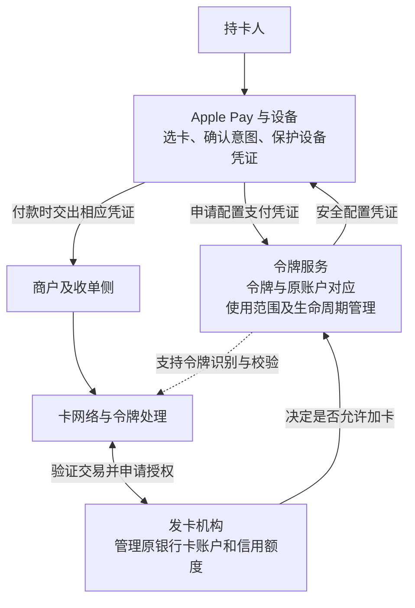
```mermaid
flowchart TB
    U["持卡人"] --> W["Apple Pay 与设备<br/>选卡、确认意图、保护设备凭证"]
    W -->|"申请配置支付凭证"| T["令牌服务<br/>令牌与原账户对应<br/>使用范围及生命周期管理"]
    I["发卡机构<br/>管理原银行卡账户和信用额度"] -->|"决定是否允许加卡"| T
    T -->|"安全配置凭证"| W
    W -->|"付款时交出相应凭证"| M["商户及收单侧"]
    M --> N["卡网络与令牌处理"]
    N <-->|"验证交易并申请授权"| I
    T -. "支持令牌识别与校验" .-> N
```

加卡时，Apple Pay 会把必要卡片、设备等资料交给发卡侧或网络处理，发卡侧可以要求进一步核验身份。允许把卡加进设备，解决的是“这个设备能否取得付款凭证”；以后买充电头时申请授权，解决的是“这张卡现在能否付这笔钱”。前一次同意不会替代后一次检查。[^app-b-apple-provision]

发放令牌后，网络还会检查它是否用在允许的设备、商户或场景中，并管理暂停、恢复等状态。某台设备丢了，可以停用那台设备的凭证，减少这次丢失对其他用卡场景的影响。令牌本身可以多次使用，每笔变化的是交易密码文等数据，所以它不是每用一次就换掉的“一次性卡号”。[^app-b-token-control]

在 Apple 的设备安全设计中，***安全隔区（Secure Enclave）*** 与 ***安全元件（Secure Element）*** 也各有职责。前者参与核验用户身份和付款意图，后者保存相应支付凭证并参与生成交易数据。Face ID 通过，让设备可以使用凭证；发卡机构随后仍需决定是否付款。这解释了为什么一张卡可以顺利调起 Apple Pay，却因额度不足而被拒绝。[^app-b-apple-online]

加好卡以后，用户既可以在店里拍手机，也可以在网站或 App 中付款。两者交出凭证的方式不同，后面都还要提交银行卡交易：

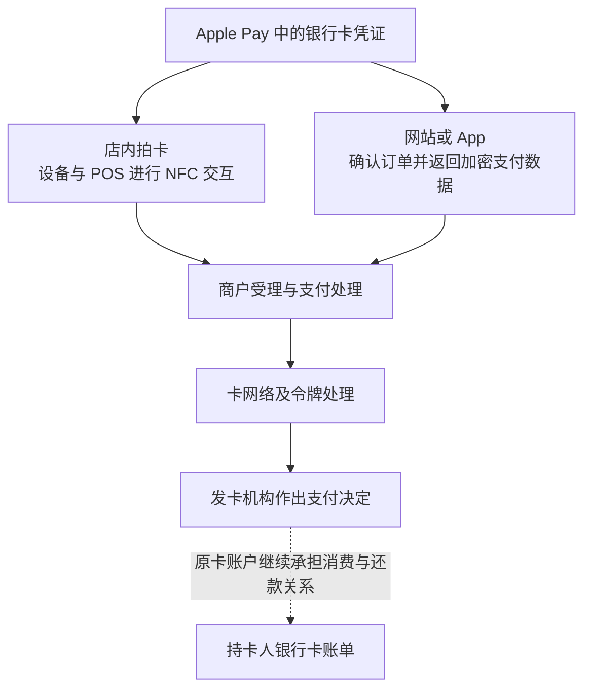
```mermaid
flowchart TB
    D["Apple Pay 中的银行卡凭证"] --> P["店内拍卡<br/>设备与 POS 进行 NFC 交互"]
    D --> E["网站或 App<br/>确认订单并返回加密支付数据"]
    P --> A["商户受理与支付处理"]
    E --> A
    A --> N["卡网络及令牌处理"]
    N --> I["发卡机构作出支付决定"]
    I -. "原卡账户继续承担消费与还款关系" .-> C["持卡人银行卡账单"]
```

线上场景还涉及商户身份验证和支付数据的加密转交；商户或其服务商取得数据后，再提交实际银行卡交易。它改变了凭证如何进入支付系统，不会把卡片消费变成顾客向 Apple 充值、Apple 再向网店付款。退款也要关联原交易，钱包所显示的设备卡号与实体卡号不同，是查账时需要注意的细节。[^app-b-apple-online][^app-b-apple-refund]

***Google Wallet／Google Pay*** 在许多市场也让用户通过设备或账户使用银行卡，但交出的凭证有不同类型。Google Pay 网页接口中的 `PAN_ONLY` 对应保存在 Google 账户里的卡片数据，`CRYPTOGRAM_3DS` 对应 Android 设备令牌及密码文。接口把付款数据加密后交给商户，称为 payment token；其中装的凭证可能不同，不能只看到 token 这个词就认定它是卡网络令牌。[^app-b-google]

这会影响商户和服务商如何处理凭证及风险。取得保存在账户中的卡片数据，与取得设备令牌及动态密码文，提供的交易证据不同；名称中的 `CRYPTOGRAM_3DS` 也不能直接证明用户完成了正文所述的 EMV 3DS 银行验证挑战。判断责任和验证强度，必须结合实际凭证、处理结果与卡规则。

相近名称还可以这样区分：

| 名称 | 本节关注的角色 | 不应混在一起的事 |
| :--- | :--- | :--- |
| Samsung Wallet 中的 Samsung Pay | 通过设备和令牌使用银行卡 | 钱包、网络令牌服务与网关内部令牌各有分工 |
| Huawei Pay 等银联手机闪付 | 在设备上承载银联卡支付能力 | 设备厂商、银联和发卡机构不是同一角色 |
| Apple Cash，美国 | 由 Green Dot Bank 等按其服务条款提供的账户及付款产品，可通过 Apple Pay 使用 | Apple Cash 的资金账户不等于 Apple Pay 这项绑卡付款能力 |
| Google Pay 印度版的普通 UPI 付款 | 通过应用连接银行账户支付 | 与本节 Google Pay 网页银行卡凭证是不同路径 |

Apple Cash 正好说明了“装在一个钱包里”不等于“钱都由同一家管理”。一部手机可以放多家银行的卡、现金账户产品和交通卡；选用哪一个，就使用哪一套账户和付款规则。查余额、账单或退款时，也需要找到相应服务的提供方。[^app-b-device-others][^app-b-apple-cash]

### 账户型付款服务

PayPal 的特点是 ***顾客和商户都直接使用它的支付服务***。顾客在 PayPal 中登录、选择付款来源，商户则通过 PayPal 接入收款、查询交易和处理争议。两边即使第一次做买卖，也可以通过各自熟悉的 PayPal 服务完成付款。背后可能仍有银行卡网络参与，但买卖双方首先接触的是 PayPal 提供的账户和交易服务。

这里的 PayPal 也不是全球只有一家签约公司。***PayPal Holdings*** 是集团，具体账户服务由适用地区的实体提供。美国的 ***PayPal, Inc.*** 持有相关州的货币传输许可；***PayPal (Europe) S.à r.l. et Cie, S.C.A.*** 则是受卢森堡 CSSF 监管的信用机构。因而，“PayPal 是不是银行”“余额怎样受到保护”不能脱离开户地区和协议作统一回答。下面采用美国常见 PayPal Checkout 场景。[^app-b-paypal-entities]

顾客可以选择符合条件的 PayPal 余额、绑定银行卡或银行账户。商户都通过 PayPal 接收这笔付款，PayPal 则按顾客选择的来源办理扣款：使用卡就要经过卡交易处理，使用银行账户就要等待相应银行处理。对商户来说，接入同一个服务便能接受多种来源；对 PayPal 来说，每种来源的到账时间和失败风险仍需分别管理。[^app-b-paypal-funding]

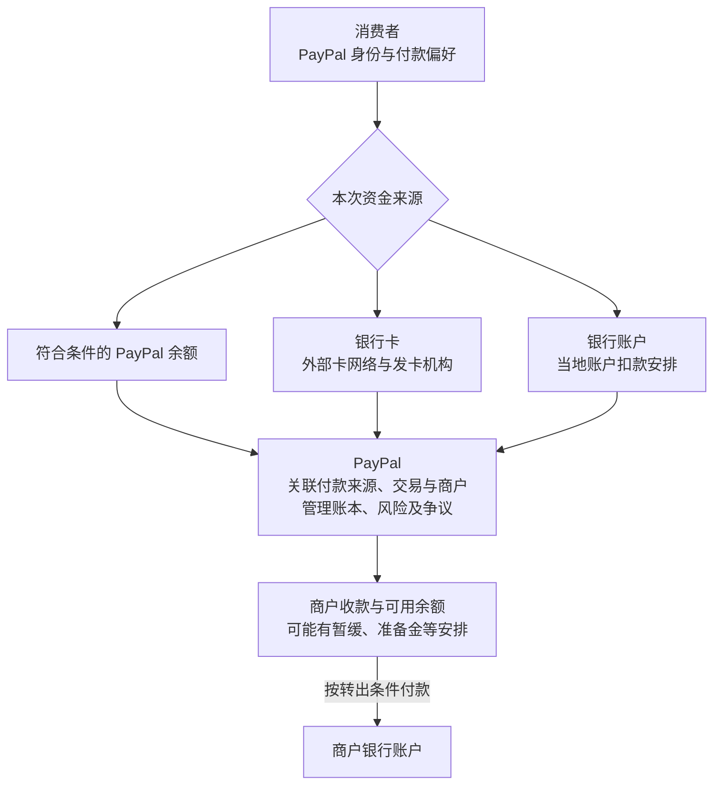
```mermaid
flowchart TB
    U["消费者<br/>PayPal 身份与付款偏好"] --> F{"本次资金来源"}
    F --> B["符合条件的 PayPal 余额"]
    F --> C["银行卡<br/>外部卡网络与发卡机构"]
    F --> A["银行账户<br/>当地账户扣款安排"]
    B & C & A --> P["PayPal<br/>关联付款来源、交易与商户<br/>管理账本、风险及争议"]
    P --> R["商户收款与可用余额<br/>可能有暂缓、准备金等安排"]
    R -->|"按转出条件付款"| BANK["商户银行账户"]
```

商户也可以选择先授权、后捕获款项。例如，网店先确认顾客可以付 29.99 美元，查到库存后再确认收款；订阅服务则需要顾客事先同意持续付款。这些做法与正文中控制何时收款的思路相近，但 PayPal 可以处理多种资金来源，它的“捕获”操作不代表每次背后都是同一种银行卡双信息交易。[^app-b-paypal-capture]

商户决定收款后，仍要看钱是否已经取得。例如，顾客选择银行账户付款，银行扣款可能还没完成，商户却希望尽早知道能否发货。PayPal 可以按相应产品和风险条件，选择等待资金确认，或先提供可用款项。如果先让商户用钱，就需要管理银行后来扣款失败的风险；反之，已经记入商户账户的款项，也可能因风险问题暂时不让转出。[^app-b-paypal-account]

暂缓和准备金可以用一个具体例子理解。某网店今天收了 10,000 美元，明天就全部转走，下个月却因为未发货遭到集中退款或拒付。如果商户已经停业，支付平台可能无法收回先前付出的款项。根据合同限制部分资金的使用，是在管理这类风险；它不表示平台已经认定每笔销售都有问题。对商户来说，可用余额、受限资金和银行到账应分别核对。

不同来源还会改变 PayPal 办理付款的成本。其 2025 年年报说明，银行卡来源的交易成本通常高于银行账户或内部余额等来源。商户看见的是同一个按钮，PayPal 为取得这笔货款付出的成本却可能不同。计算业务收入时，还要先把货款和手续费分开：流经平台的货款属于交易总额，平台收取的是服务费用，这些费用再减去成本才反映盈利情况。[^app-b-paypal-economics]

PayPal 还在交易规则上连接双方。以买不到货为例，顾客可以先联系商户退款；双方不能解决时，符合条件的交易可以进入 PayPal 买家保障程序。原付款使用银行卡时，发卡行争议程序也可能适用。PayPal 要把订单、付款来源、退款和争议对应起来，防止一笔消费被重复赔付；其美国规则不允许同时沿 PayPal 和发卡行程序追索同一笔交易。[^app-b-paypal-disputes]

```mermaid
flowchart TB
    P["顾客认为商品未交付"] --> S["先与商户核对订单及履约"]
    S -->|"商户同意退款"| R["关联原 PayPal 交易退款<br/>按原付款来源退回"]
    S -->|"未能解决"| D{"按适用条件<br/>选择争议程序"}
    D --> W["PayPal 买家保障<br/>依平台条款审核双方材料"]
    D --> C["原付款使用卡且符合条件时<br/>向发卡机构提出争议"]
    W --> O["按对应程序决定结果<br/>关联原交易，避免重复赔付"]
    C --> O
```

***Venmo*** 属于 PayPal 的产品体系，也同时提供个人间转账和商户付款；***Cash App*** 属于 Block，既有消费者账户和 Cash App Pay，也有与卡网络连接的银行卡产品。两者相似的地方，是把原本经常用于个人收付款的账户带进商户场景；不同商户入口、资金来源和适用规则仍需分别看。[^app-b-wallet-groups]

| 产品 | 使用钱包向商户付款 | 使用相关银行卡购物 |
| :--- | :--- | :--- |
| Venmo | 在支持的结账或二维码入口，按可用选项使用余额、银行账户或卡 | Venmo Debit Card 使用 Mastercard 受理路径 |
| Cash App | Cash App Pay 按规则使用 Cash 余额或绑定借记卡 | Cash App Card 是通过 Visa 网络使用的借记卡 |

一家商店可以没有 Cash App Pay 按钮，却受理 Cash App Card，因为后一笔使用银行卡受理关系。这类银行卡把钱包中的资金带到更广的商户网络，钱包付款则让消费者和商户直接使用平台提供的交易服务。两者可以互相补充，却不能用同一条流水图解释。[^app-b-us-wallets]

### 在线快捷结账

第一次在某家网店购物，付款页面却已经能填出地址和所选卡片，看上去像这家店早就认识顾客。实际可能是顾客以前在另一家店使用过同一项快捷结账服务，并同意保存信息。这项服务识别并验证顾客后，便能在支持它的新商户处复用相应资料。

***Shop Pay*** 就是一个例子。顾客选择保存邮箱、配送地址、账单地址和付款方式，以后在支持 Shop Pay 的结账页面，可以核对这些已保存的信息后继续购买。在需要验证时，顾客按界面使用通行密钥或验证码等方式。Shop Pay 负责简化这段结账体验，Shopify Payments 则提供相应商户支付处理服务。[^app-b-shop-pay]

如果只在一家店保存卡片，换店通常还要重新填写；Shop Pay 则可以让顾客在另一家支持它的商店复用资料。新商户通过这项服务取得本次购买所需的信息，顾客再确认订单和付款。它不会因此拿到其他店的订单，也不能只凭“这个人以前存过卡”就自行扣款。

```mermaid
flowchart TB
    U["顾客的 Shop Pay 资料<br/>身份、地址及保存的付款方式"]
    U -->|"验证后用于此次购买"| A["商店甲的订单<br/>甲负责商品与履约"]
    U -->|"验证后用于另一次购买"| B["商店乙的订单<br/>乙负责商品与履约"]
    A --> PA["对应甲的支付交易及收款记录"]
    B --> PB["对应乙的支付交易及收款记录"]
    PA --> P["Shopify Payments<br/>按各笔交易处理资金与风险"]
    PB --> P
```

如果这次购买选择了分期，便又增加了信用安排。Shop Pay 的快捷结账与 Shop Pay Installments 的分期能力要分开理解：前者帮助少填信息，后者涉及分期资格、还款和提供信用的机构。顾客点击同一个品牌入口，不代表每次都在借钱购物。

***Link*** 是 Stripe 提供的数字钱包，也支持保存并复用付款和配送信息。它不仅能保存卡片；在符合条件的市场和集成中，还支持 Instant Bank Payments 等付款方式。顾客通过验证后选择来源，商户继续通过 Stripe 的支付接口处理，不必为每次回头客重新采集整套资料。[^app-b-link]

```mermaid
flowchart TB
    U["顾客选择 Link"] --> ID["按需要验证身份<br/>调出已保存付款与配送信息"]
    ID --> F{"本次使用哪种<br/>可用付款方式？"}
    F -->|"信用卡或借记卡"| C["银行卡支付处理"]
    F -->|"Instant Bank Payments<br/>符合条件时"| B["银行账户付款处理<br/>按 Link 产品规则确认"]
    C --> S["Stripe 向商户提供支付状态"]
    B --> S
    S --> M["商户关联订单并履约<br/>另按余额与付款安排取得货款"]
```

Link 的 Instant Bank Payments 把前文的时间差问题放进了一项具体产品：Stripe 先向商户提供即时确认，并按约定承担部分银行退回款项的风险，商户便不必只靠等待银行处理结束来判断结果。这里的确认来自产品承诺，不能据此认定银行清算已经逐笔实时完成。承诺的范围也有限，商品没有交付等买卖纠纷仍需按相应规则处理。[^app-b-link-bank]

其他常见按钮可以放在这个位置上理解：

| 产品 | 顾客复用什么 | 交易还需要做什么 |
| :--- | :--- | :--- |
| Amazon Pay | Amazon 账户中可用于本次交易的付款方式与地址 | 在接受 Amazon Pay 的商户完成订单及支付处理，具体资金来源依地区而定 |
| Click to Pay | 支持该服务的已登记卡片与结账资料 | 经相应卡支付服务提交交易；它基于 EMV 安全远程商务规范 SRC |
| Apple Pay、Google Pay 的网页按钮 | 设备或账户中的可用付款凭证及必要信息 | 按前节解释继续提交实际支付 |
| PayPal 按钮 | PayPal 身份及可选付款来源 | 按 PayPal 的交易状态、收款与风险安排处理 |

Amazon Pay 让顾客在支持它的其他商户使用 Amazon 账户信息；这本身不把商品销售方变成 Amazon。Click to Pay 则是基于共同规范的卡片结账服务，也没有因此建立一个供顾客先充值的通用余额账户。[^app-b-express-others]

这些产品把重复填表和验证的工作集中起来：顾客换一家支持的商店，仍能使用已保存的信息；商户少让顾客填几张表，也就少了一些付款中途退出的机会。接入的商户越多，顾客保存一次资料就越有用；顾客越愿意使用，商户接入这项服务的理由也越充分。Shop Pay 和 Link 分别通过 Shopify、Stripe 的商户服务扩大这种使用范围，支持银行账户等来源还可能改变付款成本。

### 地区支付应用

不同地区的支付应用，看起来可能都是扫码、确认，钱却未必放在同一种账户里。下面先比较两个例子：印度的普通 UPI 付款直接使用银行账户；肯尼亚 M-PESA 则可以让用户把现金换成电子余额，再用余额付款。看清这两笔钱原先在哪里、付款后记到哪里，就更容易理解其他地区的产品。

在印度，顾客使用 ***PhonePe*** 或 ***Google Pay*** 扫描商户的 UPI 二维码，可以从已经关联的银行账户付款。这种普通账户支付不要求先往 PhonePe 或 Google Pay 充值。应用负责让用户找到收款方、选择账户和确认交易；第三方应用通过合作的 ***支付服务商银行（PSP Bank）*** 接入 UPI，付款银行和收款银行处理各自客户的账户。[^app-b-upi]

PhonePe 等第三方应用的提供方称为 ***TPAP***；帮助它接入 UPI 的合作银行称为 PSP Bank，这里的 PSP 特指这项银行职责。不同应用都按 UPI 的标识和二维码规则协作，顾客与商户便可以使用不同公司的服务付款。这就是互操作：用户不必为了付给另一个应用的用户，再注册一套相同的账户。[^app-b-upi-interoperability]

假设顾客选择自己银行账户中的 500 卢比支付货款，下面只画普通银行账户、商户直接收到账户的成功路径。收款侧接入服务合并在收款银行一栏，复杂的聚合收款安排不在图中展开。

```mermaid
flowchart TB
    U["顾客扫码确认支付 500 卢比"] --> A["PhonePe、Google Pay 等应用<br/>选择银行账户，提供安全确认入口"]
    A <-->|"请求与结果"| P["合作 PSP 银行<br/>为第三方应用接入 UPI"]
    P <-->|"互联处理"| N["NPCI UPI<br/>连接不同参与方"]
    N <-->|"验证与扣款结果"| B["付款银行<br/>顾客账户减 500"]
    N <-->|"入账请求与结果"| R["收款银行<br/>商户账户加 500"]
    B -. "机构净头寸" .-> S["后续机构间结算<br/>详见附录A印度部分"]
    R -. "机构净头寸" .-> S
```

图中的“确认”，包括这类交易要求的安全验证，银行据此检查并处理扣款。成功后，顾客银行账户少 500 卢比，商户银行账户多 500 卢比；Google Pay 等应用负责发起和展示结果，不是在自己的钱包里替双方各改一次余额。两家银行之间如何结算，则继续按 UPI 的安排处理，见附录A印度部分。

UPI 也有预付支付工具、UPI Lite、符合条件的信用卡等相关能力，因此上述图只适用于所选的普通银行账户场景。遇到别的资金来源，需要改画相应账户关系。出现扣款后未入账等异常时，也应沿 UPI 交易记录查询，不能把应用页面超时等同于银行没有扣款。[^app-b-upi]

***M-PESA*** 展示的是另一种起点。以肯尼亚为例，用户可以把现金交给授权代理点，代理点用自己已有的电子额度向用户转入相应余额。用户再通过手机菜单、USSD 或 App 转账，也可以向支持 M-PESA 的商户付款。下面假设用户原来没有余额，先存入 1000 先令，再消费 200 先令；这个过程不要求用户先有银行卡或智能手机。[^app-b-mpesa-cash]

```mermaid
flowchart TB
    U["用户交出 1000 先令现金"] --> A["授权代理点收到现金<br/>付出已有电子额度 1000"]
    A --> L["M-PESA 账本记录<br/>代理点电子额度减 1000<br/>用户电子余额加 1000"]
    L --> P["用户确认向商户支付 200"]
    P --> C["用户电子余额剩余 800"]
    P --> M["商户收到电子货款 200"]
    T["支持电子货币的等值资金<br/>按受托安排持有"] -. "资金保障关系<br/>不随每次内部付款逐笔划转" .-> L
```

图中金额以肯尼亚先令计，忽略费用。肯尼亚 M-PESA 由 ***Safaricom*** 提供服务，用户拿到的是它发行的电子货币，可以按规则支付或兑回。按照当地产品条款，这些电子货币对应受托人持有的等值资金权益，有相应资金作支持；用户没有买成话费，这笔客户资金也不能直接算作电信公司的营业收入。[^app-b-mpesa-trust]

再看代理点：它收下现金，同时把自己已有的电子额度转给用户，账本上只是把 1000 从代理点名下移到用户名下。既没有新造电子货币，也不需要把刚收的这张钞票当场送入受托资金账户。代理点因此要同时备足现金和电子额度：顾客来取现，要有现金可给；顾客来存钱，要有电子额度可转。代理网点是否够多、能否及时补足两种资金，会直接决定用户能不能方便地使用这项服务。

商户通过 ***Buy Goods*** 等产品收到款项后，可以按商户服务的安排继续支付或转出到银行。商户电子账户收到一笔销售收入，与后来向银行提取款项，仍是可分别追踪的交易。消费者、代理点和商户可使用的菜单及权限并不完全相同。[^app-b-mpesa-merchant]

其他代表产品可以放到下面这张表里。表中选取的是主要机制，具体某笔付款仍以本地产品和所选来源为准：

| 地区与代表产品 | 可以怎样理解 | 最值得分清的地方 |
| :--- | :--- | :--- |
| 日本：PayPay、Rakuten Pay | 把扫码、电子余额及其他可用付款来源放在一个应用中 | PayPay 余额与 PayPay Credit 不同；Rakuten Pay 的余额和积分也有不同用途与转出规则[^app-b-japan] |
| 韩国：Kakao Pay、Naver Pay | 将社交或电商账户与快捷付款、线下受理结合 | 账户登录、登记的卡或银行账户、电子余额及积分分别承担不同作用[^app-b-korea] |
| 菲律宾、印尼：GCash、DANA | 钱包余额是常见来源，也可能提供卡或符合条件的信用付款选项 | 在钱包中选择信用产品付款，不等于先扣了一笔已有现金余额[^app-b-sea-wallets] |
| 东南亚其他市场：GrabPay、Touch ’n Go eWallet、TrueMoney | 提供当地钱包与商户支付，并可能接入跨境受理 | 同一品牌在不同国家的能力可能不同；跨境可用也不意味着各地钱包共用一份余额[^app-b-sea-network] |
| 欧洲：Wero、TWINT、Vipps／MobilePay | Wero 连接既有银行账户；TWINT 有银行关联和预付版本；Vipps／MobilePay 使用当地支持的卡与账户 | 欧洲支付应用并不全部使用同一种账户转账模型[^app-b-europe-wallets] |
| 拉美：Mercado Pago、PicPay | 同时面向消费者和商户，商户产品可受理钱包、卡及巴西 Pix 等方式 | Mercado Pago／PicPay 是服务品牌，Pix 是可通过这些服务使用的支付方式[^app-b-latam] |

例如，巴西商户通过 PicPay 的接口展示一个 Pix 二维码，顾客可以按 Pix 的受理规则付款。商户使用 PicPay 提供的技术和收款服务，不足以说明顾客一定用了 PicPay 钱包余额。印度、欧洲和巴西的这些例子共同说明：*支付应用的名字，不能代替本次交易所用账户和网络的名字。*

### 商户支付平台

顾客选择 Apple Pay 或 PayPal，解决的是自己怎样付款。商户选择 ***Adyen*** 或 ***Stripe***，则是在决定谁帮助自己接入支付、管理收款与承担相应的机构责任。它们的核心客户是商户和平台，提供的服务可以覆盖网关、处理、风控、收单及资金管理等多个环节。

***Adyen*** 把其中多项工作放进同一套平台，在支持的地区还可以自己承担收单和资金处理。以 ***Adyen N.V.*** 为例，它持有欧洲银行牌照，可以在部分业务中直接提供原本需要合作银行支持的服务，同时承担相应的资本、流动性和监管要求。商户接入 Adyen，买到的服务因此可能一直覆盖到收单，而不只是一个网页付款入口。[^app-b-adyen-bank]

以由 Adyen 自行收单的一笔 Visa 消费为例，商户接入、风险判断、交易处理和收单责任可以由 Adyen 体系协同完成。到了 PayPal 等支付方式，又要接到对应的钱包体系；在采用外部收单的业务中，也会出现另一家收单机构。统一接入并没有消除这些机构差异。

```mermaid
flowchart TB
    M["商户网站、App 与门店"] --> G
    subgraph AD["Adyen 平台能力；实际组合按地区与合同"]
        G["支付接入与网关"] --> R["风险控制与交易处理"]
        R --> A["Adyen 收单<br/>适用交易由自身承担收单角色"]
        R --> X["外部支付方式接入"]
    end
    A --> N["卡网络"]
    N --> I["发卡机构"]
    X --> W["PayPal 等外部支付体系<br/>或适用的外部收单服务"]
```

图中这些服务接在一起，商户便可以在同一套后台查看门店和网店的支付，把订单、退款、费用和付款批次对应起来。不过，Adyen 自己收单与接入外部支付服务，仍有不同的收款安排，所以它的交易状态也区分自身结算和外部结算。商户在同一个页面看到交易成功后，还要沿相应方式查由谁付款、何时到账。[^app-b-adyen-records]

收单身份也带来风险责任。假设商户今天卖出一批半年后才交付的商品，Adyen 已按约定把款付给商户，半年后商户却无法履约，消费者发起拒付。收单侧仍需面对网络规则下的资金追索，随后再向商户收回款项。这正是支付机构要审核业务类型、交付周期、交易异常和资金保障的原因。可用支付接口只是技术条件，愿意为该商户承担怎样的收单风险，是另一项商业决定。[^app-b-adyen-risk]

为防止出现这类缺口，Adyen 可以按条款留存一部分资金，称为 ***MPL Reserve（商户潜在责任准备金）***。留多少，要结合尚未交付的订单、退货或取消权、退款和拒付等情况判断。商户看到部分货款“暂不可用”，可能就是因为这些订单以后仍有返款需要，服务商先留了钱。

定价也对应这种分工。Adyen 公布的价格结构包括处理费，以及由支付方式决定的费用；采用 Interchange++ 的卡交易，还需要分清交换费、网络费用与 Adyen 的加价。经 Adyen 处理的 100 元销售额并不是 Adyen 的收入，商户为一笔交易付出的全部费用也并非全部留给 Adyen。[^app-b-adyen-pricing]

***Stripe*** 同样帮助商户处理支付，还可以用来观察平台怎样替许多商户收钱、分钱。Checkout 和 Elements 提供支付页面和凭证采集，Payments 处理交易，***Connect*** 则为平台及其接入商户建立相应账户，记录收了多少、该分给谁。这里的账户是 Stripe 服务中的商户及资金记录，后台显示的余额不能直接当成普通银行存款。[^app-b-stripe-platform]

例如，顾客通过预约平台支付 100 元维修费。假设平台与师傅约定：先扣 3 元支付处理费，再留 10 元平台佣金，剩下 87 元给师傅。选用 Connect 的 ***收款与转账分离（Separate charges and transfers）*** 模式时，收款和处理费先记在平台的 Stripe 账户，再按平台指令把 87 元分给师傅的接入账户。这里约定的是从货款中扣费，费用由平台账户支付；金额仅作演算，不是实际报价。[^app-b-stripe-transfers]

```mermaid
sankey

"Stripe of Customer $","Stripe Fee $",3
"Stripe of Customer $","Platform Net Balance $",97
"Platform Net Balance $","Platform Retained $",10
"Platform Net Balance $","Service Provider $",87
"Platform Retained $","Platform Payout $",10
"Service Provider $","Service Provider Payout $",87
```

这里的 ***Charge*** 是向顾客收取 100 元，***Transfer*** 是把其中 87 元记给师傅的 Stripe 账户，***Payout*** 才是把相应余额转到外部银行账户。商户余额从 pending（待可用）变成 available（可用），只是到了可以按规则安排转出的阶段，银行到账还要继续查 Payout。[^app-b-stripe-balances]

在这种收款模式下，给顾客退款和收回师傅的分账，需要分别处理。如果后来全额退回 100 元，Stripe 会从平台余额扣款；已经分给师傅的 87 元不会随退款自动回到平台。平台还要撤回那笔转账，或从后续款项中追回。拒付也可能先扣平台余额。平台需要准备好先返款、再追款的安排，否则即使师傅账户还有钱，平台自己也可能出现余额缺口。[^app-b-stripe-transfers]

其他商户服务商可以归纳到同一组角色里：

| 服务商 | 代表性业务位置 | 阅读其方案时要看什么 |
| :--- | :--- | :--- |
| Checkout.com | 提供网关、交易处理及当地收单等能力 | 本次使用自身收单、第三方收单，还是仅网关／处理服务 |
| Worldpay | 提供商户受理与跨市场支付处理 | 签约实体、当地收单关系与结算币种 |
| Square，Block 体系 | 将门店收银、经营软件与支付服务结合 | 商户买到的是一组经营和支付能力；相关银行服务另有提供主体 |
| Braintree，PayPal 体系 | 面向商户提供银行卡及钱包等支付处理 | 使用 PayPal 集团的商户处理服务，不等于顾客必须用 PayPal 钱包 |

比较这些服务商时，可以沿一笔收款追问：***谁收单，货款到账前由谁管理，谁把钱付给商户，退款和拒付先扣谁的账户***。付款页面看起来相似，这几项安排仍可能不同，而它们会直接影响商户何时拿到钱、出问题时需要补多少钱。[^app-b-psp-others]

### 跨境钱包互联

一家日本商店希望接待不同国家的游客。如果逐一接入每个游客的本地钱包，就需要分别处理接口、币种、退款和结算。***Alipay+*** 解决的是这些钱包与商户受理机构之间的连接问题：商户侧接入一个互联服务，便有机会受理多种已加入的钱包。它由 ***蚂蚁国际（Ant International）*** 运营；中国内地支付宝是一个具体的支付产品，Alipay+ 则是连接多个支付服务的跨境平台。用户使用 GCash 或 Touch ’n Go eWallet 付款，不需要因此先开一个中国内地支付宝账户。[^app-b-alipayplus-role]

在这套关系里，消费者这一侧称为 ***移动支付服务商（MPP）***，商户这一侧称为 ***收单服务商（ACQP）***。钱包继续管理自己的用户和付款来源，收单服务商继续服务自己的商户，Alipay+ 在两侧之间提供交易连接、清算和结算等服务。某家钱包能接入哪些商户、支持何种支付方式，仍受双方开通范围约束。[^app-b-alipayplus-partners]

```mermaid
flowchart TB
    U1["菲律宾用户"] --> W1["GCash 等参与钱包"]
    U2["马来西亚用户"] --> W2["Touch ’n Go eWallet 等参与钱包"]
    W1 --> M["消费者侧：MPP<br/>管理用户、付款来源与交易确认"]
    W2 --> M
    M <-->|"付款请求、结果及清算数据"| A["Alipay+<br/>跨钱包连接与跨境处理"]
    A <-->|"付款请求、结果及清算数据"| Q["商户侧：ACQP<br/>商户接入、对账与收款服务"]
    Q --> S["当地商户<br/>销售以当地币种标价"]
```

图中先解决了付款请求怎样在钱包和商户之间传递。接下来还要把钱算清：商品用当地货币标价，用户按钱包显示的币种付款，机构之间又可能用另一币种结算。这些金额需要通过约定汇率对应起来，再计入有关费用，才能算出商户最后收到多少。

费用也要看是谁向谁收。MPP 与 ACQP 之间有合作伙伴间费用，Alipay+ 为两侧提供服务，还会收取相应服务费。对账文档中的 interchange／interpartner fee 属于这套钱包合作，虽然名称与银行卡交换费相近，仍按自己的规则计算。把消费、退款和这些费用按约定币种汇总后，才能确定各方最后该付多少。[^app-b-alipayplus-money]

```mermaid
flowchart TB
    T["一批已处理交易<br/>消费、退款与关联费用"] --> C["Alipay+ 清算与对账<br/>确定各方应收应付及币种"]
    C -. "钱包侧结算义务" .-> W["MPP 的结算资金安排"]
    W -->|"按约定周期支付净额"| A["Alipay+ 的结算安排"]
    A -->|"按约定周期支付净额"| Q["ACQP 的结算安排"]
    Q -->|"依商户合同结算货款"| S["商户银行账户"]
```

图中画的是通常销售较多、钱包侧需要向商户侧付款的情况，省略了具体银行划款环节；如果退款较多，净额和付款方向也可能变化。各机构按批次汇总后付款，所以顾客每扫一次码，并不需要各方立即各做一笔跨境汇款。退款则沿原交易核对金额，按适用的汇率和费用规则处理，再计入后续对账与结算。[^app-b-alipayplus-refund]

腾讯的 ***TenPay Global*** 也提供跨境支付连接，但应结合具体产品看。腾讯将它描述为由旗下持牌金融机构组成网络的跨境支付平台，服务可以包括境内外消费、汇款和商户收付款等。***TenPay Global Checkout*** 让中国内地以外的微信小程序商户接入当地钱包、银行卡及实时支付方式；商户使用微信小程序作为经营入口，不意味着所有海外顾客都要通过中国内地微信支付扣款。[^app-b-tenpay-global]

这里也要延续前面对 FiT 和财付通的区分。TenPay Global 是跨境业务平台，实际服务由适用地区的机构和合作伙伴承接；不能把平台覆盖的所有国家都理解为由中国内地财付通的一张牌照经营。***WeChat Pay HK*** 与中国内地微信支付也是不同地区的支付服务，跨境互联让它们扩大受理范围，没有把用户账户、币种及监管要求合成一套。[^app-b-tenpay-regions]

商户也可以通过自己的收款服务商接入跨境钱包互联平台，再由平台连接顾客的本地钱包。这样，顾客继续用熟悉的钱包付款，商户继续向自己的服务商查收款，中间的机构负责传递交易、换汇和结算。付款页面上多出一个互联品牌，说明两边多了一条合作路径，无须让顾客再开一个同名钱包。

## 参考资料

[^app-b-alipay-history]: 蚂蚁集团：[公司历程](https://www.antgroup.com/)，参见 2003 年推出担保交易、2004 年支付宝成立；支付宝：[担保交易介绍](https://abc.alipay.com/school/escrow.htm)。

[^app-b-upi-interoperability]: NPCI：[Guidelines on Interoperability](https://www.npci.org.in/PDF/npci/upi/circular/2018/UPI%20Circular%20-%20Guidelines%20on%20Interoperability.pdf)；[UPI Product Booklet](https://www.npci.org.in/PDF/npci/upi/Product-Booklet.pdf)，参见应用、参与银行与互操作安排。

[^app-b-mpesa-trust]: Safaricom：[M-PESA Business to Business Contract Terms and Conditions](https://www.safaricom.co.ke/media-center-landing/terms-and-conditions/m-pesa-business-to-business-b2b-contract-terms-and-conditions)，参见 Cash、E-Money、Custodial Trustee 定义；[M-PESA 产品条款](https://www.safaricom.co.ke/images/Downloads/M-PESA_Products_Terms_and_Conditions.pdf)。本节限于肯尼亚，不将其具体法律安排推广到所有 M-PESA 市场。

[^app-b-alipayplus-role]: Alipay+：[Frequently Asked Questions](https://www.alipayplus.com/faq/)，参见运营主体、与 Alipay 的区别及跨钱包受理方式。

[^app-b-alipayplus-partners]: Alipay+：[参与移动支付服务商能力列表](https://docs.alipayplus.com/alipayplus/alipayplus/mpp_list/mpp_capabilities)；[收单侧对账概述](https://docs.alipayplus.com/alipayplus/alipayplus/reconcile_acq/reconcile_overview)。

[^app-b-alipayplus-money]: Alipay+：[移动支付服务商对账概述](https://docs.alipayplus.com/alipayplus/alipayplus/reconcile_mpp_std/reconcile_overview)，参见清算、净额结算、汇率和合作伙伴费用。图示采用该文档的一般消费结算关系，省略具体银行及特殊地区安排。

[^app-b-alipayplus-refund]: Alipay+：[Refund，MPP 接入](https://docs.alipayplus.com/alipayplus/alipayplus/integration_mpm_latest_mpp/refund)；[Refund，商户主扫模式收单接入](https://docs.alipayplus.com/alipayplus/alipayplus/integration_merchant_mode_acq/refund?pageVersion=10)。退款汇率与费用退还按适用产品规则处理。

[^app-b-tenpay-global]: 腾讯：[TenPay Global](https://www.tencent.com/products/tenpay-global/)；腾讯：[TenPay Global Checkout 发布说明](https://www.tencent.com/tencent-launches-new-payment-solution-tenpay-global-checkout-enabling-weixin-mini-program-merchants-to-accept-local-payments-outside-of-the-chinese-mainland/)。

[^app-b-tenpay-regions]: 腾讯：[How We Rethink Cross-Border Payments](https://www.tencent.com/en-us/articles/2202372.html)，参见中国内地微信支付与 WeChat Pay HK 的区别、跨境互联和持牌机构安排。

[^app-b-adyen-bank]: Adyen：[How am I assured that my funds are safe at Adyen N.V.?](https://help.adyen.com/knowledge/finance/balances/how-am-i-assured-that-my-funds-are-safe-at-adyen-nv)；[Adyen's Banking License](https://www.adyen.com/knowledge-hub/adyen-banking-license)。本文仅以欧洲银行牌照说明机构角色，不把不同地区的许可形式一概视为相同。

[^app-b-adyen-records]: Adyen：[Payments lifecycle](https://docs.adyen.com/account/payments-lifecycle/)；[Reports and the payments lifecycle](https://docs.adyen.com/reporting/reports-and-the-payments-lifecycle)；[Settlement details report](https://docs.adyen.com/reporting/settlement-reconciliation/transaction-level/settlement-details-report)。

[^app-b-adyen-risk]: Adyen：[Terms and Conditions](https://www.adyen.com/legal/adyen-terms-and-conditions)，参见第 6 节 MPL Reserve 和第 8 节 Chargebacks and Refunds；[Monitor risk performance](https://docs.adyen.com/risk-management/dispute-and-fraud-monitoring)。延期交付例子用于解释收单业务的风险，不对应某一真实商户。

[^app-b-adyen-pricing]: Adyen：[Pricing](https://www.adyen.com/pricing)；[What are the fees on my invoice?](https://help.adyen.com/knowledge/finance/invoices/what-are-the-fees-on-my-invoice/)；[Transaction fees](https://docs.adyen.com/platforms/online-payments/transaction-fees/)。

[^app-b-stripe-platform]: Stripe：[How Checkout works](https://docs.stripe.com/payments/checkout/how-checkout-works)；[Understand how charges work in a Connect integration](https://docs.stripe.com/connect/charges)。

[^app-b-stripe-transfers]: Stripe：[Create separate charges and transfers](https://docs.stripe.com/connect/separate-charges-and-transfers)，参见资金分配、退款与转账撤回；[Connect charge types](https://docs.stripe.com/connect/charges)，参见各模式的退款与拒付扣款账户。图中金额及费用均为假设。

[^app-b-stripe-balances]: Stripe：[Balances and settlement time](https://docs.stripe.com/payments/balances)；[Understanding Connect account balances](https://docs.stripe.com/connect/account-balances)。

[^app-b-psp-others]: Checkout.com：[Global Acquiring](https://www.checkout.com/products/acquiring)；Worldpay：[Global Acquiring](https://www.worldpay.com/en/enterprise/global-expansion)；Block：[公司介绍](https://block.xyz/)；PayPal：[2025 年 Form 10-K](https://www.sec.gov/Archives/edgar/data/1633917/000163391726000024/pypl-20251231.htm)。

[^app-b-token-control]: EMVCo：[EMV Payment Tokenisation](https://www.emvco.com/emv-technologies/payment-tokenisation/)；[Payment Tokenisation — A Guide to Use Cases](https://www.emvco.com/wp-content/uploads/2023/03/EMVCo-Payment-Tokenisation-A-Guide-To-Use-Cases-v2.2.1.pdf)；Apple：[Adding credit or debit cards to Apple Pay](https://support.apple.com/en-ie/guide/security/secdc2567239/1/web/1)。参见令牌请求、服务提供方、发卡机构与使用范围控制。

[^app-b-apple-cash]: Apple：[Apple Cash](https://www.apple.com/apple-cash/)；[Apple Cash and Apple Payments Inc. & Privacy](https://www.apple.com/legal/privacy/data/en/apple-cash-apple-payments-inc/)。以美国 Apple Cash 及 Green Dot Bank 服务关系为例。

[^app-b-paypal-entities]: PayPal：[美国州许可信息](https://www.paypal.com/us/webapps/mpp/licenses?locale.x=en_US)；[PayPal Europe 机构说明](https://www.paypal.com/lu/webapps/mpp/about?locale.x=en_LU)；荷兰央行：[PayPal Europe 银行登记](https://www.dnb.nl/en/public-register/information-detail/?registerCode=WFTKF&relationNumber=B1302)。银行身份不等于所有账户余额都具有同一种存款保障，须依相应账户条款判断。

[^app-b-paypal-economics]: PayPal：[2025 年 Form 10-K](https://www.sec.gov/Archives/edgar/data/1633917/000163391726000024/pypl-20251231.htm)，参见 Transaction revenues、Transaction expense 及不同付款来源的成本说明。

[^app-b-wallet-groups]: PayPal：[2025 年 Form 10-K](https://www.sec.gov/Archives/edgar/data/1633917/000163391726000024/pypl-20251231.htm)，参见 Venmo 与 Braintree 业务；Block：[公司介绍](https://block.xyz/)。

[^app-b-fit]: 腾讯金融科技：[FiT 官方介绍](https://www.fitgroup.com/home)；[移动支付业务](https://www.fitgroup.com/business)；腾讯：[Weixin Pay](https://www.tencent.com/products/weixin-pay/)；[微信支付用户服务协议](https://gtimg.wechatpay.cn/resource/xres/build/wxpayuserinfo/wxpay_user_agreement/latest/userservice.html)。分别用于区分业务平台、产品与支付合同主体。

[^app-b-cn-institutions]: [非银行支付机构监督管理条例](https://www.pbc.gov.cn/tiaofasi/144941/144953/5174993/index.html)；[腾讯 FiT 发展历程](https://www.fitgroup.com/home)，记载财付通通过网联、银联清算机构处理支付请求的业务迁移。本文不据此推断每一种特殊交易的清算路线。

[^app-b-cn-reserve]: 中国人民银行：[非银行支付机构客户备付金存管办法](https://www.pbc.gov.cn/zhengwugongkai/attachDir/2025/11/2025111914411687312.pdf)（2021 年施行）；[非银行支付机构监督管理条例](https://www.pbc.gov.cn/tiaofasi/144941/144953/5174993/index.html)。参见客户备付金定义、集中存管、资金划转与禁止挪用的规定。

[^app-b-lqt]: 腾安基金销售：[服务协议修订公告](https://www.txfund.com/web/tengan/htmls/news/news-detailabc13.shtml)；[用户服务协议（零钱通版本）](https://img-cdn.tencentwm.com/resources/vtools/img/202110/39d38d6f1fba4b4ba666d744395fc5db.pdf)。参见基金销售、基金份额与转出服务关系。

[^app-b-wechat-partner]: 微信支付：[接入模式](https://pay.wechatpay.cn/doc/v3/partner/4012081931)，区分普通商户与普通服务商模式的资金流、数据流；[免密服务运营规则](https://pay.wechatpay.cn/doc/v3/merchant/4013519312)，参见从业机构与普通服务商定义。

[^app-b-tencent-cost]: 腾讯：[2025 年全年业绩公告](https://static.www.tencent.com/uploads/2026/03/18/f78591955e05a6db4e31e128bdaefefa.pdf)，参见交易成本中的银行手续费、渠道及分销成本。集团披露的成本不能直接当成单笔微信支付的费率或成本比例。

[^app-b-alipay-entity]: 支付宝：[产品服务合同](https://render.alipay.com/p/f/fd-jqw79r4v/index.html)；[快捷支付服务协议](https://benefitprod.alipay.com/asset/public/agreement.htm)。用于识别支付服务签约主体，不把该主体推广为 App 内所有金融服务的提供者。

[^app-b-upi]: NPCI：[UPI 产品介绍](https://www.npci.org.in/product/upi/about-upi)；[UPI FAQ](https://www.npci.org.in/what-we-do/upi/faqs)；[UPI Product Booklet](https://www.npci.org.in/PDF/npci/upi/Product-Booklet.pdf)。参见第三方应用、PSP 银行、付款银行与收款银行角色；其他资金来源不并入普通银行账户示例。

[^app-b-mpesa-cash]: Safaricom：[Using M-PESA](https://www.safaricom.co.ke/main-m-pesa/m-pesa-services/transactions/deposit-at-agent)，说明授权代理点以电子余额交换现金、手机操作入口及取现。

[^app-b-mpesa-merchant]: Safaricom：[M-PESA Buy Goods Guide](https://www.safaricom.co.ke/images/Downloads/Buy-goods-guides.pdf)，参见商户收款、资金管理与转出银行。本文以肯尼亚产品为例，不推广为所有 M-PESA 市场的统一规则。

[^app-b-japan]: PayPay：[可用付款方式](https://paypay.ne.jp/help/c0034/)；Rakuten Pay：[Rakuten Cash 使用说明](https://pay.rakuten.co.jp/guide/cash/)；[余额转出](https://pay.rakuten.co.jp/guide/cash/cash_payment/)。

[^app-b-korea]: Kakao Pay：[支付服务](https://kakaopay.com/services/life/payment?t_ch=main&t_src=homepage)；Naver Pay：[快捷付款说明](https://order.pay.naver.com/static/html/pop_orderinfo14.html)；[线下付款页面](https://pay.naver.com/benefit/payment/list?firstCategory=DOMESTIC_INSTORE&from=pointtab)。

[^app-b-sea-wallets]: GCash：[How to pay online with GCash](https://help.gcash.com/hc/en-us/articles/900006144666-How-to-pay-online-with-GCash)；DANA：[Digital Wallet](https://www.dana.id/personal/digital-wallet)，参见余额、保存的银行卡与其他服务。

[^app-b-sea-network]: Grab：[GrabPay Wallet，新加坡](https://www.grab.com/sg/consumer/finance/pay/)；Alipay+：[参与移动支付服务商能力列表](https://docs.alipayplus.com/alipayplus/alipayplus/mpp_list/mpp_capabilities)，包括 Touch ’n Go eWallet、TrueMoney 等。支持情况按地区、钱包和交易类型区分。

[^app-b-europe-wallets]: Wero：[Does Wero create a new bank account for me?](https://support.wero-wallet.eu/hc/en-us/articles/25599136170641-Does-Wero-create-a-new-bank-account-for-me)；TWINT：[TWINT Prepaid](https://www.twint.ch/en/private-customers/payment/twint-prepaid-app/)；Vipps MobilePay：[添加银行卡，挪威](https://help.vippsmobilepay.com/en-NO/articles/add-a-card)；[添加银行卡，丹麦](https://help.vippsmobilepay.com/en-DK/articles/add-a-card)。

[^app-b-latam]: Mercado Pago：[Checkout API Overview，巴西](https://www.mercadopago.com.br/developers/pt/docs/checkout-api-orders/overview)；[Pix 集成](https://www.mercadopago.com.br/developers/en/docs/checkout-api-orders/payment-integration/pix)；PicPay：[商户开发文档](https://developers-business.picpay.com/)；[Checkout 收款接口](https://developers-business.picpay.com/checkout/docs/api/charge)。

[^app-b-shop-pay]: Shopify：[Shop Pay accelerated checkout](https://help.shopify.com/en/manual/payments/shop-pay)；[Using Shop Pay — Customer experience](https://help.shopify.com/en/manual/payments/accelerated-checkouts/shop-pay)。参见保存信息、验证方式、支持的付款方式及分期选项。

[^app-b-link]: Stripe：[Increase conversion and reduce costs with Link](https://docs.stripe.com/payments/link)；[Link in different payment integrations](https://docs.stripe.com/payments/link/link-payment-integrations)。付款方式是否显示取决于地区、资格与集成。

[^app-b-link-bank]: Stripe：[Instant Bank Payments](https://support.stripe.com/questions/instant-bank-payments?locale=en-GB)；[Link Terms](https://stripe.com/legal/link)，参见银行发起退回的责任与客户争议安排。

[^app-b-express-others]: Amazon Pay：[Shopper FAQ](https://pay.amazon.com/help/201754640)；EMVCo：[EMV Secure Remote Commerce](https://www.emvco.com/emv-technologies/secure-remote-commerce/)。

[^app-b-paypal-funding]: PayPal 美国：[About Payment Methods](https://www.paypal.com/us/digital-wallet/ways-to-pay/about-payment-methods)；[What payment methods can I use with PayPal?](https://securepayments.paypal.com/us/cshelp/article/what-payment-methods-can-i-use-with-paypal-help468)。

[^app-b-paypal-account]: PayPal 美国：[User Agreement](https://securepayments.paypal.com/us/legalhub/paypal/useragreement-full?country.x=US&locale.x=en_US)，参见银行付款、余额、转出与暂缓安排；[Why is my payment on hold or unavailable?](https://history.paypal.com/us/cshelp/article/why-is-my-payment-on-hold-or-unavailable-help126)。

[^app-b-paypal-capture]: PayPal：[Authorize a payment and capture funds later](https://developer.paypal.com/v5/checkout/auth-capture/)。先授权后捕获是可选业务安排，不表示所有 PayPal 付款都必须延后捕获。

[^app-b-paypal-disputes]: PayPal 美国：[Purchase Protection Program](https://www.paypal.com/us/legalhub/paypal/buyer-protection?locale.x=en_BG)；[Where is my refund?](https://pep.paypal.com/us/cshelp/article/where-is-my-refund-help130)。争议选择、保障资格与时限以交易适用的地区条款为准。

[^app-b-us-wallets]: Venmo：[Venmo for Businesses](https://venmo.com/business/start)；[Paying with Venmo](https://help.venmo.com/cs/articles/paying-with-venmo-vhel375)；Cash App：[Spend](https://cash.app/spend)；[How Debit Cards Work](https://cash.app/learn/spend-budget/how-debit-cards-work)。

[^app-b-apple-provision]: Apple：[Adding credit or debit cards to Apple Pay](https://support.apple.com/en-ie/guide/security/secdc2567239/1/web/1)，说明加卡资料、发卡机构决定与安全元件配置。

[^app-b-apple-online]: Apple：[Paying with cards using Apple Pay](https://support.apple.com/en-ie/guide/security/secfbd5c0e54/1/web/1)；[Payment authorization with Apple Pay](https://support.apple.com/en-ie/guide/security/secc1f57e189/1/web/1)。参见线上付款、加密与交易密码文。

[^app-b-google]: Google：[Google Pay API Web overview](https://developers.google.com/pay/api/web/overview)；[Request objects](https://developers.google.com/pay/api/web/reference/request-objects)，参见 Card Parameters 的 PAN_ONLY 与 CRYPTOGRAM_3DS；[Payment data cryptography](https://developers.google.com/pay/api/web/guides/resources/payment-data-cryptography)。这里的 Google Pay API payment token 是返回的支付数据对象，不应一概等同于网络令牌。

[^app-b-device-others]: Samsung：[Security](https://developer.samsung.com/pay/security)；[Network and gateway tokens](https://developer.samsung.com/pay/merchant/samsung-pay-sdk/card-transaction-tokens.html)；中国银联：[银联手机闪付](https://www.unionpay.com/upowhtml/cn/templates/mobilePOS/mobilePOS.html)。

[^app-b-apple-refund]: Apple：[Get a refund for purchases made with credit or debit cards using Apple Pay](https://support.apple.com/en-us/118270)，说明商户可利用收据及 Apple Pay 卡号处理退款。

[^app-b-wechat-settlement]: [微信支付合作协议（平台商户）](https://gtimg.wechatpay.cn/resource/xres/img/202410/48bff76170b8412419166ac440eb60e59323e072d990fb2da590c073b52a4ec3.html)，参见第 5.3 节向商户银行账户提现的安排。各类商户实际周期按适用合同与配置确定。

[^app-b-alipay-entry]: 支付宝：[商家中心支付产品](https://b.alipay.com/signing/productScene.htm?navKey=wysk&sceneId=wysk)；[付款码使用说明](https://render.alipay.com/p/f/fd-jc8nl2ej/index.html)，参见付款方式与扣款顺序。

[^app-b-cn-refund]: 微信支付：[订单退款产品介绍](https://pay.wechatpay.cn/doc/v3/merchant/4013071001)；[订单退款开发指引](https://pay.wechatpay.cn/doc/v3/merchant/4013071031)；支付宝：[退款成功但用户未收到退款的说明](https://global.alipay.com/developer/helpcenter/detail?_route=sg&categoryId=50480&knowId=201602452414&sceneCode=AC_DEV)。不把特定渠道列出的到账时间推广为所有退款的固定时限。

[^app-b-unionpay]: 中国银联：[云闪付 App](https://www.unionpay.com/upowhtml/cn/templates/quickPass/quickPass.html)；[银联手机闪付](https://www.unionpay.com/upowhtml/cn/templates/mobilePOS/mobilePOS.html)。

[^app-b-roles]: Apple：[Apple Pay security and privacy overview](https://support.apple.com/en-ie/101554)；PayPal：[About Payment Methods](https://www.paypal.com/us/digital-wallet/ways-to-pay/about-payment-methods)；Adyen：[The payment platform to accept payments everywhere](https://www.adyen.com/accept-payments/)。本附录按具体产品功能说明角色。

[^bin]: [Visa BIN Attribute Sharing Service FAQs](https://developer.visa.com/capabilities/visa-bin-attribute-sharing-service/faq)，Visa 关于 BIN 扩展与号段信息的常见问题。

[^emv]: EMVCo 的芯片支付介绍：[EMV® Contactless Chip](https://www.emvco.com/emv-technologies/emv-contactless-chip/)（非接触式）；[EMV® Contact Chip](https://www.emvco.com/emv-technologies/emv-contact-chip/)（接触式）。本例采用联机芯片消费路径，密码文输入数据以实际支付应用规范为准。

[^cn-quickpass]: 中国银联：[小额免密免签](https://www.unionpay.com/upowhtml/cn/templates/smallSecretFree/smallSecretFree.html)。

[^card-verification]: Visa：[Transaction Acceptance Device Guide (TADG)](https://africa.visa.com/content/dam/VCOM/regional/na/us/partner-with-us/documents/transaction-acceptance-device-guide-tadg.pdf)，参见磁条与芯片校验数据；[Request and Response Codes](https://developer.visa.com/request_response_codes)，参见卡片读取方式及校验结果代码。

[^auth]: [Visa Core Rules and Visa Product and Service Rules](https://usa.visa.com/dam/VCOM/download/about-visa/visa-rules-public.pdf)（2026 年 4 月 18 日版），参见授权有效期要求及第 11.8.3 节 No Authorization/Late Presentment；Mastercard：[Transaction Processing Rules](https://www.mastercard.com/content/dam/public/mastercardcom/na/global-site/documents/transaction-processing-rules.pdf)。不同网络的期限及字段不能直接互套。

[^special-auth]: [Visa Partial Authorization Service](https://usa.visa.com/dam/VCOM/global/support-legal/documents/visa-partial-authorization-service.pdf)，Visa 的部分授权服务说明；[Estimated and Incremental Authorization and Reversal Processing Requirements for Visa Merchants](https://usa.visa.com/content/dam/VCOM/regional/na/us/support-legal/documents/authorization-and-reversal-processing-best-practices-for-merchants.pdf)（2024 年版），第 2—4 页说明合理估算、追加金额、部分撤销及有效期。

[^stip]: Mastercard：[Transaction Processing Rules](https://www.mastercard.com/content/dam/public/mastercardcom/na/global-site/documents/transaction-processing-rules.pdf)，参见代授权安排。

[^iso8583]: [ISO 8583:2023 — Financial-transaction-card-originated messages — Interchange message specifications](https://www.iso.org/standard/79451.html)。此链接用于标准定位；正文表格只解释逻辑字段的关联作用，未列特定版本的数据元素编号或编码格式。

[^capture]: [Getting Started with VisaNet Connect - Acceptance](https://developer.visa.com/capabilities/visanet-connect-acceptance/docs-getting-started)，参见授权、请款、取消与退款接口说明。

[^clearing]: [Mastercard Switching explained](https://www.mastercard.com/eea/switching-services/our-technology/transaction.html)，说明授权、清算与结算的分工。

[^payout]: Adyen：[Sales day payout](https://docs.adyen.com/account/sales-day-payout/)，说明按销售日向商户付款的安排；[Payments lifecycle](https://docs.adyen.com/account/payments-lifecycle)，介绍支付处理各阶段。

[^reconciliation]: Adyen：[Settlement details report](https://docs.adyen.com/reporting/settlement-reconciliation/transaction-level/settlement-details-report)，说明逐笔结算明细报表与对账。

[^refund]: [Getting Started with VisaNet Connect - Acceptance](https://developer.visa.com/capabilities/visanet-connect-acceptance/docs-getting-started)，参见退款与取消交易的处理。

[^oct]: [Getting Started with Visa Direct](https://developer.visa.com/capabilities/visa_direct/docs-getting-started)，参见 OCT 的用途、接入及处理安排。

[^dispute]: Mastercard：[Chargeback Guide Merchant Edition](https://www.mastercard.com/content/dam/public/mastercardcom/na/global-site/documents/chargeback-guide.pdf)；Visa：[Dispute Management Guidelines for Visa Merchants](https://bd.visa.com/content/dam/VCOM/global/support-legal/documents/merchants-dispute-management-guidelines.pdf)。两份指南分别介绍商户拒付与争议处理。

[^avs]: [How to Use Payment Account Validation](https://developer.visa.com/capabilities/pav/docs-how-to)，Visa 关于地址验证与账户验证的处理说明。

[^cn-online]: 中国人民银行：[《非银行支付机构网络支付业务管理办法》条款释义](https://www.pbc.gov.cn/zhifujiesuansi/128525/128527/1a89fd2e8f074091aed608b8c6256335/2015122817344044611.pdf)；中国银联：[银联卡快速付款](https://cn.unionpay.com/upowhtml/cn/templates/newInfo-nosub/bec34c6e2a884eb4b226f42ac6dd572a/20220309162507.html)。

[^3ds]: EMVCo：[EMV® 3-D Secure](https://www.emvco.com/emv-technologies/3-d-secure/)，介绍 3DS 的数据交换与认证流程；Visa：[How authentication protects digital payments](https://corporate.visa.com/en/solutions/visa-protect/insights/authentication-and-identity.html)，说明身份认证及认证结果的使用。

[^aav]: Mastercard：[NAM 3DS Webinar](https://www.mastercard.com/content/dam/public/mastercardcom/globalrisk/pdf/Mastercard-3DS-Webinar-Deck.pdf)，参见 3DS 认证值及授权数据说明。

[^liability]: Visa：[3D Secure: your guide to safer transactions](https://corporate.visa.com/en/solutions/visa-protect/insights/3d-secure.html)，参见适用的欺诈责任转移规则。

[^token]: EMVCo：[EMV® Payment Tokenisation](https://www.emvco.com/emv-technologies/payment-tokenisation/)，介绍支付令牌化及使用范围限制。

[^token-provisioning]: EMVCo：[EMV® Payment Tokenisation: A Guide to Use Cases](https://www.emvco.com/wp-content/uploads/2023/03/EMVCo-Payment-Tokenisation-A-Guide-To-Use-Cases-v2.2.1.pdf)，说明支付令牌的使用场景与参与方关系；[Visa Token Service Provisioning and Credential Management](https://developer.visa.com/capabilities/token-service-provisioning)，介绍 Visa 的令牌申请及凭证管理。

[^pci]: PCI SSC：[Can card verification codes be stored for card-on-file or recurring transactions?](https://www.pcisecuritystandards.org/faqs/1280/)。授权后不得存储卡面安全码，包括加密存储。

[^stored-credential]: Visa：[Improving Authorization Management for Transactions with Stored Credentials](https://usa.visa.com/content/dam/VCOM/global/support-legal/documents/stored-credential-transaction-framework-vbs-10-may-17.pdf)，介绍存储凭证交易框架。

[^payfac]: Mastercard：[Find a payment facilitator](https://www.mastercard.com/us/en/business/support/payment-facilitators.html)；[Mastercard Rules](https://www.mastercard.com/content/dam/mccom/shared/business/support/rules-pdfs/mastercard-rules.pdf)。参见支付便利商及收单机构的责任。

[^cn-service]: [非银行支付机构监督管理条例（国务院令 第768号）](https://www.pbc.gov.cn/tiaofasi/144941/144953/5174993/index.html)；[中国人民银行关于持续提升收单服务水平 规范和促进收单服务市场发展的指导意见](https://jinan.pbc.gov.cn/jinan/120967/120982/120951/3272970/2017031510342536420.pdf)。

[^mor]: Paddle：[What is Paddle?](https://developer.paddle.com/get-started/how-paddle-works/)，说明正式销售方模式下的销售、税务与支付责任。

[^amex]: American Express：[AMEX for B2B Payments](https://www.americanexpress.com/en-us/business/merchant/amex-for-b2b-payments/)，参见发卡、网络与收单业务说明。

[^interchange]: Visa：[Credit Card Processing Fees & Interchange Rates](https://usa.visa.com/support/small-business/regulations-fees.html)，说明交换费与商户受理价格的区别。

[^pricing]: Adyen：[Interchange fees: what they are and how they work](https://www.adyen.com/knowledge-hub/interchange-fees-explained)，介绍交换费的影响因素；Stripe：[Interchange Plus Pricing Explained for Businesses](https://stripe.com/resources/more/interchange-plus-pricing-explained)，比较成本加价、混合及分档定价；[Stripe Pricing Policy](https://stripe.com/en-sg/legal/pricing-policy)，说明混合定价与成本加价的收费方式。

[^cn-pricing]: 国家发展改革委、中国人民银行：[关于完善银行卡刷卡手续费定价机制的通知（发改价格〔2016〕557号）](https://www.ndrc.gov.cn/xxgk/zcfb/tz/201603/t20160318_963616_ext.html)。

[^reserve]: Stripe：[Set reserves on your connected accounts](https://docs.stripe.com/connect/connected-account-reserves)，说明准备金的留存与释放。

[^dcc]: Visa：[Decoding Dynamic Currency Conversion](https://www.visa.com/en-us/personal/travel/dynamic-currency-conversion)，参见 DCC 的信息展示与持卡人选择；Mastercard：[Dynamic Currency Conversion Performance Guide](https://www.mastercard.com/content/dam/public/mastercardcom/na/global-site/documents/DCC-Guide-2025-Merchant-Version.pdf)（2025 年商户版）。

[^apple]: [Apple Pay security and privacy overview](https://support.apple.com/en-ie/101554)；[Payment authorization with Apple Pay](https://support.apple.com/en-ie/guide/security/secc1f57e189/1/web/1)（2024 年 12 月版），参见 Using a payment cryptogram for dynamic security，说明支付授权中动态密码文的使用。

[^cn-mobile]: 中国银联：[银联手机闪付](https://www.unionpay.com/upowhtml/cn/templates/mobilePOS/mobilePOS.html)。

[^direct-debit]: 欧洲支付委员会：[EPC SEPA schemes enabling billers to debit money from the account of a payer](https://www.europeanpaymentscouncil.eu/what-we-do/sepa-direct-debit)，介绍直接借记的发起、扣款许可与退款安排。

[^finality]: BIS／IOSCO：[Principles for financial market infrastructures](https://www.bis.org/publications/principles-financial-market-infrastructures)（2012 年版），原则 8（结算最终性）、原则 9（货币结算）。

[^cn-barcode]: 中国人民银行：[条码支付规范解读](https://xian.pbc.gov.cn/xian/129483/132892/3567292/2018062714332521243.pdf)；[银行卡受理终端注册数据规范](https://www.pbc.gov.cn/tiaofasi/144941/3581332/3589575/2018080815373297608.pdf)，参见主动扫码与被动扫码的定义。

[^app-a-us-1]: The Clearing House：[ACH Services — EPN Network ACH Processing](https://www.theclearinghouse.org/payment-systems/ach)，介绍 EPN。

[^app-a-us-2]: [FedNow® Service Operating Procedures](https://frbservices.org/binaries/content/assets/crsocms/resources/rules-regulations/062425-fednow-service-operating-procedures.pdf)（2025 年 6 月，第 3.2 版）。

[^app-a-us-3]: 美联储：[Additional Questions and Answers](https://www.federalreserve.gov/paymentsystems/fednow-additional-questions-and-answers.htm)，参见 FedNow 与私营即时支付系统的结算安排。

[^app-a-us-4]: 美联储：[Fedwire Funds Services](https://www.federalreserve.gov/paymentsystems/fedfunds_about.htm)。

[^app-a-us-5]: The Clearing House：[CHIPS](https://www.theclearinghouse.org/payment-systems/chips)。

[^app-a-cn-1]: 中国人民银行：[2022年支付体系运行总体情况](https://www.pbc.gov.cn/zhifujiesuansi/128525/128545/128643/b047593663be445889c11db0864d60fb/2023032018190253922.pdf)，参见支付系统构成。

[^app-a-cn-2]: 中国人民银行：[中国支付体系发展报告（2010）](https://www.pbc.gov.cn/eportal/fileDir/image_public/UserFiles/goutongjiaoliu/upload/File/%E4%B8%AD%E5%9B%BD%E6%94%AF%E4%BB%98%E4%BD%93%E7%B3%BB%E5%8F%91%E5%B1%95%E6%8A%A5%E5%91%8A2010.pdf)，参见 IBPS 机制。

[^app-a-cn-3]: [中国人民银行文告（2018年第13号）](https://www.pbc.gov.cn/chubanwu/114566/114579/4356045/4356177/2021100915270894643.pdf)，参见《中国人民银行办公厅关于支付机构客户备付金全部集中交存有关事宜的通知》（第 7 页起）。

[^app-a-cn-4]: [加入CIPS](https://www.cips.com.cn/kjjqgs/jrcips/index.shtml)，介绍 CIPS 参与及结算机制。

[^app-a-cn-5]: [CIPS服务](https://www.cips.com.cn/kjjqgs/cipsfw/)。

[^app-a-cn-6]: [HKMA and PBoC launch Payment Connect (with photos)](https://www.info.gov.hk/gia/general/202506/20/P2025062000306p.htm)，跨境支付通上线公告。

[^app-a-hk-1]: 香港金管局：[Guide to Hong Kong Monetary, Banking and Financial Terms](https://www.hkma.gov.hk/eng/data-publications-and-research/guide-to-monetary-banking-and-financial-terms/apg/)，参见 CHATS 条目。

[^app-a-hk-2]: 香港金管局：[Guide to Hong Kong Monetary, Banking and Financial Terms](https://www.hkma.gov.hk/eng/data-publications-and-research/guide-to-monetary-banking-and-financial-terms/apg/)，参见各币种清算系统条目；渣打香港：[Principles for Financial Market Infrastructures: Disclosure for Euro CHATS](https://www.sc.com/en/uploads/sites/66/content/docs/EuroSI-PFMI-DF-20250627.pdf)（2025 年 6 月版）。

[^app-a-hk-3]: [Principles for Financial Market Infrastructures: Disclosure for HKD CHATS](https://www.hkma.gov.hk/media/eng/doc/key-functions/financial-infrastructure/infrastructure/HKD_CHATS_DF.pdf)，港币 CHATS／FPS 系统披露。

[^app-a-jp-1]: 全银网络：[Clearing of Funds](https://www.zengin-net.jp/en/zengin_net/clearing/)，介绍全银系统的资金清算机制。

[^app-a-jp-2]: [CPMI-IOSCO Disclosure for Japanese Banks’ Payment Clearing Network 2023](https://www.zengin-net.jp/en/zengin_net/pdf/pfmi_disclosure_e_2023.pdf)，全银系统详细披露。

[^app-a-jp-3]: 全银网络：[ことらシステムとの連携について](https://www.zengin-net.jp/zengin_system/cotra/)，介绍与 Cotra 系统的衔接。

[^app-a-jp-4]: 日本银行：[Outline of Payment and Settlement Systems](https://www.boj.or.jp/en/paym/outline/)。

[^app-a-eu-1]: 欧洲央行：[Single Euro Payments Area (SEPA)](https://www.ecb.europa.eu/paym/retail/sepa/html/index.de.html)。

[^app-a-eu-2]: [EPC List of SEPA Scheme Countries](https://www.europeanpaymentscouncil.eu/document-library/other/epc-list-sepa-scheme-countries)，EPC 发布的适用国家和地区名单。

[^app-a-eu-3]: [STEP2-T settlement](https://www.ebaclearing.eu/services-sepa-payments/step2-t/settlement/)，介绍 STEP2 的结算机制。

[^app-a-eu-4]: [EBA CLEARING successfully completes migration of RT1 technical account to TIPS](https://www.ebaclearing.eu/eba-clearing-successfully-completes-migration-of-rt1-technical-account-to-tips/?stream=press_releases)，关于 RT1 技术账户迁移至 TIPS 的公告。

[^app-a-eu-5]: 欧洲央行：[What is TIPS?](https://www.ecb.europa.eu/paym/target/tips/html/index.ga.html)。

[^app-a-eu-6]: [How does EURO1 work?](https://www.ebaclearing.eu/services-single-payments/euro1/how-does-euro1-work/)。

[^app-a-br-1]: 巴西央行：[Princípios para Infraestruturas do Mercado Financeiro: Divulgação de informações sobre o Sistema de Pagamentos Instantâneos (SPI)](https://www.bcb.gov.br/content/estabilidadefinanceira/sistemapagamentosinstantaneos_docs/principios_infraestruturas_mercado_financeiro.pdf)，SPI 系统披露。

[^app-a-br-2]: 巴西央行：[Estatísticas do Sistema de Pagamentos Instantâneos (SPI)](https://bcb.gov.br/estabilidadefinanceira/estatisticas_spi)，参见 SPI 统计口径。

[^app-a-br-3]: 巴西央行：[TED, DOC e book transfer: entenda como funcionam os tipos de transferências entre contas](https://www.bcb.gov.br/detalhenoticia/327/noticia)，参见 TED 说明。

[^app-a-br-4]: Núclea：[Liquidação de Operações de Crédito - SILOC](https://www.nuclea.com.br/liquidacao-de-operacoes-de-credito-siloc/)，介绍 SILOC。

[^app-a-br-5]: Núclea：[Liquidação de Cartões - SLC](https://www.nuclea.com.br/liquidacao-de-cartoes-slc/)，介绍 SLC。

[^app-a-in-1]: NPCI：[UPI: Unified Payments Interface - Instant Mobile Payments](https://www.npci.org.in/product/upi)。

[^app-a-in-2]: NPCI：[UPI - Frequently Asked Questions](https://www.npci.org.in/what-we-do/upi/faqs)，参见 UPI 应用与参与机构的常见问题。

[^app-a-in-3]: NPCI：[Overview IMPS](https://www.npci.org.in/product/imps)。

[^app-a-in-4]: 印度储备银行：[Access for Non-banks to Centralised Payment Systems (CPS)](https://www.rbi.org.in/scripts/faqview.aspx/upload/FAQView.aspx?Id=144)，参见第 1 问对 RTGS 与 NEFT 的说明。

[^app-a-in-5]: 印度储备银行：[Availability of National Electronic Funds Transfer (NEFT) System on 24x7 basis](https://www.rbi.org.in/Scripts/BS_ViewMasDirections.aspx?id=11750)，NEFT 全天候运行安排。

[^app-a-in-6]: NPCI：[NACH – High Volume Repetitive Payment Solution](https://www.npci.org.in/product/nach/about-nach)。

[^app-a-in-7]: NPCI：[RuPay Credit cards, Debit Cards & International Cards](https://www.npci.org.in/product/rupay/about-rupay)。

[^app-a-in-8]: NPCI：[Settlement process](https://www.npci.org.in/PDF/npci/others/UPI-Settlement-Process.pdf)，UPI 结算流程说明。

[^app-a-uk-1]: 英格兰银行：[Payment and settlement](https://www.bankofengland.co.uk/payments/payment-settlement)，参见零售系统的结算安排。

[^app-a-uk-2]: Pay.UK：[Our Work](https://www.wearepay.uk/what-we-do/)，介绍其运营的支付系统。

[^app-a-uk-3]: [Pay.UK Annual Report and Financial Statements 2023](https://www.wearepay.uk/wp-content/uploads/2024/06/Pay.UK-2023-Annual-Report-and-Financial-Statements-interactive-website-version.pdf)，参见 Bacs 和 Faster Payments 的说明。

[^app-a-uk-4]: 英格兰银行：[Payment and settlement](https://www.bankofengland.co.uk/payments/payment-settlement)，参见 CHAPS 与净额结算系统说明。

[^app-a-uk-5]: 英格兰银行：[Payment and settlement](https://www.bankofengland.co.uk/payments/payment-settlement)，参见 Bacs、Faster Payments、ICS 的 prefunding 说明。

[^story]: Apple：[Tim Cook to become Apple Executive Chairman John Ternus to become Apple CEO](https://www.apple.com/newsroom/2026/04/tim-cook-to-become-apple-executive-chairman-john-ternus-to-become-apple-ceo/)，2026 年 4 月 20 日宣布 CEO 交接安排；沃尔玛：[Tap To Pay FAQ](https://www.walmart.com/help/article/tap-to-pay-faq/1ec253603af6400ebce81f5004c6b588)，说明自 8 月 24 日在部分门店开始推出，计划 2026 年底覆盖全美门店。

[^offline]: Adyen：[Offline payments](https://docs.adyen.com/point-of-sale/offline-payment)，介绍脱机支付的 EMV 批准与先存后发模式。具体可用方式取决于卡片、终端与服务配置，不能推广为所有芯片交易的能力。

[^terminal-completion]: Adyen：[What does the "AuthorisedPending" status mean?](https://help.adyen.com/en_US/knowledge/in-person-payments/terminal-operations/what-does-the-authorisedpending-status-mean)，说明 AuthorisedPending 与终端最终完成确认。这是终端处理实例，其中的状态名称及等待时间并非所有网络的通用规定。

[^settlement-risk]: [Settlement Guarantee Management](https://www.sec.gov/Archives/edgar/data/1403161/000140316125000089/R22.htm)，Visa 2025 财年报告中的结算风险保障披露。

[^refund-auth]: Visa：[Requirements and Best Practices for Purchase Return Authorization Messages for Acquirers](https://usa.visa.com/content/dam/VCOM/global/support-legal/documents/purchase-return-vbn-public.pdf)（2020 年 2 月 13 日）。说明自 2020 年 4 月 18 日实施的全球要求，航空及公共交通商户有例外；并列明不得重放原凭证及可联系收单侧处理的替代退款情形。

[^refund-tracking]: Adyen：[Payments lifecycle](https://docs.adyen.com/account/payments-lifecycle)，参见 Refund statuses，说明退款状态与 ARN 追踪。

[^emv-liability]: [Visa Core Rules and Visa Product and Service Rules](https://usa.visa.com/dam/VCOM/download/about-visa/visa-rules-public.pdf)（2026 年 4 月 18 日版），第 11.7.2 节 Dispute Condition 10.1: EMV Liability Shift Counterfeit Fraud。

[^3ds-result]: Adyen：[What does trans status on the 3DS section of the Payment Details page mean?](https://help.adyen.com/knowledge/3d-secure/understand-3ds/what-does-trans-status-on-the-3ds-section-of-the-payment-details-page-mean)，解释 3DS transStatus 的结果含义。

[^banana]: [Sotheby's to Offer Cattelan's 'Comedian'](https://www.sothebys.com/en/articles/sothebys-to-offer-maurizio-cattelans-comedian)，苏富比的《Comedian》成交资料，成交价 6,240,000 美元；本文费率与支付方式仅为演算假设。

[^cn-clearing]: 中国人民银行：[条码支付规范解读](https://xian.pbc.gov.cn/xian/129483/132892/3567292/2018062714332521243.pdf)，参见跨行交易经合法清算机构处理的要求。
