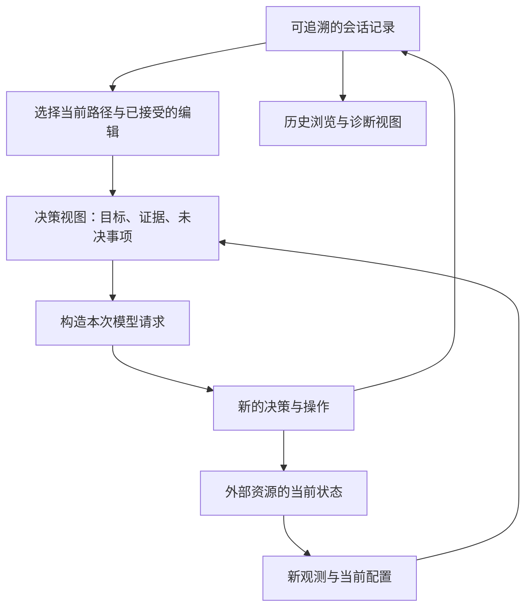
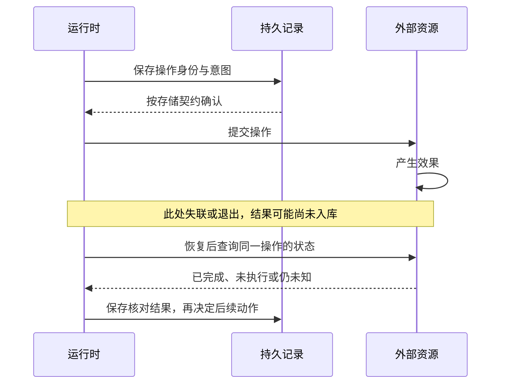
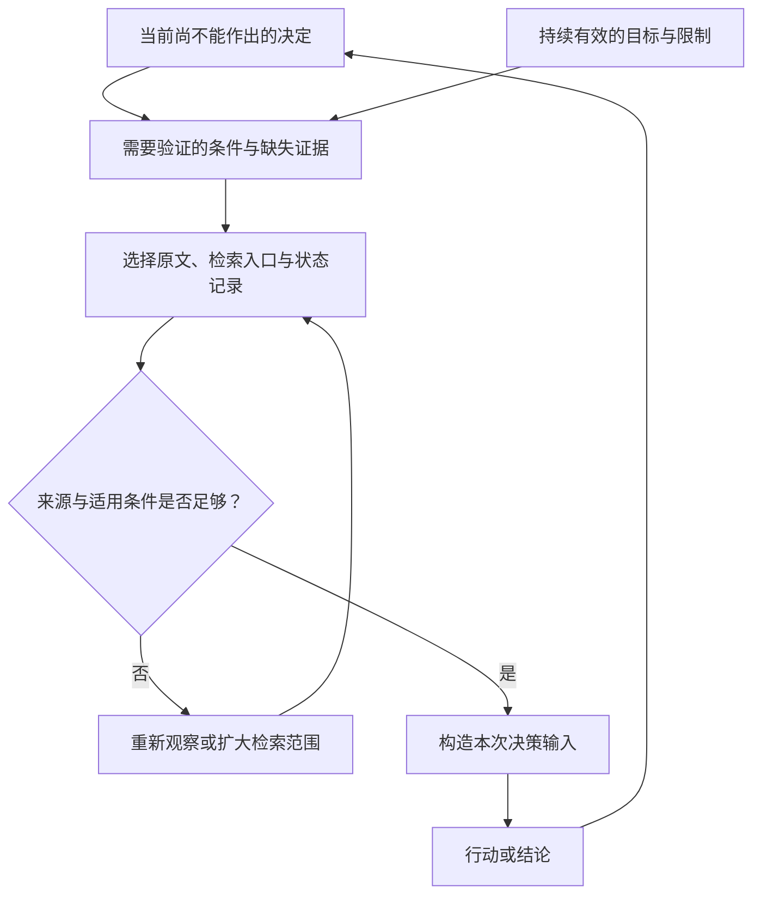
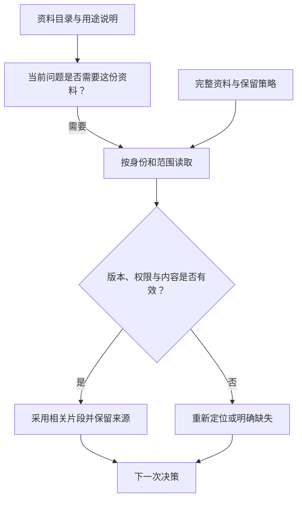
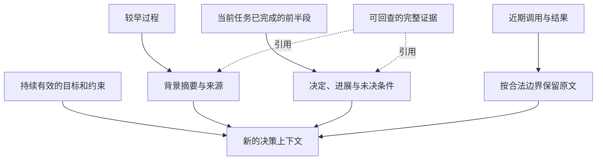
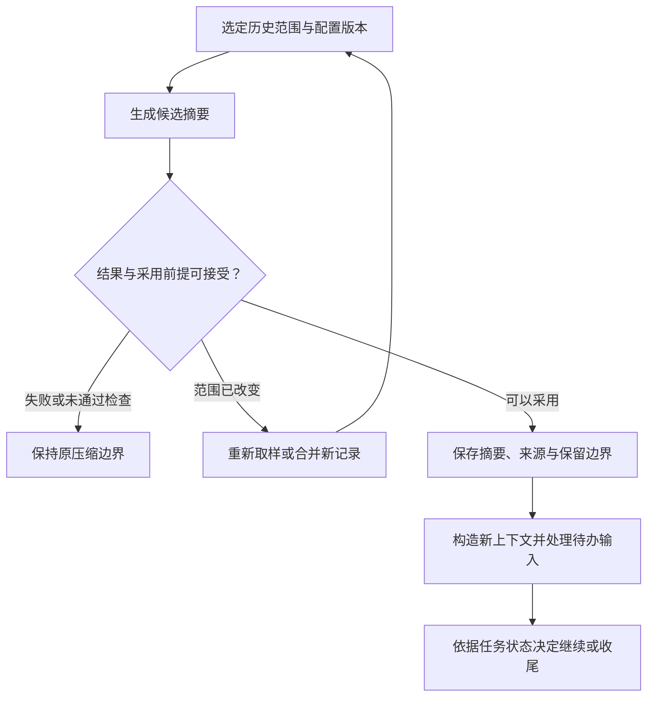

## 重启以后，从哪里继续

在[执行内核](/post/Pi执行内核/)中，我们让 Agent 读代码、做修改，再根据测试结果继续修复。现在把进程停在一个麻烦的地方：文件已经写好，工具结果还没来得及保存。重启后，对话记录的最后一条是修改请求，后面没有结果。再执行一次，可能重复修改。直接跳过，又不知道上次究竟做完没有。对话虽然找回来了，程序还缺少决定下一步的信息。

换一种场景也会遇到类似问题。用户回到修改之前的对话，要求试试另一种方案。对话回到了过去，文件却还保留着刚才的修改。如果 Agent 继续使用旧消息里的代码，就会改错地方。所以，恢复工作时要先问清楚：哪些信息可以从记录里找回，哪些需要重新读取当前环境？

本篇顺着这个问题，讨论如何保存会话、为下一轮选择上下文，以及在长任务中整理记忆。源码仍使用 Pi [v0.87.1](https://github.com/earendil-works/pi/releases/tag/v0.87.1)，提交为 `f07218c4d4bbc12bef056a7058c3dd49dfe41abe`，主要看 coding-agent 的会话实现。需要增加的恢复机制会结合具体场景说明。

### 聊天记录里缺了什么

先看看进程退出时，各项信息分别在哪里：

- 用户要求和工具结果在会话记录里，保存后可以重新加载
- 正在等待的 Promise 和调度位置在进程内存里，重启后需要重新安排
- 文件和远程构建任务在进程之外，原进程退出后它们仍可能继续变化

例如，历史里写着已经请求启动构建，并不足以让新进程继续等待。旧 Promise 已经消失了。要接上这项工作，需要保存远端任务 ID，再用它查询构建状态。如果连请求是否被受理都不知道，就先核对远端记录。恢复程序要补上的是这次确认，不能为了让对话完整就自行补一条成功结果。

| 希望恢复什么 | 需要保留什么 | 恢复后仍要确认什么 |
| --- | --- | --- |
| 继续理解任务 | 目标、限制、证据及其来源 | 哪些事实已经过时 |
| 从某一步继续调度 | 检查点、待办操作与控制位置 | 未完成操作的真实状态 |
| 查看另一条方案 | 分支关系与选择位置 | 当前工作区是否对应这条方案 |
| 重建当时的请求 | 所用材料、配置与变换版本 | 原始材料与旧转换规则是否仍可取得 |

需要保存到什么程度，要看恢复以后准备做什么。本地助手有用户在旁边，可以先重新读取文件，再根据当前内容继续。无人值守的远程执行器则需要自己核对已经提交的任务，找出哪些完成、哪些还在运行。后者除了会话记录，还要保存足够的调度信息和远程操作身份。

这里还要分清两种常被称为重放的操作。一种是读已有记录，重新算出当前状态，这个过程不再修改外部资源。另一种是从某个位置重新执行，模型和 API 都会被再次调用。LangGraph 的[检查点文档](https://docs.langchain.com/oss/python/langgraph/checkpointers#replay)就明确区分了检查点前已有的结果和检查点后重新执行的节点。恢复时如果走第二条路，就要为后面的外部操作处理重复执行问题。

如果目的是复查上次为什么做出那个决定，应当读取当时保存的输入输出。如果目的是换一种策略再试一次，则需要按新运行安排工作区和外部操作。界面上都可以叫 *重试*，实现里却要分清，否则既可能重复收费，也可能重复修改资源。

### 保存的内容与发送的内容

最简单的实现，是用同一个消息数组保存历史，再把它交给界面和模型。开始时这样做很方便，直到三处对内容的要求出现差别：

- 用户想查看完整日志，模型只需要诊断
- 旧失败方案需要留档，当前方案不应继续继承它
- 界面折叠一段内容，下次请求仍可能需要这段证据

要是分别维护三份数组，每次修改就得考虑如何同步。更容易管理的办法是保存一份正式记录，需要展示或发送时再从中选取内容。选出来的结果就是 ***派生视图***。下文也会把这个选择和转换过程称为投影，一个遍历记录的函数就能实现。

以发送模型请求为例，可以按下面的顺序构造：

1. 选择一条历史路径
2. 应用该路径上的内容选择
3. 补入当前决策需要的材料
4. 转换为目标协议

历史浏览器可以使用另一套选择规则，把失败尝试和原始日志也展示出来。于是，一条记录不再必须对应一条模型消息。配置条目可能只改变请求参数，摘要条目可能替换前面许多条消息。保存时保留细节，使用时再按用途组织。



注意图中没有把历史直接恢复成工作区。历史能告诉我们上次读到了什么，当前文件怎样，仍要重新确认。另外，选出的内容最好能回到原始记录。例如模型根据一条测试失败修改代码，排查时应该能找到这条失败属于哪次测试、测的是哪份代码。只保存一句测试失败，就丢掉了这些关系。

Pi 的会把原条目与它贡献的消息关联起来，再生成请求中的消息序列。这样，即使某段内容被摘要或替换，仍有记录身份可供追查。这里的条目 ID 用于定位历史，工具调用 ID 用于配对调用与结果。一条模型消息可以包含多个工具调用，因此这两种 ID 各有用途。

同一份历史经过不同选择规则，也会生成不同请求。升级程序后用新规则继续工作通常很自然，但如果要复查上次的请求，就还需要知道当时用了哪版规则。要求更精确时，可以直接保留最终请求。前一种方式节省存储，后一种方式更便于逐项核对，按排查需求选择即可。

### 切换方案时，什么跟着切换

假设用户提出任务 U，Agent 先试方案 A，失败后又从 U 出发试方案 B。写入文件的顺序是 U、A、A 的结果、B、B 的结果。但 B 接在 U 后面，不应该自动继承 A 的全部过程。如果只取文件最后几条消息，两种方案就会混到一起，模型可能把 A 的失败当成 B 已经做过的尝试。

Pi 用父指针把每条记录连到自己的前驱，再用当前叶子决定沿哪条路径读取，见。沿 B 的父链往回走，就能回到共同的 U，而不会经过 A。只需保存单一路径时，顺序日志已经够用。有了多方案比较的需求，这棵树才发挥作用。

同样，A 中对上下文的修改也应只影响 A。比如在 A 里把一段长日志换成简短诊断，如果直接改了两条分支共享的原始记录，B 也会跟着变。Pi 的选择追加一条编辑记录：重建 A 时应用它，读取 B 时则看不到它。原来的日志仍然保留。

下面直接切换两条分支，看看模型会收到什么。代码使用 Node.js 24.10.0 与 `pi-coding-agent@0.87.1`，会话保存在内存中，不写文件，也不请求模型。源码可以在结果面板中展开。


```javascript
import { SessionManager } from "@earendil-works/pi-coding-agent";

const session = SessionManager.inMemory();
const append = text => session.appendMessage({
  role: "user", content: text, timestamp: 0,
});
const view = () => session.buildSessionProjection().messages
  .map(message => message.content).join(" | ");

const root = append("original task");
append("try A");
session.appendContextEdit(root, { content: "task for A" });
const branchA = session.getLeafId();
console.log(`A: ${view()}`);

session.branch(root);
append("try B");
console.log(`B: ${view()}`);
console.log(`stored: ${session.getEntry(root).message.content}`);

session.branch(branchA);
console.log(`A again: ${view()}`);
```

```plaintext
A: task for A | try A
B: original task | try B
stored: original task
A again: task for A | try A
```


可以看到，A 的编辑改变了 A 的请求内容，B 仍然读到原始任务。再切回 A，编辑又生效了。两条分支共享原始记录，但各自决定怎样使用它。这也方便比较不同检索策略：原始材料相同，每条路径可以选择不同片段，并留下自己的选择过程。

<!-- TODO: 放在本段后。上半部分画共享任务 U 分出 A、B 两条历史路径，A 上的编辑记录用虚线指回 U，右侧分别画 A 采用替代内容、B 采用原始内容。下半部分只画一个当前工作区，A 的实际文件修改箭头指向它，B 指向它的箭头标“开始前重新读取”。不要给 B 画自动还原箭头。图注：分支可以隔离信息选择；共享工作区的效果需要另外管理。 -->

不过，对话分了支，文件并不会跟着复制。A 已经改过文件，开始 B 之前还得选择：

- 在当前文件上继续
- 恢复一个明确的工作区版本
- 使用独立工作区

如果只是继续调查，重新读取当前文件就可以。要公平比较两种修复方案，最好让它们从相同版本出发，并使用独立工作区。远程操作则要逐项考虑怎样处理已经发生的修改。这个决定需要宿主明确做出，不能让模型误以为对话回退以后，一切都回到了过去。

浏览历史也未必等于切换执行位置。Pi 的只改变管理器内存中的当前叶子，单独调用不会立即追加导航记录。单用户终端里，这个做法很轻便。如果改成多人共同查看，一个人翻阅旧对话就不应改变另一个人的执行起点。需要关闭后仍停在原位置时，再决定保存个人浏览位置，还是保存会话下一次从哪里继续。

### 什么时候算保存成功

选好记录格式，还要看写入发生在什么时候。一次输入通常会经过几个时刻：

1. 收到输入
2. 更新内存
3. 完成文件写入
4. 满足存储的持久性条件

如果产品约定，显示已受理以后，即便进程马上退出也能找回输入，那么显示确认之前就要完成相应的持久化。只更新内存或把文字画在屏幕上，重启以后仍可能丢失。

Pi 的常见新建持久会话路径会推迟创建文件，等第一条 assistant 消息出现，才把此前积累的条目一起写出，后面再追加，见。这样能减少还没开始响应就被放弃的会话文件。在这条路径第一次写出之前，刚提交的用户输入还只在内存里。

Pi 还会先更新内存中的条目和叶子，再写文件，见。如果写入失败，内存已经向前走了，磁盘却停在旧位置。此时恢复逻辑需要处理这段差异：暂停后续执行，再选择重试保存，或者重新加载已保存的状态。继续假定两边一致，就会让下一步依赖重启后找不回来的记录。

更严格的做法是保存完检查点再继续调度。这样恢复位置跟得更紧，但每一步都要等待存储。边执行边保存可以重叠这段等待，代价是崩溃时可能需要重做更多工作。LangGraph 的[持久性模式说明](https://docs.langchain.com/oss/python/langgraph/checkpointers#durability-modes)提供了这类选择。具体采用哪一种，应看允许重做多少工作，以及等待持久化会增加多少延迟。

读日志时也会遇到半条记录。若只是最后一行没写完，可以保留完整前缀，再处理末尾损坏。若中间少了一条，后面的父指针或工具结果可能就找不到对应项。Pi 的会尽力读取可解析的行。如果上层要据此继续执行，还应检查引用关系，明确哪些记录缺失。JSON 能解析，只说明格式可读，接下来还要确认内容能否接得上。

### 找不到结果，先查什么

现在回到开头：文件改完了，结果没保存。可以先把准备执行的操作记下来，再动手修改。这样恢复程序至少知道这里有一项操作需要核对。但记录意图之后也可能立刻崩溃，所以看到意图仍然不能判断修改有没有发生。只要日志和外部资源不能在同一事务里提交，中间就始终有一个需要核对的窗口。



图中给这类操作增加了稳定身份。恢复时先用它向远端查询，再决定继续等待还是补记结果。把 Pi 扩展成远程业务执行器时，可以在会话层之外增加这套处理。普通文件没有远程任务 ID，就要重新读取内容并检查版本。查询方式取决于资源，但顺序相同：先确认上次做到了哪里，再决定下一次做什么。

检查点应该放多细，也可以沿这条思路判断。如果把整次修复当作一步，恢复时就要检查内部到底执行到了哪里。把修改和测试分别保存，就能复用已经确认的结果，但要写更多记录。通常可以这样选择：

- 纯计算常常适合重算
- 昂贵模型请求值得保存结果
- 不可轻易重复的操作需要稳定身份与明确边界

不必给每个函数加检查点。找出重新执行代价高、或者重复执行会出问题的步骤，优先在那里留下可恢复记录。

如果允许新进程接管任务，还要防止旧进程恢复网络后继续工作。只改一条当前负责人记录，旧进程手中的请求仍可能被服务端接受。租约可以决定何时接管，提交时再检查执行代次，才能拒绝旧执行者的写入。下一篇会具体讨论这个问题。这里先记住：启动了新进程以后，还需要让资源识别哪些请求已经过期。

因此，恢复入口可以按下面的顺序工作：

1. 重建任务目标与已确认事实
2. 核对未决操作
3. 重新观察可能失效的环境
4. 决定下一步

无法确认的操作继续标为未决，必要时交给能核查的人处理。这样，新进程接手的是一项状态清楚的任务，而不仅是一屏重新加载的聊天记录。状态核对完以后，下一步又该把哪些历史交给模型？

## 下一轮该给模型看什么

假设文件已经重新读过，缺失结果也查清楚了，现在可以请求模型继续修复。历史里有十次成功构建的完整日志，但当前最有用的可能只有失败用例中的一个断言。任务开始时用户说过不能改接口，这句话虽然很早，却仍然约束接下来的每一次修改。选择上下文时，需要按当前问题重新组织这些信息。

因此，上下文并不是从历史末尾截一段文字。我们要让模型看见做下一步所需的信息，还要让它知道这些信息对应什么版本、哪些要求仍然有效。窗口再大，这项整理工作也有价值。

### 先看下一步卡在哪里

与其先问保留多少条消息，不如先问模型还缺什么，才知道下一步怎么做：

- 尚不知道失败发生在哪里，需要错误诊断和相关入口
- 已经有了候选修复，却不清楚是否改变接口，需要调用方与接口约定
- 修改完成、只缺验证，需要取得被测版本和检查结果

只保留最近几条，容易留下大量进度消息，却漏掉最初的限制。把所有旧内容都留着，又可能让模型继续参考早已改过的实现。一个实用分工是：程序固定保留目标和硬约束，检索再补充当前调查需要的材料。这样，每一轮都从仍然有效的任务要求出发。

具体保留多长，则看当前问题。定位错误需要完整函数，就保留完整函数。把它剪成几个短片段以后，模型反而可能看不出控制流。减少无关内容的同时，也要让留下的内容足够解释自己。



图中的循环表示：先看还缺什么，再取相应材料，直到能够决定下一步。常见任务可以直接由程序准备这些信息，不必每一步都另请模型做一次规划。只有遇到开放调查，再允许模型继续搜索。检索也有延迟和费用，为省一点上下文而反复查询，可能得不偿失。

信息放进请求以后，还要看模型能否用上。[Lost in the Middle](https://arxiv.org/abs/2307.03172)在多文档问答和键值检索任务中观察到，同一份相关信息放在不同位置，会影响模型表现。对我们这里的设计，这提供了一个具体的检查方向：长任务进行到后面，模型是否仍然遵守开头的约束？最终要用所选模型和实际任务检查，而不只是确认那句话还在请求里。

组织方式也能减少误用。例如把测试失败与被测版本放在一起，模型就容易看出这是修改前的失败。若版本号藏在几十条消息之前，就得让模型自己重新拼出关系。与其反复复制一句重要结论，不如把当前状态写清楚，并让相关细节可以按需查回。

### 结果要说明是怎么来的

例如工具读到了 `src/range.ts` 的一段代码。后面要靠它修改文件，至少还得知道：

- 来自哪个工作区？
- 覆盖哪些行？
- 对应什么版本？

有了这些信息，模型和程序才能判断这段代码是否仍适用。版本号回答文件有没有变，时间戳回答什么时候读过。已有可靠版本号时，应当用版本关联内容，时间则作为辅助信息。

同一份上下文里还会混合不同性质的说法。测试失败是一次实际结果，模型怀疑索引有误则只是猜测。若一律存进 `facts`，摘要时再去掉来源，下一轮就容易把猜测当作已经确认的结论。下表列出了几类信息各自需要保留的条件。

| 内容 | 在后续决策中的作用 | 应保留的条件 |
| --- | --- | --- |
| 用户要求保持接口 | 排除不允许的候选方案 | 要求来源与后续修订 |
| 某版本的失败断言 | 支持定位与验证 | 产物版本、检查范围和结果 |
| 模型推测原因在索引 | 指导下一项调查 | 尚未验证的状态与反例 |
| 搜索未发现调用位置 | 缩小调查范围 | 实际搜索路径、过滤和截断情况 |

最后一行很容易出错。搜索返回空数组，可能是代码里确实没有，也可能是忽略规则排除了文件，或者查的是另一个仓库。如果返回结果同时带上搜索范围，模型就知道下一步该扩大目录，还是可以排除这个方向。只写一句 *未找到*，丢掉的恰恰是继续调查需要的信息。

新操作还会让旧结果过时。编辑文件以后，之前通过的测试不能用来验收新代码。切换工作区以后，相同路径也可能指向另一份文件。可以让关键结果关联依赖的版本，版本变化后标记为待复核。旧结果仍留在历史里，用于解释之前的决定，但当前验收要使用新的结果。

来源还决定一段话应该怎样使用。网页或仓库文档即使用命令语气写作，读到它也不等于收到了用户指令。上下文中应保留来源，摘要时也不要把外部说法改写成应用自己的规则。至于实际能不能执行修改，仍由第一篇讨论的执行器检查权限。

长期记忆尤其需要这项区分。假设读到的文档说以后都应使用某个地址，系统不能据此改掉用户的长期偏好。如果允许模型更新记忆，就让它说明依据和适用范围，再按相应规则接受更新。否则一次读错的资料，可能影响之后许多无关任务。

### 提示词要跟上实际配置

模型要根据上下文选择动作，请求中的说明就应当与实际运行配置一致。

例如宿主已切成只读模式，提示词还说可以编辑，模型就可能不断提出无法执行的调用。反过来，权限已经恢复，旧提示词仍要求停下，也会让任务无谓等待。最好从当前配置同时生成工具声明和相关说明，执行前再检查实际权限。这样配置只有一个来源，减少多份文字互相矛盾。

Pi 按章节组织提示词，并依据工具配置生成相应说明，见。这种写法方便单独更新某一部分，也便于追查某条说明从哪里来。自然语言负责让模型理解当前配置，执行器继续负责权限和预算等检查。

如果只关心下一轮，保留当前配置就够了。要解释之前某轮为什么没使用某个工具，就需要知道那时给模型看了什么。Pi 会把提示词章节和工具变化写进内部对话记录（transcript），并在准备请求时同步工具声明，见。恢复后可以重建当时的声明，工具实现则由宿主重新装配。

每次保存完整配置，恢复最直接，但重复内容多。只保存变化，记录更小，恢复时却得从起点依次应用。可以定期存一份完整配置，再接后面的变化。到了发送请求时，目标协议又可能要求合并这些历史。例如只接受前置 system 的协议，就需要得到当前生效的状态，见 Pi 的。内部记录服务于恢复，最终表示服务于模型接口，两者可以不同。

用户中途修改要求也一样。假设先说保持旧接口，后来允许新增参数，记录里应说明哪条要求被替代，哪些仍然有效。否则两段话并列出现，模型就得猜该遵守哪段。新要求如果影响已经完成的修改，再单独安排复查。更新下一轮的提示词，不会自动修好之前写下的代码。

任务进度也要依据结果更新。计划写着准备测试，只说明下一步安排。拿到测试结果以后，才能记为通过或失败。小型助手用几项字段即可，大型系统可以放进任务存储，但两者都需要把进度与结果关联起来。换成 JSON 格式，并不会自动补上这次确认。

### 大材料留在外面

大材料不必每轮完整塞进请求，可以按使用频率安排：

- 稳定且每轮相关的限制适合预装
- 体积大、只在某些步骤有用的资料，可以先给目录和位置
- 变化快的状态应在需要时查询

Anthropic 的[上下文工程文章](https://www.anthropic.com/engineering/effective-context-engineering-for-ai-agents)讨论了先保留轻量引用、需要时再加载正文的做法。要让它有效，需要同时解决两件事：模型知道材料存在，需要时也确实读得到。

只有路径，模型未必知道里面有什么。只有概括，没有位置，又无法核对细节。Pi 的技能目录同时提供名称、描述和路径，使用时再读取正文，见。加载器为了生成目录可能已经读过文件，但交给模型的仍只是目录。这样可以先帮助模型找到相关技能，再支付加载全文的成本。

引用还要经得起恢复。摘要里记录了临时文件路径，第二天文件却被清理了，就无法沿这个入口找回证据。需要跨天继续的任务，应把日志放在稳定位置。要求复查当时原文时，还要保存对应版本，避免同一路径下的内容已经换掉。



查找材料时，也可以按内容选方法。描述性的问法适合语义检索，精确的函数名和错误码则适合直接匹配。找到以后仍要回到原文核对。比如检索返回同名函数的旧文档，下一步应读当前实现，确认它是否仍然适用，而不是继续堆积更多相似片段。

拿到搜索片段以后，还要看它有没有被切在尴尬的位置：

- 只取抛异常的一行，可能漏掉外层捕获
- 只取一项配置值，可能漏掉继承关系
- 只取结论，可能漏掉前提

因此，短片段后面最好留一个继续阅读的入口。模型看到异常抛出，可以扩大到完整函数，必要时继续查看调用方的捕获处理。这样初次返回不必很长，也不会把调查限制在一个失去上下文的片段里。

配套材料也要一起找。例如测试通过需要关联被测修改，独立给每个片段打分，可能只留下其中一半。可以依据来源补齐这组材料，再判断整组是否值得放进请求。这样模型看到的是一个能解释的结果，而不只是一句通过。

<!-- TODO: 放在本段后。左侧画大资料库，内含完整文件、版本化日志和规则文档；中间画带用途和身份的索引卡；右侧画本次模型窗口，只有当前目标、必要约束、选中片段和未决问题。用一条回查箭头从窗口指回索引，再到原文；把“片段来源”和“内容版本”写在同一张卡上。下方画一张已经失效的临时路径卡，箭头断开，标注“有引用但无法取回”。图注：外置材料只有在可发现、可读取且可核对时，才能成为可用记忆。 -->

实际使用时，预装和按需读取可以结合。用户的硬约束每轮都要遵守，就由程序固定放入。专业资料等需要时再查，变化中的文件则重新读取。随着任务推进，再看哪些遗漏反复出现，调整默认加载的范围。这样比一开始就试图给所有信息排出永久的重要性顺序更容易落地。

### 看一眼真正发出的请求

Mario Zechner 在[2025 年的 Pi 设计文章](https://mariozechner.at/posts/2025-11-30-pi-coding-agent/)中强调，希望能检查模型交互与上下文。排查 Agent 时，这一点非常有用。模型忽略了一条诊断，先别急着改提示词，先确认它这次究竟有没有收到那条诊断。

从保存记录到发出请求，中间的每一步都可能改变内容：

- 历史选择删掉了调用，却留下结果
- 摘要把不确定推测改成事实
- 协议适配不支持某种内容，将其省略

因此，调试入口最好能展示最终请求，并沿着来源找到内容在哪一步被改动。只看历史窗口，很难发现这些问题。

保留每一步输入与输出的对应关系，就能缩小排查范围。材料最初没取到，和取到后被删掉，需要修改的地方完全不同。

Pi 里有一个很具体的例子：某些 custom 消息可以不在界面显示，却仍然会转换成模型消息。反过来，用于显示的附加信息也未必发送给模型，见。所以，应分别检查：

- 用户看到了什么？
- 历史保存了什么？
- 模型收到了什么？

界面截图能回答第一个问题，最终请求才能回答第三个问题。

临时选择和长期修改也应分开。只给这一轮补一段搜索结果，可以在请求副本上处理。决定以后都用诊断摘要替换完整日志，则需要保存这次选择。尤其要注意共享对象：插件如果直接修改传入的历史对象，原本只打算本轮裁剪的内容，可能就这样影响了后续请求。

即将发送时，还可以做一轮程序检查：

- 调用与结果是否配对
- 当前声明与可执行工具是否一致
- 必需的目标状态是否存在
- 最终表示的体积是否符合限制

需要复查时，再保存所用材料与变换版本。如果要逐字确认模型当时看见了什么，就需要保留完整请求或可重建的原文。只存哈希能判断输入有没有变化，却还原不了已经丢失的内容。

格式检查通过以后，再用实际任务检查上下文是否起作用。例如中途修改接口约束，观察模型下一轮是否停止采用旧方案。如果请求变短了，却让模型反复忘记要求，就需要重新调整选择规则。

到这里，一次请求该怎样组织已经清楚了。但随着修复继续，连有用的信息也会越来越多。下一章要解决的是：历史放不下时，怎样少带一些内容，仍然把工作接下去。

## 历史太长了，怎样接着做

假设任务已经进行了几十轮。早先读过的代码如今已经改掉，第一次提出的接口限制却依然有效。某个失败方案没必要全文保留，但失败原因还得记住，免得下一轮又试一次。这时只保留最新消息会忘记旧约束，只保留成功结果又会丢掉排除过的方向。

固定大小的窗口装不下不断增长的历史，因此要给不同信息安排不同去处：

- 用摘要解释之前为什么这样做
- 用独立状态记录保存需要准确保留的值
- 把大日志放在外部，需要时再读取

下面分别看这些做法什么时候有用，以及它们怎样配合。

### 什么时候开始整理

首先，模型的容量上限不应直接当作整理触发点。上下文已经满了，再请求模型读取全部历史并生成摘要，摘要请求本身也可能放不下。应用需要提前预留空间，既容纳后续工具输出，也容纳整理历史所需的输入和生成。

预算应按整份请求计算。任务要求和当前工具声明都有固定开销，近期日志则会不断增长。需要缩减时，先移出重复日志，保留未决操作的身份。用户刚提交、尚未处理的新要求，也不能因为靠近尾部就被概括成过去已经讨论完的内容。

具体怎么算，要服从所用模型的接口。有些限制同时覆盖输入与输出，有些分别给出上限，多模态内容和协议包装也会计入用量。运行时可以先估算，提前决定是否整理，再在实际发送前检查最终请求。

Pi 会参考此前有效响应中的 usage，再估算之后新增的内容。但如果那份 usage 来自最近一次上下文编辑或压缩之前，就重新估算当前内容，见。原因很直接：历史已经变了，旧长度测量的就是另一份输入。用现成统计之前，要先确认它对应的内容还没被改写。

压缩本身也需要时间和费用。太晚整理，可能已经装不下。太早整理，又会频繁重写摘要。可以设置两个水位：到上限附近开始整理，整理后降到明显更低的位置，留出一段继续工作的空间。在一次调查结束时整理也很自然，因为此时更容易概括已完成的过程，但仍需要水位作为兜底。

单次大输出最好在工具层就处理。如果先把几万行日志放进历史，再请求模型缩短，可能已经超过容量。工具可以先返回关键诊断和完整日志位置。判断这种设计是否划算时，还要一起计算：

- 压缩调用
- 后续检索
- 重复工作
- 失败恢复

少发送一些 token，如果换来反复重查或错误修改，总费用反而会上升。

### 什么不能只靠摘要记住

摘要很适合解释我们为什么从索引计算转去检查输入规范化。但远程任务 ID 这样的值，需要一字不差地保留。假如它只出现在摘要里，下次改写漏掉几个字符，就无法查询任务了。接口限制也类似：摘要稍微换一种说法，就可能扩大原本允许的修改范围。

这些精确状态可以先放在一份任务文件里。恢复时知道去哪里读取，并让每项状态关联更新依据。例如记为测试通过之前，要能找到对应的测试结果。下面按信息的用途比较几种保存方式。

| 信息 | 更合适的保留方式 | 缺失后会影响什么 |
| --- | --- | --- |
| 不得改变公开接口 | 原始要求及当前有效版本 | 候选方案是否允许 |
| 为什么放弃方案 A | 简短理由与对应证据入口 | 是否重复已经排除的路径 |
| 构建仍在运行 | 任务身份与已确认状态 | 查询、取消与重复提交判断 |
| 完整测试日志 | 稳定位置、版本和关键诊断 | 后续核查与更深定位 |
| 当前修改通过哪些检查 | 检查范围与产物关联 | 是否具有交付依据 |

Pi 压缩时会从工具调用参数中提取文件路径，见。这些路径方便模型回头查文件，但提取过程没有逐项核对调用是否成功，也无法完整识别 shell 改过哪些文件。因此，这份列表适合作为回查入口。要展示真实修改范围，还应检查工作区差异。数据放进了结构化字段以后，仍然要按它的产生方式解释。

摘要里几个字的变化，也可能改变接下来的行为。原文是尚未验证并发情况，摘要变成已验证边界情况，模型就可能跳过必要测试。保存失败原因时也应带上关键条件。例如方案 A 在依赖 v1 下失败，升级到 v2 后仍值得重新评估。只写方案 A 不可行，就把一次结果变成了长期限制。

反复摘要会让早期遗漏越来越难找回。如果每轮只读上一份摘要，第一次漏掉的要求，后面也没有机会重新出现。可以让硬约束始终从独立来源加载，摘要则留下原始证据的入口。遇到矛盾或需要做重要决定时，再回查原文。这样摘要帮助模型快速接上思路，精确内容仍有地方可查。

<!-- TODO: 放在本段后。左侧画三次递进的摘要 S1、S2、S3，用细箭头串联，画一条在 S1 就消失的约束线，后续不要凭空恢复。下方画独立的“当前任务契约”和“原始证据库”，分别向每次构造新上下文的节点提供粗箭头。标注摘要负责过程解释，契约保留精确约束，原始证据可回查。图注：逐次概括无法自行找回早期遗漏，关键事实需要独立来源。 -->

记忆还要有适用范围，不能所有内容都永久影响后续任务：

- 临时假设保留在当前任务内
- 用户偏好跨任务复用
- 工作区路径绑定具体项目
- 远程任务身份保留到结果与后续操作处理完毕

如果全部塞进一个不断增长的文件，下次读取时又会遇到同样的筛选问题。记录适用于哪个任务、何时需要更新，比单纯把更多文字保存下来更有用。

### 从哪里切开历史

压缩时通常会保留近期原文，让正在做的修改继续拥有完整细节。切点却不能只按字符数决定，要看哪些内容需要放在一起才能读懂。

最容易看到的是工具调用与结果。只留下结果，模型不知道它回答的是哪组参数。只留下调用，丢掉已经成功的结果，又可能让模型重新执行。还需要直接使用的一组调用与结果，就一起保留。已经结束的过程可以整体概括，并注明结果与来源。

Pi 的会寻找允许的消息边界，避免从 toolResult 直接开始保留。这样做以后，保留量就只能是目标值：最近一组调用很大时，完整保留它可能超过目标。还想进一步缩减，就要整理组内内容，或者把整组换成摘要，而不能只移动切点。

调用配对完整以后，还要让模型知道为什么会走到这里。Pi 会分别准备较早的历史和当前任务前半段，再接上近期原文，见。前面的摘要解释背景，近期原文保留正在使用的细节。应用还可以像下图这样，从独立记录加载持续有效的目标和约束。



沿图读下来，目标告诉模型要完成什么，摘要解释已经做过什么，近期原文提供当前操作的细节。合并时应去掉重复转述。比如同一次失败已经全文保留，就没必要在多份摘要中反复强调。如果出现不同版本的结论，则说明当前采用哪一个。

还有些记录虽然不产生模型文本，却会影响程序怎样继续。例如一条省略记录可能说明，刚才的失败请求不应再进入下一轮。若只按可见文字寻找尾部，就可能误判哪些输入已经处理。Pi 为恢复尝试及其省略记录做了专门处理，见。压缩时因此需要同时读取执行状态，不能只看拼出来的文本长度。

如果扩展或导入过程已经破坏了调用关系，应在这些入口先校验。选择一个合法切点，只能避免继续切坏现有结构，无法补回此前被删掉的调用。

### 摘要模型究竟看到了什么

摘要漏掉错误原因时，我们容易先怀疑模型没总结好。但信息可能在请求模型之前就丢了：工具先截一次输出，选择历史时又删掉一部分，构造摘要输入时再限一次长度。最后交到模型手中的，已经没有那条诊断。

Pi 的摘要输入序列化会限制单条工具结果的文字长度，见。下面把失败标记放在会被裁掉的位置，检查最终送入摘要的文本。代码使用 Node.js 24.10.0 与 `pi-coding-agent@0.87.1`，不请求模型。


```javascript
import { serializeConversation } from "@earendil-works/pi-coding-agent";

const output = "x".repeat(2100) + "FAIL: off-by-one";
const message = {
  role: "toolResult", toolCallId: "test-1", toolName: "bash",
  content: [{ type: "text", text: output }], isError: true, timestamp: 0,
};
const text = serializeConversation([message]);
console.log(`before=${output.includes("FAIL:")}`);
console.log(`after=${text.includes("FAIL:")}`);
console.log(text.split("\n").at(-1));
```

```plaintext
before=true
after=false
[... 116 more characters truncated]
```


输出显示，原始结果中有失败标记，摘要输入里却没有。此时改总结提示词帮不上忙，得在前面的处理里把诊断留下来：

- 工具返回时，提供短而明确的状态
- 选取阶段，提取相关片段
- 摘要和后续决策中，提供回查入口

排查这类问题时，可以沿同一条诊断逐步查看：它在工具输出中还存在，到了选出的历史中是否还在？如果还在，再检查摘要模型实际收到的文本。找到从哪一步消失，才能改对地方。多层裁剪会累积，最后一层看到的已经不再是原始材料。

有些问题可以直接用程序检查，例如：

- 来源身份丢失
- 调用配对破坏
- 精确值被改写
- 检索入口失效

还有些问题要看内容。用户仍要求保持接口，摘要有没有保留？一次推测是否被改成了确定结论？更进一步，可以直接从压缩后的状态继续完成任务，观察模型是否忘记限制，或者重复已经完成的操作。这样才能判断摘要是否真的足够接着工作。

比较时，不必要求两次运行输出相同文字，或者走相同路径。精确值直接检查是否保留，任务效果则通过多次运行比较，并记录重复工作带来的成本。这样能看出信息在哪里丢失，以及它是否影响最终结果。

### 什么时候换上新摘要

生成摘要也会超时或失败。因此要先保留旧上下文，得到可用的新摘要后再切换。如果反过来先丢掉历史，再等待模型总结，一次中断就会让任务无法继续。完整顺序可以是：

1. 固定输入范围
2. 生成候选
3. 检查可接受性
4. 以明确记录切换未来请求的视图

候选结果先留在临时状态中。检查通过以后，再记录从哪个位置开始采用新摘要。

Pi 会在摘要生成后检查取消，再追加压缩条目并刷新上下文，见。这条记录还保存当前 system 状态与保留位置，见。保存成功以后，重启就能按记录重建新上下文，不必再请模型总结一次。

Pi 已经会拒绝部分失败结束和包含工具调用的摘要。若应用还要求保留指定事实，或者要求摘要必须缩到某个长度，就需要增加对应检查。尤其是 Pi 的摘要后长度估计发生在追加之后，不能直接用它实现采用前的长度验收。



如果摘要生成期间任务还在继续，情况会更复杂。候选摘要必须记住自己总结到了哪里，期间新增的消息应接在它后面。如果用户又切换了分支，或者改了摘要范围内的历史，还要确认候选是否适用。图中增加了这次版本确认。更简单的实现是整理期间暂停任务，只把新输入放进队列，以等待时间换取更容易管理的状态。

恢复时则以实际保存的记录为准。生成失败，继续使用旧上下文。新摘要已经保存，只是通知失败，就使用新摘要，再补发通知。Pi 在处理上下文溢出时，还可能先保存一条省略失败尝试的记录，再压缩，见。重启后应把这些已保存的变更一并应用。

压缩完成以后是否继续请求模型，要看当前任务：

- 任务已经结束，整理历史只是为未来交互准备
- 失败请求需要恢复，依据新上下文重试
- 用户已经取消，保留状态并收尾

用户在整理期间提交的新输入，也要按队列顺序处理。整理只是腾出空间，接下来做什么仍由任务状态决定。

回到代码修复，整理以后，模型应当还能看到当前修改以及对应的检查结果，并继续遵守接口要求。需要追查失败原因时，也能沿日志位置找回原文。它可以忘掉中间搜过多少次，却不能丢掉继续修复所需的这些关系。

下一篇继续看程序怎样接收中途干预。用户补充要求以后，运行中的任务需要在合适的位置采用它。取消和扩展也会改变后续行为，它们又该在哪一步介入？
