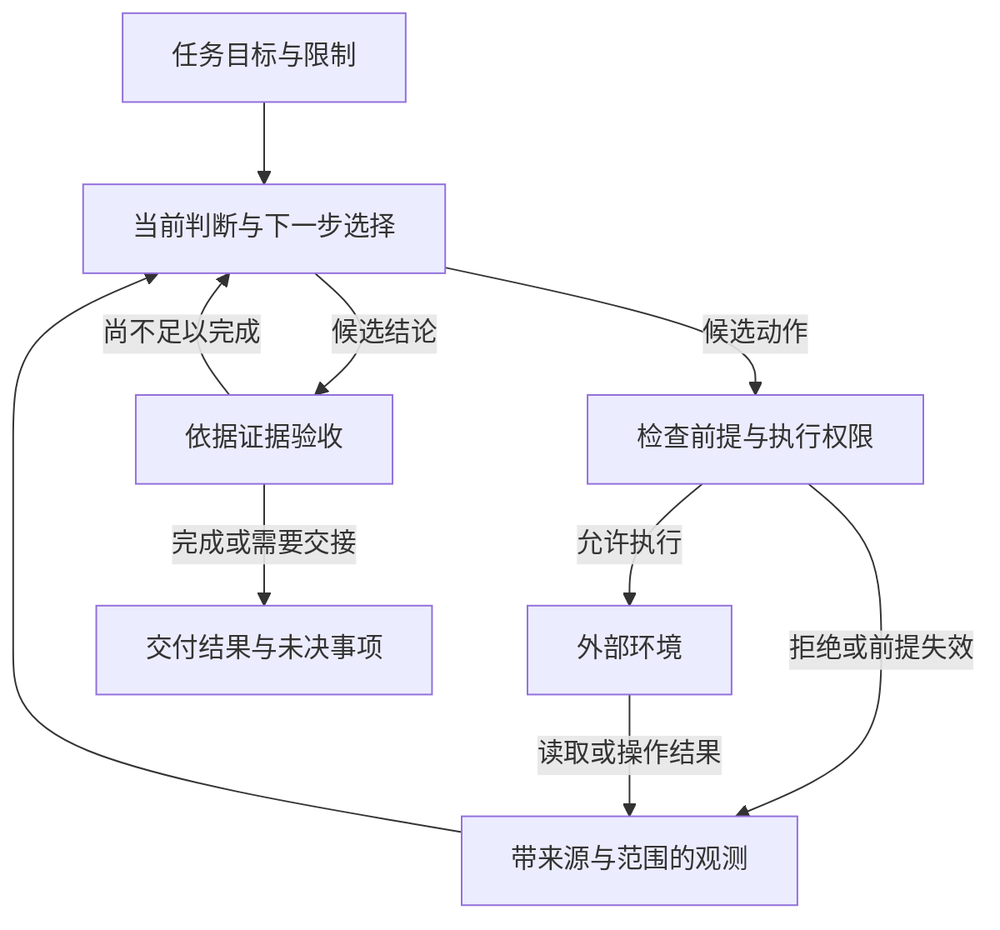
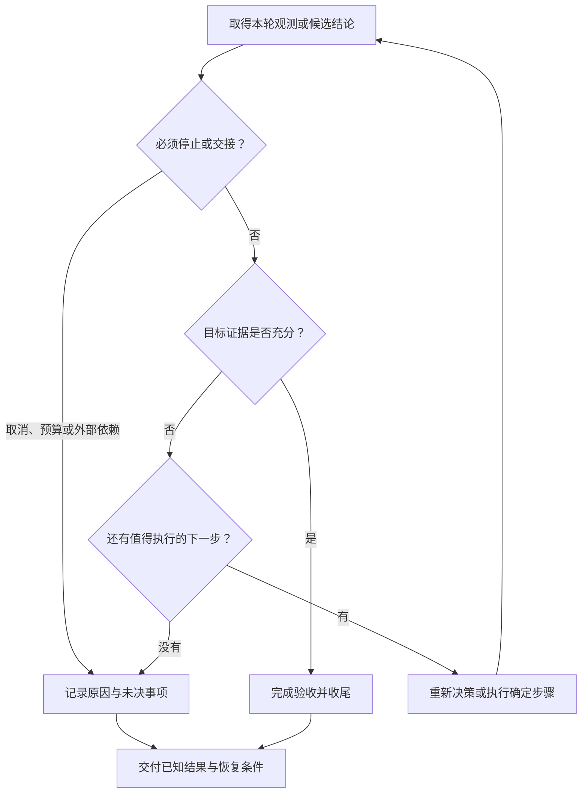
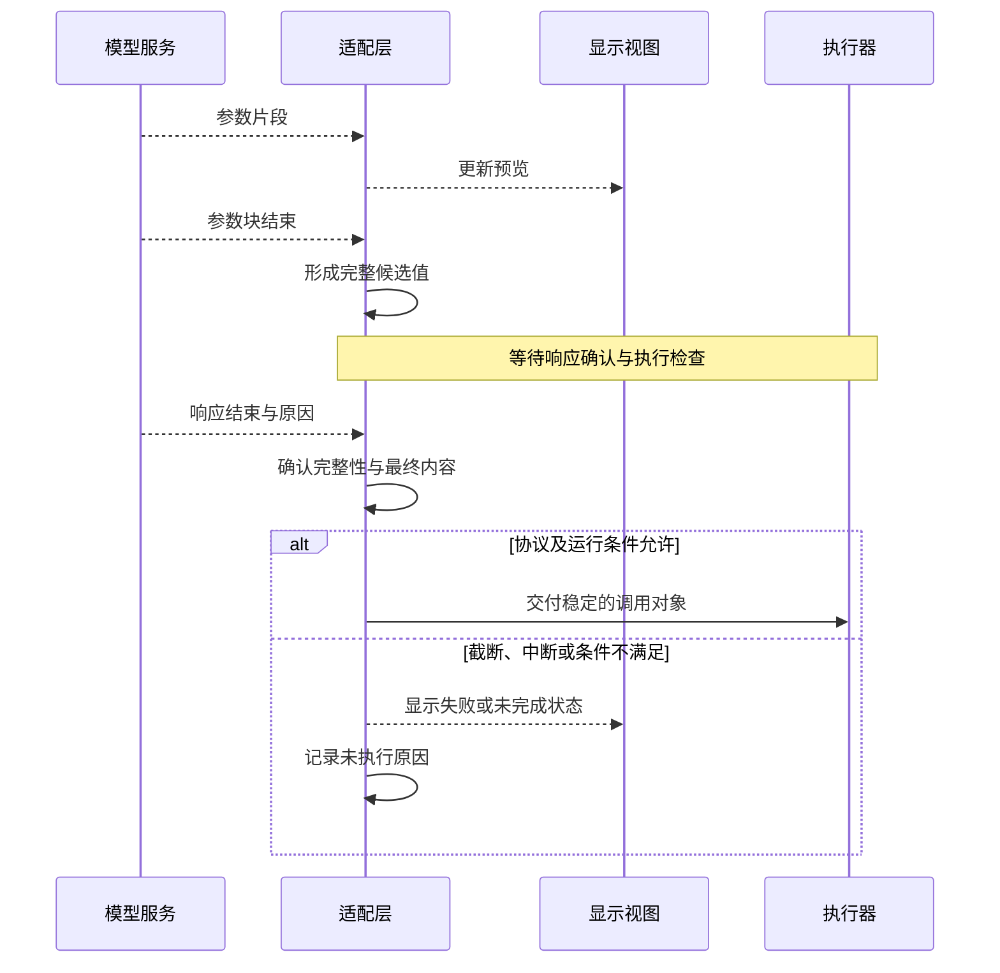
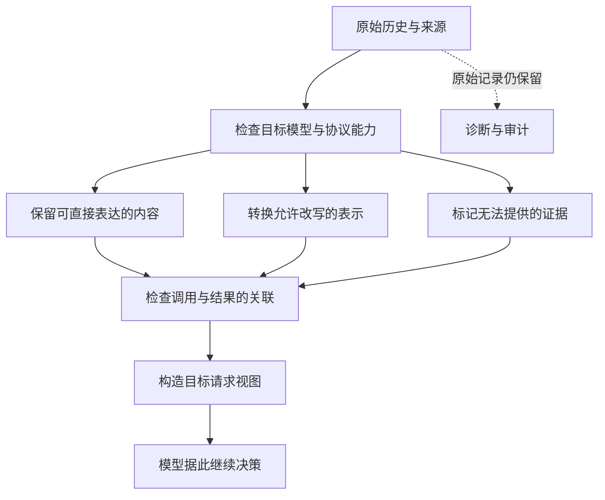
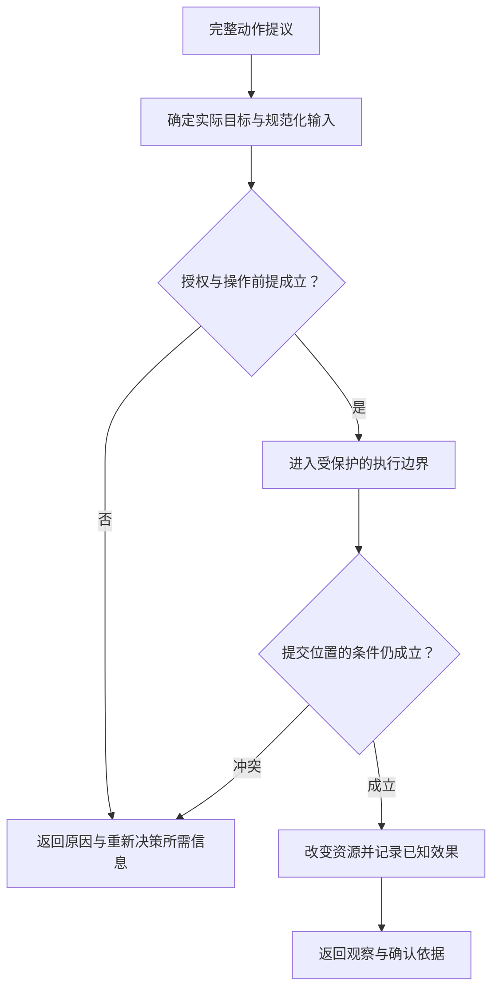
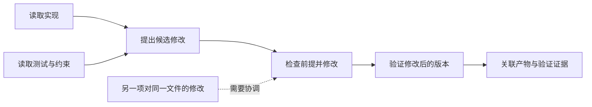

假设我们要让 Agent 修复一个 bug：函数收到空数组时会崩溃。最简单的实现只需要一个循环，调用模型，执行它请求的工具，再把结果传回去。但真让它修改代码，很快就会碰到几个问题：

- 模型凭什么认为某处需要修改？
- 文件在读取之后被别人改过怎么办？
- 测试通过的是哪一版代码？
- 模型宣布完成以后，程序是否还有理由继续？

这些问题会直接影响程序怎么写。比如，模型读完文件后，文件又被别人改了，编辑工具就需要检查原来的修改还能不能应用。测试虽然通过了，但如果模型随后又改了代码，我们就得重新验证。

本文以代码修复为主线，结合 Pi Agent [v0.87.1](https://github.com/earendil-works/pi/releases/tag/v0.87.1) 的实现，讨论一个 Agent 从提出动作到完成任务需要处理哪些问题。遇到文件操作无法说明的情况，再用远程服务作对照。

## 怎样让模型把任务做完

Pi 作者 Mario Zechner 在[设计回顾](https://mariozechner.at/posts/2025-11-30-pi-coding-agent/)中谈到，他希望自己能看清模型收到的上下文，也能控制 Agent 的工作方式。因此，Pi 保留了一个较小的核心，把具体工具和界面放在外围。这个选择适合拿来研究 Agent 设计：我们可以先看清最基本的循环，再讨论任务复杂以后，哪些能力应该加在什么地方。

### 怎样才算修好了

让 Agent 修复空数组崩溃，怎样才算修好了？至少不能只看它最后是否回答了 *已经修复*。新代码要能处理空数组，也要保留正常输入的行为。我们得先把完成条件写清楚，程序才知道什么时候继续检查，什么时候交付结果。

例如，可以给这个任务定下三项要求：

- 允许修改实现和测试，公开接口保持不变
- 原先失败的边界用例与相关回归用例都需要通过
- 最终说明应交代修改及其验证情况，保留尚未确认的事项

测试退出码和改动文件范围都容易检查，难的是判断测试是否覆盖了原来的问题。模型可能改出一段能通过现有测试的代码，却漏掉真正的失败用例。因此，提示词里写下要求只是开始，结束前还得逐项核对结果。

还要留意测试是在什么时候通过的。模型做完修改 A，测试通过，随后又做了修改 B，那么先前的结果就只能说明 A 通过了测试。对本地编码助手，最直接的做法是在最后一次修改后重新测试。任务规模大了，则应把测试记录和被测版本关联起来，避免把旧结果当成新代码的验收依据。

任务状态也应反映这个过程。例如修改已经写好，但测试还没跑，程序就应记为待验证。不能因为模型在总结里说完成，就把 `done` 改成 `true`。等拿到对应版本的检查结果，再决定是交付还是继续修复。

Anthropic 的 [Agent 评估文章](https://www.anthropic.com/engineering/demystifying-evals-for-ai-agents)也把运行轨迹和最终结果分开看。放到这里，调用过测试工具是一条运行记录，指定版本通过了测试才是一项验收结果。保存前者方便排查过程，判断任务是否完成则需要后者。

### 下一步跟着结果走

明确了完成条件，还要决定哪些步骤需要模型参与。如果输入和处理规则都已确定，普通工作流就能完成任务，没有必要每一步都让模型重新规划。比如按固定规则替换文件内容，再运行已知的校验命令，程序可以直接控制顺序。模型只负责其中难以写成规则的判断。

修复 bug 通常没这么确定。读到实现之前，我们不知道错误出在哪里，第一次测试的报错也可能推翻原来的猜测。这时就需要根据工具返回的信息重新决定下一步。[ReAct](https://arxiv.org/abs/2210.03629)研究的正是这种把推理与动作交错起来的方法：模型先提出动作，再用外部反馈修正判断。

不过，工具调用带来的变化并不相同。读取文件让模型多知道一些信息，编辑文件则会改变它正在处理的对象。文件一旦改过，之前记住的行号和测试结果就可能过时。设计循环时，需要把这种变化带回下一次决策，而不是只把工具输出追加到聊天记录末尾。



图中把模型的判断和外部环境画成两个节点，是为了保留这层区别：模型看到的是工具返回的片段，文件本身还在工作区里。模型据此选择下一步，执行器检查能否操作，再把结果送回来。

计划也应随着反馈改变。一个修复计划最初可以很简单：

1. 复现失败用例
2. 检查相关实现
3. 修改代码并运行回归检查

如果第一步根本复现不了问题，就该先检查环境，而不是照着计划往下改代码。对这种需要边查边做的任务，计划应先确定眼下能做的一步，后面的安排留待新结果确认。已经确定的操作则可以交给程序连续完成，省去无用的模型往返。

一次做多少事，决定了多久能得到下一次反馈。每读一行代码就问一次模型，调用成本太高。一次生成十条修改命令并全部执行，又可能让后九条建立在已经失效的判断上。比较合适的办法是合并独立读取，在相互依赖的修改之间留下检查结果的机会。

Anthropic 在 [Building effective agents](https://www.anthropic.com/engineering/building-effective-agents)中区分了固定工作流和由模型动态选择步骤的 Agent。实际系统可以同时使用两种方式：调查 bug 时让模型自由搜索，修改前由程序检查权限，结束前执行固定的验收流程。把控制权分配到具体阶段，比要求模型包办整个任务更容易管理。

程序还需要识别原地打转。模型反复搜索同一段代码，却没有得到新信息，就该换个方向。修改之后再次运行同一个测试，则是必要验证。区分两者要看文件版本和结果有没有变化，不能只比较调用文本是否重复。

### 模型提出修改以后

模型决定编辑文件后，需要把决定交给真正持有文件访问权限的程序。我们把这部分程序称为执行器。它接收工具名称和参数，先检查这次调用能否执行，再操作资源。模型负责选择，执行器负责把检查落实到操作上。

动作描述至少要经过三类检查：

1. 参数完整吗：模型是否已经生成完调用，参数能否按工具接口解释
2. 修改还能应用吗：例如要替换的原文是否仍在文件中
3. 这次允许运行吗：当前是否有权限，预算是否足够

检查失败后，执行器应把具体原因返回给模型。参数格式有误和文件已经变化，需要采取不同的修正办法。

其中，参数是否生成完整很容易被忽略。流式响应只收到一半时，容错解析器也可能解析出一个对象。因此，执行器需要明确的 ***执行时机***，不能看到对象就立即调用工具。下一章会结合流式协议展开这个问题。

Pi 的做法是等待整条响应结束。如果模型因为达到输出长度上限而停止，就把其中的工具调用标记为未执行，并返回错误结果。决定这一行为的分支如下，错误与取消另有处理路径：



```typescript
const executedToolBatch =
  message.stopReason === "length"
    ? await failToolCallsFromTruncatedMessage(toolCalls, emit)
    : await executeToolCalls(currentContext, message, config, signal, emit);
```

这样处理之后，截断响应里即使有能解析的参数，也不会触发工具。代价是工具要等整条响应结束，好处是失败时容易判断是否执行过操作。

下面保持工具和参数相同，只改变响应的结束原因。运行环境为 Node.js 24.10.0，使用 Pi 0.87.1 和 TypeBox 1.3.27。模型响应由本地代码固定生成，源码可以在面板中展开。


```javascript
import { Agent } from "@earendil-works/pi-agent-core";
import { AssistantMessageEventStream } from "@earendil-works/pi-ai";
import { Type } from "typebox";

const cost = { input: 0, output: 0, cacheRead: 0, cacheWrite: 0 };
const model = {
  id: "fixed", name: "Fixed", api: "openai-responses", provider: "openai",
  baseUrl: "https://example.invalid", reasoning: false, input: ["text"],
  cost, contextWindow: 8192, maxTokens: 2048,
};
function response(content, stopReason) {
  return {
    role: "assistant", content, stopReason, timestamp: 0,
    api: model.api, provider: model.provider, model: model.id,
    usage: { ...cost, totalTokens: 0, cost: { ...cost, total: 0 } },
  };
}
for (const reason of ["toolUse", "length"]) {
  let requests = 0, executions = 0;
  const agent = new Agent({
    initialState: {
      model, systemPrompt: "Read the example.",
      tools: [{
        name: "read_example", label: "Read example", description: "Read a fixed value.",
        parameters: Type.Object({ path: Type.String() }),
        async execute() {
          executions++;
          return { content: [{ type: "text", text: "limit = 3" }], details: {} };
        },
      }],
    },
    streamFn() {
      const first = ++requests === 1;
      const message = response(first
        ? [{ type: "toolCall", id: "call_1", name: "read_example",
             arguments: { path: "src/range.ts" } }]
        : [{ type: "text", text: "Finished." }], first ? reason : "stop");
      const stream = new AssistantMessageEventStream();
      stream.push({ type: "start", partial: response([], "pending") });
      stream.push({ type: "done", reason: message.stopReason, message });
      stream.end();
      return stream;
    },
  });
  await agent.prompt("Read src/range.ts.");
  const result = agent.state.messages.find(m => m.role === "toolResult");
  console.log(`${reason}: requests=${requests}, executions=${executions}, isError=${result.isError}`);
}
```

```plaintext
toolUse: requests=2, executions=1, isError=false
length: requests=2, executions=0, isError=true
```


两种情况都会产生工具结果，并再次请求模型，但截断的那次没有执行工具。这里的错误结果是在告诉模型为什么没执行，而不是报告一次失败的文件操作。后续若要自动重试，就得保留这个区别。

结果还得和原来的调用一一对应。假设模型同时读取实现文件和测试文件，两次调用都叫 `read`，返回顺序又可能与发出顺序不同，光看工具名称无法配对。Pi 用调用 ID 关联请求与结果，见。即便某次调用被拒绝，也会返回与它对应的结果，让模型知道该请求已经怎样处理。

调用 ID 解决了配对问题，远程操作还需要另一种身份。例如创建构建任务时发生超时，模型重新发起调用，新调用 ID 不应让服务端再创建一个相同任务。宿主要判断这是不是同一次业务操作的重试，并让服务端按稳定的操作身份去重。第三章会继续讨论这个问题。

### 状态由谁说了算

先约定两个术语：一次模型响应及其触发的工具处理称为一轮，一次运行可以包含多轮。用户的任务也可能在暂停后继续，跨越多次运行。分清这些范围，是因为程序里会同时出现几种进度：

- 屏幕上显示了一段正在生成的修改说明，模型的本轮响应可能还没结束
- 消息已经进入内存历史，磁盘记录可能尚未写完
- 文件修改已经完成，回报消息也可能还在路上

如果都叫 *已完成*，调用方就不知道到底完成了哪一步。

以编辑成功为例，这个状态应由工具结果确认。模型生成了一段修改说明，还不算文件已经写入。界面可以提前显示这段说明，但要等工具报告结果，再显示修改完成。

同一项信息在多个地方出现时，也要先决定以哪一处为准：

- 文件现在是什么内容，以工作区为准，聊天记录保存的是之前读到的内容
- 用户输入是否已被接收，以运行时或持久队列的记录为准，输入框清空只是界面反馈
- 发给模型的上下文由历史和当前配置生成，可以与界面显示的内容不同

其他地方再从这个来源生成 ***派生视图***。例如界面为了展示而折叠消息，改变的是视图，历史里的原文仍然保留。这个区别在下一篇构造模型上下文时还会用到。

Pi 就把正在生成的消息和已经结束的消息分开管理，见。前者可以随时刷新到界面，后者才交给后续流程处理。消息何时保存到磁盘，再由会话层决定。下一篇会进一步讨论这些记录怎样恢复。

<!-- TODO: 放在本段后。横向画三列，左列*生成中的显示*用虚线文本框表示可变化的内容；中列*运行时已接受的消息*用实线卡片表示完整调用和结果；右列*可恢复的历史*画持久记录。左到中标*响应完成并被接纳*，中到右标*保存成功*，不要把两条箭头合并。下方独立画*外部资源*，从运行时画*实际执行*箭头指向它，再用*读取／效果确认*箭头返回；注明外部操作与历史写入之间可能存在时间间隙。图注：显示、接受、保存和外部效果是不同的状态变化。 -->

事件通知需要说明自己发生在什么时刻。比如一个 `end` 事件是在生成停止后发出，还是等记录保存成功才发出，决定了订阅者能用它做什么。后续操作如果依赖保存成功，就必须等到保存结束。界面刷新可以晚一点，没必要让它拖住工具执行。

不等待订阅者时，还要决定事件怎样送达。桌面界面通常只想显示最新状态，可以合并刷新。断线后还要接着看的客户端，则需要知道自己漏了哪些事件，并从保留的记录里补读。选择通知方式时，要从消费者怎么使用数据出发，不能只提供一个 `subscribe` 就把问题留给调用者。

并发会进一步放大状态管理的问题。两个模型都读到旧文件，随后各自修改，即使历史记录保存完整，文件仍可能被覆盖。最简单的方案是让同一会话一次只执行一项任务。需要并发时，再决定怎样隔离工作区，或在写入时检查版本。只锁住历史数组，保护不了数组里描述的文件操作。

### 程序停了，任务完成了吗

现在回头看最简单的循环：模型没有请求工具，就返回回答并停止运行。这个停止条件很好实现，但任务是否完成，还得根据先前定义的验收条件判断。比如模型说修好了，测试却没运行，程序就应该继续验证。

为此，可以把 ***运行状态*** 和 ***任务状态*** 分开保存。前者记录程序是否还在执行，后者记录任务有没有通过验收。预算耗尽时，程序可以停止，任务仍是未完成。反过来，测试已经通过，程序也可能还在等待日志写入。这两个状态让上层知道还剩什么工作。



图中的检查顺序很重要：先处理取消和预算，再决定要不要接受模型提出的新动作。任务能否交付，则按验收结果判断。需要人工检查的内容一并列出，用户就能接着做剩下的判断。

预算也要覆盖整个任务。只限制模型调用次数，挡不住一个永远不返回的工具。每次工具调用都有超时，但排队和重试仍可能累计很久。可以先为任务设总截止时间，再把剩余时间分给当前操作，同时留出收尾时间。费用也可以先预留、后结算。若要求严格限制总费用，就必须把已经发出但尚未结算的请求算进去。

预算之内是否继续，则要看还有没有值得做的工作。测试刚给出新的报错，继续调查有意义。模型只是在反复改写完成说明，就没有必要继续。这类判断属于应用策略，应当能调整，并记录当时为什么继续或停止。

对外接口还需要说明等待的范围：

- 等模型响应结束，返回这一次生成的结果
- 等工具批次完成，确认这一批调用已经处理
- 等会话空闲，确认本次运行及相关收尾已经结束
- 等任务验收，确认用户要求已经满足

Pi 的核心循环还会处理新输入和轮次结束策略，外层会话也可能在错误后恢复。因此，宿主若想等到整个会话结束，就不能只等一个名字里带 `end` 的事件。等待接口应该明确对应哪一层。

到这里，代码修复的流程已经比最初的循环多了几项明确检查：修改前检查依据，修改后取得新结果，结束前核对验收条件。接下来还有一个时间问题。模型通过流式接口一点点返回内容时，我们究竟要等到什么时候，才能把它的调用交给工具？

## 流式输出何时可以执行

流式接口让用户更早看见输出，却也让执行时机变得容易误判。界面已经显示了完整的文件路径，模型仍可能继续补写参数。连接结束了，也可能是中途断开。程序需要从模型协议中确认响应是否完成。接入不同供应商时，这个判断应由适配层统一处理。

上层实际需要两类数据：供界面显示的进度，以及供后续执行使用的最终结果。它们可以来自同一条流，但使用方式不同。下面先看适配层应该给上层提供什么，再看它怎样判断哪些内容已经定稿。

### 模型接口应该统一什么

假设最初只支持一个能调用工具的文本模型，后来又接入一个支持图片的模型。统一函数签名不难，真正需要核对的是这些行为：

- 是否允许一次返回多项操作？
- 是否保留内容顺序？
- 结束原因能否区分正常停止与输出截断？
- 旧消息能否直接重放？

这些行为没统一，上层就得在每次失败后猜供应商的规则，适配层也就失去了意义。

可以按上层的用途设计返回值：

- 执行器需要完整的动作提议及其身份
- 调度器需要知道本轮是否正常结束
- 界面需要可逐步展示的内容
- 成本控制需要已经确认的用量

供应商特有的字段可以留在适配层，同时保留原始响应，便于排查。公共接口则围绕上面的用途设计。某项信息还没取得时，明确标为未知，不要用看起来正常的默认值代替。

统一到什么程度，需要作取舍。只保留所有模型都有的能力，功能会受限。把每个供应商的选项都堆进一个对象，上层又得理解大量条件。比较实用的办法是保留稳定的基础接口，额外能力单独声明。例如，任务必须调用工具，就先检查模型是否支持。图片只是辅助材料时，可以先取得文字描述再继续，但调用方应知道图像已经被替换。

Pi 的就是一个例子。消息保存了模型来源，内容则按顺序分成不同类型的块。循环可以从中取出工具调用，界面继续展示文本，其余内容也能保留来源信息，不必全挤进一个字符串里。

接口接通以后，再用目标任务检查模型是否选得对工具。固定响应能验证参数传递，却看不出真实模型是否会在文件过时后主动重读。这两类检查分别覆盖接口实现和实际使用效果。

错误分类也要能帮助上层决定怎么办：

- 无法建立请求：检查连接与配置，再决定是否重试
- 生成中断：保留已知状态，决定恢复位置
- 返回内容不符合契约：根据内容问题修改请求
- 供应商明确拒绝：依据实际拒绝原因处理

原始错误适合诊断，稳定的错误分类适合写控制流程。上层根据类别选择处理分支，就不用到处匹配供应商的报错文本。

接口确定之后，还剩一个问题：流式响应里的内容何时可以作为最终结果返回？

### 预览与执行分开

假设编辑工具的参数里包含整份新文件。收到一部分就显示出来，可以缩短用户等待。但如果收到一部分就写入正式文件，网络一断，文件里就只剩半份内容。显示可以提前，实际修改需要等待完整输入。

即使已经能解析出参数对象，也要继续等。下面两个输入经过 Pi 的容错解析后，都能得到对象，其中第一个字符串还没有闭合。示例使用 Pi 0.87.1 和 Node.js 24.10.0：


```javascript
import { parseStreamingJson } from "@earendil-works/pi-ai";

for (const input of ['{"path":"src/ra', '{"path":"src/range.ts"}']) {
  console.log(JSON.stringify(parseStreamingJson(input)));
}
```

```plaintext
{"path":"src/ra"}
{"path":"src/range.ts"}
```


第一项里的路径只是目前收到的前缀，后面还可能继续增加字符。schema 可以检查 `path` 是不是字符串，却不知道它是否已经生成完。Anthropic 的[细粒度工具流文档](https://platform.claude.com/docs/en/agents-and-tools/tool-use/fine-grained-tool-streaming)也说明，流式参数可能尚未构成合法 JSON，输出上限还可能把参数截断。所以，解析成功不能用作开始执行的信号。

参数块结束之后，也要看协议是否还会报告错误或补发最终值。Pi 的一条适配路径会用结束事件中的完整参数更新结果。如果先前收到的文本是最终值的前缀，再把缺少的后缀作为增量发出，见。因此，消费者应使用适配层确认的最终值，而不是只相信自己拼接的文本。



图中采用的是 Pi 这种等待整条响应结束的方案。它把错误处理集中在一个位置，但工具也要等得更久。另一种做法是在单个调用定稿后立即执行，让剩余生成与工具运行重叠。要这样做，协议必须能明确确认单个调用已经定稿，调度器也要能处理一部分工具已执行、其余生成失败的情况。省下的等待时间，需要用更复杂的恢复逻辑来换。

介于两者之间，还可以 ***提前准备***，等响应结束后再 ***提交修改***。例如先为新文件分配临时缓冲，或预取已经确定的资源。准备工作失败后可以丢弃，正式文件则保持原样。准备阶段仍要检查访问权限和资源预算，但取消时通常更容易清理。

写入长文件时，可以把流式内容先存进本次调用的临时文件或对象存储，等完整性检查通过，再由工具提交。内容不必一直留在内存里，接收过程也不会直接改动正式文件。失败时清理临时内容，成功后执行存储层的提交步骤。远程服务如果提供准备与提交接口，也可以采用同样的安排。

<!-- TODO: 放在本段后。横向时间轴分四段：*参数片段**调用候选完整**响应确认**效果提交*。上方一条*显示*泳道从第一段开始连续更新；中间*可丢弃准备*泳道画临时缓冲，失败分支指向丢弃；下方*正式操作*泳道只在响应确认和执行条件检查后开始。另用虚线画一种*调用独立定稿后提前执行*的替代边界，旁注*要求协议保证与部分失败处理*。图注：降低可见延迟、提前准备和提前产生外部效果，需要不同的保证。 -->

提前执行能省多少时间，要看时间花在哪里。假如模型还在生成后面的调用，第一个工具已经可以开始下载文件，两段等待就能重叠。如果耗时主要在模型推理，或者后面的操作必须等前面的结果，提前启动工具的收益就很小。因此，比较方案时应当计时到用户拿到有效结果为止。界面更早出现文字是一项改善，任务更早完成是另一项改善。

### 事件里保存的是哪个时刻

假设模型正在生成一段回答。界面收到新字符后，只要把当前内容画出来就够了。日志系统却希望以后还能还原生成过程。这两个消费者虽然订阅同一条流，需要的数据并不相同：界面关心现在是什么，日志关心刚才发生了什么。

这个差别在 Pi 里很容易观察到。流式事件会带上正在组装的响应对象，后续生成还会继续修改它，见。如果日志系统把十个事件直接存进数组，数组里保存的可能是指向同一个对象的十个引用。等到最后再读，早先的内容已经变了。界面用它刷新很方便，要记录历史就得在收到事件时另存一份。

| 用途 | 应该保存或传递什么 | 容易出错的地方 |
| --- | --- | --- |
| 刷新界面 | 当前内容，多次更新可以合并 | 把生成中的内容显示成已完成 |
| 重放生成过程 | 带顺序的增量 | 漏掉一次更新，或重复追加同一段 |
| 保存最终回答 | 完成时的稳定副本 | 保存后又被生产者修改 |
| 断线后继续接收 | 一个快照及其后续增量 | 不知道快照已经包含了哪些更新 |

每次收到事件都深复制，也有代价。一段回答从一个字符增长到一万个字符，如果每增加一个字符就复制一次全文，总复制量会按长度的平方增长。跨进程发送全文也有同样的问题。常见做法是平时只传增量，完成时保存完整结果。如果还要支持断线重连，可以间隔一段时间保存快照，让重连方从快照之后接着读。

复制的时机同样重要。消费者先读对象的一部分，经过一次 `await` 再读另一部分，这期间生产者可能已经更新了对象。拿到的两部分就不属于同一个时刻。浅复制外层对象也解决不了内部数组共享的问题。在同一个事件循环里，可以收到事件后同步复制需要的字段，再开始异步处理。另一种做法是让生产者发出后不再修改这个对象，后续更新使用新对象。两种方法的目的都很直接：让消费者手里的这份记录保持不变。

接下来还要处理速度差。模型持续产生事件，消费者来不及处理，队列就会越积越长。界面刷新可以合并，最终显示最新内容即可。已经完成的工具结果则需要保留。如果给队列设了容量上限，就要在满载时选一种处理方式：

- 阻塞生产者，等待空位
- 合并允许覆盖的更新
- 将待处理内容持久化
- 终止连接，让消费者按协议恢复

Pi 的会在没有等待者时把事件放进队列，这一层没有容量上限。因此，下游暂停消费，并不会自动让上游停止接收。要控制长任务的内存占用，需要沿着事件经过的路径逐层看：究竟哪一层还在接收，数据积在哪里，谁能让生产者慢下来。第三篇讨论远程宿主时，还会用到这条思路。

还要留意，多次迭代同一个队列并不会自动变成广播。Pi 的多个迭代器会竞争取走事件，一个消费者拿到了，另一个就拿不到。若界面和日志都需要完整事件，就应分别分发，并处理各自落后的情况。更简单的方案是只保留一个消费入口，由它更新状态，再供其他模块读取。至于主流程是否等待消费者，取决于漏掉这一步的后果：必要记录可能要等到写入完成，界面动画则不必挡住工具执行。

### 中断以后，哪些内容还能用

假设回答生成到一半，网络断了。前半段文字已经显示出来，里面甚至可能包含一个还没生成完的工具调用。清空这些内容会丢掉排查问题的线索，原样放进下一轮请求又可能让模型误以为上一轮已经正常结束。这里需要分开做两件事：保留收到的原始内容，供检查和恢复使用，再决定其中哪些内容适合交给模型继续推理。

首先得知道响应是否完整。网络连接关闭，只能说明后面收不到字节了。应用协议的结束标记，才说明这次生成已经正常结束。Pi 的一条 SSE 路径会检查这一点：如果收到了消息开始，却没有收到消息结束，就报告中断，见。适配器负责识别这种不完整，上层再结合已经执行的操作决定怎样恢复。

用量统计也有类似的问题。响应中断时，供应商可能还没来得及返回 token 数，但计算已经发生。此时应记为统计缺失，而不是零消耗。宿主可以先按估计值控制预算，收到供应商记录后再核对。估计值和确认值分开保存，后续才知道哪些费用还需要核实。

更换模型时，问题又变了一种形式：历史保存完整，但新模型未必读得懂。例如上一轮使用了图片，接下来换成不支持图片的模型，请求中就不能照搬那张图。适配器必须决定如何表达缺失的信息，并让后续推理知道自己少看了什么。

Pi 的处理了这类转换。读这段代码时，可以沿着三个问题检查数据有没有被改坏：

- 图片无法传给新模型时，有没有告诉它这部分内容缺失
- 工具调用 ID 改了格式，对应结果的 ID 有没有一起改
- 只有原供应商能解释的字段，有没有被错误地传给另一家供应商



图中始终保留原始历史，转换只发生在构造请求时。这样，换回支持图片的模型时，原图仍然可用。对当前不支持图片的模型，一条缺失说明能解释它为什么看不到图，却不能替它回答图里有什么。如果下一步确实需要判断图片，就应换用合适的模型，或者先取得可靠的文字描述。请求能成功发出以后，还要看它是否带上了完成任务所需的信息。

工具调用与结果的配对也值得仔细看。Pi 的会为缺失结果补上错误占位，让历史满足目标协议的要求。这个占位表达的是没有找到结果记录。工具究竟执行过没有，还得另查。例如进程先写完文件，随后在保存结果之前退出，历史里会缺一条结果，磁盘上的修改却已经存在。直接重做就可能造成第二次修改。

读到这里，协议转换和失败恢复的区别就清楚了。前者解决模型怎样读懂历史，后者解决外部操作到底完成到了哪里。接下来先看工具如何报告这些情况。至于进程重启后怎样找回记录，留到下一篇继续讨论。

## 工具怎样把修改做对

回到修改代码的例子。现在参数已经生成完整，工具也认得这个请求，仍有几种情况需要处理：

- 模型读完文件之后，文件可能又被别人修改了
- 两个工具各自执行成功，合在一起却可能覆盖对方的修改
- 工具返回了错误，实际写入可能早已完成

这些情况会直接影响下一轮应该怎么做。工具接口除了说明参数格式，还要帮助调用方分清哪些事已经发生，哪些事需要重新确认。Pi 的文件工具是一个很好的例子：一次文本替换虽然很小，却足以把这些问题串起来。

### 工具应完成多大一步

设计工具时，一个常见问题是：既然 shell 什么都能做，为什么还需要专用的读取和编辑工具？因为调用 shell 以后，模型要自己组织命令，还要从输出里判断执行到了哪一步。专用工具把一部分工作交给了程序。例如替换失败时，程序可以直接告诉模型原文不存在，或者有多处匹配。工具少了，模型承担的工作未必更少。

但工具也不宜拆得太碎。修复代码时，下面三步各自能提供有用的反馈：

- 读取指定文件
- 按已有片段替换
- 运行相关测试

如果再往下拆成模拟编辑器的按键操作，一次修改就会变成很长的调用序列，中途任何一次定位错误都会影响后续步骤。反过来，把这三步全包进 *自动修好项目*，调用虽然简单了，失败后却还得解释内部做到了哪里。合适的大小，是调用完成后，模型能根据结果明确决定下一步。

Anthropic 的[工具设计文章](https://www.anthropic.com/engineering/writing-tools-for-agents)也讨论了按任务组织工具、减少中间数据的做法。我们可以再用一个例子判断哪些步骤适合合并：查找构建记录并返回诊断，适合放在同一个只读工具里。找到目标环境后立即部署，则把选择目标和执行部署绑在了一起。如果调用者需要先确认环境，就应当保留这次停下来检查的机会。

因此，通用工具和专用工具可以配合使用。调查一个陌生项目时，shell 给模型足够的探索空间。等到需要反复执行某类操作，例如按原文修改文件，就用专用工具检查常见错误，并返回明确原因。选择依据是任务需要什么反馈，而不是工具数量越多或越少越好。

工具说明也要写到会影响决策的地方。例如读取工具会截断长文件，就应说明怎样继续读取。替换工具要求原文唯一，就应在多处匹配时告诉模型需要扩大匹配片段。这样，模型拿到结果便知道如何调整，不必靠反复尝试猜接口的行为。

这里还有一个容易混淆的地方：给模型看哪些工具，与进程实际能做什么，是两回事。把编辑工具从列表里隐藏，模型仍然可能用 shell 写文件。工具列表负责帮助模型选择动作，真正的访问限制要在执行路径上落实。例如要求只读，就需要让持有文件访问权的一层拒绝写入。

### 修改前检查什么

假设模型刚读到文件中的 `alpha`，决定把它换成 `beta`。如果调用只带行号和新内容，工具并不知道这一行是否还是刚才那一行。等待模型生成参数的这段时间里，用户可能已经插入了几行代码。照旧行号写入，就会改错位置。让请求同时带上待替换原文，工具便有了检查依据：现在这里还是 `alpha` 吗？

Pi 的编辑工具正是这样做的。找不到原文，或者无法唯一定位，就在写入前返回原因。一次调用包含多个替换时，它们都匹配同一份原文件，并在修改前检查位置是否重叠，见。所以，若原文件只有 `alpha`，提交 `alpha → beta` 和 `beta → gamma` 两项替换，并不会得到 `gamma`：第二项在原文件里找不到 `beta`。

这个例子说明，批量修改需要先约定清楚。它可以表示在同一份原文上同时提出多处修改，也可以表示按顺序执行一串替换。Pi 选择前一种，因此可以在动手之前检查整批修改，也不会因为前面改了文本长度，就让后面的定位失效。如果需要连续变换，则应该明确提供另一种执行方式。

原文匹配能发现局部内容过时，却不等于检查了整个文件。其他函数可能已经变化，待替换片段依然存在。Pi 的兼容匹配还会接受有限的文本表示差别。如果这次决定依赖整个文件，就需要检查版本，或者重新读取相关内容。匹配失败以后返回模型重读，也正是反馈循环在发挥作用：旧的判断失去了依据，就用新信息重新决定。

支持条件更新的存储可以把这件事做得更严密。调用方提交读到的版本号和修改内容，存储在提交时一起检查版本并写入。版本不符，就返回冲突，由调用方重新读取。普通文件没有自动提供这层保证：先算哈希、确认没变，再写文件，中间仍可能插入别人的写入。要保护这个间隔，就需要所有写入方参与协调，或者使用存储本身提供的原子更新机制。

权限检查也要针对实际操作的目标。如果检查的是一个相对路径，后续却把它改成另一个文件，先前的检查就失去了作用。处理顺序应当是：

1. 确定实际目标，规范化输入
2. 检查授权及当前状态是否满足操作前提
3. 进入受保护的操作

之后如果还会改变目标，就要重新检查相应权限。尽量在检查前完成路径解析，可以减少这种前后不一致。



图中把最终检查放在等待之后，是因为排队期间文件仍可能变化。进入队列时检查通过，轮到写入时就未必还成立。检查必须放在能够协调修改的位置，并覆盖后续写入，才能保护刚才确认的前提。

再把范围扩大一点。Pi 会在写文件前检查这一批替换位置，但如果一个操作要修改多个文件，写完第一个文件后进程就退出了，后面的检查再充分也无法撤销已经完成的写入。此时工具需要记录做完了哪些步骤，恢复时再决定继续完成还是撤回。把多步操作封装成一个工具，可以简化调用，却仍需在工具内部处理这些中间状态。

### 哪些工具可以并行

现在让模型一次提出多个调用。能否同时执行，要看它们之间有什么关系：

- 读取实现与测试通常可以并行
- 先修改实现再测试，测试应当等待修改完成
- 两个修改分别读到同一份旧文件，再各自写回，即使最终都返回成功，也可能发生丢失更新

前两项关注数据依赖：独立读取可以同时做，测试新代码则要等新代码写进去。第三项是资源冲突：两项修复在任务上互不相关，却碰巧都修改同一个配置文件，仍然需要协调。只读也有类似的一致性问题。例如先读配置，期间项目切换了版本，再读实现文件，拿到的就不是同一版本的内容。任务需要一致数据时，应使用快照，或协调相关读写。



图中上方两项读取可以同时开始，验证则等写入完成后再运行。还要看图外：其他执行者也可能修改同一资源。排好当前这批调用，只解决了这批调用之间的顺序，共享资源还需要统一协调。

调度实现可以从简单到复杂逐步选择：

- 全部串行最容易给出稳定顺序，但会让无关工作等待
- 按资源排队能保留更多并行度，却依赖准确的资源身份
- 依据读写集合调度更精细，但工具必须能声明它实际访问什么

难点是工具能否提前说清自己会访问什么。文件编辑通常知道目标路径，任意 shell 命令却很难列出完整的读写范围。对于后者，可以保守地串行执行，也可以放进隔离工作区，让不确定的访问范围不再影响其他任务。

Pi 按目标路径协调进程内参与队列的编辑和写入，见。注意它保护的是从读取原文到写回结果的整个过程。如果只锁最后的写入，两个调用仍会先读到同一份旧内容，各自算完后依次写回，后写的就会覆盖前一个。这个队列只管参与它的操作。工作区还会被其他进程修改时，需要让它们共享协调机制，或者给任务分配独立工作区。

调用怎样执行，与结果怎样放进历史，也可以分开。Pi 允许工具并行完成，界面分别更新进度，等整批结束后再按调用顺序生成结果消息，见。于是，历史中排在前面的结果，实际可能完成得更晚。要查某次写入何时发生，就应查看执行记录，不能从消息排列推断。

等整批结束，下一轮模型可以一次看齐所有结果，代价是快工具也要等慢工具。如果希望先拿到的结果立即触发下一轮，就得继续回答：

- 新决策能否取消它？
- 迟到结果如何进入上下文？
- 能否再操作它占用的资源？

遇到远程构建这样的长任务，一个实用办法是让提交工具尽快返回任务 ID，再由另一个工具查询状态。模型不必一直卡在这一批调用上，宿主则负责保存任务 ID，让之后的查询和取消都指向同一个构建。

进度事件适合告诉界面已经做到哪里，可以合并刷新。最终结果则要记录调用最后完成到了哪一步。两者都应带上调用身份：旧任务结束后，迟到的后台回调仍可能到达。有了身份，界面才能识别它属于上一轮，而不是把旧进度显示在新任务上。

### 失败后能不能重试

工具返回错误，最直觉的处理是再试一次。但先别急，错误发生在哪一步，决定了重试会不会把事情做两遍。假设参数检查只读数据，不修改资源，那么检查失败可以直接修正参数。写入完成以后再报错，就需要先确认已经写入的内容。把几种情况放在一起看，会更清楚：

| 失败发生在哪一步 | 已经知道什么 | 接下来怎么处理 |
| --- | --- | --- |
| 执行前检查未通过 | 还没有修改资源 | 重新读取或修正请求 |
| 操作完成，整理或保存结果时失败 | 修改已经发生 | 找回操作结果，补上缺失记录 |
| 请求发出后，没收到回执 | 不知道远端是否完成 | 用操作身份查询远端状态 |
| 多步操作只完成了一部分 | 前面的步骤已经生效 | 确认进度，再继续或补偿 |

单个错误标记区分不了这些情况。Pi 允许在工具实际执行之后继续处理结果，处理过程也可能改变最终返回内容，见。文件可能已经改完，模型最后看到的却是失败。如果宿主要自动恢复，就需要另外保存错误发生的阶段，以及已经确认的修改，让恢复逻辑有据可查。

取消也一样。调用者说不做了，正在写入的文件却未必能立刻停下。假如工具一收到取消就结束 Promise，外层会以为它已经退出，释放队列后让下一个修改开始。旧写入还在进行，两次操作就撞上了。Pi 会先等待写入返回，再检查取消，见。因此，调用可能报告取消，文件也确实已经写入，但后续排队的操作会等这次写入结束再开始。

<!-- TODO: 放在本段后。上方画同一文件的两个操作 A、B 的时间线：A 先读取，随后进入不可立即终止的写入；写入期间标出*收到取消*；A 的写入完成后才画*释放协调*，B 从该位置之后开始读取。下方另画调用者的等待线，在取消位置分出*停止期待正常结果*，但用虚线连接到稍后的*资源收尾完成*。用醒目标注说明写入效果仍保留。图注：取消意图可以先到达，资源所有权必须等在途操作收尾后再释放。 -->

远程操作更需要区分失败与未知。假设 Agent 请求创建构建任务，服务端创建成功，但响应丢了。重新提交可能创建第二个任务。只按参数相同来去重也不合适，因为用户可能本来就想构建两次。服务端需要知道，这次请求究竟是上次操作的重试，还是一次新的操作。

常见做法是由调用方提供稳定的请求身份，重试时复用它。AWS Builders' Library 的[幂等接口分析](https://aws.amazon.com/builders-library/making-retries-safe-with-idempotent-APIs/)详细讨论了这种设计。放到 Agent 里，宿主可以为一次业务操作保存身份，再把多次调用尝试关联到它。即使模型重新生成了工具调用 ID，只要仍在恢复同一次构建，宿主就继续使用原来的业务身份。

这要求服务端配合保存去重记录，并把记录与实际操作一致地提交。记录保存多久，也会影响多久以后还能安全重试。如果远端没有这样的支持，客户端就需要通过其他方式核实：

- 查询目标资源当前的状态
- 使用已拿到的远程任务 ID 查询进度
- 与远端记录对账，必要时交给人工确认

查不到确认结果，就继续保留未知状态。此时暂停重试，比凭一个错误标记再发一次修改请求更符合已经掌握的事实。

如果决定撤销已经发生的修改，还需要设计相应的补偿操作：

- 恢复文件需要保留原版本
- 撤销远程任务需要使用它的取消接口
- 已经发送的通知通常通过后续更正处理

对于难以撤回的操作，可以把生成候选方案和正式提交分开，让调用者在提交前检查。这也解释了为什么有些步骤适合合并成一个工具，有些则应该保留明确的检查点。

### 工具应该返回什么

最后看工具的返回值。测试输出了几万行日志，全部交给模型会挤占上下文，只给一个失败标记又没法修复。我们希望返回的内容刚好能接上下一步：失败在哪里，相关代码是哪段，还缺什么信息。

不同工具适合保留不同部分。读源文件时，开头往往能看到导入和整体结构。跑测试时，末尾往往有失败汇总。Pi 因此给读取和 shell 输出选择了不同的截取位置，并附上继续读取或完整日志的线索，见与。与其先问最多返回多少行，不如先问模型拿到这些行以后要做什么。

当然，错误也可能出现在日志中间。截断时告诉模型还没展示哪些内容，并提供完整日志位置，它就能继续查找。这里有个很实际的区别：搜索完全文没有找到，与只读了开头没有看到，支持的判断不同。返回值要让模型分得清这两种情况。

同一份结果还可以分别供不同对象使用：

- 模型需要当前决策相关的证据
- 界面需要完整 diff 和导航信息
- 审计需要原始输入与操作身份

这些内容都可以从同一次操作产生，但不必全部塞进模型请求。Pi 将模型可见内容和附加结构分开，界面可以使用额外字段展示更多细节。需要注意的是，影响下一步的错误原因必须进入模型可见内容。否则用户在界面上看见了错误，模型却还会按成功的方向继续。

程序和模型需要的信息也可以一起返回。例如版本冲突时，用稳定的状态码让程序识别冲突，再用一句话告诉模型重新读取哪个文件。这样的结果比长堆栈容易处理，也比单独一句 *请重试* 更有帮助。如果是业务条件不满足，就说明哪项条件需要改变，避免模型原样提交同一个请求。

外部材料还应保留来源。工具抓取网页成功，只说明内容已经取回，网页里的话仍然是外部材料。如果其中写着要求修改文件的指令，运行时不能因为它来自工具结果，就把它当成用户授权。下一篇会接着讨论这些材料如何进入上下文。

回到开头的修复任务，现在可以把一次调用走通了：模型根据读到的代码提出修改，工具检查原文并完成写入，测试结果再帮助模型判断是否还要继续。每一步都要把下一步真正需要的信息留下。如果进程在中途退出，这些信息还在不在，又该从哪里接着做？这就是下一篇要解决的问题。
