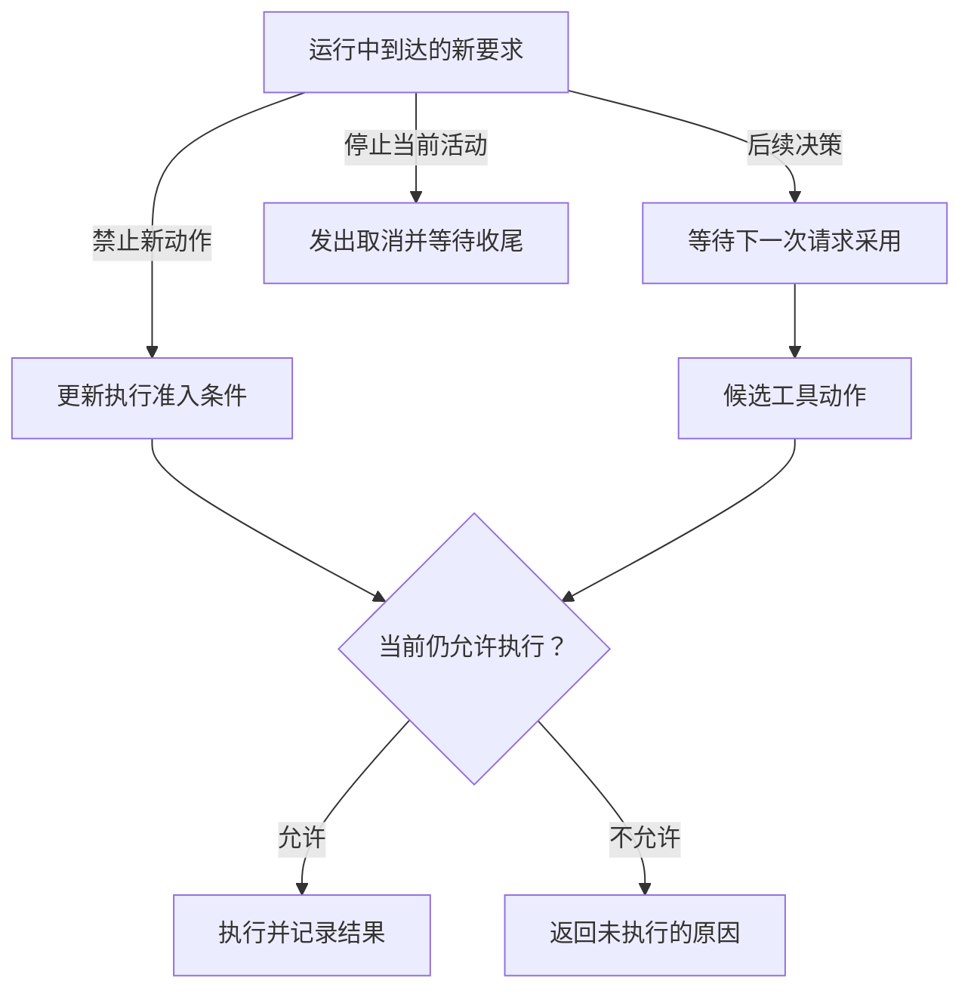
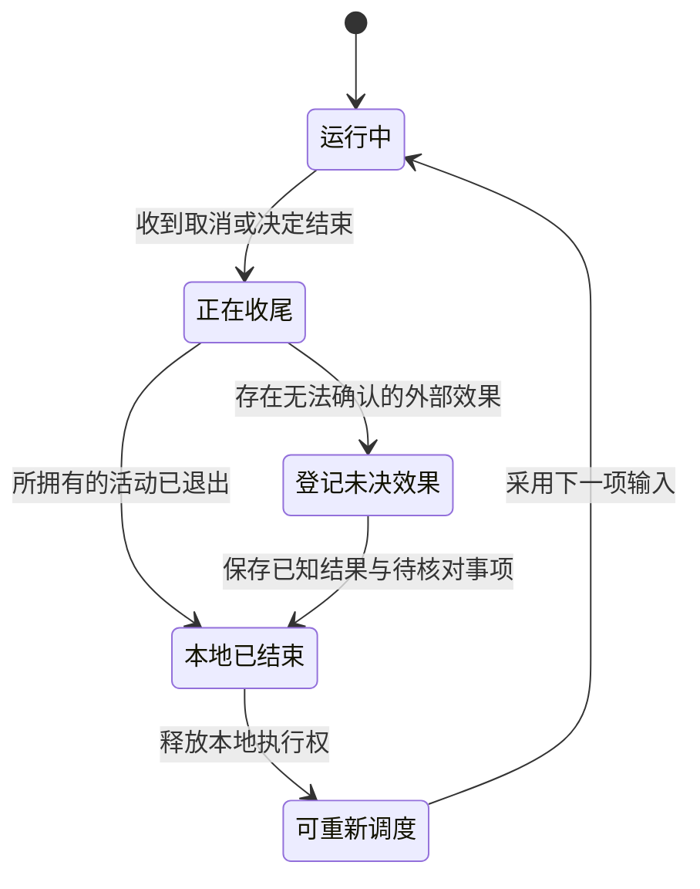
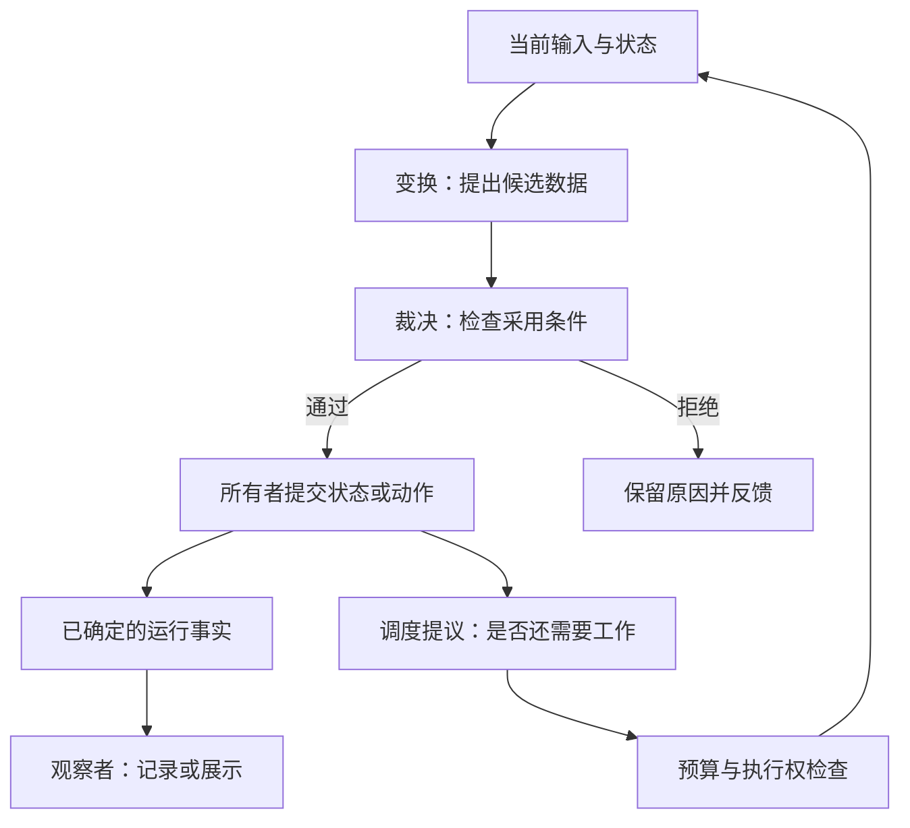
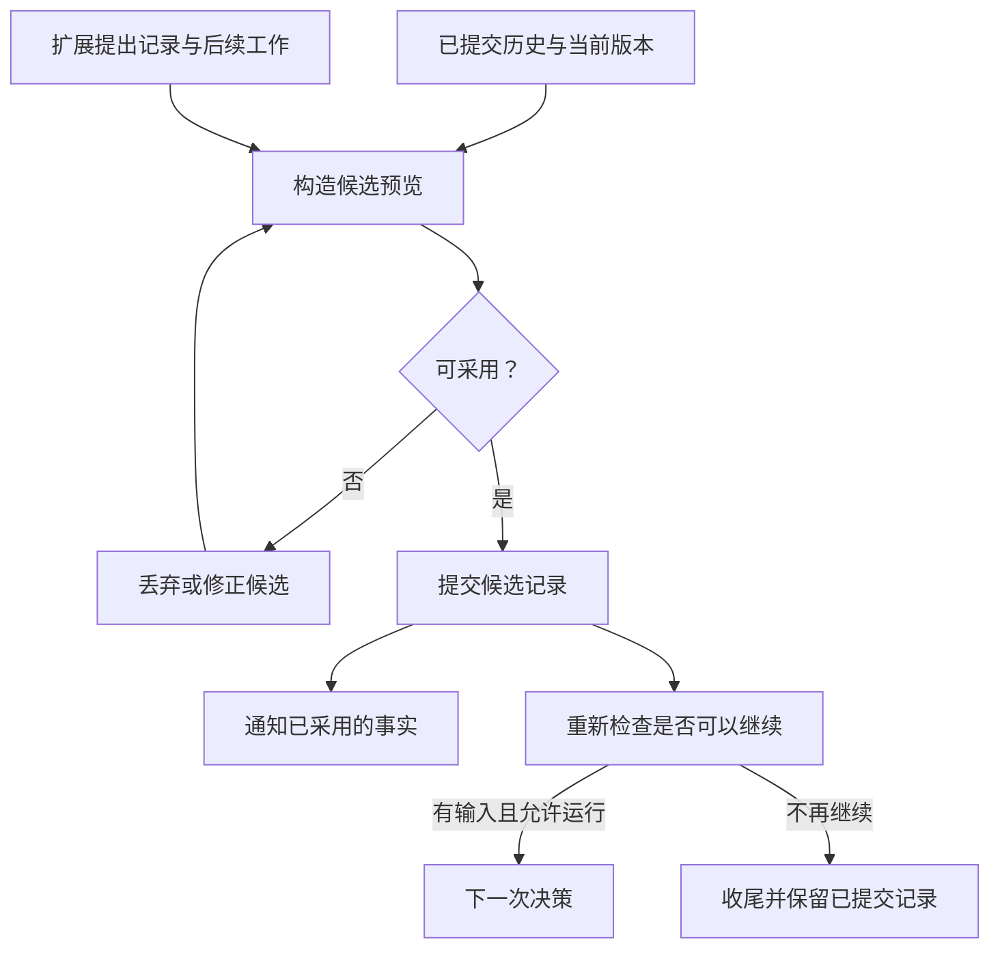
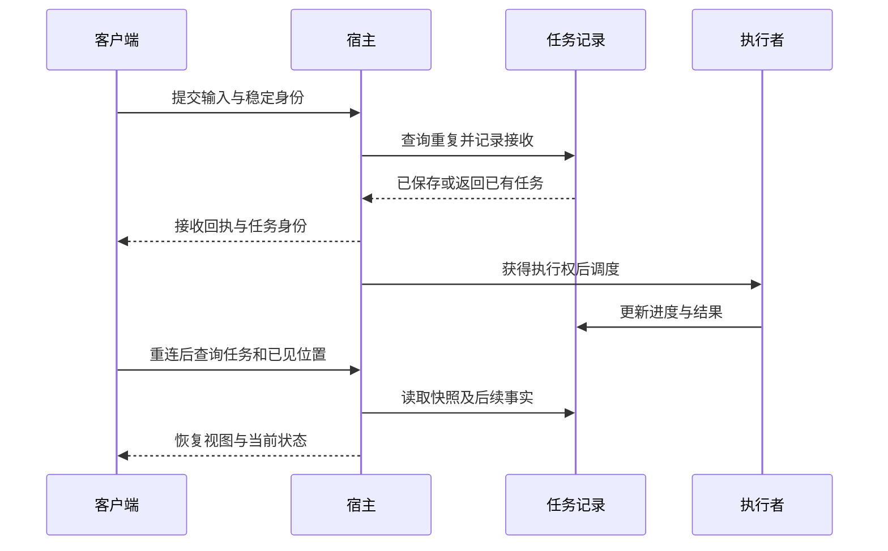
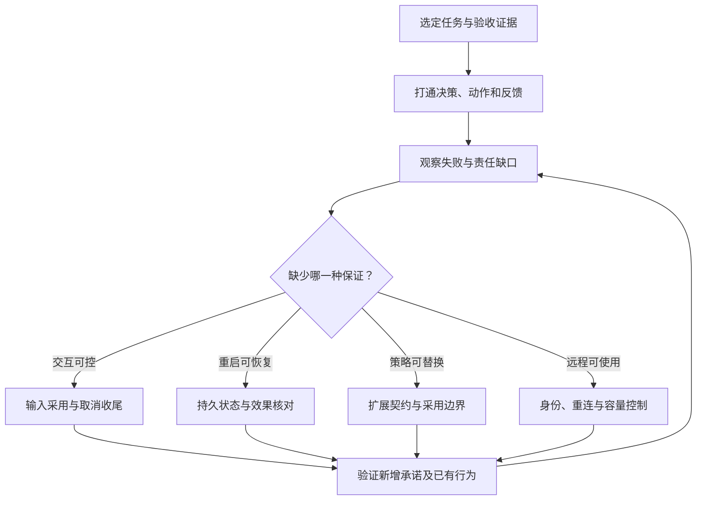

## 用户改了主意，程序怎么办

Agent 正准备修改代码，用户补充了一句 *先别改文件*。程序收到这句话以后，应该怎么办？已经发出的模型请求看不到它，正在执行的工具也不会因为聊天窗口多了一行文字就停下。另开一次运行来处理，又可能让两个执行者同时修改工作区。要把这句简单要求落实到代码里，需要先分清：谁在推进任务，新输入什么时候参与决策，哪些操作必须立即拦住。

本篇接着[执行内核](/post/Pi执行内核/)与[会话与上下文](/post/Pi会话状态/)，源码仍固定在 [Pi v0.87.1](https://github.com/earendil-works/pi/releases/tag/v0.87.1)，提交为 `f07218c4d4bbc12bef056a7058c3dd49dfe41abe`。前两篇讨论了模型怎样调用工具，以及下一轮怎样使用历史。现在把用户和扩展放进运行过程，看看它们中途提出要求时，程序如何接住。

### 同一时刻，谁决定下一步

假设同一个会话允许两次运行同时读历史、调用模型，最后各自写入结果。第一次根据旧文件提出修改，等待模型的这段时间里，第二次却把文件重命名了。两次运行各自都按自己的记录做事，合在一起却冲突了。即使 JavaScript 只有一个线程，多次 `await` 之间仍然会发生这种交错。

对于共享工作区的交互任务，可以先采用 ***单一执行所有者***：同一时刻只让一个运行过程决定下一步，新输入交给它处理。Pi 的基础 Agent 在已有活动运行时拒绝新的直接请求，并一直保留活动标记，直到执行和收尾结束，见与。这样会话里的决策顺序是清楚的，文件访问再由资源层协调。

需要并行时，再看哪些工作可以独立进行。两个 Agent 分别检索资料，只返回建议，汇总时处理意见分歧即可。两个 Agent 都要直接修改文件，就需要独立工作区，或者在提交时检查修改基准。是否能并行，取决于它们怎样使用共享资源，而不只是给它们分配了不同角色。

跨进程接管还会多一个问题：旧进程只是网络断了，新进程接手以后，它又恢复运行。此时新进程里的 `running` 标记管不到旧进程。可以给每次接管分配新的执行代次，让提交端拒绝旧代次请求。已经发到外部服务的操作，则继续按稳定身份查询和去重。这样接管以后，旧进程就无法继续以原身份提交修改。

### 新消息什么时候被读到

运行中收到 *先别改文件*，与收到 *完成后再跑测试*，顺序要求不同。前一句希望尽快改变接下来的动作，后一句允许当前工作先做完。队列需要表达这种区别，否则只是把所有文字按到达顺序塞在一起。

Pi 用 steering 和 follow-up 区分这两类输入。steering 在后续决策点读取，follow-up 则等当前循环原本可以结束时再进入。具体到执行位置，steering 通常要等本轮整批工具处理完，才交给下一轮模型。因此，它不会中途改写已经发出的请求，也不会逐个抢占同批工具。准备下一轮也可能耗时，Pi 还会在准备后有条件地补读一次，接住这期间到达的输入，见与。

这样安排，模型每次都能先看齐上一批工具结果，再结合新要求做决定。代价是用户要等当前批次处理完。如果产品要求点击停止写入以后，不再启动任何新写操作，就应立即修改控制状态，并让每次写入前检查它。只把一句话放进 steering 队列，生效得太晚。两种输入可以来自同一个界面，但自然语言用来调整后续决策，停止命令则要直接限制执行。



沿图可以看到，同一句用户要求可以触发不同处理：

- 交给模型，让下一轮重新安排工作
- 更新写入限制，拦住尚未开始的修改
- 发出取消信号，等待当前活动退出并收尾

需要确定执行的限制，由程序检查。模型再根据限制调整方案，例如改为只读分析。

Pi 的输入队列保存在内存里，会话消费消息时才更新显示队列，见。界面已经显示收到时，消息可能还在排队，尚未进入模型请求。是否已经写入磁盘，则要看会话的保存时机。需要可靠接收时，可以给每条输入分配 ID，并记录这些进度。客户端重复提交时，就能返回原来的状态，而不必再排一次队。

下面把模型响应固定为结束，只看每次请求实际读到了哪些用户消息。逐条读取 steering 时，两条消息分别带来一次决策机会。合并读取时，它们一起进入第一次请求。follow-up 则等前面的工作可以收尾后再进入。输出中可以直接看到这个顺序。


```javascript
import { Agent } from "@earendil-works/pi-agent-core";
import { AssistantMessageEventStream } from "@earendil-works/pi-ai";

const user = content => ({ role: "user", content, timestamp: 0 });
const text = message => typeof message.content === "string"
  ? message.content
  : message.content.filter(c => c.type === "text").map(c => c.text).join("");

async function run(mode) {
  let request = 0;
  const agent = new Agent({
    steeringMode: mode,
    streamFn: (model, context) => {
      const inputs = context.messages.filter(m => m.role === "user").map(text);
      console.log(`${mode} #${++request}: ${inputs.join(" | ")}`);
      const message = {
        role: "assistant", content: [{ type: "text", text: "done" }],
        api: model.api, provider: model.provider, model: model.id,
        stopReason: "stop", timestamp: 0,
        usage: { input: 0, output: 0, cacheRead: 0, cacheWrite: 0,
          totalTokens: 0, cost: { input: 0, output: 0,
            cacheRead: 0, cacheWrite: 0, total: 0 } },
      };
      const stream = new AssistantMessageEventStream();
      stream.push({ type: "done", reason: "stop", message });
      return stream;
    },
  });
  agent.steer(user("one"));
  agent.steer(user("two"));
  agent.followUp(user("later"));
  await agent.prompt("start");
}
await run("one-at-a-time");
await run("all");
```

```plaintext
one-at-a-time #1: start | one
one-at-a-time #2: start | one | two
one-at-a-time #3: start | one | two | later
all #1: start | one | two
all #2: start | one | two | later
```


逐条处理，模型有机会在两条输入之间给出反馈，但请求次数也更多。合并处理减少往返，却需要在同一轮解释冲突。例如用户先说允许修改，紧接着又撤销允许，程序应保留它们的先后关系。可编辑的待办可以替换或取消，控制指令则应记录何时生效。把队列压成一段最新文字，会丢掉这些差别。

<!-- TODO: 放在队列合并讨论之后。画三条平行时间线：用户输入、模型请求、工具批次；标出请求发送后到达的“先别改文件”，用虚线连接下一次请求的采用点。另画一条到工具准入检查的短路径，说明控制命令可阻止尚未开始的写入；已开始的工具用阴影区标出，旁注“是否可中止取决于执行端”。图注：收到输入、采用输入与阻止动作发生在不同边界。 -->

### 点了取消，还要等什么

取消之前，先看要停的是哪项工作。关闭客户端，只是没人继续接收输出。中止本地 HTTP 请求，也可能只是停止等待。已经提交到远端的构建还在运行，需要调用它的停止接口，再查询是否结束。因此，状态里应分别说明：

- 本地是否结束
- 远端是否停止
- 已经确认的效果

实现上可以把取消分成 ***请求停止*** 和 ***确认收尾***。先停止派发本次任务的新工作，通知正在运行、支持取消的活动。然后依次收尾：

1. 等待本范围拥有的活动退出
2. 记录已经确定的结果
3. 释放资源

如果某项远程操作还查不到结果，就留下未决记录。已经发生的修改若需要撤回，则再执行补偿，例如删除刚创建的临时资源，并保存补偿结果。

Pi 的核心取消会发送中止信号。会话层还要中止重试等待、压缩和分支摘要，再等待会话空闲，见。从这里可以看出，创建后台活动的那一层，也要负责把它纳入收尾。工具启动了远程任务，就由工具执行端处理停止与查询。剩余排队输入则由产品决定保留还是撤销。



图里本地运行可以先结束，同时保留远端待核对项。界面应如实显示本地已停止，但还有操作需要确认。若新任务要改同一资源，就先处理这项未决操作，避免新旧修改撞在一起。

收尾代码本身还可能死锁。假设执行循环要等结束监听器返回，监听器又在等循环进入空闲，双方就谁也走不下去。Pi 的核心事件监听器就在执行等待链里，活动标记要到最后才释放。因此，会话层另设了收尾后的通知，并推迟通知期间提出的新动作，见与。设计类似接口时，要说明：

- 回调能否等待运行结束？
- 能否同步启动下一轮？
- 回调返回是不是当前状态转换的一部分？

有了这些约定，调用方才知道哪些事可以在回调里做，哪些必须等回调返回以后再做。

### 重试到什么时候为止

先分清重试的是哪一层：

- 模型请求失败后，再发起一次请求
- 工具执行失败后，再执行一次操作
- 整个任务超时后，从头运行一次

越往外重试，重复的工作越多。整项任务重来之前，必须先确认内部哪些修改已经完成。否则，本来只是一次模型请求失败，却可能把成功的文件操作也做了一遍。

Pi 的会话恢复会保留失败尝试的原始记录，在后续请求中省略它，等待一段时间后继续调用模型，见。此前记录过的工具结果仍然保留，因此这条恢复路径不会直接重放整个工具批次。如果新的模型响应又提出类似操作，业务去重仍由工具服务依据稳定身份处理。

重试次数还会相乘。外层最多尝试三次，每次又让内层最多请求三次，最坏就是九次服务调用。可以由任务统一维护截止时间和剩余预算，各层只在这个范围里重试。排队已经花掉大半时间的请求，也应使用剩余时间，不能真正开始时又领到一份完整超时。

等待间隔则影响重试时的负载。许多客户端同时失败，固定等待一秒，就可能一秒后再次一起涌入。加入抖动可以分散请求，AWS 用竞争写入的模拟展示了这个区别，见[Exponential Backoff And Jitter](https://aws.amazon.com/blogs/architecture/exponential-backoff-and-jitter/)。但等待只能解决一部分失败，其他情况要换处理方式：

- 网络拥塞适合延后
- 操作前提不成立适合重新取证
- 权限不足需要改变方案或请求授权

重试等待也必须能取消。用户已经停止任务，计时器到期后不能又自动开始。一次模型调用成功，可以重置该端点的连续失败计数，但整个任务已经花掉的时间和费用要继续累计。前者帮助判断还值不值得继续试这个端点，后者限制整项任务的消耗。

### 新输入一直来，旧工作怎么办

如果 steering 一直有新消息，follow-up 就可能一直等不到执行机会。单个用户持续改变主意时，这符合交互意图。输入来自文件监听器或多个客户端时，却可能让低优先级工作永久等下去。扩展不断提出再检查一次，也会让任务无法结束。优先级之外，还需要安排让出执行机会的时机。

长期服务可以给一次运行分配时间或轮次额度，用完后保存进度，再回到调度队列。重复的监听触发可以合并，过期建议可以丢弃。但切换前仍需等当前操作收尾，不能把半次写入留给下一个执行者。暂时暂停和用户撤销也应分别记录：前者以后还要继续，后者已经不需要完成。

估算负载时，队列里有多少条任务也不够。读取一份文件和运行半小时的修复，都只算一条任务，成本却相差很大。Google SRE 的[Handling Overload](https://sre.google/sre-book/handling-overload/)从实际资源消耗和客户配额讨论过载。对 Agent，可以观察：

- 活动模型请求
- 工具并发
- 工作区占用
- 输出积压
- 预计剩余时间

先找出真正拖慢系统的资源，再决定限制放在哪里。

容量不足时，可以：

- 拒绝新任务
- 让用户选择排队
- 降低非必要检查频率

Pi 的内存队列已经能安排一个交互会话里的输入顺序。把它变成服务以后，再由宿主补上接收和调度规则。扩展加入后也要经过这些规则，不能通过一个回调就另外启动不受管理的运行。

## 扩展可以改变什么

假设现在要加一个代码审查扩展，可以做成三个版本：

- 任务结束后展示提示，扩展只观察事实
- 检查结果让 Agent 继续修改，扩展可以提出新任务
- 发现风险就阻止写入，扩展可以否决外部动作

代码里都可以叫 hook，但它们影响执行的方式差别很大。只通知用户，与有权阻止写入，不能使用含糊的同一套约定。

所以设计扩展接口时，先决定回调能改变哪一步，再决定在哪里调用它。返回值是否被采用、抛错以后是否继续，都应由接口写清楚。否则扩展作者每次都要翻核心调用点，才能知道这次回调有什么作用。

### 哪些回调需要等

先看最简单的观察回调：任务结束后刷新界面。它暂时失败，通常不应阻止任务继续。检索扩展则不同：模型下一次请求要使用它找来的材料，就必须等待，或者在超时后选择替代做法。判断是否等待，要看后续步骤是否依赖返回结果，而不是看函数有没有 `async`。

接口可以按用途分开：

- 通知：只读已确定的事实，负责展示或记录
- 变换：将输入转换成候选输出，返回值参与后续计算
- 裁决：检查是否允许继续，并给出尚未满足的条件
- 调度提议：请求在未来增加一次工作，由所有者决定是否采用

每类接口再规定等待方式和失败处理，扩展作者就知道自己的代码会不会挡住主流程。

Pi 的工具调用前回调和结果变换就有不同约定。调用被阻止以后，处理链会提前结束。结果变换则把上一处理器的输出传给下一个，见。读源码时，顺着返回值往下看，比只记住事件名字更容易理解这些入口。

观察接口也可能意外获得修改能力。如果传进去的是共享对象，回调就能改掉其他消费者看到的内容。如果核心一直等待一个统计回调，它就能拖住整个任务。需要隔离观察者时，可以分别处理：

- 不可变快照保护事件内容
- 独立缓冲隔开消费速度
- 失败处理与超时规则决定观察者何时退出

这些措施应当随接口一起实现，而不只是要求扩展作者自觉遵守。



图中，扩展先返回提议，由当前运行决定是否采用，再进入检查和执行。这样，策略可以替换，推进任务的入口仍然只有一个。若每个回调都能随时重入主循环，新的执行就可能赶在旧状态保存之前开始，很难再判断各次修改依据的是哪份状态。

### 多个策略怎样组合

再加第二个扩展：一个截短日志，一个提取失败原因。先截断再提取，关键报错可能已经没了。先提取再截断，诊断就能保留。对于这种处理链，注册顺序会改变结果，因此顺序要作为配置保存，并在测试里覆盖。

不同操作也需要不同的组合办法：

- 多个检索器可以合并带来源的候选证据，再统一去重和截断
- 多个独立权限限制通常取交集，任一必要条件不满足就不能执行
- 互相竞争的改写规则可以规定优先级，也可以在冲突时要求上层决策

例如权限检查不能简单采用最后一个返回值。前面因为目录越界拒绝了，后面因为预算充足允许了，最后就可能错误放行。两项条件都必须满足时，就明确把结果按逻辑与组合。

Pi 的不同入口各有组合规则。工具调用一旦被阻止，就短路返回。边界上的继续标志和草稿数组，则可以由后续处理器替换，显式 `false` 能覆盖前面的 `true`，见。使用后者时，处理器要先读懂已有提议，再决定保留还是替换。要完整记录被短路的调用，则应订阅最终结果，不能依赖后续检查器一定会被调用。

失败也会受共享对象影响。一个扩展先修改对象，再抛异常，`catch` 只能接住异常，已经做出的修改还在。Pi 会先复制原始上下文，保护会话历史，但处理链内部仍共享工作对象，见。因此，失败处理器留下的修改仍可能被后面的处理器看到。

如果希望扩展失败后完全丢弃它的改动，可以每一步使用独立副本，成功后再替换当前状态。也可以传入不可变数据，让扩展返回补丁，验证后再应用。补丁还应标明针对哪份数据，避免改到已经变化的位置。准备阶段只计算数据，外部写入留到采用以后，失败时才有可能简单地丢掉候选。

捕获异常以后继续还是停止，要看扩展负责什么。可选的文本润色失败，可以使用原文继续。写入许可检查失败，就应暂停写入，否则这项许可形同虚设。需要降级时也说清范围，例如仍允许读取，但暂时禁止修改。不能用一个统一的 `catch` 替所有扩展做决定。

<!-- TODO: 放在策略组合小节末尾。左侧画“提取诊断”和“截断日志”两个方块，上下两条路径交换顺序，右侧分别标出“保留原因”和“原因已丢失”；下方另画两个许可条件汇入“全部满足”，避免与上面的顺序覆盖混淆。图注：不同扩展操作需要不同组合规则，固定顺序只解决可重复性。 -->

### 先看看扩展准备改什么

代码审查发现遗漏后，扩展希望保存审查结果，再让 Agent 补上检查。如果直接分三步修改历史、发消息、启动执行，中间失败就可能只做成一部分。例如界面已经标记处理完成，实际后续工作还没开始。可以先把这次准备做的变更放在一起，交给核心检查。

这就是 ***候选变更*** 的用途。扩展返回审查记录和下一轮反馈，核心先把它们应用到临时视图里，检查能否构造合法请求，再决定采用。这样先看清即将发生的变化，再修改真实会话。

Pi 的边界草稿会从当前分支构造内存预览，应用草稿后检查模型上下文和待办消息，见。其中，普通自定义记录可以保存审查状态，默认不生成模型消息。自定义消息才会把内容交给下一轮模型。下面用同版本会话对象比较两者，原始历史保持不变。


```javascript
import { SessionManager, convertToLlm } from "@earendil-works/pi-coding-agent";
import { fauxAssistantMessage } from "@earendil-works/pi-ai";

const history = SessionManager.inMemory();
history.appendMessage({ role: "user", content: "review the change", timestamp: 0 });
history.appendMessage(fauxAssistantMessage("initial answer"));

function show(label, manager) {
  const messages = convertToLlm(manager.buildSessionProjection().messages);
  console.log(`${label}: entries=${manager.getEntries().length}, last=${messages.at(-1).role}`);
}
const preview = SessionManager.inMemory(process.cwd(), undefined, [
  history.getHeader(), ...history.getBranch(),
]);
show("history", history);
preview.appendCustomEntry("review-state", { pending: true });
show("metadata", preview);
preview.appendCustomMessageEntry("review-request", "check the missing case", false);
show("message", preview);
show("history", history);
```

```plaintext
history: entries=2, last=assistant
metadata: entries=3, last=assistant
message: entries=4, last=user
history: entries=2, last=assistant
```


`metadata` 增加了记录，模型可见内容却仍然以 assistant 结束。换成 `message`，才多出一条用户角色输入。因此，保存待检查标记以后，还需要把相应要求放入模型请求。模型无法处理它根本没有收到的元数据。



图里先保存记录，再决定是否继续。假设保存审查结果后用户立即取消，正确行为就是保留审查记录，同时停止后续修改。Pi 的收尾边界也先提交草稿，再检查这期间的取消状态，见。将这两步分开，恢复时才知道哪些已经发生。

Pi 会向真实会话依次追加草稿，然后刷新上下文并通知订阅者，见。如果业务要求整组记录一起生效，可以增加提交标记，只读取完整提交的记录组，或者使用事务存储。通知放在保存之后，通知失败就补发已有记录，不要重做对应的业务操作。

预览期间如果还允许修改会话，就要检查候选有没有过时。可以选择：

- 要求基准版本保持不变
- 重新检查候选真正依赖的部分
- 合并新增输入，重新构造预览

整个预览期间锁住会话最简单，但等待外部审查服务时，用户也要一起等。允许后台准备候选，采用前再检查版本，交互更流畅，只是需要处理过期结果。把耗时计算与最后采用分开，能把必须串行的部分缩小。

### 在哪里检查最终权限

假设扩展 A 检查路径，确认它在允许目录里。扩展 B 随后把路径改到另一个位置，工具最后按 B 的参数执行。两者即使都没有恶意，也会绕过原来的检查，因为检查和执行针对的不是同一个文件。权限检查应放在参数变换完成之后，并针对真正访问的资源。

Pi 会先做 schema 验证，再运行调用前回调，最后使用准备好的参数执行。回调之后，这条路径不会再完整做一遍相同的 schema 验证，见。应用若允许回调改写参数，就应验证改写后的值，再由资源接口检查权限。格式正确和允许访问分别检查，检查对象都要与最终动作一致。

因此，强制限制应交给实际控制资源的一层，例如：

- 受限文件接口只暴露允许范围的资源句柄
- 远程工具服务在每次操作时检查任务身份与授权
- 独立进程结合受限身份或沙箱，限制插件能直接接触的资源

Pi 的扩展直接加载进宿主进程，模块初始化也在宿主环境中执行，见。它们适合可信代码之间合作，并拥有宿主进程的权限。工具阻止回调可以约束正常的调用流程，却管不住扩展自己直接访问文件。要加载不可信租户代码，就需要进程隔离和受限资源接口。

被拒绝的调用也应留下记录，否则审计只会看到真正执行过的部分。Pi 的准备失败和调用阻止会直接生成结果，跳过已执行工具的完成处理，但仍发出工具结束和结果消息，见。因此，要覆盖所有情况，就订阅这些最终结果。记录时也分清：

- 请求：提出了候选动作
- 获准：通过执行条件检查
- 开始：实际进入执行
- 效果确认：取得了可核对的操作结果

这样，看到一条失败记录，就能判断它是被拒绝了，还是开始执行以后出了错。

### 什么适合做成扩展

前面这些例子说明，少量回调也可能让核心变得复杂。同样是处理器抛错，结果可能是回退到原文，也可能是留下已经修改的工作对象。核心的简单程度，要看装上多个扩展以后，是否仍能解释执行顺序和失败结果。

Pi 提供模型调用和工具循环等基础机制，让应用与扩展决定具体工作方式。本地用户可以理解并控制自己的扩展，组合起来很灵活。迁移到多人服务时，再由宿主承担用户身份和资源隔离，不能把本地信任条件直接搬过去。

适合外置的是可替换的策略，例如针对某个项目的检索方式或审查规则。所有执行路径都必须遵守的权限检查，则需要一个确定会运行的位置。把它放进可选插件，再假设大家都会安装，系统就可能在缺少插件时照常启动并执行。

可以用一个问题判断：移除扩展后，只是少了一项能力，还是会违背产品已经保证的行为？前者可以选装。后者应作为启动时必查的依赖，或者直接放进核心。这样既保留扩展空间，也知道关键规则由谁负责。

## 接到产品里，还缺哪些工作

到目前为止，Agent 已经能运行，也能接收中途干预。真正接到产品里，还会遇到：

- 用户会在结果出现前断线
- 两个界面会同时打开同一任务
- 客户端有不同的消费速度
- 扩展更新也会改变行为

这些情况需要宿主配合处理，不能只测试模型与工具之间的循环。

仍以修复仓库为目标。我们希望用户可以补充要求、停止执行，断线重连后还能知道刚才发生了什么。下面沿着创建会话、接收输入和返回结果，把整条路径补齐。

### 谁创建，谁收尾

宿主先为执行内核准备运行环境。例如指定工作区，再把相应的存储和访问能力传给会话。

如果工具从全局变量读取这些配置，创建两个会话也未必真正独立。例如一个会话改了当前目录，另一个的相对路径就可能指向别处。最好在组装时把依赖明确传入，知道哪些共享，哪些属于单个任务。

启动时可以依次：

1. 准备资源
2. 构造运行对象
3. 订阅必要事实
4. 开放输入

开放输入放在最后，初始化失败时就还没有接下用户任务。Pi 的 SDK 将依赖组装成会话后返回，不会自动开始一次模型请求，见。调用方因此可以先绑定必要订阅，再决定什么时候启动。

依赖传进来以后，还要约定谁关闭它。例如多个会话共享数据库连接，关闭一个会话就不应把连接一起关掉。工具启动的后台服务，也可能需要在这一轮结束后继续工作。可以按使用范围管理：

- 共享资源由外层持有生命周期
- 单任务资源由任务范围管理
- 跨任务后台服务拥有独立身份，通过状态查询与回收协议管理

关窗口时该停止什么，也就有了明确依据。

切换会话很容易暴露这类问题。旧工具还在运行，界面却已经指向新会话，迟到的旧事件就可能显示在新页面里。切换时应按顺序交接：

1. 停止旧输入
2. 收尾旧运行
3. 解绑旧订阅
4. 替换状态并绑定新订阅

事件再带上会话身份，消费者就能过滤迟到数据。Pi 在替换时会先中止并等待旧会话，通知关闭并释放对象，然后创建和绑定新会话，见。

这个顺序还有一个结果：新会话创建失败时，旧会话已经释放，需要向用户报告失败并允许重试。如果要求切换失败后仍能使用旧会话，可以先准备新对象，成功后再交接资源。不过准备期间不能让两个会话同时修改同一工作区。是否值得增加这层处理，取决于产品对切换失败的要求。

### 收到请求以后，还要返回结果

用户点击提交，没有收到响应，于是又点了一次。第一次请求可能根本没到，也可能服务端已经开始执行，只是回执丢了。给这次输入一个稳定 ID，第二次提交继续使用它，服务端就能查到这是同一项要求，并返回已有状态。没有这层关联，就很难同时避免重复执行和漏掉请求。

实现时，不同 ID 各自解决不同问题：

- 命令 ID 把响应对应到某次调用
- 任务 ID 让客户端断线后还能查询同一任务
- 输入 ID 用来识别同一条要求的重复提交
- 事件位置说明客户端已经接收到了哪里

还要约定同一输入 ID 却带不同内容时如何处理，以及去重记录保存多久。否则客户端以为可以重试，服务端却可能早已忘记这次输入。

Pi 的 RPC 在输入通过预检查后就可以返回成功回执，无论输入随后排队还是立即处理，任务进度都通过后续事件报告，见。因此，这个回执确认的是请求通过预检查，完成结果还要继续等。接到网络服务时，可以在外层增加持久接收记录，让客户端重连后查询这条输入。



图中先保存输入，再返回确认。使用唯一约束或事务把查重与写入放在一起，并发提交同一个 ID 时也只产生一份记录。客户端重连后先查原来的 ID，接着读取进度。确实要开始另一项操作时，再生成新 ID。

恢复页面时，可以先取当前快照，再接后续事件。快照应注明已经包含到哪个位置，事件从它后面开始，才能避免重复或漏掉更新。临时生成文字若没有持久保存，可以重新显示最后完成的消息和当前状态，不必永久保存每个字符。需要逐字回放时，再把增量纳入持久记录。若客户端的位置已超过保留期限，就要求重新同步快照，别悄悄跳过缺失部分。

### 网页太慢，会不会拖住执行

一个任务可能同时把事件发给多个消费者，它们的要求不同：

- 网页需要足够流畅地展示当前状态
- 审计记录需要完整事实
- 模型下一步需要已确定的工具结果

如果全部等最慢的消费者，网页卡顿就会拖住任务。如果一律不等，积压又可能耗尽内存。随意丢事件，则可能连恢复所需的结果一起丢掉。应当按数据用途分别处理：

- 临时渲染状态允许合并，例如只绘制最新的完整预览
- 带因果含义的追加事件按顺序保留，或通过新快照恢复
- 必须保存的结果进入有明确失败行为的记录路径

不同分支各自设容量限制，避免一个慢页面占满所有缓冲。达到上限以后，再明确选择：

- 暂停生产
- 将积压数据落盘
- 断开慢订阅者
- 切换为快照模式

Pi 在 JSON 事件传输中省去了每次增量附带的累计快照，发送起始消息、后续增量和最终完整消息，见。这样文本越来越长时，不必反复传送全文。消费者在中间阶段按增量更新预览，结束时再用完整消息校正。

RPC 还会串行等待标准输出写入，并让核心事件监听器等待这条输出链，见与。输出慢下来，核心就会在事件等待点停住。这就是背压。但还应继续向上看：核心停住期间，供应商流是否仍在接收，网络缓冲是否还在增长。每一段会积压的地方，都需要容量和满载处理。

控制命令最好别排在大量显示更新后面。否则执行端明明支持取消，用户的请求却还堵在客户端队列里。可以给控制命令单独的处理机会，再由任务所有者更新控制状态。排查取消延迟时，分别测量：

- 界面响应时间
- 取消请求到达时间
- 效果停止时间

<!-- TODO: 放在慢消费者小节末尾。左侧为运行时，中间分三条输出路径：上方“临时预览”经过可合并缓冲到页面，中间“已确定结果”进入持久记录再到恢复接口，下方“指标”进入有界采样队列；用红色短线标出各自满载后的处理。另画从客户端到运行所有者的取消箭头，不穿过显示缓冲。图注：不同消费者保留不同历史，控制请求不应被显示积压淹没。 -->

### 出错以后，从哪里查起

最后要看整套系统是否把任务做对。发现失败时，可以沿执行过程定位：

- 从未读到关键文件，需要调整上下文选择
- 读到了文件却选错方案，需要检查模型决策
- 参数正确但工具没有应用修改，需要检查工具契约
- 修改成功却在保存前崩溃，需要完善恢复协议
- 界面给出了错误的完成说明，需要校正结果呈现

整体成功率告诉我们改动有没有帮助，具体失败位置才告诉我们下一步该改哪里。

诊断时最好能从最终文件一路查回去：这次修改属于哪次运行，对应哪个工具调用，调用又根据哪一轮模型响应产生。模型请求带上当时的配置，工具结果关联相应操作，整条过程就能接起来。接管发生过时，再用执行代次区分新旧运行。

时间记录帮助区分是在排队、生成还是收尾时等待。测试还应关联被测版本，否则后来改过文件，原来的通过结果就失去对应对象。按排查需要决定保存范围，优先留下能解释最终修改的记录。

Anthropic 的[Demystifying evals for AI agents](https://www.anthropic.com/engineering/demystifying-evals-for-ai-agents/)区分了运行轨迹与最终环境结果，并把模型和运行框架作为整体评估。放到代码修复里，最终回答说测试通过，是一条需要核对的陈述。相应版本的测试实际通过，才完成这项验收。如果两者不一致，就记录这个差异，继续查是哪一步把状态报错了。

验证可以分两部分。先固定模型输出和工具反馈，检查程序面对故障时是否按设计工作，例如：

- 工具参数还没生成完整时，不会开始执行
- 新执行者接管后，旧执行者的提交会被拒绝
- 调用被阻止后，仍有结果说明拒绝原因

这部分排除运行时本身的问题。然后再让真实模型完成代表性任务，看它能否在当前工具和上下文下找到有效方案。否则运行顺序正确，也可能一直做不对题。

| 故障位置 | 应检查的行为 | 观察证据 |
| --- | --- | --- |
| 请求发出前取消 | 停止派发，更新输入状态 | 请求发送次数与输入终态 |
| 效果完成后丢失响应 | 登记未决效果，再查询核对 | 操作身份、资源状态与核对结果 |
| 提交记录后通知失败 | 从记录恢复并补发通知 | 提交记录、消费位置与效果次数 |
| 一个扩展超时或抛错 | 按契约停止或降级 | 后续执行轨迹与工作状态 |
| 客户端持续慢读 | 达到容量上限时执行满载策略 | 队列长度、内存占用与调度延迟 |

表里的预期应按产品要求填写。例如界面通知超时，可以丢掉一次刷新。写入许可检查超时，则应暂停写入。测试要检查这些对用户有意义的行为，避免只把当前事件顺序逐字录下来。后者容易在合理重构时失败，却漏掉真正丢记录的问题。

真实任务可以固定一组案例，多次运行并记录：

- 成功分布
- 耗时
- 模型与工具消耗
- 用户介入次数

再根据具体失败查找原因。各轮使用独立环境，避免上一轮留下的修改影响下一轮。如果就是要测试持续记忆，则明确允许继承哪些状态，再在同样条件下比较。

改动的收益也要一起比较：

- 增加工具调用预算可能提高完成率，也可能让简单任务变慢
- 更激进的压缩可能省输入，却丢掉决定成败的约束
- 用更长系统提示描述每个失败案例可能修好旧题，却妨碍新任务

比较时，在相同任务条件下同时记录质量与成本，才能看出改动是否划算。必须满足的执行限制则单独验收，不能用其他任务的高分抵消一次越权写入。

### 先把一条路径走通

从零实现时，可以先选一个明确任务，例如修复一个可复现的错误。准备能访问相关文件的工具，再用测试判断修改是否有效。模型提出修改后，先检查工具是否真的写入，再看新代码是否通过测试。即使中途失败，也应留下足够记录，说明已经做到了哪里。

先把这条路径做完整，后续增加的机制才有明确落点，也更容易看出新问题出在哪一层。

接着按实际需要补充：

- 任务需要中途纠正，加入输入采用与取消范围
- 需要跨进程继续，定义持久接收与恢复协议，记录未决效果
- 需要多种业务策略，划分扩展的变换与裁决
- 需要远程客户端，建立连接恢复与容量管理机制

每加一项，都能用一个具体场景检查。例如加了恢复，就让进程在写完文件、记录结果之前退出，看看重新启动后是否会重复修改。



本地一次性任务可以使用很薄的宿主。长期共享工作区的服务，则要更早处理接收和隔离。Pi 让这些取舍有了可以逐行查看的实现。读它的价值，是看清一个机制在什么问题出现时才变得必要，再把相应做法放进自己的系统。

回到开头，用户说 *先别改文件* 以后，系统先记录这条要求，限制新的写入，再让模型根据当前状态调整计划。已经开始的操作则继续收尾或核对，并把结果交代清楚。

做到这里，用户才知道这句话已经怎样影响程序，也知道接下来还会发生什么。模型负责选择解决问题的路径，运行时负责让这些选择有顺序、能核对，并在需要时停下来。
