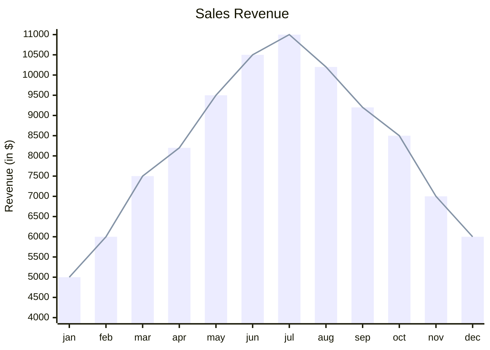

This article is mainly for testing purposes.

## Style Test

Lorem ipsum dolor sit amet, consectetur adipiscing elit. Donec scelerisque posuere sem in convallis. Sed in diam et nulla scelerisque dapibus. Sed ullamcorper nibh ac erat mattis placerat. Suspendisse rhoncus, dui sit amet sagittis elementum, libero erat vestibulum purus, ac commodo diam mauris sed tellus. Ut a ornare leo. In finibus sollicitudin velit sagittis facilisis. Nullam ullamcorper maximus rhoncus. Etiam pharetra varius lectus a finibus. Aenean laoreet placerat elit. Nam vitae enim id lacus suscipit malesuada id sed lorem.

```python
def test():
    print("Hello, world!")
```

Lorem ipsum dolor sit amet, consectetur adipiscing elit. Donec scelerisque posuere sem in convallis.

```plaintext
[config]
name = "test"

[config2]
name = "test2"
url = "https://google.com"
```

Lorem ipsum dolor sit amet, consectetur adipiscing elit. Donec scelerisque posuere sem in convallis.



Praesent condimentum ante non vehicula semper. Cras hendrerit porta tincidunt. Pellentesque habitant morbi tristique senectus et netus et malesuada fames ac turpis egestas. Aenean et elit vel erat gravida feugiat et sit amet nibh.

- Item 1
- Item 2
- Item 3
  - Subitem 3.1
  - Subitem 3.2
- Item 4

1. Item 1
2. Item 2
3. Item 3
   1. Subitem 3.1
   2. Subitem 3.2
4. Item 4

---

| Header 1 | Header 2 | Header 3 |
|----------|----------|----------|
| Content 1 | Content 2 | Content 3 |
| Content 4 | Content 5 | Content 6 |
| Content 7 | Content 8 | Content 9 |
| Content 10 | Content 11 | Content 12 |

Vestibulum dictum elementum posuere. Praesent [a cursus](https://google.com) tortor. Aliquam vehicula luctus quam eget hendrerit.


In tristique placerat purus $$1\times 3$$ at bibendum. Maecenas fermentum

$$
\begin{aligned}
\frac{1}{2} + \frac{1}{3} &= \frac{5}{6} \\
\frac{1}{2} - \frac{1}{3} &= \frac{1}{6} \\
\end{aligned}
$$

> nascetur ridiculus mus. Mauris dui ante, efficitur quis metus quis, dapibus pharetra sapien.
>
> ```cpp
> #include <iostream>
>
> int main() {
>     std::cout << "Hello, world!" << std::endl;
>     return 0;
> }
> ```
>
> Nulla sed malesuada purus. Orci `varius` natoque penatibus et magnis dis parturient montes, nascetur ridiculus mus.
>
> > In tincidunt pharetra porttitor. Nulla a eleifend [lorem](https://google.com), a placerat lorem.
>
> In tincidunt pharetra porttitor. Nulla a eleifend [lorem](https://google.com), a placerat lorem.
>
> - Item 1
> - Item 2
> - Item 3

## Test Title 1

Lorem ipsum dolor sit amet, consectetur adipiscing elit. Donec scelerisque posuere sem in convallis. Sed in diam et nulla scelerisque dapibus. Sed ullamcorper nibh ac erat mattis placerat. Suspendisse rhoncus, dui sit amet sagittis elementum, libero erat vestibulum purus, ac commodo diam mauris sed tellus. Ut a ornare leo. In finibus sollicitudin velit sagittis facilisis. Nullam ullamcorper maximus rhoncus. Etiam pharetra varius lectus a finibus. Aenean laoreet placerat elit. Nam vitae enim id lacus suscipit malesuada id sed lorem.

## Test Title 2

### Test Title 2.1

#### Test Title 2.1.1

##### Test Title
