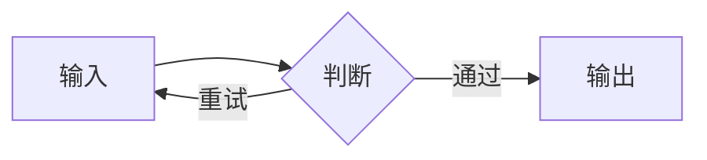

## 文字与层级

一套设计应当在连续阅读中成立。这里包含 **强调文本**、*斜体*、`inline_code`、[站内文章索引](/)、一个脚注[^design]，以及长链接 <https://example.org/a/very-long-path-for-testing-responsive-wrapping>。

### 次级标题

> 内容的主次、比例和间隔应当清楚。引用文字不应与正文争夺注意力。

- 第一层列表
  - 第二层列表
- 包含多个词语的另一个条目

<details><summary>展开补充说明</summary><p>折叠内容也需要清楚的边界、键盘焦点与展开状态。</p></details>

## 代码与表格

```javascript
const message = 'Bauhaus';
console.log(message);
const longLine = 'This deliberately long line checks wrapping and horizontal scrolling without extending the page width.';
```

| 项目 | 状态 | 说明 |
| :--- | :---: | ---: |
| 标题 | 清晰 | 主次有别 |
| 阅读 | 连续 | 行宽适中 |
| 交互 | 可用 | 键盘与触控 |

## 引用与仓库


静态博客中的每个组件都属于同一套阅读界面。







这是组件外观与长文字换行的本地检查示例。


## 图片与图表





/assets/post/images/card15.svg | 第一幅图
/assets/post/images/constellation12.svg | 第二幅图




$$ E = mc^2 \qquad \sum_{i=1}^{n} i = \frac{n(n+1)}{2} $$

$$ \underbrace{a_1 + a_2 + a_3 + a_4 + a_5 + a_6 + a_7 + a_8 + a_9 + a_{10} + a_{11} + a_{12} + a_{13} + a_{14} + a_{15} + a_{16}}_{\text{长公式应在本地横向滚动}} = S $$

## 可运行代码


```javascript
console.log('主题验收：运行成功');
```


## 文件结构


blog/
  assets/
    main.js
    theme.css
  index.html


## 源码与预览


```html
<button id="counter">计数：0</button>
```
```css
body { font-family: sans-serif; padding: 24px; }
button { padding: 12px 20px; background: #d74514; color: #171714; border: 0; }
```
```javascript
let count = 0;
document.querySelector('#counter').onclick = (event) => { event.target.textContent = `计数：${++count}`; };
```


## 嵌入页面



## 失败状态与恢复

以下图表故意使用无效语法，用于检查错误信息、源码保留和重试按钮。

```mermaid
this_is_an_intentionally_invalid_diagram
```

Python 示例用于验证运行环境准备、失败重试，以及重试后保留编辑内容。


```python
print('Python 已准备就绪')
```


[^design]: 这条脚注用于检查预览、关闭、键盘访问与返回正文。[相关说明](https://example.org/)。
